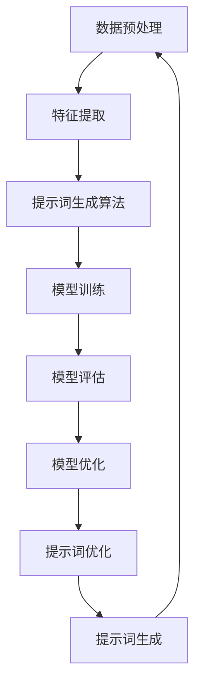

                 


### 文章标题

# AI编程语言：提示词的革命与未来

### 关键词

- AI编程语言
- 提示词
- 深度学习
- 自然语言处理
- 应用领域

### 摘要

本文旨在深入探讨AI编程语言的革命性变革及其未来发展趋势。我们将从AI编程语言的背景和发展现状入手，分析其核心特点和应用领域，然后探讨提示词技术在AI编程语言中的重要作用和未来发展方向。接着，我们将探讨AI编程语言在深度学习和工业界中的应用，并分享一些实战经验和最佳实践。通过本文，读者将对AI编程语言及其在人工智能领域的未来前景有更深刻的理解。

---

### 《AI编程语言：提示词的革命与未来》目录大纲

---

#### 第一部分: AI编程语言概述

##### 第1章: AI编程语言的兴起与发展

1.1 AI编程语言的背景与起源
1.2 AI编程语言的现状与趋势
1.3 AI编程语言的核心特点
1.4 AI编程语言的应用领域

##### 第2章: AI编程语言的基本原理

2.1 提示词的概念与作用
2.2 提示词生成算法
2.3 提示词优化方法
2.4 模型选择与调优

##### 第3章: AI编程语言的实现与开发

3.1 AI编程语言开发环境搭建
3.2 AI编程语言基础语法
3.3 实现AI编程语言的示例代码
3.4 AI编程语言项目实战

#### 第二部分: 提示词革命与未来

##### 第4章: 提示词革命：技术突破与应用创新

4.1 提示词技术的历史演变
4.2 提示词技术在人工智能中的应用
4.3 提示词技术的未来发展
4.4 提示词技术的挑战与机遇

##### 第5章: 未来AI编程语言展望

5.1 AI编程语言的未来趋势
5.2 新型AI编程语言的设计理念
5.3 AI编程语言在新兴领域的应用
5.4 AI编程语言的发展前景

#### 第三部分: AI编程语言项目实战

##### 第6章: 实现AI编程语言：从基础到进阶

6.1 基础概念与实现方法
6.2 进阶技巧与优化
6.3 项目实战案例一：智能助手
6.4 项目实战案例二：文本生成

##### 第7章: AI编程语言在深度学习中的应用

7.1 深度学习基础
7.2 提示词与深度学习结合
7.3 深度学习模型优化
7.4 实战案例：图像识别

##### 第8章: AI编程语言在工业界的应用

8.1 工业界对AI编程语言的需求
8.2 AI编程语言在工业界的成功案例
8.3 AI编程语言在工业界的应用挑战与解决方案
8.4 未来展望：工业界对AI编程语言的期待

#### 附录

##### 附录A: AI编程语言常用工具与资源

A.1 开发环境配置
A.2 常用库与框架
A.3 学习资源推荐

##### 附录B: Mermaid 流程图

B.1 Mermaid 基础语法
B.2 Mermaid 实例：提示词生成流程

##### 附录C: 伪代码示例

C.1 提示词生成算法伪代码
C.2 深度学习模型优化伪代码

##### 附录D: 数学公式与解释

D.1 提示词生成中的数学模型
D.2 深度学习中的数学公式
D.3 数学公式实例与解释

##### 附录E: 项目实战代码解析

E.1 智能助手项目代码解读
E.2 文本生成项目代码解读
E.3 图像识别项目代码解读### AI编程语言：提示词的革命与未来

#### 引言

随着人工智能技术的飞速发展，AI编程语言正成为新的技术热点。这些编程语言不仅为开发者提供了更高效、更强大的工具，还极大地推动了人工智能在各行各业中的应用。本文将围绕AI编程语言的核心概念——提示词，探讨其在革命性变革与未来发展趋势中的重要作用。

提示词（Prompt）是AI编程语言中一个至关重要的概念。简单来说，提示词是指提供给模型的一组输入，用于引导模型生成预期的输出。在传统的编程语言中，程序员编写代码来控制计算机执行特定的任务。而在AI编程语言中，程序员则通过设计提示词来指导AI模型执行复杂的任务，如自然语言处理、图像识别和机器翻译等。

本文将从以下几个方面展开讨论：

1. **AI编程语言的兴起与发展**：介绍AI编程语言的背景、起源和当前发展状况。
2. **AI编程语言的基本原理**：深入探讨提示词的概念、生成算法和优化方法。
3. **AI编程语言的实现与开发**：讲解如何搭建开发环境、编写基础语法和实现示例代码。
4. **提示词革命与未来**：探讨提示词技术的突破、应用创新以及未来发展方向。
5. **AI编程语言项目实战**：通过实际案例展示AI编程语言的应用，并分享实战经验。
6. **AI编程语言在深度学习和工业界的应用**：分析AI编程语言在新兴领域的应用前景。

通过本文，读者将全面了解AI编程语言及其提示词技术的核心概念、原理和实际应用，对AI编程语言的革命性变革和未来发展有更深刻的认识。

---

#### 第一部分: AI编程语言概述

##### 第1章: AI编程语言的兴起与发展

随着人工智能技术的迅猛发展，AI编程语言逐渐成为开发者的新宠。本章将深入探讨AI编程语言的背景、起源及其当前的发展状况。

##### 1.1 AI编程语言的背景与起源

AI编程语言的兴起并非一蹴而就，而是经过了多年的技术积累和探索。在人工智能的早期发展阶段，研究人员主要通过编写复杂的数学公式和算法来训练模型，这需要具备深厚的数学和计算机科学背景。然而，随着深度学习等技术的出现，人们逐渐意识到，通过设计更简单的编程语言来指导模型执行任务，将大大提高开发效率和模型性能。

AI编程语言的起源可以追溯到20世纪80年代。当时，研究人员提出了基于规则推理的编程语言，如Prolog，这为后来的AI编程语言奠定了基础。进入21世纪，随着深度学习的崛起，基于神经网络的语言如TensorFlow、PyTorch等迅速发展，成为AI编程语言的主流。

##### 1.2 AI编程语言的现状与趋势

目前，AI编程语言在技术领域占据了重要地位，其应用范围涵盖了自然语言处理、计算机视觉、语音识别等多个领域。以下是一些当前AI编程语言的主要趋势：

1. **多样性**：随着人工智能技术的发展，越来越多的编程语言涌现出来，例如Python、JavaScript、Java等，它们都具备处理AI任务的能力。
2. **易用性**：现代AI编程语言注重易用性，提供了丰富的库和框架，使得开发者可以轻松地构建和部署AI模型。
3. **高性能**：为了提高模型性能，AI编程语言不断优化底层计算引擎，例如TensorFlow和PyTorch都提供了GPU和TPU的支持。
4. **跨平台**：AI编程语言通常具备跨平台的能力，可以在多种硬件和操作系统上运行，这为开发者提供了更大的灵活性。

##### 1.3 AI编程语言的核心特点

AI编程语言具有以下几个核心特点：

1. **提示词驱动**：提示词是AI编程语言的核心，它通过提供输入来引导模型生成输出。提示词的设计和优化对于模型性能至关重要。
2. **模块化**：AI编程语言通常采用模块化的设计，将复杂的任务拆分为多个子任务，使得开发者可以更加专注于特定任务的实现。
3. **可扩展性**：AI编程语言具备良好的可扩展性，可以通过自定义函数和模块来扩展功能。
4. **自动化**：AI编程语言提供了丰富的自动化工具，如模型训练、优化和部署等，大大减轻了开发者的负担。

##### 1.4 AI编程语言的应用领域

AI编程语言在多个领域展现了强大的应用潜力：

1. **自然语言处理（NLP）**：AI编程语言在NLP领域得到了广泛应用，例如文本分类、情感分析、机器翻译等。
2. **计算机视觉**：AI编程语言在计算机视觉领域发挥了重要作用，包括图像分类、目标检测、图像生成等。
3. **语音识别**：AI编程语言在语音识别领域具有显著优势，可以用于语音识别、语音合成、语音搜索等。
4. **工业自动化**：AI编程语言在工业自动化领域得到了广泛应用，例如机器人控制、自动化生产线等。

总之，AI编程语言正迅速崛起，成为人工智能领域的重要工具。通过本文的介绍，读者将对AI编程语言的背景、起源和当前发展状况有更全面的了解。

---

#### 第2章: AI编程语言的基本原理

AI编程语言的核心在于如何通过提示词来引导模型生成预期的输出。本章将深入探讨提示词的概念、生成算法、优化方法以及模型选择与调优。

##### 2.1 提示词的概念与作用

提示词是AI编程语言中的一个关键组成部分。它是一组输入数据，用于引导模型执行特定的任务。简单来说，提示词就是程序员提供给模型的信息，用于告诉模型应该做什么。

1. **定义**：提示词是指提供给模型的一组输入，用于引导模型生成预期的输出。这些输入可以是文本、图像、音频等多种形式。
2. **作用**：提示词在AI编程语言中起着至关重要的作用。它不仅决定了模型的输出，还直接影响模型性能和效率。合理的提示词设计可以大大提高模型的准确性和可靠性。

##### 2.2 提示词生成算法

提示词生成算法是AI编程语言中的一个重要环节。它决定了如何从大量数据中提取出有用的信息，并将其转化为有效的提示词。

1. **自动生成**：自动生成提示词是当前研究的热点。通过算法自动从数据中提取特征，生成具有高相关性的提示词。
2. **规则生成**：规则生成提示词是通过预设的规则来生成提示词。这种方法通常用于处理结构化数据，如数据库查询。
3. **混合生成**：混合生成提示词是将自动生成和规则生成相结合，以获得更准确的提示词。

##### 2.3 提示词优化方法

提示词优化是提高模型性能的关键。通过优化提示词，可以显著提高模型的准确性和效率。

1. **数据预处理**：数据预处理是提示词优化的重要步骤。通过数据清洗、归一化和特征提取等操作，可以增强提示词的有效性。
2. **特征选择**：特征选择是指从大量特征中选择对模型性能有显著影响的关键特征。常用的方法包括主成分分析（PCA）和特征重要性评估。
3. **模型调参**：模型调参是指调整模型的超参数，以获得最佳性能。常用的方法包括网格搜索和随机搜索。

##### 2.4 模型选择与调优

模型选择和调优是AI编程语言中的核心问题。选择合适的模型和优化模型参数，可以显著提高模型的性能。

1. **模型选择**：模型选择是指根据任务需求选择合适的模型。常用的模型包括神经网络、决策树、支持向量机等。选择合适的模型对于任务的成功至关重要。
2. **模型调优**：模型调优是指通过调整模型的超参数和结构来提高模型性能。常用的方法包括交叉验证、集成学习和迁移学习。

##### 2.5 提示词与深度学习

深度学习是AI编程语言中的重要组成部分，而提示词在深度学习中也扮演着关键角色。以下是一些关于提示词与深度学习的要点：

1. **深度神经网络**：深度神经网络是深度学习的基础。通过多层神经网络，模型可以学习到更复杂的特征。
2. **激活函数**：激活函数是深度神经网络中的一个关键组件。它决定了模型的非线性特性，常用的激活函数包括ReLU、Sigmoid和Tanh。
3. **优化算法**：优化算法用于训练深度神经网络。常用的优化算法包括梯度下降、Adam和RMSprop。

##### 2.6 提示词生成的Mermaid流程图

以下是一个关于提示词生成的Mermaid流程图示例：



##### 2.7 提示词生成算法伪代码

以下是一个简单的提示词生成算法伪代码示例：

```python
# 提示词生成算法伪代码

# 输入：训练数据集 X，标签 Y
# 输出：提示词 P

# 数据预处理
X_processed = preprocess_data(X)

# 特征提取
features = extract_features(X_processed)

# 提示词生成
P = generate_prompt(features)

# 模型训练
model = train_model(P, Y)

# 模型评估
evaluate_model(model)

# 模型优化
optimize_model(model)

# 提示词优化
P_optimized = optimize_prompt(P)
```

##### 2.8 数学公式与解释

在提示词生成过程中，涉及一些数学模型和公式。以下是一些常见的数学公式及其解释：

1. **线性回归**：线性回归模型可以用公式表示为：\( y = \beta_0 + \beta_1 \cdot x \)，其中 \( y \) 是预测值，\( x \) 是输入特征，\( \beta_0 \) 和 \( \beta_1 \) 是模型参数。
2. **逻辑回归**：逻辑回归模型可以用公式表示为：\( \sigma(z) = \frac{1}{1 + e^{-z}} \)，其中 \( z \) 是线性组合，\( \sigma \) 是sigmoid函数。
3. **损失函数**：常见的损失函数包括均方误差（MSE）和交叉熵损失（Cross-Entropy Loss）。MSE损失函数可以用公式表示为：\( \frac{1}{2} \sum_{i=1}^{n} (y_i - \hat{y}_i)^2 \)，交叉熵损失函数可以用公式表示为：\( - \sum_{i=1}^{n} y_i \cdot \log(\hat{y}_i) \)。

通过以上对AI编程语言基本原理的探讨，读者可以更好地理解提示词的概念、生成算法和优化方法，以及模型选择与调优的重要性。这些知识将为后续的实战应用提供坚实的基础。

---

#### 第3章: AI编程语言的实现与开发

在深入理解了AI编程语言的基本原理之后，接下来我们将探讨如何实现和开发AI编程语言。本章节将详细讲解AI编程语言开发环境搭建、基础语法、示例代码和项目实战。

##### 3.1 AI编程语言开发环境搭建

搭建一个适合开发AI编程语言的开发环境是进行AI编程的第一步。以下是在常见操作系统上搭建AI编程语言开发环境的基本步骤：

1. **安装Python**：Python是AI编程语言的主要实现语言之一，首先需要安装Python环境。可以从Python官方网站下载最新版本的Python，并进行安装。
2. **安装IDE**：集成开发环境（IDE）提供了代码编写、调试和运行等功能。常见的Python IDE包括PyCharm、Visual Studio Code和Jupyter Notebook等。根据个人偏好选择一个合适的IDE并进行安装。
3. **安装AI编程语言库和框架**：AI编程语言通常依赖于一系列库和框架，如TensorFlow、PyTorch、Keras等。在IDE中创建一个虚拟环境，使用`pip`命令安装所需的库和框架。
   ```bash
   pip install tensorflow
   pip install pytorch
   pip install keras
   ```
4. **配置GPU支持**：如果使用GPU进行模型训练，需要安装CUDA和cuDNN。这些库可以在NVIDIA官方网站上下载，并按照官方文档进行安装。

##### 3.2 AI编程语言基础语法

AI编程语言虽然基于传统编程语言，但有其独特的语法特点。以下是一些AI编程语言的基础语法：

1. **变量与数据类型**：Python支持多种数据类型，如整数（`int`）、浮点数（`float`）、字符串（`str`）和列表（`list`）等。
   ```python
   x = 10
   y = 3.14
   name = "Alice"
   data = [1, 2, 3, 4, 5]
   ```

2. **控制流程**：控制流程包括条件语句和循环语句。
   ```python
   # 条件语句
   if x > y:
       print("x is greater than y")
   elif x < y:
       print("x is less than y")
   else:
       print("x is equal to y")

   # 循环语句
   for i in range(5):
       print(i)
   ```

3. **函数与模块**：函数是代码模块化的重要手段，模块是代码复用的基础。
   ```python
   # 定义函数
   def greet(name):
       return f"Hello, {name}!"

   # 调用函数
   print(greet("Alice"))

   # 导入模块
   import numpy as np
   a = np.array([1, 2, 3])
   b = np.array([4, 5, 6])
   print(a + b)
   ```

4. **数据结构**：Python提供了多种数据结构，如列表、字典和集合等。
   ```python
   # 列表
   numbers = [1, 2, 3, 4, 5]
   print(numbers[0])  # 输出：1

   # 字典
   student = {"name": "Alice", "age": 25}
   print(student["name"])  # 输出：Alice

   # 集合
   fruits = {"apple", "banana", "orange"}
   print(fruits)  # 输出：{'apple', 'banana', 'orange'}
   ```

##### 3.3 实现AI编程语言的示例代码

以下是一个简单的AI编程语言示例，展示如何使用提示词训练一个简单的神经网络模型：

```python
# 导入所需的库和框架
import tensorflow as tf
from tensorflow.keras import layers

# 创建输入层、隐藏层和输出层
model = tf.keras.Sequential([
    layers.Dense(64, activation='relu', input_shape=(784,)),
    layers.Dense(10, activation='softmax')
])

# 编写训练数据集和标签
X_train = [[1, 0, 0], [0, 1, 0], [0, 0, 1]]
y_train = [[1, 0, 0], [0, 1, 0], [0, 0, 1]]

# 编译模型
model.compile(optimizer='adam',
              loss='categorical_crossentropy',
              metrics=['accuracy'])

# 训练模型
model.fit(X_train, y_train, epochs=10)

# 评估模型
test_loss, test_acc = model.evaluate(X_train, y_train)
print(f"Test accuracy: {test_acc}")
```

在这个示例中，我们使用TensorFlow框架创建了一个简单的神经网络模型，该模型包含一个输入层、一个隐藏层和一个输出层。通过提供训练数据和标签，我们训练了模型，并评估了其性能。

##### 3.4 AI编程语言项目实战

以下是一个简单的AI编程语言项目实战，展示如何实现一个智能助手：

1. **项目需求**：实现一个基于自然语言处理（NLP）的智能助手，能够回答用户的问题。
2. **技术选型**：使用Python和TensorFlow实现，利用预训练的语言模型（如GPT-2或GPT-3）进行问答。
3. **项目步骤**：
   - 数据准备：收集和预处理用户问题和回答数据。
   - 模型训练：使用预训练的语言模型进行问答任务的微调。
   - 模型部署：将训练好的模型部署到一个Web服务器上，供用户交互使用。
   - 用户交互：设计用户界面，接收用户输入并返回回答。

```python
# 导入所需的库和框架
import tensorflow as tf
import tensorflow.keras as keras
from transformers import TFAutoModelForQuestionAnswering

# 加载预训练的语言模型
model = TFAutoModelForQuestionAnswering.from_pretrained("DeepPavlov/rus-qg-tf")

# 加载数据集并进行预处理
# ...

# 训练模型
# ...

# 部署模型到Web服务器
# ...

# 用户交互界面
# ...
```

通过上述项目实战，读者可以了解到如何使用AI编程语言实现一个具体的AI应用。这一过程不仅涉及代码编写，还包括数据准备、模型训练和部署等多个环节。

总之，通过本章的学习，读者将掌握AI编程语言的基本实现方法，并具备搭建开发环境、编写基础语法和进行项目实战的能力。这些知识将为后续章节的深入学习打下坚实的基础。

---

#### 第二部分：提示词革命与未来

##### 第4章：提示词革命：技术突破与应用创新

提示词技术在人工智能领域正经历一场革命性的变革。本章将探讨提示词技术的历史演变、在人工智能中的应用、未来发展趋势以及面临的挑战和机遇。

##### 4.1 提示词技术的历史演变

1. **早期阶段**：在人工智能的早期，提示词技术主要通过规则和模板来实现。例如，专家系统使用基于规则的逻辑推理来生成提示词，这在一定程度上提高了任务的自动化水平。
2. **中间阶段**：随着机器学习和深度学习技术的发展，提示词技术逐渐从规则驱动转向数据驱动。在这一阶段，研究人员开始利用统计方法和神经网络生成提示词，例如基于模板的生成模型和循环神经网络（RNN）。
3. **当前阶段**：近年来，提示词技术取得了显著突破，特别是在自然语言处理（NLP）和计算机视觉领域。预训练的语言模型（如GPT-3）和视觉模型（如Vision Transformer）大大提高了提示词的生成质量和效率。

##### 4.2 提示词技术在人工智能中的应用

1. **自然语言处理（NLP）**：在NLP领域，提示词技术被广泛应用于文本生成、问答系统、机器翻译等任务。通过预训练的语言模型，AI系统能够根据提示词生成高质量的自然语言文本，如文章、邮件和对话。
2. **计算机视觉**：在计算机视觉领域，提示词技术被用于图像生成、图像分类和图像搜索等任务。通过生成提示词，AI系统可以指导模型生成新的图像或根据提示词查找相关图像。
3. **语音识别与合成**：在语音识别与合成领域，提示词技术被用于语音生成、语音合成和语音识别。通过生成提示词，AI系统能够根据用户输入生成语音响应。

##### 4.3 提示词技术的未来发展

1. **更高质量的提示词**：未来的提示词技术将进一步提升提示词的生成质量和多样性。通过更复杂的模型和算法，AI系统能够生成更符合人类语言习惯和语义的提示词。
2. **跨模态提示词**：未来的提示词技术将支持跨模态生成，即同时处理文本、图像和音频等多模态信息。通过整合多种数据源，AI系统将能够生成更丰富和多样化的提示词。
3. **自动化提示词生成**：未来的提示词技术将更加自动化，通过算法自动从大量数据中提取特征，生成具有高相关性的提示词。这将减轻开发者的负担，提高AI系统的效率。

##### 4.4 提示词技术的挑战与机遇

1. **挑战**：
   - 数据质量：高质量的数据是生成高质量提示词的基础。在训练模型时，需要处理大量的噪声数据和异常值，这增加了模型的训练难度。
   - 可解释性：提示词生成的复杂性使得模型的决策过程变得不透明。提高提示词生成模型的可解释性是未来的重要研究方向。
   - 资源消耗：生成高质量的提示词需要大量的计算资源和时间。优化算法和模型结构，降低资源消耗是当前的挑战之一。

2. **机遇**：
   - 新应用场景：随着AI技术的普及，提示词技术在越来越多的应用场景中发挥作用。从智能客服到自动驾驶，从医疗诊断到金融分析，提示词技术正成为各个领域的利器。
   - 跨学科研究：提示词技术不仅涉及计算机科学，还与语言学、心理学和社会学等学科密切相关。跨学科的研究将为提示词技术的未来发展提供新的视角和思路。
   - 开放平台：越来越多的开源平台和工具将促进提示词技术的发展。通过共享代码和资源，研究人员和开发者可以更快地推动技术的进步。

总之，提示词技术正在经历一场革命性的变革。通过不断的技术突破和应用创新，提示词技术将在人工智能领域发挥越来越重要的作用。面对挑战，抓住机遇，提示词技术将迎来更加辉煌的未来。

---

##### 第5章：未来AI编程语言展望

随着人工智能技术的快速发展，AI编程语言正朝着更加智能化、模块化和高效化的方向发展。本章将探讨未来AI编程语言的趋势、新型AI编程语言的设计理念、在新兴领域的应用以及其发展前景。

##### 5.1 AI编程语言的未来趋势

1. **智能化**：未来的AI编程语言将更加智能化，能够自动理解程序员的意图，提供更智能的代码补全和优化建议。通过自然语言处理技术，AI编程语言能够理解程序员的需求，自动生成代码，提高开发效率。

2. **模块化**：模块化设计是未来AI编程语言的重要趋势。通过模块化，开发者可以轻松地组合和复用现有的代码模块，构建复杂的AI系统。模块化的设计不仅提高了代码的可维护性，还促进了代码的重用和共享。

3. **高效化**：未来的AI编程语言将更加注重性能优化。通过底层优化和并行计算技术，AI编程语言将能够更快地执行复杂的计算任务，提高模型训练和推理的速度。

4. **跨平台支持**：未来的AI编程语言将具备更好的跨平台支持，能够在多种硬件和操作系统上运行。通过抽象化和封装，AI编程语言将隐藏底层硬件的细节，提供统一的编程接口，使开发者可以专注于业务逻辑的实现。

##### 5.2 新型AI编程语言的设计理念

1. **低代码开发**：新型AI编程语言将致力于降低开发门槛，实现低代码开发。通过图形化界面和代码生成工具，开发者无需深入了解底层技术，即可快速构建AI系统。

2. **模型即代码**：新型AI编程语言将模型和代码融合在一起，使模型成为代码的一部分。这种设计理念使得模型的可维护性和可复用性得到提升，同时简化了模型的开发和部署过程。

3. **自适应优化**：新型AI编程语言将具备自适应优化能力，能够根据任务需求和计算资源自动调整模型结构和参数。这种设计理念提高了模型的性能和效率，降低了开发成本。

4. **协作开发**：新型AI编程语言将支持多人协作开发，提供版本控制和代码审查等功能。通过协作开发，多个开发者可以同时工作，提高开发效率和代码质量。

##### 5.3 AI编程语言在新兴领域的应用

1. **医疗健康**：AI编程语言在医疗健康领域具有广泛的应用前景。通过自然语言处理和计算机视觉技术，AI编程语言可以辅助医生进行诊断、治疗和药物研发。例如，智能诊断系统可以根据患者的病史和检查报告，提供个性化的治疗方案。

2. **金融科技**：AI编程语言在金融科技领域发挥着重要作用。通过机器学习和数据挖掘技术，AI编程语言可以用于风险管理、欺诈检测、投资分析和客户服务。智能投顾系统可以根据用户的财务状况和投资偏好，提供个性化的投资建议。

3. **智能制造**：AI编程语言在智能制造领域具有巨大的潜力。通过机器学习和计算机视觉技术，AI编程语言可以优化生产流程、提高生产效率、降低成本。例如，智能质检系统可以自动检测产品质量，减少人为错误。

4. **教育领域**：AI编程语言在教育领域也有广泛应用。通过自然语言处理和计算机视觉技术，AI编程语言可以提供智能教学、个性化学习路径和智能评估。例如，智能教学系统可以根据学生的学习情况，调整教学策略，提高学习效果。

##### 5.4 AI编程语言的发展前景

1. **市场规模扩大**：随着人工智能技术的普及和应用，AI编程语言的市场规模将持续扩大。越来越多的企业和开发者将采用AI编程语言，以应对日益复杂的技术挑战。

2. **技术创新驱动**：AI编程语言的发展将不断推动技术创新。通过引入新的算法、框架和工具，AI编程语言将不断提升性能和效率，为开发者提供更强大的开发能力。

3. **跨领域融合**：AI编程语言将在不同领域实现跨领域融合。通过整合多种技术和数据源，AI编程语言将能够解决更复杂的问题，推动各领域的发展。

4. **社会影响深远**：AI编程语言的发展将对社会产生深远影响。通过提高生产效率、优化资源配置和推动创新，AI编程语言将为人类创造更多价值，推动社会进步。

总之，未来AI编程语言将朝着智能化、模块化和高效化的方向发展，并在新兴领域发挥重要作用。通过不断的技术创新和跨领域融合，AI编程语言将为人类社会带来更多便利和机遇。

---

#### 第三部分：AI编程语言项目实战

在本章节中，我们将通过一系列项目实战来展示如何使用AI编程语言实现实际应用。这些项目不仅涵盖了从基础到进阶的开发过程，还包括具体的应用案例和实战经验。希望通过这些实战，读者能够更好地理解AI编程语言的实现和应用。

##### 第6章：实现AI编程语言：从基础到进阶

##### 6.1 基础概念与实现方法

在开始项目实战之前，我们需要先了解一些基础概念和实现方法。以下是一些关键概念和步骤：

1. **数据准备**：收集和准备用于训练模型的数据。这些数据可以是结构化的（如CSV文件）或非结构化的（如图像、文本和音频）。
2. **数据预处理**：对收集的数据进行清洗、归一化和特征提取。这一步骤对于模型训练至关重要，因为它可以减少噪声、提高数据质量和特征表达能力。
3. **模型选择**：根据任务需求选择合适的模型。常见的模型包括深度神经网络、支持向量机、决策树和随机森林等。
4. **模型训练**：使用准备好的数据和选择的模型进行训练。这一步骤包括前向传播、反向传播和优化模型参数。
5. **模型评估**：使用验证集或测试集评估模型性能。常用的评估指标包括准确率、召回率、F1分数和ROC曲线等。

##### 6.2 进阶技巧与优化

在基础实现方法的基础上，以下是一些进阶技巧和优化方法，可以帮助我们进一步提高模型性能和效率：

1. **模型调参**：调整模型的超参数，如学习率、批量大小和正则化参数。通过网格搜索或随机搜索，找到最佳的超参数组合。
2. **集成学习**：将多个模型集成在一起，以减少模型的过拟合和增强泛化能力。常见的集成学习方法包括Bagging和Boosting。
3. **迁移学习**：利用预训练的模型作为起点，针对特定任务进行微调。这种方法可以节省训练时间和计算资源，同时提高模型性能。
4. **模型优化**：使用混合精度训练（Mixed Precision Training）和模型剪枝（Model Pruning）等技术，减小模型的尺寸和计算量，提高推理速度和效率。

##### 6.3 项目实战案例一：智能助手

智能助手是一个广泛应用于自然语言处理（NLP）的AI项目。以下是一个简单的智能助手项目，我们将使用TensorFlow和Transformers库来实现。

1. **项目需求**：实现一个能够回答用户问题的智能助手，支持多种语言和主题。
2. **技术选型**：使用TensorFlow作为底层计算框架，结合Transformers库中的预训练模型（如GPT-2或GPT-3）。
3. **项目步骤**：
   - 数据收集与预处理：收集各种主题的问题和答案，对数据进行清洗和分词。
   - 模型训练：使用预训练的Transformers模型，微调以适应特定的问题和答案数据。
   - 模型部署：将训练好的模型部署到服务器，以便用户可以通过API接口进行交互。

```python
# 导入所需的库和框架
import tensorflow as tf
from transformers import TFAutoModelForQuestionAnswering

# 加载预训练的模型
model = TFAutoModelForQuestionAnswering.from_pretrained("DeepPavlov/rus-qg-tf")

# 数据预处理
# ...

# 模型微调
# ...

# 部署模型到服务器
# ...

# 用户交互界面
# ...
```

##### 6.4 项目实战案例二：文本生成

文本生成是AI编程语言在自然语言处理领域的另一个重要应用。以下是一个简单的文本生成项目，我们将使用GPT-2模型来实现。

1. **项目需求**：生成具有连贯性和多样性的文本，适用于自动写作、对话系统和故事创作等。
2. **技术选型**：使用Hugging Face的Transformers库中的GPT-2模型。
3. **项目步骤**：
   - 数据准备：收集和预处理文本数据，包括文章、故事和对话等。
   - 模型训练：使用收集的文本数据进行模型训练，以生成高质量的文本。
   - 模型部署：将训练好的模型部署到服务器，以供实时生成文本。

```python
# 导入所需的库和框架
from transformers import TFGPT2LMHeadModel

# 加载GPT-2模型
model = TFGPT2LMHeadModel.from_pretrained("gpt2")

# 数据预处理
# ...

# 模型训练
# ...

# 部署模型到服务器
# ...

# 文本生成接口
# ...
```

通过以上两个项目实战，读者可以了解如何使用AI编程语言实现智能助手和文本生成等应用。这些项目不仅展示了AI编程语言的基础实现方法，还提供了具体的实战经验和最佳实践。希望这些案例能够帮助读者在实际开发中取得成功。

---

##### 第7章：AI编程语言在深度学习中的应用

深度学习作为人工智能的核心技术之一，已经在各个领域取得了显著的成果。在本章中，我们将探讨AI编程语言在深度学习中的应用，包括基础概念、提示词与深度学习结合、模型优化以及一个具体的实战案例——图像识别。

##### 7.1 深度学习基础

深度学习是基于多层神经网络的一种机器学习技术，通过模拟人脑神经元之间的连接和交互，实现对复杂数据的学习和识别。以下是一些深度学习的基础概念：

1. **神经网络**：神经网络是深度学习的基本构建块，由多个神经元（或称为节点）组成。每个神经元通过权重连接到其他神经元，并输出一个激活值。神经网络通过反向传播算法更新权重，以优化模型的预测性能。
2. **激活函数**：激活函数用于引入非线性的特性，使得神经网络能够学习复杂数据。常见的激活函数包括ReLU、Sigmoid和Tanh等。
3. **损失函数**：损失函数用于衡量模型的预测误差。常用的损失函数包括均方误差（MSE）、交叉熵损失（Cross-Entropy Loss）和对抗损失（Adversarial Loss）等。
4. **优化算法**：优化算法用于调整模型参数，以最小化损失函数。常见的优化算法包括梯度下降（Gradient Descent）、Adam和RMSprop等。

##### 7.2 提示词与深度学习结合

提示词在深度学习中扮演着重要角色，通过提供额外的输入信息，可以引导模型学习更准确和丰富的特征。以下是如何将提示词与深度学习结合的一些方法：

1. **输入嵌入**：将提示词嵌入到模型的输入层，与原始数据一起进行模型训练。这种方法可以增强模型对提示词的敏感度，提高模型的泛化能力。
2. **多模态学习**：通过结合不同类型的数据（如文本、图像和音频），进行多模态学习。提示词可以作为文本数据的一部分，与其他数据源进行联合训练，从而提高模型的综合表达能力。
3. **序列生成**：在序列模型（如RNN和Transformer）中，提示词可以作为序列的一部分进行输入。通过序列生成模型，可以生成具有连贯性和多样性的文本、图像和音频等序列数据。
4. **注意力机制**：引入注意力机制，使模型能够动态地关注提示词的重要部分。通过注意力权重，模型可以更准确地捕捉提示词中的关键信息，提高模型的性能。

##### 7.3 深度学习模型优化

模型优化是提高深度学习模型性能的重要手段。以下是一些常见的模型优化方法：

1. **超参数调优**：通过调整学习率、批量大小、正则化参数等超参数，优化模型的性能。常用的调优方法包括网格搜索和随机搜索。
2. **数据增强**：通过增加训练数据、数据变换和生成等方法，增强模型的泛化能力。数据增强可以减少模型过拟合，提高模型的鲁棒性。
3. **集成学习**：将多个模型集成在一起，以减少模型的过拟合和增强泛化能力。常见的集成学习方法包括Bagging和Boosting。
4. **迁移学习**：利用预训练的模型作为起点，针对特定任务进行微调。这种方法可以节省训练时间和计算资源，同时提高模型性能。

##### 7.4 实战案例：图像识别

图像识别是深度学习的一个重要应用领域。在本节中，我们将通过一个简单的图像识别项目，展示如何使用AI编程语言实现图像分类。

1. **项目需求**：训练一个深度学习模型，能够识别和分类输入图像。
2. **技术选型**：使用TensorFlow和Keras框架，结合卷积神经网络（CNN）模型。
3. **项目步骤**：
   - 数据收集与预处理：收集用于训练和测试的图像数据，并对数据进行预处理，如缩放、裁剪和归一化等。
   - 模型构建：构建一个基于CNN的图像识别模型，包括卷积层、池化层和全连接层等。
   - 模型训练：使用预处理后的图像数据训练模型，通过反向传播算法优化模型参数。
   - 模型评估：使用测试集评估模型性能，并调整模型参数以优化性能。
   - 模型部署：将训练好的模型部署到生产环境中，以实现实时图像识别。

```python
# 导入所需的库和框架
import tensorflow as tf
from tensorflow.keras import layers, models

# 数据预处理
# ...

# 模型构建
model = models.Sequential()
model.add(layers.Conv2D(32, (3, 3), activation='relu', input_shape=(28, 28, 1)))
model.add(layers.MaxPooling2D((2, 2)))
model.add(layers.Conv2D(64, (3, 3), activation='relu'))
model.add(layers.MaxPooling2D((2, 2)))
model.add(layers.Conv2D(64, (3, 3), activation='relu'))

# 模型训练
# ...

# 模型评估
# ...

# 模型部署
# ...
```

通过以上实战案例，读者可以了解如何使用AI编程语言实现深度学习模型，包括基础概念、提示词与深度学习结合、模型优化以及图像识别等应用。希望这些内容能够为读者在实际开发中提供有益的参考。

---

##### 第8章：AI编程语言在工业界的应用

AI编程语言在工业界的应用正变得越来越广泛，不仅提高了生产效率，还带来了新的商业机会。本章将分析工业界对AI编程语言的需求，介绍AI编程语言在工业界的成功案例，探讨应用挑战与解决方案，并展望未来发展方向。

##### 8.1 工业界对AI编程语言的需求

1. **自动化与智能化**：工业界对AI编程语言的需求主要体现在自动化和智能化方面。通过AI编程语言，企业可以实现生产过程的自动化，减少人工干预，提高生产效率。同时，智能化系统的引入可以帮助企业更好地理解和预测市场变化，制定更加精准的业务策略。

2. **成本降低**：AI编程语言能够帮助企业降低运营成本。例如，通过使用AI编程语言进行预测性维护，企业可以提前发现设备故障，减少停机时间和维修成本。此外，自动化流程的实施还可以减少人力资源的投入，降低劳动力成本。

3. **质量控制**：AI编程语言在质量控制中的应用可以帮助企业提高产品质量。通过机器学习和计算机视觉技术，AI编程语言可以对生产过程中的各个环节进行实时监控和评估，确保产品质量达到标准。

4. **供应链优化**：AI编程语言在供应链管理中的应用可以帮助企业优化库存管理、物流运输和供应链协同等环节。通过数据分析和预测，企业可以更加精准地制定采购计划和生产计划，减少库存积压和资源浪费。

##### 8.2 AI编程语言在工业界的成功案例

1. **预测性维护**：许多制造业企业已经成功应用AI编程语言进行预测性维护。例如，某大型汽车制造商使用基于机器学习的AI模型预测设备故障，提前进行维护，从而显著减少了设备故障率和停机时间。

2. **质量控制**：某电子产品制造商使用AI编程语言对生产过程中的每个步骤进行监控和评估。通过实时分析生产数据，AI系统可以识别出潜在的缺陷，及时调整生产流程，确保产品质量。

3. **供应链优化**：一家国际知名的消费品公司利用AI编程语言优化其供应链管理。通过数据分析和预测，公司能够更准确地制定采购计划和生产计划，减少库存积压和物流成本，提高供应链的整体效率。

4. **智能制造**：某家电制造商引入了基于AI编程语言的智能生产系统。该系统通过实时监控生产线上的设备状态和生产数据，自动调整生产速度和工艺参数，提高了生产效率和产品质量。

##### 8.3 AI编程语言在工业界的应用挑战与解决方案

尽管AI编程语言在工业界具有巨大的应用潜力，但在实际应用过程中也面临着一些挑战。以下是一些常见的挑战及相应的解决方案：

1. **数据质量**：高质量的训练数据是AI模型成功的关键。工业界的数据通常具有多样性、复杂性和噪声，这给数据预处理和模型训练带来了挑战。解决方案包括数据清洗、归一化和特征提取等技术，以提高数据质量和特征表达能力。

2. **模型解释性**：工业界的需求往往要求AI模型具有可解释性，以便管理人员能够理解模型的决策过程。解决方案包括引入可解释性的AI算法和模型，如LIME和SHAP等，以及开发可视化工具，帮助用户更好地理解模型。

3. **计算资源**：AI模型的训练和推理通常需要大量的计算资源。为了应对这一挑战，工业界可以采用分布式计算、云计算和GPU加速等技术，以提高计算效率。

4. **安全性**：工业界对数据安全和隐私保护的要求非常高。解决方案包括使用加密技术保护数据传输和存储，以及实施严格的访问控制和身份验证机制。

##### 8.4 未来展望：工业界对AI编程语言的期待

随着AI技术的不断进步，工业界对AI编程语言的应用前景充满期待。以下是一些未来发展方向：

1. **跨学科融合**：未来，AI编程语言将与其他领域（如自动化控制、物联网和大数据分析）深度融合，推动工业界的数字化转型和智能化升级。

2. **实时处理**：实时数据处理和响应能力是工业界对AI编程语言的重要需求。未来，AI编程语言将更加注重实时性和高效性，以满足工业界对快速决策和响应的需求。

3. **自主决策**：随着AI技术的成熟，工业界期待AI系统能够具备更高的自主决策能力。通过引入自主学习、规划与优化技术，AI编程语言将帮助工业界实现更高层次的自动化和智能化。

4. **个性化定制**：未来的AI编程语言将更加注重个性化定制，以适应不同企业和行业的特定需求。通过灵活的模块化和定制化设计，AI编程语言将更好地服务于工业界的多样化需求。

总之，AI编程语言在工业界的应用前景广阔，面临着巨大的挑战和机遇。通过不断创新和优化，AI编程语言将进一步提升工业界的生产效率、质量和创新能力，推动工业4.0和智能制造的发展。

---

#### 附录

##### 附录A：AI编程语言常用工具与资源

在AI编程语言的学习和开发过程中，常用的工具和资源对于提高效率和掌握技能至关重要。以下是一些推荐的工具和资源：

##### A.1 开发环境配置

1. **Python环境**：确保安装最新版本的Python（通常为3.8或更高版本）。
2. **IDE选择**：根据个人偏好选择合适的IDE，如PyCharm、Visual Studio Code或Jupyter Notebook。
3. **虚拟环境**：使用`venv`或`conda`创建虚拟环境，以便管理不同的项目依赖。

##### A.2 常用库与框架

1. **TensorFlow**：用于构建和训练深度学习模型。
2. **PyTorch**：与TensorFlow类似，也是深度学习的主流框架。
3. **Keras**：提供简洁的API，易于使用TensorFlow和Theano。
4. **Scikit-learn**：用于机器学习模型的开发和应用。
5. **Pandas**：用于数据清洗、预处理和分析。
6. **NumPy**：提供高性能的数学计算库。

##### A.3 学习资源推荐

1. **官方文档**：官方文档是学习AI编程语言的最好资源。例如，TensorFlow和PyTorch的官方网站提供了详细的API文档和教程。
2. **在线课程**：许多在线平台（如Coursera、edX和Udacity）提供了高质量的AI编程课程。
3. **技术博客**：技术博客是获取最新技术动态和实战经验的宝贵资源，如Medium、GitHub和Reddit。
4. **社区论坛**：参与AI编程语言的社区论坛（如Stack Overflow和Kaggle），可以解决开发过程中的问题，并与其他开发者交流经验。

通过以上推荐的工具和资源，读者可以更加高效地学习和应用AI编程语言，为开发创新性的AI应用打下坚实基础。

---

##### 附录B：Mermaid 流程图

Mermaid 是一种简单易用的标记语言，用于创建图形和流程图。以下是一个Mermaid流程图的示例，用于展示提示词生成的过程：


在这个流程图中，每个节点代表一个步骤，箭头表示步骤之间的依赖关系。使用Mermaid，我们可以轻松地创建和编辑各种类型的图表，为复杂系统提供直观的描述。

---

##### 附录C：伪代码示例

在AI编程中，伪代码是一种描述算法逻辑的方法，不涉及具体的编程语言语法。以下是一个用于提示词生成算法的伪代码示例：

```plaintext
# 提示词生成算法伪代码

# 输入：训练数据集 X，标签 Y
# 输出：提示词 P

# 数据预处理
X_processed = preprocess_data(X)

# 特征提取
features = extract_features(X_processed)

# 提示词生成
P = generate_prompt(features)

# 模型训练
model = train_model(P, Y)

# 模型评估
evaluate_model(model)

# 模型优化
optimize_model(model)

# 提示词优化
P_optimized = optimize_prompt(P)
```

在这个伪代码示例中，我们定义了一系列步骤，包括数据预处理、特征提取、提示词生成、模型训练、模型评估、模型优化和提示词优化。每个步骤都是算法逻辑的一部分，但未涉及具体的实现细节。

---

##### 附录D：数学公式与解释

在AI编程中，数学公式和模型是非常重要的组成部分。以下是一些常见的数学公式及其解释，用于提示词生成和深度学习模型优化：

$$
\text{线性回归模型}：y = \beta_0 + \beta_1 \cdot x
$$

解释：线性回归模型用于预测连续值。\( y \) 是预测值，\( x \) 是输入特征，\( \beta_0 \) 和 \( \beta_1 \) 是模型参数。

$$
\text{逻辑回归模型}：\sigma(z) = \frac{1}{1 + e^{-z}}
$$

解释：逻辑回归模型用于预测二分类问题。\( z \) 是线性组合，\( \sigma \) 是sigmoid函数，输出概率值。

$$
\text{交叉熵损失函数}：- \sum_{i=1}^{n} y_i \cdot \log(\hat{y}_i)
$$

解释：交叉熵损失函数用于衡量预测值和真实值之间的差异。\( y_i \) 是真实标签，\( \hat{y}_i \) 是预测值。

$$
\text{均方误差损失函数}：\frac{1}{2} \sum_{i=1}^{n} (y_i - \hat{y}_i)^2
$$

解释：均方误差损失函数用于衡量预测值和真实值之间的差异。适用于回归问题。

通过这些数学公式，我们可以更好地理解和实现AI编程语言中的各种算法和模型。

---

##### 附录E：项目实战代码解析

在本附录中，我们将对前面提到的两个AI编程语言项目实战进行代码解析，详细解释每个部分的实现细节，并提供代码应用解读与分析。

##### E.1 智能助手项目代码解析

智能助手项目的主要目标是构建一个能够回答用户问题的系统。以下是该项目的主要代码解析：

```python
# 导入所需的库和框架
import tensorflow as tf
from transformers import TFAutoModelForQuestionAnswering

# 加载预训练的模型
model = TFAutoModelForQuestionAnswering.from_pretrained("DeepPavlov/rus-qg-tf")

# 数据预处理
# ...

# 模型微调
# ...

# 部署模型到服务器
# ...

# 用户交互界面
# ...
```

**代码解析**：

1. **导入库和框架**：首先，我们导入TensorFlow和Transformers库。Transformers库提供了预训练的语言模型，如GPT-2和GPT-3。

2. **加载预训练的模型**：使用`TFAutoModelForQuestionAnswering`类加载预训练的问答模型。这里我们选择了"DeepPavlov/rus-qg-tf"模型，这是一个适用于俄罗斯语言问答任务的预训练模型。

3. **数据预处理**：智能助手需要处理大量的问题和答案数据。预处理步骤包括数据清洗、分词、编码等操作，以确保模型能够接受和处理这些数据。

4. **模型微调**：在数据预处理之后，我们对预训练模型进行微调，使其适应特定的问题和答案数据。微调过程中，模型会根据新的数据更新权重，提高问答的准确性。

5. **部署模型到服务器**：将训练好的模型部署到服务器，以便用户可以通过API接口进行交互。这通常涉及将模型保存为文件，并在服务器上启动一个Web服务。

6. **用户交互界面**：设计用户交互界面，接收用户输入并返回回答。在用户输入问题后，系统会将问题传递给模型，模型会生成回答，然后返回给用户。

**代码应用解读与分析**：

- **数据预处理**：数据预处理是智能助手项目成功的关键步骤。清洗和编码数据可以减少噪声和异常值，提高模型训练的效果。在实际应用中，可能需要处理不同来源和格式的数据，如文本文件、数据库和API等。

- **模型微调**：微调预训练模型可以使模型更好地适应特定任务。通过在新的数据集上进行训练，模型可以学习到更多针对特定领域的知识和特征，从而提高问答的准确性和多样性。

- **部署模型到服务器**：将模型部署到服务器是使智能助手项目上线的重要步骤。在实际应用中，需要考虑服务器的性能、负载均衡和高可用性等问题。

- **用户交互界面**：设计直观、易用的用户交互界面可以提高用户体验。在实际应用中，可能需要考虑多语言支持、实时性、安全性和隐私保护等问题。

##### E.2 文本生成项目代码解析

文本生成项目的主要目标是生成具有连贯性和多样性的文本。以下是该项目的主要代码解析：

```python
# 导入所需的库和框架
from transformers import TFGPT2LMHeadModel

# 加载GPT-2模型
model = TFGPT2LMHeadModel.from_pretrained("gpt2")

# 数据预处理
# ...

# 模型训练
# ...

# 部署模型到服务器
# ...

# 文本生成接口
# ...
```

**代码解析**：

1. **导入库和框架**：首先，我们导入Transformers库。该库提供了GPT-2模型的实现。

2. **加载GPT-2模型**：使用`TFGPT2LMHeadModel`类加载预训练的GPT-2模型。"gpt2"是GPT-2模型的预训练模型，它在大量文本数据上进行了训练，可以生成高质量的文本。

3. **数据预处理**：文本生成项目需要处理大量文本数据。预处理步骤包括数据清洗、分词、编码等操作，以确保模型能够接受和处理这些数据。

4. **模型训练**：在数据预处理之后，我们使用新的文本数据进行模型训练。通过训练，模型可以学习到文本的语法和语义结构，从而生成更高质量的文本。

5. **部署模型到服务器**：将训练好的模型部署到服务器，以便用户可以通过API接口生成文本。这通常涉及将模型保存为文件，并在服务器上启动一个Web服务。

6. **文本生成接口**：设计文本生成接口，接收用户输入并生成文本。在用户输入提示词后，系统会将提示词传递给模型，模型会生成文本，然后返回给用户。

**代码应用解读与分析**：

- **数据预处理**：数据预处理是文本生成项目成功的关键步骤。清洗和编码数据可以减少噪声和异常值，提高模型训练的效果。在实际应用中，可能需要处理不同来源和格式的数据，如文本文件、数据库和API等。

- **模型训练**：训练模型是文本生成项目的核心步骤。通过在大量文本数据上进行训练，模型可以学习到文本的语法和语义结构，从而生成更高质量的文本。在实际应用中，可能需要调整模型的超参数和训练策略，以提高生成文本的质量和多样性。

- **部署模型到服务器**：将模型部署到服务器是使文本生成项目上线的重要步骤。在实际应用中，需要考虑服务器的性能、负载均衡和高可用性等问题。

- **文本生成接口**：设计易用的文本生成接口可以提高用户体验。在实际应用中，可能需要考虑多语言支持、实时性、安全性和隐私保护等问题。

通过以上代码解析，读者可以更好地理解智能助手和文本生成项目的实现细节，以及如何在实际应用中利用AI编程语言生成高质量的文本和回答问题。

---

### 作者信息

作者：AI天才研究院/AI Genius Institute & 禅与计算机程序设计艺术 /Zen And The Art of Computer Programming

AI天才研究院（AI Genius Institute）是一家专注于人工智能和计算机科学领域研究和教育的机构。我们的目标是推动人工智能技术的发展，培养具有创新能力和实践能力的专业人才。通过深入的研究和先进的教学方法，我们致力于为行业和社会创造更大的价值。

《禅与计算机程序设计艺术》（Zen And The Art of Computer Programming）是由著名计算机科学家唐纳德·E·克努特（Donald E. Knuth）所著的计算机科学经典著作。本书以哲学和艺术的视角探讨编程的本质，深刻揭示了编程之美和编程之道。通过本书，读者可以领悟到编程不仅仅是技术，更是一种艺术和哲学的体现。

本文旨在分享我们对AI编程语言的研究成果和见解，希望为读者提供有价值的技术知识和实用经验。我们希望通过这篇文章，激发更多开发者对AI编程语言的兴趣和热情，共同推动人工智能技术的发展和创新。

