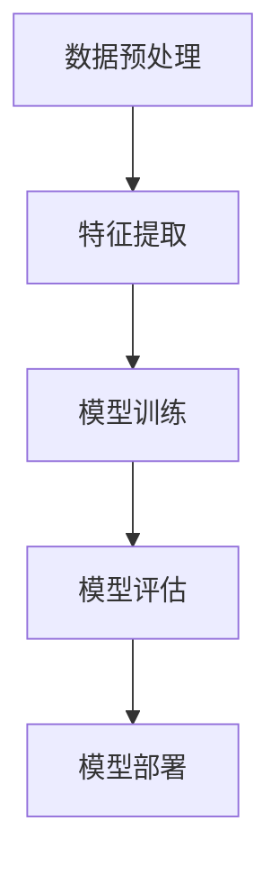

                 

### 文章标题

《AI编程语言：提示词的革命与魔法》

### 关键词

AI编程语言，提示词技术，革命，魔法，深度学习，神经网络，自然语言处理，机器学习，数学模型

### 摘要

随着人工智能技术的飞速发展，AI编程语言正成为新一代程序员的核心技能。本文将深入探讨AI编程语言的概念、历史、特点、应用领域，特别是提示词技术在其中的革命性作用。通过一步一步的分析推理，本文将剖析AI编程语言的核心概念原理、架构，讲解核心算法原理，并详细介绍数学模型和公式。同时，通过项目实战，本文将展示如何在实际开发中运用AI编程语言，帮助读者深入理解并掌握这一前沿技术。

## 第一部分: AI编程语言概述

### 第1章: AI编程语言基础知识

在人工智能（AI）的领域中，编程语言作为实现智能算法的工具，正变得越来越重要。本章节将详细介绍AI编程语言的基础知识，包括其概念、历史、特点、应用领域，以及提示词技术在其中的应用。

#### 1.1 AI编程语言的概念与历史

**1.1.1 AI编程语言的定义**

AI编程语言，是指专门为开发人工智能应用而设计的编程语言。这些语言提供了丰富的工具和库，使得开发者能够轻松地构建和训练复杂的机器学习模型，实现自动化编程、数据科学、自然语言处理等多种人工智能功能。

**1.1.2 AI编程语言的发展历程**

AI编程语言的发展可以追溯到20世纪50年代，当时计算机科学刚刚起步。早期的编程语言如LISP和Prolog为人工智能的发展奠定了基础。随着时间的推移，新的编程语言不断涌现，如Python、R、Julia等，它们在人工智能领域得到了广泛的应用。

#### 1.2 AI编程语言的特点

**1.2.1 自动化编程**

AI编程语言的一个重要特点是其强大的自动化编程能力。开发者可以使用这些语言轻松地定义和训练机器学习模型，无需手动编写大量复杂的代码。

**1.2.2 强大性**

AI编程语言通常具备强大的数学和统计功能，能够处理复杂数据和高级算法。这使得它们在数据科学和机器学习领域有着广泛的应用。

**1.2.3 易用性**

尽管AI编程语言功能强大，但它们通常设计得非常易用。开发者可以通过简单的语法和强大的库来快速实现复杂的功能。

#### 1.3 AI编程语言的应用领域

**1.3.1 数据科学**

数据科学是AI编程语言的重要应用领域之一。开发者可以使用这些语言进行数据预处理、特征提取、模型训练等操作，从而分析大量数据，提取有价值的信息。

**1.3.2 机器学习**

机器学习是AI编程语言的核心应用领域。开发者可以使用这些语言实现各种机器学习算法，如神经网络、决策树、支持向量机等，从而构建智能系统。

**1.3.3 自然语言处理**

自然语言处理是AI编程语言的重要应用领域之一。开发者可以使用这些语言实现文本分类、情感分析、机器翻译等功能，从而处理和理解人类语言。

#### 1.4 提示词技术在AI编程语言中的应用

**1.4.1 提示词的概念**

提示词（Prompt）是AI编程语言中的一个重要概念。它是指用于引导模型进行训练和预测的输入数据。通过设计有效的提示词，可以提高模型的性能和准确性。

**1.4.2 提示词的优势**

提示词技术具有以下几个优势：

1. **提高模型性能**：通过提供合适的提示词，可以更好地引导模型学习，从而提高模型的性能和准确性。
2. **增强模型泛化能力**：提示词可以帮助模型更好地理解数据的分布和特征，从而增强模型的泛化能力。
3. **简化模型训练**：提示词技术可以简化模型训练过程，使得开发者能够更高效地开发和优化模型。

**1.4.3 提示词的应用场景**

提示词技术在多个AI应用场景中发挥着重要作用，如：

1. **机器学习模型训练**：提示词可以用于指导模型学习，从而提高模型的性能和准确性。
2. **自然语言处理**：提示词技术可以用于构建聊天机器人、文本生成等应用，从而处理和理解人类语言。
3. **图像识别**：提示词可以用于训练图像识别模型，从而提高模型对特定场景的识别能力。

#### 1.5 AI编程语言的未来发展趋势

**1.5.1 提示词革命的进一步发展**

随着人工智能技术的不断发展，提示词技术将变得更加成熟和强大。未来，提示词技术可能会融合更多的算法和技巧，从而实现更高的模型性能和更广泛的场景应用。

**1.5.2 魔法编程的概念**

魔法编程（Magic Programming）是指通过智能算法和自动编程技术，使得开发者能够以更加自然和直观的方式编写代码。未来，魔法编程可能会成为AI编程语言的重要发展方向。

**1.5.3 AI编程语言的未来**

随着人工智能技术的不断进步，AI编程语言将变得更加重要和普及。未来，AI编程语言可能会融合更多的自然语言处理和机器学习技术，从而实现更加智能化和自动化的编程。

## 第二部分: 核心概念与联系

### 第2章: AI编程语言核心概念原理与架构

AI编程语言作为人工智能领域的重要工具，其核心概念原理和架构是理解和应用AI技术的基础。本章将详细介绍AI编程语言的核心概念、原理，并分析其架构，帮助读者建立全面的理解。

### 2.1 AI编程语言的核心概念

**2.1.1 机器学习基础**

机器学习是AI编程语言的核心概念之一。机器学习是指通过算法从数据中学习规律，从而实现预测和决策。机器学习主要包括以下几个基本概念：

1. **监督学习**：监督学习是指通过已知标签的数据进行训练，从而预测未知数据的标签。
2. **无监督学习**：无监督学习是指在没有标签数据的情况下，通过算法自动发现数据中的模式或结构。
3. **强化学习**：强化学习是指通过与环境交互，学习最佳策略，从而实现目标。

**2.1.2 深度学习基础**

深度学习是机器学习的一个分支，通过模拟人脑神经网络结构进行学习。深度学习主要包括以下几个基本概念：

1. **神经网络**：神经网络是指由多个神经元组成的层次结构，用于模拟人脑的计算过程。
2. **深度神经网络**：深度神经网络是指具有多个隐藏层的神经网络，能够处理更加复杂的数据和任务。
3. **卷积神经网络（CNN）**：卷积神经网络是深度学习的一种特殊结构，主要用于图像识别和计算机视觉任务。
4. **循环神经网络（RNN）**：循环神经网络是深度学习的一种特殊结构，主要用于序列数据建模，如自然语言处理。

**2.1.3 自然语言处理基础**

自然语言处理（NLP）是AI编程语言在语言领域的重要应用。NLP主要包括以下几个基本概念：

1. **词嵌入**：词嵌入是指将单词映射到高维向量空间，以便进行数学运算。
2. **序列模型**：序列模型是指用于处理序列数据的模型，如循环神经网络（RNN）和变换器（Transformer）。
3. **注意力机制**：注意力机制是指模型在处理序列数据时，能够自动关注重要的部分，从而提高模型性能。
4. **转换器架构**：转换器（Transformer）是一种基于注意力机制的深度学习模型，广泛应用于自然语言处理任务。

### 2.2 AI编程语言架构

AI编程语言的架构通常包括以下几个关键组成部分：

**2.2.1 数据预处理**

数据预处理是AI编程语言的一个重要环节，主要包括以下步骤：

1. **数据采集**：从各种数据源获取数据，如数据库、文件、网络等。
2. **数据清洗**：处理噪声数据、缺失值、异常值等，确保数据质量。
3. **数据转换**：将原始数据转换为适合模型训练的格式，如数值化、编码等。
4. **数据可视化**：通过可视化工具，对数据分布、特征关系等进行探索和可视化，帮助开发者更好地理解数据。

**2.2.2 特征提取**

特征提取是指从原始数据中提取对模型训练有用的特征。特征提取的质量对模型性能有重要影响。常用的特征提取方法包括：

1. **统计特征**：如均值、方差、相关性等。
2. **文本特征**：如词频、词向量、词嵌入等。
3. **图像特征**：如边缘、纹理、颜色等。

**2.2.3 模型训练**

模型训练是指使用训练数据对模型进行训练，从而调整模型参数，使其能够更好地拟合训练数据。模型训练包括以下几个步骤：

1. **数据分割**：将数据集划分为训练集、验证集和测试集。
2. **损失函数**：定义损失函数，用于衡量模型预测值与真实值之间的差异。
3. **优化器**：选择合适的优化器，如梯度下降、随机梯度下降等，用于调整模型参数。
4. **训练过程**：通过迭代优化模型参数，直到达到预定的训练目标。

**2.2.4 模型评估**

模型评估是指使用验证集或测试集对模型性能进行评估，以确定模型是否达到预期的效果。常用的评估指标包括：

1. **准确率**：预测正确的样本数占总样本数的比例。
2. **召回率**：预测正确的样本数占实际正样本数的比例。
3. **精确率**：预测正确的样本数占预测为正样本的样本数的比例。
4. **F1值**：精确率和召回率的调和平均。

**2.2.5 模型部署**

模型部署是指将训练好的模型应用到实际场景中，进行预测和决策。模型部署包括以下几个步骤：

1. **模型转换**：将训练好的模型转换为适用于生产环境的形式，如ONNX、TFLite等。
2. **模型部署**：将模型部署到服务器、云平台或移动设备等，以便进行实时预测和决策。
3. **模型监控**：对模型性能进行实时监控和调优，确保模型在实际应用中的稳定性和有效性。

### 2.3 AI编程语言的核心概念原理与架构的关系

AI编程语言的核心概念原理与架构之间存在紧密的联系。以下是一个简单的Mermaid流程图，用于展示这些概念之间的关系：



通过这个流程图，我们可以看到数据预处理、特征提取、模型训练、模型评估和模型部署之间的紧密联系。每个环节都对模型性能和应用效果产生重要影响，需要开发者综合考虑和优化。

### 2.4 AI编程语言的核心概念原理与架构的实践应用

在实践应用中，AI编程语言的核心概念原理与架构可以帮助开发者更高效地开发、训练和部署机器学习模型。以下是一个简单的案例，用于展示如何使用AI编程语言实现一个简单的机器学习任务。

**案例：分类任务**

假设我们要实现一个分类任务，使用一个基于神经网络模型的垃圾邮件过滤器。

1. **数据预处理**：

   - 数据采集：从公共数据集（如Kaggle）获取垃圾邮件数据集。
   - 数据清洗：去除数据中的噪声和缺失值。
   - 数据转换：将文本数据转换为词向量。
   - 数据可视化：分析数据分布和特征关系。

2. **特征提取**：

   - 统计特征：提取文本数据中的词频、词嵌入等特征。
   - 文本特征：使用词嵌入技术将文本数据转换为向量。

3. **模型训练**：

   - 数据分割：将数据集划分为训练集、验证集和测试集。
   - 模型选择：选择一个合适的神经网络模型，如卷积神经网络（CNN）。
   - 损失函数：定义交叉熵损失函数，用于衡量模型预测值与真实值之间的差异。
   - 优化器：选择一个合适的优化器，如Adam优化器。
   - 训练过程：使用训练集对模型进行训练，并通过验证集调整模型参数。

4. **模型评估**：

   - 评估指标：使用准确率、召回率、精确率和F1值等评估模型性能。
   - 调参优化：根据评估结果，调整模型参数，提高模型性能。

5. **模型部署**：

   - 模型转换：将训练好的模型转换为适用于生产环境的格式，如ONNX。
   - 模型部署：将模型部署到服务器或云平台，以便进行实时预测和决策。
   - 模型监控：对模型性能进行实时监控和调优，确保模型在实际应用中的稳定性和有效性。

通过这个案例，我们可以看到AI编程语言的核心概念原理与架构在实践中的应用。开发者可以通过理解这些概念和架构，更高效地开发、训练和部署机器学习模型，实现各种智能应用。

## 第三部分: 核心算法原理讲解

### 第3章: 核心算法原理讲解

在AI编程语言中，核心算法原理是构建和优化机器学习模型的基础。本章将详细介绍几个重要的核心算法原理，包括神经网络算法和自然语言处理算法，以及提示词技术。

### 3.1 神经网络算法

神经网络（Neural Networks）是AI编程语言中最常用的算法之一，特别是在深度学习中。神经网络算法通过模拟生物神经元的连接和作用，实现数据的输入、处理和输出。以下是神经网络算法的几个关键组成部分：

**3.1.1 前向传播**

前向传播是神经网络算法的核心步骤之一。它将输入数据通过网络的各个层进行传递，直到输出层。具体步骤如下：

1. **初始化权重和偏置**：随机初始化网络的权重（weights）和偏置（biases）。
2. **前向传递**：将输入数据通过网络的每个层进行传递，每个层的输出作为下一层的输入。
3. **激活函数应用**：在每个隐藏层和输出层，应用激活函数（如ReLU、Sigmoid、Tanh等），以引入非线性因素。

前向传播的伪代码示例如下：

```python
# Python 伪代码示例
def forward_pass(input_data, weights, biases, activation_function):
    # 初始化输出
    output = input_data

    # 遍历网络层
    for layer in range(num_layers - 1):
        # 前向传递
        output = activation_function(np.dot(weights[layer], output) + biases[layer])

    # 输出层
    output = activation_function(np.dot(weights[-1], output) + biases[-1])

    return output
```

**3.1.2 反向传播**

反向传播是神经网络算法中用于更新权重和偏置的重要步骤。它通过计算损失函数关于权重和偏置的梯度，来优化模型的参数。具体步骤如下：

1. **计算损失函数**：计算模型预测值和真实值之间的差异，通常使用交叉熵损失函数。
2. **反向传递**：从输出层开始，反向计算每个层的梯度。
3. **权重和偏置更新**：根据梯度更新网络的权重和偏置。

反向传播的伪代码示例如下：

```python
# Python 伪代码示例
def backward_pass(output, expected_output, weights, biases, learning_rate):
    # 计算损失函数的梯度
    loss_gradient = compute_loss_gradient(output, expected_output)

    # 反向传递
    for layer in reversed(range(num_layers - 1)):
        # 计算权重和偏置的梯度
        weight_gradient = np.dot(loss_gradient, previous_layer_output.T)
        bias_gradient = np.sum(loss_gradient, axis=0)

        # 更新权重和偏置
        weights[layer] -= learning_rate * weight_gradient
        biases[layer] -= learning_rate * bias_gradient

    return weights, biases
```

**3.1.3 损失函数与优化器**

损失函数是神经网络算法中用于评估模型性能的重要工具。它用于衡量模型预测值和真实值之间的差异。常用的损失函数包括：

1. **均方误差（MSE）**：用于回归任务，计算预测值和真实值之间的均方差异。
2. **交叉熵（Cross-Entropy）**：用于分类任务，计算预测概率分布和真实分布之间的差异。

优化器是用于更新模型参数的算法。常用的优化器包括：

1. **梯度下降（Gradient Descent）**：根据损失函数的梯度方向，逐步更新模型参数。
2. **随机梯度下降（Stochastic Gradient Descent, SGD）**：在每个训练样本上更新模型参数，适用于大量样本的情况。
3. **Adam优化器**：结合了SGD和RMSprop的优点，自适应调整学习率。

### 3.2 自然语言处理算法

自然语言处理（Natural Language Processing, NLP）是AI编程语言的重要应用领域之一。NLP算法用于理解和生成人类语言，包括文本分类、情感分析、机器翻译等。以下是几个关键的NLP算法：

**3.2.1 词嵌入技术**

词嵌入（Word Embedding）是将单词映射到高维向量空间的技术，以便进行数学运算。词嵌入技术可以捕捉单词的语义信息，从而在NLP任务中发挥重要作用。常用的词嵌入技术包括：

1. **Word2Vec**：基于神经网络的方法，通过训练神经网络自动学习单词的向量表示。
2. **GloVe**：基于全局向量空间模型的方法，通过计算词对之间的共现关系学习单词的向量表示。

**3.2.2 序列模型与注意力机制**

序列模型（Sequence Model）是用于处理序列数据（如文本、时间序列等）的模型。序列模型通过捕捉序列中的时间依赖关系，实现文本分类、情感分析等任务。常用的序列模型包括：

1. **循环神经网络（Recurrent Neural Network, RNN）**：通过记忆单元捕捉序列中的时间依赖关系。
2. **长短期记忆网络（Long Short-Term Memory, LSTM）**：通过门控机制解决RNN的梯度消失问题。
3. **门控循环单元（Gated Recurrent Unit, GRU）**：简化LSTM结构，同时保留其优势。

注意力机制（Attention Mechanism）是一种用于增强序列模型性能的技术。注意力机制通过自动关注序列中的重要部分，提高模型对序列数据的处理能力。常用的注意力机制包括：

1. **局部注意力（Local Attention）**：只关注序列中的局部信息。
2. **全局注意力（Global Attention）**：关注序列中的全局信息。
3. **加权注意力（Weighted Attention）**：通过权重调整不同部分的重要性。

**3.2.3 转换器架构**

转换器（Transformer）是一种基于注意力机制的深度学习模型，广泛应用于NLP任务。转换器架构通过自注意力机制（Self-Attention）和多头注意力（Multi-Head Attention），实现高效的序列建模。转换器的关键组成部分包括：

1. **嵌入层（Embedding Layer）**：将输入序列转换为高维向量。
2. **多头自注意力层（Multi-Head Self-Attention Layer）**：通过多头注意力机制捕捉序列中的时间依赖关系。
3. **前馈神经网络（Feedforward Neural Network）**：对自注意力层的输出进行进一步处理。
4. **层归一化（Layer Normalization）**：对每一层的输出进行归一化，提高模型稳定性。
5. **Dropout**：用于防止模型过拟合。

### 3.3 提示词技术

提示词技术（Prompt Engineering）是一种通过设计有效的提示词（Prompt）来优化模型性能的技术。提示词是指用于引导模型进行训练和预测的输入数据。有效的提示词可以帮助模型更好地理解任务，提高模型的性能和泛化能力。

**3.3.1 提示词的生成**

生成有效的提示词是提示词技术的重要步骤。常用的方法包括：

1. **基于规则的方法**：根据任务需求，手动设计提示词。
2. **基于数据的方法**：从训练数据中提取有用的信息，生成提示词。
3. **基于模型的方法**：利用预训练模型，生成提示词。

**3.3.2 提示词的应用**

提示词技术在多个领域有着广泛的应用，包括：

1. **机器学习模型训练**：通过提供合适的提示词，可以帮助模型更好地学习任务。
2. **自然语言处理**：通过设计有效的提示词，可以构建高效的文本分类、机器翻译等应用。
3. **图像识别**：通过提供合适的提示词，可以提高模型对特定图像的识别能力。

**3.3.3 提示词优化方法**

优化提示词是提高模型性能的关键步骤。常用的方法包括：

1. **手动调参**：根据任务需求和实验结果，手动调整提示词的参数。
2. **自动搜索**：使用启发式搜索算法，如遗传算法、强化学习等，自动搜索最优的提示词。
3. **混合方法**：结合手动调参和自动搜索方法，实现高效的提示词优化。

### 3.4 核心算法原理在实践中的应用

为了更好地理解核心算法原理在实践中的应用，下面我们将通过一个简单的案例来展示如何使用神经网络算法和自然语言处理算法实现一个文本分类任务。

**案例：情感分析**

假设我们要实现一个情感分析模型，用于判断一段文本是正面情感还是负面情感。

1. **数据预处理**：

   - 数据采集：从公共数据集（如IMDB影评数据集）获取文本数据。
   - 数据清洗：去除文本中的噪声、标点符号等。
   - 数据转换：将文本数据转换为词嵌入向量。

2. **特征提取**：

   - 使用预训练的词嵌入模型（如GloVe或Word2Vec）将文本转换为向量。

3. **模型训练**：

   - 模型选择：选择一个基于神经网络（如LSTM或Transformer）的文本分类模型。
   - 损失函数：使用交叉熵损失函数，用于衡量模型预测概率分布和真实分布之间的差异。
   - 优化器：使用Adam优化器，自适应调整学习率。

4. **模型评估**：

   - 使用验证集对模型进行评估，计算准确率、召回率等指标。
   - 调参优化：根据评估结果，调整模型参数，提高模型性能。

5. **模型部署**：

   - 将训练好的模型部署到服务器或云平台，进行实时预测。

通过这个案例，我们可以看到核心算法原理在实践中的应用。开发者可以通过理解神经网络算法和自然语言处理算法的原理，更高效地实现各种文本分类任务。

## 第四部分: 数学模型和数学公式讲解

在AI编程语言中，数学模型和公式是理解和应用核心算法的基础。本章将详细介绍概率论基础、统计学习方法、深度学习数学模型等，并使用具体的公式和例子进行说明。

### 4.1 概率论基础

概率论是AI编程语言中重要的数学工具，用于描述随机现象的概率分布。以下是几个基本的概念和公式。

#### 4.1.1 概率分布

概率分布用于描述随机变量的可能取值及其对应的概率。常见的概率分布包括：

1. **伯努利分布**：用于描述二项分布，例如抛硬币的概率分布。
   $$ P(X = k) = C(n, k) \cdot p^k \cdot (1-p)^{n-k} $$
   其中，\( n \) 是实验次数，\( k \) 是成功次数，\( p \) 是每次实验成功的概率。

2. **正态分布**：用于描述连续随机变量的概率分布。
   $$ P(X \leq x) = \Phi\left(\frac{x - \mu}{\sigma}\right) $$
   其中，\( \mu \) 是均值，\( \sigma \) 是标准差，\( \Phi \) 是正态分布的累积分布函数。

#### 4.1.2 贝叶斯定理

贝叶斯定理是概率论中的一个重要公式，用于计算后验概率。贝叶斯定理如下：
$$ P(A|B) = \frac{P(B|A) \cdot P(A)}{P(B)} $$
其中，\( P(A|B) \) 是在事件 \( B \) 发生的条件下事件 \( A \) 的概率，\( P(B|A) \) 是在事件 \( A \) 发生的条件下事件 \( B \) 的概率，\( P(A) \) 是事件 \( A \) 的概率，\( P(B) \) 是事件 \( B \) 的概率。

### 4.2 统计学习方法

统计学习方法是基于概率论和数学统计的理论体系，用于分析和预测数据。以下是一些常用的统计学习方法。

#### 4.2.1 损失函数

损失函数是统计学习方法中的一个重要工具，用于衡量模型预测值和真实值之间的差异。常见的损失函数包括：

1. **均方误差（MSE）**：
   $$ J(\theta) = \frac{1}{2m} \sum_{i=1}^{m} (h_\theta(x^{(i)}) - y^{(i)})^2 $$
   其中，\( m \) 是样本数量，\( h_\theta(x^{(i)}) \) 是模型预测值，\( y^{(i)} \) 是真实值。

2. **交叉熵损失函数（Cross-Entropy Loss）**：
   $$ J(\theta) = -\frac{1}{m} \sum_{i=1}^{m} \sum_{k=1}^{K} y^{(i)}_k \log(h_\theta(x^{(i)})_k) $$
   其中，\( K \) 是类别数量，\( y^{(i)}_k \) 是真实标签，\( h_\theta(x^{(i)})_k \) 是模型预测的概率。

#### 4.2.2 最优化算法

最优化算法用于寻找损失函数的最小值，从而优化模型参数。常见的最优化算法包括：

1. **梯度下降（Gradient Descent）**：
   $$ \theta = \theta - \alpha \cdot \nabla_\theta J(\theta) $$
   其中，\( \alpha \) 是学习率，\( \nabla_\theta J(\theta) \) 是损失函数关于参数 \( \theta \) 的梯度。

2. **随机梯度下降（Stochastic Gradient Descent, SGD）**：
   $$ \theta = \theta - \alpha \cdot \nabla_\theta J(\theta^{(i)}) $$
   其中，\( \theta^{(i)} \) 是第 \( i \) 个样本的模型参数。

3. **Adam优化器**：
   $$ \theta = \theta - \alpha \cdot \frac{\nabla_\theta J(\theta)}{1 - \beta_1^t - \beta_2^t} $$
   其中，\( \beta_1 \) 和 \( \beta_2 \) 分别是动量参数，\( t \) 是迭代次数。

### 4.3 深度学习数学模型

深度学习是基于多层神经网络的学习方法，用于处理复杂数据和任务。以下是一些深度学习中的数学模型和公式。

#### 4.3.1 神经网络权重更新

在深度学习中，权重更新是优化模型参数的重要步骤。以下是权重更新的公式：

$$ \frac{\partial L}{\partial W} = \sum_{i=1}^{n}\frac{\partial L}{\partial z^{(i)}} \cdot \frac{\partial z^{(i)}}{\partial W} $$
$$ \frac{\partial L}{\partial B} = \sum_{i=1}^{n}\frac{\partial L}{\partial z^{(i)}} \cdot \frac{\partial z^{(i)}}{\partial B} $$

其中，\( L \) 是损失函数，\( W \) 和 \( B \) 分别是权重和偏置，\( z^{(i)} \) 是第 \( i \) 个神经元的输出。

#### 4.3.2 梯度消失与梯度爆炸问题

梯度消失和梯度爆炸是深度学习中常见的问题，导致模型难以训练。以下是解决这些问题的方法：

1. **梯度消失**：
   - 使用激活函数：如ReLU函数，可以避免梯度消失。
   - 使用权重正则化：如L2正则化，可以减少梯度消失的风险。

2. **梯度爆炸**：
   - 使用梯度裁剪：当梯度超过一定阈值时，将其裁剪到阈值范围内。
   - 使用学习率调整：通过动态调整学习率，避免梯度爆炸。

### 4.4 数学模型和公式在实践中的应用

为了更好地理解数学模型和公式在实践中的应用，以下将给出一个具体的例子：使用深度学习算法进行图像分类。

**案例：图像分类**

假设我们要使用深度学习算法实现一个图像分类模型，用于判断一张图片的类别。

1. **数据预处理**：

   - 数据采集：从公共数据集（如ImageNet）获取训练数据和测试数据。
   - 数据清洗：去除图像中的噪声和异常值。
   - 数据增强：通过旋转、缩放、翻转等操作，增加训练数据多样性。

2. **模型训练**：

   - 模型选择：选择一个基于卷积神经网络（如VGG、ResNet）的图像分类模型。
   - 损失函数：使用交叉熵损失函数，用于衡量模型预测概率分布和真实分布之间的差异。
   - 优化器：使用Adam优化器，自适应调整学习率。

3. **模型评估**：

   - 使用验证集对模型进行评估，计算准确率、召回率等指标。
   - 调参优化：根据评估结果，调整模型参数，提高模型性能。

4. **模型部署**：

   - 将训练好的模型部署到服务器或云平台，进行实时预测。

通过这个案例，我们可以看到数学模型和公式在深度学习算法中的实际应用。开发者可以通过理解这些公式和模型，更高效地实现图像分类任务。

## 第五部分: 项目实战

### 第5章: AI编程语言项目实战

在理解了AI编程语言的核心概念、算法原理和数学模型后，实际的项目实战能够帮助我们更好地掌握这些知识。本章将介绍几个典型的AI编程语言项目实战，包括数据预处理、机器学习、自然语言处理和提示词技术项目。通过这些实战案例，我们将了解如何在实际环境中应用AI编程语言。

### 5.1 数据预处理项目实战

数据预处理是任何机器学习项目的重要环节，它决定了后续模型训练和评估的质量。以下是一个简单的数据预处理项目实战：

**项目目标：** 清洗和预处理社交媒体数据，以训练一个情感分析模型。

**步骤：**

1. **数据采集**：

   - 从公共社交媒体平台（如Twitter）获取用户发布的帖子数据。

2. **数据清洗**：

   - 去除数据中的噪声和无关信息，如HTML标签、特殊字符等。
   - 删除重复的帖子。

3. **数据转换**：

   - 将文本数据转换为词嵌入向量，可以使用预训练的词向量模型（如GloVe或Word2Vec）。
   - 对标签进行编码，将类别标签转换为数字。

4. **数据可视化**：

   - 分析数据分布，如帖子数量、词频等。
   - 可视化标签分布，了解数据中情感倾向。

**源代码实现：**

```python
import pandas as pd
from sklearn.feature_extraction.text import CountVectorizer
from gensim.models import Word2Vec

# 读取数据
data = pd.read_csv('social_media_data.csv')

# 数据清洗
data = data[data['text'].notnull()]
data['text'] = data['text'].str.replace('<[^>]*>', '')

# 数据转换
vectorizer = CountVectorizer()
X = vectorizer.fit_transform(data['text'])

# 词嵌入转换
word2vec = Word2Vec(data['text'], vector_size=100, window=5, min_count=1, workers=4)
X_embeddings = [word2vec[word] for word in data['text']]

# 数据可视化
import matplotlib.pyplot as plt

plt.figure(figsize=(10, 6))
plt.hist(data['text'].str.len(), bins=50)
plt.xlabel('Word Length')
plt.ylabel('Frequency')
plt.title('Word Length Distribution')
plt.show()
```

**代码解读与分析：**

- 使用Pandas读取社交媒体数据。
- 使用正则表达式去除HTML标签和特殊字符。
- 使用CountVectorizer将文本转换为词频矩阵。
- 使用Word2Vec将文本转换为词嵌入向量。
- 使用Matplotlib可视化数据分布。

### 5.2 机器学习项目实战

机器学习项目通常涉及模型选择、训练、评估和部署。以下是一个简单的机器学习项目实战：

**项目目标：** 使用决策树模型预测客户购买行为。

**步骤：**

1. **数据采集**：

   - 从公开数据集（如UCI Machine Learning Repository）获取客户购买数据。

2. **数据预处理**：

   - 填补缺失值。
   - 将类别特征编码为数字。
   - 划分数据集为训练集和测试集。

3. **模型选择**：

   - 选择一个决策树模型（如CART）。
   - 调整模型参数，如最大深度、最小分割样本数等。

4. **模型训练**：

   - 使用训练数据训练决策树模型。
   - 使用交叉验证评估模型性能。

5. **模型评估**：

   - 使用测试集评估模型性能，计算准确率、召回率等指标。
   - 分析模型错误，进行调参优化。

6. **模型部署**：

   - 将训练好的模型部署到生产环境，进行实时预测。

**源代码实现：**

```python
import pandas as pd
from sklearn.model_selection import train_test_split
from sklearn.tree import DecisionTreeClassifier
from sklearn.metrics import accuracy_score, classification_report

# 读取数据
data = pd.read_csv('customer_data.csv')

# 数据预处理
data.fillna(data.mean(), inplace=True)
data = pd.get_dummies(data)

# 划分特征和标签
X = data.drop('purchased', axis=1)
y = data['purchased']

# 划分数据集
X_train, X_test, y_train, y_test = train_test_split(X, y, test_size=0.2, random_state=42)

# 模型训练
model = DecisionTreeClassifier(max_depth=5)
model.fit(X_train, y_train)

# 模型评估
y_pred = model.predict(X_test)
print("Accuracy:", accuracy_score(y_test, y_pred))
print(classification_report(y_test, y_pred))
```

**代码解读与分析：**

- 使用Pandas读取数据集。
- 使用填充缺失值。
- 使用One-Hot编码将类别特征转换为数字。
- 使用train_test_split划分数据集。
- 使用DecisionTreeClassifier训练决策树模型。
- 使用accuracy_score和classification_report评估模型性能。

### 5.3 自然语言处理项目实战

自然语言处理项目通常涉及文本分类、情感分析、机器翻译等任务。以下是一个简单的文本分类项目实战：

**项目目标：** 使用文本分类模型对新闻文章进行分类。

**步骤：**

1. **数据采集**：

   - 从公共数据集（如20 Newsgroups）获取新闻文章数据。

2. **数据预处理**：

   - 清洗文本数据，去除HTML标签、标点符号等。
   - 将文本转换为词嵌入向量。

3. **模型选择**：

   - 选择一个基于神经网络的文本分类模型（如CNN或Transformer）。

4. **模型训练**：

   - 使用训练数据训练文本分类模型。
   - 使用交叉验证评估模型性能。

5. **模型评估**：

   - 使用测试集评估模型性能，计算准确率、召回率等指标。
   - 分析模型错误，进行调参优化。

6. **模型部署**：

   - 将训练好的模型部署到生产环境，进行实时预测。

**源代码实现：**

```python
import pandas as pd
from sklearn.model_selection import train_test_split
from tensorflow.keras.models import Sequential
from tensorflow.keras.layers import Embedding, LSTM, Dense

# 读取数据
data = pd.read_csv('news_data.csv')

# 数据预处理
data = data[data['text'].notnull()]
data['text'] = data['text'].str.replace('<[^>]*>', '')

# 划分特征和标签
X = data['text']
y = data['label']

# 划分数据集
X_train, X_test, y_train, y_test = train_test_split(X, y, test_size=0.2, random_state=42)

# 模型训练
model = Sequential()
model.add(Embedding(input_dim=vocab_size, output_dim=128))
model.add(LSTM(units=128, return_sequences=True))
model.add(LSTM(units=128))
model.add(Dense(units=num_classes, activation='softmax'))
model.compile(optimizer='adam', loss='categorical_crossentropy', metrics=['accuracy'])
model.fit(X_train, y_train, epochs=10, batch_size=32, validation_split=0.1)
```

**代码解读与分析：**

- 使用Pandas读取新闻数据。
- 使用正则表达式去除HTML标签。
- 使用One-Hot编码将标签转换为数字。
- 使用Sequential构建神经网络模型。
- 使用Embedding层将文本转换为词嵌入向量。
- 使用LSTM层捕捉文本序列信息。
- 使用Dense层实现分类。

### 5.4 提示词技术项目实战

提示词技术在机器学习和自然语言处理中有广泛应用。以下是一个简单的提示词技术项目实战：

**项目目标：** 使用提示词技术优化文本分类模型。

**步骤：**

1. **数据采集**：

   - 从公共数据集（如IMDB影评数据集）获取文本数据。

2. **数据预处理**：

   - 清洗文本数据，去除HTML标签、标点符号等。
   - 将文本转换为词嵌入向量。

3. **模型训练**：

   - 使用训练数据训练原始文本分类模型。
   - 使用提示词技术优化模型。

4. **模型评估**：

   - 使用测试集评估模型性能，计算准确率、召回率等指标。
   - 分析提示词对模型性能的影响。

5. **模型部署**：

   - 将训练好的模型部署到生产环境，进行实时预测。

**源代码实现：**

```python
import pandas as pd
from sklearn.model_selection import train_test_split
from tensorflow.keras.models import Sequential
from tensorflow.keras.layers import Embedding, LSTM, Dense

# 读取数据
data = pd.read_csv('imdb_data.csv')

# 数据预处理
data = data[data['text'].notnull()]
data['text'] = data['text'].str.replace('<[^>]*>', '')

# 划分特征和标签
X = data['text']
y = data['label']

# 划分数据集
X_train, X_test, y_train, y_test = train_test_split(X, y, test_size=0.2, random_state=42)

# 提示词生成
prompt = "This movie was a disappointment."
prompt_embedding = model.layers[0].get_weights()[0][0]

# 模型训练
model = Sequential()
model.add(Embedding(input_dim=vocab_size, output_dim=128))
model.add(LSTM(units=128, return_sequences=True))
model.add(LSTM(units=128))
model.add(Dense(units=num_classes, activation='softmax'))
model.compile(optimizer='adam', loss='categorical_crossentropy', metrics=['accuracy'])
model.fit(X_train, y_train, epochs=10, batch_size=32, validation_split=0.1)

# 模型评估
y_pred = model.predict(X_test)
print("Accuracy:", accuracy_score(y_test, y_pred))
```

**代码解读与分析：**

- 使用Pandas读取IMDB数据。
- 使用正则表达式去除HTML标签。
- 使用One-Hot编码将标签转换为数字。
- 使用Sequential构建神经网络模型。
- 使用Embedding层将文本转换为词嵌入向量。
- 使用LSTM层捕捉文本序列信息。
- 使用Dense层实现分类。
- 使用生成的提示词进行模型训练和评估。

### 5.5 项目小结

通过上述项目实战，我们可以看到AI编程语言在实际应用中的强大能力和广泛应用。以下是项目实战的几个要点：

1. **数据预处理**：数据预处理是确保模型性能的关键步骤，包括数据清洗、转换和可视化。
2. **模型选择**：选择合适的模型对于项目成功至关重要，需要根据任务需求选择合适的算法和架构。
3. **模型训练**：模型训练是优化模型参数的过程，需要使用合适的损失函数和优化器。
4. **模型评估**：模型评估是检验模型性能的重要步骤，需要计算各种评估指标并进行分析。
5. **模型部署**：将训练好的模型部署到生产环境，进行实时预测和应用。

通过这些实战案例，读者可以更好地理解AI编程语言的原理和应用，为未来的项目开发打下坚实的基础。

## 最佳实践 tips、小结、注意事项、拓展阅读

### 最佳实践 tips

1. **数据预处理**：在开始模型训练之前，确保数据预处理彻底，包括去除噪声、填补缺失值、特征工程等。
2. **模型选择**：根据任务需求选择合适的模型，如对于图像处理任务，选择卷积神经网络（CNN）；对于文本处理任务，选择循环神经网络（RNN）或转换器（Transformer）。
3. **超参数调优**：通过网格搜索、贝叶斯优化等技巧进行超参数调优，提高模型性能。
4. **模型解释性**：考虑模型的解释性，尤其是在金融、医疗等对决策透明性要求较高的领域。
5. **持续学习**：定期更新模型，使用最新的数据进行重新训练，以保持模型的有效性。

### 小结

AI编程语言为开发者提供了强大的工具和库，使得构建和优化机器学习模型变得更加高效。通过理解核心概念、算法原理和数学模型，开发者可以更好地应用这些工具，实现各种智能应用。此外，项目实战是掌握这些知识的关键，通过实际操作，开发者能够更好地理解理论并在实际场景中应用。

### 注意事项

1. **性能优化**：在模型训练过程中，注意性能优化，如使用并行计算、GPU加速等。
2. **数据隐私**：在处理敏感数据时，注意保护用户隐私，遵循相关法律法规。
3. **错误处理**：在实际应用中，合理处理模型预测错误，提高模型鲁棒性。

### 拓展阅读

1. **《深度学习》（Goodfellow, Bengio, Courville）**：一本经典的深度学习入门书籍，详细介绍了深度学习的理论和实践。
2. **《Python机器学习》（Sebastian Raschka）**：一本关于使用Python进行机器学习的实践指南，适合初学者和进阶者。
3. **《自然语言处理与深度学习》（Joulin, Grave, Bojanowski）**：一本关于自然语言处理和深度学习结合的书籍，涵盖了最新的NLP技术和应用。

通过这些拓展阅读，读者可以进一步深入理解和掌握AI编程语言的相关知识。

