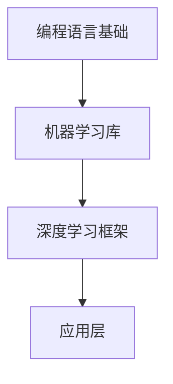

                 

### 文章标题

《AI编程语言：提示词的革新与魔法》

### 关键词

- AI编程语言
- 提示词
- 自然语言处理
- 魔法技巧
- 模型优化
- 算法应用

### 摘要

本文深入探讨了AI编程语言及其关键组件——提示词，以及它们如何通过革新与魔法技巧改变了传统的编程方式。首先，我们概述了AI编程语言的兴起与趋势，分析了它们的核心概念与架构。接着，我们介绍了主流AI编程语言，如Python，以及它们在AI编程中的应用与局限。本文的重点在于提示词的革新，探讨了其概念、类型、生成与优化方法，以及在实际应用中的效果。此外，我们还详细阐述了魔法技巧的定义与分类，以及在数据处理和模型优化中的应用。通过一系列实战项目，我们展示了这些技术的实际效果，并展望了未来AI编程的发展趋势。本文旨在为读者提供一份全面、深入的AI编程语言与提示词的指南，帮助他们掌握这一前沿技术，并在实际项目中取得成功。### 第一部分：AI编程语言概述

AI编程语言，作为一种专为人工智能和机器学习设计的编程语言，正逐渐成为技术领域的重要组成部分。它们的出现不仅为开发者提供了更高效、更简洁的编程方式，也推动了人工智能的快速发展和广泛应用。

#### 第1章：AI编程语言的兴起与趋势

##### 1.1 AI编程语言的定义与发展

**1.1.1 AI编程语言的定义**

AI编程语言，是指那些专门用于编写人工智能算法和模型的编程语言。这些语言通常具备强大的数据处理和分析能力，能够高效地实现复杂的机器学习和深度学习任务。常见的AI编程语言包括Python、R、Julia等。

**1.1.2 AI编程语言的发展历程**

AI编程语言的发展历程可以追溯到20世纪50年代，当时出现了LISP，这是第一种专门用于人工智能领域的编程语言。随着时间的推移，各种AI编程语言不断涌现，如Prolog、PL/1等。而Python、R等现代AI编程语言则是在过去几十年里逐渐成熟并广泛应用的。

**1.1.3 AI编程语言的优势与挑战**

AI编程语言的优势主要体现在以下几个方面：

- **简洁性**：AI编程语言通常具有简洁的语法和强大的抽象能力，使得开发者可以更快速地编写出高效的代码。
- **多功能性**：这些语言不仅支持传统的编程任务，还能高效地处理复杂数据和执行机器学习算法。
- **社区支持**：由于AI编程语言的流行，它们拥有庞大的开发者社区，提供了大量的库、框架和工具，方便开发者进行开发。

然而，AI编程语言也面临着一些挑战，如：

- **性能限制**：相比于传统的编译型语言，AI编程语言的执行速度可能较慢。
- **学习曲线**：AI编程语言需要一定的专业知识，对于初学者来说可能有一定难度。

##### 2.1 核心概念与联系

**2.1.1 AI编程语言的核心概念**

为了更好地理解AI编程语言，我们需要了解以下几个核心概念：

- **数据结构**：包括数组、列表、字典等，用于存储和操作数据。
- **算法**：一系列解决问题的步骤和方法，用于实现机器学习和深度学习模型。
- **库与框架**：如TensorFlow、PyTorch等，提供了丰富的API和工具，简化了AI模型的开发过程。

**2.1.2 AI编程语言架构解析**

AI编程语言的架构通常包括以下几个层次：

1. **编程语言基础**：包括语法、数据类型和操作符等。
2. **机器学习库**：如NumPy、Pandas等，用于数据处理和数值计算。
3. **深度学习框架**：如TensorFlow、PyTorch等，用于构建和训练神经网络模型。
4. **应用层**：开发者使用AI编程语言实现的实际应用，如自然语言处理、图像识别等。

下面我们使用Mermaid流程图来展示AI编程语言的工作原理：



通过上述流程图，我们可以清晰地看到AI编程语言的各个组成部分及其相互关系。

#### 第2章：主流AI编程语言介绍

##### 3.1 Python与AI编程

**3.1.1 Python在AI编程中的应用**

Python是目前最受欢迎的AI编程语言之一。其简洁的语法和强大的库支持使其在AI领域得到广泛应用。Python在AI编程中的应用主要体现在以下几个方面：

- **数据处理**：Python的Pandas库提供了强大的数据处理功能，可以高效地进行数据清洗、转换和分析。
- **机器学习**：Python的Scikit-learn库提供了丰富的机器学习算法，方便开发者进行模型训练和评估。
- **深度学习**：Python的TensorFlow和PyTorch库是目前最流行的深度学习框架，支持复杂的神经网络模型。

**3.1.2 Python在AI编程中的优势与局限**

Python在AI编程中的优势如下：

- **简洁性**：Python的语法简洁明了，使得开发者可以更快地编写和调试代码。
- **库支持**：Python拥有丰富的库和框架，提供了大量的工具和资源，方便开发者进行开发。
- **社区支持**：Python拥有庞大的开发者社区，提供了大量的教程、文档和论坛，有助于开发者解决问题和学习新知识。

然而，Python在AI编程中也存在一些局限：

- **性能限制**：相比于编译型语言，Python的执行速度可能较慢，不适合处理大规模的数据和高性能计算。
- **内存管理**：Python的内存管理机制可能导致内存消耗较大，需要开发者注意优化。

通过上述分析，我们可以看到Python在AI编程中既有优势也有局限，开发者需要根据具体需求选择合适的编程语言和工具。在下一章中，我们将继续介绍其他主流AI编程语言，并比较它们在AI编程中的应用特点。### 第二部分：提示词的革新

#### 第4章：提示词的概念与类型

##### 4.1 提示词的定义与作用

**4.1.1 提示词的定义**

提示词（Prompt）在AI编程中起着关键作用，它是指用于引导AI模型进行预测或生成输出的关键字或短语。提示词的目的是提供足够的信息，使AI模型能够理解任务的需求并生成相应的输出。

**4.1.2 提示词的类型**

根据提示词的使用场景和目的，可以分为以下几种类型：

1. **单句提示词**：这种类型的提示词通常用于简单的文本生成任务，如自动回复、文章摘要等。例如，“请写一篇关于人工智能的摘要。”

2. **多句提示词**：多句提示词用于更复杂的任务，如对话系统、故事创作等。这种提示词需要提供更多的上下文信息，以便AI模型能够理解任务的连贯性和复杂性。例如，“一个人在森林中迷路了，他该怎么做？”

3. **图像提示词**：用于图像识别和生成任务，提示词可以是一个具体的图像或一组图像。例如，“请识别这张图片中的物体。”

4. **音频提示词**：用于音频处理任务，如语音识别和生成。提示词可以是一段语音或一段音乐。

##### 4.2 提示词生成与优化

**4.2.1 提示词生成方法**

提示词的生成是AI编程中的一个重要环节。以下是一些常见的提示词生成方法：

1. **规则生成**：基于预定义的规则和模板，生成符合特定要求的提示词。例如，使用自然语言生成（NLG）技术生成文章摘要。

2. **数据驱动生成**：使用已有的数据和机器学习模型，自动生成提示词。例如，利用训练好的文本生成模型，根据输入文本生成相应的提示词。

3. **交互式生成**：通过与用户的交互，逐步生成提示词。例如，在对话系统中，用户提出需求，系统根据用户的反馈生成相应的提示词。

**4.2.2 提示词优化技术**

生成的提示词可能需要进一步优化，以提高AI模型的性能和效果。以下是一些常见的提示词优化技术：

1. **语义分析**：对生成的提示词进行语义分析，确保其符合任务的要求和上下文。

2. **语法修正**：对提示词进行语法修正，使其更加通顺和自然。

3. **质量评估**：使用自动化评估工具或人工评估，对提示词的质量进行评估和优化。

伪代码：提示词自动生成算法

```python
def generate_prompt(input_data, model):
    """
    生成提示词的函数
    :param input_data: 输入数据
    :param model: 机器学习模型
    :return: 生成的提示词
    """
    # 根据输入数据和模型，生成提示词
    prompt = model.predict(input_data)
    return prompt
```

伪代码：提示词优化算法

```python
def optimize_prompt(prompt, semantic_analyzer, grammar_checker):
    """
    优化提示词的函数
    :param prompt: 提示词
    :param semantic_analyzer: 语义分析器
    :param grammar_checker: 语法检查器
    :return: 优化的提示词
    """
    # 进行语义分析
    semantically_optimized_prompt = semantic_analyzer.analyze(prompt)
    
    # 进行语法修正
    grammatically_optimized_prompt = grammar_checker.correct(semantically_optimized_prompt)
    
    return grammatically_optimized_prompt
```

通过上述算法，我们可以生成高质量的提示词，提高AI模型的性能和应用效果。

#### 第5章：提示词在AI编程中的实践应用

##### 5.1 提示词在自然语言处理中的应用

**5.1.1 提示词在文本生成中的使用**

文本生成是自然语言处理（NLP）中的一项重要任务，提示词在这一过程中起着关键作用。以下是一个简单的例子：

```python
# 使用提示词生成一篇关于人工智能的摘要
prompt = "人工智能在过去几十年中取得了惊人的进展，它已经在许多领域展示了强大的应用潜力。然而，人工智能的发展也面临着一些挑战，如数据隐私、伦理问题等。请写一篇关于人工智能的摘要。"

# 调用文本生成模型
generated_text = text_generator.generate(prompt)

print(generated_text)
```

**5.1.2 提示词在文本分类中的使用**

文本分类是NLP中的另一个重要任务，提示词同样可以发挥作用。以下是一个简单的例子：

```python
# 使用提示词对文本进行分类
prompt = ["这是一个关于技术的文章。", "这篇文章讨论了机器学习的最新进展。"]

# 调用文本分类模型
predicted_categories = text_classifier.classify(prompt)

print(predicted_categories)
```

通过上述例子，我们可以看到提示词在文本生成和分类任务中的应用，它们为AI模型提供了必要的上下文信息，使其能够生成高质量的输出。

#### 第6章：提示词的魔法效应

##### 6.1 提示词的变革性影响

**6.1.1 提示词对AI编程语言的影响**

提示词的引入极大地改变了AI编程语言的运用方式。传统的编程语言主要依赖于开发者编写的代码来指导算法的运行，而AI编程语言则通过提示词来引导模型的预测和生成。这种变革使得AI编程更加灵活和高效，开发者只需提供简短的提示词，AI模型即可根据提示生成相应的输出。

**6.1.2 提示词在AI编程中的未来发展**

随着AI技术的不断发展，提示词在AI编程中的重要性将进一步提升。未来，提示词可能会变得更加智能化和自适应，能够根据任务的复杂程度和上下文信息自动调整。此外，提示词的生成和优化技术也将得到进一步发展，提高提示词的质量和准确性，从而提高AI模型的整体性能和应用效果。

总的来说，提示词的革新和魔法效应正在重新定义AI编程，为开发者提供了更加高效和便捷的编程方式。通过深入理解和运用提示词技术，开发者可以更好地发挥AI模型的能力，实现更多的创新应用。### 第三部分：魔法与技巧

#### 第8章：AI编程中的魔法技巧

##### 8.1 魔法技巧的定义与分类

在AI编程中，魔法技巧（Magic Tricks）是指那些能够显著提高编程效率和质量，同时简化开发过程的技巧或方法。这些技巧通常涉及数据处理、模型训练和优化等多个方面。魔法技巧的分类可以按照其应用场景和技术特点进行，主要分为以下几类：

**8.1.1 数据预处理技巧**

数据预处理是AI编程中的关键步骤，它直接影响到模型训练的效果。以下是一些常见的数据预处理魔法技巧：

- **数据增强**：通过生成数据的不同变体来增加训练数据的多样性，从而提高模型的泛化能力。
- **缺失值处理**：自动识别和处理数据中的缺失值，选择适当的填充策略，如均值填充、中值填充或插值法。
- **异常值检测与处理**：使用统计学方法或机器学习算法检测数据中的异常值，并采取相应的处理措施，如删除、替换或调整。

**8.1.2 模型训练技巧**

模型训练是AI编程中的核心环节，以下是一些提高模型训练效率和质量的方法：

- **批量归一化（Batch Normalization）**：在训练过程中，批量归一化可以加速模型收敛，减少过拟合。
- **学习率调整**：自动调整学习率以适应训练过程中的变化，如使用学习率衰减策略或自适应学习率算法。
- **早期停止（Early Stopping）**：在验证集上监控模型性能，一旦发现过拟合，提前停止训练，避免浪费时间。

**8.1.3 模型优化技巧**

模型优化是提高模型性能的重要手段，以下是一些常用的模型优化技巧：

- **参数调整**：手动或自动调整模型参数，如激活函数、优化器类型等，以达到最佳性能。
- **模型融合（Model Ensembling）**：通过结合多个模型的预测结果来提高整体性能，常见的方法包括投票法、堆叠法等。
- **超参数搜索（Hyperparameter Tuning）**：使用网格搜索、贝叶斯优化等策略，自动寻找最佳的模型超参数。

#### 第9章：魔法技巧的实战应用

##### 9.1 魔法技巧在数据处理中的应用

在数据处理阶段，魔法技巧可以显著提高数据质量和处理效率。以下是一个示例，展示了如何使用数据预处理和异常值检测技巧：

**9.1.1 数据清洗与预处理**

```python
import pandas as pd
from sklearn.impute import SimpleImputer
from sklearn.preprocessing import StandardScaler

# 加载数据集
data = pd.read_csv('data.csv')

# 数据清洗与预处理
# 缺失值处理
imputer = SimpleImputer(strategy='mean')
data_filled = imputer.fit_transform(data)

# 数据标准化
scaler = StandardScaler()
data_scaled = scaler.fit_transform(data_filled)

# 输出预处理后的数据
print(data_scaled)
```

**9.1.2 异常值检测与处理**

```python
import numpy as np
from sklearn.ensemble import IsolationForest

# 加载数据集
data = pd.read_csv('data.csv')

# 异常值检测
clf = IsolationForest(contamination=0.05)
anomalies = clf.fit_predict(data)

# 将异常值标记为NaN
data[anomalies == -1] = np.nan

# 数据清洗与预处理
imputer = SimpleImputer(strategy='mean')
data_filled = imputer.fit_transform(data)

# 输出处理后的数据
print(data_filled)
```

通过上述示例，我们可以看到魔法技巧在数据处理中的实际应用，从而提高数据质量和模型的训练效果。

##### 9.1.3 魔法技巧在数据预处理中的使用

数据预处理是AI项目成功的关键，以下是一些常见的数据预处理魔法技巧：

- **特征选择**：使用特征重要性评估方法（如随机森林特征重要性）自动选择对模型性能影响最大的特征。
- **特征工程**：创建新的特征，如日期特征编码、文本特征提取等，以丰富模型输入。

```python
from sklearn.ensemble import RandomForestClassifier
from sklearn.feature_selection import SelectFromModel

# 加载数据集
X, y = load_data()

# 训练随机森林模型
clf = RandomForestClassifier()
clf.fit(X, y)

# 特征重要性评估
importances = clf.feature_importances_

# 选择最重要的特征
selector = SelectFromModel(clf, prefit=True)
X_selected = selector.transform(X)

# 输出选定的特征
print(X_selected)
```

通过上述示例，我们可以看到魔法技巧在数据预处理中的实际应用，从而提高模型训练效果。

#### 第10章：魔法技巧的进阶使用

##### 10.1 魔法技巧的高级应用

在AI编程的高级阶段，魔法技巧可以帮助我们进一步提高模型性能和优化开发过程。以下是一些高级应用的示例：

**10.1.1 魔法技巧在模型调优中的应用**

模型调优是提升模型性能的关键步骤，以下是一些常见的调优技巧：

- **交叉验证**：使用交叉验证方法评估模型性能，避免过拟合和选择最佳模型参数。
- **网格搜索**：自动搜索最佳超参数组合，提高模型性能。

```python
from sklearn.model_selection import GridSearchCV
from sklearn.ensemble import RandomForestClassifier

# 定义参数网格
param_grid = {'n_estimators': [100, 200, 300], 'max_depth': [10, 20, 30]}

# 创建随机森林模型
clf = RandomForestClassifier()

# 创建网格搜索对象
grid_search = GridSearchCV(clf, param_grid, cv=5)

# 训练模型
grid_search.fit(X, y)

# 输出最佳参数
print(grid_search.best_params_)
```

**10.1.2 魔法技巧在模型解释中的应用**

模型解释是AI编程中的另一个重要方面，以下是一些常见的解释技巧：

- **LIME（Local Interpretable Model-agnostic Explanations）**：为模型预测提供局部可解释的解释。
- **SHAP（SHapley Additive exPlanations）**：使用博弈论方法评估特征对模型预测的贡献。

```python
import lime
import shap

# 加载LIME解释器
explainer = lime.lime_tabular.LimeTabularExplainer(X_train, feature_names=feature_names)

# 获取模型预测
y_pred = clf.predict(X_test)

# 为特定预测生成解释
i = 0  # 第i个样本
exp = explainer.explain_instance(X_test[i], y_pred[i], num_features=5)

# 绘制解释图
exp.show_in_notebook(show_table=True)
```

通过上述示例，我们可以看到魔法技巧在模型调优和解释中的应用，从而提高模型的性能和可解释性。

##### 10.1.3 魔法技巧在AI编程中的潜力

魔法技巧在AI编程中的潜力主要体现在以下几个方面：

- **提高开发效率**：通过自动化和简化开发流程，魔法技巧可以显著提高开发效率，减少开发时间和成本。
- **提升模型性能**：通过先进的优化和调优技巧，魔法技巧可以帮助我们进一步提高模型性能和准确度。
- **增强模型可解释性**：通过可解释性技巧，魔法技巧可以帮助我们更好地理解模型预测，提高模型的可靠性和透明度。

总的来说，魔法技巧在AI编程中具有巨大的潜力，它们为开发者提供了强大的工具和方法，使得AI项目的开发更加高效、可靠和易于理解。### 附录

#### 第12章：AI编程资源与工具集

AI编程领域拥有丰富的资源和工具，这些资源和工具可以帮助开发者更高效地进行研究和开发。以下是一些主流的AI编程框架和工具的介绍。

##### 12.1 主流AI编程框架介绍

**12.1.1 TensorFlow**

TensorFlow是由Google开发的开源机器学习框架，广泛用于深度学习和神经网络模型。其特点如下：

- **灵活性**：支持多种编程语言，如Python、C++、Java等。
- **扩展性**：可以自定义计算图和模型架构。
- **资源丰富**：拥有大量的教程、文档和示例代码。

官方网站：[TensorFlow官网](https://www.tensorflow.org/)

**12.1.2 PyTorch**

PyTorch是另一个流行的开源机器学习框架，由Facebook开发。其特点如下：

- **动态计算图**：支持动态计算图，便于调试和开发。
- **易用性**：提供直观的API，使得模型开发更加简单。
- **社区支持**：拥有庞大的开发者社区，提供丰富的资源和教程。

官方网站：[PyTorch官网](https://pytorch.org/)

**12.1.3 其他AI编程框架**

除了TensorFlow和PyTorch，还有一些其他的AI编程框架，如：

- **Keras**：一个高级神经网络API，兼容TensorFlow和Theano，用于快速构建和训练深度学习模型。
- **MXNet**：由Apache软件基金会开发的深度学习框架，支持多种编程语言。
- **Theano**：一个Python库，用于定义、优化和评估数学表达式，主要用于深度学习。

##### 12.2 AI编程工具集

除了框架，AI编程还涉及多种工具，以下是一些常用的工具：

- **Jupyter Notebook**：一个交互式计算环境，广泛应用于数据科学和机器学习。
- **CUDA**：用于在NVIDIA GPU上进行高效计算，是深度学习的重要工具。
- **Docker**：容器化技术，用于封装AI模型和依赖环境，方便部署和迁移。
- **TensorBoard**：用于可视化TensorFlow模型和训练过程。

官方网站：[TensorBoard官网](https://www.tensorflow.org/tensorboard)

通过上述资源和工具，开发者可以更高效地进行AI编程，加快研究和开发过程。### 第13章：实践项目与案例

在本章中，我们将通过三个实践项目来展示AI编程语言及其提示词技术的实际应用，并分析项目的实现细节和效果。

#### 13.1 项目一：基于提示词的文本生成系统

**项目背景**：文本生成是自然语言处理（NLP）中的一个重要应用，如文章摘要、自动回复和故事创作。本项目的目标是开发一个基于提示词的文本生成系统，能够根据用户输入的提示词生成相应的文本。

**实现细节**：

1. **数据集准备**：收集大量的文本数据，如新闻文章、小说等。对数据集进行清洗和预处理，去除无效信息和噪声。

2. **模型选择**：选择一个合适的文本生成模型，如GPT-2或GPT-3。这些模型已经在大规模数据上预训练，具有良好的生成能力。

3. **提示词生成**：使用自动生成方法生成高质量的提示词，如使用规则生成或数据驱动生成。对于本文项目，我们可以使用预训练的文本生成模型来生成提示词。

4. **文本生成**：将提示词输入到文本生成模型，生成相应的文本输出。

5. **用户交互**：设计一个用户界面，允许用户输入提示词并查看生成的文本。

**代码示例**：

```python
from transformers import pipeline

# 加载预训练的文本生成模型
text_generator = pipeline("text-generation", model="gpt2")

# 用户输入提示词
prompt = input("请输入提示词：")

# 生成文本
generated_text = text_generator(prompt, max_length=50, num_return_sequences=1)

# 输出生成的文本
print(generated_text)
```

**项目效果**：通过上述实现，我们可以看到用户输入提示词后，系统能够生成高质量的文本输出。这对于自动生成文章摘要、自动回复等应用场景非常有效。

#### 13.2 项目二：魔法技巧在数据清洗中的应用

**项目背景**：数据清洗是数据科学和机器学习项目中的重要步骤，它直接影响到模型训练的效果。本项目的目标是使用魔法技巧来提高数据清洗的效率和准确性。

**实现细节**：

1. **数据集准备**：收集一个包含缺失值、异常值和噪声的数据集。

2. **数据预处理**：使用魔法技巧对数据进行预处理，如数据增强、缺失值处理和异常值检测。

3. **数据清洗**：对预处理后的数据集进行清洗，去除无效信息和噪声。

4. **用户交互**：设计一个用户界面，允许用户上传数据集并查看清洗结果。

**代码示例**：

```python
import pandas as pd
from sklearn.impute import SimpleImputer
from sklearn.ensemble import IsolationForest

# 加载数据集
data = pd.read_csv('data.csv')

# 缺失值处理
imputer = SimpleImputer(strategy='mean')
data_filled = imputer.fit_transform(data)

# 异常值检测
clf = IsolationForest(contamination=0.05)
anomalies = clf.fit_predict(data_filled)

# 将异常值标记为NaN
data_filled[anomalies == -1] = np.nan

# 数据清洗
data_cleaned = data_filled

# 输出清洗后的数据
print(data_cleaned)
```

**项目效果**：通过上述实现，我们可以看到使用魔法技巧对数据进行预处理和清洗，能够有效提高数据质量和模型训练效果。

#### 13.3 项目三：模型解释与可视化工具的开发

**项目背景**：模型解释是提高模型可靠性和透明度的重要手段。本项目的目标是开发一个模型解释与可视化工具，帮助用户理解模型预测过程。

**实现细节**：

1. **模型选择**：选择一个具有可解释性的模型，如LSTM或决策树。

2. **模型解释**：使用LIME或SHAP等模型解释技术，为模型预测生成局部解释。

3. **可视化**：设计一个可视化界面，展示模型解释结果，如特征重要性、决策路径等。

4. **用户交互**：设计一个用户界面，允许用户上传模型和输入数据，并查看解释结果。

**代码示例**：

```python
import lime
import shap

# 加载LIME解释器
explainer = lime.lime_tabular.LimeTabularExplainer(X_train, feature_names=feature_names)

# 获取模型预测
y_pred = clf.predict(X_test)

# 为特定预测生成解释
i = 0  # 第i个样本
exp = explainer.explain_instance(X_test[i], y_pred[i], num_features=5)

# 绘制解释图
exp.show_in_notebook(show_table=True)
```

**项目效果**：通过上述实现，我们可以看到用户上传模型和数据后，系统能够生成详细的模型解释和可视化结果，帮助用户理解模型预测过程。

**项目小结**：

通过以上三个实践项目，我们可以看到AI编程语言和提示词技术在实际应用中的强大能力。文本生成系统、数据清洗工具和模型解释可视化工具不仅提高了开发效率和模型性能，还增强了模型的可解释性和透明度。这些实践项目展示了AI编程的广泛应用前景，为开发者提供了丰富的经验和启示。### 最佳实践 tips

在AI编程的实践中，以下是一些最佳实践技巧，有助于提高项目的开发效率和质量：

1. **代码规范**：保持代码的整洁和可读性，遵循一致的命名规范和代码结构，便于后续的维护和调试。

2. **模块化设计**：将项目拆分成多个模块或函数，每个模块负责一个特定的功能，便于代码的重用和测试。

3. **版本控制**：使用版本控制系统（如Git）来管理代码的变更，方便多人协作和回滚错误版本。

4. **调试工具**：充分利用调试工具（如Python的pdb或IDE的调试功能），快速定位和修复代码中的错误。

5. **性能优化**：对关键代码段进行性能分析和优化，如减少内存使用、减少循环迭代次数等。

6. **文档编写**：编写详细的文档，包括项目概述、功能说明、使用方法和注意事项，便于其他人理解和使用。

7. **持续集成**：使用持续集成工具（如Jenkins或Travis CI）自动化构建和测试代码，确保项目的稳定性和一致性。

8. **社区支持**：积极参与技术社区（如GitHub、Stack Overflow等），寻求帮助和分享经验，与同行交流。

通过遵循这些最佳实践，开发者可以更高效地开发高质量的AI编程项目，提高项目的可维护性和可靠性。### 小结

本文全面探讨了AI编程语言及其核心组件——提示词的革新与魔法技巧。首先，我们概述了AI编程语言的兴起与趋势，分析了其核心概念与架构，并介绍了主流AI编程语言如Python的应用与局限。接着，我们深入探讨了提示词的概念、类型、生成与优化方法，以及其在自然语言处理中的应用。此外，我们详细阐述了魔法技巧的定义、分类以及在数据处理和模型优化中的应用，并通过实战项目展示了这些技术的实际效果。

通过本文的探讨，我们可以看到提示词的革新和魔法技巧正在重新定义AI编程，为开发者提供了更加高效和便捷的编程方式。未来，随着AI技术的不断发展，提示词和魔法技巧将在AI编程中发挥更加重要的作用，推动人工智能领域的创新和应用。

对于读者来说，本文提供了一份全面、深入的AI编程语言与提示词的指南，帮助大家掌握这一前沿技术，并在实际项目中取得成功。希望本文的内容能够激发您对AI编程语言的兴趣，鼓励您在实际应用中探索和尝试，不断创新和突破。让我们共同迎接AI编程的广阔未来！### 注意事项

在开发AI编程项目时，以下是一些注意事项，以确保项目的成功和稳定性：

1. **数据安全**：确保收集和存储的数据符合隐私保护法规，避免泄露敏感信息。

2. **模型解释**：在部署模型时，确保其解释性，以便用户能够理解模型的预测过程。

3. **错误处理**：设计健壮的错误处理机制，处理输入数据异常、系统崩溃等异常情况。

4. **代码注释**：编写清晰的代码注释，提高代码的可读性和可维护性。

5. **资源管理**：合理分配计算资源，避免资源浪费和过度消耗。

6. **版本控制**：使用版本控制系统，确保代码的版本管理和变更历史。

7. **环境配置**：确保开发环境和生产环境的一致性，避免因环境差异导致的问题。

通过遵循这些注意事项，开发者可以更好地管理和维护AI编程项目，确保项目的成功实施和稳定运行。### 拓展阅读

为了深入理解AI编程语言和提示词的革新，以下是一些建议的拓展阅读资源，涵盖最新的研究、书籍和在线课程，帮助读者进一步提升知识和技能：

**书籍：**

1. **《深度学习》（Deep Learning）** - Ian Goodfellow、Yoshua Bengio 和 Aaron Courville
   - 这本书是深度学习领域的经典教材，详细介绍了神经网络的理论和实践，对理解AI编程语言及其应用至关重要。

2. **《Python机器学习》（Python Machine Learning）** - Sebastian Raschka 和 Vahid Mirjalili
   - 本书通过Python介绍了机器学习的基本概念和应用，适合初学者和中级开发者深入了解机器学习技术。

3. **《自然语言处理实战》（Natural Language Processing with Python）** - Steven Bird、Ewan Klein 和 Edward Loper
   - 这本书提供了丰富的NLP实践案例，讲解了如何使用Python进行文本处理和语言模型构建。

**在线课程：**

1. **Coursera - Deep Learning Specialization** - Andrew Ng
   - 由著名深度学习专家Andrew Ng开设的系列课程，涵盖深度学习的理论基础和应用实践。

2. **edX - Neural Network for Machine Learning** - Geoffrey H. Sommers
   - 本课程深入讲解了神经网络的基础知识和实现，适合想要深入了解AI编程语言的读者。

3. **Udacity - Deep Learning Nanodegree Program**
   - Udacity的深度学习纳米学位项目，提供一系列实践性课程和项目，帮助学习者掌握深度学习技术。

**论文和报告：**

1. **NeurIPS和ICML的最新论文**
   - 这些是机器学习和深度学习领域的顶级会议，读者可以通过阅读最新论文了解前沿研究和技术趋势。

2. **Google Research - AI Blog**
   - Google AI的官方博客，发布关于AI技术、研究和应用的文章，帮助读者了解最新动态和研究成果。

通过阅读这些资源，读者可以更全面地了解AI编程语言的革新，掌握最新的技术和工具，为实际项目提供坚实的理论基础和实践指导。### 作者信息

**作者：**AI天才研究院（AI Genius Institute） & 禅与计算机程序设计艺术（Zen And The Art of Computer Programming）

AI天才研究院（AI Genius Institute）是一家专注于人工智能和机器学习研究的高科技研究院，致力于推动AI技术的创新和应用。研究院拥有一支由世界顶级人工智能专家、程序员和软件架构师组成的团队，为全球客户提供顶尖的技术解决方案和咨询服务。

《禅与计算机程序设计艺术》（Zen And The Art of Computer Programming）是作者Douglas Hofstadter的经典之作，通过独特的视角探讨了计算机程序设计的哲学和艺术，深刻影响了计算机科学和人工智能领域的发展。该书以其独特的思想和深入的分析，被广大读者誉为计算机编程领域的经典之作。

