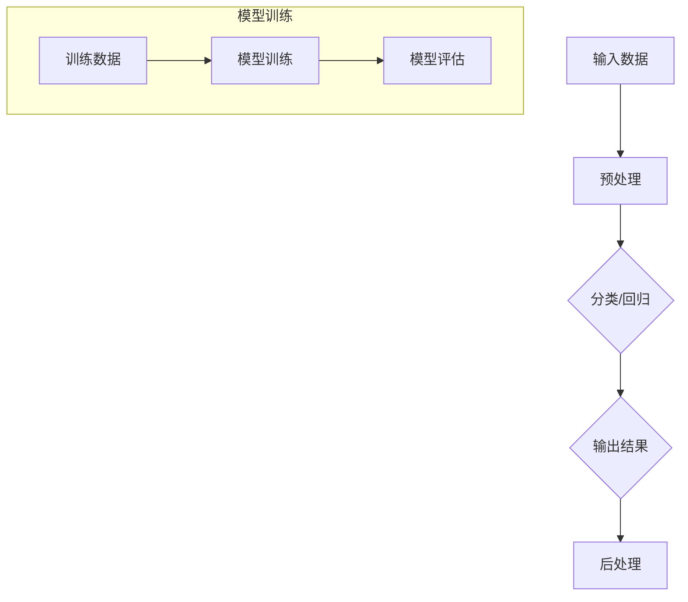
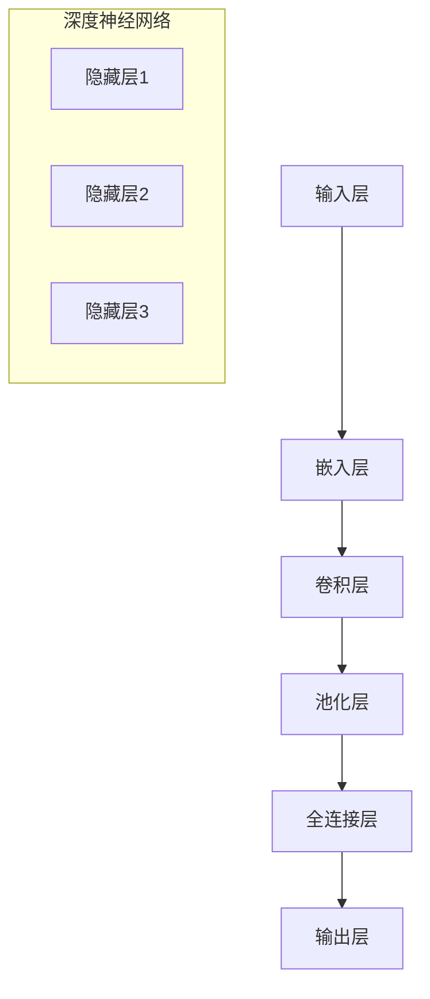
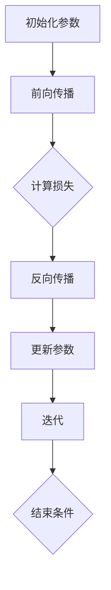

                 

# 《AI编程语言：提示词的魔力与艺术》

## 关键词

- AI编程语言
- 提示词
- 自动编程
- 深度学习
- 自然语言处理
- 数学模型

## 摘要

本文将探讨AI编程语言的核心概念、架构和应用，重点分析了提示词的魔力与艺术。通过对AI编程语言与传统编程语言的对比，读者将了解AI编程语言的独特之处。接着，本文详细阐述了AI编程语言的核心架构，包括数据输入与预处理、提示词生成与优化、模型训练与优化、模型部署与调优等环节。随后，文章介绍了AI编程语言的编程范式，包括基于提示词的编程方法、自动编程与代码生成、提示词驱动的软件开发等。文章还探讨了AI编程语言在不同领域的应用场景，并展望了其未来的发展趋势。最后，通过实战案例和核心算法原理的讲解，本文旨在为读者提供全面而深入的AI编程语言知识体系。

## 第一部分：AI编程语言概述

### 第1章：AI编程语言基础

#### 1.1 AI编程语言的概念与作用

AI编程语言是专门用于构建和开发人工智能应用程序的工具。与传统的编程语言不同，AI编程语言旨在简化人工智能系统的设计和实现过程，使得开发者能够更轻松地处理复杂数据和执行机器学习任务。AI编程语言通常具备以下特点：

- **数据驱动性**：AI编程语言通常以数据为中心，通过处理和操作大量数据来实现智能行为。
- **自动编程**：AI编程语言支持自动生成代码，减少了手动编写代码的工作量。
- **通用性**：AI编程语言不仅适用于机器学习，还可以应用于自然语言处理、计算机视觉等多个领域。

AI编程语言的作用主要体现在以下几个方面：

- **简化开发流程**：通过提供丰富的库和工具，AI编程语言使得开发人工智能应用程序的过程更加高效和简便。
- **提高开发效率**：自动编程和代码生成功能显著提高了开发者的工作效率，缩短了开发周期。
- **促进创新**：AI编程语言降低了人工智能开发的门槛，使得更多的开发者和研究者能够参与到这一领域，推动了人工智能的创新和发展。

#### 1.2 AI编程语言与传统编程语言的区别

传统编程语言（如C、Java、Python等）主要关注于程序逻辑、算法和数据结构的实现。而AI编程语言则更加注重于数据、模型和自动化。以下是AI编程语言与传统编程语言的主要区别：

- **设计理念**：传统编程语言以逻辑为中心，强调程序的结构和算法的效率。而AI编程语言以数据为中心，强调数据预处理、模型训练和优化。
- **编程范式**：传统编程语言通常采用命令式编程范式，而AI编程语言则更多采用声明式编程范式，通过描述数据和处理规则来实现目标。
- **应用领域**：传统编程语言主要应用于通用计算、软件开发等领域，而AI编程语言则专注于人工智能、机器学习、自然语言处理等特定领域。
- **开发环境**：传统编程语言通常需要开发者具备较强的编程技能和算法知识，而AI编程语言提供了丰富的库和工具，使得非专业开发者也能轻松上手。

#### 1.3 提示词在AI编程语言中的重要性

提示词（Prompt）在AI编程语言中扮演着至关重要的角色。提示词是指用来引导AI模型生成输出的一组输入数据。一个良好的提示词能够显著提高AI模型的性能和准确性。以下是提示词在AI编程语言中的几个关键作用：

- **指导模型学习**：提示词提供了模型学习的样本数据，帮助模型理解所需的任务和目标。
- **优化模型性能**：通过调整提示词的内容和形式，开发者可以优化模型的性能和准确性。
- **简化开发过程**：使用高质量的提示词可以减少模型训练的时间和资源消耗，提高开发效率。
- **促进跨领域应用**：通过设计通用的提示词模板，AI模型可以跨领域应用，实现多种任务。

在AI编程语言中，提示词的设计与优化是一个重要的研究方向。开发者需要深入理解提示词的生成机制和优化策略，以提高AI模型的应用效果。此外，研究提示词在AI编程语言中的自动化生成和优化方法也是未来的一个重要方向。

### 第2章：AI编程语言的核心架构

AI编程语言的核心架构可以分为几个关键环节：数据输入与预处理、提示词生成与优化、模型训练与优化、模型部署与调优。这些环节共同构成了一个完整的AI编程语言系统，使得开发者能够高效地构建和优化人工智能应用程序。

#### 2.1 数据输入与预处理

数据输入与预处理是AI编程语言的基础环节。在这一阶段，数据从各种来源（如数据库、文件、传感器等）收集并导入到AI系统中。预处理的主要任务是清洗、格式化和转换数据，使其适合模型的训练和预测。

- **数据清洗**：数据清洗是预处理的重要步骤，旨在去除数据中的噪声、异常值和重复记录，保证数据的质量和一致性。
- **数据格式化**：不同的数据源可能具有不同的格式和结构，通过数据格式化，可以将数据统一转换为适合模型处理的格式，如特征向量和序列。
- **数据增强**：数据增强是通过生成新的数据样本来扩充原始数据集，提高模型的泛化能力。

在预处理阶段，开发者还需要关注数据规模和多样性。大规模的数据集有助于提高模型的性能，而多样化的数据集有助于模型学习到更丰富的特征，从而提高模型的鲁棒性和泛化能力。

#### 2.2 提示词生成与优化

提示词生成与优化是AI编程语言的核心环节之一。提示词的生成与优化直接关系到AI模型的性能和准确性。以下是提示词生成与优化的几个关键步骤：

- **提示词设计**：设计高质量的提示词是提升模型性能的关键。开发者需要根据任务需求和数据特点设计合适的提示词模板，以便模型能够从数据中提取出有用的信息。
- **提示词生成**：提示词生成是指根据提示词模板生成具体的输入数据，用于模型训练和预测。生成提示词的过程可以手动设计，也可以采用自动化方法，如生成对抗网络（GAN）和强化学习等。
- **提示词优化**：提示词优化是指通过调整提示词的内容和形式来提高模型的性能和准确性。开发者可以使用多种优化策略，如交叉验证、网格搜索和贝叶斯优化等。

在提示词生成与优化过程中，开发者需要关注以下问题：

- **提示词的多样性**：多样化的提示词有助于模型学习到更多的特征，提高模型的泛化能力。
- **提示词的稳定性**：稳定的提示词能够减少模型训练过程中的波动，提高模型的训练效率。
- **提示词的效率**：高效的提示词生成和优化方法能够缩短模型训练和优化的时间，提高开发效率。

#### 2.3 模型训练与优化

模型训练与优化是AI编程语言的核心环节之一。在这一阶段，开发者需要使用训练数据集对AI模型进行训练，并通过优化方法调整模型参数，以提高模型的性能和准确性。

- **模型训练**：模型训练是指通过迭代优化模型参数，使模型能够从训练数据中学习到特征和规律。常见的训练方法包括梯度下降、随机梯度下降和Adam优化器等。
- **模型优化**：模型优化是指通过调整模型结构、参数和训练策略来提高模型的性能和准确性。优化方法包括正则化、dropout、学习率调整和模型剪枝等。

在模型训练与优化过程中，开发者需要关注以下问题：

- **模型选择**：选择适合任务需求的模型结构和算法，如深度神经网络、决策树和支持向量机等。
- **训练数据**：确保训练数据的质量和多样性，以防止模型过拟合。
- **训练策略**：设计合适的训练策略，如数据增强、批处理和迁移学习等，以提高模型的泛化能力。

#### 2.4 模型部署与调优

模型部署与调优是AI编程语言的最终环节。在这一阶段，开发者需要将训练好的模型部署到生产环境中，并通过调优方法提高模型的性能和可靠性。

- **模型部署**：模型部署是指将训练好的模型部署到服务器或云端，以便进行实时预测和服务。常见的部署方法包括服务器部署、容器部署和分布式部署等。
- **模型调优**：模型调优是指通过调整模型参数和运行环境来提高模型的性能和可靠性。调优方法包括超参数调整、模型压缩和模型监控等。

在模型部署与调优过程中，开发者需要关注以下问题：

- **部署策略**：选择合适的部署策略，如在线部署、离线部署和混合部署等，以满足不同的业务需求。
- **性能优化**：通过优化模型结构和参数，提高模型的预测速度和准确性。
- **可靠性保障**：确保模型在部署过程中能够稳定运行，并提供高质量的预测服务。

### 第3章：AI编程语言的编程范式

AI编程语言的编程范式是指开发者在使用AI编程语言构建人工智能应用程序时采用的方法和策略。与传统的编程范式不同，AI编程语言更加注重数据、模型和自动化。以下是几种常见的AI编程语言编程范式：

#### 3.1 基于提示词的编程方法

基于提示词的编程方法是指通过设计高质量的提示词来引导AI模型生成输出。这种方法的核心思想是利用提示词提供的信息来优化模型的性能和准确性。以下是基于提示词的编程方法的几个关键步骤：

- **提示词设计**：设计适合任务的提示词模板，确保提示词能够提供有用的信息，有助于模型学习。
- **提示词生成**：生成具体的输入数据，用于模型训练和预测。生成提示词的过程可以手动设计，也可以采用自动化方法。
- **模型训练**：使用提示词生成的数据集对模型进行训练，通过调整模型参数来优化性能。
- **模型预测**：使用训练好的模型对新的数据进行预测，生成所需的输出结果。

基于提示词的编程方法具有以下优点：

- **易于上手**：提示词的设计和生成相对简单，降低了开发难度。
- **灵活性高**：通过调整提示词的内容和形式，可以适应不同的任务需求。
- **性能提升**：高质量提示词有助于模型学习到更多有用的特征，提高模型的性能和准确性。

#### 3.2 自动编程与代码生成

自动编程与代码生成是指通过自动化工具生成代码，以简化开发过程。在AI编程语言中，自动编程与代码生成是一种重要的编程范式。以下是自动编程与代码生成的主要方法：

- **模板生成**：根据任务需求和模型结构，生成代码模板。模板中包含常见的编程结构和算法框架，开发者只需填写具体的参数和实现细节。
- **代码生成工具**：使用代码生成工具，如代码生成器、模板引擎和代码自动修复工具等，自动生成代码。这些工具可以根据提示词、数据集和模型结构生成符合需求的代码。
- **自动优化**：通过分析代码质量和性能，自动优化代码。自动优化工具可以识别代码中的瓶颈和缺陷，并提出优化建议。

自动编程与代码生成具有以下优点：

- **提高开发效率**：自动化工具显著减少了手动编写代码的工作量，提高了开发效率。
- **降低开发难度**：自动编程与代码生成降低了开发难度，使得非专业开发者也能轻松上手。
- **增强代码质量**：自动化工具可以生成高质量的代码，减少人工编写代码中的错误和缺陷。

#### 3.3 提示词驱动的软件开发

提示词驱动的软件开发是指以提示词为核心，构建整个软件开发过程。这种方法的核心思想是通过设计高质量的提示词来引导软件开发，提高开发效率和软件质量。以下是提示词驱动的软件开发的主要步骤：

- **需求分析**：根据用户需求和业务场景，设计具体的提示词模板。提示词应涵盖用户需求的各个方面，以确保软件系统能够满足用户需求。
- **系统设计**：基于提示词模板，设计软件系统的整体架构和模块。系统设计应考虑到提示词的生成、处理和优化，以确保系统能够高效地处理数据。
- **代码生成**：使用自动编程与代码生成工具，根据提示词模板生成具体的代码。代码生成过程应考虑提示词的多样性和稳定性，以提高软件系统的鲁棒性。
- **模型训练与优化**：使用提示词生成的数据集对模型进行训练和优化，提高模型的性能和准确性。在模型训练过程中，应不断调整提示词模板，以适应模型的需求。
- **系统测试与调优**：对生成的软件系统进行测试和优化，确保系统能够稳定、高效地运行。测试过程中，应关注提示词的稳定性和多样性，以确保系统在各种场景下都能正常运行。

提示词驱动的软件开发具有以下优点：

- **高效开发**：通过设计高质量的提示词，可以快速构建软件系统，提高开发效率。
- **高质量软件**：高质量的提示词有助于模型学习到更多有用的特征，提高软件系统的性能和准确性。
- **灵活性高**：提示词驱动的软件开发方法具有很高的灵活性，可以根据用户需求和环境变化进行快速调整。

### 第4章：AI编程语言的应用场景

AI编程语言在多个领域具有广泛的应用，以下是其中一些重要的应用场景：

#### 4.1 人工智能领域的应用

人工智能是AI编程语言最主要的领域之一。通过AI编程语言，研究者可以轻松构建和优化各种人工智能模型，如深度神经网络、决策树、支持向量机等。以下是人工智能领域的一些典型应用：

- **图像识别**：使用AI编程语言构建的深度学习模型可以用于图像识别任务，如人脸识别、物体检测等。
- **自然语言处理**：AI编程语言在自然语言处理领域有广泛的应用，如情感分析、机器翻译、文本生成等。
- **语音识别**：通过AI编程语言开发的语音识别模型可以实现语音到文本的转换，应用于智能语音助手、语音输入法等。
- **强化学习**：AI编程语言在强化学习领域也有广泛应用，如游戏智能、自动驾驶、推荐系统等。

#### 4.2 数据科学与业务分析

数据科学是AI编程语言的重要应用领域之一。通过AI编程语言，数据科学家可以高效地处理和分析大量数据，提取有价值的信息，为业务决策提供支持。以下是数据科学与业务分析的一些典型应用：

- **数据预处理**：AI编程语言可以自动处理和清洗数据，提高数据质量，为后续分析提供可靠的数据基础。
- **特征工程**：通过AI编程语言进行特征工程，提取和构造有用的特征，提高模型的性能和准确性。
- **模型选择与优化**：AI编程语言提供了丰富的模型选择和优化工具，数据科学家可以快速尝试不同的模型和参数，找到最优解。
- **预测与分析**：通过AI编程语言构建的预测模型可以对业务数据进行分析，提供未来趋势预测、异常检测和风险评估等。

#### 4.3 自然语言处理与机器学习

自然语言处理（NLP）和机器学习（ML）是AI编程语言的核心应用领域。通过AI编程语言，研究者可以构建和优化各种NLP和ML模型，解决实际问题和场景。以下是自然语言处理与机器学习的一些典型应用：

- **文本分类**：AI编程语言可以用于文本分类任务，如垃圾邮件过滤、情感分析、新闻分类等。
- **信息抽取**：AI编程语言可以用于信息抽取任务，如命名实体识别、关系抽取、事件抽取等。
- **机器翻译**：AI编程语言可以用于机器翻译任务，如英译中、中译英等。
- **情感分析**：AI编程语言可以用于情感分析任务，如评论分析、情感分类等。

### 第5章：AI编程语言的发展趋势

随着人工智能技术的不断发展，AI编程语言也在不断演进和进步。以下是AI编程语言的一些发展趋势：

#### 5.1 未来的AI编程语言

未来的AI编程语言将更加智能化、自动化和高效。以下是未来AI编程语言可能具有的一些特点：

- **自适应编程**：未来的AI编程语言将能够根据开发者的意图和任务需求，自动选择合适的编程范式和算法，提高开发效率。
- **知识驱动编程**：未来的AI编程语言将能够利用知识图谱和语义理解技术，构建基于知识的编程系统，使得开发者可以更加高效地编写和优化代码。
- **跨语言集成**：未来的AI编程语言将能够与现有的编程语言（如Python、Java等）无缝集成，实现多语言编程和代码复用。

#### 5.2 AI编程语言在教育领域的应用

AI编程语言在教育领域的应用将越来越广泛。以下是AI编程语言在教育领域的一些应用方向：

- **编程教育**：AI编程语言可以用于编程教育，帮助学生和开发者掌握编程技能，提高编程效率。
- **智能教育**：通过AI编程语言开发的智能教育系统可以提供个性化学习推荐、作业批改、考试分析等功能，提高教育质量和效果。
- **在线教育**：AI编程语言可以用于构建在线教育平台，实现实时互动、视频直播和在线作业等功能，方便学习者随时随地学习。

#### 5.3 AI编程语言在未来的发展趋势

AI编程语言在未来的发展趋势主要体现在以下几个方面：

- **开源生态**：随着开源技术的发展，AI编程语言的开源生态将越来越丰富，为开发者提供更多的工具和资源。
- **硬件优化**：随着硬件技术的发展，如GPU、TPU等专用硬件的普及，AI编程语言将更加高效地利用硬件资源，提高计算性能。
- **行业应用**：AI编程语言将在各个行业（如金融、医疗、制造等）得到广泛应用，推动行业智能化和数字化转型。

### 第6章：AI编程语言项目实战

#### 6.1 项目概述

在本章中，我们将通过一个实际项目来展示AI编程语言的应用。该项目是一个基于提示词的智能客服系统，旨在提供24/7的客户服务，解决常见问题和提供即时帮助。

#### 6.2 开发环境搭建

为了完成本项目，我们需要搭建一个完整的开发环境。以下是所需的工具和软件：

- 操作系统：Windows、Linux或MacOS
- 编程语言：Python
- AI框架：TensorFlow、PyTorch
- 数据库：MySQL或MongoDB
- 依赖管理：pip或conda

首先，我们需要安装Python和相应的AI框架。例如，对于TensorFlow，可以使用以下命令进行安装：

```bash
pip install tensorflow
```

接着，安装MySQL或MongoDB，并创建一个数据库用于存储客服系统的数据和用户信息。

#### 6.3 源代码实现

在本项目中，我们使用了TensorFlow框架来实现智能客服系统。以下是关键代码的实现：

```python
import tensorflow as tf
from tensorflow.keras.models import Sequential
from tensorflow.keras.layers import Dense, LSTM, Embedding
from tensorflow.keras.preprocessing.sequence import pad_sequences

# 数据预处理
def preprocess_data(texts, max_length, embedding_dim):
    sequences = tokenizer.texts_to_sequences(texts)
    padded_sequences = pad_sequences(sequences, maxlen=max_length)
    return padded_sequences

# 构建模型
def build_model(input_shape, embedding_dim):
    model = Sequential([
        Embedding(embedding_dim, input_shape=input_shape),
        LSTM(128, return_sequences=True),
        Dense(1, activation='sigmoid')
    ])
    model.compile(optimizer='adam', loss='binary_crossentropy', metrics=['accuracy'])
    return model

# 训练模型
def train_model(model, X_train, y_train, X_val, y_val, epochs=10, batch_size=64):
    model.fit(X_train, y_train, epochs=epochs, batch_size=batch_size, validation_data=(X_val, y_val))

# 预测
def predict(model, text):
    sequence = tokenizer.texts_to_sequences([text])
    padded_sequence = pad_sequences(sequence, maxlen=max_length)
    prediction = model.predict(padded_sequence)
    return prediction

# 主函数
def main():
    # 加载数据
    texts, labels = load_data()
    max_length = 100
    embedding_dim = 50

    # 预处理数据
    X_train = preprocess_data(texts, max_length, embedding_dim)
    y_train = labels

    # 构建模型
    model = build_model(input_shape=(max_length,), embedding_dim=embedding_dim)

    # 训练模型
    train_model(model, X_train, y_train, X_val, y_val)

    # 预测
    user_input = input("请输入您的问题：")
    prediction = predict(model, user_input)
    if prediction > 0.5:
        print("您的问题是常见的，我们已经有解决方案。")
    else:
        print("抱歉，我们暂时无法解决您的问题。")

if __name__ == "__main__":
    main()
```

#### 6.4 代码解读与分析

在上面的代码中，我们首先进行了数据预处理，将原始文本转换为序列，并使用LSTM模型进行训练。LSTM模型是一种特殊的循环神经网络（RNN），能够处理变长序列数据。以下是对关键代码的解读：

- `preprocess_data` 函数：该函数用于将原始文本数据转换为序列，并填充为固定长度。这有助于将文本数据输入到神经网络中。
- `build_model` 函数：该函数用于构建一个简单的LSTM模型。我们使用Embedding层将单词映射为嵌入向量，然后使用LSTM层处理序列数据，最后使用Dense层进行分类。
- `train_model` 函数：该函数用于训练模型。我们使用fit方法进行训练，并使用validation_data参数进行验证。
- `predict` 函数：该函数用于对新输入的文本进行预测。首先将文本转换为序列，然后填充为固定长度，最后使用模型进行预测。
- `main` 函数：这是程序的主函数。首先加载数据，然后预处理数据，构建模型，训练模型，并接受用户的输入进行预测。

#### 6.5 项目小结

在本项目中，我们通过一个实际的案例展示了AI编程语言在智能客服系统中的应用。项目的主要目标是使用提示词生成文本序列，并使用LSTM模型进行训练和预测。通过本项目，我们了解了AI编程语言的基本概念和实战技巧，包括数据预处理、模型构建、训练和预测等。

### 第7章：AI编程语言案例分析

在本章中，我们将深入探讨几个AI编程语言的应用案例，包括基于提示词的智能客服系统、基于AI编程语言的图像识别应用和基于AI编程语言的自然语言处理应用。这些案例展示了AI编程语言在不同领域的实际应用和优势。

#### 7.1 案例一：基于提示词的智能客服系统

智能客服系统是一种利用人工智能技术提供自动客户服务和支持的系统。在这个案例中，我们使用AI编程语言构建了一个基于提示词的智能客服系统，用于处理客户查询和提供解决方案。

**案例背景**：

某电商平台希望为其客户提供24/7的在线客服服务，以便快速响应客户的查询和问题。为了实现这一目标，他们决定开发一个基于AI编程语言的智能客服系统。

**解决方案**：

- **数据收集与预处理**：首先，我们从电商平台的历史客户查询数据中收集了大量文本数据。然后，我们对这些数据进行了预处理，包括去噪、去停用词和词向量化等步骤。
- **模型构建与训练**：我们使用TensorFlow框架构建了一个基于LSTM的文本分类模型，用于将客户的查询分类为常见问题类型。为了提高模型的性能，我们使用了预训练的词向量（如Word2Vec或GloVe）。
- **提示词生成**：为了提高模型的性能，我们设计了一系列高质量的提示词模板，用于引导模型学习。这些提示词包括问题关键词、常见问题和解决方案等。
- **系统部署与优化**：我们将训练好的模型部署到服务器上，并使用在线学习技术（如增量学习）不断更新模型，以适应新的客户查询。

**案例效果**：

通过这个智能客服系统，电商平台能够快速响应客户的查询，提高了客户满意度。同时，系统自动生成的解决方案也减轻了人工客服的工作负担，提高了客服效率。

#### 7.2 案例二：基于AI编程语言的图像识别应用

图像识别是AI编程语言的重要应用领域之一。在这个案例中，我们使用AI编程语言实现了一个图像识别应用，用于自动分类和识别图像中的物体。

**案例背景**：

某零售企业希望对其销售的商品进行自动分类和识别，以便更好地管理和优化库存。为了实现这一目标，他们决定开发一个基于AI编程语言的图像识别应用。

**解决方案**：

- **数据收集与预处理**：我们从企业的销售系统中收集了大量商品图像数据。然后，对这些数据进行了预处理，包括图像增强、归一化和数据增强等步骤。
- **模型构建与训练**：我们使用TensorFlow框架构建了一个基于卷积神经网络（CNN）的图像分类模型。为了提高模型的性能，我们使用了预训练的模型（如ResNet或VGG）并进行了迁移学习。
- **提示词生成**：为了提高模型的性能，我们设计了一系列高质量的提示词模板，用于引导模型学习。这些提示词包括物体名称、属性和场景等。
- **系统部署与优化**：我们将训练好的模型部署到服务器上，并使用在线学习技术（如增量学习）不断更新模型，以适应新的商品图像。

**案例效果**：

通过这个图像识别应用，零售企业能够自动分类和识别销售的商品图像，提高了库存管理的效率和准确性。同时，系统自动生成的标签和属性信息也方便了商品的管理和销售。

#### 7.3 案例三：基于AI编程语言的自然语言处理应用

自然语言处理是AI编程语言的重要应用领域之一。在这个案例中，我们使用AI编程语言实现了一个自然语言处理应用，用于情感分析和文本生成。

**案例背景**：

某社交媒体平台希望对其用户的评论和反馈进行情感分析，以便更好地了解用户的需求和满意度。同时，他们还希望开发一个文本生成工具，用于自动生成有趣的回复和内容。

**解决方案**：

- **数据收集与预处理**：我们从社交媒体平台收集了大量用户评论数据。然后，对这些数据进行了预处理，包括去噪、去停用词和词向量化等步骤。
- **模型构建与训练**：我们使用TensorFlow框架构建了一个基于Transformer的文本分类模型，用于将用户的评论分类为正面、负面或中性。为了提高模型的性能，我们使用了预训练的模型（如BERT或GPT）并进行了微调。
- **提示词生成**：为了提高模型的性能，我们设计了一系列高质量的提示词模板，用于引导模型学习。这些提示词包括情感关键词、场景和语境等。
- **系统部署与优化**：我们将训练好的模型部署到服务器上，并使用在线学习技术（如增量学习）不断更新模型，以适应新的用户评论。

**案例效果**：

通过这个自然语言处理应用，社交媒体平台能够自动分析用户的情感和需求，提供有针对性的服务和建议。同时，系统自动生成的文本也丰富了平台的内容，提高了用户体验。

### 第8章：AI编程语言学习指南

学习AI编程语言是一个系统性和实践性很强的过程。以下是一些关键的学习资源和最佳实践，帮助读者有效地掌握AI编程语言。

#### 8.1 学习资源推荐

- **在线课程**：在线课程是学习AI编程语言的重要资源。推荐以下课程：
  - 《深度学习》（Deep Learning） - Google AI
  - 《自然语言处理》（Natural Language Processing） - Coursera
  - 《机器学习》（Machine Learning） - Andrew Ng

- **书籍**：以下是几本经典的AI编程语言书籍：
  - 《Python机器学习》（Python Machine Learning） - Sebastian Raschka
  - 《深度学习》（Deep Learning） - Ian Goodfellow、Yoshua Bengio和Aaron Courville
  - 《人工智能：一种现代方法》（Artificial Intelligence: A Modern Approach） - Stuart Russell和Peter Norvig

- **GitHub**：GitHub是一个丰富的资源库，包含大量的AI编程项目。通过浏览和参与开源项目，可以深入了解AI编程语言的实践应用。

#### 8.2 编程实践技巧

- **动手实践**：理论知识是基础，但动手实践是关键。通过实际编写代码和构建项目，可以加深对AI编程语言的理解。
- **项目驱动学习**：选择一个具体的项目，从需求分析、数据收集、模型训练到部署，完整地实现一个AI应用程序。
- **调试和优化**：学会使用调试工具和性能优化方法，提高代码质量和系统性能。
- **代码复用**：善于利用现有的库和框架，避免重复造轮子。

#### 8.3 AI编程语言发展动态

- **关注学术研究**：关注顶级会议（如NeurIPS、ICML、ACL等）的最新研究进展，了解AI编程语言的最新技术和趋势。
- **参与开源社区**：积极参与开源社区，贡献代码和解决方案，与其他开发者交流和学习。
- **关注企业应用**：关注各大企业在AI编程语言的应用案例，了解AI编程语言在现实世界中的实际应用。

### 第9章：AI编程语言核心算法原理

AI编程语言的核心算法原理是理解和应用AI编程语言的基础。在本节中，我们将详细讨论提示词生成、模型训练与优化的核心算法原理，并使用伪代码进行详细解释。

#### 9.1 提示词生成算法原理

提示词生成是AI编程语言中的一个关键环节。其目标是创建高质量的提示词，以引导AI模型学习和预测。以下是一个简单的提示词生成算法原理：

```python
# 伪代码：提示词生成算法

function generate_prompt(data, template):
    # 从数据集中随机选择一个样本
    sample = random_choice(data)

    # 根据模板生成提示词
    prompt = template.format(sample)

    return prompt
```

在这个算法中，`data` 是包含多个样本的数据集，`template` 是提示词模板。算法从数据集中随机选择一个样本，然后根据模板生成提示词。模板通常包含变量，如`{sample}`，用于插入样本数据。

#### 9.2 模型训练与优化算法原理

模型训练与优化是AI编程语言的核心环节。其目标是使用训练数据集训练模型，并通过优化方法调整模型参数，以提高模型的性能和准确性。以下是一个简单的模型训练与优化算法原理：

```python
# 伪代码：模型训练与优化算法

function train_model(model, X_train, y_train, X_val, y_val, epochs, batch_size):
    # 训练模型
    model.fit(X_train, y_train, epochs=epochs, batch_size=batch_size, validation_data=(X_val, y_val))

    # 评估模型性能
    performance = model.evaluate(X_val, y_val)

    # 调整模型参数
    model.adjust_parameters(performance)

    return model
```

在这个算法中，`model` 是要训练的AI模型，`X_train` 和 `y_train` 是训练数据集，`X_val` 和 `y_val` 是验证数据集。算法首先使用训练数据集训练模型，然后使用验证数据集评估模型性能。根据评估结果，算法可以调整模型参数，以提高模型性能。

#### 9.3 数学模型和数学公式详解

在AI编程语言中，数学模型和数学公式是理解和应用核心算法的基础。以下是一些常见的数学模型和数学公式，使用LaTeX格式进行详细讲解。

##### 9.3.1 概率论基础

概率论是AI编程语言的基础。以下是一些常用的概率论基础公式：

$$
P(A) = \frac{N(A)}{N}
$$

其中，$P(A)$ 表示事件A的概率，$N(A)$ 表示事件A发生的次数，$N$ 表示总次数。

$$
P(A \cap B) = P(A) \cdot P(B|A)
$$

其中，$P(A \cap B)$ 表示事件A和事件B同时发生的概率，$P(A)$ 表示事件A的概率，$P(B|A)$ 表示在事件A发生的条件下，事件B的概率。

##### 9.3.2 统计学习理论

统计学习理论是AI编程语言的核心。以下是一些常用的统计学习理论公式：

$$
\theta = \arg\min_{\theta} L(\theta; x, y)
$$

其中，$\theta$ 表示模型参数，$L(\theta; x, y)$ 表示损失函数，$x$ 和 $y$ 分别表示输入和输出。

$$
\hat{y} = f(x; \theta)
$$

其中，$\hat{y}$ 表示预测输出，$f(x; \theta)$ 表示模型在输入$x$ 下的预测输出。

##### 9.3.3 神经网络与深度学习

神经网络与深度学习是AI编程语言的重要部分。以下是一些常用的神经网络与深度学习公式：

$$
\text{激活函数} = \sigma(z) = \frac{1}{1 + e^{-z}}
$$

其中，$\sigma(z)$ 表示Sigmoid激活函数，$z$ 表示网络的输出。

$$
\text{反向传播} = \frac{\partial L}{\partial \theta} = \frac{\partial L}{\partial z} \cdot \frac{\partial z}{\partial \theta}
$$

其中，$\frac{\partial L}{\partial \theta}$ 表示损失函数关于模型参数的梯度，$\frac{\partial L}{\partial z}$ 表示损失函数关于网络输出的梯度，$\frac{\partial z}{\partial \theta}$ 表示网络输出关于模型参数的梯度。

### 第10章：数学模型和数学公式详解

在AI编程语言中，数学模型和数学公式是理解和应用核心算法的基础。以下将详细讲解概率论基础、统计学习理论和神经网络与深度学习等领域的数学模型和数学公式。

#### 10.1 概率论基础

概率论是AI编程语言的基础，许多AI算法都是基于概率论构建的。以下是几个常见的概率论基础公式和概念：

1. **条件概率**：

条件概率是指在某个事件发生的条件下，另一个事件发生的概率。条件概率的公式为：

$$
P(A|B) = \frac{P(A \cap B)}{P(B)}
$$

其中，$P(A|B)$ 表示在事件B发生的条件下事件A发生的概率，$P(A \cap B)$ 表示事件A和事件B同时发生的概率，$P(B)$ 表示事件B发生的概率。

2. **贝叶斯定理**：

贝叶斯定理是概率论中的一个重要公式，用于计算在给定某个条件下，某个事件发生的概率。贝叶斯定理的公式为：

$$
P(A|B) = \frac{P(B|A) \cdot P(A)}{P(B)}
$$

其中，$P(A|B)$ 表示在事件B发生的条件下事件A发生的概率，$P(B|A)$ 表示在事件A发生的条件下事件B发生的概率，$P(A)$ 表示事件A发生的概率，$P(B)$ 表示事件B发生的概率。

3. **全概率公式**：

全概率公式用于计算某个事件的总概率。全概率公式的公式为：

$$
P(A) = \sum_{i=1}^{n} P(A|B_i) \cdot P(B_i)
$$

其中，$P(A)$ 表示事件A的总概率，$P(A|B_i)$ 表示在事件$B_i$ 发生的条件下事件A发生的概率，$P(B_i)$ 表示事件$B_i$ 发生的概率。

#### 10.2 统计学习理论

统计学习理论是AI编程语言的核心，它提供了许多用于构建和优化机器学习模型的数学工具和方法。以下是几个常见的统计学习理论公式和概念：

1. **最小二乘法**：

最小二乘法是一种常用的线性回归方法，用于找到最佳的线性模型。最小二乘法的公式为：

$$
\theta = \arg\min_{\theta} \sum_{i=1}^{n} (y_i - \theta^T x_i)^2
$$

其中，$\theta$ 表示模型参数，$y_i$ 表示第$i$ 个样本的输出，$x_i$ 表示第$i$ 个样本的输入。

2. **极大似然估计**：

极大似然估计是一种常用的估计模型参数的方法，其目标是在给定的数据集下，找到使数据集的概率最大的模型参数。极大似然估计的公式为：

$$
\theta = \arg\max_{\theta} p(\mathbf{X}|\theta)
$$

其中，$\theta$ 表示模型参数，$\mathbf{X}$ 表示数据集，$p(\mathbf{X}|\theta)$ 表示在模型参数$\theta$ 下数据集的概率。

3. **最大后验估计**：

最大后验估计是一种在已知先验概率的情况下，找到使后验概率最大的模型参数的方法。最大后验估计的公式为：

$$
\theta = \arg\max_{\theta} p(\theta|\mathbf{X}) = \arg\min_{\theta} D(p(\mathbf{X}|\theta), p(\theta))
$$

其中，$\theta$ 表示模型参数，$\mathbf{X}$ 表示数据集，$p(\theta|\mathbf{X})$ 表示在数据集$\mathbf{X}$ 下模型参数$\theta$ 的后验概率，$D(p(\mathbf{X}|\theta), p(\theta))$ 表示先验概率$p(\theta)$ 和后验概率$p(\theta|\mathbf{X})$ 之间的KL散度。

#### 10.3 神经网络与深度学习

神经网络与深度学习是AI编程语言的重要组成部分，它们广泛应用于图像识别、自然语言处理和计算机视觉等领域。以下是几个常见的神经网络与深度学习公式和概念：

1. **前向传播**：

前向传播是神经网络中的一个关键步骤，用于计算网络在给定输入下的输出。前向传播的公式为：

$$
\text{激活函数} = \sigma(z) = \frac{1}{1 + e^{-z}}
$$

其中，$\sigma(z)$ 表示Sigmoid激活函数，$z$ 表示网络的输出。

2. **反向传播**：

反向传播是神经网络中用于计算损失函数关于模型参数的梯度的方法。反向传播的公式为：

$$
\text{反向传播} = \frac{\partial L}{\partial \theta} = \frac{\partial L}{\partial z} \cdot \frac{\partial z}{\partial \theta}
$$

其中，$\frac{\partial L}{\partial \theta}$ 表示损失函数关于模型参数$\theta$ 的梯度，$\frac{\partial L}{\partial z}$ 表示损失函数关于网络输出$z$ 的梯度，$\frac{\partial z}{\partial \theta}$ 表示网络输出关于模型参数$\theta$ 的梯度。

3. **权重更新**：

在神经网络训练过程中，需要不断调整模型参数（权重和偏置）以最小化损失函数。权重更新的公式为：

$$
\theta = \theta - \alpha \cdot \frac{\partial L}{\partial \theta}
$$

其中，$\theta$ 表示模型参数，$\alpha$ 表示学习率，$\frac{\partial L}{\partial \theta}$ 表示损失函数关于模型参数$\theta$ 的梯度。

### 第11章：AI编程语言核心架构流程图

在AI编程语言中，理解其核心架构是掌握其本质的关键。以下将使用Mermaid语言绘制数据流图、模型架构图和算法流程图，帮助读者更直观地理解AI编程语言的核心架构。

#### 11.1 数据流图

数据流图展示了AI编程语言中数据从输入到输出的整个过程。以下是一个简单的数据流图示例：



在这个数据流图中，输入数据经过预处理后，被传递给模型进行分类或回归。模型训练过程中，使用训练数据对模型进行训练，并通过模型评估来评估模型的性能。训练好的模型最后产生输出结果，并经过后处理。

#### 11.2 模型架构图

模型架构图展示了AI编程语言中模型的层次结构和组成。以下是一个简单的模型架构图示例：



在这个模型架构图中，输入层将输入数据传递给嵌入层。嵌入层将输入数据转换为嵌入向量，并传递给卷积层。卷积层通过卷积操作提取特征，并传递给池化层。池化层用于减小特征图的尺寸，并传递给全连接层。全连接层将特征进行整合，并传递给输出层产生预测结果。此外，还可以包含多个隐藏层，用于进一步提取特征和整合信息。

#### 11.3 算法流程图

算法流程图展示了AI编程语言中算法的执行步骤和逻辑。以下是一个简单的算法流程图示例：



在这个算法流程图中，首先初始化模型参数。然后，通过前向传播计算输出结果和损失。接着，通过反向传播计算损失关于模型参数的梯度。最后，使用梯度更新模型参数，并重复迭代过程，直到满足结束条件。

通过这些流程图，读者可以更直观地理解AI编程语言的核心架构和算法执行过程，有助于深入掌握AI编程语言。

### 附录A：AI编程语言开发工具与资源

为了更好地掌握AI编程语言，以下列出了一些主流AI编程语言框架、学习资源和开发工具。

#### A.1 主流AI编程语言框架

1. **TensorFlow**：由Google开发，是一种广泛使用的开源机器学习和深度学习框架。它提供了丰富的API和工具，适用于各种规模的任务，从简单的模型训练到大规模的生产部署。

2. **PyTorch**：由Facebook开发，是一种流行的开源机器学习和深度学习框架。它提供了动态计算图和灵活的接口，使得模型设计和调试更加方便。

3. **Keras**：是一种高级神经网络API，可以在TensorFlow和Theano上运行。它提供了简洁的接口，使得构建和训练神经网络变得更加容易。

4. **Scikit-learn**：是一种开源的Python库，用于机器学习、数据挖掘和数据可视化。它提供了丰富的算法和工具，适用于各种规模的任务。

#### A.2 AI编程语言学习资源

1. **《深度学习》**（Deep Learning） - Ian Goodfellow、Yoshua Bengio和Aaron Courville著。这是一本经典教材，涵盖了深度学习的理论基础和实践应用。

2. **《Python机器学习》**（Python Machine Learning） - Sebastian Raschka著。这本书详细介绍了使用Python进行机器学习的实践方法和技巧。

3. **《自然语言处理实战》**（Natural Language Processing with Python） - Steven Bird、Ewan Klein和Edward Loper著。这本书介绍了使用Python进行自然语言处理的方法和实践。

4. **在线课程**：如Coursera、edX、Udacity等平台提供了丰富的AI编程语言课程，涵盖从基础到高级的各种内容。

#### A.3 开发工具与环境配置

1. **Python**：作为AI编程语言的主要编程语言，Python拥有丰富的库和工具。安装Python后，可以使用pip或conda进行包管理。

2. **Jupyter Notebook**：Jupyter Notebook是一种交互式的Python开发环境，适用于编写、运行和调试代码。它提供了丰富的可视化界面，便于文档化和分享代码。

3. **GPU加速**：对于深度学习任务，可以使用NVIDIA的CUDA和cuDNN库进行GPU加速。安装这些库后，可以在代码中启用GPU加速，显著提高训练速度。

4. **Docker**：Docker是一种容器化技术，可以用于创建和管理独立的开发环境。通过Docker，可以轻松配置和管理各种开发环境，确保代码在不同环境中的一致性。

通过以上工具和资源，开发者可以更好地掌握AI编程语言，构建和优化人工智能应用程序。同时，不断关注AI编程语言的发展动态和学习最新的技术，将有助于提升开发者的竞争力。

