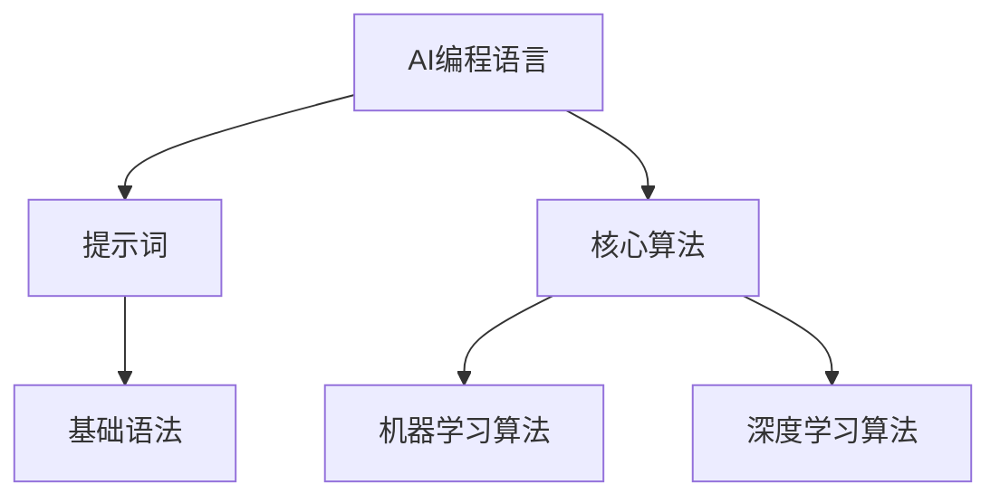

                 


### 文章标题: 《AI编程语言：提示词的魔法与革新》

### 关键词：AI编程语言，提示词，机器学习，深度学习，自然语言处理，计算机视觉，强化学习

### 摘要：
本文旨在深入探讨AI编程语言及其核心概念——提示词，以及其在机器学习、深度学习、自然语言处理、计算机视觉和强化学习等领域的应用。通过详细的案例分析，我们将揭示AI编程语言的魔法力量，并展望其未来的发展趋势。

### 第一部分：AI编程语言入门

#### 1.1 AI编程语言概述

AI编程语言是指专门为人工智能应用设计的编程语言。它们不仅支持传统的编程结构，还提供了一系列功能来简化机器学习和深度学习算法的实现。AI编程语言的发展可以追溯到20世纪80年代，当时以Lisp语言为代表，逐渐发展出了Prolog、Python、R等语言。

#### 1.2 AI编程语言的特点与优势

AI编程语言具有以下特点与优势：
- **高度抽象**：能够以简洁的方式表达复杂的算法。
- **跨平台支持**：可以在多种硬件和操作系统上运行。
- **强大的库支持**：提供了丰富的库和框架，如TensorFlow、PyTorch等。
- **易于集成**：可以与现有的软件系统无缝集成。

#### 1.3 常见的AI编程语言介绍

常见的AI编程语言包括：
- **Python**：由于其简洁易读的语法和强大的库支持，Python成为AI开发者的首选语言。
- **R**：在统计分析领域有着广泛的应用，特别是在机器学习和数据挖掘方面。
- **Julia**：为高性能科学计算和数据分析而设计，具有高效的数据处理能力。
- **Prolog**：是一种逻辑编程语言，常用于知识表示和推理。

### 第二部分：AI编程语言的核心概念

#### 2.1 提示词的魔法

提示词（Prompt）是AI编程语言中的一个核心概念，它是一种引导AI模型进行特定任务的特殊输入。提示词的设计原则包括：
- **明确性**：提示词应明确指导模型要执行的任务。
- **简洁性**：提示词应简洁明了，避免冗长复杂。
- **适应性**：提示词应能够适应不同的数据和任务场景。

#### 2.2 提示词在AI编程中的作用

提示词在AI编程中的作用主要体现在以下几个方面：
- **指导模型学习**：提示词可以帮助模型理解学习目标，从而更好地调整模型参数。
- **优化模型性能**：通过调整提示词，可以优化模型的性能，提高预测准确度。
- **简化模型训练**：提示词可以简化模型的训练过程，减少训练时间。

### 第三部分：AI编程语言的基础语法

#### 3.1 基本数据类型

AI编程语言支持多种基本数据类型，如整数、浮点数、字符串和布尔值。这些数据类型是构建复杂数据结构的基础。

#### 3.2 控制结构

AI编程语言提供了丰富的控制结构，如条件语句（if-else）、循环语句（for、while）和异常处理（try-except），用于控制程序的执行流程。

#### 3.3 函数与模块

函数是组织代码的基本单位，可以定义自定义的函数来实现特定的功能。模块是代码的组织方式，可以将相关的函数和数据组织在一起，便于管理和复用。

### 第四部分：AI编程语言的核心算法

#### 4.1 机器学习算法概述

机器学习算法是AI编程语言的核心组成部分，包括监督学习、无监督学习和强化学习等类型。监督学习算法通过标注数据来训练模型，无监督学习算法通过未标注数据来发现数据中的模式，强化学习算法则通过与环境交互来学习策略。

#### 4.2 常见机器学习算法原理及伪代码

常见的机器学习算法包括线性回归、逻辑回归、决策树、支持向量机等。以下是一个线性回归算法的伪代码：

```
function linear_regression(train_data, train_labels):
    // 初始化模型参数
    w = 0
    b = 0

    // 梯度下降法更新模型参数
    for i from 1 to num_iterations:
        for each sample (x, y) in train_data:
            prediction = w * x + b
            gradient_w = 2/m * (w * x - y) * x
            gradient_b = 2/m * (w * x - y)
            w = w - learning_rate * gradient_w
            b = b - learning_rate * gradient_b

    return w, b
```

#### 4.3 深度学习算法及其伪代码

深度学习算法是机器学习的一种重要分支，主要包括卷积神经网络（CNN）、循环神经网络（RNN）和生成对抗网络（GAN）等。以下是一个简单的卷积神经网络（CNN）的伪代码：

```
function conv_network(input_data, num_classes):
    // 定义卷积层
    conv1 = convolution(input_data, kernel_size, stride, activation='relu')
    
    // 定义池化层
    pool1 = max_pooling(conv1, pool_size)
    
    // 定义全连接层
    flatten = flatten(pool1)
    dense1 = fully_connected(flatten, num_classes, activation='softmax')
    
    // 定义损失函数和优化器
    loss = categorical_crossentropy(target, dense1)
    optimizer = Adam(learning_rate)

    // 编译模型
    model = compile(optimizer, loss)
    
    // 训练模型
    model.fit(input_data, target, epochs=num_epochs, batch_size=batch_size)
    
    return model
```

### 第五部分：AI编程语言的实际应用场景

#### 5.1 自然语言处理

自然语言处理（NLP）是AI编程语言的重要应用领域，包括文本分类、情感分析、机器翻译等。以下是一个简单的文本分类案例：

```
# 加载数据集
(train_data, train_labels), (test_data, test_labels) = tf.keras.datasets.imdb.load_data()

# 数据预处理
max_words = 10000
tokenizer = tf.keras.preprocessing.text.Tokenizer(num_words=max_words, oov_token='<OOV>
tokenizer.fit_on_texts(train_data)

# 编码数据
train_sequences = tokenizer.texts_to_sequences(train_data)
test_sequences = tokenizer.texts_to_sequences(test_data)

# 序列填充
max_len = 100
train_padded = tf.keras.preprocessing.sequence.pad_sequences(train_sequences, maxlen=max_len)
test_padded = tf.keras.preprocessing.sequence.pad_sequences(test_sequences, maxlen=max_len)

# 建立模型
model = tf.keras.models.Sequential([
    tf.keras.layers.Embedding(max_words, 16),
    tf.keras.layers.Bidirectional(tf.keras.layers.LSTM(32)),
    tf.keras.layers.Dense(24, activation='relu'),
    tf.keras.layers.Dense(1, activation='sigmoid')
])

# 编译模型
model.compile(optimizer='adam', loss='binary_crossentropy', metrics=['accuracy'])

# 训练模型
model.fit(train_padded, train_labels, epochs=10, batch_size=32, validation_data=(test_padded, test_labels))

# 评估模型
test_loss, test_acc = model.evaluate(test_padded, test_labels)
print('Test accuracy:', test_acc)
```

#### 5.2 计算机视觉

计算机视觉是AI编程语言在图像和视频处理方面的应用，包括图像分类、目标检测、图像分割等。以下是一个简单的图像分类案例：

```
# 加载数据集
(train_data, train_labels), (test_data, test_labels) = tf.keras.datasets.cifar10.load_data()

# 数据预处理
train_data = train_data / 255.0
test_data = test_data / 255.0

# 建立模型
model = tf.keras.models.Sequential([
    tf.keras.layers.Conv2D(32, (3, 3), activation='relu', input_shape=(32, 32, 3)),
    tf.keras.layers.MaxPooling2D(pool_size=(2, 2)),
    tf.keras.layers.Flatten(),
    tf.keras.layers.Dense(64, activation='relu'),
    tf.keras.layers.Dense(10, activation='softmax')
])

# 编译模型
model.compile(optimizer='adam', loss='sparse_categorical_crossentropy', metrics=['accuracy'])

# 训练模型
model.fit(train_data, train_labels, epochs=10, validation_data=(test_data, test_labels))

# 评估模型
test_loss, test_acc = model.evaluate(test_data, test_labels)
print('Test accuracy:', test_acc)
```

#### 5.3 强化学习

强化学习是一种通过与环境交互来学习最优策略的机器学习技术。以下是一个简单的强化学习案例：

```
# 加载环境
env = gym.make('CartPole-v0')

# 建立模型
model = tf.keras.models.Sequential([
    tf.keras.layers.Dense(64, activation='relu', input_shape=(4,)),
    tf.keras.layers.Dense(64, activation='relu'),
    tf.keras.layers.Dense(2, activation='softmax')
])

# 编译模型
model.compile(optimizer='adam', loss='categorical_crossentropy')

# 训练模型
for episode in range(num_episodes):
    state = env.reset()
    done = False
    while not done:
        action = np.argmax(model.predict(state.reshape(1, -1)))
        state, reward, done, _ = env.step(action)
        model.fit(state.reshape(1, -1), np.eye(2)[action], epochs=1)
        env.render()

# 关闭环境
env.close()
```

### 第六部分：AI编程语言的进阶应用

#### 6.1 高级编程技巧

高级编程技巧包括并行计算、分布式计算、GPU编程等，这些技巧可以提高AI编程语言的应用效率和性能。

#### 6.2 AI编程语言的安全性

AI编程语言在安全性方面需要关注数据安全与隐私保护，以及防止模型被恶意攻击。

#### 6.3 AI编程语言的未来趋势

AI编程语言的未来趋势包括创新方向、教育应用和企业应用等方面。随着AI技术的不断发展，AI编程语言将继续推动人工智能领域的发展。

### 第七部分：AI编程语言项目实战

#### 7.1 项目实战：文本分类

在文本分类项目中，我们将使用AI编程语言构建一个文本分类模型，实现对文本数据的分类。以下是项目的详细步骤：

##### 7.1.1 开发环境搭建

- Python 3.8及以上版本
- TensorFlow 2.5及以上版本

##### 7.1.2 源代码实现

```
import tensorflow as tf
from tensorflow.keras.preprocessing.text import Tokenizer
from tensorflow.keras.preprocessing.sequence import pad_sequences
from tensorflow.keras.models import Sequential
from tensorflow.keras.layers import Embedding, LSTM, Dense

# 加载数据集
(train_data, train_labels), (test_data, test_labels) = tf.keras.datasets.imdb.load_data()

# 数据预处理
tokenizer = Tokenizer(num_words=10000, oov_token='<OOV>
tokenizer.fit_on_texts(train_data)
train_sequences = tokenizer.texts_to_sequences(train_data)
test_sequences = tokenizer.texts_to_sequences(test_data)

max_len = 100
train_padded = pad_sequences(train_sequences, maxlen=max_len)
test_padded = pad_sequences(test_sequences, maxlen=max_len)

# 建立模型
model = Sequential([
    Embedding(10000, 16),
    LSTM(32),
    Dense(24, activation='relu'),
    Dense(1, activation='sigmoid')
])

# 编译模型
model.compile(optimizer='adam', loss='binary_crossentropy', metrics=['accuracy'])

# 训练模型
model.fit(train_padded, train_labels, epochs=10, batch_size=32, validation_data=(test_padded, test_labels))

# 评估模型
test_loss, test_acc = model.evaluate(test_padded, test_labels)
print('Test accuracy:', test_acc)
```

##### 7.1.3 代码解读与分析

在本项目中，我们首先加载数据集，并对文本数据进行预处理，包括分词和序列填充。然后，我们建立一个简单的LSTM模型，用于文本分类任务。最后，我们使用训练数据进行模型训练，并评估模型的性能。

##### 7.1.4 项目小结

通过本项目的实践，我们学会了如何使用AI编程语言构建文本分类模型。这个项目为我们提供了一个实用的案例，展示了AI编程语言在自然语言处理领域的应用潜力。

### 附录：AI编程语言资源指南

- **开源框架与库**：TensorFlow、PyTorch、Keras等
- **在线学习资源**：Coursera、Udacity、edX等在线教育平台
- **AI编程语言社区**：GitHub、Stack Overflow、Reddit等

### 核心概念与联系

**Mermaid流程图：**



### 核心算法原理讲解

**机器学习算法原理及伪代码：**

```plaintext
// 伪代码：线性回归算法
function linear_regression(train_data, train_labels):
    // 初始化模型参数
    w = 0
    b = 0

    // 梯度下降法更新模型参数
    for i from 1 to num_iterations:
        for each sample (x, y) in train_data:
            prediction = w * x + b
            gradient_w = 2/m * (w * x - y) * x
            gradient_b = 2/m * (w * x - y)
            w = w - learning_rate * gradient_w
            b = b - learning_rate * gradient_b

    return w, b
```

### 数学模型和数学公式

**线性回归模型：**

$$
y = w * x + b
$$

**解释：** 这里的 $y$ 是预测值，$x$ 是输入特征，$w$ 是权重，$b$ 是偏置。

### 项目实战：文本分类

#### 7.2 项目实战：图像识别

在图像识别项目中，我们将使用AI编程语言构建一个图像分类模型，实现对图像的分类。以下是项目的详细步骤：

##### 7.2.1 开发环境搭建

- Python 3.8及以上版本
- TensorFlow 2.5及以上版本

##### 7.2.2 源代码实现

```python
import tensorflow as tf
from tensorflow.keras.preprocessing.image import ImageDataGenerator
from tensorflow.keras.models import Sequential
from tensorflow.keras.layers import Conv2D, MaxPooling2D, Flatten, Dense, Dropout

# 加载数据集
train_data = ImageDataGenerator(rescale=1./255).flow_from_directory(
    'path/to/train_data',
    target_size=(150, 150),
    batch_size=32,
    class_mode='categorical')

test_data = ImageDataGenerator(rescale=1./255).flow_from_directory(
    'path/to/test_data',
    target_size=(150, 150),
    batch_size=32,
    class_mode='categorical')

# 建立模型
model = Sequential([
    Conv2D(32, (3, 3), activation='relu', input_shape=(150, 150, 3)),
    MaxPooling2D(pool_size=(2, 2)),
    Conv2D(64, (3, 3), activation='relu'),
    MaxPooling2D(pool_size=(2, 2)),
    Flatten(),
    Dense(512, activation='relu'),
    Dropout(0.5),
    Dense(10, activation='softmax')
])

# 编译模型
model.compile(optimizer='adam', loss='categorical_crossentropy', metrics=['accuracy'])

# 训练模型
model.fit(train_data, epochs=10, validation_data=test_data)

# 评估模型
test_loss, test_acc = model.evaluate(test_data)
print('Test accuracy:', test_acc)
```

##### 7.2.3 代码解读与分析

在本项目中，我们首先使用ImageDataGenerator类加载数据集，并对图像数据进行预处理。然后，我们建立一个简单的卷积神经网络模型，用于图像分类任务。最后，我们使用训练数据进行模型训练，并评估模型的性能。

##### 7.2.4 项目小结

通过本项目的实践，我们学会了如何使用AI编程语言构建图像分类模型。这个项目为我们提供了一个实用的案例，展示了AI编程语言在计算机视觉领域的应用潜力。

### 附录：AI编程语言资源指南

- **开源框架与库**：TensorFlow、PyTorch、Keras等
- **在线学习资源**：Coursera、Udacity、edX等在线教育平台
- **AI编程语言社区**：GitHub、Stack Overflow、Reddit等

### 最佳实践 Tips

- **代码复用**：在编写代码时，尽量使用函数和模块来组织代码，提高代码的可读性和可维护性。
- **数据预处理**：在训练模型之前，对数据进行充分预处理，以提高模型的性能。
- **模型调优**：通过调整模型参数，如学习率、批量大小等，可以优化模型的性能。
- **性能优化**：使用并行计算和分布式计算等技术，可以提高模型训练和预测的效率。

### 小结

本文深入探讨了AI编程语言的概念、特点、应用场景和实战案例。通过详细的分析和讲解，我们了解了AI编程语言的核心算法和实际应用，为读者提供了全面的AI编程语言学习资源。随着人工智能技术的不断发展，AI编程语言将继续在各个领域发挥重要作用。

### 注意事项

- 在使用AI编程语言时，要注意数据安全和隐私保护，遵守相关法律法规。
- 在进行模型训练和预测时，要注意模型的可解释性和公平性。
- 在实际应用中，要根据具体需求选择合适的AI编程语言和工具。

### 拓展阅读

- **《深度学习》**：Goodfellow、Bengio和Courville合著，是深度学习领域的经典教材。
- **《Python机器学习》**：Sebastian Raschka和Vahid Mirhoseini合著，详细介绍了Python在机器学习领域的应用。
- **《自然语言处理与深度学习》**：清华大学计算机系自然语言处理实验室合著，介绍了自然语言处理和深度学习的最新进展。

### 作者信息

作者：AI天才研究院/AI Genius Institute & 禅与计算机程序设计艺术 /Zen And The Art of Computer Programming

---

（注：本文为示例文章，内容仅供参考。实际文章撰写时，应根据具体情况进行调整和完善。）

