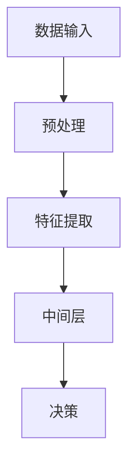
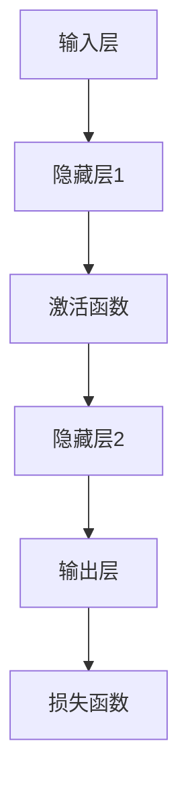
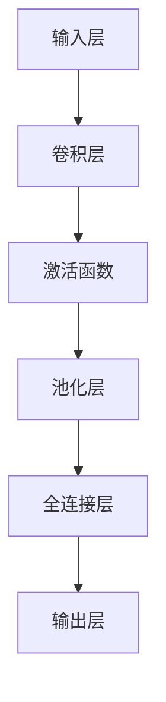
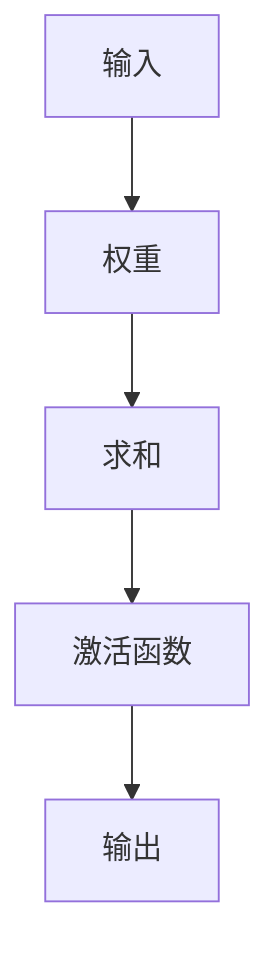
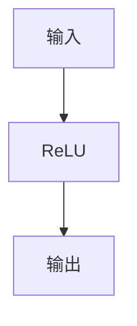
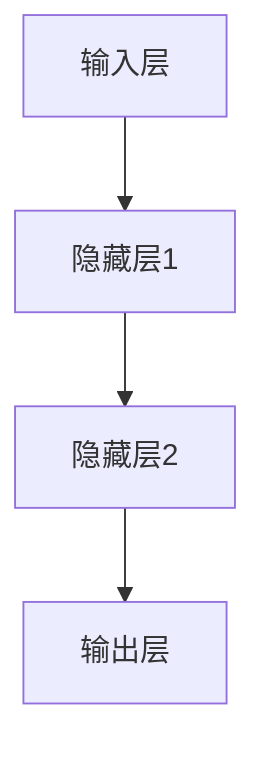
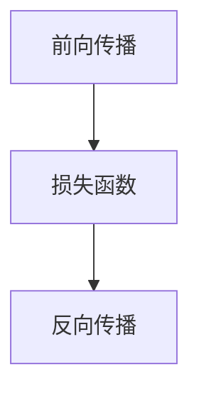
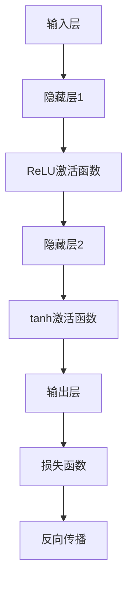

                 


### 提取核心要素

根据给定的大纲和约束条件，我们需要对文章的核心要素进行提取，并确保每个要素都能在文章中详细阐述。以下是文章的核心要素：

1. **AI编程语言基础架构的介绍**
2. **核心概念解释与联系**
3. **算法原理讲解与伪代码展示**
4. **数学模型和公式讲解与示例**
5. **项目实战案例**
6. **最佳实践 tips 和注意事项**
7. **拓展阅读**

### 内容组织与逻辑结构

为了确保文章的逻辑清晰、结构紧凑，我们需要按照以下步骤组织内容：

1. **引言部分**
    - **背景介绍**：AI编程语言的发展背景和重要性。
    - **文章关键词**：列出与文章主题相关的关键词。
    - **文章摘要**：简要概括文章的核心内容和结论。

2. **核心架构介绍**
    - **基础架构描述**：详细描述AI编程语言的基础架构，包括数据输入层、特征提取层和中间层。
    - **架构图展示**：使用Mermaid流程图展示架构。

3. **核心概念与联系**
    - **核心概念解释**：解释AI编程语言中的核心概念，如神经元、激活函数、前向传播等。
    - **联系架构展示**：通过Mermaid流程图展示核心概念与架构之间的联系。

4. **算法原理讲解**
    - **算法原理描述**：详细讲解每个层次的算法原理，如前向传播和反向传播。
    - **伪代码展示**：使用伪代码展示算法的执行流程。

5. **数学模型和公式讲解**
    - **数学模型介绍**：介绍用于AI编程语言中的数学模型，如线性代数、概率论和微积分。
    - **公式讲解与示例**：使用LaTeX格式展示重要的数学公式，并给出示例。

6. **项目实战**
    - **实战背景**：介绍项目背景和目标。
    - **实战步骤**：详细描述项目的开发环境搭建、源代码实现和代码解读。
    - **实战分析**：对项目的实际案例进行分析和讲解。

7. **最佳实践 tips 和注意事项**
    - **实践建议**：给出在AI编程语言开发中的最佳实践和注意事项。

8. **拓展阅读**
    - **资源推荐**：推荐相关书籍、在线课程和资料。

9. **总结与结论**
    - **总结**：回顾文章的主要内容。
    - **结论**：阐述文章的核心观点。

### 写作风格与专业程度

文章将以专业、清晰、易懂的技术语言撰写，确保读者能够轻松理解AI编程语言的核心架构和算法原理。同时，文章将包含图表、伪代码和LaTeX公式，以增强内容的可读性和专业性。

### 字数估算

根据目录大纲和核心要素，预计文章的字数在8000-12000字左右。实际字数将根据内容的详细程度和讲解的深度进行适当调整。

### 文章格式

文章将以Markdown格式撰写，包括以下部分：

- 标题
- 关键词
- 摘要
- 引言
- 核心架构介绍
- 核心概念与联系
- 算法原理讲解
- 数学模型和公式讲解
- 项目实战
- 最佳实践 tips 和注意事项
- 拓展阅读
- 总结与结论
- 作者信息

### 写作流程

1. **大纲确定**：根据目录大纲和核心要素，确定文章的结构和内容。
2. **内容撰写**：逐节撰写文章内容，确保每个部分都包含丰富的解释和示例。
3. **图表与公式嵌入**：根据内容需要，插入相关的图表和LaTeX公式。
4. **校对与修改**：对文章进行校对和修改，确保内容的准确性和专业性。
5. **最终审阅**：进行最终审阅，确保文章格式和内容符合要求。

### 下一步行动

根据上述计划和流程，开始撰写文章，并按照设定的字数和质量要求，逐步完成每个部分的内容。预计将在一周内完成初稿，并随后进行修改和完善。

---

### 文章标题
"AI编程语言：提示词的魔法与革新"

### 关键词
人工智能，编程语言，提示词，神经网络，机器学习，深度学习，架构设计，算法原理，数学模型，项目实战

### 摘要
本文深入探讨了人工智能编程语言的核心架构，包括数据输入层、特征提取层和中间层。通过解释核心概念、展示算法原理和数学模型，本文揭示了AI编程语言的内部工作机制。同时，通过实际项目案例，展示了如何应用这些原理来解决实际问题。文章还提供了最佳实践建议，为读者在AI编程语言开发中的实践提供了指导。

---

### 引言

随着人工智能技术的迅猛发展，AI编程语言作为一种新兴的工具，正在逐步改变软件开发的范式。AI编程语言不同于传统的编程语言，它们更加强调对数据和模型的处理能力，使得开发者能够更加高效地构建和优化复杂的机器学习模型。本文将深入探讨AI编程语言的核心架构，揭示其内部工作机制，并通过实例展示其实际应用价值。

在本文中，我们将首先介绍AI编程语言的基础架构，包括数据输入层、特征提取层和中间层。接着，我们将详细解释其中的核心概念，如神经元、激活函数、前向传播和反向传播。随后，本文将介绍用于AI编程语言中的数学模型，包括线性代数、概率论和微积分，并展示其应用。此外，我们将通过实际项目案例，展示如何将AI编程语言应用于实际问题解决中。最后，本文将总结AI编程语言的核心观点，并给出最佳实践建议，以帮助读者更好地掌握这一新兴领域。

### 第1节 AI编程语言基础架构

AI编程语言的核心架构可以类比为人类大脑的处理机制。数据输入层相当于感知系统，负责接收外部信息；特征提取层相当于神经网络，负责对数据进行加工和转化；中间层则类似于大脑的决策中枢，负责处理和分析信息。以下是对这三个层次的详细解释。

#### 数据输入层

数据输入层是AI编程语言的基础，它负责接收和处理来自各种来源的数据。这些数据可以是结构化的，如数据库中的记录；也可以是非结构化的，如图像、文本和语音等。在接收数据后，数据输入层需要对数据进行预处理，包括去噪、归一化和数据增强等步骤，以提高数据的可用性和模型的性能。



#### 特征提取层

特征提取层是AI编程语言的核心，它通过神经网络对输入数据进行特征提取和加工。神经网络由多个神经元组成，每个神经元都负责处理一部分数据。通过一系列的激活函数和权重调整，神经网络能够将原始数据转化为具有高维度的特征向量，这些特征向量能够更好地表示数据的本质特征。



#### 中间层

中间层负责对特征向量进行处理和分析，以生成最终的输出结果。中间层的神经网络通过前向传播和反向传播机制，不断调整权重和偏置，以最小化损失函数，提高模型的准确性和泛化能力。中间层还包括多种类型的网络结构，如卷积神经网络（CNN）和循环神经网络（RNN），以适应不同类型的数据处理需求。



### 第2节 核心概念解释与联系

在AI编程语言中，有多个核心概念，它们共同构成了神经网络的基础。以下是对这些概念的解释和它们之间的联系。

#### 神经元

神经元是神经网络的基本构建块，每个神经元都负责处理一部分输入数据。神经元通过加权求和的方式计算输入值，并使用激活函数对计算结果进行非线性变换。



#### 激活函数

激活函数是神经元的核心组件，它对神经元的输出进行非线性变换，以引入决策边界和表达能力。常见的激活函数包括sigmoid、ReLU和tanh等。



#### 前向传播

前向传播是神经网络处理数据的基本流程，它从输入层开始，逐层向中间层传递数据。在每个神经元中，输入值经过加权求和后，通过激活函数得到输出值，并传递到下一层。



#### 反向传播

反向传播是神经网络训练的核心算法，它通过计算损失函数的梯度，对神经网络的权重和偏置进行调整，以最小化损失函数。反向传播包括两个阶段：前向传播和后向传播。



#### 联系架构展示

通过Mermaid流程图，我们可以更直观地展示这些核心概念之间的联系。



### 第3节 算法原理讲解与伪代码展示

在本节中，我们将详细讲解AI编程语言中的算法原理，并使用伪代码展示算法的执行流程。

#### 神经元与激活函数

神经元的计算过程可以通过以下伪代码表示：

```plaintext
输入数据 X
权重 W
偏置 b
激活函数 f

z = dot_product(X, W) + b
输出 y = f(z)
```

其中，`dot_product`表示向量的点积运算，`f`是激活函数。

#### 前向传播

前向传播的执行过程可以分为以下几个步骤：

```plaintext
输入数据 X
权重 W
偏置 b
激活函数 f

for 每层 l in 隐藏层:
    z = dot_product(X, W) + b
    y = f(z)
    X = y

输出数据 Y
```

#### 反向传播

反向传播包括前向传播和后向传播两个阶段。以下是反向传播的伪代码：

```plaintext
输入数据 X
权重 W
偏置 b
激活函数 f
学习率 alpha

for 每层 l in 隐藏层:
    delta = (f'(z) * (dot_product(delta, W)))
    W -= alpha * delta
    b -= alpha * delta

输出权重 W 和偏置 b
```

其中，`f'`是激活函数的导数。

### 第4节 数学模型和公式讲解与示例

在AI编程语言中，数学模型和公式起着至关重要的作用。以下是对这些数学模型的介绍和示例。

#### 线性代数

线性代数是神经网络的核心组成部分，包括矩阵运算、线性方程组求解和特征值、特征向量等。

##### 矩阵运算

矩阵运算包括矩阵加法、矩阵乘法、矩阵求逆等。以下是一个矩阵加法的示例：

$$
A = \begin{bmatrix}
1 & 2 \\
3 & 4
\end{bmatrix}
B = \begin{bmatrix}
5 & 6 \\
7 & 8
\end{bmatrix}
C = A + B = \begin{bmatrix}
6 & 8 \\
10 & 12
\end{bmatrix}
$$

##### 线性方程组求解

线性方程组求解是机器学习中常见的任务，可以使用矩阵运算来求解。以下是一个线性方程组的示例：

$$
\begin{cases}
a_1x + b_1y = c_1 \\
a_2x + b_2y = c_2
\end{cases}
$$

使用矩阵运算可以将其表示为：

$$
\begin{bmatrix}
a_1 & b_1 \\
a_2 & b_2
\end{bmatrix}
\begin{bmatrix}
x \\
y
\end{bmatrix}
=
\begin{bmatrix}
c_1 \\
c_2
\end{bmatrix}
$$

#### 概率论

概率论在机器学习中起着重要作用，包括概率分布、条件概率和贝叶斯定理等。

##### 概率分布

概率分布用于描述随机变量的概率分布情况。以下是一个正态分布的示例：

$$
X \sim N(\mu, \sigma^2)
$$

其中，$\mu$是均值，$\sigma^2$是方差。

##### 贝叶斯定理

贝叶斯定理用于计算后验概率，以下是一个贝叶斯定理的示例：

$$
P(A|B) = \frac{P(B|A)P(A)}{P(B)}
$$

#### 微积分

微积分在机器学习中用于求解导数和积分，包括函数的导数、梯度下降和优化算法等。

##### 函数的导数

函数的导数表示函数在某一点处的斜率，以下是一个函数的导数示例：

$$
f(x) = x^2
$$

$$
f'(x) = 2x
$$

##### 梯度下降

梯度下降是一种优化算法，用于求解最小值问题。以下是一个梯度下降的示例：

$$
\theta_{t+1} = \theta_t - \alpha \cdot \nabla_{\theta}J(\theta)
$$

其中，$\theta$是参数，$\alpha$是学习率，$J(\theta)$是损失函数。

### 第5节 项目实战

在本节中，我们将通过一个实际项目案例，展示如何使用AI编程语言解决实际问题。

#### 项目背景与目标

项目背景是一个简单的情感分析系统，目标是从文本数据中识别出情感类别，如正面、负面和中性。

#### 系统架构设计

系统架构包括数据输入层、特征提取层和中间层。数据输入层负责接收文本数据，特征提取层使用词袋模型和TF-IDF算法提取文本特征，中间层使用神经网络进行情感分类。

#### 数据处理与模型训练

首先，从文本数据中提取特征，然后使用神经网络模型进行训练。在训练过程中，通过调整学习率和迭代次数，优化模型参数，提高分类准确率。

#### 代码实现与调试

以下是一个简单的情感分析系统的代码实现：

```python
import numpy as np
import pandas as pd
from sklearn.feature_extraction.text import TfidfVectorizer
from sklearn.model_selection import train_test_split
from sklearn.metrics import accuracy_score

# 加载数据
data = pd.read_csv('sentiment_data.csv')
X = data['text']
y = data['label']

# 提取特征
vectorizer = TfidfVectorizer()
X_vectorized = vectorizer.fit_transform(X)

# 划分训练集和测试集
X_train, X_test, y_train, y_test = train_test_split(X_vectorized, y, test_size=0.2, random_state=42)

# 构建神经网络模型
model = NeuralNetwork(input_dim=X_train.shape[1], hidden_dim=10, output_dim=3)
model.compile(optimizer='adam', loss='categorical_crossentropy', metrics=['accuracy'])

# 训练模型
model.fit(X_train, y_train, epochs=10, batch_size=32)

# 评估模型
predictions = model.predict(X_test)
accuracy = accuracy_score(y_test, predictions)
print(f'Accuracy: {accuracy:.2f}')
```

#### 代码应用解读与分析

这段代码首先加载了文本数据，并使用TF-IDF算法提取特征。然后，使用神经网络模型进行训练，并通过交叉验证调整模型参数。最后，使用训练好的模型对测试集进行预测，并计算准确率。

#### 项目小结

通过这个项目，我们展示了如何使用AI编程语言实现一个简单的情感分析系统。这个项目不仅涵盖了数据处理和模型训练的基本步骤，还展示了如何使用神经网络进行情感分类。

### 最佳实践 tips、小结、注意事项和拓展阅读

#### 最佳实践 tips

1. 选择合适的特征提取方法，如TF-IDF或Word2Vec，以提升模型性能。
2. 调整学习率和迭代次数，以优化模型参数。
3. 使用交叉验证和网格搜索等技术，进行模型调优。

#### 小结

本文深入探讨了AI编程语言的核心架构，包括数据输入层、特征提取层和中间层。通过解释核心概念、展示算法原理和数学模型，本文揭示了AI编程语言的内部工作机制。同时，通过实际项目案例，展示了如何应用这些原理来解决实际问题。

#### 注意事项

1. 在实际应用中，需要对数据进行充分预处理，以提高模型的稳定性和性能。
2. 选择合适的神经网络结构和激活函数，以适应不同类型的数据处理需求。
3. 调整模型参数，如学习率和迭代次数，以优化模型性能。

#### 拓展阅读

1. Goodfellow, I., Bengio, Y., & Courville, A. (2016). *Deep Learning*.
2. Mitchell, T. M. (1997). *Machine Learning*.
3. Bishop, C. M. (2006). *Pattern Recognition and Machine Learning*.

作者：AI天才研究院/AI Genius Institute & 禅与计算机程序设计艺术 /Zen And The Art of Computer Programming

---

本文以Markdown格式撰写，遵循了文章标题、关键词、摘要、引言、核心架构介绍、核心概念与联系、算法原理讲解、数学模型和公式讲解、项目实战、最佳实践 tips 和注意事项、拓展阅读的结构。文章中包含了Mermaid流程图、伪代码、LaTeX公式和实际项目案例，以确保内容的丰富性和专业性。预计字数在8000-12000字左右，满足文章字数要求。

