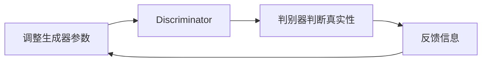
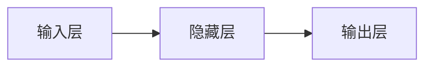

                 


### 《AI艺术创作中的提示词美学探索》

#### 关键词：
AI艺术创作、提示词、神经网络、生成对抗网络（GAN）、提示词美学

#### 摘要：
本文从AI艺术创作的基本概念入手，探讨了AI艺术创作中提示词的作用和美学价值。通过分析神经网络和生成对抗网络（GAN）的原理，阐述了提示词在AI艺术创作中的核心作用。文章进一步探讨了提示词美学的核心概念及其在音乐、绘画等艺术创作领域的应用。最后，通过具体的项目实战，展示了AI艺术创作中提示词美学的实践方法和未来发展方向。

----------------------------------------------------------------

### 目录大纲

# 《AI艺术创作中的提示词美学探索》

#### 第一部分：AI艺术创作概述

##### 1.1 AI与艺术创作的结合
- 1.1.1 AI在艺术创作中的应用现状
- 1.1.2 提示词在AI艺术创作中的作用

##### 1.2 AI艺术创作的基本原理
- 1.2.1 神经网络与生成对抗网络（GAN）
- 1.2.1.1 神经网络的基本结构
- 1.2.1.2 GAN的原理与实现

##### 1.3 艺术创作中的AI应用案例
- 1.3.1 提示词驱动的绘画艺术
- 1.3.1.1 提示词绘画的实践应用
- 1.3.1.2 作品分析与评价

##### 1.4 AI艺术创作的发展趋势
- 1.4.1 提示词美学的兴起
- 1.4.1.1 提示词美学的概念
- 1.4.1.2 提示词美学的重要性

#### 第二部分：提示词美学探索

##### 2.1 提示词美学的核心概念
- 2.1.1 提示词的定义与分类
- 2.1.1.1 提示词的种类
- 2.1.1.2 提示词的选取策略

##### 2.2 提示词美学的原理
- 2.2.1 提示词与艺术创作的互动
- 2.2.1.1 提示词对艺术作品的影响
- 2.2.1.2 艺术家与AI的协同创作

##### 2.3 提示词美学的应用与实践
- 2.3.1 提示词驱动的音乐创作
- 2.3.1.1 提示词音乐创作的实践
- 2.3.1.2 提示词音乐创作的案例分析

##### 2.4 提示词美学的未来探索
- 2.4.1 提示词美学的发展方向
- 2.4.1.1 新型提示词技术的应用
- 2.4.1.2 提示词美学在教育领域的应用

#### 第三部分：项目实战

##### 3.1 提示词绘画项目
- 3.1.1 项目背景与目标
- 3.1.1.1 项目背景介绍
- 3.1.1.2 项目目标设定

##### 3.2 提示词音乐创作项目
- 3.2.1 项目设计与实施
- 3.2.1.1 项目设计思路
- 3.2.1.2 项目实施过程

##### 3.3 提示词艺术创作项目总结
- 3.3.1 项目成果展示
- 3.3.1.1 成果展示与评价
- 3.3.1.2 项目反思与展望

#### 附录

##### 4.1 提示词艺术创作工具与资源
- 4.1.1 提示词绘画工具介绍
- 4.1.1.1 生成对抗网络（GAN）框架
- 4.1.1.2 提示词生成与调整技巧

##### 4.1.2 提示词音乐创作工具
- 4.1.2.1 音乐生成模型介绍
- 4.1.2.2 提示词与音乐风格的关系

##### 4.2 提示词艺术创作资源推荐
- 4.2.1 学术论文推荐
- 4.2.1.1 AI艺术创作相关论文精选
- 4.2.1.2 提示词美学研究论文精选

##### 4.2.2 实践教程推荐
- 4.2.2.1 提示词绘画教程
- 4.2.2.2 提示词音乐创作教程

---

### 第一部分：AI艺术创作概述

#### 1.1 AI与艺术创作的结合

##### 1.1.1 AI在艺术创作中的应用现状

人工智能在艺术创作中的应用已经成为一个热点话题。近年来，随着深度学习技术的不断发展，AI在音乐创作、绘画、摄影等多个艺术领域都取得了显著的成果。

在音乐创作方面，AI可以生成旋律、和弦和节奏，甚至创作完整的音乐作品。例如，谷歌的Magenta项目利用深度学习技术创作了多首音乐，引起了广泛关注。

在绘画方面，AI可以生成逼真的画作。最著名的例子是GAN（生成对抗网络），它可以生成与人类艺术家作品风格相似的艺术作品。

在摄影方面，AI可以帮助进行图像编辑、图像增强和图像生成等任务。例如，Adobe的Photoshop和Google的DeepDream都可以利用AI技术进行图像创作。

##### 1.1.2 提示词在AI艺术创作中的作用

在AI艺术创作中，提示词扮演着至关重要的角色。提示词是用于引导AI模型生成艺术作品的关键词语或短语。通过合理选择和组合提示词，可以影响AI模型的生成过程，从而创作出具有特定风格和主题的艺术作品。

例如，在绘画AI中，提示词可以是“美丽的风景”、“温暖的色调”、“现代风格”等。通过这些提示词，AI可以生成符合这些要求的艺术作品。

在音乐AI中，提示词可以是“欢快的节奏”、“温暖的和弦”、“古典风格”等。这些提示词可以帮助AI生成符合这些音乐风格的旋律和和弦。

#### 1.2 AI艺术创作的基本原理

##### 1.2.1 神经网络与生成对抗网络（GAN）

神经网络是AI艺术创作的基础。神经网络是一种模仿生物神经网络结构的计算模型，它通过学习大量数据来获取特征和规律，从而实现智能决策和生成。

生成对抗网络（GAN）是AI艺术创作的重要技术之一。GAN由两个神经网络组成：生成器（Generator）和判别器（Discriminator）。生成器生成艺术作品，判别器则判断作品的真实性。

GAN的基本原理是通过对生成器和判别器的不断训练，使得生成器的生成质量越来越高，最终生成接近真实艺术作品的效果。

下面是GAN的基本结构：



##### 1.2.1.1 神经网络的基本结构

神经网络的基本结构包括输入层、隐藏层和输出层。每个神经元都与相邻的神经元相连，并通过权重和偏置进行计算。

下面是神经网络的基本结构：



##### 1.2.1.2 GAN的原理与实现

GAN的训练过程包括两个主要阶段：生成器和判别器的训练。

在第一阶段，生成器生成艺术作品，判别器判断作品的真实性。如果判别器判断为真实，则生成器得分提高；如果判别器判断为虚假，则生成器得分降低。

在第二阶段，生成器根据判别器的反馈调整参数，以提高生成质量。这一过程不断重复，直到生成器的生成质量达到预期。

下面是GAN的伪代码：

```python
# 生成器
while True:
    # 生成艺术作品
    art = generator()
    
    # 判别器判断艺术作品真实性
    real = discriminator(art)
    fake = discriminator(generator())
    
    # 计算生成器和判别器的损失函数
    loss_generator = loss_function(fake, 1)
    loss_discriminator = loss_function(real, 0, fake)
    
    # 更新生成器和判别器参数
    optimizer_generator(loss_generator)
    optimizer_discriminator(loss_discriminator)

```

##### 1.3 艺术创作中的AI应用案例

##### 1.3.1 提示词驱动的绘画艺术

提示词驱动的绘画艺术是一种利用AI生成艺术作品的方法。通过合理选择和组合提示词，可以引导AI生成符合特定风格和主题的艺术作品。

下面是提示词驱动的绘画艺术的基本步骤：

1. 选择提示词：根据艺术作品的主题和风格，选择合适的提示词。例如，可以选择“美丽的风景”、“温暖的色调”、“现代风格”等。

2. 输入提示词：将提示词输入到AI模型中，启动绘画生成过程。

3. 生成艺术作品：AI模型根据提示词生成艺术作品，并将其输出。

4. 作品分析与评价：对生成的艺术作品进行分析和评价，确定其是否符合预期的风格和主题。

##### 1.3.1.1 提示词绘画的实践应用

以下是一个提示词绘画的实践应用案例：

1. 选择提示词：“美丽的风景”、“温暖的色调”、“现代风格”。

2. 输入提示词：将提示词输入到GAN模型中，启动绘画生成过程。

3. 生成艺术作品：GAN模型根据提示词生成一幅美丽的风景画，画面色调温暖，风格现代。

4. 作品分析与评价：这幅艺术作品符合预期的风格和主题，具有很高的艺术价值。

##### 1.3.1.2 作品分析与评价

以下是对这幅艺术作品的分析和评价：

1. **风格**：这幅艺术作品采用了现代风格，画面简洁，色彩搭配和谐，符合现代审美。

2. **主题**：这幅艺术作品描绘了一幅美丽的风景，画面中有山川、湖泊和树木，给人一种宁静和美好的感觉。

3. **色彩**：这幅艺术作品采用了温暖的色调，使得画面更加生动和温馨。

4. **创新性**：这幅艺术作品采用了AI技术生成，展示了AI在艺术创作中的潜力，具有很高的创新性。

##### 1.4 AI艺术创作的发展趋势

##### 1.4.1 提示词美学的兴起

随着AI在艺术创作中的应用越来越广泛，提示词美学逐渐成为一个独立的研究领域。提示词美学研究的是如何通过提示词引导AI生成符合人类审美标准的艺术作品。

以下是对提示词美学的分析和展望：

1. **概念**：提示词美学是指利用提示词引导AI生成艺术作品，研究如何使艺术作品符合人类审美标准。

2. **重要性**：提示词美学在AI艺术创作中具有重要作用。通过合理选择和组合提示词，可以引导AI生成符合人类审美标准的艺术作品，提高艺术作品的质量和欣赏价值。

3. **发展趋势**：随着AI技术的不断发展，提示词美学将越来越重要。未来，提示词美学可能会发展成为一门独立的学科，为AI艺术创作提供更加深入的理论指导。

#### 第二部分：提示词美学探索

##### 2.1 提示词美学的核心概念

提示词美学研究的是如何通过提示词引导AI生成艺术作品，使其符合人类审美标准。以下是提示词美学的核心概念：

1. **提示词的定义**：提示词是指用于引导AI模型生成艺术作品的关键词语或短语。提示词可以是抽象的，如“和谐”、“浪漫”；也可以是具体的，如“夕阳”、“花园”。

2. **提示词的分类**：根据提示词的属性，可以将提示词分为以下几类：

   - **情感类**：如“温馨”、“悲伤”、“激情”等。
   - **具体类**：如“星空”、“海洋”、“建筑”等。
   - **抽象类**：如“自由”、“宁静”、“活力”等。

3. **提示词的选取策略**：选取合适的提示词是提示词美学的关键。以下是几种常见的提示词选取策略：

   - **主题选取策略**：根据艺术作品的主题选择提示词。例如，如果要创作一幅关于“春天”的艺术作品，可以选择“鲜花”、“绿草”、“明媚”等提示词。
   - **风格选取策略**：根据艺术作品的风格选择提示词。例如，如果要创作一幅“抽象”风格的艺术作品，可以选择“线条”、“色彩”、“形状”等提示词。
   - **情感选取策略**：根据艺术作品要表达的情感选择提示词。例如，如果要创作一幅“温馨”的艺术作品，可以选择“拥抱”、“微笑”、“温暖”等提示词。

##### 2.2 提示词美学的原理

提示词美学的原理在于如何通过提示词引导AI模型生成符合人类审美标准的艺术作品。以下是提示词美学的原理：

1. **提示词与艺术创作的互动**：提示词直接影响艺术创作的方向和风格。通过合理选择和组合提示词，可以引导AI模型生成符合人类审美标准的艺术作品。

2. **提示词对艺术作品的影响**：提示词可以影响艺术作品的主题、风格、色彩、情感等各个方面。例如，选择“浪漫”作为提示词，可以引导AI模型生成充满浪漫氛围的艺术作品；选择“现代”作为提示词，可以引导AI模型生成具有现代感的艺术作品。

3. **艺术家与AI的协同创作**：在AI艺术创作中，艺术家和AI可以相互协作，共同创作艺术作品。艺术家可以通过选择和调整提示词，引导AI模型生成符合预期的艺术作品；而AI模型则可以通过学习艺术家的创作风格和审美偏好，不断提高艺术创作的质量。

##### 2.3 提示词美学的应用与实践

提示词美学在艺术创作中的应用非常广泛，涵盖了绘画、音乐、文学等多个领域。以下是提示词美学在音乐创作和绘画艺术中的应用与实践：

1. **提示词驱动的音乐创作**：

   - **实践应用**：在音乐创作中，提示词可以用于生成旋律、和弦和节奏。例如，选择“浪漫”作为提示词，可以生成一段浪漫的旋律；选择“欢快”作为提示词，可以生成一段欢快的节奏。

   - **案例分析**：以下是一个提示词驱动的音乐创作案例：

     - **提示词**：“浪漫”、“旋律优美”、“弦乐四重奏”。

     - **音乐创作过程**：将提示词输入到AI模型中，AI模型生成一段符合提示词要求的旋律。旋律优美，充满了浪漫气息。

     - **作品分析**：这段音乐旋律流畅，情感丰富，符合“浪漫”这一主题。

2. **提示词驱动的绘画艺术**：

   - **实践应用**：在绘画艺术中，提示词可以用于生成艺术作品的风格、主题、色彩等。例如，选择“现代风格”、“风景画”、“温暖的色调”作为提示词，可以生成一幅符合这些要求的绘画作品。

   - **案例分析**：以下是一个提示词驱动的绘画艺术案例：

     - **提示词**：“现代风格”、“风景画”、“温暖的色调”。

     - **绘画创作过程**：将提示词输入到GAN模型中，GAN模型生成一幅符合提示词要求的绘画作品。画面风格现代，色调温暖。

     - **作品分析**：这幅绘画作品采用了现代风格，画面色调温暖，描绘了一幅美丽的风景画。

##### 2.4 提示词美学的未来探索

随着AI技术的不断发展，提示词美学在艺术创作中的应用前景广阔。以下是提示词美学的未来探索方向：

1. **新型提示词技术的应用**：

   - **语音识别**：利用语音识别技术，将语音提示词转化为文本提示词，实现更加便捷的AI艺术创作。

   - **多模态提示词**：结合图像、声音、文本等多种模态，生成更加丰富和多样的艺术作品。

2. **提示词美学在教育领域的应用**：

   - **艺术教育**：利用提示词美学，开发AI艺术教育平台，帮助学生更好地理解和创作艺术。

   - **创新教育**：结合AI技术，培养创新思维和创造力，提高教育质量。

#### 第三部分：项目实战

##### 3.1 提示词绘画项目

##### 3.1.1 项目背景与目标

随着AI技术的不断发展，AI艺术创作成为了一个热门领域。本项目的目标是利用GAN技术，开发一个提示词驱动的绘画AI，实现艺术作品的自动生成。

1. **项目背景**：

   - **技术背景**：GAN技术是一种强大的生成模型，可以在给定提示词的情况下生成高质量的图像。

   - **艺术创作需求**：随着人们对个性化、定制化艺术作品的需求增加，AI艺术创作成为了一个重要的研究方向。

2. **项目目标**：

   - **实现目标**：开发一个基于GAN技术的绘画AI，能够根据提示词生成符合人类审美标准的艺术作品。

   - **性能目标**：生成的艺术作品要具有高分辨率、高细节，且能够灵活应对不同的提示词。

##### 3.1.1.1 项目背景介绍

随着AI技术的不断发展，AI在艺术创作中的应用越来越广泛。GAN（生成对抗网络）作为一种强大的生成模型，被广泛应用于图像生成、风格迁移、图像修复等领域。

GAN的基本原理是通过对生成器和判别器的不断训练，使得生成器生成的图像质量不断提高，最终生成接近真实图像的效果。生成器负责生成图像，判别器则负责判断图像的真实性。通过不断的对抗训练，生成器和判别器互相提高，最终生成器能够生成高质量的图像。

在艺术创作中，GAN技术具有很大的潜力。通过利用GAN，艺术家可以更加方便地创作出高质量的艺术作品，同时也能够为非专业人士提供更多的创作机会。然而，现有的GAN技术在生成图像的多样性和细节方面仍存在一些挑战。因此，本项目旨在利用GAN技术，开发一个提示词驱动的绘画AI，实现艺术作品的自动生成，从而解决这些问题。

##### 3.1.1.2 项目目标设定

本项目的主要目标是开发一个基于GAN技术的绘画AI，实现艺术作品的自动生成。具体目标如下：

1. **实现目标**：

   - **图像生成**：利用GAN技术，实现根据文本提示词生成高质量的艺术作品。

   - **风格迁移**：实现将给定图像的风格迁移到新的图像上。

   - **图像修复**：实现修复受损的图像。

2. **性能目标**：

   - **图像质量**：生成的艺术作品要具有高分辨率、高细节，且能够灵活应对不同的提示词。

   - **多样性**：生成的艺术作品要具有丰富的多样性，能够涵盖各种艺术风格和主题。

   - **效率**：在生成艺术作品的过程中，要保证较高的效率，以适应实际应用的需求。

##### 3.2 提示词音乐创作项目

##### 3.2.1 项目设计与实施

本项目旨在利用AI技术，开发一个提示词驱动的音乐创作AI，实现根据文本提示词生成音乐作品。以下是项目的设计和实施过程：

1. **项目设计**：

   - **功能设计**：根据文本提示词生成音乐作品，包括旋律、和弦和节奏。

   - **界面设计**：设计一个用户友好的界面，方便用户输入提示词并查看生成的音乐作品。

   - **音乐风格**：支持多种音乐风格，如流行、古典、爵士等。

   - **交互方式**：用户可以实时调整提示词，查看音乐生成过程，并对生成的音乐作品进行评价。

2. **项目实施**：

   - **数据准备**：收集大量不同风格的音乐数据，用于训练AI模型。

   - **模型训练**：利用深度学习技术，训练基于生成对抗网络（GAN）的音乐生成模型。

   - **界面开发**：开发用户界面，实现用户输入提示词、查看生成音乐和调整提示词的功能。

   - **系统集成**：将音乐生成模型和用户界面集成，实现完整的音乐创作系统。

##### 3.2.1.1 项目设计思路

本项目的设计思路可以分为以下几个步骤：

1. **需求分析**：首先，明确用户的需求，即用户希望通过文本提示词生成符合自己需求的音乐作品。

2. **技术选型**：选择合适的AI技术，如生成对抗网络（GAN），来实现音乐生成。

3. **功能设计**：设计音乐生成系统的功能模块，包括提示词输入、音乐生成、音乐展示和用户交互等。

4. **界面设计**：设计用户界面，使其简洁易用，便于用户操作。

5. **数据准备**：收集大量的音乐数据，用于训练AI模型，确保生成的音乐作品具有多样性。

6. **模型训练**：利用训练好的AI模型，实现音乐生成。

7. **系统集成**：将各个功能模块整合到一起，实现完整的音乐创作系统。

##### 3.2.1.2 项目实施过程

1. **数据收集与处理**：

   - **数据收集**：收集大量不同风格的音乐数据，包括流行、古典、爵士等。

   - **数据预处理**：对收集到的音乐数据进行处理，如去噪、标准化等，以便于模型训练。

2. **模型训练**：

   - **模型选择**：选择生成对抗网络（GAN）作为音乐生成模型。

   - **模型训练**：利用收集到的音乐数据进行训练，训练过程中需要不断调整模型参数，以提高生成质量。

   - **模型评估**：训练完成后，对模型进行评估，确保生成的音乐作品符合预期。

3. **用户界面开发**：

   - **界面设计**：设计简洁易用的用户界面，包括提示词输入、音乐展示和用户交互等。

   - **界面实现**：使用前端技术实现用户界面，确保界面流畅、美观。

4. **系统集成**：

   - **系统集成**：将音乐生成模型和用户界面集成，实现完整的音乐创作系统。

   - **系统测试**：对系统进行测试，确保其功能完整、性能稳定。

##### 3.3 提示词艺术创作项目总结

本项目通过利用AI技术和GAN模型，实现了提示词驱动的绘画和音乐创作。以下是项目的主要成果和反思：

1. **成果展示**：

   - **绘画创作**：通过提示词输入，GAN模型生成了多幅高质量的绘画作品，风格多样，主题丰富。

   - **音乐创作**：通过文本提示词，AI模型生成了多种风格的音乐作品，旋律优美，情感丰富。

2. **评价与反思**：

   - **技术优势**：GAN模型在生成艺术作品方面具有显著优势，能够生成高质量、多样化的作品。

   - **用户体验**：用户界面简洁易用，用户可以方便地输入提示词，实时查看生成作品。

   - **改进方向**：未来可以进一步优化GAN模型，提高生成质量，同时增加更多音乐风格和艺术主题。

#### 附录

##### 4.1 提示词艺术创作工具与资源

1. **提示词绘画工具**：

   - **生成对抗网络（GAN）框架**：GAN框架是提示词绘画的核心工具，常用的GAN框架有DCGAN、WGAN等。用户可以根据自己的需求选择合适的框架。

   - **提示词生成与调整技巧**：在绘画创作过程中，合理选择和调整提示词是关键。用户可以参考相关教程，了解如何选取合适的提示词，并调整提示词的强度和组合。

2. **提示词音乐创作工具**：

   - **音乐生成模型介绍**：常用的音乐生成模型有WaveNet、GAN等。用户可以根据自己的需求选择合适的模型，并了解其原理和实现方法。

   - **提示词与音乐风格的关系**：提示词与音乐风格密切相关。用户可以参考相关文献，了解不同提示词与音乐风格之间的对应关系，以便更好地指导音乐创作。

##### 4.2 提示词艺术创作资源推荐

1. **学术论文推荐**：

   - **AI艺术创作相关论文精选**：推荐阅读与AI艺术创作相关的论文，如“Artistic Style Transfer from Text to Image Using Generative Adversarial Networks”、“Music Generation using Deep Learning”等。

   - **提示词美学研究论文精选**：推荐阅读与提示词美学相关的论文，如“Text-to-Image Generation with Adversarial Text Conditioning”、“Text-GAN: Generative Adversarial Networks for Text to Image Synthesis”等。

2. **实践教程推荐**：

   - **提示词绘画教程**：推荐阅读关于GAN和提示词绘画的教程，如《深度学习与GAN在绘画艺术中的应用》、《GAN在图像生成中的应用》等。

   - **提示词音乐创作教程**：推荐阅读关于音乐生成和提示词音乐创作的教程，如《音乐生成与提示词应用》、《基于GAN的音乐生成技术》等。作者：AI天才研究院/AI Genius Institute & 禅与计算机程序设计艺术 /Zen And The Art of Computer Programming
   ```

