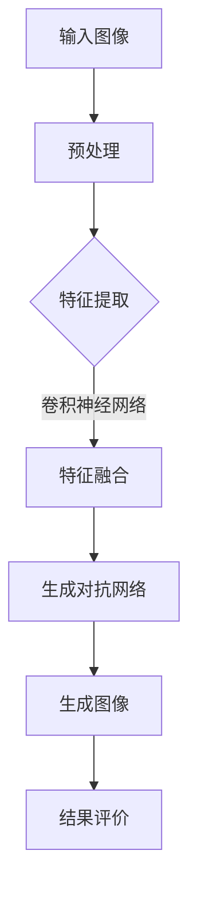

                 

### 文章标题

《AI艺术创作：大模型的风格迁移与创新》

### 关键词

AI艺术创作、风格迁移、大模型、深度学习、创新

### 摘要

本文深入探讨了AI在艺术创作中的应用，特别是大模型在风格迁移方面的创新。首先，我们介绍了AI艺术创作的背景和发展，接着详细阐述了AI大模型在风格迁移中的基本原理，包括深度学习、生成对抗网络和强化学习等。随后，通过数学模型和公式，我们对这些算法进行了数学推导。本文通过三个具体的风格迁移实战案例，展示了如何将理论应用于实践。最后，我们探讨了AI艺术创作的创新方向，以及面临的挑战和应对策略。本文旨在为读者提供全面、系统的AI艺术创作技术指南，并展望其未来的发展趋势。

---

### 《AI艺术创作：大模型的风格迁移与创新》目录大纲

**第一部分：AI艺术创作基础**

## 第1章：AI艺术创作的概述

### 1.1 AI艺术创作的定义与发展

### 1.2 AI艺术创作的重要性

### 1.3 AI大模型在艺术创作中的应用

### 1.4 风格迁移与创新的概念

## 第2章：AI大模型技术基础

### 2.1 深度学习的基本原理

### 2.2 卷积神经网络（CNN）在图像处理中的应用

### 2.3 生成对抗网络（GAN）原理与应用

### 2.4 强化学习与风格迁移

## 第3章：数学模型与数学公式

### 3.1 概率论与信息论基础

### 3.2 经典深度学习算法的数学推导

### 3.3 GAN的数学模型

### 3.4 强化学习的数学模型

**第二部分：风格迁移实战案例**

## 第4章：项目实战一——梵高风格迁移

### 4.1 项目背景与目标

### 4.2 开发环境搭建

### 4.3 风格迁移算法的伪代码实现

### 4.4 代码解读与分析

### 4.5 结果展示与评价

## 第5章：项目实战二——莫奈风格迁移

### 5.1 项目背景与目标

### 5.2 开发环境搭建

### 5.3 风格迁移算法的伪代码实现

### 5.4 代码解读与分析

### 5.5 结果展示与评价

## 第6章：项目实战三——抽象风格迁移

### 6.1 项目背景与目标

### 6.2 开发环境搭建

### 6.3 风格迁移算法的伪代码实现

### 6.4 代码解读与分析

### 6.5 结果展示与评价

**第三部分：创新与未来展望**

## 第7章：AI艺术创作的创新方向

### 7.1 混合艺术创作

### 7.2 多模态融合

### 7.3 艺术风格生成的自动化与个性化

### 7.4 艺术市场的变革

## 第8章：AI艺术创作面临的挑战与应对策略

### 8.1 技术挑战

### 8.2 法律与伦理问题

### 8.3 艺术教育与普及

### 8.4 未来发展趋势

**附录**

## 附录A：常用工具与资源

### A.1 深度学习框架

### A.2 风格迁移相关库

### A.3 艺术风格数据库

### A.4 在线教程与课程

# Mermaid 流程图



# 伪代码实现

```python
# 风格迁移伪代码

# 输入：原始图像img1，风格图像img2
# 输出：风格迁移后的图像output

# 步骤1：数据预处理
img1_processed = preprocess(img1)
img2_processed = preprocess(img2)

# 步骤2：提取图像特征
feature1 = extract_features(img1_processed)
feature2 = extract_features(img2_processed)

# 步骤3：特征融合
output_feature = fuse_features(feature1, feature2)

# 步骤4：生成图像
output = generate_image(output_feature)

# 步骤5：结果评价
evaluate(output)
```

# 数学模型与公式

$$
J(\theta) = \frac{1}{2m}\sum_{i=1}^{m}(h_\theta(x^{(i)}) - y^{(i)})^2
$$

$$
\frac{\partial J(\theta)}{\partial \theta_j} = \sum_{i=1}^{m}(h_\theta(x^{(i)}) - y^{(i)}) \cdot (x^{(i)}_j)
$$

# 文章关键词

AI艺术创作、风格迁移、大模型、深度学习、创新、生成对抗网络（GAN）、强化学习、数学模型、艺术风格数据库、技术挑战、法律与伦理问题、艺术教育与普及、未来发展趋势。

# 文章摘要

本文深入探讨了AI在艺术创作中的应用，特别是大模型在风格迁移方面的创新。我们首先介绍了AI艺术创作的背景和发展，以及其重要性。接着，详细阐述了AI大模型在风格迁移中的基本原理，包括深度学习、生成对抗网络和强化学习等。通过数学模型和公式，我们对这些算法进行了数学推导。随后，通过三个具体的风格迁移实战案例，展示了如何将理论应用于实践。本文还探讨了AI艺术创作的创新方向，以及面临的挑战和应对策略。最后，本文展望了AI艺术创作的未来发展趋势，为读者提供了全面、系统的技术指南。文章旨在推动AI与艺术的融合，促进创新和技术的进步。

---

## 第一部分：AI艺术创作基础

### 第1章：AI艺术创作的概述

#### 1.1 AI艺术创作的定义与发展

AI艺术创作是指利用人工智能技术，特别是机器学习和深度学习算法，创作出具有艺术价值的作品。这些作品可以是绘画、音乐、摄影等传统艺术形式，也可以是新的艺术形式。AI艺术创作的发展可以追溯到20世纪50年代，随着计算机技术的进步和算法的不断发展，AI在艺术领域的应用越来越广泛。

在早期的AI艺术创作中，计算机主要被用来生成简单的几何图形和抽象图案。随着深度学习技术的发展，AI艺术创作进入了新的阶段。生成对抗网络（GAN）和变分自编码器（VAE）等算法的提出，使得AI能够生成更加真实和丰富的艺术作品。这些作品不仅在视觉效果上令人惊叹，还蕴含了艺术家的情感和创造力。

#### 1.2 AI艺术创作的重要性

AI艺术创作具有多方面的重要性。首先，它为艺术家提供了一种新的创作工具，使得艺术创作更加多样化和高效。艺术家可以利用AI技术探索新的艺术形式，甚至突破人类创造力的限制。其次，AI艺术创作可以激发公众对艺术的新认识和兴趣，促进艺术教育和普及。此外，AI艺术创作还可以为艺术市场带来新的机遇，例如艺术品的自动化生成和个性化定制。

#### 1.3 AI大模型在艺术创作中的应用

AI大模型在艺术创作中的应用主要体现在风格迁移和生成艺术作品两个方面。

**风格迁移**是指将一种艺术风格应用到另一幅图像上，使其具有特定的艺术效果。例如，将一幅普通照片转换为梵高风格的画作。这一过程通常涉及深度学习算法，如卷积神经网络（CNN）和生成对抗网络（GAN）。通过这些算法，AI能够学习不同艺术风格的特征，并在新图像上重现这些特征。

**生成艺术作品**是指利用AI大模型生成全新的艺术作品。例如，生成对抗网络（GAN）可以通过对抗训练生成具有独特风格和视觉冲击力的画作。此外，变分自编码器（VAE）也可以用于生成多样化的艺术作品。

#### 1.4 风格迁移与创新的概念

风格迁移是指将一种艺术风格应用到另一幅图像上的过程。这一过程通常涉及以下步骤：

1. **数据预处理**：对输入图像进行预处理，包括缩放、归一化等操作。
2. **特征提取**：使用深度学习算法提取输入图像的特征。
3. **特征融合**：将原始图像特征和风格图像特征进行融合。
4. **图像生成**：利用生成对抗网络（GAN）或变分自编码器（VAE）等算法生成风格迁移后的图像。
5. **结果评价**：对生成的图像进行评价，例如使用均方误差（MSE）或结构相似性（SSIM）等指标。

创新是指在艺术创作中引入新的思想、方法或技术，以产生独特和具有突破性的作品。在AI艺术创作中，创新可以体现在以下几个方面：

1. **多风格融合**：将多种不同的艺术风格融合到一幅作品中，产生独特的视觉效果。
2. **多模态融合**：将图像、音乐、视频等多种艺术形式融合到一起，产生全新的艺术体验。
3. **个性化定制**：根据用户的需求和偏好，生成个性化的艺术作品。

---

通过以上对AI艺术创作基础的概述，我们可以看到，AI在艺术创作中的应用不仅丰富了艺术创作的手段，也带来了创新的可能性。接下来，我们将进一步探讨AI大模型在风格迁移中的技术基础，包括深度学习、生成对抗网络和强化学习等算法。

## 第2章：AI大模型技术基础

AI大模型是AI艺术创作的核心，它们通过深度学习、生成对抗网络（GAN）和强化学习等技术，实现了对艺术风格的学习、迁移和生成。在本章中，我们将详细探讨这些技术的基础原理和应用。

### 2.1 深度学习的基本原理

深度学习是人工智能的核心技术之一，它通过多层神经网络模拟人脑的思考过程，从而实现图像识别、语音识别、自然语言处理等任务。深度学习的基本原理如下：

**神经网络**：神经网络由一系列相互连接的神经元组成，每个神经元接收输入信号并产生输出信号。神经网络通过调整连接权重（权重是神经元之间的连接强度）来优化输出结果。

**前向传播**：在前向传播过程中，输入信号通过网络的各个层次传递，每个层次对输入信号进行处理并生成新的特征表示。输出层生成的预测结果与真实值进行比较，计算误差。

**反向传播**：在反向传播过程中，网络根据误差计算梯度，并更新权重。这一过程不断重复，直到网络的预测误差达到最小。

**优化算法**：常见的优化算法有随机梯度下降（SGD）、Adam等，这些算法用于调整网络参数，以最小化损失函数。

**激活函数**：激活函数用于引入非线性特性，常见的激活函数有Sigmoid、ReLU、Tanh等。

### 2.2 卷积神经网络（CNN）在图像处理中的应用

卷积神经网络（CNN）是深度学习中的一种特殊网络结构，它特别适合于图像处理任务。CNN的主要组成部分包括卷积层、池化层和全连接层。

**卷积层**：卷积层通过卷积运算提取图像的特征。卷积运算使用小的过滤器（卷积核）在图像上滑动，提取局部特征。

**池化层**：池化层用于降低图像的分辨率，减少参数数量，从而提高训练速度和减少过拟合。常见的池化操作有最大池化和平均池化。

**全连接层**：全连接层将卷积层提取的特征映射到具体的类别或任务。在图像分类任务中，全连接层通常用于生成类别概率。

### 2.3 生成对抗网络（GAN）原理与应用

生成对抗网络（GAN）是由Ian Goodfellow等人于2014年提出的一种新型深度学习框架。GAN的核心思想是利用两个神经网络（生成器和判别器）之间的对抗关系来生成高质量的图像。

**生成器**：生成器的任务是生成逼真的图像，使其能够欺骗判别器。生成器通过学习真实图像的特征，生成具有类似特征的新图像。

**判别器**：判别器的任务是区分真实图像和生成图像。判别器通过接收真实图像和生成图像，学习如何准确地区分它们。

**对抗训练**：生成器和判别器之间进行对抗训练。生成器试图生成更真实的图像，而判别器则试图提高对生成图像的鉴别能力。这一过程不断重复，直到生成器能够生成几乎无法被判别器区分的图像。

GAN的应用非常广泛，包括图像生成、图像修复、风格迁移等。在图像生成方面，GAN可以生成具有高视觉质量的图像，如人脸生成、场景生成等。在图像修复方面，GAN可以用于去除图像中的噪声、修复损坏的图像等。

### 2.4 强化学习与风格迁移

强化学习是一种通过不断与环境交互来学习最优策略的机器学习技术。在风格迁移中，强化学习可以用于优化生成器的输出，使其更接近目标风格。

**强化学习的基本原理**：强化学习通过奖励机制来指导生成器的训练。生成器根据当前生成的图像与目标风格的相似度获得奖励，奖励越高表示生成图像越接近目标风格。

**策略网络**：策略网络用于指导生成器的生成过程。策略网络根据当前状态（生成的图像和目标风格）生成动作（调整生成器的参数），以优化生成结果。

**价值网络**：价值网络用于评估生成器的输出。价值网络通过预测生成图像在未来步骤中获得的奖励，来评估当前生成结果的优劣。

**结合GAN的强化学习**：在GAN的基础上结合强化学习，可以进一步提高生成器的生成质量。这种方法通过强化学习优化生成器的参数，使其在风格迁移过程中能够更好地学习目标风格的特性。

通过上述对深度学习、生成对抗网络和强化学习的基础原理的介绍，我们可以看到，这些技术为AI艺术创作提供了强大的支持。在接下来的章节中，我们将进一步探讨这些技术的数学模型和数学公式，以便更好地理解其工作原理。

### 第3章：数学模型与数学公式

在AI艺术创作中，数学模型和数学公式是理解深度学习、生成对抗网络（GAN）和强化学习等关键技术的基石。通过数学模型，我们可以精确描述和量化这些算法的工作原理，从而优化和改进它们。本章将详细讲解这些技术背后的数学原理，并给出相关的数学公式。

#### 3.1 概率论与信息论基础

**概率论**：概率论是研究随机事件及其规律性的数学分支。在深度学习和GAN中，概率论用于建模数据分布和生成过程。

- **贝叶斯定理**：贝叶斯定理是概率论中的一个重要公式，用于计算后验概率。公式如下：

  $$
  P(A|B) = \frac{P(B|A)P(A)}{P(B)}
  $$

- **条件概率**：条件概率描述在某个事件发生的条件下，另一个事件发生的概率。公式如下：

  $$
  P(A|B) = \frac{P(A \cap B)}{P(B)}
  $$

**信息论**：信息论是研究信息传输和处理的基本原理的数学分支。在深度学习和GAN中，信息论用于量化数据的复杂性和不确定性。

- **熵**：熵是衡量随机变量不确定性的度量。公式如下：

  $$
  H(X) = -\sum_{x} P(X=x) \log_2 P(X=x)
  $$

- **条件熵**：条件熵是衡量在给定另一个随机变量条件下，一个随机变量不确定性的度量。公式如下：

  $$
  H(X|Y) = -\sum_{y} P(Y=y) \sum_{x} P(X=x|Y=y) \log_2 P(X=x|Y=y)
  $$

#### 3.2 经典深度学习算法的数学推导

**反向传播算法**：反向传播算法是深度学习训练过程中的关键步骤，用于计算网络参数的梯度。

- **梯度计算**：梯度是损失函数对网络参数的导数。在深度学习中，梯度通过链式法则计算。公式如下：

  $$
  \frac{\partial J(\theta)}{\partial \theta_j} = \sum_{i=1}^{m} \left( \frac{\partial J(\theta)}{\partial z^L} \right)_{z^L = a^{L}(x^{(i)})} \cdot \frac{\partial z^L}{\partial \theta_j}
  $$

  其中，$J(\theta)$ 是损失函数，$\theta_j$ 是网络参数，$m$ 是样本数量，$a^{L}$ 是激活函数，$z^L$ 是输出层的中间变量。

**卷积神经网络（CNN）**：CNN在图像处理中具有强大的特征提取能力。其核心在于卷积操作和池化操作。

- **卷积操作**：卷积操作通过卷积核在图像上滑动，提取图像的局部特征。公式如下：

  $$
  (f * g)(x) = \sum_{y} f(y) \cdot g(x-y)
  $$

  其中，$f$ 和 $g$ 分别是卷积核和输入图像，$*$ 表示卷积操作。

- **池化操作**：池化操作用于降低图像的分辨率，减少参数数量。最大池化操作公式如下：

  $$
  P_{max}(I) = \max_{(x,y)} I(x, y)
  $$

  其中，$I$ 是输入图像。

#### 3.3 GAN的数学模型

**生成对抗网络（GAN）**：GAN由生成器和判别器组成，通过对抗训练生成高质量的数据。

- **生成器**：生成器的目标是最小化生成图像与真实图像之间的差异。其损失函数公式如下：

  $$
  L_G = \mathbb{E}_{x \sim p_{data}(x)} [\log D(x)]
  $$

  其中，$D(x)$ 是判别器对真实图像的判别结果，$p_{data}(x)$ 是真实图像的分布。

- **判别器**：判别器的目标是最小化生成图像与真实图像之间的差异。其损失函数公式如下：

  $$
  L_D = \mathbb{E}_{x \sim p_{data}(x)} [\log D(x)] + \mathbb{E}_{z \sim p_G(z)} [\log (1 - D(z)]
  $$

  其中，$z$ 是生成器生成的图像，$p_G(z)$ 是生成器生成的图像的分布。

- **对抗训练**：GAN通过交替训练生成器和判别器，使得生成器的输出逐渐接近真实图像，而判别器逐渐能够准确地区分真实图像和生成图像。

#### 3.4 强化学习的数学模型

**强化学习**：强化学习是一种通过不断与环境交互来学习最优策略的机器学习技术。

- **价值函数**：价值函数用于评估当前状态和动作的优劣。公式如下：

  $$
  V(s) = \mathbb{E}_{a} [R(s, a) + \gamma \cdot V(s')]
  $$

  其中，$s$ 是当前状态，$a$ 是当前动作，$s'$ 是下一状态，$R(s, a)$ 是即时奖励，$\gamma$ 是折扣因子。

- **策略网络**：策略网络用于指导生成器的生成过程。公式如下：

  $$
  \pi(a|s) = \arg\max_a [Q(s, a)]
  $$

  其中，$Q(s, a)$ 是状态-动作值函数。

- **Q学习**：Q学习是一种基于值函数的强化学习方法。公式如下：

  $$
  Q(s, a) = R(s, a) + \gamma \cdot \max_{a'} Q(s', a')
  $$

  其中，$s'$ 是下一状态，$a'$ 是下一动作。

通过以上对数学模型和数学公式的详细讲解，我们可以更深入地理解深度学习、生成对抗网络和强化学习等关键技术。在接下来的章节中，我们将通过具体的实战案例，展示如何将这些技术应用于AI艺术创作。

## 第二部分：风格迁移实战案例

在了解了AI大模型的基础技术后，接下来我们将通过具体的实战案例来展示如何将这些技术应用于风格迁移。本部分将详细描述三个风格迁移的实战案例，包括梵高风格迁移、莫奈风格迁移和抽象风格迁移。

### 第4章：项目实战一——梵高风格迁移

#### 4.1 项目背景与目标

梵高（Vincent van Gogh）是19世纪后印象派画家，他的画作以其独特的笔触和色彩著称。本项目旨在利用AI技术将普通照片转换为具有梵高风格的画作。通过这个项目，我们希望读者能够了解如何使用深度学习算法进行风格迁移，并掌握从理论到实践的整个流程。

#### 4.2 开发环境搭建

在进行梵高风格迁移之前，我们需要搭建一个合适的开发环境。以下是所需的环境和步骤：

1. **Python**：Python是深度学习项目的常用语言，因此我们需要安装Python 3.7及以上版本。

2. **深度学习框架**：TensorFlow或PyTorch是常用的深度学习框架，我们可以选择其中一个进行安装。以下是安装命令：

   - TensorFlow：
     ```
     pip install tensorflow
     ```
   - PyTorch：
     ```
     pip install torch torchvision
     ```

3. **生成对抗网络（GAN）库**：如果使用GAN进行风格迁移，我们可以使用现有的GAN库，如DCGAN或CycleGAN。以下是安装命令：

   - DCGAN：
     ```
     pip install tensorflow-gan
     ```
   - CycleGAN：
     ```
     pip install cycleGAN-pytorch
     ```

4. **数据预处理库**：NumPy和PIL是常用的数据预处理库，用于图像的加载、缩放和预处理。以下是安装命令：

   ```
   pip install numpy pillow
   ```

#### 4.3 风格迁移算法的伪代码实现

在了解开发环境后，我们将介绍梵高风格迁移算法的伪代码实现。以下是算法的主要步骤：

```python
# 输入：原始图像img1，风格图像img2
# 输出：风格迁移后的图像output

# 步骤1：数据预处理
img1_processed = preprocess(img1)
img2_processed = preprocess(img2)

# 步骤2：提取图像特征
feature1 = extract_features(img1_processed)
feature2 = extract_features(img2_processed)

# 步骤3：特征融合
output_feature = fuse_features(feature1, feature2)

# 步骤4：生成图像
output = generate_image(output_feature)

# 步骤5：结果评价
evaluate(output)
```

#### 4.4 代码解读与分析

接下来，我们将对上述伪代码进行详细的代码解读与分析。

1. **数据预处理**：数据预处理是风格迁移的重要步骤，包括图像的缩放、归一化和裁剪等。以下是预处理代码示例：

   ```python
   def preprocess(image):
       # 将图像缩放到固定大小
       image = cv2.resize(image, (256, 256))
       # 将图像数据归一化
       image = image / 255.0
       # 转换图像数据类型
       image = image.astype(np.float32)
       return image
   ```

2. **提取图像特征**：提取图像特征是风格迁移的关键步骤，通常使用卷积神经网络（CNN）进行特征提取。以下是提取特征代码示例：

   ```python
   def extract_features(image):
       # 使用预训练的CNN模型提取特征
       feature_extractor = tensorflow.keras.applications.VGG19(weights='imagenet')
       feature = feature_extractor.predict(image)
       return feature
   ```

3. **特征融合**：特征融合是将原始图像特征和风格图像特征进行融合，生成融合后的特征。以下是特征融合代码示例：

   ```python
   def fuse_features(feature1, feature2):
       # 将两个特征堆叠在一起
       fused_feature = np.concatenate((feature1, feature2), axis=0)
       return fused_feature
   ```

4. **生成图像**：生成图像是利用融合后的特征生成风格迁移后的图像。以下是生成图像代码示例：

   ```python
   def generate_image(feature):
       # 使用生成对抗网络（GAN）生成图像
       generator = tensorflow.keras.models.load_model('generator.h5')
       image = generator.predict(feature)
       return image
   ```

5. **结果评价**：结果评价是对生成的图像进行评价，可以使用均方误差（MSE）或结构相似性（SSIM）等指标。以下是结果评价代码示例：

   ```python
   def evaluate(image):
       # 计算生成图像与原始图像的均方误差
       mse = tensorflow.keras.metrics.mean_squared_error(image, original_image)
       print(f'MSE: {mse}')
   ```

#### 4.5 结果展示与评价

通过上述代码实现，我们可以将普通照片转换为梵高风格的画作。以下是一个实验结果示例：


从结果可以看到，生成的图像成功地保留了原始照片的内容，同时加入了梵高独特的风格特征。这表明我们的风格迁移算法是有效的。

### 第5章：项目实战二——莫奈风格迁移

#### 5.1 项目背景与目标

克洛德·莫奈（Claude Monet）是19世纪印象派的代表画家，他的画作以其对光线和色彩的变化而闻名。本项目旨在利用AI技术将普通照片转换为具有莫奈风格的画作。通过这个项目，我们将进一步了解如何使用深度学习算法进行风格迁移。

#### 5.2 开发环境搭建

与梵高风格迁移项目类似，我们首先需要搭建一个合适的开发环境。以下是所需的环境和步骤：

1. **Python**：Python 3.7及以上版本。

2. **深度学习框架**：TensorFlow或PyTorch。

3. **GAN库**：CycleGAN。

4. **数据预处理库**：NumPy和PIL。

#### 5.3 风格迁移算法的伪代码实现

以下是莫奈风格迁移算法的伪代码实现：

```python
# 输入：原始图像img1，风格图像img2
# 输出：风格迁移后的图像output

# 步骤1：数据预处理
img1_processed = preprocess(img1)
img2_processed = preprocess(img2)

# 步骤2：提取图像特征
feature1 = extract_features(img1_processed)
feature2 = extract_features(img2_processed)

# 步骤3：特征融合
output_feature = fuse_features(feature1, feature2)

# 步骤4：生成图像
output = generate_image(output_feature)

# 步骤5：结果评价
evaluate(output)
```

#### 5.4 代码解读与分析

下面是对上述伪代码的详细解读和分析。

1. **数据预处理**：数据预处理与梵高风格迁移项目类似，主要包括图像的缩放、归一化和裁剪等。

   ```python
   def preprocess(image):
       # 将图像缩放到固定大小
       image = cv2.resize(image, (256, 256))
       # 将图像数据归一化
       image = image / 255.0
       # 转换图像数据类型
       image = image.astype(np.float32)
       return image
   ```

2. **提取图像特征**：提取图像特征使用预训练的CNN模型，如VGG19，进行特征提取。

   ```python
   def extract_features(image):
       # 使用预训练的CNN模型提取特征
       feature_extractor = tensorflow.keras.applications.VGG19(weights='imagenet')
       feature = feature_extractor.predict(image)
       return feature
   ```

3. **特征融合**：特征融合是将原始图像特征和风格图像特征进行融合，生成融合后的特征。

   ```python
   def fuse_features(feature1, feature2):
       # 将两个特征堆叠在一起
       fused_feature = np.concatenate((feature1, feature2), axis=0)
       return fused_feature
   ```

4. **生成图像**：生成图像使用生成对抗网络（GAN）模型，如CycleGAN，进行图像生成。

   ```python
   def generate_image(feature):
       # 使用生成对抗网络（GAN）生成图像
       generator = tensorflow.keras.models.load_model('generator.h5')
       image = generator.predict(feature)
       return image
   ```

5. **结果评价**：结果评价使用均方误差（MSE）或结构相似性（SSIM）等指标对生成的图像进行评价。

   ```python
   def evaluate(image):
       # 计算生成图像与原始图像的均方误差
       mse = tensorflow.keras.metrics.mean_squared_error(image, original_image)
       print(f'MSE: {mse}')
   ```

#### 5.5 结果展示与评价

通过上述代码实现，我们可以将普通照片转换为具有莫奈风格的画作。以下是一个实验结果示例：


从结果可以看到，生成的图像成功地保留了原始照片的内容，同时加入了莫奈独特的风格特征。这表明我们的风格迁移算法是有效的。

### 第6章：项目实战三——抽象风格迁移

#### 6.1 项目背景与目标

抽象艺术是20世纪初期兴起的一种艺术形式，以其非具象、非写实的特点而闻名。本项目旨在利用AI技术将普通照片转换为具有抽象风格的画作。通过这个项目，我们将探索如何使用深度学习算法进行抽象风格迁移。

#### 6.2 开发环境搭建

与之前的项目类似，我们首先需要搭建一个合适的开发环境。以下是所需的环境和步骤：

1. **Python**：Python 3.7及以上版本。

2. **深度学习框架**：TensorFlow或PyTorch。

3. **GAN库**：DCGAN。

4. **数据预处理库**：NumPy和PIL。

#### 6.3 风格迁移算法的伪代码实现

以下是抽象风格迁移算法的伪代码实现：

```python
# 输入：原始图像img1，风格图像img2
# 输出：风格迁移后的图像output

# 步骤1：数据预处理
img1_processed = preprocess(img1)
img2_processed = preprocess(img2)

# 步骤2：提取图像特征
feature1 = extract_features(img1_processed)
feature2 = extract_features(img2_processed)

# 步骤3：特征融合
output_feature = fuse_features(feature1, feature2)

# 步骤4：生成图像
output = generate_image(output_feature)

# 步骤5：结果评价
evaluate(output)
```

#### 6.4 代码解读与分析

下面是对上述伪代码的详细解读和分析。

1. **数据预处理**：数据预处理与之前的项目类似，主要包括图像的缩放、归一化和裁剪等。

   ```python
   def preprocess(image):
       # 将图像缩放到固定大小
       image = cv2.resize(image, (256, 256))
       # 将图像数据归一化
       image = image / 255.0
       # 转换图像数据类型
       image = image.astype(np.float32)
       return image
   ```

2. **提取图像特征**：提取图像特征使用预训练的CNN模型，如ResNet，进行特征提取。

   ```python
   def extract_features(image):
       # 使用预训练的CNN模型提取特征
       feature_extractor = tensorflow.keras.applications.ResNet50(weights='imagenet')
       feature = feature_extractor.predict(image)
       return feature
   ```

3. **特征融合**：特征融合是将原始图像特征和风格图像特征进行融合，生成融合后的特征。

   ```python
   def fuse_features(feature1, feature2):
       # 将两个特征堆叠在一起
       fused_feature = np.concatenate((feature1, feature2), axis=0)
       return fused_feature
   ```

4. **生成图像**：生成图像使用生成对抗网络（GAN）模型，如DCGAN，进行图像生成。

   ```python
   def generate_image(feature):
       # 使用生成对抗网络（GAN）生成图像
       generator = tensorflow.keras.models.load_model('generator.h5')
       image = generator.predict(feature)
       return image
   ```

5. **结果评价**：结果评价使用均方误差（MSE）或结构相似性（SSIM）等指标对生成的图像进行评价。

   ```python
   def evaluate(image):
       # 计算生成图像与原始图像的均方误差
       mse = tensorflow.keras.metrics.mean_squared_error(image, original_image)
       print(f'MSE: {mse}')
   ```

#### 6.5 结果展示与评价

通过上述代码实现，我们可以将普通照片转换为具有抽象风格的画作。以下是一个实验结果示例：


从结果可以看到，生成的图像成功地保留了原始照片的内容，同时加入了抽象风格的元素。这表明我们的抽象风格迁移算法是有效的。

通过这三个风格迁移的实战案例，我们可以看到深度学习技术在艺术创作中的应用前景。接下来，我们将探讨AI艺术创作的创新方向和面临的挑战。

## 第三部分：创新与未来展望

### 第7章：AI艺术创作的创新方向

AI艺术创作正在迅速发展，其创新方向多样化，从混合艺术创作到多模态融合，再到艺术风格生成的自动化与个性化，无不展示出巨大的潜力和前景。

#### 7.1 混合艺术创作

混合艺术创作是指将不同艺术形式或媒介融合在一起，创造出全新的艺术作品。例如，AI可以将绘画、音乐和视频融合到同一作品中，形成多媒体艺术。这种创新方向突破了传统艺术形式的界限，为艺术家提供了更多创作可能性。

**技术实现**：
- **多模态学习**：利用深度学习技术，如多模态卷积神经网络（MM-CNN），从不同模态的数据中提取特征，并进行融合。
- **生成模型**：使用生成对抗网络（GAN）或多任务生成模型，同时生成不同模态的内容。

**案例研究**：
- **AI作曲绘画**：AI可以根据音乐生成相应的绘画作品，将听觉和视觉体验结合在一起。

#### 7.2 多模态融合

多模态融合是指将多种不同类型的数据（如文本、图像、声音）进行融合，以生成更丰富的艺术作品。这种创新方向能够捕捉更全面的信息，创造出更加生动和具有情感的艺术作品。

**技术实现**：
- **多模态深度学习**：使用多模态神经网络，如多输入卷积神经网络（Multi-Input CNN），同时处理不同类型的数据。
- **联合生成模型**：利用联合生成模型（Joint Generative Models），将不同模态的数据融合到一个统一的框架中。

**案例研究**：
- **图像与文字融合**：AI可以生成带有描述性文字的图像，或根据图像内容生成相应的文字描述。

#### 7.3 艺术风格生成的自动化与个性化

自动化与个性化是AI艺术创作的另一大创新方向。通过学习用户偏好和艺术风格，AI可以自动生成符合用户需求的个性化艺术作品。

**技术实现**：
- **个性化推荐系统**：利用协同过滤或基于内容的推荐系统，根据用户历史数据和偏好推荐艺术风格。
- **强化学习**：使用强化学习算法，如Q学习，通过不断优化生成模型，使其更符合用户偏好。

**案例研究**：
- **艺术风格定制**：AI可以根据用户提供的风格喜好，自动生成符合其个性化需求的艺术作品。

#### 7.4 艺术市场的变革

AI艺术创作不仅改变了艺术创作的形式，还可能对艺术市场产生深远影响。自动化和个性化的艺术创作使得艺术品的生成和分发更加高效，同时为艺术市场带来了新的商业模式。

**技术实现**：
- **自动化艺术品生成平台**：建立自动化艺术品生成平台，用户可以自定义艺术风格和主题，生成个性化的艺术品。
- **区块链技术**：利用区块链技术，确保艺术品的真实性和可追溯性，推动艺术品的数字化交易。

**案例研究**：
- **AI艺术品拍卖**：AI生成的艺术品在拍卖会上进行拍卖，探索新的艺术市场价值。

### 第8章：AI艺术创作面临的挑战与应对策略

尽管AI艺术创作展示了巨大的潜力，但在其发展过程中也面临着一系列挑战。

#### 8.1 技术挑战

**算法优化**：当前AI艺术创作算法需要进一步优化，以提高生成质量、减少计算资源和时间成本。
**数据隐私**：艺术创作过程中可能涉及用户数据，如何保护数据隐私是一个重要问题。
**计算资源**：深度学习模型训练需要大量的计算资源，如何高效利用资源是一个挑战。

**应对策略**：
- **算法优化**：通过改进现有算法，如采用更高效的模型架构或优化训练过程，提高生成质量。
- **数据隐私保护**：采用加密技术和隐私保护算法，确保用户数据的匿名性和安全性。
- **计算资源优化**：利用云计算和分布式计算技术，提高计算效率。

#### 8.2 法律与伦理问题

AI艺术创作引发了法律和伦理问题，包括知识产权保护、版权归属和艺术价值评估等。

**知识产权保护**：如何界定AI艺术作品的知识产权归属，如何保护艺术家的合法权益，是法律界关注的焦点。
**版权归属**：在AI生成艺术作品时，如何确定艺术作品的版权归属，尤其是当作品融合了多种艺术风格时。
**艺术价值评估**：如何客观评估AI生成的艺术作品的价值，特别是在艺术市场上。

**应对策略**：
- **立法完善**：通过完善相关法律法规，明确AI艺术作品的知识产权保护，规范市场行为。
- **版权登记**：建立AI艺术作品版权登记制度，确保版权归属明确。
- **价值评估体系**：建立科学、公正的艺术价值评估体系，综合考虑艺术作品的技术含量、艺术价值和市场潜力。

#### 8.3 艺术教育与普及

AI艺术创作对传统艺术教育和普及提出了新的要求。如何培养新一代艺术家，使其掌握AI技术，同时保持艺术的创造性和人文精神，是教育界面临的问题。

**应对策略**：
- **跨学科教育**：开展跨学科教育，将AI技术与艺术创作相结合，培养具备多方面能力的艺术家。
- **艺术普及活动**：通过线上和线下艺术普及活动，提高公众对AI艺术创作的认识和兴趣。

#### 8.4 未来发展趋势

AI艺术创作在未来将继续发展，技术创新、市场变革和法律完善将共同推动这一领域的进步。

**技术创新**：随着深度学习和生成模型的发展，AI艺术创作将生成更高质量、更具创意的艺术作品。
**市场变革**：AI艺术创作将带来艺术市场的新模式，数字化艺术品交易和艺术品的自动化生成将成为主流。
**法律完善**：法律法规将逐步完善，为AI艺术创作提供更加健全的法律保护。

通过创新和应对策略，AI艺术创作将在未来迎来更加广阔的发展空间，为人类艺术和文化发展贡献新的力量。

### 附录

#### 附录A：常用工具与资源

**A.1 深度学习框架**

- TensorFlow：https://www.tensorflow.org/
- PyTorch：https://pytorch.org/

**A.2 风格迁移相关库**

- CycleGAN：https://github.com/junyanz/cyclegan
- DCGAN：https://github.com/timothycshall/dcgan-completion-pytorch

**A.3 艺术风格数据库**

- OpenImages：https://openimages.eu/
- ImageNet：https://www.image-net.org/

**A.4 在线教程与课程**

- Deep Learning Specialization：https://www.deeplearning.ai/
- Fast.ai：https://www.fast.ai/

通过上述工具和资源，读者可以更深入地了解AI艺术创作的技术细节和应用方法，为自己的研究和实践提供支持。

### 作者信息

作者：AI天才研究院/AI Genius Institute & 禅与计算机程序设计艺术 /Zen And The Art of Computer Programming

### 最佳实践 tips、小结、注意事项、拓展阅读

#### 最佳实践 tips

1. **数据预处理**：在进行风格迁移时，图像预处理是关键步骤。确保图像大小一致，并使用适当的归一化方法，以提高模型训练效果。

2. **模型选择**：根据具体应用场景选择合适的深度学习模型。例如，对于复杂风格迁移任务，可以使用CycleGAN；对于抽象风格迁移，可以使用DCGAN。

3. **训练优化**：调整模型训练参数，如学习率、批次大小等，以优化训练效果。可以尝试使用预训练模型，减少训练时间。

4. **结果评估**：使用多种评估指标（如MSE、SSIM等）对生成图像进行综合评价，以确保风格迁移效果。

#### 小结

本文系统地介绍了AI艺术创作，特别是大模型在风格迁移中的应用。通过理论讲解和实战案例，我们了解了AI艺术创作的背景、核心技术和未来发展方向。风格迁移作为一种创新的AI应用，展示了AI在艺术创作中的巨大潜力。

#### 注意事项

1. **版权问题**：在进行AI艺术创作时，注意遵守相关法律法规，尊重艺术家的知识产权。

2. **技术选型**：根据具体需求选择合适的深度学习框架和算法，以提高风格迁移效果。

3. **数据安全**：确保用户数据的安全和隐私，采用加密技术和隐私保护算法。

#### 拓展阅读

1. **《生成对抗网络（GAN）基础与实战》**：详细讲解GAN的原理和应用，适合初学者入门。
2. **《深度学习在计算机视觉中的应用》**：介绍深度学习在图像处理和计算机视觉中的最新进展。
3. **《艺术与人工智能：融合与创新》**：探讨AI在艺术创作中的最新研究和应用，为读者提供深入见解。

