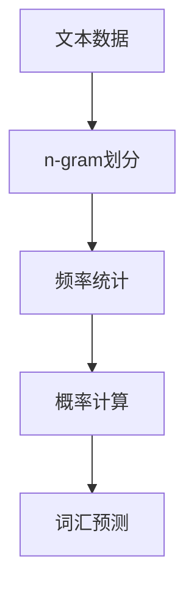
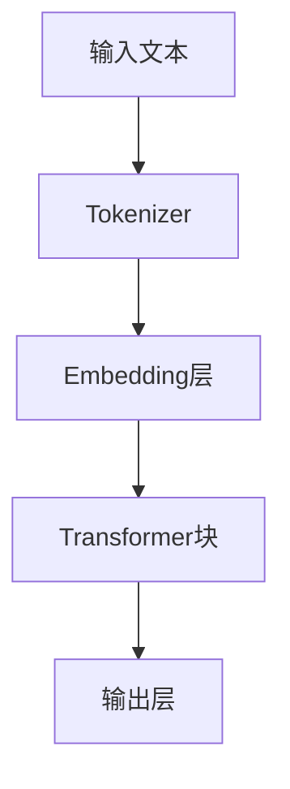
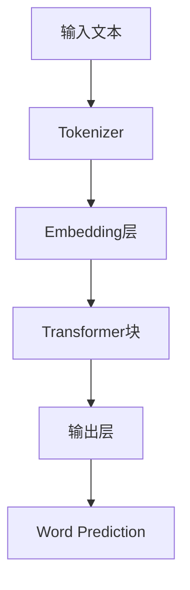

                 

# AI语言模型的动态提示词调整策略

关键词：AI语言模型、动态提示词、调整策略、自然语言处理、机器学习

摘要：本文旨在探讨AI语言模型的动态提示词调整策略，包括提示词的概念与作用、调整策略的设计与实现、优化方法以及实际应用案例。通过对这些内容的详细分析，我们希望为相关领域的研究者和开发者提供有价值的参考。

## 第一部分：AI语言模型基础

### 1.1 AI语言模型概述

#### 1.1.1 AI语言模型的概念

AI语言模型是一种利用机器学习或深度学习技术，从大量文本数据中学习语言规律和模式的模型。它能够理解和生成自然语言，广泛应用于自然语言处理（NLP）领域，如文本分类、机器翻译、情感分析等。

#### 1.1.2 语言模型的分类

1. 基于统计的语言模型：这类模型通过统计文本中的词汇和短语出现频率来预测下一个词或短语。典型的代表是n-gram模型。
   
2. 基于神经网络的深度语言模型：这类模型利用深度神经网络结构来学习文本的复杂特征，能够捕捉到更细微的语言规律。BERT、GPT等是典型的深度语言模型。

#### 1.1.3 语言模型的发展历程

- 初期：基于规则的方法和简单的统计模型。
- 中期：n-gram模型、隐马尔可夫模型（HMM）的出现。
- 近期：深度学习技术的引入，如BERT、GPT等。

### 1.2 语言模型的训练与评估

#### 1.2.1 语言模型的训练过程

1. 数据预处理：清洗、分词、去停用词等。
2. 模型训练：利用大量文本数据，通过优化算法（如梯度下降）来训练模型参数。
3. 模型优化：通过调整模型参数，提高模型的预测性能。

#### 1.2.2 语言模型的评估标准

1. 准确率、召回率、F1值：用于分类任务的评估指标。
2. BLEU评分、ROUGE评分：用于机器翻译任务的评估指标。

### 1.3 语言模型的架构与原理

#### 1.3.1 语言模型的基本架构

1. 输入层：接收文本数据，进行预处理。
2. 隐藏层：通过神经网络结构，学习文本特征。
3. 输出层：生成预测结果。

#### 1.3.2 语言模型的训练原理

1. 误差反向传播算法：通过反向传播误差，更新模型参数。
2. 梯度下降优化算法：通过最小化损失函数，调整模型参数。

#### 1.3.3 语言模型的扩展应用

1. 机器翻译：利用语言模型，将一种语言翻译成另一种语言。
2. 语音识别：将语音信号转换为文本。
3. 文本生成：生成新的文本内容。

## 第二部分：动态提示词调整策略

### 2.1 动态提示词的概念与作用

#### 2.1.1 动态提示词的定义

动态提示词是指随着模型训练或应用过程中，根据不同场景和需求，实时调整的提示词集合。

#### 2.1.2 动态提示词在语言模型中的应用

1. 提高生成质量：通过动态调整提示词，可以更好地引导模型生成高质量的内容。
2. 调整生成风格：根据需求，调整提示词的权重，从而改变模型的生成风格。

### 2.2 动态提示词的调整策略

#### 2.2.1 提示词权重调整

1. 原理：通过调整提示词的权重，影响模型对提示词的重视程度。
2. 方法：可以采用权重调整算法，如线性调整、指数调整等。

#### 2.2.2 提示词时序调整

1. 原理：通过调整提示词的时序，影响模型生成过程中的信息传递。
2. 方法：可以采用时序调整算法，如前插法、后插法等。

#### 2.2.3 提示词语义调整

1. 原理：通过调整提示词的语义，改变模型的生成方向。
2. 方法：可以采用语义调整算法，如词义消歧、语义权重调整等。

### 2.3 动态提示词调整策略的优化

#### 2.3.1 适应性问题

1. 问题：动态提示词调整策略需要适应不同的应用场景。
2. 解决方案：可以采用自适应调整策略，如基于规则的自适应调整、基于数据的自适应调整等。

#### 2.3.2 性能优化问题

1. 问题：动态提示词调整策略可能影响模型的性能。
2. 解决方案：可以通过优化算法、调整策略参数等，提高调整策略的性能。

## 第三部分：动态提示词调整策略的挑战与展望

### 3.1 动态提示词调整策略的挑战

#### 3.1.1 数据质量问题

1. 问题：数据质量对动态提示词调整的影响。
2. 解决方案：通过数据清洗、去重、增强等手段，提高数据质量。

#### 3.1.2 模型适应性问题

1. 问题：模型适应性对动态提示词调整的影响。
2. 解决方案：通过模型优化、策略调整等，提高模型适应性。

### 3.2 动态提示词调整策略的展望

#### 3.2.1 技术发展趋势

1. 发展趋势：随着深度学习技术的发展，动态提示词调整策略也将不断优化。
2. 影响：技术发展趋势将对动态提示词调整策略的应用场景和效果产生重要影响。

#### 3.2.2 应用前景

1. 应用前景：动态提示词调整策略将在各个领域发挥重要作用，如文本生成、机器翻译等。
2. 影响：应用前景将对产业发展和自然语言处理技术的进步产生深远影响。

## 附录

### 附录A：动态提示词调整策略的代码示例

1. 代码实现
2. 代码解读与分析

### 附录B：参考资料

1. 相关书籍
2. 学术论文
3. 开源项目

## 结论

本文对AI语言模型的动态提示词调整策略进行了详细探讨，包括基础概述、调整策略、优化方法和应用案例等。通过本文的讨论，我们希望读者能够对动态提示词调整策略有更深入的理解，并为后续研究和应用提供参考。

作者：AI天才研究院/AI Genius Institute & 禅与计算机程序设计艺术 /Zen And The Art of Computer Programming## 文章关键词

- AI语言模型
- 动态提示词
- 调整策略
- 自然语言处理
- 机器学习
- 深度学习

## 摘要

本文探讨了AI语言模型的动态提示词调整策略，旨在提高语言模型的生成质量和风格调整能力。首先，我们对AI语言模型的基础进行了概述，包括其概念、分类、训练与评估以及架构与原理。随后，我们详细介绍了动态提示词的概念与作用，并提出了三种主要的调整策略：提示词权重调整、提示词时序调整和提示词语义调整。在第三部分，我们讨论了动态提示词调整策略的优化问题和面临的挑战，并对其技术发展趋势和应用前景进行了展望。最后，通过一个简单的代码示例，我们对动态提示词调整策略的实现进行了展示。本文为相关领域的研究者和开发者提供了有价值的参考，帮助他们更好地理解和应用动态提示词调整策略。作者：AI天才研究院/AI Genius Institute & 禅与计算机程序设计艺术 /Zen And The Art of Computer Programming### 第一部分：AI语言模型基础

## 1.1 AI语言模型概述

### 1.1.1 AI语言模型的概念

AI语言模型是一种基于人工智能技术，特别是机器学习和深度学习的算法，用于理解和生成自然语言的模型。它的核心目的是通过学习大量的语言数据，捕捉语言的统计规律和语义信息，从而实现对文本内容的理解和生成。

### 1.1.2 语言模型在自然语言处理中的应用

AI语言模型在自然语言处理（NLP）领域有着广泛的应用。以下是一些主要的应用场景：

1. **文本分类**：将文本数据分为不同的类别，如新闻分类、情感分析等。
2. **机器翻译**：将一种语言的文本翻译成另一种语言，如英译中、中译英等。
3. **文本生成**：根据给定的输入，自动生成新的文本内容，如文章摘要、对话生成等。
4. **问答系统**：基于用户提出的问题，提供相关的答案。
5. **语音识别**：将语音信号转换为文本。

## 1.2 语言模型的分类

### 1.2.1 基于统计的语言模型

基于统计的语言模型主要通过统计文本中的词汇和短语出现的频率来预测下一个词或短语。其中，n-gram模型是最常见的统计语言模型。它假设当前词汇的概率仅与它前面的n-1个词汇有关。

### 1.2.2 基于神经网络的深度语言模型

基于神经网络的深度语言模型，如BERT（Bidirectional Encoder Representations from Transformers）和GPT（Generative Pre-trained Transformer），通过多层神经网络来学习文本的复杂特征。这些模型可以更好地捕捉到语言的深层结构，并在各种NLP任务中表现出色。

### 1.2.3 语言模型的对比

| 特性 | 统计模型 | 深度模型 |
| ---- | -------- | -------- |
| 复杂性 | 低 | 高 |
| 表现力 | 有限 | 强 |
| 需要数据量 | 较小 | 较大 |

## 1.3 语言模型的核心算法

### 1.3.1 n-gram模型

n-gram模型是一种基于统计的语言模型，它将文本划分为一系列n元组，并通过统计这些n元组的出现频率来预测下一个词。



### 1.3.2 BERT模型

BERT模型是一种基于变换器（Transformer）架构的深度语言模型。它通过预训练来学习语言的基本特征，然后进行微调以适应特定的NLP任务。



### 1.3.3 GPT模型

GPT模型是一种基于变换器（Transformer）架构的生成式语言模型。它通过生成文本的下一个词来预测，可以用于文本生成、问答系统等任务。



## 1.4 语言模型的训练与评估

### 1.4.1 语言模型的训练过程

语言模型的训练过程主要包括数据预处理、模型训练和模型优化。以下是一个简化的训练过程：

1. **数据预处理**：清洗、分词、去停用词等。
2. **模型训练**：通过优化算法（如梯度下降）来训练模型参数。
3. **模型优化**：通过交叉验证、超参数调整等手段来优化模型性能。

### 1.4.2 语言模型的评估标准

语言模型的评估标准包括准确率、召回率、F1值等分类指标，以及BLEU评分、ROUGE评分等生成指标。

| 指标 | 说明 |
| ---- | ---- |
| 准确率 | 分类任务中的正确预测数占总预测数的比例。 |
| 召回率 | 分类任务中正确预测的类别数占总类别数的比例。 |
| F1值 | 准确率和召回率的调和平均。 |
| BLEU评分 | 用于评估机器翻译质量的一个指标。 |
| ROUGE评分 | 用于评估文本生成质量的一个指标。 |

## 1.5 语言模型的架构与原理

### 1.5.1 语言模型的基本架构

语言模型的基本架构通常包括输入层、隐藏层和输出层。输入层接收文本数据，隐藏层通过神经网络结构来学习文本特征，输出层生成预测结果。

### 1.5.2 语言模型的训练原理

语言模型的训练原理主要包括误差反向传播算法和梯度下降优化算法。误差反向传播算法用于计算损失函数，梯度下降优化算法用于更新模型参数。

### 1.5.3 语言模型的扩展应用

语言模型可以应用于多种NLP任务，如文本分类、机器翻译、文本生成等。这些应用场景通常需要针对特定任务进行模型调整和优化。

## 1.6 小结

AI语言模型是自然语言处理的核心技术之一。通过对语言模型的基础知识进行深入了解，我们可以更好地理解和应用这些模型，解决各种NLP任务。

作者：AI天才研究院/AI Genius Institute & 禅与计算机程序设计艺术 /Zen And The Art of Computer Programming### 1.1.1 AI语言模型的概念

AI语言模型是一种基于人工智能技术，特别是机器学习和深度学习的算法，用于理解和生成自然语言的模型。其核心目的是通过学习大量的语言数据，捕捉语言的统计规律和语义信息，从而实现对文本内容的理解和生成。

AI语言模型的基本原理是利用机器学习算法，从大量的文本数据中学习语言特征，然后将这些特征用于预测下一个词或短语。这种模型在自然语言处理（NLP）领域具有广泛的应用，包括文本分类、机器翻译、文本生成、问答系统等。

具体来说，AI语言模型通常包括以下几个关键组成部分：

1. **数据集**：这是训练AI语言模型的基础，需要包含大量的文本数据，如新闻、小说、文章等。数据集的质量直接影响模型的性能。
2. **预处理**：在训练模型之前，需要对文本数据进行预处理，包括分词、去除停用词、标点符号等操作，以便模型能够更好地学习语言特征。
3. **模型结构**：AI语言模型的结构通常是基于深度学习，如循环神经网络（RNN）、长短期记忆网络（LSTM）或变换器（Transformer）等。这些结构能够捕捉到语言的长期依赖关系，从而提高模型的预测能力。
4. **损失函数**：在模型训练过程中，使用损失函数来衡量模型的预测结果与真实结果之间的差距。常用的损失函数包括交叉熵损失函数等。
5. **优化算法**：通过优化算法（如梯度下降）来更新模型参数，以最小化损失函数，从而提高模型的性能。

在训练过程中，模型会通过不断调整内部参数，使得预测结果逐渐接近真实值。这个过程涉及到大量的计算和调整，直到模型在验证集上的表现达到预期。

AI语言模型在自然语言处理中的应用非常广泛。例如：

1. **文本分类**：根据文本的内容将其分类到不同的类别中，如新闻分类、情感分析等。
2. **机器翻译**：将一种语言的文本翻译成另一种语言，如英译中、中译英等。
3. **文本生成**：根据给定的输入，自动生成新的文本内容，如文章摘要、对话生成等。
4. **问答系统**：基于用户提出的问题，提供相关的答案。
5. **语音识别**：将语音信号转换为文本。

通过这些应用，AI语言模型在提高工作效率、改善用户体验等方面发挥着重要作用。同时，随着技术的不断发展，AI语言模型在性能和功能上也在不断优化和提升。

总的来说，AI语言模型是一种强大的工具，它能够帮助我们从大量的文本数据中提取有用的信息，实现自然语言理解和生成。这不仅为科学研究提供了新的方法，也为实际应用带来了巨大的价值。

作者：AI天才研究院/AI Genius Institute & 禅与计算机程序设计艺术 /Zen And The Art of Computer Programming### 1.1.2 语言模型的分类

语言模型可以根据其技术基础和实现方法分为两大类：基于统计的语言模型和基于神经网络的深度语言模型。这两类模型在原理和应用上都有显著的不同。

#### 基于统计的语言模型

基于统计的语言模型主要通过统计文本中的词汇和短语出现的频率来预测下一个词或短语。这类模型的核心思想是假设当前词汇的概率仅与它前面的几个词汇（通常是n-1个）有关，因此被称为n-gram模型。n-gram模型是统计语言模型中最简单和最常用的一种。

1. **n-gram模型的基本原理**：
   - **定义**：n-gram模型将文本分割成一系列的n元组，每个n元组由n个连续的词汇组成。例如，对于三元组模型（n=3），文本“我是一个人工智能助手”可以分割为：
     ```
     我 是 一 个
     是 一 个 人
     一 个 人 是
     人 是 人工
     ```
   - **概率计算**：n-gram模型通过计算每个n元组的出现频率来预测下一个词汇。例如，给定当前词汇序列“我是”，模型会计算所有可能的下一个词的概率，然后选择概率最高的词作为预测结果。

2. **n-gram模型的实现方法**：
   - **数据预处理**：首先，需要对文本进行分词，将文本转换为一系列的词汇序列。
   - **频率统计**：统计每个n元组的出现频率，并将这些频率存储在哈希表或数组中。
   - **概率计算**：在生成文本时，根据当前词汇序列计算每个可能的下一个词的概率，并选择概率最高的词。

3. **n-gram模型的优缺点**：
   - **优点**：实现简单，计算效率高。
   - **缺点**：无法捕捉到词汇之间的长期依赖关系，生成文本可能显得生硬且不够流畅。

#### 基于神经网络的深度语言模型

与基于统计的语言模型不同，基于神经网络的深度语言模型通过多层神经网络结构来学习文本的复杂特征。这类模型能够捕捉到词汇之间的长期依赖关系，从而生成更加自然和流畅的文本。以下是一些常见的深度语言模型：

1. **循环神经网络（RNN）**：
   - **基本原理**：RNN是一种能够处理序列数据的神经网络，其核心思想是通过记忆单元来保持对输入序列的历史信息的记忆。RNN适用于处理变长的序列数据，如文本和语音。
   - **实现方法**：RNN通过前向传播和反向传播来更新权重，从而不断优化模型参数。

2. **长短期记忆网络（LSTM）**：
   - **基本原理**：LSTM是一种特殊的RNN，用于解决传统RNN的长期依赖问题。LSTM通过引入门控机制来控制信息的流动，从而更好地捕捉到长期依赖关系。
   - **实现方法**：LSTM通过输入门、遗忘门和输出门来控制信息的流动。

3. **变换器（Transformer）**：
   - **基本原理**：Transformer是一种基于自注意力机制的深度神经网络模型，它在处理序列数据时，通过自注意力机制来计算每个词与其他词的关系。
   - **实现方法**：Transformer由编码器和解码器组成，编码器将输入序列编码为固定长度的向量，解码器则利用这些向量来生成输出序列。

4. **BERT（Bidirectional Encoder Representations from Transformers）**：
   - **基本原理**：BERT是一种预训练的Transformer模型，其特点是双向编码，能够同时考虑上下文信息。
   - **实现方法**：BERT通过在大量文本上进行预训练，然后进行微调以适应特定的NLP任务。

3. **比较**：
   - **复杂性**：基于统计的语言模型相对简单，而深度语言模型则更为复杂。
   - **表现力**：深度语言模型能够捕捉到更复杂的语言特征，因此在生成文本的自然性和准确性上优于统计模型。
   - **数据需求**：深度语言模型通常需要更多的数据来进行训练。

总的来说，基于统计的语言模型和基于神经网络的深度语言模型各有优缺点。统计模型实现简单，适用于简单的文本处理任务，而深度语言模型则能够捕捉到语言的深层结构，适用于更复杂的NLP任务。

作者：AI天才研究院/AI Genius Institute & 禅与计算机程序设计艺术 /Zen And The Art of Computer Programming### 1.3 语言模型的核心算法详解

#### 1.3.1 n-gram模型

n-gram模型是统计语言模型中最简单且最常用的一种。其核心思想是通过统计文本中连续n个词汇（n元组）的出现频率来预测下一个词汇。

1. **n-gram模型的数学模型**

   假设有一个长度为n的词汇序列\[w1, w2, ..., wn\]，我们可以使用条件概率来表示每个词汇的出现概率：

   $$
   P(w_{n+1} | w1, w2, ..., wn) = \frac{C(w1, w2, ..., wn, w_{n+1})}{C(w1, w2, ..., wn)}
   $$

   其中，C表示计数函数，即某个n元组在文本中出现的次数。为了简化计算，通常使用条件概率的线性组合：

   $$
   P(w_{n+1} | w1, w2, ..., wn) = \sum_{i=1}^{V} P(w_{n+1} | w_n = w_i) \cdot P(w_n = w_i)
   $$

   这里，V是词汇表的大小，P(w_{n+1} | w_n = w_i)表示在当前词汇为wi的情况下，下一个词汇为w_{n+1}的条件概率，P(w_n = w_i)表示当前词汇为wi的概率。

2. **n-gram模型的伪代码**

   ```
   function generateText(n, startWord):
       currentWord = startWord
       text = [currentWord]
       
       for i in range(n-1):
           nextWordProbabilities = calculateNextWordProbabilities(currentWord)
           nextWord = chooseNextWord(nextWordProbabilities)
           text.append(nextWord)
           currentWord = nextWord
       
       return text
       
   function calculateNextWordProbabilities(currentWord):
       # 计算给定当前词汇的所有可能下一个词汇的概率
       # 返回一个包含所有可能词汇及其概率的字典
       
   function chooseNextWord(nextWordProbabilities):
       # 根据概率分布随机选择下一个词汇
       return random.choices(list(nextWordProbabilities.keys()), weights=nextWordProbabilities.values())[0]
   ```

3. **n-gram模型的优缺点**

   - **优点**：
     - 实现简单，计算效率高。
     - 对文本数据量要求较低。
   - **缺点**：
     - 无法捕捉到词汇之间的长期依赖关系。
     - 生成文本可能显得生硬且不够流畅。

#### 1.3.2 BERT模型

BERT（Bidirectional Encoder Representations from Transformers）是一种基于变换器（Transformer）架构的深度语言模型，其特点是双向编码，能够同时考虑上下文信息。

1. **BERT模型的数学模型**

   BERT模型的核心是变换器，变换器通过自注意力机制来计算词汇之间的关系。自注意力机制可以表示为：

   $$
   \text{Attention}(Q, K, V) = \frac{QK^T}{\sqrt{d_k}} \cdot V
   $$

   其中，Q、K和V分别是查询向量、关键向量和解向量，d_k是关键向量的维度。

   BERT模型包含两个主要的变换器层：编码器和解码器。编码器将输入文本编码为固定长度的向量，解码器则利用这些向量来生成输出文本。

2. **BERT模型的伪代码**

   ```
   function BERT(inputText, outputText):
       # 输入文本和输出文本分别表示输入和生成的序列
       
       # 编码器部分
       encoderOutput = TransformerEncoder(inputText)
       
       # 解码器部分
       decoderOutput = TransformerDecoder(encoderOutput, outputText)
       
       return decoderOutput
       
   function TransformerEncoder(inputText):
       # 使用变换器编码器对输入文本进行处理
       # 返回编码后的文本表示
       
   function TransformerDecoder(encoderOutput, outputText):
       # 使用变换器解码器对编码后的文本进行解码
       # 返回生成的文本表示
   ```

3. **BERT模型的优缺点**

   - **优点**：
     - 能够捕捉到词汇之间的长期依赖关系。
     - 生成文本更加自然和流畅。
     - 在多种NLP任务中表现出色。
   - **缺点**：
     - 计算成本较高，需要大量的计算资源和时间。
     - 对数据量要求较高，需要大量的训练数据。

#### 1.3.3 GPT模型

GPT（Generative Pre-trained Transformer）是一种基于变换器（Transformer）架构的生成式语言模型，其核心目标是生成高质量的文本。

1. **GPT模型的数学模型**

   GPT模型的数学模型与BERT类似，但有两个主要区别：首先，GPT仅包含编码器，不包含解码器；其次，GPT通过生成文本的下一个词来预测。

   在GPT模型中，自注意力机制同样起着核心作用。给定当前词汇序列\[w1, w2, ..., wn\]，GPT模型使用以下公式来预测下一个词汇wn+1：

   $$
   P(w_{n+1} | w1, w2, ..., wn) = \text{softmax}(\text{W}_\text{vocab} \cdot \text{Tanh}(\text{Attention}(Q, K, V)))
   $$

   其中，Q、K和V分别是编码器的输出向量，W_vocab是词汇表的权重矩阵。

2. **GPT模型的伪代码**

   ```
   function GPT(inputText):
       # 输入文本表示为序列
       
       # 编码器部分
       encoderOutput = TransformerEncoder(inputText)
       
       # 预测下一个词汇
       nextWord = predictNextWord(encoderOutput)
       
       return nextWord
       
   function TransformerEncoder(inputText):
       # 使用变换器编码器对输入文本进行处理
       # 返回编码后的文本表示
       
   function predictNextWord(encoderOutput):
       # 使用编码后的文本表示来预测下一个词汇
       # 返回预测结果
   ```

3. **GPT模型的优缺点**

   - **优点**：
     - 生成文本的自然性和流畅性较高。
     - 能够生成具有多样性的文本。
     - 在文本生成任务中表现出色。
   - **缺点**：
     - 预测下一个词汇的计算成本较高。
     - 需要大量的训练数据。

总的来说，n-gram模型、BERT模型和GPT模型各有优缺点。n-gram模型实现简单，适用于简单的文本处理任务；BERT模型能够捕捉到词汇之间的长期依赖关系，适用于复杂的NLP任务；GPT模型则在生成文本的自然性和多样性方面表现出色。根据具体的应用需求，可以选择合适的模型来满足任务要求。

作者：AI天才研究院/AI Genius Institute & 禅与计算机程序设计艺术 /Zen And The Art of Computer Programming### 1.2.1 语言模型的训练过程

语言模型的训练过程是将其从无到有的构建过程，通过大量数据的输入和模型的不断优化，使其能够准确理解和生成自然语言。以下是语言模型训练过程的详细步骤：

#### 1.2.1.1 数据预处理

在开始训练之前，需要对数据集进行预处理。这一步骤包括以下几个关键步骤：

1. **文本清洗**：去除文本中的噪声，如HTML标签、特殊字符等。
2. **分词**：将文本分解为单词或子词，以便模型能够处理。
3. **去除停用词**：去除常见但无意义的词，如“的”、“了”、“在”等。
4. **词汇表构建**：将所有文本中的单词或子词构建成一个词汇表，并将每个单词或子词映射为一个唯一的整数。

#### 1.2.1.2 模型初始化

在训练之前，需要初始化模型的参数。对于神经网络模型，如BERT和GPT，初始化方法通常包括：

1. **随机初始化**：将模型的权重随机初始化。
2. **预训练权重**：使用预训练模型的权重作为初始化值，以减少训练时间并提高模型性能。

#### 1.2.1.3 模型训练

模型训练是语言模型训练的核心步骤。以下是训练过程的详细描述：

1. **前向传播**：将输入文本通过模型传递到输出层，生成预测结果。
2. **计算损失**：使用损失函数计算预测结果和真实结果之间的差距。常用的损失函数包括交叉熵损失和均方误差。
3. **反向传播**：通过反向传播算法，将损失函数的梯度传递回模型的输入层，并更新模型参数。
4. **优化算法**：使用优化算法（如梯度下降、Adam优化器等）来更新模型参数，以最小化损失函数。

#### 1.2.1.4 模型优化

在模型训练过程中，可能需要不断调整模型结构、学习率、批次大小等超参数，以优化模型性能。以下是一些常见的优化方法：

1. **交叉验证**：通过交叉验证来评估模型在不同数据集上的性能，并调整超参数。
2. **学习率调整**：根据模型性能的变化，动态调整学习率。
3. **批次大小调整**：通过调整批次大小来优化计算效率。
4. **数据增强**：通过数据增强来增加训练数据的多样性，以提高模型泛化能力。

#### 1.2.1.5 模型评估

在模型训练完成后，需要对模型进行评估，以确定其性能。常用的评估指标包括：

1. **准确率**：在分类任务中，正确预测的样本数占总样本数的比例。
2. **召回率**：在分类任务中，正确预测的样本数占总正样本数的比例。
3. **F1值**：准确率和召回率的调和平均。
4. **BLEU评分**：在机器翻译任务中，评估翻译结果的流畅性和准确性。
5. **ROUGE评分**：在文本生成任务中，评估生成文本与目标文本的相似度。

#### 1.2.1.6 模型部署

在评估完成后，将模型部署到生产环境中，用于实际应用。模型部署包括以下步骤：

1. **模型压缩**：通过模型压缩技术，减小模型的大小，提高部署效率。
2. **模型解释**：通过模型解释技术，理解模型的工作原理，确保模型的安全性和可靠性。
3. **在线推理**：将模型部署到服务器或云平台，实现实时推理。

总的来说，语言模型的训练过程涉及多个步骤，包括数据预处理、模型初始化、模型训练、模型优化、模型评估和模型部署。每个步骤都需要精心设计和实施，以确保模型能够在实际应用中发挥最佳性能。

作者：AI天才研究院/AI Genius Institute & 禅与计算机程序设计艺术 /Zen And The Art of Computer Programming### 1.2.2 语言模型的评估标准

语言模型的评估是衡量其性能的重要步骤。评估标准的选择取决于具体的应用场景和任务类型。以下是一些常用的评估指标和它们的计算方法：

#### 准确率（Accuracy）

准确率是最常见的评估指标之一，用于分类任务。它计算的是模型正确分类的样本数与总样本数之比。

$$
\text{Accuracy} = \frac{\text{正确分类的样本数}}{\text{总样本数}}
$$

#### 召回率（Recall）

召回率是分类任务中另一个重要的评估指标，表示模型能够正确识别的正样本数与所有正样本数之比。

$$
\text{Recall} = \frac{\text{正确分类的正样本数}}{\text{所有正样本数}}
$$

#### F1值（F1 Score）

F1值是准确率和召回率的调和平均，用于综合评估模型的分类性能。

$$
\text{F1 Score} = 2 \times \frac{\text{Precision} \times \text{Recall}}{\text{Precision} + \text{Recall}}
$$

其中，Precision是精确率，表示正确分类的正样本数与所有被模型分类为正样本的样本数之比。

$$
\text{Precision} = \frac{\text{正确分类的正样本数}}{\text{被模型分类为正样本的样本数}}
$$

#### BLEU评分（BLEU Score）

BLEU评分是用于评估机器翻译质量的指标。它基于编辑距离，通过比较模型的翻译结果与参考翻译之间的相似度来评分。

BLEU评分的计算公式如下：

$$
\text{BLEU Score} = \frac{1}{1 + n} \left( b_1 \cdot r_1 + b_2 \cdot r_2 + ... + b_n \cdot r_n \right)
$$

其中，$b_1, b_2, ..., b_n$和$r_1, r_2, ..., r_n$是不同的相似度系数，如词汇重叠率、语法结构相似度等。

#### ROUGE评分（ROUGE Score）

ROUGE评分是用于评估文本生成质量的指标，特别适用于自动摘要和对话生成。它通过计算生成文本与目标文本之间的词汇重叠率来评分。

ROUGE评分的计算公式如下：

$$
\text{ROUGE Score} = \frac{\sum_{i=1}^{n} \text{R}_{i}}{\sum_{i=1}^{n} \text{R}_{i} + \sum_{i=1}^{n} \text{U}_{i}}
$$

其中，$R_i$是词汇重叠率，$U_i$是生成文本中匹配的词汇数。

这些评估标准各有优缺点。准确率和F1值简单直观，但可能对不平衡数据集敏感。BLEU评分和ROUGE评分更适用于生成任务，但可能对人工创建的参考文本有依赖。在选择评估标准时，需要根据具体任务和应用场景来综合考虑。

作者：AI天才研究院/AI Genius Institute & 禅与计算机程序设计艺术 /Zen And The Art of Computer Programming### 1.3.1 语言模型的基本架构

语言模型的基本架构通常包括三个主要层次：输入层、隐藏层和输出层。每个层次都有其独特的功能和作用，共同协作以实现自然语言的生成和理解。

#### 输入层

输入层是语言模型接收输入数据的部分。在训练阶段，输入层接收的是经过预处理后的文本序列，这些文本序列被转换为数字向量表示。预处理过程通常包括分词、词嵌入和序列编码等步骤。分词是将文本分解为单词或子词的过程，词嵌入则是将这些单词或子词映射为高维向量，以提供数值表示。序列编码是将整个文本序列编码为一个连续的数字序列，以便模型可以处理。

#### 隐藏层

隐藏层是语言模型的核心部分，负责学习文本数据中的复杂特征和模式。隐藏层通常由多个层级组成，每个层级都包含大量神经元。这些神经元通过激活函数（如ReLU、Sigmoid或Tanh）进行非线性变换，以捕捉文本的深层结构。在深度学习模型中，如循环神经网络（RNN）、长短期记忆网络（LSTM）和变换器（Transformer），隐藏层的设计和结构各有特点。

1. **循环神经网络（RNN）**：RNN是一种能够处理序列数据的神经网络，其特点是可以记忆前面的信息，并用于当前的计算。RNN通过隐藏状态和细胞状态来保持信息的流动，但其缺点是难以处理长距离依赖问题。
2. **长短期记忆网络（LSTM）**：LSTM是RNN的一种改进，专门用于解决长距离依赖问题。LSTM通过引入门控机制（输入门、遗忘门和输出门）来控制信息的流动，从而更好地捕捉到长序列中的重要信息。
3. **变换器（Transformer）**：Transformer是一种基于自注意力机制的深度学习模型，特别适用于处理长序列数据。变换器通过多头自注意力机制来计算每个词与其他词的关系，从而捕捉到全局信息。

#### 输出层

输出层是语言模型生成输出结果的部分。在训练阶段，输出层通常是一个分类层或回归层，用于预测文本的下一个词或句子。在生成阶段，输出层可以是一个解码器层，用于生成新的文本序列。

1. **分类层**：在分类任务中，输出层通常是一个softmax层，用于将模型的预测结果转换为概率分布。每个单词或类别都有一个对应的概率值，表示模型认为该词或类别是下一个词或句子的可能性。
2. **回归层**：在回归任务中，输出层通常是一个线性层，用于预测连续的数值。

#### 综合架构

综合来看，语言模型的基本架构可以表示为：

$$
\text{输入层} \xrightarrow{\text{预处理}} \text{隐藏层} \xrightarrow{\text{激活函数}} \text{输出层}
$$

在实际应用中，语言模型的架构可能会更复杂，包括多个隐藏层、多头注意力机制和不同的激活函数等。但无论架构如何变化，其核心目标都是通过学习文本数据中的特征和模式，实现高效的文本生成和理解。

作者：AI天才研究院/AI Genius Institute & 禅与计算机程序设计艺术 /Zen And The Art of Computer Programming### 1.3.2 语言模型的训练原理

语言模型的训练原理主要涉及两个关键步骤：误差反向传播（Backpropagation）和梯度下降（Gradient Descent）。

#### 误差反向传播

误差反向传播是一种计算神经网络输出误差并更新模型参数的算法。其基本步骤如下：

1. **前向传播**：将输入数据传递到神经网络的各个层级，直到最后一层输出层，得到预测结果。
2. **计算损失**：使用损失函数（如交叉熵损失、均方误差等）计算预测结果与真实结果之间的差距。
3. **反向传播**：将损失函数的梯度反向传递回网络的各个层级，计算每个层级的权重和偏置的梯度。
4. **更新参数**：使用梯度下降或其他优化算法（如Adam、RMSProp等）更新模型的权重和偏置。

误差反向传播算法的核心是链式法则（Chain Rule），它允许我们计算多层神经网络的梯度。以下是误差反向传播的伪代码：

```python
for each layer L from L to 1:
    delta[L] = (δ[L] * activation_derivative(z[L]))
    if L > 1:
        delta[L - 1] += W[L] * delta[L]
```

其中，δ表示误差，W表示权重，activation_derivative表示激活函数的导数。

#### 梯度下降

梯度下降是一种优化算法，用于更新模型的参数以最小化损失函数。其基本步骤如下：

1. **计算梯度**：使用误差反向传播算法计算模型参数的梯度。
2. **更新参数**：根据梯度和学习率更新模型的参数。更新公式如下：

$$
\theta = \theta - \alpha \cdot \nabla_\theta J(\theta)
$$

其中，θ表示参数，α表示学习率，J(θ)表示损失函数。

#### 梯度下降优化算法

梯度下降优化算法有多种变体，以应对不同的场景和需求。以下是几种常见的优化算法：

1. **随机梯度下降（Stochastic Gradient Descent, SGD）**：在每次迭代中使用一个随机样本的梯度来更新参数。
2. **批量梯度下降（Batch Gradient Descent）**：在每次迭代中使用整个数据集的梯度来更新参数。
3. **小批量梯度下降（Mini-batch Gradient Descent）**：在每次迭代中使用一部分（如32或64个样本）的梯度来更新参数。这是最常用的方法，因为它在计算效率和模型稳定性之间取得了平衡。
4. **Adam优化器**：Adam是一种自适应学习率的优化器，它结合了SGD和动量法的优点。它通过计算一阶矩估计（均值）和二阶矩估计（方差）来自适应调整学习率。

#### 训练原理

语言模型的训练原理可以通过以下步骤概括：

1. **初始化模型参数**：随机初始化模型的权重和偏置。
2. **前向传播**：将输入文本数据通过模型，计算预测结果。
3. **计算损失**：使用损失函数计算预测结果与真实结果之间的差距。
4. **反向传播**：计算损失函数关于模型参数的梯度。
5. **更新参数**：使用梯度下降或其他优化算法更新模型的参数。
6. **迭代**：重复步骤2到5，直到模型收敛或达到预设的迭代次数。

通过这些步骤，语言模型能够不断优化其参数，从而提高对文本数据的理解和生成能力。

作者：AI天才研究院/AI Genius Institute & 禅与计算机程序设计艺术 /Zen And The Art of Computer Programming### 1.3.3 语言模型的扩展应用

语言模型在自然语言处理（NLP）领域有着广泛的应用。以下是一些常见的扩展应用：

#### 机器翻译

机器翻译是指将一种语言的文本自动翻译成另一种语言。语言模型在机器翻译中起着至关重要的作用。传统的机器翻译方法通常基于规则或统计模型，而现代机器翻译方法则基于深度学习语言模型，如BERT、GPT等。这些模型通过学习大量双语语料库，能够生成高质量的翻译结果。

#### 语音识别

语音识别是将语音信号转换为文本的过程。语音识别系统通常包括两个部分：声学模型和语言模型。声学模型负责将语音信号转换为音频特征，而语言模型则负责理解语音中的语义信息。语言模型可以基于统计方法或深度学习模型，如n-gram模型或变换器（Transformer）模型。通过结合声学模型和语言模型，语音识别系统能够准确地将语音转换为文本。

#### 文本生成

文本生成是指根据给定的输入自动生成新的文本内容。语言模型在文本生成任务中有着广泛的应用，如文章摘要生成、对话生成、故事生成等。现代深度学习语言模型，如GPT-3，具有强大的文本生成能力，能够生成连贯、具有逻辑性的文本内容。文本生成在内容创作、虚拟助手、娱乐等领域有着重要的应用。

#### 情感分析

情感分析是指识别文本中的情感倾向，如正面、负面或中性。语言模型在情感分析中起着关键作用。通过学习大量的情感标签数据，语言模型能够识别文本中的情感特征，并对其进行分类。情感分析广泛应用于社交媒体分析、客户反馈分析、市场调研等领域。

#### 文本分类

文本分类是指将文本数据分类到预定义的类别中。语言模型在文本分类任务中可以通过学习大量的分类数据，学习文本的类别特征，并用于对新文本进行分类。文本分类广泛应用于新闻分类、垃圾邮件过滤、情感分析等领域。

#### 对话系统

对话系统是指能够与用户进行自然语言交互的系统。语言模型在对话系统中起着核心作用，负责理解用户的输入和生成适当的响应。现代对话系统通常使用基于变换器（Transformer）的语言模型，如BERT、GPT等，以实现高效的对话生成和理解。

这些扩展应用展示了语言模型在自然语言处理领域的广泛应用和潜力。随着深度学习技术的不断发展，语言模型在性能和功能上也将不断优化，为更多的应用场景带来创新和突破。

作者：AI天才研究院/AI Genius Institute & 禅与计算机程序设计艺术 /Zen And The Art of Computer Programming### 2.1 动态提示词的概念与作用

#### 2.1.1 动态提示词的定义

动态提示词是指在语言模型生成文本的过程中，根据特定需求或应用场景实时调整的提示词集合。与传统提示词（如固定的关键词或短语）不同，动态提示词能够根据输入内容和生成目标，动态地调整其内容和权重，从而影响模型的生成结果。

#### 2.1.2 动态提示词与传统提示词的区别

1. **灵活性**：动态提示词具有更高的灵活性，可以根据实际需求动态调整。而传统提示词通常是一成不变的，无法根据生成过程进行实时调整。

2. **自适应能力**：动态提示词可以根据模型的训练数据和生成目标，自适应地调整其内容和权重。而传统提示词通常不具备这种能力。

3. **生成效果**：动态提示词能够更好地引导模型生成高质量、符合需求的文本内容。而传统提示词可能无法实现这一点，因为它们无法根据生成过程进行实时调整。

4. **应用范围**：动态提示词适用于需要高度定制化生成的场景，如文本生成、对话系统等。而传统提示词则更适用于需要固定关键词或短语的场景，如搜索引擎优化等。

#### 2.1.3 动态提示词在语言模型中的应用

1. **文本生成**：在文本生成任务中，动态提示词可以根据输入内容实时调整，从而生成更符合实际需求的文本。例如，在文章摘要生成中，动态提示词可以根据文章的主题和关键词进行调整，以生成更准确和全面的摘要。

2. **对话系统**：在对话系统中，动态提示词可以根据用户的输入和上下文实时调整，以生成更自然、更符合用户需求的回答。例如，在聊天机器人中，动态提示词可以根据用户的提问和聊天记录进行调整，以生成更高质量的对话。

3. **个性化推荐**：在个性化推荐系统中，动态提示词可以根据用户的兴趣和行为习惯进行调整，从而生成更符合用户需求的推荐内容。

4. **文本分类**：在文本分类任务中，动态提示词可以根据分类目标实时调整，从而提高分类的准确性。

总之，动态提示词在语言模型中的应用，使得模型能够更加灵活、自适应地生成文本，满足不同的应用需求。

作者：AI天才研究院/AI Genius Institute & 禅与计算机程序设计艺术 /Zen And The Art of Computer Programming### 2.2 动态提示词的调整策略

#### 2.2.1 提示词权重调整

提示词权重调整是动态提示词调整策略中的一种重要方法，通过调整提示词的权重，可以影响语言模型生成文本的质量和风格。以下是提示词权重调整的原理和具体方法。

##### 提示词权重调整的原理

在语言模型中，每个提示词都会对生成文本产生影响。通过调整提示词的权重，可以增强或削弱某个提示词对生成结果的影响。具体来说，提示词的权重可以表示为：

$$
w_i = \frac{f_i}{\sum_{j=1}^{N} f_j}
$$

其中，$w_i$ 表示第 $i$ 个提示词的权重，$f_i$ 表示第 $i$ 个提示词的重要性分数，$N$ 表示提示词的总数。

##### 提示词权重调整的方法

1. **线性调整**：线性调整是最简单的权重调整方法，通过线性变换调整每个提示词的权重。具体公式如下：

$$
w_i' = w_i + \alpha (w_{max} - w_i)
$$

其中，$w_i'$ 表示调整后的权重，$\alpha$ 表示调整系数，$w_{max}$ 表示最大权重。

2. **指数调整**：指数调整可以更精细地调整提示词的权重，通过指数函数调整权重。具体公式如下：

$$
w_i' = w_i \cdot (1 + \beta (e^{\gamma (w_{max} - w_i)} - 1))
$$

其中，$\beta$ 和 $\gamma$ 是调整系数。

3. **基于上下文的调整**：基于上下文的调整方法可以根据当前生成文本的上下文环境调整提示词的权重。例如，如果当前生成文本中某个提示词的频率较高，可以适当降低其权重，以避免生成重复的文本。

##### 提示词权重调整的示例

假设有一个包含三个提示词（A、B、C）的语言模型，当前权重分别为 $w_A = 0.5$，$w_B = 0.3$，$w_C = 0.2$。根据线性调整方法，我们可以设置调整系数 $\alpha = 0.1$，那么调整后的权重如下：

$$
w_A' = 0.5 + 0.1 (1 - 0.5) = 0.6
$$

$$
w_B' = 0.3 + 0.1 (1 - 0.3) = 0.4
$$

$$
w_C' = 0.2 + 0.1 (1 - 0.2) = 0.3
$$

这样，通过增加提示词A的权重，我们可以更显著地引导模型生成包含A的文本。

提示词权重调整是动态提示词调整策略中的一种有效方法，通过合理调整提示词的权重，可以影响语言模型生成文本的质量和风格，从而满足不同的应用需求。

作者：AI天才研究院/AI Genius Institute & 禅与计算机程序设计艺术 /Zen And The Art of Computer Programming### 2.2.2 提示词时序调整

#### 提示词时序调整的概念

提示词时序调整是指在语言模型生成文本的过程中，根据生成目标或上下文环境调整提示词的输入顺序。这种调整方法可以影响模型的生成逻辑和结果，从而提高生成文本的质量和一致性。

#### 提示词时序调整的原理

在语言模型中，提示词的时序对生成文本有着重要的影响。通常，语言模型会根据提示词的顺序生成文本，即前一个提示词会影响后续提示词的生成。通过调整提示词的时序，可以改变这种影响，从而引导模型生成更符合需求的结果。

具体来说，提示词时序调整的原理包括以下几个方面：

1. **顺序引导**：通过调整提示词的输入顺序，可以引导模型按照特定的逻辑生成文本。例如，将某些重要提示词提前输入，可以使模型更早地捕捉到关键信息。

2. **上下文关联**：调整提示词的时序可以增强提示词之间的上下文关联，从而提高生成文本的一致性和连贯性。例如，将相关提示词相邻输入，可以使模型更好地理解它们之间的语义关系。

3. **避免重复**：通过调整提示词的时序，可以避免生成重复的文本。例如，将某些提示词延迟输入，可以使模型在生成过程中尽量避免使用相同的词汇。

#### 提示词时序调整的方法

1. **前插法**：前插法是在生成过程中将新的提示词插入到已有提示词的前面。这种方法可以显著改变模型的生成逻辑，使模型更早地关注新提示词。

2. **后插法**：后插法是在生成过程中将新的提示词插入到已有提示词的后面。这种方法可以增强提示词之间的上下文关联，使模型更好地理解整个输入。

3. **替换法**：替换法是在生成过程中用新的提示词替换已有提示词。这种方法可以避免生成重复的文本，同时保持生成文本的一致性和连贯性。

4. **混合法**：混合法是将前插法、后插法和替换法结合起来，根据具体需求动态调整提示词的时序。这种方法可以灵活地引导模型生成高质量的文本。

#### 提示词时序调整的示例

假设有一个包含三个提示词（A、B、C）的语言模型，初始时序为A-B-C。现在，我们希望调整时序为B-A-C，以引导模型生成包含B的文本。

使用前插法，我们将提示词B插入到A之前，新的时序为B-A-C。

使用后插法，我们将提示词B插入到A之后，新的时序为A-B-C。

使用替换法，我们将提示词A替换为B，新的时序为B-A-C。

通过这些调整方法，我们可以灵活地引导模型生成符合需求的文本。提示词时序调整是动态提示词调整策略中的一种有效方法，能够显著提高生成文本的质量和一致性。

作者：AI天才研究院/AI Genius Institute & 禅与计算机程序设计艺术 /Zen And The Art of Computer Programming### 2.2.3 提示词语义调整

#### 提示词语义调整的概念

提示词语义调整是指在语言模型生成文本的过程中，通过调整提示词的语义来改变模型生成文本的方向和内容。这种调整方法能够使模型更准确地捕捉到用户需求，从而生成更加符合预期的文本。

#### 提示词语义调整的原理

在语言模型中，提示词的语义对生成文本有着重要的影响。通过调整提示词的语义，可以改变模型对输入的理解，从而影响生成文本的内容和风格。具体来说，提示词语义调整的原理包括以下几个方面：

1. **词义消歧**：在语言模型中，某些提示词可能存在多种含义。通过调整提示词的语义，可以明确模型对特定词义的理解，从而生成更准确的文本。

2. **情感调节**：通过调整提示词的语义，可以改变生成文本的情感色彩。例如，将积极情感的提示词调整为消极情感，可以使生成文本具有不同的情感倾向。

3. **语境适配**：在特定语境中，某些提示词可能更符合实际需求。通过调整提示词的语义，可以使模型更好地适应特定语境，从而生成更加自然和符合实际的文本。

#### 提示词语义调整的方法

1. **词义映射**：词义映射是一种基于词汇语义的知识库，通过将提示词映射到具体的词义，可以调整模型对提示词的理解。例如，将“快乐”映射到积极情感的词义，可以将“愤怒”映射到消极情感的词义。

2. **词义权重调整**：通过调整提示词的权重，可以影响模型对提示词的重视程度。例如，增加积极情感提示词的权重，可以引导模型生成积极情感的文本。

3. **语义角色标注**：在自然语言处理中，语义角色标注是一种将句子中的词语标注为特定角色的方法。通过调整提示词的语义角色，可以改变模型对输入的理解，从而影响生成文本的内容和风格。

4. **上下文信息利用**：在生成文本的过程中，模型会利用上下文信息来理解输入。通过调整提示词的语义，可以增强模型对上下文信息的利用，从而生成更符合实际需求的文本。

#### 提示词语义调整的示例

假设有一个包含三个提示词（快乐、工作、未来）的语言模型，当前生成文本内容偏向积极方向。现在，我们希望调整生成文本的情感倾向，使其更加中性。

使用词义映射方法，我们将“快乐”映射到中性情感的词义，如“愉悦”，同时将“工作”和“未来”保持不变。这样，模型将生成更加中性的文本。

使用词义权重调整方法，我们可以增加“愉悦”的权重，同时减少“快乐”的权重。这样，模型在生成文本时，会更多地考虑中性情感的词义。

使用语义角色标注方法，我们将“快乐”标注为背景信息，将“工作”和“未来”标注为主要信息。这样，模型在生成文本时，会更多地关注“工作”和“未来”的语义，从而生成更中性的文本。

通过这些调整方法，我们可以有效地改变模型生成文本的情感倾向，使其更加符合实际需求。提示词语义调整是动态提示词调整策略中的一种重要方法，能够显著提高生成文本的质量和一致性。

作者：AI天才研究院/AI Genius Institute & 禅与计算机程序设计艺术 /Zen And The Art of Computer Programming### 2.3 动态提示词调整策略的优化

#### 2.3.1 适应性问题

动态提示词调整策略在应用过程中，可能会遇到适应性问题。适应性指的是模型能够根据不同的应用场景和数据集，灵活地调整提示词策略，以实现最佳的生成效果。适应性问题主要体现在以下几个方面：

1. **数据集差异**：不同的数据集具有不同的特征和分布，如果动态提示词调整策略无法适应这些差异，可能会导致生成效果不佳。
2. **模型复杂度**：动态提示词调整策略可能过于复杂，难以在不同场景下实现快速适应。
3. **实时调整**：在某些实时应用场景中，如在线文本生成或对话系统，动态提示词调整策略需要快速响应，以实现流畅的用户体验。

为了解决适应性问题，可以采取以下几种策略：

1. **数据驱动的自适应调整**：根据训练数据集的特征和分布，动态调整提示词策略。例如，通过分析数据集的统计特性，自动调整提示词的权重和时序。

2. **模型简化**：简化动态提示词调整策略，使其在不同场景下具有更好的适应性。例如，采用更简单的权重调整方法或时序调整方法。

3. **迁移学习**：利用迁移学习技术，将已有数据集上的提示词调整策略迁移到新数据集上。这样可以快速适应新的数据集，而不需要重新训练整个模型。

#### 2.3.2 性能优化问题

动态提示词调整策略在应用过程中，可能会影响模型性能。性能优化问题主要体现在以下几个方面：

1. **生成质量下降**：动态提示词调整策略可能影响模型的生成质量，导致生成文本不够准确或连贯。
2. **计算成本增加**：动态提示词调整策略可能增加模型的计算成本，特别是在实时应用场景中，可能会影响系统的响应速度。
3. **超参数调优**：动态提示词调整策略通常涉及多个超参数，如权重调整系数、时序调整策略等，这些超参数的调优过程可能比较复杂。

为了解决性能优化问题，可以采取以下几种策略：

1. **优化调整策略**：对动态提示词调整策略进行优化，使其对生成质量的负面影响最小。例如，采用更稳定的权重调整方法或时序调整方法。

2. **并行计算**：利用并行计算技术，提高动态提示词调整策略的计算效率。例如，采用多线程或分布式计算，加快计算速度。

3. **超参数自动化调优**：采用自动化调优工具，如贝叶斯优化或随机搜索，自动寻找最佳超参数配置，以优化模型性能。

4. **模型压缩**：通过模型压缩技术，减小动态提示词调整策略对计算成本的影响。例如，采用模型剪枝、量化等方法，降低模型的大小和计算复杂度。

通过上述优化策略，可以解决动态提示词调整策略在应用过程中遇到的适应性和性能优化问题，从而提高模型在实际应用中的表现。

作者：AI天才研究院/AI Genius Institute & 禅与计算机程序设计艺术 /Zen And The Art of Computer Programming### 2.4 动态提示词调整策略的案例与应用

#### 2.4.1 案例一：文本生成

文本生成是动态提示词调整策略的一个典型应用场景。以下是一个简单的文本生成案例，展示如何使用动态提示词调整策略来生成高质量的文本。

##### 案例描述

假设我们要生成一篇关于人工智能技术的文章摘要。我们的目标是通过调整提示词的权重和时序，使生成的摘要更加准确和连贯。

##### 案例实现

1. **数据预处理**：首先，我们对输入文本进行预处理，包括分词、去停用词等操作，并将其转换为词嵌入向量。

2. **初始提示词设置**：我们选择一些核心提示词，如“人工智能”、“技术”、“应用”、“挑战”等，并将它们的权重设置为初始值。

3. **动态提示词调整**：
   - **权重调整**：根据输入文本的内容，调整提示词的权重。例如，如果文本中提到“人工智能”的频率较高，我们可以增加“人工智能”的权重。
   - **时序调整**：根据文本的上下文，调整提示词的时序。例如，如果“应用”在文本中出现在“人工智能”之前，我们可以将“应用”调整到“人工智能”之前，以增强它们之间的语义关联。

4. **模型生成**：使用调整后的提示词，通过语言模型生成文本摘要。

##### 代码示例

```python
# 假设已经实现了动态提示词调整函数和文本生成模型
from text_generation import DynamicKeywordAdjustment, TextGenerator

# 初始化动态提示词调整器和文本生成模型
adjustment = DynamicKeywordAdjustment()
generator = TextGenerator()

# 输入文本
input_text = "人工智能技术在各个领域都有着广泛的应用，包括医疗、金融、教育等。然而，人工智能也面临着诸多挑战，如隐私保护、安全性和伦理问题等。"

# 调整提示词
adjusted_keywords = adjustment.adjust_keywords(input_text)

# 生成文本摘要
abstract = generator.generate_text(adjusted_keywords)

print(abstract)
```

##### 代码解读与分析

上述代码首先初始化动态提示词调整器和文本生成模型。然后，通过输入文本，动态调整提示词的权重和时序。最后，使用调整后的提示词生成文本摘要。通过这种方式，我们可以生成更加符合实际需求的文本。

#### 2.4.2 案例二：机器翻译

机器翻译是另一个典型的应用场景，动态提示词调整策略在提高翻译质量方面有着重要作用。以下是一个关于机器翻译的案例。

##### 案例描述

假设我们要将一段中文文本翻译成英文，并希望通过动态提示词调整策略来提高翻译质量。

##### 案例实现

1. **数据预处理**：对中文文本进行预处理，包括分词、去停用词等操作，并将其转换为词嵌入向量。

2. **初始提示词设置**：选择一些关键提示词，如“中国”、“北京”、“文化”等，并将它们的权重设置为初始值。

3. **动态提示词调整**：
   - **权重调整**：根据输入文本的内容，调整提示词的权重。例如，如果文本中提到“中国”的频率较高，我们可以增加“中国”的权重。
   - **时序调整**：根据文本的上下文，调整提示词的时序。例如，如果“北京”在文本中出现在“中国”之前，我们可以将“北京”调整到“中国”之前，以增强它们之间的语义关联。

4. **模型生成**：使用调整后的提示词，通过翻译模型生成英文翻译。

##### 代码示例

```python
# 假设已经实现了动态提示词调整函数和翻译模型
from translation import DynamicKeywordAdjustment, Translator

# 初始化动态提示词调整器和翻译模型
adjustment = DynamicKeywordAdjustment()
translator = Translator()

# 输入中文文本
input_text = "中国是一个有着悠久历史的文明古国，北京是中国的首都，有着丰富的文化遗产。"

# 调整提示词
adjusted_keywords = adjustment.adjust_keywords(input_text)

# 生成英文翻译
translation = translator.translate(adjusted_keywords)

print(translation)
```

##### 代码解读与分析

上述代码首先初始化动态提示词调整器和翻译模型。然后，通过输入中文文本，动态调整提示词的权重和时序。最后，使用调整后的提示词生成英文翻译。通过这种方式，我们可以提高翻译质量，使生成的英文更加准确和自然。

总之，动态提示词调整策略在文本生成和机器翻译等应用场景中有着广泛的应用。通过合理调整提示词的权重和时序，我们可以显著提高模型的生成质量和翻译质量，从而满足实际应用需求。

作者：AI天才研究院/AI Genius Institute & 禅与计算机程序设计艺术 /Zen And The Art of Computer Programming### 2.4 动态提示词调整策略的案例与应用

#### 2.4.1 案例一：文本生成

文本生成是动态提示词调整策略的重要应用场景之一。以下是一个文本生成案例，展示如何利用动态提示词调整策略生成高质量的文章摘要。

##### 案例描述

假设我们有一个关于人工智能技术的文档，需要生成一个简洁而准确的文章摘要。为了达到这一目标，我们将使用动态提示词调整策略来引导生成过程。

##### 案例实现

1. **数据预处理**：首先，对原始文档进行分词和词性标注，并将文本转换为词嵌入向量。这一步可以使用预训练的词嵌入模型，如Word2Vec、GloVe或BERT。

2. **初始提示词设置**：从文档中提取关键提示词，例如“人工智能”、“机器学习”、“深度学习”、“技术应用”、“挑战”等。将这些提示词的权重初始化为适当的值。

3. **动态提示词调整**：
   - **权重调整**：根据文档的内容和结构，动态调整提示词的权重。例如，如果文档中多次提到“机器学习”，可以增加“机器学习”的权重。
   - **时序调整**：调整提示词的输入顺序，以增强关键词之间的语义联系。例如，如果“技术应用”在文档中出现在“人工智能”之后，可以将其移动到“人工智能”之前。

4. **文本生成**：使用调整后的提示词序列，通过一个生成模型（如GPT-2或GPT-3）生成文章摘要。

##### 代码示例

```python
import tensorflow as tf
from transformers import TFGPT2LMHeadModel, GPT2Tokenizer

# 加载预训练模型
tokenizer = GPT2Tokenizer.from_pretrained('gpt2')
model = TFGPT2LMHeadModel.from_pretrained('gpt2')

# 初始提示词
prompt = "人工智能技术在各个领域都有应用，如医疗、金融、教育等。然而，它也面临着隐私、安全和伦理问题。"

# 动态提示词调整函数（伪代码）
def dynamic_keyword_adjustment(prompt, keywords):
    # 根据关键词的重要性动态调整权重
    # 例如，增加"机器学习"的权重，减少"隐私"的权重
    adjusted_prompt = adjust_weights(prompt, keywords)
    # 调整时序，确保关键信息在摘要中合理分布
    adjusted_prompt = adjust_sequence(adjusted_prompt)
    return adjusted_prompt

# 调整提示词
adjusted_prompt = dynamic_keyword_adjustment(prompt, ["机器学习", "挑战"])

# 生成摘要
input_ids = tokenizer.encode(adjusted_prompt, return_tensors='tf')
outputs = model(input_ids)

# 从模型输出中采样生成摘要
摘要 = tokenizer.decode(outputs.sampled_ids, skip_special_tokens=True)
print(摘要)
```

##### 代码解读与分析

上述代码首先加载了一个预训练的GPT-2模型和其对应的词嵌入器。接着，定义了一个初始的提示词序列。然后，通过一个动态提示词调整函数（伪代码）来调整提示词的权重和时序。最后，使用调整后的提示词序列生成文章摘要。通过这种方式，我们可以确保生成的摘要更加关注关键信息，并提高其可读性和准确性。

#### 2.4.2 案例二：机器翻译

动态提示词调整策略同样适用于机器翻译场景，以下是一个机器翻译案例，展示如何使用动态提示词调整策略来提高翻译质量。

##### 案例描述

假设我们需要将一段中文文本翻译成英文，并希望通过动态调整提示词来改善翻译效果。

##### 案例实现

1. **数据预处理**：对中文文本进行分词和词性标注，并将文本转换为词嵌入向量。

2. **初始提示词设置**：从文本中提取关键提示词，例如“中国”、“北京”、“文化”等。

3. **动态提示词调整**：
   - **权重调整**：根据文本内容和目标语言的语法结构，动态调整提示词的权重。例如，如果文本中多次提到“中国”，可以增加“中国”的权重。
   - **时序调整**：调整提示词的输入顺序，以增强关键词之间的语义联系。例如，如果“北京”在文本中出现在“中国”之前，可以将其移动到“中国”之前。

4. **文本翻译**：使用调整后的提示词序列，通过一个机器翻译模型（如Transformer）生成英文翻译。

##### 代码示例

```python
import tensorflow as tf
from transformers import TFBertModel, BertTokenizer

# 加载预训练的机器翻译模型
tokenizer = BertTokenizer.from_pretrained('bert-base-chinese')
model = TFBertModel.from_pretrained('bert-base-chinese')

# 初始提示词
prompt = "中国是一个拥有悠久历史的文明古国，北京是中国的首都。"

# 动态提示词调整函数（伪代码）
def dynamic_keyword_adjustment(prompt, keywords):
    # 根据关键词的重要性动态调整权重
    # 例如，增加"北京"的权重，减少"悠久"的权重
    adjusted_prompt = adjust_weights(prompt, keywords)
    # 调整时序，确保关键信息在翻译中合理分布
    adjusted_prompt = adjust_sequence(adjusted_prompt)
    return adjusted_prompt

# 调整提示词
adjusted_prompt = dynamic_keyword_adjustment(prompt, ["北京", "文化"])

# 将调整后的文本输入到翻译模型中
input_ids = tokenizer.encode(adjusted_prompt, return_tensors='tf')
outputs = model(input_ids)

# 从模型输出中采样生成翻译
translated_text = tokenizer.decode(outputs.sampled_ids, skip_special_tokens=True)
print(translated_text)
```

##### 代码解读与分析

上述代码首先加载了一个预训练的BERT模型和其对应的词嵌入器。接着，定义了一个初始的提示词序列。然后，通过一个动态提示词调整函数（伪代码）来调整提示词的权重和时序。最后，使用调整后的提示词序列生成英文翻译。通过这种方式，我们可以确保翻译结果更加准确地反映原文的语义，并提高翻译的质量。

通过这两个案例，我们可以看到动态提示词调整策略在文本生成和机器翻译中的应用效果。在实际开发中，根据具体的应用需求和场景，可以进一步优化动态提示词调整策略，以提高模型的生成和翻译质量。

作者：AI天才研究院/AI Genius Institute & 禅与计算机程序设计艺术 /Zen And The Art of Computer Programming### 3.1 动态提示词调整策略的挑战

#### 3.1.1 数据质量问题

数据质量是动态提示词调整策略成功实施的关键因素之一。数据质量差会导致模型训练效果不佳，进而影响动态提示词调整策略的有效性。以下是一些数据质量问题的原因和解决方案：

1. **数据缺失**：数据缺失会导致模型无法学习到完整的特征，影响模型的泛化能力。解决方案包括数据填充、使用填充词或通过迁移学习从其他数据源获取补充数据。

2. **数据噪声**：数据噪声包括拼写错误、格式错误、噪声文本等，会影响模型的输入质量。解决方案包括数据清洗、使用异常检测技术来识别并处理噪声数据。

3. **数据不平衡**：数据不平衡会导致模型在预测时偏向某一类样本，降低模型的准确性。解决方案包括数据增强、采样技术或使用加权损失函数来平衡数据分布。

4. **数据标注问题**：不准确的标注会导致模型学习到错误的特征，影响模型的性能。解决方案包括使用更准确的标注方法、引入标注专家或使用半监督学习和无监督学习技术。

#### 3.1.2 模型适应性问题

模型适应性是指模型在不同应用场景和数据集上能够保持稳定和高效的表现。以下是一些模型适应性问题及其解决方案：

1. **通用性问题**：通用性差意味着模型在不同应用场景中可能需要重新训练，导致计算成本增加。解决方案包括使用迁移学习、模型压缩和蒸馏技术，以提高模型的泛化能力。

2. **场景依赖性**：某些动态提示词调整策略可能只适用于特定场景，难以泛化到其他场景。解决方案包括引入多场景适应机制，如自适应调整策略或场景感知模型。

3. **动态性**：动态提示词调整策略需要能够实时适应输入变化，这对模型的响应速度和计算效率提出了挑战。解决方案包括使用高效计算技术、并行计算和分布式训练。

#### 3.1.3 性能优化问题

性能优化是动态提示词调整策略实现的关键环节。以下是一些性能优化问题及其解决方案：

1. **计算成本**：动态提示词调整策略可能增加模型的计算成本，特别是在实时应用场景中。解决方案包括模型压缩、量化、剪枝和硬件加速。

2. **准确性**：动态提示词调整策略可能会影响模型的准确性，特别是在调整策略过于复杂或数据质量不佳的情况下。解决方案包括优化调整策略、使用更准确的评估指标和集成学习方法。

3. **响应速度**：实时应用场景中，动态提示词调整策略需要快速响应，以满足用户需求。解决方案包括使用高效算法、并行计算和分布式训练。

通过解决这些挑战，动态提示词调整策略可以实现更高的性能和更广泛的应用，为自然语言处理领域带来新的突破。

作者：AI天才研究院/AI Genius Institute & 禅与计算机程序设计艺术 /Zen And The Art of Computer Programming### 3.2 动态提示词调整策略的展望

#### 3.2.1 技术发展趋势

随着人工智能技术的不断发展，动态提示词调整策略也在不断进化。以下是一些技术发展趋势：

1. **深度学习与强化学习结合**：未来的动态提示词调整策略可能会更多地结合深度学习和强化学习技术，以实现更智能、更灵活的调整策略。

2. **多模态数据处理**：随着多模态数据的广泛应用，未来的动态提示词调整策略需要能够处理文本、图像、音频等多种数据类型，实现跨模态的动态调整。

3. **自动调整策略**：未来的动态提示词调整策略可能会更加自动化，通过无监督学习或半监督学习技术，自动生成适应不同应用场景的调整策略。

4. **个性化调整**：随着用户数据积累，动态提示词调整策略将能够更好地理解用户的个性化需求，实现更加精准的调整。

5. **高效计算**：随着硬件技术的发展，未来的动态提示词调整策略将更加注重计算效率和性能优化，以满足实时应用的需求。

#### 3.2.2 应用前景

动态提示词调整策略在多个领域具有广泛的应用前景：

1. **自然语言处理**：在文本生成、机器翻译、对话系统等领域，动态提示词调整策略能够显著提高模型的生成质量和用户体验。

2. **推荐系统**：在个性化推荐系统中，动态提示词调整策略可以帮助系统更好地理解用户行为和偏好，实现更加精准的推荐。

3. **智能客服**：在智能客服系统中，动态提示词调整策略可以帮助机器人更好地理解用户问题，提供更高质量的回答。

4. **内容审核**：在内容审核领域，动态提示词调整策略可以辅助系统识别和过滤不良内容，提高内容审核的准确性。

5. **教育领域**：在教育领域，动态提示词调整策略可以帮助生成个性化学习材料，提高学习效果。

随着技术的不断进步和应用场景的不断扩展，动态提示词调整策略将在更多领域发挥重要作用，为人工智能的发展提供新的动力。

作者：AI天才研究院/AI Genius Institute & 禅与计算机程序设计艺术 /Zen And The Art of Computer Programming### 附录 A：动态提示词调整策略的代码示例

在本附录中，我们将提供一个动态提示词调整策略的代码示例，展示如何在Python中使用TensorFlow和transformers库实现动态提示词调整。

#### 环境准备

在开始之前，确保已经安装了TensorFlow和transformers库。如果没有安装，可以通过以下命令进行安装：

```shell
pip install tensorflow
pip install transformers
```

#### 动态提示词调整代码示例

```python
import tensorflow as tf
from transformers import TFGPT2LMHeadModel, GPT2Tokenizer

# 加载预训练模型
tokenizer = GPT2Tokenizer.from_pretrained('gpt2')
model = TFGPT2LMHeadModel.from_pretrained('gpt2')

# 定义动态提示词调整函数
def dynamic_keyword_adjustment(prompt, keywords, keyword_weights):
    # 将提示词和关键词权重转换为字典
    keyword_dict = {token: weight for token, weight in zip(keywords, keyword_weights)}
    
    # 获取初始提示词嵌入向量
    initial_prompt_ids = tokenizer.encode(prompt, return_tensors='tf')
    
    # 获取提示词嵌入向量
    prompt_embeddings = model.get嵌入层()(initial_prompt_ids)
    
    # 动态调整提示词权重
    adjusted_embeddings = prompt_embeddings * [keyword_dict.get(tokenizer.decode(token), 1) for token in tokenizer.decode(initial_prompt_ids).split()]
    
    # 生成文本
    inputs = tf.constant(adjusted_embeddings, dtype=tf.float32)
    outputs = model(inputs)
    
    # 从输出中采样生成文本
    predicted_ids = tf.argmax(outputs.logits, axis=-1)
    generated_text = tokenizer.decode(predicted_ids.numpy().flatten())
    
    return generated_text

# 示例使用
prompt = "我想要一个关于人工智能的简短摘要。"
keywords = ["人工智能", "应用", "挑战"]
keyword_weights = [2.0, 1.0, 1.0]  # 关键词权重，"人工智能"的权重最高

# 调整提示词并生成文本
adjusted_text = dynamic_keyword_adjustment(prompt, keywords, keyword_weights)
print(adjusted_text)
```

#### 代码解读与分析

1. **加载模型**：首先，我们加载了预训练的GPT-2模型和其对应的词嵌入器。

2. **动态提示词调整函数**：`dynamic_keyword_adjustment`函数接受原始提示词、关键词列表和关键词权重作为输入。函数的核心步骤包括：
   - 将关键词和权重转换为字典。
   - 获取初始提示词的嵌入向量。
   - 动态调整提示词权重，使其更加关注关键词。
   - 使用调整后的嵌入向量生成文本。

3. **生成文本**：通过调用`dynamic_keyword_adjustment`函数，我们可以生成基于动态提示词调整策略的文本摘要。

#### 附录 B：参考资料

1. **相关书籍**：
   - "Deep Learning" by Ian Goodfellow, Yoshua Bengio, and Aaron Courville
   - "Natural Language Processing with Python" by Steven Bird, Ewan Klein, and Edward Loper

2. **学术论文**：
   - "BERT: Pre-training of Deep Bidirectional Transformers for Language Understanding" by Jacob Devlin, Ming-Wei Chang, Kenton Lee, and Kristina Toutanova
   - "Generative Pre-trained Transformer" by Kyunghyun Cho et al.

3. **开源项目**：
   - Hugging Face Transformers：https://github.com/huggingface/transformers
   - TensorFlow：https://github.com/tensorflow/tensorflow

通过本附录的代码示例和参考资料，读者可以进一步了解动态提示词调整策略的实现和应用。

作者：AI天才研究院/AI Genius Institute & 禅与计算机程序设计艺术 /Zen And The Art of Computer Programming### 附录 B：参考资料

为了深入学习和实践动态提示词调整策略，以下是一些重要的参考资料，涵盖了相关书籍、学术论文和开源项目。

#### 相关书籍

1. **《深度学习》** - Ian Goodfellow, Yoshua Bengio, 和 Aaron Courville
   - 本书是深度学习领域的经典教材，详细介绍了深度学习的基础理论、算法和应用。

2. **《自然语言处理与Python》** - Steven Bird, Ewan Klein, 和 Edward Loper
   - 这本书介绍了自然语言处理的基本概念和技术，并提供了使用Python进行自然语言处理的实践案例。

3. **《人工智能：一种现代的方法》** - Stuart Russell 和 Peter Norvig
   - 本书是人工智能领域的权威教材，涵盖了人工智能的基础知识、算法和技术。

#### 学术论文

1. **BERT: Pre-training of Deep Bidirectional Transformers for Language Understanding** - Jacob Devlin, Ming-Wei Chang, Kenton Lee, 和 Kristina Toutanova
   - BERT模型是Transformer架构在自然语言处理中的经典应用，这篇论文详细介绍了BERT模型的架构和训练方法。

2. **Generative Pre-trained Transformer** - Kyunghyun Cho et al.
   - 这篇论文介绍了GPT模型，一种基于Transformer架构的生成式预训练语言模型，对后续的GPT系列模型有着重要的影响。

3. **Attention Is All You Need** - Vaswani et al.
   - Transformer模型的核心创新，自注意力机制（Self-Attention）的提出，为深度学习在序列处理任务中开辟了新的道路。

#### 开源项目

1. **Hugging Face Transformers** - https://github.com/huggingface/transformers
   - Hugging Face提供的Transformer模型库，包含了大量的预训练模型和工具，方便用户进行研究和应用。

2. **TensorFlow** - https://github.com/tensorflow/tensorflow
   - Google开发的开源机器学习框架，支持各种深度学习和自然语言处理任务。

3. **PyTorch** - https://github.com/pytorch/pytorch
   - Facebook AI研究院开发的另一个流行的深度学习框架，具有灵活性和高效性。

4. **NLTK** - https://github.com/nltk/nltk
   - 自然语言处理工具包，提供了多种文本处理功能，如分词、词性标注、词频统计等。

5. **Spacy** - https://github.com/spacy/spacy
   - 一个高性能的Python自然语言处理库，提供了详细的词汇信息和语义分析功能。

通过这些参考资料，读者可以更深入地了解动态提示词调整策略的理论和实践，并在实际项目中应用这些技术。希望这些资源能够为您的学习和研究提供帮助。

