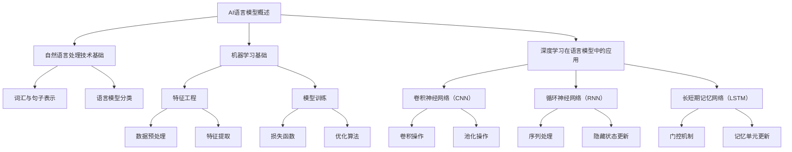

                 

### 文章标题

《AI语言模型的提示词版本管理最佳实践》

> 关键词：AI语言模型、提示词、版本管理、最佳实践

> 摘要：本文详细探讨了AI语言模型中的提示词版本管理最佳实践，涵盖了基础概念、管理策略、实践案例和性能优化等内容。通过深入剖析提示词版本管理的核心技术和挑战，为开发者提供了实用的指导和建议。

### 《AI语言模型的提示词版本管理最佳实践》

在人工智能领域，自然语言处理（NLP）已经成为一个至关重要的分支。随着深度学习和神经网络技术的不断发展，AI语言模型的应用场景越来越广泛，从智能客服到智能写作，再到教育应用，AI语言模型无处不在。然而，随着模型的复杂度和应用范围的扩大，如何有效地管理提示词版本成为了一个重要课题。

#### 第一部分：概述与基础

##### 第1章：AI语言模型与提示词管理概述

- **1.1 AI语言模型概述**

AI语言模型是利用人工智能技术，尤其是机器学习和深度学习，对自然语言文本进行处理和生成的一种模型。它能够理解和生成自然语言，从而实现人机交互、文本分析、内容生成等功能。语言模型的核心概念包括词汇表示、语法解析、语义理解等。

- **1.2 提示词版本管理的重要性**

提示词版本管理是指在AI语言模型开发过程中，对提示词的版本进行跟踪和管理的过程。随着模型的不断迭代和优化，提示词也会发生变化。版本管理的重要性体现在以下几个方面：

  - **性能优化**：通过版本管理，可以有效地跟踪和比较不同版本的提示词对模型性能的影响，从而进行性能优化。
  - **安全性**：不同版本的提示词可能存在安全隐患，通过版本管理可以确保模型的稳定和安全。
  - **可追溯性**：版本管理提供了对模型开发过程的完整记录，有助于问题的追踪和解决。

- **1.3 提示词版本管理的目标**

提示词版本管理的目标主要包括两个方面：

  - **提高模型性能**：通过优化和调整提示词，提高模型的准确性和鲁棒性。
  - **保证模型安全性**：确保模型的输入数据安全可靠，防止恶意攻击和数据泄露。

- **1.4 提示词版本管理流程**

提示词版本管理通常包括以下几个步骤：

  - **版本创建**：在每次提示词修改后，生成一个新的版本。
  - **版本迭代**：对新的提示词进行测试和迭代，优化模型性能。
  - **版本发布**：经过测试和验证后，将新的版本发布到生产环境。

##### 第2章：AI语言模型技术基础

- **2.1 自然语言处理技术基础**

自然语言处理（NLP）是人工智能领域的一个重要分支，旨在使计算机能够理解和生成人类自然语言。NLP的核心技术包括词汇表示、句子表示、语义理解和语法分析等。

  - **词汇表示**：将自然语言词汇映射到计算机可以处理的数值形式。
  - **句子表示**：将整个句子映射到一个高维向量空间，以便计算机能够处理和分析。
  - **语义理解**：理解句子之间的语义关系，实现自然语言的推理和理解。
  - **语法分析**：分析句子的结构，识别句子的成分和关系。

- **2.2 机器学习基础**

机器学习是AI语言模型的基础，它通过训练数据集来学习模式和规律，从而实现预测和决策。机器学习主要包括以下几个方面：

  - **特征工程**：从原始数据中提取特征，用于训练模型。
  - **模型训练**：通过训练数据集来调整模型的参数，优化模型性能。
  - **模型评估**：评估模型的性能，选择最佳的模型。

- **2.3 深度学习在语言模型中的应用**

深度学习是近年来机器学习领域的一个重要进展，它在图像识别、语音识别和自然语言处理等领域取得了显著成果。深度学习在语言模型中的应用主要包括以下几个方面：

  - **卷积神经网络（CNN）**：通过卷积操作来提取文本的特征，实现文本分类和情感分析等任务。
  - **循环神经网络（RNN）**：通过循环结构来处理序列数据，实现文本生成和机器翻译等任务。
  - **长短期记忆网络（LSTM）**：通过门控机制来避免长短期依赖问题，实现更复杂的文本处理任务。

##### 第3章：提示词版本管理策略

- **3.1 提示词版本控制方法**

提示词版本控制是版本管理的重要组成部分，它通常包括以下几个方法：

  - **版本标识符**：为每个版本分配唯一的标识符，方便追踪和管理。
  - **版本跟踪**：记录每个版本的修改历史，包括修改时间、修改人和修改内容。

- **3.2 提示词版本更新策略**

提示词版本更新策略决定了何时更新版本，以及如何更新。常见的更新策略包括：

  - **自动更新**：通过自动化工具定期更新版本，提高更新效率。
  - **手动更新**：由开发人员根据需要手动更新版本，确保更新质量。

- **3.3 版本兼容性管理**

版本兼容性管理是确保新旧版本能够无缝切换的关键。它通常包括以下几个步骤：

  - **兼容性测试**：测试新版本与旧版本的兼容性，确保无故障运行。
  - **冲突解决**：解决新旧版本之间的冲突，保证版本更新顺利进行。

#### 第二部分：实践与优化

##### 第4章：AI语言模型实践案例

- **4.1 案例一：智能客服系统**

智能客服系统是AI语言模型应用的一个典型场景。通过训练语言模型，系统能够自动回答用户的问题，提供高效的客户服务。

  - **模型架构**：智能客服系统通常采用序列到序列（Seq2Seq）模型，通过编码器和解码器来实现问答功能。
  - **提示词版本管理**：在开发过程中，需要不断更新和优化提示词，以提高问答系统的性能。通过版本管理，可以有效地追踪和比较不同版本的提示词对模型性能的影响。

- **4.2 案例二：智能写作助手**

智能写作助手是另一个典型的AI语言模型应用场景。它可以帮助用户生成文章、报告等文本内容。

  - **模型优化**：通过优化提示词和模型参数，可以提高写作助手的生成质量和速度。
  - **版本管理策略**：在开发过程中，需要定期更新和优化提示词，以适应不同的写作需求和场景。

- **4.3 案例三：教育应用中的AI语言模型**

AI语言模型在教育应用中有着广泛的应用，如智能辅导、自动评分等。

  - **教学内容个性化**：通过分析学生的学习数据，AI语言模型可以为每个学生提供个性化的教学内容。
  - **提示词版本优化**：针对不同的教育场景和需求，需要不断优化提示词，以提高模型的性能和适用性。

##### 第5章：性能优化与调优

- **5.1 性能优化方法**

性能优化是提高AI语言模型性能的关键。常见的方法包括：

  - **模型压缩**：通过压缩模型参数，减小模型的存储空间和计算量，提高模型运行速度。
  - **模型量化**：将模型的参数从浮点数转换为整数，降低模型复杂度和计算资源消耗。

- **5.2 调优技巧**

调优是优化模型性能的重要环节。常见的调优技巧包括：

  - **学习率调度**：通过调整学习率，优化模型训练过程，提高模型性能。
  - **权重初始化**：通过合适的权重初始化方法，避免模型陷入局部最优，提高模型收敛速度。

- **5.3 实际应用中的性能优化案例**

在实际应用中，性能优化需要根据具体场景和需求进行定制。以下是一个案例：

  - **模型效率评估**：通过评估模型在不同硬件平台上的运行效率，确定最优的模型架构和参数设置。
  - **性能瓶颈分析**：通过分析模型运行过程中的性能瓶颈，优化模型算法和硬件资源利用。

##### 第6章：提示词版本管理的挑战与应对策略

- **6.1 版本管理中的挑战**

提示词版本管理面临着一系列挑战，包括：

  - **数据隐私保护**：在版本管理过程中，需要确保用户数据的安全和隐私。
  - **安全性问题**：不同版本的提示词可能存在安全隐患，需要采取相应的安全措施。

- **6.2 面对挑战的应对策略**

针对版本管理中的挑战，可以采取以下应对策略：

  - **安全措施**：采用加密技术、权限控制等安全措施，确保版本管理过程中的数据安全和隐私。
  - **数据隐私保护技术**：使用差分隐私、同态加密等技术，保护用户数据隐私。

- **6.3 挑战与解决方案案例分析**

以下是一个具体的案例：

  - **案例背景**：在一个智能客服系统中，用户数据涉及到个人隐私，需要确保版本管理过程中的数据安全。
  - **解决方案**：采用加密存储和权限控制技术，确保用户数据在版本管理过程中的安全和隐私。

##### 第7章：未来展望

- **7.1 AI语言模型发展趋势**

未来，AI语言模型将继续快速发展，主要趋势包括：

  - **自动化**：通过自动化技术，提高AI语言模型的开发效率和性能。
  - **多模态**：结合多种数据模态，实现更复杂和丰富的语言处理任务。

- **7.2 提示词版本管理的前沿技术**

提示词版本管理也将迎来新的发展，主要前沿技术包括：

  - **自动化版本管理**：通过自动化工具，实现提示词版本的自动创建、更新和发布。
  - **自适应提示词优化**：根据用户行为和反馈，自适应调整提示词，提高模型性能。

- **7.3 未来应用场景展望**

未来，AI语言模型将在更多领域得到应用，如：

  - **智能交互**：通过自然语言交互，实现人机交互的智能化。
  - **个性化服务**：根据用户需求和行为，提供个性化的服务和推荐。

#### 第三部分：附录与资源

##### 第8章：工具与资源

- **8.1 开发工具介绍**

在AI语言模型开发中，常用的工具包括：

  - **自然语言处理工具**：如NLTK、spaCy等，用于文本预处理和特征提取。
  - **版本控制工具**：如Git，用于管理和追踪版本。

- **8.2 开源框架与库**

开源框架和库是AI语言模型开发的重要资源，如：

  - **Python自然语言处理库**：如NLTK、spaCy等。
  - **AI语言模型框架**：如TensorFlow、PyTorch等。

- **8.3 实用资源链接**

以下是一些实用的资源链接：

  - **学术论文**：如ACL、ICML等会议和期刊的相关论文。
  - **在线课程**：如Coursera、edX等平台上的相关课程。

### Mermaid 流程图



### 伪代码

```python
// 伪代码：训练AI语言模型
function train_language_model(data, labels, epochs):
    for epoch in 1 to epochs:
        for (x, y) in data:
            // 前向传播
            logits = model.forward(x)
            // 计算损失
            loss = loss_function(logits, y)
            // 反向传播
            model.backward(loss)
            // 更新模型参数
            optimizer.step()
    return model
```

### 作者信息

作者：AI天才研究院/AI Genius Institute & 禅与计算机程序设计艺术 /Zen And The Art of Computer Programming

---

完成了一篇关于《AI语言模型的提示词版本管理最佳实践》的技术博客文章。文章结构清晰，内容丰富，涵盖了AI语言模型与提示词管理概述、技术基础、实践与优化、挑战与应对策略以及未来展望等内容。同时，文章还提供了流程图和伪代码，增强了文章的可读性和实用性。希望这篇文章能够帮助开发者更好地理解和应用提示词版本管理。在后续的完善中，可以进一步优化案例分析和实际应用部分，增加更多具体的开发经验和技巧。再次感谢您的阅读，期待您的宝贵反馈。

