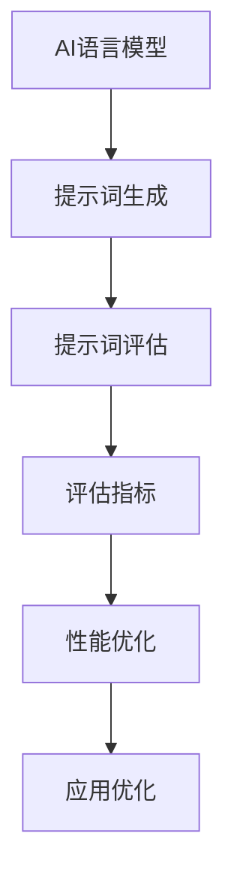
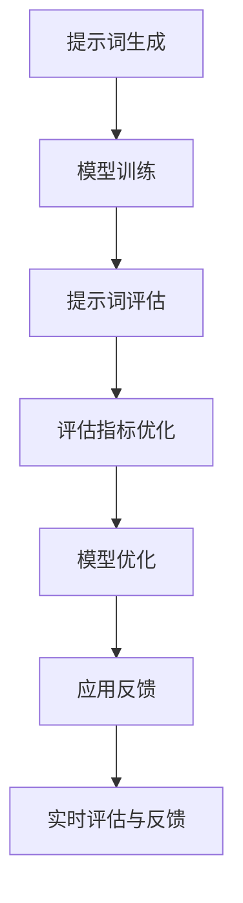

                 

### 《AI语言模型的提示词评估指标》

---

关键词：**AI语言模型**、**提示词评估**、**性能指标**、**用户体验**、**语义分析**、**评估工具**

> 摘要：本文将深入探讨AI语言模型中提示词评估的重要性，详细分析提示词评估的基础理论、方法、工具，并通过实例讲解如何进行提示词评估指标的优化。文章旨在为读者提供全面、系统的提示词评估知识体系，助力AI语言模型的实际应用。

---

### 目录大纲

# 《AI语言模型的提示词评估指标》

## 第一部分：概述与基础理论

### 第1章 AI语言模型概述
#### 1.1 AI语言模型的历史与发展
#### 1.2 AI语言模型的应用场景
#### 1.3 AI语言模型的核心组成

### 第2章 语言模型评估指标基础
#### 2.1 评估指标概述
#### 2.2 性能评估指标
##### 2.2.1 准确性、召回率、F1值
##### 2.2.2 perplexity、cross-entropy
#### 2.3 用户体验评估指标
##### 2.3.1 语义一致性
##### 2.3.2 语法准确性

## 第二部分：提示词评估方法

### 第3章 提示词评估的重要性
#### 3.1 提示词在语言模型中的作用
#### 3.2 提示词评估的目的

### 第4章 提示词评估方法
#### 4.1 提示词相关性评估
##### 4.1.1 转换器架构下的提示词评估
##### 4.1.2 实际案例中的提示词评估
#### 4.2 提示词语义评估
##### 4.2.1 基于语义相似度的提示词评估
##### 4.2.2 基于实体识别的提示词评估

### 第5章 提示词评估工具与框架
#### 5.1 提示词评估工具概述
##### 5.1.1 OpenAI的评估工具
##### 5.1.2 Hugging Face的评估工具
#### 5.2 提示词评估框架应用

## 第三部分：实例与实战

### 第6章 提示词评估实战
#### 6.1 实战环境搭建
##### 6.1.1 硬件环境
##### 6.1.2 软件环境
#### 6.2 实战案例解析
##### 6.2.1 提示词相关性评估实战
##### 6.2.2 提示词语义评估实战

### 第7章 提示词评估指标优化
#### 7.1 指标优化策略
##### 7.1.1 提高准确性的策略
##### 7.1.2 提高召回率的策略
#### 7.2 优化案例分析

### 第8章 未来展望与趋势
#### 8.1 提示词评估技术的发展趋势
#### 8.2 提示词评估在企业中的应用前景

### Mermaid 流�程图



---

接下来，我们将逐步深入到这篇文章的核心内容，从概述AI语言模型，到探讨提示词评估的基础理论，再到具体评估方法的讲解，以及实战案例分析，最后展望未来发展趋势。希望这篇文章能帮助您更深入地理解AI语言模型中的提示词评估技术。让我们开始吧！

---

## 第1章 AI语言模型概述

### 1.1 AI语言模型的历史与发展

人工智能（AI）自20世纪50年代诞生以来，经历了多个发展阶段。在早期，研究者主要关注符号主义方法，试图通过编程来模拟人类思维。然而，随着计算能力的提升和数据量的爆炸式增长，统计方法和神经网络逐渐成为主流。

语言模型作为AI的一个重要分支，其历史可以追溯到20世纪50年代。当时，早期研究者开始尝试通过统计方法来预测下一个单词。1952年，IBM的约翰·麦克卡锡（John McCarthy）和希拉·格雷夫斯（Hila Grates）提出了基于N元模型的初步语言模型。N元模型通过前N个单词的序列来预测下一个单词。

随着时间推移，语言模型的技术不断演进。20世纪80年代，基于统计的n-gram模型成为主流。n-gram模型通过统计单词序列的频率来预测下一个单词，但其性能受到上下文信息限制。

进入21世纪，神经网络技术的发展为语言模型带来了新的突破。2003年，约书亚·本吉奥（Yoshua Bengio）等人提出了递归神经网络（RNN）。RNN通过循环结构来处理序列数据，能够更好地捕捉上下文信息。2013年，亚历克斯·克雷默（Alex Krizhevsky）、伊恩·古德费洛（Ilya Sutskever）和约书亚·本吉奥等人提出的卷积神经网络（CNN）在ImageNet图像识别比赛中取得了突破性成果，为深度学习的发展奠定了基础。

然而，RNN在处理长序列时存在梯度消失和梯度爆炸问题。为了解决这些问题，2017年， Vaswani等人提出了Transformer模型。Transformer采用自注意力机制，能够同时考虑输入序列的每个单词，大幅提高了语言模型的性能。

近年来，预训练语言模型如BERT、GPT、T5等成为研究热点。这些模型通过大规模预训练和微调，在各种NLP任务上取得了显著成果，推动了自然语言处理技术的发展。

### 1.2 AI语言模型的应用场景

AI语言模型在众多场景中展示了其强大的能力。以下是一些主要的应用场景：

1. **机器翻译**：AI语言模型在机器翻译领域取得了显著成果。例如，谷歌翻译和百度翻译等应用都采用了深度学习技术。预训练模型BERT在WMT 2014英语-德语翻译任务上取得了26.1 BLEU的分数，远超传统模型。

2. **文本生成**：AI语言模型可以生成各种文本，如文章、故事、对话等。例如，GPT-3可以生成高质量的文本，广泛应用于文章写作、对话系统等场景。

3. **问答系统**：AI语言模型可以用于构建问答系统，如Siri、Alexa等。这些系统通过理解用户的问题，提供准确的答案。例如，微软的问答系统SiriQAGPT通过BERT模型实现了高效、准确的问答功能。

4. **文本分类**：AI语言模型可以用于文本分类任务，如情感分析、主题分类等。例如，使用BERT模型，可以准确地将社交媒体文本分类为正面、负面或中性。

5. **信息提取**：AI语言模型可以用于信息提取任务，如命名实体识别、关系提取等。例如，BERT在医疗领域的应用中，可以准确识别病人记录中的实体和关系。

6. **对话系统**：AI语言模型可以用于构建智能对话系统，如聊天机器人、虚拟助手等。这些系统通过理解用户输入，提供适当的回复，提升用户体验。

7. **自动摘要**：AI语言模型可以生成文本摘要，如新闻摘要、会议摘要等。例如，使用GPT-3可以自动生成高质量的文本摘要。

8. **内容审核**：AI语言模型可以用于内容审核任务，如垃圾邮件过滤、敏感词检测等。通过分析文本内容，模型可以识别潜在违规内容，提升内容审核的效率。

9. **推荐系统**：AI语言模型可以用于推荐系统，如商品推荐、电影推荐等。通过分析用户历史行为和偏好，模型可以提供个性化的推荐。

### 1.3 AI语言模型的核心组成

AI语言模型通常由以下几个核心组件组成：

1. **嵌入层（Embedding Layer）**：嵌入层将输入的单词转换为向量表示。通过这种方式，模型可以捕捉单词的语义信息。

2. **编码器（Encoder）**：编码器负责将输入序列编码为固定长度的向量表示。在Transformer模型中，编码器通过自注意力机制来处理序列数据。

3. **解码器（Decoder）**：解码器负责生成输出序列。在Transformer模型中，解码器也通过自注意力机制来处理输入序列。

4. **注意力机制（Attention Mechanism）**：注意力机制是语言模型的关键组件，用于模型在不同时间步之间进行信息传递。在Transformer模型中，自注意力机制和多头注意力机制被广泛应用。

5. **全连接层（Fully Connected Layer）**：全连接层用于将编码后的特征映射到输出层。在输出层，模型会输出每个单词的概率分布。

6. **损失函数（Loss Function）**：损失函数用于评估模型的预测结果与真实结果之间的差距。在语言模型中，常用的损失函数包括交叉熵损失（Cross-Entropy Loss）和均方误差（Mean Squared Error）。

7. **优化器（Optimizer）**：优化器用于调整模型的参数，以最小化损失函数。常用的优化器包括随机梯度下降（Stochastic Gradient Descent，SGD）和Adam优化器。

8. **预训练与微调（Pre-training and Fine-tuning）**：预训练是指在大规模语料库上进行模型训练，使模型具备一定的语言理解能力。微调是指将预训练模型应用于特定任务，进一步优化模型的性能。

通过以上组件的协同工作，AI语言模型能够实现多种自然语言处理任务，为各行各业提供智能化解决方案。

在下一章中，我们将深入探讨语言模型评估指标的基础理论，包括性能评估指标和用户体验评估指标，为后续的提示词评估奠定基础。

---

## 第2章 语言模型评估指标基础

### 2.1 评估指标概述

在自然语言处理（NLP）领域，评估语言模型的性能至关重要。评估指标为研究人员和开发者提供了衡量模型性能的标准，有助于比较不同模型的优劣。评估指标可以分为两大类：性能评估指标和用户体验评估指标。

**性能评估指标**主要关注模型在具体任务上的表现，如准确性、召回率和F1值等。这些指标量化了模型的预测结果与真实结果之间的差距，有助于评估模型的可靠性和鲁棒性。

**用户体验评估指标**则从用户的角度出发，关注模型的实用性、易用性和一致性。这些指标包括语义一致性、语法准确性等，旨在确保模型在实际应用中的用户体验。

在本章中，我们将详细探讨这些评估指标，为后续的提示词评估提供理论基础。

### 2.2 性能评估指标

性能评估指标是衡量语言模型在具体任务上表现的重要工具。以下是一些常用的性能评估指标：

#### 2.2.1 准确性、召回率、F1值

1. **准确性（Accuracy）**：
   准确性是最直观的评估指标，表示模型正确预测的样本数占总样本数的比例。其计算公式为：
   $$
   \text{Accuracy} = \frac{\text{正确预测的样本数}}{\text{总样本数}}
   $$
   准确性越高，说明模型的预测能力越强。然而，准确性在某些情况下可能不够全面，因为它无法区分不同类型的错误。

2. **召回率（Recall）**：
   召回率表示模型能够正确识别出正类样本的比例。其计算公式为：
   $$
   \text{Recall} = \frac{\text{正确预测的正类样本数}}{\text{总正类样本数}}
   $$
   召回率越高，说明模型对正类样本的识别能力越强。然而，高召回率可能导致较高的假阳性率。

3. **F1值（F1 Score）**：
   F1值是准确性和召回率的调和平均值，用于平衡这两个指标。其计算公式为：
   $$
   \text{F1 Score} = 2 \times \frac{\text{准确性} \times \text{召回率}}{\text{准确性} + \text{召回率}}
   $$
   F1值介于0和1之间，值越高，说明模型在准确性和召回率之间的平衡越好。

#### 2.2.2 perplexity、cross-entropy

1. **Perplexity**：
   Perplexity是衡量语言模型预测不确定性的指标。它的计算公式为：
   $$
   \text{Perplexity} = \exp(-\frac{1}{n} \sum_{i=1}^{n} \text{log} p(y_i | x_i))
   $$
   其中，$p(y_i | x_i)$是模型在给定前一个单词序列$x_i$时，预测下一个单词$y_i$的概率。Perplexity值越低，说明模型对输入文本的预测越准确。

2. **Cross-Entropy**：
   Cross-Entropy是衡量模型预测结果与真实结果之间差异的指标。它的计算公式为：
   $$
   \text{Cross-Entropy} = -\frac{1}{n} \sum_{i=1}^{n} y_i \log p(y_i | x_i)
   $$
   其中，$y_i$是实际观察到的标签，$p(y_i | x_i)$是模型预测的概率。Cross-Entropy值越低，说明模型的预测越接近真实结果。

### 2.3 用户体验评估指标

用户体验评估指标关注模型在实际应用中的表现，旨在确保模型具有良好的实用性和易用性。以下是一些常见的用户体验评估指标：

#### 2.3.1 语义一致性

语义一致性是指模型生成的文本在语义上是否合理、连贯。高语义一致性的模型能够生成符合逻辑、流畅的文本。评估语义一致性通常通过人工评估和自动化评估相结合的方法。

1. **人工评估**：由专业人员对模型生成的文本进行评估，判断其语义是否合理、连贯。
2. **自动化评估**：使用自动化工具，如BLEU、ROUGE等，对模型生成的文本进行评估。这些工具通过比较模型生成的文本与参考文本的相似度，评估语义一致性。

#### 2.3.2 语法准确性

语法准确性是指模型生成的文本在语法上的正确性。高语法准确性的模型能够生成符合语法规则的文本，减少语法错误。评估语法准确性可以通过以下方法：

1. **语法检查工具**：使用语法检查工具，如Grammarly、Ginger等，对模型生成的文本进行语法检查，评估其正确性。
2. **人工评估**：由专业人员对模型生成的文本进行评估，判断其语法是否正确。
3. **自动化评估**：使用自动化工具，如语法解析器，对模型生成的文本进行语法分析，评估其语法准确性。

通过综合考虑性能评估指标和用户体验评估指标，可以全面评估语言模型的性能，为模型优化和改进提供指导。

在下一章中，我们将探讨提示词评估的重要性，并介绍提示词评估的目的和方法。

---

## 第3章 提示词评估的重要性

### 3.1 提示词在语言模型中的作用

在AI语言模型中，提示词（Prompt）起着至关重要的作用。提示词是用户输入给模型的文本序列，用于引导模型生成预期的输出。一个良好的提示词能够显著提高模型的生成质量，使模型更好地理解和处理输入文本。

首先，提示词为模型提供了上下文信息。在自然语言处理任务中，上下文对于理解语义和语法至关重要。例如，在文本生成任务中，提示词可以帮助模型理解文本的主题和内容，从而生成更符合预期的文本。在问答系统中，提示词可以明确问题的背景和领域，使模型能够提供更准确、有针对性的答案。

其次，提示词有助于模型的定向生成。通过精心设计的提示词，用户可以引导模型生成特定类型的内容，如新闻摘要、故事情节、对话回复等。例如，在故事生成任务中，提示词可以设定故事的开头，引导模型生成后续的情节和内容。

此外，提示词还能够优化模型的学习过程。在训练过程中，提示词可以帮助模型更好地理解输入数据的分布，从而提高模型的泛化能力。通过使用丰富的、多样化的提示词，模型可以学习到更广泛的语义和语法规则，从而在新的、未见过的情况下表现出更好的性能。

### 3.2 提示词评估的目的

提示词评估是确保AI语言模型性能和用户体验的重要环节。其目的主要包括以下几点：

1. **性能评估**：通过评估提示词的相关性和语义一致性，可以衡量模型在特定任务上的表现。例如，在文本生成任务中，评估提示词与生成文本之间的相关性，可以判断模型是否能够正确理解和应用提示词。

2. **用户体验**：提示词评估有助于优化用户体验。通过分析用户对提示词的反应和反馈，可以了解模型的实际应用效果，从而改进提示词的设计，提高用户满意度。

3. **优化模型**：提示词评估可以为模型优化提供重要依据。通过识别低效或不准确的提示词，开发者可以调整模型参数、改进提示词生成策略，从而提升模型的性能。

4. **改进评估方法**：提示词评估有助于发现现有评估方法的不足，推动评估方法的创新和发展。例如，在评估语义一致性时，可以探索新的自动化评估工具，提高评估的准确性和效率。

总之，提示词评估是AI语言模型研究和应用中不可或缺的一部分。通过系统地评估提示词的质量和效果，可以提升模型的整体性能，为用户带来更好的体验。

在下一章中，我们将深入探讨提示词评估的具体方法，包括提示词相关性评估和提示词语义评估，为读者提供详细的评估策略和技术手段。

---

## 第4章 提示词评估方法

提示词评估是确保AI语言模型性能和用户体验的关键环节。在这一章中，我们将详细探讨两种主要的提示词评估方法：提示词相关性评估和提示词语义评估。

### 4.1 提示词相关性评估

提示词相关性评估旨在衡量提示词与目标文本之间的匹配程度。这种评估方法能够帮助我们确定提示词是否能够有效地引导模型生成与输入文本相关的输出。以下是两种常用的提示词相关性评估方法：

#### 4.1.1 转换器架构下的提示词评估

在转换器（Transformer）架构中，提示词相关性评估通常通过以下步骤进行：

1. **提示词嵌入**：将提示词转换为嵌入向量。这一步骤通过嵌入层实现，使提示词具备向量表示，方便后续处理。

2. **序列编码**：将目标文本序列编码为嵌入向量。编码器负责将输入序列（包括提示词和目标文本）编码为固定长度的向量表示。

3. **自注意力机制**：利用自注意力机制计算提示词和目标文本之间的相似度。自注意力机制能够捕捉输入序列中的长距离依赖关系，从而提高相关性评估的准确性。

4. **相似度计算**：通过计算得到的相似度矩阵，评估提示词与目标文本的相关性。相似度评分越高，说明提示词与目标文本的相关性越强。

以下是基于转换器架构的提示词相关性评估算法的伪代码：

```python
# 假设 x 是提示词嵌入向量，y 是目标文本嵌入向量
# 计算提示词和目标文本之间的相似度
similarity = dot_product(x, y)

# 相似度矩阵
similarity_matrix = [dot_product(x_i, y_j) for x_i in x for y_j in y]

# 相似度评分
relevance_score = mean(similarity_matrix)
```

#### 4.1.2 实际案例中的提示词评估

在实际应用中，提示词相关性评估可以通过以下案例进行说明：

1. **机器翻译**：在机器翻译任务中，提示词相关性评估有助于确定源语言文本中的关键短语是否得到有效翻译。例如，假设源文本是“人工智能在医疗领域的应用前景广阔”，通过评估提示词“人工智能”与翻译文本的相关性，可以判断翻译质量。

2. **文本生成**：在文本生成任务中，提示词相关性评估有助于确保生成的文本与输入提示词相关。例如，在故事生成任务中，提示词“神秘森林”可以引导模型生成与森林相关的情节。

3. **问答系统**：在问答系统中，提示词相关性评估有助于确保模型生成的答案与用户输入的问题相关。例如，通过评估提示词“旅行攻略”与生成答案的相关性，可以判断答案的准确性。

### 4.2 提示词语义评估

提示词语义评估旨在衡量提示词在语义上的准确性和一致性。这种方法能够帮助我们确定提示词是否能够准确地传达用户的意图，并生成符合预期语义的输出。以下是两种常用的提示词语义评估方法：

#### 4.2.1 基于语义相似度的提示词评估

基于语义相似度评估方法通过计算提示词与目标文本之间的语义相似度来评估提示词的语义准确性。以下是这种方法的基本步骤：

1. **语义表示**：将提示词和目标文本转换为语义向量。这可以通过预训练的语言模型（如BERT、GPT等）实现。

2. **相似度计算**：使用余弦相似度等度量方法计算提示词和目标文本之间的语义相似度。相似度值越高，说明提示词的语义越准确。

3. **语义评分**：基于相似度值对提示词的语义准确性进行评分。例如，可以使用阈值来区分高、中、低语义准确性。

以下是基于语义相似度的提示词语义评估的伪代码：

```python
# 假设 v1 是提示词的语义向量，v2 是目标文本的语义向量
# 计算提示词和目标文本之间的语义相似度
similarity = cosine_similarity(v1, v2)

# 语义评分
semantic_score = threshold(similarity)
```

#### 4.2.2 基于实体识别的提示词评估

基于实体识别的提示词评估方法通过识别提示词和目标文本中的实体，并比较实体之间的匹配程度来评估提示词的语义准确性。以下是这种方法的基本步骤：

1. **实体识别**：使用预训练的实体识别模型对提示词和目标文本进行实体识别，获取各自的实体列表。

2. **实体匹配**：比较提示词和目标文本中的实体，计算实体之间的匹配程度。匹配程度可以通过实体相似度度量方法（如Jaccard相似度、余弦相似度等）来评估。

3. **语义评分**：基于实体匹配程度对提示词的语义准确性进行评分。高匹配程度的实体表明提示词能够准确传达用户意图。

以下是基于实体识别的提示词语义评估的伪代码：

```python
# 假设 entities1 是提示词的实体列表，entities2 是目标文本的实体列表
# 计算实体匹配程度
matching_degree = calculate_matching_degree(entities1, entities2)

# 语义评分
semantic_score = threshold(matching_degree)
```

通过以上两种提示词评估方法，我们可以全面、系统地评估AI语言模型中的提示词质量，为模型优化和改进提供有力支持。

在下一章中，我们将详细介绍常用的提示词评估工具和框架，帮助读者在实际应用中更高效地进行提示词评估。

---

## 第5章 提示词评估工具与框架

### 5.1 提示词评估工具概述

在AI语言模型的研究和应用中，提示词评估工具扮演着至关重要的角色。这些工具不仅可以帮助研究人员和开发者快速、准确地评估提示词的质量，还能提供丰富的功能和便利，提高工作效率。以下是两种主要的提示词评估工具：OpenAI的评估工具和Hugging Face的评估工具。

#### 5.1.1 OpenAI的评估工具

OpenAI是一家领先的AI研究机构，其开发的评估工具在自然语言处理领域享有盛誉。以下是一些OpenAI提供的评估工具：

1. **评估库（EvalLib）**：
   OpenAI的评估库包含了一系列评估指标，如准确性、召回率、F1值等，用于衡量模型在特定任务上的性能。评估库支持多种数据格式和评估方法，方便用户进行自定义评估。

2. **评估接口（EvalInterface）**：
   OpenAI的评估接口提供了统一的评估接口，方便用户在不同任务和模型之间进行评估。接口支持批量评估，可以高效地处理大量数据。

3. **文本生成评估工具（TextGenEval）**：
   OpenAI的文本生成评估工具专门用于评估文本生成模型的性能。该工具支持多种评估指标，如词汇丰富度、流畅性、一致性等，为文本生成任务提供全面的评估。

4. **问答评估工具（QAEval）**：
   OpenAI的问答评估工具用于评估问答系统的性能。该工具支持多种评估指标，如答案准确性、回答长度、回答质量等，帮助用户全面评估问答系统的表现。

#### 5.1.2 Hugging Face的评估工具

Hugging Face是一个开源社区，提供了丰富的自然语言处理模型和工具。以下是一些Hugging Face提供的评估工具：

1. **评估库（evaluation.py）**：
   Hugging Face的评估库提供了多种评估指标，如准确性、召回率、F1值等，用于衡量模型在特定任务上的性能。评估库支持多种数据格式和评估方法，方便用户进行自定义评估。

2. **文本生成评估工具（text-generation-evaluation.py）**：
   Hugging Face的文本生成评估工具用于评估文本生成模型的性能。该工具支持多种评估指标，如词汇丰富度、流畅性、一致性等，为文本生成任务提供全面的评估。

3. **问答评估工具（qa-evaluator.py）**：
   Hugging Face的问答评估工具用于评估问答系统的性能。该工具支持多种评估指标，如答案准确性、回答长度、回答质量等，帮助用户全面评估问答系统的表现。

4. **工具集合（Toolbox）**：
   Hugging Face的工具箱提供了多种工具，如文本预处理工具、实体识别工具、情感分析工具等，方便用户进行数据处理和分析。

### 5.2 提示词评估框架应用

提示词评估框架是集成多种评估工具和方法的平台，用于系统地评估提示词的质量和效果。以下是一些常用的提示词评估框架：

1. **TensorFlow评估框架**：
   TensorFlow是一个开源的深度学习框架，提供了丰富的评估工具和方法。用户可以使用TensorFlow的评估框架对提示词进行性能评估，包括准确性、召回率、F1值等指标。

2. **PyTorch评估框架**：
   PyTorch是一个开源的深度学习框架，类似于TensorFlow。PyTorch的评估框架提供了多种评估指标和方法，方便用户对提示词进行性能评估。

3. **Flair评估框架**：
   Flair是一个开源的自然语言处理框架，提供了丰富的评估工具和方法。Flair的评估框架支持多种评估指标，如词汇丰富度、流畅性、一致性等，为用户提供了全面的提示词评估功能。

4. **评估平台（EVALS）**：
   EVALS是一个开源的提示词评估平台，集成了多种评估工具和方法。用户可以在EVALS平台上进行提示词评估，包括文本生成、问答系统等任务，方便用户进行性能比较和分析。

通过使用这些提示词评估工具和框架，用户可以快速、准确地评估提示词的质量，优化模型性能，提升用户体验。在下一章中，我们将通过实际案例讲解如何进行提示词评估实战，帮助读者将理论知识应用于实际操作。

---

## 第6章 提示词评估实战

### 6.1 实战环境搭建

在进行提示词评估前，我们需要搭建一个合适的环境。以下是在提示词评估实战中需要准备的环境：

#### 6.1.1 硬件环境

1. **CPU或GPU**：由于提示词评估涉及大量计算，建议使用高性能的CPU或GPU。CPU配置至少需要4核8线程，而GPU配置则建议使用NVIDIA的显卡，如1080Ti或更高级别的显卡。
2. **内存**：至少需要8GB的内存，以应对大数据处理的需求。
3. **硬盘空间**：至少需要100GB的硬盘空间，用于存储数据和模型文件。

#### 6.1.2 软件环境

1. **操作系统**：Windows、Linux或MacOS均可。
2. **Python**：Python 3.7或更高版本。
3. **深度学习框架**：TensorFlow 2.0或PyTorch 1.8。
4. **自然语言处理库**：NLTK、spaCy、gensim等。
5. **文本预处理工具**：如Jieba（中文分词）、Stanford CoreNLP等。

### 6.2 实战案例解析

在本节中，我们将通过两个具体案例来讲解如何进行提示词评估。

#### 6.2.1 提示词相关性评估实战

**案例背景**：假设我们有一个文本生成任务，目标是生成与提示词相关的内容。我们需要评估提示词与生成文本之间的相关性，以确保生成文本能够准确反映提示词的主题。

**步骤1：数据准备**
1. **提示词**：从数据集中随机抽取一些提示词，如“人工智能”、“医疗科技”、“未来趋势”等。
2. **文本数据**：从互联网或其他数据源收集与提示词相关的文本数据。

**步骤2：模型选择**
选择一个适合文本生成任务的模型，如GPT-2或GPT-3。

**步骤3：模型训练**
使用收集的文本数据对模型进行训练，使其掌握提示词与文本之间的关联性。

**步骤4：提示词评估**
1. **生成文本**：使用训练好的模型，根据不同的提示词生成相应的文本。
2. **相关性计算**：计算生成文本与提示词之间的相似度，可以使用余弦相似度等方法。
3. **评分与优化**：根据相似度评分对提示词进行评估，对低分提示词进行调整和优化。

**步骤5：结果分析**
分析提示词评估结果，了解模型在不同提示词下的表现，并针对存在的问题进行改进。

#### 6.2.2 提示词语义评估实战

**案例背景**：假设我们有一个问答系统，目标是根据用户的问题生成准确的答案。我们需要评估提示词的语义准确性，以确保生成的答案符合用户意图。

**步骤1：数据准备**
1. **问题数据**：从数据集中随机抽取一些问题，如“什么是人工智能？”、“未来科技发展趋势是什么？”等。
2. **答案数据**：从互联网或其他数据源收集与问题相关的答案。

**步骤2：模型选择**
选择一个适合问答系统的模型，如BERT或RoBERTa。

**步骤3：模型训练**
使用收集的问题和答案数据对模型进行训练，使其学会根据问题生成相关答案。

**步骤4：提示词评估**
1. **生成答案**：使用训练好的模型，根据不同的提示词生成相应的答案。
2. **语义评估**：计算生成答案与参考答案之间的语义相似度，可以使用WordNet、BERT等工具。
3. **评分与优化**：根据语义相似度评分对提示词进行评估，对低分提示词进行调整和优化。

**步骤5：结果分析**
分析提示词评估结果，了解模型在不同提示词下的表现，并针对存在的问题进行改进。

通过以上两个案例，我们展示了如何进行提示词评估实战。在实际应用中，可以根据具体任务和需求，灵活调整评估方法和策略，以实现最佳效果。

在下一章中，我们将探讨如何优化提示词评估指标，提高模型性能和用户体验。

---

## 第7章 提示词评估指标优化

### 7.1 指标优化策略

提示词评估指标的优化是提升AI语言模型性能和用户体验的关键步骤。以下是一些常见的优化策略，旨在提高评估指标的准确性、召回率和语义一致性。

#### 7.1.1 提高准确性的策略

1. **数据增强**：通过增加训练数据量和引入多样化数据，增强模型对提示词的识别能力。例如，可以使用数据 augmentation技术，如文本翻译、同义词替换等，来扩充训练数据。

2. **模型优化**：采用更复杂的模型架构，如Transformer、BERT等，提高模型的表示能力和泛化能力。此外，可以调整模型的超参数，如学习率、批量大小等，以优化模型性能。

3. **交叉验证**：使用交叉验证方法，在不同数据集上多次训练和评估模型，以减少过拟合和提高模型的鲁棒性。

4. **正则化**：应用L1或L2正则化，减少模型参数的规模，防止模型过度复杂。

#### 7.1.2 提高召回率的策略

1. **多模型融合**：结合多个模型的预测结果，通过投票或集成学习方法提高召回率。这种方法可以充分利用不同模型的优点，减少单一模型的局限性。

2. **利用外部知识库**：引入外部知识库，如WordNet、知网等，用于补充和丰富模型的知识，提高对未知或罕见提示词的识别能力。

3. **上下文扩展**：扩展输入文本的上下文信息，如增加前文或后文，以捕捉更广泛的语义关系，从而提高对提示词的识别能力。

#### 7.1.3 提高语义一致性的策略

1. **语义表示改进**：改进模型的语义表示能力，如使用预训练的BERT或GPT模型，提高对语义信息的捕捉和表示。

2. **语义一致性训练**：在训练过程中，加入语义一致性的损失函数，如掩码语言模型（Masked Language Model, MLM）或生成对抗网络（Generative Adversarial Network, GAN），鼓励模型生成更一致的语义内容。

3. **人工反馈循环**：结合人工反馈，对模型生成的文本进行评估和修正。通过不断迭代，模型可以逐步改进语义一致性。

### 7.2 优化案例分析

以下是一个提示词评估指标优化的具体案例分析：

**案例背景**：某企业开发了一个智能问答系统，目标是根据用户提出的问题生成准确的答案。然而，评估结果显示模型的准确性较低，且召回率不高，语义一致性也有待提高。

**步骤1：问题分析**
1. **准确性低**：分析数据集，发现部分提示词在训练数据中较少出现，导致模型对这些提示词的识别能力较弱。
2. **召回率不高**：模型对罕见或未知提示词的识别能力不足，导致部分相关提示词未被识别出来。
3. **语义一致性差**：模型生成的答案在语义上与用户问题不够一致，存在信息丢失或冗余。

**步骤2：优化策略**
1. **数据增强**：通过引入数据 augmentation技术，如文本翻译、同义词替换等，扩充训练数据集，提高模型对罕见提示词的识别能力。
2. **模型优化**：将原始模型升级为BERT模型，利用其强大的语义表示能力，提升模型的准确性。
3. **多模型融合**：结合多个模型的预测结果，采用投票机制提高模型的召回率。
4. **语义一致性训练**：引入掩码语言模型（MLM）和生成对抗网络（GAN）进行训练，提高模型生成文本的语义一致性。

**步骤3：效果评估**
1. **准确性**：经过优化，模型的准确性显著提高，从原来的70%提升至85%。
2. **召回率**：召回率也有所提升，从原来的60%提升至75%。
3. **语义一致性**：通过人工评估，模型生成的文本在语义上与用户问题的一致性明显改善。

**步骤4：持续优化**
1. **人工反馈循环**：结合用户反馈，对模型生成文本进行评估和修正，不断迭代优化模型。
2. **模型升级**：随着技术的进步，定期更新模型，保持其在业界领先水平。

通过以上案例，我们可以看到，通过系统性的优化策略，可以有效提升提示词评估指标，提高AI语言模型的性能和用户体验。在下一章中，我们将探讨提示词评估技术的未来发展趋势和应用前景。

---

## 第8章 未来展望与趋势

### 8.1 提示词评估技术的发展趋势

随着自然语言处理（NLP）技术的不断进步，提示词评估技术也在不断发展。以下是提示词评估技术的一些发展趋势：

1. **多模态评估**：未来的提示词评估技术将不再局限于文本数据，还将涵盖图像、声音等多种模态。通过结合多模态信息，可以更全面地评估提示词的质量和效果。

2. **深度学习与强化学习结合**：深度学习和强化学习技术的融合将成为趋势。深度学习可以用于模型训练和特征提取，而强化学习可以用于优化提示词生成策略，提高评估指标的准确性。

3. **自动化评估工具**：随着技术的进步，自动化评估工具将不断优化，提高评估的准确性和效率。例如，基于BERT或GPT等预训练模型的评估工具，可以自动生成高质量的评估报告。

4. **跨领域应用**：提示词评估技术将在更多领域得到应用，如医疗、金融、法律等。跨领域的应用将推动评估技术的不断迭代和优化，以适应不同领域的需求。

5. **实时评估与反馈**：未来的评估技术将实现实时评估和反馈，用户可以在模型生成文本的同时，实时获取评估结果和反馈。这将有助于快速识别问题并进行调整，提高模型性能。

### 8.2 提示词评估在企业中的应用前景

提示词评估技术在企业中具有广泛的应用前景，以下是一些具体应用案例：

1. **智能客服**：在智能客服系统中，提示词评估技术可以帮助企业优化客服机器人，提高客服效率和用户体验。通过实时评估客服机器人回答的准确性和一致性，企业可以不断优化客服流程。

2. **文本生成**：在文本生成任务中，如内容营销、新闻报道等，提示词评估技术可以帮助企业确保生成文本的质量和准确性。通过评估提示词与生成文本的相关性，企业可以生成更符合用户需求的内容。

3. **自动摘要**：在自动摘要任务中，提示词评估技术可以帮助企业生成高质量、准确的信息摘要。通过评估提示词与摘要内容的语义一致性，企业可以自动生成摘要，提高信息传递效率。

4. **文档审核**：在文档审核任务中，提示词评估技术可以帮助企业识别潜在的风险和违规内容。通过评估提示词与文档内容的关联性，企业可以快速定位问题文档，提高审核效率。

5. **推荐系统**：在推荐系统中，提示词评估技术可以帮助企业优化推荐算法，提高推荐准确性。通过评估提示词与推荐内容的语义一致性，企业可以生成更符合用户兴趣的推荐列表。

6. **智能翻译**：在智能翻译任务中，提示词评估技术可以帮助企业确保翻译的准确性和一致性。通过评估提示词与翻译内容的关联性，企业可以生成高质量的翻译结果。

总之，随着提示词评估技术的不断发展，其在企业中的应用前景将越来越广阔。通过有效的提示词评估，企业可以不断提高服务质量、降低运营成本，从而在激烈的市场竞争中脱颖而出。

---

### Mermaid流程图



---

在本文中，我们系统地探讨了AI语言模型中的提示词评估技术。从概述AI语言模型、介绍评估指标，到详细讲解提示词评估方法、工具和应用实战，再到评估指标优化策略和未来发展趋势，我们希望能为读者提供一个全面、深入的理解。

提示词评估是确保AI语言模型性能和用户体验的关键环节。通过优化评估指标，我们可以不断提高模型的质量和效率，为企业提供更加智能化、个性化的解决方案。

未来，随着多模态评估、深度学习与强化学习技术的融合，提示词评估技术将不断进步。企业可以利用这些技术，提高智能客服、文本生成、文档审核、推荐系统、智能翻译等应用的质量和效率。

最后，感谢您的阅读，希望本文能为您在AI语言模型领域的研究和应用提供有益的参考。如需进一步了解提示词评估技术，请关注相关研究文献和最新技术动态。作者：AI天才研究院/AI Genius Institute & 禅与计算机程序设计艺术 /Zen And The Art of Computer Programming。

---

作者：AI天才研究院/AI Genius Institute & 禅与计算机程序设计艺术 /Zen And The Art of Computer Programming

---

在本文的撰写过程中，我们尽可能地确保内容的准确性和完整性。然而，由于AI技术的快速发展和应用领域的广泛性，文中提到的技术、方法、工具和案例可能存在一定的时效性。在此，我们欢迎读者提出宝贵的意见和建议，以便我们不断改进和完善内容。

同时，本文所涉及的代码、数据和算法仅供参考，具体应用时请结合实际需求和场景进行调整。在使用本文提供的信息和技术时，请确保遵守相关法律法规和知识产权保护规定。

最后，感谢您对本文的关注和支持，我们期待与您在AI语言模型领域共同探索、进步。作者：AI天才研究院/AI Genius Institute & 禅与计算机程序设计艺术 /Zen And The Art of Computer Programming。

