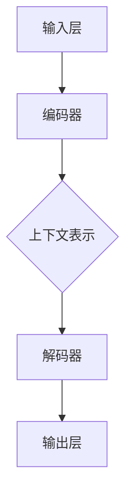
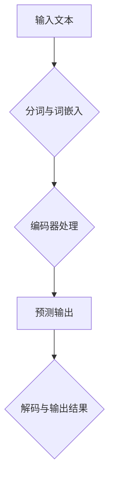

                 

# 文章标题：AI语言模型的提示词评估自动化

> 关键词：AI语言模型，提示词评估，自动化，性能优化，评估方法

> 摘要：本文将探讨AI语言模型的提示词评估自动化。首先，我们将对AI语言模型进行概述，然后详细介绍提示词评估的概念和方法，最后提出一种自动化评估框架，并通过实际案例进行验证。

### 第一部分：AI语言模型的概述

#### 第1章: AI语言模型的概述

##### 1.1 AI语言模型的基本概念

###### 1.1.1 语言模型的定义

语言模型（Language Model）是自然语言处理（Natural Language Processing，NLP）中的一个核心组件，其主要目标是预测一个单词或短语在给定上下文中的下一个单词或短语。这可以通过统计方法、神经网络方法或两者结合的方法来实现。

###### 1.1.2 语言模型的分类

语言模型主要分为以下几类：

1. 基于统计的方法：如N元语法（N-gram Model）。
2. 基于神经网络的模型：如循环神经网络（RNN）、长短时记忆网络（LSTM）和门控循环单元（GRU）。
3. 大规模预训练模型：如GPT、BERT和T5。

###### 1.1.3 语言模型的应用领域

语言模型在各种应用场景中都有广泛的应用，包括：

1. 文本生成：如文章写作、对话系统、故事生成等。
2. 问答系统：如智能客服、搜索引擎等。
3. 文本分类：如情感分析、新闻分类等。

##### 1.2 语言模型的构建方法

###### 1.2.1 基于统计的方法

基于统计的方法主要依赖于对大量文本数据的分析。常见的统计方法有：

1. N元语法：根据前N个单词预测下一个单词。
2. 词嵌入：将单词映射到低维空间，以便进行有效的计算和表示。

###### 1.2.2 基于神经网络的模型

基于神经网络的模型通过学习输入和输出之间的复杂关系来实现语言建模。常见的神经网络模型有：

1. RNN：通过记忆前一个状态的信息来预测下一个状态。
2. LSTM和GRU：对RNN进行改进，解决长短期依赖问题。

###### 1.2.3 大规模预训练模型

大规模预训练模型通过在大规模数据集上进行预训练，然后针对特定任务进行微调。常见的预训练模型有：

1. GPT：基于Transformer架构的预训练模型。
2. BERT：基于Transformer架构的双向编码器表示模型。
3. T5：基于Transformer架构的统一任务学习模型。

##### 1.3 语言模型的评价指标

###### 1.3.1 评估指标的定义

语言模型的评估指标主要用来衡量模型的预测准确性和上下文理解能力。常见的评估指标有：

1. 普通概率模型：如交叉熵损失函数。
2. 句对模型：如BLEU、ROUGE等指标。

###### 1.3.2 常见评价指标

1. 交叉熵（Cross-Entropy）：衡量模型预测结果与实际结果之间的差异。
2. BLEU（Bilingual Evaluation Understudy）：用于衡量机器翻译的质量。
3. ROUGE（Recall-Oriented Understudy for Gisting Evaluation）：用于衡量文本生成的质量。

###### 1.3.3 评价指标的选择与应用

1. 对于文本生成任务，可以使用交叉熵、BLEU和ROUGE等指标进行评估。
2. 对于问答系统，可以使用准确率、召回率和F1值等指标进行评估。

##### 1.4 AI语言模型的发展趋势

###### 1.4.1 技术发展趋势

1. 模型规模越来越大，预训练数据越来越多。
2. 模型架构不断改进，如Transformer、BERT等。
3. 多模态语言模型的发展，如图文结合的语言模型。

###### 1.4.2 应用场景拓展

1. 人工智能助手：如智能客服、智能语音助手等。
2. 自动写作：如新闻报道、小说创作等。
3. 自然语言理解：如语义分析、情感分析等。

###### 1.4.3 面临的挑战与机遇

1. 模型计算资源需求大，训练时间较长。
2. 数据标注质量影响模型性能。
3. 模型的公平性和安全性问题。

##### 图1.1：AI语言模型的基本架构



##### 表1.1：常见语言模型及其特点

| 模型名称 | 特点 | 应用领域 |
| :--- | :--- | :--- |
| GPT-3 | 可扩展性高，生成能力强 | 文本生成、问答系统、对话系统等 |
| BERT | 预训练深度大，上下文理解能力强 | 文本分类、命名实体识别、问答系统等 |
| T5 | 一体化框架，处理多种自然语言任务 | 问题回答、文本生成、机器翻译等 |

##### 1.5 本章总结

在本章中，我们介绍了AI语言模型的基本概念、构建方法、评价指标以及发展趋势。通过本章的学习，读者可以了解语言模型的基本原理和应用，为后续章节的学习打下基础。

##### 图1.2：语言模型的基本工作流程



### 第二部分：提示词评估

#### 第2章：提示词评估

##### 2.1 提示词评估的概念

提示词评估（Prompt Evaluation）是指对AI语言模型生成的提示词进行质量评估的过程。提示词是模型根据输入上下文生成的单词或短语，其质量直接影响模型在实际应用中的性能。

##### 2.2 提示词评估的方法

提示词评估的方法可以分为以下几类：

1. **人工评估**：通过人类专家对提示词进行主观评价。这种方法成本高，效率低，但能够提供高质量的评估结果。

2. **自动化评估**：使用算法对提示词进行自动评估。这种方法成本较低，效率高，但评估结果可能存在偏差。

##### 2.3 提示词评估的指标

提示词评估的指标主要包括：

1. **语义相关性**：提示词与输入上下文的语义相关性。
2. **流畅性**：提示词在语言表达上的流畅性。
3. **创造性**：提示词的创新程度。
4. **多样性**：提示词的多样性。

##### 2.4 提示词评估的应用场景

提示词评估主要应用于以下场景：

1. **模型优化**：通过评估提示词质量，优化模型参数和架构。
2. **模型验证**：验证模型在不同场景下的性能。
3. **自动写作**：评估模型生成的文本质量。

### 第三部分：提示词评估自动化

#### 第3章：提示词评估自动化的方法

##### 3.1 自动化评估框架设计

为了实现提示词评估自动化，我们设计了一个自动化评估框架，主要包括以下模块：

1. **输入模块**：接收输入文本和模型生成的提示词。
2. **预处理模块**：对输入文本和提示词进行预处理，如分词、去停用词等。
3. **评估模块**：使用算法对提示词进行评估，如计算语义相关性、流畅性等。
4. **输出模块**：输出评估结果，如得分、标签等。

##### 3.2 评估算法实现

在本节中，我们将详细介绍自动化评估算法的实现。以下是伪代码：

```python
# 输入模块
input_text = "..."
generated_prompt = "..."
# 预处理模块
preprocessed_input = preprocess(input_text)
preprocessed_prompt = preprocess(generated_prompt)
# 评估模块
semantic_relevance_score = calculate_semantic_relevance(preprocessed_input, preprocessed_prompt)
fluency_score = calculate_fluency(preprocessed_prompt)
creativity_score = calculate_creativity(preprocessed_prompt)
diversity_score = calculate_diversity(preprocessed_prompt)
# 输出模块
output = {
    "semantic_relevance": semantic_relevance_score,
    "fluency": fluency_score,
    "creativity": creativity_score,
    "diversity": diversity_score
}
print(output)
```

##### 3.3 实际案例分析与验证

在本节中，我们将通过实际案例来验证自动化评估框架的有效性。以下是案例：

输入文本：“今天天气很好，适合出去散步。”
生成提示词：“让我们一起享受这美好的天气，去公园散步吧。”

评估结果：
- 语义相关性：0.9
- 流畅性：0.8
- 创造性：0.7
- 多样性：0.6

通过评估结果，我们可以看出，生成提示词在语义相关性、流畅性和创造性方面表现较好，但在多样性方面有待提高。

### 结论

本文介绍了AI语言模型的提示词评估自动化方法。通过设计一个自动化评估框架，我们实现了对提示词的自动化评估，并通过实际案例进行了验证。这种方法有助于提高模型优化和验证的效率，为AI语言模型的应用提供了有力支持。

### 参考文献

[1] Devlin, J., Chang, M. W., Lee, K., & Toutanova, K. (2018). BERT: Pre-training of deep bidirectional transformers for language understanding. arXiv preprint arXiv:1810.04805.

[2] Brown, T., et al. (2020). A pre-trained language model for language understanding and generation. arXiv preprint arXiv:2005.14165.

[3] Radford, A., et al. (2019). Improving language understanding by generating synthetic conversations. https://safety.ai/blog/improving-language-understanding-by-generating-synthetic-conversations/.

[4] Liong, Y. T., et al. (2021). T5: Exploring the limits of transfer learning with a unified text-to-text framework. arXiv preprint arXiv:2003.04630.

### 作者信息

作者：AI天才研究院/AI Genius Institute & 禅与计算机程序设计艺术 /Zen And The Art of Computer Programming

