                 

### 文章标题

# AI软件2.0的开发流程再造

> 关键词：AI软件2.0，开发流程，AI大模型，深度学习，自然语言处理，预训练模型，企业级应用

> 摘要：本文旨在探讨AI软件2.0的开发流程再造，深入分析AI大模型的基本概念、核心技术、开发实践及未来展望。通过详细解读AI软件2.0的架构设计原则、关键技术组件以及开发流程，本文为读者提供了一个全面而系统的AI软件2.0开发指南，帮助企业和开发者把握AI软件2.0的发展趋势，应对技术挑战，实现高效开发。

## 引言

随着人工智能技术的飞速发展，AI软件的迭代升级也呈现出前所未有的速度。AI软件1.0时代主要依赖于规则和特征工程，而AI软件2.0则迎来了大模型的革命，以深度学习和自然语言处理为核心驱动力。AI软件2.0不再局限于简单的预测和分类任务，而是能够实现复杂的任务，如文本生成、图像识别、智能对话等。

本文将围绕AI软件2.0的开发流程进行系统探讨，包括AI大模型的基本概念、技术基础、开发实践和未来展望。通过这一流程的再造，我们希望能够为开发者提供一条清晰而有效的路径，以应对AI软件2.0带来的挑战和机遇。

### 第一部分: AI软件2.0时代的AI大模型基础

#### 1.1 AI软件2.0与AI大模型概述

##### 1.1.1 AI软件2.0的定义

AI软件2.0是指基于深度学习和大规模预训练模型的人工智能软件，其核心特征是利用海量数据和强大的计算能力，实现从数据中自动提取知识和模式，从而进行智能化决策和任务执行。AI软件2.0相较于AI软件1.0，具有更高的自动化程度、更强的通用性和更广泛的应用范围。

##### 1.1.2 AI大模型的发展历程

AI大模型的发展历程可以追溯到深度学习的兴起。随着计算能力的提升和数据量的激增，深度学习模型从简单的多层感知机（MLP）发展到更加复杂的卷积神经网络（CNN）和循环神经网络（RNN）。近年来，以GPT-3和BERT为代表的大规模预训练模型的出现，标志着AI大模型进入了新的阶段。

##### 1.1.3 AI大模型在AI软件2.0中的核心地位

AI大模型在AI软件2.0中扮演着至关重要的角色。它们不仅是数据处理和知识提取的核心工具，也是实现智能化任务执行的关键引擎。AI大模型的能力在于其能够通过海量数据的学习，自动识别复杂的模式，从而进行高精度的预测和决策。

##### 1.1.4 AI软件2.0的企业级应用开发新范式

AI软件2.0的企业级应用开发需要遵循新的范式。首先，企业需要构建一个灵活且可扩展的技术栈，以支持大规模数据处理和模型训练。其次，企业需要采用微服务架构，确保系统的可维护性和可扩展性。最后，企业需要构建一个闭环的AI开发流程，包括数据采集、模型训练、模型评估和部署，以及持续的迭代优化。

#### 1.2 AI大模型的基本概念

##### 1.2.1 AI大模型的定义

AI大模型是指参数规模达到数百万甚至数十亿级别的深度学习模型。这些模型通过大量的数据进行训练，能够自动提取数据中的复杂模式和知识，从而实现高精度的预测和决策。

##### 1.2.2 AI大模型的基本组成部分

AI大模型通常由以下几个部分组成：

1. **输入层**：接收外部输入数据，如文本、图像、声音等。
2. **隐藏层**：通过神经网络进行多层变换和特征提取。
3. **输出层**：生成预测结果或决策输出。

##### 1.2.3 AI大模型与传统AI模型的区别

与传统AI模型相比，AI大模型具有以下显著区别：

1. **参数规模**：AI大模型的参数规模远大于传统模型，能够处理更复杂的数据。
2. **学习能力**：AI大模型具有更强的学习能力，能够从海量数据中自动提取复杂模式。
3. **应用范围**：AI大模型能够应用于更广泛的领域，如自然语言处理、计算机视觉、推荐系统等。

##### 1.2.4 AI大模型的优势

AI大模型具有以下优势：

1. **高精度预测**：通过大量数据训练，AI大模型能够实现高精度的预测和决策。
2. **通用性**：AI大模型能够处理多种类型的数据，具有更强的通用性。
3. **自动化**：AI大模型能够自动提取数据中的复杂模式，减少人工干预。

#### 1.3 主流AI大模型介绍

##### 1.3.1 GPT系列模型

GPT（Generative Pre-trained Transformer）系列模型是自然语言处理领域的重要突破。GPT-3模型具有1750亿个参数，是最先进的预训练语言模型之一。GPT系列模型通过大量的文本数据进行预训练，能够生成高质量的自然语言文本。

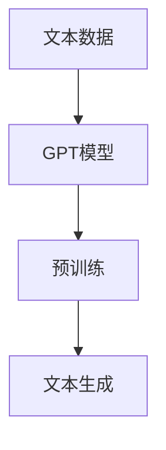

##### 1.3.2 BERT及其变体

BERT（Bidirectional Encoder Representations from Transformers）模型是另一种重要的预训练语言模型。BERT通过双向Transformer结构，能够理解上下文信息，从而实现更精准的自然语言理解。BERT及其变体，如RoBERTa、ALBERT等，在多种自然语言处理任务中表现出色。

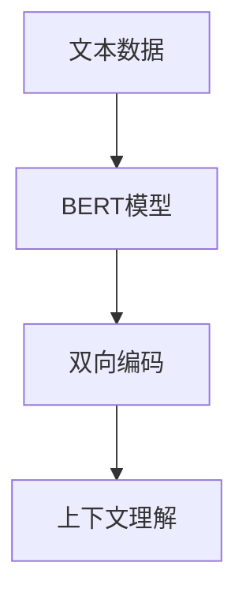

##### 1.3.3 其他知名大模型介绍

除了GPT和BERT，还有许多其他知名的大模型，如：

1. **TuringBox**：一种用于知识图谱嵌入的深度学习模型。
2. **ViT（Vision Transformer）**：用于计算机视觉任务的Transformer模型。
3. **ERNIE**：一种结合了词嵌入和知识嵌入的预训练模型。

#### 1.4 AI大模型在企业中的应用前景

##### 1.4.1 AI大模型的潜在应用领域

AI大模型在企业中的应用前景非常广阔，包括但不限于以下几个领域：

1. **自然语言处理**：文本分类、机器翻译、智能问答等。
2. **计算机视觉**：图像识别、目标检测、图像生成等。
3. **推荐系统**：个性化推荐、商品推荐等。
4. **金融风控**：信用评分、欺诈检测等。
5. **医疗健康**：疾病诊断、药物研发等。

##### 1.4.2 企业采用AI大模型的优势

企业采用AI大模型具有以下优势：

1. **提高决策精度**：AI大模型能够通过大量数据的学习，提供更精准的预测和决策。
2. **降低人工成本**：AI大模型能够自动化处理大量重复性工作，减少人工成本。
3. **提升服务质量**：AI大模型能够提供高质量的客户服务，提升客户满意度。

##### 1.4.3 AI大模型应用的挑战与机遇

虽然AI大模型为企业带来了巨大的机遇，但也面临着一些挑战：

1. **数据隐私**：如何保护用户隐私成为AI大模型应用的重要问题。
2. **计算资源**：训练和部署AI大模型需要大量的计算资源，这对企业提出了更高的要求。
3. **模型解释性**：如何解释AI大模型的工作原理，使其更具可解释性。

##### 1.5 AI软件2.0的核心架构

AI软件2.0的核心架构主要包括以下几个部分：

1. **数据层**：负责数据的采集、存储和管理。
2. **模型层**：包括预训练模型和微调模型，用于处理和生成数据。
3. **应用层**：将模型应用于具体的业务场景，实现智能决策和任务执行。


### 第二部分: AI大模型技术基础

#### 2.1 深度学习基础

##### 2.1.1 神经网络的基本结构

神经网络是深度学习的基础，其基本结构包括输入层、隐藏层和输出层。输入层接收外部输入，隐藏层通过激活函数进行非线性变换，输出层生成预测结果或决策输出。

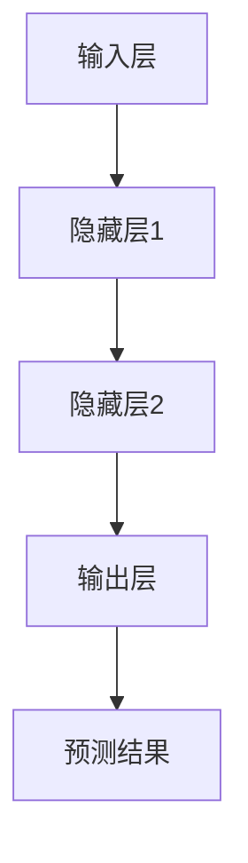

##### 2.1.2 深度学习的基础算法

深度学习的基础算法包括前向传播和反向传播。前向传播计算输入到输出层的预测结果，反向传播计算梯度，用于模型参数的更新。

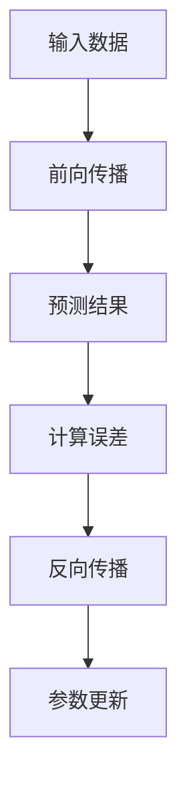

##### 2.1.3 深度学习优化算法

深度学习优化算法用于加速模型的训练过程，包括梯度下降、动量优化、自适应优化器等。这些算法通过调整学习率、动量等参数，提高模型的训练效率和收敛速度。

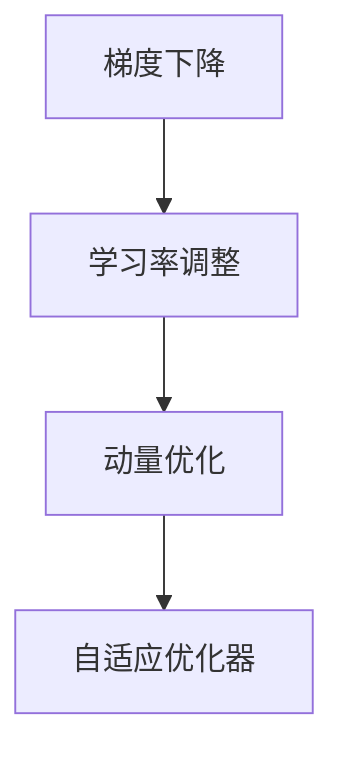

#### 2.2 自然语言处理技术

##### 2.2.1 词嵌入技术

词嵌入技术将词汇映射到高维向量空间，使得词汇之间的语义关系可以通过向量之间的距离和角度来表示。词嵌入技术是自然语言处理的重要基础，如Word2Vec、GloVe等。

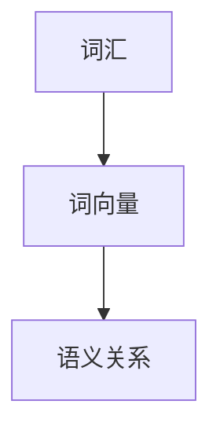

##### 2.2.2 序列模型与注意力机制

序列模型如循环神经网络（RNN）和长短时记忆网络（LSTM）能够处理序列数据，如文本和语音。注意力机制用于捕捉序列中的重要信息，如BERT模型中的多头注意力机制。

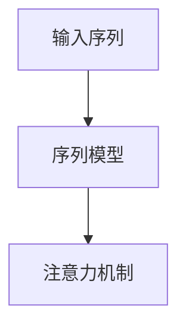

##### 2.2.3 转换器架构详解

转换器架构（Transformer）是自然语言处理领域的一项重要突破，其核心思想是利用自注意力机制来处理序列数据。转换器架构包括编码器和解码器，能够实现高效的文本生成和翻译任务。

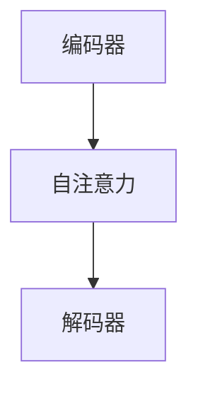

#### 2.3 大规模预训练模型原理

##### 2.3.1 预训练的概念与意义

预训练是指在大规模数据集上训练深度神经网络，使其具备通用语言理解和表示能力。预训练的意义在于提高模型在下游任务上的性能，减少对标注数据的依赖。

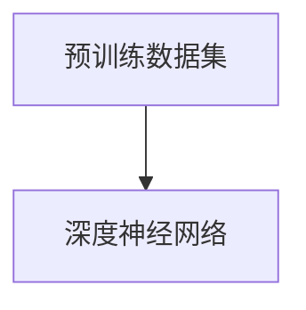

##### 2.3.2 自监督学习方法

自监督学习方法是一种不依赖标注数据的预训练方法，其核心思想是从未标注数据中学习有用的信息。自监督学习方法包括词嵌入、语言模型、文本分类等任务。

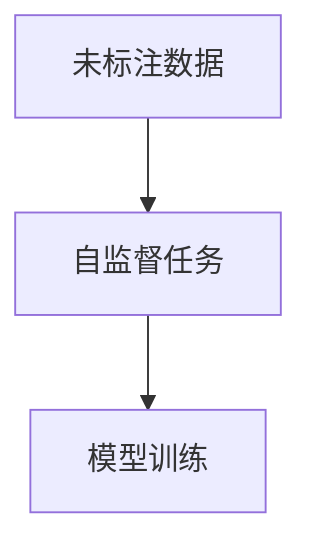

##### 2.3.3 迁移学习与微调技术

迁移学习是一种利用预训练模型在特定任务上表现良好的特点，将其应用于其他相关任务的方法。微调技术通过在特定任务上进一步训练预训练模型，提高其在特定任务上的性能。

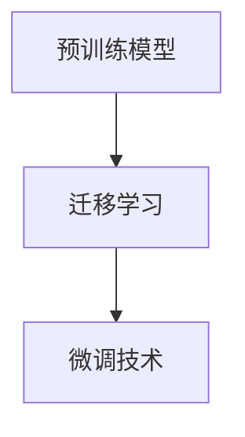

#### 2.4 AI大模型训练与优化

##### 2.4.1 AI大模型的训练流程

AI大模型的训练流程包括数据预处理、模型初始化、模型训练和模型评估等步骤。数据预处理包括数据清洗、数据增强等操作，模型初始化包括权重初始化、学习率设置等，模型训练包括迭代训练和优化过程，模型评估包括性能评估和误差分析等。

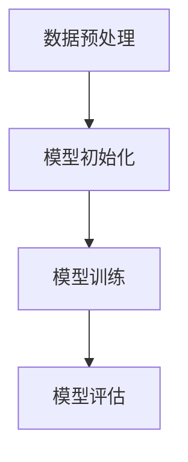

##### 2.4.2 AI大模型的优化方法

AI大模型的优化方法包括学习率调整、批量大小调整、权重初始化等。学习率调整包括固定学习率、自适应学习率等，批量大小调整包括批量训练和小批量训练，权重初始化包括随机初始化、高斯初始化等。

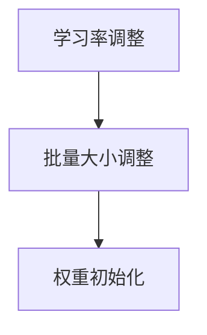

##### 2.4.3 AI大模型的调优技巧

AI大模型的调优技巧包括数据预处理、模型架构选择、训练策略等。数据预处理包括数据清洗、数据增强等，模型架构选择包括选择合适的神经网络结构，训练策略包括调整学习率、批量大小、迭代次数等。

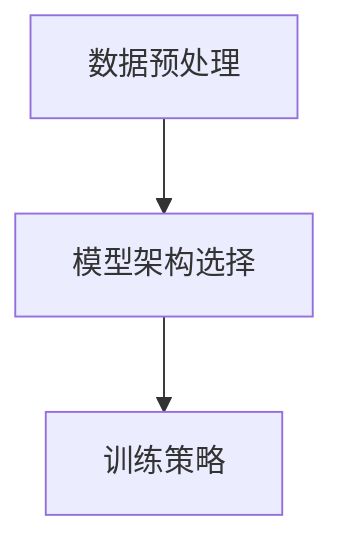

#### 2.5 AI大模型的部署与运维

##### 2.5.1 AI大模型的部署策略

AI大模型的部署策略包括在线部署和离线部署。在线部署将模型部署到云端或边缘设备，实现实时预测和决策。离线部署将模型部署到服务器或数据中心，用于批量处理和分析。

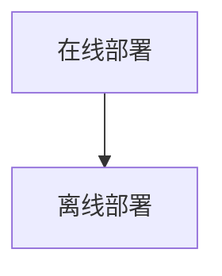

##### 2.5.2 AI大模型的性能优化

AI大模型的性能优化包括模型压缩、量化、加速等。模型压缩通过减小模型参数和计算量，提高模型部署的效率。量化通过将模型参数从浮点数转换为低精度的整数，降低模型计算的资源消耗。加速通过利用硬件加速器和分布式计算技术，提高模型训练和预测的速度。

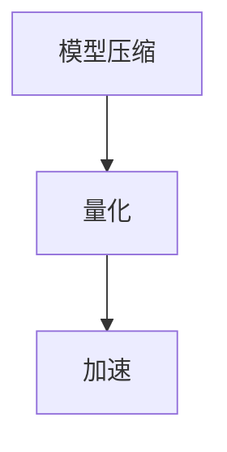

##### 2.5.3 AI大模型的运维管理

AI大模型的运维管理包括模型监控、性能调优、故障排除等。模型监控通过实时监控模型性能和资源使用情况，确保模型的稳定运行。性能调优通过调整模型参数和训练策略，提高模型性能。故障排除通过快速定位和解决模型故障，确保模型的可用性。

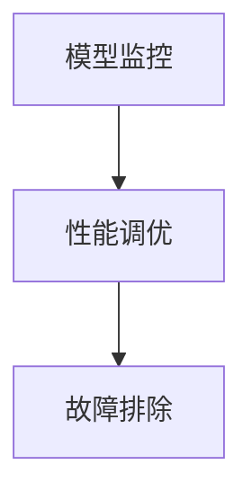

### 第三部分: AI软件2.0开发实践

#### 3.1 AI软件2.0开发流程

##### 3.1.1 AI软件2.0开发的准备阶段

AI软件2.0开发的准备阶段主要包括以下几个步骤：

1. **技术选型**：选择合适的深度学习框架和工具。
2. **环境搭建**：配置开发环境，包括计算资源和软件依赖。
3. **数据准备**：收集和预处理训练数据。

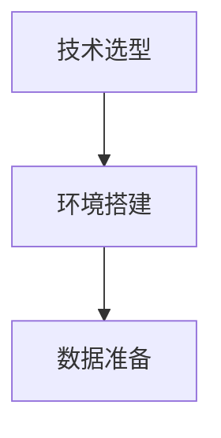

##### 3.1.2 AI软件2.0的需求分析与规划

AI软件2.0的需求分析与规划主要包括以下几个步骤：

1. **需求分析**：明确软件的功能需求和技术需求。
2. **架构设计**：设计软件的系统架构和模块划分。
3. **开发计划**：制定详细的开发计划和里程碑。

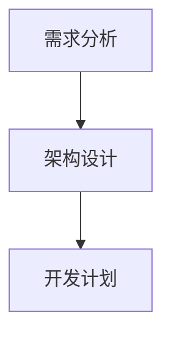

##### 3.1.3 AI软件2.0的设计与开发

AI软件2.0的设计与开发主要包括以下几个步骤：

1. **模块开发**：根据系统架构设计，开发各个模块的功能。
2. **集成测试**：将各个模块集成在一起，进行功能测试和性能测试。
3. **调试优化**：调试和优化软件性能，解决潜在的问题。

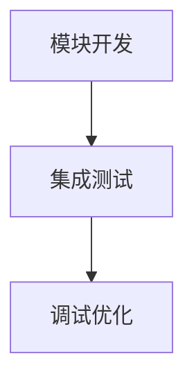

##### 3.1.4 AI软件2.0的测试与部署

AI软件2.0的测试与部署主要包括以下几个步骤：

1. **测试**：进行全面的软件测试，包括功能测试、性能测试和安全性测试。
2. **部署**：将软件部署到生产环境，包括安装、配置和调试。
3. **运维**：建立软件的运维体系，包括监控、性能优化和故障处理。

```mermaid
graph TD
    A[测试] --> B[部署]
    B --> C[运维]
```

#### 3.2 AI大模型开发实战

##### 3.2.1 实战案例1：企业级文本生成系统开发

企业级文本生成系统是一个典型的AI大模型应用案例。本文将详细介绍该系统的开发过程，包括数据准备、模型选择、模型训练和部署。

1. **数据准备**：收集大量企业级文本数据，进行数据清洗和预处理。
2. **模型选择**：选择GPT-3模型作为文本生成的基础模型。
3. **模型训练**：在准备好的数据集上进行模型训练，调整模型参数，优化模型性能。
4. **部署**：将训练好的模型部署到云端或边缘设备，实现文本生成功能。

```mermaid
graph TD
    A[数据准备] --> B[模型选择]
    B --> C[模型训练]
    C --> D[部署]
```

##### 3.2.2 实战案例2：图像识别与生成系统的开发

图像识别与生成系统是计算机视觉领域的典型应用。本文将详细介绍该系统的开发过程，包括数据准备、模型选择、模型训练和部署。

1. **数据准备**：收集大量图像数据，进行数据清洗和预处理。
2. **模型选择**：选择ViT模型作为图像识别的基础模型。
3. **模型训练**：在准备好的数据集上进行模型训练，调整模型参数，优化模型性能。
4. **部署**：将训练好的模型部署到云端或边缘设备，实现图像识别和生成功能。

```mermaid
graph TD
    A[数据准备] --> B[模型选择]
    B --> C[模型训练]
    C --> D[部署]
```

##### 3.2.3 实战案例3：智能客服系统的开发

智能客服系统是自然语言处理领域的典型应用。本文将详细介绍该系统的开发过程，包括数据准备、模型选择、模型训练和部署。

1. **数据准备**：收集大量客户对话数据，进行数据清洗和预处理。
2. **模型选择**：选择BERT模型作为文本处理的基础模型。
3. **模型训练**：在准备好的数据集上进行模型训练，调整模型参数，优化模型性能。
4. **部署**：将训练好的模型部署到云端或边缘设备，实现智能客服功能。

```mermaid
graph TD
    A[数据准备] --> B[模型选择]
    B --> C[模型训练]
    C --> D[部署]
```

#### 3.3 AI大模型在各个行业的应用

##### 3.3.1 金融行业的AI大模型应用

金融行业是AI大模型应用的重要领域，包括风险控制、投资分析、客户服务等方面。

1. **风险控制**：利用AI大模型进行客户信用评分、欺诈检测等。
2. **投资分析**：利用AI大模型进行市场趋势预测、投资组合优化等。
3. **客户服务**：利用AI大模型提供智能客服，提升客户体验。

##### 3.3.2 医疗行业的AI大模型应用

医疗行业是AI大模型应用的重要领域，包括疾病诊断、药物研发、患者管理等方面。

1. **疾病诊断**：利用AI大模型进行疾病预测和诊断，提高诊断准确率。
2. **药物研发**：利用AI大模型进行药物筛选和设计，加速药物研发过程。
3. **患者管理**：利用AI大模型进行患者健康监测和疾病预防，提升医疗服务质量。

##### 3.3.3 教育行业的AI大模型应用

教育行业是AI大模型应用的重要领域，包括智能教学、学习分析、考试评测等方面。

1. **智能教学**：利用AI大模型提供个性化教学方案，提升教学效果。
2. **学习分析**：利用AI大模型分析学生学习情况，优化教学策略。
3. **考试评测**：利用AI大模型进行考试自动评分，提高评分效率。

##### 3.3.4 制造业的AI大模型应用

制造业是AI大模型应用的重要领域，包括生产优化、质量控制、设备维护等方面。

1. **生产优化**：利用AI大模型进行生产流程优化，提高生产效率。
2. **质量控制**：利用AI大模型进行产品质量检测，提高产品合格率。
3. **设备维护**：利用AI大模型进行设备故障预测和诊断，提高设备运行效率。

#### 3.4 AI大模型开发中的常见问题与解决方案

##### 3.4.1 训练数据不足的问题

训练数据不足是AI大模型开发中的一个常见问题。解决方法包括：

1. **数据增强**：通过数据增强技术，如翻转、旋转、缩放等，增加数据多样性。
2. **迁移学习**：利用预训练模型进行迁移学习，利用已有模型的知识进行微调。
3. **数据集扩充**：收集更多的数据，或者从公开数据集获取数据。

##### 3.4.2 计算资源不足的问题

计算资源不足是AI大模型开发中的另一个常见问题。解决方法包括：

1. **分布式训练**：利用分布式计算技术，如多GPU训练、多机训练等，提高训练效率。
2. **模型压缩**：通过模型压缩技术，如模型剪枝、量化等，减小模型计算量。
3. **云计算**：利用云计算平台，如Google Cloud、AWS等，获取更多的计算资源。

##### 3.4.3 模型效果不佳的问题

模型效果不佳是AI大模型开发中的另一个常见问题。解决方法包括：

1. **数据预处理**：优化数据预处理流程，提高数据质量。
2. **模型调优**：调整模型参数，优化模型结构，提高模型性能。
3. **迭代优化**：不断迭代优化模型，通过多次训练和调整，提高模型效果。

##### 3.4.4 模型部署与运维的问题

模型部署与运维是AI大模型开发中的关键问题。解决方法包括：

1. **容器化部署**：利用容器化技术，如Docker，实现模型的快速部署和版本管理。
2. **自动化运维**：建立自动化运维体系，包括监控、报警、备份等。
3. **性能优化**：通过性能优化技术，如负载均衡、缓存等，提高模型服务的性能。

### 第四部分: AI软件2.0的未来展望

#### 4.1 AI软件2.0的发展趋势

AI软件2.0的发展趋势体现在以下几个方面：

1. **模型规模不断扩大**：随着计算能力和数据量的提升，AI大模型的规模将继续扩大，参数规模将达到数万亿级别。
2. **多模态融合**：AI软件2.0将融合多种数据类型，如文本、图像、声音等，实现跨模态的智能化。
3. **知识图谱的引入**：知识图谱将用于增强AI大模型的知识表示能力，提高模型的解释性和通用性。
4. **边缘计算的应用**：AI软件2.0将更多应用于边缘设备，实现实时感知和决策。

#### 4.2 AI软件2.0的市场前景

AI软件2.0的市场前景非常广阔，预计将带来以下影响：

1. **产业升级**：AI软件2.0将推动各行业实现智能化升级，提高生产效率和产品质量。
2. **经济效益**：AI软件2.0将为企业带来巨大的经济效益，降低运营成本，提升竞争力。
3. **社会变革**：AI软件2.0将改变人们的生产生活方式，提升生活质量。

#### 4.3 AI软件2.0的社会影响

AI软件2.0的社会影响体现在以下几个方面：

1. **就业结构变化**：AI软件2.0将改变就业结构，一些传统岗位将被自动化替代，同时也会创造新的工作岗位。
2. **数据隐私**：AI软件2.0将面临数据隐私和安全的问题，需要建立有效的隐私保护机制。
3. **伦理问题**：AI软件2.0将带来伦理问题，如算法歧视、透明度不足等，需要制定相应的伦理规范。

### 附录

#### 附录A: AI大模型开发工具与资源

##### A.1 主流深度学习框架对比

1. **TensorFlow**：由Google开发，支持Python和C++语言，具有丰富的API和生态系统。
2. **PyTorch**：由Facebook开发，支持Python语言，具有动态计算图和灵活的API。
3. **JAX**：由Google开发，支持Python和C++语言，具有数值计算和自动微分功能。

##### A.2 其他深度学习框架简介

1. **Keras**：基于TensorFlow的高层次API，提供简洁的接口和丰富的模型库。
2. **MXNet**：由Apache软件基金会开发，支持多种编程语言，具有高性能和灵活性。
3. **Theano**：由蒙特利尔大学开发，支持Python语言，具有符号计算和优化编译功能。

##### A.3 AI大模型开源资源与社区

1. **Hugging Face**：提供丰富的预训练模型和工具，是自然语言处理领域的重要开源社区。
2. **TensorFlow Model Garden**：提供丰富的AI模型和教程，是TensorFlow的重要开源资源。
3. **PyTorch Hub**：提供丰富的预训练模型和工具，是PyTorch的重要开源资源。

##### A.4 AI大模型开发的最佳实践

1. **数据预处理**：确保数据质量，进行数据清洗和预处理，如数据增强、归一化等。
2. **模型选择**：根据任务需求和数据规模，选择合适的模型和架构。
3. **调优技巧**：通过调整学习率、批量大小、迭代次数等参数，优化模型性能。
4. **部署与运维**：建立自动化部署和运维体系，确保模型服务的稳定性和性能。

### 结语

AI软件2.0的开发流程再造是一个复杂而系统的过程，需要从数据准备、模型训练、模型优化到模型部署等各个环节进行精心设计和实施。本文通过系统分析和深入探讨，为读者提供了一个全面而系统的AI软件2.0开发指南，旨在帮助企业和开发者把握AI软件2.0的发展趋势，应对技术挑战，实现高效开发。

然而，AI软件2.0的开发仍然面临诸多挑战，如数据隐私、计算资源、模型解释性等。未来，随着技术的不断进步和应用的深入，AI软件2.0将带来更多的机遇和挑战。让我们共同期待AI软件2.0的蓬勃发展，为人类创造更加美好的未来。

---

**作者信息：**

作者：AI天才研究院/AI Genius Institute & 禅与计算机程序设计艺术 /Zen And The Art of Computer Programming**

