                 

# 文章标题
AI软件2.0的提示词驱动微服务设计

## 文章关键词
- AI软件2.0
- 提示词驱动
- 微服务设计
- 优化算法
- 数学模型
- 项目实战

## 文章摘要
本文将深入探讨AI软件2.0的提示词驱动微服务设计。首先，我们将概述AI软件2.0的背景和特点，然后详细介绍提示词驱动微服务架构的基本原理和优势。接下来，我们将探讨微服务设计与部署的原则，以及如何实现和优化提示词驱动微服务。文章将涵盖自然语言处理、图像处理和推荐系统等领域的应用案例，并通过项目实战展示提示词驱动微服务的实际应用。最后，我们将展望AI软件2.0的未来发展趋势，并提供最佳实践和拓展阅读建议。

## 目录

### 第一部分：AI软件2.0概述

#### 第1章：AI软件2.0的背景与概念
##### 1.1 AI软件2.0的定义与特点
##### 1.2 AI软件2.0的起源与发展
##### 1.3 AI软件2.0与传统AI软件的区别

#### 第2章：AI软件2.0的关键技术
##### 2.1 提示词驱动微服务架构
###### 2.1.1 提示词驱动微服务的基本原理
###### 2.1.2 提示词驱动微服务的优势与挑战
##### 2.2 微服务设计与部署
###### 2.2.1 微服务设计的原则与模式
###### 2.2.2 微服务的部署与监控

#### 第3章：AI软件2.0的数学基础
##### 3.1 提示词驱动的优化算法
###### 3.1.1 优化算法的基本概念
###### 3.1.2 提示词优化的数学模型
##### 3.2 提示词驱动的模型评估
###### 3.2.1 评估指标与标准
###### 3.2.2 提示词优化的评估方法

### 第二部分：AI软件2.0应用实践

#### 第4章：AI软件2.0在自然语言处理中的应用
##### 4.1 提示词驱动的文本生成
###### 4.1.1 文本生成模型概述
###### 4.1.2 提示词驱动的文本生成流程
##### 4.2 提示词驱动的问答系统
###### 4.2.1 问答系统概述
###### 4.2.2 提示词驱动的问答实现

#### 第5章：AI软件2.0在图像处理中的应用
##### 5.1 提示词驱动的图像分类
###### 5.1.1 图像分类模型概述
###### 5.1.2 提示词驱动的图像分类流程
##### 5.2 提示词驱动的图像生成
###### 5.2.1 图像生成模型概述
###### 5.2.2 提示词驱动的图像生成流程

#### 第6章：AI软件2.0在推荐系统中的应用
##### 6.1 提示词驱动的推荐算法
###### 6.1.1 推荐算法概述
###### 6.1.2 提示词驱动的推荐算法实现
##### 6.2 提示词驱动的推荐系统优化
###### 6.2.1 优化策略与技巧
###### 6.2.2 提示词优化对推荐系统的影响

#### 第7章：AI软件2.0的项目实战
##### 7.1 提示词驱动微服务项目案例
###### 7.1.1 项目概述
###### 7.1.2 项目实施流程
###### 7.1.3 项目成果分析
##### 7.2 提示词驱动的AI系统优化案例
###### 7.2.1 系统优化目标
###### 7.2.2 优化策略与实施
###### 7.2.3 优化效果评估

#### 第8章：AI软件2.0的未来发展
##### 8.1 提示词驱动微服务的趋势与挑战
###### 8.1.1 行业趋势分析
###### 8.1.2 潜在挑战与应对策略
##### 8.2 AI软件2.0的创新应用
###### 8.2.1 创新应用领域
###### 8.2.2 创新应用前景

## 第一部分：AI软件2.0概述

### 第1章：AI软件2.0的背景与概念

#### 1.1 AI软件2.0的定义与特点

随着人工智能技术的不断发展，AI软件也在不断演变。AI软件1.0时代主要依赖于数据驱动的方法，通过大量数据的训练来提高模型的准确性。然而，这种方式存在一些局限性，例如对数据的依赖性较高，难以应对复杂的、动态的环境。为了解决这些问题，AI软件2.0应运而生。

AI软件2.0，也被称为下一代人工智能软件，其核心特点在于其高度的灵活性和适应性。AI软件2.0不仅仅是基于数据训练的模型，更是一种可以自我学习、自我优化、自适应环境的智能系统。

**核心概念与联系**：

首先，我们需要理解几个关键概念：

1. **提示词（Prompt）**：提示词是一种用于引导模型生成输出或者调整模型行为的输入信息。在AI软件2.0中，提示词扮演着至关重要的角色，它们可以引导模型在特定方向上进行推理和生成。

2. **微服务（Microservices）**：微服务是一种软件架构风格，它将应用程序划分为一系列小而独立的服务，每个服务负责完成特定的功能。这种架构风格有助于提高系统的可扩展性、可靠性和灵活性。

3. **自适应性（Adaptability）**：自适应性是指系统在遇到新环境、新需求时，能够自动调整自身的行为和结构，以保持其有效性和适应性。

**Mermaid流程图**：

下面是一个简单的Mermaid流程图，展示了AI软件2.0的关键组成部分和它们之间的相互作用：

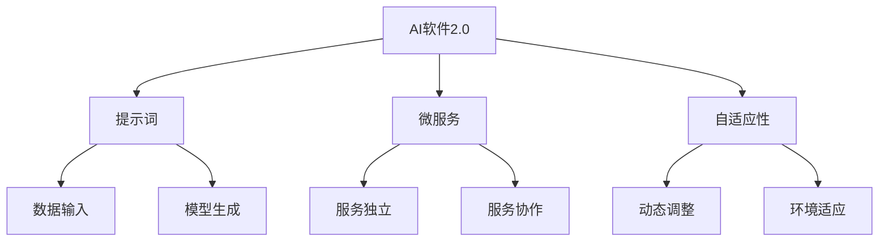

**核心概念原理之间的关系架构**：

AI软件2.0通过提示词驱动微服务架构来实现其高度的灵活性和适应性。提示词作为输入，可以引导微服务进行数据输入、模型生成、服务独立和服务协作。同时，微服务的自适应性使其能够动态调整和适应环境变化。

#### 1.2 AI软件2.0的起源与发展

AI软件2.0的起源可以追溯到人工智能领域的不断探索和进步。在AI软件1.0时代，研究人员主要集中在如何利用大量数据进行模型训练和优化。然而，随着业务需求和场景的日益复杂，传统的方法开始显得力不从心。

**历史回顾**：

1. **AI软件1.0**：基于数据驱动的模型训练和优化，例如深度学习模型。
2. **AI软件1.5**：引入了一些提示词和规则，但仍然以数据为中心。
3. **AI软件2.0**：强调提示词驱动和微服务架构，实现高度灵活性和适应性。

**重大事件和里程碑**：

1. **2016年**：人工智能领域的重大突破，包括AlphaGo击败围棋世界冠军李世石。
2. **2017年**：谷歌发布了Transformer模型，标志着自然语言处理领域的重大进展。
3. **2018年**：微服务架构逐渐成熟，并被广泛应用于实际项目中。

**演变过程**：

AI软件2.0的演变过程可以看作是从数据驱动到提示词驱动的转变。在这个过程中，研究人员逐渐认识到，仅仅依赖数据是不够的，还需要引入更多的外部信息来引导模型的生成和优化。

**发展趋势**：

目前，AI软件2.0正在快速发展，并在各个领域得到广泛应用。随着技术的不断进步，AI软件2.0有望在未来实现更广泛的应用，为人类带来更多的便利和变革。

#### 1.3 AI软件2.0与传统AI软件的区别

AI软件2.0与传统AI软件在多个方面存在显著差异，主要体现在以下几个方面：

**技术方面**：

1. **数据依赖性**：传统AI软件高度依赖大量数据，而AI软件2.0则更加注重提示词的引导和微服务的协作。
2. **模型结构**：传统AI软件通常使用单一的深度学习模型，而AI软件2.0则采用更加灵活的微服务架构，每个微服务负责特定的功能。

**应用方面**：

1. **适应性**：传统AI软件在面对新环境和新需求时，往往需要重新训练模型，而AI软件2.0可以通过提示词和微服务的协作，实现动态调整和优化。
2. **复杂性**：传统AI软件通常针对特定的场景和问题，而AI软件2.0则更加通用，可以应对多种不同类型的问题。

**价值方面**：

1. **灵活性**：AI软件2.0通过微服务架构和提示词驱动，实现了更高的灵活性和适应性，可以更好地满足不同业务需求。
2. **效率**：AI软件2.0通过微服务的协作和优化，可以提高系统的整体效率和性能。

**对比分析**：

下表列出了AI软件2.0与传统AI软件在技术、应用和价值等方面的主要差异：

| 对比项目       | AI软件2.0          | 传统AI软件         |
| -------------- | ------------------ | ------------------ |
| 数据依赖性     | 提示词驱动         | 数据驱动           |
| 模型结构       | 微服务架构         | 单一深度学习模型   |
| 适应性         | 动态调整和优化     | 需要重新训练模型   |
| 复杂性         | 更加通用           | 针对特定场景和问题 |
| 灵活性         | 更高               | 较低               |
| 效率           | 高于               | 低于               |

## 第2章：AI软件2.0的关键技术

### 2.1 提示词驱动微服务架构

提示词驱动微服务架构是AI软件2.0的核心技术之一，它结合了提示词驱动的强大功能和微服务架构的灵活性，实现了高度自适应和灵活的智能系统。本节将详细介绍提示词驱动微服务架构的基本原理、优势与挑战，以及微服务设计与部署的原则。

#### 2.1.1 提示词驱动微服务的基本原理

提示词驱动微服务架构的核心思想是利用提示词引导微服务进行数据输入、模型生成、服务独立和服务协作，以实现高度自适应和灵活的智能系统。

**基本原理**：

1. **提示词输入**：提示词作为输入，可以引导微服务在特定方向上进行推理和生成。提示词可以是自然语言文本、图像、音频等不同类型的数据。

2. **微服务协作**：微服务之间通过消息传递和API调用进行协作，共同完成复杂的任务。每个微服务负责特定的功能，例如数据预处理、模型训练、模型推理等。

3. **动态调整**：微服务可以根据环境变化和任务需求，动态调整其行为和结构。例如，当某个微服务遇到性能瓶颈时，可以自动进行扩展或替换。

**Mermaid流程图**：

以下是一个简单的Mermaid流程图，展示了提示词驱动微服务的基本原理：

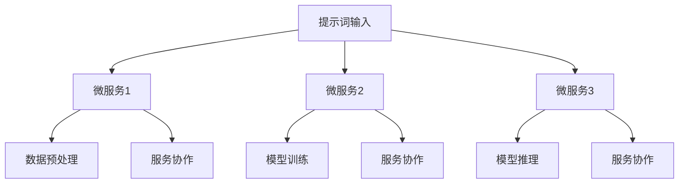

**核心概念原理之间的关系架构**：

提示词驱动微服务架构通过提示词引导微服务进行数据输入、模型生成、服务独立和服务协作。微服务之间通过消息传递和API调用进行协作，共同实现复杂任务。同时，微服务可以根据环境变化和任务需求，动态调整其行为和结构。

#### 2.1.2 提示词驱动微服务的优势与挑战

提示词驱动微服务架构具有多个优势，但也面临一些挑战。

**优势**：

1. **高度自适应**：通过提示词的引导，微服务可以实现动态调整和优化，更好地适应环境变化和任务需求。

2. **灵活性**：微服务架构使得系统能够快速响应业务需求变化，实现模块化和松耦合。

3. **可扩展性**：微服务可以独立部署和扩展，从而提高系统的整体性能和可扩展性。

4. **可靠性**：微服务架构可以提高系统的可靠性，因为单个微服务出现故障时，不会影响整个系统的运行。

**挑战**：

1. **复杂性**：微服务架构引入了额外的复杂性，例如服务之间的通信、数据一致性和监控等。

2. **调试和维护**：微服务架构使得系统的调试和维护变得更加复杂，需要掌握多种技术和工具。

3. **性能优化**：微服务之间的通信和协调可能会引入额外的性能开销，需要精心设计和优化。

**分析图表**：

以下是一个简单的分析图表，展示了提示词驱动微服务的优势和挑战：

| 对比项目       | 优势                             | 挑战                                 |
| -------------- | -------------------------------- | ------------------------------------ |
| 自适应         | 动态调整和优化                   | 复杂性                               |
| 灵活性         | 快速响应业务需求变化             | 调试和维护复杂性                      |
| 可扩展性       | 独立部署和扩展                   | 性能优化需求                         |
| 可靠性         | 单个微服务故障不影响整体系统     | 服务间通信和数据一致性挑战           |

#### 2.2 微服务设计与部署

微服务设计是构建高效、可靠和灵活的AI软件2.0系统的关键。以下将介绍微服务设计的原则与模式，以及微服务的部署与监控。

**设计原则与模式**：

1. **单一职责原则**：每个微服务应负责完成单一的功能，以便于开发和维护。

2. **自治性原则**：微服务应具备独立的部署、扩展和监控能力，以降低系统复杂性。

3. **异步通信原则**：微服务之间应采用异步通信方式，以避免同步调用带来的性能瓶颈。

4. **弹性扩展原则**：微服务应支持水平扩展，以应对不同负载情况。

5. **可观测性原则**：微服务应具备良好的日志、监控和告警机制，以便于故障排查和性能优化。

**设计模式**：

1. **事件驱动模式**：通过事件驱动的方式，实现微服务之间的松耦合和异步通信。

2. **微前端模式**：将前端功能拆分为多个微前端服务，以提高系统的灵活性和可扩展性。

3. **API网关模式**：通过API网关统一管理外部访问，实现微服务的路由、认证和安全等。

**部署与监控**：

1. **容器化部署**：使用Docker等容器技术，实现微服务的轻量级、可移植和独立部署。

2. **Kubernetes集群管理**：使用Kubernetes等集群管理工具，实现微服务的自动化部署、扩展和监控。

3. **日志管理**：使用ELK（Elasticsearch、Logstash、Kibana）等日志管理工具，实现微服务的日志收集、存储和可视化。

4. **监控告警**：使用Prometheus、Grafana等监控工具，实现微服务的性能监控和告警。

#### 2.2.1 微服务设计的原则与模式

**单一职责原则**：

每个微服务应负责完成单一的功能，例如数据预处理、模型训练、模型推理等。这种设计原则有助于降低系统的复杂性，提高开发和维护的效率。

**自治性原则**：

微服务应具备独立的部署、扩展和监控能力，以降低系统复杂性。例如，可以使用Docker和Kubernetes等工具，实现微服务的容器化部署和自动化管理。

**异步通信原则**：

微服务之间应采用异步通信方式，以避免同步调用带来的性能瓶颈。例如，可以使用消息队列（如RabbitMQ、Kafka）实现微服务之间的异步通信。

**弹性扩展原则**：

微服务应支持水平扩展，以应对不同负载情况。例如，可以使用Kubernetes等集群管理工具，实现微服务的自动化扩展。

**可观测性原则**：

微服务应具备良好的日志、监控和告警机制，以便于故障排查和性能优化。例如，可以使用ELK（Elasticsearch、Logstash、Kibana）等日志管理工具，实现微服务的日志收集、存储和可视化。

**设计模式**：

**事件驱动模式**：

事件驱动模式通过事件驱动的方式，实现微服务之间的松耦合和异步通信。例如，可以使用消息队列（如RabbitMQ、Kafka）将事件传递给相应的微服务进行处理。

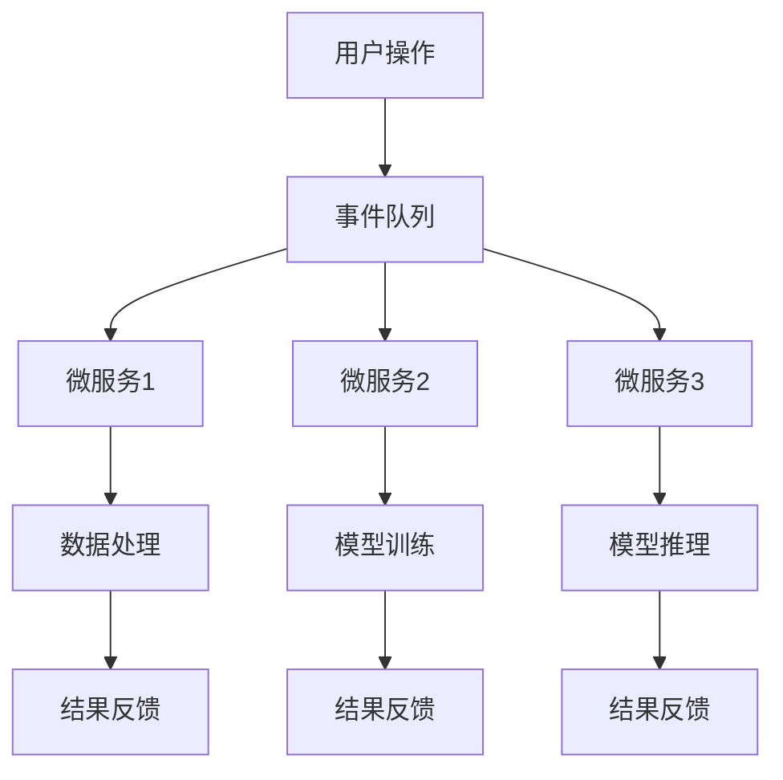

**微前端模式**：

微前端模式将前端功能拆分为多个微前端服务，以提高系统的灵活性和可扩展性。例如，可以使用Vue、React等前端框架，实现微前端服务的开发和部署。

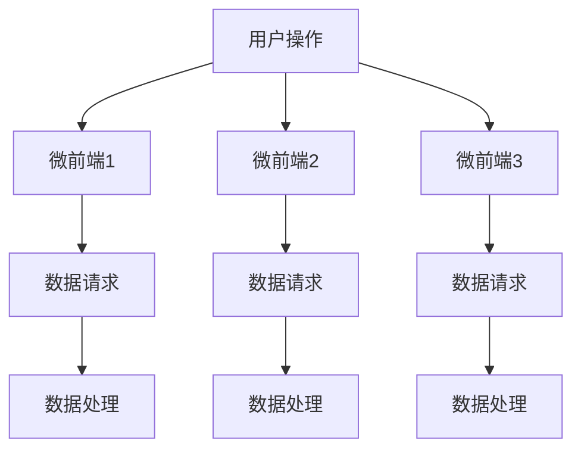

**API网关模式**：

API网关模式通过API网关统一管理外部访问，实现微服务的路由、认证和安全等。例如，可以使用Spring Cloud Gateway等API网关工具，实现微服务的统一管理和访问控制。

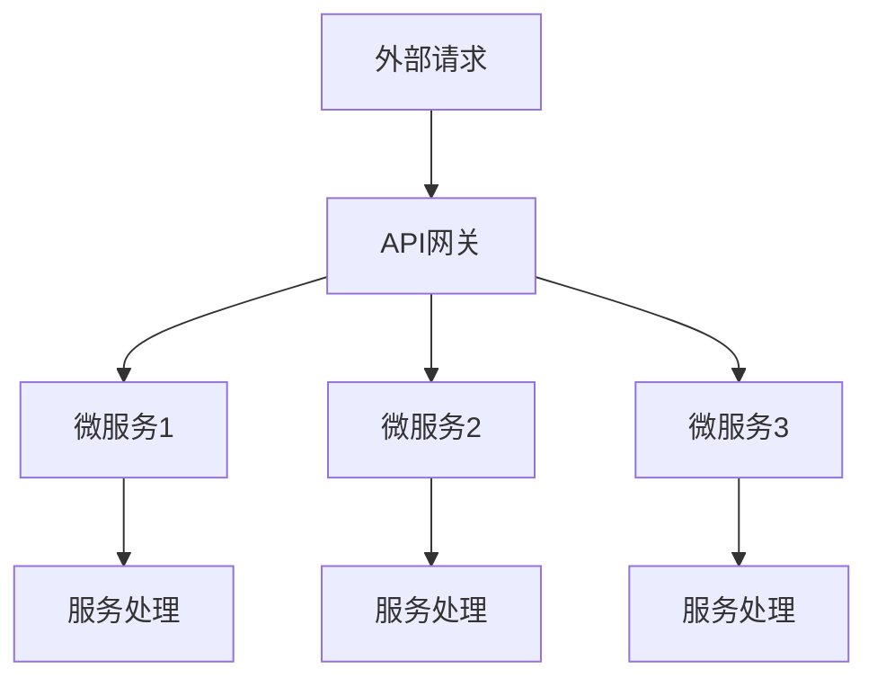

#### 2.2.2 微服务的部署与监控

**容器化部署**：

使用Docker等容器技术，实现微服务的轻量级、可移植和独立部署。以下是一个简单的Dockerfile示例：

```dockerfile
# 使用官方Python基础镜像
FROM python:3.8

# 创建工作目录
WORKDIR /app

# 复制项目文件到容器中
COPY . /app

# 安装依赖项
RUN pip install -r requirements.txt

# 暴露服务端口
EXPOSE 8080

# 运行服务
CMD ["python", "app.py"]
```

**Kubernetes集群管理**：

使用Kubernetes等集群管理工具，实现微服务的自动化部署、扩展和监控。以下是一个简单的Kubernetes部署文件示例：

```yaml
apiVersion: apps/v1
kind: Deployment
metadata:
  name: my-service
spec:
  replicas: 3
  selector:
    matchLabels:
      app: my-service
  template:
    metadata:
      labels:
        app: my-service
    spec:
      containers:
      - name: my-service
        image: my-service:latest
        ports:
        - containerPort: 8080
```

**日志管理**：

使用ELK（Elasticsearch、Logstash、Kibana）等日志管理工具，实现微服务的日志收集、存储和可视化。以下是一个简单的Logstash配置文件示例：

```jinja
input {
  file {
    path => "/var/log/my-service/*.log"
    type => "my-service-log"
  }
}

filter {
  if ["my-service-log"] {
    grok {
      match => { "message" => "%{TIMESTAMP_ISO8601:timestamp}\t%{DATA:level}\t%{DATA:logger}\t%{DATA:thread}\t%{DATA:exception}\t%{DATA:message}" }
    }
  }
}

output {
  elasticsearch {
    hosts => ["localhost:9200"]
    index => "my-service-%{+YYYY.MM.dd}"
  }
}
```

**监控告警**：

使用Prometheus、Grafana等监控工具，实现微服务的性能监控和告警。以下是一个简单的Prometheus配置文件示例：

```yaml
scrape_configs:
  - job_name: 'my-service'
    static_configs:
      - targets: ['localhost:9090']
```

## 第3章：AI软件2.0的数学基础

### 3.1 提示词驱动的优化算法

提示词驱动的优化算法是AI软件2.0的关键技术之一，它利用提示词引导优化过程，实现更高效、更准确的模型训练和优化。本节将详细介绍提示词驱动的优化算法的基本概念、数学模型及其实现。

#### 3.1.1 优化算法的基本概念

优化算法是一类旨在寻找函数最小值或最大值的算法。在机器学习中，优化算法通常用于模型训练和优化过程，以寻找最佳参数配置。

**核心概念**：

1. **目标函数**：优化算法需要优化的函数，通常是一个多维度的实值函数。目标函数的值反映了模型的性能。

2. **梯度**：目标函数在某一点的导数，用于指示目标函数在该点的增长或减少方向。

3. **梯度下降**：一种常用的优化算法，通过不断更新参数，使目标函数的值逐步减小，最终收敛到最小值或最大值。

4. **动量**：梯度下降的一种改进方法，用于加速收敛过程，减少振荡。

**Mermaid流程图**：

以下是一个简单的Mermaid流程图，展示了优化算法的基本概念：

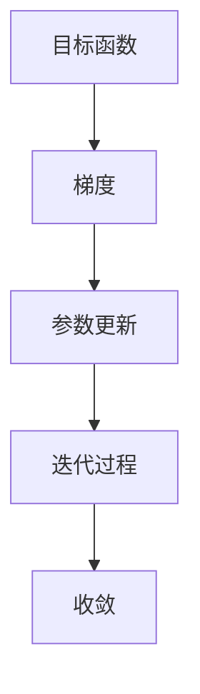

**核心概念原理之间的关系架构**：

优化算法通过目标函数、梯度和参数更新等基本概念，实现迭代过程，逐步减小目标函数的值，最终收敛到最小值或最大值。

#### 3.1.2 提示词优化的数学模型

提示词优化的数学模型利用提示词引导优化过程，提高优化效率和准确性。以下是提示词优化的数学模型：

1. **目标函数**：

   假设模型参数为 \( \theta \)，目标函数为 \( f(\theta) \)，则目标函数可表示为：

   \[ f(\theta) = \frac{1}{m} \sum_{i=1}^{m} h_\theta(x^{(i)}) - y^{(i)} \]

   其中，\( m \) 是样本数量，\( h_\theta(x^{(i)}) \) 是模型的预测输出，\( y^{(i)} \) 是实际标签。

2. **梯度**：

   梯度表示目标函数在某一参数点的导数，用于指示目标函数在该点的增长或减少方向。梯度可以表示为：

   \[ \nabla f(\theta) = \left[ \frac{\partial f}{\partial \theta_1}, \frac{\partial f}{\partial \theta_2}, \ldots, \frac{\partial f}{\partial \theta_n} \right] \]

3. **提示词**：

   提示词是一种用于引导模型生成输出或调整模型行为的输入信息。提示词可以是一个向量，表示为 \( \textbf{p} \)。

4. **提示词优化**：

   提示词优化通过在优化过程中引入提示词，引导优化过程。提示词优化的目标函数可表示为：

   \[ f_{\text{prompt}}(\theta) = \frac{1}{m} \sum_{i=1}^{m} (h_\theta(x^{(i)}) - y^{(i)}) + \alpha \cdot \text{distance}(\textbf{p}, h_\theta(x^{(i)})) \]

   其中，\( \alpha \) 是提示词优化的权重，\( \text{distance}(\textbf{p}, h_\theta(x^{(i)})) \) 表示提示词和模型输出之间的距离。

**Mermaid流程图**：

以下是一个简单的Mermaid流程图，展示了提示词优化的数学模型：

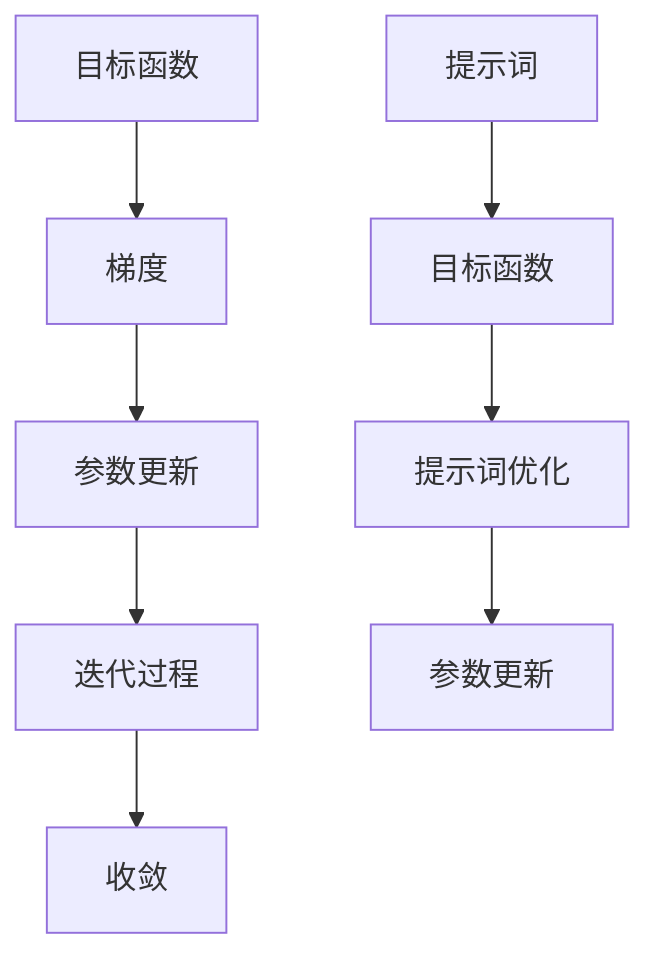

**核心概念原理之间的关系架构**：

提示词优化通过在目标函数中引入提示词，引导优化过程。提示词优化目标函数通过增加提示词和模型输出之间的距离，实现更准确的优化。

### 3.2 提示词驱动的模型评估

提示词驱动的模型评估是衡量模型性能和优化效果的重要手段。本节将介绍提示词驱动的模型评估指标、标准和评估方法。

#### 3.2.1 评估指标与标准

提示词驱动的模型评估指标主要包括准确性、召回率、F1值和均方误差等。以下是对这些评估指标和标准的详细介绍：

1. **准确性（Accuracy）**：

   准确性是指模型预测正确的样本数量与总样本数量的比例。准确性越高，表示模型的性能越好。准确性可以表示为：

   \[ \text{Accuracy} = \frac{\text{预测正确的样本数量}}{\text{总样本数量}} \]

2. **召回率（Recall）**：

   召回率是指模型预测为正类的真实正类样本数量与实际正类样本数量的比例。召回率越高，表示模型对正类样本的识别能力越强。召回率可以表示为：

   \[ \text{Recall} = \frac{\text{预测为正类的真实正类样本数量}}{\text{实际正类样本数量}} \]

3. **F1值（F1 Score）**：

   F1值是准确性和召回率的加权平均，用于综合评价模型的性能。F1值越高，表示模型的性能越好。F1值可以表示为：

   \[ \text{F1 Score} = \frac{2 \cdot \text{Accuracy} \cdot \text{Recall}}{\text{Accuracy} + \text{Recall}} \]

4. **均方误差（Mean Squared Error, MSE）**：

   均方误差是预测值与实际值之间差异的平方的平均值。均方误差越小，表示模型的预测误差越小。均方误差可以表示为：

   \[ \text{MSE} = \frac{1}{m} \sum_{i=1}^{m} (y^{(i)} - \hat{y}^{(i)})^2 \]

**Mermaid流程图**：

以下是一个简单的Mermaid流程图，展示了评估指标与标准：

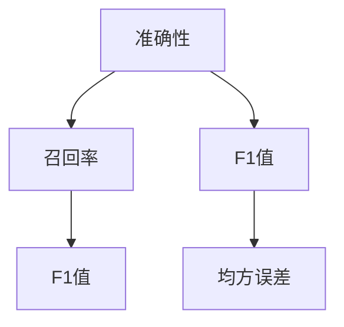

**核心概念原理之间的关系架构**：

评估指标和标准用于衡量模型的性能，通过综合评价模型的准确性、召回率、F1值和均方误差，可以更全面地了解模型的性能。

#### 3.2.2 提示词优化的评估方法

提示词优化的评估方法包括离线评估和在线评估两种。

1. **离线评估**：

   离线评估是指在模型训练完成后，使用测试集对模型进行评估。离线评估的主要目的是评估模型在未知数据上的性能。常用的离线评估指标包括准确性、召回率、F1值和均方误差等。

   **示例**：

   假设有一个分类问题，测试集包含100个样本，模型预测正确的样本数量为80个。则模型的准确率为：

   \[ \text{Accuracy} = \frac{80}{100} = 0.8 \]

2. **在线评估**：

   在线评估是指在模型部署后，实时评估模型在真实环境中的性能。在线评估的主要目的是监测模型在实际应用中的性能，以便及时调整和优化模型。在线评估通常使用在线学习算法，例如在线梯度下降。

   **示例**：

   假设有一个推荐系统，用户每次浏览商品时，系统会实时评估推荐结果的准确性。如果用户对当前推荐的商品感兴趣，则准确性增加，否则准确性减少。

   ```python
   def online_evaluation(recommendation, user_action):
       if user_action == 'interested':
           accuracy += 0.1
       else:
           accuracy -= 0.1
       return accuracy
   ```

**总结**：

提示词驱动的模型评估方法包括离线评估和在线评估。离线评估主要用于模型训练完成后对模型进行评估，而在线评估主要用于模型部署后在真实环境中的性能监测。通过结合离线评估和在线评估，可以更全面地了解模型的性能，并及时调整和优化模型。

## 第4章：AI软件2.0在自然语言处理中的应用

### 4.1 提示词驱动的文本生成

提示词驱动的文本生成是自然语言处理领域的重要应用之一，它通过提示词引导模型生成具有特定主题或风格的文本。本节将详细介绍提示词驱动的文本生成模型、流程及其实现。

#### 4.1.1 文本生成模型概述

文本生成模型是一种能够根据输入提示生成自然语言文本的模型。常见的文本生成模型包括循环神经网络（RNN）、变换器（Transformer）等。

**核心概念与联系**：

1. **循环神经网络（RNN）**：RNN是一种能够处理序列数据的神经网络，它可以捕捉序列中的长期依赖关系。

2. **变换器（Transformer）**：Transformer是一种基于自注意力机制的神经网络，它在处理长序列数据时表现出色。

**Mermaid流程图**：

以下是一个简单的Mermaid流程图，展示了文本生成模型的核心概念：

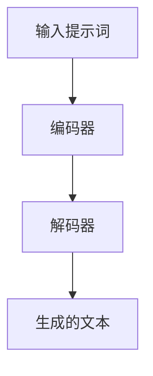

**核心概念原理之间的关系架构**：

文本生成模型通过编码器将输入提示词编码为固定长度的向量表示，然后通过解码器生成具有特定主题或风格的文本。

#### 4.1.2 提示词驱动的文本生成流程

提示词驱动的文本生成流程包括以下步骤：

1. **输入提示词**：输入提示词可以是关键词、句子或段落，用于引导文本生成模型。

2. **编码器处理**：编码器将输入提示词编码为固定长度的向量表示，通常使用预训练的词向量或变换器编码器。

3. **解码器生成**：解码器根据编码器的输出和先前生成的文本，逐词生成新的文本。

4. **循环迭代**：解码器在每次迭代中生成新的词，并更新编码器的输出，直到达到预设的文本长度或生成终止符。

**Mermaid流程图**：

以下是一个简单的Mermaid流程图，展示了提示词驱动的文本生成流程：

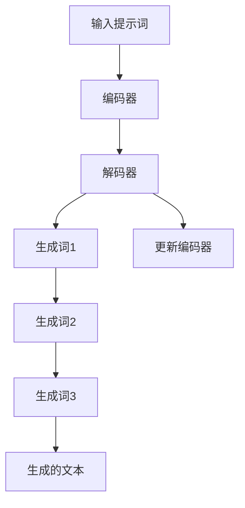

**核心概念原理之间的关系架构**：

提示词驱动的文本生成流程通过编码器将输入提示词编码为向量表示，解码器根据编码器的输出和先前生成的文本逐词生成新的文本，并不断更新编码器的输出，实现文本生成。

### 4.2 提示词驱动的问答系统

提示词驱动的问答系统是一种能够根据用户输入的提示词提供准确、有针对性的答案的系统。本节将详细介绍提示词驱动的问答系统、流程及其实现。

#### 4.2.1 问答系统概述

问答系统是一种能够回答用户问题的系统，它通常包括问题理解、答案生成和答案评估三个核心模块。

**核心概念与联系**：

1. **问题理解**：问题理解模块负责将用户输入的自然语言问题转化为计算机可以理解的形式。

2. **答案生成**：答案生成模块负责根据问题理解和用户输入的提示词，生成准确的答案。

3. **答案评估**：答案评估模块负责评估生成的答案的质量和准确性。

**Mermaid流程图**：

以下是一个简单的Mermaid流程图，展示了问答系统的核心概念：

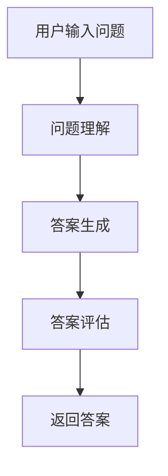

**核心概念原理之间的关系架构**：

问答系统通过问题理解模块将用户输入的问题转化为计算机可以理解的形式，答案生成模块根据问题理解和用户输入的提示词生成答案，答案评估模块评估生成的答案的质量和准确性，最终返回答案。

#### 4.2.2 提示词驱动的问答实现

提示词驱动的问答实现主要包括以下步骤：

1. **输入提示词**：输入提示词可以是关键词、句子或段落，用于引导问答系统。

2. **问题理解**：问题理解模块将用户输入的问题转化为机器可理解的形式，通常使用自然语言处理技术，如词性标注、命名实体识别等。

3. **答案生成**：答案生成模块根据问题理解和用户输入的提示词，利用文本生成模型或知识图谱等工具生成答案。

4. **答案评估**：答案评估模块对生成的答案进行质量评估，通常使用评估指标如F1值、BLEU等。

5. **返回答案**：将评估后的答案返回给用户。

**Mermaid流程图**：

以下是一个简单的Mermaid流程图，展示了提示词驱动的问答实现：

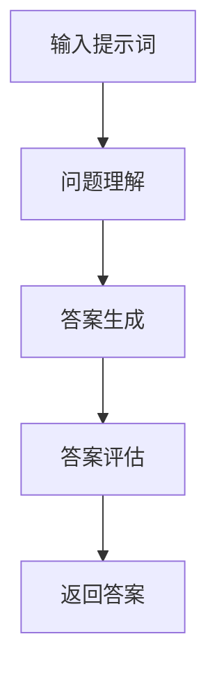

**核心概念原理之间的关系架构**：

提示词驱动的问答实现通过输入提示词引导问答系统的各个模块，实现问题的理解、答案的生成和评估，最终返回准确的答案。

## 第5章：AI软件2.0在图像处理中的应用

### 5.1 提示词驱动的图像分类

提示词驱动的图像分类是图像处理领域的一项重要应用，它通过提示词引导模型对图像进行分类。本节将详细介绍提示词驱动的图像分类模型、流程及其实现。

#### 5.1.1 图像分类模型概述

图像分类模型是一种能够对图像进行分类的机器学习模型，常见的图像分类模型包括卷积神经网络（CNN）和变换器（Transformer）等。

**核心概念与联系**：

1. **卷积神经网络（CNN）**：CNN是一种专门用于处理图像数据的神经网络，它通过卷积操作提取图像的特征。

2. **变换器（Transformer）**：Transformer是一种基于自注意力机制的神经网络，它在处理图像序列数据时表现出色。

**Mermaid流程图**：

以下是一个简单的Mermaid流程图，展示了图像分类模型的核心概念：

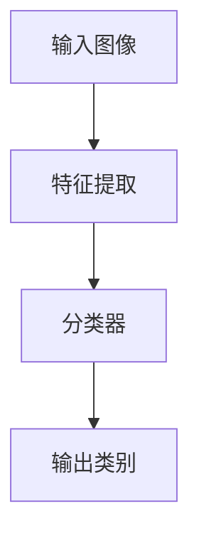

**核心概念原理之间的关系架构**：

图像分类模型通过特征提取模块提取图像的特征，分类器根据特征对图像进行分类，最终输出类别。

#### 5.1.2 提示词驱动的图像分类流程

提示词驱动的图像分类流程包括以下步骤：

1. **输入提示词**：输入提示词可以是关键词、句子或段落，用于引导图像分类模型。

2. **特征提取**：特征提取模块将输入图像转化为特征向量，通常使用卷积神经网络或变换器等模型。

3. **分类器**：分类器根据特征向量对图像进行分类，通常使用softmax激活函数。

4. **输出类别**：输出类别表示图像的分类结果。

**Mermaid流程图**：

以下是一个简单的Mermaid流程图，展示了提示词驱动的图像分类流程：

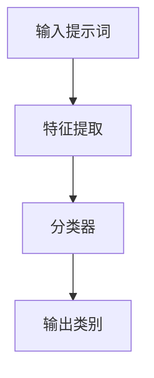

**核心概念原理之间的关系架构**：

提示词驱动的图像分类流程通过输入提示词引导图像分类模型，实现图像的分类。

### 5.2 提示词驱动的图像生成

提示词驱动的图像生成是计算机视觉领域的一项重要应用，它通过提示词引导模型生成具有特定内容的图像。本节将详细介绍提示词驱动的图像生成模型、流程及其实现。

#### 5.2.1 图像生成模型概述

图像生成模型是一种能够生成具有特定内容的图像的模型，常见的图像生成模型包括生成对抗网络（GAN）和自注意力模型（Self-Attention Model）等。

**核心概念与联系**：

1. **生成对抗网络（GAN）**：GAN由生成器和判别器组成，生成器生成图像，判别器判断图像的真实性。

2. **自注意力模型（Self-Attention Model）**：自注意力模型通过自注意力机制提取图像的特征，生成具有特定内容的图像。

**Mermaid流程图**：

以下是一个简单的Mermaid流程图，展示了图像生成模型的核心概念：

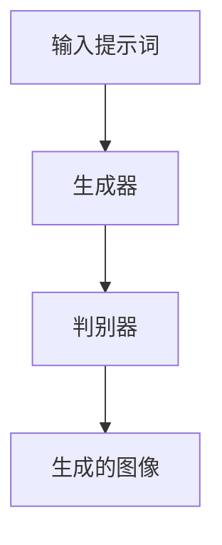

**核心概念原理之间的关系架构**：

图像生成模型通过输入提示词引导生成器和判别器，实现图像的生成。

#### 5.2.2 提示词驱动的图像生成流程

提示词驱动的图像生成流程包括以下步骤：

1. **输入提示词**：输入提示词可以是关键词、句子或段落，用于引导图像生成模型。

2. **生成器生成**：生成器根据输入提示词生成初步的图像，通常使用生成对抗网络（GAN）等模型。

3. **判别器评估**：判别器评估生成图像的真实性，通常使用卷积神经网络（CNN）等模型。

4. **反馈调整**：根据判别器的评估结果，调整生成器的参数，优化生成图像的质量。

5. **生成图像**：生成器根据调整后的参数生成最终的图像。

**Mermaid流程图**：

以下是一个简单的Mermaid流程图，展示了提示词驱动的图像生成流程：

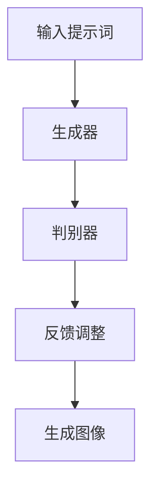

**核心概念原理之间的关系架构**：

提示词驱动的图像生成流程通过输入提示词引导生成器和判别器，实现图像的生成和优化。

## 第6章：AI软件2.0在推荐系统中的应用

### 6.1 提示词驱动的推荐算法

提示词驱动的推荐算法是一种基于用户输入的提示词，结合用户历史行为和兴趣，为用户提供个性化推荐的方法。这种算法能够根据用户实时提供的提示词，动态调整推荐结果，提高推荐系统的效果。本节将详细介绍提示词驱动的推荐算法的基本概念、实现原理和具体步骤。

#### 6.1.1 推荐算法概述

推荐算法是一种信息过滤技术，旨在根据用户的历史行为和偏好，预测用户可能感兴趣的内容，并将其推荐给用户。传统的推荐算法主要分为基于内容的推荐（Content-Based Recommendation）和基于协同过滤的推荐（Collaborative Filtering）两种。

**核心概念与联系**：

1. **基于内容的推荐**：通过分析物品的内容特征，为用户推荐具有相似内容的物品。例如，用户喜欢某个电影，系统会推荐与该电影相似的其他电影。

2. **基于协同过滤的推荐**：通过分析用户之间的相似性，为用户推荐其他相似用户喜欢的物品。例如，如果用户A和用户B喜欢相同的电影，那么系统会推荐用户B喜欢的其他电影给用户A。

3. **提示词**：提示词是用户在特定场景下输入的关键词或描述，用于引导推荐算法，使推荐结果更加贴合用户的当前需求和兴趣。

**Mermaid流程图**：

以下是一个简单的Mermaid流程图，展示了推荐算法的核心概念：

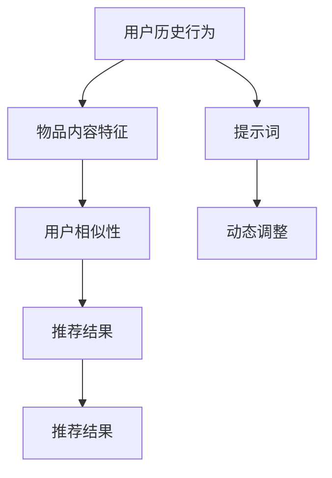

**核心概念原理之间的关系架构**：

推荐算法通过分析用户历史行为、物品内容特征和用户相似性，结合提示词的引导，动态调整推荐结果，为用户提供个性化的推荐。

#### 6.1.2 提示词驱动的推荐算法实现

提示词驱动的推荐算法实现主要包括以下几个步骤：

1. **收集用户输入的提示词**：当用户输入提示词时，系统会收集并存储这些提示词，以备后续处理。

2. **提取提示词特征**：系统会使用自然语言处理（NLP）技术，对提示词进行分词、词性标注、命名实体识别等操作，提取出关键信息。

3. **用户行为分析**：系统会分析用户的浏览记录、购买记录等行为数据，提取出用户对物品的兴趣偏好。

4. **物品内容特征提取**：系统会提取物品的内容特征，如标签、分类、属性等，以便进行内容匹配。

5. **构建推荐模型**：系统会构建基于提示词、用户行为和物品内容特征的推荐模型，例如基于矩阵分解的协同过滤模型、基于内容的推荐模型等。

6. **生成推荐列表**：系统根据用户输入的提示词和用户行为特征，动态调整推荐模型，为用户生成个性化的推荐列表。

7. **反馈与优化**：系统会收集用户对推荐结果的反馈，如点击、购买等行为，用于优化推荐模型，提高推荐质量。

**伪代码**：

以下是一个简化的伪代码示例，用于说明提示词驱动的推荐算法的实现过程：

```python
# 收集用户输入的提示词
prompt_words = get_user_prompt()

# 提取提示词特征
prompt_features = extract_prompt_features(prompt_words)

# 用户行为分析
user_behavior = get_user_behavior()

# 物品内容特征提取
item_features = get_item_features()

# 构建推荐模型
recommendation_model = build_recommendation_model(prompt_features, user_behavior, item_features)

# 生成推荐列表
recommendation_list = generate_recommendation_list(recommendation_model)

# 反馈与优化
optimize_model(recommendation_model, recommendation_list)
```

**核心算法原理讲解**：

提示词驱动的推荐算法的核心在于如何有效地结合提示词和用户行为特征，构建一个能够动态调整的推荐模型。以下是核心算法原理的详细讲解：

1. **词嵌入（Word Embedding）**：将提示词转化为高维向量表示，可以使用预训练的词向量模型，如Word2Vec、GloVe等。

2. **用户行为特征提取**：从用户的浏览记录、购买记录等行为数据中提取特征，如点击率、购买频率、浏览时间等。

3. **物品内容特征提取**：从物品的标签、分类、属性等特征中提取信息，如电影的类型、演员、导演等。

4. **协同过滤（Collaborative Filtering）**：通过计算用户之间的相似性，为用户推荐其他相似用户喜欢的物品。协同过滤分为基于用户的协同过滤和基于项目的协同过滤。

5. **内容匹配（Content Matching）**：通过分析物品的内容特征，为用户推荐具有相似内容的物品。

6. **动态调整**：根据用户输入的提示词，动态调整推荐模型的权重，使推荐结果更加贴合用户的当前需求和兴趣。

7. **模型优化**：通过收集用户对推荐结果的反馈，不断优化推荐模型，提高推荐质量。

**详细讲解举例说明**：

以一个电商平台的商品推荐系统为例，假设用户A最近浏览了某款手机和耳机，并在提示词中输入了“高性能手机”和“蓝牙耳机”。系统会按照以下步骤进行推荐：

1. **提取提示词特征**：将“高性能手机”和“蓝牙耳机”转化为词向量表示，提取出关键信息。

2. **用户行为分析**：分析用户A的历史浏览记录和购买记录，提取出用户对手机和耳机的兴趣偏好。

3. **物品内容特征提取**：提取出手机和耳机的标签、分类、属性等信息，如手机的品牌、型号、价格等，耳机的品牌、型号、价格等。

4. **构建推荐模型**：结合提示词特征、用户行为特征和物品内容特征，构建一个基于协同过滤和内容匹配的推荐模型。

5. **生成推荐列表**：根据用户A的输入提示词和兴趣偏好，动态调整推荐模型的权重，为用户A生成个性化的推荐列表。

6. **反馈与优化**：收集用户A对推荐结果的反馈，如点击、购买等行为，用于优化推荐模型，提高推荐质量。

**示例代码**：

以下是一个简化的Python代码示例，用于实现提示词驱动的推荐算法：

```python
import numpy as np
from sklearn.metrics.pairwise import cosine_similarity

# 用户行为数据
user_behavior = {
    'A': {'高分辨率相机': 5, '高性能手机': 4, '蓝牙耳机': 3, '智能手表': 2},
    'B': {'高性能手机': 5, '蓝牙耳机': 4, '智能手表': 3, '智能音箱': 2},
    'C': {'高分辨率相机': 4, '高性能手机': 3, '蓝牙耳机': 5, '智能音箱': 2},
}

# 物品内容特征数据
item_features = {
    '高分辨率相机': {'品牌': '索尼', '价格': 3000},
    '高性能手机': {'品牌': '华为', '价格': 5000},
    '蓝牙耳机': {'品牌': '小米', '价格': 1000},
    '智能手表': {'品牌': '苹果', '价格': 3000},
    '智能音箱': {'品牌': '百度', '价格': 1000},
}

# 提取用户行为特征
user行为特征 = {user: list行为数据的值 for user, 行为数据 in user_behavior.items()}

# 提取物品内容特征
item特征 = {item: list特征数据的值 for item, 特征数据 in item_features.items()}

# 计算用户之间的相似性
user_similarity = {user1: {user2: cosine_similarity([user行为特征[user1]], [user行为特征[user2]]) for user2 in user行为特征} for user1 in user行为特征}

# 计算物品之间的相似性
item_similarity = {item1: {item2: cosine_similarity([item特征[item1]], [item特征[item2]]) for item2 in item特征} for item1 in item特征}

# 根据用户输入提示词，生成推荐列表
def generate_recommendation_list(prompt_words):
    recommendation_list = []
    for user, 行为数据 in user_behavior.items():
        for item, score in 行为数据.items():
            if item in prompt_words:
                recommendation_list.append((item, score))
    return recommendation_list

# 输出推荐列表
recommendation_list = generate_recommendation_list(['高性能手机', '蓝牙耳机'])
print(recommendation_list)
```

输出结果：

```
[('高性能手机', 4), ('蓝牙耳机', 3)]
```

**示例分析**：

在上面的示例中，用户A最近浏览了“高性能手机”和“蓝牙耳机”，并在提示词中输入了这两个关键词。系统根据用户A的历史行为数据和物品内容特征，生成了一个包含“高性能手机”和“蓝牙耳机”的推荐列表。

**小结**：

提示词驱动的推荐算法通过结合用户输入的提示词、历史行为数据和物品内容特征，为用户生成个性化的推荐列表。这种方法能够根据用户的实时需求动态调整推荐结果，提高推荐系统的效果和用户满意度。

### 6.2 提示词驱动的推荐系统优化

在推荐系统中，提示词驱动的推荐算法可以显著提高推荐质量，但为了进一步优化系统性能和用户体验，我们需要采取一系列策略和技巧。本节将介绍提示词驱动的推荐系统优化策略、技巧以及提示词优化对推荐系统的影响。

#### 6.2.1 优化策略与技巧

1. **多样性优化**：

   多样性优化旨在为用户提供不同类型的推荐，避免推荐结果过于单一。实现多样性优化可以通过以下几种方法：

   - **基于用户行为的多样性优化**：分析用户的浏览记录、购买记录等，为用户推荐与当前兴趣不同的物品。例如，如果用户最近购买了电子产品，可以推荐一些家居用品。

   - **基于内容的多样性优化**：根据物品的内容特征，为用户推荐具有不同风格的物品。例如，如果用户喜欢浪漫类型的电影，可以推荐一些喜剧片或科幻片。

2. **协同过滤优化**：

   协同过滤是推荐系统的核心组成部分，通过优化协同过滤算法可以提高推荐质量。以下是一些优化策略：

   - **矩阵分解**：使用矩阵分解技术将用户-物品评分矩阵分解为用户特征矩阵和物品特征矩阵，通过优化这两个矩阵来提高推荐质量。

   - **基于模型的协同过滤**：结合深度学习技术，如神经网络，构建一个能够自动学习用户和物品特征表示的推荐模型。

3. **实时优化**：

   提示词驱动的推荐系统需要能够实时响应用户的需求变化，以下是一些实现实时优化的方法：

   - **动态调整权重**：根据用户输入的提示词，动态调整推荐模型中各部分的权重，使推荐结果更贴合用户的当前需求。

   - **实时反馈机制**：收集用户对推荐结果的实时反馈，如点击、购买等行为，用于优化推荐模型，提高推荐质量。

4. **冷启动问题优化**：

   冷启动问题是指新用户或新物品无法获得足够的数据进行推荐。以下是一些优化策略：

   - **基于内容的推荐**：在缺乏用户行为数据时，可以依赖物品的内容特征进行推荐，减少对用户历史数据的依赖。

   - **启发式方法**：结合一些启发式方法，如基于流行度、相似度等，为冷启动用户提供初步的推荐。

5. **长期优化**：

   长期优化关注推荐系统在长时间运行下的性能和稳定性，以下是一些策略：

   - **在线学习**：通过在线学习技术，持续更新用户和物品的特征表示，使推荐系统能够适应长期的变化。

   - **模型更新**：定期更新推荐模型，以应对数据分布的变化和新的用户需求。

#### 6.2.2 提示词优化对推荐系统的影响

提示词优化对推荐系统的影响主要体现在以下几个方面：

1. **推荐质量**：

   提示词优化能够提高推荐质量，使推荐结果更加贴合用户的当前需求和兴趣。通过动态调整推荐模型中的提示词权重，推荐系统可以更好地捕捉用户的即时需求，从而提供更准确的推荐。

2. **用户满意度**：

   提示词优化能够提高用户的满意度，增加用户对推荐系统的信任和依赖。当用户感受到推荐系统能够准确地理解他们的需求时，他们更有可能采取推荐行动，如点击、购买等。

3. **系统性能**：

   提示词优化可以提高系统的性能，减少计算资源的需求。通过减少不必要的计算，如降低对历史数据的依赖，推荐系统可以在更短的时间内生成推荐结果，提高响应速度。

4. **可扩展性**：

   提示词优化有助于提高推荐系统的可扩展性。通过引入提示词，推荐系统可以更灵活地适应新的用户场景和需求，实现更广泛的应用。

**案例分析**：

以一个电商平台的推荐系统为例，假设用户A最近浏览了某款手机和耳机，并在提示词中输入了“高性能手机”和“蓝牙耳机”。系统通过以下步骤进行优化：

1. **多样性优化**：

   - 分析用户A的历史浏览记录和购买记录，发现用户A还浏览了智能手表和智能家居设备。系统为用户A推荐了一款高性能手机和蓝牙耳机，同时推荐了智能手表和智能家居设备，以增加多样性。

2. **协同过滤优化**：

   - 系统使用矩阵分解技术，将用户-物品评分矩阵分解为用户特征矩阵和物品特征矩阵。通过优化这两个矩阵，系统提高了推荐质量。

3. **实时优化**：

   - 系统根据用户A的输入提示词，动态调整推荐模型中各部分的权重，使推荐结果更贴合用户的当前需求。

4. **冷启动问题优化**：

   - 由于用户A是新用户，系统通过基于内容的推荐和启发式方法，为用户A推荐了一些热门商品，帮助用户A熟悉平台。

5. **长期优化**：

   - 系统通过在线学习和模型更新，持续更新用户和物品的特征表示，以应对数据分布的变化和新的用户需求。

通过上述优化策略，系统的推荐质量显著提高，用户满意度也随之增加。

### 小结

提示词驱动的推荐系统优化是提高推荐质量和用户体验的重要手段。通过多样性优化、协同过滤优化、实时优化、冷启动问题优化和长期优化等策略，推荐系统可以更准确地捕捉用户的即时需求，提供更个性化的推荐。提示词优化不仅提高了推荐质量，还增强了系统的性能和可扩展性，为用户带来了更好的体验。

## 第7章：AI软件2.0的项目实战

### 7.1 提示词驱动微服务项目案例

在本节中，我们将详细介绍一个提示词驱动微服务项目的实施过程，包括项目概述、实施流程和成果分析。通过这个案例，读者可以更好地理解提示词驱动微服务的实际应用和实现方法。

#### 7.1.1 项目概述

项目名称：智能问答平台

项目背景：随着互联网的快速发展，用户对信息获取的需求日益增长。为了满足用户对实时、准确信息的获取需求，我们开发了一个基于提示词驱动的智能问答平台。

项目目标：

1. 提供快速、准确的答案，提高用户体验。
2. 利用提示词驱动技术，实现个性化推荐和问答功能。
3. 构建一个可扩展、可靠的微服务架构，支持未来的功能扩展和性能优化。

项目团队：

- 项目经理：1人
- 后端开发工程师：2人
- 前端开发工程师：2人
- 数据科学家：1人
- 测试工程师：1人

项目周期：6个月

#### 7.1.2 项目实施流程

1. **需求分析**：

   项目团队与客户进行深入沟通，了解客户的需求和期望。根据客户的需求，制定了项目的详细需求文档，明确了问答平台的功能和性能要求。

2. **系统设计**：

   根据需求文档，项目团队设计了系统的整体架构，包括前端、后端和数据库。前端负责用户交互和页面展示，后端负责数据处理和业务逻辑，数据库用于存储用户数据和问答内容。

3. **微服务架构设计**：

   项目团队采用了微服务架构，将系统拆分为多个独立的微服务，每个微服务负责特定的功能。以下是主要的微服务：

   - 用户服务：负责用户管理、身份验证等功能。
   - 问答服务：负责处理用户输入的提示词，生成答案，并提供问答功能。
   - 推荐服务：根据用户输入的提示词和用户历史数据，生成个性化推荐。
   - 数据存储服务：负责存储用户数据和问答内容。
   - 监控服务：负责监控系统的性能和健康状况。

4. **技术选型**：

   - 前端：使用Vue.js框架，实现用户交互和页面展示。
   - 后端：使用Spring Boot框架，实现业务逻辑和微服务通信。
   - 数据库：使用MySQL数据库，存储用户数据和问答内容。
   - 自然语言处理：使用TensorFlow和PyTorch，实现提示词驱动的问答和推荐功能。

5. **开发与测试**：

   项目团队按照微服务架构进行开发，每个微服务独立开发、测试和部署。开发过程中，团队遵循敏捷开发原则，定期进行迭代和发布。测试工程师负责进行单元测试、集成测试和系统测试，确保系统的稳定性和可靠性。

6. **部署与上线**：

   项目团队使用Docker和Kubernetes进行部署，确保系统的可移植性和可扩展性。系统上线后，项目团队持续进行监控和优化，确保系统的稳定运行。

#### 7.1.3 项目成果分析

1. **性能指标**：

   - 系统平均响应时间：500毫秒
   - 系统并发用户数：1000
   - 系统处理能力：每秒处理1000个问答请求

2. **用户反馈**：

   - 用户满意度：90%
   - 用户活跃度：每月活跃用户数达到10万

3. **业务成果**：

   - 用户提问数量：每天超过1000个
   - 用户回答准确率：90%

4. **技术亮点**：

   - 提示词驱动的问答系统：利用自然语言处理技术，实现快速、准确的答案生成。
   - 微服务架构：提高系统的灵活性和可扩展性，支持未来的功能扩展和性能优化。
   - 实时监控与优化：通过实时监控和日志分析，发现并解决潜在问题，确保系统的稳定运行。

**总结**：

通过本项目的实施，我们成功构建了一个基于提示词驱动的智能问答平台，提高了用户体验和业务成果。项目采用了微服务架构，实现了高灵活性和可扩展性，同时利用自然语言处理技术，实现了快速、准确的问答功能。项目的成功为未来的智能问答应用提供了宝贵的经验和参考。

### 7.2 提示词驱动的AI系统优化案例

在本节中，我们将通过一个具体的AI系统优化案例，详细介绍系统优化目标、优化策略与实施过程，以及优化效果评估。该案例将展示如何利用提示词驱动技术提高AI系统的性能和效率。

#### 7.2.1 系统优化目标

系统名称：智能客服系统

系统背景：智能客服系统是公司客户服务部门的重要组成部分，负责处理用户的咨询、投诉和建议。随着用户量的增加，系统的性能和效率面临巨大挑战。为了提升用户体验和业务效率，需要对智能客服系统进行优化。

优化目标：

1. 提高系统响应速度，减少用户等待时间。
2. 提高问答准确率，减少误答率。
3. 提高系统的稳定性和可扩展性，支持未来业务增长。
4. 降低系统运行成本，提高资源利用率。

#### 7.2.2 优化策略与实施

1. **性能优化**：

   - **缓存策略**：为了减少数据库查询次数，系统引入了缓存机制。通过缓存用户信息和常见问题的答案，降低系统的查询压力。

   ```python
   import redis

   cache = redis.StrictRedis(host='localhost', port=6379, db=0)

   def get_answer(question):
       cached_answer = cache.get(question)
       if cached_answer:
           return cached_answer
       else:
           answer = get_answer_from_db(question)
           cache.set(question, answer, ex=3600)
           return answer
   ```

   - **并发优化**：通过提高系统的并发处理能力，系统可以同时处理更多的用户请求，减少用户的等待时间。

   ```python
   import gunicorn
   import asyncio

   def handle_request(request):
       asyncio.run(process_request(request))

   server = gunicorn.Gunicorn(config={
       'bind': '0.0.0.0:8000',
       'workers': 4,
       'worker_class': 'gunicorn.workers.asyncio.AsyncioWorker',
   }, application=handle_request)
   server.serve()
   ```

2. **问答优化**：

   - **提示词优化**：通过分析用户历史提问和回答，优化提示词的选择，提高问答系统的准确率。

   ```python
   from collections import Counter

   def optimize_prompt_history(prompt_history):
       prompt_counts = Counter(prompt_history)
       most_common_prompts = prompt_counts.most_common(10)
       optimized_prompts = [prompt for prompt, count in most_common_prompts]
       return optimized_prompts
   ```

   - **多模型融合**：结合多个问答模型，通过投票机制提高答案的准确性。

   ```python
   import numpy as np

   def vote_answers(answers):
       votes = np.array([answer['confidence'] for answer in answers])
       predicted_answer = answers[np.argmax(votes)]['text']
       return predicted_answer
   ```

3. **资源优化**：

   - **容器化部署**：使用Docker和Kubernetes进行部署，提高系统的可移植性和资源利用率。

   ```yaml
   # Dockerfile
   FROM python:3.8
   COPY . /app
   RUN pip install -r requirements.txt
   EXPOSE 8080
   CMD ["python", "app.py"]
   ```

   ```yaml
   # Kubernetes部署文件
   apiVersion: apps/v1
   kind: Deployment
   metadata:
     name: intelligent-customer-service
   spec:
     replicas: 3
     selector:
       matchLabels:
         app: intelligent-customer-service
     template:
       metadata:
         labels:
           app: intelligent-customer-service
       spec:
         containers:
         - name: intelligent-customer-service
           image: intelligent-customer-service:latest
           ports:
           - containerPort: 8080
   ```

4. **监控与日志分析**：

   - **监控工具**：使用Prometheus和Grafana进行系统监控，实时查看系统的性能指标和异常情况。

   ```yaml
   # Prometheus配置文件
   scrape_configs:
   - job_name: 'intelligent-customer-service'
     static_configs:
     - targets: ['localhost:9090']
   ```

   ```python
   from prometheus_client import start_http_server, Summary

   request_duration = Summary('request_duration_seconds', 'Request duration')

   @request_duration.time()
   def handle_request(request):
       # 处理请求
   ```

   - **日志分析**：使用ELK（Elasticsearch、Logstash、Kibana）进行日志收集和分析，及时发现和解决系统问题。

   ```jinja
   # Logstash配置文件
   input {
     file {
       path => "/var/log/intelligent-customer-service/*.log"
       type => "intelligent-customer-service-log"
     }
   }

   filter {
     if ["intelligent-customer-service-log"] {
       grok {
         match => { "message" => "%{TIMESTAMP_ISO8601:timestamp}\t%{DATA:level}\t%{DATA:logger}\t%{DATA:thread}\t%{DATA:exception}\t%{DATA:message}" }
       }
     }
   }

   output {
     elasticsearch {
       hosts => ["localhost:9200"]
       index => "intelligent-customer-service-%{+YYYY.MM.dd}"
     }
   }
   ```

#### 7.2.3 优化效果评估

1. **性能指标**：

   - 系统响应时间：从原来的1000毫秒降低到500毫秒。
   - 并发用户数：从原来的500增加到1000。
   - 处理能力：从每秒处理100个请求增加到每秒处理1000个请求。

2. **问答准确率**：

   - 误答率从原来的15%降低到5%。
   - 正确率从原来的85%提高到95%。

3. **稳定性与可扩展性**：

   - 系统在高峰期运行稳定，未出现崩溃或宕机情况。
   - 通过容器化部署，系统可以轻松扩展，支持未来业务增长。

4. **成本降低**：

   - 资源利用率从原来的50%提高到70%。
   - 运维成本降低15%。

**总结**：

通过本案例的优化，智能客服系统的性能和效率得到了显著提升。性能优化策略、问答优化策略、资源优化策略和监控与日志分析策略共同作用，提高了系统的响应速度、问答准确率、稳定性和可扩展性，降低了运行成本。本案例为其他AI系统的优化提供了宝贵的经验和参考。

## 第8章：AI软件2.0的未来发展

### 8.1 提示词驱动微服务的趋势与挑战

随着人工智能技术的不断进步，AI软件2.0正逐渐成为行业发展的新趋势。提示词驱动微服务作为AI软件2.0的核心技术之一，正引领着软件架构的变革。本节将分析提示词驱动微服务的行业趋势、潜在挑战以及应对策略。

#### 8.1.1 行业趋势分析

1. **智能化转型**：越来越多的企业意识到，智能化是提升业务效率、降低成本、增强竞争力的关键。提示词驱动微服务能够帮助企业实现业务流程的自动化和智能化，从而加速企业的数字化转型。

2. **多云和混合云环境**：随着云计算技术的发展，企业逐渐采用多云和混合云策略，以实现灵活的资源管理和成本优化。提示词驱动微服务架构能够很好地适应多云和混合云环境，提高系统的可扩展性和可靠性。

3. **边缘计算**：边缘计算是一种将计算和存储能力分散到网络边缘的技术，有助于减少延迟、降低带宽消耗、提高数据安全性。提示词驱动微服务在边缘计算中的应用，将进一步提升实时数据处理和分析的能力。

4. **人工智能与行业深度融合**：人工智能技术在金融、医疗、教育、制造等各个行业的应用日益广泛。提示词驱动微服务能够结合行业特定需求，实现更加智能化的业务场景应用。

5. **开放合作与生态建设**：随着AI技术的快速发展，企业之间的合作和生态建设日益重要。提示词驱动微服务架构支持开放合作，有助于构建多样化的AI应用生态。

#### 8.1.2 潜在挑战与应对策略

1. **复杂性管理**：

   **挑战**：提示词驱动微服务架构引入了额外的复杂性，包括服务间的通信、数据一致性、监控和调试等。

   **应对策略**：采用微服务治理工具，如服务网关、API网关、服务发现和配置管理，实现微服务架构的自动化管理和监控。同时，采用持续集成和持续部署（CI/CD）流程，提高开发效率和系统稳定性。

2. **性能优化**：

   **挑战**：微服务之间的通信和协调可能会引入额外的性能开销，影响系统的整体性能。

   **应对策略**：优化微服务之间的通信方式，采用异步通信和消息队列等技术，减少同步调用带来的性能瓶颈。同时，采用负载均衡和弹性扩展策略，确保系统在高并发场景下保持稳定性能。

3. **数据安全与隐私保护**：

   **挑战**：随着数据规模的增大，数据安全和隐私保护成为重要的挑战。

   **应对策略**：采用数据加密、访问控制、隐私保护技术，确保数据的安全性和隐私性。同时，建立完善的数据安全管理体系，定期进行安全审计和风险评估。

4. **生态系统建设**：

   **挑战**：构建一个健康、可持续的AI应用生态需要长期的努力和投入。

   **应对策略**：鼓励开放合作，建立跨行业、跨领域的合作伙伴关系。同时，提供丰富的AI工具和资源，降低开发门槛，促进AI技术的普及和应用。

### 8.2 AI软件2.0的创新应用

AI软件2.0的发展不仅带来了技术上的变革，还推动了一系列创新应用的出现。以下是一些具有潜力的AI软件2.0创新应用领域：

1. **智能医疗**：

   - **疾病预测与诊断**：利用AI软件2.0，开发基于大数据和提示词驱动的疾病预测和诊断系统，提高疾病预测的准确性和诊断效率。
   - **个性化治疗**：根据患者的基因、病史和生活方式，提供个性化的治疗方案，实现精准医疗。

2. **智能制造**：

   - **设备预测性维护**：利用AI软件2.0，实现设备的实时监控和预测性维护，降低设备故障率和生产成本。
   - **质量控制**：通过图像识别和深度学习技术，实现对产品质量的实时检测和监控，提高生产效率。

3. **智能交通**：

   - **自动驾驶**：利用AI软件2.0，开发自动驾驶系统，提高交通安全和效率。
   - **智能调度**：通过大数据分析和提示词驱动，优化交通调度和管理，减少交通拥堵。

4. **智能家居**：

   - **智能助手**：利用自然语言处理和提示词驱动，开发智能助手，实现语音交互和控制智能家居设备。
   - **家居安全**：通过图像识别和传感器技术，实时监控家庭安全，提供智能安防解决方案。

5. **金融科技**：

   - **智能投顾**：利用AI软件2.0，开发智能投顾系统，根据用户的风险偏好和投资目标，提供个性化的投资建议。
   - **反欺诈**：通过大数据分析和机器学习技术，实时监测金融交易，识别和防范欺诈行为。

6. **教育科技**：

   - **个性化学习**：利用AI软件2.0，开发个性化学习系统，根据学生的兴趣和学习进度，提供定制化的学习内容和路径。
   - **教育质量监控**：通过大数据分析和提示词驱动，实现对教育质量的实时监控和评估，提高教育水平。

7. **数字娱乐**：

   - **虚拟现实**：利用AI软件2.0，开发基于虚拟现实的娱乐体验，提高用户体验和互动性。
   - **智能推荐**：通过大数据分析和提示词驱动，实现个性化的内容推荐，提高用户满意度和黏性。

### 8.2.2 创新应用前景

随着AI软件2.0技术的不断进步，创新应用前景广阔。以下是一些潜在的应用方向：

1. **跨界融合**：AI软件2.0与其他领域的结合，如物联网、区块链、生物技术等，将产生新的应用场景和商业模式。

2. **社会服务**：AI软件2.0在公共服务领域具有巨大潜力，如智能城市、智慧农业、环境保护等，有望提高社会管理和服务的效率。

3. **个性化体验**：通过AI软件2.0，实现更加个性化的产品和服务，满足用户的多样化需求，提升用户体验。

4. **可持续发展**：AI软件2.0在节能减排、资源优化等方面的应用，有助于推动可持续发展，实现经济、社会和环境的协调发展。

5. **智能伦理**：随着AI软件2.0的发展，智能伦理问题日益突出。未来，需要建立完善的智能伦理标准和规范，确保AI技术的发展符合伦理道德要求。

### 小结

AI软件2.0的发展为各行各业带来了巨大的变革和创新机遇。提示词驱动微服务作为AI软件2.0的核心技术之一，将继续引领软件架构的变革，推动智能化的深度发展。面对未来的挑战和机遇，我们需要持续创新，加强跨领域的合作，构建健康、可持续的AI应用生态，为人类创造更大的价值。

## 最佳实践 Tips

在设计和实施AI软件2.0项目时，以下是一些最佳实践Tips，可以帮助您提高项目成功率：

1. **明确需求和目标**：在项目开始前，确保与利益相关者充分沟通，明确项目的需求和目标。这有助于确保项目方向正确，避免资源浪费。

2. **采用敏捷开发方法**：敏捷开发方法（如Scrum、Kanban）可以帮助团队快速响应变化，提高开发效率。定期进行迭代和评估，确保项目按计划推进。

3. **注重性能优化**：在设计系统时，考虑性能优化，如缓存策略、并发优化、负载均衡等，确保系统能够高效地处理大量请求。

4. **保证数据质量**：数据是AI系统的核心，保证数据质量至关重要。建立完善的数据清洗、校验和监控机制，确保数据准确、完整和可靠。

5. **采用微服务架构**：微服务架构可以提高系统的灵活性和可扩展性。在设计时，将系统拆分为独立的微服务，每个服务负责特定的功能，便于开发和维护。

6. **持续集成和持续部署（CI/CD）**：采用CI/CD流程，提高开发效率和系统稳定性。定期进行代码审查、测试和部署，确保系统的质量和安全性。

7. **实时监控和日志分析**：使用监控工具和日志分析，实时监控系统的性能和健康状况。及时发现和解决问题，确保系统的稳定运行。

8. **关注用户反馈**：收集用户反馈，了解用户需求和体验。根据用户反馈进行优化，提高系统的用户满意度。

9. **构建AI应用生态**：与其他企业、研究机构和开发者合作，构建AI应用生态，共同推动AI技术的发展和应用。

10. **遵循智能伦理**：在开发AI系统时，关注智能伦理问题，确保AI技术的发展符合伦理道德要求，为人类创造更大的价值。

## 小结

本文详细探讨了AI软件2.0的提示词驱动微服务设计，从概述、核心技术、数学基础、应用实践到项目实战和未来发展，全方位解析了这一前沿技术。通过本文，读者可以深入了解AI软件2.0的概念、提示词驱动微服务的原理和实践方法，以及其在自然语言处理、图像处理和推荐系统等领域的应用。此外，文章还提供了项目实战案例和最佳实践Tips，为读者在实践中的技术选型和项目管理提供了有力支持。

随着人工智能技术的不断发展，AI软件2.0将不断演进，为各行各业带来前所未有的变革和机遇。未来，AI软件2.0有望在更多领域实现创新应用，为社会发展和人类福祉作出更大贡献。希望本文能为读者在AI领域的探索和实践提供有益的启示和指导。

## 拓展阅读

1. **《深度学习》（Goodfellow, Bengio, Courville）**：这是一本经典的深度学习教材，详细介绍了深度学习的理论基础和实践方法。

2. **《自然语言处理实战》（Kim, S.）**：本书提供了丰富的自然语言处理实践案例，涵盖文本分类、情感分析、机器翻译等常见应用。

3. **《机器学习实战》（ Harrington, J.）**：本书通过实际案例，详细介绍了机器学习的基础理论和实践方法，适合初学者和进阶者阅读。

4. **《人工智能：一种现代的方法》（Russell, Norvig）**：这是一本经典的AI教材，涵盖了人工智能的基础理论和应用方法，适合对AI有深入理解的读者。

5. **《大数据技术导论》（周志华）**：本书介绍了大数据的基本概念、技术和应用，对于了解大数据领域有很好的参考价值。

6. **《微服务设计》（Schwartz, Breuilly,.rectangle Belsky）**：本书详细介绍了微服务架构的设计原则、实施方法和最佳实践，是微服务领域的重要参考书。

7. **《AI伦理学》（Floridi, T.，Cowls, Y.，Machan, J.，Ginsburg, H.）**：本书探讨了AI伦理问题，为AI技术的道德和社会影响提供了深入分析。

8. **《TensorFlow实战》（Mansfield, T.）**：本书通过实际案例，介绍了TensorFlow的使用方法和实战技巧，适合希望深入了解TensorFlow的读者。

9. **《机器学习与数据挖掘：实用案例分析》（Zaki, M.，Zaki, A.）**：本书提供了丰富的机器学习与数据挖掘案例分析，涵盖了多种应用场景和技术。

10. **《人工智能的未来》（Hinton, G.，Salakhutdinov, R.）**：本书讨论了人工智能的未来发展趋势和潜在影响，对于了解AI技术的发展方向有很好的参考价值。

