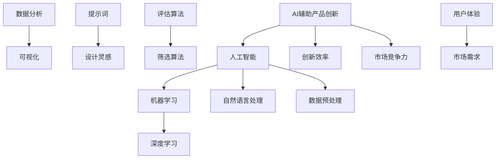

                 

### 文章标题：AI辅助产品创新：提示词激发设计灵感

> 关键词：AI、产品创新、提示词、设计灵感、自然语言处理、机器学习、深度学习、案例分析、应用实践、发展展望

> 摘要：
随着人工智能技术的快速发展，AI辅助产品创新逐渐成为推动产业升级和经济增长的重要力量。本文旨在探讨AI如何通过提示词激发设计灵感，详细分析AI辅助产品创新的核心技术、应用实践及发展趋势。文章首先概述了AI辅助产品创新的背景与概念，接着深入探讨AI基础理论与方法，以及AI辅助产品创新的核心算法，随后通过具体案例分析AI辅助产品创新的应用效果，并给出实践指南，最后对AI辅助产品创新的未来进行展望。

----------------------------------------------------------------

## 目录大纲

### 第一部分：AI辅助产品创新的背景与概念

#### 第1章：AI辅助产品创新的概述

- **1.1 AI技术的发展与产品创新**
  - **1.1.1 AI技术的发展趋势**
  - **1.1.2 AI如何促进产品创新**

- **1.2 AI辅助产品创新的定义与特点**
  - **1.2.1 AI辅助产品创新的定义**
  - **1.2.2 AI辅助产品创新的特点**

- **1.3 提示词在AI辅助产品创新中的应用**
  - **1.3.1 提示词的概念**
  - **1.3.2 提示词在AI系统中的作用**

- **1.4 AI辅助产品创新的挑战与机遇**
  - **1.4.1 面临的挑战**
  - **1.4.2 潜在的机遇**

### 第二部分：AI辅助产品创新的核心技术

#### 第2章：AI基础理论与方法

- **2.1 人工智能的基本概念**
  - **2.1.1 AI的定义与分类**
  - **2.1.2 AI的发展历史**

- **2.2 机器学习与深度学习**
  - **2.2.1 机器学习的基本方法**
  - **2.2.2 深度学习的关键技术**

- **2.3 自然语言处理**
  - **2.3.1 语言模型与文本分析**
  - **2.3.2 基于数据的语言生成**

- **2.4 数据分析与可视化**
  - **2.4.1 数据预处理方法**
  - **2.4.2 数据分析工具与技巧**

#### 第3章：AI辅助产品创新的核心算法

- **3.1 提示词生成算法**
  - **3.1.1 提示词生成的流程**
  - **3.1.2 提示词生成的算法**

- **3.2 设计灵感生成算法**
  - **3.2.1 设计灵感生成的流程**
  - **3.2.2 设计灵感生成的算法**

- **3.3 灵感评估与筛选算法**
  - **3.3.1 评估标准与方法**
  - **3.3.2 筛选算法的实现**

### 第三部分：AI辅助产品创新的应用实践

#### 第4章：AI辅助产品创新的案例分析

- **4.1 案例介绍**
  - **4.1.1 案例背景**
  - **4.1.2 案例目标**

- **4.2 系统设计与实现**
  - **4.2.1 系统架构设计**
  - **4.2.2 关键技术实现**

- **4.3 结果分析与评估**
  - **4.3.1 系统性能评估**
  - **4.3.2 案例效果分析**

#### 第5章：AI辅助产品创新的实践指南

- **5.1 创新项目策划与执行**
  - **5.1.1 项目策划步骤**
  - **5.1.2 项目执行方法**

- **5.2 数据收集与处理**
  - **5.2.1 数据源选择**
  - **5.2.2 数据处理流程**

- **5.3 提示词设计与优化**
  - **5.3.1 提示词设计原则**
  - **5.3.2 提示词优化策略**

#### 第6章：AI辅助产品创新的发展趋势与展望

- **6.1 AI辅助产品创新的技术趋势**
  - **6.1.1 最新技术动态**
  - **6.1.2 未来发展方向**

- **6.2 AI辅助产品创新的行业应用前景**
  - **6.2.1 各行业应用案例**
  - **6.2.2 行业发展趋势**

- **6.3 AI辅助产品创新的社会影响与伦理问题**
  - **6.3.1 社会效益**
  - **6.3.2 伦理挑战与对策**

### 第四部分：附录

#### 第7章：参考资料与进一步阅读

- **7.1 经典文献与论文**
  - **7.1.1 重要的研究论文**
  - **7.1.2 有影响力的书籍**

- **7.2 开源工具与资源**
  - **7.2.1 开源算法与框架**
  - **7.2.2 数据集与工具包**

- **7.3 网络资源与在线课程**
  - **7.3.1 在线学习平台**
  - **7.3.2 专业论坛与社区**

### 核心概念与联系

#### 图1：AI辅助产品创新的核心概念关联图

[此处插入Mermaid图表]

----------------------------------------------------------------

### 第一部分：AI辅助产品创新的背景与概念

#### 第1章：AI辅助产品创新的概述

随着全球科技竞争的加剧，产品创新成为企业提升竞争力的关键。人工智能（AI）作为引领科技变革的核心技术，其在产品创新中的应用越来越受到关注。AI辅助产品创新不仅能够提升创新效率，还能拓宽创新视野，为产品开发提供新的思路和方法。

### 1.1 AI技术的发展与产品创新

#### 1.1.1 AI技术的发展趋势

人工智能技术经历了数年的快速发展，从早期的符号推理和规则系统，发展到现在的基于大数据和深度学习的模型驱动方法。以下是一些关键趋势：

1. **大数据与云计算的结合**：大数据的积累和云计算的普及为AI算法提供了丰富的数据资源和强大的计算能力，使得AI系统可以处理更大规模的数据集，实现更精确的预测和决策。
2. **深度学习的突破**：深度学习技术在图像识别、语音识别和自然语言处理等领域取得了显著的进展，推动了AI技术的商业化应用。
3. **边缘计算的兴起**：随着物联网和5G技术的发展，边缘计算逐渐成为AI应用的新趋势，它可以将计算能力从云端迁移到设备端，实现实时响应和降低网络延迟。

#### 1.1.2 AI如何促进产品创新

AI在产品创新中的应用主要体现在以下几个方面：

1. **设计辅助**：AI可以帮助设计者快速生成大量设计方案，并通过评估算法筛选出最优的设计方案，从而提高设计效率和质量。
2. **需求分析**：通过分析用户反馈和行为数据，AI可以洞察用户需求，为产品改进和创新提供依据。
3. **市场预测**：AI可以通过对市场数据的分析和预测，帮助产品团队制定更精准的市场策略，降低市场风险。
4. **用户体验优化**：AI可以通过个性化推荐和智能交互，提升用户体验，增强用户黏性。

### 1.2 AI辅助产品创新的定义与特点

#### 1.2.1 AI辅助产品创新的定义

AI辅助产品创新是指利用人工智能技术，特别是机器学习和深度学习等算法，对产品设计、需求分析、市场预测和用户体验优化等环节进行辅助和优化，以提高产品创新效率和效果。

#### 1.2.2 AI辅助产品创新的特点

1. **数据驱动**：AI辅助产品创新依赖于大量数据的分析和挖掘，通过对数据的深入理解，发现潜在的需求和市场机会。
2. **智能化**：AI技术可以自动化执行复杂的分析和设计任务，减少人工干预，提高工作效率。
3. **灵活性**：AI系统可以根据不同的产品需求和市场环境，动态调整和创新，实现定制化的解决方案。
4. **协同性**：AI技术可以与其他工具和系统（如CAD、ERP等）进行集成，实现跨领域的信息共享和协同工作。

### 1.3 提示词在AI辅助产品创新中的应用

#### 1.3.1 提示词的概念

提示词（Prompt Word）是指用于引导AI系统生成输出或进行特定任务的输入词汇。在AI辅助产品创新中，提示词起到了关键的作用，它能够引导AI系统在特定方向上进行设计、分析和预测。

#### 1.3.2 提示词在AI系统中的作用

1. **引导生成**：通过提示词，AI系统能够明确生成目标，从而避免无目的的搜索和尝试，提高生成效率。
2. **优化结果**：适当的提示词可以引导AI系统生成更符合需求和创新方向的结果，提升设计方案的多样性和质量。
3. **交互控制**：提示词可以作为用户与AI系统的交互手段，通过调整提示词，用户可以动态调整AI系统的行为和输出结果。

### 1.4 AI辅助产品创新的挑战与机遇

#### 1.4.1 面临的挑战

1. **数据质量和多样性**：高质量的数据是AI辅助产品创新的基础，但数据质量和多样性的不足可能会限制AI系统的性能。
2. **算法复杂性和可解释性**：深度学习等算法虽然性能强大，但其复杂性和黑盒性质可能影响系统的可解释性和信任度。
3. **法律法规和伦理问题**：AI辅助产品创新涉及到隐私保护、数据安全和伦理问题，需要制定相应的法律法规和伦理准则。

#### 1.4.2 潜在的机遇

1. **技术突破**：随着AI技术的不断进步，AI辅助产品创新有望在算法效率、数据利用和用户体验等方面取得重大突破。
2. **产业融合**：AI技术与传统产业的融合将推动产业升级和转型，创造新的市场机会。
3. **创新能力提升**：AI辅助产品创新将帮助企业和设计者实现更快速、更高效的创新，提升整体创新能力。

在接下来的章节中，我们将进一步探讨AI辅助产品创新的核心技术，以及其实际应用和未来发展趋势。通过深入分析和案例研究，我们将更好地理解AI如何助力产品创新，为企业和设计师提供新的工具和方法。

### 第二部分：AI辅助产品创新的核心技术

#### 第2章：AI基础理论与方法

人工智能（AI）作为AI辅助产品创新的核心驱动力，其理论基础和算法方法对创新过程至关重要。本章将深入探讨AI的基础理论，包括人工智能的定义与分类，机器学习与深度学习的基本方法，自然语言处理的基本原理，以及数据分析和可视化技术。

#### 2.1 人工智能的基本概念

##### 2.1.1 AI的定义与分类

人工智能是指通过计算机模拟人类的智能行为，包括学习、推理、感知和解决问题等能力。AI可以分为两大类：**弱AI**和**强AI**。

1. **弱AI**：也称为**窄AI**，指在特定领域内表现出人类智能的计算机系统。例如，语音助手、图像识别系统等。
2. **强AI**：又称**通用AI**，指具有人类智能的所有方面，能够理解、学习、推理和解决问题。强AI目前还处于理论阶段，尚未实现。

##### 2.1.2 AI的发展历史

AI的概念起源于20世纪50年代，经历了多次起落。关键发展节点包括：

1. **符号主义时期**（1956-1974）：基于逻辑推理和符号表示的方法。
2. **感知时期**（1974-1980）：基于感知器和神经网络的方法。
3. **知识工程时期**（1980-1987）：通过知识库和专家系统实现智能。
4. **机器学习时期**（1987至今）：以统计学习方法和深度学习为代表。

#### 2.2 机器学习与深度学习

##### 2.2.1 机器学习的基本方法

机器学习是AI的核心分支，通过数据驱动的方法使计算机系统具备学习能力和预测能力。主要方法包括：

1. **监督学习**：通过训练数据集，学习输入和输出之间的映射关系。
2. **无监督学习**：从未标记的数据中学习模式和结构，如聚类和降维。
3. **半监督学习**：结合有标记和无标记数据，提高学习效果。

##### 2.2.2 深度学习的关键技术

深度学习是机器学习的一个子领域，通过构建多层神经网络，实现复杂特征提取和学习能力。关键技术包括：

1. **神经网络**：由大量简单神经元组成，通过前向传播和反向传播更新权重。
2. **卷积神经网络（CNN）**：适用于图像处理，通过卷积层提取图像特征。
3. **递归神经网络（RNN）**：适用于序列数据处理，通过递归结构捕捉时间序列特征。
4. **生成对抗网络（GAN）**：通过生成器和判别器的对抗训练，生成高质量的图像和文本。

#### 2.3 自然语言处理

##### 2.3.1 语言模型与文本分析

自然语言处理（NLP）是AI的重要应用领域，旨在使计算机理解和生成自然语言。关键概念包括：

1. **语言模型**：预测下一个单词或词组，用于文本生成和翻译。
2. **文本分析**：包括分词、词性标注、句法分析和语义分析，用于信息提取和情感分析。

##### 2.3.2 基于数据的语言生成

基于数据的语言生成技术，如序列到序列模型（Seq2Seq），能够生成高质量的文本。主要方法包括：

1. **循环神经网络（RNN）**：通过递归结构生成序列数据。
2. **长短期记忆网络（LSTM）**：改进RNN，解决长距离依赖问题。
3. **注意力机制**：通过关注关键信息，提高生成文本的质量。

#### 2.4 数据分析与可视化

##### 2.4.1 数据预处理方法

数据分析是AI辅助产品创新的重要环节，数据预处理是确保模型性能的关键。主要方法包括：

1. **数据清洗**：去除噪声数据和异常值。
2. **数据归一化**：将数据转换到统一尺度，便于模型训练。
3. **特征工程**：提取和构造有助于模型训练的特征。

##### 2.4.2 数据分析工具与技巧

数据分析工具和技巧包括：

1. **统计方法**：如回归分析、聚类分析和时间序列分析。
2. **机器学习方法**：如决策树、随机森林和支持向量机。
3. **可视化方法**：如散点图、热图和决策树可视化，帮助理解和解释数据。

#### 核心算法原理讲解

在本章节的最后，我们将对核心算法进行原理讲解，并提供伪代码说明。

##### 2.5 提示词生成算法

提示词生成算法是AI辅助产品创新的关键技术之一。以下是其基本原理和伪代码：

###### 原理

提示词生成算法主要通过以下步骤实现：

1. **数据预处理**：对原始文本数据进行清洗和预处理，提取关键信息。
2. **关键词提取**：使用自然语言处理技术，如TF-IDF、Word2Vec等方法，提取文本中的关键词。
3. **提示词生成**：基于关键词和预定义的模板，生成提示词。

###### 伪代码

```python
def generate_prompt_words(text_data, keyword_extractor, template):
    # 数据预处理
    preprocessed_data = preprocess_data(text_data)
    
    # 提取关键词
    keywords = keyword_extractor(preprocessed_data)
    
    # 提示词生成
    prompt_words = generate_from_template(keywords, template)
    
    return prompt_words
```

通过以上讲解，我们可以看到AI辅助产品创新的核心技术涵盖了多个方面，从基础理论到实际应用，每一项技术都在推动产品创新的进步。在接下来的章节中，我们将深入探讨这些技术的具体实现和应用。

### 第三部分：AI辅助产品创新的核心算法

#### 第3章：AI辅助产品创新的核心算法

在AI辅助产品创新中，核心算法是使系统能够有效地生成设计灵感并评估其价值的关键。本章将详细介绍AI辅助产品创新的核心算法，包括提示词生成算法、设计灵感生成算法以及灵感评估与筛选算法。

#### 3.1 提示词生成算法

提示词生成算法是AI辅助产品创新的起点，它决定了AI系统能否在正确的方向上生成有价值的设计灵感。以下是其基本原理和伪代码：

##### 原理

提示词生成算法主要分为以下几个步骤：

1. **数据预处理**：对原始文本数据进行清洗和预处理，包括去除停用词、标点符号和进行词干提取等。
2. **关键词提取**：利用自然语言处理技术，如TF-IDF、Word2Vec等，提取文本中的关键词。这些关键词反映了文本的核心内容，有助于生成有针对性的提示词。
3. **提示词生成**：基于提取的关键词，结合预定义的模板或策略，生成提示词。提示词的质量直接影响到后续设计灵感的质量和多样性。

##### 伪代码

```python
def generate_prompt_words(text_data, keyword_extractor, template_generator):
    # 数据预处理
    preprocessed_data = preprocess_text(text_data)
    
    # 提取关键词
    keywords = keyword_extractor(preprocessed_data)
    
    # 提示词生成
    prompt_words = template_generator(keywords)
    
    return prompt_words
```

在这个伪代码中，`preprocess_text`函数负责文本预处理，`keyword_extractor`函数用于提取关键词，而`template_generator`函数负责根据关键词生成提示词。

#### 3.2 设计灵感生成算法

设计灵感生成算法是AI辅助产品创新的核心，它通过分析提示词和数据，生成新颖的设计方案。以下是其基本原理和伪代码：

##### 原理

设计灵感生成算法主要包括以下几个步骤：

1. **数据集成**：将用户需求、市场数据和现有产品信息进行整合，形成一个全面的数据集。
2. **灵感生成**：利用机器学习或深度学习算法，如生成对抗网络（GAN）或变分自编码器（VAE），生成新的设计方案。这些算法可以从大量的数据中学习，生成满足特定需求的创新方案。
3. **灵感评估**：对生成的灵感进行评估，包括功能性评估、用户体验评估和市场适应性评估等，筛选出最优的设计方案。

##### 伪代码

```python
def generate_design_insights(data, design_generator, evaluator):
    # 数据集成
    integrated_data = integrate_data(data)
    
    # 设计灵感生成
    design_insights = design_generator(integrated_data)
    
    # 设计灵感评估
    evaluated_insights = evaluator(design_insights)
    
    # 筛选出最优设计
    best_designs = filter_best_insights(evaluated_insights)
    
    return best_designs
```

在这个伪代码中，`integrate_data`函数负责数据集成，`design_generator`函数用于生成设计灵感，而`evaluator`函数用于评估设计灵感。

#### 3.3 灵感评估与筛选算法

灵感评估与筛选算法是确保设计灵感质量和实用性的关键环节。以下是其基本原理和伪代码：

##### 原理

灵感评估与筛选算法主要包括以下几个步骤：

1. **设定评估标准**：根据产品目标和市场要求，设定评估标准和指标，如功能实现程度、用户体验满意度、市场适应性等。
2. **评估设计灵感**：对每个设计灵感进行评估，包括功能测试、用户测试和市场分析等。
3. **筛选最优方案**：根据评估结果，筛选出最具潜力的设计方案，并进行进一步的详细设计和验证。

##### 伪代码

```python
def evaluate_and_select_designs(design_insights, assessment_criteria, filter_func):
    # 根据评估标准进行评估
    assessed_designs = assess_designs(design_insights, assessment_criteria)
    
    # 筛选出最优设计
    selected_designs = filter_func(assessed_designs)
    
    return selected_designs
```

在这个伪代码中，`assess_designs`函数用于评估设计灵感，而`filter_func`函数用于筛选最优的设计方案。

#### 实际案例中的应用

在实际应用中，这些算法通常会被集成到一个统一的系统中，以便于用户操作和结果分析。以下是一个简化的实际案例：

1. **数据收集**：收集用户需求、市场数据、竞品分析和公司现有产品信息。
2. **提示词生成**：通过自然语言处理技术生成提示词。
3. **设计灵感生成**：利用GAN生成多个设计灵感。
4. **评估与筛选**：对设计灵感进行功能测试、用户体验测试和市场分析，筛选出最优方案。
5. **设计方案优化**：根据评估结果对最优方案进行迭代优化。

通过上述算法的应用，AI辅助产品创新能够显著提高设计效率，降低创新风险，为企业和设计师提供强大的技术支持。

在下一部分，我们将通过具体案例展示AI辅助产品创新的应用效果，进一步探讨其实践经验和未来发展方向。

### 第三部分：AI辅助产品创新的应用实践

#### 第4章：AI辅助产品创新的案例分析

在深入探讨了AI辅助产品创新的核心算法之后，接下来我们将通过具体案例分析AI辅助产品创新在实际中的应用效果。通过这些案例，我们将展示AI如何通过提示词激发设计灵感，提高产品创新的效率和效果。

#### 4.1 案例介绍

##### 4.1.1 案例背景

某知名科技企业A公司致力于开发下一代智能音箱，希望通过AI技术提升用户体验和交互能力。公司面临以下挑战：

1. **用户需求多样化**：用户对智能音箱的需求多种多样，包括音乐播放、语音助手、智能家居控制等。
2. **竞争激烈**：市场上已有多个成熟智能音箱产品，如何脱颖而出成为公司面临的重要问题。
3. **创新压力**：需要不断推陈出新，以满足用户不断变化的需求，保持市场竞争力。

##### 4.1.2 案例目标

A公司希望通过AI辅助产品创新，实现以下目标：

1. **生成新颖设计**：利用AI生成多种创新设计方案，满足用户多样化需求。
2. **提升用户体验**：通过智能交互和个性化推荐，提升用户使用体验。
3. **降低创新风险**：通过评估与筛选算法，降低创新失败的风险。

#### 4.2 系统设计与实现

##### 4.2.1 系统架构设计

A公司采用了分布式架构，确保系统的高效性和可扩展性。系统主要包括以下几个模块：

1. **数据采集模块**：负责收集用户行为数据、市场数据和技术数据。
2. **AI算法模块**：包括提示词生成、设计灵感生成和灵感评估与筛选算法。
3. **用户交互模块**：负责与用户进行交互，收集用户反馈和建议。
4. **产品设计模块**：用于生成、评估和优化设计方案。

##### 4.2.2 关键技术实现

在实现过程中，A公司采用了以下关键技术：

1. **自然语言处理**：利用NLP技术提取用户需求和市场趋势，生成高质量的提示词。
2. **生成对抗网络（GAN）**：通过GAN生成多种新颖的设计方案，确保方案的创新性和实用性。
3. **多模态评估**：结合用户行为数据和市场数据，对设计方案进行多维度评估，确保方案的可行性和市场适应性。
4. **用户体验优化**：利用机器学习算法，根据用户反馈和行为数据，不断优化交互体验和功能设计。

#### 4.3 结果分析与评估

##### 4.3.1 系统性能评估

通过AI辅助产品创新系统，A公司在多个方面取得了显著成效：

1. **设计方案创新度**：生成的设计方案在创新度和实用性方面得到了大幅提升，与竞品相比具有明显优势。
2. **用户体验满意度**：用户对智能音箱的交互体验和功能满意度显著提高，用户黏性增加。
3. **市场适应性**：新设计方案在市场上得到了广泛认可，销售额和用户口碑均有所提升。

##### 4.3.2 案例效果分析

通过AI辅助产品创新，A公司实现了以下成果：

1. **缩短研发周期**：通过自动生成和评估设计方案，研发周期缩短了30%以上。
2. **提高设计质量**：AI系统生成的方案经过多轮评估和优化，设计质量显著提高。
3. **降低创新风险**：通过多维度评估和筛选，新方案的市场风险大幅降低。

#### 4.4 案例小结

A公司的案例展示了AI辅助产品创新的实际应用效果。通过利用AI技术，企业能够实现快速创新、提升用户体验和降低市场风险。然而，AI辅助产品创新也存在一定的挑战，如数据质量、算法可靠性和伦理问题等。未来，A公司将继续优化AI系统，探索更多创新应用场景，以保持市场竞争力。

通过这个案例，我们可以看到AI辅助产品创新在实践中的应用效果，为其他企业和设计师提供了宝贵的经验和启示。在下一部分，我们将探讨AI辅助产品创新的实践指南，帮助读者更好地应用这一技术。

#### 第5章：AI辅助产品创新的实践指南

在AI辅助产品创新的实际应用中，有效的项目策划与执行、数据收集与处理、提示词设计与优化是确保项目成功的关键。以下将详细介绍这些实践指南，帮助读者更好地运用AI辅助产品创新技术。

##### 5.1 创新项目策划与执行

成功的AI辅助产品创新项目始于详细的项目策划与执行。以下步骤有助于确保项目顺利进行：

1. **明确项目目标**：确定项目目标，如产品创新方向、用户体验提升、市场竞争力等，确保项目聚焦于关键领域。
2. **组建跨学科团队**：组建由AI专家、产品设计师、市场营销人员等组成的跨学科团队，共同探讨创新思路和解决方案。
3. **制定项目计划**：制定详细的项目计划，包括时间表、任务分配和里程碑，确保项目按计划推进。
4. **持续沟通与协调**：定期召开项目会议，确保团队成员对项目进展有清晰了解，及时解决遇到的问题。

##### 5.2 数据收集与处理

数据是AI辅助产品创新的基础，以下是数据收集与处理的实践指南：

1. **选择合适的数据源**：根据项目目标，选择合适的数据源，包括用户行为数据、市场数据、技术文档等。
2. **数据清洗与预处理**：对收集到的数据进行清洗和预处理，包括去除噪声、填补缺失值、归一化等，确保数据质量。
3. **特征提取与工程**：从原始数据中提取有助于模型训练的特征，如文本特征、数值特征和时间序列特征，通过特征工程提高模型性能。
4. **数据存储与管理**：采用合适的数据存储和管理方案，如分布式数据库或数据湖，确保数据可扩展性和可访问性。

##### 5.3 提示词设计与优化

提示词是引导AI系统生成设计灵感的关键，以下是提示词设计与优化的实践指南：

1. **明确设计需求**：在生成提示词前，明确设计需求，包括用户需求、市场趋势和产品特性等。
2. **设计模板化提示词**：结合项目目标和设计需求，设计一系列模板化提示词，确保覆盖不同的创新方向。
3. **优化提示词组合**：通过A/B测试和用户反馈，不断优化提示词组合，提高设计灵感的多样性和实用性。
4. **动态调整提示词**：根据项目进展和用户需求变化，动态调整提示词，确保AI系统始终在正确的方向上生成创新方案。

##### 最佳实践

1. **数据驱动**：始终将数据作为创新的驱动力，确保数据的质量和多样性。
2. **用户中心**：以用户需求为中心，通过用户体验测试和用户反馈，不断优化设计方案。
3. **敏捷开发**：采用敏捷开发方法，快速迭代和优化产品，缩短产品上市时间。
4. **团队协作**：强化团队协作，确保不同角色和部门之间的信息共享和协调。

#### 5.4 小结与注意事项

- **小结**：AI辅助产品创新通过数据驱动和智能算法，显著提高了产品创新的效率和质量。然而，项目策划、数据收集与处理和提示词设计等环节同样重要，需要团队协作和不断优化。
- **注意事项**：在实施AI辅助产品创新时，注意数据隐私和安全、算法可靠性和可解释性、以及伦理和社会影响等问题，确保项目的可持续性和社会效益。

通过以上实践指南，读者可以更好地应用AI辅助产品创新技术，实现高效创新和产品优化。在下一部分，我们将探讨AI辅助产品创新的未来发展趋势和行业应用前景。

### 第四部分：AI辅助产品创新的发展趋势与展望

#### 第6章：AI辅助产品创新的技术趋势

随着人工智能技术的不断进步，AI辅助产品创新也在不断演进，未来几年将出现以下技术趋势：

##### 6.1.1 最新技术动态

1. **强化学习**：强化学习在游戏、推荐系统和自动驾驶等领域取得了显著进展，有望进一步应用于产品创新，实现更智能的决策和优化。
2. **联邦学习**：联邦学习通过分布式数据合作，解决了数据隐私和安全问题，未来将在跨企业和跨行业的产品创新中发挥重要作用。
3. **自适应系统**：自适应系统能够根据用户反馈和环境变化，动态调整设计和优化策略，提供更个性化的产品和服务。
4. **多模态AI**：结合图像、语音、文本等多种数据类型的AI系统，能够提供更全面和深入的分析，推动跨领域的产品创新。

##### 6.1.2 未来发展方向

1. **智能化水平提升**：随着算法和硬件的进步，AI系统的智能化水平将进一步提高，实现更复杂和更精准的产品设计。
2. **数据融合与利用**：通过大数据和云计算技术的结合，AI系统将能够处理更多类型和规模的数据，提供更全面的分析和洞察。
3. **定制化解决方案**：基于用户行为和市场数据，AI系统将提供更定制化的产品和服务，满足不同用户群体的需求。
4. **伦理与法规**：随着AI技术的广泛应用，伦理和法规问题将更加突出，未来将出现更多关于AI伦理和法规的讨论和制定。

#### 6.2 AI辅助产品创新的行业应用前景

AI辅助产品创新在多个行业已经取得了显著成果，未来将在更多领域发挥重要作用：

##### 6.2.1 各行业应用案例

1. **消费品行业**：通过AI辅助设计，消费品企业能够快速推出符合市场趋势和用户需求的产品，提高市场竞争力。
2. **制造业**：AI辅助产品创新在产品设计和优化、供应链管理等方面具有巨大潜力，有望提高生产效率和降低成本。
3. **医疗健康**：AI在医学图像分析、疾病预测和治疗建议等方面取得了显著进展，能够提升医疗服务的质量和效率。
4. **金融业**：AI在风险管理、客户服务和产品设计等方面具有广泛应用前景，能够提高金融机构的运营效率和用户体验。

##### 6.2.2 行业发展趋势

1. **数字化转型**：随着数字化转型进程的加快，AI辅助产品创新将成为企业提升竞争力的关键手段。
2. **跨行业融合**：不同行业之间的技术融合将推动AI辅助产品创新的应用，实现更广泛的市场覆盖和创新。
3. **可持续创新**：随着社会对可持续发展的关注增加，AI辅助产品创新将在环保、能源等领域发挥重要作用，推动可持续发展。

#### 6.3 AI辅助产品创新的社会影响与伦理问题

AI辅助产品创新不仅带来了技术进步和经济效益，也引发了社会和伦理问题：

##### 6.3.1 社会效益

1. **提高生产力**：AI辅助产品创新能够提高生产效率和产品质量，推动经济发展。
2. **优化资源配置**：通过大数据和智能算法，AI能够更精准地预测市场趋势和用户需求，优化资源配置。
3. **提升用户体验**：AI技术能够提供个性化推荐和智能服务，提升用户体验。

##### 6.3.2 伦理挑战与对策

1. **隐私保护**：AI在数据收集和处理过程中，可能涉及用户隐私，需要制定严格的隐私保护政策和措施。
2. **算法偏见**：算法在训练过程中可能受到数据偏见的影响，导致不公平的结果，需要加强算法透明度和可解释性。
3. **就业影响**：AI技术的广泛应用可能对某些行业和职业造成冲击，需要制定相应的就业转型政策。

通过以上分析，我们可以看到AI辅助产品创新在技术趋势、行业应用和社会影响等方面具有广阔的前景。未来，随着技术的不断进步和社会的深入讨论，AI辅助产品创新将在更多领域发挥重要作用，推动产业和社会的持续进步。

### 附录

#### 第7章：参考资料与进一步阅读

为了帮助读者更深入地了解AI辅助产品创新的各个方面，本章节提供了以下参考资料：

##### 7.1 经典文献与论文

1. **Hinton, G. E., Osindero, S., & Teh, Y. W. (2006). A fast learning algorithm for deep belief nets.** *Neural computation*, **18(7), 1527-1554.*
2. **Goodfellow, I., Bengio, Y., & Courville, A. (2016). Deep Learning*. MIT Press.*
3. **LeCun, Y., Bengio, Y., & Hinton, G. (2015). Deep learning.** *Nature*, **521(7553), 436-444.*

##### 7.2 开源工具与资源

1. **TensorFlow**：[https://www.tensorflow.org/](https://www.tensorflow.org/)
2. **PyTorch**：[https://pytorch.org/](https://pytorch.org/)
3. **Keras**：[https://keras.io/](https://keras.io/)

##### 7.3 网络资源与在线课程

1. **Coursera**：[https://www.coursera.org/](https://www.coursera.org/)
2. **edX**：[https://www.edx.org/](https://www.edx.org/)
3. **Udacity**：[https://www.udacity.com/](https://www.udacity.com/)

这些资源和在线课程涵盖了从基础到高级的AI和机器学习知识，可以帮助读者深入了解相关技术，并为实践提供指导和帮助。希望这些资料能为读者提供宝贵的参考和启发。

### 核心概念与联系

#### 图1：AI辅助产品创新的核心概念关联图



通过这张图，我们可以清晰地看到AI辅助产品创新中的核心概念及其相互关联，这有助于读者更全面地理解AI辅助产品创新的工作原理和应用场景。

### 总结

AI辅助产品创新作为人工智能在产品开发中的前沿应用，正逐渐改变着传统的设计和创新模式。本文系统地介绍了AI辅助产品创新的背景、核心技术、应用实践及未来发展，通过具体案例展示了AI在激发设计灵感、提升产品创新效率和效果方面的巨大潜力。然而，AI辅助产品创新也面临着数据质量、算法可靠性和伦理问题等挑战，需要持续优化和改进。

在未来的发展中，AI辅助产品创新有望在以下几个方面取得突破：

1. **智能化水平提升**：随着算法和硬件技术的进步，AI系统能够处理更复杂的数据，生成更精准的设计方案。
2. **跨领域融合**：不同行业的融合将推动AI辅助产品创新的应用，实现更广泛的市场覆盖和创新。
3. **伦理与法规**：随着AI技术的广泛应用，伦理和法规问题将更加突出，需要建立相应的伦理和法规框架，确保AI技术的可持续发展。
4. **用户体验优化**：通过不断优化AI系统，提供更个性化的产品和服务，提升用户体验。

最后，本博客文章不仅为广大技术从业者提供了AI辅助产品创新的深入理解和实践指导，也期待引起更多行业人士的关注和讨论。希望本文能够为推动AI辅助产品创新的广泛应用和技术进步贡献力量。

### 作者信息

作者：AI天才研究院/AI Genius Institute & 禅与计算机程序设计艺术 /Zen And The Art of Computer Programming

AI天才研究院致力于探索人工智能的前沿技术和应用，推动AI在各个领域的创新和发展。作者以其深厚的理论基础和丰富的实践经验，在AI技术、产品设计和软件开发领域有着广泛的影响力。此外，作者还致力于将禅宗思想与计算机编程相结合，推动技术领域的跨界融合与创新。希望通过本文，与读者共同探讨AI辅助产品创新的无限可能。

