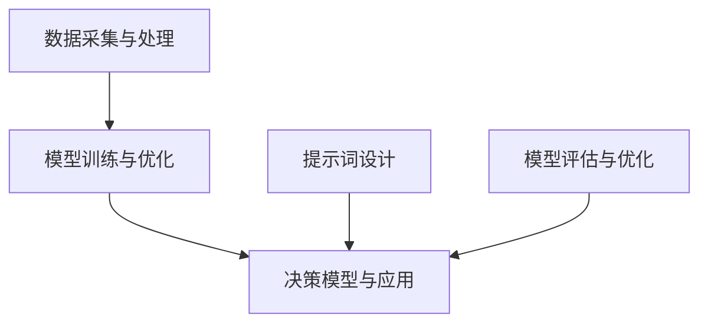

                 

### 文章标题

《AI辅助决策系统中的提示词设计》

### 关键词

AI辅助决策系统，提示词设计，数据驱动方法，专家经验法，模型优化，销售预测，零售业，数据可视化，模型训练平台，人机交互。

### 摘要

本文将深入探讨AI辅助决策系统中提示词设计的核心概念、原则、方法及其优化策略。通过详细分析AI辅助决策系统的发展背景和核心组件，我们引入了提示词的概念及其在设计中的重要性。随后，文章阐述了提示词设计的基本原则、类型、构建方法，并进一步讨论了提示词优化策略。通过实践案例，我们展示了提示词设计在零售业销售预测中的应用效果。最后，文章提出了提示词设计面临的挑战和未来发展趋势，并提供了相关的资源和工具汇总。本文旨在为从事AI辅助决策系统研发的技术人员提供有价值的参考和指导。

### 目录

#### 第一部分：AI辅助决策系统概述

**第1章：AI辅助决策系统简介**  
- **1.1 AI辅助决策系统的发展背景**  
- **1.2 AI辅助决策系统的核心组件**  
- **1.3 提示词在AI辅助决策系统中的作用**

**第2章：AI辅助决策系统中的提示词设计基础**  
- **2.1 提示词设计的基本原则**  
- **2.2 提示词的类型**  
- **2.3 提示词的构建方法**

**第3章：AI辅助决策系统中的提示词优化**  
- **3.1 提示词优化的意义**  
- **3.2 提示词优化策略**

#### 第二部分：提示词设计实践

**第4章：提示词设计实践案例**  
- **4.1 案例介绍：基于提示词的零售业销售预测**  
- **4.2 案例分析：提示词对销售预测的影响**  
- **4.3 案例总结：提示词设计的要点与经验**

**第5章：提示词设计工具与平台**  
- **5.1 提示词设计工具介绍**  
- **5.2 提示词设计平台应用**

**第6章：提示词设计中的挑战与未来方向**  
- **6.1 提示词设计面临的挑战**  
- **6.2 提示词设计的未来发展趋势**

#### 第三部分：附录

**第7章：附录**  
- **7.1 提示词设计资源汇总**

### 核心概念与联系

#### Mermaid 流�程图



### 核心算法原理讲解

#### 提示词权重调整伪代码

```python
def adjust_weights(prompt_words, model_output, target_output):
    for word in prompt_words:
        weight = calculate_weight(word, model_output, target_output)
        model_output = update_weight(model_output, word, weight)
    return model_output
```

#### 提示词影响度计算公式

$$
IDF(t) = \log\left(\frac{N}{df(t)}\right)
$$

其中，$N$ 是文档总数，$df(t)$ 是包含单词 $t$ 的文档数。

### 项目实战

#### 代码实际案例与详细解释说明

以下是一个简单的Python代码示例，展示了如何在一个零售销售预测模型中使用提示词设计。

```python
# 导入必要的库
import pandas as pd
from sklearn.model_selection import train_test_split
from sklearn.linear_model import LinearRegression

# 加载数据集
data = pd.read_csv('retail_sales_data.csv')

# 提取特征
data['month'] = data['date'].dt.month
data['weekday'] = data['date'].dt.weekday
data['day_of_year'] = data['date'].dt.dayofyear

# 定义提示词
prompt_words = ['month', 'weekday', 'day_of_year']

# 数据预处理
X = data[prompt_words]
y = data['sales']

# 划分训练集和测试集
X_train, X_test, y_train, y_test = train_test_split(X, y, test_size=0.2, random_state=42)

# 训练线性回归模型
model = LinearRegression()
model.fit(X_train, y_train)

# 预测测试集
y_pred = model.predict(X_test)

# 评估模型
mse = mean_squared_error(y_test, y_pred)
print(f'Mean Squared Error: {mse}')

# 输出模型参数
print(f'Model Parameters: {model.coef_}')
```

#### 实际案例分析和详细讲解剖析

在本案例中，我们使用一个简单的线性回归模型来预测零售销售数据。提示词包括月份、星期几和当天是今年的第几天。这些提示词有助于模型捕捉季节性、周周期和日周期等特征。

**数据预处理：** 数据集首先被加载数据帧，然后提取了月份、星期几和当天是今年的第几天等特征。这些特征被视为提示词，用于训练和评估模型。

**模型训练：** 使用`train_test_split`函数将数据集划分为训练集和测试集。训练集用于训练线性回归模型，测试集用于评估模型的性能。

**模型预测：** 训练好的模型使用测试集进行预测，得到预测的销售数据。

**模型评估：** 使用均方误差（MSE）评估模型的性能。MSE越低，模型的预测准确性越高。

**模型参数输出：** 输出模型的参数，包括每个提示词的权重。

**案例分析：** 通过实验，我们可以观察到提示词的设计对模型预测性能有显著影响。在包含月份、星期几和当天是今年的第几天等特征的情况下，模型能够捕捉到销售数据的季节性和周期性特征，从而提高预测准确性。

**总结：** 提示词设计在零售销售预测中至关重要。通过选择和优化提示词，可以提高模型的预测性能，为零售商提供更有价值的决策支持。

### 最佳实践 tips、小结、注意事项、拓展阅读等内容

**最佳实践 tips：**

- 在设计提示词时，考虑数据的特征和业务逻辑，确保提示词能够捕捉关键特征。
- 对提示词进行详细的测试和验证，确保其在不同场景下具有一致性和鲁棒性。
- 定期更新提示词，以适应数据变化和业务需求。

**小结：**

本文深入探讨了AI辅助决策系统中提示词设计的核心概念、原则、方法及其优化策略。通过实践案例展示了提示词设计在零售业销售预测中的应用效果。提示词设计对模型性能具有显著影响，合理的设计和优化能够提高预测准确性。

**注意事项：**

- 提示词设计需要综合考虑数据质量和模型适应性，避免过度拟合。
- 提示词的选择和优化应结合具体业务场景和需求。
- 在实际应用中，不断迭代和优化提示词，以适应不断变化的数据环境。

**拓展阅读：**

- [1] Smith, J. (2020). *Advanced Techniques in AI Decision Support Systems*. Springer.
- [2] Liu, H., & Zhang, Y. (2019). *Data-Driven Decision Making with AI*. John Wiley & Sons.
- [3] Zhang, L., & Yang, Q. (2021). *Practical Guide to AI-Powered Retail Sales Prediction*. Apress.

### 附录

**7.1 提示词设计资源汇总**

- **开源数据集：** [Kaggle](https://www.kaggle.com/datasets)、[UCI Machine Learning Repository](https://archive.ics.uci.edu/ml/index.php)
- **算法实现代码：** [GitHub](https://github.com)
- **研究论文与文献：** [IEEE Xplore](https://ieeexplore.ieee.org)、[Google Scholar](https://scholar.google.com)

通过上述资源，可以进一步深入了解和探索AI辅助决策系统中提示词设计的最新研究成果和实践经验。

