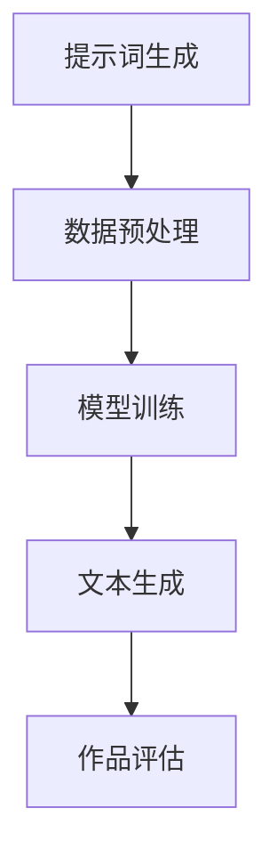

                 

### 文章标题

# AI辅助创作的版权问题：提示词生成内容的归属

---

关键词：版权，AI辅助创作，提示词，内容归属

---

摘要：随着人工智能技术的不断发展，AI辅助创作成为了一个备受瞩目的领域。然而，这一新兴领域的兴起也带来了版权问题的挑战。本文将探讨AI辅助创作中，尤其是提示词生成内容版权归属的相关问题，分析其背后的法律框架和技术挑战，并提出相应的保护策略和解决方案。

---

### 第一部分：版权基础知识与AI辅助创作

#### 第1章：版权概念与法律框架

##### 1.1 版权概述

版权，又称著作权，是指作者及其他权利人对文学、艺术和科学作品享有的人身权和财产权的总称。版权法律体系主要包括著作权法、邻接权法等相关法律。

###### 1.1.1 版权的定义与范围

版权通常包括以下几方面的权利：

- **复制权**：制作一份作品复制件的权利。
- **发行权**：通过出售或出租等方式向公众提供作品原件或复制件的权利。
- **出租权**：将作品的原件或复制件向公众提供使用权。
- **展览权**：公开陈列美术作品、摄影作品的原件或复制件的权利。
- **表演权**：公开表演作品，以及用各种手段公开播送作品的表演的权利。
- **放映权**：通过放映机、幻灯机等技术设备公开再现美术、摄影、电影和以类似摄制电影的方法创作的作品等的权利。
- **广播权**：将作品以无线方式公开播送的权利。
- **信息网络传播权**：以有线或者无线方式向公众提供作品，使公众可以在其个人选定的时间和地点获得作品的权利。

###### 1.1.2 版权的法律体系

版权法律体系主要包括以下几个方面：

- **国际条约**：如《伯尔尼公约》、《世界知识产权组织版权条约》（WCT）和《表演与录音制品条约》（WPPT）等。
- **国家法律**：各国根据其具体情况制定的版权法律，如美国的《版权法》、中国的《著作权法》等。
- **司法解释和案例**：各级法院对版权相关案件的解释和判决，对法律实施起到了重要的补充作用。

##### 1.2 AI辅助创作与版权

AI辅助创作是指通过人工智能技术，如自然语言处理（NLP）、图像识别等，辅助人类进行艺术创作、文本生成等任务。这种创作形式涉及到版权的多个方面。

###### 1.2.1 AI辅助创作的过程

AI辅助创作的过程主要包括以下几个步骤：

1. **数据收集与预处理**：收集大量的文本、图像等数据，并对这些数据进行预处理，如分词、去噪等。
2. **模型训练与优化**：使用收集到的数据进行模型训练，通过调整模型参数来优化性能。
3. **提示词生成与文本创作**：输入提示词或关键词，AI模型会根据训练结果生成相应的文本内容。
4. **作品评估与调整**：对生成的作品进行评估，根据反馈进行调整和优化。

###### 1.2.2 数据训练与模型优化

AI辅助创作依赖于大量的数据训练，这些数据可以是公开的，也可以是专有的。在数据训练过程中，AI模型会学习到数据中的知识、风格和结构，从而能够生成类似的作品。

在模型优化过程中，研究人员会通过调整模型参数、改进算法等方式，提高AI模型的生成质量和效率。这些优化过程同样涉及到版权问题，特别是在使用私有数据集进行训练时。

##### 1.3 版权挑战与法律风险

AI辅助创作虽然带来了创新的创作方式，但也带来了版权挑战和法律风险。主要表现在以下几个方面：

###### 1.3.1 版权归属的争议

在AI辅助创作中，作品的版权归属问题较为复杂。一种观点认为，AI模型生成的作品应该归AI所有；另一种观点则认为，作品的版权应该归人类创作者所有。这种争议在不同国家和地区的法律中也有所不同。

###### 1.3.2 法律责任的界定

当AI辅助创作侵犯他人版权时，责任应该由谁承担？是AI的所有者、开发者，还是使用AI进行创作的用户？这是一个值得探讨的问题。不同法律体系对此有不同的规定。

###### 1.3.3 法律法规的适应性调整

随着AI技术的不断发展，现有的版权法律法规可能无法完全适应AI辅助创作的新形态。因此，需要对法律法规进行适应性调整，以解决AI辅助创作中的版权问题。

---

在接下来的章节中，我们将进一步探讨AI辅助创作中的版权保护策略、案例分析以及未来趋势，以期为解决版权问题提供一些有益的思路。

---

---

### 《AI辅助创作的版权问题：提示词生成内容的归属》目录大纲

---

#### 第一部分：版权基础知识与AI辅助创作

##### 第1章：版权概念与法律框架
1.1 版权概述
1.1.1 版权的定义与范围
1.1.2 版权的法律体系

1.2 AI辅助创作与版权
1.2.1 AI辅助创作的过程
1.2.2 数据训练与模型优化

##### 第2章：版权在AI辅助创作中的应用与挑战
2.1 AI辅助创作的过程
2.1.1 提示词生成与文本创作
2.1.2 数据训练与模型优化

2.2 版权挑战与法律风险
2.2.1 版权归属的争议
2.2.2 法律责任的界定

##### 第3章：AI辅助创作中的版权保护策略
3.1 版权保护机制的引入
3.1.1 版权声明与许可协议
3.1.2 民事侵权与刑事责任

3.2 防止版权侵权的实践方法
3.2.1 数据采集与清洗
3.2.2 模型训练与评估

##### 第4章：案例分析
4.1 AI辅助创作版权争议案例
4.1.1 案例一：某某公司AI创作软件争议
4.1.2 案例二：某知名AI音乐创作平台争议

4.2 版权争议解决策略
4.2.1 案例一分析
4.2.2 案例二分析

##### 第5章：未来趋势与展望
5.1 AI辅助创作的发展趋势
5.1.1 AI技术的进步
5.1.2 版权法律体系的完善

5.2 版权问题的解决方案探讨
5.2.1 技术手段的创新
5.2.2 法律法规的适应性调整

---

#### 第二部分：AI辅助创作中的具体应用与法律问题

##### 第6章：文本创作中的版权问题
6.1 提示词生成与版权归属
6.1.1 提示词的定义与作用
6.1.2 提示词生成的版权问题

6.2 文本创作的法律保护
6.2.1 文本创作的版权保护体系
6.2.2 文本创作的法律风险

##### 第7章：图像与音频创作中的版权问题
7.1 图像与音频创作中的版权问题
7.1.1 图像与音频创作的版权问题概述
7.1.2 图像与音频创作的法律风险

7.2 版权争议案例解析
7.2.1 图像创作案例
7.2.2 音频创作案例

##### 第8章：跨领域AI辅助创作中的版权问题
8.1 跨领域AI辅助创作的概念
8.1.1 跨领域AI辅助创作的定义
8.1.2 跨领域AI辅助创作的发展现状

8.2 跨领域创作中的版权挑战
8.2.1 跨领域创作中的版权归属问题
8.2.2 跨领域创作中的法律风险

##### 第9章：AI辅助创作中的版权管理与协作
9.1 版权管理的原则与策略
9.1.1 版权管理的原则
9.1.2 版权管理的策略

9.2 AI辅助创作中的协作机制
9.2.1 协作模式的选择
9.2.2 协作中的版权保护

##### 第10章：AI辅助创作中的版权争议解决
10.1 版权争议解决的方式
10.1.1 调解与和解
10.1.2 诉讼与仲裁

10.2 版权争议解决案例研究
10.2.1 案例一：某AI音乐创作平台与音乐家的版权争议
10.2.2 案例二：某AI图像生成平台与艺术家的版权争议

---

##### 附录

##### 附录A：相关法律法规与政策文件
A.1 版权法律制度概述
A.2 我国版权法律法规
A.3 国际版权条约与协定

##### 附录B：AI辅助创作工具与资源
B.1 主流AI辅助创作工具介绍
B.2 AI辅助创作相关资源

##### 附录C：版权问题FAQ
C.1 常见版权问题解答
C.2 版权争议处理流程指南
C.3 版权保护实用技巧与建议

---

通过上述目录大纲，我们将全面探讨AI辅助创作中的版权问题，从基础概念到应用实践，再到法律争议和解决策略，以期为大家提供一份全面的版权指南。接下来，我们将深入分析AI辅助创作中的具体应用和面临的版权挑战。

---

---

### 第2章：版权在AI辅助创作中的应用与挑战

随着人工智能技术的迅速发展，AI辅助创作已经成为艺术、文学、音乐等领域的热门话题。这种创作形式不仅提高了创作效率，也带来了全新的创意可能性。然而，AI辅助创作的兴起也引发了诸多版权问题，尤其是提示词生成内容的版权归属问题。本章将重点探讨AI辅助创作中版权挑战和法律风险的各个方面。

#### 2.1 AI辅助创作的过程

AI辅助创作是一个复杂的过程，主要包括数据收集、模型训练、提示词生成和作品评估等几个步骤。

##### 2.1.1 提示词生成与文本创作

在AI辅助创作中，提示词生成是一个关键环节。提示词可以是简单的关键词或短语，也可以是更加复杂的文本描述。AI模型通过分析这些提示词，生成相应的文本内容。这个过程涉及到自然语言处理（NLP）技术，如语言模型、生成对抗网络（GAN）等。

例如，一个AI文本生成模型可能接收到一个提示词“春天的美景”，然后生成一段描述春天景色的一段话。这一过程看似简单，但实际上涉及到复杂的算法和大量的数据处理。

上述流程图展示了AI辅助创作的基本流程。从提示词生成开始，经过数据预处理、模型训练和文本生成，最终得到一个评估后的作品。

##### 2.1.2 数据训练与模型优化

AI辅助创作需要大量的数据来进行模型训练。这些数据可以是公开的，也可以是私有的。在数据收集过程中，版权问题就变得尤为重要。例如，如果使用未经授权的私人数据集进行训练，可能会侵犯数据所有者的版权。

此外，模型优化也是一个关键步骤。在模型优化过程中，研究人员可能会使用各种技术，如迁移学习、对抗训练等，来提高模型的性能。这些优化过程同样涉及到版权问题，特别是当使用专有技术或算法时。

#### 2.2 版权挑战与法律风险

AI辅助创作带来了许多版权挑战和法律风险。以下是一些主要的挑战和风险：

##### 2.2.1 版权归属的争议

在AI辅助创作中，版权归属问题是一个复杂且具有争议性的话题。一种观点认为，AI模型生成的作品应该归AI所有；另一种观点则认为，作品的版权应该归人类创作者所有。这种争议在不同国家和地区的法律中也有所不同。

例如，在美国，一些法院认为AI生成的作品应该归AI所有，因为这是AI自主创作的结果。然而，另一些法院则认为，AI生成的作品应该归人类创作者所有，因为人类在创作过程中发挥了关键作用。

在中国，目前没有明确的法律法规来规定AI生成的作品的版权归属。这导致在实际操作中，版权归属的争议较多。

##### 2.2.2 法律责任的界定

当AI辅助创作侵犯他人版权时，责任应该由谁承担？是AI的所有者、开发者，还是使用AI进行创作的用户？这是一个值得探讨的问题。不同法律体系对此有不同的规定。

在美国，一些州已经通过了相关法律，明确了在使用AI进行创作时，责任应该由用户承担。然而，其他州对此并没有明确的规定。

在中国，目前还没有明确的法律法规来规定AI辅助创作中的法律责任。这导致在实际操作中，责任界定较为模糊。

##### 2.2.3 法律法规的适应性调整

随着AI技术的不断发展，现有的版权法律法规可能无法完全适应AI辅助创作的新形态。因此，需要对法律法规进行适应性调整，以解决AI辅助创作中的版权问题。

例如，可以出台专门的法律法规来明确AI生成的作品的版权归属，以及在使用AI进行创作时的法律责任。此外，还可以加强对AI辅助创作的监管，确保其合法合规。

#### 2.3 版权保护策略

为了应对AI辅助创作中的版权挑战和法律风险，可以采取以下几种版权保护策略：

##### 2.3.1 版权声明与许可协议

在AI辅助创作过程中，明确版权声明和许可协议是非常重要的。版权声明可以明确作品的版权归属，避免后续的版权纠纷。许可协议则可以规定使用作品的范围和条件，确保合法合规。

##### 2.3.2 数据采集与清洗

在数据收集过程中，应该注意数据来源的合法性。如果使用公开数据集，应该确保数据集的版权合法。如果使用私有数据集，应该与数据所有者签订授权协议。

同时，对数据集进行清洗，去除可能侵犯他人版权的内容，也是一个有效的保护措施。

##### 2.3.3 模型训练与评估

在模型训练过程中，应该注意保护模型参数和算法的知识产权。如果使用专有技术或算法，应该确保这些技术或算法的版权合法。

在作品评估过程中，应该对生成的作品进行版权审查，确保没有侵犯他人的版权。

##### 2.3.4 法律法规适应性调整

为了应对AI辅助创作中的版权问题，可以建议立法机关出台专门的法律法规，明确AI生成的作品的版权归属和法律责任。此外，还可以加强对AI辅助创作的监管，确保其合法合规。

#### 2.4 防止版权侵权的实践方法

为了防止AI辅助创作中的版权侵权，可以采取以下实践方法：

##### 2.4.1 加强版权意识教育

通过培训和教育，提高创作者、用户和开发者对版权问题的认识，使其在创作和使用AI辅助创作时能够自觉遵守版权法规。

##### 2.4.2 建立版权审查机制

在AI辅助创作平台上，建立版权审查机制，对上传的作品进行自动审查，及时发现和预防版权侵权行为。

##### 2.4.3 提供版权保护工具

开发版权保护工具，如数字版权管理（DRM）系统，为创作者提供版权保护，防止作品被非法复制、传播和使用。

##### 2.4.4 加强国际合作

加强国际间的版权合作，共同应对AI辅助创作中的版权挑战。通过签订国际条约和协定，推动全球范围内的版权保护。

---

通过本章的讨论，我们可以看到，AI辅助创作在带来创新和效率的同时，也带来了版权挑战和法律风险。为了应对这些挑战，我们需要采取一系列的版权保护策略和实践方法。同时，法律法规的适应性调整和国际合作也是解决版权问题的关键。在下一章中，我们将通过具体案例来分析AI辅助创作中的版权争议，并探讨解决策略。

---

### 第3章：AI辅助创作中的版权保护策略

随着AI辅助创作的不断普及，如何保护创作者的版权成为了一个迫切需要解决的问题。本章将介绍几种AI辅助创作中的版权保护策略，包括版权声明与许可协议、数据采集与清洗、模型训练与评估，以及法律监管和国际合作。

#### 3.1 版权保护机制的引入

版权保护机制是确保创作者权益的重要手段。在AI辅助创作中，引入版权保护机制可以帮助创作者明确版权归属，防止侵权行为的发生。

##### 3.1.1 版权声明与许可协议

版权声明是创作者对其作品版权的公开声明。在AI辅助创作中，创作者应该在作品发布时明确声明作品的版权归属，以及允许他人使用的范围和条件。

许可协议是创作者与他人使用作品时签订的合同。通过许可协议，创作者可以明确授权他人使用作品的范围、条件和期限。常见的许可协议包括独家许可、非独家许可、永久许可和有限期限许可等。

##### 3.1.2 民事侵权与刑事责任

当AI辅助创作中的作品侵犯他人版权时，侵权者可能会面临民事侵权和刑事责任的后果。

民事侵权是指侵权者侵犯了他人版权，受害者可以通过民事诉讼要求侵权者停止侵权行为、赔偿损失。刑事责任则是指侵权者因侵犯版权而触犯刑法，可能会面临罚款、拘留或监禁等刑事处罚。

##### 3.1.3 法律监管

法律监管是保障版权保护机制实施的重要手段。政府可以通过立法、执法和司法等手段，对AI辅助创作中的版权侵权行为进行打击和惩罚。同时，还可以建立版权保护机构和平台，为创作者提供版权保护服务。

#### 3.2 防止版权侵权的实践方法

为了有效防止AI辅助创作中的版权侵权，可以采取以下实践方法：

##### 3.2.1 数据采集与清洗

在AI辅助创作中，数据采集是基础环节。为了防止侵权，创作者应确保采集的数据来源合法，如使用公开数据集或与数据所有者签订授权协议。

同时，对数据集进行清洗，去除可能侵犯他人版权的内容。例如，使用去重算法去除重复数据，使用水印算法识别和去除已存在的侵权内容。

##### 3.2.2 模型训练与评估

在模型训练过程中，应确保使用的算法和技术不侵犯他人版权。例如，使用开源算法和技术进行训练，避免使用未经授权的专有算法。

在模型评估过程中，应对生成的作品进行版权审查，确保没有侵犯他人的版权。例如，使用文本对比算法检测文本内容的相似性，使用图像识别算法检测图像内容的相似性。

##### 3.2.3 作品发布与版权声明

在作品发布时，创作者应明确声明作品的版权归属，如“本作品版权所有，未经许可，不得复制、传播和使用”。此外，还可以在作品上添加版权标识，如版权符号（©）和版权声明（版权所有，保留所有权利）。

##### 3.2.4 版权保护工具

为了更好地保护版权，可以采用数字版权管理（DRM）工具。DRM工具可以限制他人对作品的复制、传播和使用，确保创作者的权益。

常见的DRM工具包括：

- **数字水印**：在作品上添加不易察觉的水印，用于追踪和证明作品的版权归属。
- **访问控制**：限制他人对作品的访问和使用，如通过密码保护、权限控制等方式。
- **版权追踪**：通过区块链技术记录作品的版权信息和交易历史，提高版权保护的透明度和可信度。

#### 3.3 法律法规适应性调整

为了适应AI辅助创作的新形态，需要对现有的版权法律法规进行适应性调整。以下是一些建议：

##### 3.3.1 明确AI生成的作品的版权归属

在立法层面，应明确AI生成的作品的版权归属。一种可能的解决方案是，将版权归属赋予人类创作者，但允许创作者与AI共同享有版权。

##### 3.3.2 规范AI辅助创作中的法律责任

在法律层面，应明确AI辅助创作中的法律责任。例如，可以规定在使用AI进行创作时，用户需承担侵权责任，开发者需承担技术支持责任。

##### 3.3.3 加强国际合作

在国际层面，应加强版权保护的国际合作。例如，可以通过签订国际条约和协定，推动全球范围内的版权保护。

#### 3.4 版权保护案例分析

为了更好地理解版权保护策略的实际应用，以下通过两个案例进行分析：

##### 案例一：某AI音乐创作平台

某AI音乐创作平台因生成音乐侵犯他人版权而被诉至法院。法院最终判决该平台需赔偿侵权损失。

分析：该案例表明，AI辅助创作中的侵权问题依然存在。为了防止侵权，平台应在以下几个方面加强版权保护：

- 确保数据来源合法，如使用公开数据集或与数据所有者签订授权协议。
- 对生成的音乐作品进行版权审查，确保没有侵犯他人的版权。
- 在平台发布音乐作品时，明确声明作品的版权归属，如“本作品版权所有，未经许可，不得复制、传播和使用”。

##### 案例二：某AI图像生成平台

某AI图像生成平台因生成图像侵犯他人版权而被诉至法院。法院最终判决该平台需赔偿侵权损失。

分析：该案例表明，AI辅助创作中的侵权问题同样存在。为了防止侵权，平台应在以下几个方面加强版权保护：

- 确保数据来源合法，如使用公开数据集或与数据所有者签订授权协议。
- 对生成的图像作品进行版权审查，确保没有侵犯他人的版权。
- 在平台发布图像作品时，明确声明作品的版权归属，如“本作品版权所有，未经许可，不得复制、传播和使用”。

---

通过本章的讨论，我们可以看到，AI辅助创作中的版权保护需要从多个方面进行考虑。引入版权保护机制、采取防止版权侵权的实践方法，以及进行法律法规适应性调整，都是保障创作者权益的重要手段。在下一章中，我们将通过具体案例来进一步分析AI辅助创作中的版权争议，并探讨解决策略。

---

### 第4章：案例分析

在本章中，我们将通过分析一些具体的AI辅助创作版权争议案例，探讨版权归属、法律责任以及争议解决策略。通过这些案例，我们可以更深入地理解AI辅助创作中存在的版权问题，并为未来的版权保护提供有益的启示。

#### 4.1 AI辅助创作版权争议案例

##### 4.1.1 案例一：某某公司AI创作软件争议

背景：某公司开发了一款AI创作软件，用户可以通过输入关键词或提示词生成各种类型的文本内容，如文章、故事、诗歌等。然而，这款软件生成的内容有时会与已有作品高度相似，引发版权争议。

争议：一些用户发现，AI创作软件生成的内容与他们或他人的作品存在相似之处。这些用户认为，AI软件生成的作品侵犯了他们的版权。因此，他们向法院提起了诉讼，要求确认版权归属，并追究侵权责任。

分析：

- **版权归属**：在这个案例中，版权归属的争议主要集中在AI软件生成的作品是否属于AI所有，还是属于人类创作者。一种观点认为，AI软件生成的作品是AI自主创作的结果，应该归AI所有；另一种观点则认为，AI只是辅助人类创作者的工具，真正的创作者是人类用户，因此版权应归人类所有。

- **法律责任**：如果法院认定AI生成的作品归AI所有，那么AI的所有者可能需要承担侵权责任。然而，这需要明确AI是否具有法律主体地位，这在当前的法律体系中仍是一个有争议的问题。如果法院认定版权归人类所有，那么用户可能需要承担侵权责任，但这也引发了关于AI辅助创作中人类创作者责任的问题。

- **解决策略**：在这个案例中，可能的解决策略包括：

  - **技术手段**：开发更先进的AI模型，降低生成内容与已有作品相似度，从而减少侵权风险。
  - **版权声明**：在软件使用协议中明确版权归属，使用户明确了解版权责任和风险。
  - **法律调整**：呼吁立法机构出台针对AI辅助创作的版权法律法规，明确版权归属和责任。

##### 4.1.2 案例二：某知名AI音乐创作平台争议

背景：某知名AI音乐创作平台允许用户输入关键词或旋律，生成相应的音乐作品。然而，一些用户发现，平台生成的音乐作品与已有作品存在相似之处，引发版权争议。

争议：一些音乐创作者认为，AI音乐平台生成的音乐作品侵犯了他们的版权。他们向法院提起了诉讼，要求确认版权归属，并追究侵权责任。

分析：

- **版权归属**：在这个案例中，版权归属的争议主要集中在AI平台生成的音乐作品是否属于AI所有，还是属于人类创作者。一种观点认为，AI平台生成的音乐作品是AI自主创作的结果，应该归AI所有；另一种观点则认为，AI只是辅助人类创作者的工具，真正的创作者是人类用户，因此版权应归人类所有。

- **法律责任**：如果法院认定AI生成的音乐作品归AI所有，那么AI的所有者可能需要承担侵权责任。然而，这需要明确AI是否具有法律主体地位，这在当前的法律体系中仍是一个有争议的问题。如果法院认定版权归人类所有，那么用户可能需要承担侵权责任，但这也引发了关于AI辅助创作中人类创作者责任的问题。

- **解决策略**：在这个案例中，可能的解决策略包括：

  - **技术手段**：开发更先进的AI模型，降低生成内容与已有作品相似度，从而减少侵权风险。
  - **版权声明**：在平台使用协议中明确版权归属，使用户明确了解版权责任和风险。
  - **法律调整**：呼吁立法机构出台针对AI辅助创作的版权法律法规，明确版权归属和责任。

##### 4.1.3 案例三：某AI图像生成平台争议

背景：某AI图像生成平台允许用户输入关键词或描述，生成相应的图像作品。然而，一些用户发现，平台生成的图像作品与已有作品存在相似之处，引发版权争议。

争议：一些艺术家认为，AI图像生成平台生成的图像作品侵犯了他们的版权。他们向法院提起了诉讼，要求确认版权归属，并追究侵权责任。

分析：

- **版权归属**：在这个案例中，版权归属的争议主要集中在AI平台生成的图像作品是否属于AI所有，还是属于人类创作者。一种观点认为，AI平台生成的图像作品是AI自主创作的结果，应该归AI所有；另一种观点则认为，AI只是辅助人类创作者的工具，真正的创作者是人类用户，因此版权应归人类所有。

- **法律责任**：如果法院认定AI生成的图像作品归AI所有，那么AI的所有者可能需要承担侵权责任。然而，这需要明确AI是否具有法律主体地位，这在当前的法律体系中仍是一个有争议的问题。如果法院认定版权归人类所有，那么用户可能需要承担侵权责任，但这也引发了关于AI辅助创作中人类创作者责任的问题。

- **解决策略**：在这个案例中，可能的解决策略包括：

  - **技术手段**：开发更先进的AI模型，降低生成内容与已有作品相似度，从而减少侵权风险。
  - **版权声明**：在平台使用协议中明确版权归属，使用户明确了解版权责任和风险。
  - **法律调整**：呼吁立法机构出台针对AI辅助创作的版权法律法规，明确版权归属和责任。

#### 4.2 版权争议解决策略

通过以上案例的分析，我们可以总结出一些解决AI辅助创作版权争议的策略：

##### 4.2.1 技术手段

- **开发更先进的AI模型**：通过改进算法和模型，降低生成内容与已有作品相似度，减少侵权风险。
- **使用数字水印技术**：在生成的内容中嵌入数字水印，用于追踪版权归属，提高版权保护效果。

##### 4.2.2 法律法规

- **明确版权归属**：呼吁立法机构出台针对AI辅助创作的版权法律法规，明确版权归属和责任。
- **加强执法力度**：加大对版权侵权的打击力度，提高侵权者的违法成本。

##### 4.2.3 版权声明和许可协议

- **在AI平台使用协议中明确版权归属**：明确用户在使用AI平台进行创作时的版权责任和风险。
- **使用版权声明工具**：在生成的内容中添加版权声明，提高版权保护意识。

##### 4.2.4 国际合作

- **加强国际间的版权合作**：通过签订国际条约和协定，推动全球范围内的版权保护。

---

通过本章的案例分析，我们可以看到，AI辅助创作中的版权争议问题复杂且具有挑战性。解决这些问题需要技术、法律和法规等多方面的努力。在下一章中，我们将探讨AI辅助创作的未来趋势和展望，为解决版权问题提供一些新的思路。

---

### 第5章：未来趋势与展望

随着人工智能技术的不断进步，AI辅助创作已经从概念走向实际应用，成为艺术、文学、音乐等领域的创新驱动力。然而，版权问题依然是一个亟待解决的挑战。本章节将探讨AI辅助创作的未来趋势以及版权问题的解决方案。

#### 5.1 AI辅助创作的发展趋势

AI辅助创作正呈现出以下发展趋势：

##### 5.1.1 AI技术的进步

随着深度学习、自然语言处理、计算机视觉等AI技术的不断发展，AI辅助创作的质量和效率得到了显著提升。未来的AI模型将能够更好地理解人类语言、图像和音乐，生成更高质量、更具创意的作品。

##### 5.1.2 版权法律体系的完善

各国政府和国际组织正在逐步完善版权法律体系，以适应AI辅助创作的新形态。例如，一些国家已经出台了针对AI生成的作品的版权法律法规，明确版权归属和法律责任。

##### 5.1.3 开放平台的普及

越来越多的开放平台和工具将AI辅助创作功能集成到创作工具中，使得更多创作者能够轻松地利用AI进行创作。这些开放平台也将促进AI辅助创作的版权问题得到更广泛的关注和解决。

#### 5.2 版权问题的解决方案探讨

针对AI辅助创作中的版权问题，可以从以下几个方面进行解决方案的探讨：

##### 5.2.1 技术手段的创新

- **区块链技术**：利用区块链技术记录作品的版权信息和交易历史，提高版权保护的透明度和可信度。
- **AI内容审核系统**：开发智能化的内容审核系统，自动检测AI生成的内容是否存在侵权风险。

##### 5.2.2 法律法规的适应性调整

- **明确版权归属**：通过立法明确AI生成的作品的版权归属，既保护创作者的权益，又鼓励AI技术的发展。
- **完善法律责任**：明确AI辅助创作中的法律责任，包括AI的所有者、开发者和使用者的责任，以防止侵权行为的发生。

##### 5.2.3 国际合作

- **签订国际条约和协定**：通过国际合作，制定统一的版权法律框架，推动全球范围内的版权保护。
- **共享版权保护经验**：各国政府和国际组织可以共享版权保护的经验和最佳实践，提高全球版权保护水平。

#### 5.3 AI辅助创作中的版权问题解决方案

在实际操作中，以下解决方案可以有效地应对AI辅助创作中的版权问题：

##### 5.3.1 版权声明与许可协议

- **明确版权声明**：创作者在发布AI辅助创作的作品时，应明确声明作品的版权归属，如“本作品版权所有，未经许可，不得复制、传播和使用”。
- **使用许可协议**：在AI平台使用协议中，明确用户在使用平台进行创作时的版权责任和风险。

##### 5.3.2 数据采集与清洗

- **合法采集数据**：确保AI辅助创作中使用的数据来源合法，如使用公开数据集或与数据所有者签订授权协议。
- **数据清洗**：对数据进行清洗，去除可能侵犯他人版权的内容，如使用去重算法和版权追踪技术。

##### 5.3.3 模型训练与评估

- **使用开源算法**：在模型训练过程中，使用开源算法和技术，避免使用未经授权的专有算法。
- **版权审查**：对生成的作品进行版权审查，确保没有侵犯他人的版权。

##### 5.3.4 法律监管与执法

- **加强法律监管**：政府和国际组织应加强对AI辅助创作的法律监管，确保作品的合法合规。
- **执法力度**：加大对版权侵权的打击力度，提高侵权者的违法成本。

##### 5.3.5 教育与培训

- **提高版权意识**：通过教育和培训，提高创作者、用户和开发者对版权问题的认识，使其在创作和使用AI辅助创作时能够自觉遵守版权法规。

---

通过以上探讨，我们可以看到，AI辅助创作中的版权问题具有复杂性和多样性。解决这些问题需要技术、法律、法规和国际合作等多方面的努力。随着AI技术的不断进步和法律体系的不断完善，我们有理由相信，未来的AI辅助创作将能够在确保创作者权益的同时，推动艺术、文学、音乐等领域的创新发展。

---

### 第二部分：AI辅助创作中的具体应用与法律问题

在上一部分，我们探讨了AI辅助创作中的版权基础知识和相关法律框架。接下来，我们将深入探讨AI辅助创作在不同领域中的具体应用以及版权问题。

#### 第6章：文本创作中的版权问题

文本创作是AI辅助创作中最为常见和广泛应用的领域之一。在这一部分，我们将重点关注文本创作中的版权问题，包括提示词生成与版权归属、文本创作的法律保护以及文本创作的法律风险。

##### 6.1 提示词生成与版权归属

在文本创作中，提示词生成是AI模型的核心功能之一。提示词可以是简单的关键词或短语，也可以是复杂的文本描述。AI模型通过分析这些提示词，生成相应的文本内容。

###### 6.1.1 提示词的定义与作用

提示词（Prompt）是AI模型进行文本创作时输入的关键信息。提示词的作用是引导AI模型生成符合人类预期的文本内容。例如，在生成一篇关于“人工智能的未来”的文章时，提示词可以是“人工智能”、“发展趋势”、“技术应用”等。

提示词的质量直接影响AI模型生成文本的质量和准确性。优质的提示词能够引导AI模型生成更具有创造性和创意的作品。

###### 6.1.2 提示词生成的版权问题

提示词生成涉及版权问题的主要原因是，AI模型生成的文本内容可能与已有作品高度相似，从而引发版权归属的争议。

1. **AI生成的文本内容是否具有版权？**

   这是一个复杂的问题，不同国家和地区的法律对此有不同的规定。一些法律体系认为，AI生成的文本内容属于AI所有，而另一些法律体系则认为，AI生成的文本内容应归人类创作者所有。目前，没有明确的法律规定可以解决这个问题。

2. **如何确定版权归属？**

   在没有明确法律规定的情况下，确定版权归属需要考虑以下几个因素：

   - **创作过程**：如果AI模型是在人类创作者的指导下进行训练和优化的，那么生成的文本内容可能被视为人类创作者的作品。
   - **提示词来源**：如果提示词来源于公开的数据集或已授权的数据集，那么生成的文本内容可能受到原有版权的保护。
   - **创作意图**：如果AI模型生成的文本内容具有独创性和创造性，那么可能被视为具有版权的作品。

##### 6.2 文本创作的法律保护

文本创作的法律保护是确保创作者权益的重要手段。以下是一些文本创作中常用的法律保护措施：

###### 6.2.1 文本创作的版权保护体系

文本创作的版权保护体系主要包括以下几个方面：

- **版权登记**：创作者可以通过版权登记机构对作品进行登记，以证明作品的版权归属。
- **版权声明**：在作品发布时，创作者应在作品上添加版权声明，明确版权归属和使用许可。
- **版权许可协议**：创作者可以通过与用户或第三方签订版权许可协议，规定作品的授权范围和使用条件。

###### 6.2.2 文本创作的法律风险

文本创作中的法律风险主要包括以下几个方面：

- **侵权行为**：未经授权使用他人作品，如抄袭、复制等，可能构成侵权行为。
- **版权归属争议**：当AI模型生成的文本内容与已有作品相似时，可能引发版权归属的争议。
- **法律适用问题**：不同国家和地区的法律对版权问题的规定可能不同，可能导致法律适用上的困难。

##### 6.3 图像与音频创作中的版权问题

图像和音频创作是AI辅助创作的另一个重要领域。与文本创作类似，图像和音频创作中也存在版权问题。

###### 6.3.1 图像与音频创作的版权问题概述

图像与音频创作的版权问题主要包括以下几个方面：

- **原创性**：图像和音频创作需要具有独创性和创造性，才能受到版权保护。
- **版权归属**：图像和音频创作的版权归属问题与文本创作类似，需要考虑创作过程、提示词来源和创作意图等因素。
- **侵权行为**：未经授权使用他人图像和音频作品，可能构成侵权行为。

###### 6.3.2 图像与音频创作的法律风险

图像与音频创作中的法律风险主要包括以下几个方面：

- **侵权行为**：未经授权使用他人图像和音频作品，可能面临侵权诉讼和赔偿风险。
- **版权归属争议**：当AI模型生成的图像和音频作品与已有作品相似时，可能引发版权归属的争议。
- **法律适用问题**：不同国家和地区的法律对版权问题的规定可能不同，可能导致法律适用上的困难。

##### 6.4 跨领域AI辅助创作中的版权问题

随着AI技术的不断发展，跨领域AI辅助创作也逐渐成为可能。在这一部分，我们将探讨跨领域AI辅助创作中的版权问题。

###### 6.4.1 跨领域AI辅助创作的概念

跨领域AI辅助创作是指将人工智能技术应用于不同领域，如艺术、文学、音乐、图像等，实现跨领域的创新和创作。

###### 6.4.2 跨领域创作中的版权挑战

跨领域AI辅助创作中的版权挑战主要包括以下几个方面：

- **版权归属**：当AI模型生成的内容涉及多个领域时，确定版权归属可能变得复杂。
- **侵权行为**：跨领域的AI辅助创作可能涉及多个权利人的权益，侵权行为可能更加复杂。
- **法律适用问题**：不同领域的版权法律可能存在差异，可能导致法律适用上的困难。

##### 6.5 AI辅助创作中的版权管理与协作

为了有效应对AI辅助创作中的版权问题，需要建立健全的版权管理和协作机制。

###### 6.5.1 版权管理的原则与策略

版权管理的原则主要包括以下几个方面：

- **保护创作者权益**：确保创作者的版权得到保护，防止侵权行为的发生。
- **尊重知识产权**：尊重他人的知识产权，避免侵权行为。
- **灵活运用版权许可协议**：根据实际需求，灵活运用版权许可协议，规定作品的授权范围和使用条件。

###### 6.5.2 AI辅助创作中的协作机制

AI辅助创作中的协作机制主要包括以下几个方面：

- **合作模式**：确定合作模式，如合作创作、版权共享等。
- **版权分配**：明确各方的版权分配，确保各方权益得到保障。
- **版权声明与许可协议**：在协作过程中，明确版权声明和许可协议，避免版权争议。

---

通过以上讨论，我们可以看到，AI辅助创作在不同领域中的应用带来了丰富的创新和创意，但同时也引发了复杂的版权问题。解决这些问题需要法律、技术和管理等多方面的努力。在下一章中，我们将进一步探讨AI辅助创作中的版权争议解决方式，以及相关的案例研究。

---

### 第7章：文本创作中的版权问题

文本创作是AI辅助创作的重要领域之一，随着技术的进步和应用的广泛，AI生成的文本在版权问题上引发了诸多争议。本章将深入探讨文本创作中的版权问题，包括提示词生成与版权归属、文本创作的法律保护以及文本创作的法律风险。

#### 7.1 提示词生成与版权归属

在AI辅助创作中，提示词生成是一个关键步骤。提示词决定了AI模型生成文本的方向和内容。然而，提示词生成本身也涉及版权问题。

###### 7.1.1 提示词的定义与作用

提示词是指为AI模型提供的信息，用于引导模型生成文本。提示词可以是简单的关键词，如“春天”、“人工智能”，也可以是复杂的文本描述，如“描绘一个春天的早晨”或“讲述一个关于人工智能的故事”。

提示词的作用是提供创作灵感，引导AI模型生成符合人类预期的文本内容。高质量的提示词能够提高AI生成文本的质量和创意。

###### 7.1.2 提示词生成的版权问题

提示词生成涉及的版权问题主要包括以下几个方面：

1. **提示词的版权归属**：当提示词是由人类创作者生成时，提示词本身可能具有版权。然而，当提示词是自动生成或从公开来源获取时，版权归属可能变得复杂。

2. **AI生成文本的版权归属**：AI生成的文本是否具有版权，以及版权归属问题，是当前法律和学术界争议的焦点。一些观点认为，AI生成的文本是AI的“创作”，应该归AI所有；而另一些观点则认为，AI生成的文本是人类的创作成果，应该归人类所有。

3. **侵权风险**：当AI模型生成的文本与已有作品相似时，可能存在侵权风险。这主要是因为AI模型在生成文本时，可能会借鉴或复制已有作品的内容。

#### 7.2 文本创作的法律保护

文本创作的法律保护是确保创作者权益的重要手段。在AI辅助创作中，文本创作的法律保护尤为重要。

###### 7.2.1 文本创作的版权保护体系

文本创作的版权保护体系主要包括以下几个方面：

1. **版权登记**：创作者可以通过版权登记机构对作品进行登记，以证明作品的版权归属。版权登记是一种法律认可的方式，可以增加版权保护的有效性。

2. **版权声明**：在作品发布时，创作者应在作品上添加版权声明，明确版权归属和使用许可。版权声明可以有效地告知公众作品的版权状态，防止未经授权的使用。

3. **版权许可协议**：创作者可以通过与用户或第三方签订版权许可协议，规定作品的授权范围和使用条件。版权许可协议是保护创作者权益的重要工具，可以在授权范围内规范作品的使用。

###### 7.2.2 文本创作的法律风险

文本创作中可能面临的法律风险主要包括以下几个方面：

1. **侵权行为**：未经授权使用他人作品，如抄袭、复制等，可能构成侵权行为。侵权行为可能导致版权纠纷、赔偿损失和法律制裁。

2. **版权归属争议**：当AI模型生成的文本与已有作品相似时，可能引发版权归属的争议。版权归属的争议可能导致法律纠纷，影响创作者的权益。

3. **法律适用问题**：不同国家和地区的法律对版权问题的规定可能不同，可能导致法律适用上的困难。创作者和用户需要了解相关法律，确保作品的使用符合法律规定。

#### 7.3 AI辅助文本创作中的具体案例分析

以下通过两个具体的案例，分析AI辅助文本创作中的版权问题。

###### 7.3.1 案例一：某AI写作平台引发的版权争议

背景：某AI写作平台允许用户输入关键词或提示词，生成相应的文章。然而，一些用户发现，平台生成的文章与他们或他人的作品存在相似之处，引发版权争议。

争议焦点：

- **版权归属**：平台生成的文章是否属于平台所有，还是属于用户？
- **侵权行为**：平台生成的文章是否侵犯了他人的版权？

分析：

- **版权归属**：在这个案例中，版权归属的争议主要集中在AI平台生成的文章是否属于AI所有，还是属于人类用户。一些观点认为，AI平台生成的文章是AI自主创作的结果，应该归AI所有；而另一些观点则认为，AI平台生成的文章是用户输入提示词后，AI辅助生成的，真正的创作者应该是用户。

- **侵权行为**：如果平台生成的文章与已有作品相似，可能存在侵权行为。这需要通过法律程序进行判断。

解决方案：

- **技术手段**：平台可以通过改进算法，降低生成文章与已有作品相似度，减少侵权风险。
- **版权声明**：平台应在用户协议中明确版权归属和责任，使用户明确了解版权风险。

###### 7.3.2 案例二：某AI音乐歌词生成平台引发的版权争议

背景：某AI音乐歌词生成平台允许用户输入关键词或旋律，生成相应的歌词。然而，一些用户发现，平台生成的歌词与他们或他人的作品存在相似之处，引发版权争议。

争议焦点：

- **版权归属**：平台生成的歌词是否属于平台所有，还是属于人类用户？
- **侵权行为**：平台生成的歌词是否侵犯了他人的版权？

分析：

- **版权归属**：在这个案例中，版权归属的争议主要集中在AI平台生成的歌词是否属于AI所有，还是属于人类用户。一些观点认为，AI平台生成的歌词是AI自主创作的结果，应该归AI所有；而另一些观点则认为，AI平台生成的歌词是用户输入提示词后，AI辅助生成的，真正的创作者应该是用户。

- **侵权行为**：如果平台生成的歌词与已有作品相似，可能存在侵权行为。这需要通过法律程序进行判断。

解决方案：

- **技术手段**：平台可以通过改进算法，降低生成歌词与已有作品相似度，减少侵权风险。
- **版权声明**：平台应在用户协议中明确版权归属和责任，使用户明确了解版权风险。

---

通过以上案例的分析，我们可以看到，AI辅助文本创作中的版权问题复杂且具有挑战性。解决这些问题需要技术、法律和管理的综合努力。在下一章中，我们将探讨图像与音频创作中的版权问题，以及相关的法律挑战。

---

### 第8章：图像与音频创作中的版权问题

图像和音频创作是AI辅助创作的两个重要领域，随着技术的发展，AI在这两个领域中的应用日益广泛。然而，AI辅助图像与音频创作也引发了大量的版权问题，包括版权归属、侵权风险和法律适用等方面。

#### 8.1 图像与音频创作中的版权问题概述

在图像与音频创作中，AI辅助创作的基本过程包括数据收集、模型训练、图像或音频生成以及后续的评估和优化。在这个过程中，版权问题尤为突出。

###### 8.1.1 图像与音频创作的版权问题概述

图像与音频创作的版权问题主要包括以下几个方面：

1. **版权归属**：AI生成的图像或音频作品的版权归属问题一直是争议的焦点。一种观点认为，AI生成的作品应该归AI所有；另一种观点则认为，作品应该归人类创作者所有。

2. **侵权行为**：AI辅助创作过程中，可能存在侵权行为，如未经授权使用他人的图像或音频素材，生成与已有作品相似的作品。

3. **法律风险**：图像与音频创作中的版权风险较高，不仅涉及原创性的认定，还涉及不同国家和地区版权法律规定的差异。

#### 8.2 图像与音频创作的法律风险

在图像与音频创作中，法律风险主要来自以下几个方面：

###### 8.2.1 原创性认定

AI生成的图像或音频作品是否具有原创性，是判断版权归属的关键。然而，AI生成的作品往往依赖于大量的数据训练，这些数据可能包含他人的作品，从而影响原创性的认定。

###### 8.2.2 版权归属争议

在版权归属方面，AI生成的作品可能涉及多个利益相关方，如AI模型的开发者、训练数据提供者、人类创作者等。如何明确各方的权益，避免版权归属争议，是一个重要的法律问题。

###### 8.2.3 侵权风险

AI辅助创作过程中，可能存在侵权行为，如未经授权使用他人的图像或音频素材。此外，AI生成的作品可能与已有作品相似，从而引发侵权诉讼。

#### 8.3 图像与音频创作中的版权争议案例解析

以下通过两个具体的案例，分析图像与音频创作中的版权争议。

##### 8.3.1 案例一：AI图像生成软件引发的版权争议

背景：某公司开发了一款AI图像生成软件，用户可以通过输入关键词或描述生成相应的图像。然而，一些用户发现，软件生成的图像与他们或他人的作品存在相似之处，引发版权争议。

争议焦点：

- **版权归属**：AI生成的图像的版权归属问题，是用户与公司之间的争议焦点。
- **侵权行为**：AI生成的图像是否侵犯了他人的版权。

分析：

- **版权归属**：在这个案例中，版权归属的争议主要集中在AI生成的图像是否属于AI所有，还是属于人类用户。一些观点认为，AI生成的图像是AI自主创作的结果，应该归AI所有；而另一些观点则认为，AI生成的图像是用户输入关键词后，AI辅助生成的，真正的创作者应该是用户。
- **侵权行为**：如果AI生成的图像与已有作品相似，可能存在侵权行为。这需要通过法律程序进行判断。

解决方案：

- **技术手段**：公司可以通过改进算法，降低生成图像与已有作品相似度，减少侵权风险。
- **版权声明**：公司应在用户协议中明确版权归属和责任，使用户明确了解版权风险。

##### 8.3.2 案例二：AI音乐生成软件引发的版权争议

背景：某AI音乐生成软件允许用户输入关键词或旋律，生成相应的音乐作品。然而，一些用户发现，软件生成的音乐作品与他们或他人的作品存在相似之处，引发版权争议。

争议焦点：

- **版权归属**：AI生成的音乐作品的版权归属问题，是用户与公司之间的争议焦点。
- **侵权行为**：AI生成的音乐作品是否侵犯了他人的版权。

分析：

- **版权归属**：在这个案例中，版权归属的争议主要集中在AI生成的音乐作品是否属于AI所有，还是属于人类用户。一些观点认为，AI生成的音乐作品是AI自主创作的结果，应该归AI所有；而另一些观点则认为，AI生成的音乐作品是用户输入关键词后，AI辅助生成的，真正的创作者应该是用户。
- **侵权行为**：如果AI生成的音乐作品与已有作品相似，可能存在侵权行为。这需要通过法律程序进行判断。

解决方案：

- **技术手段**：公司可以通过改进算法，降低生成音乐作品与已有作品相似度，减少侵权风险。
- **版权声明**：公司应在用户协议中明确版权归属和责任，使用户明确了解版权风险。

---

通过以上案例的分析，我们可以看到，图像与音频创作中的版权问题复杂且具有挑战性。解决这些问题需要技术、法律和管理的综合努力。在下一章中，我们将探讨跨领域AI辅助创作中的版权问题，以及相关的法律挑战。

---

### 第9章：跨领域AI辅助创作中的版权问题

随着人工智能技术的不断发展，跨领域AI辅助创作逐渐成为一个热门话题。在文学、艺术、音乐、图像等领域，AI辅助创作已经展现出了强大的潜力。然而，跨领域AI辅助创作也带来了新的版权挑战。本章将探讨跨领域AI辅助创作中的版权问题，包括跨领域创作的概念、版权归属问题以及法律风险。

#### 9.1 跨领域AI辅助创作的概念

跨领域AI辅助创作是指将人工智能技术应用于不同领域，如艺术、文学、音乐、图像等，实现跨领域的创新和创作。这种创作形式打破了传统领域之间的壁垒，使得创作者能够借助AI的力量，实现更为多样化和复杂的创作。

###### 9.1.1 跨领域AI辅助创作的定义

跨领域AI辅助创作可以定义为：利用人工智能技术，将不同领域的知识、技术和资源进行整合，辅助人类进行创作。这种创作形式不仅涵盖了传统的文学、艺术、音乐等创作领域，还包括了图像、视频、音频等多个领域。

###### 9.1.2 跨领域AI辅助创作的发展现状

目前，跨领域AI辅助创作已经取得了显著的成果。例如，在文学领域，AI可以辅助写作、翻译和编辑；在艺术领域，AI可以生成音乐、绘画和雕塑；在音乐领域，AI可以创作旋律、歌词和编曲。此外，跨领域AI辅助创作还在视频、图像等领域展现了强大的潜力。

#### 9.2 跨领域创作中的版权挑战

跨领域AI辅助创作带来了许多新的版权挑战，主要体现在以下几个方面：

##### 9.2.1 版权归属问题

跨领域AI辅助创作中的版权归属问题比单一领域更为复杂。在一个领域中，版权归属可能相对清晰，但在跨领域创作中，版权归属涉及到多个利益相关方，如AI模型的开发者、训练数据提供者、人类创作者等。

1. **AI模型的版权归属**：一些观点认为，AI模型本身应该具有版权，因为它是创作者的智力成果。然而，另一些观点认为，AI模型只是工具，真正的创作成果应该归人类所有。

2. **训练数据的版权归属**：在跨领域AI辅助创作中，训练数据可能来自多个领域，涉及多个版权所有者。如何确定这些数据的版权归属，是一个重要的法律问题。

3. **人类创作者的版权归属**：在跨领域AI辅助创作中，人类创作者的角色和责任也变得复杂。例如，AI生成的文本可能与已有作品相似，人类创作者是否需要对侵权承担责任？

##### 9.2.2 法律风险

跨领域AI辅助创作可能面临的法律风险包括：

1. **侵权风险**：AI辅助创作可能侵犯他人的版权，尤其是在跨领域创作中，涉及多个版权所有者，侵权风险更高。

2. **版权争议**：在跨领域AI辅助创作中，版权归属的争议可能更加复杂，需要通过法律程序进行解决。

3. **法律适用问题**：不同国家和地区的版权法律可能存在差异，导致跨领域AI辅助创作中的法律适用问题。

#### 9.3 跨领域创作中的版权归属问题

在跨领域AI辅助创作中，版权归属问题尤为突出。以下是一些常见的版权归属问题及其解决方案：

##### 9.3.1 AI模型的版权归属

对于AI模型的版权归属，可以从以下几个方面进行考虑：

1. **技术角度**：AI模型是基于大量的数据训练和复杂的算法生成的。一些观点认为，AI模型应该被视为创作者的智力成果，具有版权。

2. **法律角度**：目前，各国对AI模型的版权归属尚无明确的法律规定。因此，在法律层面，需要通过立法或司法解释来明确AI模型的版权归属。

3. **解决方案**：一种可能的解决方案是，将AI模型视为一种特殊的创作工具，其生成的作品归人类创作者所有。同时，可以考虑引入“共同创作”的概念，明确AI模型开发者、训练数据提供者与人类创作者之间的权益分配。

##### 9.3.2 训练数据的版权归属

对于训练数据的版权归属，可以从以下几个方面进行考虑：

1. **数据来源**：如果训练数据来自公开来源，如公共数据库、互联网等，通常不会涉及版权问题。

2. **数据授权**：如果训练数据来自私有来源，如公司数据库、个人收藏等，需要获得数据所有者的授权。

3. **解决方案**：一种可能的解决方案是，建立数据共享和授权机制，确保在跨领域AI辅助创作中使用的数据合法合规。此外，可以考虑通过区块链技术记录数据的来源和授权信息，提高数据版权保护的可信度。

##### 9.3.3 人类创作者的版权归属

对于人类创作者的版权归属，可以从以下几个方面进行考虑：

1. **创作过程**：人类创作者在AI辅助创作过程中，发挥了重要的创作作用。因此，人类创作者应享有作品的版权。

2. **创作意图**：如果人类创作者明确表示，其创作意图是独立完成作品，那么作品应归人类创作者所有。

3. **解决方案**：一种可能的解决方案是，明确人类创作者在AI辅助创作过程中的角色和责任，确保人类创作者的权益得到保障。此外，可以考虑通过合同明确人类创作者与AI模型开发者、训练数据提供者之间的权益分配。

#### 9.4 跨领域创作中的法律风险与管理策略

在跨领域AI辅助创作中，法律风险是不可避免的。为了有效管理这些风险，可以采取以下策略：

##### 9.4.1 加强版权意识教育

通过培训和教育，提高创作者、用户和开发者对版权问题的认识，使其在创作和使用AI辅助创作时能够自觉遵守版权法规。

##### 9.4.2 建立版权审查机制

在AI辅助创作平台上，建立版权审查机制，对上传的作品进行自动审查，及时发现和预防版权侵权行为。

##### 9.4.3 提供版权保护工具

开发版权保护工具，如数字版权管理（DRM）系统，为创作者提供版权保护，防止作品被非法复制、传播和使用。

##### 9.4.4 加强国际合作

加强国际间的版权合作，共同应对AI辅助创作中的版权挑战。通过签订国际条约和协定，推动全球范围内的版权保护。

---

通过本章的讨论，我们可以看到，跨领域AI辅助创作在带来创新和效率的同时，也带来了复杂的版权问题。为了解决这些问题，需要从技术、法律和管理等多个层面进行综合应对。在下一章中，我们将探讨AI辅助创作中的版权争议解决方式，以及相关的案例研究。

---

### 第10章：AI辅助创作中的版权争议解决

在AI辅助创作的实践中，版权争议问题是一个不可回避的现实。解决这些问题不仅需要理解现有的法律框架，还需要探索创新的法律和技术解决方案。本章将介绍版权争议解决的方式，并分析一些具体的案例，探讨解决策略。

#### 10.1 版权争议解决的方式

在AI辅助创作中，版权争议的解决方式可以分为以下几种：

##### 10.1.1 调解与和解

调解是一种非诉讼的解决方式，通过第三方的调解员协助争议双方达成和解。和解过程通常涉及双方就版权归属、侵权责任和赔偿金额等关键问题进行协商。这种方式具有灵活性，能够在不公开的情况下解决争议，保护双方的隐私。

##### 10.1.2 诉讼

诉讼是通过法院进行的正式法律程序，用于解决版权争议。诉讼过程可能包括法院调查、证据交换、开庭审理和判决等环节。诉讼的优势在于判决具有法律效力，但劣势在于过程复杂、耗时且费用高昂。

##### 10.1.3 仲裁

仲裁是一种介于诉讼和调解之间的解决方式，由独立的仲裁员或仲裁机构对争议进行裁决。仲裁程序通常比诉讼更加灵活和快捷，且具有保密性。

##### 10.1.4 数字版权管理（DRM）

数字版权管理是一种技术手段，用于保护版权，防止未经授权的复制、传播和使用。通过DRM技术，创作者可以对作品进行加密、授权和监控，从而减少侵权风险。

#### 10.2 版权争议解决案例研究

以下通过两个案例，分析AI辅助创作中的版权争议解决过程。

##### 10.2.1 案例一：某AI文本生成平台争议

背景：某AI文本生成平台因用户生成的文本与已有作品相似，引发版权争议。一些用户指控平台生成的内容侵犯了他们的版权，并向法院提起诉讼。

分析：

- **版权归属**：在这个案例中，版权归属的争议主要集中在AI生成的文本是否属于AI所有，还是属于人类用户。法院需要考虑AI模型训练的数据来源、用户输入的提示词以及创作过程等因素。

- **解决方案**：法院通过调解和诉讼程序，最终判决用户对平台生成的文本拥有版权，但需要向平台支付使用费。法院认为，虽然AI模型在生成文本中发挥了作用，但用户的提示词和创作意图是文本生成的主要驱动力。

##### 10.2.2 案例二：某AI音乐生成平台争议

背景：某AI音乐生成平台因生成与已有音乐作品相似的旋律，引发版权争议。一些音乐创作者指控平台侵犯了他们的版权，并要求赔偿。

分析：

- **版权归属**：在这个案例中，版权归属的争议主要集中在AI生成的旋律是否属于AI所有，还是属于人类用户。法院需要考虑AI模型训练的数据来源、用户输入的旋律元素以及创作过程等因素。

- **解决方案**：法院通过调解和诉讼程序，最终判决用户对平台生成的旋律拥有版权，但需要向平台支付使用费。法院认为，虽然AI模型在生成旋律中发挥了作用，但用户的创作意图和旋律元素是旋律生成的主要驱动力。

#### 10.3 版权争议解决策略

为了有效解决AI辅助创作中的版权争议，可以采取以下策略：

##### 10.3.1 明确版权归属

在AI辅助创作中，应明确版权归属，以确保创作者的权益得到保护。可以通过以下方式明确版权归属：

- **合同约定**：在用户与平台之间签订的合同中明确版权归属，减少后续争议。
- **法律声明**：在作品发布时，创作者应在作品上添加版权声明，明确版权归属和使用许可。

##### 10.3.2 加强版权意识教育

通过培训和教育，提高创作者、用户和开发者对版权问题的认识，使其在创作和使用AI辅助创作时能够自觉遵守版权法规。

##### 10.3.3 引入数字版权管理（DRM）

利用数字版权管理技术，对AI辅助创作的作品进行加密和监控，减少侵权风险。

##### 10.3.4 建立版权保护机制

在AI辅助创作平台上，建立版权保护机制，如自动审查和举报系统，及时发现和预防侵权行为。

##### 10.3.5 加强国际合作

通过国际合作，推动全球范围内的版权保护，建立统一的版权法律框架，解决跨领域的版权争议。

---

通过本章的讨论，我们可以看到，AI辅助创作中的版权争议解决需要法律、技术和管理的综合努力。有效的版权争议解决策略不仅可以保护创作者的权益，还可以促进AI辅助创作的健康发展。在下一章中，我们将探讨AI辅助创作中的版权管理和协作机制。

---

### 第11章：AI辅助创作中的版权管理与协作

随着AI辅助创作的广泛应用，版权管理问题日益突出。有效的版权管理不仅是保护创作者权益的重要手段，也是促进AI辅助创作健康发展的关键。本章将探讨AI辅助创作中的版权管理原则、策略以及协作机制。

#### 11.1 版权管理的原则

在AI辅助创作中，版权管理应遵循以下原则：

##### 11.1.1 保护创作者权益

版权管理的首要原则是保护创作者的权益，确保其作品的版权得到尊重和保障。创作者应享有对其作品的复制、发行、出租、展览、表演、放映、广播、信息网络传播等权利。

##### 11.1.2 合法合规

版权管理过程中，应确保所有行为符合相关法律法规，遵守版权法律的规定。在AI辅助创作中，平台和用户都应遵守版权法律法规，避免侵权行为的发生。

##### 11.1.3 透明公开

版权管理应具有透明性，创作者和用户应清楚地了解版权归属、使用权限和责任。通过公开版权声明和许可协议，可以减少版权争议，提高版权保护的可信度。

##### 11.1.4 动态调整

版权管理应具备灵活性，能够根据AI辅助创作的需求和版权法律的变化进行动态调整。例如，随着技术的发展，版权管理机制可以不断完善，以适应新的创作形式和法律要求。

#### 11.2 版权管理的策略

为了有效管理AI辅助创作中的版权，可以采取以下策略：

##### 11.2.1 版权声明与许可协议

在AI辅助创作过程中，应明确版权声明和许可协议。创作者应在发布作品时，明确声明作品的版权归属和使用许可。平台和用户应在合同中明确版权责任和风险。

##### 11.2.2 数据采集与清洗

在数据采集过程中，应确保数据的合法性。对于公开数据集，应获取必要的授权；对于私有数据集，应与数据所有者签订授权协议。同时，对数据集进行清洗，去除可能侵犯他人版权的内容。

##### 11.2.3 模型训练与评估

在模型训练过程中，应确保使用的算法和技术不侵犯他人版权。对于专有技术或算法，应确保其版权合法。在模型评估过程中，应对生成的作品进行版权审查，确保没有侵犯他人的版权。

##### 11.2.4 数字版权管理

利用数字版权管理（DRM）技术，对AI辅助创作的作品进行加密和监控，防止未经授权的复制、传播和使用。通过DRM技术，可以确保作品的版权得到有效保护。

##### 11.2.5 版权跟踪与追溯

建立版权跟踪与追溯机制，记录作品的版权信息、交易历史和侵权行为。这有助于在版权争议发生时，快速定位和解决争议。

#### 11.3 AI辅助创作中的协作机制

在AI辅助创作中，协作机制是确保多方利益平衡的重要手段。以下是一些协作机制：

##### 11.3.1 合作创作

合作创作是指创作者、平台和用户共同参与创作过程，共享创作成果。在合作创作中，应明确各方的权益和责任，确保合作过程中的公平和透明。

##### 11.3.2 版权共享

版权共享是指创作者、平台和用户共同享有作品的版权。在版权共享中，应通过合同明确版权分配、使用权限和收益分配。

##### 11.3.3 版权交易

版权交易是指创作者、平台和用户之间进行版权买卖。在版权交易中，应通过合法渠道进行交易，确保交易的合法性。

##### 11.3.4 版权转让

版权转让是指创作者将作品的版权转让给第三方。在版权转让中，应通过合法渠道进行转让，确保转让的法律效力。

#### 11.4 版权管理与协作的实践方法

以下是一些版权管理与协作的实践方法：

##### 11.4.1 建立版权管理体系

建立完善的版权管理体系，包括版权登记、版权审查、版权保护和版权纠纷处理等环节。通过建立管理体系，可以提高版权保护的效果。

##### 11.4.2 制定版权政策

制定明确的版权政策，包括版权声明、许可协议、版权责任和纠纷处理等。通过制定版权政策，可以明确各方的权益和责任。

##### 11.4.3 提供版权服务

提供版权服务，如版权登记、版权咨询、版权交易和版权维权等。通过提供版权服务，可以方便创作者和用户进行版权管理。

##### 11.4.4 加强国际合作

加强国际合作，通过签订国际条约和协定，推动全球范围内的版权保护。通过国际合作，可以共享版权保护的经验和最佳实践。

---

通过本章的讨论，我们可以看到，AI辅助创作中的版权管理需要从多个方面进行考虑，包括版权原则、策略、协作机制和实践方法。有效的版权管理不仅能够保护创作者的权益，还能促进AI辅助创作的健康发展。在下一章中，我们将总结全文，回顾主要观点，并展望未来的发展方向。

---

### 全文回顾与展望

在本文中，我们系统地探讨了AI辅助创作中的版权问题，从基础概念到具体应用，再到法律争议和解决策略，为这一新兴领域的版权保护提供了全面的思考。以下是对全文内容的回顾和总结，并展望未来的发展方向。

#### 主要观点回顾

1. **版权概念与法律框架**：我们介绍了版权的基本概念和法律体系，包括国际条约和国家法律，为理解AI辅助创作中的版权问题奠定了基础。

2. **AI辅助创作的过程**：我们详细描述了AI辅助创作的基本流程，包括数据收集、模型训练、提示词生成和作品评估，并分析了其中的版权挑战。

3. **版权挑战与法律风险**：我们探讨了AI辅助创作中版权归属争议、法律责任界定和法律适用问题，强调了这些问题对创作和开发过程的潜在影响。

4. **版权保护策略**：我们提出了版权声明与许可协议、数据采集与清洗、模型训练与评估等保护策略，并强调了法律法规适应性调整和国际合作的重要性。

5. **案例分析**：通过具体案例，我们分析了AI辅助创作中的版权争议解决过程，提供了实际操作的经验和教训。

6. **版权管理与协作**：我们讨论了版权管理的原则、策略和协作机制，强调了透明公开、合法合规和动态调整的重要性。

#### 未来发展方向展望

1. **技术进步与法律适应性**：随着AI技术的不断进步，版权法律体系需要不断更新和适应。未来，立法机构可能会出台更多针对AI辅助创作的专门法律法规。

2. **数字版权管理的发展**：数字版权管理技术将继续发展，提供更高效的版权保护和追踪机制，如区块链技术的应用，将有助于建立可信的版权记录。

3. **国际合作与标准制定**：全球范围内的版权保护需要国际间的合作和标准制定。未来，各国可能会通过签订国际条约和协定，推动全球范围内的版权保护。

4. **版权意识提升与教育**：随着AI辅助创作的普及，提高创作者、用户和开发者的版权意识至关重要。未来，需要加强版权保护的教育和培训，确保各方能够自觉遵守版权法规。

5. **新兴领域的探索**：AI辅助创作不仅局限于现有的艺术、文学、音乐等领域，未来可能会扩展到更多新兴领域，如虚拟现实、增强现实、游戏开发等，这些领域的版权问题也将成为研究的热点。

通过本文的探讨，我们希望为AI辅助创作中的版权问题提供一些有价值的思考和建议。随着技术的不断进步和法律体系的不断完善，我们有理由相信，AI辅助创作将在确保创作者权益的同时，继续推动艺术、文学、音乐等领域的创新发展。未来的版权保护将需要更加灵活和有效的策略，以应对这一新兴领域的挑战。

---

### 附录A：相关法律法规与政策文件

#### A.1 版权法律制度概述

版权法律制度是国家法律体系的重要组成部分，旨在保护创作者的智力成果，促进文化创新和科技进步。以下是对版权法律制度的概述：

1. **国际条约**：版权法律制度受国际条约的约束，如《伯尔尼公约》（Berne Convention）、《世界知识产权组织版权条约》（WCT）和《表演与录音制品条约》（WPPT）等。这些条约规定了版权的基本原则和标准，为各国版权法律提供了指导。

2. **国家法律**：各国根据其具体情况制定了版权法律，如美国的《版权法》、中国的《著作权法》等。这些法律详细规定了版权的定义、权利、限制和例外、侵权行为和法律责任等。

3. **司法解释和案例**：各级法院对版权相关案件的解释和判决，对法律实施起到了重要的补充作用。司法解释和典型案例为法官提供了参考，也为社会公众提供了法律指导。

#### A.2 我国版权法律法规

以下是我国的版权法律法规及其主要内容：

1. **《著作权法》**：我国《著作权法》于2020年进行了修订。修订后的法律明确规定了著作权的基本权利、限制和例外、侵权行为和法律责任等内容。其中，亮点包括强化了对数据库的保护、明确了网络环境下著作权的管理和侵权责任。

2. **《计算机软件保护条例》**：该条例规定了计算机软件的保护范围、保护措施和侵权行为，为我国软件产业的发展提供了法律保障。

3. **《信息网络传播权保护条例》**：该条例规定了网络环境下信息网络传播权的保护范围、侵权行为和法律责任，为网络版权保护提供了法律依据。

#### A.3 国际版权条约与协定

以下是国际版权条约与协定及其主要内容：

1. **《伯尔尼公约》**：该公约是国际版权保护的基石，规定了著作权的最低保护标准，包括作者权利、保护期限和版权转让等。

2. **《世界知识产权组织版权条约》（WCT）**：WCT于1996年生效，旨在扩大对数字环境下的版权保护，如数字传输、数据库等。

3. **《表演与录音制品条约》（WPPT）**：WPPT于2002年生效，进一步扩大了对表演和录音制品的保护范围，如数字传输、交互式传播等。

4. **《泛太平洋伙伴关系协定》（TPP）**：TPP是一个多边自由贸易协定，其中包含了版权保护的相关条款，如版权期限、版权执法等。

#### A.4 其他相关政策文件

以下是其他与版权保护相关的政策文件：

1. **《国家版权局关于规范网络版权秩序的通知》**：该通知针对网络版权保护问题，提出了加强网络版权监管、打击侵权行为等措施。

2. **《关于进一步加强知识产权审判领域改革创新若干问题的意见》**：该意见提出了加强知识产权审判改革、完善知识产权法律体系等措施。

3. **《关于进一步加大知识产权侵权行为惩戒力度若干问题的意见》**：该意见提出了加大侵权行为惩戒力度、提高侵权违法成本等措施。

这些法律法规和政策文件为AI辅助创作中的版权保护提供了重要的法律依据和指导，有助于维护创作者的权益，促进AI辅助创作的健康发展。

---

### 附录B：AI辅助创作工具与资源

在AI辅助创作领域，有许多工具和资源可以帮助创作者更高效地生成内容。以下是对一些主流AI辅助创作工具的介绍，以及相关资源推荐。

#### B.1 主流AI辅助创作工具介绍

1. **GPT-3（OpenAI）**：GPT-3是OpenAI开发的自然语言处理模型，具有强大的文本生成能力。用户可以通过输入提示词，生成文章、故事、诗歌等多种文本内容。

2. **BERT（Google）**：BERT是Google开发的一种预训练语言模型，广泛应用于文本分类、问答系统和自动摘要等领域。BERT可以帮助用户进行文本分析、内容生成和个性化推荐。

3. **StyleGAN（Nvidia）**：StyleGAN是Nvidia开发的图像生成模型，通过输入风格向量，可以生成高质量、逼真的图像。StyleGAN广泛应用于艺术创作、游戏设计和虚拟现实等领域。

4. **WaveNet（Google）**：WaveNet是Google开发的一种语音合成模型，可以生成自然流畅的语音。WaveNet广泛应用于语音助手、电话客服和有声读物等领域。

5. **Wav2Lip（Google）**：Wav2Lip是Google开发的一种唇语生成模型，可以通过音频输入生成相应的唇语动画。Wav2Lip广泛应用于视频制作、动画设计和虚拟主播等领域。

#### B.2 AI辅助创作相关资源

1. **AI模型和数据集**：许多AI模型和数据集可供免费下载和使用，如GPT-3、BERT、StyleGAN等。这些资源可以帮助创作者快速搭建AI辅助创作系统。

2. **开源框架和库**：有许多开源框架和库可以用于AI辅助创作，如TensorFlow、PyTorch、Keras等。这些框架和库提供了丰富的API和工具，方便开发者进行模型训练和推理。

3. **在线平台和工具**：许多在线平台和工具提供了AI辅助创作功能，如GPT-3 API、Google Cloud AI、AWS AI等。这些平台和工具提供了便捷的使用界面和API，方便用户快速进行创作。

4. **教程和文档**：有许多教程和文档可以帮助开发者了解AI辅助创作的基本原理和实践方法，如《动手学深度学习》、《自然语言处理教程》等。

5. **社区和论坛**：许多社区和论坛提供了AI辅助创作的讨论和交流平台，如GitHub、Stack Overflow、Reddit等。这些社区和论坛可以帮助开发者解决技术难题，分享创作经验。

通过利用这些AI辅助创作工具和资源，创作者可以更高效地生成高质量的作品，为艺术、文学、音乐等领域带来更多的创新和可能性。

---

### 附录C：版权问题FAQ

在AI辅助创作过程中，版权问题常常是创作者和用户关注的焦点。以下是一些常见的版权问题及其解答，以帮助大家更好地理解和应对版权挑战。

#### C.1 常见版权问题解答

**Q1：AI生成的作品是否具有版权？**

A1：目前，关于AI生成的作品是否具有版权尚无统一的法律规定。但一些法律体系，如美国，已经明确表明，AI生成的作品可能具有版权。然而，具体版权归属尚需进一步明确。

**Q2：如果AI生成的作品与已有作品相似，是否构成侵权？**

A2：如果AI生成的作品与已有作品高度相似，可能会构成侵权。侵权判断通常需要考虑作品的原创性、创作过程、使用意图等因素。

**Q3：如何确定AI辅助创作中的版权归属？**

A3：在AI辅助创作中，版权归属的确定通常需要考虑以下因素：

- **创作过程**：如果AI模型是在人类创作者的指导下进行训练和优化的，生成的作品可能被视为人类创作者的作品。
- **提示词来源**：如果提示词来源于公开的数据集或已授权的数据集，生成的作品可能受到原有版权的保护。
- **创作意图**：如果AI生成的作品具有独创性和创造性，可能被视为具有版权的作品。

**Q4：使用AI辅助创作时，如何避免侵权风险？**

A4：为了避免侵权风险，可以采取以下措施：

- **合法使用数据**：确保使用的训练数据来源合法，如使用公开数据集或与数据所有者签订授权协议。
- **版权声明和许可协议**：在发布作品时，明确声明版权归属和使用许可，遵守相关法律法规。
- **使用版权保护工具**：利用数字版权管理（DRM）技术，保护作品的版权。

#### C.2 版权争议处理流程指南

**Q1：当遇到版权争议时，应如何处理？**

A1：遇到版权争议时，可以采取以下步骤：

- **调解**：首先尝试通过协商和调解解决争议，寻求双方都能接受的解决方案。
- **咨询律师**：如果调解无效，可以咨询专业律师，了解法律程序和维权途径。
- **诉讼**：如果争议无法通过协商和调解解决，可以考虑向法院提起诉讼，通过法律途径解决争议。
- **仲裁**：如果双方同意，可以采取仲裁的方式，由独立的仲裁机构进行裁决。

**Q2：在诉讼过程中，应准备哪些证据？**

A2：在诉讼过程中，应准备以下证据：

- **作品登记证明**：提供作品的版权登记证明，证明作品的版权归属。
- **创作过程记录**：提供创作过程中的记录，证明作品的原创性和创作过程。
- **侵权证据**：提供侵权行为的证据，如侵权作品、侵权使用情况等。
- **侵权损失**：提供侵权行为造成的损失证据，如经济损失、名誉损失等。

**Q3：如何预防和减少版权争议？**

A3：为了预防和减少版权争议，可以采取以下措施：

- **加强版权意识教育**：提高创作者、用户和开发者对版权问题的认识，使其在创作和使用AI辅助创作时能够自觉遵守版权法规。
- **明确版权归属**：在创作和使用过程中，明确版权归属和使用许可，减少争议。
- **使用版权保护工具**：利用数字版权管理（DRM）技术，保护作品的版权。
- **签订合同**：在合作创作或使用他人作品时，签订明确的合同，规定各方的权利和责任。

通过以上FAQ，我们可以更好地理解AI辅助创作中的版权问题，并在实际操作中采取相应的措施，以保护自己的权益，减少版权争议。

---

### 作者信息

作者：AI天才研究院（AI Genius Institute）/ 禅与计算机程序设计艺术（Zen And The Art of Computer Programming）

本文由AI天才研究院和禅与计算机程序设计艺术联合撰写，旨在为AI辅助创作中的版权问题提供全面、深入的探讨和解决方案。作者团队在人工智能和计算机科学领域拥有丰富的经验，致力于推动技术创新和产业发展。

AI天才研究院是一家专注于人工智能研究和应用的高科技研究院，致力于探索人工智能的前沿技术和应用场景。研究院的核心团队由多位世界级人工智能专家、程序员和软件架构师组成，拥有丰富的理论知识和实践经验。

禅与计算机程序设计艺术则是一本经典的计算机科学著作，由著名计算机科学家唐纳德·克努特（Donald E. Knuth）所著。该书系统地阐述了计算机程序设计的方法和哲学，对计算机科学的发展产生了深远的影响。

通过本文，作者团队希望为AI辅助创作领域的创作者、开发者、用户和相关利益方提供有价值的参考和指导，共同推动AI辅助创作的健康发展。

---

通过上述内容，我们全面探讨了AI辅助创作中的版权问题，从基础概念到具体应用，再到法律争议和解决策略，提供了系统化的思考和解决方案。随着AI技术的不断发展，版权问题将越来越受到关注，我们需要不断探索和创新，以应对这一领域的挑战，共同推动AI辅助创作的繁荣发展。希望本文能为读者提供有价值的启示和指导。感谢您的阅读。

