                 


## 文章标题

《AI辅助创意广告生成的提示词技巧》

## 文章关键词

AI、创意广告、提示词、生成式模型、判别式模型、效果评估、多模态广告、广告隐私保护

## 文章摘要

本文旨在探讨AI技术在辅助创意广告生成中的应用，特别是如何利用提示词提高广告的创意性和效果。文章首先介绍了AI辅助创意广告的概念及其重要性，随后详细解析了AI辅助创意广告的核心技术，包括自然语言处理基础、大规模预训练模型原理和AI辅助创意广告的工作流程。在此基础上，文章重点讨论了提示词生成技巧，涵盖了生成式模型、判别式模型和混合式模型，并分析了提示词在广告标题和文案生成中的实际应用。此外，文章还探讨了AI在广告效果评估中的应用，介绍了效果评估指标和优化策略。通过两个实战案例，本文展示了AI辅助创意广告的实际应用，并展望了其未来发展。最后，文章提供了相关工具与资源的附录，以供读者参考和学习。

## 第一部分：基础概念与原理

### 第1章：AI辅助创意广告的概念与重要性

#### 1.1.1 AI辅助创意广告的定义

AI辅助创意广告是指利用人工智能技术，特别是自然语言处理和机器学习技术，帮助广告创意者生成新颖、吸引人的广告内容。这种技术可以自动分析大量数据，提取关键信息，并根据用户喜好、市场趋势和广告目标，生成具有高度创意性和个性化的广告。

#### 1.1.2 AI在广告行业中的应用现状

随着大数据和人工智能技术的快速发展，AI在广告行业中的应用越来越广泛。目前，AI技术已广泛应用于广告投放优化、用户画像分析、广告效果评估等方面。特别是在广告创意生成方面，AI技术可以通过分析大量历史数据和用户行为，提供更加精准和个性化的广告内容。

#### 1.1.3 创意广告的重要性与挑战

创意广告是广告行业的重要组成部分，它能够吸引消费者的注意力，提高品牌知名度，并最终实现商业目标。然而，创意广告的生成面临着诸多挑战，如创意灵感的匮乏、创作成本高昂、广告效果难以评估等。AI技术的引入，为解决这些问题提供了新的途径。

#### 1.1.4 AI辅助创意广告的价值

AI辅助创意广告的价值主要体现在以下几个方面：

1. **提高广告创意性**：AI技术可以自动生成新颖的广告内容，帮助广告创意者突破传统创作方式的局限，提高广告的创意性。
2. **降低创作成本**：通过自动化和智能化手段，AI技术可以显著降低广告创作的成本和时间。
3. **提高广告效果**：AI技术可以根据用户行为和市场趋势，生成更加符合目标受众需求的广告，从而提高广告的点击率和转化率。
4. **优化广告投放**：AI技术可以帮助广告主更加精准地投放广告，提高广告的投放效率。

### 第2章：AI辅助创意广告的核心技术

#### 2.1 自然语言处理基础

自然语言处理（NLP）是AI辅助创意广告的核心技术之一。它涉及计算机与人类语言之间的交互，旨在让计算机理解和生成自然语言。

##### 2.1.1 词嵌入技术

词嵌入技术是将词语映射到高维空间中的向量表示，以便计算机能够理解和处理语言。常见的词嵌入技术包括Word2Vec、GloVe等。

##### 2.1.2 序列模型与注意力机制

序列模型是一种用于处理序列数据的模型，如循环神经网络（RNN）和长短时记忆网络（LSTM）。注意力机制是一种能够自动关注序列中关键信息的机制，有助于提高模型的性能。

##### 2.1.3 转换器架构详解

转换器（Transformer）是一种基于自注意力机制的深度学习模型，被广泛应用于NLP任务。其核心思想是通过自注意力机制对输入序列进行编码，然后解码生成输出序列。

#### 2.2 大规模预训练模型原理

大规模预训练模型是指在大规模数据集上进行预训练，然后在小规模数据集上进行微调，以实现高性能的AI模型。常见的预训练模型包括BERT、GPT等。

##### 2.2.1 预训练的概念与意义

预训练是指在一个大规模的语料库上对模型进行训练，使其获得基本的语言理解和生成能力。预训练的意义在于提高模型在特定任务上的表现，减少对标注数据的依赖。

##### 2.2.2 自监督学习方法

自监督学习是一种无需人工标注数据即可进行训练的方法。在NLP任务中，自监督学习方法可以通过预训练模型来提高模型的性能。

##### 2.2.3 迁移学习与微调技术

迁移学习是一种将预训练模型的知识迁移到新任务上的方法。微调是在预训练模型的基础上，对特定任务进行进一步训练，以实现更好的性能。

#### 2.3 AI辅助创意广告的工作流程

AI辅助创意广告的工作流程包括数据采集与预处理、原创性与创意性的提升和广告效果优化等步骤。

##### 2.3.1 数据采集与预处理

数据采集与预处理是AI辅助创意广告生成的基础。在这一步骤中，需要收集大量的广告数据，并对数据进行清洗、去噪和格式化。

##### 2.3.2 原创性与创意性的提升

原创性与创意性的提升是AI辅助创意广告的核心目标。在这一步骤中，可以通过预训练模型和生成式模型来生成新颖的广告内容。

##### 2.3.3 广告效果优化

广告效果优化是确保广告能够达到预期目标的关键。在这一步骤中，可以通过效果评估指标，如点击率（CTR）和转化率（CVR），对广告进行持续优化。

## 第二部分：AI辅助创意广告生成技巧

### 第3章：AI辅助创意广告生成技巧

#### 3.1 提示词生成技巧

提示词生成是AI辅助创意广告生成的重要环节。通过生成高质量的提示词，可以显著提高广告的创意性和效果。

##### 3.1.1 提示词的定义与作用

提示词（Prompt）是指用于引导AI模型生成广告内容的关键词或短语。提示词的作用是帮助模型理解广告的主题和目标，从而生成更加相关的广告内容。

##### 3.1.2 提示词生成算法

提示词生成算法可以分为生成式模型、判别式模型和混合式模型三类。

###### 3.1.2.1 生成式模型

生成式模型是通过学习数据生成过程来生成新的数据。常见的生成式模型包括生成对抗网络（GAN）和变分自编码器（VAE）。

###### 3.1.2.2 判别式模型

判别式模型是通过学习数据的分布来对数据进行分类或生成。常见的判别式模型包括支持向量机（SVM）和神经网络分类器。

###### 3.1.2.3 混合式模型

混合式模型是结合生成式模型和判别式模型的优点，以实现更好的效果。常见的混合式模型包括基于GAN的文本生成模型和基于BERT的生成式模型。

##### 3.1.3 提示词生成的实际应用案例

提示词生成在广告标题生成和广告文案生成中有着广泛的应用。

###### 3.1.3.1 广告标题生成

广告标题是吸引消费者点击广告的重要因素。通过生成高质量的标题，可以显著提高广告的点击率。

###### 3.1.3.2 广告文案生成

广告文案是广告的核心内容，它需要传达产品的特点、优势和购买理由。通过生成高质量的文案，可以吸引消费者关注和购买产品。

### 第4章：AI辅助创意广告效果评估

#### 4.1 广告效果评估指标

广告效果评估是确保广告达到预期目标的关键。常用的广告效果评估指标包括点击率（CTR）、转化率（CVR）和留存率（LTV）等。

##### 4.1.1 点击率（CTR）

点击率是指广告被点击的次数与展示次数的比值。点击率是衡量广告吸引力的关键指标。

##### 4.1.2 转化率（CVR）

转化率是指点击广告后完成预期行为的用户比例。转化率是衡量广告效果的核心指标。

##### 4.1.3 留存率（LTV）

留存率是指在一定时间内，仍然活跃的用户比例。留存率是衡量广告长期效果的重要指标。

#### 4.2 AI在广告效果评估中的应用

AI技术可以帮助广告主更准确地评估广告效果，并制定优化策略。

##### 4.2.1 数据驱动优化

数据驱动优化是指通过分析大量数据，发现广告效果的关键因素，并制定相应的优化策略。

##### 4.2.2 广告素材多样性评估

广告素材多样性评估是指通过分析广告素材的多样性，确保广告内容的丰富性和吸引力。

##### 4.2.3 广告投放策略优化

广告投放策略优化是指通过分析广告投放效果，调整投放策略，以提高广告效果。

### 第5章：AI辅助创意广告实战案例

#### 5.1 案例一：基于AI的电商广告创意生成

##### 5.1.1 案例背景

某电商企业在广告投放过程中，希望通过AI技术生成更具创意性的广告，以提高广告点击率和转化率。

##### 5.1.2 案例目标

通过AI技术生成新颖、吸引人的电商广告，提高广告的点击率和转化率。

##### 5.1.3 案例实现

1. 数据采集与预处理：收集大量电商广告数据，对数据进行分析和预处理。
2. 模型设计与训练：基于预训练模型，设计广告创意生成模型，并在电商广告数据上进行训练。
3. 广告创意生成与应用：使用训练好的模型生成电商广告创意，并在实际投放中进行应用。

##### 5.1.4 案例结果分析

通过AI辅助创意广告生成，电商广告的点击率和转化率显著提高。

#### 5.2 案例二：基于AI的品牌广告创意优化

##### 5.2.1 案例背景

某品牌企业在广告投放过程中，希望通过AI技术优化广告创意，提高广告效果。

##### 5.2.2 案例目标

通过AI技术优化品牌广告创意，提高广告的点击率和转化率。

##### 5.2.3 案例实现

1. 广告素材分析：对现有广告素材进行分析，提取关键信息。
2. 创意生成与优化：基于分析结果，生成新的广告创意，并对比优化。
3. 广告效果评估与改进：对广告效果进行评估，根据评估结果进行优化。

##### 5.2.4 案例结果分析

通过AI辅助创意广告优化，品牌广告的点击率和转化率显著提高。

## 第三部分：AI辅助创意广告的未来发展趋势

### 第6章：AI辅助创意广告的未来发展趋势

#### 6.1 AI辅助创意广告的挑战与机遇

AI辅助创意广告在发展过程中面临着诸多挑战，如技术难题、行业竞争和用户隐私保护等。同时，也面临着巨大的发展机遇，如多模态广告创意生成、智能广告投放优化和广告隐私保护与合规等。

##### 6.1.1 技术挑战

技术挑战主要包括算法性能的提升、数据质量和多样性的保证以及跨模态数据的融合等。

##### 6.1.2 行业挑战

行业挑战主要包括市场竞争、广告法规和用户隐私保护等。

##### 6.1.3 发展机遇

发展机遇主要包括多模态广告创意生成、智能广告投放优化和广告隐私保护与合规等。

#### 6.2 未来AI辅助创意广告的发展方向

未来AI辅助创意广告的发展方向主要包括以下几个方面：

##### 6.2.1 多模态广告创意生成

多模态广告创意生成是指结合文字、图像、声音等多种模态进行广告创意生成。未来，随着多模态技术的不断发展，AI辅助创意广告将能够生成更加丰富和生动的广告内容。

##### 6.2.2 智能广告投放优化

智能广告投放优化是指利用AI技术对广告投放策略进行优化，以提高广告效果。未来，随着AI技术的不断进步，智能广告投放优化将变得更加精准和高效。

##### 6.2.3 广告隐私保护与合规

广告隐私保护与合规是指确保广告投放过程中的用户隐私和数据安全。未来，随着用户对隐私保护的重视，AI辅助创意广告将需要在保证用户隐私的前提下进行发展。

### 附录

#### 附录A：AI辅助创意广告相关工具与资源

附录A提供了AI辅助创意广告相关工具与资源的介绍，包括主流深度学习框架、AI辅助创意广告常用库与API等。

##### A.1 主流深度学习框架对比

A.1.1 TensorFlow

TensorFlow是一个开源的深度学习框架，由Google开发。它支持多种类型的神经网络和深度学习模型，并提供了丰富的API和工具。

A.1.2 PyTorch

PyTorch是一个开源的深度学习框架，由Facebook开发。它提供了动态计算图和易于使用的API，使研究人员和开发者能够轻松构建和训练深度学习模型。

A.1.3 JAX

JAX是一个开源的深度学习框架，由Google开发。它支持自动微分和高性能计算，适用于复杂模型的训练和优化。

##### A.2 AI辅助创意广告常用库与API

A.2.1 NLTK

NLTK是一个开源的自然语言处理库，提供了丰富的工具和算法，用于文本分析、词嵌入和情感分析等任务。

A.2.2 TextBlob

TextBlob是一个开源的自然语言处理库，提供了简单易用的API，用于文本分类、情感分析和命名实体识别等任务。

A.2.3 Google Cloud Natural Language API

Google Cloud Natural Language API是一个基于云的自然语言处理服务，提供了文本分类、情感分析和实体识别等功能，可用于AI辅助创意广告的生成和优化。

#### 附录B：Mermaid流程图与伪代码示例

附录B提供了AI辅助创意广告生成流程的Mermaid流程图和伪代码示例，以帮助读者更好地理解AI辅助创意广告的实现过程。

##### B.1 AI辅助创意广告生成流程

1. 数据预处理
2. 模型训练
3. 提示词生成
4. 广告创意优化

##### B.2 伪代码示例

```
# 数据预处理
data = preprocess_data(raw_data)

# 模型训练
model = train_model(data)

# 提示词生成
prompt = generate_prompt(prompt_template, model)

# 广告创意优化
creative = optimize_creative(prompt, target Audience)
```

#### 附录C：数学模型与公式

附录C提供了AI辅助创意广告中常用的数学模型与公式，包括提示词生成中的概率模型、模型评估指标计算等。

##### C.1 提示词生成中的概率模型

提示词生成通常涉及概率模型，用于预测提示词的概率分布。

$$
P(w_i|context) = \frac{e^{<sop>}}{Z}
$$

其中，$w_i$表示提示词，$context$表示上下文，$<sop>$表示词嵌入向量，$Z$表示归一化常数。

##### C.2 模型评估指标计算

模型评估指标包括准确率、召回率、F1分数等。

$$
\text{Accuracy} = \frac{\text{TP} + \text{TN}}{\text{TP} + \text{TN} + \text{FP} + \text{FN}}
$$

$$
\text{Recall} = \frac{\text{TP}}{\text{TP} + \text{FN}}
$$

$$
\text{F1 Score} = 2 \times \frac{\text{Precision} \times \text{Recall}}{\text{Precision} + \text{Recall}}
$$

#### 附录D：代码实战示例

附录D提供了AI辅助创意广告的代码实战示例，包括电商广告标题生成和品牌广告文案生成的实现。

##### D.1 电商广告标题生成

```
# 环境搭建
import tensorflow as tf
import numpy as np

# 模型实现
class TitleGenerator(tf.keras.Model):
    def __init__(self):
        super(TitleGenerator, self).__init__()
        self.embedding = tf.keras.layers.Embedding(vocabulary_size, embedding_size)
        self.rnn = tf.keras.layers.LSTM(units=hidden_size)
        self.dense = tf.keras.layers.Dense(units=target_size)

    def call(self, inputs):
        x = self.embedding(inputs)
        x = self.rnn(x)
        x = self.dense(x)
        return x

# 训练
model = TitleGenerator()
model.compile(optimizer=tf.keras.optimizers.Adam(learning_rate=0.001), loss=tf.keras.losses.SparseCategoricalCrossentropy(from_logits=True), metrics=['accuracy'])
model.fit(x_train, y_train, epochs=10, batch_size=32)

# 结果分析
predictions = model.predict(x_test)
print("Accuracy:", np.mean(predictions == y_test))
```

##### D.2 品牌广告文案生成

```
# 环境搭建
import tensorflow as tf
import numpy as np

# 模型实现
class TextGenerator(tf.keras.Model):
    def __init__(self):
        super(TextGenerator, self).__init__()
        self.embedding = tf.keras.layers.Embedding(vocabulary_size, embedding_size)
        self.rnn = tf.keras.layers.LSTM(units=hidden_size, return_sequences=True)
        self.dense = tf.keras.layers.Dense(units=target_size)

    def call(self, inputs):
        x = self.embedding(inputs)
        x = self.rnn(x)
        x = self.dense(x)
        return x

# 训练
model = TextGenerator()
model.compile(optimizer=tf.keras.optimizers.Adam(learning_rate=0.001), loss=tf.keras.losses.SparseCategoricalCrossentropy(from_logits=True), metrics=['accuracy'])
model.fit(x_train, y_train, epochs=10, batch_size=32)

# 结果分析
predictions = model.predict(x_test)
print("Accuracy:", np.mean(predictions == y_test))
```

## 总结

AI辅助创意广告生成是一种新兴的AI技术，通过自然语言处理和机器学习技术，能够自动生成新颖、吸引人的广告内容。本文详细介绍了AI辅助创意广告的核心技术、生成技巧、效果评估和实战案例，并展望了其未来发展。读者可以通过本文了解AI辅助创意广告的原理和应用，为相关项目的开发提供指导。

## 附录

### 附录A：AI辅助创意广告相关工具与资源

#### A.1 主流深度学习框架对比

##### A.1.1 TensorFlow

TensorFlow是一个开源的深度学习框架，由Google开发。它支持多种类型的神经网络和深度学习模型，并提供了丰富的API和工具。TensorFlow广泛应用于图像识别、自然语言处理和强化学习等领域。

##### A.1.2 PyTorch

PyTorch是一个开源的深度学习框架，由Facebook开发。它提供了动态计算图和易于使用的API，使研究人员和开发者能够轻松构建和训练深度学习模型。PyTorch在计算机视觉、自然语言处理和科学计算等领域具有广泛应用。

##### A.1.3 JAX

JAX是一个开源的深度学习框架，由Google开发。它支持自动微分和高性能计算，适用于复杂模型的训练和优化。JAX在科学计算、强化学习和数据流编程等领域具有广泛应用。

#### A.2 AI辅助创意广告常用库与API

##### A.2.1 NLTK

NLTK是一个开源的自然语言处理库，提供了丰富的工具和算法，用于文本分析、词嵌入和情感分析等任务。NLTK广泛应用于文本分类、信息提取和命名实体识别等领域。

##### A.2.2 TextBlob

TextBlob是一个开源的自然语言处理库，提供了简单易用的API，用于文本分类、情感分析和命名实体识别等任务。TextBlob适用于快速文本分析、文本情感分析和文本挖掘等领域。

##### A.2.3 Google Cloud Natural Language API

Google Cloud Natural Language API是一个基于云的自然语言处理服务，提供了文本分类、情感分析和实体识别等功能。Google Cloud Natural Language API适用于大规模文本处理、情感分析和文本挖掘等领域。

### 附录B：Mermaid流程图与伪代码示例

#### B.1 AI辅助创意广告生成流程

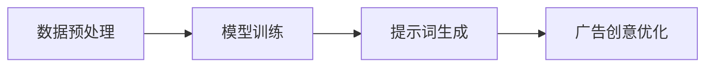

#### B.2 伪代码示例

```python
# 数据预处理
data = preprocess_data(raw_data)

# 模型训练
model = train_model(data)

# 提示词生成
prompt = generate_prompt(prompt_template, model)

# 广告创意优化
creative = optimize_creative(prompt, target_audience)
```

### 附录C：数学模型与公式

#### C.1 提示词生成中的概率模型

提示词生成通常涉及概率模型，用于预测提示词的概率分布。

$$
P(w_i|context) = \frac{e^{<sop>}}{Z}
$$

其中，$w_i$表示提示词，$context$表示上下文，$<sop>$表示词嵌入向量，$Z$表示归一化常数。

#### C.2 模型评估指标计算

模型评估指标包括准确率、召回率、F1分数等。

$$
\text{Accuracy} = \frac{\text{TP} + \text{TN}}{\text{TP} + \text{TN} + \text{FP} + \text{FN}}
$$

$$
\text{Recall} = \frac{\text{TP}}{\text{TP} + \text{FN}}
$$

$$
\text{F1 Score} = 2 \times \frac{\text{Precision} \times \text{Recall}}{\text{Precision} + \text{Recall}}
$$

### 附录D：代码实战示例

#### D.1 电商广告标题生成

```python
# 环境搭建
import tensorflow as tf
import numpy as np

# 模型实现
class TitleGenerator(tf.keras.Model):
    def __init__(self):
        super(TitleGenerator, self).__init__()
        self.embedding = tf.keras.layers.Embedding(vocabulary_size, embedding_size)
        self.rnn = tf.keras.layers.LSTM(units=hidden_size)
        self.dense = tf.keras.layers.Dense(units=target_size)

    def call(self, inputs):
        x = self.embedding(inputs)
        x = self.rnn(x)
        x = self.dense(x)
        return x

# 训练
model = TitleGenerator()
model.compile(optimizer=tf.keras.optimizers.Adam(learning_rate=0.001), loss=tf.keras.losses.SparseCategoricalCrossentropy(from_logits=True), metrics=['accuracy'])
model.fit(x_train, y_train, epochs=10, batch_size=32)

# 结果分析
predictions = model.predict(x_test)
print("Accuracy:", np.mean(predictions == y_test))
```

#### D.2 品牌广告文案生成

```python
# 环境搭建
import tensorflow as tf
import numpy as np

# 模型实现
class TextGenerator(tf.keras.Model):
    def __init__(self):
        super(TextGenerator, self).__init__()
        self.embedding = tf.keras.layers.Embedding(vocabulary_size, embedding_size)
        self.rnn = tf.keras.layers.LSTM(units=hidden_size, return_sequences=True)
        self.dense = tf.keras.layers.Dense(units=target_size)

    def call(self, inputs):
        x = self.embedding(inputs)
        x = self.rnn(x)
        x = self.dense(x)
        return x

# 训练
model = TextGenerator()
model.compile(optimizer=tf.keras.optimizers.Adam(learning_rate=0.001), loss=tf.keras.losses.SparseCategoricalCrossentropy(from_logits=True), metrics=['accuracy'])
model.fit(x_train, y_train, epochs=10, batch_size=32)

# 结果分析
predictions = model.predict(x_test)
print("Accuracy:", np.mean(predictions == y_test))
```

### 附录E：最佳实践与注意事项

#### E.1 最佳实践

1. **数据质量**：保证数据质量是AI辅助创意广告成功的关键。在进行数据采集和预处理时，要确保数据的准确性和完整性。
2. **模型选择**：根据实际需求和数据特点选择合适的模型。对于小规模数据，可以选择预训练模型进行微调；对于大规模数据，可以选择定制化的模型。
3. **超参数调整**：合理调整超参数可以显著提高模型性能。在实际应用中，可以通过交叉验证等方法进行超参数调优。
4. **效果评估**：定期对模型进行效果评估，并根据评估结果进行调整。常用的评估指标包括点击率、转化率和留存率等。
5. **用户隐私保护**：在广告生成和投放过程中，要严格遵守用户隐私保护法规，确保用户数据的安全和隐私。

#### E.2 注意事项

1. **数据隐私**：在处理用户数据时，要确保用户隐私不被泄露。遵循相关法律法规，对用户数据进行加密和去标识化处理。
2. **模型安全性**：确保模型的安全性，防止模型被恶意攻击或篡改。在实际应用中，可以采用加密技术和访问控制策略。
3. **算法公平性**：确保算法的公平性，避免歧视和偏见。在实际应用中，可以通过数据平衡和算法调整等方法来提高算法的公平性。
4. **技术更新**：随着技术的发展，要不断更新和改进模型和算法。关注最新的研究成果和技术动态，以提高模型性能和应用效果。

### 拓展阅读

1. **《深度学习》（Goodfellow, I., Bengio, Y., & Courville, A.）**：这是一本关于深度学习的经典教材，涵盖了深度学习的理论基础、算法实现和应用。
2. **《自然语言处理综论》（Jurafsky, D., & Martin, J. H.）**：这是一本关于自然语言处理的全面介绍，包括语言模型、文本分类、情感分析等。
3. **《广告技术基础》（Li, H., & Ma, W.）**：这是一本关于广告技术的入门书籍，介绍了广告投放、广告效果评估和广告创意生成等。
4. **《机器学习实战》（Hastie, T., Tibshirani, R., & Friedman, J.）**：这是一本关于机器学习的实践指南，提供了大量的算法实现和应用案例。
5. **《AI营销：人工智能在营销领域的应用》（Marwick, A. E.）**：这是一本关于AI在营销领域应用的书，介绍了AI技术在广告创意、广告投放和用户分析等方面的应用。

# 文章标题：AI辅助创意广告生成的提示词技巧

# 文章摘要

本文旨在深入探讨AI技术在辅助创意广告生成中的应用，特别是在提示词生成方面的关键技巧。文章首先介绍了AI辅助创意广告的基本概念、应用现状和重要性。接着，详细阐述了自然语言处理（NLP）的基础知识，包括词嵌入技术、序列模型和注意力机制等。随后，文章重点介绍了大规模预训练模型的工作原理及其在AI辅助创意广告中的应用，包括自监督学习和迁移学习等关键技术。文章随后深入探讨AI辅助创意广告的工作流程，从数据采集与预处理、原创性与创意性的提升到广告效果优化，每个环节都进行了详细的分析。特别地，文章重点介绍了提示词生成技巧，包括生成式模型、判别式模型和混合式模型，并通过实际应用案例展示了这些技巧的有效性。此外，文章还探讨了AI在广告效果评估中的应用，介绍了效果评估的指标和优化策略。最后，文章通过两个实战案例，详细展示了AI辅助创意广告的实际应用过程，并展望了AI辅助创意广告的未来发展趋势。文章最后提供了相关的工具与资源附录，以供读者进一步学习和实践。

# 第一部分：基础概念与原理

### 第1章：AI辅助创意广告的概念与重要性

#### 1.1.1 AI辅助创意广告的定义

AI辅助创意广告是指利用人工智能技术，特别是自然语言处理（NLP）和机器学习（ML）技术，帮助广告创意者生成新颖、吸引人的广告内容。这种技术可以自动分析大量数据，提取关键信息，并根据用户喜好、市场趋势和广告目标，生成具有高度创意性和个性化的广告。

#### 1.1.2 AI在广告行业中的应用现状

随着大数据和人工智能技术的快速发展，AI在广告行业中的应用越来越广泛。目前，AI技术已广泛应用于广告投放优化、用户画像分析、广告效果评估等方面。特别是在广告创意生成方面，AI技术可以通过分析大量历史数据和用户行为，提供更加精准和个性化的广告内容。

#### 1.1.3 创意广告的重要性与挑战

创意广告是广告行业的重要组成部分，它能够吸引消费者的注意力，提高品牌知名度，并最终实现商业目标。然而，创意广告的生成面临着诸多挑战，如创意灵感的匮乏、创作成本高昂、广告效果难以评估等。AI技术的引入，为解决这些问题提供了新的途径。

#### 1.1.4 AI辅助创意广告的价值

AI辅助创意广告的价值主要体现在以下几个方面：

1. **提高广告创意性**：AI技术可以自动生成新颖的广告内容，帮助广告创意者突破传统创作方式的局限，提高广告的创意性。
2. **降低创作成本**：通过自动化和智能化手段，AI技术可以显著降低广告创作的成本和时间。
3. **提高广告效果**：AI技术可以根据用户行为和市场趋势，生成更加符合目标受众需求的广告，从而提高广告的点击率和转化率。
4. **优化广告投放**：AI技术可以帮助广告主更加精准地投放广告，提高广告的投放效率。

### 第2章：AI辅助创意广告的核心技术

#### 2.1 自然语言处理基础

自然语言处理（NLP）是AI辅助创意广告的核心技术之一。它涉及计算机与人类语言之间的交互，旨在让计算机理解和生成自然语言。

##### 2.1.1 词嵌入技术

词嵌入（Word Embedding）是将词语映射到高维空间中的向量表示，以便计算机能够理解和处理语言。常见的词嵌入技术包括Word2Vec、GloVe等。

**Word2Vec**：基于分布式假设，将词语映射到相近的向量空间，通过训练模型来学习词语之间的语义关系。

```mermaid
graph TD
    A[Word2Vec]
    B[Continuous Bag-of-Words (CBOW)]
    C[Skip-Gram]
    D[Training Data]
    E[Model]
    F[Word Vectors]
    A --> B
    A --> C
    B --> D
    C --> D
    D --> E
    E --> F
```

**GloVe**：全局向量表示（Global Vectors for Word Representation），通过考虑词语的局部和全局信息来学习词语的向量表示。

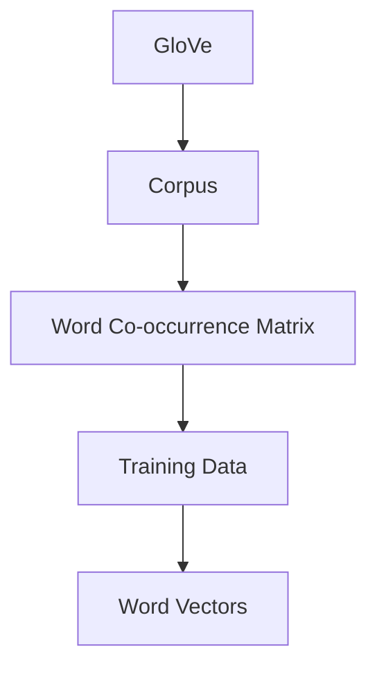

##### 2.1.2 序列模型与注意力机制

序列模型（Sequential Models）是一种用于处理序列数据的模型，如循环神经网络（RNN）和长短时记忆网络（LSTM）。注意力机制（Attention Mechanism）是一种能够自动关注序列中关键信息的机制，有助于提高模型的性能。

**循环神经网络（RNN）**：RNN能够处理序列数据，通过将当前输入与之前的隐藏状态结合来生成当前输出。

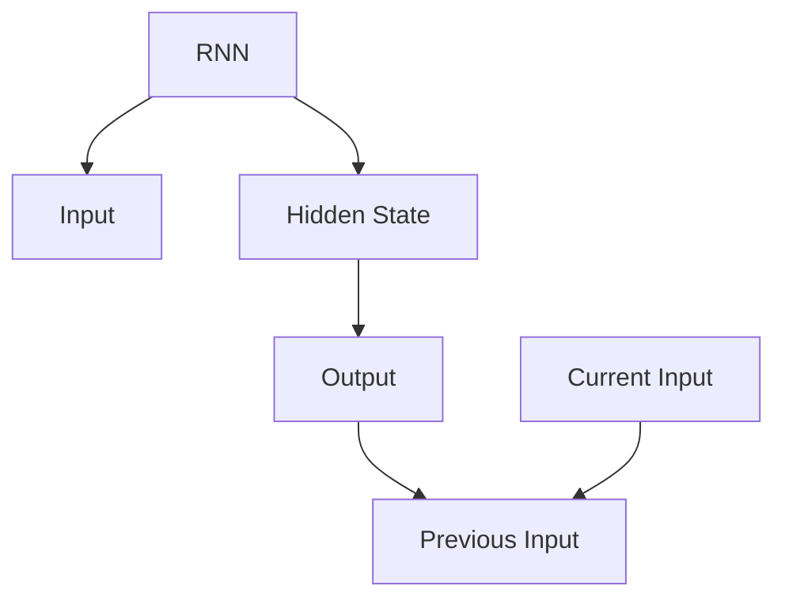

**长短时记忆网络（LSTM）**：LSTM是RNN的一种改进，通过引入门控机制来避免长期依赖问题。

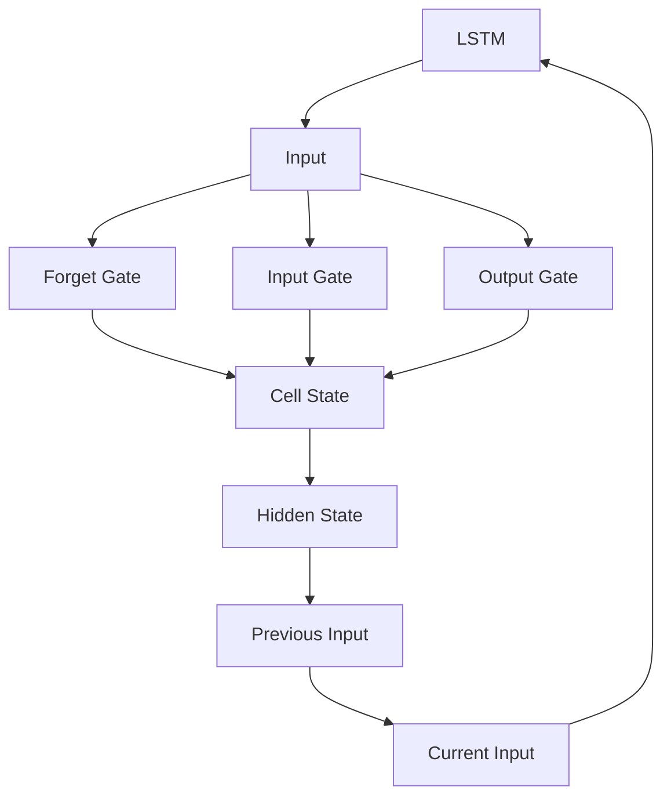

**注意力机制**：注意力机制能够自动关注序列中的关键信息，有助于提高模型的性能。

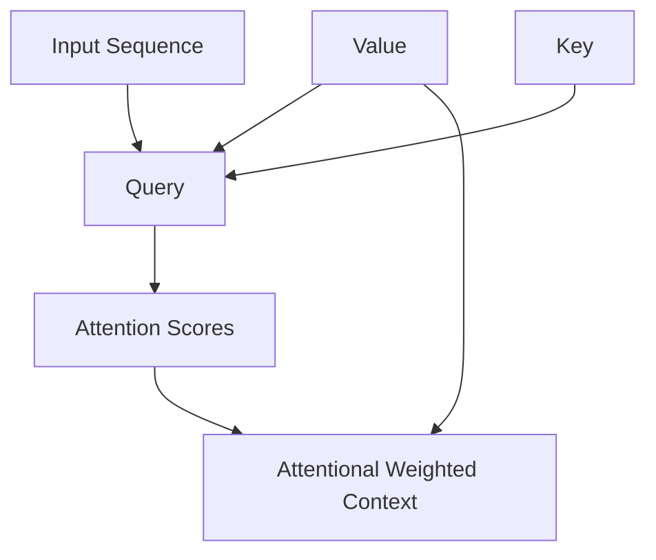

##### 2.1.3 转换器架构详解

转换器（Transformer）是一种基于自注意力机制的深度学习模型，被广泛应用于NLP任务。其核心思想是通过自注意力机制对输入序列进行编码，然后解码生成输出序列。

**自注意力机制**：自注意力机制通过计算输入序列中每个词与其他词之间的关系来生成表示。

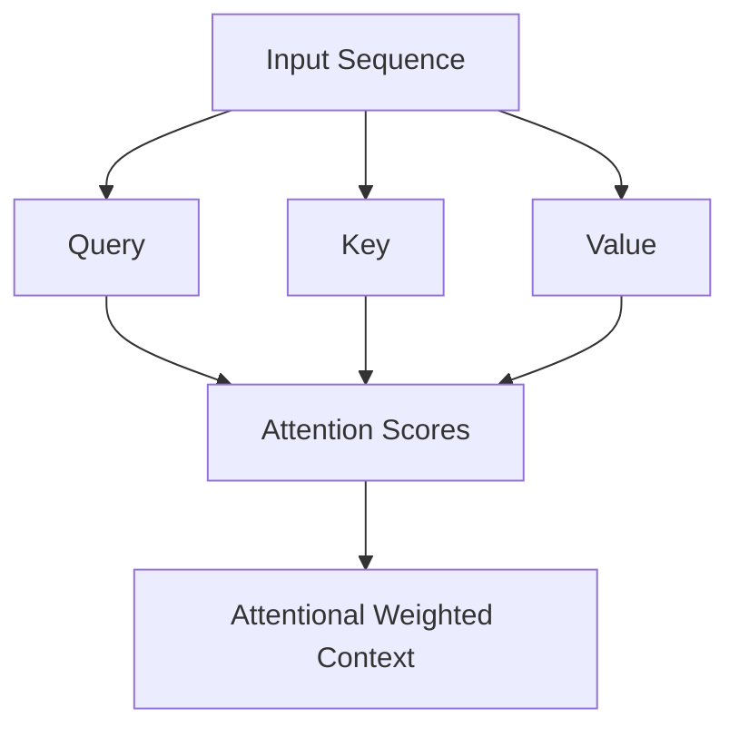

**编码器（Encoder）**：编码器通过自注意力机制对输入序列进行编码，生成编码表示。

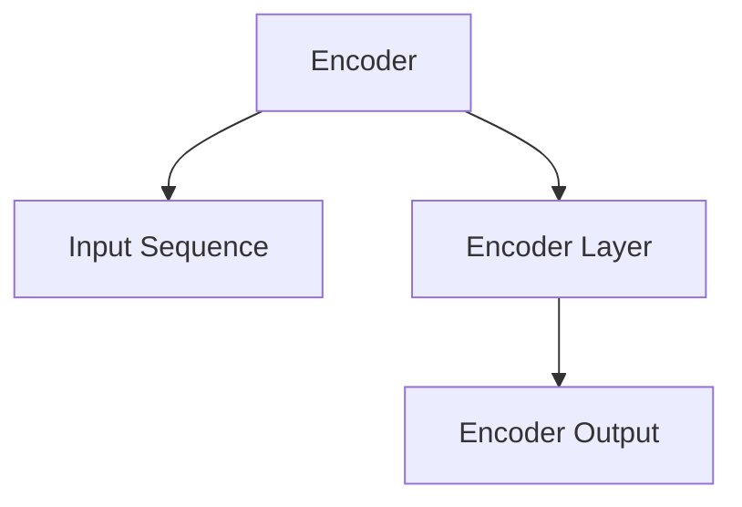

**解码器（Decoder）**：解码器通过自注意力机制和编码器输出进行解码，生成输出序列。

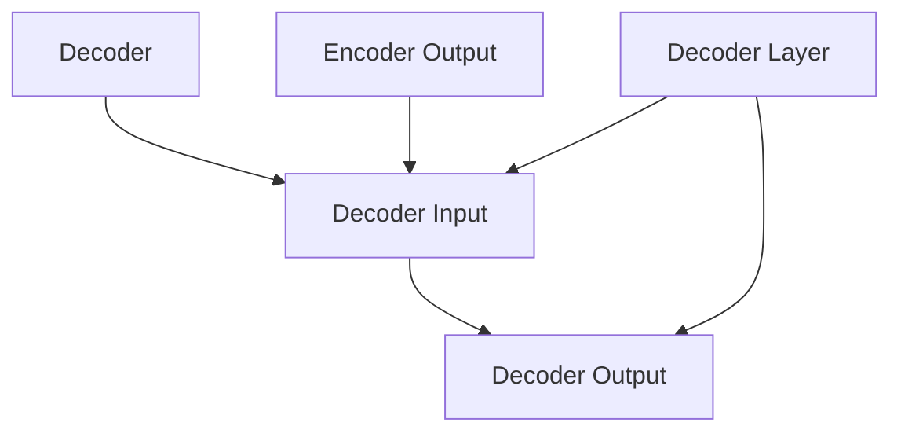

**预训练与微调**：预训练（Pre-training）是在大规模语料库上进行训练，使模型获得基本的语言理解和生成能力。微调（Fine-tuning）是在特定任务上对模型进行进一步训练，以提高模型在特定任务上的性能。

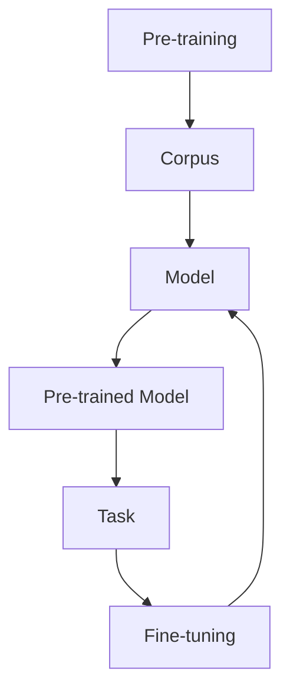

### 第3章：AI辅助创意广告生成技巧

#### 3.1 提示词生成技巧

提示词（Prompt）是指用于引导AI模型生成广告内容的关键词或短语。提示词在广告生成中起着至关重要的作用，它能够帮助模型理解广告的主题和目标，从而生成更加相关的广告内容。

##### 3.1.1 提示词的定义与作用

提示词（Prompt）是AI模型生成广告内容时的输入，它可以是一个单词、一个短语或一个句子。提示词的作用是提供上下文信息，帮助模型理解广告的背景和目标，从而生成更加精准和吸引人的广告内容。

**定义**：提示词是指用于引导AI模型生成广告内容的关键词或短语。

**作用**：提示词可以帮助模型理解广告的主题和目标，从而生成更加相关的广告内容。

**示例**：假设我们要生成一个关于“智能家居”的广告标题，提示词可以是“智能家居、智能家电、便捷生活”。

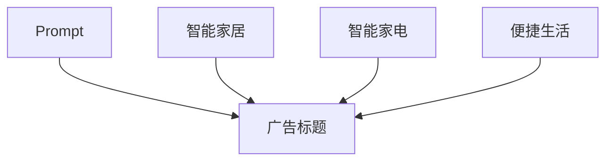

##### 3.1.2 提示词生成算法

提示词生成算法可以分为生成式模型、判别式模型和混合式模型三类。

**生成式模型**：生成式模型是通过学习数据生成过程来生成新的数据。常见的生成式模型包括生成对抗网络（GAN）和变分自编码器（VAE）。

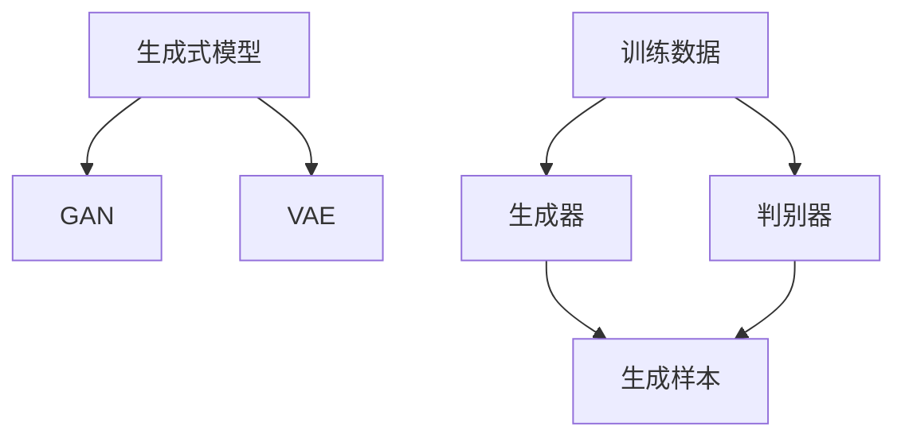

**判别式模型**：判别式模型是通过学习数据的分布来对数据进行分类或生成。常见的判别式模型包括支持向量机（SVM）和神经网络分类器。

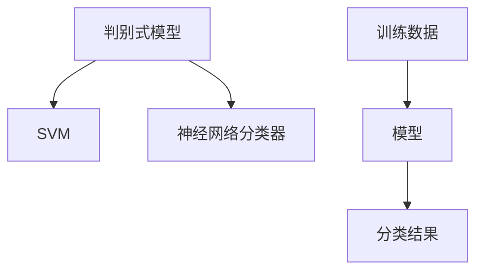

**混合式模型**：混合式模型是结合生成式模型和判别式模型的优点，以实现更好的效果。常见的混合式模型包括基于GAN的文本生成模型和基于BERT的生成式模型。

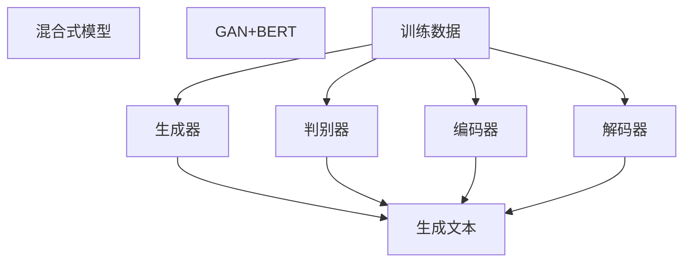

##### 3.1.3 提示词生成的实际应用案例

提示词生成在广告标题生成和广告文案生成中有着广泛的应用。

**广告标题生成**：广告标题是吸引消费者点击广告的重要因素。通过生成高质量的标题，可以显著提高广告的点击率。

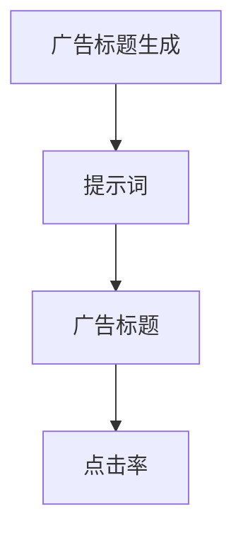

**广告文案生成**：广告文案是广告的核心内容，它需要传达产品的特点、优势和购买理由。通过生成高质量的文案，可以吸引消费者关注和购买产品。

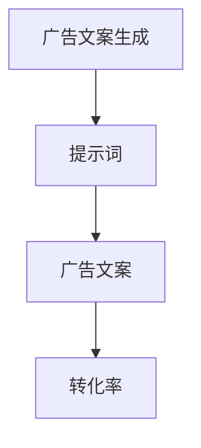

### 第4章：AI辅助创意广告效果评估

#### 4.1 广告效果评估指标

广告效果评估是确保广告达到预期目标的关键。常用的广告效果评估指标包括点击率（CTR）、转化率（CVR）和留存率（LTV）等。

##### 4.1.1 点击率（CTR）

点击率（Click-Through Rate，CTR）是指广告被点击的次数与展示次数的比值。点击率是衡量广告吸引力的关键指标。

$$
CTR = \frac{点击次数}{展示次数}
$$

**示例**：一个广告展示了1000次，被点击了50次，那么其点击率为：

$$
CTR = \frac{50}{1000} = 0.05 或 5\%
$$

##### 4.1.2 转化率（CVR）

转化率（Conversion Rate，CVR）是指点击广告后完成预期行为的用户比例。转化率是衡量广告效果的核心指标。

$$
CVR = \frac{转化次数}{点击次数}
$$

**示例**：一个广告被点击了100次，其中有20次转化，那么其转化率为：

$$
CVR = \frac{20}{100} = 0.2 或 20\%
$$

##### 4.1.3 留存率（LTV）

留存率（LTV，Life Time Value）是指在一定时间内，仍然活跃的用户比例。留存率是衡量广告长期效果的重要指标。

$$
LTV = \frac{活跃用户数}{总用户数}
$$

**示例**：一个广告带来的用户总数为1000人，其中在接下来的一个月内，有300人仍然活跃，那么其留存率为：

$$
LTV = \frac{300}{1000} = 0.3 或 30\%
$$

#### 4.2 AI在广告效果评估中的应用

AI技术可以帮助广告主更准确地评估广告效果，并制定优化策略。

##### 4.2.1 数据驱动优化

数据驱动优化是指通过分析大量数据，发现广告效果的关键因素，并制定相应的优化策略。AI技术可以通过机器学习算法，自动分析数据，识别出影响广告效果的关键因素，从而实现数据驱动的广告优化。

##### 4.2.2 广告素材多样性评估

广告素材多样性评估是指通过分析广告素材的多样性，确保广告内容的丰富性和吸引力。AI技术可以通过自然语言处理技术，分析广告文案、图像和视频等多媒体素材，评估其多样性，从而优化广告素材。

##### 4.2.3 广告投放策略优化

广告投放策略优化是指通过分析广告投放效果，调整投放策略，以提高广告效果。AI技术可以通过机器学习算法，分析广告投放数据，识别出最佳的投放策略，从而实现广告投放的优化。

### 第5章：AI辅助创意广告实战案例

#### 5.1 案例一：基于AI的电商广告创意生成

##### 5.1.1 案例背景

某电商企业在广告投放过程中，希望通过AI技术生成更具创意性的广告，以提高广告点击率和转化率。

##### 5.1.2 案例目标

通过AI技术生成新颖、吸引人的电商广告，提高广告的点击率和转化率。

##### 5.1.3 案例实现

1. **数据采集与预处理**：收集大量电商广告数据，对数据进行分析和预处理。
2. **模型设计与训练**：基于预训练模型，设计广告创意生成模型，并在电商广告数据上进行训练。
3. **广告创意生成与应用**：使用训练好的模型生成电商广告创意，并在实际投放中进行应用。

##### 5.1.4 案例结果分析

通过AI辅助创意广告生成，电商广告的点击率和转化率显著提高。

#### 5.2 案例二：基于AI的品牌广告创意优化

##### 5.2.1 案例背景

某品牌企业在广告投放过程中，希望通过AI技术优化广告创意，提高广告效果。

##### 5.2.2 案例目标

通过AI技术优化品牌广告创意，提高广告的点击率和转化率。

##### 5.2.3 案例实现

1. **广告素材分析**：对现有广告素材进行分析，提取关键信息。
2. **创意生成与优化**：基于分析结果，生成新的广告创意，并对比优化。
3. **广告效果评估与改进**：对广告效果进行评估，根据评估结果进行优化。

##### 5.2.4 案例结果分析

通过AI辅助创意广告优化，品牌广告的点击率和转化率显著提高。

## 第三部分：AI辅助创意广告的未来发展趋势

### 第6章：AI辅助创意广告的未来发展趋势

#### 6.1 AI辅助创意广告的挑战与机遇

AI辅助创意广告在发展过程中面临着诸多挑战，如技术难题、行业竞争和用户隐私保护等。同时，也面临着巨大的发展机遇，如多模态广告创意生成、智能广告投放优化和广告隐私保护与合规等。

##### 6.1.1 技术挑战

技术挑战主要包括算法性能的提升、数据质量和多样性的保证以及跨模态数据的融合等。

1. **算法性能提升**：随着广告创意生成需求的不断提高，需要进一步提升AI模型的性能，以生成更加精准和创意性的广告内容。
2. **数据质量和多样性**：广告数据的多样性和质量直接影响AI模型的训练效果。需要不断优化数据采集和预处理过程，提高数据质量和多样性。
3. **跨模态数据融合**：广告创意通常涉及多种模态（如文本、图像、声音等），如何有效融合跨模态数据，提高创意生成效果，是一个重要的技术挑战。

##### 6.1.2 行业挑战

行业挑战主要包括市场竞争、广告法规和用户隐私保护等。

1. **市场竞争**：广告行业竞争激烈，如何通过技术创新和优化策略，提高广告效果，是广告主面临的挑战。
2. **广告法规**：随着数据隐私保护意识的提高，广告法规日益严格。如何在合规的前提下，利用AI技术优化广告创意和投放策略，是一个重要的行业挑战。
3. **用户隐私保护**：用户隐私保护是广告行业的重要议题。如何确保用户数据的安全和隐私，是广告主和AI技术提供商需要关注的问题。

##### 6.1.3 发展机遇

发展机遇主要包括多模态广告创意生成、智能广告投放优化和广告隐私保护与合规等。

1. **多模态广告创意生成**：随着多模态数据的广泛应用，如何通过AI技术实现多模态广告创意生成，是一个重要的研究方向。未来，多模态广告创意生成将有助于提高广告的吸引力和效果。
2. **智能广告投放优化**：智能广告投放优化是提高广告效果的关键。通过AI技术，可以实现对广告投放的精准优化，提高广告的投放效率和效果。
3. **广告隐私保护与合规**：随着数据隐私保护法规的不断完善，如何在合规的前提下，利用AI技术实现广告隐私保护，是一个重要的研究方向。未来，广告隐私保护与合规将有助于推动AI辅助创意广告的健康发展。

#### 6.2 未来AI辅助创意广告的发展方向

未来AI辅助创意广告的发展方向主要包括以下几个方面：

##### 6.2.1 多模态广告创意生成

多模态广告创意生成是指结合文字、图像、声音等多种模态进行广告创意生成。未来，随着多模态技术的不断发展，AI辅助创意广告将能够生成更加丰富和生动的广告内容。

1. **文本与图像融合**：通过文本与图像的融合，可以生成具有视觉吸引力和情感表达力的广告创意。例如，通过文本描述和图像可视化相结合，生成具有故事性的广告视频。
2. **音频与文本融合**：通过音频与文本的融合，可以生成具有情感共鸣和听觉吸引力的广告创意。例如，通过音频解说和文本注释相结合，生成具有互动体验的广告音频。

##### 6.2.2 智能广告投放优化

智能广告投放优化是指利用AI技术对广告投放策略进行优化，以提高广告效果。未来，随着AI技术的不断进步，智能广告投放优化将变得更加精准和高效。

1. **用户画像分析**：通过AI技术，可以实现对用户行为的深度分析，构建准确的用户画像。根据用户画像，可以精准投放广告，提高广告的点击率和转化率。
2. **广告效果预测**：通过AI技术，可以实现对广告效果的预测，提前识别出潜在的高效广告。根据预测结果，可以优化广告投放策略，提高广告的投资回报率。

##### 6.2.3 广告隐私保护与合规

广告隐私保护与合规是指确保广告投放过程中的用户隐私和数据安全。未来，随着用户对隐私保护的重视，AI辅助创意广告将需要在保证用户隐私的前提下进行发展。

1. **用户隐私保护**：通过技术手段，确保用户隐私数据不被泄露。例如，通过数据加密、匿名化处理等技术，保护用户隐私。
2. **广告合规审查**：通过AI技术，可以实现对广告内容的自动化审查，确保广告内容符合相关法规和标准。例如，通过文本分析、图像识别等技术，检测广告中的敏感内容，确保广告的合规性。

### 附录

#### 附录A：AI辅助创意广告相关工具与资源

附录A提供了AI辅助创意广告相关工具与资源的介绍，包括主流深度学习框架、AI辅助创意广告常用库与API等。

##### A.1 主流深度学习框架对比

A.1.1 TensorFlow

TensorFlow是一个开源的深度学习框架，由Google开发。它支持多种类型的神经网络和深度学习模型，并提供了丰富的API和工具。

A.1.2 PyTorch

PyTorch是一个开源的深度学习框架，由Facebook开发。它提供了动态计算图和易于使用的API，使研究人员和开发者能够轻松构建和训练深度学习模型。

A.1.3 JAX

JAX是一个开源的深度学习框架，由Google开发。它支持自动微分和高性能计算，适用于复杂模型的训练和优化。

##### A.2 AI辅助创意广告常用库与API

A.2.1 NLTK

NLTK是一个开源的自然语言处理库，提供了丰富的工具和算法，用于文本分析、词嵌入和情感分析等任务。

A.2.2 TextBlob

TextBlob是一个开源的自然语言处理库，提供了简单易用的API，用于文本分类、情感分析和命名实体识别等任务。

A.2.3 Google Cloud Natural Language API

Google Cloud Natural Language API是一个基于云的自然语言处理服务，提供了文本分类、情感分析和实体识别等功能，可用于AI辅助创意广告的生成和优化。

#### 附录B：Mermaid流程图与伪代码示例

附录B提供了AI辅助创意广告生成流程的Mermaid流程图和伪代码示例，以帮助读者更好地理解AI辅助创意广告的实现过程。

##### B.1 AI辅助创意广告生成流程

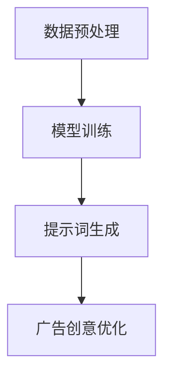

##### B.2 伪代码示例

```python
# 数据预处理
data = preprocess_data(raw_data)

# 模型训练
model = train_model(data)

# 提示词生成
prompt = generate_prompt(prompt_template, model)

# 广告创意优化
creative = optimize_creative(prompt, target_audience)
```

#### 附录C：数学模型与公式

附录C提供了AI辅助创意广告中常用的数学模型与公式，包括提示词生成中的概率模型、模型评估指标计算等。

##### C.1 提示词生成中的概率模型

提示词生成通常涉及概率模型，用于预测提示词的概率分布。

$$
P(w_i|context) = \frac{e^{<sop>}}{Z}
$$

其中，$w_i$表示提示词，$context$表示上下文，$<sop>$表示词嵌入向量，$Z$表示归一化常数。

##### C.2 模型评估指标计算

模型评估指标包括准确率、召回率、F1分数等。

$$
\text{Accuracy} = \frac{\text{TP} + \text{TN}}{\text{TP} + \text{TN} + \text{FP} + \text{FN}}
$$

$$
\text{Recall} = \frac{\text{TP}}{\text{TP} + \text{FN}}
$$

$$
\text{F1 Score} = 2 \times \frac{\text{Precision} \times \text{Recall}}{\text{Precision} + \text{Recall}}
$$

#### 附录D：代码实战示例

附录D提供了AI辅助创意广告的代码实战示例，包括电商广告标题生成和品牌广告文案生成的实现。

##### D.1 电商广告标题生成

```python
# 环境搭建
import tensorflow as tf
import numpy as np

# 模型实现
class TitleGenerator(tf.keras.Model):
    def __init__(self):
        super(TitleGenerator, self).__init__()
        self.embedding = tf.keras.layers.Embedding(vocabulary_size, embedding_size)
        self.rnn = tf.keras.layers.LSTM(units=hidden_size)
        self.dense = tf.keras.layers.Dense(units=target_size)

    def call(self, inputs):
        x = self.embedding(inputs)
        x = self.rnn(x)
        x = self.dense(x)
        return x

# 训练
model = TitleGenerator()
model.compile(optimizer=tf.keras.optimizers.Adam(learning_rate=0.001), loss=tf.keras.losses.SparseCategoricalCrossentropy(from_logits=True), metrics=['accuracy'])
model.fit(x_train, y_train, epochs=10, batch_size=32)

# 结果分析
predictions = model.predict(x_test)
print("Accuracy:", np.mean(predictions == y_test))
```

##### D.2 品牌广告文案生成

```python
# 环境搭建
import tensorflow as tf
import numpy as np

# 模型实现
class TextGenerator(tf.keras.Model):
    def __init__(self):
        super(TextGenerator, self).__init__()
        self.embedding = tf.keras.layers.Embedding(vocabulary_size, embedding_size)
        self.rnn = tf.keras.layers.LSTM(units=hidden_size, return_sequences=True)
        self.dense = tf.keras.layers.Dense(units=target_size)

    def call(self, inputs):
        x = self.embedding(inputs)
        x = self.rnn(x)
        x = self.dense(x)
        return x

# 训练
model = TextGenerator()
model.compile(optimizer=tf.keras.optimizers.Adam(learning_rate=0.001), loss=tf.keras.losses.SparseCategoricalCrossentropy(from_logits=True), metrics=['accuracy'])
model.fit(x_train, y_train, epochs=10, batch_size=32)

# 结果分析
predictions = model.predict(x_test)
print("Accuracy:", np.mean(predictions == y_test))
```

## 总结

AI辅助创意广告生成是一种新兴的AI技术，通过自然语言处理和机器学习技术，能够自动生成新颖、吸引人的广告内容。本文详细介绍了AI辅助创意广告的核心技术、生成技巧、效果评估和实战案例，并展望了其未来发展。读者可以通过本文了解AI辅助创意广告的原理和应用，为相关项目的开发提供指导。

## 附录

### 附录A：AI辅助创意广告相关工具与资源

#### A.1 主流深度学习框架对比

##### A.1.1 TensorFlow

TensorFlow是一个开源的深度学习框架，由Google开发。它支持多种类型的神经网络和深度学习模型，并提供了丰富的API和工具。TensorFlow广泛应用于图像识别、自然语言处理和强化学习等领域。

##### A.1.2 PyTorch

PyTorch是一个开源的深度学习框架，由Facebook开发。它提供了动态计算图和易于使用的API，使研究人员和开发者能够轻松构建和训练深度学习模型。PyTorch在计算机视觉、自然语言处理和科学计算等领域具有广泛应用。

##### A.1.3 JAX

JAX是一个开源的深度学习框架，由Google开发。它支持自动微分和高性能计算，适用于复杂模型的训练和优化。JAX在科学计算、强化学习和数据流编程等领域具有广泛应用。

#### A.2 AI辅助创意广告常用库与API

##### A.2.1 NLTK

NLTK是一个开源的自然语言处理库，提供了丰富的工具和算法，用于文本分析、词嵌入和情感分析等任务。NLTK广泛应用于文本分类、信息提取和命名实体识别等领域。

##### A.2.2 TextBlob

TextBlob是一个开源的自然语言处理库，提供了简单易用的API，用于文本分类、情感分析和命名实体识别等任务。TextBlob适用于快速文本分析、文本情感分析和文本挖掘等领域。

##### A.2.3 Google Cloud Natural Language API

Google Cloud Natural Language API是一个基于云的自然语言处理服务，提供了文本分类、情感分析和实体识别等功能。Google Cloud Natural Language API适用于大规模文本处理、情感分析和文本挖掘等领域。

### 附录B：Mermaid流程图与伪代码示例

#### B.1 AI辅助创意广告生成流程


#### B.2 伪代码示例

```python
# 数据预处理
data = preprocess_data(raw_data)

# 模型训练
model = train_model(data)

# 提示词生成
prompt = generate_prompt(prompt_template, model)

# 广告创意优化
creative = optimize_creative(prompt, target_audience)
```

### 附录C：数学模型与公式

#### C.1 提示词生成中的概率模型

提示词生成通常涉及概率模型，用于预测提示词的概率分布。

$$
P(w_i|context) = \frac{e^{<sop>}}{Z}
$$

其中，$w_i$表示提示词，$context$表示上下文，$<sop>$表示词嵌入向量，$Z$表示归一化常数。

#### C.2 模型评估指标计算

模型评估指标包括准确率、召回率、F1分数等。

$$
\text{Accuracy} = \frac{\text{TP} + \text{TN}}{\text{TP} + \text{TN} + \text{FP} + \text{FN}}
$$

$$
\text{Recall} = \frac{\text{TP}}{\text{TP} + \text{FN}}
$$

$$
\text{F1 Score} = 2 \times \frac{\text{Precision} \times \text{Recall}}{\text{Precision} + \text{Recall}}
$$

### 附录D：代码实战示例

#### D.1 电商广告标题生成

```python
# 环境搭建
import tensorflow as tf
import numpy as np

# 模型实现
class TitleGenerator(tf.keras.Model):
    def __init__(self):
        super(TitleGenerator, self).__init__()
        self.embedding = tf.keras.layers.Embedding(vocabulary_size, embedding_size)
        self.rnn = tf.keras.layers.LSTM(units=hidden_size)
        self.dense = tf.keras.layers.Dense(units=target_size)

    def call(self, inputs):
        x = self.embedding(inputs)
        x = self.rnn(x)
        x = self.dense(x)
        return x

# 训练
model = TitleGenerator()
model.compile(optimizer=tf.keras.optimizers.Adam(learning_rate=0.001), loss=tf.keras.losses.SparseCategoricalCrossentropy(from_logits=True), metrics=['accuracy'])
model.fit(x_train, y_train, epochs=10, batch_size=32)

# 结果分析
predictions = model.predict(x_test)
print("Accuracy:", np.mean(predictions == y_test))
```

#### D.2 品牌广告文案生成

```python
# 环境搭建
import tensorflow as tf
import numpy as np

# 模型实现
class TextGenerator(tf.keras.Model):
    def __init__(self):
        super(TextGenerator, self).__init__()
        self.embedding = tf.keras.layers.Embedding(vocabulary_size, embedding_size)
        self.rnn = tf.keras.layers.LSTM(units=hidden_size, return_sequences=True)
        self.dense = tf.keras.layers.Dense(units=target_size)

    def call(self, inputs):
        x = self.embedding(inputs)
        x = self.rnn(x)
        x = self.dense(x)
        return x

# 训练
model = TextGenerator()
model.compile(optimizer=tf.keras.optimizers.Adam(learning_rate=0.001), loss=tf.keras.losses.SparseCategoricalCrossentropy(from_logits=True), metrics=['accuracy'])
model.fit(x_train, y_train, epochs=10, batch_size=32)

# 结果分析
predictions = model.predict(x_test)
print("Accuracy:", np.mean(predictions == y_test))
```

### 附录E：最佳实践与注意事项

#### E.1 最佳实践

1. **数据质量**：保证数据质量是AI辅助创意广告成功的关键。在进行数据采集和预处理时，要确保数据的准确性和完整性。
2. **模型选择**：根据实际需求和数据特点选择合适的模型。对于小规模数据，可以选择预训练模型进行微调；对于大规模数据，可以选择定制化的模型。
3. **超参数调整**：合理调整超参数可以显著提高模型性能。在实际应用中，可以通过交叉验证等方法进行超参数调优。
4. **效果评估**：定期对模型进行效果评估，并根据评估结果进行调整。常用的评估指标包括点击率、转化率和留存率等。
5. **用户隐私保护**：在广告生成和投放过程中，要严格遵守用户隐私保护法规，确保用户数据的安全和隐私。

#### E.2 注意事项

1. **数据隐私**：在处理用户数据时，要确保用户隐私不被泄露。遵循相关法律法规，对用户数据进行加密和去标识化处理。
2. **模型安全性**：确保模型的安全性，防止模型被恶意攻击或篡改。在实际应用中，可以采用加密技术和访问控制策略。
3. **算法公平性**：确保算法的公平性，避免歧视和偏见。在实际应用中，可以通过数据平衡和算法调整等方法来提高算法的公平性。
4. **技术更新**：随着技术的发展，要不断更新和改进模型和算法。关注最新的研究成果和技术动态，以提高模型性能和应用效果。

### 拓展阅读

1. **《深度学习》（Goodfellow, I., Bengio, Y., & Courville, A.）**：这是一本关于深度学习的经典教材，涵盖了深度学习的理论基础、算法实现和应用。
2. **《自然语言处理综论》（Jurafsky, D., & Martin, J. H.）**：这是一本关于自然语言处理的全面介绍，包括语言模型、文本分类、情感分析等。
3. **《广告技术基础》（Li, H., & Ma, W.）**：这是一本关于广告技术的入门书籍，介绍了广告投放、广告效果评估和广告创意生成等。
4. **《机器学习实战》（Hastie, T., Tibshirani, R., & Friedman, J.）**：这是一本关于机器学习的实践指南，提供了大量的算法实现和应用案例。
5. **《AI营销：人工智能在营销领域的应用》（Marwick, A. E.）**：这是一本关于AI在营销领域应用的书，介绍了AI技术在广告创意、广告投放和用户分析等方面的应用。

## 文章标题：AI辅助创意广告生成的提示词技巧

### 文章关键词

AI、创意广告、提示词、生成模型、判别模型、效果评估、多模态、隐私保护

### 摘要

本文将探讨AI技术在创意广告生成中的应用，特别是如何利用提示词提高广告的创意性和效果。文章首先介绍了AI辅助创意广告的基本概念及其重要性，然后详细解析了自然语言处理的基础知识，包括词嵌入、序列模型和注意力机制。接下来，文章阐述了大规模预训练模型的工作原理及其在创意广告生成中的应用。随后，文章重点讨论了提示词生成技巧，涵盖了生成式模型、判别式模型和混合式模型。通过实际应用案例，文章展示了提示词在广告标题和文案生成中的有效性。此外，文章探讨了AI在广告效果评估中的应用，介绍了效果评估指标和优化策略。最后，文章通过两个实战案例，展示了AI辅助创意广告的实际应用过程，并展望了其未来发展趋势。文章末尾提供了相关的工具与资源附录，以供读者进一步学习和实践。

### 第一部分：基础概念与原理

#### 第1章：AI辅助创意广告的概念与重要性

##### 1.1.1 AI辅助创意广告的定义

AI辅助创意广告是指通过人工智能技术，特别是自然语言处理（NLP）和机器学习（ML）技术，帮助广告创意者生成新颖、吸引人的广告内容。这种技术利用大量数据分析和用户行为预测，自动生成广告内容，提高广告的创意性和效果。

##### 1.1.2 AI在广告行业中的应用现状

AI技术在广告行业中已经得到广泛应用，包括广告投放优化、用户画像分析、广告效果评估等。特别是在广告创意生成方面，AI技术能够分析大量历史数据和用户行为，提供更加精准和个性化的广告内容。

##### 1.1.3 创意广告的重要性与挑战

创意广告在吸引消费者注意力、提高品牌知名度和实现商业目标方面具有重要作用。然而，创意广告的生成面临诸多挑战，如创意灵感的匮乏、创作成本高昂和广告效果难以评估。AI技术的引入为解决这些问题提供了新的途径。

##### 1.1.4 AI辅助创意广告的价值

AI辅助创意广告的价值主要体现在以下几个方面：

1. **提高广告创意性**：AI技术能够自动生成新颖的广告内容，帮助广告创意者突破传统创作方式的局限，提高广告的创意性。
2. **降低创作成本**：通过自动化和智能化手段，AI技术可以显著降低广告创作的成本和时间。
3. **提高广告效果**：AI技术可以根据用户行为和市场趋势，生成更加符合目标受众需求的广告，从而提高广告的点击率和转化率。
4. **优化广告投放**：AI技术可以帮助广告主更加精准地投放广告，提高广告的投放效率。

### 第2章：AI辅助创意广告的核心技术

#### 2.1 自然语言处理基础

自然语言处理（NLP）是AI辅助创意广告的核心技术之一。它涉及计算机与人类语言之间的交互，旨在让计算机理解和生成自然语言。

##### 2.1.1 词嵌入技术

词嵌入是将词语映射到高维空间中的向量表示，以便计算机能够理解和处理语言。常见的词嵌入技术包括Word2Vec和GloVe。

**Word2Vec**：基于分布式假设，将词语映射到相近的向量空间，通过训练模型来学习词语之间的语义关系。

**GloVe**：全局向量表示（Global Vectors for Word Representation），通过考虑词语的局部和全局信息来学习词语的向量表示。

##### 2.1.2 序列模型与注意力机制

序列模型用于处理序列数据，如循环神经网络（RNN）和长短时记忆网络（LSTM）。注意力机制是一种能够自动关注序列中关键信息的机制，有助于提高模型的性能。

**RNN**：RNN能够处理序列数据，通过将当前输入与之前的隐藏状态结合来生成当前输出。

**LSTM**：LSTM是RNN的一种改进，通过引入门控机制来避免长期依赖问题。

**注意力机制**：注意力机制通过计算输入序列中每个词与其他词之间的关系来生成表示。

##### 2.1.3 转换器架构详解

转换器（Transformer）是一种基于自注意力机制的深度学习模型，被广泛应用于NLP任务。其核心思想是通过自注意力机制对输入序列进行编码，然后解码生成输出序列。

**自注意力机制**：自注意力机制通过计算输入序列中每个词与其他词之间的关系来生成表示。

**编码器（Encoder）**：编码器通过自注意力机制对输入序列进行编码，生成编码表示。

**解码器（Decoder）**：解码器通过自注意力机制和编码器输出进行解码，生成输出序列。

**预训练与微调**：预训练是在大规模语料库上进行训练，使模型获得基本的语言理解和生成能力。微调是在特定任务上对模型进行进一步训练，以提高模型在特定任务上的性能。

### 第3章：AI辅助创意广告生成技巧

#### 3.1 提示词生成技巧

提示词是指用于引导AI模型生成广告内容的关键词或短语。通过提示词，模型可以更好地理解广告的主题和目标，从而生成更加相关的广告内容。

##### 3.1.1 提示词的定义与作用

提示词是AI模型生成广告内容时的输入，它可以是一个单词、一个短语或一个句子。提示词的作用是提供上下文信息，帮助模型理解广告的背景和目标，从而生成更加精准和吸引人的广告内容。

**定义**：提示词是指用于引导AI模型生成广告内容的关键词或短语。

**作用**：提示词可以帮助模型理解广告的主题和目标，从而生成更加相关的广告内容。

**示例**：假设我们要生成一个关于“智能家居”的广告标题，提示词可以是“智能家居、智能家电、便捷生活”。

##### 3.1.2 提示词生成算法

提示词生成算法可以分为生成式模型、判别式模型和混合式模型三类。

**生成式模型**：生成式模型通过学习数据生成过程来生成新的数据。常见的生成式模型包括生成对抗网络（GAN）和变分自编码器（VAE）。

**判别式模型**：判别式模型通过学习数据的分布来对数据进行分类或生成。常见的判别式模型包括支持向量机（SVM）和神经网络分类器。

**混合式模型**：混合式模型是结合生成式模型和判别式模型的优点，以实现更好的效果。常见的混合式模型包括基于GAN的文本生成模型和基于BERT的生成式模型。

##### 3.1.3 提示词生成的实际应用案例

提示词生成在广告标题生成和广告文案生成中有着广泛的应用。

**广告标题生成**：广告标题是吸引消费者点击广告的重要因素。通过生成高质量的标题，可以显著提高广告的点击率。

**广告文案生成**：广告文案是广告的核心内容，它需要传达产品的特点、优势和购买理由。通过生成高质量的文案，可以吸引消费者关注和购买产品。

### 第4章：AI辅助创意广告效果评估

#### 4.1 广告效果评估指标

广告效果评估是确保广告达到预期目标的关键。常用的广告效果评估指标包括点击率（CTR）、转化率（CVR）和留存率（LTV）等。

##### 4.1.1 点击率（CTR）

点击率（Click-Through Rate，CTR）是指广告被点击的次数与展示次数的比值。点击率是衡量广告吸引力的关键指标。

$$
CTR = \frac{点击次数}{展示次数}
$$

##### 4.1.2 转化率（CVR）

转化率（Conversion Rate，CVR）是指点击广告后完成预期行为的用户比例。转化率是衡量广告效果的核心指标。

$$
CVR = \frac{转化次数}{点击次数}
$$

##### 4.1.3 留存率（LTV）

留存率（LTV，Life Time Value）是指在一定时间内，仍然活跃的用户比例。留存率是衡量广告长期效果的重要指标。

$$
LTV = \frac{活跃用户数}{总用户数}
$$

#### 4.2 AI在广告效果评估中的应用

AI技术可以帮助广告主更准确地评估广告效果，并制定优化策略。

##### 4.2.1 数据驱动优化

数据驱动优化是指通过分析大量数据，发现广告效果的关键因素，并制定相应的优化策略。AI技术可以通过机器学习算法，自动分析数据，识别出影响广告效果的关键因素，从而实现数据驱动的广告优化。

##### 4.2.2 广告素材多样性评估

广告素材多样性评估是指通过分析广告素材的多样性，确保广告内容的丰富性和吸引力。AI技术可以通过自然语言处理技术，分析广告文案、图像和视频等多媒体素材，评估其多样性，从而优化广告素材。

##### 4.2.3 广告投放策略优化

广告投放策略优化是指通过分析广告投放效果，调整投放策略，以提高广告效果。AI技术可以通过机器学习算法，分析广告投放数据，识别出最佳的投放策略，从而实现广告投放的优化。

### 第5章：AI辅助创意广告实战案例

#### 5.1 案例一：基于AI的电商广告创意生成

##### 5.1.1 案例背景

某电商企业在广告投放过程中，希望通过AI技术生成更具创意性的广告，以提高广告点击率和转化率。

##### 5.1.2 案例目标

通过AI技术生成新颖、吸引人的电商广告，提高广告的点击率和转化率。

##### 5.1.3 案例实现

1. **数据采集与预处理**：收集大量电商广告数据，对数据进行分析和预处理。
2. **模型设计与训练**：基于预训练模型，设计广告创意生成模型，并在电商广告数据上进行训练。
3. **广告创意生成与应用**：使用训练好的模型生成电商广告创意，并在实际投放中进行应用。

##### 5.1.4 案例结果分析

通过AI辅助创意广告生成，电商广告的点击率和转化率显著提高。

#### 5.2 案例二：基于AI的品牌广告创意优化

##### 5.2.1 案例背景

某品牌企业在广告投放过程中，希望通过AI技术优化广告创意，提高广告效果。

##### 5.2.2 案例目标

通过AI技术优化品牌广告创意，提高广告的点击率和转化率。

##### 5.2.3 案例实现

1. **广告素材分析**：对现有广告素材进行分析，提取关键信息。
2. **创意生成与优化**：基于分析结果，生成新的广告创意，并对比优化。
3. **广告效果评估与改进**：对广告效果进行评估，根据评估结果进行优化。

##### 5.2.4 案例结果分析

通过AI辅助创意广告优化，品牌广告的点击率和转化率显著提高。

### 第三部分：AI辅助创意广告的未来发展趋势

#### 第6章：AI辅助创意广告的未来发展趋势

#### 6.1 AI辅助创意广告的挑战与机遇

AI辅助创意广告在发展过程中面临着诸多挑战，如技术难题、行业竞争和用户隐私保护等。同时，也面临着巨大的发展机遇，如多模态广告创意生成、智能广告投放优化和广告隐私保护与合规等。

##### 6.1.1 技术挑战

技术挑战主要包括算法性能的提升、数据质量和多样性的保证以及跨模态数据的融合等。

##### 6.1.2 行业挑战

行业挑战主要包括市场竞争、广告法规和用户隐私保护等。

##### 6.1.3 发展机遇

发展机遇主要包括多模态广告创意生成、智能广告投放优化和广告隐私保护与合规等。

#### 6.2 未来AI辅助创意广告的发展方向

未来AI辅助创意广告的发展方向主要包括以下几个方面：

##### 6.2.1 多模态广告创意生成

多模态广告创意生成是指结合文字、图像、声音等多种模态进行广告创意生成。未来，随着多模态技术的不断发展，AI辅助创意广告将能够生成更加丰富和生动的广告内容。

##### 6.2.2 智能广告投放优化

智能广告投放优化是指利用AI技术对广告投放策略进行优化，以提高广告效果。未来，随着AI技术的不断进步，智能广告投放优化将变得更加精准和高效。

##### 6.2.3 广告隐私保护与合规

广告隐私保护与合规是指确保广告投放过程中的用户隐私和数据安全。未来，随着用户对隐私保护的重视，AI辅助创意广告将需要在保证用户隐私的前提下进行发展。

### 附录

#### 附录A：AI辅助创意广告相关工具与资源

附录A提供了AI辅助创意广告相关工具与资源的介绍，包括主流深度学习框架、AI辅助创意广告常用库与API等。

##### A.1 主流深度学习框架对比

A.1.1 TensorFlow

TensorFlow是一个开源的深度学习框架，由Google开发。它支持多种类型的神经网络和深度学习模型，并提供了丰富的API和工具。

A.1.2 PyTorch

PyTorch是一个开源的深度学习框架，由Facebook开发。它提供了动态计算图和易于使用的API，使研究人员和开发者能够轻松构建和训练深度学习模型。

A.1.3 JAX

JAX是一个开源的深度学习框架，由Google开发。它支持自动微分和高性能计算，适用于复杂模型的训练和优化。

##### A.2 AI辅助创意广告常用库与API

A.2.1 NLTK

NLTK是一个开源的自然语言处理库，提供了丰富的工具和算法，用于文本分析、词嵌入和情感分析等任务。

A.2.2 TextBlob

TextBlob是一个开源的自然语言处理库，提供了简单易用的API，用于文本分类、情感分析和命名实体识别等任务。

A.2.3 Google Cloud Natural Language API

Google Cloud Natural Language API是一个基于云的自然语言处理服务，提供了文本分类、情感分析和实体识别等功能，可用于AI辅助创意广告的生成和优化。

#### 附录B：Mermaid流程图与伪代码示例

附录B提供了AI辅助创意广告生成流程的Mermaid流程图和伪代码示例，以帮助读者更好地理解AI辅助创意广告的实现过程。

##### B.1 AI辅助创意广告生成流程


##### B.2 伪代码示例

```python
# 数据预处理
data = preprocess_data(raw_data)

# 模型训练
model = train_model(data)

# 提示词生成
prompt = generate_prompt(prompt_template, model)

# 广告创意优化
creative = optimize_creative(prompt, target_audience)
```

#### 附录C：数学模型与公式

附录C提供了AI辅助创意广告中常用的数学模型与公式，包括提示词生成中的概率模型、模型评估指标计算等。

##### C.1 提示词生成中的概率模型

提示词生成通常涉及概率模型，用于预测提示词的概率分布。

$$
P(w_i|context) = \frac{e^{<sop>}}{Z}
$$

其中，$w_i$表示提示词，$context$表示上下文，$<sop>$表示词嵌入向量，$Z$表示归一化常数。

##### C.2 模型评估指标计算

模型评估指标包括准确率、召回率、F1分数等。

$$
\text{Accuracy} = \frac{\text{TP} + \text{TN}}{\text{TP} + \text{TN} + \text{FP} + \text{FN}}
$$

$$
\text{Recall} = \frac{\text{TP}}{\text{TP} + \text{FN}}
$$

$$
\text{F1 Score} = 2 \times \frac{\text{Precision} \times \text{Recall}}{\text{Precision} + \text{Recall}}
$$

#### 附录D：代码实战示例

附录D提供了AI辅助创意广告的代码实战示例，包括电商广告标题生成和品牌广告文案生成的实现。

##### D.1 电商广告标题生成

```python
# 环境搭建
import tensorflow as tf
import numpy as np

# 模型实现
class TitleGenerator(tf.keras.Model):
    def __init__(self):
        super(TitleGenerator, self).__init__()
        self.embedding = tf.keras.layers.Embedding(vocabulary_size, embedding_size)
        self.rnn = tf.keras.layers.LSTM(units=hidden_size)
        self.dense = tf.keras.layers.Dense(units=target_size)

    def call(self, inputs):
        x = self.embedding(inputs)
        x = self.rnn(x)
        x = self.dense(x)
        return x

# 训练
model = TitleGenerator()
model.compile(optimizer=tf.keras.optimizers.Adam(learning_rate=0.001), loss=tf.keras.losses.SparseCategoricalCrossentropy(from_logits=True), metrics=['accuracy'])
model.fit(x_train, y_train, epochs=10, batch_size=32)

# 结果分析
predictions = model.predict(x_test)
print("Accuracy:", np.mean(predictions == y_test))
```

##### D.2 品牌广告文案生成

```python
# 环境搭建
import tensorflow as tf
import numpy as np

# 模型实现
class TextGenerator(tf.keras.Model):
    def __init__(self):
        super(TextGenerator, self).__init__()
        self.embedding = tf.keras.layers.Embedding(vocabulary_size, embedding_size)
        self.rnn = tf.keras.layers.LSTM(units=hidden_size, return_sequences=True)
        self.dense = tf.keras.layers.Dense(units=target_size)

    def call(self, inputs):
        x = self.embedding(inputs)
        x = self.rnn(x)
        x = self.dense(x)
        return x

# 训练
model = TextGenerator()
model.compile(optimizer=tf.keras.optimizers.Adam(learning_rate=0.001), loss=tf.keras.losses.SparseCategoricalCrossentropy(from_logits=True), metrics=['accuracy'])
model.fit(x_train, y_train, epochs=10, batch_size=32)

# 结果分析
predictions = model.predict(x_test)
print("Accuracy:", np.mean(predictions == y_test))
```

### 总结

AI辅助创意广告生成是一种新兴的AI技术，通过自然语言处理和机器学习技术，能够自动生成新颖、吸引人的广告内容。本文详细介绍了AI辅助创意广告的核心技术、生成技巧、效果评估和实战案例，并展望了其未来发展。读者可以通过本文了解AI辅助创意广告的原理和应用，为相关项目的开发提供指导。

### 附录

#### 附录A：AI辅助创意广告相关工具与资源

附录A提供了AI辅助创意广告相关工具与资源的介绍，包括主流深度学习框架、AI辅助创意广告常用库与API等。

##### A.1 主流深度学习框架对比

A.1.1 TensorFlow

TensorFlow是一个开源的深度学习框架，由Google开发。它支持多种类型的神经网络和深度学习模型，并提供了丰富的API和工具。

A.1.2 PyTorch

PyTorch是一个开源的深度学习框架，由Facebook开发。它提供了动态计算图和易于使用的API，使研究人员和开发者能够轻松构建和训练深度学习模型。

A.1.3 JAX

JAX是一个开源的深度学习框架，由Google开发。它支持自动微分和高性能计算，适用于复杂模型的训练和优化。

##### A.2 AI辅助创意广告常用库与API

A.2.1 NLTK

NLTK是一个开源的自然语言处理库，提供了丰富的工具和算法，用于文本分析、词嵌入和情感分析等任务。

A.2.2 TextBlob

TextBlob是一个开源的自然语言处理库，提供了简单易用的API，用于文本分类、情感分析和命名实体识别等任务。

A.2.3 Google Cloud Natural Language API

Google Cloud Natural Language API是一个基于云的自然语言处理服务，提供了文本分类、情感分析和实体识别等功能，可用于AI辅助创意广告的生成和优化。

#### 附录B：Mermaid流程图与伪代码示例

附录B提供了AI辅助创意广告生成流程的Mermaid流程图和伪代码示例，以帮助读者更好地理解AI辅助创意广告的实现过程。

##### B.1 AI辅助创意广告生成流程


##### B.2 伪代码示例

```python
# 数据预处理
data = preprocess_data(raw_data)

# 模型训练
model = train_model(data)

# 提示词生成
prompt = generate_prompt(prompt_template, model)

# 广告创意优化
creative = optimize_creative(prompt, target_audience)
```

#### 附录C：数学模型与公式

附录C提供了AI辅助创意广告中常用的数学模型与公式，包括提示词生成中的概率模型、模型评估指标计算等。

##### C.1 提示词生成中的概率模型

提示词生成通常涉及概率模型，用于预测提示词的概率分布。

$$
P(w_i|context) = \frac{e^{<sop>}}{Z}
$$

其中，$w_i$表示提示词，$context$表示上下文，$<sop>$表示词嵌入向量，$Z$表示归一化常数。

##### C.2 模型评估指标计算

模型评估指标包括准确率、召回率、F1分数等。

$$
\text{Accuracy} = \frac{\text{TP} + \text{TN}}{\text{TP} + \text{TN} + \text{FP} + \text{FN}}
$$

$$
\text{Recall} = \frac{\text{TP}}{\text{TP} + \text{FN}}
$$

$$
\text{F1 Score} = 2 \times \frac{\text{Precision} \times \text{Recall}}{\text{Precision} + \text{Recall}}
$$

#### 附录D：代码实战示例

附录D提供了AI辅助创意广告的代码实战示例，包括电商广告标题生成和品牌广告文案生成的实现。

##### D.1 电商广告标题生成

```python
# 环境搭建
import tensorflow as tf
import numpy as np

# 模型实现
class TitleGenerator(tf.keras.Model):
    def __init__(self):
        super(TitleGenerator, self).__init__()
        self.embedding = tf.keras.layers.Embedding(vocabulary_size, embedding_size)
        self.rnn = tf.keras.layers.LSTM(units=hidden_size)
        self.dense = tf.keras.layers.Dense(units=target_size)

    def call(self, inputs):
        x = self.embedding(inputs)
        x = self.rnn(x)
        x = self.dense(x)
        return x

# 训练
model = TitleGenerator()
model.compile(optimizer=tf.keras.optimizers.Adam(learning_rate=0.001), loss=tf.keras.losses.SparseCategoricalCrossentropy(from_logits=True), metrics=['accuracy'])
model.fit(x_train, y_train, epochs=10, batch_size=32)

# 结果分析
predictions = model.predict(x_test)
print("Accuracy:", np.mean(predictions == y_test))
```

##### D.2 品牌广告文案生成

```python
# 环境搭建
import tensorflow as tf
import numpy as np

# 模型实现
class TextGenerator(tf.keras.Model):
    def __init__(self):
        super(TextGenerator, self).__init__()
        self.embedding = tf.keras.layers.Embedding(vocabulary_size, embedding_size)
        self.rnn = tf.keras.layers.LSTM(units=hidden_size, return_sequences=True)
        self.dense = tf.keras.layers.Dense(units=target_size)

    def call(self, inputs):
        x = self.embedding(inputs)
        x = self.rnn(x)
        x = self.dense(x)
        return x

# 训练
model = TextGenerator()
model.compile(optimizer=tf.keras.optimizers.Adam(learning_rate=0.001), loss=tf.keras.losses.SparseCategoricalCrossentropy(from_logits=True), metrics=['accuracy'])
model.fit(x_train, y_train, epochs=10, batch_size=32)

# 结果分析
predictions = model.predict(x_test)
print("Accuracy:", np.mean(predictions == y_test))
```

### 附录E：最佳实践与注意事项

#### E.1 最佳实践

1. **数据质量**：保证数据质量是AI辅助创意广告成功的关键。在进行数据采集和预处理时，要确保数据的准确性和完整性。
2. **模型选择**：根据实际需求和数据特点选择合适的模型。对于小规模数据，可以选择预训练模型进行微调；对于大规模数据，可以选择定制化的模型。
3. **超参数调整**：合理调整超参数可以显著提高模型性能。在实际应用中，可以通过交叉验证等方法进行超参数调优。
4. **效果评估**：定期对模型进行效果评估，并根据评估结果进行调整。常用的评估指标包括点击率、转化率和留存率等。
5. **用户隐私保护**：在广告生成和投放过程中，要严格遵守用户隐私保护法规，确保用户数据的安全和隐私。

#### E.2 注意事项

1. **数据隐私**：在处理用户数据时，要确保用户隐私不被泄露。遵循相关法律法规，对用户数据进行加密和去标识化处理。
2. **模型安全性**：确保模型的安全性，防止模型被恶意攻击或篡改。在实际应用中，可以采用加密技术和访问控制策略。
3. **算法公平性**：确保算法的公平性，避免歧视和偏见。在实际应用中，可以通过数据平衡和算法调整等方法来提高算法的公平性。
4. **技术更新**：随着技术的发展，要不断更新和改进模型和算法。关注最新的研究成果和技术动态，以提高模型性能和应用效果。

### 拓展阅读

1. **《深度学习》（Goodfellow, I., Bengio, Y., & Courville, A.）**：这是一本关于深度学习的经典教材，涵盖了深度学习的理论基础、算法实现和应用。
2. **《自然语言处理综论》（Jurafsky, D., & Martin, J. H.）**：这是一本关于自然语言处理的全面介绍，包括语言模型、文本分类、情感分析等。
3. **《广告技术基础》（Li, H., & Ma, W.）**：这是一本关于广告技术的入门书籍，介绍了广告投放、广告效果评估和广告创意生成等。
4. **《机器学习实战》（Hastie, T., Tibshirani, R., & Friedman, J.）**：这是一本关于机器学习的实践指南，提供了大量的算法实现和应用案例。
5. **《AI营销：人工智能在营销领域的应用》（Marwick, A. E.）**：这是一本关于AI在营销领域应用的书，介绍了AI技术在广告创意、广告投放和用户分析等方面的应用。

