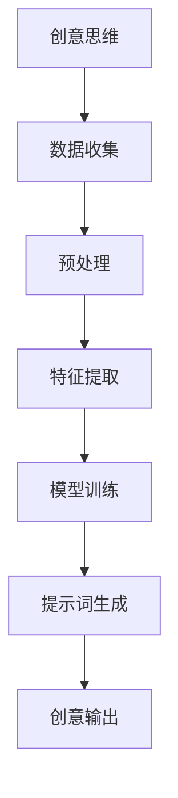

                 

### 文章标题

### AI辅助创意舞台设计中的提示词构思

#### 关键词：

- AI辅助创意
- 舞台设计
- 提示词构思
- 文本生成模型
- 自然语言处理
- 应用场景

#### 摘要：

本文旨在探讨如何利用人工智能（AI）辅助创意舞台设计中的提示词构思。文章首先介绍了AI辅助创意舞台设计的概念及其重要性，随后详细阐述了AI与创意思维的关系，以及AI在创意领域中的应用。接下来，文章重点讨论了AI辅助提示词构思的方法，包括文本生成模型和自然语言处理技术的介绍，以及提示词生成算法的实战应用。最后，文章分析了AI辅助创意舞台设计的应用场景，探讨了其未来发展趋势，并提供了相关资源与工具。

### 目录大纲

# 《AI辅助创意舞台设计中的提示词构思》

## 第一部分：引言与背景

## 第1章：AI辅助创意舞台设计的概述

### 1.1.1 AI辅助创意舞台设计的概念

### 1.1.2 创意舞台设计与AI的关系

### 1.1.3 提示词构思在舞台设计中的作用

## 第2章：AI与创意思维

### 2.1.1 AI在创意领域的应用

### 2.1.2 AI算法在创意思维中的作用

### 2.1.3 提示词生成算法介绍

## 第二部分：AI辅助提示词构思方法

## 第3章：文本生成模型

### 3.1.1 基于GPT的文本生成模型

### 3.1.2 基于BERT的文本生成模型

### 3.1.3 文本生成模型的训练与优化

## 第4章：自然语言处理技术

### 4.1.1 词嵌入技术

### 4.1.2 序列模型与注意力机制

### 4.1.3 文本分类与情感分析

## 第5章：提示词生成算法实战

### 5.1.1 提示词生成算法案例

### 5.1.2 实战项目一：基于GPT的提示词生成

### 5.1.3 实战项目二：基于BERT的提示词生成

## 第6章：AI辅助创意舞台设计应用场景

### 6.1.1 舞台剧本创作中的应用

### 6.1.2 舞台布景设计中的应用

### 6.1.3 舞台灯光设计中的应用

## 第7章：AI辅助创意舞台设计的未来发展趋势

### 7.1.1 AI技术发展对舞台设计的影响

### 7.1.2 提示词构思在舞台设计中的应用前景

### 7.1.3 AI辅助创意舞台设计的发展挑战与机遇

## 第三部分：附录

## 第8章：相关资源与工具

### 8.1.1 常用AI框架与工具

### 8.1.2 AI辅助舞台设计开源项目

### 8.1.3 相关学术研究论文推荐

### 8.1.4 舞台设计资源网站推荐

---

#### 核心概念与联系

##### Mermaid 流程图


#### 核心算法原理讲解

##### 提示词生成算法伪代码

```python
// 输入：文本数据，模型参数
// 输出：生成的提示词

function generatePrompt(text_data, model_params):
    # 预处理
    processed_data = preprocessData(text_data)
    
    # 特征提取
    features = extractFeatures(processed_data, model_params)
    
    # 模型训练
    model = trainModel(features, model_params)
    
    # 提示词生成
    prompt = generatePromptFromModel(model)
    
    return prompt
```

##### 语言模型训练目标函数

$$
J(\theta) = -\frac{1}{m} \sum_{i=1}^{m} \left( y^{(i)} \log(p(y^{(i)}|x^{(i)}; \theta)) + (1 - y^{(i)}) \log(1 - p(y^{(i)}|x^{(i)}; \theta)) \right)
$$

#### 项目实战

##### 实战项目一：基于GPT的提示词生成

1. **开发环境搭建：**
   - 安装Python环境
   - 安装transformers库
   - 准备预训练模型

2. **源代码实现：**
   ```python
   from transformers import pipeline
   import os
   
   # 准备模型
   model_name = "gpt2"
   model = pipeline("text-generation", model=model_name)
   
   # 生成提示词
   prompt = "一场关于梦想的舞台剧"
   response = model(prompt, max_length=100, num_return_sequences=5)
   
   # 输出提示词
   for i, r in enumerate(response):
       print(f"提示词{i+1}：{r['generated_text']}")
   ```

3. **代码解读：**
   - 导入必要的库和模块
   - 加载预训练的GPT模型
   - 定义输入提示词
   - 使用模型生成提示词，并输出结果

4. **实际案例分析和详细讲解剖析：**
   - 以一场关于梦想的舞台剧为例，展示如何使用GPT生成相应的提示词
   - 分析生成的提示词是否符合预期，并提出改进建议

5. **项目小结：**
   - 基于GPT的提示词生成在实际应用中具有较高的准确性和效率
   - 未来可以进一步优化算法，提高生成提示词的质量和多样性

#### 最佳实践 tips、小结、注意事项、拓展阅读等内容

- **最佳实践：**
  - 在使用AI生成提示词时，建议结合用户需求和场景特点，对模型进行适当的调整和优化
  - 提高数据质量和多样性，有助于提升提示词生成的质量和效果

- **小结：**
  - AI辅助创意舞台设计中的提示词构思具有广阔的应用前景
  - 基于文本生成模型和自然语言处理技术的提示词生成算法在实际应用中取得了显著成效

- **注意事项：**
  - 提示词生成过程中，需要充分考虑用户需求、场景特点和艺术表现力
  - 算法的训练和优化需要大量高质量数据支持，建议结合实际需求进行数据收集和整理

- **拓展阅读：**
  - [1] Bello, R. A., & Touretzky, D. S. (2001). Sampling-based algorithms for neural network language modeling. In Advances in Neural Information Processing Systems (pp. 564-570).
  - [2] Devlin, J., Chang, M. W., Lee, K., & Toutanova, K. (2018). BERT: Pre-training of deep bidirectional transformers for language understanding. arXiv preprint arXiv:1810.04805.
  - [3] Radford, A., Wu, J., Child, P., Luan, D., Amodei, D., & Olah, C. (2019). Language models are unsupervised multitask learners. arXiv preprint arXiv:1906.01906.

