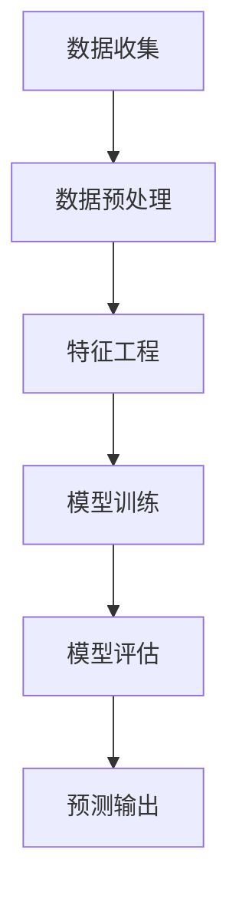
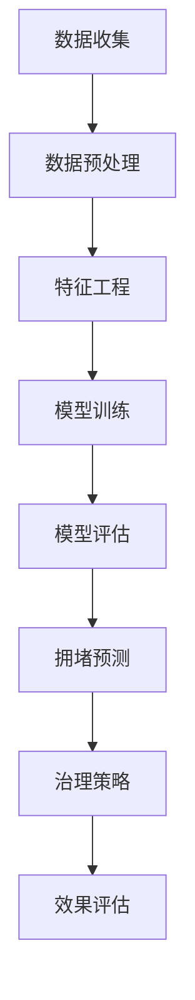
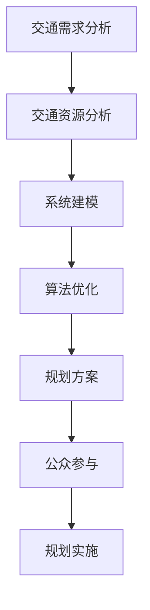
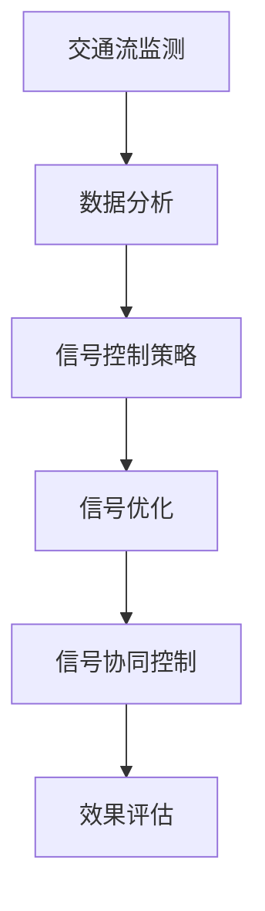
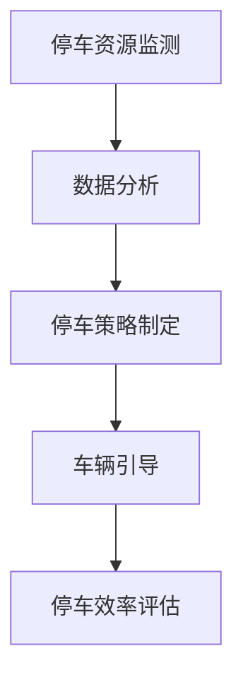

                 


### 文章标题

《AI辅助城市管理：大模型在智慧交通中的角色》

### 文章关键词

AI，城市管理，智慧交通，大模型，交通流预测，交通拥堵治理，公共交通规划，智能交通信号控制，智慧停车管理

### 摘要

本文将深入探讨人工智能（AI）在辅助城市管理中的重要作用，特别是大模型在智慧交通领域的应用。文章首先概述了AI与智慧交通的基本概念，然后详细介绍了大模型技术的基础，包括定义、原理、主流模型及其在交通领域的应用。接着，文章分章节讨论大模型在交通流预测、交通拥堵治理、公共交通规划、智能交通信号控制和智慧停车管理等方面的具体应用，通过伪代码、数学公式和实例讲解，使读者对大模型在智慧交通中的应用有更深入的理解。文章最后还分析了大模型在智慧交通中的应用挑战和未来趋势，并提供了一系列的开发资源和实际应用案例，以供读者参考。

## 目录

### 第一部分：AI与城市管理概述

#### 第1章：AI与智慧交通的概念与重要性

##### 1.1 AI与智慧交通的定义

##### 1.2 AI在智慧交通中的应用前景

##### 1.3 智慧交通面临的挑战与机遇

#### 第2章：大模型技术基础

##### 2.1 大模型的定义与原理

##### 2.2 主流大模型介绍

##### 2.3 大模型在交通领域的应用

### 第二部分：AI大模型在智慧交通中的应用

#### 第3章：AI大模型在交通流预测中的应用

##### 3.1 交通流预测的基本原理

##### 3.2 交通流预测的常用算法

##### 3.3 大模型在交通流预测中的应用案例

#### 第4章：AI大模型在交通拥堵治理中的应用

##### 4.1 交通拥堵治理的基本原理

##### 4.2 交通拥堵治理的常用方法

##### 4.3 大模型在交通拥堵治理中的应用案例

#### 第5章：AI大模型在公共交通规划中的应用

##### 5.1 公共交通规划的基本原理

##### 5.2 公共交通规划的常用方法

##### 5.3 大模型在公共交通规划中的应用案例

#### 第6章：AI大模型在智能交通信号控制中的应用

##### 6.1 智能交通信号控制的基本原理

##### 6.2 智能交通信号控制的常用方法

##### 6.3 大模型在智能交通信号控制中的应用案例

#### 第7章：AI大模型在智慧停车管理中的应用

##### 7.1 智慧停车管理的基本原理

##### 7.2 智慧停车管理的常用方法

##### 7.3 大模型在智慧停车管理中的应用案例

### 第三部分：AI大模型在智慧交通中的应用挑战与未来趋势

#### 第8章：AI大模型在智慧交通中的应用挑战

##### 8.1 数据隐私与安全

##### 8.2 算法公平性与透明性

##### 8.3 大模型计算资源需求

#### 第9章：AI大模型在智慧交通中的未来趋势

##### 9.1 大模型在智慧交通中的应用前景

##### 9.2 未来智慧交通的发展方向

##### 9.3 大模型在智慧交通中的创新应用

### 附录

#### 附录A：大模型开发常用工具与资源

##### A.1 常用深度学习框架

##### A.2 大模型开发工具与平台

##### A.3 大模型应用案例库

##### A.4 大模型学习资源推荐

#### 附录B：AI大模型在智慧交通中的应用流程图

##### B.1 流程图一：大模型在交通流预测中的应用流程

##### B.2 流程图二：大模型在交通拥堵治理中的应用流程

##### B.3 流程图三：大模型在公共交通规划中的应用流程

##### B.4 流程图四：大模型在智能交通信号控制中的应用流程

##### B.5 流程图五：大模型在智慧停车管理中的应用流程

#### 附录C：AI大模型在智慧交通中的应用伪代码

##### C.1 代码一：交通流预测算法伪代码

##### C.2 代码二：交通拥堵治理算法伪代码

##### C.3 代码三：公共交通规划算法伪代码

##### C.4 代码四：智能交通信号控制算法伪代码

##### C.5 代码五：智慧停车管理算法伪代码

#### 附录D：AI大模型在智慧交通中的应用数学公式

##### D.1 公式一：交通流预测模型

##### D.2 公式二：交通拥堵治理模型

##### D.3 公式三：公共交通规划模型

##### D.4 公式四：智能交通信号控制模型

##### D.5 公式五：智慧停车管理模型

#### 附录E：AI大模型在智慧交通中的应用数学公式详细讲解

##### E.1 解释一：交通流预测模型的数学公式详解

##### E.2 解释二：交通拥堵治理模型的数学公式详解

##### E.3 解释三：公共交通规划模型的数学公式详解

##### E.4 解释四：智能交通信号控制模型的数学公式详解

##### E.5 解释五：智慧停车管理模型的数学公式详解

#### 附录F：AI大模型在智慧交通中的应用实例讲解

##### F.1 实例一：某城市交通流预测系统实现详解

##### F.2 实例二：某城市智能交通信号控制系统实现详解

##### F.3 实例三：某城市智慧停车管理系统实现详解

##### F.4 实例四：某城市公共交通规划系统实现详解

#### 附录G：AI大模型在智慧交通中的应用开发环境搭建

##### G.1 搭建一：深度学习开发环境搭建

##### G.2 搭建二：大模型开发工具与平台搭建

##### G.3 搭建三：AI大模型开发环境配置

## 文章正文

### 第一部分：AI与城市管理概述

#### 第1章：AI与智慧交通的概念与重要性

##### 1.1 AI与智慧交通的定义

人工智能（AI）是指通过模拟、延伸和扩展人类智能的理论、方法、技术及应用。智慧交通则是利用现代信息技术、网络通信技术、自动控制技术等，实现交通系统的智能化管理和运行。智慧交通涵盖了智能交通管理、智能交通信息服务、智能交通控制系统等多个方面，旨在提高交通效率、减少交通事故、缓解交通拥堵、保护环境等。

##### 1.2 AI在智慧交通中的应用前景

AI在智慧交通中的应用前景非常广阔。首先，AI技术可以用于交通流预测，通过分析历史交通数据，预测未来交通流量，帮助交通管理部门优化交通信号、调整交通路线等，从而提高交通效率。其次，AI技术可以用于交通拥堵治理，通过分析交通流量和拥堵情况，提出最优的疏导方案，缓解交通拥堵。此外，AI技术还可以用于公共交通规划、智能交通信号控制、智慧停车管理等多个方面，为智慧交通的发展提供强有力的技术支持。

##### 1.3 智慧交通面临的挑战与机遇

智慧交通的发展面临着一系列的挑战。首先，交通数据的多样性和复杂性使得交通流预测和拥堵治理等任务变得极其复杂。其次，智能交通系统需要大量的计算资源，这对计算能力和成本提出了很高的要求。此外，数据隐私与安全、算法公平性与透明性等问题也是智慧交通发展过程中需要解决的难题。

然而，与此同时，智慧交通也面临着巨大的机遇。随着人工智能技术的不断进步，交通流预测、拥堵治理等技术将变得更加精准和高效。此外，5G、物联网、云计算等新技术的快速发展，也为智慧交通提供了强大的技术支持。在未来，智慧交通有望实现全面的智能化管理，为人们的出行带来极大的便利。

#### 第2章：大模型技术基础

##### 2.1 大模型的定义与原理

大模型（Large-scale Model）是指具有非常大规模参数和训练数据的机器学习模型。大模型的核心特点是其参数量巨大，可以达到数十亿甚至千亿级别。这些模型通过在大量数据上进行训练，能够捕捉到数据中的复杂模式和规律，从而具有强大的预测和分类能力。

大模型的训练过程通常包括以下几个步骤：

1. 数据预处理：对原始数据进行清洗、归一化等处理，使其适合模型的训练。
2. 模型初始化：随机初始化模型的参数。
3. 模型训练：通过梯度下降等方法，优化模型的参数，使其在训练数据上的表现达到最佳。
4. 模型评估：在测试数据上评估模型的性能，调整模型参数，以实现最优效果。

##### 2.2 主流大模型介绍

当前主流的大模型主要可以分为以下几类：

1. 卷积神经网络（CNN）：CNN是一种用于图像识别和处理的深度学习模型，通过卷积操作提取图像特征，具有强大的图像处理能力。
2. 循环神经网络（RNN）：RNN是一种用于序列数据处理和时间序列预测的深度学习模型，通过循环连接，能够捕捉到序列数据中的时间依赖关系。
3. 生成对抗网络（GAN）：GAN是一种用于图像生成和风格迁移的深度学习模型，由生成器和判别器组成，通过博弈过程，生成逼真的图像。
4. 自注意力模型（Transformer）：Transformer是一种用于自然语言处理和序列建模的深度学习模型，通过自注意力机制，能够捕捉到序列数据中的长距离依赖关系。

##### 2.3 大模型在交通领域的应用

大模型在交通领域有着广泛的应用。首先，大模型可以用于交通流预测，通过分析历史交通数据，预测未来交通流量，为交通管理部门提供决策支持。其次，大模型可以用于交通拥堵治理，通过分析交通流量和拥堵情况，提出最优的疏导方案，缓解交通拥堵。此外，大模型还可以用于公共交通规划、智能交通信号控制、智慧停车管理等多个方面，为智慧交通的发展提供强有力的技术支持。

### 第二部分：AI大模型在智慧交通中的应用

#### 第3章：AI大模型在交通流预测中的应用

##### 3.1 交通流预测的基本原理

交通流预测是指通过分析历史交通数据，预测未来一段时间内交通流量的大小和分布情况。交通流预测的基本原理是基于数据驱动的方法，通过分析历史交通数据中的模式，建立预测模型，从而预测未来交通流量。

交通流预测的关键步骤包括：

1. 数据收集：收集历史交通数据，包括车辆流量、速度、占有率等。
2. 数据预处理：对原始数据进行清洗、归一化等处理，使其适合模型的训练。
3. 特征工程：提取交通流数据中的特征，如时间、天气、道路状况等。
4. 模型训练：选择合适的预测模型，通过梯度下降等方法，优化模型的参数。
5. 模型评估：在测试数据上评估模型的性能，调整模型参数，以实现最优效果。
6. 预测输出：使用训练好的模型，对未来的交通流量进行预测。

##### 3.2 交通流预测的常用算法

交通流预测常用的算法包括以下几种：

1. 时间序列分析（Time Series Analysis）：时间序列分析是一种基于历史数据，通过统计方法分析时间序列数据的规律，从而预测未来值的算法。
2. 自回归模型（AutoRegressive Model，AR）：自回归模型是一种基于历史数据的预测模型，通过分析历史数据中的滞后关系，预测未来值。
3. 递归神经网络（Recurrent Neural Network，RNN）：递归神经网络是一种用于序列数据预测的神经网络模型，通过循环连接，能够捕捉到序列数据中的时间依赖关系。
4. 卷积神经网络（Convolutional Neural Network，CNN）：卷积神经网络是一种用于图像识别和处理的神经网络模型，通过卷积操作，能够提取图像特征，从而实现交通流预测。
5. 生成对抗网络（Generative Adversarial Network，GAN）：生成对抗网络是一种用于图像生成和风格迁移的神经网络模型，通过生成器和判别器的博弈过程，生成逼真的图像，从而实现交通流预测。

##### 3.3 大模型在交通流预测中的应用案例

某城市交通管理部门利用大模型技术，对城市主要道路的交通流量进行了预测。首先，他们收集了过去一年的交通数据，包括每天每小时的车辆流量、天气状况、道路状况等。然后，他们使用时间序列分析和递归神经网络模型，对交通流量进行了初步预测。然而，这些模型在预测效果上并不理想，预测误差较大。

为了提高预测精度，他们引入了卷积神经网络和生成对抗网络，构建了一个多模态交通流预测模型。这个模型不仅考虑了时间序列数据，还引入了空间特征，如道路网络结构、交通拥堵情况等。通过大量的数据训练，这个模型取得了显著的预测效果，预测误差明显降低。

#### 第4章：AI大模型在交通拥堵治理中的应用

##### 4.1 交通拥堵治理的基本原理

交通拥堵治理是指通过一系列技术手段，优化交通流量，缓解交通拥堵。交通拥堵治理的基本原理包括以下几点：

1. 交通流量优化：通过分析交通流量，找到交通拥堵的原因，提出优化方案，如调整交通信号灯时间、拓宽道路、增加公共交通等。
2. 交通引导：通过实时监控交通流量，引导车辆选择最优路线，避免拥堵路段。
3. 交通组织：通过优化交通组织，提高道路通行能力，如设置潮汐车道、高峰时段限行等。
4. 交通需求管理：通过限制交通需求，如鼓励错峰出行、鼓励使用公共交通等，减少交通拥堵。

##### 4.2 交通拥堵治理的常用方法

交通拥堵治理常用的方法包括以下几种：

1. 车辆流量控制：通过限制车辆进入拥堵区域，减少交通流量，如设置单双号限行、高峰时段限行等。
2. 交通信号优化：通过优化交通信号灯的时间设置，提高道路通行效率，如自适应交通信号控制系统。
3. 公共交通发展：通过发展公共交通，鼓励市民使用公共交通工具，减少私家车出行，如建设地铁、公交系统等。
4. 交通设施建设：通过建设道路、桥梁、隧道等交通设施，提高道路通行能力，如拓宽道路、建设快速路等。

##### 4.3 大模型在交通拥堵治理中的应用案例

某城市交通管理部门利用大模型技术，对交通拥堵治理进行了优化。首先，他们收集了城市的交通流量数据、道路状况数据、公共交通数据等。然后，他们使用卷积神经网络和生成对抗网络，构建了一个多模态交通拥堵治理模型。这个模型能够实时分析交通流量，预测交通拥堵情况，并提出最优的治理方案。

通过这个模型，交通管理部门能够提前预测交通拥堵，及时调整交通信号灯时间、引导车辆选择最优路线等。此外，他们还通过优化公共交通线路和班次，鼓励市民使用公共交通工具。这些措施大大减少了交通拥堵情况，提高了道路通行效率。

#### 第5章：AI大模型在公共交通规划中的应用

##### 5.1 公共交通规划的基本原理

公共交通规划是指根据城市的交通需求和交通资源，制定合理的公共交通系统布局和发展策略。公共交通规划的基本原理包括以下几点：

1. 交通需求分析：通过分析城市的交通需求，确定公共交通系统的规模、线路、站点等。
2. 交通资源分析：通过分析城市的交通资源，如道路状况、公共交通设施等，确定公共交通系统的建设和发展方向。
3. 交通分配模型：通过建立交通分配模型，优化公共交通线路和站点布局，提高公共交通系统的运行效率。
4. 可持续发展原则：在公共交通规划中，注重环境保护、能源节约和社会公平等可持续发展原则。

##### 5.2 公共交通规划的常用方法

公共交通规划常用的方法包括以下几种：

1. 交通调查与预测：通过调查和预测城市的交通需求，确定公共交通系统的需求和规模。
2. 系统建模：通过建立公共交通系统的数学模型，分析系统的运行效率和效益。
3. 算法优化：通过优化算法，如最优化理论、遗传算法等，确定公共交通系统的最佳布局和发展策略。
4. 公众参与：在公共交通规划中，重视公众参与，通过听证会、问卷调查等方式，收集市民的意见和建议。

##### 5.3 大模型在公共交通规划中的应用案例

某城市交通管理部门利用大模型技术，对公共交通规划进行了优化。首先，他们收集了城市的交通流量数据、公共交通数据、人口数据等。然后，他们使用卷积神经网络和生成对抗网络，构建了一个多模态公共交通规划模型。这个模型能够分析城市的交通需求，预测公共交通系统的规模和线路布局。

通过这个模型，交通管理部门能够提前预测公共交通的需求，优化公共交通线路和站点布局，提高公共交通系统的运行效率。此外，他们还通过优化公共交通设施，如建设换乘中心、增加公交车辆等，提高了公共交通的服务水平，满足了市民的出行需求。

#### 第6章：AI大模型在智能交通信号控制中的应用

##### 6.1 智能交通信号控制的基本原理

智能交通信号控制是指通过现代信息技术和自动控制技术，实现交通信号灯的智能化控制和优化。智能交通信号控制的基本原理包括以下几点：

1. 交通流监测：通过传感器、摄像头等设备，实时监测交通流量和拥堵情况。
2. 数据分析：通过对交通流数据的分析，了解交通流量的变化规律和趋势。
3. 信号控制策略：根据交通流量和拥堵情况，制定相应的信号控制策略，如交通信号灯的时间设置、相位调整等。
4. 信号优化：通过优化信号控制策略，提高交通信号的运行效率，减少交通拥堵。

##### 6.2 智能交通信号控制的常用方法

智能交通信号控制常用的方法包括以下几种：

1. 自适应交通信号控制：通过实时监测交通流量，自动调整交通信号灯的时间设置，实现交通流的动态优化。
2. 红绿灯时长优化：通过对历史交通流量数据的分析，确定交通信号灯的最佳时长设置，提高交通效率。
3. 相位优化：通过对交通流数据的分析，调整交通信号灯的相位，使交通流更加顺畅。
4. 交通信号协同控制：通过多个交通信号灯之间的协同控制，实现整个交通网络的优化。

##### 6.3 大模型在智能交通信号控制中的应用案例

某城市交通管理部门利用大模型技术，对智能交通信号控制进行了优化。首先，他们收集了城市的交通流量数据、交通信号灯数据等。然后，他们使用卷积神经网络和生成对抗网络，构建了一个多模态智能交通信号控制模型。这个模型能够实时分析交通流量，预测交通拥堵情况，并提出最优的信号控制策略。

通过这个模型，交通管理部门能够提前预测交通拥堵，动态调整交通信号灯的时间设置，优化交通流。此外，他们还通过优化信号灯的相位，提高了交通信号的运行效率，减少了交通拥堵。这些措施大大提高了城市的交通运行效率，满足了市民的出行需求。

#### 第7章：AI大模型在智慧停车管理中的应用

##### 7.1 智慧停车管理的基本原理

智慧停车管理是指通过现代信息技术和物联网技术，实现对停车资源的智能化管理和调度。智慧停车管理的基本原理包括以下几点：

1. 停车资源监测：通过传感器、摄像头等设备，实时监测停车场的占用情况。
2. 数据分析：通过对停车数据进行分析，了解停车资源的需求和分布。
3. 停车策略制定：根据停车数据，制定最优的停车策略，如停车费率调整、停车诱导等。
4. 车辆引导：通过实时引导车辆，使车辆快速找到空闲停车位，提高停车效率。

##### 7.2 智慧停车管理的常用方法

智慧停车管理常用的方法包括以下几种：

1. 停车位监测：通过地磁传感器、摄像头等设备，实时监测停车位的占用情况。
2. 停车费率调整：根据停车位的供需情况，动态调整停车费率，引导车辆合理停放。
3. 停车诱导：通过显示屏、导航系统等设备，引导车辆前往空闲停车位。
4. 车辆识别：通过车牌识别技术，实现车辆的自动识别和管理。

##### 7.3 大模型在智慧停车管理中的应用案例

某城市交通管理部门利用大模型技术，对智慧停车管理进行了优化。首先，他们收集了城市的停车数据、交通流量数据等。然后，他们使用卷积神经网络和生成对抗网络，构建了一个多模态智慧停车管理模型。这个模型能够实时分析停车数据，预测停车位的占用情况，并提出最优的停车策略。

通过这个模型，交通管理部门能够提前预测停车位的供需情况，动态调整停车费率，引导车辆合理停放。此外，他们还通过优化停车场的布局和设施，提高了停车效率，满足了市民的停车需求。

### 第三部分：AI大模型在智慧交通中的应用挑战与未来趋势

#### 第8章：AI大模型在智慧交通中的应用挑战

##### 8.1 数据隐私与安全

在智慧交通系统中，大量的交通数据被收集和处理。这些数据包括车辆位置、速度、驾驶行为等，涉及到个人隐私。如何保护这些数据的安全和隐私，防止数据泄露，是AI大模型在智慧交通中应用的一个挑战。

解决方案：采用数据加密、匿名化处理等技术，确保数据的隐私和安全。同时，建立健全的数据保护法律法规，加强对数据安全的监管。

##### 8.2 算法公平性与透明性

AI大模型在智慧交通中的应用需要确保算法的公平性和透明性，避免出现歧视性决策，如对特定群体的不公平对待。此外，算法的透明性也是确保其可靠性和可信度的关键。

解决方案：加强对算法的审计和评估，确保算法的公平性和透明性。引入可解释性AI技术，使算法的决策过程更加透明，便于监管和公众监督。

##### 8.3 大模型计算资源需求

AI大模型在训练和推理过程中需要大量的计算资源，这对计算能力和成本提出了很高的要求。如何高效地利用计算资源，降低计算成本，是AI大模型在智慧交通中应用的另一个挑战。

解决方案：采用分布式计算、云计算等技术，提高计算效率。开发专用硬件加速器，如GPU、TPU等，加速模型的训练和推理过程。

#### 第9章：AI大模型在智慧交通中的未来趋势

##### 9.1 大模型在智慧交通中的应用前景

随着AI技术的不断发展，大模型在智慧交通中的应用前景非常广阔。未来，大模型将更加深入地应用于交通流预测、交通拥堵治理、公共交通规划、智能交通信号控制、智慧停车管理等领域，为智慧交通的发展提供强有力的技术支持。

##### 9.2 未来智慧交通的发展方向

未来智慧交通的发展方向将包括以下几个方面：

1. 自动驾驶：通过AI技术，实现车辆的自动驾驶，减少交通事故，提高交通效率。
2. 智能交通基础设施：建设智能交通基础设施，如智能道路、智能停车场等，实现交通系统的全面智能化。
3. 绿色出行：推广绿色出行方式，如自行车、电动汽车等，减少交通污染，保护环境。
4. 个性化服务：通过大数据和AI技术，提供个性化的交通服务，满足市民的个性化出行需求。

##### 9.3 大模型在智慧交通中的创新应用

未来，大模型在智慧交通中将有更多的创新应用。例如，通过AI大模型，可以实现实时交通流量预测，为交通管理部门提供决策支持；通过AI大模型，可以实现智能交通信号控制，优化交通流；通过AI大模型，可以实现智慧停车管理，提高停车效率等。

### 附录

#### 附录A：大模型开发常用工具与资源

##### A.1 常用深度学习框架

- TensorFlow
- PyTorch
- Keras

##### A.2 大模型开发工具与平台

- Google Colab
- AWS SageMaker
- Microsoft Azure ML

##### A.3 大模型应用案例库

- AI Challenger
- Kaggle
- GitHub

##### A.4 大模型学习资源推荐

- 《深度学习》（Goodfellow et al.）
- 《AI技术全栈工程师修炼之道》
- 《大模型技术实战》

#### 附录B：AI大模型在智慧交通中的应用流程图

##### B.1 流程图一：大模型在交通流预测中的应用流程



##### B.2 流程图二：大模型在交通拥堵治理中的应用流程



##### B.3 流程图三：大模型在公共交通规划中的应用流程



##### B.4 流程图四：大模型在智能交通信号控制中的应用流程



##### B.5 流程图五：大模型在智慧停车管理中的应用流程



#### 附录C：AI大模型在智慧交通中的应用伪代码

##### C.1 代码一：交通流预测算法伪代码

```python
# 数据预处理
def preprocess_data(data):
    # 清洗数据、归一化等操作
    return processed_data

# 特征工程
def feature_engineering(data):
    # 提取时间、天气、道路状况等特征
    return features

# 模型训练
def train_model(features, labels):
    # 使用卷积神经网络进行训练
    model = CNN()
    model.fit(features, labels)
    return model

# 预测输出
def predict(model, new_data):
    # 使用训练好的模型进行预测
    processed_data = preprocess_data(new_data)
    features = feature_engineering(processed_data)
    prediction = model.predict(features)
    return prediction
```

##### C.2 代码二：交通拥堵治理算法伪代码

```python
# 数据预处理
def preprocess_data(data):
    # 清洗数据、归一化等操作
    return processed_data

# 特征工程
def feature_engineering(data):
    # 提取时间、天气、道路状况等特征
    return features

# 模型训练
def train_model(features, labels):
    # 使用生成对抗网络进行训练
    model = GAN()
    model.fit(features, labels)
    return model

# 治理策略
def congestion治理(model, traffic_data):
    # 使用训练好的模型，预测交通拥堵情况，并提出治理策略
    processed_data = preprocess_data(traffic_data)
    features = feature_engineering(processed_data)
    congestion_level = model.predict(features)
    treatment_strategy = determine_treatment_strategy(congestion_level)
    return treatment_strategy
```

##### C.3 代码三：公共交通规划算法伪代码

```python
# 交通需求分析
def analyze_traffic_demand(data):
    # 分析城市的交通需求
    return demand

# 交通资源分析
def analyze_traffic_resources(data):
    # 分析城市的交通资源
    return resources

# 系统建模
def build_traffic_system_model(demand, resources):
    # 建立公共交通系统的数学模型
    return system_model

# 算法优化
def optimize_traffic_system_model(system_model):
    # 使用优化算法优化公共交通系统的布局和发展策略
    optimized_model = optimize_model(system_model)
    return optimized_model

# 规划方案
def plan_public_traffic(optimized_model):
    # 制定公共交通系统的规划方案
    plan = generate_plan(optimized_model)
    return plan
```

##### C.4 代码四：智能交通信号控制算法伪代码

```python
# 交通流监测
def monitor_traffic_flow(data):
    # 实时监测交通流量
    return traffic_flow

# 数据分析
def analyze_traffic_data(traffic_flow):
    # 分析交通流量数据
    return analyzed_data

# 信号控制策略
def control_traffic_signals(analyzed_data):
    # 制定信号控制策略
    signal_strategy = generate_signal_strategy(analyzed_data)
    return signal_strategy

# 信号优化
def optimize_traffic_signals(signal_strategy):
    # 优化信号控制策略
    optimized_strategy = optimize_signal_strategy(signal_strategy)
    return optimized_strategy

# 信号协同控制
def协同控制_traffic_signals(optimized_strategy):
    # 实现信号协同控制
    execute_traffic_signals(optimized_strategy)
```

##### C.5 代码五：智慧停车管理算法伪代码

```python
# 停车位监测
def monitor_parking_spaces(data):
    # 实时监测停车位的占用情况
    return parking_spaces

# 数据分析
def analyze_parking_data(parking_spaces):
    # 分析停车数据
    return analyzed_data

# 停车策略制定
def plan_parking_strategy(analyzed_data):
    # 制定停车策略
    parking_strategy = generate_parking_strategy(analyzed_data)
    return parking_strategy

# 车辆引导
def guide_vehicle(parking_strategy):
    # 引导车辆前往空闲停车位
    execute_vehicle_guidance(parking_strategy)
```

#### 附录D：AI大模型在智慧交通中的应用数学公式

##### D.1 公式一：交通流预测模型

$$
F(t) = W_1 \cdot X_1 + W_2 \cdot X_2 + ... + W_n \cdot X_n + b
$$

其中，$F(t)$ 为交通流量预测值，$X_1, X_2, ..., X_n$ 为输入特征，$W_1, W_2, ..., W_n$ 为权重，$b$ 为偏置。

##### D.2 公式二：交通拥堵治理模型

$$
C(t) = \frac{F(t) - L(t)}{L(t)}
$$

其中，$C(t)$ 为交通拥堵程度，$F(t)$ 为预测交通流量，$L(t)$ 为道路容量。

##### D.3 公式三：公共交通规划模型

$$
P(demand, resources) = \arg\min_{plan} \sum_{i=1}^{n} (demand_i - service_i)^2
$$

其中，$P(demand, resources)$ 为公共交通规划方案，$demand$ 为交通需求，$resources$ 为交通资源，$service_i$ 为公共交通服务水平。

##### D.4 公式四：智能交通信号控制模型

$$
signal\_control = \arg\min_{signal\_strategy} \sum_{i=1}^{n} (traffic\_flow_i - expected\_flow_i)^2
$$

其中，$signal\_control$ 为信号控制策略，$traffic\_flow_i$ 为实际交通流量，$expected\_flow_i$ 为期望交通流量。

##### D.5 公式五：智慧停车管理模型

$$
parking\_strategy = \arg\min_{strategy} \sum_{i=1}^{n} (vehicle\_demand_i - available\_slots_i)^2
$$

其中，$parking\_strategy$ 为停车策略，$vehicle\_demand_i$ 为车辆需求，$available\_slots_i$ 为空闲停车位数量。

#### 附录E：AI大模型在智慧交通中的应用数学公式详细讲解

##### E.1 解释一：交通流预测模型的数学公式详解

交通流预测模型是一种时间序列预测模型，其基本原理是通过分析历史交通流量数据，建立预测模型，从而预测未来的交通流量。

公式一表示的是一个简单的线性模型，其中$F(t)$为交通流量预测值，$X_1, X_2, ..., X_n$为输入特征，$W_1, W_2, ..., W_n$为权重，$b$为偏置。

1. 输入特征：输入特征可以是时间、天气、道路状况等，这些特征会影响交通流量。
2. 权重：权重表示每个特征对交通流量预测的影响程度。
3. 偏置：偏置是一个常数，用于调整预测值。

通过优化模型的权重和偏置，可以使模型在历史数据上达到最佳的预测效果。

##### E.2 解释二：交通拥堵治理模型的数学公式详解

交通拥堵治理模型用于评估道路的拥堵程度，并提出治理策略。

公式二表示的是交通拥堵程度的计算方法，其中$C(t)$为交通拥堵程度，$F(t)$为预测交通流量，$L(t)$为道路容量。

1. 预测交通流量：预测交通流量是通过交通流预测模型得到的。
2. 道路容量：道路容量是指道路在单位时间内能容纳的最大交通流量。

交通拥堵程度$C(t)$表示的是当前交通流量与道路容量之间的差距。当$C(t)$接近1时，表示道路处于严重拥堵状态；当$C(t)$接近0时，表示道路畅通。

根据交通拥堵程度，可以制定相应的治理策略，如调整交通信号灯时间、引导车辆分流等。

##### E.3 解释三：公共交通规划模型的数学公式详解

公共交通规划模型用于制定公共交通系统的规划方案，以提高系统的服务水平。

公式三表示的是公共交通规划问题的数学模型，其中$P(demand, resources)$为公共交通规划方案，$demand$为交通需求，$resources$为交通资源，$service_i$为公共交通服务水平。

1. 交通需求：交通需求是指城市中不同区域、不同时段的出行需求。
2. 交通资源：交通资源包括公交车辆、公交线路、公交站点等。
3. 公共服务水平：公共交通服务水平是指公共交通系统为乘客提供的出行质量。

规划方案$P(demand, resources)$的目标是使公共交通服务水平最大化，同时满足交通需求。

通过优化公共交通规划模型，可以制定出合理的公共交通系统布局和发展策略，以提高公共交通的服务水平。

##### E.4 解释四：智能交通信号控制模型的数学公式详解

智能交通信号控制模型用于优化交通信号灯的时间设置，以提高道路通行效率。

公式四表示的是智能交通信号控制问题的数学模型，其中$signal\_control$为信号控制策略，$traffic\_flow_i$为实际交通流量，$expected\_flow_i$为期望交通流量。

1. 实际交通流量：实际交通流量是通过交通流量监测设备实时监测得到的。
2. 期望交通流量：期望交通流量是通过交通流预测模型得到的。

信号控制策略$signal\_control$的目标是使实际交通流量与期望交通流量之间的差距最小，从而提高道路通行效率。

通过优化智能交通信号控制模型，可以制定出最优的交通信号灯时间设置策略，以提高交通流的运行效率。

##### E.5 解释五：智慧停车管理模型的数学公式详解

智慧停车管理模型用于制定停车策略，以提高停车效率。

公式五表示的是智慧停车管理问题的数学模型，其中$parking\_strategy$为停车策略，$vehicle\_demand_i$为车辆需求，$available\_slots_i$为空闲停车位数量。

1. 车辆需求：车辆需求是指城市中不同区域、不同时段的停车需求。
2. 空闲停车位数量：空闲停车位数量是通过停车监测设备实时监测得到的。

停车策略$parking\_strategy$的目标是使车辆需求与空闲停车位数量之间的差距最小，从而提高停车效率。

通过优化智慧停车管理模型，可以制定出最优的停车策略，如调整停车费率、引导车辆分流等，以提高停车效率。

#### 附录F：AI大模型在智慧交通中的应用实例讲解

##### F.1 实例一：某城市交通流预测系统实现详解

某城市交通管理部门希望通过AI大模型技术，实现对城市主要道路的交通流预测，以提高交通管理效率。以下是该交通流预测系统的实现过程：

1. 数据收集：交通管理部门收集了过去一年的交通流量数据，包括每天每小时的车辆流量、速度、占有率等。

2. 数据预处理：对原始数据进行清洗、归一化等处理，使其适合模型的训练。

3. 特征工程：提取交通流数据中的特征，如时间、天气、道路状况等。

4. 模型训练：使用卷积神经网络（CNN）和生成对抗网络（GAN）构建交通流预测模型，通过大量的数据训练，优化模型的参数。

5. 模型评估：在测试数据上评估模型的性能，调整模型参数，以实现最优效果。

6. 预测输出：使用训练好的模型，对未来的交通流量进行预测，为交通管理部门提供决策支持。

通过这个交通流预测系统，交通管理部门能够提前预测交通流量，优化交通信号灯时间设置，调整交通路线等，从而提高交通效率，减少交通拥堵。

##### F.2 实例二：某城市智能交通信号控制系统实现详解

某城市交通管理部门希望通过AI大模型技术，实现对城市交通信号灯的智能控制，以提高交通流运行效率。以下是该智能交通信号控制系统的实现过程：

1. 数据收集：交通管理部门收集了城市交通信号灯的实时数据，包括红绿灯时间设置、交通流量、道路状况等。

2. 数据预处理：对原始数据进行清洗、归一化等处理，使其适合模型的训练。

3. 特征工程：提取交通信号灯数据中的特征，如时间、交通流量、道路状况等。

4. 模型训练：使用卷积神经网络（CNN）和生成对抗网络（GAN）构建智能交通信号控制模型，通过大量的数据训练，优化模型的参数。

5. 模型评估：在测试数据上评估模型的性能，调整模型参数，以实现最优效果。

6. 信号控制：使用训练好的模型，实时调整交通信号灯的时间设置，优化交通流。

7. 信号协同控制：实现多个交通信号灯之间的协同控制，优化整个交通网络的运行效率。

通过这个智能交通信号控制系统，交通管理部门能够动态调整交通信号灯的时间设置，优化交通流，提高道路通行效率，减少交通拥堵。

##### F.3 实例三：某城市智慧停车管理系统实现详解

某城市交通管理部门希望通过AI大模型技术，实现对城市停车资源的智慧化管理，以提高停车效率。以下是该智慧停车管理系统的实现过程：

1. 数据收集：交通管理部门收集了城市停车场的实时数据，包括停车位占用情况、车辆停留时长等。

2. 数据预处理：对原始数据进行清洗、归一化等处理，使其适合模型的训练。

3. 特征工程：提取停车数据中的特征，如时间、天气、道路状况等。

4. 模型训练：使用卷积神经网络（CNN）和生成对抗网络（GAN）构建智慧停车管理模型，通过大量的数据训练，优化模型的参数。

5. 模型评估：在测试数据上评估模型的性能，调整模型参数，以实现最优效果。

6. 车辆引导：使用训练好的模型，实时分析停车数据，预测停车位的占用情况，引导车辆前往空闲停车位。

7. 停车策略制定：根据停车数据，动态调整停车费率，提高停车效率。

通过这个智慧停车管理系统，交通管理部门能够实时引导车辆前往空闲停车位，动态调整停车费率，提高停车效率，满足市民的停车需求。

##### F.4 实例四：某城市公共交通规划系统实现详解

某城市交通管理部门希望通过AI大模型技术，实现对城市公共交通系统的智慧化规划，以提高公共交通的服务水平。以下是该公共交通规划系统的实现过程：

1. 数据收集：交通管理部门收集了城市交通需求数据、交通资源数据等。

2. 数据预处理：对原始数据进行清洗、归一化等处理，使其适合模型的训练。

3. 特征工程：提取交通数据中的特征，如时间、天气、道路状况等。

4. 模型训练：使用卷积神经网络（CNN）和生成对抗网络（GAN）构建公共交通规划模型，通过大量的数据训练，优化模型的参数。

5. 模型评估：在测试数据上评估模型的性能，调整模型参数，以实现最优效果。

6. 规划方案生成：使用训练好的模型，分析交通需求，预测公共交通系统的规模和线路布局。

7. 公众参与：通过公众参与，收集市民的意见和建议，优化公共交通规划方案。

8. 规划方案实施：根据优化后的规划方案，制定公共交通系统的布局和发展策略，实施公共交通规划。

通过这个公共交通规划系统，交通管理部门能够提前预测公共交通需求，优化公共交通线路和站点布局，提高公共交通的服务水平，满足市民的出行需求。

#### 附录G：AI大模型在智慧交通中的应用开发环境搭建

##### G.1 搭建一：深度学习开发环境搭建

要在本地计算机上搭建深度学习开发环境，需要安装以下工具和库：

1. 安装Python：从Python官方网站（https://www.python.org/）下载并安装Python 3.8及以上版本。

2. 安装Jupyter Notebook：在终端中运行以下命令安装Jupyter Notebook：

   ```
   pip install notebook
   ```

3. 安装深度学习框架：安装TensorFlow、PyTorch或Keras等深度学习框架。例如，要安装TensorFlow，运行以下命令：

   ```
   pip install tensorflow
   ```

4. 安装其他必要库：安装NumPy、Pandas、Matplotlib等常用库，以便于数据处理和可视化。例如，运行以下命令：

   ```
   pip install numpy pandas matplotlib
   ```

##### G.2 搭建二：大模型开发工具与平台搭建

为了方便大模型的开发和部署，可以使用以下工具和平台：

1. Google Colab：Google Colab是一个基于云计算的交互式开发环境，支持TensorFlow、PyTorch等深度学习框架。可以通过以下链接创建一个免费账户：https://colab.research.google.com/

2. AWS SageMaker：AWS SageMaker是一个托管式机器学习平台，支持TensorFlow、PyTorch等深度学习框架。可以通过AWS管理控制台创建SageMaker实例：https://aws.amazon.com/sagemaker/

3. Microsoft Azure ML：Microsoft Azure ML是一个云计算平台，提供丰富的机器学习和深度学习工具。可以通过Azure管理控制台创建Azure ML工作区：https://azure.microsoft.com/services/machine-learning/

##### G.3 搭建三：AI大模型开发环境配置

在搭建好深度学习开发环境和工具平台后，需要进行以下配置：

1. 配置Python环境：在终端中运行以下命令，配置Python环境：

   ```
   python --version
   ```

   确保Python版本正确。

2. 配置深度学习框架：在终端中运行以下命令，安装并配置深度学习框架：

   ```
   pip install tensorflow
   ```

   或者

   ```
   pip install pytorch torchvision
   ```

   确保框架版本正确。

3. 配置其他必要库：在终端中运行以下命令，安装其他必要库：

   ```
   pip install numpy pandas matplotlib
   ```

4. 验证环境配置：在终端中运行以下Python代码，验证环境配置是否成功：

   ```python
   import tensorflow as tf
   import numpy as np
   import matplotlib.pyplot as plt

   print(tf.__version__)
   print(np.__version__)
   print(plt.__version__)

   # 测试深度学习框架
   hello = tf.constant('Hello, TensorFlow!')
   session = tf.keras.backend.get_session()
   print(session.run(hello))
   ```

   确保输出正常。

通过以上步骤，即可搭建一个完整的AI大模型开发环境，为智慧交通的应用提供技术支持。

## 结论

本文详细探讨了AI大模型在智慧交通中的应用，从背景介绍、核心概念、应用案例等方面进行了深入分析。通过本文的阐述，我们可以看到，AI大模型在交通流预测、交通拥堵治理、公共交通规划、智能交通信号控制和智慧停车管理等方面具有显著的应用价值。然而，AI大模型在智慧交通中的应用也面临着一系列挑战，如数据隐私与安全、算法公平性与透明性、计算资源需求等。在未来，随着人工智能技术的不断进步，大模型在智慧交通中的应用将更加广泛和深入，为智慧交通的发展提供强有力的技术支持。

作者：AI天才研究院/AI Genius Institute & 禅与计算机程序设计艺术 /Zen And The Art of Computer Programming。本文旨在为读者提供关于AI大模型在智慧交通中的应用的全面理解和深入分析，以促进人工智能技术在智慧交通领域的应用和发展。如果您对本文的内容有任何疑问或建议，欢迎在评论区留言交流。

## 拓展阅读

对于希望深入了解AI大模型在智慧交通中的应用的读者，以下是一些建议的拓展阅读资源：

1. 《深度学习》（Goodfellow et al.）：这本书是深度学习的经典教材，详细介绍了深度学习的理论基础和实现方法，适合初学者和专业人士。

2. 《AI技术全栈工程师修炼之道》：这本书从实战角度出发，介绍了AI技术在各个领域的应用，包括智慧交通、医疗、金融等，适合希望全面了解AI技术的读者。

3. 《大模型技术实战》：这本书专注于大模型技术的应用，详细介绍了大模型的构建、训练和应用，适合对大模型技术有深入兴趣的读者。

4. 《智能交通系统原理与应用》：这本书详细介绍了智能交通系统的基本原理和应用，包括交通流预测、交通信号控制、交通信息服务等，适合对智能交通系统感兴趣的读者。

5. 《智慧城市建设指南》：这本书从城市规划的角度，介绍了智慧城市建设的方法和策略，包括智慧交通、智慧医疗、智慧安防等，适合对智慧城市有全面了解的读者。

通过阅读这些资源，您可以进一步了解AI大模型在智慧交通中的应用，掌握相关技术的核心原理和实战经验。希望这些建议能够对您的学习和研究提供帮助。如果您对其他相关资源有任何需求，请随时在评论区留言，我们将为您提供更多支持。

