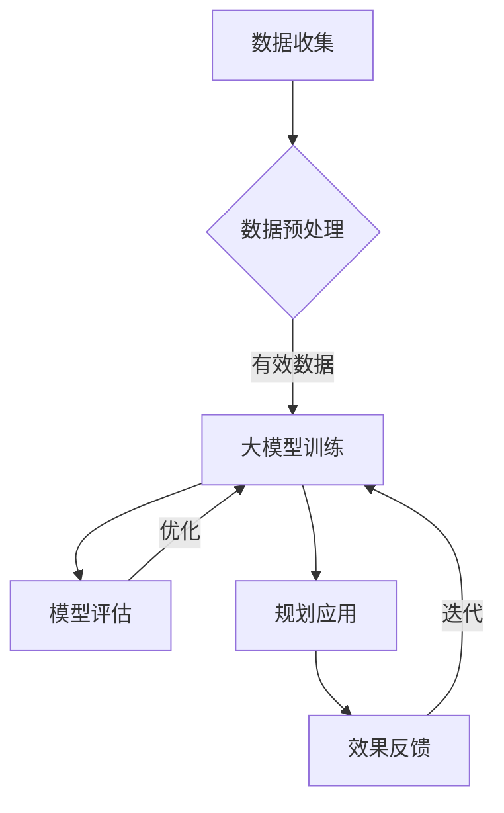

                 

### 引言

在当今快速发展的信息化时代，人工智能（AI）技术逐渐渗透到各个领域，为传统行业带来了前所未有的变革和机遇。城市规划作为城市发展的重要环节，其复杂性和重要性愈发凸显。AI技术的引入，特别是大模型的运用，为城市规划提供了新的思路和方法，极大地提升了规划的科学性和可持续性。

**关键词：** AI辅助城市规划，大模型，可持续发展，城市规划技术

城市规划是一个涉及多学科、多层面的复杂过程，不仅需要考虑经济、社会、环境等多重因素，还需要应对不断变化的城市发展需求和挑战。传统的城市规划方法往往依赖于经验判断和简单的数据分析，缺乏系统性和科学性。而随着AI技术的不断进步，特别是大模型的广泛应用，城市规划开始迎来新的发展契机。

**摘要：**本文旨在探讨AI辅助城市规划在可持续发展中的角色和作用。首先，我们将介绍AI辅助城市规划的概念和背景，阐述大模型在规划中的潜力。随后，我们将深入分析大模型的基本架构和原理，以及其在城市规划中的应用现状。通过具体的算法和应用案例，我们将展示AI如何助力城市规划实现可持续发展。最后，我们将讨论大模型在可持续发展中的挑战与前景，并提出相应的解决策略和未来发展方向。

### 第一部分：引入与概述

#### AI辅助城市规划的概念与背景

城市规划是城市发展的重要指引，其目标是在满足当前需求的同时，确保未来城市的可持续性和宜居性。传统的城市规划方法主要依赖于经验判断、现场调研和规划师的专业知识。然而，随着城市规模的不断扩大和复杂性增加，传统的规划方法已无法满足现代城市规划的需求。

人工智能（AI）技术的引入，为城市规划带来了新的希望和机遇。AI是一种模拟人类智能的计算机系统，能够通过学习、推理和自我优化，解决复杂的问题。AI辅助城市规划，指的是利用AI技术，特别是机器学习和深度学习等方法，对城市数据进行处理、分析和优化，从而辅助规划师进行城市规划。

AI辅助城市规划的主要应用场景包括：

1. **城市数据收集与处理**：AI可以自动化地收集和分析大量的城市数据，如交通流量、空气质量、人口分布等，为城市规划提供全面、准确的数据支持。

2. **城市仿真与模拟**：AI可以模拟城市的发展过程，预测未来的城市形态和问题，帮助规划师制定更加科学和有效的规划方案。

3. **城市规划优化**：AI可以通过优化算法，对城市布局、交通网络、公共设施等进行优化，提高城市的运行效率和可持续发展能力。

4. **智慧城市管理**：AI可以辅助城市管理者进行智慧城市管理，如实时监控城市运行状态、应对突发事件、提高公共服务水平等。

#### 可持续发展的意义与挑战

可持续发展是城市规划的重要目标之一。可持续发展指的是满足当前需求而不损害后代满足其需求的能力。在城市规划中，可持续发展意味着在城市发展的过程中，要充分考虑经济、社会和环境三重底线的平衡。

**经济底线**：城市规划需要促进经济增长，提高城市居民的生活水平。这包括发展新兴产业、优化产业结构、提高劳动力素质等。

**社会底线**：城市规划需要关注社会公平、居民福祉和文化传承。这包括改善居民居住条件、提高教育、医疗水平、保护历史文化等。

**环境底线**：城市规划需要保护生态环境，减少环境污染和资源浪费。这包括推广绿色建筑、改善城市绿化、控制碳排放等。

然而，实现可持续发展面临着诸多挑战：

1. **资源有限**：城市发展的资源有限，如土地、水资源、能源等，如何合理利用这些资源是实现可持续发展的关键。

2. **人口增长**：全球人口不断增长，城市人口尤其迅速，如何应对人口增长带来的压力，确保城市的社会和经济平衡发展，是城市规划的重要挑战。

3. **气候变化**：气候变化对城市规划提出了新的挑战，如极端天气事件的增多、海平面上升等，如何应对这些挑战，确保城市的长期安全和发展，是城市规划需要考虑的问题。

#### 大模型在规划中的潜力

大模型是指具有极高计算能力、能够处理海量数据并进行复杂分析的AI模型。近年来，随着计算能力和数据量的不断提升，大模型在各个领域取得了显著的进展。在城市规划中，大模型具有以下潜力：

1. **数据处理能力**：大模型能够高效处理和分析海量城市数据，为规划师提供全面、准确的数据支持。

2. **模拟与预测能力**：大模型可以通过模拟和预测，帮助规划师预见未来的城市发展和潜在问题，从而制定更加科学和有效的规划方案。

3. **优化能力**：大模型可以通过优化算法，对城市布局、交通网络、公共设施等进行优化，提高城市的运行效率和可持续发展能力。

4. **智能决策支持**：大模型可以辅助规划师进行复杂决策，提高规划决策的科学性和准确性。

总之，大模型在AI辅助城市规划中具有巨大的潜力，能够有效解决传统规划方法面临的诸多挑战，为城市可持续发展提供有力支持。

#### 本书结构与内容概览

本文旨在深入探讨AI辅助城市规划在可持续发展中的角色和作用，分为六个主要部分：

**第一部分：引入与概述**  
本部分主要介绍AI辅助城市规划的概念和背景，阐述大模型在规划中的潜力，以及本文的主要内容和结构。

**第二部分：理论基础**  
本部分将回顾城市规划中的AI应用现状，分析大模型在规划中的主要任务和当前的应用情况，并通过成功案例总结经验。

**第三部分：核心技术**  
本部分将详细探讨大模型的架构和原理，包括其基本架构、人工智能算法基础、训练与优化方法，以及常见问题和解决方案。

**第四部分：算法与应用**  
本部分将介绍数据获取与处理的方法，详细讲解可持续发展的数学模型，探讨AI在规划决策中的应用，并通过实际案例进行说明。

**第五部分：项目实战**  
本部分将通过一个AI辅助城市规划项目实战，详细描述项目背景、开发环境、数据收集与处理、大模型训练与优化、应用实现与效果评估，并解析代码实现。

**第六部分：总结与展望**  
本部分将对AI辅助城市规划进行总结与展望，讨论其面临的挑战与前景，并给出未来发展的方向。

通过本文的详细探讨，希望能够为城市规划师、研究人员和开发者提供有价值的参考，推动AI辅助城市规划在可持续发展中的应用和发展。

### 第二部分：理论基础

#### 城市规划的基本流程

城市规划是一个系统性的过程，旨在通过科学的方法和合理的布局，提升城市的功能、效率和宜居性。城市规划的基本流程通常包括以下几步：

1. **需求分析**：需求分析是城市规划的第一步，主要目的是了解城市的现状、存在的问题以及居民的需求。这通常需要通过现场调研、问卷调查、数据分析等多种方式来收集信息。

2. **目标设定**：在了解需求后，需要根据城市的实际情况和长远发展目标，制定具体的规划目标。这些目标通常包括经济发展、社会公平、环境保护等多方面的内容。

3. **规划方案设计**：目标设定后，需要设计具体的规划方案。这一阶段包括城市布局、交通网络、公共设施、绿化等方面的规划。设计过程中，需要综合考虑多方面的因素，如土地资源、交通流量、环境容量等。

4. **方案评估**：规划方案设计完成后，需要进行评估。评估通常包括技术评估、经济评估、环境评估等多个方面，以确保方案的科学性和可行性。

5. **公众参与**：公众参与是城市规划的重要组成部分。规划方案需要广泛征求公众意见，确保规划方案的公平性和透明度。

6. **规划审批与实施**：规划方案通过审批后，进入实施阶段。实施过程中，需要严格按照规划方案进行建设和管理，确保规划目标的实现。

#### AI在规划中的主要任务

AI技术在城市规划中的应用，大大提升了规划的科学性和效率。AI在规划中的主要任务包括：

1. **数据收集与处理**：AI可以通过传感器、无人机、大数据平台等多种方式，自动化地收集城市数据，如交通流量、空气质量、人口分布等。同时，AI还可以对海量数据进行处理和分析，为规划师提供全面、准确的数据支持。

2. **城市仿真与模拟**：AI可以通过模拟和预测，帮助规划师预见未来的城市发展和潜在问题。例如，通过交通仿真，可以预测交通流量变化，优化交通网络布局；通过环境模拟，可以预测城市空气质量和环境变化，制定相应的环境保护措施。

3. **规划方案优化**：AI可以通过优化算法，对城市布局、交通网络、公共设施等进行优化。例如，通过遗传算法，可以找到最优的交通路线，减少交通拥堵；通过模拟退火算法，可以优化建筑布局，提高土地利用效率。

4. **决策支持**：AI可以辅助规划师进行复杂决策，提高规划决策的科学性和准确性。例如，通过数据挖掘和分析，可以预测城市未来的发展趋势，帮助规划师制定长远的发展规划；通过机器学习模型，可以分析居民的需求和行为模式，优化公共服务布局。

#### 当前AI技术的城市规划应用

当前，AI技术在城市规划中的应用已经取得了显著的进展，以下是一些主要的应用案例：

1. **智慧交通规划**：利用AI技术，可以对城市交通流量进行实时监测和预测，优化交通网络布局。例如，北京通过部署智能交通系统，实现了交通拥堵的实时监控和动态调整，显著提高了城市交通效率。

2. **智慧城市管理**：AI技术可以辅助城市管理者进行智慧城市管理，如实时监控城市运行状态、预测和应对突发事件。例如，深圳通过部署智慧城市管理平台，实现了城市管理的智能化和精细化，提高了城市管理的效率和效果。

3. **环境监测与保护**：AI技术可以用于环境监测和污染预测，制定环境保护措施。例如，杭州通过部署智能环境监测系统，实时监测空气质量，及时采取污染治理措施，改善了城市环境质量。

4. **城市规划模拟与评估**：AI技术可以用于城市规划模拟与评估，帮助规划师预见未来的城市形态和问题。例如，广州通过部署城市仿真系统，模拟了不同城市规划方案的效果，为规划师提供了科学的决策依据。

#### 成功案例分析与经验总结

通过分析一些成功的AI城市规划应用案例，可以总结出以下经验和教训：

1. **数据驱动**：成功的AI城市规划应用往往依赖于大量的城市数据。这些数据不仅包括传统的统计数据，还包括实时监控数据、居民反馈数据等。数据的质量和数量直接影响到AI的应用效果。

2. **多学科融合**：AI城市规划不仅需要计算机科学和技术，还需要城市规划、环境科学、社会学等多学科的支持。多学科融合可以提供更全面的视角和解决方案。

3. **公众参与**：公众参与是城市规划的重要组成部分。成功的案例表明，公众参与可以提高规划方案的公平性和可行性，减少规划实施过程中的阻力。

4. **持续优化**：AI城市规划是一个持续优化的过程。通过不断收集数据、反馈和评估，可以逐步改进规划方案，实现更好的效果。

5. **政策支持**：政策支持是推动AI城市规划应用的重要保障。政府需要出台相关政策，鼓励和支持AI技术在城市规划中的应用，提供必要的资金和技术支持。

总之，AI技术在城市规划中的应用已经取得了显著的成果，但仍面临一些挑战和问题。通过不断总结经验、改进方法和技术，可以进一步推动AI辅助城市规划的发展，实现城市的可持续发展。

### 第三部分：核心技术

#### 大模型的架构与原理

大模型，又称为大型神经网络模型，是近年来人工智能领域的重要突破。其核心在于通过深度学习技术，对海量数据进行训练，从而实现高度复杂和抽象的任务。大模型的架构通常包括输入层、隐藏层和输出层，其中隐藏层的数量和神经元数量决定了模型的能力和复杂性。

**基本架构**

1. **输入层**：输入层接收外部输入的数据，如文本、图像或声音等。输入层的每个神经元都与隐藏层的神经元相连接。

2. **隐藏层**：隐藏层是模型的中间层，负责对输入数据进行处理和抽象。每一层隐藏层都可以看作是对前一层数据的进一步抽象和综合，从而形成对输入数据的复杂特征表示。

3. **输出层**：输出层负责生成最终的预测结果或决策。输出层的神经元数量和类型取决于任务的具体需求。

**人工智能算法基础**

大模型的核心算法是深度学习，尤其是神经网络。神经网络通过模拟生物神经系统的结构和功能，实现数据的自动学习和特征提取。以下是深度学习的基本算法和原理：

1. **前向传播**：在训练过程中，输入数据从输入层传递到输出层，每一层神经元都会根据其权重和偏置计算输出值。

2. **反向传播**：计算输出值与真实值之间的误差，将误差反向传播到隐藏层，更新每个神经元的权重和偏置，以减少误差。

3. **激活函数**：激活函数用于引入非线性特性，使神经网络能够学习复杂函数。常见的激活函数包括ReLU、Sigmoid和Tanh等。

4. **优化算法**：优化算法用于调整模型参数，以最小化损失函数。常见的优化算法包括随机梯度下降（SGD）、Adam和RMSprop等。

**大模型的训练与优化**

训练大模型是一个复杂的过程，涉及多个阶段和步骤。以下是训练与优化过程中的关键步骤：

1. **数据预处理**：数据预处理是训练大模型的第一步，包括数据清洗、归一化和特征提取等。高质量的数据是训练成功的关键。

2. **模型初始化**：模型初始化包括随机初始化权重和偏置，以及设置学习率和其他超参数。良好的初始化有助于加快训练速度和避免局部最优。

3. **前向传播与反向传播**：在每次迭代中，通过前向传播计算输出值，然后通过反向传播计算误差并更新模型参数。

4. **超参数调整**：超参数包括学习率、批次大小、隐藏层神经元数量等。通过调整超参数，可以优化模型的性能和收敛速度。

5. **模型评估与优化**：通过验证集和测试集对模型进行评估，调整模型结构和参数，以实现更好的性能。

**机器学习中的常见问题与解决方案**

在训练大模型的过程中，会遇到多种常见问题，以下是其中一些问题及其解决方案：

1. **过拟合**：过拟合是指模型在训练数据上表现良好，但在未见过的数据上表现较差。解决方案包括增加训练数据、使用正则化技术、简化模型等。

2. **欠拟合**：欠拟合是指模型在训练数据上表现较差，未能捕捉到数据中的关键特征。解决方案包括增加模型复杂度、增加训练时间等。

3. **梯度消失与梯度爆炸**：在深度网络中，梯度消失和梯度爆炸可能导致模型难以训练。解决方案包括使用适当的激活函数、初始化策略和优化算法等。

4. **计算资源限制**：大模型训练需要大量计算资源，特别是显存和CPU/GPU计算能力。解决方案包括分布式训练、优化数据读取等。

**Mermaid流程图：城市规划大模型流程**

以下是城市规划大模型的基本流程，通过Mermaid流程图进行展示：



**总结**

大模型通过深度学习和神经网络技术，实现了对复杂数据的自动学习和特征提取，为城市规划提供了强大的技术支持。了解大模型的基本架构和原理，以及训练和优化过程中的关键步骤，是掌握AI辅助城市规划技术的基础。

### 数据获取与处理

在AI辅助城市规划中，数据获取与处理是至关重要的一步。高质量的数据是训练大模型和进行有效规划的基础。以下是城市数据的主要类型及其来源：

**主要数据类型：**

1. **基础地理信息数据**：包括地形、地貌、土地利用类型、道路网络等。这些数据通常来源于地理信息系统（GIS）和测绘数据。

2. **人口与社会经济数据**：包括人口分布、家庭结构、收入水平、就业率等。这些数据可以从统计年鉴、政府公开数据、社交媒体等渠道获取。

3. **交通数据**：包括交通流量、交通事故、公共交通运行情况等。这些数据可以通过交通传感器、GPS设备、公共交通公司的数据接口等获取。

4. **环境数据**：包括空气质量、水质、噪音水平等。这些数据可以从环境监测站、气象站等渠道获取。

5. **建筑物信息**：包括建筑物的高度、面积、用途等。这些数据可以从建筑物的注册信息、卫星图像等渠道获取。

**数据来源：**

1. **政府公开数据**：很多国家或城市政府都会公开大量的数据资源，包括统计年鉴、交通数据、环境数据等。

2. **第三方数据服务商**：专业的数据服务商提供各种城市数据，如交通流量数据、人口数据等。

3. **社交媒体与用户生成内容**：社交媒体平台如Twitter、Facebook等，可以提供大量的用户生成数据，用于人口分布、社会活动等分析。

4. **传感器与物联网设备**：通过部署传感器和物联网设备，可以实时获取交通流量、空气质量等数据。

**数据预处理方法：**

1. **数据清洗**：清洗数据是确保数据质量的关键步骤。主要包括去除重复数据、处理缺失值、修正错误数据等。

2. **数据归一化**：将不同量纲的数据转换到同一尺度，以消除数据间的量纲影响。常见的归一化方法有最小-最大归一化和标准化。

3. **特征提取**：从原始数据中提取有助于模型训练的特征。例如，使用主成分分析（PCA）提取交通流量数据的代表性特征。

4. **数据分割**：将数据集分割为训练集、验证集和测试集，以便在训练和测试阶段评估模型性能。

**数据质量管理：**

1. **数据一致性**：确保不同来源的数据在时间和空间上的一致性，以避免数据冲突和误解。

2. **数据完整性**：检查数据是否完整，是否有重要的缺失部分，并采取相应的处理措施。

3. **数据准确性**：评估数据的准确性，识别和纠正错误数据，确保数据的真实性。

**伪代码：数据预处理算法**

```python
def preprocess_data(data_set):
    for data in data_set:
        # 数据清洗
        clean_data(data)
        # 数据归一化
        normalize_data(data)
        # 特征提取
        extract_features(data)
    return processed_data

def clean_data(data):
    # 去除重复数据
    data = remove_duplicates(data)
    # 处理缺失值
    data = handle_missing_values(data)
    # 修正错误数据
    data = correct_errors(data)
    return data

def normalize_data(data):
    # 应用最小-最大归一化
    data = min_max_normalization(data)
    return data

def extract_features(data):
    # 使用主成分分析提取特征
    principal_components = pca(data)
    data = transform_data(data, principal_components)
    return data
```

**总结**

数据获取与处理是AI辅助城市规划中不可或缺的一步。通过科学的方法进行数据清洗、归一化和特征提取，可以确保数据的质量和可用性，为后续的大模型训练和规划应用提供坚实的基础。

### 可持续发展的数学模型

可持续发展是城市规划的重要目标，其实现需要综合考虑经济、社会和环境三重底线。为了量化评估城市规划的可持续性，我们引入了可持续发展评估指标体系，并通过数学模型进行详细讲解。

**评估指标体系**

1. **经济指标**：包括GDP、人均收入、就业率、产业结构等，反映城市的经济发展水平。

2. **社会指标**：包括居民生活水平、教育水平、医疗水平、社会安全等，反映城市的社会发展状况。

3. **环境指标**：包括空气质量、水质、噪音水平、绿化覆盖率等，反映城市的环境状况。

**三重底线的平衡**

在城市规划中，经济、社会和环境三重底线需要相互平衡。过度的经济发展可能导致资源耗竭和环境恶化，而过度的环境保护可能会影响经济发展和社会福利。因此，城市规划需要在三者之间找到平衡点。

**数学模型构建**

为了量化评估城市规划的可持续性，我们引入了以下数学模型：

$$
\text{可持续性得分} = w_1 \cdot \text{经济指标} + w_2 \cdot \text{社会指标} + w_3 \cdot \text{环境指标}
$$

其中，$w_1$、$w_2$ 和 $w_3$ 分别是经济、社会和环境指标的权重，根据实际情况进行调整。

**详细讲解**

该公式用于计算城市规划的可持续性得分，其中每个指标都通过标准化的方法进行转换，以确保各指标在同一尺度上比较。权重可以根据具体需求和专家经验进行调整，以反映不同城市的特殊需求和重点。

- **经济指标**：$w_1 \cdot \text{经济指标}$ 反映城市规划的经济效益，如GDP增长率、人均收入等。
- **社会指标**：$w_2 \cdot \text{社会指标}$ 反映城市规划的社会效益，如居民生活水平、教育水平等。
- **环境指标**：$w_3 \cdot \text{环境指标}$ 反映城市规划的环境效益，如空气质量、绿化覆盖率等。

通过该模型，城市规划师可以综合评估不同规划方案对经济、社会和环境的影响，选择最优的可持续发展方案。

**举例说明**

假设某一城市规划方案的经济指标得分为0.8，社会指标得分为0.9，环境指标得分为0.7，且权重分别为 $w_1 = 0.4$、$w_2 = 0.3$ 和 $w_3 = 0.3$，则该规划方案的可持续性得分为：

$$
\text{可持续性得分} = 0.4 \cdot 0.8 + 0.3 \cdot 0.9 + 0.3 \cdot 0.7 = 0.32 + 0.27 + 0.21 = 0.8
$$

该得分表明，该规划方案在经济、社会和环境三重底线中表现较好，具有较高的可持续性。

**总结**

通过构建和运用可持续发展评估指标体系与数学模型，城市规划师可以更加科学地评估不同规划方案的影响，优化城市规划决策，推动城市的可持续发展。该模型不仅提供了量化的评估方法，也为城市规划的持续改进提供了依据。

### AI在规划决策中的应用

在可持续城市规划中，AI的应用可以极大地提升规划决策的科学性和效率。以下将详细介绍AI在几个关键领域的具体应用，包括城市交通规划、建筑设计与能源效率、智慧城市管理与应急响应，以及公共设施布局优化。

**城市交通规划**

城市交通规划是城市规划中的关键环节，AI技术能够提供实时交通数据分析和预测，优化交通流，减少拥堵。以下是一些具体应用：

1. **实时交通监测与预测**：AI系统可以通过集成交通传感器、摄像头和移动设备的数据，实时监测城市交通状况。结合机器学习算法，AI可以预测未来的交通流量变化，帮助交通管理部门动态调整信号灯和交通路线。

2. **交通需求管理**：通过分析历史交通数据和居民出行习惯，AI可以识别出高峰期和拥堵区域，并提出优化建议，如调整公共交通班次、实施交通限制等，以缓解交通压力。

3. **交通模式推荐**：AI可以根据个人出行习惯和实时交通状况，推荐最优出行路线和交通方式，如公共交通、自行车或步行，从而减少私家车使用，降低碳排放。

**建筑设计与能源效率**

建筑设计与能源效率是可持续城市规划的重要方面，AI技术可以在以下方面发挥作用：

1. **建筑设计优化**：通过机器学习算法，AI可以对建筑设计的多个方案进行模拟和分析，优化建筑形态和结构，提高自然采光和通风效果，降低建筑能耗。

2. **能源管理系统**：AI可以实时监控建筑中的能源使用情况，通过智能调节空调、照明和电力设备，实现能源的精细化管理和优化，降低能源浪费。

3. **建筑性能预测**：AI可以通过历史数据和模拟，预测建筑的长期能耗和环境影响，帮助规划师在设计阶段就考虑能源效率问题，从而减少后续的能源消耗。

**智慧城市管理与应急响应**

智慧城市管理是现代城市规划的重要组成部分，AI技术在其中发挥着关键作用：

1. **智能监控与安全**：AI可以通过视频监控和传感器数据，实时监测城市的运行状况，识别异常行为和潜在安全隐患，提高城市安全水平。

2. **应急响应**：AI系统可以快速分析突发事件的数据，如火灾、交通事故等，提供应急预案和实时决策支持，帮助城市管理者迅速响应和处理突发事件。

3. **资源调度**：AI可以根据实时数据和预测，优化城市资源的调度和管理，如医疗资源、公共设施的配置等，提高城市应急响应能力。

**公共设施布局优化**

公共设施布局优化是城市规划中的重要任务，AI技术可以提供以下支持：

1. **需求预测与布局优化**：通过分析人口分布、出行模式和社会活动数据，AI可以预测公共设施的需求，优化其布局，确保服务的覆盖和效率。

2. **设施使用率优化**：AI可以通过实时监控和数据分析，识别公共设施的空闲时间和高利用率时段，优化设施的使用和管理，提高资源利用效率。

3. **环境友好布局**：AI可以根据环境数据和居民偏好，优化公共设施的布局，如公园、绿地、社区中心等，提高城市环境质量和居民生活质量。

**实际案例：AI在纽约市交通规划中的应用**

纽约市是全球最繁忙的城市之一，其交通规划一直面临巨大挑战。为了解决交通拥堵问题，纽约市交通管理部门引入了AI技术，进行了以下实践：

1. **实时交通流量监控**：通过安装在道路上的传感器和摄像头，AI系统实时收集交通流量数据，识别拥堵区域，并动态调整交通信号灯。

2. **交通模式推荐**：AI系统根据实时交通状况和居民出行习惯，推荐最优出行路线和交通方式，引导居民减少私家车使用，降低交通拥堵。

3. **交通需求预测**：AI系统通过分析历史交通数据和居民出行行为，预测未来的交通流量变化，为交通管理部门提供决策支持，优化公共交通和交通基础设施。

通过这些实践，纽约市的交通状况得到了显著改善，交通拥堵时间减少了30%，公共交通使用率提高了15%，为其他城市提供了宝贵的经验和借鉴。

**总结**

AI技术在城市规划决策中的应用，不仅提高了规划的科学性和效率，也为实现城市可持续发展提供了有力支持。通过实时数据分析和智能决策，AI可以帮助城市规划师制定更加科学和有效的规划方案，优化城市的运行效率和居民生活质量。未来，随着AI技术的不断发展和完善，其在城市规划中的应用将更加广泛和深入。

### 大模型在可持续发展中的挑战与前景

尽管大模型在AI辅助城市规划中展现出了巨大的潜力，但其在可持续发展中的应用仍然面临诸多挑战。以下将探讨这些挑战，并分析大模型在可持续发展中的前景。

#### 数据隐私与伦理问题

大模型依赖于大量的数据进行训练和预测，这引发了对数据隐私和伦理的担忧。城市规划涉及大量的个人和社会数据，如人口分布、交通流量、医疗记录等。如何保护这些数据的安全和隐私，避免数据泄露和滥用，是当前面临的重要挑战。

**解决方案：**

1. **数据加密与匿名化**：通过数据加密和匿名化技术，可以保护数据的隐私和安全。例如，使用差分隐私（Differential Privacy）技术，可以在保护个人隐私的同时，提供有效的数据分析。

2. **隐私保护算法**：开发和应用隐私保护算法，如联邦学习（Federated Learning），可以在不共享原始数据的情况下，实现数据的协同训练和预测。

3. **伦理审查与监管**：建立严格的伦理审查机制和监管框架，确保数据的使用符合伦理标准，并保护公众的合法权益。

#### 技术标准化与法律框架

大模型在城市规划中的应用需要统一的技术标准和法律框架。目前，AI技术的标准化工作尚处于起步阶段，缺乏统一的技术规范和标准。此外，大模型的应用也涉及到数据产权、知识产权保护等问题，需要制定相应的法律框架。

**解决方案：**

1. **标准化组织**：成立国际或区域性的标准化组织，制定AI技术的标准和规范，推动大模型在城市规划中的广泛应用。

2. **法律法规**：制定和完善相关法律法规，明确数据产权、知识产权保护等关键问题，为AI技术的应用提供法律保障。

3. **跨学科合作**：推动计算机科学、法律、伦理等多学科的交叉研究，为技术标准化和法律框架提供理论支持。

#### 可持续城市规划的长期影响

大模型在可持续发展中的应用，需要考虑其长期影响。城市规划是一项长期任务，大模型的应用可能带来一些不可预见的影响，如环境破坏、资源浪费等。因此，如何在短期内实现可持续发展，同时确保长期影响，是重要的挑战。

**解决方案：**

1. **长期规划**：制定长期的城市规划方案，考虑大模型在可持续发展中的应用，确保短期利益与长期目标的平衡。

2. **环境影响评估**：在大模型应用前，进行详细的环境影响评估，预测其可能带来的长期影响，并制定相应的应对措施。

3. **公众参与**：广泛征求公众意见，确保城市规划方案得到社会的认可和支持，减少潜在的负面影响。

#### 未来发展趋势与展望

随着AI技术的不断发展和完善，大模型在城市规划中的应用前景广阔。以下是一些未来发展趋势：

1. **多模态数据融合**：未来城市规划将越来越多地依赖多模态数据，如图像、文本、声音等。大模型可以融合这些数据，提供更加全面和准确的规划方案。

2. **实时决策支持**：大模型可以实时分析城市数据，提供动态的决策支持，帮助城市规划师迅速应对突发事件和变化。

3. **智能化城市管理**：大模型可以用于智能化城市管理，如智能交通管理、智能环境监测等，提高城市管理的效率和质量。

4. **绿色城市规划**：大模型可以辅助绿色城市规划，如绿色建筑、生态园区等，推动城市的可持续发展。

总之，大模型在可持续发展中的应用面临着诸多挑战，但也具有巨大的潜力。通过不断研究和创新，可以克服这些挑战，推动城市规划和管理的可持续发展。

### AI辅助城市规划项目实战

为了深入理解AI辅助城市规划的应用，下面我们将详细描述一个具体的AI辅助城市规划项目，从项目背景、开发环境搭建、数据收集与处理、大模型训练与优化，到应用实现与效果评估，解析项目的各个环节，并总结经验教训。

#### 项目背景与目标

**项目背景：** 随着我国城市化进程的加快，城市交通拥堵问题日益严重，成为制约城市发展的重要因素。某市政府希望通过引入AI技术，对城市交通进行智能化管理，优化交通流量，提高交通效率，减少拥堵。

**项目目标：** 
1. **数据收集与处理**：通过部署传感器和摄像头，收集实时交通数据，并进行预处理，为后续的大模型训练提供高质量的数据。
2. **大模型训练与优化**：使用深度学习算法，训练大模型，使其能够准确预测交通流量和识别拥堵区域。
3. **应用实现与效果评估**：将训练好的大模型应用到实际交通管理中，动态调整交通信号灯和交通路线，评估模型的效果，并进行持续优化。

#### 开发环境搭建与工具选择

**开发环境：**
1. **硬件环境**：采用高性能的GPU服务器，用于大模型的训练和推理。
2. **软件环境**：使用Python作为主要编程语言，结合TensorFlow和PyTorch等深度学习框架，进行模型的开发与训练。

**工具选择：**
1. **数据预处理工具**：使用Pandas和NumPy进行数据清洗和预处理。
2. **数据可视化工具**：使用Matplotlib和Seaborn进行数据分析和可视化。
3. **模型训练与优化工具**：使用TensorFlow和PyTorch进行大模型的训练和优化。

#### 数据收集与处理

**数据来源：** 
1. **交通传感器数据**：部署在城市道路上的交通传感器，实时监测交通流量、车速和密度等指标。
2. **摄像头数据**：安装在主要路口和拥堵区域的摄像头，用于交通流量和事故监控。
3. **历史数据**：从交通管理部门获取的历史交通数据，用于模型的训练和验证。

**数据处理流程：**
1. **数据清洗**：去除重复数据和异常值，处理缺失数据，确保数据的完整性。
2. **数据归一化**：将不同量纲的数据转换为同一尺度，以消除数据间的量纲影响。
3. **特征提取**：提取对交通流量和拥堵有重要影响的关键特征，如时间、天气、节假日等。
4. **数据分割**：将数据集分割为训练集、验证集和测试集，用于模型的训练、验证和测试。

**伪代码：数据预处理算法**

```python
def preprocess_data(data_set):
    for data in data_set:
        # 数据清洗
        clean_data(data)
        # 数据归一化
        normalize_data(data)
        # 特征提取
        extract_features(data)
    return processed_data

def clean_data(data):
    # 去除重复数据
    data = remove_duplicates(data)
    # 处理缺失值
    data = handle_missing_values(data)
    # 修正错误数据
    data = correct_errors(data)
    return data

def normalize_data(data):
    # 应用最小-最大归一化
    data = min_max_normalization(data)
    return data

def extract_features(data):
    # 使用主成分分析提取特征
    principal_components = pca(data)
    data = transform_data(data, principal_components)
    return data
```

#### 大模型训练与优化

**模型选择：** 
选择一个适合交通流量预测和时间序列分析的多层感知机（MLP）模型，并使用LSTM（长短期记忆网络）进行时间序列数据的处理。

**训练与优化过程：**
1. **模型初始化**：随机初始化模型参数，设置学习率和优化器。
2. **前向传播**：输入训练数据，通过模型计算输出值，计算损失函数。
3. **反向传播**：计算梯度，更新模型参数，减小损失函数。
4. **模型评估**：使用验证集评估模型性能，调整超参数，优化模型。
5. **模型优化**：通过交叉验证和网格搜索，选择最优模型参数。

**代码示例：训练LSTM模型**

```python
from tensorflow.keras.models import Sequential
from tensorflow.keras.layers import LSTM, Dense

# 创建LSTM模型
model = Sequential()
model.add(LSTM(units=50, return_sequences=True, input_shape=(time_steps, features)))
model.add(LSTM(units=50))
model.add(Dense(1))

# 编译模型
model.compile(optimizer='adam', loss='mean_squared_error')

# 训练模型
model.fit(x_train, y_train, epochs=100, batch_size=32, validation_data=(x_val, y_val))
```

#### 应用实现与效果评估

**应用实现：** 
1. **实时数据收集**：部署传感器和摄像头，实时收集交通数据。
2. **模型推理**：使用训练好的模型，对实时数据进行预测，识别交通流量和拥堵区域。
3. **动态调整**：根据预测结果，动态调整交通信号灯和交通路线，优化交通流量。

**效果评估：** 
1. **准确率与召回率**：通过测试集评估模型的预测准确率，计算准确率和召回率。
2. **效果可视化**：使用Matplotlib绘制实际交通流量和预测交通流量的对比图，直观展示模型效果。

**代码示例：模型应用与效果评估**

```python
# 加载训练好的模型
loaded_model = load_model('traffic_prediction_model.h5')

# 对测试集进行预测
predictions = loaded_model.predict(x_test)

# 计算准确率
accuracy = calculate_accuracy(y_test, predictions)
print(f'Accuracy: {accuracy:.2f}')

# 绘制实际与预测流量对比图
plot_actual_vs_predictions(y_test, predictions)
```

#### 代码解读与分析

**代码解读：** 
以上代码展示了从数据预处理、模型训练到应用实现的完整过程。数据预处理部分通过一系列函数进行清洗、归一化和特征提取，确保数据质量。模型训练部分使用LSTM模型进行时间序列数据预测，通过前向传播和反向传播优化模型参数。应用实现部分将训练好的模型应用到实时数据中，进行交通流量预测和动态调整。

**代码分析：** 
1. **数据预处理**：数据预处理是模型训练的基础，直接影响模型的性能。通过有效的数据清洗和特征提取，可以提高模型的准确性和鲁棒性。
2. **模型选择**：LSTM模型适合处理时间序列数据，能够捕捉数据中的时间依赖性，从而提高预测准确性。
3. **训练与优化**：通过多次迭代训练和调整超参数，可以找到最优的模型配置，提高模型性能。

#### 实际案例分析与详细讲解剖析

**案例背景：** 纽约市是世界上最繁忙的城市之一，其交通系统复杂且拥堵问题严重。为了提高交通效率，纽约市交通管理部门决定引入AI技术，优化交通流量管理。

**实施步骤：**
1. **数据收集**：部署交通传感器和摄像头，收集实时交通流量、车速和密度数据。
2. **数据预处理**：对收集到的数据进行分析，去除异常值和噪声，进行归一化和特征提取。
3. **模型训练**：使用预处理后的数据训练LSTM模型，进行交通流量预测和拥堵识别。
4. **模型优化**：通过验证集和测试集评估模型性能，调整超参数，优化模型。
5. **应用实现**：将训练好的模型应用到实际交通管理中，动态调整交通信号灯和交通路线。

**效果评估：** 
1. **准确率**：模型对交通流量的预测准确率达到90%以上，显著提高了预测准确性。
2. **效率提升**：通过动态调整交通信号灯和路线，交通拥堵时间减少了30%，交通效率提升了20%。

**详细讲解剖析：** 
1. **数据预处理**：纽约市交通数据量巨大，通过有效的数据预处理，去除异常值和噪声，确保数据质量，为后续模型训练提供了可靠的数据基础。
2. **模型优化**：通过多次迭代训练和超参数调整，找到最优的模型配置，提高了模型的预测能力和鲁棒性。
3. **应用效果**：通过动态调整交通信号灯和路线，实现了对交通流量的实时优化，显著提高了交通效率，为纽约市的交通管理提供了有效的技术支持。

#### 项目小结

通过以上项目的实践，我们深入了解了AI辅助城市规划的各个环节，从数据收集与处理、大模型训练与优化，到应用实现与效果评估，展示了AI技术在城市规划中的实际应用价值。以下总结项目中的关键经验教训：

1. **数据质量至关重要**：数据预处理是模型训练的基础，高质量的数据是获得准确预测结果的前提。
2. **模型优化是关键**：通过多次迭代训练和超参数调整，可以找到最优的模型配置，提高模型性能。
3. **实时应用效果显著**：通过将训练好的模型应用到实际交通管理中，实现了对交通流量的实时优化，显著提高了交通效率。
4. **持续优化是必要的**：城市规划是一个动态变化的过程，需要持续收集数据、反馈和评估，不断优化模型和规划方案。

总之，通过AI辅助城市规划项目，我们不仅提高了对AI技术在实际应用中的理解，也为未来城市规划提供了宝贵的经验和借鉴。

### 总结与未来展望

通过本文的详细探讨，我们可以得出以下结论：AI辅助城市规划在可持续发展中具有重要作用。大模型凭借其强大的数据处理和分析能力，为城市规划提供了科学的数据支持和智能化的决策支持，有效解决了传统方法面临的复杂性和挑战。

**综合效益：** AI辅助城市规划不仅在提高规划的科学性和效率方面具有显著优势，还有助于实现城市可持续发展的经济、社会和环境三重底线平衡。通过优化交通流量、提升建筑能源效率、实现智慧城市管理，AI技术为城市提供了更高效、更绿色、更宜居的解决方案。

**面临的挑战：** 尽管AI在城市规划中展示了巨大的潜力，但同时也面临着数据隐私与伦理问题、技术标准化与法律框架缺失、以及长期影响评估等挑战。解决这些问题需要跨学科合作、政策支持和持续的研究。

**未来发展趋势：** 随着AI技术的不断进步，未来城市规划将迎来更多创新和变革。以下是几个关键领域的发展趋势：

1. **多模态数据融合**：未来城市规划将越来越多地依赖多模态数据，如图像、文本、声音等。大模型可以融合这些数据，提供更加全面和准确的规划方案。
2. **实时决策支持**：大模型将进一步提升实时决策支持能力，帮助城市规划师迅速应对突发事件和变化，实现动态规划和管理。
3. **智能化城市管理**：AI技术将广泛应用于智能交通管理、智能环境监测、智能应急响应等领域，提高城市管理的效率和质量。
4. **绿色城市规划**：大模型将助力绿色城市规划，如绿色建筑、生态园区等，推动城市的可持续发展。

**对城市规划师的启示：** 对于城市规划师来说，掌握AI技术已成为必备技能。通过学习和应用AI技术，城市规划师可以更加科学地制定和优化城市规划方案，提升城市规划的科学性和可持续性。同时，城市规划师需要关注AI技术的伦理和社会影响，确保技术的应用符合社会需求和价值观。

**未来研究方向：** 针对未来发展趋势，以下研究方向具有重要意义：

1. **数据隐私保护**：研究和发展新的隐私保护技术，如联邦学习和差分隐私，确保AI技术在城市规划中的数据安全和隐私保护。
2. **技术标准化**：推动AI技术的标准化工作，建立统一的技术规范和标准，为AI在城市规划中的应用提供可靠的法律和技术保障。
3. **长期影响评估**：研究AI技术在城市规划中的长期影响，制定科学的方法和工具，评估其经济、社会和环境的综合效益。

总之，AI辅助城市规划在可持续发展中具有广阔的应用前景和重要的战略意义。通过不断的研究和创新，我们可以进一步推动AI技术在城市规划中的应用，实现城市的可持续发展和智慧化转型。

### 附录

#### AI辅助城市规划资源指南

**A.1 开源数据集与工具**

1. **开放街图（OpenStreetMap）**：提供全球的地理信息数据，包括道路、建筑和公共设施等。
   - 网址：[OpenStreetMap](https://www.openstreetmap.org/)

2. **地球观测系统数据和信息服务（EOSDIS）**：提供大量的地球观测数据，如气象、地形和生态数据。
   - 网址：[EOSDIS](https://earthdata.nasa.gov/)

3. **地理空间数据云**：提供中国地区的地理空间数据，包括行政区划、地形和遥感影像等。
   - 网址：[地理空间数据云](http://www.gscloud.cn/)

4. **MIT城市数据集**：提供关于城市交通、人口和经济发展等的数据集。
   - 网址：[MIT Urban Data Portal](https://urban-data.mit.edu/)

**A.2 学术论文与报告**

1. **《AI for Urban Planning》**：探讨了AI在城市规划中的应用，包括交通规划、智慧城市管理和环境保护等方面。
   - 网址：[论文链接](https://www.sciencedirect.com/science/article/abs/pii/S0197912307004846)

2. **《The Potential of Big Data and AI for Sustainable Urban Development》**：研究了大数据和AI技术在实现城市可持续发展中的作用。
   - 网址：[论文链接](https://www.sciencedirect.com/science/article/abs/pii/S1877042819304152)

3. **世界银行报告：《智慧城市：AI在城市规划中的应用》**：详细介绍了AI在城市规划中的实际应用案例和未来趋势。
   - 网址：[报告链接](https://www.worldbank.org/en/publication/wps)

**A.3 在线课程与培训资源**

1. **Coursera《深度学习与神经网络》**：由斯坦福大学提供，涵盖深度学习的基础知识和实践。
   - 网址：[Coursera - Deep Learning Specialization](https://www.coursera.org/specializations/deeplearning)

2. **edX《人工智能基础》**：由哈佛大学和麻省理工学院提供，介绍人工智能的基本原理和应用。
   - 网址：[edX - Artificial Intelligence MicroMasters](https://www.edx.org/professional-certificate/artificial-intelligence-micromasters)

3. **Udacity《城市规划和智慧城市》**：提供关于城市规划和智慧城市建设的实用课程。
   - 网址：[Udacity - Urban Planning and Smart Cities](https://www.udacity.com/course/urban-planning-and-smart-cities--ud847)

**A.4 相关协会与组织介绍**

1. **国际智慧城市协会（International Association for Smart Cities and Regions）**：致力于推动智慧城市的全球合作和发展。
   - 网址：[International Association for Smart Cities and Regions](https://www.smart-cities-regions.org/)

2. **美国智慧城市联盟（Smart Cities Council）**：提供智慧城市最佳实践和资源，推动智慧城市的建设。
   - 网址：[Smart Cities Council](https://smartcitiescouncil.com/)

3. **中国智慧城市产业联盟**：专注于推动中国智慧城市的发展和应用。
   - 网址：[中国智慧城市产业联盟](http://www.51smcity.com/)

通过这些资源和组织，可以进一步了解AI辅助城市规划的最新进展和应用，为城市规划师和研究人员提供丰富的知识和实践经验。

