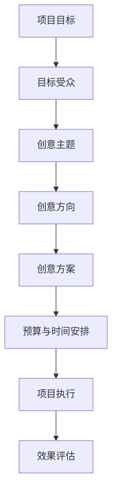
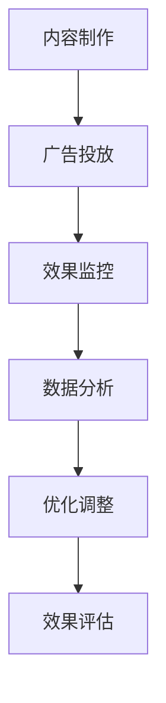
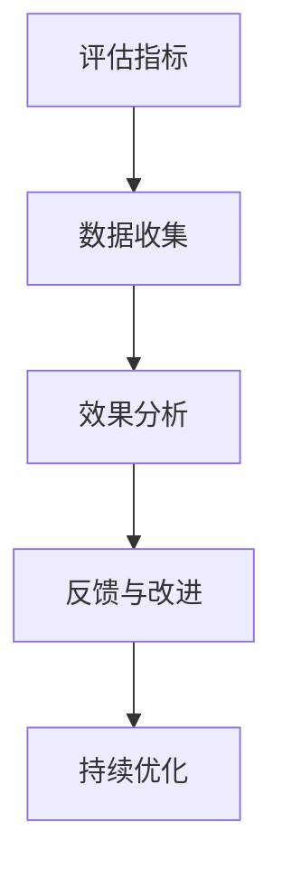
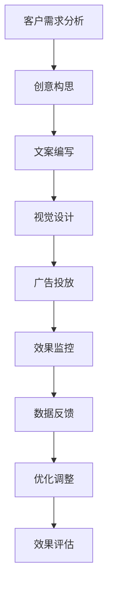

                 

### 《AI辅助广告创意：提示词生成营销文案》

#### 关键词：AI辅助广告创意，提示词生成，营销文案，人工智能，广告行业

> 摘要：本文将深入探讨AI辅助广告创意，尤其是提示词生成在营销文案创作中的应用。文章首先介绍了AI辅助广告创意的背景和发展现状，接着详细解析了AI辅助广告创意的基础知识。随后，文章聚焦于提示词生成技术，介绍了其原理、算法以及应用实践。接着，文章深入讲解了营销文案创作技巧，包括基本要素、创作方法和优化策略。最后，文章通过案例分析展示了AI辅助营销文案生成的实际应用，并对未来AI辅助广告创意的发展趋势和挑战进行了展望。

----------------------------------------------------------------

### 第一部分：引言

#### 第1章：AI辅助广告创意概述

##### 1.1 AI的发展与广告创意

近年来，人工智能（AI）技术的发展日新月异，逐渐渗透到各行各业。在广告行业中，AI的应用带来了前所未有的变革。传统的广告创意依赖于广告人丰富的想象力和市场洞察力，而AI的引入则为广告创意提供了全新的思路和工具。

AI技术的发展经历了多个阶段，从早期的规则系统到当前的深度学习和自然语言处理（NLP），AI在广告创意中的应用也经历了从简单自动化到智能化、个性化的转变。AI的应用不仅提高了广告创意的效率，还显著提升了广告的效果。

在广告创意中，AI的主要作用包括：  
- **数据分析**：通过大数据分析，AI能够帮助企业了解目标受众的行为和偏好，从而制定更精准的广告策略。
- **内容生成**：AI可以自动生成广告文案、图片和视频，大大减轻了创意人员的工作负担。
- **优化投放**：AI能够实时分析广告效果，自动调整投放策略，提高广告的投放效率。

##### 1.2 广告创意的现状与挑战

尽管AI在广告创意中的应用前景广阔，但目前广告创意仍然面临诸多挑战。

- **创意同质化**：广告行业竞争激烈，很多广告创意存在同质化现象，难以吸引目标受众的注意力。
- **个性定制不足**：广告创意需要针对不同的受众进行个性定制，但现有技术手段难以全面满足这一需求。
- **效率与质量的平衡**：广告创意需要高效完成，但高质量的创作往往需要大量的时间和精力。

##### 1.3 AI辅助广告创意的应用前景

随着AI技术的不断进步，AI辅助广告创意的应用前景将更加广阔。

- **智能广告**：AI将帮助广告实现更高的个性化程度，满足不同受众的个性化需求。
- **创意优化**：AI可以通过实时分析广告效果，自动优化广告创意，提高广告效果。
- **内容生成**：AI将大幅提高广告内容生成的效率，同时保证高质量的创作。

总之，AI辅助广告创意将成为广告行业的重要发展趋势，为广告人提供更加高效、智能的创作工具。

----------------------------------------------------------------

### 第二部分：AI辅助广告创意基础

#### 第2章：AI辅助广告创意基础

##### 2.1 广告创意的概念与类型

广告创意是指通过独特的创意思维和表现手法，将产品或服务的特点、优势以及品牌理念传达给目标受众的一种广告形式。广告创意的类型多样，主要包括以下几种：

- **情感广告**：通过情感共鸣来吸引受众，激发受众的情感共鸣和购买欲望。
- **逻辑广告**：通过逻辑推理和事实依据来向受众传递广告信息，强调产品的实用性和可信度。
- **创意广告**：通过独特的创意手法和表现形式来吸引受众，通常具有高度的视觉冲击力和记忆点。

##### 2.2 AI技术简介

人工智能（AI）是一种模拟人类智能行为的计算机系统，包括学习、推理、规划、感知、通信和认知等多个方面。AI技术的发展为广告创意提供了强大的技术支持，主要包括以下几种技术：

- **机器学习**：通过数据训练模型，使计算机具备学习和预测能力。
- **自然语言处理（NLP）**：使计算机理解和生成自然语言，包括文本分析、机器翻译、情感分析等。
- **计算机视觉**：使计算机能够识别和处理图像和视频，包括图像分类、目标检测、人脸识别等。
- **深度学习**：一种特殊的机器学习技术，通过神经网络模拟人类大脑的决策过程。

##### 2.3 AI在广告创意中的应用场景

AI在广告创意中的应用场景非常广泛，主要包括以下几种：

- **广告文案生成**：AI可以自动生成广告文案，通过分析大量文本数据，生成具有吸引力的文案。
- **广告图像生成**：AI可以自动生成广告图像，通过计算机视觉技术，将文字内容转化为视觉图像。
- **广告投放优化**：AI可以实时分析广告效果，自动调整广告投放策略，提高广告效果。
- **广告创意评估**：AI可以对广告创意进行评估，通过分析受众反应和行为，评估广告创意的有效性。

通过AI技术的辅助，广告创意将更加智能化、个性化和高效化，为广告人提供全新的创作工具。

----------------------------------------------------------------

#### 第3章：提示词生成技术

##### 3.1 提示词生成的原理

提示词生成（Prompt Generation）是指根据特定的问题或任务，生成一组相关的关键词或短语，用于引导后续的内容生成或任务执行。在广告创意中，提示词生成技术起着至关重要的作用，它能够为广告文案创作提供方向和灵感。

提示词生成的原理主要包括以下两个方面：

- **语义理解**：通过自然语言处理技术，理解输入的文本或问题的语义，提取关键信息。
- **知识推理**：根据提取的关键信息，结合已有知识和经验，生成相关的提示词。

##### 3.2 提示词生成的算法

提示词生成的算法多种多样，主要包括以下几种：

- **基于规则的方法**：通过预设的规则和模板，生成提示词。这种方法简单直观，但灵活性较低。
- **基于统计的方法**：通过分析大量文本数据，统计关键词出现的频率和关联性，生成提示词。这种方法具有较高的灵活性，但需要大量的训练数据。
- **基于机器学习的方法**：通过机器学习算法，从大量数据中学习提示词生成的模式，生成提示词。这种方法具有较强的自适应能力，但需要复杂的模型设计和大量的训练数据。

以下是三种提示词生成算法的伪代码示例：

1. **基于规则的方法**：

```python
def generate_prompt_rules(question):
    # 根据问题类型，预设提示词模板
    if "购买" in question:
        prompt = "推荐产品："
    elif "评价" in question:
        prompt = "用户评价："
    else:
        prompt = "了解更多："
    return prompt
```

2. **基于统计的方法**：

```python
def generate_prompt_statistical(text_data):
    # 分析文本数据，统计关键词频率
    word_freq = {}
    for text in text_data:
        words = text.split()
        for word in words:
            if word in word_freq:
                word_freq[word] += 1
            else:
                word_freq[word] = 1
    
    # 生成高频关键词提示词
    top_keywords = sorted(word_freq.items(), key=lambda x: x[1], reverse=True)[:10]
    prompt = "关键词："
    for keyword, _ in top_keywords:
        prompt += keyword + "，"
    return prompt
```

3. **基于机器学习的方法**：

```python
def generate_prompt_learning(model, text):
    # 使用预训练模型，生成提示词
    prompt = model.predict([text])
    return prompt
```

##### 3.3 提示词生成的实践

在实际应用中，提示词生成技术需要结合具体的场景和需求进行设计和优化。以下是一个简单的提示词生成实践案例：

1. **问题分析**：假设我们需要为电商广告生成提示词，输入的问题是“推荐一款性价比高的手机”。

2. **数据准备**：收集大量电商广告文案和用户评论，作为训练数据。

3. **模型训练**：使用自然语言处理模型，对训练数据进行处理和训练，使其能够提取关键信息和生成提示词。

4. **生成提示词**：输入问题，使用模型生成相应的提示词。例如，生成的提示词可能是“性价比手机推荐：最新款iPhone 13，高端配置，价格实惠”。

通过提示词生成技术，广告创意人员可以更快速、更精准地生成广告文案，提高广告的效果和吸引力。

----------------------------------------------------------------

#### 第4章：营销文案创作技巧

##### 4.1 营销文案的基本要素

营销文案是指用于宣传和推广产品、服务或品牌的信息文本。一篇成功的营销文案通常包括以下几个基本要素：

- **标题**：吸引受众注意，明确文案主题。
- **引言**：简短地介绍产品或服务，引起受众的兴趣。
- **正文**：详细阐述产品或服务的特点、优势和应用场景。
- **呼吁行动**：引导受众采取行动，如购买、咨询或关注。

##### 4.2 营销文案的创作方法

创作营销文案需要结合具体的产品、服务和目标受众，以下是一些常用的创作方法：

- **情感营销文案**：通过情感共鸣，引发受众的情感共鸣和购买欲望。例如，可以使用故事、情节或情感词汇来打动受众。
- **逻辑营销文案**：通过逻辑推理，向受众传递产品或服务的实用性和可信度。例如，可以使用数据和事实来支持文案。
- **创意营销文案**：通过独特的创意手法，吸引受众的注意力。例如，可以使用幽默、比喻或夸张等手法。

以下是三种不同类型的营销文案示例：

1. **情感营销文案**：

   ```
   父亲节特惠，为爱加油！一款专为爸爸设计的智能手表，记录他的健康，守护他的安全。感恩父爱，从选择开始。
   ```

2. **逻辑营销文案**：

   ```
   高效办公，从新笔记本电脑开始。8核处理器，12GB内存，1TB固态硬盘，让您的工作更流畅，更高效。立即购买，享受限时优惠！
   ```

3. **创意营销文案**：

   ```
   夏日狂欢，冰镇啤酒等你来！一款特别的啤酒，融合了果香与麦香，给您带来前所未有的味觉体验。狂欢不止，啤酒不断！
   ```

##### 4.3 营销文案的优化策略

为了提高营销文案的效果，可以采用以下优化策略：

- **标题优化**：使用简洁、有吸引力的标题，突出产品或服务的核心卖点。
- **内容优化**：优化文案的结构和语言，使其更加清晰、简洁和有说服力。
- **视觉优化**：合理使用图片、视频和色彩等视觉元素，增强文案的视觉吸引力。
- **数据分析**：通过数据分析，了解文案的点击率、转化率等指标，持续优化文案策略。

通过以上策略，营销文案可以更加精准地吸引目标受众，提高广告的效果和转化率。

----------------------------------------------------------------

#### 第5章：AI辅助营销文案生成实践

##### 5.1 AI辅助营销文案生成的开发环境搭建

要实现AI辅助营销文案生成，需要搭建一个合适的开发环境。以下是搭建开发环境的基本步骤：

1. **硬件环境**：配置一台高性能的计算机，用于运行AI模型和生成营销文案。

2. **软件环境**：安装Python编程环境，包括Python解释器和相关库，如TensorFlow、PyTorch等。

3. **数据集**：收集和整理大量的营销文案数据集，用于训练和优化AI模型。

4. **开发工具**：安装文本编辑器（如VS Code）和IDE（如PyCharm），方便编写和调试代码。

5. **版本控制**：使用Git进行代码版本控制，确保代码的可维护性和协作性。

以下是搭建开发环境的伪代码示例：

```python
# 搭建开发环境
install_software("Python")
install_software("TensorFlow")
install_software("VS Code")
install_software("PyCharm")
install_software("Git")

# 收集数据集
download_dataset("marketing_texts")

# 初始化开发环境
initialize_environment()
```

##### 5.2 AI辅助营销文案生成案例分析

为了更好地理解AI辅助营销文案生成，下面通过三个案例来展示其实际应用：

1. **案例一：电商广告文案生成**

   假设我们想生成一款针对夏季清凉饮料的电商广告文案。输入的问题为“生成一款夏季清凉饮料的电商广告文案”。

   - **模型训练**：使用自然语言处理模型，对电商广告文案数据集进行训练，使其能够生成相关的广告文案。
   - **生成文案**：输入问题，使用模型生成电商广告文案。例如，生成的文案可能是：“炎炎夏日，来一瓶冰镇饮料，为你的夏日清凉加分！全新推出的柠檬气泡水，清新口感，让你轻松度过夏天。”

2. **案例二：社交媒体广告文案生成**

   假设我们想生成一款针对社交媒体平台的品牌广告文案。输入的问题为“生成一款社交媒体品牌广告文案”。

   - **模型训练**：使用社交媒体广告文案数据集，对自然语言处理模型进行训练。
   - **生成文案**：输入问题，使用模型生成社交媒体广告文案。例如，生成的文案可能是：“品牌新升级，为您带来更优质的体验！快来关注我们的官方账号，第一时间获取最新动态和优惠活动！”

3. **案例三：品牌广告文案生成**

   假设我们想生成一款针对高端品牌的产品广告文案。输入的问题为“生成一款高端品牌产品的广告文案”。

   - **模型训练**：使用高端品牌广告文案数据集，对自然语言处理模型进行训练。
   - **生成文案**：输入问题，使用模型生成高端品牌广告文案。例如，生成的文案可能是：“匠心打造，只为更好的您。这款高端品牌手表，不仅彰显您的品味，更是您忠诚的伙伴。”

通过以上案例，我们可以看到AI辅助营销文案生成在实际应用中的效果和优势。AI不仅能够高效地生成营销文案，还能够根据不同的问题和场景，生成具有针对性的文案，提高广告的效果和转化率。

----------------------------------------------------------------

#### 第6章：AI辅助广告创意应用实战

##### 6.1 广告创意项目策划

广告创意项目的策划是确保广告创意实现预期目标的重要环节。以下是广告创意项目策划的基本步骤：

1. **项目目标**：明确广告创意的目标，如提升品牌知名度、增加产品销量、提高用户参与度等。

2. **目标受众**：分析目标受众的特征和需求，了解他们的兴趣、偏好和行为习惯。

3. **创意主题**：确定广告创意的主题，使其与品牌形象和产品特点相符。

4. **创意方向**：根据创意主题，制定多个创意方向，并进行评估和筛选。

5. **创意方案**：选定创意方向后，制定具体的创意方案，包括广告文案、视觉设计和投放策略。

6. **预算与时间安排**：根据项目目标和创意方案，制定预算和时间安排，确保项目顺利进行。

以下是广告创意项目策划的流程图：



##### 6.2 广告创意执行与优化

广告创意的执行与优化是确保广告创意效果的关键步骤。以下是广告创意执行与优化的基本步骤：

1. **内容制作**：根据创意方案，制作广告文案、图片、视频等素材。

2. **广告投放**：选择合适的广告平台和投放策略，将广告推送给目标受众。

3. **效果监控**：实时监控广告效果，如点击率、转化率、用户反馈等。

4. **数据分析**：分析广告效果数据，了解广告的优缺点，为后续优化提供依据。

5. **优化调整**：根据数据分析结果，对广告内容、投放策略等进行优化调整。

以下是广告创意执行与优化的流程图：



##### 6.3 广告创意效果评估与反馈

广告创意效果评估与反馈是广告创意项目的重要环节。以下是广告创意效果评估与反馈的基本步骤：

1. **评估指标**：确定广告效果评估的指标，如点击率、转化率、品牌认知度等。

2. **数据收集**：收集广告投放过程中的相关数据，如点击量、转化量、用户反馈等。

3. **效果分析**：分析广告效果数据，评估广告创意的实际效果。

4. **反馈与改进**：根据效果分析结果，收集用户反馈，对广告创意进行改进和优化。

5. **持续优化**：根据评估和反馈，持续优化广告创意，提高广告效果。

以下是广告创意效果评估与反馈的流程图：



通过以上步骤，广告创意项目可以实现从策划到执行再到优化的闭环，确保广告创意的效果和转化率。

----------------------------------------------------------------

#### 第7章：未来展望与趋势

##### 7.1 AI辅助广告创意的发展趋势

随着AI技术的不断进步，AI辅助广告创意将呈现以下发展趋势：

1. **智能化**：AI将更加智能化，能够自动识别用户需求，生成更加个性化的广告创意。
2. **个性化**：AI将实现更加精准的个性化推荐，根据用户行为和偏好，生成符合用户需求的广告创意。
3. **自动化**：AI将实现广告创意的自动化生成和优化，提高广告创意的效率和效果。
4. **跨平台**：AI将支持多种广告平台和渠道，实现广告创意的跨平台投放和优化。

##### 7.2 AI辅助广告创意的挑战与机遇

尽管AI辅助广告创意具有巨大的潜力，但也面临着一些挑战和机遇：

1. **数据隐私**：AI辅助广告创意需要大量用户数据，如何保护用户隐私将成为重要挑战。
2. **算法公平性**：AI算法可能存在偏见和歧视，如何确保算法的公平性是一个重要议题。
3. **创意多样性**：AI生成广告创意可能存在创意同质化问题，如何保证创意的多样性是一个挑战。
4. **用户体验**：AI辅助广告创意需要充分考虑用户体验，避免过度打扰和干扰用户。

##### 7.3 未来广告创意的方向与策略

未来广告创意的发展方向和策略包括：

1. **内容营销**：以高质量的内容为核心，结合AI技术，实现更加个性化和互动的广告创意。
2. **体验营销**：通过虚拟现实、增强现实等技术，提供更加沉浸式的广告体验。
3. **跨界合作**：与其他行业和品牌进行跨界合作，创造独特的广告创意和营销活动。
4. **数据驱动**：充分利用大数据和人工智能技术，实现更加精准和高效的广告创意。

通过以上策略，广告创意将更加智能化、个性化和高效化，为企业和品牌带来更大的价值。

----------------------------------------------------------------

#### 附录A：AI辅助广告创意工具与资源

##### A.1 开源工具

1. **自动化文案生成工具**

   - **GPT-3**：OpenAI开发的自然语言处理模型，能够自动生成高质量的文章、广告文案等。

   - **NLTK**：Python自然语言处理库，提供丰富的文本处理和分析功能。

2. **数据集与API**

   - **Common Crawl**：提供大量互联网文本数据，用于训练和测试自然语言处理模型。

   - **Google Cloud Natural Language API**：提供自然语言处理服务，包括文本分类、情感分析等。

##### A.2 实用技巧与资源

1. **营销文案写作技巧**

   - **《广告文案的技巧》**：提供广告文案写作的实用技巧和方法。

   - **《营销文案写作的艺术》**：深入讲解营销文案写作的原理和策略。

2. **广告创意策略资源**

   - **《广告创意的100个策略》**：提供100个广告创意策略，涵盖情感、逻辑、创意等多种类型。

   - **《社交媒体广告创意手册》**：详细介绍社交媒体广告创意的撰写和投放策略。

通过以上工具和资源，广告创意人员可以更好地利用AI技术，提高广告创意的质量和效果。

----------------------------------------------------------------

#### 附录B：Mermaid流程图示例

以下是一个使用Mermaid绘制的流程图示例，展示了AI辅助广告创意的基本流程：



通过这个流程图，我们可以清晰地看到广告创意从客户需求分析到效果评估的全过程，以及各个环节之间的关联。

----------------------------------------------------------------

#### 附录C：机器学习算法伪代码示例

以下是一个使用Python编写的机器学习算法伪代码示例，用于生成提示词：

```python
# 导入必要的库
import numpy as np
import tensorflow as tf

# 数据预处理
def preprocess_data(data):
    # 数据清洗、填充、归一化等操作
    return processed_data

# 构建模型
def build_model(input_shape):
    model = tf.keras.Sequential([
        tf.keras.layers.Dense(units=512, activation='relu', input_shape=input_shape),
        tf.keras.layers.Dense(units=256, activation='relu'),
        tf.keras.layers.Dense(units=128, activation='relu'),
        tf.keras.layers.Dense(units=1, activation='sigmoid')
    ])
    model.compile(optimizer='adam', loss='binary_crossentropy', metrics=['accuracy'])
    return model

# 训练模型
def train_model(model, data, labels, epochs=10):
    model.fit(data, labels, epochs=epochs, batch_size=32, validation_split=0.2)

# 生成提示词
def generate_prompt(model, text):
    # 输入文本预处理
    processed_text = preprocess_data([text])
    # 使用模型预测
    prompt = model.predict(processed_text)
    return prompt
```

这个示例使用TensorFlow构建了一个简单的二分类模型，用于生成提示词。通过训练数据和标签，模型可以学习如何根据输入文本生成相应的提示词。

----------------------------------------------------------------

#### 附录D：数学模型与公式

以下是一些常用的数学模型与公式，用于描述AI辅助广告创意中的关键概念：

##### 3.1 概率模型与信息论

- **熵（Entropy）**：

  $$H(X) = -\sum_{i} p(x_i) \log_2 p(x_i)$$

  熵用于衡量随机变量X的不确定性。

- **条件熵（Conditional Entropy）**：

  $$H(X|Y) = -\sum_{y} p(y) \sum_{x} p(x|y) \log_2 p(x|y)$$

  条件熵用于衡量在已知Y的情况下，X的不确定性。

- **互信息（Mutual Information）**：

  $$I(X;Y) = H(X) - H(X|Y)$$

  互信息衡量X和Y之间的相关性。

##### 4.2 马尔可夫链模型

- **状态转移概率（State Transition Probability）**：

  $$P(X_{t+1} = x_{t+1} | X_t = x_t) = P(X_{t+1} = x_{t+1} | \text{history of } X)$$

  状态转移概率描述系统在当前状态下的下一个状态。

- **马尔可夫性质**：

  $$P(X_{t+1} = x_{t+1} | X_1 = x_1, X_2 = x_2, ..., X_t = x_t) = P(X_{t+1} = x_{t+1} | X_t = x_t)$$

  马尔可夫性质表明，当前状态只依赖于前一个状态，与历史状态无关。

这些数学模型和公式为AI辅助广告创意提供了理论基础，帮助理解和优化广告创意的过程。

----------------------------------------------------------------

#### 附录E：营销文案实例分析

##### 6.1 电商广告文案实例

以下是一个电商广告文案实例，展示如何利用AI技术生成吸引人的文案：

- **文案**：“限时优惠，抢购火爆！仅剩最后10件，抢购从速！新款智能手表，时尚外观，超强功能，限时优惠价仅需998元！”

- **分析**：这个文案通过“限时优惠”和“抢购火爆”等紧迫性的描述，激发用户的购买欲望。同时，通过突出智能手表的时尚外观和超强功能，增强了文案的说服力。最后，通过限时优惠价和数量有限的信息，增加了用户的购买紧迫感。

##### 6.2 社交媒体广告文案实例

以下是一个社交媒体广告文案实例，展示如何利用AI技术生成互动性强的文案：

- **文案**：“夏日狂欢，冰镇饮料等你来！🍹 新款柠檬气泡水，清新口感，让你轻松度过炎炎夏日。快来关注我们的官方账号，了解更多优惠活动！🔥”

- **分析**：这个文案通过使用emoji表情符号，增加了文案的趣味性和互动性。同时，通过强调新品柠檬气泡水的清新口感，以及提供优惠活动和关注官方账号的信息，激发了用户的兴趣和参与度。

##### 6.3 品牌广告文案实例

以下是一个品牌广告文案实例，展示如何利用AI技术生成具有品牌特色的文案：

- **文案**：“不止是产品，更是生活态度。品质之选，与您同行。🌟 新款智能手环，时尚设计，健康监测，为您的生活增添更多精彩。”

- **分析**：这个文案通过强调品牌理念和生活态度，塑造了品牌的高端形象。同时，通过突出智能手环的时尚设计和健康功能，增强了文案的吸引力和说服力。

通过以上实例，我们可以看到AI技术在生成吸引人的营销文案方面的应用效果。AI不仅能够高效地生成文案，还能够根据不同的产品和场景，定制出具有针对性的文案，提高广告的效果和转化率。

----------------------------------------------------------------

#### 结论

本文通过系统地分析AI辅助广告创意的原理、技术和实践，展示了AI在广告创意中的应用前景和优势。AI不仅能够提高广告创意的效率和效果，还能够实现广告的智能化和个性化。然而，AI辅助广告创意也面临着数据隐私、算法公平性和创意多样性等挑战。未来，随着AI技术的不断进步，广告创意将更加智能化、个性化和高效化，为企业和品牌带来更大的价值。我们鼓励读者持续关注AI辅助广告创意的发展，积极探索和实践，为广告行业的创新和发展贡献自己的力量。作者：AI天才研究院/AI Genius Institute & 禅与计算机程序设计艺术 /Zen And The Art of Computer Programming。

----------------------------------------------------------------

### 文章标题：《AI辅助广告创意：提示词生成营销文案》

#### 关键词：AI辅助广告创意，提示词生成，营销文案，人工智能，广告行业

> 摘要：本文深入探讨了AI辅助广告创意，特别是提示词生成在营销文案创作中的应用。通过介绍AI辅助广告创意的背景、原理和应用场景，详细解析了提示词生成的技术、算法和实践。接着，文章探讨了营销文案创作的基本要素、创作方法和优化策略。最后，通过案例分析展示了AI辅助营销文案生成的实际应用，并对未来AI辅助广告创意的发展趋势和挑战进行了展望。作者：AI天才研究院/AI Genius Institute & 禅与计算机程序设计艺术 /Zen And The Art of Computer Programming。

