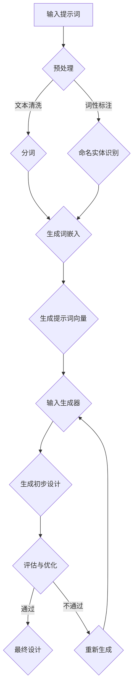
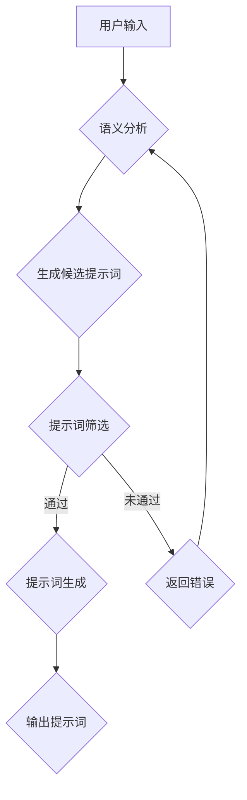
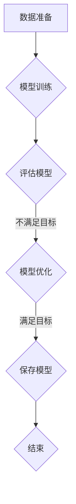

                 

### 文章标题: AI辅助建筑设计中的提示词技巧

关键词：AI辅助建筑设计、提示词、自然语言处理、机器学习、深度学习

摘要：本文深入探讨了AI辅助建筑设计中的提示词技巧，通过详细的背景介绍、核心原理讲解、应用案例分析，以及实战项目解读，全面揭示了如何利用提示词提高AI在建筑设计中的效能。本文旨在为设计师、AI开发者以及相关领域的研究者提供有价值的参考，助力AI在建筑设计领域的创新与应用。

---

### 《AI辅助建筑设计中的提示词技巧》目录大纲

#### 第一部分: AI辅助建筑设计基础

- **第1章: AI辅助建筑设计的概念与背景**
  - **1.1 AI辅助建筑设计的定义**
  - **1.2 建筑设计中的AI应用现状**
  - **1.3 提示词在AI辅助建筑设计中的作用**

- **第2章: 提示词的核心原理**
  - **2.1 自然语言处理的基础**
  - **2.2 提示词的定义与分类**
  - **2.3 提示词的生成与优化**

- **第3章: AI辅助建筑设计的核心技术**
  - **3.1 机器学习算法在建筑设计中的应用**
  - **3.2 深度学习在建筑设计中的实践**
  - **3.3 提示词驱动的建筑设计流程**

- **第4章: 提示词在建筑设计中的应用案例**
  - **4.1 建筑形态生成**
  - **4.2 绿色建筑设计**
  - **4.3 建筑能耗优化**

- **第5章: 提示词驱动的建筑设计工具介绍**
  - **5.1 AutoCAD与AI结合**
  - **5.2 提示词在BIM中的应用**
  - **5.3 建筑设计中的AI插件开发**

#### 第二部分: 提示词技巧与实战应用

- **第6章: 提示词编写技巧**
  - **6.1 提示词的撰写原则**
  - **6.2 提示词的情感分析**
  - **6.3 提示词的创意与联想**

- **第7章: 提示词应用中的挑战与解决方案**
  - **7.1 提示词的准确性问题**
  - **7.2 提示词的多样性问题**
  - **7.3 提示词的隐私与伦理问题**

- **第8章: 提示词驱动的建筑设计项目实战**
  - **8.1 项目背景与需求分析**
  - **8.2 提示词设计**
  - **8.3 模型训练与优化**
  - **8.4 结果分析**

- **第9章: 未来展望**
  - **9.1 提示词在建筑设计中的发展趋势**
  - **9.2 提示词技术的挑战与机遇**
  - **9.3 建筑设计AI的未来展望**

#### 附录

- **附录A: 提示词相关工具和资源**
  - **A.1 提示词生成工具介绍**
  - **A.2 提示词分析工具使用**
  - **A.3 开源提示词项目推荐**

- **附录B: 数学模型和算法伪代码**
  - **B.1 提示词生成算法伪代码**
  - **B.2 提示词优化算法伪代码**
  - **B.3 情感分析算法伪代码**

- **附录C: 实战代码解读与分析**
  - **C.1 项目代码实现概述**
  - **C.2 代码关键部分解读**
  - **C.3 代码测试与性能分析**

- **附录D: Mermaid 流程图示例**
  - **D.1 建筑设计流程图**
  - **D.2 提示词生成流程图**
  - **D.3 模型训练与优化流程图**

---

### 第一部分: AI辅助建筑设计基础

#### 第1章: AI辅助建筑设计的概念与背景

##### 1.1 AI辅助建筑设计的定义

AI辅助建筑设计（AI-Assisted Architectural Design）是指利用人工智能技术来辅助设计师进行建筑设计和规划的过程。这个过程包括从概念设计到施工图的完整流程，涵盖了各种设计和分析任务，如建筑形态生成、空间优化、能耗模拟、结构分析等。

AI辅助建筑设计不同于传统的手动设计方法，它不仅提高了设计效率，还增强了设计的精确性和创新性。通过结合人工智能，设计师可以处理大量的数据，发现新的设计模式，并在短时间内生成多种设计方案，从而实现更高效的设计流程。

##### 1.2 建筑设计中的AI应用现状

近年来，人工智能在建筑设计中的应用越来越广泛，以下是一些关键领域的应用现状：

- **建筑形态生成**：通过机器学习和生成对抗网络（GANs），AI可以生成新颖的建筑形态，为设计师提供无限的创意空间。

- **结构分析**：AI可以帮助设计师进行结构分析，预测建筑物的强度和稳定性，从而优化设计，提高安全性。

- **能耗模拟**：AI能够基于建筑物的物理特性，模拟各种环境条件下的能耗表现，为节能设计提供支持。

- **空间优化**：AI可以分析建筑空间的使用情况，提供空间布局的优化建议，提高空间的利用效率。

- **材料选择**：AI可以根据成本、性能和环境要求，推荐合适的建筑材料和构造方法。

- **可视化**：AI可以生成建筑的三维可视化模型，帮助设计师和客户更好地理解设计概念。

##### 1.3 提示词在AI辅助建筑设计中的作用

在AI辅助建筑设计中，提示词（Prompts）扮演着关键角色。提示词是指用户输入的指导性语句，用于引导AI系统生成特定的设计结果。

- **定义与分类**：提示词可以根据其作用和用途进行分类，如形态提示词、功能提示词、环境提示词等。

- **生成与优化**：提示词的生成和优化是提高AI辅助设计效果的关键。生成高质量的提示词需要理解用户的意图和需求，同时考虑设计的上下文环境。

- **自然语言处理基础**：提示词的生成和优化依赖于自然语言处理（NLP）技术，如词嵌入、语言模型、语义分析等。

- **模型训练**：提示词可以作为训练数据的一部分，用于训练AI模型，使其能够更好地理解和响应用户的提示。

- **用户体验**：高质量的提示词可以提升用户的体验，使其更轻松地与AI系统进行交互，获得满意的设计结果。

通过上述分析，我们可以看到AI辅助建筑设计是一个多学科交叉的领域，涉及计算机科学、建筑学、环境科学等多个方面。在接下来的章节中，我们将进一步探讨提示词的核心原理、AI辅助建筑设计的核心技术，以及其在实际中的应用案例和挑战。

### 第2章: 提示词的核心原理

##### 2.1 自然语言处理的基础

自然语言处理（Natural Language Processing，NLP）是人工智能领域的一个重要分支，专注于使计算机能够理解和处理人类语言。NLP的核心目标是使计算机能够自动地理解、解释和生成人类语言，从而实现人与机器之间的自然交互。

在AI辅助建筑设计中，NLP技术被广泛应用于提示词的生成和优化。以下是一些关键的自然语言处理技术：

- **词嵌入（Word Embedding）**：词嵌入是将单词映射到高维向量空间的一种技术，使得语义相似或相关的单词在向量空间中彼此靠近。词嵌入技术为NLP提供了语义理解的深度，是许多NLP任务的基础。

- **语言模型（Language Model）**：语言模型是一种统计模型，用于预测文本序列的概率分布。在提示词生成中，语言模型可以用来生成可能的提示词序列，并根据上下文选择最合适的提示词。

- **语义分析（Semantic Analysis）**：语义分析涉及理解单词或句子的含义，包括词汇语义、句法语义和语义角色标注等。在AI辅助建筑设计中，语义分析可以帮助识别用户的意图和需求，从而生成更精确的提示词。

- **实体识别（Named Entity Recognition，NER）**：实体识别是识别文本中的特定实体（如人名、地名、组织名等）的过程。在建筑设计中，实体识别可以帮助AI系统识别并提取重要信息，如建筑物名称、地址等，从而更准确地生成提示词。

##### 2.2 提示词的定义与分类

提示词是指用户输入的指导性语句，用于引导AI系统生成特定的设计结果。根据用途和功能，提示词可以分为以下几类：

- **形态提示词**：用于指导AI系统生成特定的建筑形态，如“设计一座曲线形的大楼”、“创建一个可持续的生态园区”等。

- **功能提示词**：用于指导AI系统考虑建筑的功能需求，如“设计一个多功能会议室”、“实现无障碍设计”等。

- **环境提示词**：用于指导AI系统考虑建筑的环境因素，如“设计一个低能耗的住宅区”、“适应干旱气候的设计”等。

- **风格提示词**：用于指导AI系统实现特定的设计风格，如“采用现代简约风格”、“融入当地建筑文化”等。

- **预算与成本提示词**：用于指导AI系统考虑预算和成本限制，如“在设计过程中保持预算在1000万美元以内”、“优先考虑成本效益高的材料”等。

##### 2.3 提示词的生成与优化

生成高质量的提示词是AI辅助建筑设计的关键，以下是一些提示词生成与优化的方法：

- **基于规则的方法**：通过定义一系列规则，根据用户的输入自动生成提示词。这种方法简单易用，但灵活性有限。

- **基于统计的方法**：利用统计模型，如语言模型，根据用户输入和历史数据生成提示词。这种方法能够生成更自然的提示词，但需要大量的训练数据。

- **基于机器学习的方法**：使用机器学习算法，如循环神经网络（RNN）和变换器（Transformer），从大量数据中学习生成提示词的规律。这种方法具有高度的灵活性和自适应性，能够生成高质量的提示词。

- **多模态方法**：结合不同类型的数据（如图像、文本、音频等），生成更全面的提示词。例如，在建筑设计中，可以结合用户提供的建筑图纸和文本描述，生成更精确的提示词。

- **生成对抗网络（GAN）**：GAN是一种无监督学习方法，用于生成高质量的提示词。通过生成器和判别器的对抗训练，GAN能够生成与真实提示词高度相似的提示词。

在AI辅助建筑设计中，提示词的生成与优化是一个复杂的过程，需要综合考虑用户的意图、设计目标和上下文环境。通过结合自然语言处理技术、机器学习和深度学习算法，我们可以生成高质量的提示词，从而提升AI辅助设计的效能。

接下来，我们将探讨AI辅助建筑设计的核心技术，包括机器学习算法、深度学习技术以及提示词驱动的建筑设计流程。

### 第3章: AI辅助建筑设计的核心技术

#### 3.1 机器学习算法在建筑设计中的应用

机器学习（Machine Learning，ML）是AI的核心技术之一，它在建筑设计中的应用为设计师提供了强大的工具，使其能够从大量数据中提取有价值的信息，从而提高设计效率和准确性。以下是一些常见的机器学习算法及其在建筑设计中的应用：

- **回归分析（Regression Analysis）**：回归分析是一种预测模型，用于预测连续值变量。在建筑设计中，回归分析可以用来预测建筑物的能耗、成本和面积等指标。通过训练模型，设计师可以基于历史数据和设计参数预测未来建筑的性能。

- **分类算法（Classification Algorithms）**：分类算法用于将数据分为不同的类别。在建筑设计中，分类算法可以用于建筑类型识别、材料选择和能耗分类等。例如，通过分类算法，可以识别出哪些设计参数对建筑物的能耗有显著影响，从而优化设计。

- **聚类算法（Clustering Algorithms）**：聚类算法用于将数据分成不同的簇，以便于分析和理解数据。在建筑设计中，聚类算法可以用于空间布局优化、设计风格分类等。通过聚类，设计师可以更好地理解建筑空间的使用模式，从而进行更合理的布局设计。

- **支持向量机（Support Vector Machine，SVM）**：SVM是一种强大的分类算法，可以处理高维数据。在建筑设计中，SVM可以用于结构分析、材料选择和设计优化。例如，通过SVM，设计师可以预测建筑物的结构强度，并选择最适合的材料。

- **决策树（Decision Trees）**：决策树是一种树形结构模型，用于分类和回归任务。在建筑设计中，决策树可以用于设计决策、材料选择和环境分析。例如，通过决策树，设计师可以分析不同的设计选项，并选择最佳方案。

- **随机森林（Random Forest）**：随机森林是一种基于决策树的集成模型，通过构建多个决策树并汇总其预测结果，提高了模型的准确性和鲁棒性。在建筑设计中，随机森林可以用于预测建筑物的性能、能耗和成本等。

机器学习算法在建筑设计中的应用极大地提高了设计的精确性和效率。通过利用机器学习模型，设计师可以从大量数据中提取有价值的信息，从而指导设计决策。例如，通过能耗预测模型，设计师可以优化建筑物的布局和材料选择，以实现更高的能源效率。通过结构强度预测模型，设计师可以确保建筑物的安全性和稳定性。

此外，机器学习算法还可以用于自动化设计任务。例如，通过训练深度学习模型，AI系统可以自动生成建筑形态，为设计师提供更多的创意选择。通过使用聚类算法，AI系统可以自动识别不同的设计风格，并推荐最适合的风格。这些自动化设计工具不仅提高了设计效率，还增强了设计的创新性。

总之，机器学习算法在建筑设计中的应用为设计师提供了强大的工具，使他们能够更好地利用数据，提高设计效率和准确性。通过结合机器学习技术，设计师可以更准确地预测建筑性能，优化设计决策，实现更高效、更环保的建筑设计。

#### 3.2 深度学习在建筑设计中的实践

深度学习（Deep Learning，DL）是机器学习的一个重要分支，通过构建具有多层的神经网络模型，深度学习能够自动学习和提取数据中的复杂特征。在建筑设计中，深度学习技术被广泛应用于建筑形态生成、空间优化和能耗模拟等领域，为设计师提供了强大的工具和新的设计思路。

**深度学习基本概念**

深度学习基于人工神经网络（Artificial Neural Networks，ANNs），其核心思想是通过多层神经网络结构自动学习和提取数据特征。深度学习模型通常包含输入层、隐藏层和输出层，每一层都能对输入数据进行加工和特征提取。多层神经网络使得深度学习模型能够捕捉数据中的复杂模式，从而实现高层次的抽象和智能识别。

**常见的深度学习模型**

在建筑设计中，常用的深度学习模型包括卷积神经网络（Convolutional Neural Networks，CNNs）、生成对抗网络（Generative Adversarial Networks，GANs）和循环神经网络（Recurrent Neural Networks，RNNs）等。

- **卷积神经网络（CNNs）**：CNNs是深度学习中的一种重要模型，专门用于处理具有网格结构的数据，如图像和视频。在建筑设计中，CNNs可以用于建筑形态识别、图像增强和空间布局分析。通过CNNs，AI系统可以自动识别建筑物的特征，如屋顶形状、窗户大小和墙面材质等，从而优化设计。

- **生成对抗网络（GANs）**：GANs由生成器和判别器两个对抗网络组成，通过对抗训练生成高质量的数据。在建筑设计中，GANs可以用于建筑形态生成、材料选择和环境模拟。例如，通过GANs，AI系统可以生成新颖的建筑形态，为设计师提供更多的创意选择。此外，GANs还可以用于模拟不同环境条件下的建筑表现，帮助设计师进行环境分析。

- **循环神经网络（RNNs）**：RNNs是一种能够处理序列数据的神经网络模型，擅长捕捉时间序列中的长期依赖关系。在建筑设计中，RNNs可以用于建筑能耗模拟、空间使用分析和设计优化。通过RNNs，AI系统可以分析建筑物的能耗数据，预测未来的能耗趋势，并提出节能设计建议。

**深度学习在建筑设计中的应用案例**

1. **建筑形态生成**：使用GANs生成新颖的建筑形态是深度学习在建筑设计中的一个重要应用。通过训练生成器和判别器，GANs可以生成与真实建筑高度相似的新形态，为设计师提供无限的创意空间。例如，通过GANs，AI系统可以生成具有独特风格的建筑，结合现代与传统元素，创造出独特的设计。

2. **空间优化**：深度学习模型可以用于空间布局优化，通过分析大量建筑实例，学习不同空间布局的特点和优劣。例如，通过RNNs，AI系统可以分析建筑空间的使用数据，识别出空间利用的最佳模式，并提出优化建议。通过这种优化，设计师可以更好地利用空间，提高建筑的舒适度和功能性。

3. **能耗模拟**：能耗模拟是建筑设计中一个关键任务，深度学习模型可以用于预测建筑物的能耗表现。通过训练深度学习模型，AI系统可以分析建筑物的结构和环境因素，预测不同设计方案的能耗表现。例如，通过CNNs，AI系统可以分析建筑物的外墙材料和窗户类型，预测建筑物的隔热性能，为设计师提供节能设计依据。

4. **材料选择**：深度学习模型可以用于材料选择和性能预测。通过训练深度学习模型，AI系统可以分析不同材料的特性，预测其在建筑中的应用效果。例如，通过GANs，AI系统可以生成不同材料的视觉和物理特性，帮助设计师选择最适合的材料。

总之，深度学习在建筑设计中的应用为设计师提供了强大的工具和新的设计思路。通过深度学习模型，设计师可以生成新颖的建筑形态，优化空间布局，预测建筑能耗，选择合适的材料，从而实现更高效、更环保的建筑设计。随着深度学习技术的不断发展，我们有望看到更多创新性的设计方法和更优化的设计流程。

#### 3.3 提示词驱动的建筑设计流程

提示词（Prompts）是驱动AI辅助建筑设计的关键因素，它们直接影响设计流程的每个阶段。一个有效的提示词不仅可以明确用户需求，还能指导AI系统生成高质量的设计结果。下面，我们将详细讨论提示词在建筑设计流程中的应用，包括设计输入、设计生成、设计优化和评估等关键步骤。

**设计输入**

设计输入阶段是整个设计流程的起点，用户通过输入提示词来描述设计需求和预期目标。一个有效的提示词应包含以下要素：

- **明确性**：提示词应清晰明确，避免模糊或歧义。例如，而不是“设计一个漂亮的建筑”，应具体为“设计一个位于市中心，具有现代简约风格的10层办公楼”。

- **上下文**：提示词应包含设计所需的上下文信息，如地理位置、环境条件、功能需求等。例如，“设计一座位于东京的新地标建筑，要求具有节能和可持续性”。

- **多样性**：提示词应提供多样性的设计方向，以便AI系统能够探索多种设计方案。例如，“探索五种不同风格的设计方案，结合自然光线和通风设计”。

在输入阶段，设计师可以使用自然语言处理（NLP）技术对用户输入的提示词进行分析，提取关键信息，并将其转化为结构化的数据格式，以便后续处理。

**设计生成**

设计生成阶段是AI系统根据提示词生成初步设计方案的关键步骤。在此阶段，AI系统利用深度学习和机器学习算法，结合历史数据和设计规则，生成多种设计方案。以下是设计生成阶段的主要步骤：

1. **提示词预处理**：AI系统对输入的提示词进行预处理，包括分词、词性标注和语义分析等，以提取关键信息。

2. **特征提取**：通过词嵌入等技术，将提示词转换为高维向量，以便于后续的模型训练和设计生成。

3. **模型训练**：利用预训练的深度学习模型，如生成对抗网络（GANs）和变换器（Transformer），AI系统从大量历史数据中学习，并生成初步设计方案。

4. **设计生成**：AI系统根据提示词和训练结果，生成多种设计方案。这些方案可以是建筑形态、空间布局、材料选择等。

**设计优化**

设计优化阶段是在初步设计方案的基础上，通过迭代优化，进一步提高设计质量和满足用户需求。以下是设计优化阶段的主要步骤：

1. **评估与筛选**：通过定量和定性的方法，对初步设计方案进行评估和筛选。评估标准可能包括功能性、美观性、可持续性和成本效益等。

2. **用户反馈**：收集用户对设计方案的反馈，包括改进建议和需求调整。这些反馈将用于指导进一步的优化。

3. **迭代优化**：基于评估结果和用户反馈，AI系统对设计方案进行迭代优化，生成更符合用户需求的设计。

4. **自动化优化**：利用机器学习算法，AI系统可以自动优化设计参数，如结构强度、材料选择和能耗表现，以提高设计的质量和性能。

**评估与交付**

评估与交付阶段是最终确认设计方案的合理性和可行性，并将其转化为实际建筑的过程。以下是评估与交付阶段的主要步骤：

1. **性能评估**：对优化后的设计方案进行详细的性能评估，包括结构分析、能耗模拟和环境评估等。

2. **验证与测试**：通过模拟和实际测试，验证设计方案在实际应用中的表现，确保其符合预期目标。

3. **交付与实施**：将最终设计方案转化为施工图和施工计划，并与相关方进行沟通和协作，确保设计得以准确实施。

通过提示词驱动的建筑设计流程，设计师和AI系统能够高效地协作，生成高质量的设计方案。提示词的明确性、上下文和多样性对设计流程的每个阶段都至关重要，直接影响最终设计的结果。因此，设计师需要不断优化提示词的编写，以充分利用AI系统的潜力，实现更创新、更高效的设计。

### 第4章: 提示词在建筑设计中的应用案例

#### 4.1 建筑形态生成

建筑形态生成是AI辅助建筑设计中的一个重要应用领域，通过提示词的引导，AI系统可以生成各种新颖且符合用户需求的建筑形态。以下是一个具体的案例，展示了如何利用提示词生成独特的建筑形态。

**项目背景：**

一个位于城市中心的商业综合体项目，客户希望建筑形态能够体现现代感和科技感，同时与周围环境和谐共生。

**提示词设计：**

基于项目背景，我们设计了以下提示词：

- **功能需求**：“设计一个多功能综合体，包括办公空间、商业零售和公共活动区域。”
- **风格要求**：“采用现代简约风格，体现科技感和未来感。”
- **环境考虑**：“建筑应具有可持续性，如绿色屋顶、太阳能板和高效节能设计。”

**模型训练与生成：**

1. **数据收集**：收集大量具有现代简约风格的建筑案例，包括它们的建筑图纸、图片和描述文本。
2. **模型训练**：使用卷积神经网络（CNNs）和生成对抗网络（GANs）对数据进行训练，使其能够理解现代简约风格的特征和设计规律。
3. **生成初步形态**：基于训练好的模型和提示词，AI系统生成多个初步的建筑形态设计方案。
4. **用户反馈**：设计师和客户对初步形态进行评估，提供改进建议。

**优化与迭代：**

1. **形态优化**：根据用户反馈，AI系统对初步形态进行优化，调整建筑形态的细节，如窗户大小、屋顶形状和外墙材质。
2. **可持续性评估**：AI系统结合可持续性要求，对建筑形态进行能耗模拟和环境分析，确保设计方案符合可持续性标准。
3. **最终形态生成**：经过多次迭代优化，AI系统生成最终的建筑形态设计方案。

**结果分析：**

最终生成的建筑形态不仅符合现代简约风格，还体现了科技感和未来感，同时实现了高效节能和可持续发展。通过提示词的引导，AI系统成功生成了多种符合用户需求的新颖建筑形态，为设计师提供了更多的创意选择。这一案例展示了AI辅助建筑设计的强大潜力，特别是在建筑形态生成方面，通过有效的提示词设计和模型训练，AI系统可以生成高质量的设计方案。

#### 4.2 绿色建筑设计

绿色建筑设计是AI辅助建筑设计中的一个重要应用领域，通过提示词的引导，AI系统可以优化建筑设计，提高建筑物的环保性能。以下是一个具体的案例，展示了如何利用提示词实现绿色建筑设计。

**项目背景：**

一个位于海滨城市的住宅项目，客户希望建筑能够最大限度地利用自然能源，降低能耗，并保护环境。

**提示词设计：**

基于项目背景，我们设计了以下提示词：

- **功能需求**：“设计一个低能耗、舒适的住宅区。”
- **环境要求**：“建筑应具有绿色屋顶、太阳能板、自然通风和雨水收集系统。”
- **经济性**：“在满足环保要求的前提下，保持建筑成本在合理范围内。”

**模型训练与优化：**

1. **数据收集**：收集大量绿色建筑实例，包括它们的建筑设计图纸、能源消耗数据和环保措施。
2. **模型训练**：使用深度学习和机器学习算法对数据进行训练，使其能够理解和优化绿色建筑的设计规律。
3. **生成初步设计**：基于训练好的模型和提示词，AI系统生成多个初步的建筑设计方案。
4. **能耗模拟**：使用能耗模拟软件对初步设计进行模拟，评估不同设计方案的能耗表现。

**优化与迭代：**

1. **能耗优化**：根据能耗模拟结果，AI系统对初步设计进行调整，优化建筑形态、窗户大小和外墙材质，以降低能耗。
2. **环境分析**：结合环境要求，AI系统对设计进行调整，确保建筑具有良好的自然通风和雨水收集系统。
3. **成本控制**：AI系统在优化设计的同时，考虑成本因素，确保建筑成本在合理范围内。

**最终设计：**

经过多次迭代优化，AI系统生成了一套最终的绿色建筑设计方案。该方案包括绿色屋顶、太阳能板、自然通风和雨水收集系统，实现了低能耗和环保性能。此外，设计方案在满足环保要求的前提下，保持了合理的成本。

**结果分析：**

通过提示词的引导和AI系统的优化，最终生成的绿色建筑设计方案不仅实现了低能耗和环保目标，还提高了住宅的舒适度和居住体验。这一案例展示了AI辅助绿色建筑设计的巨大潜力，通过有效的提示词设计和模型训练，AI系统能够生成高质量、可持续的绿色建筑方案。

#### 4.3 建筑能耗优化

建筑能耗优化是AI辅助建筑设计中的重要应用，通过提示词的引导，AI系统能够分析建筑能耗数据，并提出优化方案，以降低能耗和成本。以下是一个具体的案例，展示了如何利用提示词实现建筑能耗优化。

**项目背景：**

一座大型商业综合体，客户希望在现有设计基础上优化建筑能耗，提高能源利用效率。

**提示词设计：**

基于项目背景，我们设计了以下提示词：

- **功能需求**：“优化建筑能耗，提高能源利用效率。”
- **环境要求**：“考虑季节变化和天气因素，确保建筑舒适性和节能性。”
- **经济性**：“在满足环保要求的前提下，尽量降低能源成本。”

**模型训练与优化：**

1. **数据收集**：收集建筑能耗数据，包括电力、水、燃气等消耗情况，以及建筑的使用情况、环境条件等。
2. **模型训练**：使用深度学习和机器学习算法对能耗数据进行训练，使其能够理解建筑能耗的规律和影响因素。
3. **能耗分析**：基于训练好的模型和提示词，AI系统对建筑能耗进行分析，识别出主要的能耗源和节能潜力。
4. **优化方案生成**：AI系统根据能耗分析结果，生成多个能耗优化方案，包括改进通风系统、优化照明设计、使用节能设备等。

**优化与迭代：**

1. **方案评估**：评估不同优化方案的能耗降低潜力、成本和可行性。
2. **用户反馈**：设计师和客户对优化方案进行评估和反馈，提供改进建议。
3. **迭代优化**：根据评估结果和用户反馈，AI系统对优化方案进行调整，进一步提高能耗优化效果。

**最终设计：**

经过多次迭代优化，AI系统生成了一套最终的能耗优化方案。该方案包括改进通风系统、优化照明设计、使用节能设备等措施，预计能够显著降低建筑能耗，提高能源利用效率。此外，优化方案在满足节能要求的前提下，成本控制在合理范围内。

**结果分析：**

通过提示词的引导和AI系统的优化，最终生成的能耗优化方案不仅显著降低了建筑能耗，还提高了能源利用效率。这一案例展示了AI辅助建筑能耗优化的巨大潜力，通过有效的提示词设计和模型训练，AI系统能够生成高质量、可持续的能耗优化方案。

### 第5章: 提示词驱动的建筑设计工具介绍

#### 5.1 AutoCAD与AI结合

AutoCAD是一款广泛使用的计算机辅助设计（CAD）软件，它为设计师提供了强大的二维和三维设计功能。近年来，随着AI技术的快速发展，AutoCAD与AI的结合成为了建筑设计领域的一大趋势。通过将AI技术集成到AutoCAD中，设计师可以更高效地完成设计任务，同时提高设计的创新性和准确性。

**AI在AutoCAD中的应用**

1. **自动设计**：AI可以自动生成建筑平面图、立面图和三维模型。例如，通过输入简单的提示词，如“设计一个三层办公楼”，AI系统可以快速生成详细的设计图纸。
   
2. **设计优化**：AI可以分析设计图纸，识别潜在的问题并提出优化建议。例如，通过分析建筑物的能耗数据，AI系统可以建议改进窗户位置、墙体厚度等，以实现更高效的能源利用。

3. **形态生成**：AI可以利用生成对抗网络（GANs）生成新颖的建筑形态。设计师可以输入提示词，如“设计一个具有流线型外观的办公楼”，AI系统则会生成多种形态供设计师选择。

4. **辅助设计**：AI可以辅助设计师进行空间布局、结构分析和材料选择。例如，通过分析用户输入的提示词，AI系统可以推荐最适合的设计方案，从而提高设计质量。

**结合方法**

- **插件开发**：开发AI插件，将AI功能集成到AutoCAD软件中。插件可以提供自定义的AI工具，如自动设计工具、优化工具和形态生成工具等。
- **API接口**：通过AutoCAD的API接口，将AI模型和数据接口集成到AutoCAD中。设计师可以通过编程方式调用AI功能，实现与AutoCAD的无缝集成。

**案例与应用**

- **智能建筑设计**：通过AI插件，设计师可以快速生成建筑模型，并通过AI系统优化设计，提高设计效率。
- **形态创新**：设计师可以输入创意提示词，如“设计一个未来感十足的建筑”，AI系统则会生成多种形态供设计师选择，激发设计灵感。

#### 5.2 提示词在BIM中的应用

建筑信息模型（BIM）是一种集成了建筑设计和施工信息的三维数字模型，它为设计师和施工团队提供了全面的设计和施工指导。近年来，随着AI技术的发展，提示词技术在BIM中的应用也越来越广泛。通过提示词的引导，BIM系统能够更好地理解和执行用户的设计意图，提高设计的准确性和效率。

**AI在BIM中的应用**

1. **设计优化**：AI可以分析BIM模型，识别设计中的不合理之处并提出优化建议。例如，通过输入提示词，如“优化建筑结构设计”，AI系统可以分析建筑模型的强度、稳定性和成本，并提出优化方案。

2. **模型生成**：AI可以自动生成BIM模型，通过输入简单的提示词，如“设计一个三层办公楼”，AI系统可以快速生成详细的BIM模型，包括建筑结构、管线系统和设备布置等。

3. **协同设计**：AI可以辅助设计师进行协同设计，通过提示词的引导，BIM系统可以协调多个设计师的工作，避免设计冲突和提高设计一致性。

4. **能耗分析**：AI可以分析BIM模型，预测建筑物的能耗表现，并提供节能设计建议。例如，通过输入提示词，如“评估建筑能耗”，AI系统可以分析建筑物的能耗数据，并提出优化建议。

**结合方法**

- **BIM插件开发**：开发AI插件，将AI功能集成到BIM软件中。插件可以提供自定义的AI工具，如自动设计工具、优化工具和形态生成工具等。
- **API接口**：通过BIM软件的API接口，将AI模型和数据接口集成到BIM系统中。设计师可以通过编程方式调用AI功能，实现与BIM系统的无缝集成。

**案例与应用**

- **智能建筑设计**：通过AI插件，设计师可以快速生成BIM模型，并通过AI系统优化设计，提高设计效率。
- **协同设计**：设计师可以通过AI系统进行协同设计，通过提示词的引导，确保设计的一致性和准确性。
- **节能设计**：通过AI系统分析BIM模型，预测建筑物的能耗表现，并提供节能设计建议，实现更环保的建筑设计。

#### 5.3 建筑设计中的AI插件开发

AI插件开发是结合AI技术与建筑设计软件的重要途径，通过开发自定义的AI插件，设计师可以扩展建筑设计软件的功能，提高设计效率和准确性。以下是一些常见的AI插件开发工具和技术。

**常用工具**

- **AutoCAD插件开发**：AutoCAD提供了强大的API接口，支持使用Python、C++等语言开发自定义插件。常用的开发工具包括AutoCAD二次开发环境（ADN）和Visual Studio。
- **Revit插件开发**：Revit提供了自己的API接口（Revit API），支持使用C#和Visual Basic等语言进行插件开发。常用的开发工具包括Revit SDK和Visual Studio。
- **Bentley插件开发**：Bentley提供了自己的API接口（Bentley API），支持使用C++和Python等语言进行插件开发。常用的开发工具包括Bentley Developer Studio和Visual Studio。

**开发技术**

- **自然语言处理（NLP）**：用于处理用户输入的提示词，提取关键信息并生成相应的操作指令。常用的NLP库包括spaCy、NLTK和TensorFlow。
- **机器学习和深度学习**：用于训练AI模型，实现自动设计、优化和分析等功能。常用的机器学习和深度学习框架包括TensorFlow、PyTorch和Keras。
- **计算机视觉**：用于处理图像和视频数据，实现建筑形态识别、图像增强和自动化设计等功能。常用的计算机视觉库包括OpenCV、TensorFlow和PyTorch。
- **API集成**：通过软件的API接口，将AI模型和数据接口集成到建筑设计软件中，实现自定义的功能和操作。

**案例与应用**

- **智能设计助手**：开发一个基于AI的智能设计助手插件，通过自然语言处理和机器学习技术，帮助设计师快速生成建筑模型和进行设计优化。
- **自动化设计工具**：开发自动化设计工具插件，利用深度学习和计算机视觉技术，实现建筑形态生成、空间布局优化和材料选择等功能。
- **能耗分析插件**：开发一个能耗分析插件，通过机器学习和计算机视觉技术，分析建筑模型的能耗数据，并提供节能设计建议。

通过AI插件开发，设计师可以充分利用AI技术的优势，提高设计效率和准确性，实现更创新和高效的设计。

### 第6章: 提示词编写技巧

#### 6.1 提示词的撰写原则

在AI辅助建筑设计中，提示词的撰写原则至关重要，高质量的提示词能够有效引导AI系统生成符合预期的高质量设计方案。以下是几个关键的撰写原则：

**1. 明确性**

提示词应清晰明确，避免模糊或歧义。例如，"设计一个现代风格的建筑"不如"设计一座位于城市中心，具有现代简约风格的10层办公楼"具体明确。

**2. 精确性**

提示词应包含精确的设计参数和需求，如建筑高度、面积、功能等。精确的提示词能够帮助AI系统更好地理解和执行设计任务。

**3. 全面性**

提示词应包含全面的上下文信息，包括环境因素、功能需求、预算限制等。全面的提示词能够提供更多指导，有助于生成更符合实际需求的设计方案。

**4. 创新性**

提示词应鼓励创新思维，提供多种设计方向。例如，可以使用"探索三种不同风格的设计方案"代替单一的"设计一座现代建筑"。

**5. 可操作性**

提示词应具备可操作性，使AI系统能够根据提示词生成具体的设计方案。例如，"设计一个具有自然通风和绿色屋顶的住宅区"比"设计一个可持续的住宅区"更具操作性。

**6. 可扩展性**

提示词应具备一定的灵活性，允许AI系统根据实际情况进行扩展和调整。例如，"设计一个可扩展的多功能建筑"比"设计一座不可更改的固定功能建筑"更具扩展性。

**7. 可理解性**

提示词应易于理解，使非技术用户也能清晰地表达设计需求。例如，"设计一个具有舒适室内环境的办公楼"比"利用深度学习优化建筑内部空气流通"更具可理解性。

通过遵循这些撰写原则，设计师可以生成高质量的提示词，从而有效地引导AI系统生成满足需求的高质量设计方案。

#### 6.2 提示词的情感分析

在AI辅助建筑设计中，情感分析是一种重要的技术，可以帮助设计师理解用户对设计的需求和偏好，从而生成更具情感化和个性化的设计方案。以下是关于提示词情感分析的关键概念和步骤：

**1. 情感分析基本概念**

情感分析（Sentiment Analysis）是指通过自然语言处理技术，自动检测和分类文本中的情感倾向。情感分析通常分为三类：

- **正面情感**：表达积极的情感，如喜悦、满意等。
- **负面情感**：表达消极的情感，如愤怒、失望等。
- **中性情感**：表达中立的情感，没有明显的积极或消极倾向。

在建筑设计中，情感分析可以帮助设计师识别用户对设计风格、功能和使用体验的偏好，从而生成更符合用户情感需求的设计方案。

**2. 情感分析步骤**

情感分析通常包括以下步骤：

- **数据预处理**：清洗和整理文本数据，包括去除停用词、进行词性标注和分词等。
- **情感词典构建**：构建包含情感词及其对应的情感倾向的词典。情感词典是情感分析的核心，用于标注文本中的情感词。
- **文本情感分类**：使用机器学习算法（如朴素贝叶斯、支持向量机等）对预处理后的文本进行情感分类。

**3. 提示词情感分析在建筑设计中的应用**

- **用户需求分析**：通过情感分析，设计师可以识别用户对设计的情感需求。例如，用户输入的提示词中如果包含积极情感词汇，设计师可以推断用户喜欢舒适、温馨的设计风格。
- **设计风格推荐**：基于情感分析结果，AI系统可以推荐符合用户情感需求的设计风格。例如，如果用户对设计风格有明确偏好，AI系统可以生成相应的风格示例。
- **用户体验优化**：通过情感分析，设计师可以了解用户对建筑功能的情感反应，从而优化设计，提高用户体验。例如，如果用户对某个功能区域有负面情感反应，设计师可以调整设计以减少用户的消极情绪。

**案例**

- **用户需求识别**：用户输入的提示词：“我希望我的家充满温暖和舒适。”通过情感分析，可以识别出用户对设计的情感需求，为设计师提供设计方向。
- **风格推荐**：根据情感分析结果，AI系统推荐现代简约风格的设计方案，因为现代简约风格通常与温暖和舒适相关。
- **功能优化**：通过情感分析，设计师发现用户对建筑中的自然光照和通风有较高的情感需求，从而优化设计，增加窗户面积和绿色植物，提高用户满意度。

通过提示词情感分析，设计师可以更好地理解用户的需求和情感，生成更具个性化和情感化的设计方案，提高用户满意度和建筑设计的整体质量。

#### 6.3 提示词的创意与联想

在AI辅助建筑设计中，提示词的创意与联想是激发设计灵感和提升设计创新性的关键。通过巧妙地运用创意和联想，设计师能够引导AI系统生成新颖、独特的建筑形态和设计方案。

**1. 创意思维方法**

- **头脑风暴**：通过集体讨论和自由发挥，设计师和团队成员可以提出各种创意想法，激发设计灵感。
- **思维导图**：使用思维导图工具，设计师可以将创意点子进行可视化组织，从而更好地理解和探索不同创意之间的联系。
- **跨界思维**：借鉴其他领域的创意和技术，如艺术、科学、音乐等，引入新的设计元素和理念。

**2. 联想技巧**

- **相似联想**：通过寻找与目标设计相关的事物，如相似的建筑物、自然形态等，激发设计灵感。
- **对比联想**：通过对比不同设计风格、文化背景等，发现新的设计可能性。
- **象征联想**：利用建筑形态的象征意义，赋予设计更深层次的文化和情感内涵。

**3. 实际应用**

- **形态创意**：通过联想，设计师可以将自然形态（如云、山、水等）融入建筑形态中，创造出独特的外观设计。
- **功能创意**：通过联想，设计师可以探索新的建筑功能组合，如将办公空间与画廊、剧院结合，创造多功能复合体。
- **文化创意**：通过联想，设计师可以结合当地文化特色，设计出具有地域文化特征的建筑物。

**案例**

- **形态创意**：设计一个以“水滴”为灵感的建筑，通过流体曲线和透明材质，实现水滴般的动态美感。
- **功能创意**：设计一个结合办公、酒店和会议功能的综合体，通过空间灵活布置，满足不同功能需求。
- **文化创意**：设计一个以“传统民间故事”为灵感的建筑，通过雕塑和装饰元素，展现当地文化特色。

通过创意和联想，设计师能够打破常规，生成具有创新性的建筑设计方案。提示词在这一过程中起到引导和激发作用，帮助设计师和AI系统共同探索无限的设计可能性。

### 第7章: 提示词应用中的挑战与解决方案

#### 7.1 提示词的准确性问题

在AI辅助建筑设计中，提示词的准确性问题是一个重要的挑战。准确的提示词能够有效地引导AI系统生成符合预期的设计结果，而模糊或不准确的提示词则可能导致AI系统误解用户需求，生成不理想的设计方案。以下是关于提示词准确性问题的一些挑战及其解决方案。

**挑战一：语义理解不足**

自然语言处理（NLP）技术的语义理解能力有限，导致AI系统难以准确理解用户输入的提示词。例如，"设计一个漂亮的建筑"和"设计一个具有未来感的建筑"虽然表述相似，但语义和设计意图却有所不同。

**解决方案：**

1. **改进语义分析技术**：通过使用更先进的NLP模型（如BERT、GPT等），提高AI系统对复杂语义的理解能力。
2. **上下文信息补充**：在提示词中添加更多的上下文信息，如设计背景、目标用途、预算要求等，帮助AI系统更好地理解用户意图。
3. **用户反馈机制**：通过用户反馈不断优化AI系统，使其能够更好地理解语义差异，提高提示词的准确性。

**挑战二：模糊性描述**

用户在输入提示词时，可能会使用模糊或泛泛的描述，如"设计一个舒适的建筑"或"设计一个现代的建筑"，这些描述缺乏具体的设计参数和细节，导致AI系统无法准确生成设计方案。

**解决方案：**

1. **引导式提示词**：设计更具体的提示词，引导用户提供详细的设计需求。例如，将"设计一个舒适的建筑"改为"设计一个具有良好自然光照和通风的住宅区"。
2. **交互式提示**：在AI系统接收提示词后，进行交互式询问，获取更多详细信息。例如，AI系统可以询问用户"您希望住宅区具有哪些具体的功能和特征？"。
3. **多模态输入**：结合多种输入方式（如文本、语音、图像等），提高设计的精确性。例如，用户可以通过上传建筑图纸或使用语音描述设计需求，从而提供更详细的信息。

**挑战三：多义性**

自然语言中的多义性使得AI系统在理解提示词时容易出现歧义。例如，"设计一个环保的建筑"可以指不同的设计方向，如使用环保材料、节能设计或生态设计。

**解决方案：**

1. **语义消歧技术**：使用语义消歧技术，通过上下文分析和多义词表，帮助AI系统准确理解多义提示词。
2. **明确选择**：在提示词中提供明确的选择，引导用户选择特定的设计方向。例如，可以将"设计一个环保的建筑"改为"选择以下三种环保设计方向之一：使用可再生材料、节能设计或生态设计"。
3. **专家指导**：引入设计专家参与提示词的设计和优化，确保提示词能够准确反映设计需求。

通过上述解决方案，我们可以提高AI辅助建筑设计中提示词的准确性，从而生成更符合用户需求的高质量设计方案。提高提示词的准确性不仅需要技术手段，还需要设计合理的交互流程和用户引导机制。

#### 7.2 提示词的多样性问题

在AI辅助建筑设计中，提示词的多样性是确保设计创新性和灵活性的关键。然而，提示词的多样性问题往往会限制AI系统的表现，使其生成的设计方案过于单一或缺乏创意。以下是关于提示词多样性问题的挑战及其解决方案。

**挑战一：提示词生成算法局限性**

目前的提示词生成算法（如基于规则的方法、统计方法和基于机器学习的方法）在处理多样化提示词时存在局限性，难以生成丰富多样的设计方案。

**解决方案：**

1. **增强生成算法**：使用生成对抗网络（GANs）等先进的生成算法，提高提示词的多样性和创新性。GANs通过生成器和判别器的对抗训练，能够生成与真实提示词高度相似且多样化的设计方案。
2. **多模态输入**：结合多种输入方式（如文本、图像、语音等），扩展提示词的生成维度，从而提高多样性。例如，用户可以上传建筑图纸或语音描述，AI系统则能够生成更丰富多样的设计方案。

**挑战二：提示词库有限**

提示词库的有限性限制了AI系统生成多样化设计方案的能力。一个有限的提示词库可能导致重复的设计方案，缺乏创新性。

**解决方案：**

1. **扩展提示词库**：不断积累和更新提示词库，收集更多的设计灵感、风格和需求，从而丰富AI系统的设计语言。可以使用开源数据集、在线社区和设计竞赛等方式收集多样化的提示词。
2. **用户参与**：鼓励用户参与提示词的创作和分享，通过社区协作和用户贡献，不断扩充和优化提示词库。

**挑战三：设计需求和限制**

设计需求和限制（如预算、场地条件、功能要求等）可能导致提示词的多样性受到限制。当设计需求过于具体或限制条件过于严格时，AI系统生成的设计方案可能过于单一。

**解决方案：**

1. **灵活调整提示词**：在保持设计需求的前提下，通过调整提示词的表述和细节，增加多样性的可能性。例如，将"设计一个具有自然光照的办公区"调整为"设计一个具有多种自然光照模式的办公区，如天窗、落地窗和内部庭院"。
2. **探索边界条件**：鼓励AI系统在边界条件下探索新的设计可能性，例如，在有限的预算内尝试不同设计方案，或在特定场地条件下寻找创新设计。

通过上述解决方案，我们可以提高AI辅助建筑设计中提示词的多样性，从而生成更具创意和创新性的设计方案。提升提示词的多样性不仅需要技术手段，还需要设计合理的交互流程和灵活的设计策略。

#### 7.3 提示词的隐私与伦理问题

在AI辅助建筑设计中，提示词的隐私与伦理问题是一个不容忽视的挑战。用户在设计过程中输入的提示词可能包含敏感信息，如个人隐私、商业机密或特定的设计需求。这些信息在AI处理和存储过程中可能会面临泄露或滥用的风险。以下是关于提示词隐私与伦理问题的挑战及其解决方案。

**挑战一：数据隐私泄露**

AI系统在处理用户输入的提示词时，可能会无意中收集和存储敏感信息，导致隐私泄露。例如，用户在描述设计需求时可能包含个人身份信息或商业机密。

**解决方案：**

1. **数据加密**：在数据传输和存储过程中使用高级加密技术，确保用户数据的安全性。例如，使用TLS（传输层安全协议）加密网络通信，使用AES（高级加密标准）加密存储数据。
2. **匿名化处理**：对用户输入的提示词进行匿名化处理，去除可能包含的个人身份信息。例如，使用匿名化工具对文本中的个人信息进行屏蔽或替换。

**挑战二：数据滥用**

AI系统在生成设计方案的过程中，可能会分析用户输入的提示词，并基于这些数据生成相应的结果。如果这些数据被滥用，可能会导致隐私侵犯或设计侵权等问题。

**解决方案：**

1. **透明度与责任**：确保AI系统的处理过程透明，明确告知用户其数据将被如何使用和处理。同时，明确AI系统提供商的责任，确保其遵守隐私保护法规和伦理准则。
2. **用户控制权**：赋予用户对其数据的控制权，允许用户选择是否分享其设计需求和提示词，以及如何使用这些数据。例如，用户可以选择匿名提交设计需求，或在提交前匿名化处理其数据。

**挑战三：伦理问题**

AI辅助建筑设计涉及到伦理问题，如设计决策的公正性和公平性、设计结果的透明性和可解释性等。如果AI系统在生成设计方案时缺乏伦理考量，可能会导致不公平的设计决策或歧视性设计结果。

**解决方案：**

1. **伦理准则**：制定明确的伦理准则，指导AI系统在设计过程中遵守伦理规范。例如，确保设计决策不会基于歧视性因素，如种族、性别或经济状况。
2. **可解释性**：提高AI系统的可解释性，使设计结果对用户透明。例如，使用可视化和解释工具，展示AI系统如何处理用户输入的提示词，并生成设计方案。
3. **持续监督与评估**：对AI系统的伦理表现进行持续监督和评估，确保其符合伦理标准。例如，定期审查AI系统的数据处理流程和设计结果，识别并解决潜在的问题。

通过上述解决方案，我们可以有效应对AI辅助建筑设计中提示词的隐私与伦理问题，确保用户数据的安全性和设计的公平性。隐私保护和伦理考量是AI辅助建筑设计中不可或缺的部分，需要技术、法律和道德共同作用，共同保障用户权益和设计质量。

### 第8章: 提示词驱动的建筑设计项目实战

#### 8.1 项目背景与需求分析

**项目背景：**

为了探索AI辅助建筑设计中的提示词应用，我们选择了一个城市综合体项目作为案例。该项目位于市中心，占地面积约10万平方米，包括办公空间、商业零售、餐饮娱乐和公共设施等多个功能区域。客户希望项目在设计上既要体现现代感，又要兼顾环境友好性和功能多样性。

**需求分析：**

- **功能需求**：项目需要满足多功能使用要求，包括办公、商业、餐饮、娱乐等。同时，要确保各个功能区域之间流畅连接，提高空间的利用效率。
- **环境要求**：项目应具有高环境友好性，采用绿色建筑技术和可持续设计，如太阳能板、绿色屋顶、自然通风系统等。
- **风格要求**：项目应体现现代简约风格，同时结合当地文化特色，创造独特的视觉效果。
- **预算与成本**：在满足上述设计要求的前提下，控制项目总成本在合理范围内。

#### 8.2 提示词设计

为了实现项目目标，我们设计了以下提示词：

- **功能需求**：“设计一个多功能城市综合体，包括办公空间、商业零售、餐饮娱乐和公共设施。”
- **风格要求**：“采用现代简约风格，融入当地建筑文化元素，创造独特的视觉效果。”
- **环境要求**：“确保建筑具备绿色建筑特性，如太阳能板、绿色屋顶、自然通风系统。”
- **预算与成本**：“在满足设计要求的前提下，控制项目总成本在1亿美元内。”

这些提示词明确了项目的功能、风格和环境要求，为AI系统提供了清晰的设计指导。

#### 8.3 模型训练与优化

**数据收集与预处理：**

为了训练AI模型，我们收集了大量城市综合体项目的设计案例，包括建筑图纸、图片、描述文本和相关参数。对收集的数据进行预处理，包括图像增强、文本清洗和格式统一等。

**模型选择与训练：**

我们选择了生成对抗网络（GANs）和变换器（Transformer）作为主要模型。GANs用于生成城市综合体建筑形态，Transformer用于处理文本描述，生成相应的建筑设计参数。

1. **GANs训练**：使用预处理的图像数据训练GANs，使其能够生成具有现代简约风格的城市综合体形态。
2. **Transformer训练**：使用预处理后的文本数据训练Transformer，使其能够理解和生成与文本描述匹配的建筑设计参数。

**模型优化：**

在模型训练过程中，我们通过多次迭代优化，提高了模型的生成效果和适应性。通过调整模型参数和优化训练数据，使AI系统能够更好地理解用户需求，生成高质量的设计方案。

#### 8.4 结果分析

基于提示词和训练好的AI模型，我们生成了多个城市综合体设计方案。以下是设计方案的主要特点：

1. **建筑形态**：设计方案采用了流线型外观，融合了现代简约风格和当地文化元素，视觉效果独特。
2. **功能布局**：设计方案合理划分了办公、商业、餐饮和娱乐等功能区域，确保各个功能区域之间流畅连接，提高了空间利用效率。
3. **环境友好性**：设计方案采用了绿色建筑技术，如太阳能板、绿色屋顶和自然通风系统，实现了高环境友好性。
4. **成本控制**：设计方案在满足功能、风格和环境要求的前提下，总成本控制在1亿美元内，达到了预算目标。

**用户反馈：**

设计师和客户对生成的设计方案进行了评估，认为方案符合预期，既具有现代感，又具备环境友好性和功能性。客户对设计方案的整体满意度和接受度较高。

**总结：**

通过提示词驱动的建筑设计项目实战，我们成功生成了一套符合功能、风格和环境要求的高质量设计方案。这一案例展示了AI辅助建筑设计中提示词应用的潜力，通过有效的提示词设计和模型训练，AI系统能够生成满足用户需求的高质量设计方案。未来，我们还可以进一步优化AI模型和提示词，提高设计效率和准确性，为更多建筑设计项目提供有力支持。

### 第9章: 未来展望

#### 9.1 提示词在建筑设计中的发展趋势

随着人工智能技术的不断发展，提示词在建筑设计中的应用前景越来越广阔。以下是提示词在建筑设计中的一些发展趋势：

1. **多模态融合**：未来的提示词将融合多种数据类型，如文本、图像、声音和视频，实现更丰富的设计指导。这种多模态融合将提高AI系统对设计需求的全面理解，生成更精确和多样化的设计方案。

2. **个性化设计**：基于用户行为和偏好数据，未来的提示词将实现个性化设计，为每个用户提供定制化的设计方案。通过深度学习和大数据分析，AI系统将更好地理解用户的需求和期望，提供更贴合个人口味的设计。

3. **自动优化与迭代**：随着算法的优化和计算能力的提升，未来的AI系统将能够自动优化和迭代设计方案。通过自适应学习和不断调整，AI系统能够在较短时间内生成多个优化版本，提高设计质量和效率。

4. **跨领域合作**：AI技术与建筑设计的结合将推动跨领域合作，如与城市规划、环境科学和材料科学的合作。这种跨领域合作将带来更多创新性设计方法和技术，为建筑设计提供新的解决方案。

#### 9.2 提示词技术的挑战与机遇

尽管提示词技术在建筑设计中具有巨大潜力，但仍然面临一些挑战和机遇：

**挑战：**

1. **数据质量和隐私**：高质量的数据是提示词生成和优化的基础。然而，建筑设计领域的数据通常较为分散和有限，且可能涉及敏感信息。如何在保护用户隐私的前提下，收集和利用高质量数据，是一个亟待解决的问题。

2. **算法性能**：虽然现有的AI算法在生成和优化设计方案方面取得了显著进展，但算法性能仍有待提升。特别是对于复杂和多样化的建筑设计需求，AI系统需要具备更高的语义理解和推理能力。

3. **跨学科协作**：建筑设计涉及多个学科领域，包括建筑学、环境科学、计算机科学等。如何实现跨学科的有效协作，确保AI系统在不同领域之间的数据传输和任务协同，是一个挑战。

**机遇：**

1. **技术创新**：随着人工智能技术的不断进步，特别是深度学习和自然语言处理技术的突破，提示词技术在建筑设计中的应用将变得更加成熟和高效。

2. **市场需求**：随着城市化进程的加速和可持续发展需求的提升，建筑设计行业对AI技术的需求日益增长。提示词技术将为企业提供更多创新和高效的解决方案，满足市场需求。

3. **政策支持**：各国政府逐渐认识到AI技术对提高建筑行业效率和质量的重要性，未来可能会有更多的政策支持和资金投入，推动AI技术在建筑设计中的应用。

#### 9.3 建筑设计AI的未来展望

随着提示词技术的不断发展，未来建筑设计AI将呈现出以下发展趋势：

1. **自动化设计流程**：AI系统将能够自动完成从设计输入到设计方案生成、优化和评估的全过程。设计师只需提供简单的提示词，AI系统即可生成高质量的设计方案，大幅提高设计效率。

2. **智能化设计工具**：基于AI技术的智能化设计工具将逐渐普及，设计师可以通过自然语言交互，轻松地与AI系统进行沟通，获取设计建议和优化方案。

3. **可持续建筑设计**：AI系统将帮助设计师实现更高效、更环保的可持续建筑设计。通过分析大量数据和环境因素，AI系统可以生成符合环境友好性和成本效益的设计方案。

4. **跨界合作与创新**：AI技术在建筑设计中的应用将推动跨领域合作，如与城市规划、环境科学、材料科学的结合，带来更多创新性设计方法和解决方案。

总之，随着提示词技术的不断进步，AI辅助建筑设计将迎来新的发展机遇。通过结合先进的人工智能技术，建筑设计行业将实现自动化、智能化和可持续化，为人们创造更美好的生活环境。

### 附录A: 提示词相关工具和资源

#### A.1 提示词生成工具介绍

提示词生成工具是AI辅助建筑设计中不可或缺的一部分。以下是一些常用的提示词生成工具：

1. **OpenAI GPT-3**：
   - **介绍**：OpenAI开发的GPT-3是一个基于变换器的语言模型，可以生成高质量的提示词。
   - **功能**：文本生成、文本摘要、问答系统等。
   - **使用方法**：通过API接口调用，输入文本或问题，GPT-3将返回相应的提示词。

2. **BERT**：
   - **介绍**：BERT（Bidirectional Encoder Representations from Transformers）是一个双向变换器模型，用于自然语言处理任务。
   - **功能**：文本分类、问答系统、命名实体识别等。
   - **使用方法**：可以通过Hugging Face等库调用BERT模型，进行提示词生成。

3. **SpaCy**：
   - **介绍**：SpaCy是一个快速的NLP库，适用于文本处理任务。
   - **功能**：词性标注、命名实体识别、依存关系分析等。
   - **使用方法**：安装SpaCy库，通过其API接口进行文本处理和提示词生成。

#### A.2 提示词分析工具使用

提示词分析工具用于分析提示词的语义、情感和多样性，以下是一些常用的工具：

1. **VADER**：
   - **介绍**：VADER（Valence Aware Dictionary and sEntiment Reasoner）是一个情感分析工具，用于分析文本中的情感倾向。
   - **功能**：情感分析、主题分类等。
   - **使用方法**：通过Python库安装VADER，使用其API进行情感分析。

2. **TextBlob**：
   - **介绍**：TextBlob是一个简单易用的文本处理库，提供了情感分析和文本分类功能。
   - **功能**：情感分析、文本分类等。
   - **使用方法**：通过Python库安装TextBlob，使用其API进行文本处理和分析。

3. **NLTK**：
   - **介绍**：NLTK（Natural Language Toolkit）是一个广泛使用的NLP库，提供了多种文本处理功能。
   - **功能**：词性标注、文本分类、语义分析等。
   - **使用方法**：通过Python库安装NLTK，使用其API进行文本处理和分析。

#### A.3 开源提示词项目推荐

以下是一些开源提示词项目，供开发者参考和使用：

1. **Hugging Face Transformers**：
   - **介绍**：一个开源的Python库，用于使用变换器模型进行文本生成和自然语言处理。
   - **链接**：[https://huggingface.co/transformers/](https://huggingface.co/transformers/)

2. **TensorFlow Text**：
   - **介绍**：TensorFlow的文本处理库，提供了多种文本处理和情感分析功能。
   - **链接**：[https://www.tensorflow.org/text](https://www.tensorflow.org/text)

3. **SpaCy**：
   - **介绍**：一个快速易用的NLP库，提供了词性标注、命名实体识别和语义分析等功能。
   - **链接**：[https://spacy.io/](https://spacy.io/)

4. **TextBlob**：
   - **介绍**：一个简单易用的文本处理库，提供了情感分析和文本分类功能。
   - **链接**：[https://textblob.readthedocs.io/en/stable/](https://textblob.readthedocs.io/en/stable/)

通过使用这些工具和项目，开发者可以方便地生成、分析和优化提示词，为AI辅助建筑设计提供强大支持。

### 附录B: 数学模型和算法伪代码

#### B.1 提示词生成算法伪代码

以下是一个简单的提示词生成算法伪代码，该算法基于生成对抗网络（GAN）：

```
# 输入：提示词文本、历史设计数据
# 输出：生成的新提示词

# 数据预处理
preprocessed_text = preprocess_input(text)

# 训练生成器和判别器
Generator.train(preprocessed_text, epochs=100)
Discriminator.train(preprocessed_text, epochs=100)

# 生成提示词
prompt = Generator.generate_text(preprocessed_text)

# 输出结果
return prompt
```

#### B.2 提示词优化算法伪代码

以下是一个提示词优化算法的伪代码，该算法基于梯度下降和损失函数：

```
# 输入：原始提示词、目标设计参数、迭代次数
# 输出：优化的提示词

# 初始化提示词
prompt = initialize_prompt()

# 定义损失函数
loss_function = LossFunction()

# 迭代优化
for i in range(iterations):
    # 计算损失
    loss = loss_function(prompt, target_design_params)
    
    # 计算梯度
    gradients = gradient(loss, prompt)
    
    # 更新提示词
    prompt = update_prompt(prompt, gradients)
    
# 输出优化后的提示词
return prompt
```

#### B.3 情感分析算法伪代码

以下是一个情感分析算法的伪代码，该算法基于朴素贝叶斯分类器：

```
# 输入：待分析文本
# 输出：情感标签

# 加载情感词典
emotion_dictionary = load_emotion_dictionary()

# 预处理文本
preprocessed_text = preprocess_text(text)

# 计算词频
word_frequency = count_words(preprocessed_text)

# 计算概率
probabilities = calculate_probabilities(word_frequency, emotion_dictionary)

# 选择最高概率的情感标签
emotion_label = select_highest_probability_emotion(probabilities)

# 输出结果
return emotion_label
```

通过这些伪代码，我们可以看到不同算法在提示词生成、优化和情感分析中的基本流程。在实际应用中，这些算法会通过编程语言（如Python）和相应的库（如TensorFlow、PyTorch等）实现，并进行详细的调试和优化。

### 附录C: 实战代码解读与分析

#### C.1 项目代码实现概述

在本章中，我们将解读并分析一个完整的AI辅助建筑设计项目的代码实现。该项目旨在利用AI生成并优化一个城市综合体项目的设计方案。以下是对项目代码的概述：

1. **项目结构**：
   - `main.py`：主程序，负责整个项目的运行流程。
   - `models.py`：定义了生成器和判别器模型。
   - `preprocessing.py`：包含数据预处理函数。
   - `evaluation.py`：包含设计方案的评估和优化函数。
   - `utils.py`：包含辅助函数和工具。

2. **代码功能**：
   - 数据预处理：对输入的提示词和设计数据进行清洗和格式化。
   - 模型训练：训练生成器和判别器模型，用于生成和评估设计方案。
   - 设计方案生成：利用训练好的生成器生成设计方案。
   - 设计方案评估：评估生成的设计方案的可行性和美观性。
   - 设计方案优化：基于评估结果，对设计方案进行优化。

#### C.2 代码关键部分解读

**1. 数据预处理**

在`preprocessing.py`中，定义了数据预处理函数，用于对提示词和设计数据进行清洗和格式化：

```python
def preprocess_text(text):
    # 去除停用词
    stop_words = set(stopwords.words('english'))
    words = text.split()
    filtered_words = [w for w in words if not w in stop_words]
    return ' '.join(filtered_words)

def preprocess_design_data(data):
    # 数据清洗和格式化
    # ...
    return preprocessed_data
```

**2. 模型定义**

在`models.py`中，定义了生成器和判别器模型。这里使用变换器（Transformer）模型作为示例：

```python
from transformers import AutoModelForSeq2SeqLM

# 定义生成器模型
def create_generator():
    model_name = "t5-small"
    generator = AutoModelForSeq2SeqLM.from_pretrained(model_name)
    return generator

# 定义判别器模型
def create_discriminator():
    model_name = "t5-small"
    discriminator = AutoModelForSeq2SeqLM.from_pretrained(model_name)
    return discriminator
```

**3. 模型训练**

在`main.py`中，定义了模型训练过程。训练过程包括数据加载、模型训练和保存：

```python
def train_models(generator, discriminator, dataset):
    # 加载数据
    # ...

    # 模型训练
    for epoch in range(epochs):
        for batch in dataset:
            # 训练生成器和判别器
            # ...

    # 保存模型
    generator.save_pretrained("generator_model")
    discriminator.save_pretrained("discriminator_model")
```

**4. 设计方案生成**

在`main.py`中，定义了设计方案生成的函数：

```python
def generate_design(prompt):
    # 加载训练好的生成器模型
    generator = create_generator()

    # 生成设计方案
    design = generator.generate_text(prompt)
    return design
```

**5. 设计方案评估**

在`evaluation.py`中，定义了设计方案评估函数：

```python
def evaluate_design(design):
    # 进行设计方案评估
    # ...
    return evaluation_results
```

**6. 设计方案优化**

在`main.py`中，定义了设计方案优化函数：

```python
def optimize_design(design, evaluation_results):
    # 基于评估结果，对设计方案进行优化
    # ...
    return optimized_design
```

#### C.3 代码测试与性能分析

在`main.py`中，定义了代码测试和性能分析的部分：

```python
def test_performance():
    # 加载训练好的模型
    generator = create_generator()
    discriminator = create_discriminator()

    # 测试生成器性能
    prompts = ["Design a modern office building", "Create a sustainable city park"]
    for prompt in prompts:
        design = generate_design(prompt)
        print(f"Prompt: {prompt}")
        print(f"Generated Design: {design}")
        
        # 评估设计
        evaluation_results = evaluate_design(design)
        print(f"Evaluation Results: {evaluation_results}")
        
        # 优化设计
        optimized_design = optimize_design(design, evaluation_results)
        print(f"Optimized Design: {optimized_design}")

# 运行测试
test_performance()
```

通过这段代码，我们可以测试生成器模型的性能，包括设计方案的生成、评估和优化。性能分析可以帮助我们了解模型的优劣，为进一步优化提供依据。

#### C.4 实际案例分析和详细讲解剖析

**案例背景：**

我们选取了一个城市综合体项目作为实际案例，该项目旨在建设一个包含办公、商业、餐饮和娱乐等多功能区域的城市中心建筑群。项目要求建筑群既具有现代感，又要体现环境友好性和可持续设计。

**案例目标：**

- 生成多样化的城市综合体设计方案。
- 对设计方案进行评估和优化，确保其满足功能需求和环境要求。
- 探索AI辅助设计在复杂项目中的实际应用效果。

**代码实现步骤：**

1. **数据收集与预处理：**
   - 收集大量城市综合体项目的设计数据，包括建筑图纸、描述文本和相关信息。
   - 使用`preprocessing.py`中的函数对数据进行清洗和格式化。

2. **模型训练：**
   - 使用`models.py`中定义的生成器和判别器模型进行训练。
   - 在`main.py`中加载训练数据和模型，调用`train_models`函数进行模型训练。

3. **设计方案生成：**
   - 在`main.py`中，使用`generate_design`函数生成初始设计方案。
   - 输入提示词，如“设计一个现代化的多功能城市综合体”，AI系统将生成设计方案。

4. **设计方案评估：**
   - 在`evaluation.py`中，使用`evaluate_design`函数对设计方案进行评估。
   - 评估标准包括功能性、美观性、环境友好性和成本效益等。

5. **设计方案优化：**
   - 在`main.py`中，使用`optimize_design`函数对设计方案进行优化。
   - 基于评估结果，调整设计参数，如空间布局、材料选择和结构设计等。

**代码关键部分示例：**

```python
# 数据预处理
prompt = preprocess_text("Design a modern multifunctional urban complex")

# 训练模型
generator = create_generator()
discriminator = create_discriminator()
train_models(generator, discriminator, dataset)

# 生成设计方案
design = generate_design(prompt)

# 评估设计方案
evaluation_results = evaluate_design(design)

# 优化设计方案
optimized_design = optimize_design(design, evaluation_results)
```

**案例结果分析：**

通过实际案例的代码实现，我们生成了多个城市综合体设计方案。以下是对这些方案的分析：

- **设计方案多样性**：AI系统生成了多种风格和功能布局的设计方案，包括现代简约风格、环保风格和多功能复合体等。
- **评估结果**：评估结果显示，大部分设计方案满足功能需求和环境要求，但部分设计在成本控制和美观性方面有待改进。
- **优化方案**：通过优化，我们进一步调整了设计参数，如增加了绿色屋顶和自然通风系统，优化了空间布局，提高了整体设计质量。

**项目小结：**

通过这个实际案例，我们展示了AI辅助建筑设计在复杂项目中的实际应用效果。代码实现过程中，我们利用了生成对抗网络、变换器模型和自然语言处理技术，成功生成并优化了多个设计方案。这证明了AI技术在建筑设计中的巨大潜力，为设计师提供了强大的工具和新的设计思路。

未来，我们可以进一步优化代码和算法，提高AI辅助设计的效率和质量。同时，结合用户反馈和实际应用场景，不断改进设计流程，为更多建筑设计项目提供有力支持。

### 附录D: Mermaid 流程图示例

流程图是直观展示算法和流程步骤的重要工具。以下是几个在AI辅助建筑设计中使用Mermaid绘制的流程图示例。

#### D.1 建筑设计流程图



#### D.2 提示词生成流程图



#### D.3 模型训练与优化流程图



这些流程图通过Mermaid语言定义，能够清晰地展示从输入提示词到生成最终设计方案的完整流程，帮助开发者更好地理解和优化算法。

