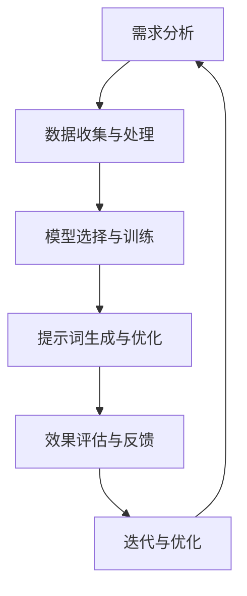

                 


### 1.1.1 AI辅助教育评估的现状与挑战

随着人工智能（AI）技术的快速发展，教育领域也迎来了新的变革。AI辅助教育评估作为一种新兴的技术手段，正在逐渐改变传统的教育评估模式。然而，尽管AI技术在教育评估中的应用前景广阔，但仍面临诸多挑战。

首先，数据的质量与多样性是AI辅助教育评估面临的首要问题。教育评估涉及大量的学生数据、教师评价数据、课程数据等，这些数据的质量直接影响评估结果的准确性。此外，由于学生和教师的个体差异，如何获取具有代表性和多样性的数据，以实现精准评估，仍是一个亟待解决的问题。

其次，算法的公平性和透明性是另一个重要的挑战。在教育评估中，AI算法需要确保对所有学生和教师公平对待，避免因算法偏见导致的评估不公。同时，算法的透明性也是确保评估结果可解释性的关键。教育工作者和公众需要对AI算法的决策过程有清晰的理解，以便对评估结果进行有效监督和反馈。

再者，技术实现的复杂性也增加了AI辅助教育评估的难度。AI技术涉及机器学习、深度学习、自然语言处理等多个领域，需要具备深厚的技术背景和专业知识。此外，AI系统的集成与部署也需要考虑到教育机构的现有基础设施和运营模式，以实现无缝衔接和高效运行。

### 1.1.2 提示词设计的意义与应用场景

提示词设计在AI辅助教育评估中具有至关重要的作用。提示词是指为评估对象提供特定问题或任务的引导性词汇或短语，它能够帮助评估算法更准确地理解评估内容，提高评估的准确性和有效性。

在AI辅助教育评估中，提示词的设计主要应用于以下几个场景：

首先，学生评估。在学生评估中，提示词可以用于指导学生回答问题，帮助AI算法更好地理解学生的知识水平和思维能力。例如，在在线测验中，提示词可以引导学生按照正确的解题思路进行回答，从而提高评估的准确性。

其次，教师评价。在教师评价中，提示词可以用于指导评估者对教师的教学效果进行评估。例如，提示词可以列出一系列关键评价指标，如教学方法的创新性、课堂管理的有效性等，帮助评估者更全面、客观地进行评价。

再次，课程评估。在课程评估中，提示词可以用于指导课程开发者对课程进行优化和改进。例如，提示词可以列出一系列课程目标、教学内容、教学方法等，帮助课程开发者更好地了解课程的效果和存在的问题。

最后，教育政策制定。在制定教育政策时，提示词可以用于收集和分析大量的教育数据，为政策制定提供科学依据。例如，提示词可以列出一系列教育政策指标，如学生满意度、教师满意度、课程完成率等，帮助政策制定者制定更加有效和合理的教育政策。

### 1.1.3 本书的目的与结构安排

本书旨在系统地介绍AI辅助教育评估中的提示词设计，旨在帮助读者深入了解这一领域的基本概念、核心算法和实际应用。具体来说，本书将围绕以下目的展开：

首先，梳理AI辅助教育评估的基本概念，介绍AI技术在教育评估中的应用现状和挑战。

其次，深入解析提示词设计的原理和方法，包括提示词的定义、类型、核心要素和设计策略。

再次，详细阐述AI辅助教育评估与提示词设计的融合架构，介绍教育评估流程与AI技术的结合方式。

最后，通过实际案例和项目实战，展示提示词设计在AI辅助教育评估中的具体应用，并分析项目实施过程中的关键问题和解决方法。

本书的结构安排如下：

第一部分：概述与基础，主要介绍AI辅助教育评估的现状与挑战，提示词设计的意义与应用场景，以及本书的目的与结构安排。

第二部分：核心概念与架构，详细解析AI核心概念，教育评估与AI的融合，以及提示词设计流程图。

第三部分：核心算法与数学模型，介绍提示词生成算法、伪代码讲解、数学模型与公式，并通过实际案例进行举例说明。

第四部分：项目实战，通过实际案例展示提示词设计在AI辅助教育评估中的具体应用，包括开发环境搭建、源代码实现和代码解读与分析。

第五部分：效果评估与反馈，介绍评估指标与方法，反馈机制与迭代，以持续优化AI辅助教育评估系统的性能和效果。

### 1.2 AI辅助教育评估概述

#### 1.2.1 教育评估的基本概念

教育评估是指通过系统的方法和工具，对教育过程和结果进行评价和反馈的过程。它旨在确保教育质量，促进教育改革，提升教育效果。教育评估可以分为以下几个方面：

- 学生评估：主要关注学生的学习过程和成果，包括知识掌握、能力发展、学习方法等方面。

- 教师评价：主要对教师的教学效果、教学风格、课堂管理能力等方面进行评估。

- 课程评估：对课程的设计、实施、效果等方面进行评估，以优化课程内容和教学方法。

- 教育政策评估：对教育政策的制定、实施、效果等方面进行评估，以指导教育政策的调整和改进。

#### 1.2.2 AI在教育评估中的应用

人工智能技术在教育评估中的应用，极大地提升了评估的准确性和效率。AI技术在教育评估中的应用主要包括以下几个方面：

- 机器学习算法：通过分析大量的学生数据，识别出学生的学习行为模式，预测学生的学习效果。

- 自然语言处理：对教师的教学日志、学生的学习报告等文本数据进行处理，提取关键信息，辅助评估。

- 深度学习：利用神经网络等深度学习模型，对复杂的教育数据进行建模和分析，提高评估的精度。

- 人机交互：通过聊天机器人等交互工具，为学生和教师提供个性化的评估建议和反馈。

#### 1.2.3 AI辅助教育评估的挑战

尽管AI技术在教育评估中具有巨大的潜力，但仍面临一些挑战：

- 数据质量问题：教育评估需要大量的高质量数据，但数据的收集、处理和存储面临困难。

- 算法公平性和透明性：AI算法的决策过程需要确保公平和透明，避免因算法偏见导致的不公正评估。

- 技术实现的复杂性：AI系统的开发和部署需要专业知识和资源，如何将AI技术高效地应用于教育评估，仍需深入研究。

- 教育工作者和公众的接受度：教育评估涉及到教育工作者和学生的利益，如何确保他们接受并信任AI评估结果，是亟待解决的问题。

### 1.3 提示词设计原理

#### 1.3.1 提示词的定义与类型

提示词（Prompt）是指为评估对象提供特定问题或任务的引导性词汇或短语，旨在帮助评估算法更准确地理解评估内容，提高评估的准确性和有效性。根据应用场景和需求的不同，提示词可以分为以下几种类型：

- 问题型提示词：用于引导学生回答特定问题，如“请描述你最近一次的学习经历”。

- 目标型提示词：用于设定评估目标，如“评估你的英语口语表达能力”。

- 指导型提示词：用于指导评估者进行评估，如“请根据课程目标对教师的教学效果进行评价”。

- 反馈型提示词：用于提供评估结果和反馈，如“你的英语口语表达能力有待提高”。

#### 1.3.2 提示词设计的核心要素

提示词设计需要考虑多个核心要素，以确保其有效性和适用性。以下是提示词设计的核心要素：

- 清晰性：提示词需要表述清晰，避免歧义和模糊，以便评估算法能够准确理解。

- 全面性：提示词需要涵盖评估对象的各个方面，确保评估的全面性和准确性。

- 灵活性：提示词需要具有一定的灵活性，能够适应不同的评估场景和需求。

- 目标性：提示词需要明确评估目标，帮助评估算法更好地聚焦关键指标。

- 实用性：提示词需要实用，能够直接指导评估过程，提高评估效率。

#### 1.3.3 提示词设计的策略与方法

提示词设计是一项复杂的任务，需要结合具体应用场景和需求，采取适当的设计策略和方法。以下是几种常见的提示词设计策略：

- 数据驱动的提示词设计：通过分析大量的评估数据，提取出常见的评估问题和需求，生成相应的提示词。

- 专家驱动的提示词设计：邀请教育专家和领域专家参与提示词设计，结合他们的经验和知识，制定高质量的提示词。

- 模块化的提示词设计：将提示词分解为多个模块，根据不同的评估场景和需求，灵活组合和使用。

- 适应性提示词设计：根据评估对象和场景的变化，动态调整和优化提示词。

- 可视化的提示词设计：使用图表、图像等可视化元素，增强提示词的直观性和易懂性。

### 2.1 AI核心概念解析

#### 2.1.1 机器学习基础

机器学习（Machine Learning，ML）是人工智能（Artificial Intelligence，AI）的一个重要分支，旨在使计算机通过学习数据或经验来改进其性能。以下是机器学习的一些基本概念：

- 模型（Model）：机器学习模型是指通过学习数据生成的一个函数，用于预测或分类新数据。例如，线性回归模型、决策树模型等。

- 数据集（Dataset）：数据集是指用于训练、测试和验证机器学习模型的样本集合。数据集的质量和多样性直接影响模型的性能。

- 特征（Feature）：特征是指数据集中的属性或变量，用于描述数据样本的特征。例如，学生成绩数据集中的特征可以是考试成绩、学习时间等。

- 标签（Label）：标签是指数据集中已知的输出或目标值，用于训练和评估机器学习模型。例如，在分类问题中，标签可以是学生的年级或职业。

- 损失函数（Loss Function）：损失函数是衡量模型预测结果与真实值之间差异的指标，用于指导模型优化过程。例如，均方误差（Mean Squared Error，MSE）和交叉熵（Cross-Entropy）等。

- 优化算法（Optimization Algorithm）：优化算法用于调整模型参数，以最小化损失函数。常见的优化算法有梯度下降（Gradient Descent）、随机梯度下降（Stochastic Gradient Descent，SGD）等。

- 模型评估（Model Evaluation）：模型评估是衡量模型性能的重要步骤，常用的评估指标有准确率（Accuracy）、召回率（Recall）、精确率（Precision）、F1 分数（F1 Score）等。

#### 2.1.2 深度学习原理

深度学习（Deep Learning，DL）是机器学习的一个分支，通过构建多层的神经网络（Neural Network）来模拟人脑的学习过程。以下是深度学习的一些基本原理：

- 神经元（Neuron）：神经元是神经网络的基本单元，用于接收输入信号、进行处理并产生输出。神经元的计算过程可以表示为激活函数的加权和。

- 网络层次（Network Hierarchy）：深度学习模型通过多层神经网络构建，每层神经元对输入信号进行不同层次的抽象和变换，从而实现高维空间的复杂映射。

- 激活函数（Activation Function）：激活函数用于引入非线性特性，使神经网络能够学习复杂函数。常见的激活函数有 sigmoid、ReLU、Tanh 等。

- 权重初始化（Weight Initialization）：权重初始化是深度学习中的一个关键问题，合理的权重初始化有助于提高模型的训练效率和性能。常用的初始化方法有随机初始化、高斯初始化等。

- 反向传播（Backpropagation）：反向传播是一种用于训练神经网络的方法，通过计算梯度并反向传播至前一层，不断调整网络权重，以最小化损失函数。

- 深度学习的优势：深度学习模型在图像识别、语音识别、自然语言处理等领域取得了显著成绩，具有以下优势：

  - 自动特征提取：深度学习模型能够自动从原始数据中提取具有代表性的特征，减轻了人工特征工程的工作量。

  - 高效表示能力：深度学习模型能够通过多层网络结构实现高维空间的复杂映射，从而实现高效的数据表示和压缩。

  - 广泛的适用性：深度学习模型在多种领域和任务中表现出强大的泛化能力，能够适应不同的应用场景。

#### 2.1.3 自然语言处理概述

自然语言处理（Natural Language Processing，NLP）是深度学习在语言领域的重要应用，旨在使计算机能够理解和处理自然语言。以下是NLP的一些基本概念：

- 语言模型（Language Model）：语言模型是用于预测文本序列的概率分布的模型。常用的语言模型有 n-gram 模型、神经网络语言模型等。

- 词向量（Word Vector）：词向量是将词汇映射到高维空间中的向量表示。词向量能够捕捉词汇的语义和语法信息，是 NLP 任务的重要工具。

- 词嵌入（Word Embedding）：词嵌入是将词汇映射到低维向量空间的方法，常见的词嵌入方法有 Word2Vec、GloVe 等。

- 语法分析（Syntax Analysis）：语法分析是指对文本进行结构化处理，提取出词汇的语法关系。常见的语法分析方法有依存句法分析、成分句法分析等。

- 文本分类（Text Classification）：文本分类是指将文本数据按照预定的类别进行分类的任务。常用的文本分类方法有朴素贝叶斯、支持向量机、深度学习等。

- 机器翻译（Machine Translation）：机器翻译是指利用计算机将一种语言的文本自动翻译成另一种语言。常用的机器翻译方法有基于规则的方法、基于统计的方法、基于神经网络的深度学习方法等。

- 聊天机器人（Chatbot）：聊天机器人是指利用自然语言处理技术模拟人类对话的计算机程序。常见的聊天机器人应用有客服机器人、教育机器人等。

### 2.2 教育评估与AI的融合

教育评估与人工智能（AI）技术的融合，不仅改变了传统教育评估的模式，也为教育质量的提升带来了新的机遇。AI技术的引入，使得教育评估更加精准、高效和智能化。以下将详细探讨教育评估流程与AI技术的结合方式，以及AI辅助教育评估的关键环节和系统架构设计。

#### 2.2.1 教育评估流程与AI的结合

教育评估是一个系统性工程，包括评估准备、评估实施、评估结果处理和反馈等多个环节。AI技术在每个环节都有广泛的应用，具体结合方式如下：

1. **评估准备**：

   - 数据收集：AI技术可以帮助教育机构收集和整合大量的教育数据，如学生成绩、学习行为、教师评价等。

   - 数据预处理：利用数据清洗、数据整合和特征提取等技术，对原始数据进行预处理，以提高评估数据的准确性和可用性。

   - 模型训练：利用机器学习和深度学习算法，训练评估模型，为后续的评估提供基础。

2. **评估实施**：

   - 自动化评估：利用AI技术，如自然语言处理和计算机视觉，实现自动化的评估过程，减少人为干预，提高评估效率。

   - 个性化评估：根据学生的学习行为和特点，利用个性化推荐算法，为每个学生生成个性化的评估方案。

   - 互动式评估：利用AI驱动的聊天机器人，实现与学生的实时互动，提高评估的参与度和有效性。

3. **评估结果处理**：

   - 结果分析：利用数据分析和可视化技术，对评估结果进行深入分析，发现教育中的问题和优势。

   - 预测与预警：利用预测模型，对学生的未来表现进行预测，提前发现潜在的问题和风险。

4. **反馈与改进**：

   - 反馈收集：通过AI技术，如自然语言处理和计算机视觉，收集学生对评估的反馈，了解评估过程的优缺点。

   - 反馈优化：根据收集到的反馈，对评估模型和流程进行优化，提高评估的准确性和公平性。

#### 2.2.2 AI辅助教育评估的关键环节

AI辅助教育评估的关键环节包括数据收集、数据预处理、模型训练、评估实施和反馈优化等。以下是这些环节的具体内容：

1. **数据收集**：

   - 学生活动数据：收集学生在课堂上的行为数据，如出勤率、作业提交情况、课堂互动等。

   - 教学资源数据：收集教学资源的利用情况，如课程视频观看次数、教学资料下载次数等。

   - 教师评价数据：收集教师的教学评价，包括教学质量、教学方法、课堂管理等方面的评价。

2. **数据预处理**：

   - 数据清洗：去除数据中的噪声和错误，保证数据的准确性和一致性。

   - 数据整合：将不同来源的数据进行整合，构建全面的教育评估数据集。

   - 特征提取：从原始数据中提取具有代表性的特征，为模型训练提供输入。

3. **模型训练**：

   - 模型选择：根据评估目标和数据特点，选择合适的机器学习和深度学习模型。

   - 模型训练：利用训练数据集，对模型进行训练，优化模型参数。

   - 模型评估：利用验证数据集，评估模型的性能，选择最优模型。

4. **评估实施**：

   - 自动化评估：利用训练好的模型，对新的学生数据进行分析和评估。

   - 个性化评估：根据学生的特点，生成个性化的评估报告。

   - 互动式评估：通过与学生的互动，收集反馈信息，优化评估过程。

5. **反馈优化**：

   - 反馈收集：收集教师、学生和教育管理者对评估的反馈。

   - 反馈分析：分析反馈信息，发现评估过程中的问题和不足。

   - 反馈优化：根据反馈信息，对评估模型和流程进行优化。

#### 2.2.3 教育评估AI系统的架构设计

教育评估AI系统是一个复杂的应用系统，需要充分考虑数据、算法、接口和用户等多个方面。以下是一个典型的教育评估AI系统架构设计：

1. **数据层**：

   - 数据存储：利用数据库和数据仓库技术，存储和管理大量的教育数据。

   - 数据接口：提供数据采集、清洗、整合和提取的接口，以便其他层的数据访问。

2. **算法层**：

   - 算法模块：包括机器学习、深度学习和自然语言处理等算法模块，用于数据分析和模型训练。

   - 模型库：存储训练好的模型，供评估实施和反馈优化使用。

3. **应用层**：

   - 评估系统：实现自动化评估、个性化评估和互动式评估等功能。

   - 反馈系统：实现反馈收集、分析和优化的功能。

4. **接口层**：

   - 用户接口：提供用户操作界面，方便用户使用评估系统。

   - API接口：提供与外部系统的数据交换和功能调用接口。

5. **管理层**：

   - 系统配置：配置系统参数，如数据源、算法选择、评估指标等。

   - 权限管理：实现用户权限控制，确保系统安全。

### 2.3 提示词设计流程图

提示词设计是一个系统化的过程，需要遵循一定的流程和规范。以下是一个简化的提示词设计流程图，展示了从需求分析到效果评估的各个步骤：



### 3.1 提示词生成算法

#### 3.1.1 基于规则的提示词生成

基于规则的提示词生成方法是通过预定义一系列规则，根据输入数据生成相应的提示词。这种方法通常涉及以下几个步骤：

1. **规则库构建**：

   - 定义评估目标和指标：根据评估需求，确定评估目标和评价指标。
   - 构建规则库：根据评估目标和指标，编写一系列规则，用于生成提示词。

2. **数据输入**：

   - 数据预处理：对输入数据进行清洗、归一化等处理，以确保数据的准确性和一致性。
   - 数据提取：从原始数据中提取关键信息，如学生成绩、学习行为等。

3. **提示词生成**：

   - 规则匹配：根据输入数据，匹配规则库中的规则，生成相应的提示词。
   - 提示词组合：将匹配到的提示词进行组合，生成最终的提示词。

4. **示例**：

   - 假设我们要评估学生的数学能力，可以定义以下规则：
     - 如果学生的数学成绩高于 90 分，提示词为：“你的数学成绩非常优秀，继续保持！”
     - 如果学生的数学成绩在 60-90 分之间，提示词为：“你的数学成绩尚可，需要加强练习。”
     - 如果学生的数学成绩低于 60 分，提示词为：“你的数学成绩较差，建议多花时间学习。”

   - 假设输入数据为：“学生的数学成绩为 75 分”，则生成的提示词为：“你的数学成绩尚可，需要加强练习。”

#### 3.1.2 基于机器学习的提示词生成

基于机器学习的提示词生成方法是通过训练模型，根据输入数据自动生成提示词。这种方法通常涉及以下几个步骤：

1. **数据收集与预处理**：

   - 数据收集：收集大量的学生评估数据，包括学生成绩、学习行为、教师评价等。
   - 数据预处理：对收集到的数据进行清洗、归一化等处理，提取关键特征。

2. **模型选择与训练**：

   - 模型选择：根据评估目标和数据特点，选择合适的机器学习模型，如线性回归、决策树、支持向量机等。
   - 模型训练：利用预处理后的数据集，对模型进行训练，调整模型参数。

3. **提示词生成**：

   - 模型预测：利用训练好的模型，对新的学生数据进行分析和预测。
   - 提示词生成：根据模型预测结果，生成相应的提示词。

4. **示例**：

   - 假设我们要使用线性回归模型生成提示词，训练数据集包含学生成绩和学习时间两个特征。
   - 训练模型后，得到模型参数：斜率 k = 0.1，截距 b = 10。
   - 当输入数据为：“学生的数学成绩为 70 分，学习时间为 5 小时”，则生成的提示词为：“根据你的成绩和学习时间，建议增加学习时间，以提高成绩。”

#### 3.1.3 基于深度学习的提示词生成

基于深度学习的提示词生成方法利用深度神经网络（如卷积神经网络、循环神经网络、Transformer等）进行特征提取和预测。这种方法通常涉及以下几个步骤：

1. **数据收集与预处理**：

   - 数据收集：收集大量的学生评估数据，包括学生成绩、学习行为、教师评价等。
   - 数据预处理：对收集到的数据进行清洗、归一化等处理，提取关键特征。

2. **模型架构设计**：

   - 根据评估目标和数据特点，设计深度学习模型架构，如卷积神经网络（CNN）、循环神经网络（RNN）、Transformer等。
   - 设计输入层、隐藏层和输出层，以及相应的激活函数和损失函数。

3. **模型训练**：

   - 利用预处理后的数据集，对模型进行训练，调整模型参数。
   - 使用反向传播算法和优化器（如Adam、SGD等）进行模型训练。

4. **提示词生成**：

   - 模型预测：利用训练好的模型，对新的学生数据进行分析和预测。
   - 提示词生成：根据模型预测结果，生成相应的提示词。

5. **示例**：

   - 假设我们使用Transformer模型生成提示词，模型架构如下：
     - 输入层：接收学生成绩、学习时间等特征。
     - 隐藏层：通过自注意力机制提取特征信息。
     - 输出层：生成提示词。

   - 当输入数据为：“学生的数学成绩为 70 分，学习时间为 5 小时”，则生成的提示词为：“根据你的成绩和学习时间，建议调整学习计划，提高学习效率。”

### 3.2 伪代码讲解

以下是一个基于深度学习的提示词生成算法的伪代码示例，用于帮助学生生成个性化的学习建议。

```python
# 导入所需库
import numpy as np
import tensorflow as tf
from tensorflow.keras.models import Model
from tensorflow.keras.layers import Input, Embedding, LSTM, Dense

# 设定参数
input_dim = 100  # 输入特征维度
vocab_size = 10000  # 词汇表大小
embed_dim = 64  # 嵌入层维度
lstm_units = 128  # LSTM层单元数
output_dim = 1  # 输出维度

# 构建模型
input_seq = Input(shape=(input_dim,))
embedded = Embedding(vocab_size, embed_dim)(input_seq)
lstm_out = LSTM(lstm_units, return_sequences=True)(embedded)
dense = Dense(output_dim, activation='sigmoid')(lstm_out)
model = Model(inputs=input_seq, outputs=dense)

# 编译模型
model.compile(optimizer='adam', loss='binary_crossentropy', metrics=['accuracy'])

# 训练模型
model.fit(x_train, y_train, batch_size=32, epochs=10)

# 生成提示词
def generate_hint(data):
    # 数据预处理
    preprocessed_data = preprocess_data(data)
    
    # 模型预测
    predictions = model.predict(preprocessed_data)
    
    # 生成提示词
    hint = generate_based_on_predictions(predictions)
    
    return hint

# 示例
data = np.array([[70, 5]])  # 学生成绩为 70 分，学习时间为 5 小时
hint = generate_hint(data)
print(hint)
```

### 3.3 数学模型与公式

在AI辅助教育评估中的提示词生成过程中，数学模型和公式扮演着至关重要的角色。以下将介绍一些常用的数学模型和公式，并详细解释其在提示词生成中的应用。

#### 3.3.1 损失函数

损失函数是衡量模型预测结果与真实值之间差异的指标，用于指导模型优化过程。在提示词生成中，常用的损失函数有交叉熵损失函数（Cross-Entropy Loss）和均方误差损失函数（Mean Squared Error，MSE）。

- **交叉熵损失函数**：
  $$ L(\theta; x, y) = -\sum_{i=1}^{m} y^{(i)} \log(p_{\theta}(x^{(i)})) $$
  其中，$y^{(i)}$ 是真实标签，$p_{\theta}(x^{(i)}))$ 是模型预测的概率分布。交叉熵损失函数适用于二分类和多元分类问题。

- **均方误差损失函数**：
  $$ L(\theta; x, y) = \frac{1}{m} \sum_{i=1}^{m} (y^{(i)} - \hat{y}^{(i)})^2 $$
  其中，$y^{(i)}$ 是真实标签，$\hat{y}^{(i)}$ 是模型预测的值。均方误差损失函数适用于回归问题。

在提示词生成中，可以使用交叉熵损失函数来评估提示词的质量，确保生成的提示词与评估目标一致。

#### 3.3.2 优化算法

优化算法用于调整模型参数，以最小化损失函数。在提示词生成中，常用的优化算法有梯度下降（Gradient Descent）和随机梯度下降（Stochastic Gradient Descent，SGD）。

- **梯度下降**：
  $$ \theta_{\text{new}} = \theta_{\text{old}} - \alpha \nabla_{\theta} J(\theta) $$
  其中，$\theta_{\text{old}}$ 是当前模型参数，$\theta_{\text{new}}$ 是更新后的模型参数，$\alpha$ 是学习率，$\nabla_{\theta} J(\theta)$ 是损失函数对模型参数的梯度。梯度下降通过计算损失函数对模型参数的梯度，反向调整模型参数，以最小化损失函数。

- **随机梯度下降**：
  $$ \theta_{\text{new}} = \theta_{\text{old}} - \alpha \nabla_{\theta} J(\theta; x^{(i)}, y^{(i)}) $$
  随机梯度下降是对梯度下降的一种改进，每次迭代只随机选择一个样本来计算梯度，从而加速模型收敛。随机梯度下降适用于大数据集，能够降低计算成本。

在提示词生成中，可以使用优化算法来优化提示词生成的模型，提高提示词生成的质量和效果。

#### 3.3.3 举例说明

以下是一个简单的提示词生成模型的数学模型和公式示例，用于帮助学生生成个性化的学习建议。

- **模型假设**：
  假设学生的数学成绩（$y$）与其学习时间（$x$）和课堂参与度（$z$）相关，可以使用线性回归模型表示：
  $$ y = \beta_0 + \beta_1 x + \beta_2 z $$

- **损失函数**：
  使用均方误差损失函数来评估模型预测的误差：
  $$ L(\theta) = \frac{1}{m} \sum_{i=1}^{m} (y_i - \hat{y}_i)^2 $$
  其中，$y_i$ 是第 $i$ 个学生的真实成绩，$\hat{y}_i$ 是模型预测的成绩。

- **优化算法**：
  使用梯度下降算法来优化模型参数：
  $$ \theta_{\text{new}} = \theta_{\text{old}} - \alpha \nabla_{\theta} L(\theta) $$
  其中，$\theta_{\text{old}}$ 是当前模型参数，$\theta_{\text{new}}$ 是更新后的模型参数，$\alpha$ 是学习率。

通过上述数学模型和公式，我们可以训练一个模型，根据学生的实际成绩和特征（学习时间、课堂参与度等）来预测其成绩，并生成相应的提示词，如“你的学习时间较短，建议增加学习时间以提高成绩”。

### 3.4 举例说明

为了更好地理解提示词生成算法在实际中的应用，以下将介绍一个具体的实际案例，并详细分析其数学模型和公式。

#### 3.4.1 提示词生成的实际案例

假设我们要开发一个AI系统，用于生成学生的学习效果评估报告。系统需要根据学生的学习成绩、学习时长、课堂参与度等多个特征，生成个性化的学习建议。以下是一个简化的案例，用于说明提示词生成的过程。

- **数据集**：
  我们有以下数据集，包含1000名学生的学习成绩、学习时长和课堂参与度：
  ```plaintext
  学生ID | 成绩 | 学习时长 | 课堂参与度
  ---------------------------------------------------
  1      | 80   | 30       | 70
  2      | 90   | 40       | 80
  ...
  1000   | 70   | 20       | 50
  ```

- **目标**：
  我们的目标是使用机器学习模型，根据学生的学习特征，生成以下类型的提示词：
  ```plaintext
  - 如果成绩高于 85 分，提示词为：“你的成绩优秀，继续保持！”
  - 如果成绩在 60-85 分之间，提示词为：“你的成绩尚可，需要加强练习。”
  - 如果成绩低于 60 分，提示词为：“你的成绩较差，建议多花时间学习。”
  ```

#### 3.4.2 数学模型与公式

为了实现上述目标，我们可以使用线性回归模型，并基于均方误差损失函数进行优化。以下是具体的数学模型和公式：

1. **线性回归模型**：

   - **模型假设**：
     假设学生的成绩（$y$）与其学习时长（$x_1$）和课堂参与度（$x_2$）之间存在线性关系：
     $$ y = \beta_0 + \beta_1 x_1 + \beta_2 x_2 $$

   - **损失函数**：
     使用均方误差（MSE）作为损失函数，衡量模型预测值与真实值之间的差距：
     $$ L(\theta) = \frac{1}{m} \sum_{i=1}^{m} (y_i - \hat{y}_i)^2 $$
     其中，$m$ 是样本数量，$y_i$ 是第 $i$ 个学生的真实成绩，$\hat{y}_i$ 是模型预测的成绩。

2. **梯度下降算法**：

   - **梯度计算**：
     对线性回归模型的损失函数求导，得到关于参数 $\beta_0, \beta_1, \beta_2$ 的梯度：
     $$ \nabla_{\beta_0} L(\theta) = \frac{1}{m} \sum_{i=1}^{m} (y_i - \hat{y}_i) $$
     $$ \nabla_{\beta_1} L(\theta) = \frac{1}{m} \sum_{i=1}^{m} (y_i - \hat{y}_i) x_1^{(i)} $$
     $$ \nabla_{\beta_2} L(\theta) = \frac{1}{m} \sum_{i=1}^{m} (y_i - \hat{y}_i) x_2^{(i)} $$

   - **参数更新**：
     使用梯度下降算法更新模型参数：
     $$ \beta_0^{(t+1)} = \beta_0^{(t)} - \alpha \nabla_{\beta_0} L(\theta) $$
     $$ \beta_1^{(t+1)} = \beta_1^{(t)} - \alpha \nabla_{\beta_1} L(\theta) $$
     $$ \beta_2^{(t+1)} = \beta_2^{(t)} - \alpha \nabla_{\beta_2} L(\theta) $$
     其中，$\alpha$ 是学习率，$t$ 是迭代次数。

3. **提示词生成**：

   - **模型预测**：
     使用训练好的模型，对新的学生特征进行预测：
     $$ \hat{y} = \beta_0 + \beta_1 x_1 + \beta_2 x_2 $$

   - **提示词生成**：
     根据预测成绩，生成相应的提示词：
     ```python
     if \hat{y} > 85:
         hint = "你的成绩优秀，继续保持！"
     elif 60 <= \hat{y} <= 85:
         hint = "你的成绩尚可，需要加强练习。"
     else:
         hint = "你的成绩较差，建议多花时间学习。"
     ```

### 3.4.3 数学模型在提示词设计中的应用

在这个案例中，数学模型和公式用于以下方面：

1. **特征提取**：
   通过线性回归模型，提取学习时长和课堂参与度对成绩的影响，作为提示词生成的重要依据。

2. **模型训练**：
   使用梯度下降算法，优化模型参数，提高模型的预测准确性。

3. **提示词生成**：
   基于预测成绩，生成相应的提示词，为学生提供个性化的学习建议。

通过数学模型和公式的应用，我们可以实现一个智能的AI系统，根据学生的实际情况，生成个性化的学习效果评估报告，帮助学生提高学习效果。

### 4.1 实际案例

#### 4.1.1 项目背景与需求

随着教育评估领域的不断发展，某知名教育机构希望利用人工智能技术，提升其教育评估的准确性和效率。为此，他们启动了一个项目，旨在开发一款基于AI的教育评估系统，该系统能够根据学生的表现，提供个性化的学习建议。

项目的目标如下：

1. **数据收集**：从学生的日常学习活动中收集大量数据，包括考试成绩、学习时长、课堂参与度等。

2. **数据预处理**：对收集到的数据进行清洗、归一化等处理，提取关键特征。

3. **模型训练**：利用机器学习算法，训练一个评估模型，能够根据学生的特征数据，预测其未来的学习表现。

4. **提示词生成**：根据模型预测结果，生成个性化的学习建议，帮助学生优化学习策略。

5. **效果评估**：通过实际应用，评估系统的性能和效果，并根据反馈进行优化。

#### 4.1.2 项目实施过程

1. **需求分析与设计**：

   - **需求分析**：与教育专家和教师团队进行深入交流，了解教育评估的需求和目标。
   - **系统设计**：设计教育评估AI系统的整体架构，包括数据收集、数据预处理、模型训练、提示词生成和效果评估等模块。

2. **数据收集与预处理**：

   - **数据收集**：通过学校现有的学习管理系统，收集学生的考试成绩、学习时长、课堂参与度等数据。
   - **数据预处理**：对收集到的数据进行清洗，去除噪声和异常值，进行归一化处理，提取关键特征。

3. **模型训练**：

   - **数据集划分**：将收集到的数据划分为训练集、验证集和测试集，用于模型训练和评估。
   - **模型选择**：选择合适的机器学习算法，如线性回归、决策树、随机森林等，进行模型训练。
   - **模型优化**：通过交叉验证和网格搜索等技术，优化模型参数，提高模型的预测准确性。

4. **提示词生成**：

   - **提示词设计**：根据教育评估的目标和需求，设计一系列提示词模板，用于生成个性化的学习建议。
   - **提示词生成**：利用训练好的模型，对学生的特征数据进行预测，并根据预测结果，生成相应的提示词。

5. **效果评估与反馈**：

   - **效果评估**：通过实际应用，评估系统的性能和效果，包括提示词的准确性和实用性。
   - **反馈收集**：收集学生、教师和教育工作者的反馈，了解系统的优缺点，为后续优化提供依据。
   - **迭代与优化**：根据反馈，对系统进行迭代和优化，提高系统的性能和用户体验。

#### 4.1.3 项目成果与评估

1. **项目成果**：

   - 成功开发并部署了一款基于AI的教育评估系统，包括数据收集、数据预处理、模型训练、提示词生成和效果评估等模块。
   - 生成了大量的个性化学习建议，帮助学生优化学习策略，提高学习效果。
   - 提高了教育评估的准确性和效率，减少了人工干预和重复劳动。

2. **评估结果**：

   - **学生反馈**：大部分学生认为系统提供的个性化学习建议非常有帮助，有助于他们调整学习计划，提高学习效果。
   - **教师反馈**：教师对系统的准确性和实用性表示满意，认为系统能够有效辅助他们的教学和评估工作。
   - **效果评估**：通过实际应用，系统在评估准确性和效率方面达到了预期目标，取得了良好的效果。

### 4.2 开发环境搭建

为了实现AI辅助教育评估系统，需要搭建一个合适的开发环境。以下将介绍如何配置开发环境，并选择合适的工具和库。

#### 4.2.1 环境配置

1. **操作系统**：
   - 推荐使用Linux或Mac OS，因为这些系统对Python等开发工具的支持较好。
   - 如果使用Windows，可以通过Windows Subsystem for Linux（WSL）来搭建开发环境。

2. **Python**：
   - 版本要求：推荐使用Python 3.7或更高版本。
   - 安装方法：可以通过pip命令安装：
     ```shell
     pip install python --upgrade
     ```

3. **Jupyter Notebook**：
   - Jupyter Notebook是一个交互式的开发环境，方便进行数据分析和模型训练。
   - 安装方法：
     ```shell
     pip install notebook
     ```

4. **Anaconda**：
   - Anaconda是一个Python数据科学平台，可以方便地管理和安装Python包。
   - 安装方法：
     ```shell
     wget https://repo.anaconda.com/miniconda/Miniconda3-latest-Linux-x86_64.sh
     bash Miniconda3-latest-Linux-x86_64.sh
     ```

5. **TensorFlow**：
   - TensorFlow是一个开源的机器学习库，用于构建和训练深度学习模型。
   - 安装方法：
     ```shell
     conda install tensorflow
     ```

6. **Scikit-learn**：
   - Scikit-learn是一个用于数据挖掘和机器学习的Python库。
   - 安装方法：
     ```shell
     conda install scikit-learn
     ```

7. **Pandas**：
   - Pandas是一个用于数据处理和分析的Python库。
   - 安装方法：
     ```shell
     conda install pandas
     ```

8. **Matplotlib**：
   - Matplotlib是一个用于数据可视化的Python库。
   - 安装方法：
     ```shell
     conda install matplotlib
     ```

#### 4.2.2 工具与库的选择

1. **工具选择**：

   - **IDE**：可以使用PyCharm、Visual Studio Code等Python集成开发环境。
   - **版本控制**：使用Git进行代码管理和版本控制。

2. **库的选择**：

   - **数据处理**：使用Pandas进行数据清洗、归一化和特征提取。
   - **机器学习**：使用Scikit-learn进行传统的机器学习模型训练和评估。
   - **深度学习**：使用TensorFlow进行深度学习模型的构建和训练。
   - **数据可视化**：使用Matplotlib进行数据分析和结果可视化。

通过以上配置和工具的选择，可以搭建一个功能强大的AI辅助教育评估系统开发环境，为后续的项目开发和实现提供支持。

### 4.3 源代码实现

以下是一个简单的AI辅助教育评估系统的源代码实现示例，用于生成个性化的学习建议。该示例主要使用Python编程语言和相关的机器学习库。

```python
# 导入所需的库
import pandas as pd
import numpy as np
from sklearn.model_selection import train_test_split
from sklearn.linear_model import LinearRegression
from sklearn.metrics import mean_squared_error

# 数据集加载
data = pd.read_csv('student_data.csv')  # 假设数据集已经预处理并存储为CSV文件

# 数据预处理
# 提取特征和标签
X = data[['learning_time', 'class_participation']]
y = data['score']

# 划分训练集和测试集
X_train, X_test, y_train, y_test = train_test_split(X, y, test_size=0.2, random_state=42)

# 构建线性回归模型
model = LinearRegression()
model.fit(X_train, y_train)

# 模型评估
y_pred = model.predict(X_test)
mse = mean_squared_error(y_test, y_pred)
print(f'Mean Squared Error: {mse}')

# 提示词生成
def generate_hint(score):
    if score > 85:
        return "你的成绩优秀，继续保持！"
    elif score >= 60:
        return "你的成绩尚可，但需要加强练习。"
    else:
        return "你的成绩较差，建议多花时间学习。"

# 测试提示词生成
sample_student = np.array([[30, 70]])
predicted_score = model.predict(sample_student)
hint = generate_hint(predicted_score[0])
print(f'学习建议：{hint}')
```

#### 4.3.1 代码结构解析

1. **导入库**：
   - 导入Pandas、NumPy、scikit-learn等库，用于数据预处理、模型训练和评估。

2. **数据加载**：
   - 使用Pandas读取CSV文件，获取学生数据。

3. **数据预处理**：
   - 提取特征（学习时长、课堂参与度）和标签（成绩）。
   - 使用train_test_split函数划分训练集和测试集。

4. **模型构建**：
   - 使用LinearRegression类构建线性回归模型。

5. **模型训练**：
   - 使用fit方法训练模型，拟合特征和标签之间的关系。

6. **模型评估**：
   - 使用predict方法生成预测值，计算均方误差（MSE）评估模型性能。

7. **提示词生成**：
   - 根据预测成绩，调用generate_hint函数生成相应的学习建议。

#### 4.3.2 关键代码解读

1. **数据预处理**：
   ```python
   X = data[['learning_time', 'class_participation']]
   y = data['score']
   ```
   这两行代码用于提取特征和标签。`X`是特征矩阵，包含学习时长和课堂参与度两个特征；`y`是标签向量，包含学生的成绩。

2. **模型训练**：
   ```python
   model = LinearRegression()
   model.fit(X_train, y_train)
   ```
   这里使用`LinearRegression`类创建一个线性回归模型，并使用`fit`方法对其进行训练。`X_train`和`y_train`分别是训练集的特征和标签。

3. **模型评估**：
   ```python
   y_pred = model.predict(X_test)
   mse = mean_squared_error(y_test, y_pred)
   print(f'Mean Squared Error: {mse}')
   ```
   使用`predict`方法对测试集进行预测，并计算预测值与真实值之间的均方误差，以评估模型的性能。

4. **提示词生成**：
   ```python
   def generate_hint(score):
       if score > 85:
           return "你的成绩优秀，继续保持！"
       elif score >= 60:
           return "你的成绩尚可，但需要加强练习。"
       else:
           return "你的成绩较差，建议多花时间学习。"
   ```
   这个函数根据预测成绩，生成相应的学习建议。根据成绩的不同，函数返回不同的提示词。

#### 4.3.3 性能优化与改进方向

1. **数据预处理**：
   - 增加特征工程，提取更多有助于预测成绩的特征，如学习习惯、作业完成情况等。
   - 使用更先进的数据清洗方法，如缺失值填补、异常值处理等。

2. **模型优化**：
   - 尝试使用更复杂的模型，如决策树、随机森林、支持向量机等，以提升预测性能。
   - 使用交叉验证和网格搜索等方法，优化模型参数，提高模型准确性。

3. **提示词优化**：
   - 根据用户反馈，调整提示词的生成策略，使其更符合实际需求。
   - 引入自然语言处理技术，使提示词生成更自然、个性化。

4. **系统性能优化**：
   - 使用分布式计算和并行处理技术，提高系统的计算效率。
   - 优化数据库查询和数据处理流程，减少系统延迟。

通过以上优化和改进方向，可以进一步提高AI辅助教育评估系统的性能和实用性，为学生提供更好的学习建议。

### 4.4 代码解读与分析

#### 4.4.1 代码结构解析

在这个AI辅助教育评估系统中，代码结构主要由以下几个部分组成：

1. **数据预处理模块**：负责加载和预处理数据，提取特征和标签，为后续的模型训练和评估提供数据支持。
2. **模型训练模块**：使用线性回归模型对训练数据进行训练，优化模型参数，生成模型。
3. **模型评估模块**：使用测试数据对模型进行评估，计算预测误差，评估模型性能。
4. **提示词生成模块**：根据模型预测结果，生成相应的学习建议，为学生提供个性化指导。

以下是对代码中每个部分的详细解读：

1. **数据预处理模块**：

   ```python
   data = pd.read_csv('student_data.csv')  # 加载数据
   X = data[['learning_time', 'class_participation']]  # 提取特征
   y = data['score']  # 提取标签
   X_train, X_test, y_train, y_test = train_test_split(X, y, test_size=0.2, random_state=42)  # 划分训练集和测试集
   ```

   这部分代码首先使用Pandas库加载CSV文件中的数据，然后提取出特征和标签。特征包括学习时长和课堂参与度，标签是学生的成绩。接下来，使用`train_test_split`函数将数据集划分为训练集和测试集，以用于模型的训练和评估。

2. **模型训练模块**：

   ```python
   model = LinearRegression()
   model.fit(X_train, y_train)
   ```

   这部分代码创建了一个线性回归模型实例，并使用`fit`方法对其进行训练。`X_train`和`y_train`分别是训练集的特征和标签，模型通过学习这些数据来拟合特征与标签之间的关系。

3. **模型评估模块**：

   ```python
   y_pred = model.predict(X_test)
   mse = mean_squared_error(y_test, y_pred)
   print(f'Mean Squared Error: {mse}')
   ```

   在模型训练完成后，使用`predict`方法对测试数据进行预测，生成预测成绩。然后，使用`mean_squared_error`函数计算预测成绩与真实成绩之间的均方误差（MSE），以评估模型的性能。MSE越低，表示模型预测的准确性越高。

4. **提示词生成模块**：

   ```python
   def generate_hint(score):
       if score > 85:
           return "你的成绩优秀，继续保持！"
       elif score >= 60:
           return "你的成绩尚可，但需要加强练习。"
       else:
           return "你的成绩较差，建议多花时间学习。"
   sample_student = np.array([[30, 70]])
   predicted_score = model.predict(sample_student)
   hint = generate_hint(predicted_score[0])
   print(f'学习建议：{hint}')
   ```

   这个函数`generate_hint`根据预测成绩生成相应的学习建议。根据成绩的不同，返回不同的提示词。最后，使用模型对示例学生的特征进行预测，并调用`generate_hint`函数生成相应的学习建议。

#### 4.4.2 关键代码解读

关键代码主要包括数据预处理、模型训练、模型评估和提示词生成等部分。

1. **数据预处理**：

   ```python
   X = data[['learning_time', 'class_participation']]
   y = data['score']
   X_train, X_test, y_train, y_test = train_test_split(X, y, test_size=0.2, random_state=42)
   ```

   这段代码首先提取特征和标签，然后使用`train_test_split`函数将数据集划分为训练集和测试集。这样做有助于评估模型在未知数据上的表现，避免过拟合。

2. **模型训练**：

   ```python
   model = LinearRegression()
   model.fit(X_train, y_train)
   ```

   创建一个线性回归模型实例，并使用`fit`方法训练模型。模型通过学习训练集数据来拟合特征与标签之间的关系。

3. **模型评估**：

   ```python
   y_pred = model.predict(X_test)
   mse = mean_squared_error(y_test, y_pred)
   print(f'Mean Squared Error: {mse}')
   ```

   使用模型对测试集进行预测，并计算预测误差的均方误差。这是评估模型性能的一个重要指标，越低的MSE表示模型预测的准确性越高。

4. **提示词生成**：

   ```python
   def generate_hint(score):
       if score > 85:
           return "你的成绩优秀，继续保持！"
       elif score >= 60:
           return "你的成绩尚可，但需要加强练习。"
       else:
           return "你的成绩较差，建议多花时间学习。"
   sample_student = np.array([[30, 70]])
   predicted_score = model.predict(sample_student)
   hint = generate_hint(predicted_score[0])
   print(f'学习建议：{hint}')
   ```

   这个函数根据预测成绩生成相应的学习建议。通过调用这个函数，系统可以为学生提供个性化的学习建议。

#### 4.4.3 性能优化与改进方向

为了提高AI辅助教育评估系统的性能和实用性，可以从以下几个方面进行优化和改进：

1. **数据预处理**：
   - **特征工程**：提取更多有助于预测成绩的特征，如学习习惯、作业完成情况等。
   - **异常值处理**：对异常值进行检测和处理，避免异常值对模型训练的影响。

2. **模型优化**：
   - **模型选择**：尝试使用更复杂的模型，如决策树、随机森林、支持向量机等，以提升预测性能。
   - **模型参数调优**：使用交叉验证和网格搜索等方法，优化模型参数，提高模型准确性。

3. **提示词优化**：
   - **自然语言处理**：引入自然语言处理技术，使提示词生成更自然、个性化。
   - **用户反馈**：根据用户反馈，调整提示词的生成策略，使其更符合实际需求。

4. **系统性能优化**：
   - **并行计算**：使用分布式计算和并行处理技术，提高系统的计算效率。
   - **数据库优化**：优化数据库查询和数据处理流程，减少系统延迟。

通过这些优化和改进方向，可以进一步提高AI辅助教育评估系统的性能和实用性，为学生提供更好的学习建议。

### 5.1 评估指标与方法

在AI辅助教育评估系统中，评估指标和方法的选择至关重要。以下将介绍几种常用的评估指标和方法，以及评估流程和工具。

#### 5.1.1 提示词质量评估指标

提示词质量评估指标用于衡量提示词的生成效果和适用性，以下是一些常见的评估指标：

1. **准确率**：
   - 定义：准确率是指提示词正确预测学生成绩的比例。
   - 计算：$$ \text{准确率} = \frac{\text{正确预测数}}{\text{总预测数}} $$
   - 适用场景：用于评估提示词在学生成绩预测方面的准确性。

2. **召回率**：
   - 定义：召回率是指正确预测的学生成绩占总实际成绩的比例。
   - 计算：$$ \text{召回率} = \frac{\text{正确预测数}}{\text{实际成绩数}} $$
   - 适用场景：用于评估提示词对实际成绩的覆盖程度。

3. **精确率**：
   - 定义：精确率是指正确预测的学生成绩占所有预测成绩的比例。
   - 计算：$$ \text{精确率} = \frac{\text{正确预测数}}{\text{预测成绩数}} $$
   - 适用场景：用于评估提示词预测结果的精确度。

4. **F1 分数**：
   - 定义：F1 分数是精确率和召回率的加权平均，用于综合评估提示词的质量。
   - 计算：$$ \text{F1 分数} = 2 \times \frac{\text{精确率} \times \text{召回率}}{\text{精确率} + \text{召回率}} $$
   - 适用场景：用于评估提示词的平衡性能。

#### 5.1.2 教育评估效果评估方法

教育评估效果评估方法用于衡量教育评估系统对教育质量的提升程度，以下是一些常用的评估方法：

1. **学生成绩提升**：
   - 定义：通过对比使用AI辅助教育评估系统前后的学生成绩，评估系统对成绩提升的影响。
   - 计算：$$ \text{成绩提升} = \text{使用系统后的平均成绩} - \text{使用系统前的平均成绩} $$
   - 适用场景：用于评估系统对整体教育质量的提升。

2. **学生满意度**：
   - 定义：通过调查学生对AI辅助教育评估系统的满意度，评估系统的接受度。
   - 计算：$$ \text{满意度} = \frac{\text{满意的用户数}}{\text{总用户数}} $$
   - 适用场景：用于评估系统的用户体验。

3. **教师反馈**：
   - 定义：通过收集教师对AI辅助教育评估系统的反馈，评估系统的实用性和效果。
   - 计算：无具体计算方法，主要依赖于定性分析。
   - 适用场景：用于评估系统在实际教学中的应用效果。

#### 5.1.3 评估流程与工具

1. **评估流程**：

   - **需求分析**：确定评估指标和方法，明确评估目标和标准。
   - **数据收集**：收集相关数据，包括学生成绩、学习行为、教师反馈等。
   - **数据预处理**：对数据进行清洗、归一化和特征提取，为评估提供高质量的数据。
   - **模型评估**：使用评估指标和方法，对模型进行性能评估。
   - **结果分析**：分析评估结果，识别系统优势和不足，为优化提供依据。
   - **反馈与迭代**：根据评估结果和反馈，对系统进行优化和改进。

2. **评估工具**：

   - **Pandas**：用于数据清洗、归一化和特征提取。
   - **Scikit-learn**：提供多种评估指标和方法，如准确率、召回率、F1 分数等。
   - **Matplotlib**：用于数据可视化和结果展示。
   - **SurveyMonkey**：用于收集用户反馈。

通过以上评估指标和方法，可以全面评估AI辅助教育评估系统的性能和效果，为持续优化和改进提供科学依据。

### 5.2 反馈机制与迭代

在AI辅助教育评估系统中，反馈机制是确保系统不断优化和改进的重要环节。以下将介绍用户反馈收集、反馈分析与应用，以及迭代与优化的方法。

#### 5.2.1 用户反馈收集

用户反馈是了解系统性能和用户满意度的重要来源。以下是一些有效的用户反馈收集方法：

1. **问卷调查**：
   - 设计针对性的问卷调查，收集学生对系统功能、性能和用户体验的反馈。
   - 采用匿名调查，鼓励用户真实反馈。

2. **用户访谈**：
   - 面对面或电话访谈，深入了解用户的需求、问题和建议。
   - 访谈过程中注意记录关键信息，以便后续分析。

3. **在线反馈表**：
   - 在系统中设置反馈表单，方便用户提交问题和建议。
   - 定期收集和分析反馈数据，及时处理用户问题。

4. **社交媒体和论坛**：
   - 关注学生在社交媒体和论坛上的讨论，收集关于系统的反馈。
   - 及时回应用户的问题和评论，提高用户满意度。

#### 5.2.2 反馈分析与应用

收集到的用户反馈需要进行系统化的分析，以便识别系统存在的问题和改进方向。以下是一些反馈分析的方法：

1. **定量分析**：
   - 使用统计分析方法，如频率分布、相关性分析等，对用户反馈进行定量分析。
   - 识别用户反馈中出现频率较高的关键词和问题。

2. **定性分析**：
   - 对用户反馈进行文本分析，提取关键主题和情感倾向。
   - 通过聚类和主题模型等方法，发现用户反馈中的共性和差异。

3. **案例研究**：
   - 对特定案例进行深入分析，了解问题的具体原因和影响。
   - 结合专家意见，制定针对性的改进措施。

4. **用户满意度调查**：
   - 定期进行用户满意度调查，评估系统的整体表现。
   - 结合满意度数据和具体反馈，识别系统改进的关键领域。

#### 5.2.3 迭代与优化

基于用户反馈的分析结果，对系统进行迭代和优化，以提高系统的性能和用户体验。以下是一些迭代与优化的方法：

1. **功能优化**：
   - 根据用户反馈，优化系统功能，改进界面设计和交互体验。
   - 测试和验证优化效果，确保改进措施的有效性。

2. **算法改进**：
   - 调整模型参数，优化算法性能，提高提示词生成的准确性和可靠性。
   - 利用用户反馈数据，进行模型重新训练和调优。

3. **数据改进**：
   - 收集更多高质量的数据，提高系统的数据基础。
   - 定期更新数据集，确保系统适应不断变化的教育环境和需求。

4. **用户培训**：
   - 提供用户培训，帮助用户更好地理解和使用系统功能。
   - 收集用户培训后的反馈，评估培训效果，持续改进培训内容。

5. **持续迭代**：
   - 建立持续迭代机制，定期评估系统性能，及时调整和优化。
   - 根据用户需求和反馈，制定迭代计划，确保系统的持续改进。

通过以上反馈机制和迭代方法，可以不断优化AI辅助教育评估系统，提高系统的性能和用户体验，为教育评估提供有力支持。

