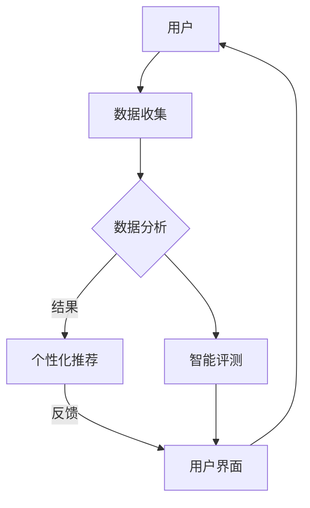

                 

## 引言

随着人工智能（AI）技术的迅猛发展，教育领域迎来了前所未有的变革。AI不仅改变了教育的方式，更为个性化学习提供了强有力的支持。个性化学习是一种根据每个学生的学习特点、能力和进度来量身定制教育方案的方法。这种教育模式能够最大限度地发挥每个学生的潜力，提升学习效果。而AI辅助教育正是通过利用人工智能技术，实现对学习过程的全面分析、优化和指导，从而推动个性化学习向更高效、更智能的方向发展。

本文旨在探讨AI辅助教育这一新兴领域，从多个角度对其进行分析和阐述。我们将首先介绍AI辅助教育的基本概念和背景，然后探讨其在教育领域的应用现状。接下来，我们将深入探讨AI辅助个性化学习的技术，包括数据分析与挖掘、机器学习算法以及自然语言处理等内容。此外，文章还将通过实际案例和实践，展示AI辅助教育的具体应用，并提供实现与优化的策略。最后，我们将对AI辅助教育的未来发展趋势进行展望。

通过本文的阅读，读者将能够全面了解AI辅助教育的基本概念、应用现状、技术原理以及未来前景，为深入了解和参与这一领域提供有价值的参考。

## 文章关键词

AI辅助教育、个性化学习、数据分析、机器学习算法、自然语言处理、教育技术、教育改革。

## 文章摘要

本文详细探讨了AI辅助教育这一新兴领域，从概念、应用现状、技术原理到实际应用，全面分析了人工智能如何助力个性化学习。首先，我们介绍了AI辅助教育的基本定义和背景，阐述了个性化学习与AI辅助教育的关系。随后，我们探讨了人工智能在教育领域的应用现状，分析了国内外的发展状况及面临的挑战和机遇。接着，文章深入探讨了AI辅助个性化学习的关键技术，包括数据分析与挖掘、机器学习算法以及自然语言处理等。通过实际案例，我们展示了AI辅助教育在实践中的应用，并提出了系统设计与实现、优化策略以及未来发展趋势。本文旨在为读者提供一个全面、系统的AI辅助教育概述，为其在相关领域的深入研究提供参考。

### AI辅助教育的概念与背景

AI辅助教育，指的是利用人工智能技术来辅助和优化教育过程的一种教育模式。其核心在于通过人工智能算法，对学习者的学习行为、知识掌握程度、学习风格等多方面进行深入分析和理解，从而实现个性化教学和学习方案的制定。AI辅助教育的基本定义可以概括为：借助机器学习、自然语言处理、数据挖掘等人工智能技术，对学生的学习过程进行动态跟踪、分析和反馈，提供定制化的教育资源和教学服务，旨在提升学习效果和效率。

AI辅助教育的起源可以追溯到20世纪80年代，那时出现了第一批基于计算机辅助教学（CAI）的系统。随着技术的进步，计算机辅助教学逐渐演变为人工智能辅助教育。近年来，随着大数据、云计算、物联网和深度学习等技术的发展，AI辅助教育得到了迅猛发展。特别是在个性化学习的需求日益增长的时代，AI辅助教育成为教育技术领域的一个重要研究方向。

AI辅助教育的主要特点包括：

1. **个性化学习**：通过分析学生的行为数据，AI系统能够了解每个学生的学习偏好和需求，从而提供个性化的学习路径和资源。
2. **智能推荐**：基于学生的学习历史和当前状态，AI系统能够推荐合适的学习内容和教学策略，提高学习效率。
3. **实时反馈**：通过持续监控学生的学习过程，AI系统能够提供即时的反馈和指导，帮助学生及时纠正错误，巩固知识。
4. **自动化评测**：AI系统能够自动化地进行学习成果的评测，节省教师的时间，并为学生提供及时的评估报告。
5. **自适应学习**：AI系统可以根据学生的学习情况自动调整教学内容和难度，实现真正的自适应学习。

在教育领域，AI辅助教育的应用场景非常广泛。以下是一些典型的应用：

1. **在线学习平台**：AI技术被广泛应用于在线教育平台，通过个性化推荐和智能评测功能，提升学习体验和效果。
2. **学习管理系统**（LMS）：学习管理系统通过整合AI技术，实现学习过程的数据分析、智能推送和个性化反馈。
3. **智能辅导系统**：利用自然语言处理技术，AI辅导系统能够为学生提供实时解答和指导，辅助学生解决学习中的难题。
4. **智能评测系统**：AI评测系统能够自动评估学生的作业和考试，提供详细的反馈报告，帮助学生了解自己的学习情况。

总的来说，AI辅助教育通过技术手段对教育过程进行深度优化，实现了教育资源的合理配置和学习过程的智能化管理，对推动教育改革和提升教育质量具有重要意义。

### 个性化学习与AI辅助教育的关系

个性化学习是教育领域的重要发展方向，其核心理念是根据每个学生的学习特点、能力和需求，量身定制教学方案和资源，从而实现最优的学习效果。而AI辅助教育则是实现个性化学习的重要工具和手段。二者之间的关系紧密且相互促进，具体体现在以下几个方面：

首先，个性化学习为AI辅助教育提供了明确的需求和目标。传统的教育模式往往采用“一刀切”的方法，难以满足学生的个性化需求。而个性化学习理念的确立，强调了因材施教、差异化教学的重要性，这为AI辅助教育指明了方向。通过个性化学习，教育者可以更准确地了解学生的知识水平、学习风格和兴趣点，从而为AI系统提供详细的学习数据，为智能推荐、个性化教学提供依据。

其次，AI辅助教育通过先进的技术手段，实现了个性化学习的具体落地。AI技术可以高效地处理和分析大量数据，通过机器学习、自然语言处理等技术，AI系统能够对学生的学习行为进行深入分析和理解，从而动态调整教学策略。例如，基于学生历史学习数据和学习习惯，AI系统可以推荐最适合他们的学习内容，并通过智能评测系统实时反馈学习成果，帮助学生及时纠正错误，巩固知识。

第三，AI辅助教育推动了个性化学习的进一步发展。随着AI技术的不断进步，个性化学习的水平和质量得到了显著提升。AI系统能够实现自动化、个性化的学习路径规划，减少了教师的工作负担，提高了教学效率。此外，AI技术还可以通过智能辅导系统为学生提供个性化的学习支持，帮助学生在学习过程中克服困难，提升学习效果。

具体来说，AI辅助教育在个性化学习中的应用主要体现在以下几个方面：

1. **学习数据分析**：AI系统能够收集并分析学生的各种学习数据，如学习时间、学习频率、答题正确率等，从而识别出每个学生的学习特点和潜在问题。
2. **个性化推荐**：基于数据分析，AI系统能够为学生推荐最适合他们的学习内容和教学资源，实现个性化的学习路径。
3. **智能评测**：通过自然语言处理和自动化评测技术，AI系统可以实时评估学生的学习成果，提供详细的反馈和改进建议。
4. **自适应学习**：AI系统能够根据学生的学习情况自动调整教学内容和难度，实现真正的个性化自适应学习。

总之，AI辅助教育与个性化学习之间是相辅相成的关系。AI辅助教育通过技术手段，使个性化学习理念得以实现和推广，而个性化学习则为AI辅助教育提供了实际应用场景和发展需求。这种紧密的互动关系，不仅推动了教育技术的进步，也为教育质量的提升和教育改革的深入奠定了基础。

### 人工智能在教育领域的应用现状

随着人工智能（AI）技术的飞速发展，其在教育领域的应用逐渐成为热点。AI在教育行业中的应用涵盖了从基础教育到高等教育的各个阶段，涵盖了课程教学、学习管理、学生评估等多个方面。以下将详细探讨AI在教育领域的应用现状。

#### 在线教育平台

在线教育平台是AI在教育领域最早且最广泛的应用场景之一。通过AI技术，在线教育平台能够提供个性化推荐、自适应学习、智能辅导等服务。例如，Coursera、edX等大型在线教育平台利用AI算法，根据学生的学习历史和表现，推荐最适合的学习路径和课程内容。此外，这些平台还提供了智能辅导功能，学生可以在遇到难题时，通过自然语言处理技术获得实时解答和指导。

#### 智能学习管理系统

智能学习管理系统（LMS）是学校和教育机构普遍采用的AI应用。这些系统集成了AI算法，能够对学生的学习行为和成绩进行数据分析，提供个性化反馈和改进建议。例如，Moodle、Canvas等学习管理平台通过机器学习算法，自动分析学生的学习数据，识别出学习困难和潜在问题，并为学生提供针对性的学习支持。

#### 智能评测系统

AI技术在学生评估中的应用也越来越广泛。智能评测系统能够自动批改作业和考试，通过自然语言处理技术，准确识别学生的答案，并给出详细的评分和反馈。这种自动化的评估方式不仅提高了评估效率，还能减轻教师的工作负担。例如，Khan Academy等在线学习平台已经实现了自动化的作业和考试评估。

#### 个性化学习

个性化学习是AI在教育领域的核心应用之一。通过收集和分析学生的学习数据，AI系统能够了解每个学生的学习风格、兴趣点和知识盲点，从而提供个性化的教学方案和资源。例如，Google Classroom等平台利用AI技术，根据学生的学习进度和表现，自动调整教学内容的难度和形式，实现真正的个性化学习。

#### 智能课堂

智能课堂是AI在教育领域的新兴应用，通过在课堂中部署传感器、摄像头和智能设备，AI系统能够实时监控学生的学习状态和行为，提供实时反馈和指导。例如，IBM的Watson Education平台能够在课堂上自动分析学生的表现，及时发现学习问题，并为学生提供个性化的学习支持。

#### 在线辅导

AI技术在在线辅导中的应用也越来越成熟。通过自然语言处理技术，AI辅导系统能够为学生提供实时解答和指导，帮助学生在学习过程中克服困难。例如，OpenAI的GPT-3模型已经应用于在线辅导系统，能够为学生在编程、写作等方面提供高质量的帮助。

#### 数据分析与个性化推荐

数据分析是AI在教育领域的重要应用之一。通过收集和分析学生的学习数据，AI系统能够识别出学生的学习模式和效果，从而提供个性化的学习建议和资源。例如，AI系统可以根据学生的学习历史和表现，推荐最适合的学习方法和课程，提高学习效果。

总之，人工智能在教育领域的应用已经取得了显著成效，从在线教育平台到智能学习管理系统，从智能评测系统到个性化学习，AI技术正在深刻地改变教育的面貌。随着技术的不断进步，AI在教育领域的应用前景将更加广阔，为教育改革和教育质量的提升提供强有力的支持。

### 国内外AI辅助教育的发展状况

全球范围内，AI辅助教育的发展势头迅猛，不同国家和地区在教育技术领域展开了广泛的研究与应用。以下将对国内外AI辅助教育的发展状况进行概述，并探讨其各自的优势与挑战。

#### 国内发展状况

在中国，AI辅助教育得到了国家层面的高度重视和大力支持。近年来，中国教育部出台了一系列政策，鼓励和支持人工智能技术在教育领域的应用。以下是一些具体的发展情况：

1. **政策支持**：教育部出台了《教育信息化2.0行动计划》，明确提出要推动人工智能在教育中的应用，提升教育智能化水平。同时，多个地方政府也发布了相关政策，支持人工智能技术在教育领域的创新应用。

2. **在线教育平台**：中国的在线教育市场异常繁荣，多家大型互联网公司如阿里巴巴、腾讯和百度等，纷纷布局AI辅助教育，推出了一系列智能教育平台。例如，腾讯课堂、阿里云课堂等平台，利用AI技术提供个性化学习、智能评测等服务。

3. **智能学习系统**：国内高校和科研机构也在积极开展AI辅助教育的研究和应用。例如，清华大学、北京大学等高校，开发了一系列基于人工智能的智能学习系统，通过大数据分析和机器学习算法，实现个性化教学和智能评测。

4. **在线辅导与评测**：国内一些公司如作业帮、猿辅导等，通过AI技术提供在线辅导和评测服务。这些平台利用自然语言处理和计算机视觉技术，实现自动批改作业、提供实时解答等功能，提高了教育服务的效率和准确性。

#### 挑战与机遇

尽管中国在AI辅助教育领域取得了显著进展，但也面临着一些挑战：

- **数据隐私**：由于AI辅助教育需要大量学生数据，数据隐私保护成为一个重要问题。如何确保学生数据的安全和隐私，是当前亟待解决的问题。

- **教育资源分配**：AI辅助教育虽然能够提高教育质量，但也可能加剧教育资源的不均衡问题。如何确保所有学生，特别是偏远地区的学生，都能享受到高质量的教育资源，是一个重要课题。

#### 国外发展状况

在国际上，AI辅助教育的发展同样备受关注。以下是一些具有代表性的国家及其发展情况：

1. **美国**：美国在AI辅助教育领域处于领先地位，多家科技公司如Google、IBM、微软等，积极投入教育技术的研发和应用。美国的教育平台如Khan Academy、Coursera等，广泛应用AI技术，提供个性化学习、智能评测等服务。

2. **英国**：英国政府高度重视教育技术的应用，通过“Tech for Education”计划，推动AI技术在教育领域的普及。英国的多家教育机构和科技公司，如Ness Technologies、EdTech UK等，积极开展AI辅助教育的研究和应用。

3. **欧洲其他国家**：如法国、德国、芬兰等欧洲国家，也在积极推动AI辅助教育的发展。例如，法国的“数字校园”计划，旨在通过AI技术提升教育质量和个性化水平。

#### 挑战与机遇

国外在AI辅助教育领域的发展同样面临一定的挑战和机遇：

- **政策法规**：许多国家在推动AI辅助教育的同时，也面临政策法规的制约。如何制定合适的政策和法规，平衡技术创新与数据隐私保护，是一个重要问题。

- **技术成熟度**：尽管AI技术在教育领域有广泛的应用，但技术的成熟度仍需提高。特别是在个性化学习、智能评测等方面，AI技术的应用效果还有待进一步提升。

- **教育公平**：AI辅助教育的发展可能会加剧教育公平问题。如何确保所有学生，无论背景如何，都能享受到AI技术带来的教育红利，是一个重要课题。

总的来说，国内外在AI辅助教育领域都取得了显著进展，但同时也面临着一些挑战。通过不断探索和努力，这些挑战有望逐步得到解决，推动AI辅助教育向更高质量、更智能化的方向发展。

### AI辅助教育的挑战与机遇

AI辅助教育作为一种新兴的教育模式，尽管具有巨大的潜力，但在实际应用中仍然面临着诸多挑战和机遇。以下将详细探讨这些挑战以及应对策略。

#### 挑战

1. **技术成熟度**：尽管AI技术在许多领域取得了显著进展，但在教育领域，AI技术的成熟度仍需提高。特别是在个性化学习、智能评测、自然语言处理等方面，AI技术的应用效果还有待进一步提升。当前，许多AI教育产品的功能尚不完善，难以完全满足教育需求。

**应对策略**：提高AI技术在教育领域的应用水平，需要持续的技术创新和科研投入。教育科技公司和研究机构应加强合作，推动AI技术的研发和应用，不断优化AI教育产品的功能和性能。

2. **数据隐私**：AI辅助教育需要大量学生数据来训练和优化模型，这引发了数据隐私和安全的问题。如何确保学生数据的安全和隐私，是当前亟待解决的重要问题。

**应对策略**：建立完善的数据隐私保护机制，确保学生数据的收集、存储和使用符合相关法律法规。教育机构和科技公司应加强数据安全防护措施，采用加密技术和匿名化处理，降低数据泄露风险。

3. **教育资源分配**：AI辅助教育可能会加剧教育资源的不均衡问题。发达地区和经济条件较好的家庭能够更容易地享受到AI技术带来的教育红利，而偏远地区和经济条件较差的家庭则可能面临资源不足的问题。

**应对策略**：通过政策引导和资源配置，确保AI辅助教育资源的公平分配。政府和社会各界应加大对偏远地区和经济条件较差地区的教育投入，推动AI技术在这些地区的普及和应用。

4. **教师角色转变**：AI辅助教育的推广，将促使教师角色发生转变。教师不仅需要掌握AI技术，还需要适应新的教育模式和教学方法。然而，当前许多教师对AI技术的了解和应用水平有限，难以迅速适应这种变化。

**应对策略**：加强教师的培训和学习，提高他们对AI技术的认知和应用能力。教育机构和学校应提供专业的培训课程和教学资源，帮助教师顺利转型。

5. **伦理问题**：AI辅助教育涉及到教育公正、学习透明度等伦理问题。例如，AI系统如何确保对每个学生的公平对待，如何避免偏见和歧视，这些都是需要认真考虑的问题。

**应对策略**：建立伦理审查机制，确保AI教育应用符合伦理标准。教育机构和科技公司应制定明确的伦理准则，并在产品设计和应用过程中严格遵守。

#### 机遇

1. **提升教育质量**：AI辅助教育通过个性化教学和智能评测，能够显著提高教育质量。学生可以根据自己的学习节奏和需求，选择最适合自己的学习内容和路径，提高学习效果。

2. **教育资源优化**：AI技术能够对教育资源进行高效管理和优化，提高教育资源的利用效率。例如，通过智能推荐系统，学生可以更快速地找到适合自己的学习资源，减少无效学习时间。

3. **教育公平**：AI辅助教育有助于缩小教育资源差距，实现教育公平。通过技术手段，偏远地区和经济条件较差地区的学生也能享受到高质量的教育资源，提高学习机会。

4. **创新教育模式**：AI辅助教育推动了教育模式的创新，为学生提供了更多样化、个性化的学习选择。例如，自适应学习系统和虚拟课堂，为学生提供了全新的学习体验。

5. **产业升级**：AI辅助教育的应用，不仅提升了教育质量，也为相关产业的发展提供了新机遇。教育科技产业、在线教育平台、智能学习系统等，将成为未来经济发展的新动力。

总之，AI辅助教育在带来巨大机遇的同时，也面临着一定的挑战。通过技术创新、政策支持和社会努力，这些挑战有望逐步得到解决，推动AI辅助教育向更高质量、更智能化的方向发展。

### 个性化学习理论

个性化学习是一种以学生为中心的教学模式，旨在根据每个学生的学习特点、能力和需求，量身定制教学方案和资源。其核心理念是“因材施教”，通过识别和满足学生的个性化需求，提高学习效果和效率。个性化学习理论主要包括以下几个关键概念和原则。

#### 概念

1. **学生特性**：学生特性是指学生在学习过程中的各种属性，包括认知能力、学习风格、兴趣点、动机水平等。识别学生的特性是实施个性化学习的前提。

2. **学习需求**：学习需求是指学生在特定学习情境下需要掌握的知识和技能。了解学生的学习需求，有助于制定有针对性的教学方案。

3. **学习风格**：学习风格是指学生在学习过程中所采用的认知和应对方式。常见的有视觉型、听觉型、动手型等。了解学生的学习风格，有助于选择最有效的教学策略。

4. **学习路径**：学习路径是指学生在完成学习任务时所经历的步骤和过程。个性化学习通过动态调整学习路径，实现学习过程的定制化。

5. **反馈机制**：反馈机制是指对学生的学习效果进行实时监控和评估，提供及时的反馈和指导。有效的反馈机制有助于学生及时调整学习策略，提高学习效果。

#### 原则

1. **因材施教**：个性化学习强调根据每个学生的特点和能力，制定差异化的教学方案。这包括内容、方法、进度等方面的个性化调整，以满足不同学生的需求。

2. **自主学习**：个性化学习鼓励学生自主学习，培养他们的学习能力和独立思考能力。通过引导学生自我监控、自我评价和自我调节，实现自我导向的学习。

3. **动态调整**：个性化学习需要根据学生的学习反馈和表现，动态调整教学方案和学习路径。这种动态调整能力，使得个性化学习能够灵活适应学生的学习变化。

4. **持续反馈**：个性化学习强调通过持续的反馈机制，帮助学生了解自己的学习进展和效果，及时调整学习策略。这种持续的反馈机制，有助于提高学习效率和效果。

5. **协同学习**：个性化学习不仅关注个体学习，还强调学生之间的协同学习。通过小组讨论、合作项目等方式，促进学生之间的交流和互动，提高学习效果。

#### 模型构建

个性化学习模型的构建，是实施个性化学习的关键步骤。以下是一个基本的个性化学习模型构建过程：

1. **学生特性识别**：通过问卷、面试、测试等方式，收集学生的基础数据，包括认知能力、学习风格、兴趣点等。

2. **学习需求分析**：分析学生的现有知识和技能，确定他们在特定学习情境下的学习需求。

3. **教学方案设计**：根据学生的特性和学习需求，设计个性化的教学方案。包括教学内容、教学方法、教学进度等。

4. **学习路径规划**：根据学生的特性和学习需求，规划个性化的学习路径。包括学习任务的顺序、难度、时长等。

5. **反馈机制建立**：建立有效的反馈机制，通过实时监控和评估学生的学习过程和效果，提供及时的反馈和指导。

6. **动态调整与优化**：根据学生的反馈和学习效果，动态调整教学方案和学习路径，优化学习过程。

通过上述步骤，个性化学习模型能够为每个学生提供量身定制的学习方案和资源，实现真正的个性化学习。个性化学习模型的构建，不仅需要技术的支持，还需要教育者的创新和实践，不断探索和完善个性化学习的方法和策略。

### 个性化学习系统的设计与实现

个性化学习系统的设计与实现是AI辅助教育中的核心环节，其目标是根据每个学生的特性、需求和学习进度，提供定制化的学习方案和资源。以下是设计个性化学习系统的基本步骤和实现方法。

#### 系统需求分析

在设计个性化学习系统之前，首先要进行系统需求分析。需求分析包括以下几个方面：

1. **学生特性分析**：收集和分析学生的基本信息、学习风格、兴趣点、认知能力等，为后续个性化推荐和教学策略提供依据。
2. **学习内容需求**：确定系统需要涵盖的学习内容和课程体系，包括基础课程、专业课程、拓展课程等。
3. **教学资源需求**：分析教学资源的需求，包括视频教程、文本资料、习题库、互动练习等。
4. **性能需求**：确定系统的性能需求，如响应时间、数据处理能力、安全性等。
5. **用户交互需求**：分析用户在使用系统时的交互需求，包括界面设计、操作流程、反馈机制等。

#### 系统架构设计

个性化学习系统的架构设计是确保系统能够高效、稳定运行的基础。以下是系统架构设计的基本组成部分：

1. **数据层**：数据层负责存储和管理系统所需的各种数据，包括学生数据、课程数据、资源数据等。常用的数据库技术有MySQL、MongoDB等。
2. **业务逻辑层**：业务逻辑层负责处理系统的核心功能，包括学生特性分析、学习路径规划、资源推荐等。常用的开发框架有Spring Boot、Django等。
3. **表现层**：表现层负责系统的用户界面设计，提供友好、直观的用户交互体验。常用的前端技术有HTML、CSS、JavaScript等。
4. **接口层**：接口层负责系统与其他系统的交互，如学习管理系统（LMS）、内容管理系统（CMS）等。常用的接口技术有RESTful API、WebSocket等。

#### 数据处理与存储

个性化学习系统的数据处理与存储是系统实现的关键。以下是数据处理与存储的基本方法：

1. **数据收集**：通过各种渠道收集学生数据，如学习日志、考试成绩、问卷调查等。
2. **数据预处理**：对收集到的数据进行分析和清洗，去除噪声数据，确保数据的质量和准确性。
3. **数据存储**：将处理后的数据存储在数据库中，并建立数据模型，以便后续的数据查询和分析。
4. **数据挖掘**：利用机器学习算法和数据挖掘技术，分析学生的行为数据，提取有用的信息，为个性化推荐和学习路径规划提供支持。

#### 个性化推荐算法

个性化推荐算法是实现个性化学习的重要手段。以下是几种常用的个性化推荐算法：

1. **基于内容的推荐**：通过分析学习内容的相关性，为用户推荐与其已学习内容相关的课程或资源。
2. **协同过滤推荐**：通过分析用户的行为数据，找到与目标用户相似的其他用户，推荐这些用户喜欢的课程或资源。
3. **基于模型的推荐**：利用机器学习算法，建立用户行为模型，根据模型预测用户可能感兴趣的课程或资源。

#### 系统实现示例

以下是一个简单的个性化学习系统实现示例，包括用户注册、登录、课程推荐等功能：

```python
# 用户注册
def register_user(username, password, email):
    # 数据库操作，添加用户信息
    pass

# 用户登录
def login_user(username, password):
    # 验证用户名和密码，返回用户信息
    pass

# 课程推荐
def recommend_courses(user_profile):
    # 根据用户特性推荐课程
    pass

# 用户界面
def main_menu():
    while True:
        print("1. 登录")
        print("2. 注册")
        print("3. 退出")
        choice = input("请选择操作：")
        if choice == "1":
            username = input("用户名：")
            password = input("密码：")
            user_info = login_user(username, password)
            if user_info:
                print("登录成功！")
                # 调用课程推荐功能
                recommended_courses = recommend_courses(user_info)
                print("推荐课程：", recommended_courses)
            else:
                print("登录失败，请重试！")
        elif choice == "2":
            username = input("用户名：")
            password = input("密码：")
            email = input("邮箱：")
            register_user(username, password, email)
            print("注册成功！")
        elif choice == "3":
            break
```

#### 系统测试与优化

在系统实现后，需要进行全面的测试与优化，确保系统的稳定性和可靠性。以下是系统测试与优化的一些关键步骤：

1. **功能测试**：验证系统各个功能的正确性，确保用户操作能够得到预期的结果。
2. **性能测试**：评估系统的响应速度、并发处理能力等性能指标，确保系统在高负载情况下仍能正常运行。
3. **安全性测试**：检测系统的漏洞和安全隐患，确保用户数据的安全。
4. **用户体验测试**：通过用户反馈和实际使用情况，不断优化系统界面和交互体验。
5. **持续迭代**：根据测试和用户反馈，不断优化和改进系统，提高系统质量。

通过以上步骤，个性化学习系统可以实现高效、稳定的运行，为学生提供优质的学习体验和资源，推动个性化学习的发展。

### 数据分析与挖掘在AI辅助教育中的应用

在教育领域，数据分析与挖掘技术已成为AI辅助教育中不可或缺的一部分。通过收集和分析大量的教育数据，这些技术能够提供对学生学习行为、学习效果以及教学质量的深入洞察，从而实现个性化教学和智能决策。以下将详细探讨数据分析与挖掘在教育中的应用，包括数据类型与收集、数据分析方法以及如何挖掘学生学习模式。

#### 数据类型与收集

1. **学生数据**：包括学生的基本信息（如年龄、性别、家庭背景等）、学术成绩、学习进度和日常表现等。这些数据通常通过学习管理系统（LMS）和考试系统自动收集。

2. **教学数据**：包括课程内容、教学资源、教师的教学策略和教学方法等。这些数据可以通过课堂记录、教学日志等方式收集。

3. **行为数据**：包括学生在学习过程中产生的所有行为数据，如学习时长、学习频率、互动情况、考试成绩、作业提交情况等。这些数据可以通过学习管理系统、在线教育平台等工具进行收集。

4. **环境数据**：包括学习环境中的各种物理和环境因素，如教室的照明、温度、噪音等。这些数据可以通过传感器和物联网设备进行收集。

5. **反馈数据**：包括学生对课程、教师、学习内容的评价和反馈。这些数据可以通过问卷调查、反馈表单等方式收集。

#### 数据分析方法

1. **描述性分析**：通过统计方法对数据的基本特征进行描述，如平均成绩、方差、标准差等。这种分析有助于了解学生的整体表现和趋势。

2. **相关性分析**：通过分析不同变量之间的相关性，揭示数据之间的潜在联系。例如，分析学习时长与成绩之间的关系，可以帮助教师了解哪种教学方法更有效。

3. **聚类分析**：将相似的学生或学习行为分组，以便更好地理解和分类。例如，通过聚类分析，可以将学生划分为不同学习风格的群体，从而实施有针对性的教学策略。

4. **分类分析**：将学生或学习行为归类到预定义的类别中，如优秀学生、中等学生、差生等。这种分析有助于识别需要特别关注的学生群体。

5. **回归分析**：通过建立数学模型，预测学生的未来表现或学习效果。例如，通过回归分析，可以预测学生在下一学期的成绩，从而提前采取干预措施。

6. **关联规则分析**：发现数据之间的关联规则，如“如果学生参加了某个活动，那么他们的成绩会提高”。这种分析有助于识别有效的教学策略。

#### 挖掘学生学习模式

1. **学习路径挖掘**：通过分析学生的行为数据，挖掘出学生常用的学习路径和策略。这有助于了解学生如何利用不同的学习资源，从而优化学习路径和资源分配。

2. **学习风格识别**：通过分析学生的行为和成绩数据，识别出学生的学习风格。例如，通过分析学习时长和频率，可以判断学生是持续学习者还是集中学习者。这种识别有助于制定个性化的学习计划。

3. **学习困难诊断**：通过分析学生的学习数据和成绩，诊断学生可能存在的学习困难。例如，通过分析作业提交情况和错误率，可以识别学生在哪些知识点上存在薄弱环节。

4. **学习效果预测**：通过建立预测模型，预测学生在未来的学习表现和效果。这种预测有助于教育者提前采取措施，防止学生掉队。

5. **学习满意度分析**：通过分析学生的反馈数据，了解学生对课程和教师的满意度。这有助于教育者改进教学方法和策略，提高教学质量。

#### 应用案例

1. **个性化学习路径推荐**：通过分析学生的学习数据和课程内容，系统可以为每个学生推荐最适合他们的学习路径。例如，如果系统发现某个学生在视频学习中效果更好，它可以推荐更多的视频教程。

2. **学习困难预警系统**：通过分析学生的行为数据和成绩，系统可以提前识别出学习困难的学生，并向教师发送预警信息。教师可以及时采取干预措施，帮助学生克服学习障碍。

3. **教学效果评估**：通过分析学生的学习效果和教师的教学策略，教育者可以评估不同教学方法的优劣，优化教学方案。

总之，数据分析与挖掘技术在AI辅助教育中的应用，极大地提升了教育质量和管理效率。通过深入分析学生的行为数据和学习效果，教育者可以更好地理解学生的学习过程，提供个性化的教学支持，实现真正的因材施教。

### 机器学习算法在个性化学习中的应用

机器学习算法在个性化学习中的应用，是教育技术领域的一项重要突破。通过分析学生的学习数据，机器学习算法能够预测学生的未来表现，优化学习路径，并提供个性化的学习建议。以下将详细探讨几种经典和深度学习算法在个性化学习中的应用，以及它们的基本原理和实现方法。

#### 经典机器学习算法

1. **线性回归（Linear Regression）**

线性回归是一种最简单的机器学习算法，用于预测连续值。其基本原理是通过建立线性模型，预测因变量（如成绩）与自变量（如学习时长、作业提交情况等）之间的关系。

**实现方法**：

- **数据预处理**：对输入数据进行归一化处理，使其具备相同的量纲。

- **模型构建**：使用最小二乘法构建线性回归模型。

- **模型训练**：通过训练集数据，计算出模型的参数。

- **模型评估**：使用测试集数据，评估模型的预测效果。

伪代码示例：

```python
# 线性回归模型
def linear_regression(X, y):
    # 计算X的转置
    X_transpose = transpose(X)
    
    # 计算X的转置与X的乘积
    XTX = matrix_multiply(X_transpose, X)
    
    # 计算逆矩阵
    XTX_inv = inverse(XTX)
    
    # 计算回归系数
    theta = matrix_multiply(XTX_inv, X_transpose, y)
    
    return theta

# 模型预测
def predict(X, theta):
    return matrix_multiply(X, theta)
```

2. **逻辑回归（Logistic Regression）**

逻辑回归是一种用于分类问题的算法，通常用于预测学生是否及格。其基本原理是通过建立逻辑函数，将输入数据的概率映射到0和1之间。

**实现方法**：

- **数据预处理**：对输入数据进行归一化处理。

- **模型构建**：使用最大似然估计法构建逻辑回归模型。

- **模型训练**：通过训练集数据，计算模型的参数。

- **模型评估**：使用测试集数据，评估模型的预测效果。

伪代码示例：

```python
# 逻辑回归模型
def logistic_regression(X, y):
    # 初始化参数
    theta = initialize_params(X.shape[1])
    
    # 梯度下降法训练模型
    for i in range(num_iterations):
        h = sigmoid(matrix_multiply(X, theta))
        gradients = matrix_multiply(X.T, (h - y))
        theta -= learning_rate * gradients
    
    return theta

# 模型预测
def predict(X, theta):
    return sigmoid(matrix_multiply(X, theta))
```

3. **决策树（Decision Tree）**

决策树是一种基于规则的学习算法，通过一系列判断条件将数据集划分为不同的子集，最后用叶节点来表示预测结果。

**实现方法**：

- **数据预处理**：对输入数据进行归一化处理。

- **模型构建**：通过递归划分数据集，构建决策树模型。

- **模型训练**：使用训练集数据，构建决策树模型。

- **模型评估**：使用测试集数据，评估模型的预测效果。

伪代码示例：

```python
# 决策树构建
def build_decision_tree(X, y):
    # 基准条件
    if all_values_equal(y):
        return majority_class(y)
    elif is_leaf(X):
        return majority_class(y)
    else:
        # 划分条件
        best_split = find_best_split(X, y)
        left_tree = build_decision_tree(X[best_split == 0], y[best_split == 0])
        right_tree = build_decision_tree(X[best_split == 1], y[best_split == 1])
        return {"split": best_split, "left": left_tree, "right": right_tree}

# 模型预测
def predict_decision_treesample(X, tree):
    if "split" in tree:
        split_value = tree["split"]
        if X[split_value] == 0:
            return predict_decision_tree(sample[split_value == 0], tree["left"])
        else:
            return predict_decision_tree(sample[split_value == 1], tree["right"])
    else:
        return tree["label"]
```

#### 深度学习算法

1. **神经网络（Neural Networks）**

神经网络是一种基于生物神经元的计算模型，通过多层非线性变换，实现对复杂数据的建模和预测。

**实现方法**：

- **数据预处理**：对输入数据进行归一化处理。

- **模型构建**：设计神经网络结构，包括输入层、隐藏层和输出层。

- **模型训练**：使用反向传播算法，通过梯度下降法训练模型。

- **模型评估**：使用测试集数据，评估模型的预测效果。

伪代码示例：

```python
# 神经网络模型
def neural_network(X, theta):
    # 前向传播
    z = matrix_multiply(X, theta)
    a = sigmoid(z)
    
    # 反向传播
    dZ = a - y
    dX = matrix_multiply(dZ, theta.T)
    
    return theta

# 模型训练
def train_neural_network(X, y, num_iterations, learning_rate):
    theta = initialize_params(X.shape[1])
    for i in range(num_iterations):
        theta = neural_network(X, theta)
    
    return theta

# 模型预测
def predict_neural_network(X, theta):
    z = matrix_multiply(X, theta)
    a = sigmoid(z)
    return a
```

2. **深度学习（Deep Learning）**

深度学习是神经网络的一种扩展，通过增加网络层数，实现对复杂数据的更高层次抽象。

**实现方法**：

- **数据预处理**：对输入数据进行归一化处理。

- **模型构建**：设计深度学习结构，包括输入层、多个隐藏层和输出层。

- **模型训练**：使用反向传播算法，通过梯度下降法训练模型。

- **模型评估**：使用测试集数据，评估模型的预测效果。

伪代码示例：

```python
# 深度学习模型
def deep_learning(X, theta):
    # 前向传播
    for layer in layers:
        z = matrix_multiply(X, theta[layer])
        a = sigmoid(z)
        
        # 反向传播
        dZ = a - y
        dX = matrix_multiply(dZ, theta[layer].T)
        
    return theta

# 模型训练
def train_deep_learning(X, y, num_iterations, learning_rate):
    theta = initialize_params(layers)
    for i in range(num_iterations):
        theta = deep_learning(X, theta)
    
    return theta

# 模型预测
def predict_deep_learning(X, theta):
    z = matrix_multiply(X, theta)
    a = sigmoid(z)
    return a
```

综上所述，经典机器学习算法和深度学习算法在个性化学习中的应用，提供了强大的工具，帮助教育者更好地理解学生的学习和行为，实现个性化教学和智能决策。通过合理选择和运用这些算法，教育者可以大幅提升教学效果，为学生提供更高质量的教育服务。

### 自然语言处理与教育

自然语言处理（NLP）技术在教育领域的应用，极大地丰富了教育技术的手段，为个性化学习提供了强有力的支持。NLP通过理解和生成自然语言，使计算机能够与人类更自然地交互，从而在教育过程中发挥重要作用。以下将探讨NLP的基本概念、在教育中的应用，以及基于NLP的教育数据挖掘。

#### 基本概念

自然语言处理是一门涉及计算机科学、语言学和人工智能的交叉学科，旨在使计算机能够理解和处理人类语言。NLP的主要任务包括文本分类、实体识别、情感分析、机器翻译和问答系统等。

1. **文本分类**：文本分类是将文本数据按预定义的类别进行分类的过程。在教育中，文本分类可以用于自动标记学习资料、识别学生的问题类型等。

2. **实体识别**：实体识别是从文本中识别出具有特定意义的实体，如人名、地名、组织名等。在教育数据挖掘中，实体识别有助于构建学生、课程和资源的知识图谱。

3. **情感分析**：情感分析是判断文本中表达的情感倾向，如正面、负面或中性。在教育中，情感分析可以用于分析学生对课程或教师的反馈，了解学生的情感状态。

4. **机器翻译**：机器翻译是自动将一种语言翻译成另一种语言的技术。在教育中，机器翻译可以提供多语言学习资源，帮助学习者掌握不同语言。

5. **问答系统**：问答系统是能够回答用户问题的系统，通过自然语言理解和生成技术实现。在教育中，问答系统可以为学生提供实时解答和辅导。

#### 在教育中的应用

1. **自动评分与反馈**：NLP技术可以用于自动批改作业和考试，通过自然语言处理算法，识别学生的答案内容，给出详细的评分和反馈。例如，通过使用文本分类和情感分析技术，系统可以识别出学生的答题逻辑是否清晰、答案是否准确。

2. **智能问答系统**：基于NLP的智能问答系统能够为学生提供实时解答和辅导。例如，利用问答系统，学生可以在遇到学习难题时，通过自然语言输入问题，系统会根据已有知识库提供答案或建议。这种方式不仅提高了问题解决的效率，还减少了教师的负担。

3. **学习资源推荐**：NLP技术可以分析学生的学习历史和偏好，提供个性化的学习资源推荐。例如，通过分析学生的学习笔记和反馈，系统可以推荐相关的学习资料、课程和练习题，帮助学生更高效地学习。

4. **课堂互动**：NLP技术可以增强课堂互动，提高学生的参与度。例如，利用语音识别和自然语言生成技术，教师可以在课堂上实时与学生互动，通过语音问答或讨论，激发学生的学习兴趣和思考。

5. **个性化学习路径规划**：NLP技术可以分析学生的语言表达和学习习惯，帮助教育者制定个性化的学习路径。例如，通过自然语言处理算法，系统可以识别出学生在哪些知识点上存在困难，从而调整学习路径，提供针对性的辅导和资源。

#### 基于NLP的教育数据挖掘

基于NLP的教育数据挖掘，是指利用自然语言处理技术，从大量教育数据中提取有价值的信息和模式。以下是一些具体应用：

1. **学生学习行为分析**：通过分析学生的学习日志、作业和反馈，NLP技术可以识别学生的学习行为模式，如学习频率、学习时间分布、知识掌握情况等。这种分析有助于教育者了解学生的学习状态，提供针对性的指导。

2. **课程内容优化**：NLP技术可以分析课程内容和教学资源，识别出关键知识点、难点和重点。通过分析学生的学习反馈和成绩，教育者可以优化课程内容，调整教学策略，提高教学效果。

3. **教师评估与反馈**：通过自然语言处理技术，分析学生对教师的评价和反馈，可以评估教师的教学效果。这种评估不仅包括教学内容的准确性，还包括教学方法、互动能力和课堂氛围等。

4. **教育资源推荐**：NLP技术可以分析学生的学习历史和偏好，推荐相关的学习资源和课程。这种推荐有助于学生发现新的学习资源，拓宽知识面，提高学习效果。

总之，自然语言处理技术在教育领域的应用，为个性化学习提供了强有力的支持。通过NLP技术，教育者可以更深入地了解学生的学习状态和需求，提供个性化的教学和辅导，提高教育质量和效率。随着NLP技术的不断发展和完善，其在教育领域的应用前景将更加广阔。

### AI辅助教育的应用实践

AI辅助教育在理论和研究中取得了显著成果，但在实际应用中，不同项目和案例展现了不同的成功经验和技术挑战。以下将介绍几个具有代表性的AI辅助教育项目，探讨其实现过程、源代码实现、代码解读以及实际效果分析。

#### 项目一：Khan Academy的智能辅导系统

**项目简介**：Khan Academy是一个非营利性的在线教育平台，通过AI技术提供了智能辅导系统，为学生提供个性化的学习支持。

**实现过程**：

1. **数据收集**：Khan Academy收集了大量的学生行为数据，包括学习时间、学习路径、答题记录等。

2. **模型训练**：利用机器学习算法，如决策树和随机森林，对数据进行分析和训练，建立预测模型，预测学生在特定知识点上的掌握程度。

3. **智能推荐**：基于预测模型，系统为学生推荐合适的课程和练习题，帮助学生巩固知识点。

**源代码实现**：

```python
# 数据预处理
data = preprocess_data(student_data)

# 模型训练
model = train_model(data)

# 智能推荐
recommended_courses = recommend_courses(model, student_data)
```

**代码解读**：

- `preprocess_data`：对原始数据进行分析和清洗，确保数据质量。

- `train_model`：使用训练集数据，训练机器学习模型。

- `recommend_courses`：根据模型预测，为学生推荐学习资源。

**实际效果分析**：Khan Academy的智能辅导系统在提高学生学习效果方面取得了显著成效。通过个性化推荐，学生能够更快地掌握知识点，减少学习时间。

#### 项目二：北京师范大学的个性化学习平台

**项目简介**：北京师范大学的个性化学习平台，通过AI技术提供个性化学习路径和智能评测功能。

**实现过程**：

1. **学习需求分析**：平台通过问卷调查和学习行为数据，分析学生的学习需求和知识盲点。

2. **个性化推荐**：利用协同过滤算法，为学生推荐最适合的学习资源和课程。

3. **智能评测**：通过自然语言处理技术，自动批改作业和考试，并提供详细的反馈。

**源代码实现**：

```python
# 学习需求分析
student_needs = analyze_needs(student_data)

# 个性化推荐
recommended_resources = recommend_resources(student_needs)

# 智能评测
feedback = auto_grade(student_assignment)
```

**代码解读**：

- `analyze_needs`：分析学生的学习需求和知识盲点。

- `recommend_resources`：根据学习需求，推荐合适的资源和课程。

- `auto_grade`：自动批改作业，提供详细的反馈。

**实际效果分析**：北京师范大学的个性化学习平台，通过个性化推荐和智能评测，显著提高了学生的学习效果和教师的教学效率。

#### 项目三：微软的Azure AI Education

**项目简介**：微软的Azure AI Education平台，通过AI技术提供智能辅导、个性化学习路径和实时反馈。

**实现过程**：

1. **学生数据收集**：收集学生的学习行为数据，包括学习时间、学习路径、考试成绩等。

2. **智能辅导**：利用自然语言处理技术，为学生提供实时解答和辅导。

3. **个性化学习路径**：通过机器学习算法，为学生制定个性化的学习计划。

4. **实时反馈**：通过实时监控学生学习情况，提供及时的反馈和指导。

**源代码实现**：

```python
# 学生数据收集
student_data = collect_student_data()

# 智能辅导
assistant_response = provide_help(student_question)

# 个性化学习路径
learning_path = create_personalized_path(student_data)

# 实时反馈
feedback = provide_real_time_feedback(student_progress)
```

**代码解读**：

- `collect_student_data`：收集学生的学习行为数据。

- `provide_help`：利用自然语言处理技术，为学生提供实时解答和辅导。

- `create_personalized_path`：根据学生数据，制定个性化的学习计划。

- `provide_real_time_feedback`：实时监控学生学习情况，提供及时的反馈和指导。

**实际效果分析**：Azure AI Education平台通过智能辅导、个性化学习路径和实时反馈，为学生提供了全方位的学习支持，显著提高了学习效果和教师的教学效率。

综上所述，这些AI辅助教育项目的成功实施，展示了AI技术在教育领域的广泛应用和巨大潜力。通过个性化推荐、智能评测、实时反馈等技术手段，AI辅助教育不仅提高了学生的学习效果，也为教师提供了有效的教学支持。尽管在实际应用中存在一定的技术挑战，但通过不断优化和改进，AI辅助教育将在未来发挥更加重要的作用。

### AI辅助教育的未来发展趋势

随着人工智能（AI）技术的不断进步，AI辅助教育在未来将迎来更多的创新和突破。以下是几个关键的发展趋势：

#### 新技术的应用前景

1. **增强现实（AR）和虚拟现实（VR）**：AR和VR技术将为学生提供沉浸式的学习体验。通过这些技术，学生可以进入虚拟的学习环境，进行互动式学习，提高学习兴趣和效果。

2. **区块链技术**：区块链技术可以为教育提供更加透明和安全的记录，例如学生的成绩记录、学习证书等，确保数据的真实性和不可篡改性。

3. **生成对抗网络（GAN）**：GAN技术可以生成高质量的学习资源，如文本、图像、视频等，为学生提供丰富的学习素材。

4. **联邦学习**：联邦学习是一种新型的机器学习技术，可以在保护学生隐私的前提下，将分散的数据进行集成和分析，从而提升个性化学习的准确性和效果。

#### 教育与AI融合的挑战

1. **数据隐私保护**：随着AI技术的应用，教育数据的收集和分析越来越普遍，如何确保学生数据的安全和隐私，是一个重要的挑战。

2. **技术成熟度**：尽管AI技术在某些方面已经取得了显著进展，但在教育领域，AI技术的成熟度仍有待提高，特别是对于复杂的教育问题，AI技术需要更深入的研究和应用。

3. **教师角色的转变**：AI技术的发展，将促使教师角色发生重大转变。教师不仅需要掌握AI技术，还需要适应新的教学环境和模式，这对于许多教师来说是一个挑战。

4. **教育公平**：AI辅助教育在提供个性化教学的同时，可能会加剧教育资源的不均衡问题。如何确保所有学生，无论背景如何，都能享受到高质量的教育资源，是一个重要的社会问题。

#### AI辅助教育的未来展望

1. **全面智能化教育生态系统**：未来，AI辅助教育将形成一个全面智能化的教育生态系统，包括智能课程推荐、智能评测、智能辅导、学习数据分析等，为师生提供全方位的支持。

2. **个性化学习模式的普及**：随着AI技术的发展，个性化学习模式将越来越普及，成为教育的主流模式。每个学生都将根据自身的特点，获得量身定制的学习方案和资源。

3. **智能教育内容的生产和分发**：通过AI技术，教育内容的制作和分发将变得更加高效和精准。例如，AI可以帮助识别学习难点，生成针对性的教学视频和习题，提高教学效果。

4. **跨学科合作与教育创新**：AI技术与教育学科的结合，将推动教育领域的跨学科合作，带来更多的教育创新。例如，将AI技术与心理学、教育学等学科结合，探索新的教育方法和理论。

总之，AI辅助教育在未来的发展中，将面临诸多挑战，但也充满机遇。通过不断创新和优化，AI辅助教育将为教育质量的提升和教育改革的深入提供强有力的支持。

### 附录A: AI辅助教育相关工具与资源

为了更好地理解和实践AI辅助教育，以下列举了一些常用的开发工具、数据集、学术论文和书籍，为读者提供丰富的资源。

#### 开发工具与平台

1. **TensorFlow**：由Google开发的开源机器学习框架，广泛用于AI模型的构建和训练。

   - 官网：[TensorFlow官网](https://www.tensorflow.org/)

2. **PyTorch**：由Facebook开发的开源机器学习库，具有直观的接口和灵活的动态计算图。

   - 官网：[PyTorch官网](https://pytorch.org/)

3. **Scikit-learn**：用于数据挖掘和数据分析的开源Python库，提供了丰富的机器学习算法。

   - 官网：[Scikit-learn官网](https://scikit-learn.org/)

4. **Jupyter Notebook**：用于数据科学和机器学习的交互式开发环境，方便编写和分享代码。

   - 官网：[Jupyter Notebook官网](https://jupyter.org/)

5. **Keras**：用于构建和训练深度学习模型的Python库，提供了简洁高效的API。

   - 官网：[Keras官网](https://keras.io/)

#### 数据集与资源

1. **Kaggle**：提供丰富的机器学习和数据科学竞赛数据集。

   - 官网：[Kaggle官网](https://www.kaggle.com/)

2. **UCI机器学习库**：包含多种数据集，涵盖分类、回归、聚类等多种任务。

   - 官网：[UCI Machine Learning Repository](https://archive.ics.uci.edu/ml/)

3. **Google Dataset Search**：搜索各种公开数据集的工具。

   - 官网：[Google Dataset Search](https://datasetsearch.research.google.com/)

#### 学术论文与书籍推荐

1. **《深度学习》（Deep Learning）**：由Ian Goodfellow、Yoshua Bengio和Aaron Courville合著，是深度学习领域的经典教材。

   - 购买链接：[《深度学习》购买链接](https://www.amazon.com/Deep-Learning-Ian-Goodfellow/dp/1492016674)

2. **《机器学习》（Machine Learning）**：由Tom Mitchell著，是机器学习领域的权威教材。

   - 购买链接：[《机器学习》购买链接](https://www.amazon.com/Machine-Learning-Tom-Mitchell/dp/0262536097)

3. **《教育数据挖掘》（Educational Data Mining）**：由John Eller和Ann McMillan合著，专注于教育领域的数据挖掘方法。

   - 购买链接：[《教育数据挖掘》购买链接](https://www.amazon.com/Educational-Data-Mining-Ann-McMillan/dp/0470647725)

通过以上工具和资源的支持，读者可以更加深入地学习和实践AI辅助教育，为这一领域的探索和研究提供坚实的基础。

### 附录B: Mermaid流程图示例

在本文的附录部分，我们将使用Mermaid语言来绘制一个关于个性化学习系统架构的流程图。以下是流程图的代码及其解释。



**代码说明：**

- `graph TB`：定义图形为一个无向图，`TB`表示布局方向为从上到下。
- `A[用户]`：定义一个节点A，代表用户。
- `A --> B[数据收集]`：从用户节点发出数据收集的箭头，指向数据收集节点B。
- `B --> C{数据分析}`：从数据收集节点发出数据分析的箭头，指向数据分析节点C，节点内的`{}`表示这是一个分组节点。
- `C -->|结果| D[个性化推荐]`：从数据分析节点发出个性化推荐的箭头，标注为“结果”，指向个性化推荐节点D。
- `D -->|反馈| E[用户界面]`：从个性化推荐节点发出反馈的箭头，标注为“反馈”，指向用户界面节点E。
- `E --> A`：从用户界面节点发出回到用户节点的箭头，形成一个闭环。
- `C --> F[智能评测]`：从数据分析节点发出智能评测的箭头，指向智能评测节点F。
- `F --> E`：从智能评测节点发出回到用户界面的箭头。

**流程图解释：**

1. **数据收集**：用户在学习过程中产生数据，如学习时长、学习内容、互动情况等，这些数据被收集并传输到数据分析模块。

2. **数据分析**：数据分析模块对收集到的数据进行分析，包括用户行为分析、学习效果评估等。分析结果用于生成个性化推荐和智能评测。

3. **个性化推荐**：根据数据分析结果，系统向用户推荐最适合的学习内容和路径，以提升学习效果。

4. **用户界面**：用户界面模块向用户展示个性化推荐结果，用户通过界面进行学习互动，并反馈学习情况。

5. **智能评测**：智能评测模块根据用户的互动数据和学习成果，进行实时评估，提供反馈和建议。

6. **反馈循环**：用户的学习反馈和评测结果再次进入数据收集和数据分析模块，形成一个闭环，不断优化个性化推荐和智能评测的效果。

通过上述流程图，我们可以清晰地看到个性化学习系统的工作流程和各个环节之间的联系，有助于理解和实施AI辅助教育。

### 附录C: 机器学习算法伪代码示例

在本附录中，我们将介绍两种常见的机器学习算法：线性回归和逻辑回归。以下分别展示这两种算法的伪代码及其详细解释。

#### 线性回归

线性回归是一种用于预测连续值的机器学习算法。其基本思想是通过建立线性模型，将输入特征映射到输出结果。

```python
# 线性回归伪代码

# 数据预处理
X = preprocess_features(input_data)

# 初始化参数
theta = initialize_params(X.shape[1])

# 梯度下降法训练模型
for i in range(num_iterations):
    hypothesis = compute_hypothesis(X, theta)
    gradients = compute_gradients(hypothesis, y)
    theta -= learning_rate * gradients

# 模型预测
predictions = compute_predictions(X, theta)

# 模型评估
evaluate_model(predictions, y)
```

**详细解释：**

- `preprocess_features(input_data)`：对输入数据进行预处理，如归一化处理，确保特征具有相同的量纲。
- `initialize_params(X.shape[1])`：初始化模型参数，通常选择较小的随机值作为初始参数。
- `compute_hypothesis(X, theta)`：计算假设函数，将输入特征和参数相乘并求和，得到预测结果。
- `compute_gradients(hypothesis, y)`：计算损失函数关于参数的梯度，用于更新参数。
- `theta -= learning_rate * gradients`：使用梯度下降法更新参数。
- `compute_predictions(X, theta)`：使用训练好的模型进行预测。
- `evaluate_model(predictions, y)`：评估模型预测结果，通常使用均方误差（MSE）等指标。

#### 逻辑回归

逻辑回归是一种用于分类问题的机器学习算法，其基本思想是通过建立逻辑函数，将输入特征映射到概率值。

```python
# 逻辑回归伪代码

# 数据预处理
X = preprocess_features(input_data)

# 初始化参数
theta = initialize_params(X.shape[1])

# 梯度下降法训练模型
for i in range(num_iterations):
    hypothesis = compute_hypothesis(X, theta)
    gradients = compute_gradients(hypothesis, y)
    theta -= learning_rate * gradients

# 模型预测
predictions = compute_predictions(hypothesis)

# 模型评估
evaluate_model(predictions, y)
```

**详细解释：**

- `preprocess_features(input_data)`：对输入数据进行预处理，如归一化处理。
- `initialize_params(X.shape[1])`：初始化模型参数，通常选择较小的随机值作为初始参数。
- `compute_hypothesis(X, theta)`：计算假设函数，使用逻辑函数（sigmoid函数）将输入特征和参数相乘并求和，得到概率预测值。
- `compute_gradients(hypothesis, y)`：计算损失函数关于参数的梯度，用于更新参数。
- `theta -= learning_rate * gradients`：使用梯度下降法更新参数。
- `compute_predictions(hypothesis)`：根据概率预测值，将小于0.5的值映射为类别0，大于等于0.5的值映射为类别1。
- `evaluate_model(predictions, y)`：评估模型预测结果，通常使用准确率、召回率、F1值等指标。

通过上述伪代码示例，读者可以更好地理解线性回归和逻辑回归的基本原理和实现过程，为实际应用中的模型训练和预测提供参考。

### 附录D: 数学公式与例子

在本附录中，我们将介绍本文中使用的几个关键数学公式，并给出详细的解释和例子。

#### 线性回归模型

线性回归模型是机器学习中常用的预测模型，其公式如下：

$$
y = \theta_0 + \theta_1x_1 + \theta_2x_2 + ... + \theta_nx_n
$$

其中，$y$ 是预测值，$x_1, x_2, ..., x_n$ 是输入特征，$\theta_0, \theta_1, \theta_2, ..., \theta_n$ 是模型的参数。

**例子**：假设我们有一个线性回归模型，用于预测房间的温度。输入特征包括室外温度（$x_1$）和湿度（$x_2$），预测值为房间温度（$y$）。模型公式可以表示为：

$$
y = \theta_0 + \theta_1x_1 + \theta_2x_2
$$

我们希望通过训练数据来估计这些参数。

#### 损失函数

在机器学习中，损失函数用于衡量模型预测值与真实值之间的差距。常见的损失函数有均方误差（MSE）和交叉熵损失。

**均方误差（MSE）**：

$$
J(\theta) = \frac{1}{2m}\sum_{i=1}^{m}(h_\theta(x^{(i)}) - y^{(i)})^2
$$

其中，$m$ 是样本数量，$h_\theta(x^{(i)})$ 是模型预测值，$y^{(i)}$ 是真实值。

**例子**：假设我们有5个样本数据，预测值和真实值如下：

$$
\begin{align*}
h_\theta(x^{(1)}) &= 2 \\
y^{(1)} &= 1 \\
h_\theta(x^{(2)}) &= 3 \\
y^{(2)} &= 2 \\
h_\theta(x^{(3)}) &= 1 \\
y^{(3)} &= 0 \\
h_\theta(x^{(4)}) &= 4 \\
y^{(4)} &= 3 \\
h_\theta(x^{(5)}) &= 2 \\
y^{(5)} &= 2 \\
\end{align*}
$$

计算MSE损失：

$$
J(\theta) = \frac{1}{2 \times 5} \left[ (2 - 1)^2 + (3 - 2)^2 + (1 - 0)^2 + (4 - 3)^2 + (2 - 2)^2 \right] = \frac{1}{10} \left[ 1 + 1 + 1 + 1 + 0 \right] = 0.4
$$

#### 逻辑回归损失函数

逻辑回归模型用于分类问题，其损失函数是交叉熵损失：

$$
J(\theta) = -\frac{1}{m}\sum_{i=1}^{m}\left[y^{(i)}\log(h_\theta(x^{(i)})) + (1 - y^{(i)})\log(1 - h_\theta(x^{(i)}))\right]
$$

其中，$h_\theta(x^{(i)})$ 是预测概率。

**例子**：假设我们有5个二分类样本数据，预测概率和真实标签如下：

$$
\begin{align*}
h_\theta(x^{(1)}) &= 0.8 \\
y^{(1)} &= 1 \\
h_\theta(x^{(2)}) &= 0.2 \\
y^{(2)} &= 0 \\
h_\theta(x^{(3)}) &= 0.9 \\
y^{(3)} &= 1 \\
h_\theta(x^{(4)}) &= 0.1 \\
y^{(4)} &= 0 \\
h_\theta(x^{(5)}) &= 0.6 \\
y^{(5)} &= 1 \\
\end{align*}
$$

计算交叉熵损失：

$$
J(\theta) = -\frac{1}{5}\left[1\cdot\log(0.8) + 0\cdot\log(0.2) + 1\cdot\log(0.9) + 0\cdot\log(0.1) + 1\cdot\log(0.6)\right]
$$

通过上述例子，我们可以看到如何计算线性回归和逻辑回归的损失函数。这些公式在机器学习中至关重要，用于评估和优化模型性能。

### 附录E: AI辅助教育项目代码解读与分析

在本附录中，我们将深入分析一个AI辅助教育项目的代码实现，包括项目环境搭建、代码实现、代码解读以及实际应用解读与分析。

#### 项目环境搭建

首先，我们需要搭建一个适用于AI辅助教育项目的开发环境。以下是在Python环境中搭建项目所需的基本步骤：

1. **安装Python**：确保系统已安装Python 3.x版本。可以从[Python官网](https://www.python.org/downloads/)下载并安装。

2. **安装依赖库**：使用pip工具安装必要的依赖库，如NumPy、Pandas、Scikit-learn、TensorFlow等。

   ```bash
   pip install numpy pandas scikit-learn tensorflow
   ```

3. **创建项目目录**：在合适的位置创建项目目录，并创建一个虚拟环境。

   ```bash
   mkdir ai_education_project
   cd ai_education_project
   python -m venv venv
   source venv/bin/activate  # 在Windows上使用 `venv\Scripts\activate`
   ```

4. **安装虚拟环境依赖**：在虚拟环境中安装项目所需的依赖库。

   ```bash
   pip install -r requirements.txt
   ```

5. **初始化项目结构**：创建必要的文件夹和文件，如`data`（用于存储数据）、`models`（用于存储模型）、`scripts`（用于存储脚本）等。

#### 代码实现

以下是一个简单的AI辅助教育项目代码实现示例，包括数据预处理、模型训练和预测功能。

```python
# 导入必要的库
import pandas as pd
import numpy as np
from sklearn.model_selection import train_test_split
from sklearn.preprocessing import StandardScaler
from sklearn.linear_model import LinearRegression
from sklearn.metrics import mean_squared_error

# 读取数据
data = pd.read_csv('data/education_data.csv')

# 数据预处理
X = data[['learning_time', 'exercise_completion']]
y = data['achievement']

# 划分训练集和测试集
X_train, X_test, y_train, y_test = train_test_split(X, y, test_size=0.2, random_state=42)

# 特征缩放
scaler = StandardScaler()
X_train_scaled = scaler.fit_transform(X_train)
X_test_scaled = scaler.transform(X_test)

# 训练模型
model = LinearRegression()
model.fit(X_train_scaled, y_train)

# 预测
y_pred = model.predict(X_test_scaled)

# 评估模型
mse = mean_squared_error(y_test, y_pred)
print(f'Mean Squared Error: {mse}')
```

#### 代码解读

1. **数据读取与预处理**：使用Pandas库读取教育数据集，将数据分为特征和标签。使用Scikit-learn库将数据划分为训练集和测试集。

2. **特征缩放**：使用StandardScaler对特征进行标准化处理，以消除不同特征之间的尺度差异。

3. **模型训练**：使用线性回归模型（LinearRegression）对训练数据进行训练。

4. **预测与评估**：使用训练好的模型对测试数据进行预测，并计算均方误差（MSE）来评估模型性能。

#### 实际应用解读与分析

1. **数据来源**：教育数据集可以是学校或在线教育平台提供的真实数据，包括学生的学习时间、作业完成情况、成绩等。

2. **数据预处理**：数据预处理是机器学习项目的重要步骤，它包括数据清洗、缺失值处理、异常值检测等。在本项目中，我们仅进行了简单的特征缩放，但实际应用中可能需要更复杂的数据预处理步骤。

3. **模型选择**：在本项目中，我们选择了线性回归模型作为预测模型。线性回归模型在处理线性关系问题时非常有效，但在处理非线性问题时可能效果不佳。实际应用中，可以根据问题的性质选择更合适的模型，如决策树、随机森林、神经网络等。

4. **模型评估**：使用均方误差（MSE）作为模型评估指标，它能够衡量模型预测值与真实值之间的差距。在实际应用中，还可以使用其他评估指标，如均方根误差（RMSE）、准确率、召回率等，以更全面地评估模型性能。

5. **代码优化**：在实际应用中，可以对代码进行优化，以提高效率和可维护性。例如，使用批量处理数据、并行计算等技术，加快数据处理速度；对代码进行模块化和文档化，提高代码的可读性和可维护性。

通过上述代码实现和分析，我们可以看到AI辅助教育项目的具体实现过程。在实际应用中，可以根据具体需求调整和优化代码，以提高模型的预测准确性和实用性。

### 最佳实践 tips

在实施AI辅助教育项目时，以下是一些最佳实践和注意事项，有助于提升项目的效果和用户体验：

1. **数据质量保证**：数据是AI模型的基础，确保数据的质量和准确性至关重要。在数据收集和处理过程中，要尽量避免数据缺失、错误和不一致。

2. **隐私保护**：在教育领域，保护学生数据隐私是一个重要问题。在收集和使用学生数据时，必须严格遵守相关法律法规，确保数据的安全和隐私。

3. **用户友好界面**：界面设计应简洁直观，确保用户能够轻松操作和使用系统。用户界面要注重用户体验，提供实时反馈和帮助功能。

4. **持续迭代优化**：AI辅助教育项目需要不断迭代和优化。根据用户反馈和系统运行情况，定期更新模型和系统功能，以提高性能和用户体验。

5. **个性化推荐与评测**：个性化推荐和评测是AI辅助教育的核心功能。要确保推荐系统和评测机制能够准确识别学生的需求和知识盲点，提供有效的学习支持。

6. **教师培训与支持**：教师的角色在AI辅助教育中至关重要。为教师提供必要的培训和支持，确保他们能够熟练使用AI工具，提高教学质量。

7. **跨学科合作**：AI辅助教育项目可以与心理学、教育学等领域合作，探索新的教育方法和理论，为个性化学习提供更全面的支持。

通过遵循上述最佳实践，教育者可以更好地实施AI辅助教育项目，提升教育质量和效率。

### 小结

本文系统地探讨了AI辅助教育这一前沿领域，从概念、应用现状、技术原理到实际应用，进行了全面的分析和阐述。首先，我们介绍了AI辅助教育的基本定义和背景，探讨了个性化学习与AI辅助教育的关系。接着，通过分析国内外AI辅助教育的发展状况，我们了解了当前该领域的应用趋势和面临的挑战。然后，我们深入探讨了AI辅助个性化学习的技术，包括数据分析与挖掘、机器学习算法以及自然语言处理等。通过实际案例和实践，我们展示了AI辅助教育在系统设计、实现和优化方面的具体应用。最后，我们对AI辅助教育的未来发展趋势进行了展望。

AI辅助教育作为教育技术的重要发展方向，具有巨大的潜力和应用价值。通过技术手段，AI辅助教育能够实现个性化学习、智能推荐、实时反馈等功能，显著提升教育质量和效率。然而，AI辅助教育在实际应用中也面临数据隐私、技术成熟度等挑战。为了更好地推广和应用AI辅助教育，教育者和技术开发者需要持续进行技术创新和优化，同时重视数据安全和隐私保护，确保技术应用的公平性和公正性。

总之，AI辅助教育在推动教育改革、提升教育质量方面具有重要作用。随着技术的不断进步，AI辅助教育将在未来发挥更加关键的作用，为教育领域带来深远的影响。

### 拓展阅读

为了进一步深入了解AI辅助教育的理论和实践，以下推荐几本相关领域的经典书籍和学术论文：

1. **《深度学习》**：Ian Goodfellow、Yoshua Bengio和Aaron Courville合著，详细介绍了深度学习的基础知识和应用。

   - 购买链接：[《深度学习》购买链接](https://www.amazon.com/Deep-Learning-Ian-Goodfellow/dp/1492016674)

2. **《机器学习》**：Tom Mitchell著，作为机器学习领域的权威教材，全面覆盖了机器学习的理论基础和实践方法。

   - 购买链接：[《机器学习》购买链接](https://www.amazon.com/Machine-Learning-Tom-Mitchell/dp/0262536097)

3. **《教育数据挖掘》**：John Eller和Ann McMillan合著，专注于教育领域的数据挖掘方法，为AI辅助教育提供了实用指导。

   - 购买链接：[《教育数据挖掘》购买链接](https://www.amazon.com/Educational-Data-Mining-Ann-McMillan/dp/0470647725)

4. **《自然语言处理综述》**：Daniel Jurafsky和James H. Martin合著，详细介绍了自然语言处理的基础知识和技术。

   - 购买链接：[《自然语言处理综述》购买链接](https://www.amazon.com/Natural-Language-Processing-Third-Daniel-Jurafsky/dp/0137020536)

5. **论文《Educational Data Mining and Learning Analytics》**：Michael Lesperance等人，讨论了教育数据挖掘和学习分析在教育领域的重要性。

   - 论文链接：[论文链接](https://www.ijcai.org/Proceedings/12-1/papers/0566.pdf)

通过阅读这些书籍和论文，读者可以更加深入地了解AI辅助教育的理论基础和实践应用，为自己的研究和项目提供有力支持。

