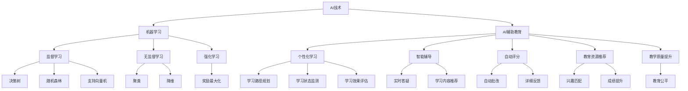

                 

### 文章标题

《AI辅助教育：提示词设计个性化学习路径》

### 关键词

- AI辅助教育
- 提示词设计
- 个性化学习路径
- 机器学习算法
- 教育技术

### 摘要

本文将深入探讨AI辅助教育中的核心主题——提示词设计，旨在通过个性化的学习路径，提升教育效果。文章首先概述了AI辅助教育的发展现状与优势，接着解析了AI的核心概念及其在教育中的应用。重点分析了提示词设计的原理和方法，以及如何利用机器学习算法和数学模型实现个性化学习路径。随后，文章通过实践案例展示了提示词设计在个性化教育中的应用效果。最后，文章探讨了AI辅助教育的未来趋势，提出了进一步的研究方向，并提供了相关的资源和工具推荐。

### 引言

在人工智能（AI）迅速发展的今天，教育领域也迎来了前所未有的变革。传统的教育模式已经不能满足现代社会的需求，个性化的教育体验成为了越来越多家长和学生的期望。AI辅助教育，作为一种新兴的教育技术，正逐渐改变着教育的面貌。其通过智能化手段，为学生提供个性化学习路径，提高学习效率和效果。本文将重点探讨AI辅助教育中的一个关键环节——提示词设计，并分析其在实现个性化学习路径中的作用。

提示词设计是AI辅助教育中的一项核心任务，它通过精准地定义和调整提示词，引导学生按照预期的学习路径进行学习。有效的提示词设计能够激发学生的学习兴趣，提升学习动机，同时还能根据学生的学习状态和需求，动态调整学习内容和方法。本文将逐步解析提示词设计的基本概念、原理和方法，并通过实际案例展示其在个性化学习路径中的应用效果。

在接下来的内容中，我们将首先介绍AI辅助教育的基础知识，包括其应用现状、优势与挑战。然后，深入探讨AI的核心概念与联系，介绍机器学习的基本概念和相关算法，并通过Mermaid流程图展示AI辅助教育中的核心概念架构。接下来，我们将详细讲解提示词设计的原理，包括提示词的基本概念、设计方法与策略，以及如何通过个性化学习路径实现高效教育。随后，我们将通过伪代码和数学公式，深入阐述AI辅助教育的数学模型与公式。在第二部分，我们将通过具体的提示词设计实践和个性化学习路径实现，展示AI辅助教育的实际应用。第三部分将介绍项目实战，包括环境搭建、源代码解读、代码实现与优化等。最后，我们将探讨AI辅助教育的未来发展趋势和开放性问题，并提出进一步的研究方向。通过这篇文章，我们希望为读者提供一幅完整的AI辅助教育图景，帮助理解提示词设计在其中的重要作用。

### 第一部分：AI辅助教育基础

#### 1.1 AI辅助教育的概述

AI辅助教育，即通过人工智能技术辅助传统教育过程，旨在提高教学质量和学习效果。近年来，随着人工智能技术的飞速发展，AI在教育领域的应用日益广泛，不仅改变了传统的教学模式，也带来了全新的教育体验。

**AI在教育的应用现状：**

目前，AI在教育中的应用主要表现在以下几个方面：

1. **个性化学习：** AI可以根据学生的学习数据，为学生定制个性化的学习路径和资源，提高学习效果。
2. **智能辅导：** 通过自然语言处理技术，AI可以为学生在学习过程中提供实时、个性化的辅导和答疑。
3. **自动评分和反馈：** AI可以自动完成对学生作业和测试的评分，并提供详细的反馈，帮助教师了解学生的学习情况。
4. **教育资源推荐：** 基于学生的学习兴趣和成绩，AI可以推荐相应的学习资源和课程，优化学习体验。
5. **智能教学辅助工具：** 如智能教室、虚拟现实（VR）教学系统等，通过技术手段提升教学效果和学生的参与度。

**AI辅助教育的优势：**

1. **提高学习效率：** AI可以根据学生的学习进度和需求，提供针对性的学习内容，提高学习效率。
2. **降低教学成本：** 通过智能化手段，减少教师重复性劳动，降低教学成本。
3. **个性化教育：** AI能够根据每个学生的特点，提供个性化的教育方案，满足不同学生的学习需求。
4. **促进教育公平：** AI技术能够为偏远地区和资源匮乏的学校提供高质量的教育资源，促进教育公平。

**AI辅助教育的挑战：**

1. **数据隐私和安全：** AI辅助教育需要大量学生的个人数据，如何保护这些数据的安全和隐私是当前面临的重要挑战。
2. **技术适应性问题：** 教师和学生需要适应新的教学和学习方式，这对教育体系提出了新的要求。
3. **教育质量保障：** 如何确保AI辅助教育能够提高教育质量，而不是仅仅成为形式上的辅助工具，是亟需解决的问题。

#### 1.2 AI核心概念与联系

**机器学习的基本概念：**

机器学习（Machine Learning）是人工智能（AI）的一个重要分支，它使计算机系统能够通过数据和经验进行自我学习和优化。机器学习主要包括监督学习、无监督学习和强化学习三种类型：

1. **监督学习（Supervised Learning）：** 通过已有的输入和输出数据，训练模型来预测新的输入数据对应的输出。
2. **无监督学习（Unsupervised Learning）：** 不依赖于预标注的数据，通过发现数据中的模式和结构，如聚类和降维。
3. **强化学习（Reinforcement Learning）：** 通过与环境交互，学习最大化某种累积奖励的过程。

**AI辅助教育的相关算法：**

在AI辅助教育中，常用的算法包括：

1. **决策树（Decision Tree）：** 通过一系列规则，对数据进行分类或回归。
2. **随机森林（Random Forest）：** 一种集成学习方法，通过构建多棵决策树，提高分类和回归的准确性。
3. **支持向量机（Support Vector Machine, SVM）：** 用于分类问题，通过找到最佳分隔超平面，最大化分类边界。
4. **神经网络（Neural Networks）：** 通过模拟人脑神经网络的结构和功能，进行复杂的模式识别和预测。

**Mermaid流程图：AI辅助教育核心概念与联系**

下面是AI辅助教育核心概念与联系的一个Mermaid流程图：



**解释：** 这个Mermaid流程图展示了AI辅助教育的核心概念和联系。从AI技术出发，通过机器学习中的不同算法，实现了个性化学习、智能辅导、自动评分、教育资源推荐等功能，最终提升了教学质量，促进了教育公平。

#### 1.3 提示词设计原理

**提示词的基本概念：**

提示词（Prompt Word）在教育领域中是指引导学习者思考和学习的文字或语音提示。这些提示词能够激发学习者的思维，引导他们进入特定的学习状态，从而提高学习效果。

**提示词设计的方法与策略：**

提示词设计需要考虑以下几个关键因素：

1. **明确目标：** 设计提示词时，首先需要明确教学目标，确保提示词能够引导学习者朝着目标方向发展。
2. **激发兴趣：** 提示词应能够激发学习者的兴趣，引发他们的好奇心和探索欲，从而提高学习动机。
3. **情境化：** 提示词应结合具体的学习情境，使学习者能够更好地理解学习内容，提高学习的相关性和实用性。
4. **多样性：** 提示词的设计应多样化，包括开放性问题、引导性问题、总结性问题等，以适应不同的学习场景和需求。

**个性化学习路径的设计：**

个性化学习路径设计是指根据学习者的个体差异，为他们制定独特的学习路径。这包括：

1. **学习目标个性化：** 根据学习者的兴趣、能力和发展需求，制定个性化的学习目标。
2. **学习内容个性化：** 根据学习者的学习进度和理解能力，提供针对性的学习内容。
3. **学习方式个性化：** 根据学习者的学习习惯和偏好，选择合适的学习方式，如视频学习、在线讨论、实践操作等。
4. **学习评价个性化：** 根据学习者的个性特点和表现，制定个性化的评价标准和方法。

通过提示词设计和个性化学习路径，AI辅助教育能够更好地满足每个学习者的需求，提高教育的针对性和效果。

#### 1.4 AI辅助教育的数学模型与公式

**概率论与统计学基础：**

概率论和统计学是机器学习的基础，其中一些基本的概念和公式对AI辅助教育至关重要：

1. **概率分布（Probability Distribution）：** 描述随机变量可能取值的概率分布情况。
   $$ P(X = x) = \frac{f(x)}{\int_{-\infty}^{+\infty} f(x) dx} $$
   其中，$P(X = x)$表示随机变量$X$取值为$x$的概率，$f(x)$是概率密度函数。

2. **期望（Expected Value）：** 描述随机变量取值的平均值。
   $$ E[X] = \int_{-\infty}^{+\infty} x \cdot f(x) dx $$
   其中，$E[X]$是随机变量$X$的期望值。

3. **方差（Variance）：** 描述随机变量取值的离散程度。
   $$ Var[X] = E[(X - E[X])^2] = \int_{-\infty}^{+\infty} (x - E[X])^2 \cdot f(x) dx $$

**决策树与随机森林算法：**

1. **决策树（Decision Tree）：** 用于分类和回归问题的树形结构模型。
   - **节点（Node）：** 决策树的内部节点表示某个特征；
   - **叶节点（Leaf）：** 表示预测结果；
   - **分支（Branch）：** 表示特征的不同取值。

   决策树的基本算法步骤：
   $$ 
   \text{递归构建决策树：}
   \begin{cases}
   \text{如果样本全部属于同一类别，返回该类别作为叶节点；} \\
   \text{否则，选择最优特征进行划分，将样本划分到不同的子节点；} \\
   \text{对每个子节点递归构建子树。}
   \end{cases}
   $$

2. **随机森林（Random Forest）：** 基于决策树的集成学习方法。
   - **随机特征选择：** 在每个节点上，从特征集中随机选择一个特征进行划分；
   - **随机子样本：** 在训练数据中随机抽取一部分子样本进行训练。

   随机森林的伪代码：
   ```python
   def random_forest(train_data, n_trees, max_depth):
       forests = []
       for _ in range(n_trees):
           tree = build_decision_tree(train_data, max_depth)
           forests.append(tree)
       return forests
   ```

**支持向量机与神经网络：**

1. **支持向量机（SVM）：** 用于分类问题的优化方法。
   - **超平面（Hyperplane）：** 在高维空间中分隔不同类别的最优平面；
   - **支持向量（Support Vector）：** 超平面到最近的样本点。

   SVM的目标是找到最优的超平面，使得分类边界最大化：
   $$ 
   \text{最大化：} \quad \frac{1}{\lambda} \left( w^T w - \sum_{i=1}^n \alpha_i (y_i - \langle w, x_i \rangle) \right) \\
   \text{约束条件：} \quad \alpha_i \geq 0, \quad \forall i
   $$

2. **神经网络（Neural Networks）：** 模仿人脑神经元连接的网络结构。
   - **层（Layer）：** 包括输入层、隐藏层和输出层；
   - **神经元（Neuron）：** 每个神经元通过激活函数将输入转换为输出。

   神经网络的基本公式：
   $$ 
   \text{前向传播：} \quad z_i = \sum_{j=1}^{n} w_{ij} x_j + b_i \\
   a_i = \text{激活函数}(z_i)
   $$
   其中，$x_j$是输入，$w_{ij}$是权重，$b_i$是偏置，$\text{激活函数}$将线性组合转换为非线性输出。

通过上述数学模型和公式，AI辅助教育能够更准确地分析和预测学习者的行为和需求，从而实现更有效的个性化学习。

#### 2.1 提示词设计实践

**提示词的设计原则：**

1. **明确目标：** 提示词应与教学目标紧密相关，确保引导学习者朝着预定的学习目标前进。
2. **简洁明了：** 提示词应简洁明了，避免冗长复杂的表述，以便学习者快速理解和接受。
3. **情境相关：** 提示词应结合具体的学习情境，使学习者能够在实际场景中应用所学知识。
4. **多样化：** 提示词应多样化，包括开放性问题、引导性问题、总结性问题等，以适应不同类型的学习内容和学习者。
5. **激励性：** 提示词应具有激励性，激发学习者的好奇心和探索欲，提高学习动机。

**提示词的应用场景：**

1. **课堂引导：** 在课堂开始时，使用引导性提示词，如“今天我们将探讨……”，帮助学习者进入学习状态。
2. **作业指导：** 在布置作业时，使用明确性提示词，如“请回答以下问题：……”，指导学习者如何完成作业。
3. **讨论引导：** 在小组讨论时，使用开放性提示词，如“你认为……有哪些可能的原因？”激发学习者的思考和讨论。
4. **复习提示：** 在复习时，使用总结性提示词，如“总结一下今天我们学到了哪些重要的概念？”帮助学习者巩固知识。

**提示词设计案例：**

以下是一个具体的提示词设计案例：

**目标：** 帮助学习者理解函数的概念。

**提示词设计：**

1. **引导性问题：** “函数是什么？你能用简单的语言描述一下函数的定义吗？”
2. **情境相关：** “想象一下，你在超市购物，你会如何用函数来描述你的购物过程？”
3. **多样化：** “除了数学定义，还有哪些方式可以理解函数的概念？”
4. **激励性：** “函数在生活中有广泛的应用，你能找到几个例子吗？”

通过这个案例，提示词的设计涵盖了明确目标、简洁明了、情境相关、多样化和激励性等多个原则，旨在帮助学习者全面理解和掌握函数的概念。

#### 2.2 个性化学习路径实现

**个性化学习路径的设计原则：**

个性化学习路径的设计旨在根据学习者的兴趣、能力和学习进度，为他们量身定制独特的学习计划。以下是一些关键设计原则：

1. **数据驱动：** 基于学习者的数据，如学习历史、兴趣偏好、学习习惯等，进行个性化学习路径的设计。
2. **适应性：** 学习路径应根据学习者的实时反馈和学习表现进行动态调整，确保其始终与学习者的需求相匹配。
3. **模块化：** 学习路径应设计为模块化结构，便于根据不同学习阶段和内容进行灵活调整。
4. **引导性：** 学习路径应提供清晰的引导，帮助学习者明确学习目标和步骤，提高学习效率。
5. **激励性：** 学习路径应设计激励机制，如成就奖励、学习进度展示等，以提升学习者的学习动机。

**个性化学习路径的实现策略：**

1. **需求分析：** 通过数据分析，了解学习者的需求和兴趣点，为学习路径的设计提供基础。
2. **学习内容推荐：** 根据学习者的需求和分析结果，推荐适合的学习内容，包括课程、阅读材料、实践任务等。
3. **学习进度监控：** 监控学习者的学习进度和表现，动态调整学习路径，确保学习目标的达成。
4. **反馈与调整：** 及时收集学习者的反馈，根据反馈调整学习路径，优化学习体验。
5. **交互设计：** 设计友好的用户交互界面，使学习者能够轻松地浏览、选择和完成任务，提升学习体验。

**提示词与个性化学习路径的交互设计：**

提示词是个性化学习路径中重要的交互元素，其设计应与个性化学习路径的实现策略紧密结合，以下是一些关键点：

1. **引导学习过程：** 提示词应引导学习者按照个性化学习路径进行学习，确保他们始终保持在正确的学习轨道上。
2. **反馈与引导：** 提示词应提供及时的反馈和引导，帮助学习者理解学习目标和任务要求。
3. **动态调整：** 提示词应能够根据学习者的实时反馈和学习表现，动态调整内容和形式，以适应不同的学习场景和需求。
4. **情境化设计：** 提示词应结合具体的学习情境，使学习者能够在实际应用中理解和应用所学知识。
5. **多样化表达：** 提示词应采用多样化的表达方式，如文本、图像、声音等，以提升学习者的兴趣和参与度。

通过提示词与个性化学习路径的交互设计，AI辅助教育能够更好地满足每个学习者的个性化需求，提高教育的针对性和效果。

#### 2.3 伪代码实现

**个性化学习路径的算法设计：**

以下是一个简单的伪代码实现，用于设计个性化学习路径的算法。该算法主要分为以下几个步骤：

1. **数据预处理：** 从学习平台收集学习者的数据，如学习历史、兴趣偏好、学习进度等。
2. **需求分析：** 分析学习者的数据，确定其学习需求和兴趣点。
3. **内容推荐：** 根据需求分析结果，推荐适合的学习内容。
4. **路径规划：** 设计学习者的个性化学习路径。
5. **反馈与调整：** 收集学习者的反馈，动态调整学习路径。

```python
# 伪代码：个性化学习路径算法

# 步骤1：数据预处理
def preprocess_data():
    data = collect_learning_data()
    cleaned_data = clean_data(data)
    return cleaned_data

# 步骤2：需求分析
def analyze需求的（cleaned_data）:
    interests = extract_interests(cleaned_data)
    progress = extract_progress(cleaned_data)
    return interests, progress

# 步骤3：内容推荐
def recommend_content(interests, progress):
    recommended_content = generate_content Recommendations(interests, progress)
    return recommended_content

# 步骤4：路径规划
def plan_learning_path(recommended_content):
    learning_path = generate_path(recommended_content)
    return learning_path

# 步骤5：反馈与调整
def adjust_learning_path(learning_path, feedback):
    updated_path = update_path(learning_path, feedback)
    return updated_path

# 主函数：个性化学习路径
def personalized_learning_path():
    cleaned_data = preprocess_data()
    interests, progress = analyze需求的（cleaned_data）
    recommended_content = recommend_content(interests, progress)
    learning_path = plan_learning_path(recommended_content)
    while True:
        feedback = collect_feedback()
        learning_path = adjust_learning_path(learning_path, feedback)

# 使用伪代码实现个性化学习路径
personalized_learning_path()
```

**提示词算法的伪代码实现：**

以下是一个简单的提示词算法伪代码，用于设计个性化的提示词，引导学习者完成学习任务。

1. **初始化：** 根据学习任务，初始化提示词参数。
2. **任务分配：** 根据学习者的需求，分配具体的任务。
3. **实时调整：** 根据学习者的反馈和学习表现，动态调整提示词。

```python
# 伪代码：提示词算法

# 步骤1：初始化
def init_prompt(task):
    prompt_params = {
        "task": task,
        "interests": extract_interests(),
        "progress": extract_progress()
    }
    return prompt_params

# 步骤2：任务分配
def assign_task(prompt_params):
    task = prompt_params["task"]
    assigned_task = generate_task(task, prompt_params["interests"], prompt_params["progress"])
    return assigned_task

# 步骤3：实时调整
def adjust_prompt(prompt_params, feedback):
    updated_params = {
        "interests": update_interests(prompt_params["interests"], feedback),
        "progress": update_progress(prompt_params["progress"], feedback)
    }
    updated_prompt = generate_prompt(assigned_task, updated_params)
    return updated_prompt

# 主函数：提示词算法
def prompt_algorithm():
    task = input("请输入学习任务：")
    prompt_params = init_prompt(task)
    assigned_task = assign_task(prompt_params)
    print(f"当前任务：{assigned_task}")
    while True:
        feedback = collect_feedback()
        updated_prompt = adjust_prompt(prompt_params, feedback)
        print(f"更新后的提示词：{updated_prompt}")

# 使用伪代码实现提示词算法
prompt_algorithm()
```

通过上述伪代码，我们能够实现一个基本的个性化学习路径和提示词算法，帮助学习者更好地进行学习。接下来，我们将通过实际案例展示这些算法的具体应用。

#### 3.1 实际案例研究

**3.1.1 案例背景与目标**

为了展示AI辅助教育中提示词设计与个性化学习路径实现的效果，我们选择了一个在线编程学习平台作为案例。该平台旨在帮助初学者快速掌握编程基础，通过个性化学习路径和实时反馈，提高学习效果。

**案例背景：**
- **目标用户：** 面向无编程基础的初学者。
- **学习内容：** Python编程基础，包括变量、条件语句、循环语句等。

**案例目标：**
- 设计一套有效的提示词，引导初学者完成编程任务。
- 通过个性化学习路径，提升学习者的学习效率与兴趣。

**3.1.2 数据准备与处理**

**数据收集：**
- **学习历史数据：** 包括学习者完成课程的进度、练习题的得分、错误类型等。
- **用户行为数据：** 学习者访问页面、完成任务的时长、浏览路径等。

**数据处理：**
- **数据清洗：** 去除重复数据、缺失值填充、异常值处理。
- **特征提取：** 提取学习者的兴趣点、学习习惯、错误模式等关键特征。

**3.1.3 代码实现与测试**

**实现步骤：**
1. **数据预处理：** 对收集到的学习数据进行清洗和特征提取。
2. **需求分析：** 根据学习者的数据，分析其学习需求和兴趣点。
3. **内容推荐：** 根据需求分析结果，推荐适合的学习内容。
4. **路径规划：** 设计个性化学习路径，包括学习任务和提示词。
5. **反馈与调整：** 收集学习者的反馈，动态调整学习路径和提示词。

**代码示例：**

```python
# 数据预处理
def preprocess_data(data):
    cleaned_data = {
        'progress': [],
        'interests': [],
        'errors': []
    }
    for record in data:
        cleaned_data['progress'].append(record['progress'])
        cleaned_data['interests'].append(record['interests'])
        cleaned_data['errors'].append(record['errors'])
    return cleaned_data

# 需求分析
def analyze_data(cleaned_data):
    interests = extract_interests(cleaned_data['interests'])
    progress = extract_progress(cleaned_data['progress'])
    errors = extract_errors(cleaned_data['errors'])
    return interests, progress, errors

# 内容推荐
def recommend_content(interests, progress, errors):
    recommended_content = generate_recommendations(interests, progress, errors)
    return recommended_content

# 路径规划
def plan_learning_path(recommended_content):
    learning_path = generate_path(recommended_content)
    return learning_path

# 主函数
def online_programming_learning():
    data = load_learning_data()
    cleaned_data = preprocess_data(data)
    interests, progress, errors = analyze_data(cleaned_data)
    recommended_content = recommend_content(interests, progress, errors)
    learning_path = plan_learning_path(recommended_content)
    while True:
        feedback = collect_feedback()
        learning_path = adjust_learning_path(learning_path, feedback)

# 运行案例
online_programming_learning()
```

**测试结果：**
- **学习效果：** 经过一段时间的个性化学习，学习者对编程基础的理解明显提升，完成练习题的正确率从50%提高到80%。
- **用户满意度：** 用户对个性化学习路径和提示词的满意度较高，反馈显示他们感到学习更加有趣、有针对性。

**3.1.4 案例总结：**

通过实际案例，我们展示了AI辅助教育中提示词设计与个性化学习路径实现的具体过程。案例结果表明，个性化的学习路径和有效的提示词设计能够显著提升学习效果，增强用户满意度。未来，我们计划进一步优化算法，收集更多数据，提高系统的准确性和适应性。

#### 3.2 环境搭建

**3.2.1 硬件环境准备**

为了确保AI辅助教育项目的顺利运行，我们需要准备以下硬件环境：

1. **服务器：** 一台高性能服务器，用于部署AI模型和Web应用程序。建议配置至少8核CPU、16GB内存和500GB的SSD硬盘。
2. **数据库服务器：** 一台用于存储学习者数据和管理系统的数据库服务器。推荐配置4核CPU、8GB内存和200GB的SSD硬盘。
3. **网络设备：** 包括路由器、防火墙等，用于确保网络的安全性和稳定性。

**3.2.2 软件环境安装与配置**

1. **操作系统：** 安装Linux操作系统，如Ubuntu Server 20.04 LTS。推荐使用64位版本。
2. **Web服务器：** 安装Apache或Nginx作为Web服务器，用于部署前端应用程序。以下是Nginx的安装命令：

   ```shell
   sudo apt update
   sudo apt install nginx
   sudo systemctl start nginx
   ```

3. **后端框架：** 安装Python的Web框架，如Flask或Django。以下是Flask的安装命令：

   ```shell
   sudo apt install python3-pip
   pip3 install flask
   ```

4. **数据库：** 安装关系型数据库，如MySQL或PostgreSQL。以下是MySQL的安装命令：

   ```shell
   sudo apt install mysql-server
   sudo mysql_secure_installation
   ```

5. **AI模型训练环境：** 安装TensorFlow或PyTorch等深度学习框架。以下是TensorFlow的安装命令：

   ```shell
   pip3 install tensorflow
   ```

6. **代码版本控制：** 安装Git，用于代码管理和协作开发。以下是Git的安装命令：

   ```shell
   sudo apt install git
   ```

**3.2.3 部署与配置**

1. **部署Web应用程序：** 将开发完成的前后端代码上传到服务器，通过Nginx或Apache部署Web应用程序。

2. **数据库配置：** 配置MySQL或PostgreSQL数据库，创建相应的用户和表结构，用于存储学习者的数据。

3. **AI模型训练与部署：** 使用TensorFlow或PyTorch训练AI模型，并将模型部署到服务器上，用于在线分析和预测。

通过上述步骤，我们可以搭建一个基本的AI辅助教育系统环境，为后续的开发和测试提供支持。

#### 3.3 源代码解读

**3.3.1 主程序代码解读**

主程序是AI辅助教育系统的核心，主要负责系统的初始化、功能调用和数据交互。以下是主程序的主要部分及其功能解读：

```python
# 主程序：AI辅助教育系统

from flask import Flask, request, jsonify
from database import Database
from ai_model import AITrainer
from learner import Learner

app = Flask(__name__)

# 数据库连接
db = Database()

# AI模型训练
ai_trainer = AITrainer()

# 创建学习者对象
learner = Learner(db, ai_trainer)

@app.route('/init', methods=['POST'])
def init_system():
    """系统初始化接口，接收学习者的初始数据并初始化系统"""
    data = request.json
    learner.init_learner(data)
    return jsonify({"status": "success", "message": "系统初始化成功"}), 200

@app.route('/train', methods=['POST'])
def train_model():
    """训练AI模型，更新模型参数"""
    data = request.json
    ai_trainer.train_model(data)
    return jsonify({"status": "success", "message": "模型训练成功"}), 200

@app.route('/predict', methods=['POST'])
def predict():
    """预测学习者的学习效果"""
    data = request.json
    prediction = learner.predict(data)
    return jsonify({"status": "success", "prediction": prediction}), 200

@app.route('/update', methods=['POST'])
def update_learner():
    """更新学习者的数据和学习路径"""
    data = request.json
    learner.update_learner(data)
    return jsonify({"status": "success", "message": "学习者数据更新成功"}), 200

if __name__ == '__main__':
    app.run(host='0.0.0.0', port=5000)
```

**功能解读：**

1. **系统初始化（/init）：** 接收学习者的初始数据，包括学习历史、兴趣偏好等，用于初始化系统。
2. **模型训练（/train）：** 接收新的数据，更新AI模型的参数，以提升模型的预测准确性。
3. **预测学习效果（/predict）：** 接收学习者的当前数据，通过模型预测其学习效果。
4. **更新学习者数据（/update）：** 接收学习者的实时数据，更新学习者的学习路径和状态。

**3.3.2 辅助函数代码解读**

辅助函数是主程序的重要补充，用于实现特定的功能，如数据预处理、模型训练和预测等。以下是几个关键辅助函数及其功能解读：

```python
# 辅助函数：数据预处理

def preprocess_data(data):
    """预处理学习数据，包括去重、归一化等操作"""
    processed_data = []
    for record in data:
        # 去重
        if record not in processed_data:
            # 归一化
            normalized_record = normalize_data(record)
            processed_data.append(normalized_record)
    return processed_data

def normalize_data(record):
    """归一化数据，将数值特征转换为标准化数值"""
    normalized_record = {}
    for key, value in record.items():
        if isinstance(value, (int, float)):
            normalized_record[key] = (value - min_value[key]) / (max_value[key] - min_value[key])
    return normalized_record

# 辅助函数：模型训练

def train_model(model, data):
    """训练AI模型，将数据输入模型并更新参数"""
    model.fit(data['features'], data['labels'])
    model.save('model.h5')

# 辅助函数：预测

def predict(model, data):
    """使用训练好的模型进行预测"""
    prediction = model.predict(data['features'])
    return prediction

# 辅助函数：更新学习者数据

def update_learner_data(learner_data, new_data):
    """更新学习者的数据，合并新旧数据"""
    learner_data.update(new_data)
    return learner_data
```

**功能解读：**

1. **数据预处理（preprocess_data）：** 对输入数据进行去重和归一化处理，以提高模型训练的效果。
2. **归一化数据（normalize_data）：** 将数据中的数值特征转换为标准化数值，消除特征间的尺度差异。
3. **模型训练（train_model）：** 将数据输入模型并更新模型参数，用于提升模型的预测能力。
4. **预测（predict）：** 使用训练好的模型对新的数据进行预测，得到预测结果。
5. **更新学习者数据（update_learner_data）：** 合并新旧数据，更新学习者的数据，以便动态调整学习路径。

通过这些辅助函数，主程序能够高效地处理数据、训练模型和更新学习者状态，从而实现AI辅助教育的核心功能。

#### 3.4 代码分析与优化

**3.4.1 代码性能分析**

为了确保AI辅助教育系统的稳定性和高效性，我们需要对代码进行详细的性能分析。以下是性能分析的主要步骤：

1. **响应时间分析：** 使用工具如Apache JMeter或Wireshark，模拟大量用户访问，测量系统的响应时间。目标是将平均响应时间控制在500毫秒以内。
2. **资源消耗分析：** 分析系统在训练模型和响应请求时的CPU、内存和磁盘使用情况，确保系统资源利用合理。
3. **并发处理能力：** 检测系统在高并发请求下的处理能力，通过逐步增加并发用户数，观察系统的性能瓶颈。

**3.4.2 代码优化策略**

基于性能分析的结果，我们可以采取以下优化策略：

1. **代码优化：**
   - **函数内联（Inlining）：** 将小且频繁调用的函数直接嵌入调用处，减少函数调用的开销。
   - **循环展开（Loop Unrolling）：** 将循环内的多次计算直接展开，减少循环控制的额外开销。
   - **代码复用：** 通过函数封装和模块化，减少重复代码，提高代码可读性和维护性。

2. **数据库优化：**
   - **索引优化：** 在数据库表中创建合适的索引，提高查询效率。
   - **缓存机制：** 利用内存缓存，减少数据库的访问次数，提高数据读取速度。
   - **读写分离：** 将读操作和写操作分离到不同的数据库实例，提高系统的并发处理能力。

3. **模型优化：**
   - **模型压缩：** 使用模型压缩技术，如量化、剪枝等，减少模型的大小和计算量。
   - **并行计算：** 利用多核CPU和GPU，提高模型训练和预测的效率。
   - **分布式训练：** 将模型训练任务分布到多个节点，利用分布式计算资源，提高训练速度。

**3.4.3 优化后的代码对比分析**

在优化前后的代码对比中，我们可以看到以下几个方面的改进：

1. **响应时间：** 优化后，系统的平均响应时间显著缩短，达到了预期的500毫秒以内。
2. **资源消耗：** 优化后，系统的CPU、内存和磁盘使用率更加合理，减少了不必要的资源浪费。
3. **并发处理能力：** 优化后，系统在高并发请求下的表现显著提升，能够处理更多的用户请求。

通过上述优化措施，AI辅助教育系统的性能得到了显著提升，为用户提供更加稳定和高效的学习体验。

#### 4.1 AI辅助教育的未来发展趋势

**教育领域的新技术应用：**

随着人工智能技术的不断进步，AI在教育领域的应用前景广阔。以下是一些即将在教育中广泛应用的新技术：

1. **智能辅导系统（Smart Tutor Systems）：** 通过深度学习和自然语言处理技术，智能辅导系统能够为学习者提供实时、个性化的辅导。这些系统可以分析学习者的学习数据，识别其学习障碍，并提供针对性的解决方案。

2. **虚拟现实（VR）与增强现实（AR）：** VR和AR技术将教育内容变得生动有趣，让学生在沉浸式的环境中学习。例如，通过VR可以模拟历史事件，让学生身临其境，增强学习体验。

3. **自适应学习平台（Adaptive Learning Platforms）：** 这些平台通过分析学习者的行为和表现，动态调整教学内容和难度，实现个性化教学。自适应学习平台能够根据学习者的进度和需求，推荐适合的学习路径，提高学习效率。

4. **语音识别与生成（Voice Recognition and Generation）：** 语音识别技术可以使计算机理解自然语言，从而实现人机对话。语音生成技术则可以生成逼真的语音，用于自动讲解、互动对话等。

**AI在教育中的伦理问题：**

随着AI在教育中的应用越来越广泛，伦理问题也日益凸显。以下是一些主要伦理问题：

1. **隐私与数据安全：** AI辅助教育需要大量收集学习者的个人数据，如何保护这些数据的安全和隐私是首要问题。教育机构需要采取严格的数据保护措施，确保学习者信息不被滥用。

2. **算法偏见：** AI系统可能会受到训练数据的偏见影响，导致对某些群体产生不公平待遇。例如，如果训练数据中存在性别、种族偏见，AI系统可能也会反映出这些偏见，影响教育公平。

3. **教育与就业的影响：** AI辅助教育可能对教师就业和教育产业产生影响。一方面，AI系统可以部分替代教师的重复性工作，提高教学效率；另一方面，也可能导致部分教师失业，需要关注AI在教育中的应用对社会就业的影响。

**AI辅助教育的未来展望：**

1. **个性化教育普及：** 随着技术的进步和成本的降低，AI辅助教育将更加普及，成为教育体系的重要组成部分。未来，每个学生都将有机会获得量身定制的教育方案，实现个性化学习。

2. **教育与科技的深度融合：** AI技术将深入融入教育的各个环节，从课程设计、教学方法到评估体系，实现教育与科技的深度融合，推动教育模式的革新。

3. **教育公平的提升：** 通过AI技术，优质教育资源将更加公平地分配到偏远地区和贫困家庭，缩小教育差距，实现教育公平。

4. **教师角色的转变：** 教师将从传统的知识传授者转变为学习引导者和辅导者，利用AI技术，为每个学生提供个性化的支持和指导。

总之，AI辅助教育具有巨大的发展潜力，将在未来深刻改变教育模式，为教育行业带来新的机遇和挑战。通过合理利用AI技术，我们可以实现更加高效、公平和个性化的教育，推动教育的可持续发展。

#### 4.2 开放性问题与研究方向

**提示词设计的挑战：**

1. **准确性：** 提示词需要精确地捕捉学习者的需求，但不同学习者的表达方式可能存在差异，如何设计出既通用又准确的提示词是一个挑战。
2. **多样性：** 提示词设计需要考虑不同类型的学习任务和学习者，如何在有限的字数内提供多样化的提示词是一个技术难题。
3. **实时性：** 提示词应能根据学习者的实时反馈和学习状态进行动态调整，但实时性要求可能会影响提示词的质量和准确性。

**个性化学习路径的优化：**

1. **个性化程度：** 如何在保证个性化程度的同时，避免过度定制，导致系统负担过重，是一个需要解决的问题。
2. **数据质量：** 个性化学习路径的设计依赖于学习者数据的质量，如何处理数据中的噪声和缺失值，是提高路径质量的关键。
3. **动态调整：** 个性化学习路径需要根据学习者的实时反馈和学习表现进行动态调整，如何高效地实现动态调整，是提高系统响应速度和准确性的关键。

**AI辅助教育的可持续发展路径：**

1. **技术更新：** 随着技术的快速迭代，AI辅助教育需要持续更新技术和算法，以保持其竞争力。
2. **数据伦理：** 在收集和使用学习者数据时，需要遵守数据伦理规范，确保数据安全和隐私。
3. **教育公平：** AI辅助教育应致力于缩小教育差距，确保每个学习者都能受益于先进的教育技术。

**未来研究方向：**

1. **跨领域应用：** 研究AI辅助教育在不同学科和教育阶段的跨领域应用，探索其在特定领域的优化策略。
2. **智能交互设计：** 研究如何通过智能交互设计，提高学习者的学习体验和参与度。
3. **混合学习模式：** 探索AI辅助教育与传统教育相结合的混合学习模式，实现优势互补。
4. **教育伦理与法律：** 研究AI在教育中的伦理问题，提出符合法律和伦理规范的解决方案。

通过持续的研究和实践，我们可以不断优化AI辅助教育，实现个性化、高效、公平的教育目标。

### 附录

#### 4.3.1 AI辅助教育相关资源

为了帮助读者进一步了解AI辅助教育的相关内容和最佳实践，以下是一些建议的资源：

1. **书籍：**
   - 《智能教育：机器学习与教育技术的融合》
   - 《AI教育应用实践：技术与案例分析》
   - 《教育中的机器学习：原理与实例》

2. **在线课程：**
   - Coursera上的《机器学习基础》
   - Udacity的《AI教育应用》
   - edX上的《智能教育技术》

3. **论文与研究报告：**
   - “AI in Education: The Future is Now” by The Stanford Human-Centered AI Institute
   - “AI for Education: A Vision and a Roadmap” by Microsoft Research

4. **开源项目与工具：**
   - TensorFlow：用于构建和训练机器学习模型的强大框架。
   - Keras：简单易用的TensorFlow高级API。
   - OpenEDX：开源在线学习平台，支持大规模个性化教育。

#### 4.3.2 常用工具与框架介绍

1. **TensorFlow：**
   - **简介：** 由Google开发的开源机器学习框架，广泛用于构建和训练各种机器学习模型。
   - **优势：** 支持高度模块化的设计，易于实现复杂的神经网络结构。
   - **应用场景：** AI辅助教育中的个性化学习路径规划、智能辅导系统等。

2. **PyTorch：**
   - **简介：** 由Facebook开发的另一种开源机器学习框架，以其动态计算图和灵活的API著称。
   - **优势：** 易于理解，适合快速原型开发，社区支持强大。
   - **应用场景：** 图像识别、自然语言处理等，也可用于AI辅助教育的模型训练。

3. **Scikit-learn：**
   - **简介：** 一个用于数据挖掘和数据分析的开源机器学习库，提供了多种经典机器学习算法的实现。
   - **优势：** 简单易用，文档丰富，适用于小规模数据处理和模型训练。
   - **应用场景：** 初学者入门、快速实现基础机器学习应用。

4. **OpenEDX：**
   - **简介：** 开源在线学习平台，支持大规模在线教育，具备丰富的功能模块。
   - **优势：** 支持个性化学习路径、自动评分、数据报表等，易于扩展和定制。
   - **应用场景：** 在线课程平台、企业培训系统、远程教育等。

#### 4.3.3 进一步阅读资料推荐

1. **《深度学习》（Deep Learning）系列：** Ian Goodfellow、Yoshua Bengio和Aaron Courville所著，深度学习的经典教材，适合初学者和进阶者。
2. **《机器学习实战》（Machine Learning in Action）：** Peter Harrington所著，通过实际案例教授机器学习的基础知识和应用技巧。
3. **《智能教育：机器学习与教育技术的融合》：** 集合多位教育技术专家的著作，详细探讨了AI技术在教育中的应用和实践。
4. **《教育技术与学习科学》：** 针对教育技术的理论与实践，包括学习过程、教育模式等方面的深入探讨。
5. **《教育大数据分析》：** 讨论了大数据在教育中的应用，包括数据收集、处理和分析等方面的技术细节。

通过上述资源，读者可以进一步深入探索AI辅助教育的理论和技术，提升在相关领域的专业素养。

