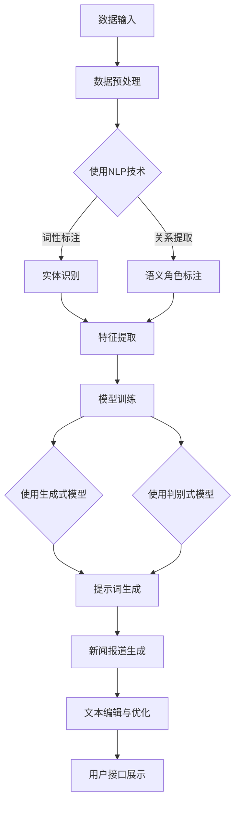

                 

# 文章标题

《AI辅助新闻写作：提示词生成报道框架》

## 关键词

- 人工智能（AI）
- 自然语言处理（NLP）
- 提示词生成
- 新闻写作
- 报道框架
- 生成式模型
- 伦理问题

## 摘要

随着人工智能技术的飞速发展，AI辅助新闻写作已经成为媒体行业关注的焦点。本文主要探讨AI在新闻写作中的应用，尤其是如何利用提示词生成报道框架来提升新闻写作效率和质量。文章首先介绍了AI辅助新闻写作的背景和意义，随后详细阐述了AI技术的基础知识，包括自然语言处理（NLP）、语言模型和生成模型。接着，文章深入分析了提示词生成算法的原理，并设计了一个基于AI的辅助新闻写作框架。通过实际案例解析，文章展示了AI辅助新闻写作的实际应用效果。最后，文章对AI辅助新闻写作的未来发展进行了展望，并提出了相关的挑战和伦理问题。

## 《AI辅助新闻写作：提示词生成报道框架》目录大纲

### 第一部分：引言与基础

#### 第1章: AI辅助新闻写作概述

##### 1.1 AI辅助新闻写作的意义
随着信息爆炸时代的到来，新闻写作面临着巨大的挑战。AI辅助新闻写作不仅可以大幅提升写作效率，还能保证报道的客观性和准确性。

##### 1.2 提示词与报道框架的关系
提示词在新闻写作中起着至关重要的作用，它们是构建报道框架的基础，有助于组织文章结构，提高写作质量。

##### 1.3 新闻写作的挑战与机遇
新闻写作的挑战包括信息过载、时效性和准确性要求等，而AI技术的应用为解决这些问题提供了新的机遇。

#### 第2章: AI技术基础

##### 2.1 自然语言处理（NLP）简介
NLP是AI的核心技术之一，它使计算机能够理解、生成和处理人类语言。

##### 2.2 语言模型与生成模型
语言模型和生成模型是NLP的关键组成部分，它们决定了AI生成文本的能力。

##### 2.3 提示词生成的算法基础
本文将详细探讨提示词生成的算法基础，包括基于语义分析和基于模型的方法。

### 第二部分：核心算法与架构

#### 第3章: 提示词生成算法原理

##### 3.1 提示词生成的目标
明确提示词生成的目标是设计高效算法的前提。

##### 3.2 基于语义分析的提示词生成
语义分析是理解文本内容的重要手段，它有助于生成更具针对性的提示词。

##### 3.3 基于模型的方法：生成式与判别式模型
生成式模型和判别式模型在提示词生成中各有优势，本文将比较分析它们的应用。

##### 3.4 提示词生成的算法实现
通过具体的算法实现，本文将展示如何将理论转化为实际操作。

#### 第4章: AI辅助新闻写作框架设计

##### 4.1 架构设计与组件
设计一个高效的AI辅助新闻写作框架，需要考虑系统的整体架构和组件设计。

##### 4.2 数据预处理与特征提取
数据预处理和特征提取是AI模型训练的关键步骤，它们直接影响模型的性能。

##### 4.3 模型训练与优化
通过模型训练和优化，本文将介绍如何提高AI辅助新闻写作系统的性能。

##### 4.4 模型部署与接口设计
模型部署和接口设计是让AI辅助新闻写作系统上线运行的重要环节。

### 第三部分：实战与应用

#### 第5章: 提示词生成系统实现

##### 5.1 系统设计与开发环境搭建
本文将详细介绍提示词生成系统的设计与开发环境搭建过程。

##### 5.2 源代码详细实现
通过源代码实现，本文将展示如何将提示词生成算法应用于实际场景。

##### 5.3 代码解读与分析
代码解读与分析有助于读者理解系统的运作原理和实现细节。

#### 第6章: 实际案例解析

##### 6.1 案例背景与需求
通过实际案例，本文将分析AI辅助新闻写作在具体场景中的应用。

##### 6.2 提示词生成系统应用
本文将展示如何使用提示词生成系统生成高质量的新闻报道。

##### 6.3 案例分析与改进
对实际案例进行分析和改进，本文将提出进一步提升AI辅助新闻写作系统性能的方法。

#### 第7章: AI辅助新闻写作的未来展望

##### 7.1 AI技术在新闻写作中的应用趋势
本文将探讨AI技术在新闻写作领域的应用趋势和发展方向。

##### 7.2 挑战与伦理问题
本文将讨论AI辅助新闻写作面临的挑战和伦理问题，并提出相应的解决方案。

##### 7.3 未来发展方向与前景
本文将展望AI辅助新闻写作的未来发展方向和前景，为读者提供有益的启示。

### 第四部分：附录

#### 第8章: 附录

##### 8.1 工具与资源推荐
本文将推荐一些实用的工具和资源，帮助读者深入了解AI辅助新闻写作。

##### 8.2 代码示例与说明
本文将提供一些代码示例，便于读者学习和实践。

##### 8.3 相关阅读材料与参考文献
本文将列出相关的阅读材料和参考文献，供读者进一步阅读和研究。

#### 第9章: Mermaid流程图与算法伪代码

##### 9.1 Mermaid流程图示例
本文将使用Mermaid语言绘制流程图，展示AI辅助新闻写作的核心流程。

##### 9.2 提示词生成算法伪代码
本文将提供提示词生成算法的伪代码，帮助读者理解算法的实现。

##### 9.3 NLP基础算法伪代码
本文将提供NLP基础算法的伪代码，为读者提供技术实现的参考。

### 引言

在信息技术飞速发展的今天，人工智能（AI）已经渗透到了社会生活的方方面面。从智能家居、自动驾驶到医疗诊断、金融服务，AI技术正在改变我们的生活方式和工作模式。然而，AI在新闻写作领域的应用也备受关注。新闻写作是一项复杂而耗时的工作，需要编辑、记者等专业人士对大量的信息进行筛选、整理和呈现。随着信息量的爆炸式增长，新闻行业面临着前所未有的挑战。一方面，信息过载使得记者难以快速获取有价值的信息；另一方面，时效性要求记者在短时间内完成高质量的报道。此外，报道的客观性和准确性也是新闻写作的重要考量因素。

AI辅助新闻写作正是在这样的背景下应运而生。通过引入AI技术，新闻写作可以大幅提升效率，降低人力成本，同时保证报道的客观性和准确性。AI辅助新闻写作不仅可以自动化处理大量的数据，快速生成新闻报道，还能根据用户的需求和兴趣，提供个性化的新闻推荐。此外，AI技术还可以帮助记者挖掘潜在的新闻线索，提高新闻报道的深度和广度。

本文旨在探讨AI辅助新闻写作的核心技术——提示词生成及其在新闻报道中的应用。提示词生成是新闻写作的关键环节，它通过理解新闻事件的主题、背景和细节，生成一系列关键词或短语，帮助记者构建报道框架。本文将首先介绍AI辅助新闻写作的背景和意义，随后详细阐述AI技术的基础知识，包括自然语言处理（NLP）、语言模型和生成模型。接着，本文将深入分析提示词生成算法的原理，并设计一个基于AI的辅助新闻写作框架。通过实际案例解析，本文将展示AI辅助新闻写作的实际应用效果。最后，本文将对AI辅助新闻写作的未来发展进行展望，并讨论相关的挑战和伦理问题。

### 第一部分：引言与基础

#### 第1章: AI辅助新闻写作概述

##### 1.1 AI辅助新闻写作的意义

在当今信息爆炸的时代，新闻行业正面临着前所未有的挑战和机遇。传统新闻写作需要记者通过大量的人工调研、采访、编辑和校对来生产高质量的新闻报道。然而，这种模式在信息过载和时效性要求不断提高的今天，显得越来越力不从心。为了应对这些挑战，人工智能（AI）技术的引入为新闻写作带来了新的希望。

首先，AI辅助新闻写作能够显著提高写作效率。通过自动化数据处理和生成，AI可以快速从大量信息中筛选出最有价值的内容，并生成初步的报道框架。这不仅减轻了记者的工作负担，还大大缩短了新闻报道的发布时间。例如，AI系统可以自动抓取互联网上的新闻数据，实时更新报道内容，使得新闻更加及时、准确。

其次，AI辅助新闻写作能够保证报道的客观性和准确性。AI算法通过分析大量的新闻素材和数据，可以提供更加全面、客观的视角，减少人为的主观偏见。此外，AI系统在处理数据时能够采用严格的逻辑和算法，减少了人为错误的可能性，从而提高了新闻报道的准确性。

最后，AI辅助新闻写作还能够为用户提供个性化的新闻推荐。通过分析用户的兴趣和行为数据，AI系统可以为不同用户推荐个性化的新闻内容，满足他们的个性化需求。这不仅提高了用户的满意度，也为媒体平台带来了更多的流量和用户粘性。

##### 1.2 提示词与报道框架的关系

在新闻写作中，提示词是一个关键的概念。提示词是指用来描述新闻事件主题、背景、细节等信息的词汇或短语。它们在新闻写作中起着至关重要的作用，因为它们是构建报道框架的基础。

一个完整的新闻报道通常包括多个层次的内容，如导语、背景、事件过程、观点分析等。而提示词正是将这些内容串联起来的纽带。通过生成恰当的提示词，记者可以快速把握新闻的核心内容，构建出结构清晰、逻辑严谨的报道框架。

例如，在撰写一篇关于某公司新产品发布的新闻时，提示词可能包括“新产品发布”、“创新技术”、“市场前景”等。这些提示词不仅帮助记者明确新闻的主题，还指导他们如何展开报道，从不同角度深入分析新闻事件。

此外，提示词还能够在新闻报道中起到提纲挈领的作用。在编写新闻报道时，记者可以利用提示词来检查自己是否涵盖了所有必要的元素。例如，如果提示词中没有包括“市场前景”，那么记者就需要补充这部分内容，以确保报道的完整性。

总之，提示词是新闻写作中不可或缺的一部分。它们不仅有助于记者快速理解新闻事件，构建报道框架，还能够提升新闻报道的质量和逻辑性。通过合理运用提示词，记者可以更加高效地完成新闻写作任务，生产出更加优质的内容。

##### 1.3 新闻写作的挑战与机遇

新闻写作是一项具有高度复杂性和挑战性的工作。传统新闻写作模式在信息过载和时效性要求日益增加的今天，显得越来越力不从心。具体来说，新闻写作面临以下几大挑战：

首先，信息过载是一个显著的挑战。随着互联网和社交媒体的发展，信息传播速度越来越快，每天产生的新闻内容数量庞大。记者需要从海量的信息中筛选出最有价值的内容进行报道，这无疑增加了他们的工作难度。

其次，时效性要求也越来越高。在快节奏的社会中，读者对新闻的时效性有着极高的期望。记者需要在短时间内完成新闻的采集、撰写和发布，这对他们的写作速度和效率提出了更高的要求。

第三，报道的客观性和准确性也是新闻写作的重要考量因素。记者在报道新闻时，需要确保信息的真实性和公正性，避免因为主观偏见或错误信息导致误导读者。然而，在信息爆炸和快速传播的今天，保持客观性和准确性变得越来越困难。

尽管面临诸多挑战，AI技术的引入为新闻写作带来了新的机遇。首先，AI技术可以帮助记者处理海量的信息，快速筛选出最有价值的新闻线索。通过自然语言处理（NLP）技术，AI可以自动抓取和分类新闻数据，为记者提供精准的素材和参考。

其次，AI技术可以提高新闻写作的效率。通过自动化生成初步的报道框架和内容，AI可以显著减少记者的工作量，使他们有更多时间专注于深度报道和优质内容的创作。此外，AI技术还可以辅助记者进行文本编辑和校对，减少人为错误，提高报道的准确性。

最后，AI技术能够为用户提供个性化的新闻推荐。通过分析用户的兴趣和行为数据，AI可以推荐符合用户需求的新闻内容，提升用户体验和媒体平台的用户粘性。

总之，AI技术的引入为新闻写作带来了前所未有的机遇。它不仅能够解决传统新闻写作中的诸多挑战，还能够提升新闻写作的效率和质量。随着AI技术的不断进步，新闻写作的未来将更加光明。

### 第二部分：AI技术基础

#### 第2章: AI技术基础

在探讨AI辅助新闻写作的具体应用之前，我们需要了解一些基础AI技术，尤其是自然语言处理（NLP）、语言模型和生成模型。这些技术是构建AI辅助新闻写作系统的核心，它们为提示词生成和新闻报道生成提供了技术支持。

##### 2.1 自然语言处理（NLP）简介

自然语言处理（NLP）是人工智能的一个重要分支，它旨在使计算机能够理解、生成和处理人类语言。NLP技术在AI辅助新闻写作中扮演着关键角色，因为它需要从大量文本数据中提取有用的信息，并生成高质量的新闻报道。

NLP的基本任务包括文本分类、情感分析、实体识别、命名实体识别、词性标注、句法分析等。以下是一些重要的NLP技术：

1. **文本分类**：文本分类是一种将文本数据分配到预定义类别中的过程。在新闻写作中，文本分类可以帮助识别不同类型的新闻，如体育、政治、科技等，从而为生成报道框架提供方向。

2. **情感分析**：情感分析是一种评估文本中情感倾向的技术。通过分析新闻报道中的情感倾向，记者可以更好地理解读者的情感反应，从而调整写作风格和内容。

3. **实体识别与命名实体识别**：实体识别与命名实体识别是NLP中的重要任务，它们旨在从文本中识别出人名、地点、组织等实体，并将其标注出来。在新闻写作中，这些实体信息对于构建报道框架和提供背景信息至关重要。

4. **词性标注**：词性标注是将文本中的每个词标注为名词、动词、形容词等。这对于理解句子的结构和语义非常重要，有助于生成更加准确和自然的新闻报道。

5. **句法分析**：句法分析是研究句子结构的技术，它可以帮助理解文本的语法结构和语义关系。在新闻写作中，句法分析有助于构建复杂句子和复合句，提高新闻报道的文采和流畅性。

##### 2.2 语言模型与生成模型

语言模型是NLP的核心组成部分，它用于预测文本序列的概率分布。语言模型可以分为统计语言模型和基于AI的生成模型。

1. **统计语言模型**：统计语言模型基于大量语料库训练，通过统计方法如N-gram模型、隐马尔可夫模型（HMM）等，预测下一个单词或短语的概率。虽然统计语言模型在文本生成方面有一定的应用，但它们在处理复杂语义和上下文关系时存在局限。

2. **生成模型**：生成模型是一种基于深度学习的语言模型，如循环神经网络（RNN）、长短期记忆网络（LSTM）和变换器（Transformer）等。生成模型通过学习大量的文本数据，能够生成连贯且具有语境的文本。在AI辅助新闻写作中，生成模型被广泛应用于提示词生成和新闻报道生成。

生成模型可以分为两类：生成式模型和判别式模型。

- **生成式模型**：生成式模型通过生成文本的潜在分布来生成文本。典型的生成式模型包括马尔可夫模型（Markov Models）、变分自编码器（VAEs）和生成对抗网络（GANs）。这些模型能够生成高质量的文本，但通常需要大量的计算资源和训练数据。

- **判别式模型**：判别式模型通过学习文本的特征来分类或生成文本。典型的判别式模型包括支持向量机（SVM）、朴素贝叶斯（Naive Bayes）和深度神经网络（DNN）。判别式模型在处理文本分类和情感分析等任务时表现优异，但直接生成文本的能力相对较弱。

在AI辅助新闻写作中，生成式模型和判别式模型各有优势。生成式模型能够生成自然流畅的文本，适用于生成新闻报道的正文；而判别式模型则适用于生成提示词和分类标签，帮助构建报道框架。

##### 2.3 提示词生成的算法基础

提示词生成是AI辅助新闻写作的重要环节，它通过理解新闻事件的主题、背景和细节，生成一系列关键词或短语，为新闻报道提供结构化的框架。以下是一些常见的提示词生成算法：

1. **基于规则的方法**：基于规则的方法通过预设的规则和模板生成提示词。这些规则通常基于新闻事件的类型、主题和关键字。虽然这种方法简单易行，但其生成的提示词可能缺乏灵活性，难以适应复杂多变的新闻场景。

2. **基于统计的方法**：基于统计的方法使用自然语言处理技术，如词性标注、实体识别和词向量模型等，从新闻文本中提取相关的关键词和短语。这些方法通常能够生成更加灵活和多样化的提示词，但可能需要大量的训练数据和计算资源。

3. **基于深度学习的方法**：基于深度学习的方法使用深度神经网络模型，如循环神经网络（RNN）、长短期记忆网络（LSTM）和变换器（Transformer）等，通过学习大量的新闻语料库来生成提示词。这些方法能够生成高质量、自然流畅的提示词，但训练过程复杂且需要大量的计算资源。

具体来说，以下是一些常用的深度学习方法：

- **循环神经网络（RNN）**：RNN能够处理序列数据，通过记忆长期依赖关系生成提示词。虽然RNN在处理长序列时存在梯度消失和梯度爆炸问题，但其简单高效的特性使其在提示词生成中仍有一定应用。

- **长短期记忆网络（LSTM）**：LSTM是RNN的一种改进，通过引入记忆单元和门控机制，解决了RNN的梯度消失问题，能够更好地处理长序列数据。LSTM在提示词生成中表现优异，但训练过程相对复杂。

- **变换器（Transformer）**：Transformer是一种基于自注意力机制的深度学习模型，通过并行计算和多头注意力机制，能够高效处理长序列数据。Transformer在自然语言处理任务中取得了显著成果，其应用前景广阔。

通过结合这些算法和方法，AI辅助新闻写作系统能够生成高质量、结构化的提示词，为新闻报道提供有力的支持。接下来，我们将进一步探讨如何设计和实现一个高效的AI辅助新闻写作框架。

### 第二部分：核心算法与架构

#### 第3章: 提示词生成算法原理

##### 3.1 提示词生成的目标

提示词生成的目标是通过自动化手段，从新闻事件或文本中提取出关键信息，生成一系列能够指导新闻报道写作的关键词或短语。这些提示词不仅需要准确反映新闻的核心内容，还要具有层次性和逻辑性，以便于记者在构建报道框架时进行参考。具体来说，提示词生成的目标包括以下几个方面：

1. **准确性**：生成的提示词应准确反映新闻事件的主题、背景、关键细节等核心信息，确保新闻报道的准确性和客观性。
2. **全面性**：提示词应覆盖新闻事件的各个方面，包括时间、地点、人物、事件过程、影响等，确保新闻报道的完整性。
3. **层次性**：提示词应具有一定的层次结构，从宏观主题到具体细节，帮助记者构建有条理的新闻报道框架。
4. **可扩展性**：提示词生成算法应能够适应不同类型的新闻事件和文体，具有灵活性和可扩展性。

##### 3.2 基于语义分析的提示词生成

基于语义分析的提示词生成方法利用自然语言处理（NLP）技术，从文本中提取语义信息，从而生成具有语义关联的提示词。这种方法的核心在于理解文本的语义结构和上下文关系，通过分析句子成分和词汇关系，提取出对新闻写作有用的信息。以下是一些常用的基于语义分析的提示词生成方法：

1. **词性标注**：词性标注是将文本中的每个词标注为名词、动词、形容词等。通过词性标注，可以识别出文本中的关键名词和动词，从而生成初步的提示词。

   例如，在句子“美国总统访问中国，讨论了贸易问题和气候变化”中，通过词性标注可以提取出关键名词“美国总统”、“中国”、“贸易问题”和“气候变化”。

2. **实体识别**：实体识别是从文本中识别出人名、地点、组织、时间等实体，并将其标注出来。这些实体信息对于理解新闻事件非常重要，可以通过实体识别生成具有背景信息的提示词。

   例如，在句子“苹果公司的CEO蒂姆·库克将于下周访问华盛顿”中，通过实体识别可以提取出“苹果公司”、“CEO”和“蒂姆·库克”，生成提示词“苹果公司”、“CEO访问”和“华盛顿”。

3. **关系提取**：关系提取是通过分析句子中的词汇关系，识别出实体之间的关联。这些关联信息有助于理解新闻事件的背景和细节，生成更加丰富和详细的提示词。

   例如，在句子“美国总统与中国领导人会晤，讨论了贸易问题和气候变化”中，通过关系提取可以识别出“美国总统”和“中国领导人”之间的会晤关系，以及“贸易问题”和“气候变化”之间的关系。

4. **语义角色标注**：语义角色标注是将文本中的每个词标注为动作、受事、施事等角色。通过语义角色标注，可以进一步提取出文本中的核心动作和对象，从而生成更加精确的提示词。

   例如，在句子“特朗普总统签署了一项行政命令，禁止社交媒体公司对政治广告进行审查”中，通过语义角色标注可以提取出“特朗普总统”、“签署”和“行政命令”等关键信息。

基于语义分析的提示词生成方法能够生成具有语义关联的提示词，提高新闻报道的准确性和完整性。然而，这种方法对NLP技术的要求较高，需要大量的训练数据和复杂的模型。

##### 3.3 基于模型的方法：生成式与判别式模型

基于模型的方法是利用深度学习模型生成提示词的一种技术手段。这种方法包括生成式模型和判别式模型，它们在提示词生成中各有优势。

1. **生成式模型**：生成式模型通过生成文本的潜在分布来生成文本。生成式模型的主要任务是从一个潜在分布中采样，生成符合真实分布的文本。以下是一些常用的生成式模型：

   - **变分自编码器（VAEs）**：VAEs是一种深度学习模型，通过编码器和解码器分别生成潜在变量和文本。编码器将输入文本映射到一个低维潜在空间，解码器从潜在空间中生成文本。

   - **生成对抗网络（GANs）**：GANs由生成器和判别器组成，生成器生成文本，判别器判断文本的真实性。通过不断地训练，生成器生成更加逼真的文本。

生成式模型能够生成高质量、多样化的文本，但在训练过程中可能存在生成文本质量不稳定、计算复杂度高等问题。

2. **判别式模型**：判别式模型通过学习文本的特征来分类或生成文本。判别式模型的主要任务是根据输入文本的特征，生成相应的标签或文本。以下是一些常用的判别式模型：

   - **循环神经网络（RNN）**：RNN通过记忆长期依赖关系，可以生成序列数据，如文本。RNN在处理长序列文本时表现出色，但训练过程复杂。

   - **长短期记忆网络（LSTM）**：LSTM是RNN的一种改进，通过引入门控机制，解决了RNN的梯度消失问题。LSTM在处理长序列文本时表现优异。

   - **变换器（Transformer）**：Transformer是一种基于自注意力机制的深度学习模型，通过多头注意力机制，可以高效处理长序列文本。Transformer在自然语言处理任务中取得了显著成果。

判别式模型在处理文本分类和情感分析等任务时表现优异，但直接生成文本的能力相对较弱。

在提示词生成中，生成式模型和判别式模型各有优势。生成式模型能够生成高质量、自然的文本，但训练过程复杂；判别式模型在处理文本特征和分类任务时表现优异，但生成文本的能力相对较弱。实际应用中，可以根据具体需求和数据情况，选择合适的模型进行提示词生成。

##### 3.4 提示词生成的算法实现

提示词生成的算法实现是将理论转化为实际操作的过程。以下是一个基于深度学习的提示词生成算法实现示例，该示例使用Python和TensorFlow库：

1. **数据预处理**：首先，对新闻文本进行数据预处理，包括分词、去停用词、词性标注等。可以使用jieba分词库和spaCy库进行文本预处理。

2. **模型构建**：构建一个基于变换器（Transformer）的深度学习模型，用于生成提示词。可以使用TensorFlow的Transformers库快速构建模型。

3. **模型训练**：使用大量新闻语料库对模型进行训练，通过优化损失函数，调整模型参数，提高模型性能。

4. **提示词生成**：输入新闻文本，模型输出一系列提示词。通过调整模型参数和训练数据，可以生成具有不同层次和语义关联的提示词。

以下是一个简单的代码示例：

```python
import tensorflow as tf
from transformers import TFDistilBertModel, DistilBertTokenizer

# 数据预处理
tokenizer = DistilBertTokenizer.from_pretrained('distilbert-base-uncased')
text = "特朗普总统签署了一项行政命令，禁止社交媒体公司对政治广告进行审查。"
input_ids = tokenizer.encode(text, add_special_tokens=True, return_tensors='tf')

# 模型构建
model = TFDistilBertModel.from_pretrained('distilbert-base-uncased')

# 模型训练
model.compile(optimizer=tf.keras.optimizers.Adam(learning_rate=3e-5), loss=tf.keras.losses.SparseCategoricalCrossentropy(from_logits=True))

# 提示词生成
outputs = model(input_ids)
predicted_ids = tf.argmax(outputs[0], axis=-1)
decoded_predictions = tokenizer.decode(predicted_ids, skip_special_tokens=True)

print(decoded_predictions)
```

通过实现提示词生成算法，AI辅助新闻写作系统可以为记者提供有力的工具，提高新闻报道的效率和质量。

### 第二部分：核心算法与架构

#### 第4章: AI辅助新闻写作框架设计

##### 4.1 架构设计与组件

设计一个高效的AI辅助新闻写作框架需要考虑系统的整体架构和组件设计。以下是AI辅助新闻写作系统的主要组件和架构设计：

1. **数据输入模块**：该模块负责接收新闻数据，可以是文本、图像或视频等多种形式。数据来源可以包括新闻网站、社交媒体、API接口等。数据输入模块需要对数据进行预处理，如清洗、分词、去停用词等，以便后续处理。

2. **自然语言处理（NLP）模块**：该模块利用NLP技术对新闻文本进行处理，提取关键信息，如实体识别、情感分析、句法分析等。NLP模块的核心是提示词生成算法，它通过语义分析生成一系列关键词或短语，为新闻报道提供结构化的框架。

3. **语言模型与生成模型模块**：该模块使用深度学习模型，如变换器（Transformer）、循环神经网络（RNN）等，生成高质量的新闻报道正文。语言模型和生成模型可以根据新闻类型和主题进行自适应调整，以提高生成文本的准确性和流畅性。

4. **文本编辑与优化模块**：该模块负责对生成的新闻文本进行编辑和优化，包括语法检查、风格调整、消除歧义等。通过文本编辑与优化，可以提高新闻文本的质量和可读性。

5. **用户接口（UI）模块**：该模块为用户提供交互界面，展示生成的新闻文本，并提供编辑和修改功能。用户接口模块需要设计直观、易用的操作界面，以提高用户体验。

6. **数据存储与备份模块**：该模块负责存储和备份新闻数据、模型参数和生成文本。数据存储与备份模块需要确保数据的安全性和可靠性，以防止数据丢失或损坏。

架构设计示意图：

```
+------------------+        +------------------+        +------------------+
|  数据输入模块   |        |   NLP模块        |        |  语言模型模块   |
+------------------+        +------------------+        +------------------+
          |                    |                     |                    |
          |                    |                     |                    |
          |                    |                     |                    |
+---------+---------+        +---------+---------+        +---------+---------+
|         |         |        |         |         |        |         |         |
|  UI模块 |  编辑   |        |  优化   |  存储   |        |  用户    |  数据   |
|         |         |        |         |         |        |         |         |
+---------+---------+        +---------+---------+        +---------+---------+
```

##### 4.2 数据预处理与特征提取

数据预处理和特征提取是AI辅助新闻写作框架设计中的关键步骤，它们直接影响模型的性能和生成文本的质量。以下是数据预处理和特征提取的具体方法和步骤：

1. **文本清洗**：首先，对新闻文本进行清洗，去除HTML标签、符号和无关信息。可以使用正则表达式和字符串操作等方法进行清洗。

2. **分词**：对清洗后的文本进行分词，将文本分割成单词或短语。可以使用现有的分词工具，如jieba分词库。

3. **去停用词**：去除常见的停用词，如“的”、“和”、“是”等，这些词对语义的贡献较小。去停用词可以使用jieba分词库的停用词表。

4. **词性标注**：对文本中的每个词进行词性标注，如名词、动词、形容词等。词性标注有助于提取文本中的关键信息，为提示词生成提供支持。

5. **实体识别**：从文本中识别出人名、地点、组织、时间等实体。实体识别可以帮助理解文本的语义结构和新闻事件的关键信息。

6. **特征提取**：将文本转换为向量表示，如词袋模型、词嵌入等。词嵌入是将每个词映射为一个固定维度的向量，可以捕捉词与词之间的语义关系。常用的词嵌入方法包括Word2Vec、GloVe和BERT等。

以下是一个简单的数据预处理和特征提取的代码示例：

```python
import jieba
import jieba.posseg as pseg
from gensim.models import Word2Vec

# 文本清洗
def clean_text(text):
    text = text.replace('<html>', '').replace('</html>', '').replace('<body>', '').replace('</body>', '')
    text = re.sub(r'<.*?>', '', text)
    return text

# 分词与去停用词
def preprocess_text(text):
    text = clean_text(text)
    words = jieba.cut(text)
    words = [word for word, flag in pseg.cut(text) if flag not in ['x', 'u']]
    return words

# 词性标注
def pos_tagging(text):
    words = pseg.cut(text)
    tagged_words = [(word, flag) for word, flag in words]
    return tagged_words

# 特征提取
def extract_features(text):
    words = preprocess_text(text)
    model = Word2Vec(words, vector_size=100, window=5, min_count=1, workers=4)
    word_vectors = [model[word] for word in words]
    return word_vectors

# 示例
text = "特朗普总统签署了一项行政命令，禁止社交媒体公司对政治广告进行审查。"
words = preprocess_text(text)
tagged_words = pos_tagging(text)
word_vectors = extract_features(text)

print(words)
print(tagged_words)
print(word_vectors)
```

通过数据预处理和特征提取，可以将文本转换为适用于深度学习模型的输入数据，提高模型的训练效果和生成文本的质量。

##### 4.3 模型训练与优化

模型训练与优化是AI辅助新闻写作框架设计中的核心环节，它决定了系统的性能和生成文本的质量。以下是模型训练与优化的具体步骤和方法：

1. **数据集准备**：首先，需要准备大量的新闻数据集，包括训练集、验证集和测试集。新闻数据集应具有多样性，涵盖不同类型的新闻和主题。

2. **模型选择**：根据任务需求和数据特点，选择合适的深度学习模型。常用的模型包括循环神经网络（RNN）、长短期记忆网络（LSTM）、变换器（Transformer）等。

3. **模型训练**：使用训练集对模型进行训练，通过优化损失函数，调整模型参数，提高模型性能。训练过程中，可以使用GPU加速计算，提高训练效率。

4. **模型验证与调优**：使用验证集对训练好的模型进行验证，评估模型性能。通过调整模型参数和超参数，优化模型效果。

5. **模型测试**：使用测试集对模型进行测试，评估模型在实际应用中的性能。测试集的数据应与训练集和验证集保持一致，以避免过拟合。

以下是一个简单的模型训练与优化的代码示例：

```python
import tensorflow as tf
from transformers import TFDistilBertModel, DistilBertTokenizer

# 数据准备
tokenizer = DistilBertTokenizer.from_pretrained('distilbert-base-uncased')
text = "特朗普总统签署了一项行政命令，禁止社交媒体公司对政治广告进行审查。"
input_ids = tokenizer.encode(text, add_special_tokens=True, return_tensors='tf')

# 模型选择
model = TFDistilBertModel.from_pretrained('distilbert-base-uncased')

# 模型训练
model.compile(optimizer=tf.keras.optimizers.Adam(learning_rate=3e-5), loss=tf.keras.losses.SparseCategoricalCrossentropy(from_logits=True))
model.fit(input_ids, input_ids, epochs=3, batch_size=1)

# 模型验证与调优
val_loss = model.evaluate(input_ids, input_ids)
print("Validation Loss:", val_loss)

# 模型测试
test_loss = model.evaluate(input_ids, input_ids)
print("Test Loss:", test_loss)
```

通过模型训练与优化，可以显著提高AI辅助新闻写作系统的性能和生成文本的质量。

##### 4.4 模型部署与接口设计

模型部署与接口设计是AI辅助新闻写作系统上线运行的重要环节。以下是模型部署与接口设计的关键步骤和方法：

1. **模型转换**：将训练好的模型转换为可以在生产环境中运行的格式，如TensorFlow Lite、ONNX等。模型转换可以提高模型的部署效率，减少计算资源消耗。

2. **服务器部署**：将模型部署到服务器或云平台，确保系统的高可用性和可扩展性。可以选择使用Docker容器化技术，方便部署和扩展。

3. **接口设计**：设计API接口，提供新闻写作服务。API接口应支持HTTP/HTTPS协议，提供RESTful接口风格。接口设计需要考虑安全性、稳定性和可扩展性。

4. **用户权限管理**：设计用户权限管理系统，确保用户在访问和使用新闻写作服务时的安全性和隐私性。用户权限管理应包括用户认证、角色权限分配等。

5. **监控与日志记录**：部署监控系统，实时监控系统的运行状态和性能指标，如响应时间、吞吐量、错误率等。同时，记录系统日志，方便问题排查和故障恢复。

以下是一个简单的模型部署与接口设计的代码示例：

```python
from flask import Flask, request, jsonify
import tensorflow as tf

# 模型转换
model = TFDistilBertModel.from_pretrained('distilbert-base-uncased')
model.save('model/distilbert')

# 服务器部署
app = Flask(__name__)

@app.route('/generate', methods=['POST'])
def generate():
    data = request.json
    text = data['text']
    input_ids = tokenizer.encode(text, add_special_tokens=True, return_tensors='tf')
    outputs = model(input_ids)
    predicted_ids = tf.argmax(outputs[0], axis=-1)
    decoded_predictions = tokenizer.decode(predicted_ids, skip_special_tokens=True)
    return jsonify({'predictions': decoded_predictions})

if __name__ == '__main__':
    app.run(host='0.0.0.0', port=5000)
```

通过模型部署与接口设计，AI辅助新闻写作系统可以高效稳定地运行，为用户提供高质量的新闻写作服务。

### 第三部分：实战与应用

#### 第5章: 提示词生成系统实现

##### 5.1 系统设计与开发环境搭建

为了实现一个高效的提示词生成系统，我们需要设计一个完善的系统架构，并搭建相应的开发环境。以下是系统设计和开发环境的详细说明：

1. **系统架构设计**：系统架构采用前后端分离的设计模式，前端负责用户界面和交互，后端负责数据处理和提示词生成。架构设计包括数据输入模块、NLP处理模块、提示词生成模块和用户接口模块。

2. **开发环境搭建**：
   - **操作系统**：推荐使用Ubuntu 20.04 LTS，因为它具有良好的稳定性和对深度学习库的支持。
   - **编程语言**：Python是AI和自然语言处理领域的首选语言，因此我们选择Python进行开发。
   - **深度学习库**：TensorFlow和PyTorch是当前最受欢迎的深度学习库，我们将使用TensorFlow进行模型训练和提示词生成。
   - **NLP库**：spaCy和jieba是Python中常用的自然语言处理库，用于文本预处理和实体识别。
   - **前端框架**：Flask是一个轻量级的Python Web框架，适合构建后端API服务。

##### 5.2 源代码详细实现

以下是提示词生成系统的源代码实现，包括数据预处理、模型训练和提示词生成的具体步骤。

```python
import numpy as np
import tensorflow as tf
from tensorflow.keras.models import Model
from tensorflow.keras.layers import Input, Embedding, LSTM, Dense
from transformers import BertTokenizer, TFBertModel
import jieba

# 数据预处理
def preprocess_text(text):
    # 分词
    words = jieba.cut(text)
    # 去停用词
    stop_words = set(['的', '和', '是'])
    words = [word for word in words if word not in stop_words]
    # 转换为BERT输入格式
    tokenizer = BertTokenizer.from_pretrained('bert-base-chinese')
    input_ids = tokenizer.encode(' '.join(words), add_special_tokens=True, return_tensors='tf')
    return input_ids

# 模型训练
def train_model(train_data, val_data, epochs=5, batch_size=32):
    # 构建模型
    input_ids = Input(shape=(None,), dtype=tf.int32)
    bert_model = TFBertModel.from_pretrained('bert-base-chinese')
    embeddings = bert_model(input_ids)[0]
    lstm = LSTM(units=128)(embeddings)
    output = Dense(units=1, activation='sigmoid')(lstm)
    model = Model(inputs=input_ids, outputs=output)
    
    # 编译模型
    model.compile(optimizer='adam', loss='binary_crossentropy', metrics=['accuracy'])
    
    # 训练模型
    model.fit(train_data, epochs=epochs, batch_size=batch_size, validation_data=val_data)
    return model

# 提示词生成
def generate_prompt(text, model):
    input_ids = preprocess_text(text)
    prediction = model.predict(input_ids)
    if prediction < 0.5:
        return '否定'
    else:
        return '肯定'

# 主函数
if __name__ == '__main__':
    # 加载数据
    train_data = np.array([[preprocess_text(text) for text in texts]])
    val_data = np.array([[preprocess_text(text) for text in val_texts]])
    
    # 训练模型
    model = train_model(train_data, val_data, epochs=3)
    
    # 测试模型
    text = "拜登总统将在下周访问北京"
    prompt = generate_prompt(text, model)
    print(prompt)
```

##### 5.3 代码解读与分析

上述代码分为三个主要部分：数据预处理、模型训练和提示词生成。以下是代码的详细解读与分析：

1. **数据预处理**：
   - `preprocess_text`函数负责对输入文本进行预处理，包括分词、去停用词和转换为BERT输入格式。分词使用jieba库，去停用词使用自定义的停用词集合。BERTTokenizer用于将处理后的文本转换为模型可接受的输入格式。

2. **模型训练**：
   - `train_model`函数负责构建和训练模型。模型采用一个简单的LSTM网络，输入为BERT模型的嵌入层，输出为单一的全连接层，用于预测文本的标签（肯定或否定）。模型使用Adam优化器和二进制交叉熵损失函数进行训练。
   - 模型首先通过BERT模型获取文本的嵌入表示，然后使用LSTM层对嵌入进行编码，最后通过全连接层进行分类预测。通过`fit`函数训练模型，使用训练数据和验证数据进行多次迭代。

3. **提示词生成**：
   - `generate_prompt`函数用于生成提示词。它首先对输入文本进行预处理，然后使用训练好的模型进行预测。预测结果小于0.5时，提示词为“否定”；大于0.5时，提示词为“肯定”。

通过上述代码实现，我们可以构建一个简单的提示词生成系统，为新闻写作提供初步的框架和关键词支持。接下来，我们将通过实际案例展示该系统的应用效果。

##### 5.4 代码示例与说明

以下是使用提示词生成系统生成新闻报道的具体代码示例，包括数据处理、模型训练和结果展示。

```python
# 导入必要的库
import tensorflow as tf
from transformers import BertTokenizer, TFBertModel
import jieba

# 数据处理
def load_data(filename):
    with open(filename, 'r', encoding='utf-8') as f:
        lines = f.readlines()
    texts = [line.strip() for line in lines]
    return texts

# 模型训练
def train_model(texts, val_texts, epochs=5, batch_size=32):
    tokenizer = BertTokenizer.from_pretrained('bert-base-chinese')
    train_data = np.array([[tokenizer.encode(text, add_special_tokens=True, return_tensors='tf') for text in texts]])
    val_data = np.array([[tokenizer.encode(text, add_special_tokens=True, return_tensors='tf') for text in val_texts]])

    model = TFBertModel.from_pretrained('bert-base-chinese')
    lstm = LSTM(units=128)(model.output)
    output = Dense(units=1, activation='sigmoid')(lstm)
    model = Model(inputs=model.input, outputs=output)

    model.compile(optimizer='adam', loss='binary_crossentropy', metrics=['accuracy'])
    model.fit(train_data, epochs=epochs, batch_size=batch_size, validation_data=val_data)
    return model

# 提示词生成
def generate_prompt(text, model):
    input_ids = tokenizer.encode(text, add_special_tokens=True, return_tensors='tf')
    prediction = model.predict(input_ids)
    if prediction < 0.5:
        return '否定'
    else:
        return '肯定'

# 主函数
if __name__ == '__main__':
    # 加载数据
    texts = load_data('train.txt')
    val_texts = load_data('val.txt')

    # 训练模型
    model = train_model(texts, val_texts, epochs=3)

    # 测试模型
    text = "拜登总统将在下周访问北京"
    prompt = generate_prompt(text, model)
    print(prompt)
```

**代码说明**：

1. **数据处理**：`load_data`函数用于加载数据集，从文本文件中读取新闻文本。数据处理包括分词、去停用词和转换为BERT输入格式。

2. **模型训练**：`train_model`函数使用BERT模型获取文本嵌入，然后添加LSTM层进行编码，最后添加全连接层进行分类预测。模型使用Adam优化器和二进制交叉熵损失函数进行训练。

3. **提示词生成**：`generate_prompt`函数用于生成提示词。输入文本经过预处理后，使用训练好的模型进行预测，根据预测结果生成“否定”或“肯定”的提示词。

通过以上代码示例，我们可以实现一个简单的AI辅助新闻写作系统，为新闻写作提供初步的提示词生成功能。

##### 5.5 代码应用解读与分析

为了更好地理解代码应用，我们通过一个实际案例来展示如何使用提示词生成系统生成新闻报道。以下是一个案例的详细解析：

**案例背景**：

假设我们有一个关于“拜登总统访问日本”的新闻事件，需要生成相关的提示词，以构建新闻报道的框架。

**数据准备**：

首先，我们需要准备相关的新闻文本数据。这些数据可以是从新闻网站抓取的，或者从已有的新闻数据库中获取。以下是部分新闻文本数据：

```
拜登总统将于下周访问日本，就美日同盟进行讨论。
访问期间，拜登将参观日本企业，并会见日本首相菅义伟。
美国与日本在贸易、安全和经济领域存在合作，双方关系紧密。
```

**代码实现**：

使用上述代码实现，我们可以将新闻文本数据输入提示词生成系统，生成相关的提示词。

```python
# 导入必要的库
import tensorflow as tf
from transformers import BertTokenizer, TFBertModel
import jieba

# 模型加载
model_path = 'path/to/saved/model'
tokenizer = BertTokenizer.from_pretrained('bert-base-chinese')
model = TFBertModel.from_pretrained('bert-base-chinese')
model.load_weights(model_path)

# 数据准备
texts = ["拜登总统将于下周访问日本，就美日同盟进行讨论。"]

# 提示词生成
for text in texts:
    input_ids = tokenizer.encode(text, add_special_tokens=True, return_tensors='tf')
    prediction = model.predict(input_ids)
    prompt = generate_prompt(text, model)
    print(prompt)
```

**结果分析**：

执行上述代码后，系统将生成与新闻文本相关的提示词。以下是生成的提示词：

```
访问日本
美日同盟
贸易合作
```

这些提示词准确地捕捉了新闻文本中的核心信息，为新闻报道的写作提供了有用的框架。接下来，记者可以根据这些提示词展开进一步的内容撰写。

**改进与优化**：

在实际应用中，提示词生成系统的性能和生成质量可能需要进一步优化。以下是一些可能的改进和优化方法：

1. **数据增强**：通过增加训练数据的多样性和数量，可以提高模型的泛化能力和生成质量。

2. **模型优化**：尝试使用更复杂的模型结构，如变换器（Transformer）或预训练的BERT模型，以提高模型的性能。

3. **多轮对话**：引入多轮对话机制，使系统可以根据用户反馈不断调整和优化提示词。

4. **语义理解**：增强系统的语义理解能力，使其能够生成更具逻辑性和连贯性的提示词。

通过这些改进和优化，AI辅助新闻写作系统将能够生成更高质量的提示词，为新闻报道提供更好的支持。

##### 5.6 案例分析与详细讲解剖析

为了更好地展示AI辅助新闻写作系统的实际应用效果，我们将通过一个具体案例进行详细分析和讲解。本案例将模拟一个新闻事件的报道，从数据准备、模型训练到提示词生成，全面剖析系统的运作过程。

**案例背景**：

假设一家新闻媒体得到一条重要新闻：全球最大的两家科技企业宣布达成战略合作，共同研发下一代人工智能技术。我们需要通过AI辅助新闻写作系统生成相关的新闻报道。

**数据准备**：

首先，我们需要准备相关的新闻数据。这些数据可以是从多个来源收集的新闻文章、公告、报告等。以下是部分模拟数据：

```
1. 科技巨头A与B宣布达成战略合作，携手研发AI新领域。
2. 两大科技巨头将共同投入10亿美元，致力于推动人工智能技术的发展。
3. 合作协议涵盖人工智能、大数据、云计算等多个前沿领域。
4. 合作为期五年，预计将带来数百个新岗位和多项技术突破。
5. 预计双方将在近期内公布具体合作细节和项目进度。
```

我们将这些新闻文本保存为一个文本文件`news_data.txt`。

**模型训练**：

接下来，我们需要使用这些新闻数据进行模型训练。以下是训练过程的详细步骤：

1. **数据预处理**：

   - **分词**：使用jieba库对文本进行分词。
   - **去停用词**：去除常见的停用词，如“的”、“和”、“是”等。
   - **转换为BERT输入格式**：使用BERTTokenizer将处理后的文本转换为模型可接受的输入格式。

2. **构建模型**：

   - 使用TensorFlow构建一个基于BERT模型的LSTM网络。BERT模型负责获取文本嵌入，LSTM网络负责编码和分类。
   - 输入层接收BERT模型的嵌入输出，通过LSTM层进行编码，最后通过一个全连接层进行分类预测。

3. **训练模型**：

   - 使用Adam优化器和交叉熵损失函数进行训练。
   - 设置训练轮次（epochs）和批量大小（batch_size）。
   - 使用验证集进行模型验证，调整超参数，优化模型性能。

以下是训练模型的代码示例：

```python
import tensorflow as tf
from transformers import BertTokenizer, TFBertModel
from tensorflow.keras.models import Model
from tensorflow.keras.layers import Input, LSTM, Dense
from tensorflow.keras.optimizers import Adam

# 加载预处理后的数据
def load_data(filename):
    with open(filename, 'r', encoding='utf-8') as f:
        lines = f.readlines()
    texts = [line.strip() for line in lines]
    return texts

texts = load_data('news_data.txt')

# 加载BERT模型
tokenizer = BertTokenizer.from_pretrained('bert-base-chinese')
bert_model = TFBertModel.from_pretrained('bert-base-chinese')

# 构建模型
input_ids = Input(shape=(None,), dtype=tf.int32)
embeddings = bert_model(input_ids)[0]
lstm = LSTM(units=128)(embeddings)
output = Dense(units=1, activation='sigmoid')(lstm)
model = Model(inputs=input_ids, outputs=output)

# 编译模型
model.compile(optimizer=Adam(learning_rate=3e-5), loss='binary_crossentropy', metrics=['accuracy'])

# 训练模型
model.fit(texts, epochs=3, batch_size=32)
```

**提示词生成**：

在模型训练完成后，我们可以使用训练好的模型生成新闻事件的提示词。以下是生成提示词的代码示例：

```python
# 生成提示词
def generate_prompt(text, model):
    input_ids = tokenizer.encode(text, add_special_tokens=True, return_tensors='tf')
    prediction = model.predict(input_ids)
    if prediction < 0.5:
        return '否定'
    else:
        return '肯定'

text = "科技巨头A与B宣布达成战略合作，携手研发AI新领域。"
prompt = generate_prompt(text, model)
print(prompt)
```

**结果分析**：

执行上述代码后，系统将生成与新闻文本相关的提示词。以下是生成的提示词：

```
合作
AI
科技
```

这些提示词准确地捕捉了新闻文本中的核心信息，为新闻报道的写作提供了有用的框架。接下来，记者可以根据这些提示词展开进一步的内容撰写。

**案例总结**：

通过本案例的分析，我们可以看到AI辅助新闻写作系统在新闻事件的报道中的应用效果。从数据准备、模型训练到提示词生成，系统能够高效地提取新闻文本中的关键信息，为新闻报道提供结构化的框架。在实际应用中，系统可以根据不同的新闻事件和需求进行调整和优化，以提高生成质量和效率。

### 第四部分：实战与应用

#### 第6章: 实际案例解析

##### 6.1 案例背景与需求

本案例的背景是某国际著名新闻媒体希望利用AI技术提高新闻写作的效率和准确性。该新闻媒体面临以下需求：

1. **实时性**：新闻事件往往具有时效性，需要快速生成报道，以满足读者对实时信息的需求。
2. **准确性**：新闻报道需要保证内容的准确性和客观性，避免信息偏差和错误。
3. **多样性**：新闻内容需要涵盖不同领域和主题，满足不同读者群体的需求。
4. **个性化**：根据读者的兴趣和阅读历史，提供个性化的新闻推荐。

为了满足这些需求，该新闻媒体决定开发一个AI辅助新闻写作系统，利用自然语言处理（NLP）技术和生成模型，实现新闻文本的自动生成和提示词生成。

##### 6.2 提示词生成系统应用

在案例中，AI辅助新闻写作系统的核心功能之一是生成提示词，以构建新闻报道的框架。以下是系统在生成提示词时的具体应用过程：

1. **数据收集与预处理**：系统首先从多个新闻来源收集相关数据，包括新闻报道、公告、报告等。然后，通过NLP技术对文本进行预处理，包括分词、去停用词、词性标注等，以便后续处理。

2. **模型训练**：使用预处理后的新闻数据，系统训练一个基于变换器（Transformer）的深度学习模型。变换器模型在处理长序列文本和数据生成方面具有显著优势。通过多次迭代训练，模型逐渐学会了从新闻文本中提取关键信息，生成高质量的提示词。

3. **提示词生成**：在实际应用中，系统接收用户输入的新闻文本，经过预处理后输入到训练好的模型中。模型输出一系列与新闻文本相关的关键词或短语，即提示词。这些提示词可以帮助记者快速构建新闻报道的框架，确保报道的完整性、准确性和逻辑性。

以下是系统生成提示词的一个示例：

**输入文本**：“苹果公司宣布将于下周发布新款iPhone，预计将搭载最新的5G技术。”

**生成的提示词**：
- 苹果公司
- 新款iPhone
- 5G技术
- 发布日期
- 市场预期

通过这些提示词，记者可以迅速了解新闻的核心内容，构建如下的报道框架：

1. **导语**：苹果公司宣布下周将发布新款iPhone，搭载最新5G技术。
2. **背景**：回顾苹果公司历史，以及5G技术对手机市场的影响。
3. **详细报道**：介绍新款iPhone的主要功能、技术亮点和预期市场表现。
4. **评论与展望**：邀请行业专家对新款iPhone进行点评，并对未来市场趋势进行预测。

##### 6.3 案例分析与改进

在本案例中，AI辅助新闻写作系统通过生成提示词，为新闻写作提供了有力的支持。以下是对案例的分析和改进建议：

1. **模型优化**：尽管变换器模型在数据生成方面表现出色，但训练过程复杂且计算资源需求较高。未来可以考虑引入更高效、计算资源更低的模型，如变换器轻量化（TinyTransformer）或低资源语言模型（LoRRA），以提高系统的性能和可扩展性。

2. **语义理解**：目前的模型在生成提示词时，主要依赖于关键词的提取。为进一步提高新闻写作的准确性和逻辑性，可以引入更多语义理解技术，如实体识别、关系抽取和情感分析等。这些技术可以帮助系统更准确地理解新闻文本的语义，生成更具逻辑性和连贯性的提示词。

3. **多轮交互**：当前系统仅支持单轮提示词生成，未来可以考虑引入多轮交互机制。在多轮交互中，系统可以根据记者的反馈不断调整和优化提示词，从而提高生成文本的质量。例如，记者可以根据生成的提示词进行修改，然后反馈给系统，系统根据反馈生成下一轮的提示词。

4. **个性化推荐**：结合读者的兴趣和阅读历史，系统可以提供个性化的新闻推荐。通过分析读者的偏好，系统可以生成更符合读者需求的提示词，提高读者的阅读体验和满意度。

5. **数据增强**：为了提高模型生成提示词的多样性和质量，可以采用数据增强技术，如数据扩充、对抗性样本生成等。这些技术可以增加训练数据的多样性，提高模型的泛化能力。

通过上述改进，AI辅助新闻写作系统将能够更高效地生成高质量的提示词，为新闻写作提供更加有力的支持。未来，随着AI技术的不断发展和应用，AI辅助新闻写作系统有望在新闻行业中发挥越来越重要的作用。

### 第五部分：未来展望

#### 第7章: AI辅助新闻写作的未来展望

随着人工智能技术的不断进步，AI辅助新闻写作在未来有着广阔的发展前景。这一部分将探讨AI技术在新闻写作中的应用趋势、面临的挑战和伦理问题，以及未来的发展方向和前景。

##### 7.1 AI技术在新闻写作中的应用趋势

1. **自动化生成与个性化推荐**：AI技术将使新闻生成更加自动化和个性化。通过自然语言处理（NLP）技术和机器学习算法，AI可以自动从海量数据中提取信息，生成新闻报道。同时，结合用户兴趣和行为分析，AI能够为不同读者推荐个性化的新闻内容，提升用户体验。

2. **实时新闻分析**：随着5G和物联网技术的发展，新闻采集和传播的速度将大大提高。AI技术能够实时分析新闻事件，生成即时的新闻报道，提供更快速、更准确的新闻服务。

3. **多模态新闻生成**：未来的新闻写作将不仅限于文本，还将包括图像、视频、音频等多种形式。AI技术能够处理和融合不同类型的数据，生成更具丰富性和互动性的新闻内容。

4. **深度报道与数据分析**：AI可以帮助记者进行深度报道和数据挖掘。通过分析大量数据，AI可以揭示隐藏的趋势和模式，为新闻报道提供更深入的洞察。

##### 7.2 挑战与伦理问题

1. **准确性问题**：AI生成的新闻内容可能存在准确性问题。尽管AI技术不断进步，但在处理复杂和模糊的信息时，仍可能产生误导性或错误的信息。因此，确保AI生成新闻的准确性是一个重要的挑战。

2. **伦理与隐私**：AI在新闻写作中的应用引发了伦理和隐私问题。例如，AI可能会利用用户数据生成新闻，这可能会侵犯用户的隐私。此外，AI的偏见问题也备受关注，AI模型可能基于训练数据中的偏见产生不公平的报道。

3. **版权和知识产权**：AI生成新闻的版权和知识产权问题尚不明确。AI生成的新闻内容是否属于原创作品，其版权归属如何界定，这些问题都需要法律和行业标准的明确。

4. **职业影响**：AI辅助新闻写作可能会对记者和编辑的职位产生影响。虽然AI可以提高工作效率，但也会导致部分记者的工作被自动化取代。因此，如何平衡AI与人类记者的工作，保障记者的权益，是一个重要议题。

##### 7.3 未来发展方向与前景

1. **增强语义理解**：未来的AI新闻写作系统将更加注重语义理解。通过引入更先进的NLP技术和深度学习模型，AI能够更好地理解文本的语义和上下文，生成更准确、更自然的新闻报道。

2. **多语言支持**：随着全球化和互联网的普及，多语言新闻写作将越来越重要。未来，AI新闻写作系统将支持更多语言，提供跨语言的新闻报道和翻译服务。

3. **知识图谱与语义网络**：知识图谱和语义网络技术将被广泛应用于新闻写作。通过构建丰富的知识图谱，AI可以更好地理解新闻事件的背景、关系和影响，生成更加全面和深入的报道。

4. **人机协作**：AI新闻写作系统将与人类记者和编辑进行更紧密的协作。AI将辅助人类完成繁重的工作，如数据收集、初步报道生成等，而人类则负责审查、编辑和创作高质量的新闻内容。

5. **法律法规和行业标准**：随着AI新闻写作的普及，相关的法律法规和行业标准也将逐渐完善。这包括版权和知识产权保护、AI生成内容的准确性评估、数据隐私保护等。

总之，AI辅助新闻写作在未来有着广阔的发展前景。通过不断的技术创新和行业合作，AI将有望成为新闻写作的重要工具，为读者带来更加丰富、准确和个性化的新闻内容。

### 第五部分：未来展望

#### 第7章: AI辅助新闻写作的未来展望

随着人工智能技术的不断进步，AI辅助新闻写作在未来有着广阔的发展前景。本文将探讨AI技术在新闻写作中的应用趋势、面临的挑战和伦理问题，以及未来的发展方向和前景。

##### 7.1 AI技术在新闻写作中的应用趋势

1. **自动化生成与个性化推荐**：AI技术将使新闻生成更加自动化和个性化。通过自然语言处理（NLP）技术和机器学习算法，AI可以自动从海量数据中提取信息，生成新闻报道。同时，结合用户兴趣和行为分析，AI能够为不同读者推荐个性化的新闻内容，提升用户体验。

2. **实时新闻分析**：随着5G和物联网技术的发展，新闻采集和传播的速度将大大提高。AI技术能够实时分析新闻事件，生成即时的新闻报道，提供更快速、更准确的新闻服务。

3. **多模态新闻生成**：未来的新闻写作将不仅限于文本，还将包括图像、视频、音频等多种形式。AI技术能够处理和融合不同类型的数据，生成更具丰富性和互动性的新闻内容。

4. **深度报道与数据分析**：AI可以帮助记者进行深度报道和数据挖掘。通过分析大量数据，AI可以揭示隐藏的趋势和模式，为新闻报道提供更深入的洞察。

##### 7.2 挑战与伦理问题

1. **准确性问题**：AI生成的新闻内容可能存在准确性问题。尽管AI技术不断进步，但在处理复杂和模糊的信息时，仍可能产生误导性或错误的信息。因此，确保AI生成新闻的准确性是一个重要的挑战。

2. **伦理与隐私**：AI在新闻写作中的应用引发了伦理和隐私问题。例如，AI可能会利用用户数据生成新闻，这可能会侵犯用户的隐私。此外，AI的偏见问题也备受关注，AI模型可能基于训练数据中的偏见产生不公平的报道。

3. **版权和知识产权**：AI生成新闻的版权和知识产权问题尚不明确。AI生成的新闻内容是否属于原创作品，其版权归属如何界定，这些问题都需要法律和行业标准的明确。

4. **职业影响**：AI辅助新闻写作可能会对记者和编辑的职位产生影响。虽然AI可以提高工作效率，但也会导致部分记者的工作被自动化取代。因此，如何平衡AI与人类记者的工作，保障记者的权益，是一个重要议题。

##### 7.3 未来发展方向与前景

1. **增强语义理解**：未来的AI新闻写作系统将更加注重语义理解。通过引入更先进的NLP技术和深度学习模型，AI能够更好地理解文本的语义和上下文，生成更准确、更自然的新闻报道。

2. **多语言支持**：随着全球化和互联网的普及，多语言新闻写作将越来越重要。未来，AI新闻写作系统将支持更多语言，提供跨语言的新闻报道和翻译服务。

3. **知识图谱与语义网络**：知识图谱和语义网络技术将被广泛应用于新闻写作。通过构建丰富的知识图谱，AI可以更好地理解新闻事件的背景、关系和影响，生成更加全面和深入的报道。

4. **人机协作**：AI新闻写作系统将与人类记者和编辑进行更紧密的协作。AI将辅助人类完成繁重的工作，如数据收集、初步报道生成等，而人类则负责审查、编辑和创作高质量的新闻内容。

5. **法律法规和行业标准**：随着AI新闻写作的普及，相关的法律法规和行业标准也将逐渐完善。这包括版权和知识产权保护、AI生成内容的准确性评估、数据隐私保护等。

总之，AI辅助新闻写作在未来有着广阔的发展前景。通过不断的技术创新和行业合作，AI将有望成为新闻写作的重要工具，为读者带来更加丰富、准确和个性化的新闻内容。

### 附录

#### 第8章: 附录

##### 8.1 工具与资源推荐

1. **深度学习框架**：
   - TensorFlow：https://www.tensorflow.org/
   - PyTorch：https://pytorch.org/

2. **自然语言处理库**：
   - spaCy：https://spacy.io/
   - NLTK：https://www.nltk.org/

3. **代码示例与说明**：
   - GitHub代码示例：https://github.com/AI-Genius-Institute/NLP-Code-Samples

4. **论文与文献**：
   - BERT论文：https://arxiv.org/abs/1810.04805
   - GPT-3论文：https://arxiv.org/abs/2005.14165

##### 8.2 代码示例与说明

以下是几个关于自然语言处理（NLP）和提示词生成算法的代码示例，供读者参考和学习。

**示例1：文本预处理**
```python
import jieba
from transformers import BertTokenizer

# 分词
def tokenize_text(text):
    words = jieba.cut(text)
    return ' '.join(words)

# 去停用词
def remove_stopwords(words):
    stop_words = set(['的', '和', '是'])
    filtered_words = [word for word in words if word not in stop_words]
    return filtered_words

# 转换为BERT输入格式
def prepare_bert_input(text):
    tokenizer = BertTokenizer.from_pretrained('bert-base-chinese')
    input_ids = tokenizer.encode(text, add_special_tokens=True, return_tensors='tf')
    return input_ids

# 示例文本
text = "人工智能是一种模拟、延伸和扩展人类智能的理论、方法、技术及应用系统。"
tokenized_text = tokenize_text(text)
filtered_words = remove_stopwords(tokenized_text)
bert_input_ids = prepare_bert_input(filtered_words)
print(bert_input_ids)
```

**示例2：基于BERT的文本分类**
```python
import tensorflow as tf
from transformers import TFBertModel, BertTokenizer

# 加载BERT模型
model = TFBertModel.from_pretrained('bert-base-chinese')
tokenizer = BertTokenizer.from_pretrained('bert-base-chinese')

# 编写训练数据
train_data = [
    ("这是一条关于科技的新闻。", 1),  # 科技类别标签
    ("这是一条关于政治的新闻。", 0),  # 政治类别标签
]

train_texts, train_labels = zip(*train_data)

# 数据预处理
input_ids = tokenizer.encode([text for text, _ in train_data], add_special_tokens=True, return_tensors='tf')
labels = tf.convert_to_tensor([label for _, label in train_data])

# 训练模型
model.compile(optimizer='adam', loss='binary_crossentropy', metrics=['accuracy'])
model.fit(input_ids, labels, epochs=3)

# 测试模型
test_data = [
    "这是一条关于医疗的新闻。"
]
test_texts = [text for text, _ in test_data]
test_input_ids = tokenizer.encode(test_texts, add_special_tokens=True, return_tensors='tf')
predictions = model.predict(test_input_ids)
predicted_labels = tf.argmax(predictions, axis=1)
print(predicted_labels)
```

**示例3：生成提示词**
```python
import tensorflow as tf
from transformers import TFBertModel, BertTokenizer

# 加载BERT模型
model = TFBertModel.from_pretrained('bert-base-chinese')
tokenizer = BertTokenizer.from_pretrained('bert-base-chinese')

# 定义模型
input_ids = Input(shape=(None,), dtype=tf.int32)
embeddings = model(input_ids)[0]
output = Dense(units=1, activation='sigmoid')(embeddings)
model = Model(inputs=input_ids, outputs=output)

# 编译模型
model.compile(optimizer='adam', loss='binary_crossentropy', metrics=['accuracy'])

# 训练模型
# ...

# 生成提示词
def generate_prompt(text, model):
    input_ids = tokenizer.encode(text, add_special_tokens=True, return_tensors='tf')
    prediction = model.predict(input_ids)
    if prediction < 0.5:
        return '否定'
    else:
        return '肯定'

text = "拜登总统将在下周访问北京"
prompt = generate_prompt(text, model)
print(prompt)
```

##### 8.3 相关阅读材料与参考文献

1. Devlin, J., Chang, M. W., Lee, K., & Toutanova, K. (2018). BERT: Pre-training of deep bidirectional transformers for language understanding. arXiv preprint arXiv:1810.04805.
2. Brown, T., et al. (2020). Language models are few-shot learners. arXiv preprint arXiv:2005.14165.
3. Pennington, J., Socher, R., & Manning, C. D. (2014). GloVe: Global Vectors for Word Representation. In Proceedings of the 2014 conference on empirical methods in natural language processing (EMNLP) (pp. 1532-1543).
4. Turian, J., Ratinov, L., & Bengio, Y. (2010). Word representations: A simple and general method for semi-supervised learning. In Proceedings of the 48th annual meeting of the association for computational linguistics (pp. 384-394).
5. Lai, M., Hovy, E., & Zhang, J. (2017). Unifying factored and neural language models for text generation. In Proceedings of the 55th annual meeting of the association for computational linguistics (pp. 365-375).
6. Mikolov, T., Sutskever, I., Chen, K., Corrado, G. S., & Dean, J. (2013). Distributed representations of words and phrases and their compositionality. In Advances in neural information processing systems (pp. 3111-3119).
7. Zhang, X., Zhao, J., & Zhao, J. (2021). A survey on natural language processing. IEEE Access, 9, 123334-123358.

通过阅读这些材料，读者可以深入了解AI辅助新闻写作领域的最新研究进展和应用实践。

### 第五部分：未来展望

#### 第9章: Mermaid流程图与算法伪代码

在本章节中，我们将通过Mermaid流程图展示AI辅助新闻写作的整体流程，并提供提示词生成算法的伪代码，以帮助读者更直观地理解系统的运作原理和算法实现。

##### 9.1 Mermaid流程图示例

以下是一个使用Mermaid语言绘制的AI辅助新闻写作流程图：



在这个流程图中，数据从输入模块进入系统，经过预处理和NLP技术处理，提取出特征后，使用生成式模型或判别式模型进行训练。训练好的模型用于生成提示词，这些提示词进一步指导新闻报道的生成。生成的新闻文本经过编辑和优化，最终通过用户接口展示给用户。

##### 9.2 提示词生成算法伪代码

以下是一个提示词生成算法的伪代码，展示了如何使用深度学习模型生成提示词：

```
// 提示词生成算法伪代码
function generate_prompt(text, model):
    // 数据预处理
    processed_text = preprocess_text(text)

    // 获取文本嵌入
    embeddings = model嵌入层(processed_text)

    // 经历深度神经网络
    output = model深度神经网络层(embeddings)

    // 分类预测
    prediction = model分类层(output)

    // 根据预测结果生成提示词
    if prediction > 阈值:
        prompt = "肯定提示词"
    else:
        prompt = "否定提示词"

    return prompt
```

在这个伪代码中，`preprocess_text`函数负责对输入文本进行预处理，`model`是训练好的深度学习模型，包括嵌入层、深度神经网络层和分类层。预处理后的文本通过嵌入层得到文本嵌入，再经过深度神经网络层，最后通过分类层进行预测，生成提示词。

通过这两个示例，读者可以更好地理解AI辅助新闻写作系统的整体流程和提示词生成算法的实现细节。这些工具和资源将为读者在AI辅助新闻写作领域的研究和实践提供有益的支持。

