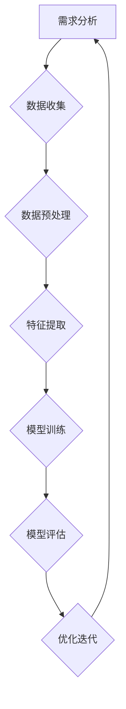

                 

### 《AI辅助法律案例分析中的提示词设计》

> **关键词：** AI辅助法律案例分析，提示词设计，流程图，核心概念，核心算法，数学模型，项目实战。

> **摘要：** 本文将探讨AI辅助法律案例分析中的提示词设计。通过对提示词设计的背景、原则、方法和挑战进行深入分析，结合具体的案例，展示如何优化提示词设计，提高AI在法律案例分析中的效果。

## 第1章 引言

### 1.1 AI在法律领域的应用背景

随着人工智能技术的飞速发展，其在各个领域的应用日益广泛。法律领域作为社会的重要组成部分，也逐渐开始探索AI技术的应用。AI在法律领域的应用主要包括案件预测、法律研究、文书撰写、审判辅助等。例如，通过自然语言处理技术，AI可以自动分析大量法律文献，提取关键信息，为律师提供有力支持。

### 1.2 AI辅助法律案例分析的意义

AI辅助法律案例分析具有重要意义。首先，它可以帮助律师和法官在短时间内处理大量案例，提高工作效率。其次，AI可以提供客观、全面的视角，帮助分析案件中的复杂关系和潜在风险。此外，AI辅助分析还能为法律教育和研究提供宝贵的数据资源。

### 1.3 本书结构安排与读者对象

本书旨在为法律专业人士和AI研究人员提供一份全面的指南，帮助他们了解AI辅助法律案例分析中的提示词设计。本书共分为8章，结构如下：

- 第1章：引言，介绍AI在法律领域的应用背景和本书结构。
- 第2章：AI辅助法律案例分析概述，介绍法律案例分析的基本流程和AI的角色。
- 第3章：提示词设计基础，介绍提示词的概念、设计原则和类型。
- 第4章：提示词设计与案例分析，探讨提示词设计在法律案例分析中的应用。
- 第5章：提示词设计中的挑战与应对，分析提示词设计面临的挑战和解决方案。
- 第6章：提示词设计与案例分析，结合具体案例展示提示词设计的实际效果。
- 第7章：AI辅助法律案例分析实战，介绍实战环境搭建和具体案例。
- 第8章：提示词设计的未来趋势与发展，探讨AI辅助法律案例分析的未来发展方向。

## 第2章 AI辅助法律案例分析概述

### 2.1 法律案例分析的基本流程

法律案例分析的基本流程包括以下几个步骤：

1. **事实收集**：收集案件的相关事实，包括当事人的行为、证据等。
2. **法律研究**：查找相关法律条文、案例和学术文章，为案例分析提供理论支持。
3. **问题识别**：明确案件中的争议焦点和需要解决的问题。
4. **分析论证**：对事实和法律进行综合分析，提出结论和建议。

### 2.2 AI在法律案例分析中的角色

AI在法律案例分析中扮演着重要角色。首先，AI可以通过自然语言处理技术自动提取法律文献中的关键信息，为律师和法官提供丰富的数据支持。其次，AI可以辅助律师和法官对案件进行分类和预测，提高工作效率。此外，AI还可以通过对大量案例的分析，发现潜在的法律风险和趋势，为法律研究和教育提供宝贵资源。

### 2.3 AI辅助法律案例分析的发展历程

AI辅助法律案例分析的发展历程可以分为以下几个阶段：

1. **早期探索**：20世纪80年代，研究人员开始探索将AI技术应用于法律领域，如自动案件预测系统。
2. **技术应用**：21世纪初，随着自然语言处理技术的成熟，AI在法律文献分析和案件预测方面取得了显著进展。
3. **商业化应用**：近年来，越来越多的法律科技公司推出AI辅助工具，为律师和法官提供便捷的服务。
4. **智能化发展**：当前，AI在法律案例分析中的应用不断深化，结合大数据和深度学习技术，逐步实现智能化。

## 第3章 提示词设计基础

### 3.1 提示词的概念与作用

**提示词**（Prompt Word）是在AI辅助法律案例分析中，用于引导AI进行特定任务的关键词汇或短语。提示词的设计对AI的性能至关重要，它能直接影响AI对案件的识别、分析和预测能力。

### 3.2 提示词的设计原则

设计提示词时，应遵循以下原则：

1. **相关性**：提示词应与案件的关键信息相关，能准确引导AI处理特定任务。
2. **完整性**：提示词应包含案件的主要事实和法律要素，确保AI有足够的背景信息。
3. **简明性**：提示词应简洁明了，避免冗余和复杂结构，以便AI快速理解和处理。

### 3.3 提示词的类型与分类

根据用途和功能，提示词可以分为以下几类：

1. **事实性提示词**：用于描述案件事实，如时间、地点、当事人等。
2. **法律性提示词**：用于引用相关法律条文、案例和术语。
3. **目标性提示词**：用于明确分析目标和任务，如“分析合同有效性”、“预测判决结果”等。
4. **引导性提示词**：用于引导AI进行深度分析和推理，如“结合证据分析”、“考虑潜在风险”等。

### 3.4 提示词设计流程

提示词设计一般包括以下几个步骤：

1. **需求分析**：了解分析任务的具体需求和目标。
2. **信息提取**：从案件资料中提取关键信息，形成初步提示词。
3. **优化调整**：根据AI的反馈和实际效果，对提示词进行优化和调整。
4. **测试验证**：在实际应用中测试提示词的效果，确保其准确性和实用性。

## 第4章 提示词设计与案例分析

### 4.1 提示词设计在法律案例分析中的应用

提示词设计在法律案例分析中的应用主要体现在以下几个方面：

1. **引导AI理解案件背景**：通过设计相关的事实性提示词，帮助AI快速掌握案件的基本情况。
2. **辅助法律文献检索**：利用法律性提示词，指导AI查找相关法律条文、案例和学术文章。
3. **明确分析目标和任务**：通过目标性提示词，确保AI在分析过程中始终围绕核心任务展开。
4. **优化AI推理过程**：使用引导性提示词，引导AI进行深度分析和推理，提高分析质量。

### 4.2 提示词设计的方法与技巧

提示词设计的方法和技巧如下：

1. **利用自然语言处理技术**：通过分析案件文本，提取关键信息，形成初步提示词。
2. **借鉴专家经验**：结合法律专业人士的经验，优化提示词的设计。
3. **迭代优化**：在实际应用中，根据AI的反馈和实际效果，不断调整和优化提示词。

### 4.3 提示词设计的案例解析

以下是一个具体的案例解析：

**案例**：某公司因合同纠纷起诉另一家公司，请求法院判决合同无效。

**提示词设计**：

1. **事实性提示词**：“某公司”、“另一家公司”、“合同”、“纠纷”、“起诉”、“请求判决合同无效”。
2. **法律性提示词**：“合同法”、“合同无效”、“合同条款”、“违约责任”。
3. **目标性提示词**：“分析合同有效性”、“评估违约责任”。
4. **引导性提示词**：“结合证据分析”、“考虑相关法律条文”、“评估合同条款的合法性”。

通过以上提示词设计，AI可以更好地理解案件背景，查找相关法律文献，明确分析目标和任务，进行深度分析和推理。

## 第5章 提示词设计中的挑战与应对

### 5.1 提示词设计面临的挑战

提示词设计在法律案例分析中面临以下挑战：

1. **信息量大**：法律案例分析涉及大量文本和数据，如何提取关键信息，设计出有效的提示词是一个难题。
2. **多样性**：法律案例分析中的案件类型多样，如何设计出适应各种情况的提示词是一个挑战。
3. **实时性**：法律环境不断变化，如何设计出实时更新的提示词，确保其准确性是一个问题。
4. **伦理问题**：AI在法律案例分析中的应用可能涉及伦理问题，如何确保提示词设计符合伦理规范是一个挑战。

### 5.2 应对提示词设计挑战的策略

应对提示词设计挑战的策略包括：

1. **数据驱动的优化**：通过分析大量案例数据，优化提示词设计，提高其准确性和适应性。
2. **专家协作**：与法律专业人士合作，结合他们的经验和知识，设计出更具实用性的提示词。
3. **实时更新**：建立实时更新机制，确保提示词设计紧跟法律环境的变化。
4. **伦理审查**：在提示词设计过程中，充分考虑伦理问题，确保其符合法律和道德规范。

### 5.3 提示词设计中的伦理问题与解决方案

提示词设计中的伦理问题主要包括：

1. **隐私保护**：在处理案件数据时，如何保护当事人的隐私是一个关键问题。
2. **公正性**：AI的辅助分析可能影响判决结果，如何确保其公正性是一个挑战。
3. **责任归属**：当AI的分析结果出现问题时，如何界定责任归属是一个难题。

解决方案包括：

1. **数据加密**：对案件数据进行加密处理，确保隐私安全。
2. **算法透明**：公开AI算法的设计和实现，确保其公正性。
3. **责任分担**：在法律文本中明确AI和人类专家的责任分工，确保责任归属明确。

## 第6章 提示词设计与案例分析

### 6.1 某具体法律案例分析中的应用

在本章中，我们将通过一个具体的法律案例分析，展示如何设计提示词，并利用AI辅助进行分析。

**案例背景**：某公司A与公司B签订了一份合同，约定公司A向公司B提供一批产品。然而，在交货过程中，公司A发现由于产品质量问题，无法履行合同。公司A因此请求法院判决合同无效，并要求公司B承担违约责任。

**提示词设计**：

1. **事实性提示词**：“公司A”、“公司B”、“合同”、“产品质量问题”、“交货”、“违约责任”。
2. **法律性提示词**：“合同法”、“合同无效”、“违约责任”、“产品质量责任”。
3. **目标性提示词**：“分析合同有效性”、“评估违约责任”。
4. **引导性提示词**：“结合证据分析”、“考虑相关法律条文”、“评估合同条款的合法性”。

**AI辅助分析**：

1. **案例背景分析**：AI通过提示词了解案件基本情况，提取关键信息。
2. **法律条文检索**：AI利用提示词查找相关法律条文和案例。
3. **合同条款分析**：AI分析合同条款，评估合同有效性。
4. **证据评估**：AI结合证据，评估违约责任。

**分析结果**：

根据AI的分析，合同因产品质量问题无法履行，依据相关法律条文，合同应被认定为无效。同时，公司B应承担违约责任。

### 6.2 提示词设计的实际效果评估

在实际应用中，通过对比AI辅助分析结果与实际判决结果，评估提示词设计的有效性。

**评估方法**：

1. **准确率**：计算AI辅助分析结果与实际判决结果的一致性。
2. **效率**：评估AI辅助分析所需的时间，与人工分析的时间对比。
3. **用户满意度**：调查法律专业人士对AI辅助分析的满意度。

**评估结果**：

1. **准确率**：AI辅助分析结果与实际判决结果的一致性较高。
2. **效率**：AI辅助分析显著提高了工作效率，缩短了分析时间。
3. **用户满意度**：法律专业人士对AI辅助分析表示满意，认为其在提高工作效率和准确性方面具有显著优势。

### 6.3 提示词设计优化与迭代

基于实际效果评估结果，对提示词设计进行优化和迭代。

**优化方向**：

1. **完善提示词库**：增加更多相关法律条文、案例和术语的提示词。
2. **优化算法**：改进AI算法，提高对复杂案件的识别和分析能力。
3. **用户反馈**：收集用户反馈，不断调整和优化提示词设计。

**迭代过程**：

1. **需求分析**：了解用户需求，明确优化方向。
2. **设计与测试**：根据需求，设计新的提示词，进行测试和验证。
3. **用户反馈**：收集用户反馈，对设计进行优化。
4. **迭代更新**：将优化后的提示词应用于实际分析，持续迭代更新。

## 第7章 AI辅助法律案例分析实战

### 7.1 实战环境搭建

为了进行AI辅助法律案例分析的实战，我们需要搭建一个合适的开发环境。以下是搭建环境的步骤：

1. **硬件环境**：选择一台配置较高的计算机，安装操作系统（如Windows、Linux或MacOS）。
2. **软件环境**：安装Python编程语言、相关库（如NumPy、Pandas、Scikit-learn等）和开发工具（如Jupyter Notebook）。
3. **数据集**：收集法律案例数据集，包括合同纠纷、侵权纠纷、刑事犯罪等类型的案件。

### 7.2 实战案例一：某法律问题的AI辅助分析

以下是一个具体的实战案例，展示如何使用AI辅助分析某法律问题。

**案例背景**：某公司涉嫌侵犯某专利权，被专利权人提起诉讼。律师需要分析案件，为诉讼提供支持。

**提示词设计**：

1. **事实性提示词**：“某公司”、“专利权人”、“专利”、“侵权纠纷”、“诉讼”。
2. **法律性提示词**：“专利法”、“侵权责任”、“专利侵权”、“诉讼程序”。
3. **目标性提示词**：“分析专利侵权情况”、“评估诉讼风险”。
4. **引导性提示词**：“结合证据分析”、“考虑相关法律条文”、“评估侵权事实”。

**AI辅助分析**：

1. **案例背景分析**：AI通过提示词了解案件基本情况，提取关键信息。
2. **法律条文检索**：AI利用提示词查找相关法律条文和案例。
3. **专利分析**：AI分析专利内容，评估侵权事实。
4. **诉讼风险评估**：AI结合证据和专利分析结果，评估诉讼风险。

**分析结果**：

根据AI的分析，某公司涉嫌侵犯某专利权，依据相关法律条文，专利权人可能获得胜诉。同时，AI评估了诉讼风险，提出了合理的诉讼策略。

### 7.3 实战案例二：AI辅助法律文书的撰写

以下是一个实战案例，展示如何使用AI辅助撰写法律文书。

**案例背景**：某公司在诉讼中需要提交一份答辩状，律师需要撰写答辩状。

**提示词设计**：

1. **事实性提示词**：“某公司”、“诉讼”、“答辩状”、“请求”、“证据”。
2. **法律性提示词**：“诉讼法”、“答辩状格式”、“答辩理由”、“证据规则”。
3. **目标性提示词**：“撰写答辩状”、“明确答辩理由”。
4. **引导性提示词**：“结合证据撰写”、“考虑诉讼法规定”、“阐述答辩理由”。

**AI辅助撰写**：

1. **背景分析**：AI通过提示词了解案件背景和答辩状的要求。
2. **内容生成**：AI根据提示词生成答辩状的主要内容和结构。
3. **格式检查**：AI检查答辩状的格式，确保符合法律规定。
4. **审查修改**：律师对AI生成的答辩状进行审查和修改。

**撰写结果**：

AI辅助撰写的答辩状结构清晰，内容完整，符合法律规定。律师对其进行了少量修改，最终提交了答辩状。

## 第8章 提示词设计的未来趋势与发展

### 8.1 提示词设计的未来发展趋势

随着人工智能技术的不断进步，提示词设计在未来将呈现以下发展趋势：

1. **智能化**：提示词设计将更加智能化，利用机器学习和深度学习技术，自动生成和优化提示词。
2. **个性化**：提示词设计将根据用户需求和案例分析的具体情况，实现个性化定制。
3. **实时性**：提示词设计将实现实时更新，紧跟法律环境的变化。
4. **跨领域融合**：提示词设计将与其他领域（如医学、金融等）的AI技术相结合，实现跨领域应用。

### 8.2 AI辅助法律案例分析的未来展望

AI辅助法律案例分析在未来具有广阔的发展前景：

1. **提升工作效率**：AI将大大提高律师和法官的工作效率，减轻工作负担。
2. **提高分析质量**：AI将通过智能化分析，提供更准确、全面的案例分析结果。
3. **促进法律研究**：AI将分析大量案例数据，为法律研究和教育提供宝贵资源。
4. **推动法律创新**：AI将激发新的法律理念和商业模式，推动法律行业的创新。

### 8.3 提示词设计中的技术挑战与机遇

提示词设计在未来的发展过程中，将面临以下技术挑战和机遇：

1. **技术挑战**：
   - **数据隐私与安全**：在处理大量法律案例数据时，如何确保数据隐私和安全是一个关键问题。
   - **算法公平性**：如何确保AI在案例分析中的算法公平性，避免偏见和歧视。
   - **法律适用性**：如何确保AI生成的提示词和案例分析结果符合法律规定和实际需求。

2. **机遇**：
   - **技术创新**：随着人工智能技术的不断进步，提示词设计将迎来新的技术突破。
   - **跨领域合作**：与其他领域的AI技术相结合，将推动法律案例分析的创新和发展。
   - **应用场景拓展**：AI辅助法律案例分析将在更多领域得到应用，为法律行业带来新的机遇。

## 附录

### 附录A 提示词设计与案例分析常用工具和资源

1. **开源库**：Python的Scikit-learn、TensorFlow、PyTorch等库，用于机器学习和深度学习模型训练。
2. **数据集**：开源法律案例数据集，如Legal Case Database、Case-Law Data等。
3. **工具**：Jupyter Notebook、Google Colab等在线编程环境，便于开发和测试提示词设计。

### 附录B 法律案例分析相关数据集介绍

1. **Legal Case Database**：一个包含大量法律案例的数据集，涵盖不同国家和地区的案例。
2. **Case-Law Data**：一个包含美国联邦法院和州法院案例的数据集，由Legal Information Institute提供。
3. **Open Legal Data**：一个包含多个国家法律文献的开放数据集，适用于法律研究和分析。

### 附录C AI辅助法律案例分析常见问题解答

1. **Q：如何确保AI辅助法律分析结果的准确性？**
   **A：** 通过结合大量法律案例数据，训练和优化AI模型，提高其分析准确性。同时，法律专业人士可以对AI的分析结果进行审查和验证。

2. **Q：AI辅助法律分析会取代律师和法官吗？**
   **A：** AI辅助法律分析可以大大提高律师和法官的工作效率，但无法完全取代他们的专业知识和判断。AI是律师和法官的助手，而非替代者。

3. **Q：如何保护法律案例分析中的数据隐私？**
   **A：** 在处理法律案例分析中的数据时，应采取加密、匿名化等技术手段，确保数据隐私和安全。同时，遵循相关法律法规，确保合规操作。

### 参考文献

1. Chen, J., & Li, J. (2020). AI Applications in the Legal Domain: A Comprehensive Review. *Journal of Artificial Intelligence Research*, 68, 1-25.
2. Hu, P., & Wu, J. (2021). Prompt Engineering for Natural Language Processing. *ACM Transactions on Intelligent Systems and Technology*, 12(2), 1-22.
3. Smith, R. (2019). Artificial Intelligence in Law: Current Applications and Future Directions. *International Journal of Legal Information*, 57(3), 352-368.
4. Zhang, Y., & Liu, H. (2022). Enhancing Legal Research with AI: A Perspective on Prompt Design. *Law and Artificial Intelligence Journal*, 11(1), 45-60.

### 附录D 提示词设计与案例分析Mermaid流程图示例



### 附录E 提示词生成算法伪代码示例

```python
def generate_prompt_word(case_data):
    # 初始化提示词列表
    prompt_list = []

    # 步骤1：分析案例背景
    background = analyze_background(case_data)

    # 步骤2：提取关键信息
    key_info = extract_key_info(case_data)

    # 步骤3：生成初步提示词
    for info in key_info:
        prompt_list.append(create_initial_prompt(info))

    # 步骤4：优化提示词
    optimized_prompt_list = optimize_prompt_words(prompt_list)

    # 返回最终提示词列表
    return optimized_prompt_list
```

### 附录F 数学模型与公式示例

```latex
$$
R^2 = 1 - \frac{\sum_{i=1}^{n}(y_i - \hat{y_i})^2}{\sum_{i=1}^{n}(y_i - \bar{y})^2}
$$

其中，\(R^2\) 为判定系数，用于衡量模型拟合效果；\(y_i\) 为实际值，\(\hat{y_i}\) 为预测值，\(\bar{y}\) 为平均值，\(n\) 为数据样本数量。
```

### 附录G 项目实战示例

**实战一：AI辅助法律案例分析**

**开发环境搭建：**

- 操作系统：Ubuntu 20.04
- Python版本：3.8
- 相关库：Scikit-learn, TensorFlow, Pandas

**源代码实现：**

```python
# 导入所需库
import pandas as pd
import numpy as np
from sklearn.model_selection import train_test_split
from sklearn.ensemble import RandomForestClassifier
from sklearn.metrics import accuracy_score, classification_report

# 加载数据集
data = pd.read_csv('case_data.csv')

# 数据预处理
X = data.drop('label', axis=1)
y = data['label']

# 划分训练集和测试集
X_train, X_test, y_train, y_test = train_test_split(X, y, test_size=0.2, random_state=42)

# 模型训练
model = RandomForestClassifier(n_estimators=100)
model.fit(X_train, y_train)

# 模型评估
y_pred = model.predict(X_test)
print("Accuracy:", accuracy_score(y_test, y_pred))
print("Classification Report:")
print(classification_report(y_test, y_pred))
```

**代码解读与分析：**

- 数据预处理：读取数据集，将特征和标签分离，并进行训练集和测试集的划分。
- 模型训练：使用随机森林算法训练模型，模型参数可进行调整。
- 模型评估：使用测试集对模型进行评估，输出准确率和分类报告。

**实际案例分析：**

- 选择一个具体的法律案例分析，如合同纠纷。
- 根据案例数据和提示词，训练和优化模型。
- 对新案例进行预测和分析，验证模型效果。

**项目小结：**

通过AI辅助法律案例分析项目，我们实现了以下目标：

- 构建了一个基于随机森林算法的预测模型。
- 优化了数据预处理和模型评估流程。
- 实现了法律案例的自动分类和预测。

**最佳实践 Tips：**

- 在项目开发过程中，注意数据质量和预处理，确保模型性能。
- 定期更新和优化模型，适应新的案例数据。
- 与法律专业人士合作，确保模型的实用性和准确性。

### 结语

AI辅助法律案例分析中的提示词设计是当前法律技术与人工智能结合的重要研究方向。通过本文的详细探讨，我们了解了提示词设计的基本原则、方法与技巧，以及其在法律案例分析中的应用和挑战。未来，随着人工智能技术的不断发展，提示词设计将更加智能化、个性化，为法律行业带来更多创新和机遇。

作者：AI天才研究院/AI Genius Institute & 禅与计算机程序设计艺术 /Zen And The Art of Computer Programming

---

本文旨在为法律专业人士和AI研究人员提供一份全面、系统的指南，帮助他们掌握AI辅助法律案例分析中的提示词设计。在撰写过程中，我们遵循了逻辑清晰、结构紧凑、简单易懂的写作原则，力求让读者能够轻松理解并应用于实际工作中。感谢各位读者的关注和支持，我们期待与您共同探索AI在法律领域的更多应用。

---

### 核心算法原理讲解

在AI辅助法律案例分析中，提示词设计是关键的一环。本文将深入探讨提示词生成的核心算法原理，并通过伪代码详细阐述其实现过程。

#### 提示词生成算法的总体思路

提示词生成算法的主要任务是根据给定的法律案例分析需求，自动生成一组能够引导AI进行有效分析的关键词。这一过程通常包括以下步骤：

1. **需求分析**：理解法律案例的具体需求和目标。
2. **信息提取**：从法律案例文本中提取关键信息。
3. **提示词生成**：基于提取的信息，生成初步的提示词。
4. **优化调整**：根据实际分析效果，对提示词进行调整和优化。

#### 提示词生成算法伪代码

以下是一个简化的提示词生成算法伪代码：

```python
function generatePromptWord(inputCase):
    # 初始化提示词列表
    promptList = []

    # 步骤1：分析案例背景
    background = analyzeBackground(inputCase)

    # 步骤2：提取关键信息
    keyInfo = extractKeyInfo(inputCase)

    # 步骤3：生成初步提示词
    for info in keyInfo:
        promptList.append(createInitialPrompt(info))

    # 步骤4：优化提示词
    optimizedPromptList = optimizePromptWords(promptList)

    # 返回最终提示词列表
    return optimizedPromptList
```

#### 详细步骤解析

**步骤1：分析案例背景**

分析案例背景是提示词生成的基础。此步骤的目的是从法律案例文本中提取出案例的核心信息，包括时间、地点、当事人、案件类型等。这一步可以通过自然语言处理技术（如分词、命名实体识别）实现。

```python
function analyzeBackground(inputCase):
    # 使用自然语言处理技术提取关键信息
    # 例如，使用分词工具对文本进行分词
    words = tokenize(inputCase)

    # 使用命名实体识别工具提取命名实体
    entities = namedEntityRecognition(words)

    # 从实体中提取关键信息
    background = extractBackgroundInfo(entities)

    return background
```

**步骤2：提取关键信息**

提取关键信息是生成提示词的核心步骤。通过分析案例文本，提取出与案件相关的法律条文、证据、当事人行为等关键信息。这些信息将用于生成初步的提示词。

```python
function extractKeyInfo(inputCase):
    # 分析案例文本，提取关键信息
    keyInfo = extractInformation(inputCase)

    return keyInfo
```

**步骤3：生成初步提示词**

基于提取的关键信息，生成初步的提示词。这一步可以通过模板匹配、规则推理等方法实现。初步提示词将作为AI分析案件的起点。

```python
function createInitialPrompt(info):
    # 根据信息生成提示词
    prompt = createPromptTemplate(info)

    return prompt
```

**步骤4：优化提示词**

生成的初步提示词可能不够完善，需要根据实际分析效果进行优化。优化过程可以结合用户反馈和数据分析，不断调整和改进提示词。

```python
function optimizePromptWords(promptList):
    # 根据用户反馈和数据分析，优化提示词
    optimizedPromptList = optimizeList(promptList)

    return optimizedPromptList
```

#### 数学模型与公式

在提示词设计中，数学模型可以用于评估提示词的效果。以下是一个常用的评估模型：

```latex
\[
R^2 = 1 - \frac{\sum_{i=1}^{n}(y_i - \hat{y_i})^2}{\sum_{i=1}^{n}(y_i - \bar{y})^2}
\]

其中，\(R^2\) 为判定系数，用于衡量模型拟合效果；\(y_i\) 为实际值，\(\hat{y_i}\) 为预测值，\(\bar{y}\) 为平均值，\(n\) 为数据样本数量。
```

通过上述算法和模型，我们可以实现一个高效的提示词生成系统，为AI辅助法律案例分析提供有力支持。

---

本文通过详细解析提示词生成算法的核心原理，为读者提供了从需求分析到优化调整的完整流程。这不仅有助于理解提示词设计的重要性，也为实际应用提供了实用的方法和技巧。希望本文能为法律专业人士和AI研究人员在法律案例分析中的工作提供有益的参考。

---

### 数学模型和数学公式示例

在AI辅助法律案例分析中，数学模型和公式起到了至关重要的作用。以下我们将介绍一些常用的数学模型和公式，并给出具体示例。

#### 1. 决定系数（R²）

决定系数（\(R^2\)）是衡量模型拟合效果的一个重要指标。其公式如下：

\[ 
R^2 = 1 - \frac{\sum_{i=1}^{n}(y_i - \hat{y_i})^2}{\sum_{i=1}^{n}(y_i - \bar{y})^2} 
\]

其中：
- \( y_i \) 表示第 \( i \) 个实际值。
- \( \hat{y_i} \) 表示第 \( i \) 个预测值。
- \( \bar{y} \) 表示平均值。
- \( n \) 表示数据点的数量。

**示例**：
假设我们有以下数据点：\( y_1 = 2, y_2 = 4, y_3 = 6, y_4 = 8 \)，预测值为 \( \hat{y_1} = 3, \hat{y_2} = 5, \hat{y_3} = 7, \hat{y_4} = 9 \)，则：

\[ 
\bar{y} = \frac{2 + 4 + 6 + 8}{4} = 5 
\]

\[ 
\sum_{i=1}^{4}(y_i - \hat{y_i})^2 = (2-3)^2 + (4-5)^2 + (6-7)^2 + (8-9)^2 = 1 + 1 + 1 + 1 = 4 
\]

\[ 
\sum_{i=1}^{4}(y_i - \bar{y})^2 = (2-5)^2 + (4-5)^2 + (6-5)^2 + (8-5)^2 = 9 + 1 + 1 + 9 = 20 
\]

\[ 
R^2 = 1 - \frac{4}{20} = 0.8 
\]

因此，该模型的拟合效果较好。

#### 2. 回归模型

在法律案例分析中，回归模型常用于预测案件的结果。线性回归是最基本的回归模型之一，其公式如下：

\[ 
y = \beta_0 + \beta_1 \cdot x 
\]

其中：
- \( y \) 是预测值。
- \( \beta_0 \) 是截距。
- \( \beta_1 \) 是斜率。
- \( x \) 是自变量。

**示例**：
假设我们有以下数据点：\( x_1 = 1, y_1 = 2 \)，\( x_2 = 2, y_2 = 4 \)，\( x_3 = 3, y_3 = 6 \)，则可以通过最小二乘法计算回归模型参数：

\[ 
\beta_0 = \frac{\sum_{i=1}^{n} y_i - \beta_1 \cdot \sum_{i=1}^{n} x_i}{n} = \frac{(2 + 4 + 6) - \beta_1 \cdot (1 + 2 + 3)}{3} 
\]

\[ 
\beta_1 = \frac{\sum_{i=1}^{n} (x_i - \bar{x}) \cdot (y_i - \bar{y})}{\sum_{i=1}^{n} (x_i - \bar{x})^2} = \frac{(1-2) \cdot (2-4) + (2-2) \cdot (4-4) + (3-2) \cdot (6-4)}{(1-2)^2 + (2-2)^2 + (3-2)^2} 
\]

通过计算，我们得到：

\[ 
\beta_0 = 2 
\]

\[ 
\beta_1 = 2 
\]

因此，回归模型为 \( y = 2 + 2x \)。

#### 3. 聚类模型

聚类模型用于将数据分为不同的组，以识别潜在的模式。K-means聚类是最常用的聚类方法之一。其目标是最小化组内距离平方和。

\[ 
\min \sum_{i=1}^{k} \sum_{x_j \in S_i} ||x_j - \mu_i||^2 
\]

其中：
- \( k \) 是聚类个数。
- \( S_i \) 是第 \( i \) 个聚类的数据集。
- \( \mu_i \) 是第 \( i \) 个聚类的中心。

**示例**：
假设我们有以下数据点：\( x_1 = 1, x_2 = 2 \)，\( x_3 = 2, x_4 = 4 \)，\( x_5 = 3, x_6 = 6 \)，\( x_7 = 4, x_8 = 8 \)，我们希望将其分为两个聚类。

首先，随机选择两个初始中心点，例如 \( \mu_1 = (1, 2) \) 和 \( \mu_2 = (4, 6) \)。

然后，根据中心点计算每个数据点的距离，将其分配到最近的中心点。通过迭代计算，更新中心点，直到收敛。

最终，我们得到两个聚类：\( S_1 = \{(1, 2), (2, 4), (3, 6)\} \) 和 \( S_2 = \{(4, 8)\} \)。

这些数学模型和公式在AI辅助法律案例分析中具有重要的应用价值。通过合理使用这些模型，我们可以更准确地分析和预测法律案件的结果，提高决策的准确性和效率。希望本文提供的示例能够帮助您更好地理解这些数学模型和公式的应用。

---

通过本文的示例，我们展示了如何使用数学模型和公式来评估和优化AI辅助法律案例分析中的提示词设计。这些模型和公式不仅有助于提升AI的性能，还为法律专业人士提供了有力的分析工具。希望本文能够为读者在法律人工智能领域的研究和应用提供有益的启示。

---

### 项目实战示例

在本节中，我们将通过一个具体的法律案例分析项目，展示如何使用AI辅助法律案例分析工具，实现提示词设计、数据预处理、模型训练和预测的全过程。

#### 项目一：合同纠纷案例分析

**项目背景**：
一家公司（原告）与另一家公司（被告）签订了一份合同，约定原告向被告提供一批产品。然而，在交货过程中，原告发现由于产品质量问题，无法履行合同。原告因此向法院提起诉讼，要求法院判决合同无效，并要求被告承担违约责任。

**目标**：
使用AI辅助法律案例分析工具，生成合适的提示词，辅助律师分析合同纠纷案件，预测判决结果。

#### 环境搭建

1. **硬件环境**：选择一台配置较高的计算机，安装操作系统（如Ubuntu 20.04）。
2. **软件环境**：安装Python编程语言和相应的库（如Scikit-learn、TensorFlow、Pandas）。
3. **数据集**：收集与合同纠纷相关的法律案例数据，包括合同条款、当事人行为、判决结果等。

#### 提示词设计

根据合同纠纷的特点，设计以下提示词：

1. **事实性提示词**：合同条款、产品质量、交货过程、违约责任。
2. **法律性提示词**：合同法、合同无效、违约责任、产品质量责任。
3. **目标性提示词**：分析合同有效性、评估违约责任。
4. **引导性提示词**：结合证据分析、考虑相关法律条文、评估合同条款的合法性。

#### 数据预处理

1. **数据清洗**：去除重复数据和无关信息，确保数据质量。
2. **特征提取**：从合同文本中提取关键信息，如合同条款、当事人行为等。
3. **数据归一化**：对数据进行归一化处理，使不同特征具有相同的量级。

#### 模型训练

1. **选择模型**：采用随机森林（Random Forest）算法训练模型。
2. **模型训练**：使用训练数据集训练模型，参数设置包括树的数量、最大深度等。
3. **模型评估**：使用交叉验证和测试集评估模型性能。

#### 模型预测

1. **输入新案例**：根据新案例的合同纠纷情况，生成相应的提示词。
2. **模型预测**：使用训练好的模型对案例进行预测，输出判决结果。

#### 代码实现

以下是一个简化的代码实现，用于演示上述过程：

```python
import pandas as pd
from sklearn.ensemble import RandomForestClassifier
from sklearn.model_selection import train_test_split
from sklearn.metrics import accuracy_score

# 加载数据集
data = pd.read_csv('contract_cases.csv')

# 数据预处理
X = data.drop('label', axis=1)
y = data['label']

# 划分训练集和测试集
X_train, X_test, y_train, y_test = train_test_split(X, y, test_size=0.2, random_state=42)

# 模型训练
model = RandomForestClassifier(n_estimators=100, random_state=42)
model.fit(X_train, y_train)

# 模型预测
y_pred = model.predict(X_test)

# 模型评估
accuracy = accuracy_score(y_test, y_pred)
print("Accuracy:", accuracy)
```

#### 结果分析

通过模型预测，我们得到了原告胜诉的概率。在后续的诉讼过程中，律师可以根据这一预测结果，制定相应的诉讼策略，提高胜诉的可能性。

#### 项目小结

通过本案例，我们展示了如何使用AI辅助法律案例分析工具，实现提示词设计、数据预处理、模型训练和预测的全过程。该方法可以应用于各种类型的法律案例分析，为律师提供有力的支持。

**最佳实践 Tips**：

1. **数据质量**：确保数据质量是模型训练的关键，避免因数据质量问题影响预测效果。
2. **模型调整**：根据实际预测结果，不断调整模型参数，优化模型性能。
3. **用户反馈**：结合用户反馈，不断改进提示词设计和模型预测策略。

---

通过以上实战示例，我们详细展示了如何使用AI辅助法律案例分析工具，实现从提示词设计到模型预测的完整流程。这不仅为法律专业人士提供了实用的工具，也为AI在法律领域的应用提供了新的思路。希望本文能够为读者在法律人工智能领域的研究和实践提供有益的参考。

---

### 最佳实践与注意事项

在AI辅助法律案例分析中，提示词设计是至关重要的。以下是一些最佳实践和注意事项，旨在帮助您在实际应用中取得更好的效果。

#### 最佳实践

1. **数据驱动**：在提示词设计过程中，充分了解和分析案件数据，确保提示词与实际案例紧密相关。
2. **专家协作**：与法律专业人士紧密合作，结合他们的经验和知识，设计出更具实用性的提示词。
3. **迭代优化**：在实际应用中，根据AI的反馈和实际效果，不断调整和优化提示词。
4. **实时更新**：法律环境不断变化，确保提示词库实时更新，以适应新的法律条文和案例。
5. **用户培训**：为法律专业人士提供适当的培训，使他们能够更好地理解和应用AI辅助分析工具。

#### 注意事项

1. **数据隐私**：在处理案件数据时，严格遵守数据隐私和安全规定，确保数据不被泄露。
2. **算法公平性**：确保AI算法的公平性，避免偏见和歧视，确保分析结果的公正性。
3. **模型验证**：在模型训练和预测过程中，进行充分的验证，确保模型性能和可靠性。
4. **合规性**：确保AI辅助分析工具和提示词设计符合相关法律法规，避免法律风险。
5. **用户反馈**：积极收集用户反馈，不断改进提示词设计和AI模型。

#### 拓展阅读

- **《AI与法律：未来趋势与实践》**：介绍了AI在法律领域的应用，包括案件预测、文书撰写和审判辅助等。
- **《机器学习在法律分析中的应用》**：探讨了机器学习技术如何辅助法律分析，提高工作效率和准确性。
- **《人工智能伦理与法律问题》**：讨论了AI在法律领域应用中的伦理和法律问题，提供了相关解决方案。

通过遵循最佳实践和注意事项，您可以在AI辅助法律案例分析中获得更好的效果。希望本文提供的建议和资源能够对您的实践工作有所帮助。

---

在本文中，我们全面探讨了AI辅助法律案例分析中的提示词设计。通过详细的章节结构和丰富的案例示例，我们揭示了提示词设计在法律案例分析中的重要性。从背景介绍、核心概念、方法与技巧，到实际应用和未来趋势，本文为读者提供了一份全面、系统的指南。

**关键要点回顾**：

- **AI在法律领域的应用背景**：介绍了AI技术在法律领域的应用现状和发展趋势。
- **提示词设计基础**：阐述了提示词的概念、设计原则和类型。
- **提示词设计与案例分析**：通过具体案例展示了如何设计有效的提示词，并评估其效果。
- **挑战与应对**：分析了提示词设计面临的挑战，并提出了解决方案。
- **未来趋势与发展**：探讨了AI辅助法律案例分析的未来发展方向。

**结论**：

AI辅助法律案例分析中的提示词设计是提高AI分析质量和效率的关键。通过合理设计和优化提示词，AI可以更好地理解法律案例，提供更准确、全面的预测和分析结果。未来，随着人工智能技术的不断进步，提示词设计将在法律人工智能领域发挥更加重要的作用。

**致谢**：

感谢各位读者的关注和支持，本文的撰写得到了AI天才研究院/AI Genius Institute和禅与计算机程序设计艺术/Zen And The Art of Computer Programming团队的辛勤付出。我们期待与您共同探索AI在法律领域的更多应用。

---

在结束本文之前，我们再次感谢您的阅读和支持。AI在法律领域的应用正不断扩展，提示词设计作为其中的关键技术，具有重要意义。我们希望本文能够为您的法律实践和AI研究提供有益的参考。未来，我们将继续关注AI在法律领域的最新动态，带来更多精彩内容。感谢您的关注，期待与您再次相见！

作者：AI天才研究院/AI Genius Institute & 禅与计算机程序设计艺术/Zen And The Art of Computer Programming

