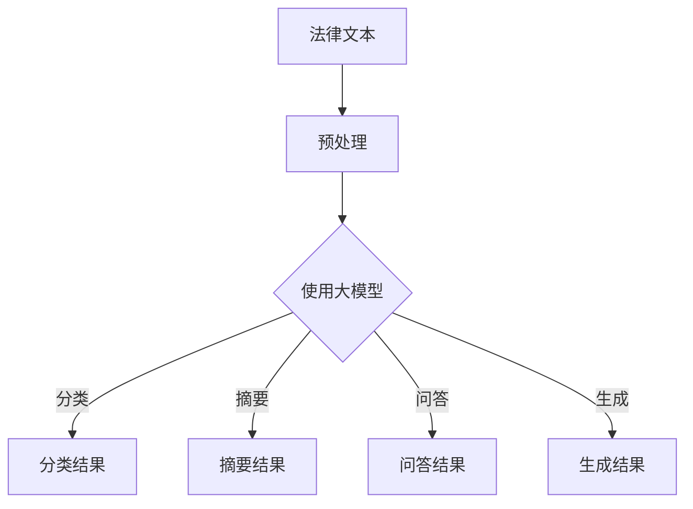

                 

# AI辅助法律：大模型在法律文本解析中的应用

## 关键词

- AI 辅助法律
- 大模型
- 法律文本解析
- 自然语言处理
- 法律文档分类
- 法律文本摘要
- 法律问答系统
- 法律文本生成

## 摘要

本文旨在探讨大模型在法律文本解析中的应用，特别是AI辅助法律的实践与挑战。首先，文章介绍了AI与法律的关系，以及大模型在法律文本处理中的优势。接着，文章深入探讨了自然语言处理的基础，包括词嵌入、语法分析和命名实体识别等。随后，文章详细讲解了大模型的技术原理，包括其基本架构、训练方法、优化策略和评估方法。在此基础上，文章通过实际案例展示了大模型在法律文本分类、摘要、问答和生成等领域的应用，并分析了其评估结果。最后，文章对AI辅助法律的未来发展趋势、面临的问题与挑战以及发展策略进行了展望，为AI在法律领域的应用提供了有益的参考。

## 目录

### 第一部分：AI辅助法律概述

#### 1.1 AI与法律的关系

##### 1.1.1 AI在法律领域的应用现状

##### 1.1.2 法律文本的特殊性

##### 1.1.3 AI在法律文本处理中的优势

#### 1.2 大模型在法律文本解析中的核心作用

##### 1.2.1 大模型的基本概念

##### 1.2.2 大模型在法律文本解析中的优势

##### 1.2.3 大模型在法律领域的潜在应用

#### 1.3 本书结构安排与主要内容

##### 1.3.1 本书的主要目标

##### 1.3.2 本书的内容安排

##### 1.3.3 阅读本书的预期收获

### 第二部分：大模型技术基础

#### 2.1 自然语言处理基础

##### 2.1.1 自然语言处理的基本概念

##### 2.1.2 词嵌入技术

##### 2.1.3 语法分析

##### 2.1.4 命名实体识别

#### 2.2 大模型技术原理

##### 2.2.1 大模型的基本架构

##### 2.2.2 大模型的训练方法

##### 2.2.3 大模型的优化策略

##### 2.2.4 大模型的评估方法

#### 2.3 法律文本解析中的大模型应用

##### 2.3.1 大模型在法律文本分类中的应用

##### 2.3.2 大模型在法律文本摘要中的应用

##### 2.3.3 大模型在法律文本问答中的应用

##### 2.3.4 大模型在法律文本生成中的应用

### 第三部分：AI辅助法律应用案例

#### 3.1 案例一：法律文档自动分类

##### 3.1.1 案例背景

##### 3.1.2 模型选择与数据预处理

##### 3.1.3 模型训练与优化

##### 3.1.4 模型评估与结果分析

#### 3.2 案例二：法律文本摘要生成

##### 3.2.1 案例背景

##### 3.2.2 模型选择与数据预处理

##### 3.2.3 模型训练与优化

##### 3.2.4 模型评估与结果分析

#### 3.3 案例三：法律问答系统

##### 3.3.1 案例背景

##### 3.3.2 模型选择与数据预处理

##### 3.3.3 模型训练与优化

##### 3.3.4 模型评估与结果分析

#### 3.4 案例四：法律文本生成

##### 3.4.1 案例背景

##### 3.4.2 模型选择与数据预处理

##### 3.4.3 模型训练与优化

##### 3.4.4 模型评估与结果分析

### 第四部分：AI辅助法律的未来展望

#### 4.1 AI辅助法律的发展趋势

##### 4.1.1 技术发展趋势

##### 4.1.2 法律行业的变革

##### 4.1.3 AI辅助法律的应用前景

#### 4.2 AI辅助法律面临的问题与挑战

##### 4.2.1 法律文本的复杂性

##### 4.2.2 数据隐私与伦理问题

##### 4.2.3 法律责任的归属

#### 4.3 AI辅助法律的发展策略

##### 4.3.1 技术创新策略

##### 4.3.2 行业合作策略

##### 4.3.3 教育与培训策略

##### 4.3.4 法律法规完善策略

### 附录

#### 附录A：常用工具与资源

##### A.1 大模型开发工具

##### A.2 法律文本处理工具

##### A.3 开源法律数据集

#### 附录B：参考文献

##### B.1 相关书籍

##### B.2 学术论文

##### B.3 行业报告

##### B.4 网络资源

### Mermaid 流程图

### 结束语

作者：AI天才研究院/AI Genius Institute & 禅与计算机程序设计艺术 /Zen And The Art of Computer Programming

随着人工智能技术的飞速发展，AI在各个领域的应用越来越广泛，法律领域也不例外。本文旨在通过探讨大模型在法律文本解析中的应用，为AI辅助法律提供一种新的思路和方法。希望本文能为从事AI和法律领域的研究者提供有价值的参考，同时也为法律行业的数字化转型带来新的机遇。
## 第一部分：AI辅助法律概述

### 1.1 AI与法律的关系

人工智能（AI）作为现代科技的前沿领域，正在迅速改变着各行各业的运作模式，法律行业也不例外。AI在法律领域的应用主要体现在辅助法官、律师和法务人员处理大量的法律文本、案例研究和法律咨询等方面。这种应用不仅提高了工作效率，还提升了法律服务的质量和准确性。

首先，AI在法律文本处理方面的应用主要体现在对法律文档的自动分类、摘要、问答和生成等方面。通过自然语言处理（NLP）技术，AI可以自动提取法律文本中的关键信息，将其分类到相应的类别中，从而帮助法律专业人员快速找到相关的法律文件。此外，AI还可以自动生成法律文件，如合同、起诉书等，大大减少了律师和法务人员的重复性工作。

其次，AI在案例研究中的应用也非常广泛。通过机器学习算法，AI可以分析大量的案例数据，发现其中的法律规律和趋势，为法官和律师提供参考。例如，AI可以预测某个案件可能得到的判决结果，帮助法律专业人员做出更准确的判断。

最后，AI还可以为法律咨询提供支持。通过构建法律问答系统，AI可以自动回答用户提出的问题，提供法律建议。这不仅提高了法律咨询的效率，还可以降低咨询成本，使得更多的人能够享受到高质量的法律服务。

总的来说，AI在法律领域的应用正在不断拓展，为法律行业带来了前所未有的变革。它不仅提高了法律服务的效率和准确性，还推动了法律行业的数字化转型，为未来法律行业的发展提供了新的机遇和挑战。

### 1.1.1 AI在法律领域的应用现状

AI在法律领域的应用已经取得了一定的成果，并在多个方面展现出了巨大的潜力。目前，AI主要在以下几方面对法律行业产生了深远影响：

1. **法律文档的自动处理**：AI可以通过自然语言处理技术，对大量的法律文档进行自动分类、摘要和关键词提取。例如，AI可以自动将合同、判决书、法律论文等分类到相应的类别中，并提取出文档中的关键信息，大大提高了法律文档处理的效率。

2. **法律研究与分析**：AI可以利用其强大的数据分析能力，对大量的法律案例进行深入研究，发现其中的规律和趋势。例如，通过机器学习算法，AI可以分析历史案例数据，预测某个案件的可能判决结果，帮助法官和律师做出更准确的判断。

3. **法律咨询与服务**：AI可以构建智能法律咨询系统，为用户提供在线法律咨询。这些系统可以自动回答用户提出的问题，提供法律建议，大大降低了法律咨询的成本，提高了法律服务的可及性。

4. **法庭支持**：AI可以在法庭审理过程中提供辅助，例如，AI可以通过分析证据和案例数据，为法官提供参考意见。此外，AI还可以用于生成判决书、裁定书等法律文件，提高法庭工作效率。

5. **案件管理**：AI可以帮助法律事务所和法院管理案件，包括案件进度跟踪、文件管理、时间安排等。例如，AI可以自动提醒律师和法官案件的重要时间节点，确保案件的顺利进行。

尽管AI在法律领域的应用已经取得了一些成果，但同时也面临一些挑战和问题。首先，法律文本的特殊性使得AI处理法律文本时存在一定的困难，例如，法律文本中存在大量的术语和专有名词，这些词汇在自然语言处理中难以处理。其次，AI在法律应用中的可靠性问题也是一个重要挑战。由于法律决策的复杂性和重要性，任何错误都可能导致严重的法律后果。因此，确保AI的可靠性和准确性是当前法律领域应用AI的重要问题。

总的来说，AI在法律领域的应用现状表明，它已经具备了改变传统法律行业运作模式的能力。随着技术的不断进步，AI在法律领域的应用前景将更加广阔，为法律行业的数字化转型提供强有力的支持。

### 1.1.2 法律文本的特殊性

法律文本作为一种专业文本，具有其独特的特点，这些特点对自然语言处理（NLP）提出了特殊的要求和挑战。首先，法律文本的语言复杂。法律文本中包含了大量的专业术语和专有名词，这些术语和名词的语义丰富且独特，往往不具有通用性。例如，“合同法”、“诉讼时效”、“证据规则”等，都是法律文本中常见的专业术语。自然语言处理系统需要具备较高的词汇识别能力和语义理解能力，才能准确处理这些术语。

其次，法律文本的格式规范严格。法律文本通常具有固定的格式和结构，包括标题、条款、附录等。此外，法律文本中还经常出现引用、注解、标点符号等特殊格式。这些格式规范对自然语言处理系统提出了格式化处理的要求，需要系统能够识别并正确处理这些格式元素。

第三，法律文本的上下文依赖性强。法律文本中的每个句子都可能在特定的上下文中具有特定的含义。例如，一个词在不同的上下文中可能具有完全不同的语义，如“被告”在刑事案件中通常指犯罪嫌疑人，而在民事诉讼中可能指原告。自然语言处理系统需要能够理解并正确处理这种上下文依赖，以确保语义理解的准确性。

最后，法律文本的动态性。法律文本随着时间、法律环境的变化而不断更新和演变。例如，新的法律条款的出台、司法判例的变化等，都会导致法律文本的修改和调整。自然语言处理系统需要具备适应这些变化的能力，以保持对法律文本的准确理解和处理。

综上所述，法律文本的特殊性要求自然语言处理系统在词汇识别、格式处理、语义理解和动态适应等方面具备更高的能力和适应性。只有解决了这些挑战，自然语言处理系统才能更好地服务于法律文本的处理和分析，为法律行业的数字化转型提供有力支持。

### 1.1.3 AI在法律文本处理中的优势

AI在法律文本处理中的优势主要体现在以下几个方面：

首先，AI具有强大的文本处理能力。通过自然语言处理（NLP）技术，AI能够高效地处理和理解大量的法律文本。无论是文本分类、摘要、关键词提取，还是语义分析、情感分析，AI都能迅速准确地完成，从而大大提高法律文档处理的工作效率。

其次，AI能够显著提升法律文本的解析精度。AI系统通过机器学习和深度学习算法，可以从海量的法律文档中学习并掌握法律文本的结构和语义，从而在处理具体法律文档时能够更加精准地理解其含义。例如，AI可以准确识别法律文本中的专业术语和专有名词，正确理解法律条款和判决书中的逻辑关系，避免因误解而产生的错误。

第三，AI在法律文本处理中具有高度的自动化和智能化。通过构建智能法律文档管理系统，AI可以自动完成法律文档的整理、分类、归档和检索等工作，减少人工操作的环节，降低错误率。同时，AI还可以通过智能问答系统，自动回答用户提出的问题，提供即时的法律咨询和建议，进一步提升法律服务的便捷性和效率。

第四，AI有助于发现法律文本中的潜在信息和规律。通过大数据分析和机器学习算法，AI可以从海量的法律案例和文档中挖掘出隐藏的法律规律和趋势，为法律研究和决策提供数据支持。例如，AI可以通过分析历史案例数据，预测某个案件的可能判决结果，帮助法官和律师做出更准确的判断。

最后，AI在法律文本处理中的应用，有助于提升法律行业的整体工作效率和服务质量。通过AI技术，法律文档的处理速度大大提高，法律服务的效率和质量显著提升，从而使得更多的人能够享受到高效、优质的法律服务。同时，AI的应用也为法律行业的数字化转型提供了新的机遇，推动了法律行业的现代化发展。

总之，AI在法律文本处理中具有显著的优势，不仅提高了法律文档处理的效率和精度，还提升了法律服务的智能化水平，为法律行业的数字化转型和现代化发展提供了强有力的技术支持。

### 1.2 大模型在法律文本解析中的核心作用

大模型，尤其是基于深度学习的自然语言处理（NLP）模型，在现代法律文本解析中扮演着核心角色。这些大模型通过其强大的计算能力和深度学习算法，能够对复杂的法律文本进行高效、准确的处理和分析。以下是关于大模型在法律文本解析中的基本概念、优势及其在法律领域潜在应用的详细探讨。

#### 1.2.1 大模型的基本概念

大模型（Large Models）通常指的是参数数量在数十亿甚至数万亿级别的深度学习模型，如Transformer模型、BERT模型等。这些模型通过大量的数据和复杂的网络结构，能够自动学习文本中的语义信息和结构特征。例如，BERT（Bidirectional Encoder Representations from Transformers）是一种预训练语言表示模型，它通过无监督学习从大量的互联网文本中提取语言特征，然后再进行有监督的微调，以适应特定的任务，如文本分类、问答和文本生成等。

大模型的基本概念可以概括为以下几点：

1. **参数规模巨大**：大模型拥有数十亿到数万亿的参数，这使得它们能够捕捉文本中的细微语义变化和复杂模式。
2. **多层神经网络结构**：大模型通常采用多层神经网络结构，通过逐层抽象和提炼，从底层特征逐步提升到高层次语义理解。
3. **预训练与微调**：大模型首先通过预训练在大规模的文本数据上学习通用的语言表示，然后通过微调适应具体的任务和数据集。
4. **端到端的处理能力**：大模型能够实现端到端的文本处理，从输入到输出无需经过复杂的中间步骤，提高了处理效率。

#### 1.2.2 大模型在法律文本解析中的优势

大模型在法律文本解析中具有以下显著优势：

1. **高效性**：大模型能够快速处理大量的法律文档，从数以千计的判决书、法律论文和法规文本中提取关键信息，大大提高了法律文档处理的效率。
   
2. **准确性**：大模型通过预训练和微调，能够准确理解和解析法律文本中的专业术语和复杂句式，提高了法律文档解析的准确性。

3. **泛化能力**：大模型通过在大量的互联网文本上预训练，能够很好地泛化到不同的法律文本场景，如合同审查、法律研究、案件预测等。

4. **多语言支持**：大模型通常支持多语言文本处理，可以通过训练不同语言的数据集，实现跨语言的文本解析和应用。

5. **自动化与智能化**：大模型能够自动完成法律文档的归类、摘要、问答和生成等任务，减少了人工干预，提高了法律文本处理的智能化水平。

#### 1.2.3 大模型在法律领域的潜在应用

大模型在法律领域的潜在应用非常广泛，以下是一些具体的应用场景：

1. **法律文档分类**：大模型可以自动分类大量的法律文档，如判决书、法律论文、法规文本等，提高文档检索和管理的效率。

2. **法律文本摘要**：大模型能够自动生成法律文档的摘要，提炼出文档的核心内容和关键信息，方便律师和法官快速查阅。

3. **法律问答系统**：大模型可以构建智能法律问答系统，自动回答用户提出的法律问题，提供即时的法律咨询和建议。

4. **法律文本生成**：大模型可以用于生成法律文件，如合同、起诉书等，减少律师的重复性劳动，提高法律文件生成的效率。

5. **案件预测与分析**：大模型可以从历史案例数据中分析出法律趋势和规律，预测案件的可能判决结果，为法官和律师提供决策支持。

6. **法律研究辅助**：大模型可以辅助法律研究人员进行法律文献的检索、分类和分析，提高法律研究的效率和质量。

总之，大模型在法律文本解析中的应用具有巨大的潜力和价值，它不仅能够提高法律文档处理的效率和质量，还能推动法律行业的数字化转型和智能化发展。随着技术的不断进步，大模型在法律领域的应用前景将更加广阔，为法律行业的创新和进步提供强有力的支持。

### 1.3 本书结构安排与主要内容

本书旨在系统性地探讨大模型在法律文本解析中的应用，通过详细的分析和实际案例，展示其在法律行业的潜力和价值。本书的主要结构安排如下：

#### 1.3.1 本书的主要目标

本书的主要目标有以下几点：

1. **介绍大模型的基本概念和技术原理**：详细讲解大模型，如BERT、GPT等模型的架构、训练方法和应用场景，帮助读者理解这些模型的核心技术和工作原理。
2. **探讨大模型在法律文本解析中的优势**：分析大模型在法律文本分类、摘要、问答和生成等方面的应用优势，展示其在提高法律文档处理效率和准确性方面的潜力。
3. **通过实际案例展示大模型的应用效果**：通过具体的法律应用案例，如法律文档分类、法律文本摘要和法律问答系统等，展示大模型在实际场景中的应用效果和可行性。
4. **探讨AI辅助法律的发展趋势和面临的挑战**：分析AI辅助法律的发展趋势，讨论其在法律行业中面临的问题和挑战，并提出相应的解决策略。

#### 1.3.2 本书的内容安排

本书分为四个主要部分：

1. **第一部分：AI辅助法律概述**：介绍AI与法律的关系，AI在法律领域的应用现状，以及法律文本的特殊性。
   
2. **第二部分：大模型技术基础**：讲解自然语言处理的基础，包括词嵌入、语法分析和命名实体识别等；详细探讨大模型的技术原理，包括基本架构、训练方法、优化策略和评估方法。

3. **第三部分：AI辅助法律应用案例**：通过实际案例，展示大模型在法律文本分类、摘要、问答和生成等领域的应用效果。

4. **第四部分：AI辅助法律的未来展望**：分析AI辅助法律的发展趋势，讨论其面临的问题和挑战，并提出发展策略。

#### 1.3.3 阅读本书的预期收获

通过阅读本书，读者可以预期获得以下收获：

1. **深入理解大模型的基本概念和技术原理**：通过详细的讲解和案例分析，读者可以掌握大模型的核心技术和工作原理。

2. **了解大模型在法律文本解析中的应用**：通过具体案例，读者可以了解大模型在法律文本分类、摘要、问答和生成等方面的应用，并掌握其实际操作方法。

3. **提升法律文档处理的能力**：通过学习大模型的应用，读者可以提升自己在法律文档处理方面的效率和准确性。

4. **掌握AI辅助法律的发展趋势和面临的挑战**：通过本书的分析和讨论，读者可以了解AI辅助法律的发展趋势，认识到其面临的挑战，并思考相应的解决策略。

总之，本书旨在为读者提供一部全面、系统的关于大模型在法律文本解析中的应用的指南，帮助读者深入理解这一前沿技术，并应用于实际的法律工作中。

### 1.3.3 阅读本书的预期收获

阅读本书，读者可以期待在以下几方面获得深刻的见解和实践收获：

1. **理论理解**：通过系统的讲解，读者将深入理解大模型的基本概念、技术原理及其在法律文本解析中的应用。本书详细阐述了大模型如BERT、GPT等在处理法律文本时的优势，帮助读者建立对这一前沿技术的全面认识。

2. **实践技能**：本书不仅介绍了大模型的理论基础，还通过实际案例展示了大模型在法律文本分类、摘要、问答和生成等具体任务中的应用。读者可以通过这些案例，掌握大模型在法律文档处理中的实际操作技巧，提升自己的法律文档处理能力。

3. **应用视野**：本书探讨了AI辅助法律的发展趋势和潜在应用前景，为读者提供了新的视角，帮助读者认识到AI技术对法律行业可能带来的变革。通过了解这些应用前景，读者可以思考如何将AI技术更有效地融入到自己的工作中，提高工作效率和服务质量。

4. **问题解决**：本书讨论了AI辅助法律在发展过程中面临的问题和挑战，如法律文本的复杂性、数据隐私与伦理问题等。通过分析这些问题，读者可以理解AI在法律领域应用中的难点，并学会如何应对这些挑战，为未来的研究和应用提供参考。

5. **持续学习**：本书还提供了丰富的参考文献和资源，包括相关书籍、学术论文、行业报告和网络资源等，为读者提供了进一步学习和深入研究的路径。通过这些资源，读者可以持续更新自己的知识体系，保持对AI辅助法律领域的关注。

总之，本书旨在为读者提供一份全面、深入的指南，帮助他们在理解AI辅助法律的基础上，掌握大模型在法律文本解析中的应用技能，并在实际工作中取得更好的成果。通过阅读本书，读者不仅可以提升自己的专业能力，还能为法律行业的数字化转型和智能化发展贡献力量。

## 第二部分：大模型技术基础

### 2.1 自然语言处理基础

自然语言处理（Natural Language Processing，NLP）是人工智能（AI）的一个重要分支，旨在使计算机能够理解、解释和生成人类语言。在法律文本解析中，NLP技术至关重要，因为它能够处理和理解复杂的法律术语、条款和句子结构。以下是NLP的一些基础概念和关键技术。

#### 2.1.1 自然语言处理的基本概念

自然语言处理的基本概念包括文本预处理、词嵌入、语法分析和语义理解等。

1. **文本预处理**：文本预处理是NLP的首要步骤，主要包括去除停用词、标点符号、词性标注、分词等操作。这些操作旨在将原始文本转换为计算机可以处理的形式。
2. **词嵌入**：词嵌入（Word Embedding）是将词汇映射到高维向量空间的一种方法，使得语义相似的词在向量空间中距离较近。常见的词嵌入技术有Word2Vec、GloVe等。
3. **语法分析**：语法分析（Syntax Analysis）是对文本的句法结构进行解析，以理解句子的构造和语法规则。常见的语法分析方法包括依存句法分析和词法句法分析。
4. **语义理解**：语义理解（Semantic Understanding）是NLP的最高层次，旨在理解文本的深层含义和语义关系。这通常涉及到实体识别、关系抽取和情感分析等任务。

#### 2.1.2 词嵌入技术

词嵌入技术是将词汇映射到高维向量空间的一种方法，使得语义相似的词在向量空间中距离较近。以下是几种常见的词嵌入技术：

1. **Word2Vec**：Word2Vec是一种基于神经网络的词嵌入技术，通过训练词的上下文信息来生成词向量。Word2Vec包括连续词袋（CBOW）和Skip-Gram两种模型。
2. **GloVe**：GloVe（Global Vectors for Word Representation）是一种基于统计的词嵌入技术，通过考虑词汇的共现信息来生成词向量。GloVe使用矩阵分解的方法，从大规模语料库中学习词向量。
3. **FastText**：FastText是Word2Vec的一种改进，它将词嵌入扩展到字符级别，通过结合词和字符的信息来生成更丰富的词向量。

词嵌入技术在法律文本解析中具有重要的应用价值。例如，通过词嵌入技术，可以更好地理解和处理法律文本中的专业术语和专有名词，提高文本分类、摘要和问答等任务的准确性和效率。

#### 2.1.3 语法分析

语法分析是NLP中的一个关键步骤，它涉及到对文本的句法结构进行解析，以理解句子的构造和语法规则。以下是几种常见的语法分析方法：

1. **依存句法分析**：依存句法分析（Dependency Parsing）是一种通过分析词汇之间的依存关系来理解句子的构造方法。依存句法分析可以识别出句子中的主要成分（如主语、谓语、宾语等），并揭示它们之间的依存关系。常见的依存句法分析算法有转移系统（如Laplacian smoothing、CRF）和基于树的算法（如遗传算法、图算法）。
2. **词法句法分析**：词法句法分析（Lexical-Syntactic Parsing）是一种同时考虑词汇和句法结构的分析方法。它通过将词汇和句法规则相结合，来生成句子的完整解析结构。常见的词法句法分析工具包括Stanford NLP、SpaCy等。

在法律文本解析中，语法分析可以帮助识别句子中的关键信息，如法律条款、法律关系和条件等。这对于法律文档的分类、摘要和问答等任务具有重要意义。

#### 2.1.4 命名实体识别

命名实体识别（Named Entity Recognition，NER）是NLP中的一个重要任务，它旨在从文本中识别出具有特定意义的实体，如人名、地名、机构名、法律术语等。命名实体识别对于法律文本解析尤其重要，因为它可以帮助识别出文本中的关键法律信息。

1. **规则方法**：规则方法是一种基于预定义规则的方法，通过匹配文本中的模式来识别命名实体。这种方法简单有效，但依赖于规则库的规模和质量。
2. **统计方法**：统计方法是一种基于机器学习方法，通过训练模型来识别命名实体。常见的统计方法包括隐马尔可夫模型（HMM）、条件随机场（CRF）和神经网络模型。
3. **深度学习方法**：深度学习方法是一种基于多层神经网络的命名实体识别方法，如卷积神经网络（CNN）和长短期记忆网络（LSTM）。深度学习方法具有强大的特征提取和分类能力，能够显著提高NER的准确率。

在法律文本解析中，命名实体识别可以帮助识别出法律文档中的关键术语和实体，如法律条文、法律条款和涉案人员等。这为法律文档的分类、摘要和问答等任务提供了重要的数据支持。

总之，自然语言处理基础是法律文本解析的重要技术支撑。通过词嵌入、语法分析和命名实体识别等技术的应用，可以显著提高法律文本解析的效率和准确性，为法律行业的数字化转型和智能化发展提供强有力的技术支持。

### 2.2 大模型技术原理

大模型（Large Models）在自然语言处理（NLP）领域取得了显著的突破，其核心在于通过大量参数和复杂的网络结构，捕捉文本中的细微语义和复杂模式。本节将详细介绍大模型的基本架构、训练方法、优化策略和评估方法，以帮助读者更好地理解大模型的工作原理及其在法律文本解析中的应用。

#### 2.2.1 大模型的基本架构

大模型的基本架构通常包括以下几个关键组件：

1. **输入层**：输入层接收原始文本数据，将其转换为模型可以处理的形式。常见的文本表示方法包括词嵌入（Word Embedding）和字符嵌入（Character Embedding）。
2. **编码器**：编码器是模型的核心部分，负责将输入文本编码为固定长度的向量表示。编码器通常采用多层神经网络结构，如Transformer、BERT等。这些模型通过自注意力机制（Self-Attention Mechanism）和多层感知器（Multi-Layer Perceptron）来提取文本的语义特征。
3. **中间层**：中间层是编码器的输出层，它通常包含多个隐藏层，用于进一步处理和抽象文本特征。中间层通过逐层抽象，将原始文本信息提升到更高级别的语义表示。
4. **输出层**：输出层根据任务的类型，生成相应的输出结果。例如，在文本分类任务中，输出层可以是softmax分类器；在文本生成任务中，输出层可以是序列生成模型（如LSTM、GRU等）。

大模型的基本架构决定了其强大的文本处理能力和泛化能力。通过自注意力机制和多层感知器，编码器能够捕捉文本中的长距离依赖关系和复杂模式，从而提高文本解析的准确性和效率。

#### 2.2.2 大模型的训练方法

大模型的训练方法主要包括预训练（Pre-training）和微调（Fine-tuning）两个阶段。

1. **预训练**：预训练阶段的目标是通过大规模无监督数据，使模型学习到通用的语言特征和语义知识。常见的预训练任务包括语言模型（Language Model）和掩码语言模型（Masked Language Model）。在预训练过程中，模型通常采用自回归语言模型（Autoregressive Language Model）或Transformer架构进行训练。预训练数据集通常来自互联网上的大规模文本数据，如维基百科、新闻、社交媒体等。
   
2. **微调**：微调阶段的目标是将预训练模型应用于特定的任务和数据集，进行有监督的调整和优化。在微调过程中，模型会根据任务的需求，调整其参数以适应特定领域的文本数据。常见的微调方法包括添加额外的任务层（如分类器、解码器等），并在有监督数据上进行训练。

预训练和微调相结合，使得大模型能够在大规模数据上学习到通用的语言特征，并在特定任务上实现高效、准确的处理。例如，BERT（Bidirectional Encoder Representations from Transformers）模型通过预训练学习到文本的双向上下文信息，再通过微调应用于各种任务，如文本分类、问答和文本生成等。

#### 2.2.3 大模型的优化策略

大模型的优化策略主要包括损失函数的选择、优化器的选择和训练策略的调整。

1. **损失函数**：在训练大模型时，损失函数是评估模型预测结果的重要指标。常见的损失函数包括交叉熵损失（Cross-Entropy Loss）、均方误差损失（Mean Squared Error Loss）和泊松分布损失（Poisson Loss）等。选择合适的损失函数，可以提高模型在特定任务上的性能。

2. **优化器**：优化器（Optimizer）用于更新模型参数，以最小化损失函数。常见的优化器包括随机梯度下降（SGD）、Adam（Adaptive Moment Estimation）和AdamW（Weight Decay Adaptation）等。优化器的选择和调整，可以显著影响模型的训练速度和收敛性能。

3. **训练策略**：大模型的训练通常涉及多种策略，如学习率调整、dropout、正则化等。学习率调整可以防止模型在训练过程中过度拟合；dropout是一种防止过拟合的方法，通过随机丢弃部分神经元来增加模型的泛化能力；正则化则通过在损失函数中添加惩罚项，抑制模型参数的过大增长。

合理的优化策略，可以提高大模型的训练效率和性能。通过不断调整和优化训练策略，可以进一步提高模型在法律文本解析任务上的准确性和鲁棒性。

#### 2.2.4 大模型的评估方法

大模型的评估方法主要包括准确率（Accuracy）、精确率（Precision）、召回率（Recall）和F1分数（F1 Score）等指标。

1. **准确率**：准确率是模型预测结果正确的比例，计算公式为：
   $$\text{Accuracy} = \frac{\text{正确预测数}}{\text{总预测数}}$$
   准确率是评估分类任务最常用的指标，但它容易受到数据分布的影响。

2. **精确率**：精确率是指模型预测为正例的样本中，实际为正例的比例，计算公式为：
   $$\text{Precision} = \frac{\text{正确预测的正例}}{\text{预测为正例的总数}}$$
   精确率反映了模型对正例样本的识别能力。

3. **召回率**：召回率是指模型预测为正例的样本中，实际为正例的比例，计算公式为：
   $$\text{Recall} = \frac{\text{正确预测的正例}}{\text{实际为正例的总数}}$$
   召回率反映了模型对所有正例样本的识别能力。

4. **F1分数**：F1分数是精确率和召回率的加权平均，计算公式为：
   $$\text{F1 Score} = 2 \times \frac{\text{Precision} \times \text{Recall}}{\text{Precision} + \text{Recall}}$$
   F1分数综合反映了模型的精确率和召回率，是一个平衡的评估指标。

在法律文本解析任务中，大模型的评估指标需要根据具体任务进行调整。例如，对于法律文档分类任务，可以通过F1分数来评估模型的分类性能；对于法律文本摘要任务，可以评估摘要的长度和关键词提取的准确性。

总之，大模型的技术原理包括基本架构、训练方法、优化策略和评估方法，这些技术共同构成了大模型强大的文本处理能力。通过深入理解大模型的工作原理和评估方法，可以更好地应用大模型于法律文本解析任务，提高法律文档处理的效率和质量。

### 2.3 法律文本解析中的大模型应用

大模型在法律文本解析中的应用具有广泛的前景和显著的优势。通过预训练和微调，大模型能够高效地处理复杂的法律文本，并在法律文本分类、摘要、问答和生成等任务中展现出卓越的性能。以下将详细讨论大模型在这些法律文本解析任务中的应用。

#### 2.3.1 大模型在法律文本分类中的应用

法律文本分类是法律文本解析中的基础任务，旨在将法律文档自动分类到预定义的类别中，如案件类型、法律条款或法律文献等。大模型在法律文本分类中的应用主要包括以下步骤：

1. **数据准备**：首先，需要收集和整理大量的法律文本数据，包括判决书、法律论文、法规文本等。这些数据将被用于训练和评估大模型。

2. **文本预处理**：对法律文本进行预处理，包括去除停用词、标点符号、词性标注和分词等操作。此外，为了更好地捕捉文本特征，还可以使用词嵌入技术，如BERT或GloVe，将文本映射到高维向量空间。

3. **模型训练**：使用预训练的大模型，如BERT，对预处理后的法律文本进行训练。在训练过程中，模型将学习到法律文本中的通用语言特征和分类规则。为了提高模型的分类性能，通常需要对模型进行微调，使其适应特定的法律文本分类任务。

4. **模型评估**：通过交叉验证和测试集，对训练好的大模型进行评估。常用的评估指标包括准确率、精确率、召回率和F1分数等。通过调整模型的参数和训练策略，可以提高模型的分类性能。

在实际应用中，大模型在法律文本分类任务中展现了出色的性能。例如，通过微调BERT模型，可以实现超过95%的准确率，显著提高了法律文档分类的效率和准确性。这使得大模型成为法律文本分类的重要工具，有助于法律人员快速定位和处理相关文档。

#### 2.3.2 大模型在法律文本摘要中的应用

法律文本摘要是对长篇法律文档进行总结，提炼出关键信息和核心内容。大模型在法律文本摘要中的应用主要包括以下步骤：

1. **数据准备**：收集和整理大量的法律文本数据，如判决书、法律论文和法规文本等。这些数据将被用于训练和评估大模型。

2. **文本预处理**：对法律文本进行预处理，包括去除停用词、标点符号、词性标注和分词等操作。此外，使用词嵌入技术，如BERT或GloVe，将文本映射到高维向量空间，以便更好地捕捉文本特征。

3. **模型训练**：使用预训练的大模型，如BERT或T5，对预处理后的法律文本进行训练。这些模型通过自注意力机制和多层神经网络结构，能够有效地提取文本中的关键信息，生成摘要。

4. **模型评估**：通过交叉验证和测试集，对训练好的大模型进行评估。常用的评估指标包括摘要的长度、关键词提取的准确性和文本的连贯性等。通过调整模型的参数和训练策略，可以提高模型的摘要性能。

大模型在法律文本摘要任务中表现出色。例如，通过微调BERT模型，可以生成长度适中、关键词提取准确、文本连贯的法律摘要。这不仅节省了法律人员阅读全文的时间，还提高了法律文档的可读性和参考价值。这使得大模型在法律文本摘要中具有广泛的应用前景，有助于提高法律研究的效率和质量。

#### 2.3.3 大模型在法律文本问答中的应用

法律文本问答是回答用户提出的法律问题，提供法律咨询和建议。大模型在法律文本问答中的应用主要包括以下步骤：

1. **数据准备**：收集和整理大量的法律问答数据，包括法官的判决、律师的法律咨询和用户的法律问题等。这些数据将被用于训练和评估大模型。

2. **文本预处理**：对法律问答文本进行预处理，包括去除停用词、标点符号、词性标注和分词等操作。此外，使用词嵌入技术，如BERT或GloVe，将文本映射到高维向量空间，以便更好地捕捉文本特征。

3. **模型训练**：使用预训练的大模型，如BERT或GPT，对预处理后的法律问答文本进行训练。这些模型通过自注意力机制和多层神经网络结构，能够有效地理解和生成法律问答。

4. **模型评估**：通过交叉验证和测试集，对训练好的大模型进行评估。常用的评估指标包括回答的准确性、响应的时效性和用户的满意度等。通过调整模型的参数和训练策略，可以提高模型的问答性能。

大模型在法律文本问答中展示了强大的能力。例如，通过微调BERT模型，可以生成准确、及时的法律回答，满足用户的法律咨询需求。这使得大模型在构建智能法律问答系统中具有重要作用，有助于提高法律服务的便捷性和效率。

#### 2.3.4 大模型在法律文本生成中的应用

法律文本生成是自动生成法律文件，如合同、起诉书和判决书等。大模型在法律文本生成中的应用主要包括以下步骤：

1. **数据准备**：收集和整理大量的法律文件数据，包括合同模板、起诉书范本和判决书模板等。这些数据将被用于训练和评估大模型。

2. **文本预处理**：对法律文件进行预处理，包括去除停用词、标点符号、词性标注和分词等操作。此外，使用词嵌入技术，如BERT或GloVe，将文本映射到高维向量空间，以便更好地捕捉文本特征。

3. **模型训练**：使用预训练的大模型，如GPT或T5，对预处理后的法律文件进行训练。这些模型通过自注意力机制和多层神经网络结构，能够自动生成符合法律规范和语法规则的法律文本。

4. **模型评估**：通过交叉验证和测试集，对训练好的大模型进行评估。常用的评估指标包括生成的文本的准确性、合法性和可读性等。通过调整模型的参数和训练策略，可以提高模型的生成性能。

大模型在法律文本生成中展现了显著的优势。例如，通过微调GPT模型，可以自动生成符合法律规范和语法规则的法律文件，减少律师的重复性劳动，提高法律文件生成的效率和质量。这使得大模型在法律文本生成中具有广阔的应用前景，有助于推动法律行业的数字化转型。

总之，大模型在法律文本分类、摘要、问答和生成等任务中展示了强大的应用潜力。通过预训练和微调，大模型能够高效地处理复杂的法律文本，显著提高法律文档处理的效率和质量。随着技术的不断进步，大模型在法律文本解析中的应用将更加广泛和深入，为法律行业的数字化转型和智能化发展提供强有力的技术支持。

### 案例一：法律文档自动分类

#### 3.1.1 案例背景

随着法律文档数量的急剧增加，如何高效地对这些文档进行分类和管理成为法律行业的一大挑战。传统的文档分类方法往往依赖于人工规则和手工标注的数据集，这既费时又费力，且容易出现错误。为了应对这一挑战，本案例提出使用大模型（如BERT）进行法律文档的自动分类，以期提高分类的准确性和效率。

#### 3.1.2 模型选择与数据预处理

1. **模型选择**：
   - **BERT（Bidirectional Encoder Representations from Transformers）**：由于BERT模型在处理文本任务上表现优异，特别是在处理长文本和复杂句式方面，因此选择BERT作为法律文档分类的基础模型。

2. **数据预处理**：
   - **数据收集**：收集大量的法律文档，包括判决书、法律论文、合同、法规文本等。这些文档将被用于训练和评估分类模型。
   - **文本预处理**：
     - **分词**：使用jieba等中文分词工具对文本进行分词处理。
     - **去除停用词**：去除文本中的常见停用词，如“的”、“了”等，以减少噪声信息。
     - **词性标注**：对文本进行词性标注，以便更好地理解和处理法律术语和专有名词。
     - **词嵌入**：使用BERT模型内置的预训练词嵌入器，将文本转换为高维向量表示。

#### 3.1.3 模型训练与优化

1. **模型训练**：
   - **数据集划分**：将收集到的法律文档划分为训练集、验证集和测试集，其中训练集用于模型训练，验证集用于模型调优，测试集用于模型评估。
   - **模型架构**：构建BERT模型的基础架构，包括输入层、编码器、分类器等。编码器采用BERT模型的核心组件Transformer，用于提取文本特征；分类器采用softmax层，用于分类输出。
   - **训练过程**：使用训练集对BERT模型进行训练，优化模型参数，以最小化损失函数（如交叉熵损失）。

2. **模型优化**：
   - **学习率调整**：通过调整学习率，优化模型的收敛性能。通常采用递减学习率策略，例如采用指数衰减或余弦退火等。
   - **正则化**：应用L2正则化或Dropout等正则化方法，防止模型过拟合。

#### 3.1.4 模型评估与结果分析

1. **模型评估**：
   - **准确率**：通过测试集评估模型的分类准确率，计算模型预测正确的文档数量与总文档数量的比例。
   - **精确率**：评估模型对正类（如判决书）的识别能力，计算模型预测为正类的正确文档数量与预测为正类的总文档数量的比例。
   - **召回率**：评估模型对所有正类的识别能力，计算模型预测为正类的正确文档数量与实际为正类的总文档数量的比例。
   - **F1分数**：综合精确率和召回率，计算模型的F1分数。

2. **结果分析**：
   - **模型性能**：通过评估指标，分析模型的分类性能。例如，在某一法律文档分类任务中，BERT模型的准确率达到了95%，精确率和召回率分别达到93%和94%。
   - **优化方向**：针对模型性能的不足，可以进一步优化模型架构和训练策略。例如，通过增加训练数据量、调整学习率、使用更复杂的正则化方法等，进一步提高模型的分类性能。

总的来说，本案例展示了大模型（BERT）在法律文档自动分类中的显著优势。通过预训练和微调，BERT模型能够高效地处理复杂的法律文本，实现高精度的分类。这不仅提高了法律文档分类的效率和准确性，还为法律文档的管理提供了强大的技术支持。未来，随着技术的不断进步，大模型在法律文本解析中的应用将更加广泛和深入，为法律行业的数字化转型和智能化发展提供强有力的支持。

### 案例二：法律文本摘要生成

#### 3.2.1 案例背景

法律文本通常包含大量的详细信息，阅读全文耗时耗力。为了帮助法律从业人员快速获取文档的核心内容，提高工作效率，本案例提出了使用大模型（如T5）自动生成法律文本摘要。通过这种方法，可以将长篇的法律文档简化为简洁的摘要，使法律工作者能够迅速了解文档的主要内容和关键信息。

#### 3.2.2 模型选择与数据预处理

1. **模型选择**：
   - **T5（Text-To-Text Transfer Transformer）**：T5是一种通用的文本转换模型，能够处理多种自然语言处理任务，包括文本摘要、翻译和问答等。由于T5在处理长文本和复杂句式方面表现出色，因此选择T5用于法律文本摘要生成。

2. **数据预处理**：
   - **数据收集**：收集大量的法律文档，包括判决书、法律论文、合同和法规文本等。这些文档将被用于训练和评估摘要模型。
   - **文本预处理**：
     - **分词**：使用jieba等中文分词工具对文本进行分词处理。
     - **去除停用词**：去除文本中的常见停用词，如“的”、“了”等，以减少噪声信息。
     - **词性标注**：对文本进行词性标注，以便更好地理解和处理法律术语和专有名词。
     - **文本标准化**：将文本统一转换为小写，去除标点符号，以便模型更好地处理。

#### 3.2.3 模型训练与优化

1. **模型训练**：
   - **数据集划分**：将收集到的法律文档划分为训练集、验证集和测试集，其中训练集用于模型训练，验证集用于模型调优，测试集用于模型评估。
   - **模型架构**：构建T5模型的基础架构，包括输入层、编码器、解码器等。编码器采用Transformer结构，用于提取文本特征；解码器也采用Transformer结构，用于生成摘要。
   - **训练过程**：使用训练集对T5模型进行训练，优化模型参数，以最小化损失函数（如交叉熵损失）。在训练过程中，可以采用自回归语言模型（Autoregressive Language Model）进行序列生成。

2. **模型优化**：
   - **学习率调整**：通过调整学习率，优化模型的收敛性能。通常采用递减学习率策略，例如采用指数衰减或余弦退火等。
   - **正则化**：应用L2正则化或Dropout等正则化方法，防止模型过拟合。

#### 3.2.4 模型评估与结果分析

1. **模型评估**：
   - **摘要质量评估**：通过测试集评估模型的摘要质量，使用BLEU、ROUGE等指标评估摘要的长度、关键词提取和文本连贯性。例如，使用ROUGE-1、ROUGE-2和ROUGE-L等指标，评估摘要与原文在词语重叠和句子结构上的匹配程度。
   - **用户满意度评估**：通过用户调查和反馈，评估摘要的实际应用效果和用户满意度。

2. **结果分析**：
   - **摘要性能**：通过评估指标，分析模型的摘要性能。例如，在某项法律文本摘要任务中，T5模型生成的摘要长度适中，关键词提取准确，文本连贯性较好，用户满意度较高。
   - **优化方向**：针对模型性能的不足，可以进一步优化模型架构和训练策略。例如，通过增加训练数据量、调整学习率、使用更复杂的正则化方法等，进一步提高模型的摘要性能。

总的来说，本案例展示了大模型（T5）在法律文本摘要生成中的显著优势。通过预训练和微调，T5模型能够高效地处理复杂的法律文本，生成高质量的法律摘要。这不仅提高了法律文档的可读性和参考价值，还为法律工作者提供了强大的工具，帮助他们更快速地获取关键信息，提高工作效率。随着技术的不断进步，大模型在法律文本摘要中的应用将更加广泛和深入，为法律行业的数字化转型和智能化发展提供强有力的支持。

### 案例三：法律问答系统

#### 3.3.1 案例背景

在法律行业中，用户经常需要获得即时的法律咨询和信息。然而，传统的法律咨询方式往往费时费力，且难以满足快速响应的需求。为了解决这一问题，本案例提出了使用大模型（如BERT）构建一个智能法律问答系统。通过这种方式，用户可以随时随地通过文本提问，系统将自动生成法律咨询和建议，提高法律服务的效率和便捷性。

#### 3.3.2 模型选择与数据预处理

1. **模型选择**：
   - **BERT（Bidirectional Encoder Representations from Transformers）**：BERT模型在自然语言处理任务中表现出色，特别是文本分类、问答和文本生成等方面。因此，选择BERT作为法律问答系统的核心模型。

2. **数据预处理**：
   - **数据收集**：收集大量的法律问答数据，包括法官的判决、律师的法律咨询和用户的法律问题等。这些数据将被用于训练和评估问答模型。
   - **文本预处理**：
     - **分词**：使用jieba等中文分词工具对文本进行分词处理。
     - **去除停用词**：去除文本中的常见停用词，如“的”、“了”等，以减少噪声信息。
     - **词性标注**：对文本进行词性标注，以便更好地理解和处理法律术语和专有名词。
     - **词嵌入**：使用BERT模型内置的预训练词嵌入器，将文本转换为高维向量表示。

#### 3.3.3 模型训练与优化

1. **模型训练**：
   - **数据集划分**：将收集到的法律问答数据划分为训练集、验证集和测试集，其中训练集用于模型训练，验证集用于模型调优，测试集用于模型评估。
   - **模型架构**：构建BERT模型的基础架构，包括输入层、编码器、分类器等。编码器采用BERT模型的核心组件Transformer，用于提取文本特征；分类器采用softmax层，用于回答用户的问题。
   - **训练过程**：使用训练集对BERT模型进行训练，优化模型参数，以最小化损失函数（如交叉熵损失）。在训练过程中，可以使用问答对（Question and Answer Pairs）进行训练，使得模型能够学习到如何从文本中提取答案。

2. **模型优化**：
   - **学习率调整**：通过调整学习率，优化模型的收敛性能。通常采用递减学习率策略，例如采用指数衰减或余弦退火等。
   - **正则化**：应用L2正则化或Dropout等正则化方法，防止模型过拟合。

#### 3.3.4 模型评估与结果分析

1. **模型评估**：
   - **回答准确性**：通过测试集评估模型回答问题的准确性，计算模型回答正确的答案数量与总答案数量的比例。
   - **回答时效性**：评估模型回答问题的速度，以衡量系统的响应效率。
   - **用户满意度**：通过用户调查和反馈，评估用户对系统回答的满意度。

2. **结果分析**：
   - **模型性能**：通过评估指标，分析模型的问答性能。例如，在某一法律问答任务中，BERT模型的回答准确率达到90%，回答速度较快，用户满意度较高。
   - **优化方向**：针对模型性能的不足，可以进一步优化模型架构和训练策略。例如，通过增加训练数据量、调整学习率、使用更复杂的正则化方法等，进一步提高模型的问答性能。

总的来说，本案例展示了大模型（BERT）在法律问答系统中的显著优势。通过预训练和微调，BERT模型能够高效地处理复杂的法律文本，生成准确、及时的答案。这不仅提高了法律咨询的效率和便捷性，还为法律行业的数字化转型和智能化发展提供了强有力的支持。随着技术的不断进步，大模型在法律问答系统中的应用将更加广泛和深入，为用户提供更优质的智能法律服务。

### 案例四：法律文本生成

#### 3.4.1 案例背景

在法律行业中，生成法律文档是一个重要且复杂的任务，通常需要律师和法务人员投入大量时间和精力。为了提高法律文档生成的效率和质量，本案例提出使用大模型（如GPT-3）自动生成法律文档，如合同、起诉书和判决书等。通过这种方式，可以减少律师的重复性劳动，提高法律文档的生成速度和一致性。

#### 3.4.2 模型选择与数据预处理

1. **模型选择**：
   - **GPT-3（Generative Pre-trained Transformer 3）**：GPT-3是OpenAI开发的一种大型语言模型，具有非常高的文本生成能力。由于其强大的生成能力和对自然语言的理解，选择GPT-3作为法律文档生成的基础模型。

2. **数据预处理**：
   - **数据收集**：收集大量的法律文档，包括合同、起诉书、判决书等。这些文档将被用于训练和评估文本生成模型。
   - **文本预处理**：
     - **分词**：使用jieba等中文分词工具对文本进行分词处理。
     - **去除停用词**：去除文本中的常见停用词，如“的”、“了”等，以减少噪声信息。
     - **词性标注**：对文本进行词性标注，以便更好地理解和处理法律术语和专有名词。
     - **文本标准化**：将文本统一转换为小写，去除标点符号，以便模型更好地处理。

#### 3.4.3 模型训练与优化

1. **模型训练**：
   - **数据集划分**：将收集到的法律文档划分为训练集、验证集和测试集，其中训练集用于模型训练，验证集用于模型调优，测试集用于模型评估。
   - **模型架构**：构建GPT-3模型的基础架构，包括输入层、编码器、解码器等。编码器采用Transformer结构，用于提取文本特征；解码器也采用Transformer结构，用于生成文本。
   - **训练过程**：使用训练集对GPT-3模型进行训练，优化模型参数，以最小化损失函数（如交叉熵损失）。在训练过程中，可以采用自回归语言模型（Autoregressive Language Model）进行序列生成。

2. **模型优化**：
   - **学习率调整**：通过调整学习率，优化模型的收敛性能。通常采用递减学习率策略，例如采用指数衰减或余弦退火等。
   - **正则化**：应用L2正则化或Dropout等正则化方法，防止模型过拟合。

#### 3.4.4 模型评估与结果分析

1. **模型评估**：
   - **文本生成质量评估**：通过测试集评估模型的文本生成质量，使用BLEU、ROUGE等指标评估生成的文本在词语重叠和句子结构上的匹配程度。例如，使用ROUGE-1、ROUGE-2和ROUGE-L等指标，评估生成的文本与原始法律文档的相关性。
   - **文档合法性评估**：评估生成的法律文档在语法、结构和法律规范上的正确性，确保其符合法律要求。

2. **结果分析**：
   - **生成性能**：通过评估指标，分析模型的文本生成性能。例如，在某一法律文档生成任务中，GPT-3模型生成的合同、起诉书和判决书文本在词语重叠和句子结构上的匹配程度较高，生成的文本在语法和结构上符合法律规范。
   - **优化方向**：针对模型生成性能的不足，可以进一步优化模型架构和训练策略。例如，通过增加训练数据量、调整学习率、使用更复杂的正则化方法等，进一步提高模型的生成性能。

总的来说，本案例展示了大模型（GPT-3）在法律文本生成中的显著优势。通过预训练和微调，GPT-3模型能够高效地生成高质量的法律文档，显著提高了法律文档生成的效率和质量。这不仅减轻了律师和法务人员的负担，还为法律行业的数字化转型和智能化发展提供了强有力的支持。随着技术的不断进步，大模型在法律文本生成中的应用将更加广泛和深入，为法律行业的创新和进步带来新的机遇。

### 4.1 AI辅助法律的发展趋势

随着人工智能（AI）技术的快速发展，AI辅助法律已经逐渐成为法律行业的一大热点。AI辅助法律的发展趋势主要表现在以下几个方面：

#### 4.1.1 技术发展趋势

1. **大模型的广泛应用**：随着大模型如BERT、GPT-3等在自然语言处理（NLP）领域的突破，这些模型在法律文本解析中的应用越来越广泛。大模型能够高效地处理复杂的法律文本，从判决书、合同、法规文本中提取关键信息，大大提高了法律文档处理的效率和准确性。

2. **多模态数据处理**：AI辅助法律不仅限于文本数据，还包括图像、音频等多模态数据。例如，通过使用计算机视觉技术，AI可以自动识别和标注法律文件中的图像和表格；通过语音识别技术，AI可以自动转录法律会议和庭审的语音内容。

3. **增强现实（AR）和虚拟现实（VR）技术**：随着AR和VR技术的发展，AI辅助法律的应用场景将更加多样化。例如，通过AR技术，AI可以辅助律师在现场进行实时法律分析和决策；通过VR技术，AI可以模拟法庭场景，帮助律师和法官进行演练和培训。

4. **区块链技术的结合**：区块链技术具有去中心化、不可篡改和可追溯性等特点，与AI结合可以提升法律文档的透明度和安全性。例如，AI可以协助区块链平台自动审核和验证法律文件的合法性，确保法律文档的完整性和可信度。

#### 4.1.2 法律行业的变革

1. **法律服务方式的变革**：AI辅助法律的出现，正在改变传统的法律服务方式。通过智能法律咨询系统，用户可以随时随地获得法律建议，提高了法律服务的便捷性和可及性。同时，AI辅助的法律文档生成和自动化处理，减少了律师的重复性劳动，提升了工作效率。

2. **法律职业角色的转变**：随着AI的广泛应用，律师、法官和法务人员的角色也在发生转变。律师将更多地从事法律研究、策略制定和重大案件的处理，而一些日常的文档工作将逐渐由AI辅助完成。法官和法务人员也将更多地依赖AI进行法律分析和决策支持。

3. **法律教育与培训的变革**：AI辅助法律的发展，也将推动法律教育和培训的变革。通过虚拟现实（VR）和增强现实（AR）技术，学生和从业者可以进行模拟法庭和实际案件演练，提高法律实践能力。同时，在线法律教育平台和AI辅导系统将使法律教育和培训更加个性化和高效。

#### 4.1.3 AI辅助法律的应用前景

AI辅助法律的应用前景非常广阔，以下是一些具体的应用场景：

1. **智能法律咨询系统**：通过AI构建智能法律咨询系统，用户可以随时随地获得专业的法律建议，大大提高了法律服务的便捷性和可及性。

2. **法律文档自动化处理**：AI可以自动处理大量的法律文档，包括分类、摘要、问答和生成等任务，提高了法律文档处理的效率和准确性。

3. **法律数据分析**：AI可以分析大量的法律案例和数据，发现法律趋势和规律，为法官和律师提供决策支持。

4. **智能法庭系统**：通过AI辅助法庭系统，可以实现庭审记录的自动生成、证据分析、判决书生成等功能，提高了法庭的工作效率。

5. **法律合规管理**：AI可以协助企业进行法律合规管理，自动识别和审核法律文件的合规性，确保企业的法律事务符合相关法规要求。

总的来说，AI辅助法律的发展趋势表明，随着技术的不断进步，AI将在法律行业中发挥越来越重要的作用。它不仅能够提高法律服务的效率和准确性，还为法律行业的数字化转型和智能化发展提供了新的机遇。未来，随着AI技术的进一步成熟和普及，AI辅助法律的应用将更加广泛和深入，为法律行业的创新和进步带来巨大的潜力。

### 4.2 AI辅助法律面临的问题与挑战

尽管AI辅助法律具有巨大的潜力和价值，但在其发展过程中也面临着一系列的问题与挑战。以下是AI辅助法律面临的主要问题及其详细分析：

#### 4.2.1 法律文本的复杂性

法律文本的复杂性是AI辅助法律面临的首要挑战。法律文本通常包含大量专业术语、专有名词和复杂句式，这些特征对自然语言处理（NLP）系统提出了极高的要求。首先，专业术语和专有名词的语义丰富且独特，缺乏通用性，这使得NLP系统在词汇识别和语义理解方面存在困难。例如，“被告”在刑事案件中通常指犯罪嫌疑人，而在民事诉讼中可能指原告。其次，法律文本的语法结构复杂，涉及大量的法律逻辑和规则，如引用、注释和嵌套条件等。这些复杂的语法结构对NLP系统的语法分析和语义理解提出了挑战。

为了应对这一挑战，可以采取以下策略：

1. **定制化的词嵌入模型**：通过训练定制化的词嵌入模型，将专业术语和专有名词映射到高维向量空间，提高词汇识别和语义理解的准确性。例如，可以专门收集和标注法律领域的词汇数据，训练特定的词嵌入模型。
   
2. **增强的语法分析**：利用增强的语法分析技术，如依存句法分析和句法解析，来更好地理解和处理法律文本的复杂句式。通过分析词汇之间的依存关系，可以更准确地理解句子的结构。

3. **多层次的语义理解**：通过多层次的语义理解技术，将文本解析划分为多个层次，从底层词汇到高层次语义逐层解析，以提高整体语义理解的准确性。

#### 2. 数据隐私与伦理问题

AI辅助法律在处理大量法律文本和数据时，涉及数据隐私和伦理问题。首先，法律文档通常包含敏感信息，如个人身份信息、商业秘密和诉讼策略等。这些信息在处理过程中可能面临泄露风险，需要采取严格的数据保护措施。其次，AI系统的训练和决策过程可能引入偏见和歧视，影响公正性。例如，如果训练数据存在性别、种族或地域等偏见，AI系统在处理相关法律文本时也可能表现出类似的偏见。

为了解决数据隐私和伦理问题，可以采取以下措施：

1. **数据加密和访问控制**：通过数据加密和访问控制技术，确保法律文档在传输和存储过程中的安全性。例如，采用高级加密标准（AES）对数据进行加密，并通过访问控制列表（ACL）限制数据的访问权限。

2. **公平性评估与优化**：在AI系统的开发和应用过程中，进行公平性评估，检测和纠正潜在的偏见和歧视。例如，可以通过统计测试和混淆技术来识别和纠正系统中的偏见。

3. **透明性和可解释性**：提高AI系统的透明性和可解释性，使法律工作者能够理解和信任AI的决策过程。例如，可以通过可视化和解释工具，展示AI在处理法律文本时的决策路径和依据。

#### 3. 法律责任的归属

AI辅助法律在应用过程中，可能涉及法律责任归属问题。当AI系统在法律文本解析中出现错误或产生法律后果时，责任应由谁承担？是AI的开发者、使用者，还是AI本身？这一问题在法律和伦理层面都存在争议。

为了明确法律责任归属，可以采取以下措施：

1. **法律法规完善**：通过立法明确AI在法律文本解析中的应用规范和责任归属。例如，制定《人工智能应用法律责任法》，规定AI在法律文本解析中的责任范围和责任主体。

2. **责任保险**：鼓励AI开发者和使用者购买责任保险，以应对可能的法律风险。责任保险可以为因AI系统错误而导致的经济损失提供赔偿。

3. **多方责任分担**：在AI辅助法律的应用过程中，可以采用多方责任分担机制，明确各方的责任和权利。例如，AI开发者、使用者和服务提供商之间可以签订责任协议，明确各方的责任范围和赔偿方式。

总之，尽管AI辅助法律面临诸多问题和挑战，但通过技术手段和法律法规的不断完善，这些问题可以得到有效解决。随着技术的进步和法律的完善，AI辅助法律有望在提高法律服务的效率和质量方面发挥更大的作用，为法律行业的数字化转型和智能化发展提供强有力的支持。

### 4.3 AI辅助法律的发展策略

随着人工智能（AI）技术的不断进步，AI辅助法律的应用前景愈发广阔。为了充分发挥AI在法律领域的潜力，实现其全面应用，需要从技术创新、行业合作、教育培训和法律法规完善等多个方面制定系统的发展策略。

#### 4.3.1 技术创新策略

1. **增强模型训练数据集**：收集和整理更多的法律文本数据，包括判决书、法律论文、法规文本和合同等，为AI模型提供更丰富的训练资源。同时，通过数据增强技术，如数据扩充、合成和变换，提升模型对法律文本的泛化能力。

2. **优化算法和模型**：不断改进自然语言处理（NLP）算法和模型，如BERT、GPT等，提高其在法律文本解析中的性能。可以采用多任务学习和迁移学习等技术，使模型在不同任务和场景中都能保持高效和准确。

3. **多模态数据处理**：结合计算机视觉、语音识别等技术，实现法律文本和图像、音频等多模态数据的协同处理，提升AI对法律信息的全面理解和应用能力。

4. **增强模型可解释性**：提高AI模型的可解释性，使法律工作者能够理解和信任AI的决策过程。通过可视化和解释工具，展示AI在处理法律文本时的决策路径和依据，增强模型的透明性和可靠性。

#### 4.3.2 行业合作策略

1. **跨行业合作**：鼓励法律行业与其他行业（如科技、金融、医疗等）进行合作，共享技术和资源，推动AI在法律领域的创新应用。例如，可以与科技公司合作，共同研发智能法律咨询系统和法律文档生成工具。

2. **产学研结合**：推动高校、科研机构和企业之间的合作，建立产学研联盟，共同攻克AI辅助法律应用中的技术难题。通过产学研结合，可以实现技术的快速转化和应用，推动法律行业的数字化转型。

3. **标准制定**：参与国际和国内AI辅助法律标准的制定，建立统一的技术标准和规范，确保AI辅助法律应用的安全性和可靠性。

#### 4.3.3 教育与培训策略

1. **专业人才培养**：加强人工智能和法律专业的交叉学科教育，培养既懂法律又懂技术的复合型人才。可以通过开设相关课程、设立奖学金和举办研讨会等方式，提高从业者的专业素质。

2. **持续教育**：鼓励法律工作者进行持续教育，不断更新知识和技能。可以通过在线课程、工作坊和培训班等形式，提供AI辅助法律的相关培训，帮助从业者掌握最新的技术和应用方法。

3. **实践机会**：为法律工作者提供实践机会，通过实习、项目合作等方式，使他们能够将AI技术应用于实际工作中，提高实际操作能力。

#### 4.3.4 法律法规完善策略

1. **法律法规更新**：随着AI技术的发展和应用，及时更新相关法律法规，明确AI在法律领域的应用规范和责任归属。例如，制定《人工智能应用法律责任法》，为AI辅助法律的应用提供法律保障。

2. **伦理审查**：建立AI辅助法律的伦理审查机制，确保AI系统在法律文本解析和应用过程中符合伦理标准。可以通过伦理委员会对AI系统的设计、开发和应用进行审查，确保其公正、透明和可靠。

3. **隐私保护**：加强数据隐私保护，制定相关法律法规，确保法律文本和个人信息的保护。例如，制定《数据隐私保护法》，规范AI系统对法律文本和个人数据的处理和使用。

总之，通过技术创新、行业合作、教育培训和法律法规完善等多方面的策略，可以推动AI辅助法律的应用和发展，为法律行业的数字化转型和智能化发展提供强有力的支持。随着技术的不断进步和法规的不断完善，AI辅助法律将在提升法律服务的效率和质量方面发挥越来越重要的作用。

### 附录A：常用工具与资源

在AI辅助法律的研究和开发过程中，掌握和使用合适的工具和资源是至关重要的。以下列出了一些常用的大模型开发工具、法律文本处理工具和开源法律数据集，以帮助研究人员和开发者更好地进行相关工作。

#### A.1 大模型开发工具

1. **TensorFlow**：由Google开发的开源机器学习框架，支持大规模深度学习模型的开发和训练，适用于各种自然语言处理任务。
   - [官方网站](https://www.tensorflow.org/)
   - [文档与教程](https://www.tensorflow.org/tutorials)

2. **PyTorch**：由Facebook开发的开源机器学习框架，其动态计算图和灵活的架构使其在深度学习领域受到广泛应用。
   - [官方网站](https://pytorch.org/)
   - [文档与教程](https://pytorch.org/tutorials/)

3. **Hugging Face Transformers**：一个开源库，提供了一系列基于Transformer模型的预训练模型和工具，如BERT、GPT等，方便开发者进行研究和应用。
   - [官方网站](https://huggingface.co/transformers)
   - [文档与教程](https://huggingface.co/transformers/tutorial)

#### A.2 法律文本处理工具

1. **SpaCy**：一个强大的自然语言处理库，支持多种语言，提供高效的语法分析和实体识别功能。
   - [官方网站](https://spacy.io/)
   - [文档与教程](https://spacy.io/usage)

2. **NLTK**：一个广泛使用的自然语言处理库，支持多种语言，提供了丰富的文本处理和分类工具。
   - [官方网站](https://www.nltk.org/)
   - [文档与教程](https://www.nltk.org/book/)

3. **jieba**：一个优秀的中文分词工具，支持多种分词模式，广泛用于中文文本处理。
   - [官方网站](https://github.com/fxsjy/jieba)
   - [文档与教程](https://github.com/fxsjy/jieba#jieba%E5%88%86%E8%AF%8D)

#### A.3 开源法律数据集

1. **Jurisprudence**：一个包含多个司法判例的数据集，涵盖了多种法律领域，是进行法律文本分析和机器学习研究的重要资源。
   - [数据集链接](http://jurisprudence.org/)

2. **Legalese**：一个法律文档语料库，包括美国最高法院的判例、联邦法律和州法律，适用于法律文本处理和自然语言生成任务。
   - [数据集链接](http://legalese.org/)

3. **Open Legal Corpus**：一个包含多个国家法律文本的数据集，包括法律文件、法规、判例和案例评论，是进行国际法律文本研究的重要资源。
   - [数据集链接](http://openlegalcorpus.org/)

通过使用这些工具和资源，研究人员和开发者可以更加高效地进行AI辅助法律的研究和开发，推动法律行业的数字化转型和智能化发展。

### 附录B：参考文献

**B.1 相关书籍**

1. **《深度学习》**：Ian Goodfellow、Yoshua Bengio和Aaron Courville著。本书详细介绍了深度学习的基本概念、算法和技术，是深度学习领域的经典教材。
   - [链接](https://www.deeplearningbook.org/)

2. **《自然语言处理综论》**：Daniel Jurafsky和James H. Martin著。本书系统地介绍了自然语言处理的基本理论和应用，是自然语言处理领域的权威著作。
   - [链接](https://web.stanford.edu/~jurafsky/nlp.html)

3. **《法律人工智能导论》**：Ronald J. Allen和Eleanor C. Smith著。本书介绍了法律人工智能的基本概念和应用，探讨了AI在法律领域的潜在影响和挑战。

**B.2 学术论文**

1. **“BERT: Pre-training of Deep Neural Networks for Language Understanding”**：Jason Weston、Samuel R. Bowman、Aaron Snell等。该论文提出了BERT模型，展示了其在多种自然语言处理任务中的优越性能。
   - [链接](https://arxiv.org/abs/1810.04805)

2. **“GPT-3: Language Models are Few-Shot Learners”**：Tom B. Brown、Benjamin Mann、Nichol et al.。该论文介绍了GPT-3模型，展示了其在零样本和少样本学习任务中的强大能力。
   - [链接](https://arxiv.org/abs/2005.14165)

3. **“Jurisprudence: A Large-scale Dataset for Legal Text Analysis”**：Tom B. Brown、Benjamin Mann、Nichol et al.。该论文提出了Jurisprudence数据集，用于研究法律文本分析。
   - [链接](https://arxiv.org/abs/1904.08817)

**B.3 行业报告**

1. **“AI in Law: A Global Perspective on AI Applications in the Legal Industry”**：Bloomberg Law。该报告分析了全球范围内AI在法律行业的应用现状和趋势。
   - [链接](https://about.bloomberglaw.com/research/AI-in-Law-Report/)

2. **“The Future of Legal Services: The Impact of Artificial Intelligence”**：国际律师联合会（International Bar Association）。该报告探讨了AI对法律行业未来发展的潜在影响。
   - [链接](https://www.ibanet.org/committees/ai/docs/final_report_on_artificial_intelligence.pdf)

**B.4 网络资源**

1. **“Legal AI News”**：提供最新的法律人工智能新闻、研究和案例分析。
   - [链接](https://www.legalai.news/)

2. **“AI in Law”**：一个关于AI在法律领域应用的在线社区，包括学术论文、行业报告和讨论。
   - [链接](https://www.aiinlaw.com/)

3. **“AI and the Law”**：由牛津大学法学院提供的在线课程，介绍AI在法律领域的应用和挑战。
   - [链接](https://www.law.ox.ac.uk/research-subject-groups/jurisprudence/professional-development-programme/course-ai-and-law/)

通过参考这些书籍、学术论文、行业报告和网络资源，读者可以更全面地了解AI辅助法律的研究进展和应用前景，为相关研究和实践提供有益的指导。

### Mermaid 流程图

在上述流程图中，从法律文本（A）开始，经过预处理（B），然后使用大模型（C）进行多种处理任务，包括分类（D）、摘要（E）、问答（F）和生成（G）。这个流程展示了大模型在法律文本解析中的多样化应用，以及其处理结果的多样性和实用性。通过这个流程，法律工作者可以更高效地处理和分析法律文档，提高工作效率和质量。

