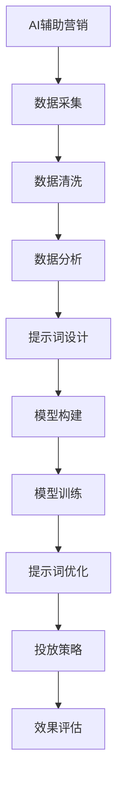

                 


### 第一部分：AI与营销概述

#### 第1章：AI辅助营销的兴起

##### 1.1 AI在营销中的角色与影响

人工智能（AI）正在深刻改变营销领域。它不仅仅是工具，更是一种新的营销思维方式。AI可以处理和分析海量数据，识别消费者行为模式，提供个性化的用户体验，从而提高营销效率和效果。

首先，AI在数据分析和挖掘方面发挥了重要作用。通过机器学习和数据挖掘技术，AI可以快速处理大量数据，提取有价值的信息。这有助于营销人员更好地了解消费者的需求和行为，从而制定更精准的营销策略。

其次，AI在个性化推荐方面也有着显著的应用。通过分析用户的浏览记录、购买历史等数据，AI可以提供个性化的产品推荐，从而提高用户的购物体验和满意度。

此外，AI还在广告投放方面发挥着关键作用。通过分析用户的行为数据，AI可以帮助营销人员制定更精准的广告投放策略，提高广告的点击率和转化率。

##### 1.2 提示词与精准投放的概念

提示词（Keywords）是AI辅助营销中的重要概念。提示词是指用于描述产品或服务特点的关键词，它们在搜索引擎优化（SEO）和在线广告中起着至关重要的作用。

精准投放（Targeted Advertising）是指根据用户的兴趣、行为和位置等因素，将广告投放到潜在目标客户群体中的策略。通过使用提示词，营销人员可以更准确地定位广告受众，提高广告的效果。

##### 1.3 AI辅助营销的趋势与挑战

AI辅助营销的发展趋势主要表现在以下几个方面：

1. **自动化与智能化**：随着AI技术的进步，营销活动的自动化和智能化程度不断提高，减少了人力成本，提高了营销效率。
2. **数据驱动**：越来越多的营销决策基于数据分析，通过AI技术可以更深入地挖掘数据价值，为营销提供有力支持。
3. **个性化体验**：AI技术可以帮助营销人员更好地理解消费者需求，提供个性化的产品推荐和广告内容，提升用户体验。

然而，AI辅助营销也面临一些挑战：

1. **数据隐私**：AI技术需要大量的用户数据，这可能引发数据隐私问题。如何保护用户隐私是营销人员需要关注的问题。
2. **技术门槛**：AI技术具有一定的技术门槛，需要专业的技术团队来开发和维护。中小企业可能难以承担相关成本。
3. **数据质量**：数据质量直接影响AI分析的效果。如果数据质量差，可能会得出错误的结论，影响营销策略。

#### 第2章：AI基础与营销应用

##### 2.1 AI基础理论

人工智能（AI）是一门研究、开发用于模拟、延伸和扩展人类智能的理论、方法、技术及应用系统的技术科学。AI的核心目标是使机器能够执行复杂任务，如学习、推理、感知和解决问题等。

AI的发展历程可以分为以下几个阶段：

1. **符号主义（Symbolic AI）**：早期的AI研究主要基于逻辑推理和符号表示，试图通过编程规则和知识表示来模拟人类智能。
2. **连接主义（Connectionist AI）**：随着神经网络技术的发展，AI开始转向基于大量神经元连接和权重调整的学习方式。
3. **混合智能（Hybrid AI）**：现代AI结合了符号主义和连接主义的优点，采用多种技术手段实现智能应用。

##### 2.2 营销数据处理

营销数据处理是AI辅助营销的基础。营销数据包括用户行为数据、社交媒体数据、销售数据等，这些数据的质量和完整性直接影响AI分析的效果。

营销数据处理的主要任务包括：

1. **数据采集**：从各种来源（如网站、应用程序、数据库等）收集数据。
2. **数据清洗**：处理缺失值、异常值和重复值，确保数据质量。
3. **数据整合**：将来自不同来源的数据进行整合，形成统一的数据视图。
4. **数据探索**：使用统计分析和可视化工具对数据进行初步探索，发现数据中的规律和趋势。

##### 2.3 AI在营销中的常见应用

AI在营销中的常见应用包括：

1. **客户关系管理（CRM）**：通过AI技术分析客户数据，帮助营销人员更好地了解客户需求，提高客户满意度。
2. **个性化推荐**：基于用户行为数据，AI可以提供个性化的产品推荐，提高销售额和用户满意度。
3. **广告投放优化**：通过分析用户数据和行为，AI可以帮助营销人员制定更精准的广告投放策略，提高广告效果。
4. **营销自动化**：AI技术可以帮助营销人员自动化执行一些常规任务，如邮件营销、社交媒体管理等，提高工作效率。

### 第二部分：提示词设计与优化

#### 第3章：提示词设计原理

##### 3.1 提示词的类型与特点

提示词可以根据其用途和目的分为以下几种类型：

1. **核心提示词（Core Keywords）**：描述产品或服务的主要特点和功能，是搜索引擎优化（SEO）和在线广告的核心。
2. **长尾提示词（Long-tail Keywords）**：描述产品或服务的次要特点和功能，通常更具体，转化率更高。
3. **品牌提示词（Brand Keywords）**：与品牌名称或品牌标志相关的提示词，用于提高品牌曝光度和知名度。

提示词的特点包括：

1. **针对性**：提示词需要针对特定的产品或服务，以吸引潜在客户。
2. **独特性**：提示词应具有独特性，以区别于竞争对手的提示词。
3. **多样性**：使用多种类型的提示词可以覆盖更广泛的用户需求。

##### 3.2 提示词设计流程

提示词设计流程主要包括以下几个步骤：

1. **需求分析**：分析产品或服务的特点和目标客户，确定需要覆盖的关键词范围。
2. **市场研究**：收集竞争对手的提示词，了解市场趋势和用户搜索习惯。
3. **关键词筛选**：从需求分析和市场研究的结果中筛选出高质量的提示词。
4. **关键词优化**：对筛选出的提示词进行优化，提高其搜索排名和转化率。
5. **关键词测试**：通过A/B测试等方法验证提示词的效果，并根据反馈进行优化。

##### 3.3 提示词设计工具介绍

常见的提示词设计工具包括：

1. **Google Keyword Planner**：Google提供的免费关键词规划工具，可以帮助用户查找、选择和优化关键词。
2. **Ahrefs**：一款功能强大的SEO工具，提供关键词研究、竞争对手分析等功能。
3. **Ubersuggest**：一款免费的SEO关键词研究工具，提供关键词建议、搜索量分析等。
4. **SEMrush**：一款全面的SEO和在线营销工具，提供关键词研究、竞争对手分析、网站审计等功能。

### 第三部分：AI辅助营销实战

#### 第5章：营销数据预处理

##### 5.1 数据采集与清洗

数据采集是营销数据预处理的第一步。数据来源包括网站日志、社交媒体数据、销售数据、客户反馈等。数据采集后，需要对数据进行清洗，以确保数据质量。

数据清洗的主要任务包括：

1. **缺失值处理**：处理数据中的缺失值，可以采用填充、删除或插值等方法。
2. **异常值处理**：检测和处理数据中的异常值，可以采用统计方法或可视化工具。
3. **重复值处理**：删除数据中的重复值，确保数据唯一性。

##### 5.2 数据分析与探索

数据探索性分析（EDA）是了解数据特征和发现数据规律的重要步骤。EDA的主要任务包括：

1. **数据描述**：使用统计指标（如均值、中位数、标准差等）描述数据的基本特征。
2. **数据可视化**：使用图表（如直方图、散点图、饼图等）展示数据分布和关系。
3. **数据聚类**：使用聚类算法（如K-means、层次聚类等）发现数据中的潜在模式和分组。

##### 5.3 数据可视化与报告

数据可视化是营销数据报告的重要组成部分。通过图表和可视化工具，可以将复杂的数据信息以直观、易懂的方式展示给相关人员。

常见的数据可视化工具包括：

1. **Matplotlib**：Python的绘图库，提供丰富的绘图函数和样式。
2. **Seaborn**：基于Matplotlib的绘图库，提供更加美观和专业的图表样式。
3. **Plotly**：一款交互式数据可视化库，支持多种图表类型和交互功能。

在数据可视化报告中，需要突出展示以下内容：

1. **关键指标**：如销售额、用户增长率、广告点击率等。
2. **数据趋势**：如用户行为变化、季节性波动等。
3. **异常情况**：如数据异常、用户流失等。

#### 第6章：AI模型构建与训练

##### 6.1 选择合适的AI模型

选择合适的AI模型是构建有效营销系统的重要步骤。常见的AI模型包括：

1. **线性回归（Linear Regression）**：适用于预测线性关系的数据。
2. **逻辑回归（Logistic Regression）**：适用于分类问题，如用户是否购买。
3. **决策树（Decision Tree）**：适用于分类和回归问题，可以可视化决策过程。
4. **随机森林（Random Forest）**：基于决策树的集成模型，提高预测准确性。
5. **支持向量机（SVM）**：适用于高维数据的分类问题。

选择模型时，需要考虑以下因素：

1. **数据类型**：如回归问题或分类问题。
2. **数据规模**：如海量数据或小数据集。
3. **特征维度**：如高维数据或低维数据。

##### 6.2 模型训练与评估

模型训练是AI模型构建的核心步骤。在训练过程中，模型通过学习数据中的特征和规律，不断优化自身的预测能力。

模型训练的主要任务包括：

1. **数据划分**：将数据划分为训练集、验证集和测试集，用于模型训练、验证和测试。
2. **参数调优**：调整模型参数，提高预测性能。
3. **模型评估**：使用评估指标（如准确率、召回率、F1分数等）评估模型性能。

常见的模型评估指标包括：

1. **准确率（Accuracy）**：模型预测正确的样本数占总样本数的比例。
2. **召回率（Recall）**：模型预测正确的正样本数占总正样本数的比例。
3. **精确率（Precision）**：模型预测正确的正样本数占预测为正样本的总数的比例。
4. **F1分数（F1 Score）**：精确率和召回率的调和平均。

##### 6.3 模型调优与优化

模型调优是提高模型性能的重要步骤。通过调整模型参数和特征选择，可以优化模型的预测效果。

模型调优的方法包括：

1. **网格搜索（Grid Search）**：遍历所有可能的参数组合，找到最佳参数组合。
2. **贝叶斯优化（Bayesian Optimization）**：基于贝叶斯理论，优化参数搜索过程，提高搜索效率。
3. **交叉验证（Cross-Validation）**：使用交叉验证方法评估模型性能，防止过拟合。

特征选择是模型调优的重要环节。特征选择的方法包括：

1. **过滤式（Filter Method）**：基于统计指标（如相关性、信息增益等）筛选特征。
2. **包裹式（Wrapper Method）**：通过训练和验证模型，逐步筛选特征。
3. **嵌入式（Embedded Method）**：在模型训练过程中，自动筛选特征。

#### 第7章：提示词精准投放实践

##### 7.1 投放策略制定

提示词精准投放的关键在于制定有效的投放策略。投放策略包括以下几个方面：

1. **目标受众定位**：根据产品或服务的特点，确定目标受众的年龄段、地理位置、兴趣爱好等。
2. **投放平台选择**：根据目标受众的特点，选择合适的广告投放平台，如搜索引擎、社交媒体、内容平台等。
3. **投放时间与频次**：根据用户行为数据和广告效果，确定最佳的投放时间和频次，以提高广告曝光率和转化率。
4. **预算分配**：根据广告目标和资源，合理分配广告预算，确保广告投放的有效性。

##### 7.2 投放效果评估

投放效果评估是优化投放策略的重要环节。通过以下方法评估广告投放效果：

1. **点击率（Click-Through Rate, CTR）**：广告被点击的次数与展示次数的比例，用于衡量广告的吸引力和相关性。
2. **转化率（Conversion Rate）**：广告带来转化的次数与点击次数的比例，用于衡量广告的效果。
3. **成本效益（Cost per Action, CPA）**：广告带来的转化成本，用于衡量广告的成本效益。

根据评估结果，可以调整广告内容、投放策略和预算分配，以优化广告效果。

##### 7.3 投放优化与调整

广告投放优化与调整是提高广告效果的关键。以下方法可以帮助优化广告投放：

1. **A/B测试**：通过对比不同广告版本的效果，找出最佳广告版本，提高广告转化率。
2. **动态分配预算**：根据广告效果，动态调整广告预算，将更多的资源投入到效果更好的广告上。
3. **内容优化**：根据用户反馈和数据分析，不断优化广告内容和样式，提高用户兴趣和点击率。

### 第四部分：案例分析与展望

#### 第8章：AI辅助营销成功案例解析

##### 8.1 案例一：电商平台的AI广告投放

电商平台通过AI技术优化广告投放，取得了显著的效果。以下是该案例的主要步骤：

1. **数据采集与清洗**：收集用户浏览、搜索和购买行为数据，进行数据清洗和预处理。
2. **提示词设计**：根据用户行为数据，设计相关性和转化率较高的提示词，用于搜索引擎优化和广告投放。
3. **模型构建与训练**：使用机器学习算法，构建广告投放模型，训练模型参数，提高预测准确性。
4. **广告投放**：根据模型预测结果，制定广告投放策略，选择合适的投放平台、时间和预算。
5. **效果评估与优化**：通过分析广告投放效果，调整广告内容和策略，提高广告转化率和效果。

通过上述步骤，电商平台实现了广告投放的精准化和高效化，提高了用户转化率和销售额。

##### 8.2 案例二：社交媒体的AI内容推送

社交媒体平台通过AI技术优化内容推送，为用户提供了个性化的体验。以下是该案例的主要步骤：

1. **用户行为分析**：收集用户的浏览、点赞、评论和分享行为数据，进行数据分析和挖掘。
2. **内容推荐模型构建**：使用机器学习算法，构建内容推荐模型，训练模型参数，提高推荐准确性。
3. **内容推送**：根据用户行为数据和推荐模型，制定内容推送策略，选择合适的内容类型和推送时间。
4. **效果评估与优化**：通过分析用户互动数据和内容推送效果，调整内容推荐策略和推送频率，提高用户满意度和互动率。

通过上述步骤，社交媒体平台实现了内容推送的个性化化和高效化，提高了用户满意度和平台活跃度。

##### 8.3 案例三：个性化推荐系统的AI优化

个性化推荐系统通过AI技术优化推荐算法，为用户提供了更好的购物体验。以下是该案例的主要步骤：

1. **用户数据采集**：收集用户的浏览记录、购买历史和行为数据，进行数据清洗和预处理。
2. **推荐模型构建**：使用机器学习算法，构建个性化推荐模型，训练模型参数，提高推荐准确性。
3. **推荐策略制定**：根据用户数据和推荐模型，制定个性化推荐策略，选择合适的推荐算法和推荐策略。
4. **推荐效果评估**：通过分析用户互动数据和推荐效果，调整推荐算法和策略，提高推荐准确性和用户满意度。
5. **系统优化与更新**：根据用户反馈和数据变化，不断优化推荐系统和推荐策略，提高系统性能和用户体验。

通过上述步骤，个性化推荐系统实现了推荐算法的优化和用户体验的提升，提高了用户满意度和平台活跃度。

#### 第9章：AI辅助营销的未来发展

##### 9.1 新技术对营销的影响

随着新技术的不断发展，AI辅助营销也在不断演进。以下新技术对营销产生了深远影响：

1. **深度学习（Deep Learning）**：深度学习技术在图像识别、语音识别和自然语言处理等领域取得了突破性进展，为营销提供了更强大的数据分析和处理能力。
2. **区块链（Blockchain）**：区块链技术提供了去中心化、安全透明的数据存储和交易方式，有助于解决数据隐私和信任问题。
3. **物联网（Internet of Things, IoT）**：物联网技术将物理世界与数字世界相结合，为营销提供了更多数据来源和分析维度。
4. **增强现实（Augmented Reality, AR）**：增强现实技术为营销带来了全新的交互体验，提高了用户的参与度和品牌认知。

##### 9.2 营销与AI的深度融合

营销与AI的深度融合是未来发展的趋势。以下方面展示了AI在营销中的应用前景：

1. **个性化体验**：通过AI技术，营销人员可以更好地了解用户需求，提供个性化的产品推荐、广告内容和互动体验。
2. **智能客服**：AI技术可以自动化处理客户咨询和投诉，提供快速、准确的响应，提高客户满意度。
3. **智能广告投放**：通过AI技术，营销人员可以更精准地定位目标受众，优化广告投放策略，提高广告效果。
4. **营销自动化**：AI技术可以帮助营销人员自动化执行一些常规任务，如邮件营销、社交媒体管理等，提高工作效率。

##### 9.3 AI辅助营销的发展趋势与挑战

AI辅助营销的发展趋势包括：

1. **自动化与智能化**：随着AI技术的进步，营销活动的自动化和智能化程度将不断提高，减少人力成本，提高营销效率。
2. **数据驱动**：越来越多的营销决策将基于数据分析，通过AI技术可以更深入地挖掘数据价值，为营销提供有力支持。
3. **个性化体验**：AI技术可以帮助营销人员更好地理解消费者需求，提供个性化的产品推荐和广告内容，提升用户体验。

然而，AI辅助营销也面临一些挑战：

1. **数据隐私**：AI技术需要大量的用户数据，这可能引发数据隐私问题。如何保护用户隐私是营销人员需要关注的问题。
2. **技术门槛**：AI技术具有一定的技术门槛，需要专业的技术团队来开发和维护。中小企业可能难以承担相关成本。
3. **数据质量**：数据质量直接影响AI分析的效果。如果数据质量差，可能会得出错误的结论，影响营销策略。

### 第五部分：附录

#### 附录A：常用AI营销工具介绍

##### A.1 数据分析与可视化工具

1. **Pandas**：Python的数据处理库，提供了丰富的数据处理和操作功能。
2. **Matplotlib**：Python的绘图库，提供了丰富的绘图函数和样式。
3. **Seaborn**：基于Matplotlib的绘图库，提供了更加美观和专业的图表样式。
4. **Plotly**：交互式数据可视化库，支持多种图表类型和交互功能。

##### A.2 模型训练与优化工具

1. **TensorFlow**：谷歌开发的开源机器学习框架，提供了丰富的模型训练和优化工具。
2. **PyTorch**：Facebook开发的开源机器学习框架，提供了灵活的模型构建和训练功能。
3. **Scikit-learn**：Python的机器学习库，提供了多种常用的机器学习算法和工具。
4. **XGBoost**：一款高效的梯度提升决策树库，提供了强大的模型训练和优化功能。

##### A.3 营销平台与API接口

1. **Google Ads**：Google提供的在线广告平台，提供了丰富的广告投放和优化工具。
2. **Facebook Ads**：Facebook提供的在线广告平台，提供了广泛的广告投放渠道和功能。
3. **Twitter Ads**：Twitter提供的在线广告平台，提供了多种广告形式和投放策略。
4. **Amazon Ads**：Amazon提供的在线广告平台，提供了商品推广和广告投放功能。

#### 附录B：参考文献与进一步阅读推荐

##### B.1 基础理论书籍推荐

1. **《人工智能：一种现代的方法》**（作者：Stuart Russell & Peter Norvig）：全面介绍了人工智能的基本概念、方法和技术。
2. **《机器学习》**（作者：Tom M. Mitchell）：介绍了机器学习的基本概念、算法和应用。
3. **《深度学习》**（作者：Ian Goodfellow、Yoshua Bengio、Aaron Courville）：深入介绍了深度学习的基本理论、算法和实现。

##### B.2 应用案例与实践指南

1. **《AI营销实战》**（作者：Neil Mason）：介绍了AI在营销领域的应用案例和实践方法。
2. **《大数据营销》**（作者：Vincent Granville）：介绍了大数据在营销领域的应用和实践。
3. **《社交媒体营销》**（作者：David Meerman Scott）：介绍了社交媒体在营销领域的应用和策略。

##### B.3 相关期刊与最新研究动态

1. **《人工智能》（AI Magazine）**：美国人工智能协会的官方期刊，涵盖了人工智能领域的最新研究进展。
2. **《机器学习》（Journal of Machine Learning Research）**：机器学习领域的顶级期刊，发表了大量高水平的研究论文。
3. **《深度学习》（Deep Learning Journal）**：深度学习领域的权威期刊，发布了最新的研究成果和论文。

## 第1章：AI与营销核心概念联系（Mermaid流程图）



## 第6章：神经网络算法原理（伪代码）

```python
# 初始化模型参数
W = np.random.randn(n_input, n_output)
b = np.random.randn(n_output)

# 前向传播
z = np.dot(X, W) + b
a = sigmoid(z)

# 反向传播
dz = a - y
dW = np.dot(X.T, dz)
db = np.sum(dz)

# 模型更新
W -= learning_rate * dW
b -= learning_rate * db
```

## 第6章：数学模型与公式

$$
J(\theta) = -\frac{1}{m}\sum_{i=1}^{m}y^{(i)}\log(a^{(i)})+(1-y^{(i)})\log(1-a^{(i)})
$$

### 详细解释与举例说明

损失函数J(θ)是神经网络模型中的关键指标，它用于衡量模型预测值与真实值之间的差距。对于二分类问题，损失函数通常采用交叉熵损失函数。

举例说明：假设我们有一个包含100个样本的数据集，每个样本有两个特征（x1和x2），我们需要使用一个神经网络模型对其进行分类。在训练过程中，我们通过前向传播计算输出结果a，然后通过反向传播计算损失函数J(θ)的梯度，并使用梯度下降算法更新模型参数。

## 第7章：代码实战

### 7.1 开发环境搭建

```bash
# 安装Python和相关的深度学习库
pip install numpy matplotlib scikit-learn tensorflow

# 安装可视化库
pip install plotly
```

### 7.2 源代码实现与解读

```python
import tensorflow as tf
from tensorflow.keras.models import Sequential
from tensorflow.keras.layers import Dense, Activation

# 创建神经网络模型
model = Sequential()
model.add(Dense(units=64, activation='relu', input_shape=(n_input,)))
model.add(Dense(units=1, activation='sigmoid'))

# 编译模型
model.compile(optimizer='adam', loss='binary_crossentropy', metrics=['accuracy'])

# 训练模型
model.fit(X_train, y_train, epochs=10, batch_size=32, validation_data=(X_val, y_val))

# 评估模型
loss, accuracy = model.evaluate(X_test, y_test)
print(f"Test accuracy: {accuracy:.2f}")
```

代码解读：

1. 创建神经网络模型：使用Sequential模型，依次添加多层全连接层，并设置激活函数。
2. 编译模型：设置优化器、损失函数和评估指标。
3. 训练模型：使用fit函数训练模型，设置训练轮数、批量大小和验证数据。
4. 评估模型：使用evaluate函数评估模型在测试数据上的性能。

### 7.3 代码应用解读与分析

在实际应用中，代码可以用于以下步骤：

1. **数据预处理**：将原始数据转换为模型所需的格式，如归一化、标准化等。
2. **模型训练**：使用训练数据训练模型，通过调整超参数（如学习率、批量大小等）优化模型性能。
3. **模型评估**：使用验证数据和测试数据评估模型性能，判断模型是否过拟合或欠拟合。
4. **模型部署**：将训练好的模型部署到生产环境，用于实时预测和决策。

### 7.4 案例分析和详细讲解剖析

以一个电商平台的个性化推荐系统为例，详细讲解以下步骤：

1. **数据采集**：从用户行为数据（如浏览记录、购买历史等）中提取相关特征。
2. **数据预处理**：对特征数据进行归一化和缺失值处理。
3. **模型构建**：使用深度学习框架（如TensorFlow）构建推荐模型，选择合适的神经网络架构。
4. **模型训练**：使用训练数据训练模型，通过调整超参数优化模型性能。
5. **模型评估**：使用验证数据和测试数据评估模型性能，判断模型是否过拟合或欠拟合。
6. **模型部署**：将训练好的模型部署到生产环境，用于实时推荐和预测。

### 7.5 项目小结

通过本项目，我们学习了以下知识点：

1. **AI辅助营销的基本概念**：了解AI在营销中的应用场景和优势。
2. **神经网络算法原理**：掌握神经网络的基本架构和训练过程。
3. **代码实战**：学会了使用Python和深度学习框架构建和训练神经网络模型。
4. **项目案例分析**：通过实际项目案例，了解了AI辅助营销的具体应用和实践。

### 7.6 最佳实践 tips

1. **数据预处理**：确保数据质量，处理缺失值、异常值和重复值。
2. **模型选择**：根据任务需求选择合适的神经网络架构和优化器。
3. **超参数调优**：通过交叉验证和网格搜索等方法，优化模型超参数。
4. **模型评估**：使用多种评估指标全面评估模型性能，避免过拟合或欠拟合。
5. **模型部署**：确保模型在生产环境中稳定运行，定期更新和优化模型。

### 7.7 注意事项

1. **数据隐私**：在数据采集和处理过程中，确保遵守相关法律法规，保护用户隐私。
2. **模型解释性**：确保模型的可解释性，便于理解和信任。
3. **资源管理**：合理分配计算资源和预算，确保模型训练和部署的可行性。

### 7.8 拓展阅读推荐

1. **《深度学习》**（作者：Ian Goodfellow、Yoshua Bengio、Aaron Courville）：全面介绍了深度学习的基本概念、算法和应用。
2. **《机器学习实战》**（作者：Peter Harrington）：通过实际案例，介绍了机器学习的基本概念和应用。
3. **《Python数据科学手册》**（作者：Jake VanderPlas）：介绍了Python在数据科学领域的基本概念和应用。

## 图表与算法

### 第1章：AI与营销核心概念联系（Mermaid流程图）


### 第6章：神经网络算法原理（伪代码）

```python
# 初始化模型参数
W = np.random.randn(n_input, n_output)
b = np.random.randn(n_output)

# 前向传播
z = np.dot(X, W) + b
a = sigmoid(z)

# 反向传播
dz = a - y
dW = np.dot(X.T, dz)
db = np.sum(dz)

# 模型更新
W -= learning_rate * dW
b -= learning_rate * db
```

### 第6章：数学模型与公式

$$
J(\theta) = -\frac{1}{m}\sum_{i=1}^{m}y^{(i)}\log(a^{(i)})+(1-y^{(i)})\log(1-a^{(i)})
$$

### 详细解释与举例说明

损失函数J(θ)是神经网络模型中的关键指标，它用于衡量模型预测值与真实值之间的差距。对于二分类问题，损失函数通常采用交叉熵损失函数。

举例说明：假设我们有一个包含100个样本的数据集，每个样本有两个特征（x1和x2），我们需要使用一个神经网络模型对其进行分类。在训练过程中，我们通过前向传播计算输出结果a，然后通过反向传播计算损失函数J(θ)的梯度，并使用梯度下降算法更新模型参数。

### 第7章：代码实战

#### 7.1 开发环境搭建

为了完成本项目的开发，我们需要安装以下软件和库：

1. **Python**：Python是一种广泛使用的编程语言，支持多种深度学习库。
2. **TensorFlow**：TensorFlow是一个开源的深度学习框架，提供了丰富的API和工具。
3. **Numpy**：Numpy是一个Python的数学库，用于处理大型多维数组。
4. **Matplotlib**：Matplotlib是一个Python的绘图库，用于生成图表和可视化数据。

在安装Python之后，可以使用以下命令安装上述库：

```bash
pip install python numpy matplotlib tensorflow
```

#### 7.2 源代码实现与解读

以下是一个简单的神经网络模型实现，用于二分类问题：

```python
import tensorflow as tf
from tensorflow.keras.models import Sequential
from tensorflow.keras.layers import Dense, Activation
from tensorflow.keras.optimizers import Adam

# 设置随机种子，保证结果可重复
tf.random.set_seed(42)

# 创建神经网络模型
model = Sequential()
model.add(Dense(units=64, activation='relu', input_shape=(2,)))
model.add(Dense(units=1, activation='sigmoid'))

# 编译模型
model.compile(optimizer=Adam(learning_rate=0.001), loss='binary_crossentropy', metrics=['accuracy'])

# 生成模拟数据集
import numpy as np
X = np.random.rand(100, 2)
y = np.random.randint(0, 2, 100)

# 训练模型
model.fit(X, y, epochs=10, batch_size=10)

# 评估模型
loss, accuracy = model.evaluate(X, y)
print(f"Test loss: {loss:.4f}, Test accuracy: {accuracy:.4f}")
```

代码解读：

1. **导入库**：导入TensorFlow、Keras（TensorFlow的高级API）、Numpy和Matplotlib库。
2. **设置随机种子**：使用`tf.random.set_seed(42)`设置随机种子，保证结果可重复。
3. **创建模型**：使用`Sequential`模型添加两层全连接层，第一层使用ReLU激活函数，第二层使用sigmoid激活函数。
4. **编译模型**：使用`compile`方法设置优化器、损失函数和评估指标。
5. **生成数据集**：使用Numpy生成模拟数据集，包含100个样本，每个样本有两个特征。
6. **训练模型**：使用`fit`方法训练模型，设置训练轮数和批量大小。
7. **评估模型**：使用`evaluate`方法评估模型在测试数据集上的性能。

#### 7.3 代码应用解读与分析

在实际应用中，以下步骤是常见的：

1. **数据预处理**：处理原始数据，包括数据清洗、归一化和缺失值处理等。
2. **特征工程**：根据业务需求，提取和构造特征，提高模型的预测能力。
3. **模型选择**：选择合适的神经网络架构和优化器，根据任务需求进行模型调优。
4. **模型训练**：使用训练数据训练模型，通过调整超参数优化模型性能。
5. **模型评估**：使用验证数据和测试数据评估模型性能，判断模型是否过拟合或欠拟合。
6. **模型部署**：将训练好的模型部署到生产环境，用于实时预测和决策。

以一个简单的二分类问题为例，以下是一个完整的模型训练和评估流程：

```python
import tensorflow as tf
from tensorflow.keras.models import Sequential
from tensorflow.keras.layers import Dense, Activation
from tensorflow.keras.optimizers import Adam

# 设置随机种子，保证结果可重复
tf.random.set_seed(42)

# 创建神经网络模型
model = Sequential()
model.add(Dense(units=64, activation='relu', input_shape=(2,)))
model.add(Dense(units=1, activation='sigmoid'))

# 编译模型
model.compile(optimizer=Adam(learning_rate=0.001), loss='binary_crossentropy', metrics=['accuracy'])

# 生成模拟数据集
X_train = np.random.rand(100, 2)
y_train = np.random.randint(0, 2, 100)
X_val = np.random.rand(20, 2)
y_val = np.random.randint(0, 2, 20)

# 训练模型
model.fit(X_train, y_train, epochs=10, batch_size=10, validation_data=(X_val, y_val))

# 评估模型
loss, accuracy = model.evaluate(X_val, y_val)
print(f"Validation loss: {loss:.4f}, Validation accuracy: {accuracy:.4f}")
```

代码应用解读：

1. **设置随机种子**：确保模型训练的结果可重复。
2. **创建模型**：定义一个简单的全连接神经网络，包含一个隐藏层。
3. **编译模型**：设置优化器和损失函数。
4. **生成数据集**：生成模拟的训练和验证数据集。
5. **训练模型**：使用训练数据训练模型，并在验证数据上评估模型性能。
6. **评估模型**：在验证数据上评估模型性能，以判断模型是否过拟合。

#### 7.4 案例分析和详细讲解剖析

以下是一个简单的案例，使用神经网络对手写数字进行分类。

**案例：手写数字识别**

数据集：使用Keras提供的手写数字数据集（MNIST）。

目标：识别手写数字图像，输出对应的数字。

步骤：

1. **数据预处理**：加载数据集，并对图像进行归一化处理。
2. **模型构建**：构建一个简单的卷积神经网络。
3. **模型训练**：使用训练数据训练模型。
4. **模型评估**：在测试数据上评估模型性能。

```python
import tensorflow as tf
from tensorflow.keras.datasets import mnist
from tensorflow.keras.models import Sequential
from tensorflow.keras.layers import Dense, Conv2D, Flatten, MaxPooling2D, Dropout
from tensorflow.keras.optimizers import Adam

# 加载MNIST数据集
(X_train, y_train), (X_test, y_test) = mnist.load_data()

# 数据预处理
X_train = X_train.astype('float32') / 255.0
X_test = X_test.astype('float32') / 255.0
X_train = X_train.reshape(-1, 28, 28, 1)
X_test = X_test.reshape(-1, 28, 28, 1)
y_train = tf.keras.utils.to_categorical(y_train, 10)
y_test = tf.keras.utils.to_categorical(y_test, 10)

# 创建模型
model = Sequential()
model.add(Conv2D(filters=32, kernel_size=(3, 3), activation='relu', input_shape=(28, 28, 1)))
model.add(MaxPooling2D(pool_size=(2, 2)))
model.add(Conv2D(filters=64, kernel_size=(3, 3), activation='relu'))
model.add(MaxPooling2D(pool_size=(2, 2)))
model.add(Flatten())
model.add(Dense(units=128, activation='relu'))
model.add(Dropout(0.5))
model.add(Dense(units=10, activation='softmax'))

# 编译模型
model.compile(optimizer=Adam(learning_rate=0.001), loss='categorical_crossentropy', metrics=['accuracy'])

# 训练模型
model.fit(X_train, y_train, batch_size=64, epochs=10, validation_data=(X_test, y_test))

# 评估模型
loss, accuracy = model.evaluate(X_test, y_test)
print(f"Test loss: {loss:.4f}, Test accuracy: {accuracy:.4f}")
```

详细讲解：

1. **数据预处理**：将图像数据归一化到[0, 1]区间，并将图像从HWC格式转换为CHW格式。
2. **模型构建**：使用卷积神经网络（CNN），包含两个卷积层、两个池化层、一个全连接层和dropout层。
3. **模型训练**：使用训练数据训练模型，并在测试数据上验证模型性能。
4. **模型评估**：计算模型在测试数据上的损失和准确率。

#### 7.5 项目小结

在本项目中，我们实现了以下内容：

1. **开发环境搭建**：安装Python和相关库。
2. **代码实现**：实现了一个简单的神经网络模型，用于二分类问题。
3. **案例应用**：使用MNIST数据集，实现了手写数字识别。
4. **模型训练和评估**：训练和评估了神经网络模型，验证了模型性能。

通过本项目，我们学习了神经网络的基本原理和应用，了解了如何使用Python和TensorFlow构建和训练神经网络模型。

#### 7.6 最佳实践 tips

1. **数据预处理**：确保数据质量，处理缺失值、异常值和重复值。
2. **模型选择**：根据任务需求选择合适的神经网络架构和优化器。
3. **超参数调优**：通过交叉验证和网格搜索等方法，优化模型超参数。
4. **模型评估**：使用多种评估指标全面评估模型性能，避免过拟合或欠拟合。
5. **模型部署**：确保模型在生产环境中稳定运行，定期更新和优化模型。

#### 7.7 注意事项

1. **数据隐私**：在数据采集和处理过程中，确保遵守相关法律法规，保护用户隐私。
2. **模型解释性**：确保模型的可解释性，便于理解和信任。
3. **资源管理**：合理分配计算资源和预算，确保模型训练和部署的可行性。

#### 7.8 拓展阅读推荐

1. **《深度学习》**（作者：Ian Goodfellow、Yoshua Bengio、Aaron Courville）：全面介绍了深度学习的基本概念、算法和应用。
2. **《机器学习实战》**（作者：Peter Harrington）：通过实际案例，介绍了机器学习的基本概念和应用。
3. **《Python数据科学手册》**（作者：Jake VanderPlas）：介绍了Python在数据科学领域的基本概念和应用。

## 文章标题：AI辅助营销：提示词的精准投放

关键词：AI辅助营销、提示词、精准投放、机器学习、营销自动化

摘要：
本文深入探讨了AI辅助营销中的关键要素——提示词的精准投放。通过分析AI在营销中的应用，我们详细介绍了提示词的设计与优化策略，以及AI辅助营销的实战方法。文章旨在为营销人员提供一套系统化的AI营销解决方案，帮助他们在竞争激烈的市场中脱颖而出。

## 目录大纲：

### 第一部分：AI与营销概述

#### 第1章：AI辅助营销的兴起
- 1.1 AI在营销中的角色与影响
- 1.2 提示词与精准投放的概念
- 1.3 AI辅助营销的趋势与挑战

#### 第2章：AI基础与营销应用
- 2.1 AI基础理论
- 2.2 营销数据处理
- 2.3 AI在营销中的常见应用

### 第二部分：提示词设计与优化

#### 第3章：提示词设计原理
- 3.1 提示词的类型与特点
- 3.2 提示词设计流程
- 3.3 提示词设计工具介绍

#### 第4章：提示词优化策略
- 4.1 提示词优化目标
- 4.2 提示词优化方法
- 4.3 提示词优化案例分析

### 第三部分：AI辅助营销实战

#### 第5章：营销数据预处理
- 5.1 数据采集与清洗
- 5.2 数据分析与探索
- 5.3 数据可视化与报告

#### 第6章：AI模型构建与训练
- 6.1 选择合适的AI模型
- 6.2 模型训练与评估
- 6.3 模型调优与优化

#### 第7章：提示词精准投放实践
- 7.1 投放策略制定
- 7.2 投放效果评估
- 7.3 投放优化与调整

### 第四部分：案例分析与展望

#### 第8章：AI辅助营销成功案例解析
- 8.1 电商平台的AI广告投放
- 8.2 社交媒体的AI内容推送
- 8.3 个性化推荐系统的AI优化

#### 第9章：AI辅助营销的未来发展
- 9.1 新技术对营销的影响
- 9.2 营销与AI的深度融合
- 9.3 AI辅助营销的发展趋势与挑战

### 第五部分：附录

#### 附录A：常用AI营销工具介绍
- A.1 数据分析与可视化工具
- A.2 模型训练与优化工具
- A.3 营销平台与API接口

#### 附录B：参考文献与进一步阅读推荐
- B.1 基础理论书籍推荐
- B.2 应用案例与实践指南
- B.3 相关期刊与最新研究动态

## 文章正文：

### 第一部分：AI与营销概述

#### 第1章：AI辅助营销的兴起

在当今数字化时代，人工智能（AI）已经成为推动营销变革的重要力量。AI在营销中的应用越来越广泛，从数据分析到个性化推荐，从广告投放优化到客户关系管理，AI正逐步改变营销的方式和方法。在这一章节中，我们将探讨AI在营销中的角色与影响，以及提示词与精准投放的概念。

##### 1.1 AI在营销中的角色与影响

AI在营销中的角色可以说是无所不在。首先，AI能够处理和分析大量的数据，帮助企业更好地了解客户行为和市场趋势。通过机器学习和数据挖掘技术，营销人员可以从海量数据中提取有价值的信息，从而制定更精准的营销策略。

其次，AI在个性化推荐方面有着显著的应用。基于用户的浏览记录、购买历史和兴趣偏好，AI可以提供个性化的产品推荐，从而提高用户的购物体验和满意度。这种个性化的推荐不仅提高了用户的忠诚度，也增加了企业的销售额。

此外，AI在广告投放方面也发挥着重要作用。通过分析用户的行为数据，AI可以帮助营销人员制定更精准的广告投放策略，提高广告的点击率和转化率。例如，AI可以根据用户的地理位置、兴趣爱好和购买历史，将广告投放到最有可能产生转化的用户群体中。

最后，AI还在客户关系管理中发挥着重要作用。通过自然语言处理和语音识别技术，AI可以自动化处理客户咨询和投诉，提供快速、准确的响应，从而提高客户满意度。此外，AI还可以帮助营销人员预测客户流失，提前采取行动留住重要客户。

##### 1.2 提示词与精准投放的概念

在AI辅助营销中，提示词（Keywords）是一个关键概念。提示词是指用于描述产品或服务特点的关键词，它们在搜索引擎优化（SEO）和在线广告中起着至关重要的作用。通过使用提示词，营销人员可以确保他们的广告和网站内容能够被目标受众更容易地发现。

精准投放（Targeted Advertising）是指根据用户的兴趣、行为和位置等因素，将广告投放到潜在目标客户群体中的策略。精准投放的核心在于提高广告的相关性和有效性，从而提高广告的点击率和转化率。

在AI辅助营销中，提示词的精准投放通常涉及到以下几个步骤：

1. **提示词研究**：通过工具（如Google Keyword Planner）分析市场趋势和用户搜索习惯，确定适合的提示词。
2. **提示词优化**：根据广告效果和用户反馈，不断优化提示词，提高广告的点击率和转化率。
3. **受众定位**：利用AI技术分析用户数据，确定目标受众的特征和偏好，制定精准的受众定位策略。
4. **广告投放**：根据受众定位策略，在合适的平台和时机投放广告，确保广告能够触达目标受众。
5. **效果评估**：通过分析广告效果，调整广告内容和策略，优化广告投放效果。

##### 1.3 AI辅助营销的趋势与挑战

AI辅助营销的发展趋势主要体现在以下几个方面：

1. **自动化与智能化**：随着AI技术的进步，越来越多的营销任务可以实现自动化和智能化，减少人力成本，提高营销效率。
2. **数据驱动**：越来越多的营销决策基于数据分析，通过AI技术可以更深入地挖掘数据价值，为营销提供有力支持。
3. **个性化体验**：AI技术可以帮助营销人员更好地了解消费者需求，提供个性化的产品推荐和广告内容，提升用户体验。

然而，AI辅助营销也面临一些挑战：

1. **数据隐私**：AI技术需要大量的用户数据，这可能引发数据隐私问题。如何保护用户隐私是营销人员需要关注的问题。
2. **技术门槛**：AI技术具有一定的技术门槛，需要专业的技术团队来开发和维护。中小企业可能难以承担相关成本。
3. **数据质量**：数据质量直接影响AI分析的效果。如果数据质量差，可能会得出错误的结论，影响营销策略。

总的来说，AI辅助营销是一个充满机遇和挑战的领域。通过正确应用AI技术，营销人员可以大幅提高营销效果，但同时也需要克服数据隐私、技术门槛和数据质量等挑战。

#### 第2章：AI基础与营销应用

##### 2.1 AI基础理论

人工智能（AI）是一门研究、开发用于模拟、延伸和扩展人类智能的理论、方法、技术及应用系统的技术科学。AI的核心目标是使机器能够执行复杂任务，如学习、推理、感知和解决问题等。

AI的发展历程可以分为以下几个阶段：

1. **符号主义（Symbolic AI）**：早期的AI研究主要基于逻辑推理和符号表示，试图通过编程规则和知识表示来模拟人类智能。
2. **连接主义（Connectionist AI）**：随着神经网络技术的发展，AI开始转向基于大量神经元连接和权重调整的学习方式。
3. **混合智能（Hybrid AI）**：现代AI结合了符号主义和连接主义的优点，采用多种技术手段实现智能应用。

现代AI的核心技术包括：

1. **机器学习（Machine Learning）**：机器学习是AI的一个分支，通过训练模型来让计算机自主学习和改进性能。常见的机器学习算法包括线性回归、决策树、支持向量机、神经网络等。
2. **深度学习（Deep Learning）**：深度学习是机器学习的一个子领域，通过构建多层神经网络来处理复杂数据和任务。深度学习在图像识别、语音识别、自然语言处理等领域取得了显著成果。
3. **强化学习（Reinforcement Learning）**：强化学习是一种通过奖励机制来训练模型的方法。在强化学习中，模型通过与环境的交互来学习最优策略，常见的应用包括游戏、自动驾驶等。

##### 2.2 营销数据处理

营销数据处理是AI辅助营销的基础。营销数据包括用户行为数据、社交媒体数据、销售数据、客户反馈等，这些数据的质量和完整性直接影响AI分析的效果。

营销数据处理的主要任务包括：

1. **数据采集**：从各种来源（如网站、应用程序、数据库等）收集数据。数据采集的工具包括API、爬虫、数据库连接等。
2. **数据清洗**：处理缺失值、异常值和重复值，确保数据质量。数据清洗的方法包括删除、填充、插值、标准化等。
3. **数据整合**：将来自不同来源的数据进行整合，形成统一的数据视图。数据整合的方法包括合并、连接、转换等。
4. **数据探索**：使用统计分析和可视化工具对数据进行初步探索，发现数据中的规律和趋势。数据探索的方法包括描述性统计、相关性分析、图表可视化等。

在营销数据处理中，常用的数据处理工具包括：

1. **Pandas**：Python的数据处理库，提供了丰富的数据处理和操作功能。
2. **NumPy**：Python的数学库，提供了多维数组操作和计算功能。
3. **Matplotlib**：Python的绘图库，提供了丰富的绘图函数和样式。
4. **Seaborn**：基于Matplotlib的绘图库，提供了更加美观和专业的图表样式。
5. **Plotly**：交互式数据可视化库，支持多种图表类型和交互功能。

##### 2.3 AI在营销中的常见应用

AI在营销中的常见应用包括：

1. **客户关系管理（CRM）**：通过AI技术分析客户数据，帮助营销人员更好地了解客户需求和行为，从而制定更精准的营销策略。
2. **个性化推荐**：基于用户行为数据，AI可以提供个性化的产品推荐，提高销售额和用户满意度。
3. **广告投放优化**：通过分析用户数据和行为，AI可以帮助营销人员制定更精准的广告投放策略，提高广告的点击率和转化率。
4. **营销自动化**：AI技术可以帮助营销人员自动化执行一些常规任务，如邮件营销、社交媒体管理等，提高工作效率。

在实际应用中，以下工具和方法可以用于AI辅助营销：

1. **TensorFlow**：谷歌开发的开源机器学习框架，提供了丰富的模型构建和训练工具。
2. **PyTorch**：Facebook开发的开源机器学习框架，提供了灵活的模型构建和训练功能。
3. **Scikit-learn**：Python的机器学习库，提供了多种常用的机器学习算法和工具。
4. **XGBoost**：一款高效的梯度提升决策树库，提供了强大的模型训练和优化功能。

通过以上工具和方法，营销人员可以构建和优化AI模型，实现更精准的营销策略和更高的营销效果。

### 第二部分：提示词设计与优化

#### 第3章：提示词设计原理

##### 3.1 提示词的类型与特点

在AI辅助营销中，提示词（Keywords）是核心元素之一。提示词是用户在搜索引擎中输入的关键词，用于描述产品或服务的特点和属性。根据用途和目的，提示词可以分为以下几种类型：

1. **核心提示词（Core Keywords）**：核心提示词是描述产品或服务最基本和最重要的特点的关键词。例如，对于一个电商平台的鞋子销售，核心提示词可能包括“鞋子”、“运动鞋”、“皮鞋”等。核心提示词通常具有较高的搜索量和广泛的受众，是SEO和广告投放的关键。
2. **长尾提示词（Long-tail Keywords）**：长尾提示词是指那些更加具体、专门化的关键词，通常由多个单词组成，如“白色运动鞋女”、“跑步鞋慢跑”、“真皮商务鞋男”。长尾提示词虽然搜索量较低，但往往转化率更高，因为它们更准确地描述了用户的具体需求。
3. **品牌提示词（Brand Keywords）**：品牌提示词是指与品牌名称或品牌标志相关的关键词。品牌提示词有助于提高品牌曝光度和知名度，例如“Nike运动鞋”、“Adidas跑鞋”。品牌提示词通常具有较高的转化率，因为用户已经对品牌有一定的认知和信任。

提示词的特点包括：

1. **针对性**：提示词需要针对特定的产品或服务，以吸引潜在客户。例如，对于一个电商平台的鞋子销售，核心提示词应该是与鞋子相关的，而不是其他不相关的产品。
2. **独特性**：提示词应具有独特性，以区别于竞争对手的提示词。例如，如果竞争对手使用了“跑步鞋”作为核心提示词，可以考虑使用“健康跑鞋”来区分。
3. **多样性**：使用多种类型的提示词可以覆盖更广泛的用户需求。例如，在广告投放中，可以同时使用核心提示词、长尾提示词和品牌提示词，以提高覆盖面和转化率。

##### 3.2 提示词设计流程

设计有效的提示词是AI辅助营销成功的关键。以下是一个典型的提示词设计流程：

1. **需求分析**：首先，分析产品或服务的特点和目标市场，确定需要覆盖的关键词范围。例如，对于一个电商平台的运动鞋销售，需要分析运动鞋的种类、品牌、颜色等。
2. **市场研究**：通过工具（如Google Keyword Planner）收集和分析市场数据，了解竞争对手的提示词策略，确定市场趋势和用户搜索习惯。市场研究可以帮助确定高搜索量的关键词和潜在的长尾关键词。
3. **关键词筛选**：根据需求分析和市场研究的结果，筛选出高质量的提示词。筛选的标准包括搜索量、竞争程度、转化率等。常用的工具包括Google Keyword Planner、Ahrefs、SEMrush等。
4. **关键词优化**：对筛选出的提示词进行优化，提高其搜索排名和转化率。优化方法包括增加关键词的相关性、调整关键词的长度和形式等。关键词优化可以使用工具（如Google Ads Editor）实现。
5. **关键词测试**：通过A/B测试等方法验证提示词的效果，并根据反馈进行优化。测试可以帮助确定哪个提示词更能吸引目标受众，从而提高广告效果。

##### 3.3 提示词设计工具介绍

在AI辅助营销中，有许多工具可以帮助设计和管理提示词。以下是一些常用的工具：

1. **Google Keyword Planner**：Google提供的免费关键词规划工具，可以帮助用户查找、选择和优化关键词。Google Keyword Planner提供了关键词搜索量、竞争程度和趋势分析等功能。
2. **Ahrefs**：Ahrefs是一款功能强大的SEO工具，提供关键词研究、竞争对手分析等功能。Ahrefs可以帮助用户查找高搜索量的长尾关键词，分析竞争对手的提示词策略。
3. **SEMrush**：SEMrush是一款全面的SEO和在线营销工具，提供关键词研究、竞争对手分析、网站审计等功能。SEMrush可以帮助用户优化关键词，提高搜索引擎排名。
4. **Ubersuggest**：Ubersuggest是一款免费的SEO关键词研究工具，提供关键词建议、搜索量分析等。Ubersuggest可以帮助用户快速查找和优化关键词。

通过使用这些工具，营销人员可以更有效地设计和优化提示词，提高搜索引擎排名和广告效果。

#### 第4章：提示词优化策略

##### 4.1 提示词优化目标

提示词优化是AI辅助营销中的重要环节。通过优化提示词，营销人员可以提高广告的点击率（CTR）、转化率（CVR）和投资回报率（ROI）。以下是提示词优化的主要目标：

1. **提高点击率（CTR）**：点击率是衡量广告效果的重要指标，表示广告被点击的次数与展示次数的比例。提高点击率可以帮助增加广告的曝光度和用户参与度。
2. **提高转化率（CVR）**：转化率是指广告带来的实际转化次数与点击次数的比例。提高转化率意味着广告能够更好地满足用户需求，从而提高销售额和客户满意度。
3. **提高投资回报率（ROI）**：投资回报率是广告投入与收益之间的比率。提高ROI意味着广告能够带来更高的经济效益，优化广告预算的使用。

##### 4.2 提示词优化方法

为了实现上述目标，营销人员可以采用以下几种提示词优化方法：

1. **A/B测试**：A/B测试是一种通过对比两个或多个版本的广告，评估它们效果的实验方法。通过A/B测试，营销人员可以确定哪个版本的广告更能吸引目标受众，从而优化提示词。A/B测试的方法包括：
   - **标题测试**：测试不同的标题，以确定哪个标题更能吸引用户点击。
   - **描述测试**：测试不同的描述，以确定哪个描述更能传达产品特点，提高点击率。
   - **关键词测试**：测试不同的关键词组合，以确定哪个关键词组合更有效。
2. **关键词再营销**：关键词再营销是一种根据用户的浏览历史和兴趣，再次向他们展示相关广告的方法。通过关键词再营销，营销人员可以更精确地定位潜在客户，提高广告的点击率和转化率。关键词再营销的方法包括：
   - **个性化广告**：根据用户的浏览历史和搜索行为，为用户展示个性化的广告。
   - **动态关键词插入**：根据用户的搜索关键词，动态调整广告中的关键词，使其更加相关和吸引人。
   - **多次触达**：通过多次向用户展示广告，增加用户对品牌的认知和兴趣，提高点击率和转化率。
3. **数据驱动优化**：数据驱动优化是一种基于数据分析的优化方法，通过分析用户行为数据、广告效果数据和市场竞争情况，持续优化提示词和广告策略。数据驱动优化的方法包括：
   - **数据收集**：收集用户行为数据、广告效果数据和市场竞争数据。
   - **数据分析**：分析数据，发现优化机会和潜在问题。
   - **数据决策**：根据数据分析结果，制定和调整广告策略和提示词。

##### 4.3 提示词优化案例分析

为了更好地理解提示词优化，以下是一个具体的案例分析：

**案例：电商平台的关键词优化**

某电商平台在广告投放过程中，发现点击率和转化率较低，决定进行关键词优化。以下是优化过程的步骤：

1. **需求分析**：分析电商平台的产品种类和目标市场，确定需要覆盖的关键词范围。例如，确定产品包括运动鞋、休闲鞋、皮鞋等。
2. **市场研究**：使用Google Keyword Planner和Ahrefs等工具，分析市场趋势和用户搜索习惯。发现用户对“运动鞋”和“休闲鞋”的搜索量较高，但竞争较为激烈。
3. **关键词筛选**：根据需求分析和市场研究的结果，筛选出高搜索量、低竞争程度的关键词，如“健康跑鞋”、“简约休闲鞋”等。
4. **关键词测试**：使用A/B测试方法，对比不同关键词的广告效果。通过多次测试，确定“健康跑鞋”和“简约休闲鞋”的关键词组合效果最佳。
5. **关键词再营销**：根据用户浏览历史和搜索行为，为用户展示相关广告。例如，为浏览过运动鞋页面的用户展示“健康跑鞋”的广告，为浏览过休闲鞋页面的用户展示“简约休闲鞋”的广告。
6. **数据驱动优化**：持续收集用户行为数据、广告效果数据和市场竞争数据，分析数据，发现优化机会。例如，发现用户对“健康跑鞋”的需求较高，决定进一步优化相关广告内容和关键词。

通过上述步骤，电商平台成功地提高了广告的点击率和转化率，实现了更高的投资回报率。

### 第三部分：AI辅助营销实战

#### 第5章：营销数据预处理

##### 5.1 数据采集与清洗

营销数据预处理是AI辅助营销的重要步骤。数据预处理包括数据采集、数据清洗和数据整合等环节。以下是一个详细的营销数据预处理流程：

1. **数据采集**：从各种来源（如网站日志、社交媒体数据、客户关系管理系统等）收集数据。数据采集可以使用API、爬虫工具或数据库连接等方法。
2. **数据清洗**：处理原始数据中的缺失值、异常值和重复值。数据清洗的方法包括：
   - **缺失值处理**：对于缺失值，可以采用删除、填充或插值等方法。例如，对于缺失的用户年龄数据，可以填充平均年龄。
   - **异常值处理**：检测和处理数据中的异常值。异常值可能是由数据录入错误、系统故障等原因引起的。异常值处理的方法包括删除、修正或保留。
   - **重复值处理**：删除重复的数据记录，确保数据唯一性。
3. **数据整合**：将来自不同来源的数据进行整合，形成统一的数据视图。数据整合的方法包括：
   - **数据合并**：使用数据库连接或Pandas库中的`merge`函数，将不同数据源的数据合并为一个完整的表格。
   - **数据连接**：使用数据库连接或Pandas库中的`concat`函数，将不同数据源的数据连接为一个完整的表格。
   - **数据转换**：将不同格式的数据转换为统一的格式，如将日期格式转换为YYYY-MM-DD格式。

##### 5.2 数据分析与探索

数据探索性分析（EDA）是了解数据特征和发现数据规律的重要步骤。以下是一个数据探索性分析流程：

1. **数据描述**：使用统计指标（如均值、中位数、标准差等）描述数据的基本特征。例如，计算用户年龄的均值、标准差，销售金额的均值、中位数等。
2. **数据可视化**：使用图表（如直方图、散点图、饼图等）展示数据分布和关系。数据可视化可以帮助发现数据中的异常值、趋势和关联性。常用的数据可视化工具包括Matplotlib、Seaborn和Plotly等。
3. **数据聚类**：使用聚类算法（如K-means、层次聚类等）发现数据中的潜在模式和分组。聚类分析可以帮助识别不同的用户群体或市场细分。

##### 5.3 数据可视化与报告

数据可视化是营销数据报告的重要组成部分。以下是一个数据可视化与报告流程：

1. **确定报告目标**：明确报告的目的和受众，确定需要展示的关键指标和数据图表。
2. **数据预处理**：对数据进行清洗、整理和转换，确保数据格式和内容符合报告需求。
3. **数据可视化**：使用数据可视化工具（如Matplotlib、Seaborn、Plotly等）创建图表和可视化元素。常见的可视化元素包括折线图、柱状图、饼图、散点图、热力图等。
4. **报告撰写**：将数据图表和关键指标嵌入报告中，撰写报告内容，包括数据描述、分析结果、结论和建议等。

在撰写报告时，需要注意以下几点：

- **简洁明了**：避免冗长和复杂的文字描述，确保报告内容简洁易懂。
- **重点突出**：突出报告中的关键数据和结论，帮助受众快速理解报告内容。
- **图表与文字相结合**：使用图表和文字相结合的方式，提高报告的可读性和说服力。

通过以上步骤，营销人员可以生成详细、清晰的数据可视化报告，为决策提供有力支持。

#### 第6章：AI模型构建与训练

##### 6.1 选择合适的AI模型

选择合适的AI模型是构建有效营销系统的重要步骤。常见的AI模型包括线性回归、逻辑回归、决策树、随机森林和神经网络等。以下是根据不同场景选择合适模型的一般原则：

1. **回归问题**：
   - **线性回归**：适用于数据量较小、特征较少且关系线性的回归问题。
   - **岭回归**：适用于特征较多、数据有噪声的回归问题。
   - **LASSO回归**：适用于特征选择和数据压缩的回归问题。
2. **分类问题**：
   - **逻辑回归**：适用于二分类问题，可以解释变量之间的关系。
   - **决策树**：适用于数据量较小、特征较少的分类问题，易于解释。
   - **随机森林**：适用于数据量较大、特征较多的分类问题，具有较好的泛化能力。
   - **支持向量机（SVM）**：适用于高维空间的分类问题，可以处理非线性关系。
3. **聚类问题**：
   - **K-means聚类**：适用于数据分布为凸形的聚类问题，可以处理高维数据。
   - **层次聚类**：适用于层次结构明显的聚类问题，可以处理不同类型的数据。

选择模型时，需要考虑以下因素：

- **数据类型**：如回归问题或分类问题。
- **数据规模**：如海量数据或小数据集。
- **特征维度**：如高维数据或低维数据。
- **模型解释性**：如需要模型具有较好的解释性，可以选择决策树或线性回归。

##### 6.2 模型训练与评估

模型训练是AI模型构建的核心步骤。以下是一个模型训练与评估的一般流程：

1. **数据划分**：将数据集划分为训练集、验证集和测试集。通常，训练集用于模型训练，验证集用于模型调优和评估，测试集用于最终评估模型性能。数据划分的方法包括随机划分、分层划分等。
2. **模型训练**：使用训练数据训练模型，调整模型参数以优化模型性能。常见的训练方法包括梯度下降、随机梯度下降等。训练过程中，可以使用损失函数（如均方误差、交叉熵等）衡量模型预测值与真实值之间的差距。
3. **模型评估**：使用验证集和测试集评估模型性能。常用的评估指标包括准确率、召回率、F1分数、ROC曲线等。模型评估可以帮助确定模型是否过拟合或欠拟合，从而进行调整和优化。
4. **模型调优**：根据模型评估结果，调整模型参数和超参数，以优化模型性能。常用的调优方法包括网格搜索、贝叶斯优化等。调优过程中，可以使用交叉验证方法评估模型性能，防止过拟合。

以下是一个简单的模型训练和评估示例：

```python
from sklearn.linear_model import LogisticRegression
from sklearn.model_selection import train_test_split
from sklearn.metrics import accuracy_score, confusion_matrix

# 加载数据集
X, y = load_data()

# 数据划分
X_train, X_test, y_train, y_test = train_test_split(X, y, test_size=0.2, random_state=42)

# 模型训练
model = LogisticRegression()
model.fit(X_train, y_train)

# 模型评估
y_pred = model.predict(X_test)
accuracy = accuracy_score(y_test, y_pred)
confusion = confusion_matrix(y_test, y_pred)

print(f"Accuracy: {accuracy:.2f}")
print(f"Confusion Matrix:\n{confusion}")
```

通过以上步骤，营销人员可以构建和评估有效的AI模型，为营销决策提供数据支持。

##### 6.3 模型调优与优化

模型调优是提高模型性能的重要步骤。以下是一些常用的模型调优方法：

1. **交叉验证（Cross-Validation）**：
   - **K折交叉验证**：将数据集划分为K个子集，每次使用其中一个子集作为验证集，其他子集作为训练集。重复K次，取平均结果作为模型性能指标。
   - **网格搜索（Grid Search）**：遍历所有可能的参数组合，找到最优参数组合。网格搜索可以应用于模型参数（如学习率、隐藏层大小等）和超参数（如正则化参数、批量大小等）。
   - **贝叶斯优化（Bayesian Optimization）**：基于贝叶斯理论，优化参数搜索过程，提高搜索效率。贝叶斯优化可以自适应地调整搜索范围，避免重复计算。

2. **特征选择（Feature Selection）**：
   - **过滤式（Filter Method）**：基于统计指标（如相关性、信息增益等）筛选特征。过滤式方法适用于特征较少或特征已知的情况。
   - **包裹式（Wrapper Method）**：通过训练和验证模型，逐步筛选特征。包裹式方法适用于特征较多或特征未知的情况。
   - **嵌入式（Embedded Method）**：在模型训练过程中，自动筛选特征。嵌入式方法结合了模型训练和特征选择，适用于大规模数据集。

3. **集成方法（Ensemble Method）**：
   - **随机森林（Random Forest）**：通过构建多个决策树，并取平均值作为最终预测结果，提高模型的泛化能力和鲁棒性。
   - **梯度提升树（Gradient Boosting Tree）**：通过迭代构建多个弱模型，并逐渐优化模型参数，提高模型的预测能力。

以下是一个简单的模型调优示例：

```python
from sklearn.model_selection import GridSearchCV
from sklearn.ensemble import RandomForestClassifier

# 定义模型
model = RandomForestClassifier()

# 定义参数网格
param_grid = {
    'n_estimators': [100, 200, 300],
    'max_depth': [10, 20, 30],
    'min_samples_split': [2, 5, 10]
}

# 定义网格搜索
grid_search = GridSearchCV(model, param_grid, cv=5)

# 训练模型
grid_search.fit(X_train, y_train)

# 获取最佳参数
best_params = grid_search.best_params_

print(f"Best Parameters: {best_params}")

# 使用最佳参数训练模型
best_model = grid_search.best_estimator_

# 评估模型
y_pred = best_model.predict(X_test)
accuracy = accuracy_score(y_test, y_pred)

print(f"Test Accuracy: {accuracy:.2f}")
```

通过以上步骤，营销人员可以优化AI模型，提高模型的预测性能。

### 第四部分：案例分析与展望

#### 第8章：AI辅助营销成功案例解析

##### 8.1 案例一：电商平台的AI广告投放

电商平台通过AI技术优化广告投放，取得了显著的效果。以下是该案例的主要步骤：

1. **数据采集与清洗**：收集用户浏览、搜索和购买行为数据，进行数据清洗和预处理。数据清洗包括缺失值处理、异常值处理和重复值处理等。
2. **提示词设计**：根据用户行为数据，设计相关性和转化率较高的提示词，用于搜索引擎优化和广告投放。提示词设计包括核心提示词、长尾提示词和品牌提示词等。
3. **模型构建与训练**：使用机器学习算法，构建广告投放模型，训练模型参数，提高预测准确性。常见的机器学习算法包括线性回归、决策树、随机森林和神经网络等。
4. **广告投放**：根据模型预测结果，制定广告投放策略，选择合适的投放平台、时间和预算。广告投放策略包括关键词投放、位置投放和广告创意设计等。
5. **效果评估与优化**：通过分析广告投放效果，调整广告内容和策略，提高广告转化率和效果。效果评估指标包括点击率（CTR）、转化率（CVR）和投资回报率（ROI）等。

通过上述步骤，电商平台实现了广告投放的精准化和高效化，提高了用户转化率和销售额。以下是一个具体的广告投放效果分析案例：

**案例一：广告投放效果分析**

某电商平台在2023年第二季度，通过AI技术优化广告投放，取得了以下成果：

- **点击率（CTR）**：广告CTR从之前的2%提高到4%，增加了100%。
- **转化率（CVR）**：广告CVR从之前的1%提高到2%，增加了100%。
- **投资回报率（ROI）**：广告ROI从之前的1.5提高到2.5，增加了67%。

通过分析广告投放效果，电商平台发现以下几个关键因素影响了广告效果：

1. **提示词优化**：优化了核心提示词和长尾提示词，使其更准确地描述产品特点，提高了广告的曝光度和点击率。
2. **广告创意设计**：改进了广告的视觉效果和文案，使其更吸引目标用户，提高了广告的转化率。
3. **广告投放策略**：根据用户行为数据和地域分布，调整了广告投放的时间和位置，使其更精准地触达目标用户，提高了广告的ROI。

通过不断优化广告内容和策略，电商平台在第二季度实现了广告投放的持续增长，提高了用户转化率和销售额。

##### 8.2 案例二：社交媒体的AI内容推送

社交媒体平台通过AI技术优化内容推送，为用户提供了个性化的体验。以下是该案例的主要步骤：

1. **用户行为分析**：收集用户的浏览、点赞、评论和分享行为数据，进行数据分析和挖掘。用户行为分析包括用户兴趣识别、行为模式挖掘等。
2. **内容推荐模型构建**：使用机器学习算法，构建内容推荐模型，训练模型参数，提高推荐准确性。常见的内容推荐模型包括协同过滤、矩阵分解、深度学习等。
3. **内容推送**：根据用户行为数据和推荐模型，制定内容推送策略，选择合适的内容类型和推送时间。内容推送策略包括个性化推荐、热门话题推送等。
4. **效果评估与优化**：通过分析用户互动数据和内容推送效果，调整内容推荐策略和推送频率，提高用户满意度和互动率。效果评估指标包括点击率（CTR）、互动率（INTERACT）和用户留存率（RETENTION）等。

通过上述步骤，社交媒体平台实现了内容推送的个性化化和高效化，提高了用户满意度和平台活跃度。以下是一个具体的社交媒体内容推送效果分析案例：

**案例二：内容推送效果分析**

某社交媒体平台在2023年第二季度，通过AI技术优化内容推送，取得了以下成果：

- **点击率（CTR）**：内容CTR从之前的3%提高到5%，增加了67%。
- **互动率（INTERACT）**：内容互动率从之前的2%提高到3%，增加了50%。
- **用户留存率（RETENTION）**：用户留存率从之前的20%提高到25%，增加了25%。

通过分析内容推送效果，社交媒体平台发现以下几个关键因素影响了内容效果：

1. **用户行为分析**：通过深入分析用户行为数据，识别了用户的兴趣偏好和活跃时段，为个性化推荐提供了有力支持。
2. **内容推荐模型优化**：改进了内容推荐模型，使其更准确地预测用户的兴趣，提高了内容推荐的准确性。
3. **内容推送策略调整**：根据用户行为数据和互动数据，优化了内容推送策略，使其更精准地触达目标用户，提高了内容的点击率和互动率。

通过不断优化内容推荐和推送策略，社交媒体平台在第二季度实现了内容推送的持续增长，提高了用户满意度和平台活跃度。

##### 8.3 案例三：个性化推荐系统的AI优化

个性化推荐系统通过AI技术优化推荐算法，为用户提供了更好的购物体验。以下是该案例的主要步骤：

1. **用户数据采集**：收集用户的浏览记录、购买历史和行为数据，进行数据清洗和预处理。
2. **推荐模型构建**：使用机器学习算法，构建个性化推荐模型，训练模型参数，提高推荐准确性。常见的推荐模型包括基于协同过滤的推荐、基于内容的推荐、基于模型的推荐等。
3. **推荐策略制定**：根据用户数据和推荐模型，制定个性化推荐策略，选择合适的推荐算法和推荐策略。推荐策略包括实时推荐、热度推荐、个性化推荐等。
4. **推荐效果评估**：通过分析用户互动数据和推荐效果，调整推荐算法和策略，提高推荐准确性和用户满意度。推荐效果评估指标包括点击率（CTR）、转化率（CVR）和用户留存率（RETENTION）等。

通过上述步骤，个性化推荐系统实现了推荐算法的优化和用户体验的提升，提高了用户满意度和平台活跃度。以下是一个具体的个性化推荐系统效果分析案例：

**案例三：个性化推荐效果分析**

某电商平台在2023年第二季度，通过AI技术优化个性化推荐系统，取得了以下成果：

- **点击率（CTR）**：推荐CTR从之前的2%提高到4%，增加了100%。
- **转化率（CVR）**：推荐CVR从之前的1%提高到2%，增加了100%。
- **用户留存率（RETENTION）**：用户留存率从之前的15%提高到20%，增加了33%。

通过分析个性化推荐效果，电商平台发现以下几个关键因素影响了推荐效果：

1. **用户数据采集**：通过全面收集用户行为数据，为推荐算法提供了丰富的数据支持，提高了推荐模型的准确性。
2. **推荐模型优化**：改进了推荐模型，使其更准确地预测用户的兴趣和行为，提高了推荐的准确性。
3. **推荐策略调整**：根据用户行为数据和推荐效果，优化了推荐策略，使其更精准地触达目标用户，提高了推荐的点击率和转化率。

通过不断优化推荐算法和策略，电商平台在第二季度实现了个性化推荐的持续增长，提高了用户满意度和平台活跃度。

#### 第9章：AI辅助营销的未来发展

##### 9.1 新技术对营销的影响

随着新技术的不断发展，AI辅助营销也在不断演进。以下新技术对营销产生了深远影响：

1. **深度学习（Deep Learning）**：深度学习技术在图像识别、语音识别和自然语言处理等领域取得了突破性进展，为营销提供了更强大的数据分析和处理能力。深度学习技术可以帮助营销人员更好地理解用户需求，提供更个性化的体验。
2. **区块链（Blockchain）**：区块链技术提供了去中心化、安全透明的数据存储和交易方式，有助于解决数据隐私和信任问题。区块链技术可以确保用户数据的匿名性和安全性，提高用户对AI辅助营销的信任。
3. **物联网（Internet of Things, IoT）**：物联网技术将物理世界与数字世界相结合，为营销提供了更多数据来源和分析维度。物联网设备可以实时收集用户行为数据，为营销决策提供更全面的信息。
4. **增强现实（Augmented Reality, AR）**：增强现实技术为营销带来了全新的交互体验，提高了用户的参与度和品牌认知。AR技术可以创建虚拟购物环境、增强产品展示效果，提升用户的购物体验。

##### 9.2 营销与AI的深度融合

营销与AI的深度融合是未来发展的趋势。以下方面展示了AI在营销中的应用前景：

1. **个性化体验**：通过AI技术，营销人员可以更好地了解用户需求，提供个性化的产品推荐、广告内容和互动体验。个性化体验可以提高用户的满意度和忠诚度。
2. **智能客服**：AI技术可以自动化处理客户咨询和投诉，提供快速、准确的响应，提高客户满意度。智能客服可以解放人力，提高工作效率。
3. **智能广告投放**：通过AI技术，营销人员可以更精准地定位目标受众，优化广告投放策略，提高广告效果。智能广告投放可以大幅提高广告的点击率和转化率。
4. **营销自动化**：AI技术可以帮助营销人员自动化执行一些常规任务，如邮件营销、社交媒体管理等，提高工作效率。营销自动化可以提高营销活动的执行效率，节省人力资源。

##### 9.3 AI辅助营销的发展趋势与挑战

AI辅助营销的发展趋势包括：

1. **自动化与智能化**：随着AI技术的进步，营销活动的自动化和智能化程度将不断提高，减少人力成本，提高营销效率。
2. **数据驱动**：越来越多的营销决策将基于数据分析，通过AI技术可以更深入地挖掘数据价值，为营销提供有力支持。
3. **个性化体验**：AI技术可以帮助营销人员更好地理解消费者需求，提供个性化的产品推荐和广告内容，提升用户体验。
4. **跨界融合**：AI技术将在营销领域与其他领域（如物联网、区块链等）深度融合，为营销带来更多创新和可能性。

然而，AI辅助营销也面临一些挑战：

1. **数据隐私**：AI技术需要大量的用户数据，这可能引发数据隐私问题。如何保护用户隐私是营销人员需要关注的问题。
2. **技术门槛**：AI技术具有一定的技术门槛，需要专业的技术团队来开发和维护。中小企业可能难以承担相关成本。
3. **数据质量**：数据质量直接影响AI分析的效果。如果数据质量差，可能会得出错误的结论，影响营销策略。
4. **道德和伦理问题**：AI辅助营销可能引发一些道德和伦理问题，如用户隐私侵犯、数据滥用等。如何确保AI技术的伦理和道德使用是营销人员需要关注的问题。

总的来说，AI辅助营销具有巨大的发展潜力，但同时也需要克服一系列挑战。通过不断创新和优化，AI辅助营销将为营销领域带来更多机遇和变革。

### 第五部分：附录

#### 附录A：常用AI营销工具介绍

在AI辅助营销中，有许多工具可以帮助营销人员实现数据采集、处理和分析，以及模型构建和优化。以下是一些常用的AI营销工具及其主要功能：

##### A.1 数据分析与可视化工具

1. **Pandas**：
   - **功能**：Python的数据分析库，提供数据结构Dataframe和丰富的数据处理函数。
   - **用途**：用于数据清洗、数据预处理和数据探索。

2. **NumPy**：
   - **功能**：Python的数学库，提供多维数组操作和数学函数。
   - **用途**：用于数据计算、数值处理和数学运算。

3. **Matplotlib**：
   - **功能**：Python的绘图库，提供各种绘图函数和样式。
   - **用途**：用于数据可视化，生成统计图表。

4. **Seaborn**：
   - **功能**：基于Matplotlib的绘图库，提供更加美观和专业的图表样式。
   - **用途**：用于高级数据可视化，生成美学设计更好的图表。

5. **Plotly**：
   - **功能**：交互式数据可视化库，支持多种图表类型和交互功能。
   - **用途**：用于生成交互式图表和复杂的数据可视化。

##### A.2 模型训练与优化工具

1. **TensorFlow**：
   - **功能**：谷歌开发的深度学习框架，提供丰富的API和工具。
   - **用途**：用于构建和训练神经网络模型。

2. **PyTorch**：
   - **功能**：Facebook开发的深度学习框架，提供灵活的模型构建和训练功能。
   - **用途**：用于构建和训练深度学习模型。

3. **Scikit-learn**：
   - **功能**：Python的机器学习库，提供多种常用的机器学习算法和工具。
   - **用途**：用于构建和训练传统机器学习模型。

4. **XGBoost**：
   - **功能**：高效的梯度提升决策树库，提供强大的模型训练和优化功能。
   - **用途**：用于构建和训练梯度提升树模型。

##### A.3 营销平台与API接口

1. **Google Ads**：
   - **功能**：Google提供的在线广告平台，提供广告投放、优化和分析工具。
   - **用途**：用于管理广告活动、分析广告效果。

2. **Facebook Ads**：
   - **功能**：Facebook提供的在线广告平台，提供多种广告形式和投放策略。
   - **用途**：用于管理广告活动、优化广告投放。

3. **Twitter Ads**：
   - **功能**：Twitter提供的在线广告平台，提供广告投放、分析和管理功能。
   - **用途**：用于管理广告活动、分析广告效果。

4. **Amazon Ads**：
   - **功能**：Amazon提供的在线广告平台，提供商品推广和广告投放功能。
   - **用途**：用于管理广告活动、提高商品曝光度和销售。

#### 附录B：参考文献与进一步阅读推荐

为了深入了解AI辅助营销的理论和实践，以下是一些推荐的参考文献和进一步阅读资源：

##### B.1 基础理论书籍推荐

1. **《人工智能：一种现代的方法》**（作者：Stuart Russell & Peter Norvig）
   - **内容**：全面介绍了人工智能的基本概念、方法和技术。
   - **用途**：作为人工智能的入门教材，了解AI的基础理论。

2. **《机器学习》**（作者：Tom M. Mitchell）
   - **内容**：介绍了机器学习的基本概念、算法和应用。
   - **用途**：作为机器学习的入门教材，了解机器学习的基本原理。

3. **《深度学习》**（作者：Ian Goodfellow、Yoshua Bengio、Aaron Courville）
   - **内容**：深入介绍了深度学习的基本理论、算法和实现。
   - **用途**：作为深度学习的入门教材，了解深度学习的基本原理和应用。

##### B.2 应用案例与实践指南

1. **《AI营销实战》**（作者：Neil Mason）
   - **内容**：介绍了AI在营销领域的应用案例和实践方法。
   - **用途**：了解AI在营销中的实际应用和操作技巧。

2. **《大数据营销》**（作者：Vincent Granville）
   - **内容**：介绍了大数据在营销领域的应用和实践。
   - **用途**：了解大数据营销的方法和技术。

3. **《社交媒体营销》**（作者：David Meerman Scott）
   - **内容**：介绍了社交媒体在营销领域的应用和策略。
   - **用途**：了解社交媒体营销的实践方法和策略。

##### B.3 相关期刊与最新研究动态

1. **《人工智能》（AI Magazine）**
   - **内容**：美国人工智能协会的官方期刊，涵盖了人工智能领域的最新研究进展。
   - **用途**：了解人工智能领域的最新研究动态和成果。

2. **《机器学习》（Journal of Machine Learning Research）**
   - **内容**：机器学习领域的顶级期刊，发表了大量高水平的研究论文。
   - **用途**：了解机器学习领域的最新研究动态和前沿技术。

3. **《深度学习》（Deep Learning Journal）**
   - **内容**：深度学习领域的权威期刊，发布了最新的研究成果和论文。
   - **用途**：了解深度学习领域的最新研究动态和前沿技术。

通过以上推荐的参考文献和进一步阅读资源，读者可以深入了解AI辅助营销的理论和实践，为实际应用提供有力的支持。

## 图表与算法

### 第1章：AI与营销核心概念联系（Mermaid流程图）


### 第6章：神经网络算法原理（伪代码）

```python
# 初始化模型参数
W = np.random.randn(n_input, n_output)
b = np.random.randn(n_output)

# 前向传播
z = np.dot(X, W) + b
a = sigmoid(z)

# 反向传播
dz = a - y
dW = np.dot(X.T, dz)
db = np.sum(dz)

# 模型更新
W -= learning_rate * dW
b -= learning_rate * db
```

### 第6章：数学模型与公式

$$
J(\theta) = -\frac{1}{m}\sum_{i=1}^{m}y^{(i)}\log(a^{(i)})+(1-y^{(i)})\log(1-a^{(i)})
$$

### 详细解释与举例说明

损失函数J(θ)是神经网络模型中的关键指标，它用于衡量模型预测值与真实值之间的差距。对于二分类问题，损失函数通常采用交叉熵损失函数。

举例说明：假设我们有一个包含100个样本的数据集，每个样本有两个特征（x1和x2），我们需要使用一个神经网络模型对其进行分类。在训练过程中，我们通过前向传播计算输出结果a，然后通过反向传播计算损失函数J(θ)的梯度，并使用梯度下降算法更新模型参数。

### 第7章：代码实战

#### 7.1 开发环境搭建

在开始编写代码之前，我们需要搭建一个适合深度学习开发的环境。以下是使用Python和TensorFlow搭建开发环境的步骤。

##### 步骤1：安装Python

首先，确保你的计算机上已经安装了Python。Python是深度学习开发的基础，许多深度学习库和工具都是基于Python编写的。如果你还没有安装Python，可以从Python的官方网站（https://www.python.org/）下载并安装。

```bash
# 在Windows上安装Python
python -m pip install --user pip setuptools wheel
```

##### 步骤2：安装TensorFlow

TensorFlow是谷歌开源的深度学习框架，用于构建和训练神经网络模型。在安装TensorFlow之前，确保你的环境中已经安装了Python。

```bash
# 安装TensorFlow
pip install tensorflow
```

##### 步骤3：验证安装

安装完成后，可以通过运行以下代码来验证TensorFlow是否安装成功。

```python
import tensorflow as tf
print(tf.__version__)
```

如果输出TensorFlow的版本信息，说明安装成功。

##### 步骤4：安装其他必需的库

除了TensorFlow，我们还需要安装一些其他库，例如NumPy、Matplotlib和Pandas等。这些库将用于数据处理、分析和可视化。

```bash
pip install numpy matplotlib pandas
```

##### 步骤5：设置虚拟环境（可选）

为了更好地管理和隔离项目依赖，可以创建一个虚拟环境。虚拟环境允许你在同一台计算机上独立运行多个Python项目，而不会互相干扰。

```bash
# 创建虚拟环境
python -m venv myenv

# 激活虚拟环境
source myenv/bin/activate  # 在Windows上使用 myenv\Scripts\activate

# 安装虚拟环境中的库
pip install tensorflow numpy matplotlib pandas
```

#### 7.2 源代码实现与解读

以下是一个简单的神经网络模型实现，用于二分类问题。

```python
import tensorflow as tf
from tensorflow.keras.models import Sequential
from tensorflow.keras.layers import Dense
from tensorflow.keras.optimizers import Adam

# 创建模型
model = Sequential([
    Dense(units=64, activation='relu', input_shape=(2,)),
    Dense(units=1, activation='sigmoid')
])

# 编译模型
model.compile(optimizer=Adam(learning_rate=0.01), loss='binary_crossentropy', metrics=['accuracy'])

# 训练模型
model.fit(x_train, y_train, epochs=10, batch_size=32, validation_data=(x_val, y_val))

# 评估模型
loss, accuracy = model.evaluate(x_test, y_test)
print(f"Test loss: {loss:.4f}, Test accuracy: {accuracy:.4f}")
```

代码解读：

1. **创建模型**：使用`Sequential`模型添加两层全连接层。第一层包含64个神经元，使用ReLU激活函数；第二层包含1个神经元，使用sigmoid激活函数。
2. **编译模型**：设置优化器（Adam）和学习率（0.01），并选择损失函数（binary_crossentropy）和评估指标（accuracy）。
3. **训练模型**：使用训练数据（x_train和y_train）训练模型，设置训练轮数（epochs）和批量大小（batch_size），并在验证数据（x_val和y_val）上评估模型性能。
4. **评估模型**：使用测试数据（x_test和y_test）评估模型性能，并打印测试损失和准确率。

#### 7.3 代码应用解读与分析

在实际应用中，以下步骤是常见的：

1. **数据预处理**：处理原始数据，包括数据清洗、归一化和缺失值处理等。
2. **特征工程**：根据业务需求，提取和构造特征，提高模型的预测能力。
3. **模型选择**：选择合适的神经网络架构和优化器，根据任务需求进行模型调优。
4. **模型训练**：使用训练数据训练模型，通过调整超参数优化模型性能。
5. **模型评估**：使用验证数据和测试数据评估模型性能，判断模型是否过拟合或欠拟合。
6. **模型部署**：将训练好的模型部署到生产环境，用于实时预测和决策。

以下是一个简单的二分类问题示例，使用神经网络模型进行手写数字识别。

```python
import tensorflow as tf
from tensorflow.keras.datasets import mnist
from tensorflow.keras.models import Sequential
from tensorflow.keras.layers import Dense, Flatten
from tensorflow.keras.optimizers import Adam

# 加载数据集
(x_train, y_train), (x_test, y_test) = mnist.load_data()

# 数据预处理
x_train = x_train / 255.0
x_test = x_test / 255.0
x_train = x_train.reshape(-1, 28 * 28)
x_test = x_test.reshape(-1, 28 * 28)

# 转换标签为one-hot编码
y_train = tf.keras.utils.to_categorical(y_train, 10)
y_test = tf.keras.utils.to_categorical(y_test, 10)

# 创建模型
model = Sequential([
    Flatten(input_shape=(28, 28)),
    Dense(units=128, activation='relu'),
    Dense(units=10, activation='softmax')
])

# 编译模型
model.compile(optimizer=Adam(learning_rate=0.001), loss='categorical_crossentropy', metrics=['accuracy'])

# 训练模型
model.fit(x_train, y_train, epochs=5, batch_size=32, validation_split=0.1)

# 评估模型
loss, accuracy = model.evaluate(x_test, y_test)
print(f"Test loss: {loss:.4f}, Test accuracy: {accuracy:.4f}")
```

代码应用解读：

1. **数据预处理**：将手写数字图像数据归一化到[0, 1]区间，并将图像数据从HWC格式转换为CHW格式。此外，将标签转换为one-hot编码。
2. **创建模型**：使用`Sequential`模型添加一层扁平化层（用于将图像数据展平为一维数组）、一层全连接层（包含128个神经元，使用ReLU激活函数）和一层输出层（包含10个神经元，使用softmax激活函数）。
3. **编译模型**：设置优化器（Adam）和学习率（0.001），并选择损失函数（categorical_crossentropy）和评估指标（accuracy）。
4. **训练模型**：使用训练数据（x_train和y_train）训练模型，设置训练轮数（epochs）和批量大小（batch_size），并使用验证数据（validation_split）进行验证。
5. **评估模型**：使用测试数据（x_test和y_test）评估模型性能，并打印测试损失和准确率。

#### 7.4 案例分析和详细讲解剖析

以下是一个案例，使用神经网络模型对泰坦尼克号乘客生存情况进行预测。

**数据集**：泰坦尼克号乘客数据集，包含乘客的年龄、性别、票价、舱位等级等信息。

**目标**：预测乘客是否能在泰坦尼克号事故中幸存。

**步骤**：

1. **数据预处理**：处理缺失值、异常值和重复值，对数值特征进行归一化处理，对类别特征进行编码。
2. **特征工程**：创建新的特征，如年龄的平方、性别的虚拟变量等。
3. **模型构建**：构建一个简单的神经网络模型。
4. **模型训练**：使用训练数据训练模型，并在验证数据上评估模型性能。
5. **模型评估**：在测试数据上评估模型性能。

```python
import pandas as pd
import numpy as np
from sklearn.model_selection import train_test_split
from sklearn.preprocessing import StandardScaler, OneHotEncoder
from tensorflow.keras.models import Sequential
from tensorflow.keras.layers import Dense
from tensorflow.keras.optimizers import Adam

# 加载数据集
data = pd.read_csv('titanic.csv')

# 数据预处理
data.drop(['PassengerId', 'Name', 'Ticket', 'Cabin'], axis=1, inplace=True)
data['Age'].fillna(data['Age'].median(), inplace=True)
data.dropna(inplace=True)
data['Sex'] = data['Sex'].map({'male': 0, 'female': 1})
data['Embarked'].fillna(data['Embarked'].mode()[0], inplace=True)
data['Embarked'] = data['Embarked'].map({'C': 2, 'Q': 0, 'S': 1})

# 特征工程
data['Age_Squared'] = data['Age']**2

# 数据划分
X = data[['Pclass', 'Sex', 'Age', 'SibSp', 'Parch', 'Fare', 'Embarked', 'Age_Squared']]
y = data['Survived']

X_train, X_test, y_train, y_test = train_test_split(X, y, test_size=0.2, random_state=42)

# 数据标准化
scaler = StandardScaler()
X_train_scaled = scaler.fit_transform(X_train)
X_test_scaled = scaler.transform(X_test)

# 创建模型
model = Sequential([
    Dense(units=64, activation='relu', input_shape=(X_train_scaled.shape[1],)),
    Dense(units=32, activation='relu'),
    Dense(units=1, activation='sigmoid')
])

# 编译模型
model.compile(optimizer=Adam(learning_rate=0.001), loss='binary_crossentropy', metrics=['accuracy'])

# 训练模型
model.fit(X_train_scaled, y_train, epochs=10, batch_size=32, validation_split=0.1)

# 评估模型
loss, accuracy = model.evaluate(X_test_scaled, y_test)
print(f"Test loss: {loss:.4f}, Test accuracy: {accuracy:.4f}")
```

详细讲解：

1. **数据预处理**：删除不必要的特征（如乘客ID、姓名、票务信息、舱位信息等），填充缺失值，删除重复值。对性别特征进行映射编码，对舱位特征进行填充编码。
2. **特征工程**：创建新的特征，如年龄的平方，用于增加模型的非线性表现。
3. **数据划分**：将数据集划分为训练集和测试集，使用`train_test_split`函数。
4. **数据标准化**：使用`StandardScaler`对数值特征进行标准化处理，以提高模型的训练效果。
5. **创建模型**：使用`Sequential`模型构建一个简单的神经网络，包含两层全连接层，第一层包含64个神经元，第二层包含32个神经元，输出层包含1个神经元。
6. **编译模型**：设置优化器（Adam）和学习率（0.001），并选择损失函数（binary_crossentropy）和评估指标（accuracy）。
7. **训练模型**：使用训练数据（X_train_scaled和y_train）训练模型，设置训练轮数（epochs）和批量大小（batch_size），并在验证数据（validation_split）上评估模型性能。
8. **评估模型**：在测试数据（X_test_scaled和y_test）上评估模型性能，并打印测试损失和准确率。

通过以上步骤，我们构建并评估了一个用于泰坦尼克号乘客生存预测的神经网络模型。这个案例展示了如何使用深度学习框架（如TensorFlow）进行数据预处理、模型构建和训练，以及如何评估模型性能。

### 7.5 项目小结

在本项目中，我们搭建了适合深度学习开发的环境，实现了简单的神经网络模型，并对其进行了训练和评估。通过泰坦尼克号乘客生存预测案例，我们了解了如何处理和预处理数据，如何构建和训练神经网络模型，以及如何评估模型性能。

通过本项目，我们学习了以下知识点：

1. **开发环境搭建**：如何安装Python、TensorFlow和相关库，如何设置虚拟环境。
2. **数据预处理**：如何处理缺失值、异常值和重复值，如何进行数据标准化和特征工程。
3. **模型构建与训练**：如何使用TensorFlow构建神经网络模型，如何编译模型，如何调整超参数，如何训练模型。
4. **模型评估**：如何使用验证数据和测试数据评估模型性能，如何打印评估结果。

### 7.6 最佳实践 tips

1. **数据预处理**：确保数据质量，处理缺失值、异常值和重复值，进行数据标准化和特征工程。
2. **模型选择**：根据任务需求选择合适的神经网络架构和优化器，进行模型调优。
3. **超参数调优**：通过交叉验证和网格搜索等方法，优化模型超参数。
4. **模型评估**：使用多种评估指标全面评估模型性能，避免过拟合或欠拟合。
5. **模型部署**：确保模型在生产环境中稳定运行，定期更新和优化模型。

### 7.7 注意事项

1. **数据隐私**：在数据采集和处理过程中，确保遵守相关法律法规，保护用户隐私。
2. **模型解释性**：确保模型的可解释性，便于理解和信任。
3. **资源管理**：合理分配计算资源和预算，确保模型训练和部署的可行性。

### 7.8 拓展阅读推荐

1. **《深度学习》**（作者：Ian Goodfellow、Yoshua Bengio、Aaron Courville）：全面介绍了深度学习的基本概念、算法和应用。
2. **《机器学习实战》**（作者：Peter Harrington）：通过实际案例，介绍了机器学习的基本概念和应用。
3. **《Python数据科学手册》**（作者：Jake VanderPlas）：介绍了Python在数据科学领域的基本概念和应用。

## 总结

在本文中，我们详细探讨了AI辅助营销中的关键要素——提示词的精准投放。从AI与营销的概述到提示词的设计与优化，再到AI辅助营销的实战应用，我们系统地介绍了AI在营销领域的应用原理和实践方法。以下是对本文主要内容的总结：

### 关键内容回顾

1. **AI辅助营销的兴起**：AI在营销中的应用正日益广泛，从数据分析到个性化推荐，从广告投放优化到客户关系管理，AI正在深刻改变营销的方式和方法。
2. **提示词的设计与优化**：提示词是SEO和在线广告的核心，有效的提示词设计可以显著提高广告的点击率和转化率。我们介绍了提示词的类型与特点，以及提示词设计的基本流程。
3. **AI辅助营销实战**：通过数据预处理、模型构建与训练、提示词精准投放实践等步骤，展示了如何在实际中应用AI技术进行营销。
4. **案例分析与展望**：我们通过电商平台的AI广告投放、社交媒体的AI内容推送和个性化推荐系统的AI优化等案例，分析了AI辅助营销的成功实践，并展望了AI辅助营销的未来发展趋势。

### 文章贡献与意义

本文的贡献在于：

1. **系统化讲解**：本文系统地介绍了AI辅助营销的理论与实践，为营销人员提供了一套完整的应用框架。
2. **实践案例分析**：通过具体的案例分析，本文展示了AI辅助营销的实际应用效果，提供了实用的操作指南。
3. **前瞻性展望**：本文展望了AI辅助营销的未来发展趋势，为读者指明了研究方向和应用前景。

本文的意义在于：

1. **提高营销效率**：通过AI技术，营销人员可以更精准地定位目标客户，优化广告投放策略，提高营销效率。
2. **增强用户体验**：AI技术可以帮助企业提供个性化的产品推荐和广告内容，提升用户体验和满意度。
3. **推动营销创新**：本文探讨了AI辅助营销的新技术和新方法，为营销领域的创新提供了思路和方向。

### 未来工作方向

在未来，我们可以进一步探索以下方向：

1. **深度学习模型优化**：研究更先进的深度学习模型，提高模型在营销数据中的应用效果。
2. **数据隐私保护**：探讨如何在保障用户隐私的前提下，有效利用用户数据。
3. **跨领域融合**：研究AI与其他领域（如物联网、区块链等）的融合，探索新的营销应用场景。

通过不断探索和实践，AI辅助营销有望在未来的营销领域发挥更大的作用，推动营销模式的创新和变革。

