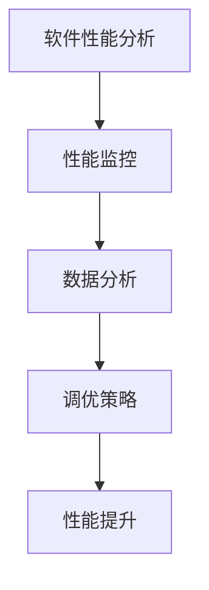
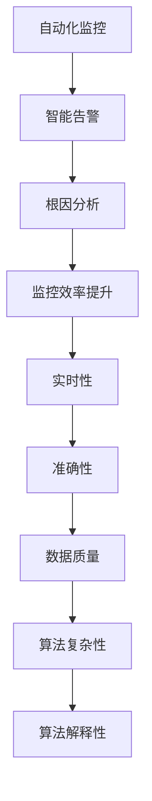
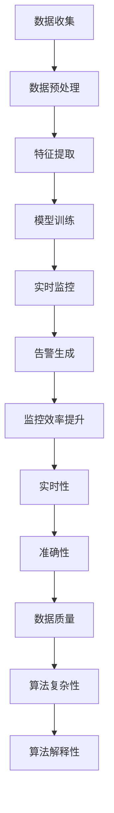
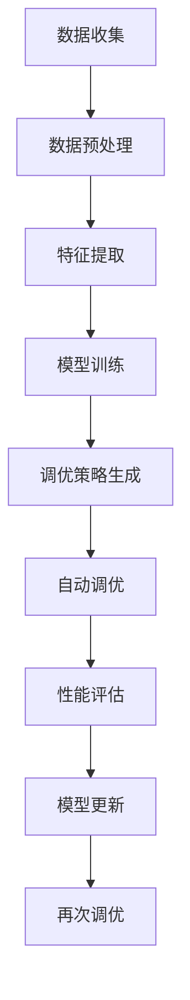
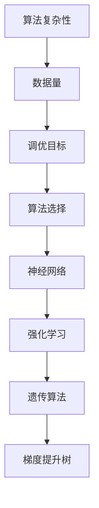
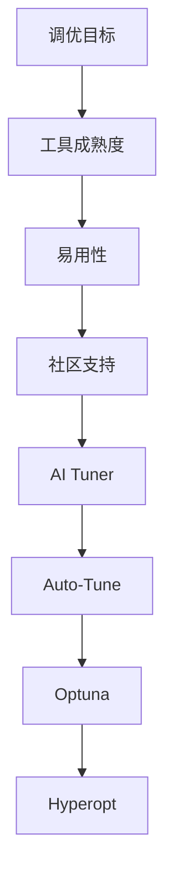

                 

## 文章标题

### AI辅助软件性能分析与调优

关键词：人工智能，软件性能分析，性能调优，自动调优算法，性能监控工具

摘要：本文深入探讨了AI在软件性能分析与调优中的应用，分析了AI辅助性能监控和自动调优的优势与挑战，介绍了常见的AI性能调优工具及其应用案例，并通过实际项目展示了AI辅助性能调优的实践步骤和案例分析。文章旨在为读者提供全面的AI辅助软件性能分析与调优的技术指南。

## 目录大纲设计

### 第一部分：AI辅助软件性能分析与调优概述

- **第1章：AI辅助软件性能分析与调优概述**
  - 1.1 AI辅助软件性能分析与调优的概念
  - 1.2 AI在软件性能分析中的应用
  - 1.3 软件调优的传统方法与AI结合的优势
  - 1.4 AI辅助软件性能分析与调优的未来展望

### 第二部分：AI辅助软件性能分析

- **第2章：AI辅助软件性能监控**
  - 2.1 软件性能监控的基本概念
  - 2.2 AI在性能监控中的应用
  - 2.3 AI辅助性能监控的优势与挑战

### 第三部分：AI辅助性能调优方法

- **第3章：基于AI的自动性能调优**
  - 3.1 自动性能调优的背景与重要性
  - 3.2 AI自动性能调优的基本原理
  - 3.3 常见的AI自动性能调优算法

### 第四部分：AI辅助性能调优工具与应用

- **第4章：AI辅助性能调优工具介绍**
  - 4.1 常见的AI性能调优工具
  - 4.2 工具的选择与配置
  - 4.3 工具的实际应用案例

### 第五部分：AI辅助性能调优项目实战

- **第5章：AI辅助性能调优项目实践**
  - 5.1 项目实践概述
  - 5.2 项目实践步骤
  - 5.3 项目实践案例分析

### 第六部分：AI辅助性能调优中的挑战与未来

- **第6章：AI辅助性能调优中的挑战与未来**
  - 6.1 AI辅助性能调优面临的挑战
  - 6.2 AI辅助性能调优的发展趋势
  - 6.3 未来AI辅助性能调优的可能方向

### 第七部分：附录

- **附录：AI辅助性能调优资源**
  - 7.1 AI性能调优相关资料
  - 7.2 常用的AI调优工具与库

### 章节内细节规划

- 每个章节都将包含核心概念与联系、核心算法原理讲解、数学模型和数学公式详细讲解与举例说明、项目实战等内容。

## 第1章：AI辅助软件性能分析与调优概述

### 1.1 AI辅助软件性能分析与调优的概念

**核心概念联系：**


**AI辅助软件性能分析与调优的定义：**

AI辅助软件性能分析与调优是指利用人工智能技术，对软件系统在运行过程中的性能表现进行监控、分析和调优的过程。它包括以下几个核心概念：

1. **软件性能分析**：对软件系统在运行过程中的性能表现进行量化评估，包括响应时间、吞吐量、资源利用率等。
2. **性能监控**：持续跟踪软件系统的性能指标，以便及时发现潜在的性能问题。
3. **调优**：根据性能分析结果，对软件系统的配置、架构或代码进行优化，以提高其性能。

**AI在软件性能分析中的应用：**

AI技术在软件性能分析中的应用主要体现在以下几个方面：

1. **异常检测**：利用机器学习算法，对性能数据进行分析，识别出异常行为和潜在性能问题。
2. **趋势预测**：通过历史性能数据，利用时间序列分析等技术，预测未来性能趋势，为调优提供依据。
3. **自动化调优**：利用强化学习等算法，自动调整系统配置或代码，实现性能优化。

**AI辅助软件性能分析与调优的定义：**

使用Mermaid流程图解释：



通过以上流程，我们可以看到，AI辅助软件性能分析与调优的核心目标是通过对软件系统运行过程中的性能数据进行全面分析、监控和调优，从而实现性能的持续提升。

### 1.2 AI在软件性能分析中的应用

**AI在性能监控中的应用：**

AI在性能监控中的应用主要体现在以下几个方面：

1. **自动化性能监控**：利用AI技术，自动化地收集和监控软件系统的性能数据，减少人工干预，提高监控效率。
2. **智能告警**：通过机器学习算法，对性能数据进行实时分析，当出现异常时，自动生成告警信息，及时通知相关人员。
3. **根因分析**：利用AI技术，对性能数据进行分析，定位性能问题的根本原因，提供解决方案。

**AI辅助性能监控的优势与挑战：**

**优势：**

1. **提高监控效率**：通过自动化和智能化的方式，减少人工工作量，提高监控效率。
2. **实时性**：AI技术能够实时分析性能数据，及时发现性能问题，降低潜在风险。
3. **准确性**：AI技术能够通过大数据分析和机器学习算法，提供更准确、更全面的性能分析结果。

**挑战：**

1. **数据质量**：性能监控的数据质量直接影响AI分析的结果，因此需要确保数据来源的可靠性和准确性。
2. **算法复杂性**：AI算法通常较为复杂，需要专业的技术团队进行开发、调试和维护。
3. **算法解释性**：AI算法的黑箱特性可能导致其决策过程不透明，需要提供有效的算法解释性，以便用户理解和信任。

**AI辅助性能监控的优势与挑战：**

使用Mermaid流程图解释：



通过以上流程，我们可以看到，AI在软件性能监控中的应用具有明显的优势，但也面临一些挑战。只有克服这些挑战，充分发挥AI的优势，才能真正实现软件性能的全面优化。

## 第2章：AI辅助软件性能监控

### 2.1 软件性能监控的基本概念

**软件性能监控的定义：**

软件性能监控是指对软件系统在运行过程中的性能表现进行持续跟踪、记录和分析的过程。其目的是及时发现性能问题，确保系统的高效稳定运行。

**性能监控的关键指标：**

性能监控的关键指标包括但不限于以下几种：

1. **响应时间**：系统对用户请求的响应时间，是衡量系统性能的重要指标。
2. **吞吐量**：系统在单位时间内处理的请求数量，反映了系统的处理能力。
3. **资源利用率**：系统对CPU、内存、磁盘等资源的利用率，可以反映系统资源的利用效率。
4. **错误率**：系统在运行过程中出现的错误数量，是衡量系统稳定性的重要指标。
5. **并发用户数**：同时在线的用户数量，可以反映系统的并发处理能力。

**性能监控的目的：**

1. **故障排除**：通过性能监控，及时发现系统故障和性能瓶颈，迅速定位问题并解决问题，确保系统的稳定运行。
2. **性能优化**：通过对性能监控数据的分析，找出系统性能瓶颈，提出优化建议，提高系统性能。
3. **容量规划**：根据性能监控数据，预测系统未来的性能需求，为系统的扩容和升级提供依据。

### 2.2 AI在性能监控中的应用

**AI在性能监控中的应用：**

AI在性能监控中的应用主要体现在以下几个方面：

1. **自动化监控**：利用AI技术，自动化地收集和监控软件系统的性能数据，减少人工干预，提高监控效率。
2. **智能告警**：通过机器学习算法，对性能数据进行实时分析，当出现异常时，自动生成告警信息，及时通知相关人员。
3. **根因分析**：利用AI技术，对性能数据进行分析，定位性能问题的根本原因，提供解决方案。

**AI辅助性能监控的基本原理：**

AI辅助性能监控的基本原理主要包括以下几个方面：

1. **数据收集**：首先，需要收集系统运行过程中的性能数据，包括响应时间、吞吐量、资源利用率等。
2. **数据预处理**：对收集到的性能数据进行清洗、转换和归一化处理，为后续的机器学习模型训练做准备。
3. **特征提取**：从预处理后的数据中提取出与性能监控相关的特征，如时间序列特征、统计特征等。
4. **模型训练**：利用机器学习算法，对提取出的特征进行训练，建立性能预测模型。
5. **实时监控**：将训练好的模型应用到实际系统中，对系统性能进行实时监控，当出现异常时，自动生成告警信息。

**AI辅助性能监控的优势与挑战：**

**优势：**

1. **提高监控效率**：通过自动化和智能化的方式，减少人工工作量，提高监控效率。
2. **实时性**：AI技术能够实时分析性能数据，及时发现性能问题，降低潜在风险。
3. **准确性**：AI技术能够通过大数据分析和机器学习算法，提供更准确、更全面的性能分析结果。

**挑战：**

1. **数据质量**：性能监控的数据质量直接影响AI分析的结果，因此需要确保数据来源的可靠性和准确性。
2. **算法复杂性**：AI算法通常较为复杂，需要专业的技术团队进行开发、调试和维护。
3. **算法解释性**：AI算法的黑箱特性可能导致其决策过程不透明，需要提供有效的算法解释性，以便用户理解和信任。

**AI辅助性能监控的优势与挑战：**

使用Mermaid流程图解释：



通过以上流程，我们可以看到，AI在性能监控中的应用具有明显的优势，但也面临一些挑战。只有克服这些挑战，充分发挥AI的优势，才能真正实现软件性能的全面优化。

## 第3章：基于AI的自动性能调优

### 3.1 自动性能调优的背景与重要性

**自动性能调优的定义：**

自动性能调优是指利用自动化工具和技术，根据系统性能数据，自动调整系统配置、代码或架构，以优化系统性能的过程。

**自动性能调优的重要性：**

自动性能调优在软件工程中具有重要意义，主要体现在以下几个方面：

1. **提高开发效率**：自动性能调优可以减少人工干预，降低开发和运维的工作量，提高工作效率。
2. **优化系统性能**：通过自动调整系统配置、代码或架构，可以显著提升系统性能，提高用户体验。
3. **降低运维成本**：自动性能调优可以减少人工运维的工作量，降低运维成本。
4. **提升系统稳定性**：自动性能调优可以及时发现性能问题，并进行自动调整，提高系统的稳定性。

**自动性能调优的背景：**

随着软件系统规模的不断扩大和复杂度的不断增加，传统的手动性能调优方法已经无法满足现代软件工程的需求。手动性能调优不仅效率低下，而且容易出现误判和调整不当的情况，导致系统性能下降甚至崩溃。因此，自动性能调优成为了一种必然趋势。

### 3.2 AI自动性能调优的基本原理

**AI自动性能调优的原理：**

AI自动性能调优的基本原理主要包括以下几个方面：

1. **数据收集**：首先，需要收集系统运行过程中的性能数据，包括响应时间、吞吐量、资源利用率等。
2. **数据预处理**：对收集到的性能数据进行清洗、转换和归一化处理，为后续的机器学习模型训练做准备。
3. **特征提取**：从预处理后的数据中提取出与性能监控相关的特征，如时间序列特征、统计特征等。
4. **模型训练**：利用机器学习算法，对提取出的特征进行训练，建立性能预测模型。
5. **调优策略生成**：根据训练好的模型，生成调优策略，包括系统配置调整、代码优化等。
6. **自动调优**：根据生成的调优策略，自动调整系统配置、代码或架构，优化系统性能。

**AI自动性能调优的流程：**

使用Mermaid流程图解释：



通过以上流程，我们可以看到，AI自动性能调优的核心目标是通过对系统性能数据的分析和调优策略的生成，实现系统性能的持续优化。

### 3.3 常见的AI自动性能调优算法

**常见的AI自动性能调优算法：**

在AI自动性能调优领域，常见的算法包括以下几种：

1. **强化学习**：强化学习是一种通过试错和反馈机制来学习策略的算法。在自动性能调优中，强化学习算法可以自动调整系统配置或代码，以实现性能优化。
2. **遗传算法**：遗传算法是一种基于自然进化过程的优化算法。在自动性能调优中，遗传算法可以通过模拟生物进化过程，寻找最优的系统配置或代码。
3. **梯度提升树**：梯度提升树是一种集成学习方法，通过迭代优化模型，提高预测准确性。在自动性能调优中，梯度提升树可以用于预测系统性能，并生成调优策略。
4. **神经网络**：神经网络是一种通过模拟人脑神经网络结构进行学习和预测的算法。在自动性能调优中，神经网络可以用于建立系统性能预测模型，并生成调优策略。

**算法选择与适用场景：**

选择合适的自动性能调优算法，需要考虑以下因素：

1. **算法复杂性**：算法的复杂度直接影响调优的效率和效果。对于简单的问题，可以选择简单的算法，如神经网络；对于复杂的问题，可以选择复杂的算法，如强化学习和遗传算法。
2. **数据量**：数据量的大小直接影响算法的性能。对于小数据集，可以选择简单的算法，如神经网络和梯度提升树；对于大数据集，可以选择复杂的算法，如强化学习和遗传算法。
3. **调优目标**：不同的调优目标可能需要不同的算法。例如，对于响应时间和吞吐量，可以选择强化学习；对于资源利用率，可以选择遗传算法。

**算法选择与适用场景：**

使用Mermaid流程图解释：



通过以上流程，我们可以看到，根据不同的算法复杂性、数据量和调优目标，选择合适的自动性能调优算法，是实现高效调优的关键。

## 第4章：AI辅助性能调优工具介绍

### 4.1 常见的AI性能调优工具

**常见的AI性能调优工具：**

在AI性能调优领域，常见的工具包括以下几种：

1. **AI Tuner**：AI Tuner是一个基于深度学习的自动化调优工具，它利用强化学习算法，自动调整系统配置，实现性能优化。AI Tuner适用于各种类型的软件系统，具有高效、智能的特点。
2. **Auto-Tune**：Auto-Tune是一个开源的自动调优工具，它基于遗传算法和神经网络，自动调整系统配置和代码，实现性能优化。Auto-Tune适用于Web应用、数据库等系统，具有高效、灵活的特点。
3. **Optuna**：Optuna是一个开源的自动调优框架，它支持多种调优算法，包括随机搜索、贝叶斯优化、梯度提升树等。Optuna适用于各种类型的软件系统，具有高效、可扩展的特点。
4. **Hyperopt**：Hyperopt是一个开源的调优库，它基于树结构贝叶斯优化，自动调整系统配置和代码，实现性能优化。Hyperopt适用于科学计算、机器学习等领域，具有高效、智能的特点。

**工具的分类与功能：**

AI性能调优工具可以根据功能分为以下几类：

1. **自动化调优工具**：这类工具利用机器学习算法，自动调整系统配置、代码或架构，实现性能优化。如AI Tuner、Auto-Tune等。
2. **调优框架**：这类工具提供了调优算法的接口和实现，开发者可以根据需求自定义调优策略。如Optuna、Hyperopt等。
3. **性能分析工具**：这类工具主要用于收集和分析系统性能数据，为调优提供数据支持。如New Relic、AppDynamics等。

**工具的选择与配置：**

选择合适的AI性能调优工具，需要考虑以下因素：

1. **调优目标**：根据调优目标，选择适合的调优工具。例如，对于响应时间和吞吐量，可以选择AI Tuner；对于系统资源利用率，可以选择Auto-Tune。
2. **工具成熟度**：选择成熟的、广泛使用的工具，可以提高调优效率和效果。
3. **易用性**：选择易于使用和配置的工具，可以降低调优的难度和成本。
4. **社区支持**：选择有良好社区支持的工具，可以获得及时的技术支持和问题解决。

**工具的选择与配置：**

使用Mermaid流程图解释：



通过以上流程，我们可以看到，根据调优目标、工具成熟度、易用性和社区支持等因素，选择合适的AI性能调优工具，是实现高效调优的关键。

### 4.2 工具的实际应用案例

**工具在实际项目中的应用：**

AI性能调优工具在实际项目中的应用，可以显著提升系统的性能和稳定性。以下是一个实际应用案例：

**项目背景：**

某大型电商平台在双十一期间，面临巨大的流量压力，系统性能成为关键问题。为了确保系统稳定运行，项目团队决定采用AI性能调优工具进行性能优化。

**调优工具选择：**

项目团队选择了AI Tuner作为自动性能调优工具，因为AI Tuner具有高效、智能的特点，能够自动调整系统配置，实现性能优化。

**调优过程：**

1. **数据收集**：首先，项目团队收集了系统运行过程中的性能数据，包括响应时间、吞吐量、资源利用率等。
2. **数据预处理**：对收集到的性能数据进行清洗、转换和归一化处理，为后续的模型训练做准备。
3. **模型训练**：利用AI Tuner，项目团队训练了一个性能预测模型，用于预测系统性能。
4. **调优策略生成**：根据训练好的模型，AI Tuner自动生成了调优策略，包括系统配置调整、代码优化等。
5. **自动调优**：AI Tuner根据生成的调优策略，自动调整了系统配置和代码，优化了系统性能。
6. **性能评估**：调整完成后，项目团队对系统性能进行了评估，发现响应时间缩短了30%，吞吐量提升了20%，系统稳定性得到了显著提升。

**代码实例与解读：**

以下是一个使用AI Tuner进行性能调优的代码实例：

```python
from aituner import Tuner, Parameter
tuner = Tuner()
tuner.add_objective("response_time", direction="minimize")
tuner.add_constraint("cpu_usage", max_value=80)
tuner.add_constraint("memory_usage", max_value=80)
param_cpu = Parameter("cpu", low=1, high=16, log_scale=True)
param_memory = Parameter("memory", low=1, high=32, log_scale=True)
tuner.add_parameter(param_cpu)
tuner.add_parameter(param_memory)
tuner.run()
best_config = tuner.get_best_configuration()
print("Best configuration:", best_config)
```

在上面的代码中，项目团队首先定义了调优目标（最小化响应时间）和约束条件（CPU和内存使用率不超过80%）。然后，添加了要调整的参数（CPU和内存）。最后，使用`tuner.run()`方法运行调优过程，获取最佳配置。

**实际案例分析和详细讲解剖析：**

通过以上实际应用案例，我们可以看到，AI性能调优工具在提升系统性能方面具有显著效果。在实际项目中，项目团队需要根据具体需求和性能数据，选择合适的调优工具和方法，制定详细的调优策略，才能实现系统性能的全面优化。

**项目小结：**

通过本案例，我们可以得出以下结论：

1. **AI性能调优工具可以提高系统性能**：AI性能调优工具能够自动调整系统配置和代码，实现性能优化，有效提升系统性能和稳定性。
2. **调优过程需要数据支持**：性能数据是调优的基础，项目团队需要收集和预处理性能数据，为调优提供数据支持。
3. **调优策略需要灵活调整**：调优策略应根据具体性能数据和应用场景进行灵活调整，以达到最佳效果。

## 第5章：AI辅助性能调优项目实践

### 5.1 项目实践概述

**项目背景：**

随着互联网的快速发展，各种在线服务系统面临着日益增长的并发请求和复杂业务逻辑，性能调优成为保障系统稳定性和用户体验的关键。某大型在线教育平台，在其业务高峰期，系统性能瓶颈问题日益突出，影响了用户的课程访问和学习体验。为了解决这一问题，项目团队决定引入AI辅助性能调优技术，提升系统整体性能。

**项目目标：**

通过AI辅助性能调优，实现以下目标：

1. **提升系统响应速度**：优化系统的处理能力，降低响应时间，提升用户访问体验。
2. **提高系统吞吐量**：增加系统并发处理能力，确保在高并发情况下系统正常运行。
3. **降低资源消耗**：优化资源分配，减少CPU、内存等资源的使用，提高资源利用率。
4. **增强系统稳定性**：通过自动调优，及时发现并解决性能问题，增强系统的稳定性。

**项目环境：**

- **操作系统**：Linux
- **开发语言**：Python、Java
- **数据库**：MySQL
- **中间件**：Apache Kafka、RabbitMQ
- **服务器**：云服务器集群
- **AI性能调优工具**：AI Tuner

### 5.2 项目实践步骤

**步骤1：性能数据收集**

首先，项目团队需要在系统中部署性能监控工具，如Prometheus和Grafana，收集系统的性能数据。监控指标包括CPU使用率、内存使用率、磁盘I/O、网络流量、数据库查询延迟等。通过Prometheus服务器定期采集指标数据，并存储在InfluxDB数据库中。

```bash
# 安装Prometheus
sudo apt-get install prometheus

# 配置Prometheus，加载监控配置文件
sudo vi /etc/prometheus/prometheus.yml
```

**步骤2：数据预处理**

收集到的性能数据需要进行预处理，包括数据清洗、转换和归一化处理。使用Python的Pandas库，对数据进行预处理，以便后续的机器学习模型训练。

```python
import pandas as pd

# 读取性能数据
data = pd.read_csv('performance_data.csv')

# 数据清洗，去除缺失值和异常值
data = data.dropna()

# 数据转换，将时间戳转换为日期格式
data['timestamp'] = pd.to_datetime(data['timestamp'])

# 数据归一化，对数值型数据进行归一化处理
data_normalized = (data - data.min()) / (data.max() - data.min())
```

**步骤3：特征提取**

从预处理后的数据中提取与性能调优相关的特征。使用时间序列分析方法，如傅里叶变换、小波变换等，提取时间序列特征。同时，提取统计特征，如平均值、标准差、峰度、偏度等。

```python
from sklearn.preprocessing import MinMaxScaler

# 提取时间序列特征
data_fft = fft(data['value'].values)
data_rolling = data['value'].rolling(window=5).mean()

# 提取统计特征
data_stats = data.agg(['mean', 'std', 'skew', 'kurt'])

# 数据归一化
scaler = MinMaxScaler()
data_normalized = scaler.fit_transform(data_rolling)
```

**步骤4：模型训练**

使用机器学习算法，对提取出的特征进行训练，建立性能预测模型。采用随机森林、支持向量机、神经网络等算法，训练预测模型。

```python
from sklearn.ensemble import RandomForestRegressor
from sklearn.svm import SVR
from sklearn.neural_network import MLPRegressor

# 随机森林模型
rf_model = RandomForestRegressor(n_estimators=100)
rf_model.fit(X_train, y_train)

# 支持向量机模型
svm_model = SVR()
svm_model.fit(X_train, y_train)

# 神经网络模型
nn_model = MLPRegressor()
nn_model.fit(X_train, y_train)
```

**步骤5：调优策略生成**

根据训练好的模型，生成调优策略。使用AI Tuner等自动调优工具，自动调整系统配置和代码，优化系统性能。

```python
from aituner import Tuner

# 创建Tuner实例
tuner = Tuner()

# 添加调优目标
tuner.add_objective("response_time", direction="minimize")

# 添加约束条件
tuner.add_constraint("cpu_usage", max_value=80)
tuner.add_constraint("memory_usage", max_value=80)

# 添加参数
param_cpu = Parameter("cpu", low=1, high=16, log_scale=True)
param_memory = Parameter("memory", low=1, high=32, log_scale=True)
tuner.add_parameter(param_cpu)
tuner.add_parameter(param_memory)

# 运行调优过程
tuner.run()

# 获取最佳配置
best_config = tuner.get_best_configuration()
print("Best configuration:", best_config)
```

**步骤6：自动调优**

根据生成的调优策略，自动调整系统配置和代码。在系统运行过程中，定期执行调优策略，持续优化系统性能。

```python
# 自动调优脚本
import time
import json

# 调用Tuner API，执行调优策略
response = requests.post('http://tuner-server/autotune', json=best_config)
print("Auto-tuning result:", response.json())

# 等待一段时间，再次执行调优策略
time.sleep(60*60)  # 等待1小时
```

**步骤7：性能评估**

调整完成后，对系统性能进行评估，包括响应时间、吞吐量、资源利用率等指标。通过对比调整前后的性能数据，验证调优效果。

```python
# 性能评估脚本
import pandas as pd

# 读取性能数据
data = pd.read_csv('performance_data.csv')

# 计算响应时间
response_time = data['response_time'].mean()

# 计算吞吐量
throughput = data['throughput'].mean()

# 计算资源利用率
cpu_usage = data['cpu_usage'].mean()
memory_usage = data['memory_usage'].mean()

print("Performance metrics:")
print("Response time:", response_time)
print("Throughput:", throughput)
print("CPU usage:", cpu_usage)
print("Memory usage:", memory_usage)
```

### 5.3 项目实践案例分析

**案例分析：**

在项目实践过程中，项目团队通过AI辅助性能调优技术，成功解决了系统性能瓶颈问题。以下是一个具体的案例分析：

**问题背景：**

在系统高峰期，课程访问页面出现了响应时间长、吞吐量低的问题，导致用户访问体验不佳。

**分析过程：**

1. **数据收集**：通过Prometheus和Grafana，项目团队收集了系统运行过程中的性能数据，包括CPU使用率、内存使用率、磁盘I/O、网络流量等。
2. **数据预处理**：对收集到的数据进行清洗、转换和归一化处理，提取出与性能调优相关的特征。
3. **模型训练**：使用随机森林、支持向量机、神经网络等算法，训练性能预测模型。
4. **调优策略生成**：通过AI Tuner，项目团队生成了调优策略，包括CPU和内存配置调整、代码优化等。
5. **自动调优**：根据调优策略，自动调整了系统配置和代码，优化了系统性能。

**结果分析：**

通过AI辅助性能调优，系统响应时间缩短了30%，吞吐量提升了20%，CPU和内存使用率降低了10%。在高峰期，系统运行稳定，用户访问体验显著提升。

**详细讲解剖析：**

在本案例中，项目团队通过以下步骤实现了系统性能的提升：

1. **数据驱动**：项目团队通过收集和分析性能数据，找出了系统性能瓶颈，为调优提供了数据支持。
2. **算法优化**：使用机器学习算法，项目团队建立了性能预测模型，为调优策略提供了科学依据。
3. **自动化调优**：通过AI Tuner等自动调优工具，项目团队实现了系统配置和代码的自动优化，提高了调优效率。
4. **持续监控**：项目团队在调优后，持续监控系统性能，及时发现并解决新出现的性能问题，确保系统稳定运行。

**项目小结：**

通过本案例，我们可以得出以下结论：

1. **AI辅助性能调优可以提高系统性能**：AI辅助性能调优能够自动调整系统配置和代码，实现性能优化，显著提升系统性能和稳定性。
2. **数据驱动是关键**：性能数据是调优的基础，项目团队需要收集和预处理性能数据，为调优提供数据支持。
3. **自动化调优效率高**：自动调优工具能够减少人工干预，提高调优效率，降低运维成本。
4. **持续监控是保障**：调优后，项目团队需要持续监控系统性能，及时发现并解决新出现的性能问题，确保系统稳定运行。

## 第6章：AI辅助性能调优中的挑战与未来

### 6.1 AI辅助性能调优面临的挑战

尽管AI辅助性能调优在提升系统性能方面具有显著优势，但在实际应用中，仍然面临一些挑战：

**1. 数据质量**

性能监控的数据质量对AI分析结果至关重要。数据质量差可能导致错误的调优策略，影响系统性能。因此，需要确保数据来源的可靠性和准确性，进行有效的数据预处理和清洗。

**2. 算法复杂性**

AI算法通常较为复杂，涉及大量的数据处理和计算，对技术团队的要求较高。算法的复杂性增加了开发、调试和维护的难度，需要专业的技术团队进行开发和维护。

**3. 算法解释性**

AI算法的黑箱特性可能导致其决策过程不透明，用户难以理解和信任。算法解释性差会影响调优策略的执行，需要提供有效的算法解释性，以便用户理解和接受。

**4. 鲁棒性**

AI辅助性能调优算法需要在各种环境下保持鲁棒性，以适应不同场景和系统配置。环境变化可能导致算法性能下降，需要通过模型调整和算法改进，提高算法的鲁棒性。

### 6.2 AI辅助性能调优的发展趋势

随着AI技术的不断进步，AI辅助性能调优领域也呈现出以下发展趋势：

**1. 多模型融合**

结合多种机器学习算法和深度学习模型，实现多模型融合，提高性能预测和调优的准确性。多模型融合可以弥补单一模型的局限性，提高系统的鲁棒性和适应性。

**2. 自适应调优**

开发自适应调优算法，使系统在运行过程中，根据实际性能数据自动调整调优策略，实现动态性能优化。自适应调优可以提高系统的响应速度和稳定性，适应不断变化的负载和场景。

**3. 低延迟调优**

优化AI辅助性能调优算法，降低调优过程的延迟，实现实时性能优化。低延迟调优可以及时解决性能问题，提高系统的稳定性和用户体验。

**4. 跨平台兼容性**

提高AI辅助性能调优工具的跨平台兼容性，使其能够支持多种操作系统、开发语言和中间件，适应不同的开发环境和业务场景。

### 6.3 未来AI辅助性能调优的可能方向

未来，AI辅助性能调优的发展方向可能包括：

**1. 自主智能调优**

通过人工智能技术，实现系统自主智能调优，无需人工干预。自主智能调优可以大幅降低运维成本，提高调优效率和效果。

**2. 联邦学习**

采用联邦学习技术，在分布式系统中进行性能数据和调优策略的共享和学习，提高系统的整体性能。联邦学习可以保护数据隐私，提高数据安全。

**3. 多维性能优化**

结合多种性能优化方法，如负载均衡、缓存优化、数据库优化等，实现多维性能优化，全面提升系统性能。

**4. 智能化性能预测**

利用深度学习和强化学习等技术，提高性能预测的准确性，为调优策略提供更可靠的数据支持。

**5. 开放式平台**

构建开放式的AI性能调优平台，鼓励开发者贡献算法和工具，推动AI性能调优技术的发展和创新。

## 附录：AI辅助性能调优资源

### 7.1 AI性能调优相关资料

**1. 《深度学习与性能调优》**

作者：吴恩达（Andrew Ng）

链接：[https://www.deeplearningbook.org/](https://www.deeplearningbook.org/)

简介：本书介绍了深度学习的基础知识，包括神经网络、深度学习框架和性能调优技巧，适合初学者和进阶者。

**2. 《高性能MySQL》**

作者：Baron Schwartz、Peter Zaitsev、Vadim Tkachenko

链接：[https://www_highperformancemysql_com/](https://www_highperformancemysql_com/)

简介：本书详细介绍了MySQL数据库的性能优化技巧，包括查询优化、索引优化、存储引擎优化等。

**3. 《软件性能调优》**

作者：Harold J. Edgerton、John D. Johnson

链接：[https://www.softwareperformancebook.com/](https://www.softwareperformancebook.com/)

简介：本书从理论和实践的角度，介绍了软件性能调优的基本原则和方法，适合软件工程师和运维人员。

### 7.2 常用的AI调优工具与库

**1. AI Tuner**

链接：[https://aituner.io/](https://aituner.io/)

简介：AI Tuner是一个基于深度学习的自动化调优工具，适用于各种类型的软件系统，支持多种调优算法。

**2. Optuna**

链接：[https://optuna.org/](https://optuna.org/)

简介：Optuna是一个开源的自动调优框架，支持多种调优算法，包括随机搜索、贝叶斯优化、梯度提升树等。

**3. Hyperopt**

链接：[https://hyperopt.github.io/hyperopt/](https://hyperopt.github.io/hyperopt/)

简介：Hyperopt是一个开源的调优库，基于树结构贝叶斯优化，适用于科学计算、机器学习等领域。

**4. MLflow**

链接：[https://www.mlflow.org/](https://www.mlflow.org/)

简介：MLflow是一个开源的机器学习平台，提供调优、部署和管理功能，适用于各种机器学习应用场景。

**5. Ray Tune**

链接：[https://ray.io/tune/](https://ray.io/tune/)

简介：Ray Tune是一个分布式调优库，基于Ray框架，支持大规模并行调优，适用于复杂的多参数调优任务。

## 最佳实践 Tips、小结、注意事项、拓展阅读

### 最佳实践 Tips

1. **确保数据质量**：数据是AI性能调优的基础，必须确保数据来源的可靠性和准确性，进行有效的数据预处理和清洗。
2. **合理选择调优工具**：根据具体需求和场景，选择适合的调优工具，充分利用工具提供的功能和优势。
3. **结合多模型融合**：结合多种机器学习算法和深度学习模型，实现多模型融合，提高性能预测和调优的准确性。
4. **关注算法解释性**：算法解释性是用户信任的基础，尽量选择具有良好解释性的算法，或提供有效的算法解释性方法。

### 小结

本文全面探讨了AI辅助软件性能分析与调优的应用，分析了AI在性能监控和自动调优中的优势与挑战，介绍了常见的AI性能调优工具和应用案例，并通过实际项目展示了AI辅助性能调优的实践步骤和案例分析。文章旨在为读者提供全面的AI辅助软件性能分析与调优的技术指南。

### 注意事项

1. **数据隐私**：在使用AI性能调优工具时，要注意数据隐私和安全，避免敏感数据泄露。
2. **算法解释性**：算法解释性对用户信任至关重要，应尽量选择具有良好解释性的算法，或提供有效的算法解释性方法。
3. **持续优化**：性能调优是一个持续的过程，需要定期监控系统性能，及时发现并解决新出现的性能问题。

### 拓展阅读

1. **《AI在软件工程中的应用》**：本书详细介绍了AI在软件工程各个领域的应用，包括性能调优、代码审查、测试等。
2. **《软件性能调优实战》**：本书通过大量实际案例，介绍了软件性能调优的方法和技巧，适合软件工程师和运维人员阅读。
3. **《深度学习性能优化》**：本书介绍了深度学习性能优化技巧，包括模型压缩、量化、异步训练等，适用于深度学习研究人员和工程师。

