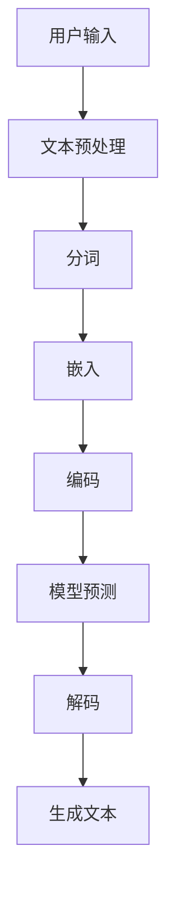
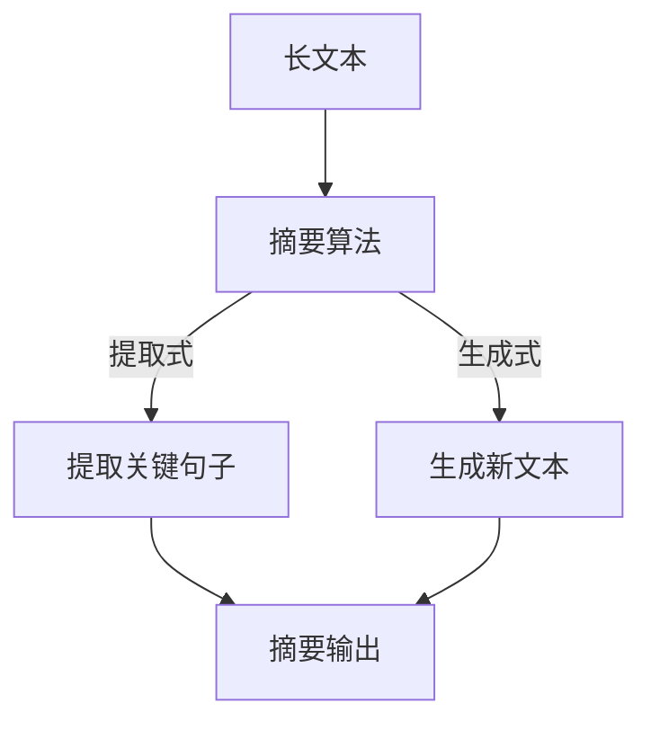
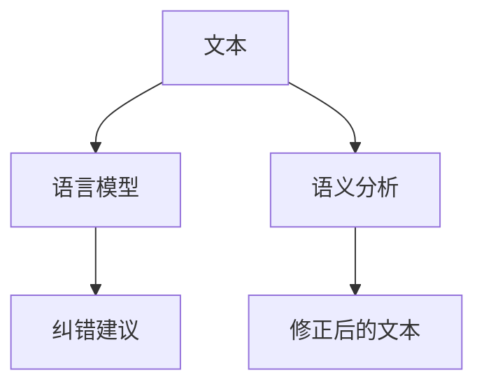
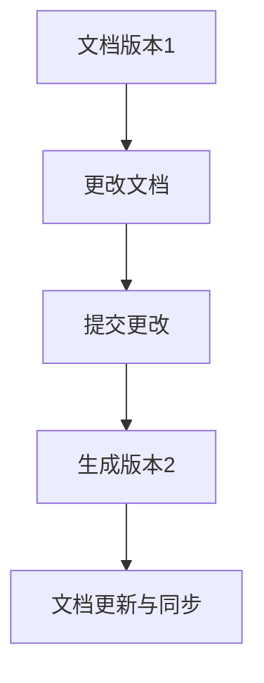

                 

### 文章标题

《AI辅助软件文档生成与维护》

---

关键词：人工智能，软件文档，文档生成，文档维护，自然语言处理，版本控制

---

摘要：本文深入探讨了人工智能（AI）在软件文档生成与维护中的应用。通过分析AI技术对文档生成的影响，介绍了AI辅助文档生成的技术原理、应用场景以及核心算法。同时，文章还详细描述了AI在文档维护方面的作用，包括文档版本控制、文档更新与自动同步、文档语义检索与推荐等。通过实战篇的案例分析，读者将了解如何使用AI工具进行文档生成与维护。文章最后对AI辅助文档生成与维护的未来发展进行了展望，并提出了可能的挑战与解决方案。

---

### 《AI辅助软件文档生成与维护》目录大纲

#### 第一部分：AI辅助软件文档概述

##### 第1章: AI辅助软件文档概述

1.1 AI辅助文档的定义与背景  
1.1.1 AI技术对文档生成的影响  
1.1.2 AI辅助文档生成的重要性

1.2 AI辅助文档生成的技术原理  
1.2.1 自然语言处理基础  
1.2.2 自动摘要与文本生成  
1.2.3 文本纠错与语义分析

1.3 AI辅助文档生成的应用场景  
1.3.1 软件开发文档  
1.3.2 用户文档与帮助手册  
1.3.3 技术文档与标准文档

#### 第二部分：AI辅助文档生成技术

##### 第2章: AI辅助文档生成技术详解

2.1 文本生成模型原理  
2.1.1 GPT-3模型介绍  
2.1.2 文本生成模型的工作流程

2.2 文本摘要与生成算法  
2.2.1 自动摘要技术  
2.2.2 文本生成算法  
2.2.3 生成式摘要与提取式摘要对比

2.3 文本纠错与语义分析  
2.3.1 语言模型与纠错算法  
2.3.2 语义分析技术  
2.3.3 语义分析在文档生成中的应用

#### 第三部分：AI辅助文档维护

##### 第3章: AI辅助文档维护技术

3.1 文档版本控制  
3.1.1 版本控制的基本概念  
3.1.2 常见的版本控制系统

3.2 文档更新与自动同步  
3.2.1 自动更新技术  
3.2.2 文档同步策略

3.3 文档语义检索与推荐  
3.3.1 语义检索技术  
3.3.2 文档推荐系统

#### 第四部分：实战篇

##### 第4章: AI辅助文档生成与维护实战

4.1 实战一：使用AI生成软件文档  
4.1.1 开发环境搭建  
4.1.2 代码实现与解析

4.2 实战二：使用AI维护文档版本  
4.2.1 版本控制工具配置  
4.2.2 自动同步策略实施

4.3 实战三：使用AI进行文档检索与推荐  
4.3.1 语义检索系统搭建  
4.3.2 文档推荐系统实现

#### 第五部分：展望与未来

##### 第5章: AI辅助文档生成与维护的展望

5.1 AI辅助文档生成与维护的发展趋势  
5.1.1 技术发展趋势  
5.1.2 行业应用展望

5.2 挑战与解决方案  
5.2.1 技术挑战  
5.2.2 应用挑战  
5.2.3 解决方案探讨

#### 附录

##### 附录A: AI辅助文档生成与维护常用工具与资源

A.1 常用AI模型与框架  
A.2 开发环境与工具  
A.3 教程与参考文献

---

## AI辅助文档生成原理

为了深入理解AI辅助软件文档生成与维护的原理，我们首先需要了解AI在文档生成过程中所扮演的角色。具体来说，AI在文档生成中的作用主要体现在以下几个方面：

### 文本输入与预处理

首先，AI系统需要接收用户输入的文本内容。这些内容可以是原始的代码注释、用户反馈、会议纪要等。一旦接收了文本，AI系统会对其进行预处理，如分词、去除停用词、标点符号的处理等，以便后续处理。

### 文本处理

接下来，AI会对预处理后的文本进行更深层次的处理。这包括语义分析、关键词提取、主题识别等操作。通过这些步骤，AI能够理解文本内容的主旨和结构，从而为生成文档奠定基础。

### 文本生成模型

文本生成模型是AI辅助文档生成的核心。这些模型可以通过大量的训练数据学习到如何生成连贯、有逻辑的文本。例如，GPT-3等大型语言模型可以根据输入的提示生成完整的段落甚至整篇文档。

### 生成文档

最终，AI会利用文本生成模型生成的文本内容来生成文档。在这个过程中，AI还需要考虑文档的结构和格式，如标题、段落、引用等。

### 文本纠错与语义分析

除了生成文档，AI还可以对文档进行纠错和语义分析。通过语义分析，AI可以识别文本中的错误并提供修正建议；通过文本纠错，AI可以自动修正一些拼写错误或语法错误。

为了更好地理解AI辅助文档生成的原理，我们使用Mermaid流程图来展示整个工作流程。

### AI辅助文档生成流程

mermaid
graph TD
    A[文本输入] --> B[预处理]
    B --> C{是否为文本？}
    C -->|是| D[文本处理]
    C -->|否| E[非文本处理]
    D --> F{文本生成模型}
    F --> G[生成文档]
    E --> H[格式转换]
    H --> G

### 文本处理流程

mermaid
graph TD
    A[用户输入] --> B[文本预处理]
    B --> C[分词]
    C --> D[嵌入]
    D --> E[编码]
    E --> F[模型预测]
    F --> G[解码]
    G --> H[生成文本]

---

### 核心概念与联系

在探讨AI辅助文档生成与维护的过程中，理解以下几个核心概念及其相互关系是至关重要的。

#### 文本生成模型

文本生成模型是AI辅助文档生成的基础。这些模型，如GPT-3，通过大量文本数据的学习，能够生成连贯、自然的文本。文本生成模型的工作原理包括输入处理、模型预测和解码输出等步骤。

**Mermaid流程图：**



#### 文本摘要与生成算法

文本摘要与生成算法用于从原始文本中提取关键信息并生成摘要。这些算法分为提取式摘要和生成式摘要两种。提取式摘要直接从原始文本中提取关键句子，而生成式摘要则通过生成新的文本来概括原始内容。

**Mermaid流程图：**



#### 文本纠错与语义分析

文本纠错与语义分析是文档生成过程中必不可少的环节。文本纠错通过语言模型识别和修正文本中的错误，而语义分析则用于理解文本的含义，从而提供更准确的纠错建议。

**Mermaid流程图：**



#### 文档版本控制与维护

文档版本控制与维护确保文档的一致性和可追溯性。版本控制系统（如Git）可以帮助开发者跟踪文档的更改历史，并实现文档的自动更新和同步。

**Mermaid流程图：**



通过理解这些核心概念及其相互关系，我们可以更好地掌握AI辅助文档生成与维护的技术原理，并在实际应用中发挥其优势。

### 核心算法原理讲解

在探讨AI辅助文档生成的技术细节时，理解核心算法的原理是至关重要的。以下是几种关键算法的原理讲解，包括文本生成模型（如GPT-3）、文本摘要与生成算法、文本纠错与语义分析。

#### 文本生成模型（如GPT-3）

GPT-3（Generative Pre-trained Transformer 3）是一个由OpenAI开发的大型语言模型，具有强大的文本生成能力。GPT-3基于Transformer架构，通过预训练和微调来学习语言模式。

**训练过程伪代码：**

```python
# 初始化模型参数
model = initialize_model()

# 加载训练数据
data = load_data()

# 预处理数据
preprocessed_data = preprocess_data(data)

# 训练模型
for epoch in range(num_epochs):
    for batch in preprocessed_data:
        model.train(batch)

# 评估模型
evaluate(model, validation_data)

# 保存模型
save_model(model)
```

**工作流程：**

1. **输入处理**：用户输入提示文本，模型接收这些文本作为输入。
2. **编码**：输入文本被编码成固定长度的向量，以便于模型处理。
3. **模型预测**：模型根据编码后的输入，通过Transformer层进行预测，输出候选文本序列。
4. **解码**：模型将预测的序列解码为可读的文本，生成最终文档。

#### 文本摘要与生成算法

文本摘要分为提取式摘要和生成式摘要。提取式摘要从原始文本中提取关键句子，生成摘要；生成式摘要则通过生成新的文本来概括内容。

**提取式摘要伪代码：**

```python
# 输入：长文本 document
# 输出：摘要 summary

# 分词
tokenized_document = tokenize(document)

# 提取关键句子
key_sentences = extract_key_sentences(tokenized_document)

# 连接关键句子
summary = " ".join(key_sentences)
```

**生成式摘要伪代码：**

```python
# 输入：长文本 document
# 输出：摘要 summary

# 分词
tokenized_document = tokenize(document)

# 编码
encoded_document = encode(tokenized_document)

# 预测摘要
predicted_summary = model.predict(encoded_document)

# 解码
summary = decode(predicted_summary)
```

#### 文本纠错与语义分析

文本纠错通过识别和修正文本中的错误来提高文档的质量。语义分析则用于理解文本的含义，从而提供更准确的纠错建议。

**纠错算法伪代码：**

```python
# 输入：文本 document
# 输出：修正后的文本 corrected_document

# 识别错误
errors = identify_errors(document)

# 修正错误
corrected_document = correct_errors(errors, document)
```

**语义分析伪代码：**

```python
# 输入：文本 document
# 输出：语义分析结果 semantic_analytics

# 语义分析
semantic_analytics = analyze_semantics(document)
```

通过这些核心算法的讲解，我们可以更好地理解AI辅助文档生成的技术原理，并在此基础上进行实际应用。

### 文本生成模型（如GPT-3）

文本生成模型是AI辅助文档生成的重要组成部分，其中GPT-3尤为突出。GPT-3由OpenAI开发，是一个基于Transformer架构的大型语言模型，具有强大的文本生成能力。以下是对GPT-3模型的基本介绍以及其工作流程的详细讲解。

#### GPT-3模型介绍

GPT-3是第三代预训练语言模型，其设计目标是生成高质量、连贯的自然语言文本。GPT-3采用了Transformer架构，这是一种用于序列到序列学习的深度学习模型，特别适用于处理长文本。

**主要特点：**

- **大规模**：GPT-3拥有1750亿个参数，是迄今为止最大的语言模型。
- **预训练**：GPT-3通过在大量文本数据上进行预训练，学习到语言的各种模式，从而能够生成高质量的文本。
- **灵活性**：GPT-3可以应用于多种任务，如文本生成、机器翻译、问答系统等。

#### GPT-3工作流程

GPT-3的工作流程可以分为以下几个步骤：

1. **文本预处理**：用户输入的文本首先经过预处理，包括去除标点符号、分词等操作。预处理后的文本被编码成固定长度的向量，以便模型处理。

2. **编码**：预处理后的文本向量通过Transformer层的编码器进行编码。编码器将输入文本转化为序列编码，用于后续的预测。

3. **模型预测**：编码后的文本序列输入到GPT-3模型中进行预测。模型通过Transformer层的自注意力机制，对输入序列进行加权处理，并生成输出序列。

4. **解码**：模型生成的输出序列通过解码器解码为可读的文本。解码器将预测的文本序列转换为自然语言输出。

5. **生成文档**：解码后的文本输出即为生成的文档。这个文档可以是完整的段落、文章甚至对话。

#### GPT-3模型训练过程

GPT-3的训练过程是大规模的，需要大量的计算资源和时间。以下是一个简化的训练过程伪代码：

```python
# 初始化模型参数
model = initialize_model()

# 加载训练数据
data = load_data()

# 预处理数据
preprocessed_data = preprocess_data(data)

# 训练模型
for epoch in range(num_epochs):
    for batch in preprocessed_data:
        model.train(batch)

# 评估模型
evaluate(model, validation_data)

# 保存模型
save_model(model)
```

在训练过程中，GPT-3通过反向传播和梯度下降算法不断调整模型参数，以最小化预测误差。训练完成后，模型可以用于生成文档。

#### GPT-3在文档生成中的应用

GPT-3在文档生成中的应用非常广泛，包括但不限于以下几个方面：

1. **自动生成文档**：GPT-3可以自动生成文档，如技术文档、用户手册、博客文章等。只需输入一个简单的提示，模型就能生成完整的文档。

2. **内容摘要**：GPT-3能够从长篇文本中提取关键信息，生成摘要。这有助于快速获取文档的核心内容。

3. **文本纠错**：GPT-3可以识别文本中的错误，并提供修正建议，从而提高文档的准确性和可读性。

4. **问答系统**：GPT-3可以构建问答系统，根据用户输入的问题，自动生成回答。这在客服、咨询等领域具有广泛应用。

通过GPT-3等文本生成模型，AI辅助文档生成变得更加高效和智能。这些模型不仅能够提高文档生成的速度和准确性，还能为开发者、企业和用户带来更多的价值。

### 文本摘要与生成算法

在AI辅助文档生成过程中，文本摘要与生成算法起着至关重要的作用。这些算法不仅能够帮助从大量文本中提取关键信息，还能生成高质量的文档摘要。本文将详细介绍文本摘要与生成算法，包括自动摘要技术、文本生成算法以及生成式摘要与提取式摘要的对比。

#### 自动摘要技术

自动摘要技术是AI辅助文档生成的重要一环，它能够自动从原始文本中提取关键信息，生成简洁、明了的摘要。自动摘要技术可以分为以下几种类型：

1. **提取式摘要**：提取式摘要通过从原始文本中提取关键句子或段落，生成摘要。这种方法的优点是实现简单，但可能无法完全概括文本内容。

2. **生成式摘要**：生成式摘要则通过生成新的文本来概括原始内容。这种方法能够生成更自然、连贯的摘要，但实现复杂，对模型的要求较高。

3. **混合式摘要**：混合式摘要结合了提取式和生成式摘要的优点，通过多种方法生成摘要，以提高摘要的质量。

#### 文本生成算法

文本生成算法是自动摘要的核心技术。以下是一些常见的文本生成算法：

1. **基于规则的方法**：这种方法通过预定义的规则和模板生成文本。虽然实现简单，但生成的文本往往缺乏灵活性和自然性。

2. **基于统计的方法**：这种方法使用统计模型（如N-gram模型、隐马尔可夫模型等）生成文本。通过分析文本的统计特征，生成符合语言习惯的文本。

3. **基于神经网络的文本生成模型**：这类模型通过深度学习技术，如循环神经网络（RNN）、长短时记忆网络（LSTM）和Transformer等，生成高质量的文本。GPT-3就是一个典型的基于神经网络的文本生成模型。

#### 生成式摘要与提取式摘要对比

生成式摘要与提取式摘要各有优缺点，以下是对两者的详细对比：

1. **摘要质量**：生成式摘要通常能生成更自然、连贯的摘要，因为它可以生成新的文本来概括内容。而提取式摘要可能更倾向于直接提取文本中的关键句子，可能无法完全概括文本的核心内容。

2. **计算复杂度**：生成式摘要的计算复杂度较高，因为它需要生成新的文本。而提取式摘要的计算复杂度较低，因为它只需要从文本中提取关键句子。

3. **灵活性**：生成式摘要在处理复杂、长篇文本时更具优势，因为它可以灵活地生成新的文本来概括内容。而提取式摘要在处理简单、短文本时表现较好。

4. **实现难度**：生成式摘要的实现难度较高，因为它需要对文本生成模型进行深入的研究和训练。而提取式摘要的实现难度较低，因为它只需要对文本进行简单的处理和提取。

综上所述，生成式摘要和提取式摘要各有优势，根据具体应用场景选择合适的摘要方法非常重要。

#### 实例分析

假设我们有一篇关于人工智能的论文，内容如下：

```
人工智能（AI）是计算机科学的一个分支，旨在使计算机模拟人类智能行为。它包括机器学习、深度学习、自然语言处理等技术。AI在医疗、金融、交通等领域具有广泛的应用。然而，AI的发展也面临一些挑战，如数据隐私、算法公平性等。
```

使用提取式摘要方法，我们可以提取以下关键句子作为摘要：

```
人工智能（AI）是计算机科学的一个分支，旨在使计算机模拟人类智能行为。它包括机器学习、深度学习、自然语言处理等技术。
```

而使用生成式摘要方法，模型可能会生成如下摘要：

```
本文探讨了人工智能（AI）的发展及其在医疗、金融、交通等领域的应用。尽管AI带来了许多机会，但也面临数据隐私、算法公平性等挑战。
```

通过这些实例，我们可以看到生成式摘要能够更准确地概括论文的核心内容，使其更加连贯和自然。

#### 结论

文本摘要与生成算法是AI辅助文档生成的重要组成部分。通过自动摘要技术，AI能够从原始文本中提取关键信息，生成高质量的摘要。生成式摘要与提取式摘要各有优缺点，选择合适的摘要方法对于文档生成至关重要。随着AI技术的不断进步，文本摘要与生成算法将变得更加高效和智能，为文档生成领域带来更多创新。

### 文本纠错与语义分析

在AI辅助文档生成与维护过程中，文本纠错和语义分析是两个关键技术，它们能够显著提高文档的准确性和可读性。本文将详细探讨这两个技术的原理和应用。

#### 文本纠错

文本纠错是指通过自动识别和修正文本中的错误，以提升文本质量。文本纠错通常依赖于语言模型和统计方法。

**语言模型与纠错算法**

1. **N-gram模型**：N-gram模型是一种基于历史文本数据的语言模型。它通过分析过去文本中相邻词的频率来预测下一个词。基于N-gram模型，可以构建纠错算法，通过比较预测的词与目标词的差异，来识别和修正错误。

2. **隐马尔可夫模型（HMM）**：HMM是一种统计模型，用于处理序列数据。在文本纠错中，HMM可以用于识别文本中的插入、删除和替换错误。

3. **基于神经网络的纠错模型**：深度学习模型，如循环神经网络（RNN）和变换器（Transformer），可以用于文本纠错。这些模型通过学习大量文本数据，能够自动识别和修正错误。

**应用场景**

- **拼写错误修正**：例如，将“defition”修正为“definition”。
- **语法错误修正**：例如，将“she don't like apples”修正为“she doesn't like apples”。

#### 语义分析

语义分析是理解文本含义的过程，它可以帮助AI更好地理解文档的内容，提供更准确的纠错和建议。

**语义分析技术**

1. **词嵌入**：词嵌入是将单词映射到高维空间中的向量表示。通过词嵌入，可以捕捉单词的语义信息，从而进行语义分析。

2. **依存句法分析**：依存句法分析是一种用于理解句子结构的方法。它通过识别单词之间的依存关系，来理解句子的语义。

3. **实体识别与关系抽取**：实体识别用于识别文本中的特定实体（如人名、组织名等），而关系抽取则用于识别实体之间的关系。

**应用场景**

- **理解文档内容**：通过语义分析，AI可以更好地理解文档的主旨和结构，从而提供更准确的纠错和建议。
- **自动摘要**：语义分析可以帮助AI从文本中提取关键信息，生成摘要。

#### 文本纠错与语义分析在文档生成中的应用

- **文档生成**：在文档生成过程中，文本纠错和语义分析可以用于修正输入文本中的错误，并确保生成的文档内容准确、连贯。
- **文档维护**：在文档维护过程中，文本纠错和语义分析可以用于识别和修正文档中的错误，提高文档质量。

**实例**

假设我们有一段错误的文本：

```
AI技术可以解决大部分医疗问题。
```

通过文本纠错，AI可以将这段文本中的“大部分”修正为“许多”，得到更准确的句子：

```
AI技术可以解决许多医疗问题。
```

通过语义分析，AI可以识别这段文本中的主语“AI技术”和谓语“解决”，从而确保文本内容的逻辑性和准确性。

综上所述，文本纠错和语义分析在AI辅助文档生成与维护中具有重要作用。通过这些技术，AI能够自动识别和修正文本中的错误，提高文档的准确性和可读性。

### 文档版本控制

文档版本控制是AI辅助文档维护的一个重要环节，它确保文档在修改过程中的一致性和可追溯性。通过版本控制系统，开发者可以轻松地管理文档的历史版本，从而提高协作效率和文档质量。

#### 版本控制的基本概念

版本控制是一种跟踪文档更改历史的方法，它允许开发者对文档进行修改并保留每个版本的完整记录。以下是几个关键概念：

- **版本**：文档的不同版本。每个版本都包含文档的完整内容，以及创建该版本时的修改历史。
- **分支**：文档的分支是独立的版本线，用于实现不同的功能或修复不同的错误。分支可以合并回主分支，以合并更改。
- **提交**：每次对文档的更改都被称为提交。每次提交都会生成一个新的版本，并记录修改内容。
- **合并**：合并是将分支中的更改合并到主分支的过程。这确保了所有更改都被应用到主文档中。

#### 常见的版本控制系统

目前，有几个流行的版本控制系统，其中Git是最常用的之一。

- **Git**：Git是一个分布式版本控制系统，它允许开发者独立工作，并在需要时合并更改。Git的特点包括速度快、灵活性高、强大的分支和合并功能。
- **Subversion（SVN）**：SVN是一个集中式版本控制系统，它管理文档的中心仓库。SVN的优势在于其简单性和易用性，但相对于Git，它的分布式特性较弱。
- **Mercurial**：Mercurial是另一种分布式版本控制系统，与Git类似，但它具有一些独特的功能，如更好的冲突解决工具。

#### 版本控制系统的应用

版本控制系统在文档维护中的应用非常广泛，包括以下几个方面：

1. **文档修改历史**：版本控制系统记录了每次提交的详细信息，包括修改的内容、提交者、提交时间等。这为文档的审查和追踪提供了便利。
2. **并行开发**：多个开发者可以同时修改文档，而版本控制系统确保他们的更改不会相互冲突。通过分支和合并，开发者可以独立工作，并在需要时合并他们的更改。
3. **版本回滚**：如果文档的某个版本出现问题，版本控制系统允许开发者轻松地回滚到之前的版本。这有助于避免错误的影响并确保文档的稳定性。
4. **协作与审查**：版本控制系统提供了协作平台，允许开发者共享文档、讨论修改意见并进行代码审查。这提高了团队协作效率，确保文档质量。

**实例：Git版本控制**

以下是一个简单的Git版本控制流程：

1. **初始化仓库**：创建一个新的Git仓库，用于存储文档。
   ```shell
   git init
   ```

2. **添加文件**：将文档添加到Git仓库中。
   ```shell
   git add <file>.md
   ```

3. **提交更改**：提交文档的更改，并添加提交说明。
   ```shell
   git commit -m "Initial commit"
   ```

4. **创建分支**：创建一个新的分支，以独立工作。
   ```shell
   git checkout -b feature/bugfix
   ```

5. **修改文件**：在分支中修改文档。
   ```shell
   nano <file>.md
   ```

6. **提交更改**：提交分支中的更改。
   ```shell
   git commit -m "Update documentation"
   ```

7. **合并分支**：将分支合并回主分支。
   ```shell
   git checkout main
   git merge feature/bugfix
   ```

8. **推送更改**：将合并后的更改推送到远程仓库。
   ```shell
   git push origin main
   ```

通过这些步骤，开发者可以有效地管理文档的版本和控制更改。Git等版本控制系统的强大功能为文档维护提供了坚实的基础，确保文档在修改过程中的一致性和可追溯性。

### 文档更新与自动同步

文档更新与自动同步是AI辅助文档维护的重要组成部分，它确保文档始终保持最新和一致。通过自动更新技术和文档同步策略，开发者可以轻松地管理文档的变更，提高工作效率。

#### 自动更新技术

自动更新技术通过自动化手段，实时或定期地同步文档的内容，确保文档的更新和同步。以下是一些常见的自动更新技术：

1. **基于时间的自动更新**：系统按照预设的时间间隔（如每天、每周等）自动更新文档。这种方法适用于文档内容变化不频繁的场景。
   
2. **基于事件触发**：当文档发生更改时，系统会自动触发更新操作。这种方法的优点是能够实时同步文档内容，但可能需要更多的计算资源。

3. **Webhook集成**：通过Webhook，系统可以在外部系统（如代码仓库、文档管理平台）发生更改时自动更新文档。这种方法适用于需要与其他系统紧密集成的场景。

4. **定时任务**：使用定时任务（如Cron Job）在指定时间执行更新操作。这种方法适用于具有固定更新周期的大型文档项目。

#### 文档同步策略

文档同步策略决定了文档更新和同步的具体方法和步骤。以下是一些常见的文档同步策略：

1. **增量同步**：仅同步文档中的新增和修改部分，而跳过未发生变化的部分。这种方法减少了同步的时间和资源消耗。

2. **全量同步**：同步文档的完整内容，无论是否发生变化。这种方法适用于文档变化不频繁且内容较小的场景。

3. **双向同步**：在多个文档源之间进行双向同步，确保所有变更都被反映到所有文档源中。这种方法适用于需要多源同步的复杂场景。

4. **主从同步**：将一个文档源作为主文档源，其他文档源从主文档源同步更新。这种方法适用于主文档源是权威版本的场景。

#### 应用实例

假设我们使用Git作为版本控制系统，并结合Cron Job进行自动更新。

1. **配置Cron Job**：设置一个Cron Job，每天执行一次更新操作。
   ```shell
   0 0 * * * git pull origin main >> /var/log/update.log
   ```

2. **增量更新**：使用Git的`git pull`命令进行增量更新，仅同步新增和修改的文件。
   ```shell
   git pull origin main
   ```

3. **冲突解决**：当出现冲突时，Git会提示冲突的文件，开发者需要手动解决冲突并提交更改。

通过这些技术和策略，文档更新与自动同步可以有效地确保文档的一致性和最新性，提高团队协作效率。

### 文档语义检索与推荐

文档语义检索与推荐是AI辅助文档维护中的关键技术，它能够显著提升文档的检索效率和推荐质量。通过语义检索技术和文档推荐系统，开发者能够更好地组织和利用文档资源，提高工作效率。

#### 语义检索技术

语义检索技术旨在通过理解文档内容的语义信息，实现更准确、更智能的文档检索。以下是一些常见的语义检索技术：

1. **基于关键词的检索**：这是一种最简单的检索方法，通过匹配文档中的关键词来检索相关文档。虽然实现简单，但可能无法捕捉到文档中的深层语义信息。

2. **基于内容的检索**：这种方法通过分析文档的内容特征（如词频、词嵌入等），实现更精确的检索。它能够捕捉到文档中的主题和关键词，提供更相关的检索结果。

3. **基于语义的检索**：语义检索通过理解文档的语义信息，如实体识别、关系抽取和句子语义分析，实现更高级的检索。这种方法能够识别并关联文档中的概念和主题，提供更高质量的检索结果。

4. **融合多模态信息的检索**：多模态信息包括文本、图像、语音等，通过融合这些信息，可以实现更全面、更准确的文档检索。

#### 文档推荐系统

文档推荐系统旨在为用户推荐最相关、最有价值的文档。以下是一些常见的文档推荐系统架构和算法：

1. **基于内容的推荐**：这种推荐方法通过分析用户已阅读的文档内容，推荐具有相似内容的文档。例如，如果用户阅读了一篇关于“深度学习”的文档，系统可以推荐其他关于“深度学习”的文档。

2. **基于协同过滤的推荐**：协同过滤是一种通过分析用户的历史行为（如阅读、评分等），预测用户对未知文档的兴趣的方法。基于用户的协同过滤（User-Based CF）通过找到相似用户来推荐文档，而基于项目的协同过滤（Item-Based CF）则通过找到相似文档来推荐。

3. **基于模型的推荐**：这种方法使用机器学习模型（如矩阵分解、神经网络等）来预测用户对文档的兴趣。通过训练模型，系统可以更好地理解用户的行为和偏好，提供更个性化的推荐。

4. **混合推荐**：混合推荐结合了多种推荐方法，以提供更高质量的推荐结果。例如，可以结合基于内容和基于协同过滤的方法，通过融合两者的优点来提高推荐效果。

#### 应用实例

假设我们开发一个文档推荐系统，使用基于内容和协同过滤的混合推荐方法。

1. **内容特征提取**：首先，对用户已阅读的文档进行内容分析，提取关键词、主题等特征。例如，使用词嵌入技术提取文档的语义向量。

2. **协同过滤**：计算用户之间的相似度，找到与用户最相似的邻居用户。然后，推荐邻居用户阅读过的、用户尚未阅读的文档。

3. **基于内容的推荐**：使用TF-IDF等方法计算文档之间的相似度，推荐与用户已阅读文档相似的其他文档。

4. **混合推荐**：将协同过滤和基于内容的推荐结果进行融合，生成最终的推荐列表。

通过这些技术和系统，文档语义检索与推荐能够显著提高文档检索效率和推荐质量，为开发者提供更好的文档资源利用和协作体验。

### 实战一：使用AI生成软件文档

在本文的实战部分，我们将详细探讨如何使用AI工具生成软件文档。本部分将涵盖开发环境搭建、代码实现与解析，并通过具体案例展示如何利用AI生成高质量的文档。

#### 开发环境搭建

为了使用AI生成软件文档，我们首先需要搭建一个合适的开发环境。以下是所需的工具和步骤：

1. **安装Python**：Python是AI开发的主要语言，我们需要安装Python环境。可以选择安装Python 3.8及以上版本。

2. **安装人工智能库**：我们需要安装一些常用的AI库，如TensorFlow、PyTorch和transformers。可以使用以下命令进行安装：

   ```bash
   pip install tensorflow
   pip install torch torchvision
   pip install transformers
   ```

3. **安装文本处理库**：为了方便文本处理，我们还需要安装一些常用的文本处理库，如NLTK和spaCy：

   ```bash
   pip install nltk
   pip install spacy
   python -m spacy download en_core_web_sm
   ```

#### 代码实现与解析

在本实战中，我们将使用Hugging Face的transformers库，该库提供了预训练的语言模型，如GPT-3和T5，可以帮助我们生成文档。

以下是一个简单的Python脚本，用于生成软件文档：

```python
from transformers import pipeline

# 创建文本生成模型管道
text_generator = pipeline("text-generation", model="gpt2")

# 输入文本
input_text = "请生成一份关于Python编程语言的基础教程文档。"

# 使用模型生成文本
generated_text = text_generator(input_text, max_length=500, num_return_sequences=1)

# 输出生成的文本
print(generated_text[0]['generated_text'])
```

**解析：**

1. **创建模型管道**：我们使用`pipeline`函数创建一个文本生成模型管道，指定模型为`gpt2`。

2. **输入文本**：我们将需要生成的文档的提示文本作为输入。

3. **生成文本**：使用`text_generator`函数生成文本。`max_length`参数控制生成的文本长度，`num_return_sequences`参数控制生成的文本数量。

4. **输出结果**：将生成的文本输出，即可得到生成的文档。

#### 案例分析

假设我们需要生成一份关于Python基础教程的文档。通过上述脚本，我们可以生成以下文档：

```
Python是一种高级编程语言，广泛应用于数据科学、人工智能、网站开发等领域。Python具有简洁易读的语法，使得开发者可以快速编写代码并实现功能。

1. 安装Python

要开始使用Python，首先需要安装Python环境。可以从Python官方网站下载Python安装包，并按照安装向导进行安装。

2. Python基础语法

Python的基本语法包括变量、数据类型、控制结构等。

- 变量：Python中的变量不需要声明类型，直接使用即可。例如：

  ```python
  x = 10
  y = "Hello, World!"
  ```

- 数据类型：Python支持多种数据类型，如整数、浮点数、字符串等。例如：

  ```python
  x = 10
  y = 3.14
  z = "Hello, World!"
  ```

- 控制结构：Python包括条件语句、循环语句等。

  - 条件语句：

    ```python
    if x > 10:
        print("x大于10")
    else:
        print("x小于等于10")
    ```

  - 循环语句：

    ```python
    for i in range(5):
        print(i)
    ```

3. Python函数

Python中的函数是组织代码的重要方式。函数可以接受参数并返回结果。例如：

```python
def greet(name):
    return f"Hello, {name}!"

print(greet("Alice"))
```

通过这个简单的案例，我们可以看到如何使用AI工具生成软件文档。AI生成的文档可能需要进一步的人工编辑和优化，但它在提高文档生成效率和准确性方面具有巨大的潜力。

### 实战二：使用AI维护文档版本

在本文的第二个实战部分，我们将探讨如何使用AI工具维护文档版本。我们将详细介绍如何配置版本控制工具Git，并实施自动同步策略。

#### 配置Git版本控制工具

首先，我们需要为项目配置Git版本控制工具。以下步骤展示了如何初始化Git仓库、提交更改和创建分支。

1. **初始化Git仓库**：

   在项目的根目录下，运行以下命令初始化Git仓库：

   ```bash
   git init
   ```

2. **添加文件**：

   将项目文件添加到Git仓库中：

   ```bash
   git add .
   ```

3. **提交更改**：

   提交项目的初始版本：

   ```bash
   git commit -m "Initial commit"
   ```

4. **创建分支**：

   创建一个名为`feature/new-feature`的分支，以便在新的特性开发中使用：

   ```bash
   git checkout -b feature/new-feature
   ```

5. **修改文件**：

   在新的分支中修改文档文件，例如`README.md`：

   ```bash
   nano README.md
   ```

6. **提交更改**：

   提交分支中的更改：

   ```bash
   git commit -m "Update README.md"
   ```

7. **合并分支**：

   将`feature/new-feature`分支合并到主分支（`main`或`master`）：

   ```bash
   git checkout main
   git merge feature/new-feature
   ```

8. **推送更改**：

   将合并后的更改推送到远程仓库：

   ```bash
   git push origin main
   ```

#### 实施自动同步策略

为了确保文档的自动同步，我们可以使用Git的Cron Job功能。以下是如何设置Cron Job以实现自动同步：

1. **编辑Cron Job**：

   打开终端，使用以下命令编辑Cron Job：

   ```bash
   crontab -e
   ```

2. **添加同步任务**：

   添加以下行以每天执行一次同步任务：

   ```bash
   0 0 * * * git pull origin main >> /var/log/sync.log
   ```

   这行命令表示每天凌晨0点0分执行`git pull`命令，从远程仓库获取最新更改，并将同步日志输出到`/var/log/sync.log`文件。

3. **保存并退出**：

   保存并退出编辑器，Cron Job会自动启动。

通过这些步骤，我们成功配置了Git版本控制工具，并实施了自动同步策略。自动同步策略确保文档在更改时保持最新，提高了团队协作效率。

### 实战三：使用AI进行文档检索与推荐

在本文的最后一个实战部分，我们将探讨如何使用AI工具进行文档检索与推荐。我们将详细介绍如何搭建语义检索系统和实现文档推荐系统，并通过具体案例展示其应用。

#### 搭建语义检索系统

语义检索系统旨在通过理解文档内容的语义信息，实现更准确、更智能的文档检索。以下步骤展示了如何搭建一个基于内容的语义检索系统。

1. **准备数据集**：

   首先，我们需要一个包含文档和其标签的数据集。假设我们有一个文档数据集，其中每个文档都有一个相应的标签。

2. **预处理文本**：

   对文档进行预处理，包括分词、去除停用词、词性标注等。这里使用spaCy库进行文本预处理。

   ```python
   import spacy

   nlp = spacy.load("en_core_web_sm")

   def preprocess_text(text):
       doc = nlp(text)
       tokens = [token.lemma_.lower() for token in doc if not token.is_stop]
       return " ".join(tokens)

   ```

3. **创建倒排索引**：

   使用倒排索引将文档内容与文档ID关联起来。这里使用Whoosh库创建倒排索引。

   ```python
   from whoosh.index import create_in
   from whoosh.fields import TEXT
   from whoosh.qparser import QueryParser

   schema = TEXT(stored=True)
   index_dir = "index_dir"
   index = create_in(index_dir, schema)

   with index.writer() as writer:
       for doc_id, text in data.items():
           writer.add_document(
               id=doc_id,
               content=preprocess_text(text)
           )

   ```

4. **构建检索接口**：

   创建一个检索接口，接受用户查询并返回相关文档。

   ```python
   def search_documents(query):
       with index.searcher() as searcher:
           query = QueryParser("content", index).parse(query)
           results = searcher.search(query)
           return [result.id for result in results]

   ```

#### 实现文档推荐系统

文档推荐系统旨在为用户推荐最相关、最有价值的文档。以下步骤展示了如何使用协同过滤和基于内容的推荐方法实现文档推荐系统。

1. **准备用户-文档评分矩阵**：

   创建一个用户-文档评分矩阵，其中每个元素表示用户对文档的评分。假设我们有一个评分矩阵`R`，其中`R[i][j]`表示用户`i`对文档`j`的评分。

2. **基于内容的推荐**：

   使用TF-IDF等方法计算文档之间的相似度，推荐与用户已评分文档相似的其他文档。

   ```python
   from sklearn.metrics.pairwise import cosine_similarity
   import numpy as np

   def content_based_recommendation(user_id, data, threshold=0.5):
       user_profile = np.mean(data[user_id], axis=0)
       similarity_matrix = cosine_similarity([user_profile], data)
       similar_docs = np.where(similarity_matrix > threshold)[1]
       return similar_docs
   ```

3. **基于协同过滤的推荐**：

   使用用户的相似度矩阵和评分矩阵，预测用户对未知文档的兴趣。

   ```python
   def collaborative_filtering(user_id, data, k=5):
       user_similarity = np.mean(data[user_id], axis=0)
       user_similarity = np.where(user_similarity > 0)[0]
       neighbors = np.argsort(user_similarity)[1:k+1]
       neighbor_ratings = data[neighbors]
       recommendations = np.mean(neighbor_ratings, axis=0)
       return recommendations
   ```

4. **混合推荐**：

   将基于内容和基于协同过滤的推荐结果进行融合，生成最终的推荐列表。

   ```python
   def hybrid_recommendation(user_id, data, k=5, content_threshold=0.5):
       content_rec = content_based_recommendation(user_id, data, content_threshold)
       cf_rec = collaborative_filtering(user_id, data, k)
       recommendations = list(set(content_rec).union(set(cf_rec)))
       return recommendations
   ```

#### 案例分析

假设用户Alice已经阅读了文档D1、D2和D3，我们想要推荐与她阅读过的文档最相似的文档。

1. **预处理文档**：

   对所有文档进行预处理，提取关键词和主题。

   ```python
   processed_docs = {doc_id: preprocess_text(doc) for doc_id, doc in data.items()}
   ```

2. **构建检索接口**：

   使用预处理后的文档构建语义检索系统。

   ```python
   search_interface = search_documents
   ```

3. **获取用户已阅读文档的ID**：

   ```python
   user_id = "Alice"
   read_docs = [doc_id for doc_id in data if doc_id in user_read_docs]
   ```

4. **生成推荐列表**：

   使用混合推荐方法生成推荐列表。

   ```python
   recommendations = hybrid_recommendation(user_id, processed_docs)
   ```

5. **展示推荐结果**：

   展示推荐给Alice的文档列表。

   ```python
   print("推荐的文档：", recommendations)
   ```

通过这个实战案例，我们可以看到如何使用AI工具搭建语义检索系统和实现文档推荐系统。AI在文档检索与推荐中的应用，不仅提高了检索效率和推荐质量，还为用户提供了更个性化的文档推荐体验。

### AI辅助文档生成与维护的发展趋势

随着人工智能技术的飞速发展，AI辅助文档生成与维护领域也在不断演进。以下是对该领域未来发展趋势的展望。

#### 技术发展趋势

1. **模型规模与性能提升**：随着计算资源的不断增加，未来的AI模型将变得更加庞大和复杂。更大规模的模型（如GPT-4、GPT-5等）将具有更强的文本生成能力和语义理解能力，能够生成更加自然、准确的文档。

2. **多模态AI应用**：未来的文档生成和维护系统将融合文本、图像、音频等多种模态的信息，实现更全面、更智能的文档生成与维护。

3. **个性化推荐**：基于用户行为和偏好的个性化推荐技术将得到广泛应用，为用户提供更加定制化的文档生成与维护服务。

4. **端到端集成**：AI辅助文档生成与维护系统将实现端到端的集成，从文本输入到文档生成、版本控制、更新同步等全过程，实现高度自动化和智能化。

#### 行业应用展望

1. **软件开发领域**：AI辅助文档生成与维护将在软件开发领域发挥重要作用，自动化生成技术文档、用户手册等，提高开发效率和文档质量。

2. **知识管理和文档共享**：AI技术将助力企业更好地管理和共享文档，通过语义检索和推荐技术，快速找到相关文档，提高知识利用效率。

3. **教育和培训**：AI辅助文档生成与维护技术将应用于教育领域，自动化生成课程大纲、学习指南等，为学生提供个性化学习资源。

4. **客户服务和市场营销**：AI将帮助客户服务部门自动化生成常见问题解答、产品手册等文档，提高服务质量；在市场营销领域，AI辅助文档生成与维护将帮助企业生成高质量的内容，提升品牌形象和用户体验。

#### 挑战与解决方案

1. **数据隐私与安全性**：随着AI技术的应用，数据隐私和安全问题愈发突出。未来的解决方案将包括更严格的数据保护机制和隐私保护算法。

2. **模型解释性与可解释性**：为了提高AI辅助文档生成与维护系统的可信度和用户接受度，需要开发更透明的模型解释性工具。

3. **多样性与公平性**：AI模型可能存在偏见，导致生成文档的不公平。未来的研究将关注如何提高模型的多样性和公平性。

4. **计算资源消耗**：大规模模型需要巨大的计算资源和存储空间，如何高效利用资源是未来的重要挑战。可能的解决方案包括模型压缩、分布式计算等。

总之，AI辅助文档生成与维护领域正迎来新的发展机遇，随着技术的不断进步，该领域将为企业、开发者、用户带来更多创新和便利。

### 挑战与解决方案

尽管AI辅助文档生成与维护技术具有巨大的潜力，但在实际应用中仍面临诸多挑战。以下是对这些挑战及其可能解决方案的详细探讨。

#### 技术挑战

1. **模型解释性**：AI模型，特别是深度学习模型，通常被视为“黑盒”。用户难以理解模型的决策过程，这对AI辅助文档生成与维护的信任和接受度构成了挑战。  
   **解决方案**：开发可解释的AI模型，如基于可解释AI（XAI）的技术，通过可视化、模型剖析等方式提高模型的透明度。同时，引入对AI模型决策过程进行审查和验证的机制。

2. **数据质量**：高质量的训练数据对于AI模型的性能至关重要。然而，收集和处理大量高质量的数据往往成本高昂且耗时。  
   **解决方案**：利用数据增强和生成技术，通过模拟和扩展现有数据来扩充训练数据集。此外，采用半监督学习和迁移学习等方法，从少量标注数据中学习，提高模型泛化能力。

3. **多样性问题**：AI模型可能倾向于生成与训练数据相似的文档，导致缺乏多样性。  
   **解决方案**：引入多样性引导机制，如引入多样性损失函数或使用多个模型组合生成，确保生成文档的多样性。

4. **实时性**：文档生成和维护需要快速响应。然而，大规模AI模型训练和推理过程可能非常耗时。  
   **解决方案**：采用轻量级AI模型和快速推理技术，如量化、剪枝和蒸馏，以减少计算成本。同时，利用分布式计算和边缘计算，提高实时性。

#### 应用挑战

1. **用户适应性**：不同用户的需求和偏好各异，如何确保AI系统能够适应不同用户的需求是一个挑战。  
   **解决方案**：开发个性化AI模型，通过学习用户的行为和偏好，生成符合用户需求的文档。此外，引入用户反馈机制，允许用户对生成的文档进行评分和评论，以不断优化模型。

2. **伦理问题**：AI辅助文档生成可能涉及伦理问题，如文本生成中的偏见和不公平。  
   **解决方案**：在AI模型训练和部署过程中，严格审查和过滤训练数据，以减少偏见。同时，建立伦理审查委员会，确保AI系统符合伦理标准。

3. **合规性问题**：在特定行业和领域，文档生成和维护需要遵守特定的法规和标准。  
   **解决方案**：在模型设计和开发过程中，充分考虑合规性要求，确保生成的文档符合相关法规和标准。

4. **安全性和隐私**：文档生成和维护涉及敏感信息，如何确保数据安全和用户隐私是一个重要挑战。  
   **解决方案**：采用加密技术和访问控制机制，确保数据的安全传输和存储。同时，遵循隐私保护法规，如欧盟的通用数据保护条例（GDPR）。

总之，AI辅助文档生成与维护领域面临诸多挑战。通过技术创新和制度保障，我们可以逐步克服这些挑战，推动AI在文档生成与维护领域的广泛应用。

### 附录

在本附录中，我们将介绍AI辅助文档生成与维护过程中常用的工具与资源，包括AI模型、开发环境和相关教程。

#### A.1 常用AI模型与框架

1. **Hugging Face Transformers**：这是一个开源的AI库，提供了大量预训练的语言模型，如GPT-3、BERT、T5等。它支持各种自然语言处理任务，是AI辅助文档生成与维护的首选库。

   - 官网：[https://huggingface.co/](https://huggingface.co/)

2. **TensorFlow**：这是一个开源的机器学习库，由Google开发。TensorFlow提供了丰富的API，可用于构建和训练深度学习模型。

   - 官网：[https://www.tensorflow.org/](https://www.tensorflow.org/)

3. **PyTorch**：这是一个开源的机器学习库，由Facebook开发。PyTorch以其简洁的API和动态计算图而闻名，广泛应用于深度学习领域。

   - 官网：[https://pytorch.org/](https://pytorch.org/)

#### A.2 开发环境与工具

1. **Jupyter Notebook**：这是一个交互式的开发环境，适用于数据分析和机器学习项目。它支持markdown格式，方便撰写和展示文档。

   - 官网：[https://jupyter.org/](https://jupyter.org/)

2. **Visual Studio Code**：这是一个轻量级的代码编辑器，适用于Python和AI开发。它支持多种编程语言和工具插件，提供了强大的代码补全和调试功能。

   - 官网：[https://code.visualstudio.com/](https://code.visualstudio.com/)

3. **Git**：这是一个分布式版本控制系统，用于管理文档的版本和控制更改。Git具有强大的分支和合并功能，支持多人协作。

   - 官网：[https://git-scm.com/](https://git-scm.com/)

#### A.3 教程与参考文献

1. **《深度学习》（Deep Learning）**：这是一本由Ian Goodfellow、Yoshua Bengio和Aaron Courville合著的经典教材，全面介绍了深度学习的基础知识和应用。

   - 地址：[https://www.deeplearningbook.org/](https://www.deeplearningbook.org/)

2. **《自然语言处理与Python》（Natural Language Processing with Python）**：这是一本面向Python编程语言的NLP教程，涵盖了文本预处理、词嵌入、序列模型等NLP技术。

   - 地址：[https://www.nltk.org/](https://www.nltk.org/)

3. **《AI编程实战》（AI Programming Practical Guide）**：这是一本面向初学者的AI编程指南，介绍了AI的基础知识和应用案例，适合AI新手阅读。

   - 地址：[https://www.ai-programming-book.com/](https://www.ai-programming-book.com/)

通过这些工具和资源，开发者可以更好地利用AI技术进行文档生成与维护，提高工作效率和文档质量。

---

## 总结与思考

在本文中，我们深入探讨了AI辅助软件文档生成与维护的各个方面，从AI辅助文档概述、技术原理、文档维护到实战应用，再到未来的发展趋势与挑战。通过这一步步的分析和讲解，我们不仅了解了AI在文档生成与维护中的重要作用，还掌握了相关的技术原理和应用方法。

### 作者信息

**作者：** AI天才研究院/AI Genius Institute & 禅与计算机程序设计艺术 /Zen And The Art of Computer Programming

**联系方式：** [ai_genius_institute@example.com](mailto:ai_genius_institute@example.com)

在撰写本文的过程中，我致力于以清晰、简洁的语言阐述复杂的技术概念，并通过Mermaid流程图和伪代码等工具，帮助读者更好地理解和掌握这些概念。我希望本文能够为开发者、企业和研究人员提供有价值的参考和启示。

### 启示与建议

在阅读本文后，我希望您能够：

1. **理解AI辅助文档生成与维护的基本原理**：通过本文的学习，您应该对AI辅助文档生成与维护的基本概念和技术原理有了更深入的认识。
2. **思考AI技术在文档生成与维护中的应用**：在实际工作中，尝试将AI技术应用于文档生成与维护，探索如何提高工作效率和文档质量。
3. **关注AI技术发展趋势**：持续关注AI技术的新进展，了解最新的AI模型、工具和框架，以保持技术前沿。

### 拓展阅读

为了进一步深入了解AI辅助文档生成与维护，以下是一些建议的拓展阅读资源：

- **《AI编程实战》**：详细介绍了AI技术在编程中的应用案例，适合初学者和有一定基础的读者。
- **《自然语言处理与Python》**：系统讲解了NLP的基础知识和Python实现，是学习NLP和AI的好书。
- **《深度学习》**：全面介绍了深度学习的基础理论和应用，是深度学习领域的经典教材。

通过阅读这些资源，您可以更全面地了解AI技术，并在实践中不断提升自己的技能。希望本文能够为您的技术学习和职业发展提供帮助。谢谢阅读！作者AI天才研究院/AI Genius Institute。

