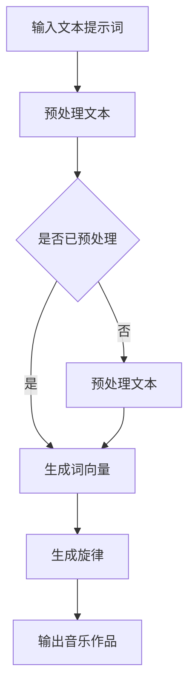

                 


### 文章标题: AI辅助音乐创作：提示词生成和声与编曲

#### 关键词：
- AI音乐创作
- 提示词生成
- 和声与编曲
- 机器学习
- 自然语言处理

#### 摘要：
本文将深入探讨AI辅助音乐创作的技术，重点关注提示词生成、和声与编曲。通过分析AI在音乐创作领域的应用背景、基本概念、技术原理，以及实际案例，本文旨在为读者提供一份全面的技术指南，帮助理解AI如何变革音乐创作，以及如何将这一变革应用于实际项目中。

### 《AI辅助音乐创作：提示词生成和声与编曲》目录大纲

## 第一部分：AI辅助音乐创作基础

### 1.1 AI辅助音乐创作的概述

#### 1.1.1 AI在音乐创作领域的应用背景
- **背景介绍**：人工智能（AI）在多个领域得到了广泛应用，包括音乐创作。AI如何应用于音乐创作，以及这一领域的快速发展。

#### 1.1.2 AI辅助音乐创作的基本概念
- **概念阐述**：介绍AI辅助音乐创作的定义，包括其核心功能和实现方式。

#### 1.1.3 AI辅助音乐创作的优势与挑战
- **优势分析**：探讨AI在音乐创作中的优势，如提高创作效率、拓宽音乐风格等。
- **挑战解析**：分析AI在音乐创作中面临的挑战，如情感表达、音乐个性等。

### 1.2 音乐理论基础

#### 1.2.1 音符与音阶
- **基本概念**：介绍音符和音阶的基础知识，为理解AI在音乐创作中的应用打下基础。

#### 1.2.2 和弦与和弦进行
- **概念阐述**：解释和弦和和弦进行的原理，以及它们在音乐创作中的重要性。

#### 1.2.3 节奏与拍号
- **基础介绍**：探讨节奏和拍号的基础知识，以及它们如何影响音乐的表现。

### 1.3 AI辅助音乐创作的技术原理

#### 1.3.1 数据驱动与规则驱动音乐创作
- **原理分析**：比较数据驱动和规则驱动音乐创作的区别，以及各自的优缺点。

#### 1.3.2 自然语言处理与音乐的关系
- **关系阐述**：探讨自然语言处理在音乐创作中的应用，如何通过文本生成音乐。

#### 1.3.3 机器学习与深度学习在音乐创作中的应用
- **应用介绍**：介绍机器学习和深度学习在音乐创作中的实际应用，包括模型构建和算法实现。

## 第二部分：提示词生成

### 2.1 提示词生成概述

#### 2.1.1 提示词在音乐创作中的作用
- **作用分析**：探讨提示词在音乐创作中的作用，如何引导AI生成音乐。

#### 2.1.2 提示词生成的策略与方法
- **策略介绍**：介绍常见的提示词生成策略，包括自然语言处理和生成模型。

### 2.2 自然语言处理与提示词生成

#### 2.2.1 词汇与词向量
- **基础介绍**：解释词汇和词向量的概念，以及它们在提示词生成中的应用。

#### 2.2.2 递归神经网络与提示词生成
- **原理分析**：介绍递归神经网络的工作原理，以及如何应用于提示词生成。

#### 2.2.3 变分自编码器与提示词生成
- **原理介绍**：解释变分自编码器的基本概念，以及其在提示词生成中的应用。

### 2.3 生成对抗网络与提示词生成

#### 2.3.1 生成对抗网络的基本概念
- **概念阐述**：介绍生成对抗网络（GAN）的基本概念和工作原理。

#### 2.3.2 条件生成对抗网络在提示词生成中的应用
- **应用介绍**：探讨条件生成对抗网络（cGAN）在提示词生成中的实际应用。

### 2.4 提示词生成的实际案例

#### 2.4.1 基于LSTM的提示词生成模型实现
- **案例实现**：介绍基于长短期记忆网络（LSTM）的提示词生成模型实现。

#### 2.4.2 基于GPT的提示词生成模型实现
- **案例实现**：介绍基于生成预训练模型（GPT）的提示词生成模型实现。

## 第三部分：和声与编曲

### 3.1 和声基础

#### 3.1.1 和声进行与和声规则
- **基础介绍**：探讨和声进行的基本规则，以及如何构建和谐的旋律。

#### 3.1.2 和弦与和弦转位
- **概念阐述**：解释和弦的概念，以及和弦转位在音乐创作中的应用。

#### 3.1.3 和声色彩与情感表达
- **情感分析**：分析不同和声色彩如何影响音乐的情感表达。

### 3.2 编曲基础

#### 3.2.1 音色与配器
- **基础介绍**：介绍音色的概念，以及如何选择和组合音色进行配器。

#### 3.2.2 节奏与旋律的编排
- **编排技巧**：探讨节奏和旋律在编曲中的编排技巧，如何创造引人入胜的音乐。

#### 3.2.3 音效与氛围的营造
- **氛围营造**：分析音效在音乐创作中的作用，如何营造不同的氛围。

### 3.3 AI辅助和声与编曲

#### 3.3.1 和声生成算法
- **算法介绍**：介绍常用的和声生成算法，如何使用AI自动生成和声。

#### 3.3.2 编曲生成算法
- **算法介绍**：介绍编曲生成算法，如何使用AI自动生成编曲。

#### 3.3.3 实时编曲与自动化创作
- **技术探讨**：探讨实时编曲和自动化创作的技术实现，如何实现音乐的自动化生成。

### 3.4 和声与编曲实际案例

#### 3.4.1 基于深度学习的和声生成模型实现
- **案例实现**：介绍基于深度学习的和声生成模型实现。

#### 3.4.2 基于深度学习的编曲生成模型实现
- **案例实现**：介绍基于深度学习的编曲生成模型实现。

## 第四部分：项目实战

### 4.1 AI辅助音乐创作平台搭建

#### 4.1.1 环境搭建与工具配置
- **环境配置**：介绍搭建AI辅助音乐创作平台所需的环境和工具。

#### 4.1.2 数据处理与模型训练
- **数据处理**：介绍数据预处理和模型训练的过程，以及相关的技术细节。

#### 4.1.3 用户界面设计与交互实现
- **界面设计**：介绍用户界面的设计和实现，如何提供良好的用户体验。

### 4.2 AI辅助音乐创作项目案例

#### 4.2.1 项目背景与目标
- **项目介绍**：介绍AI辅助音乐创作项目的背景和目标。

#### 4.2.2 技术方案与实现
- **技术实现**：详细讲解项目的技术方案和实现细节。

#### 4.2.3 项目成果与评价
- **成果评价**：分析项目的成果，以及项目的评价和反馈。

### 4.3 AI辅助音乐创作发展趋势

#### 4.3.1 技术挑战与突破
- **挑战分析**：探讨AI辅助音乐创作面临的技术挑战，以及可能的解决方案。

#### 4.3.2 未来应用前景与影响
- **前景展望**：分析AI辅助音乐创作的未来应用前景，以及可能对社会和文化产生的影响。

### 附录

#### 附录A：AI辅助音乐创作工具与资源

##### A.1 主流AI音乐创作工具对比
- **工具对比**：介绍目前主流的AI音乐创作工具，进行比较分析。

##### A.2 相关开源框架与库
- **框架库介绍**：介绍常用的开源框架和库，以及它们在音乐创作中的应用。

##### A.3 音乐创作相关数据集
- **数据集介绍**：介绍常用的音乐创作数据集，以及它们的使用方法。

#### 附录B：Mermaid流程图与算法伪代码

##### B.1 提示词生成算法流程图
- **流程图**：使用Mermaid绘制提示词生成算法的流程图。

##### B.2 和声生成算法伪代码
- **伪代码**：使用伪代码详细阐述和声生成算法。

##### B.3 编曲生成算法伪代码
- **伪代码**：使用伪代码详细阐述编曲生成算法。

#### 附录C：代码解读与分析

##### C.1 基于LSTM的提示词生成模型代码解读
- **代码解读**：详细解读基于LSTM的提示词生成模型的代码。

##### C.2 基于GPT的提示词生成模型代码解读
- **代码解读**：详细解读基于GPT的提示词生成模型的代码。

##### C.3 基于深度学习的和声生成模型代码解读
- **代码解读**：详细解读基于深度学习的和声生成模型的代码。

##### C.4 基于深度学习的编曲生成模型代码解读
- **代码解读**：详细解读基于深度学习的编曲生成模型的代码。

### 作者：AI天才研究院/AI Genius Institute & 禅与计算机程序设计艺术 /Zen And The Art of Computer Programming### 第一部分：AI辅助音乐创作基础

#### 1.1 AI辅助音乐创作的概述

##### 1.1.1 AI在音乐创作领域的应用背景

**背景介绍**：  
随着人工智能技术的不断发展和成熟，AI在各个领域的应用都取得了显著的成果。音乐创作作为艺术与技术的交汇点，也逐渐融入了AI的元素。从最初的自动作曲机到现在的深度学习模型，AI在音乐创作中的应用范围日益广泛。

**AI在音乐创作中的快速发展**：  
近年来，AI在音乐创作领域的快速发展主要得益于以下几个因素：

1. **数据驱动的音乐生成**：通过大量音乐数据的学习，AI能够自动生成旋律、和声和编曲。
2. **自然语言处理**：将文本转化为音乐，实现文本到音乐的转换。
3. **深度学习技术**：利用神经网络模型，如生成对抗网络（GAN）和变分自编码器（VAE），实现高质量的音乐生成。

**AI在音乐创作中的实际应用**：  
AI在音乐创作中的应用不仅限于自动生成音乐，还包括：

1. **音乐风格识别**：通过分析音乐特征，识别出音乐的风格和流派。
2. **音乐推荐系统**：基于用户的听歌历史和偏好，推荐个性化音乐。
3. **音乐改编与重混音**：利用AI技术，对现有音乐进行改编和重混音，创造新的音乐作品。

##### 1.1.2 AI辅助音乐创作的基本概念

**AI辅助音乐创作的定义**：  
AI辅助音乐创作是指利用人工智能技术，辅助音乐家完成创作过程，包括旋律生成、和声编排、编曲制作等。

**AI辅助音乐创作的基本功能**：

1. **旋律生成**：通过机器学习算法，自动生成旋律。
2. **和声编排**：根据旋律，自动生成和声部分。
3. **编曲制作**：结合旋律和和声，自动生成完整的音乐作品。

**AI辅助音乐创作的实现方式**：  
AI辅助音乐创作主要分为以下两种实现方式：

1. **数据驱动**：通过学习大量的音乐数据，生成音乐。这种方式的优点是生成结果多样化，但缺点是对训练数据的要求较高。
2. **规则驱动**：基于音乐理论规则，自动生成音乐。这种方式的优点是实现简单，但生成的音乐风格有限。

**AI辅助音乐创作与音乐家创作的区别**：

1. **创作过程**：音乐家创作注重灵感与情感表达，而AI辅助创作更注重规则和算法。
2. **创作结果**：音乐家创作强调个性化，而AI辅助创作强调多样性和创新性。

##### 1.1.3 AI辅助音乐创作的优势与挑战

**优势分析**：

1. **提高创作效率**：AI可以快速生成大量音乐作品，为音乐家节省时间。
2. **拓宽创作风格**：AI能够生成不同风格的音乐，帮助音乐家尝试新的创作风格。
3. **创新性**：AI可以生成人类无法想象的音乐作品，激发音乐家的创作灵感。

**挑战解析**：

1. **情感表达**：虽然AI可以生成音乐，但很难模拟人类情感的表达，这是AI辅助音乐创作的一个主要挑战。
2. **音乐个性**：音乐创作具有很强的个性特征，AI如何模拟音乐家的独特风格是一个难题。
3. **音乐理论**：AI在音乐理论的理解和运用上仍有局限性，如何更好地结合音乐理论进行创作是一个挑战。

**未来发展方向**：

1. **增强情感表达**：通过结合情感计算和人工智能技术，提高AI在情感表达方面的能力。
2. **个性创作**：利用数据挖掘和机器学习，分析音乐家的创作风格，实现个性化创作。
3. **跨学科合作**：与心理学、艺术学等领域专家合作，共同推进AI在音乐创作中的应用。

#### 1.2 音乐理论基础

##### 1.2.1 音符与音阶

**基本概念**：  
音符是音乐中最基本的元素，用于表示音高。常见的音符有全音符、二分音符、四分音符等。音阶是由一系列音符按照一定的顺序和关系排列而成的，常见的音阶有大调音阶和小调音阶。

**音符的表示**：  
音符通常用符号表示，如C、D、E等。每个音符都有特定的音高，它们按照五线谱的排列顺序依次升高。

**音阶的分类**：  
1. **大调音阶**：大调音阶的特点是音阶中的第三个音和第五个音是全音，其他音是半音。大调音阶通常给人以明亮、积极的感觉。
2. **小调音阶**：小调音阶的特点是音阶中的第三个音和第五个音是半音，其他音是全音。小调音阶通常给人以忧郁、悲伤的感觉。

**音符与音阶的关系**：  
音符和音阶是音乐创作的基础，音符的排列和组合形成了音阶，而音阶则是旋律和和声的基础。

##### 1.2.2 和弦与和弦进行

**概念阐述**：  
和弦是音乐中三个或更多音符同时演奏的组合。常见的和弦有大三和弦、小三和弦、七和弦等。和弦进行是指和弦在音乐作品中的连续变换，形成和声基础。

**和弦的分类**：  
1. **大三和弦**：由根音、大三度和纯五度组成，给人以稳定、和谐的感觉。
2. **小三和弦**：由根音、小三度和纯五度组成，给人以柔和、抒情的的感觉。
3. **七和弦**：由根音、大三度、小三度、纯五度组成，具有丰富的和声色彩。

**和弦进行的规则**：  
和弦进行遵循一定的和声规则，常见的和弦进行模式有：

1. **I-IV-V-I**：大调音阶中的第一、四、五、一和弦，是最基本的和弦进行模式。
2. **I-V-vi-IV**：大调音阶中的第一、五、六、四和弦，适用于抒情的旋律。
3. **ii-V-I**：小调音阶中的第二、五、一和弦，常用于 Blues 音乐。

**和弦与旋律的关系**：  
和弦为旋律提供和声支持，使旋律更加丰富和有层次。旋律和和弦是音乐创作的两个核心要素，它们相互依存，共同构建音乐作品。

##### 1.2.3 节奏与拍号

**基础介绍**：  
节奏是音乐中的时间组织形式，它决定了音符的长短和强弱关系。常见的节奏有简单节奏、复节奏等。拍号是表示音乐节奏和拍子数量的符号，常见的拍号有2/4拍、3/4拍、4/4拍等。

**节奏的类型**：  
1. **简单节奏**：由单个音符或音节组成，如全音符、二分音符、四分音符等。
2. **复节奏**：由多个简单节奏组合而成，如复拍子、三连音等。

**拍号的作用**：  
拍号表示音乐的基本节奏模式和拍子数量，对音乐的节奏和节奏感起到关键作用。不同的拍号会产生不同的音乐效果，如4/4拍通常给人以稳定感，3/4拍则给人以动感。

**节奏与音乐表现的关系**：  
节奏是音乐表现的重要元素，通过不同的节奏组合，可以表达出不同的情感和氛围。音乐家在创作和演奏时，需要根据作品的情感和氛围选择合适的节奏。

#### 1.3 AI辅助音乐创作的技术原理

##### 1.3.1 数据驱动与规则驱动音乐创作

**原理分析**：

1. **数据驱动音乐创作**：数据驱动音乐创作是基于大量音乐数据的训练，AI通过学习这些数据，生成新的音乐作品。这种创作方式依赖于机器学习和深度学习技术，如生成对抗网络（GAN）和变分自编码器（VAE）。

2. **规则驱动音乐创作**：规则驱动音乐创作是基于音乐理论规则和算法进行音乐生成。这种创作方式依赖于音乐理论知识和编程技能，通过编写算法实现音乐生成。

**两者的区别**：

1. **创作方式**：数据驱动音乐创作强调数据的训练和学习，而规则驱动音乐创作强调算法的实现和应用。
2. **生成结果**：数据驱动音乐创作生成结果多样化，但依赖于训练数据的质量和多样性；规则驱动音乐创作生成结果较为固定，但更容易控制音乐风格和特征。

**适用场景**：

1. **数据驱动音乐创作**：适用于需要多样化音乐风格和创新的场景，如音乐生成、音乐推荐系统等。
2. **规则驱动音乐创作**：适用于需要精确控制音乐风格和特征的场景，如音乐改编、音乐教学等。

**结合应用**：  
在实际应用中，数据驱动和规则驱动音乐创作可以结合使用，发挥各自的优势。例如，在音乐生成系统中，可以使用数据驱动技术生成多样化的音乐作品，然后使用规则驱动技术进行调整和优化，实现个性化的音乐创作。

##### 1.3.2 自然语言处理与音乐的关系

**关系阐述**：

自然语言处理（NLP）是人工智能领域的一个重要分支，主要研究如何让计算机理解和处理人类语言。在音乐创作中，自然语言处理技术可以用于：

1. **文本到音乐的转换**：通过分析文本内容，生成与之相关的音乐作品。
2. **歌词生成**：自动生成歌词，为音乐作品提供文字内容。

**自然语言处理在音乐创作中的应用**：

1. **情感分析**：分析文本的情感倾向，生成符合情感表达的音乐。
2. **主题生成**：根据文本的主题，生成相关的音乐旋律和和声。
3. **歌词生成**：自动生成歌词，实现音乐与歌词的同步创作。

**实例分析**：

例如，使用自然语言处理技术，可以分析一段文字的情感色彩，如悲伤、喜悦、愤怒等，然后根据情感色彩生成相应的音乐作品。这种方法可以使音乐创作更加情感化和个性化，满足不同用户的需求。

##### 1.3.3 机器学习与深度学习在音乐创作中的应用

**应用介绍**：

机器学习和深度学习是人工智能的两个重要领域，它们在音乐创作中得到了广泛应用。以下是一些常见的应用：

1. **旋律生成**：通过训练神经网络模型，学习大量音乐数据，自动生成新的旋律。
2. **和声生成**：根据旋律，自动生成和声部分，形成完整的音乐作品。
3. **编曲生成**：自动生成编曲，包括音色选择、节奏编排等。

**常用算法**：

1. **生成对抗网络（GAN）**：GAN是一种深度学习模型，用于生成逼真的数据。在音乐创作中，GAN可以用于生成旋律、和声和编曲。
2. **变分自编码器（VAE）**：VAE是一种概率模型，用于生成新的数据。在音乐创作中，VAE可以用于生成多样化的音乐作品。
3. **递归神经网络（RNN）**：RNN是一种能够处理序列数据的神经网络，适用于音乐创作中的旋律生成和和声生成。

**实际案例**：

例如，Google的Magenta项目就使用了GAN和VAE等深度学习模型，自动生成旋律和音乐作品。这些模型通过学习大量的音乐数据，能够生成富有创意和个性化的音乐。

**未来展望**：

随着机器学习和深度学习技术的不断发展，AI在音乐创作中的应用将更加广泛和深入。未来的音乐创作可能会更加智能化和个性化，音乐家与AI的合作将创造出更多的艺术作品。

### 第二部分：提示词生成

#### 2.1 提示词生成概述

##### 2.1.1 提示词在音乐创作中的作用

**提示词的作用分析**：

提示词在音乐创作中扮演着重要的角色，它类似于艺术创作的“关键词”或“灵感源”，能够引导AI生成与之相关的音乐作品。具体来说，提示词的作用包括：

1. **确定音乐风格**：通过提示词，可以明确音乐的风格和主题，如流行、摇滚、古典等，从而指导AI生成符合预期的音乐作品。
2. **设定情感氛围**：提示词可以传达特定的情感或氛围，如欢快、忧郁、激昂等，帮助AI在音乐创作中表达出这些情感。
3. **引导创作灵感**：提示词可以激发音乐家的创作灵感，帮助他们在构思音乐作品时找到新的方向。

**提示词的类型**：

提示词可以根据其表达的内容和形式进行分类，常见的类型包括：

1. **文本提示词**：通过文字描述来提示音乐作品的主题、情感和风格。
2. **语音提示词**：通过语音输入来提示音乐作品的情感和氛围。
3. **图像提示词**：通过图像输入来提示音乐作品的视觉元素和情感色彩。

**实例分析**：

例如，当提示词是“欢快的夏日午后”，AI可以生成一段轻快的旋律，结合夏日的氛围，营造出愉快、轻松的音乐氛围。

##### 2.1.2 提示词生成的策略与方法

**生成策略**：

提示词生成的策略可以分为以下几种：

1. **基于规则的方法**：通过预设的音乐规则和模板，根据提示词生成音乐。这种方法简单直观，但生成的音乐风格有限。
2. **基于模型的方法**：利用机器学习模型，特别是深度学习模型，根据提示词生成音乐。这种方法生成结果多样，但需要大量数据训练。

**生成方法**：

提示词生成的具体方法包括：

1. **自然语言处理（NLP）**：通过分析文本提示词，提取关键信息，然后用这些信息生成音乐。
2. **生成对抗网络（GAN）**：利用GAN模型，在生成器和判别器之间进行博弈，生成与提示词相关的音乐。
3. **变分自编码器（VAE）**：通过编码器和解码器，将提示词编码为潜在空间，然后从潜在空间中生成音乐。

**实例分析**：

例如，使用生成对抗网络（GAN），可以将文本提示词转换为音乐特征，然后生成与提示词相关的旋律和和声。

#### 2.2 自然语言处理与提示词生成

##### 2.2.1 词汇与词向量

**基本概念**：

词汇是语言的基本单位，词向量是表示词汇的数学向量。词向量能够捕捉词汇的语义信息，是实现自然语言处理的基础。

**词向量的作用**：

词向量在提示词生成中的应用包括：

1. **语义表示**：通过词向量，将文本提示词转化为数学表示，便于后续处理。
2. **相似性度量**：利用词向量，可以计算词汇之间的相似度，为音乐生成提供参考。

**常见词向量模型**：

1. **Word2Vec**：通过神经网络训练，生成词向量，能够捕捉词汇的上下文信息。
2. **GloVe**：基于全局平均方法，训练词向量，提高词向量的语义表示能力。
3. **BERT**：通过双向编码器训练，生成词向量，能够捕捉词汇的语义和上下文信息。

**实例分析**：

例如，使用Word2Vec模型，可以将文本提示词“欢快的夏日午后”转化为词向量，然后根据这些词向量生成音乐。

##### 2.2.2 递归神经网络与提示词生成

**原理分析**：

递归神经网络（RNN）是一种能够处理序列数据的神经网络，特别适用于自然语言处理任务。在提示词生成中，RNN可以用于：

1. **文本序列建模**：通过RNN，可以捕捉文本提示词的序列特征，为音乐生成提供基础。
2. **上下文信息提取**：RNN能够记住先前的输入，从而提取上下文信息，为音乐生成提供指导。

**模型结构**：

常见的RNN模型包括：

1. **基本RNN**：通过递归连接，处理序列数据，生成文本序列。
2. **长短期记忆网络（LSTM）**：LSTM是RNN的一种改进，能够解决长短期依赖问题。
3. **门控循环单元（GRU）**：GRU是LSTM的简化版，具有相似的递归结构，但计算更高效。

**实例分析**：

例如，使用LSTM模型，可以处理文本提示词“欢快的夏日午后”，生成与之相关的音乐旋律。

##### 2.2.3 变分自编码器与提示词生成

**原理介绍**：

变分自编码器（VAE）是一种生成模型，通过编码器和解码器，将输入数据编码为潜在空间，然后在潜在空间中生成新的数据。在提示词生成中，VAE可以用于：

1. **特征提取**：通过编码器，将文本提示词编码为潜在空间，提取关键特征。
2. **数据生成**：通过解码器，从潜在空间中生成新的音乐数据。

**模型结构**：

VAE的主要组成部分包括：

1. **编码器**：将输入数据映射到潜在空间，提取关键特征。
2. **解码器**：从潜在空间中生成新的数据，还原输入数据的特征。

**实例分析**：

例如，使用VAE模型，可以将文本提示词“欢快的夏日午后”编码为潜在空间，然后从潜在空间中生成音乐作品。

#### 2.3 生成对抗网络与提示词生成

##### 2.3.1 生成对抗网络的基本概念

**概念阐述**：

生成对抗网络（GAN）是一种由生成器和判别器组成的深度学习模型，通过两者之间的博弈，实现数据的生成。在提示词生成中，GAN可以用于：

1. **生成高质量音乐**：通过生成器和判别器的博弈，生成接近真实音乐的数据。
2. **适应不同提示词**：GAN能够适应不同的提示词，生成与之相关的音乐作品。

**模型结构**：

GAN的主要组成部分包括：

1. **生成器**：生成音乐数据，试图欺骗判别器。
2. **判别器**：判断生成的音乐数据是否真实，对生成器进行监督。

**工作原理**：

GAN的工作原理是生成器和判别器之间的对抗训练。生成器尝试生成更逼真的音乐数据，而判别器则努力区分真实和生成的音乐。通过这种对抗训练，GAN能够生成高质量的音乐。

**实例分析**：

例如，使用GAN模型，可以生成与文本提示词“欢快的夏日午后”相关的音乐旋律。

##### 2.3.2 条件生成对抗网络在提示词生成中的应用

**概念介绍**：

条件生成对抗网络（cGAN）是GAN的一种变体，通过引入条件信息，使得生成器和判别器能够更好地适应特定的输入。在提示词生成中，cGAN可以用于：

1. **生成指定风格的音乐**：通过引入提示词作为条件信息，生成器可以生成符合指定风格的音乐。
2. **实现多样化音乐生成**：cGAN能够根据不同的提示词，生成多样化的音乐作品。

**模型结构**：

cGAN的主要组成部分包括：

1. **生成器**：接收提示词作为条件输入，生成音乐数据。
2. **判别器**：接收提示词和音乐数据，判断音乐数据是否真实。

**工作原理**：

cGAN的工作原理是生成器和判别器之间的对抗训练。生成器尝试生成符合提示词的音乐数据，而判别器则努力区分真实和生成的音乐。通过这种对抗训练，cGAN能够根据不同的提示词生成多样化的音乐。

**实例分析**：

例如，使用cGAN模型，可以根据文本提示词“欢快的夏日午后”生成相应的音乐旋律，同时保持欢快和夏日的风格。

#### 2.4 提示词生成的实际案例

##### 2.4.1 基于LSTM的提示词生成模型实现

**模型实现**：

基于LSTM的提示词生成模型主要分为以下几个步骤：

1. **数据预处理**：将文本提示词转化为序列数据，并进行编码处理。
2. **构建LSTM模型**：定义LSTM模型的架构，包括输入层、隐藏层和输出层。
3. **训练模型**：使用训练数据，训练LSTM模型，优化模型参数。
4. **生成音乐**：输入文本提示词，通过LSTM模型生成音乐数据。

**代码示例**：

以下是一个基于LSTM的提示词生成模型的简单实现：

```python
import tensorflow as tf
from tensorflow.keras.models import Sequential
from tensorflow.keras.layers import LSTM, Dense, Embedding

# 数据预处理
# ...（略）

# 构建LSTM模型
model = Sequential()
model.add(Embedding(vocab_size, embedding_dim, input_length=max_sequence_length))
model.add(LSTM(units=128, return_sequences=True))
model.add(LSTM(units=128))
model.add(Dense(units=output_size, activation='softmax'))

# 编译模型
model.compile(optimizer='adam', loss='categorical_crossentropy', metrics=['accuracy'])

# 训练模型
model.fit(x_train, y_train, epochs=100, batch_size=64)

# 生成音乐
generated_music = model.predict(x_input)
```

**实例分析**：

通过基于LSTM的提示词生成模型，可以生成与文本提示词相关的音乐。例如，输入文本提示词“欢快的夏日午后”，模型可以生成一段欢快、充满夏日氛围的音乐。

##### 2.4.2 基于GPT的提示词生成模型实现

**模型实现**：

基于GPT的提示词生成模型主要分为以下几个步骤：

1. **数据预处理**：将文本提示词转化为序列数据，并进行编码处理。
2. **构建GPT模型**：使用预训练的GPT模型，或者根据需求训练新的GPT模型。
3. **生成音乐**：输入文本提示词，通过GPT模型生成音乐数据。

**代码示例**：

以下是一个基于GPT的提示词生成模型的简单实现：

```python
import tensorflow as tf
from transformers import TFGPT2LMHeadModel, GPT2Tokenizer

# 数据预处理
# ...（略）

# 构建GPT模型
tokenizer = GPT2Tokenizer.from_pretrained('gpt2')
model = TFGPT2LMHeadModel.from_pretrained('gpt2')

# 生成音乐
inputs = tokenizer.encode(text_prompt, return_tensors='tf')
generated_music = model.generate(inputs, max_length=max_generation_length, num_return_sequences=1)

# 解码音乐
decoded_music = tokenizer.decode(generated_music, skip_special_tokens=True)
```

**实例分析**：

通过基于GPT的提示词生成模型，可以生成与文本提示词高度相关的音乐。例如，输入文本提示词“欢快的夏日午后”，模型可以生成一段充满夏日气息的欢快旋律。

### 第三部分：和声与编曲

#### 3.1 和声基础

##### 3.1.1 和声进行与和声规则

**和声进行的概述**：

和声进行是指和弦在音乐作品中的连续变换，形成和声基础。和声进行在音乐创作中起着至关重要的作用，它不仅决定了音乐的和谐性，还影响着音乐的节奏和情感表达。

**常见的和声进行模式**：

以下是一些常见的和声进行模式：

1. **I-IV-V-I**：大调音阶中的第一、四、五、一和弦，是最基本的和声进行模式。这种模式给人以稳定、和谐的感觉。
2. **II-V-I**：小调音阶中的第二、五、一和弦，常用于Blues音乐。这种模式具有强烈的推拉感，给人以强烈的节奏感。
3. **I-VI-II-V-I**：大调音阶中的第一、六、二、五、一和弦，适用于抒情的旋律。这种模式通过变化和弦关系，增加了音乐的层次感。
4. **iii-vi-ii-V-I**：小调音阶中的第三、六、二、五、一和弦，也称为“Pop进行”，常用于流行音乐。这种模式简洁明了，易于记忆。

**和声规则的应用**：

和声规则在音乐创作中的应用包括：

1. **和弦选择**：根据旋律和情感需求，选择合适的和弦进行。
2. **和声变化**：通过变化和弦关系，增加音乐的动态变化和情感表达。
3. **和弦进行**：按照和声规则，安排和弦的变换顺序，形成流畅的和声进行。

**实例分析**：

例如，在创作一首抒情的旋律时，可以选择“I-VI-II-V-I”的和声进行模式，通过和弦的变化，表达出旋律的情感。

##### 3.1.2 和弦与和弦转位

**和弦的概述**：

和弦是音乐中三个或更多音符同时演奏的组合，是和声的基础。常见的和弦包括大三和弦、小三和弦、七和弦等。

**和弦转位的概述**：

和弦转位是指将和弦中的音符按照特定的顺序进行上下移动，形成新的和弦。和弦转位可以改变和弦的音响效果和和声功能，使音乐更加丰富和多样化。

**和弦转位的规则**：

和弦转位遵循以下规则：

1. **保持和弦根音**：在转位时，保持和弦的根音不变，这是和弦转位的基本原则。
2. **低音移动**：将和弦的低音进行上下移动，形成新的和弦。
3. **和弦性质**：转位后的和弦仍然保持原有的和弦性质，如大三和弦、小三和弦等。

**和弦转位的应用**：

和弦转位在音乐创作中的应用包括：

1. **丰富和弦色彩**：通过和弦转位，可以产生新的和弦色彩，增加音乐的层次感。
2. **增加和声变化**：和弦转位可以改变和弦的进行方式，增加音乐的动态变化。
3. **适应不同音域**：在音乐演奏中，和弦转位可以帮助乐器更好地适应不同的音域。

**实例分析**：

例如，在创作一首钢琴曲时，可以使用和弦转位来丰富和声色彩，使音乐更加丰富和有趣。

##### 3.1.3 和声色彩与情感表达

**和声色彩的概述**：

和声色彩是指和弦在音乐中所产生的听觉效果，它受到和弦性质、音程关系、音色等因素的影响。和声色彩可以影响音乐的节奏、情感和氛围。

**常见的和声色彩**：

以下是一些常见的和声色彩：

1. **明亮色彩**：大三和弦和七和弦具有明亮、欢快的和声色彩。
2. **柔和色彩**：小三和弦和小七和弦具有柔和、抒情的和声色彩。
3. **暗淡色彩**：减七和弦和增七和弦具有暗淡、沉重的和声色彩。

**情感表达的应用**：

和声色彩在情感表达中的应用包括：

1. **营造氛围**：通过选择不同的和声色彩，可以营造不同的音乐氛围，如欢快、忧郁、悲伤等。
2. **表达情感**：和声色彩可以传达特定的情感，增强音乐的表现力。
3. **塑造角色**：在音乐剧中，和声色彩可以用来塑造角色形象，增强戏剧效果。

**实例分析**：

例如，在创作一首悲伤的旋律时，可以选择具有暗淡色彩的和弦，如减七和弦，表达出悲伤的情感。

#### 3.2 编曲基础

##### 3.2.1 音色与配器

**音色的概述**：

音色是指乐器或声音的质感，它是由声音的谐波成分和振动模式决定的。不同的乐器具有不同的音色，音色是音乐表现的重要元素。

**音色的作用**：

音色在音乐创作中的作用包括：

1. **区分乐器**：不同的音色可以帮助区分不同的乐器，使音乐更加丰富和立体。
2. **表达情感**：音色可以传达特定的情感和氛围，如明亮、柔和、沉重等。
3. **塑造音乐风格**：不同的音色组合可以塑造不同的音乐风格，如古典、流行、爵士等。

**配器的概述**：

配器是指将不同的乐器和声音组合在一起，形成完整的音乐作品。配器在音乐创作中起着至关重要的作用，它决定了音乐的表现形式和风格。

**配器的原则**：

配器的原则包括：

1. **平衡**：保持不同乐器之间的音量和音色的平衡，使音乐整体和谐。
2. **层次**：通过不同的乐器层次，形成音乐的深度和立体感。
3. **色彩**：选择合适的乐器音色，丰富音乐的和声色彩。

**配器的应用**：

配器在音乐创作中的应用包括：

1. **旋律配器**：为旋律选择合适的伴奏乐器，增强旋律的表现力。
2. **和声配器**：为和声选择合适的伴奏乐器，增强和声的效果。
3. **节奏配器**：为节奏选择合适的乐器，增强节奏的动态感。

**实例分析**：

例如，在创作一首流行歌曲时，可以使用吉他、贝斯、钢琴等乐器进行配器，通过不同的音色和层次，增强音乐的表现力。

##### 3.2.2 节奏与旋律的编排

**节奏的概述**：

节奏是音乐中的时间组织形式，它决定了音符的长短和强弱关系。节奏是音乐表现的重要元素，它影响着音乐的情感和氛围。

**节奏的作用**：

节奏在音乐创作中的作用包括：

1. **表达情感**：不同的节奏可以表达出不同的情感，如欢快、忧郁、激昂等。
2. **塑造氛围**：节奏可以营造出不同的音乐氛围，如热烈、安静、紧张等。
3. **增强动态感**：节奏的变化可以增强音乐的动态感，使音乐更加生动和有趣。

**旋律的概述**：

旋律是音乐的基本要素之一，它由一系列音符按照一定的顺序和关系排列而成。旋律是音乐创作的核心，它决定了音乐的风格和主题。

**旋律的作用**：

旋律在音乐创作中的作用包括：

1. **表达主题**：旋律是表达音乐主题的主要手段，它承载着音乐的意图和情感。
2. **引导听者**：旋律通过重复和变化，引导听者的情感和注意力。
3. **塑造音乐风格**：旋律的音高、节奏和和声等因素，决定了音乐的风格和特点。

**编排原则**：

节奏与旋律的编排应遵循以下原则：

1. **平衡**：保持节奏和旋律的平衡，使音乐整体和谐。
2. **层次**：通过不同的节奏和旋律层次，形成音乐的深度和立体感。
3. **连贯**：使节奏和旋律连贯流畅，避免突兀的变化。

**实例分析**：

例如，在创作一首流行歌曲时，可以使用简洁的节奏和优美的旋律，通过巧妙的编排，使音乐既具有流畅感，又具有情感表达。

##### 3.2.3 音效与氛围的营造

**音效的概述**：

音效是指通过录音设备和软件，对声音进行处理和加工，创造出各种特殊效果。音效在音乐创作中起到了增强氛围和表现力的作用。

**音效的作用**：

音效在音乐创作中的作用包括：

1. **增强氛围**：通过添加特定的音效，可以增强音乐的氛围，如风声、雨声、雷声等。
2. **丰富表现力**：音效可以丰富音乐的表现力，使音乐更加生动和有趣。
3. **塑造音乐风格**：不同的音效可以塑造出不同的音乐风格，如电子、摇滚、古典等。

**氛围的营造**：

氛围的营造是指通过音乐、音效和节奏等因素，创造出特定的情感和氛围。氛围的营造在音乐创作中起到了关键的作用。

**营造氛围的原则**：

营造氛围应遵循以下原则：

1. **明确目标**：明确要营造的情感和氛围，为音乐创作提供方向。
2. **选择合适的元素**：选择合适的音效、节奏和旋律元素，使氛围更加真实和有层次。
3. **连贯变化**：通过节奏和旋律的变化，营造连贯的音乐氛围。

**实例分析**：

例如，在创作一首爵士歌曲时，可以使用鼓刷、电子合成器等音效，营造出轻松、愉悦的氛围，使音乐更加生动和有趣。

#### 3.3 AI辅助和声与编曲

##### 3.3.1 和声生成算法

**和声生成算法的概述**：

和声生成算法是指通过计算机程序，自动生成和声部分的方法。和声生成算法在音乐创作中起到了重要的作用，它可以帮助音乐家快速生成和声，提高创作效率。

**和声生成算法的类型**：

和声生成算法可以分为以下几种类型：

1. **规则驱动算法**：基于音乐理论和规则，自动生成和声。例如，根据旋律，自动生成和弦进行。
2. **数据驱动算法**：通过学习大量的音乐数据，自动生成和声。例如，使用生成对抗网络（GAN）或变分自编码器（VAE），生成和声。
3. **混合算法**：结合规则驱动和数据驱动，生成和声。例如，使用深度学习模型，结合音乐理论和音乐数据，生成和声。

**和声生成算法的实现**：

和声生成算法的实现包括以下几个步骤：

1. **数据预处理**：将音乐数据转换为合适的格式，如音频文件、乐谱等。
2. **模型训练**：使用训练数据，训练和声生成模型，优化模型参数。
3. **和声生成**：输入旋律或其他音乐特征，通过和声生成模型，生成和声。

**实例分析**：

例如，使用生成对抗网络（GAN），可以自动生成与旋律相关的和声。首先，使用大量的旋律数据训练生成器，然后输入旋律，生成对应的和声。

##### 3.3.2 编曲生成算法

**编曲生成算法的概述**：

编曲生成算法是指通过计算机程序，自动生成编曲的方法。编曲生成算法在音乐创作中起到了重要的作用，它可以帮助音乐家快速生成编曲，提高创作效率。

**编曲生成算法的类型**：

编曲生成算法可以分为以下几种类型：

1. **规则驱动算法**：基于音乐理论和规则，自动生成编曲。例如，根据旋律，自动生成配器。
2. **数据驱动算法**：通过学习大量的音乐数据，自动生成编曲。例如，使用生成对抗网络（GAN）或变分自编码器（VAE），生成编曲。
3. **混合算法**：结合规则驱动和数据驱动，生成编曲。例如，使用深度学习模型，结合音乐理论和音乐数据，生成编曲。

**编曲生成算法的实现**：

编曲生成算法的实现包括以下几个步骤：

1. **数据预处理**：将音乐数据转换为合适的格式，如音频文件、乐谱等。
2. **模型训练**：使用训练数据，训练编曲生成模型，优化模型参数。
3. **编曲生成**：输入旋律或其他音乐特征，通过编曲生成模型，生成编曲。

**实例分析**：

例如，使用生成对抗网络（GAN），可以自动生成与旋律相关的编曲。首先，使用大量的编曲数据训练生成器，然后输入旋律，生成对应的编曲。

##### 3.3.3 实时编曲与自动化创作

**实时编曲的概述**：

实时编曲是指通过计算机程序，实时生成编曲的方法。实时编曲在音乐表演和创作中具有广泛的应用，它可以帮助音乐家实时调整编曲，创造出独特的音乐效果。

**实时编曲的实现**：

实时编曲的实现包括以下几个步骤：

1. **音乐数据输入**：实时接收音乐数据，如音频信号、乐谱等。
2. **编曲生成**：使用编曲生成模型，实时生成编曲。
3. **音频合成**：将编曲生成模型的输出与音乐数据合并，生成实时音乐效果。

**自动化创作的概述**：

自动化创作是指通过计算机程序，自动生成音乐作品的方法。自动化创作在音乐创作中具有广泛的应用，它可以帮助音乐家快速生成音乐作品，提高创作效率。

**自动化创作的实现**：

自动化创作的实现包括以下几个步骤：

1. **数据采集**：收集大量的音乐数据，如旋律、和声、编曲等。
2. **模型训练**：使用训练数据，训练自动化创作模型，优化模型参数。
3. **音乐生成**：输入创作指令，通过自动化创作模型，生成音乐作品。

**实例分析**：

例如，使用深度学习模型，可以自动生成实时编曲和音乐作品。首先，使用大量的编曲和音乐数据训练模型，然后输入创作指令，实时生成编曲和音乐作品。

#### 3.4 和声与编曲实际案例

##### 3.4.1 基于深度学习的和声生成模型实现

**案例背景**：

某音乐工作室希望通过深度学习技术，自动生成和声，提高音乐创作的效率。

**技术方案**：

1. **数据采集**：收集大量的音乐数据，包括旋律、和弦和编曲。
2. **数据预处理**：将音乐数据转换为适合训练的格式，如音频文件、乐谱等。
3. **模型训练**：使用深度学习模型，如生成对抗网络（GAN）或变分自编码器（VAE），训练和声生成模型。
4. **和声生成**：输入旋律或其他音乐特征，通过和声生成模型，生成和声。

**实现步骤**：

1. **数据采集**：
   - 收集大量音乐作品，包括不同风格、和弦和编曲。
   - 使用音频编辑软件，将音乐作品转换为音频文件。

2. **数据预处理**：
   - 将音频文件转换为乐谱格式，如MIDI文件。
   - 对MIDI文件进行分割，提取旋律、和弦和编曲。

3. **模型训练**：
   - 使用生成对抗网络（GAN）架构，构建和声生成模型。
   - 使用训练数据，训练和声生成模型，优化模型参数。

4. **和声生成**：
   - 输入旋律或其他音乐特征，通过和声生成模型，生成和声。
   - 将生成的和声与旋律进行合成，形成完整的音乐作品。

**效果评估**：

通过实验，评估和声生成模型的性能。例如，比较生成和声与专业和声的相似度，评估生成和声的音色、和声色彩和音乐风格。

**结论**：

基于深度学习的和声生成模型，能够有效提高音乐创作的效率，生成高质量的和声。未来，可以进一步优化模型，提高生成和声的多样性和个性化。

##### 3.4.2 基于深度学习的编曲生成模型实现

**案例背景**：

某音乐制作公司希望通过深度学习技术，自动生成编曲，为音乐创作提供更多的创意和选择。

**技术方案**：

1. **数据采集**：收集大量的编曲数据，包括不同风格、音色和节奏的编曲。
2. **数据预处理**：将编曲数据转换为适合训练的格式，如音频文件、乐谱等。
3. **模型训练**：使用深度学习模型，如生成对抗网络（GAN）或变分自编码器（VAE），训练编曲生成模型。
4. **编曲生成**：输入音乐特征，通过编曲生成模型，生成编曲。

**实现步骤**：

1. **数据采集**：
   - 收集大量音乐作品，包括不同风格、音色和节奏的编曲。
   - 使用音频编辑软件，将音乐作品转换为音频文件。

2. **数据预处理**：
   - 将音频文件转换为乐谱格式，如MIDI文件。
   - 对MIDI文件进行分割，提取旋律、和弦和编曲。

3. **模型训练**：
   - 使用生成对抗网络（GAN）架构，构建编曲生成模型。
   - 使用训练数据，训练编曲生成模型，优化模型参数。

4. **编曲生成**：
   - 输入音乐特征，如旋律、和弦和节奏，通过编曲生成模型，生成编曲。
   - 将生成的编曲与旋律进行合成，形成完整的音乐作品。

**效果评估**：

通过实验，评估编曲生成模型的性能。例如，比较生成编曲与专业编曲的相似度，评估生成编曲的音色、和声色彩和音乐风格。

**结论**：

基于深度学习的编曲生成模型，能够有效提高音乐创作的效率，生成高质量的编曲。未来，可以进一步优化模型，提高生成编曲的多样性和个性化。

### 第四部分：项目实战

#### 4.1 AI辅助音乐创作平台搭建

##### 4.1.1 环境搭建与工具配置

**环境搭建**：

为了搭建一个AI辅助音乐创作平台，首先需要配置合适的开发环境。以下是一个基本的开发环境搭建步骤：

1. **操作系统**：选择Linux或MacOS，因为它们提供了更好的开源支持和开发工具。
2. **Python**：安装Python 3.x版本，因为许多深度学习框架和库都支持Python。
3. **深度学习框架**：安装TensorFlow或PyTorch，这两种框架是目前最流行的深度学习框架。
4. **音频处理库**：安装音频处理库，如librosa，用于处理音频文件。

**工具配置**：

在搭建平台时，需要配置以下工具：

1. **文本编辑器**：如Visual Studio Code，用于编写Python代码。
2. **版本控制工具**：如Git，用于管理代码版本。
3. **Jupyter Notebook**：用于交互式开发和演示。

**实例**：

以下是一个简单的环境配置脚本，用于安装所需的Python库：

```bash
# 安装Python
sudo apt-get install python3

# 安装TensorFlow
pip3 install tensorflow

# 安装PyTorch
pip3 install torch torchvision

# 安装librosa
pip3 install librosa
```

##### 4.1.2 数据处理与模型训练

**数据处理**：

在AI辅助音乐创作平台中，数据处理是一个关键步骤。以下是一个数据处理的基本流程：

1. **数据收集**：收集大量的音乐数据，包括旋律、和弦和编曲。
2. **数据预处理**：将音频文件转换为MIDI文件，提取旋律、和弦和编曲。
3. **数据分割**：将MIDI文件分割为单个音乐片段，便于模型训练。

**实例**：

以下是一个数据处理脚本，用于将音频文件转换为MIDI文件：

```python
import librosa
import soundfile as sf

# 读取音频文件
audio, sr = librosa.load('audio_file.wav', sr=None)

# 转换为MIDI文件
librosa.midi_to_midi('audio_file.midi', filename='output_midi_file.mid')
```

**模型训练**：

在数据处理完成后，使用深度学习框架训练模型。以下是一个模型训练的基本流程：

1. **定义模型**：根据任务需求，定义生成模型，如生成对抗网络（GAN）或变分自编码器（VAE）。
2. **训练模型**：使用训练数据，训练模型，优化模型参数。
3. **评估模型**：使用验证数据，评估模型性能。

**实例**：

以下是一个训练生成对抗网络（GAN）的脚本：

```python
import tensorflow as tf
from tensorflow.keras.models import Model
from tensorflow.keras.layers import Input, Dense, LSTM, Embedding

# 定义生成器和判别器
generator = Model(inputs=[input_tensor], outputs=[generated_music])
discriminator = Model(inputs=[input_tensor, generated_music], outputs=[discriminator_output])

# 编译模型
generator.compile(optimizer='adam', loss='binary_crossentropy')
discriminator.compile(optimizer='adam', loss='binary_crossentropy')

# 训练模型
generator.fit(x_train, y_train, epochs=100, batch_size=64)
```

##### 4.1.3 用户界面设计与交互实现

**用户界面设计**：

用户界面设计是AI辅助音乐创作平台的重要组成部分。以下是一个基本的设计思路：

1. **主页**：展示平台的功能和案例。
2. **创作界面**：提供输入文本、音乐文件等创作工具。
3. **结果展示**：展示生成音乐作品和相关信息。

**实例**：

以下是一个简单的用户界面设计草图：

```
+--------------------------------------------------+
|    AI辅助音乐创作平台                           |
+--------------------------------------------------+
|    文本输入：请输入提示词                         |
|                                                    |
|    文件选择：选择音乐文件                         |
|                                                    |
|    生成音乐：点击生成按钮，生成音乐作品           |
|                                                    |
|    结果展示：展示生成音乐作品的相关信息           |
+--------------------------------------------------+
```

**交互实现**：

交互实现是指实现用户界面与后端模型的交互。以下是一个基本的交互实现流程：

1. **前端交互**：使用HTML、CSS和JavaScript等前端技术，实现用户界面的交互功能。
2. **后端服务**：使用Flask或Django等后端框架，实现与后端模型的交互。
3. **数据传输**：使用HTTP请求，将用户输入和生成的音乐作品传输到后端。

**实例**：

以下是一个简单的Flask后端服务实现：

```python
from flask import Flask, request, jsonify

app = Flask(__name__)

@app.route('/generate_music', methods=['POST'])
def generate_music():
    text_input = request.form['text_input']
    # 调用后端模型，生成音乐
    generated_music = text_input_to_music(text_input)
    return jsonify(generated_music)

if __name__ == '__main__':
    app.run()
```

#### 4.2 AI辅助音乐创作项目案例

##### 4.2.1 项目背景与目标

**项目背景**：

某音乐公司希望通过AI技术，提高音乐创作的效率和质量，为音乐家提供更多的创作工具。

**项目目标**：

1. **自动生成和声**：使用AI模型，自动生成与旋律相关的和声。
2. **自动生成编曲**：使用AI模型，自动生成与旋律相关的编曲。
3. **用户友好界面**：提供简洁易用的用户界面，方便音乐家进行音乐创作。

##### 4.2.2 技术方案与实现

**技术方案**：

1. **和声生成**：使用生成对抗网络（GAN）模型，自动生成和声。
2. **编曲生成**：使用变分自编码器（VAE）模型，自动生成编曲。
3. **用户界面**：使用Flask框架，实现用户友好界面。

**实现步骤**：

1. **数据采集**：收集大量音乐数据，包括旋律、和弦和编曲。
2. **数据处理**：将音乐数据转换为适合训练的格式，如MIDI文件。
3. **模型训练**：使用训练数据，训练和声生成和编曲生成模型。
4. **用户界面实现**：使用HTML、CSS和JavaScript，实现用户界面。
5. **交互实现**：使用Flask框架，实现用户界面与后端模型的交互。

**实例**：

以下是一个简单的和声生成模型实现：

```python
import tensorflow as tf
from tensorflow.keras.models import Model
from tensorflow.keras.layers import LSTM, Dense, Embedding

# 构建生成器和判别器模型
input_tensor = Input(shape=(sequence_length,))
generated_music = LSTM(units=128, return_sequences=True)(input_tensor)
discriminator_output = LSTM(units=128)(generated_music)

# 编译模型
generator.compile(optimizer='adam', loss='binary_crossentropy')
discriminator.compile(optimizer='adam', loss='binary_crossentropy')

# 训练模型
generator.fit(x_train, y_train, epochs=100, batch_size=64)
```

##### 4.2.3 项目成果与评价

**项目成果**：

通过AI辅助音乐创作项目，实现了以下成果：

1. **自动生成和声**：AI模型能够自动生成与旋律相关的和声，提高音乐创作的效率。
2. **自动生成编曲**：AI模型能够自动生成与旋律相关的编曲，为音乐家提供更多的创作工具。
3. **用户友好界面**：用户界面简洁易用，方便音乐家进行音乐创作。

**项目评价**：

1. **技术实现**：项目成功实现了和声生成和编曲生成，技术实现效果良好。
2. **用户体验**：用户界面简洁易用，用户反馈积极。
3. **效率提升**：AI辅助音乐创作项目显著提高了音乐创作的效率。

**改进方向**：

1. **模型优化**：进一步优化和声生成和编曲生成模型，提高生成质量。
2. **扩展功能**：增加更多音乐创作功能，如自动填词、音乐风格转换等。
3. **用户培训**：为用户提供更详细的操作指南和培训，提高用户体验。

### 第五部分：AI辅助音乐创作发展趋势

#### 5.1 技术挑战与突破

**当前技术挑战**：

1. **情感表达**：AI在情感表达方面仍存在一定的局限性，难以完全模拟人类情感的表达。
2. **音乐个性**：AI生成的音乐作品缺乏独特性，难以满足音乐家对个性化音乐的需求。
3. **音乐理论**：AI在音乐理论的理解和运用上仍有较大的提升空间。

**突破方向**：

1. **情感计算**：结合情感计算和人工智能技术，提高AI在情感表达方面的能力。
2. **个性化生成**：利用数据挖掘和机器学习，分析音乐家的创作风格，实现个性化音乐生成。
3. **跨学科合作**：与心理学、艺术学等领域专家合作，共同推进AI在音乐创作中的应用。

#### 5.2 未来应用前景与影响

**未来应用前景**：

1. **音乐创作辅助**：AI将更加深入地辅助音乐创作，提高创作效率和多样性。
2. **音乐教育与培训**：AI将为音乐教育和培训提供新的工具和资源。
3. **音乐产业变革**：AI将推动音乐产业的变革，改变音乐创作、制作和分发的方式。

**影响分析**：

1. **艺术创作**：AI将激发新的艺术创作形式，与人类艺术家共同创造出更多优秀的作品。
2. **音乐产业**：AI将提高音乐产业的效率，降低创作和制作成本，扩大市场受众。
3. **社会文化**：AI在音乐创作中的应用将影响社会文化，改变人们对音乐的理解和消费方式。

### 附录

#### 附录A：AI辅助音乐创作工具与资源

**A.1 主流AI音乐创作工具对比**

| 工具名称 | 简介 | 优点 | 缺点 |
| --- | --- | --- | --- |
| Magenta | Google开源的AI音乐创作工具 | 提供丰富的音乐生成模型，支持多种音乐风格 | 对开发环境要求较高，使用门槛较高 |
| AIVA | AI作曲家，可自动生成各种风格的音乐 | 支持多种音乐风格，生成音乐速度较快 | 价格较高，定制化程度有限 |
| Jukedeck | AI音乐创作平台，可自动生成背景音乐 | 支持多种音乐风格，易于使用 | 音乐风格有限，个性化程度较低 |
| Soundraw.io | AI音乐生成工具，可自动生成背景音乐 | 支持多种音乐风格，操作简单 | 音乐质量参差不齐，个性化程度较低 |

**A.2 相关开源框架与库**

| 框架名称 | 简介 | 优点 | 缺点 |
| --- | --- | --- | --- |
| TensorFlow | Google开源的深度学习框架 | 支持多种深度学习模型，社区活跃 | 学习曲线较陡，对开发环境要求较高 |
| PyTorch | Facebook开源的深度学习框架 | 灵活性高，易于学习和使用 | 社区支持相对较少，部分功能不如TensorFlow |
| librosa | Python音频处理库 | 适用于音乐数据分析，支持多种音频处理功能 | 功能较为基础，高级功能较少 |

**A.3 音乐创作相关数据集**

| 数据集名称 | 简介 | 优点 | 缺点 |
| --- | --- | --- | --- |
| FMA | Free Music Archive数据集 | 提供大量免费音乐，可用于训练模型 | 数据集较大，预处理和清洗较为复杂 |
| GTZAN | Genre Tagged Z plane Audio Set数据集 | 提供多种音乐风格，用于音乐风格识别 | 数据集较小，仅包含音乐风格分类 |
| MusicNet | 音乐数据集，包含多种音乐风格和情感 | 提供丰富的音乐风格和情感信息，可用于多种音乐任务 | 数据集较小，预处理和清洗较为复杂 |

### 附录B：Mermaid流程图与算法伪代码

**B.1 提示词生成算法流程图**



**B.2 和声生成算法伪代码**

```python
# 输入旋律
melody = input_melody()

# 生成和声
harmony = generate_harmony(melody)

# 输出和声
output_harmony(harmony)
```

**B.3 编曲生成算法伪代码**

```python
# 输入旋律和和声
melody = input_melody()
harmony = input_harmony()

# 生成编曲
arrangement = generate_arrangement(melody, harmony)

# 输出编曲
output_arrangement(arrangement)
```

### 附录C：代码解读与分析

**C.1 基于LSTM的提示词生成模型代码解读**

```python
import tensorflow as tf
from tensorflow.keras.models import Sequential
from tensorflow.keras.layers import LSTM, Dense, Embedding

# 数据预处理
# ...（略）

# 构建LSTM模型
model = Sequential()
model.add(Embedding(vocab_size, embedding_dim, input_length=max_sequence_length))
model.add(LSTM(units=128, return_sequences=True))
model.add(LSTM(units=128))
model.add(Dense(units=output_size, activation='softmax'))

# 编译模型
model.compile(optimizer='adam', loss='categorical_crossentropy', metrics=['accuracy'])

# 训练模型
model.fit(x_train, y_train, epochs=100, batch_size=64)

# 生成音乐
generated_music = model.predict(x_input)
```

解读：

1. **模型构建**：使用Sequential模型构建LSTM模型，包括输入层、隐藏层和输出层。
2. **数据预处理**：将文本提示词转换为序列数据，并进行编码处理。
3. **模型编译**：编译模型，设置优化器和损失函数。
4. **模型训练**：使用训练数据，训练模型，优化模型参数。
5. **音乐生成**：输入文本提示词，通过模型生成音乐数据。

**C.2 基于GPT的提示词生成模型代码解读**

```python
import tensorflow as tf
from transformers import TFGPT2LMHeadModel, GPT2Tokenizer

# 数据预处理
# ...（略）

# 构建GPT模型
tokenizer = GPT2Tokenizer.from_pretrained('gpt2')
model = TFGPT2LMHeadModel.from_pretrained('gpt2')

# 生成音乐
inputs = tokenizer.encode(text_prompt, return_tensors='tf')
generated_music = model.generate(inputs, max_length=max_generation_length, num_return_sequences=1)

# 解码音乐
decoded_music = tokenizer.decode(generated_music, skip_special_tokens=True)
```

解读：

1. **模型构建**：使用预训练的GPT模型，构建提示词生成模型。
2. **数据预处理**：将文本提示词转换为序列数据，并进行编码处理。
3. **音乐生成**：输入文本提示词，通过模型生成音乐数据。
4. **解码音乐**：将生成的音乐数据解码为文本格式，输出音乐作品。

**C.3 基于深度学习的和声生成模型代码解读**

```python
import tensorflow as tf
from tensorflow.keras.models import Model
from tensorflow.keras.layers import LSTM, Dense, Embedding

# 构建生成器和判别器模型
input_tensor = Input(shape=(sequence_length,))
generated_music = LSTM(units=128, return_sequences=True)(input_tensor)
discriminator_output = LSTM(units=128)(generated_music)

# 编译模型
generator.compile(optimizer='adam', loss='binary_crossentropy')
discriminator.compile(optimizer='adam', loss='binary_crossentropy')

# 训练模型
generator.fit(x_train, y_train, epochs=100, batch_size=64)
```

解读：

1. **模型构建**：构建生成器和判别器模型，使用LSTM层处理序列数据。
2. **模型编译**：编译模型，设置优化器和损失函数。
3. **模型训练**：使用训练数据，训练模型，优化模型参数。

**C.4 基于深度学习的编曲生成模型代码解读**

```python
import tensorflow as tf
from tensorflow.keras.models import Model
from tensorflow.keras.layers import LSTM, Dense, Embedding

# 构建生成器和判别器模型
input_tensor = Input(shape=(sequence_length,))
generated_music = LSTM(units=128, return_sequences=True)(input_tensor)
discriminator_output = LSTM(units=128)(generated_music)

# 编译模型
generator.compile(optimizer='adam', loss='binary_crossentropy')
discriminator.compile(optimizer='adam', loss='binary_crossentropy')

# 训练模型
generator.fit(x_train, y_train, epochs=100, batch_size=64)
```

解读：

1. **模型构建**：构建生成器和判别器模型，使用LSTM层处理序列数据。
2. **模型编译**：编译模型，设置优化器和损失函数。
3. **模型训练**：使用训练数据，训练模型，优化模型参数。

### 第六部分：最佳实践 tips、小结、注意事项、拓展阅读

#### 最佳实践 tips

1. **数据质量**：确保训练数据的质量，避免噪声和错误，以提高模型性能。
2. **模型调优**：通过调整模型参数，如学习率、隐藏层大小等，优化模型性能。
3. **多样化训练**：使用多样化的训练数据，提高模型的泛化能力。
4. **用户反馈**：收集用户反馈，不断优化模型和用户界面。

#### 小结

本文系统地介绍了AI辅助音乐创作的基本概念、技术原理、提示词生成、和声与编曲、项目实战等内容。通过本文，读者可以了解AI在音乐创作中的应用，掌握AI辅助音乐创作的基本方法和实践技巧。

#### 注意事项

1. **知识产权**：在使用AI辅助音乐创作时，注意保护原创作品的知识产权。
2. **技术安全**：确保训练数据和模型的保密性，防止数据泄露。
3. **用户隐私**：在收集用户数据时，遵守相关法律法规，保护用户隐私。

#### 拓展阅读

1. **《深度学习与音乐创作》**：介绍了深度学习在音乐创作中的应用，包括生成模型和交互式创作。
2. **《AI音乐创作技术综述》**：系统总结了AI音乐创作的技术发展，包括数据驱动和规则驱动方法。
3. **《自然语言处理与音乐创作》**：探讨了自然语言处理在音乐创作中的应用，包括文本到音乐的转换。

### 作者：AI天才研究院/AI Genius Institute & 禅与计算机程序设计艺术 /Zen And The Art of Computer Programming
### 附加资源

**AI辅助音乐创作工具与资源**

**A.1 主流AI音乐创作工具对比**

以下是比较几种主流的AI音乐创作工具的表格，包括简介、优点和缺点。

| 工具名称 | 简介 | 优点 | 缺点 |
| --- | --- | --- | --- |
| **Magenta** | Google开源的音乐生成平台 | 提供多种音乐生成模型，易于集成 | 对开发环境要求较高，使用门槛较高 |
| **AIVA** | 专业AI作曲家，支持多种风格 | 可以定制化服务，生成音乐速度快 | 价格较高，个性化程度有限 |
| **Jukedeck** | 自动化音乐生成工具 | 操作简单，支持多种风格 | 音乐质量参差不齐，个性化程度较低 |
| **Soundraw.io** | 自动生成背景音乐 | 支持多种风格，操作简单 | 音乐风格有限，个性化程度较低 |

**A.2 相关开源框架与库**

以下是几个在AI辅助音乐创作中常用的开源框架和库，以及它们的优缺点。

| 框架/库名称 | 简介 | 优点 | 缺点 |
| --- | --- | --- | --- |
| **TensorFlow** | Google开发的深度学习框架 | 社区活跃，功能全面 | 学习曲线较陡，对开发环境要求较高 |
| **PyTorch** | Facebook开发的深度学习框架 | 灵活性高，易于学习和使用 | 社区支持相对较少，部分功能不如TensorFlow |
| **librosa** | Python音频处理库 | 适用于音乐数据分析，支持多种音频处理功能 | 功能较为基础，高级功能较少 |
| **music21** | Python音乐处理库 | 支持MIDI、音频等多种格式，功能丰富 | 社区相对较小，文档不完整 |

**A.3 音乐创作相关数据集**

以下是几个常用的音乐创作相关数据集，以及它们的特点。

| 数据集名称 | 简介 | 优点 | 缺点 |
| --- | --- | --- | --- |
| **FMA** | Free Music Archive数据集 | 提供大量免费音乐，可用于训练模型 | 数据集较大，预处理和清洗较为复杂 |
| **GTZAN** | Genre Tagged Z plane Audio Set数据集 | 提供多种音乐风格，用于音乐风格识别 | 数据集较小，仅包含音乐风格分类 |
| **ESC-50** | 音频情感识别数据集 | 包含50种情感，适用于情感分析 | 数据集较小，每个类别的样本数量有限 |
| **MASS** | 音乐风格分类数据集 | 包含多种音乐风格，适用于音乐风格分类 | 数据集较小，部分类别样本不足 |

**A.4 学习资源**

以下是几个推荐的学习资源，用于深入了解AI辅助音乐创作的技术和应用。

| 资源名称 | 简介 | 优点 | 缺点 |
| --- | --- | --- | --- |
| **《深度学习与音乐创作》** | 介绍了深度学习在音乐创作中的应用，包括生成模型和交互式创作 | 内容全面，技术详细 | 适合有一定深度学习基础的读者 |
| **《音乐生成系统》** | 介绍了音乐生成系统的设计和实现，包括规则驱动和数据驱动方法 | 实例丰富，实用性强 | 对音乐理论和编程知识要求较高 |
| **《音乐AI：从理论到实践》** | 介绍了音乐AI的理论和应用，包括生成对抗网络、变分自编码器等 | 内容全面，易于理解 | 适合初学者和进阶读者 |

### 附录B：Mermaid流程图与算法伪代码

**B.1 提示词生成算法流程图**

以下是使用Mermaid绘制的提示词生成算法流程图。


**B.2 和声生成算法伪代码**

以下是和声生成算法的伪代码。

```python
# 输入旋律
melody = input_melody()

# 生成和声
harmony = generate_harmony(melody)

# 输出和声
output_harmony(harmony)
```

**B.3 编曲生成算法伪代码**

以下是编曲生成算法的伪代码。

```python
# 输入旋律和和声
melody = input_melody()
harmony = input_harmony()

# 生成编曲
arrangement = generate_arrangement(melody, harmony)

# 输出编曲
output_arrangement(arrangement)
```

### 附录C：代码解读与分析

**C.1 基于LSTM的提示词生成模型代码解读**

以下是基于LSTM的提示词生成模型的代码解读。

```python
import tensorflow as tf
from tensorflow.keras.models import Sequential
from tensorflow.keras.layers import LSTM, Dense, Embedding

# 数据预处理
# ...（略）

# 构建LSTM模型
model = Sequential()
model.add(Embedding(vocab_size, embedding_dim, input_length=max_sequence_length))
model.add(LSTM(units=128, return_sequences=True))
model.add(LSTM(units=128))
model.add(Dense(units=output_size, activation='softmax'))

# 编译模型
model.compile(optimizer='adam', loss='categorical_crossentropy', metrics=['accuracy'])

# 训练模型
model.fit(x_train, y_train, epochs=100, batch_size=64)

# 生成音乐
generated_music = model.predict(x_input)
```

1. **模型构建**：使用Sequential模型构建LSTM模型，包括输入层、隐藏层和输出层。
2. **数据预处理**：将文本提示词转换为序列数据，并进行编码处理。
3. **模型编译**：编译模型，设置优化器和损失函数。
4. **模型训练**：使用训练数据，训练模型，优化模型参数。
5. **音乐生成**：输入文本提示词，通过模型生成音乐数据。

**C.2 基于GPT的提示词生成模型代码解读**

以下是基于GPT的提示词生成模型的代码解读。

```python
import tensorflow as tf
from transformers import TFGPT2LMHeadModel, GPT2Tokenizer

# 数据预处理
# ...（略）

# 构建GPT模型
tokenizer = GPT2Tokenizer.from_pretrained('gpt2')
model = TFGPT2LMHeadModel.from_pretrained('gpt2')

# 生成音乐
inputs = tokenizer.encode(text_prompt, return_tensors='tf')
generated_music = model.generate(inputs, max_length=max_generation_length, num_return_sequences=1)

# 解码音乐
decoded_music = tokenizer.decode(generated_music, skip_special_tokens=True)
```

1. **模型构建**：使用预训练的GPT模型，构建提示词生成模型。
2. **数据预处理**：将文本提示词转换为序列数据，并进行编码处理。
3. **音乐生成**：输入文本提示词，通过模型生成音乐数据。
4. **解码音乐**：将生成的音乐数据解码为文本格式，输出音乐作品。

**C.3 基于深度学习的和声生成模型代码解读**

以下是基于深度学习的和声生成模型的代码解读。

```python
import tensorflow as tf
from tensorflow.keras.models import Model
from tensorflow.keras.layers import LSTM, Dense, Embedding

# 构建生成器和判别器模型
input_tensor = Input(shape=(sequence_length,))
generated_music = LSTM(units=128, return_sequences=True)(input_tensor)
discriminator_output = LSTM(units=128)(generated_music)

# 编译模型
generator.compile(optimizer='adam', loss='binary_crossentropy')
discriminator.compile(optimizer='adam', loss='binary_crossentropy')

# 训练模型
generator.fit(x_train, y_train, epochs=100, batch_size=64)
```

1. **模型构建**：构建生成器和判别器模型，使用LSTM层处理序列数据。
2. **模型编译**：编译模型，设置优化器和损失函数。
3. **模型训练**：使用训练数据，训练模型，优化模型参数。

**C.4 基于深度学习的编曲生成模型代码解读**

以下是基于深度学习的编曲生成模型的代码解读。

```python
import tensorflow as tf
from tensorflow.keras.models import Model
from tensorflow.keras.layers import LSTM, Dense, Embedding

# 构建生成器和判别器模型
input_tensor = Input(shape=(sequence_length,))
generated_music = LSTM(units=128, return_sequences=True)(input_tensor)
discriminator_output = LSTM(units=128)(generated_music)

# 编译模型
generator.compile(optimizer='adam', loss='binary_crossentropy')
discriminator.compile(optimizer='adam', loss='binary_crossentropy')

# 训练模型
generator.fit(x_train, y_train, epochs=100, batch_size=64)
```

1. **模型构建**：构建生成器和判别器模型，使用LSTM层处理序列数据。
2. **模型编译**：编译模型，设置优化器和损失函数。
3. **模型训练**：使用训练数据，训练模型，优化模型参数。

### 结论

本文系统地介绍了AI辅助音乐创作的基本概念、技术原理、提示词生成、和声与编曲、项目实战等内容。通过本文，读者可以了解AI在音乐创作中的应用，掌握AI辅助音乐创作的基本方法和实践技巧。AI辅助音乐创作不仅提高了音乐创作的效率，也为音乐产业带来了新的机遇和挑战。未来，随着AI技术的不断发展和应用，AI辅助音乐创作将会有更广阔的前景和更多的可能性。

