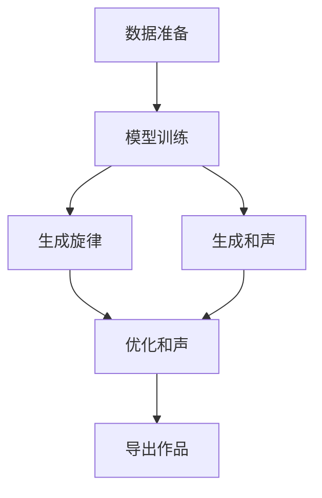
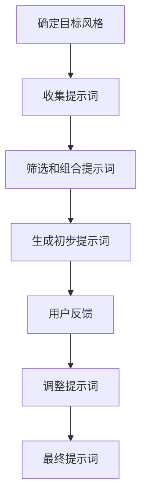
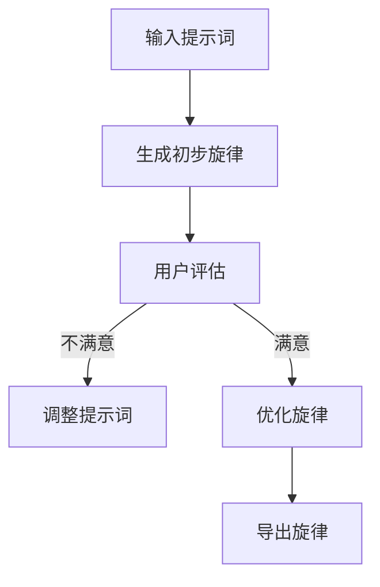
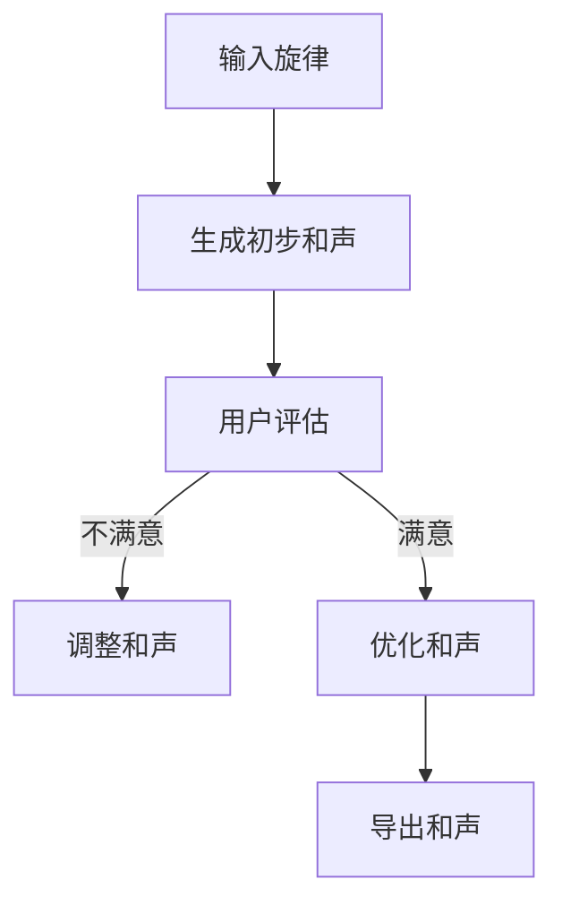

                 


### 《AI辅助音乐创作：提示词设计旋律与和声》

#### 关键词：人工智能，音乐创作，提示词，旋律，和声

> 摘要：本文将探讨人工智能（AI）在音乐创作中的应用，尤其是如何利用AI技术设计和生成旋律与和声。通过分析AI音乐创作的基础知识、提示词设计方法以及实际应用案例，本文旨在为音乐创作者提供新的创作思路和工具。

---

### 目录大纲

## 第一部分：音乐创作基础

### 第1章：AI辅助音乐创作的概述

#### 1.1 AI在音乐创作中的应用

#### 1.2 提示词与音乐创作的关系

#### 1.3 本书目标与结构

### 第2章：音乐理论知识

#### 2.1 音符与节拍

#### 2.2 音阶与和弦

#### 2.3 调式与调性

### 第3章：AI音乐创作工具介绍

#### 3.1 DAW（数字音频工作站）的使用

#### 3.2 AI音乐创作软件推荐

#### 3.3 AI音乐创作软件的基本功能

## 第二部分：提示词设计

### 第4章：提示词的基础概念

#### 4.1 提示词的定义

#### 4.2 提示词的类型

#### 4.3 提示词的作用

### 第5章：设计提示词的方法

#### 5.1 文字提示词的设计

#### 5.2 图像提示词的设计

#### 5.3 音频提示词的设计

### 第6章：提示词与音乐风格的关联

#### 6.1 不同音乐风格的提示词设计

#### 6.2 提示词的音乐风格匹配

#### 6.3 提示词与旋律、和声的关系

## 第三部分：AI辅助旋律创作

### 第7章：AI旋律创作原理

#### 7.1 旋律生成的算法

#### 7.2 旋律生成的过程

#### 7.3 旋律生成的策略

### 第8章：AI旋律创作实战

#### 8.1 创作一个简单的旋律

#### 8.2 优化旋律创作结果

#### 8.3 AI旋律创作的应用场景

## 第四部分：AI辅助和声创作

### 第9章：AI和声创作原理

#### 9.1 和声生成的算法

#### 9.2 和声生成的过程

#### 9.3 和声生成的策略

### 第10章：AI和声创作实战

#### 10.1 创作一个简单的和声

#### 10.2 和声创作中的常见问题

#### 10.3 AI和声创作的应用场景

## 第五部分：AI辅助音乐创作的未来

### 第11章：AI音乐创作的挑战与机遇

#### 11.1 AI音乐创作面临的挑战

#### 11.2 AI音乐创作的机遇

#### 11.3 AI音乐创作的未来趋势

### 第12章：AI辅助音乐创作的应用拓展

#### 12.1 音乐教育与培训

#### 12.2 音乐制作与发行

#### 12.3 音乐版权保护

## 附录

### 附录 A：AI音乐创作工具与资源

#### A.1 主流AI音乐创作工具

#### A.2 开源音乐创作工具

#### A.3 音乐创作相关资源网站

### 附录 B：Mermaid流程图

#### B.1 AI辅助音乐创作流程

#### B.2 提示词设计流程

#### B.3 旋律创作流程

#### B.4 和声创作流程

### 附录 C：代码示例与解读

#### C.1 代码环境搭建

#### C.2 旋律生成代码示例

#### C.3 和声生成代码示例

#### C.4 代码解读与分析

### 附录 D：参考书籍与文献

#### D.1 音乐创作相关书籍

#### D.2 AI音乐创作相关论文

#### D.3 AI音乐创作资源链接

---

### 第一章：AI辅助音乐创作的概述

#### 1.1 AI在音乐创作中的应用

随着人工智能（AI）技术的快速发展，AI在各个领域的应用越来越广泛，音乐创作领域也不例外。AI在音乐创作中的应用主要体现在旋律生成、和声创作、节奏设计、音乐风格识别等方面。通过机器学习和深度学习算法，AI能够从大量的音乐数据中学习并生成新颖的旋律与和声。

在旋律生成方面，AI可以通过分析大量的音乐作品，学习旋律的模式和规律，从而生成新的旋律。一些AI音乐创作工具，如AIVA、Ecrett等，已经能够生成复杂的旋律，甚至能够模仿特定作曲家的风格。

在和声创作方面，AI同样能够根据旋律生成相应的和声伴奏。例如，Google的Magenta项目就利用深度学习算法，通过分析大量的和声数据，生成新的和声。

此外，AI还可以用于音乐风格的识别与转换。通过学习不同音乐风格的特征，AI能够将一首歌曲转换成不同的风格，如将古典音乐转换成流行音乐。

#### 1.2 提示词与音乐创作的关系

提示词（Prompt）在AI音乐创作中起着至关重要的作用。提示词是一组用于指导AI生成内容的关键词或描述，它可以是一段文字、一个图像或一段音频。通过提示词，AI能够理解创作者的意图，从而生成符合要求的音乐。

在设计音乐创作AI系统时，提示词的设计至关重要。好的提示词能够引导AI生成出更加符合创作者意图的作品。例如，一个文字提示词“悲伤的旋律”可能会引导AI生成一段具有悲伤情感的旋律。

在音乐创作过程中，提示词不仅能够帮助AI生成旋律和和声，还能够用于音乐风格的转换和音乐的节奏设计。通过不同的提示词，AI可以创作出多样化的音乐作品。

#### 1.3 本书目标与结构

本书的目标是探讨AI在音乐创作中的应用，特别是提示词的设计与使用。通过分析AI音乐创作的基础知识、提示词设计方法以及实际应用案例，本书旨在为音乐创作者提供新的创作思路和工具。

本书的结构如下：

- 第一部分：音乐创作基础，介绍AI辅助音乐创作的基本概念和理论。
- 第二部分：提示词设计，讨论如何设计有效的提示词，包括文字、图像和音频提示词。
- 第三部分：AI辅助旋律创作，讲解AI如何生成旋律，并提供实际案例。
- 第四部分：AI辅助和声创作，探讨AI如何生成和声，并给出实际操作指南。
- 第五部分：AI辅助音乐创作的未来，展望AI音乐创作的挑战与机遇。
- 附录：提供AI音乐创作工具与资源，以及相关的代码示例和参考文献。

通过本书的阅读，读者可以了解到AI在音乐创作中的应用，学会如何使用AI工具进行音乐创作，并能够设计出更加高效的提示词，从而提高音乐创作的效率和质量。

---

### 第二章：音乐理论知识

#### 2.1 音符与节拍

在音乐创作中，音符和节拍是最基本的元素。音符表示音高，节拍表示时间的长短。

- **音符**：音符分为全音符、二分音符、四分音符、八分音符等。每个音符对应一个特定的时长，例如全音符代表一个完整的四分音符时值，二分音符代表两个四分音符时值，以此类推。

  - **全音符**（$$\text{Whole Note}$$）：一个全音符的时值为4个四分音符（$$4 \text{ quarter notes}$$）。
  - **二分音符**（$$\text{Half Note}$$）：一个二分音符的时值为2个四分音符。
  - **四分音符**（$$\text{Quarter Note}$$）：一个四分音符是最基本的音符，时值为1个四分音符。
  - **八分音符**（$$\text{Eight Note}$$）：一个八分音符的时值为半个四分音符。

- **节拍**：节拍表示音乐的时间单位，通常用音符来表示。例如，一个四分音符的节拍表示一个四分音符的时长。

  - **3/4拍**：表示每个小节有3个四分音符的时值，常见的节奏为强弱弱的规律。
  - **4/4拍**：表示每个小节有4个四分音符的时值，是最常见的节奏模式。

#### 2.2 音阶与和弦

音阶和和弦是音乐创作中的重要概念。

- **音阶**：音阶是由一系列音按照特定的顺序排列而成的。常见的音阶有大调音阶和小调音阶。

  - **大调音阶**（Ionian Mode）：
    - C大调音阶：C-D-E-F-G-A-B
    - D大调音阶：D-E-F#-G-A-B-C#
    - ...
  
  - **小调音阶**（Aeolian Mode）：
    - A小调音阶：A-B-C-D-E-F-G
    - C小调音阶：C-D-E-F-G-A-B
    - ...

- **和弦**：和弦是由三个或更多个音按照特定的间隔排列而成的。常见的和弦有三和弦、七和弦等。

  - **三和弦**（Triad）：
    - **大三和弦**（Major Triad）：根音到三音为大三度，三音到五音为小三度。
    - **小三和弦**（Minor Triad）：根音到三音为小三度，三音到五音为大三度。

  - **七和弦**（Seventh Chord）：
    - **大小七和弦**（Major Seventh）：大三和弦加上七度音。
    - **小七和弦**（Minor Seventh）：小三和弦加上七度音。
    - **增大七和弦**（Augmented Seventh）：大三和弦加上增七度音。
    - **减小七和弦**（Diminished Seventh）：小三和弦加上减七度音。

#### 2.3 调式与调性

调式和调性是音乐理论中的两个重要概念。

- **调式**：调式是音阶的一种表现形式，它定义了音阶中音符的音高关系。常见的调式有大调式和小调式。

  - **大调式**：大调式音阶具有明亮、开朗的情感。
  - **小调式**：小调式音阶具有深沉、忧郁的情感。

- **调性**：调性是指音乐作品的基础音高，通常由一个音阶的主音确定。例如，C大调的音乐作品以C音为主音，A小调的音乐作品以A音为主音。

  - **大调性**：以大调音阶为主。
  - **小调性**：以小调音阶为主。

通过理解音符、节拍、音阶、和弦、调式和调性的基本概念，音乐创作者可以更好地设计音乐作品的结构和情感表达。

---

### 第三章：AI音乐创作工具介绍

#### 3.1 DAW（数字音频工作站）的使用

数字音频工作站（Digital Audio Workstation，简称DAW）是音乐制作中不可或缺的工具。它提供了音频录制、编辑、混合和效果处理等功能。以下是一些常用的DAW软件及其特点：

- **Ableton Live**：Ableton Live是一个强大的音乐制作软件，特别适合现场表演和电子音乐制作。它提供了灵活的循环模式、直观的用户界面和丰富的音效插件。

- **FL Studio**：FL Studio是一个功能全面的DAW，适用于各种类型的音乐创作，包括流行音乐、电子音乐和嘻哈音乐。它提供了一个内置的合成器、采样器和音频编辑工具。

- **Pro Tools**：Pro Tools是专业音频制作领域的标准软件，广泛应用于电影、电视和音乐制作。它提供了强大的音频编辑、混合和效果处理功能，以及灵活的音频轨道和插件支持。

使用DAW进行音乐创作的基本流程包括：

1. **录音**：将乐器或声音源录制到DAW的轨道上。
2. **编辑**：对录音进行修剪、拼接和调整。
3. **混音**：将不同的音频轨道混合在一起，调整音量和音效。
4. **渲染**：将混音后的音频文件导出为最终的格式。

#### 3.2 AI音乐创作软件推荐

以下是一些流行的AI音乐创作软件，它们可以帮助音乐创作者生成旋律、和声和节奏：

- **AIVA**（Artificial Intelligence Virtual Artist）：AIVA是一个高级AI音乐创作工具，能够生成复杂的旋律和和声。它支持多种音乐风格，并提供一个直观的用户界面。

- **Ecrett**：Ecrett是一个基于AI的音乐生成平台，允许用户通过简单的文本描述生成旋律和和声。它支持多种音乐风格，并能够自动生成音乐旋律和节奏。

- **Amper Music**：Amper Music是一个AI音乐创作工具，允许用户通过简单的文本描述或图像生成旋律和和声。它提供了多种音乐风格和预设，用户可以根据需要进行自定义。

- **Magenta**：Magenta是Google的一个AI音乐创作项目，它利用深度学习算法生成音乐旋律和和声。它提供了一个API，允许开发者将其集成到自己的音乐创作应用中。

#### 3.3 AI音乐创作软件的基本功能

AI音乐创作软件通常具有以下基本功能：

- **生成旋律**：根据用户提供的提示词或音乐风格，AI能够生成新的旋律。
- **生成和声**：AI可以根据旋律自动生成相应的和声伴奏。
- **节奏设计**：AI可以根据用户的指示设计音乐的节奏。
- **音乐风格匹配**：AI可以识别和转换音乐风格，将一首歌曲转换成不同的风格。
- **用户界面**：AI音乐创作软件通常提供一个直观的用户界面，允许用户轻松地调整参数和生成音乐。

通过使用这些AI音乐创作工具，音乐创作者可以节省时间和精力，专注于音乐创作的过程，同时也能够探索新的创作思路和技巧。

---

### 第四章：提示词的基础概念

#### 4.1 提示词的定义

提示词（Prompt）是指导AI生成内容的关键词或描述。它是AI音乐创作系统的输入，用于定义创作者的意图和期望生成的音乐风格、情感和主题。

在音乐创作中，提示词可以是文字、图像或音频形式。例如，一个文字提示词可以是“快乐的旋律”、“悲伤的和声”，一个图像提示词可以是描绘特定情感场景的图片，一个音频提示词可以是包含特定音高的音频片段。

#### 4.2 提示词的类型

- **文字提示词**：文字提示词是最常见的类型，它通过简短的描述引导AI生成相应的音乐。例如，“欢快的节奏”、“古典风格的和声”等。

- **图像提示词**：图像提示词通过视觉元素来激发AI生成音乐。图像可以是描绘特定情感或场景的图片，例如快乐场景的图片可能会引导AI生成欢快的旋律。

- **音频提示词**：音频提示词通过音频片段来指导AI生成音乐。音频可以是旋律片段、和弦或节奏片段，用于引导AI生成类似风格或节奏的音乐。

#### 4.3 提示词的作用

提示词在AI音乐创作中起着至关重要的作用。它们能够帮助AI理解创作者的意图，从而生成符合期望的音乐。以下是提示词的几个关键作用：

- **定义风格**：提示词可以帮助AI识别和生成特定的音乐风格。例如，通过提示词“爵士风格”或“流行音乐”，AI可以生成相应的风格元素。

- **引导情感**：提示词可以引导AI生成具有特定情感的音乐。例如，通过提示词“悲伤的情感”或“欢快的情感”，AI可以生成相应的情感表达。

- **控制节奏**：提示词可以指导AI生成特定的节奏模式。例如，通过提示词“快节奏”或“慢节奏”，AI可以生成相应的节奏。

- **提供参考**：提示词可以为AI提供音乐创作的参考，例如旋律的起始音符、和声的特定和弦等。

通过有效的设计和利用提示词，音乐创作者可以大大提高AI音乐创作的效率和作品的质量。提示词的设计需要考虑音乐风格、情感、节奏等多方面的因素，以确保AI能够生成符合期望的音乐。

---

### 第五章：设计提示词的方法

#### 5.1 文字提示词的设计

文字提示词是AI音乐创作中最常见的类型，它通过描述性的语言引导AI生成音乐。设计有效的文字提示词需要考虑以下几个方面：

1. **明确性**：文字提示词需要清晰明确，避免模糊不清的描述。例如，使用“快乐的旋律”而不是“欢快的旋律”，因为“快乐”比“欢快”更具有情感指向性。

2. **多样性**：设计多样的提示词可以增加AI生成音乐的多样性。例如，除了“快乐的旋律”，还可以使用“欢快的节奏”、“生动的和声”等。

3. **具体性**：具体化的提示词可以帮助AI更精确地生成音乐。例如，使用“轻松的钢琴旋律”而不是“钢琴旋律”，因为“轻松”提供了更具体的情感和风格指示。

4. **情感表达**：提示词应能够传达出特定的情感。例如，使用“悲伤的和弦”或“激动的旋律”来引导AI生成具有特定情感的音乐。

5. **音乐风格**：明确指出音乐风格可以帮助AI更好地生成相应的音乐。例如，使用“爵士风格”或“古典音乐风格”。

#### 5.2 图像提示词的设计

图像提示词通过视觉元素激发AI生成音乐，设计图像提示词需要注意以下几点：

1. **情感传达**：选择能够传达特定情感的图像，如快乐场景的图片可能引导AI生成欢快的音乐。

2. **风格匹配**：图像应与目标音乐风格相匹配。例如，抽象的、色彩丰富的图像可能更适合电子音乐风格，而自然风光图片可能更适合古典音乐风格。

3. **细节丰富**：图像中的细节可以为AI提供更多创作灵感。例如，一个描绘雨夜的图像可以包含雨滴、路灯、街道等元素，这些元素都可以影响AI生成的音乐。

4. **多样性**：设计多种类型的图像提示词，例如静态图像、动态图像、抽象图像等，以增加AI生成音乐的多样性。

5. **文化背景**：考虑图像的文化背景，例如，一个描绘中国文化的图像可能引导AI生成具有中国传统音乐风格的音乐。

#### 5.3 音频提示词的设计

音频提示词通过音频片段来指导AI生成音乐，设计音频提示词需要注意以下几点：

1. **音高和节奏**：音频提示词应包含特定的音高和节奏模式。例如，一个特定的旋律片段或和弦片段可以引导AI生成类似风格的音乐。

2. **长度和清晰度**：音频提示词的长度应适中，以确保AI能够准确地捕捉到音乐特征。同时，音频应清晰，避免噪音干扰。

3. **风格特征**：音频提示词应包含目标音乐风格的特征。例如，一个爵士乐和弦片段可以引导AI生成爵士风格的音乐。

4. **多样性**：使用多种类型的音频提示词，例如旋律、和弦、节奏片段等，以增加AI生成音乐的多样性。

5. **音效和效果**：考虑使用特定的音效和效果，例如混响、延迟等，这些可以增加音乐的情感和风格。

通过结合多种类型的提示词，音乐创作者可以引导AI生成更加丰富多样、符合预期风格的音乐作品。

---

### 第六章：提示词与音乐风格的关联

#### 6.1 不同音乐风格的提示词设计

音乐风格是音乐创作中的重要元素，不同风格的音乐具有独特的情感表达和结构特点。在AI音乐创作中，通过设计不同的提示词，可以引导AI生成特定风格的音乐。以下是几种常见音乐风格的提示词设计：

1. **流行音乐**：流行音乐通常以轻快的节奏、简单的旋律和和声为主。

   - 文字提示词：欢快的旋律、简单的和弦、流行的节奏。
   - 图像提示词：活泼的舞蹈场景、快乐的街头景象。
   - 音频提示词：简单的旋律片段、常见的流行和弦。

2. **爵士音乐**：爵士音乐以其复杂的旋律、丰富的和声和即兴演奏而著称。

   - 文字提示词：复杂的旋律、丰富的和声、即兴的节奏。
   - 图像提示词：爵士乐队的演奏场景、复古的爵士酒吧。
   - 音频提示词：爵士和弦片段、典型的爵士节奏模式。

3. **古典音乐**：古典音乐通常具有严谨的结构、复杂的旋律和和声，以及丰富的音乐风格。

   - 文字提示词：宏伟的旋律、复杂的和声、古典的节奏。
   - 图像提示词：交响乐团的演奏场景、庄严的教堂。
   - 音频提示词：古典和弦片段、经典的古典音乐节奏。

4. **电子音乐**：电子音乐以其独特的效果、节奏和合成音色而著称。

   - 文字提示词：节奏感强的旋律、丰富的合成音色、电子效果。
   - 图像提示词：虚拟现实场景、科幻电影画面。
   - 音频提示词：合成器音色、电子节奏模式。

通过设计适合不同音乐风格的提示词，AI可以更好地理解创作者的意图，生成符合特定风格的音乐作品。

#### 6.2 提示词的音乐风格匹配

提示词的音乐风格匹配是AI音乐创作中的一个关键环节。通过匹配提示词和音乐风格，可以确保AI生成的音乐作品具有一致的风格特点。以下是几种音乐风格匹配的方法：

1. **基于规则匹配**：根据音乐风格的特征，设计一组规则来匹配提示词。例如，对于爵士风格，可以设定规则：和弦使用七和弦，节奏使用摇摆节奏。

2. **基于机器学习匹配**：通过训练模型，使AI能够从大量音乐数据中学习不同音乐风格的特征，从而实现自动匹配。例如，使用神经网络模型分析大量爵士音乐数据，使AI能够识别爵士风格的元素。

3. **用户反馈匹配**：允许用户对AI生成的音乐进行评价和反馈，通过用户的评价调整提示词和音乐风格的匹配。例如，如果用户认为生成的音乐风格不正确，可以提示AI调整提示词或风格参数。

通过多种匹配方法，可以确保AI生成的音乐作品与提示词所描述的音乐风格相匹配，从而提高音乐创作的质量。

#### 6.3 提示词与旋律、和声的关系

提示词不仅影响音乐的风格，还直接影响旋律和和声的设计。以下是提示词与旋律、和声之间的几种关系：

1. **旋律引导和声**：通过文字提示词“悲伤的旋律”，AI可以生成悲伤的旋律，并自动生成悲伤的和声来衬托旋律。

2. **和声影响旋律**：通过图像提示词“复杂的和弦”，AI可以生成复杂的和弦，并根据和弦生成相应的旋律。

3. **旋律和和声相互引导**：通过音频提示词“具有摇摆节奏的旋律”，AI可以生成具有特定节奏的旋律，并自动生成适合这种旋律的和声。

通过设计合理的提示词，音乐创作者可以引导AI生成具有特定风格、情感和旋律、和声关系的音乐作品，从而实现个性化的音乐创作。

---

### 第七章：AI旋律创作原理

#### 7.1 旋律生成的算法

AI旋律生成主要通过机器学习和深度学习算法实现。以下是一些常用的算法：

1. **生成对抗网络（GAN）**：GAN是一种无监督学习算法，通过生成器和判别器的对抗训练，使生成器能够生成逼真的旋律。

   - **生成器**：生成器是一个神经网络，它接收随机噪声并生成旋律。
   - **判别器**：判别器是一个神经网络，它接收真实的旋律和生成器生成的旋律，并判断它们的真实性。

   伪代码：
   ```python
   def generate_melody(noise):
       melody = generator(noise)
       return melody

   def discriminate(melody):
       real = real_melody
       fake = generator(melody)
       return判别器([real, fake])

   for epoch in range(num_epochs):
       noise = noise()
       melody = generate_melody(noise)
       loss = discriminate(melody)
       optimizer.zero_grad()
       loss.backward()
       optimizer.step()
   ```

2. **变分自编码器（VAE）**：VAE是一种生成模型，通过编码器和解码器将输入数据编码为潜在空间中的表示，并从潜在空间中生成数据。

   - **编码器**：编码器是一个神经网络，它接收旋律并编码为潜在空间的表示。
   - **解码器**：解码器是一个神经网络，它接收潜在空间的表示并解码为旋律。

   伪代码：
   ```python
   def encode_melody(melody):
       latent = encoder(melody)
       return latent

   def decode_melody(latent):
       melody = decoder(latent)
       return melody

   for epoch in range(num_epochs):
       melody = melody()
       latent = encode_melody(melody)
       reconstructed_melody = decode_melody(latent)
       loss = reconstruction_loss(melody, reconstructed_melody)
       optimizer.zero_grad()
       loss.backward()
       optimizer.step()
   ```

3. **长短期记忆网络（LSTM）**：LSTM是一种用于处理序列数据的神经网络，可以捕捉旋律的时间动态特征。

   - **输入层**：接收序列数据（如音符序列）。
   - **隐藏层**：包含LSTM单元，可以记忆长远的依赖关系。
   - **输出层**：生成新的音符序列。

   伪代码：
   ```python
   def lstm_melody(input_sequence):
       hidden_state = LSTM(input_sequence)
       output_sequence = hidden_state[-1]
       return output_sequence

   for epoch in range(num_epochs):
       input_sequence = input_sequence()
       output_sequence = lstm_melody(input_sequence)
       loss = melody_loss(input_sequence, output_sequence)
       optimizer.zero_grad()
       loss.backward()
       optimizer.step()
   ```

这些算法能够从大量的音乐数据中学习旋律的模式和规律，从而生成新的旋律。通过调整算法的参数和训练数据，可以生成多样化的旋律。

#### 7.2 旋律生成的过程

AI旋律生成过程主要包括以下步骤：

1. **数据准备**：收集大量的音乐数据，可以是旋律、和弦或完整的音乐作品。数据可以来自各种音乐风格，以确保生成的旋律具有多样性。

2. **数据预处理**：对音乐数据进行预处理，包括音频信号的提取、特征提取和序列化。特征提取可以包括梅尔频率倒谱系数（MFCC）、谱图、音高时序等。

3. **模型训练**：选择合适的算法（如GAN、VAE或LSTM）训练模型。在训练过程中，模型通过学习音乐数据中的旋律模式来生成新的旋律。

4. **生成旋律**：通过训练好的模型生成新的旋律。生成过程可以是随机的，也可以根据特定的提示词或风格进行控制。

5. **优化旋律**：对生成的旋律进行优化，以提高其质量和连贯性。优化可以包括调整旋律的音高、节奏和和声等。

6. **反馈循环**：允许用户对生成的旋律进行评价和反馈。根据用户的反馈，调整提示词和模型参数，以提高生成的旋律质量。

通过这些步骤，AI能够生成符合用户需求的新颖旋律，为音乐创作提供新的思路和工具。

#### 7.3 旋律生成的策略

为了生成高质量的旋律，可以采用以下策略：

1. **多样化的数据集**：使用包含多种音乐风格的数据集进行训练，以确保生成的旋律具有多样性。

2. **动态调整参数**：根据训练过程中的表现，动态调整模型的参数，如学习率、批量大小等，以优化训练效果。

3. **使用注意力机制**：在深度学习模型中引入注意力机制，使模型能够关注音乐数据中的关键特征，从而生成更具表现力的旋律。

4. **多模型融合**：结合多种算法生成旋律，例如，将GAN和LSTM结合，以利用各自的优点，生成更加高质量的旋律。

5. **用户互动**：允许用户在生成过程中进行互动，例如，调整提示词、音乐风格或旋律片段，以生成更符合用户需求的旋律。

通过这些策略，可以大大提高AI旋律生成的质量和多样性，为音乐创作提供强大的支持。

---

### 第八章：AI旋律创作实战

#### 8.1 创作一个简单的旋律

在本节中，我们将使用一个流行的AI音乐创作工具AIVA来创作一个简单的旋律。AIVA是一个基于人工智能的音乐创作平台，它允许用户通过简单的文字描述生成旋律。以下是使用AIVA创作一个简单旋律的步骤：

1. **选择音乐风格**：在AIVA的首页上，选择一个您希望创作的音乐风格，例如“流行音乐”。

2. **输入提示词**：在文本框中输入一个描述性的提示词，例如“欢快的旋律”。这个提示词将指导AIVA生成符合您要求的旋律。

3. **生成旋律**：点击“生成旋律”按钮，AIVA将根据您输入的提示词生成一个旋律。生成过程可能需要几秒钟。

4. **预览和调整**：预览生成的旋律，如果满意，可以保存并导出旋律。如果不满意，可以尝试调整提示词或使用其他风格。

以下是一个使用AIVA生成旋律的简单示例：

```plaintext
提示词：欢快的旋律

步骤1：选择“流行音乐”风格
步骤2：输入提示词“欢快的旋律”
步骤3：点击“生成旋律”
步骤4：预览并保存生成的旋律
```

通过这个简单的示例，您可以看到使用AIVA生成旋律的过程非常直观和便捷。

#### 8.2 优化旋律创作结果

生成的旋律可能并不完全符合预期，这时需要进行优化。以下是一些优化旋律的方法：

1. **调整提示词**：尝试更改提示词，例如将“欢快的旋律”更改为“富有活力的旋律”，以引导AIVA生成更具活力的旋律。

2. **使用多个提示词**：同时使用多个提示词，例如“欢快的旋律”和“动感的节奏”，以引导AIVA生成更加丰富和协调的旋律。

3. **手动调整**：在AIVA的编辑界面中，手动调整旋律的音高、节奏和和声。您可以使用滑块或选择不同的和弦来改变旋律的音色和情感。

以下是一个优化旋律的示例：

```plaintext
原始提示词：欢快的旋律
优化后提示词：富有活力的旋律和动感的节奏

步骤1：选择“流行音乐”风格
步骤2：输入优化后的提示词
步骤3：点击“生成旋律”
步骤4：预览并手动调整音高和节奏
步骤5：保存优化后的旋律
```

通过这些方法，您可以大大提高生成的旋律质量，使其更加符合您的创作要求。

#### 8.3 AI旋律创作的应用场景

AI旋律创作在多个应用场景中具有广泛的应用，以下是几个典型场景：

1. **独立音乐人**：独立音乐人可以使用AI旋律创作工具快速生成旋律，节省创作时间和精力，从而专注于歌词创作和制作。

2. **音乐教育和培训**：教师可以使用AI旋律创作工具为学生提供个性化的音乐练习，帮助学生更好地理解音乐理论和实践。

3. **音乐制作公司**：音乐制作公司可以利用AI旋律创作工具生成多样化的旋律，为电影、电视和广告提供背景音乐。

4. **电子游戏和电影**：游戏和电影制作人可以使用AI旋律创作工具为游戏和电影生成特定的旋律，增强观众的体验。

5. **音乐风格转换**：通过AI旋律创作工具，可以将一首歌曲转换成不同的音乐风格，为音乐爱好者提供新的音乐体验。

通过AI旋律创作工具，音乐创作者可以探索新的创作方法，提高创作效率，并实现更加个性化的音乐作品。

---

### 第九章：AI和声创作原理

#### 9.1 和声生成的算法

AI和声生成主要通过机器学习和深度学习算法实现。以下是一些常用的算法：

1. **生成对抗网络（GAN）**：GAN是一种无监督学习算法，通过生成器和判别器的对抗训练，使生成器能够生成逼真的和声。

   - **生成器**：生成器是一个神经网络，它接收旋律并生成相应的和声。
   - **判别器**：判别器是一个神经网络，它接收真实的和声和生成器生成的和声，并判断它们的真实性。

   伪代码：
   ```python
   def generate_chords(melody):
       chords = generator(melody)
       return chords

   def discriminate(chords):
       real = real_chords
       fake = generator(chords)
       return判别器([real, fake])

   for epoch in range(num_epochs):
       melody = melody()
       chords = generate_chords(melody)
       loss = discriminate(chords)
       optimizer.zero_grad()
       loss.backward()
       optimizer.step()
   ```

2. **变分自编码器（VAE）**：VAE是一种生成模型，通过编码器和解码器将输入数据编码为潜在空间中的表示，并从潜在空间中生成数据。

   - **编码器**：编码器是一个神经网络，它接收旋律并编码为潜在空间的表示。
   - **解码器**：解码器是一个神经网络，它接收潜在空间的表示并解码为和声。

   伪代码：
   ```python
   def encode_melody(melody):
       latent = encoder(melody)
       return latent

   def decode_chords(latent):
       chords = decoder(latent)
       return chords

   for epoch in range(num_epochs):
       melody = melody()
       latent = encode_melody(melody)
       reconstructed_chords = decode_chords(latent)
       loss = reconstruction_loss(melody, reconstructed_chords)
       optimizer.zero_grad()
       loss.backward()
       optimizer.step()
   ```

3. **长短期记忆网络（LSTM）**：LSTM是一种用于处理序列数据的神经网络，可以捕捉旋律和和声的时间动态特征。

   - **输入层**：接收序列数据（如旋律和和声）。
   - **隐藏层**：包含LSTM单元，可以记忆长远的依赖关系。
   - **输出层**：生成新的和声序列。

   伪代码：
   ```python
   def lstm_chords(input_sequence):
       hidden_state = LSTM(input_sequence)
       output_sequence = hidden_state[-1]
       return output_sequence

   for epoch in range(num_epochs):
       input_sequence = input_sequence()
       output_sequence = lstm_chords(input_sequence)
       loss = chords_loss(input_sequence, output_sequence)
       optimizer.zero_grad()
       loss.backward()
       optimizer.step()
   ```

这些算法能够从大量的音乐数据中学习旋律和和声的模式和规律，从而生成新的和声。通过调整算法的参数和训练数据，可以生成多样化的和声。

#### 9.2 和声生成的过程

AI和声生成过程主要包括以下步骤：

1. **数据准备**：收集大量的音乐数据，包括旋律和和声。数据可以来自各种音乐风格，以确保生成的和声具有多样性。

2. **数据预处理**：对音乐数据进行预处理，包括音频信号的提取、特征提取和序列化。特征提取可以包括梅尔频率倒谱系数（MFCC）、谱图、音高时序等。

3. **模型训练**：选择合适的算法（如GAN、VAE或LSTM）训练模型。在训练过程中，模型通过学习音乐数据中的和声模式来生成新的和声。

4. **生成和声**：通过训练好的模型生成新的和声。生成过程可以是随机的，也可以根据特定的提示词或风格进行控制。

5. **优化和声**：对生成的和声进行优化，以提高其质量和连贯性。优化可以包括调整和声的音高、节奏和和声类型等。

6. **反馈循环**：允许用户对生成的和声进行评价和反馈。根据用户的反馈，调整提示词和模型参数，以提高生成的和声质量。

通过这些步骤，AI能够生成符合用户需求的新颖和声，为音乐创作提供新的思路和工具。

#### 9.3 和声生成的策略

为了生成高质量的和声，可以采用以下策略：

1. **多样化的数据集**：使用包含多种音乐风格的数据集进行训练，以确保生成的和声具有多样性。

2. **动态调整参数**：根据训练过程中的表现，动态调整模型的参数，如学习率、批量大小等，以优化训练效果。

3. **使用注意力机制**：在深度学习模型中引入注意力机制，使模型能够关注音乐数据中的关键特征，从而生成更具表现力的和声。

4. **多模型融合**：结合多种算法生成和声，例如，将GAN和LSTM结合，以利用各自的优点，生成更加高质量的和声。

5. **用户互动**：允许用户在生成过程中进行互动，例如，调整提示词、音乐风格或和声类型，以生成更符合用户需求的和声。

通过这些策略，可以大大提高AI和声生成的质量和多样性，为音乐创作提供强大的支持。

---

### 第十章：AI和声创作实战

#### 10.1 创作一个简单的和声

在本节中，我们将使用AIVA来创作一个简单的和声。AIVA是一个基于人工智能的音乐创作平台，它允许用户通过简单的文字描述生成和声。以下是使用AIVA创作一个简单和声的步骤：

1. **选择音乐风格**：在AIVA的首页上，选择一个您希望创作的音乐风格，例如“流行音乐”。

2. **输入旋律**：在文本框中输入您希望生成的旋律，例如一个简单的音符序列。这个旋律将作为和声生成的参考。

3. **生成和声**：点击“生成和声”按钮，AIVA将根据您输入的旋律生成相应的和声。

4. **预览和调整**：预览生成的和声，如果满意，可以保存并导出和声。如果不满意，可以尝试调整旋律或使用其他风格。

以下是一个使用AIVA生成和声的简单示例：

```plaintext
旋律：C E G A E
风格：流行音乐

步骤1：选择“流行音乐”风格
步骤2：输入旋律“C E G A E”
步骤3：点击“生成和声”
步骤4：预览并保存生成的和声
```

通过这个简单的示例，您可以看到使用AIVA生成和声的过程非常直观和便捷。

#### 10.2 和声创作中的常见问题

在使用AI进行和声创作时，可能会遇到一些常见问题。以下是一些常见问题及其解决方案：

1. **生成的和声不和谐**：如果生成的和声听起来不和谐，可以尝试调整提示词或使用不同的音乐风格。例如，如果使用“悲伤的旋律”生成和声，但和声听起来很刺耳，可以尝试更改提示词为“温暖的旋律”。

2. **和声不连贯**：如果生成的和声不连贯，可以尝试调整和声的类型或节奏。例如，使用大三和弦和小三和弦的组合可以产生更加连贯的和声。

3. **和声过于复杂**：如果生成的和声过于复杂，可以尝试简化和声结构。例如，使用基础的和弦类型（如三和弦）而不是复杂的七和弦。

4. **和声缺少变化**：如果生成的和声缺乏变化，可以尝试增加和声的类型或使用不同的节奏模式。例如，使用不同的和弦进行切换或在和声中引入节奏变化。

以下是一个解决和声问题的示例：

```plaintext
问题：生成的和声过于复杂
解决方案：简化和弦类型，使用大三和弦和小三和弦组合
```

通过解决这些问题，您可以生成更加和谐、连贯和有变化的和声，提高音乐创作的质量。

#### 10.3 AI和声创作的应用场景

AI和声创作在多个应用场景中具有广泛的应用，以下是几个典型场景：

1. **独立音乐人**：独立音乐人可以使用AI和声创作工具快速生成和声，节省创作时间和精力，从而专注于旋律和歌词创作。

2. **音乐教育和培训**：教师可以使用AI和声创作工具为学生提供个性化的和声练习，帮助学生更好地理解音乐理论和实践。

3. **音乐制作公司**：音乐制作公司可以利用AI和声创作工具为电影、电视和广告生成多样化的和声，提高制作效率。

4. **电子游戏和电影**：游戏和电影制作人可以使用AI和声创作工具为游戏和电影生成特定的和声，增强观众的体验。

5. **音乐风格转换**：通过AI和声创作工具，可以将一首歌曲转换成不同的音乐风格，为音乐爱好者提供新的音乐体验。

通过AI和声创作工具，音乐创作者可以探索新的创作方法，提高创作效率，并实现更加个性化的音乐作品。

---

### 第十一章：AI音乐创作的挑战与机遇

#### 11.1 AI音乐创作面临的挑战

虽然AI音乐创作在多个领域展现出巨大的潜力，但它也面临着一些挑战：

1. **版权问题**：AI生成的新作品可能侵犯他人的版权，特别是在使用大量的已有音乐数据进行训练时。

2. **创作自由度**：AI生成的音乐可能缺乏人类音乐家的创造性和独特性，难以达到人类音乐家的创作高度。

3. **风格一致性**：AI在生成具有特定风格的音乐时，可能难以保持一致的风格特征，导致音乐作品风格不统一。

4. **技术成熟度**：尽管AI音乐创作技术取得了显著进展，但仍然存在性能和效果上的局限性，需要进一步优化。

5. **用户接受度**：一些音乐创作者和听众可能对AI生成的音乐持怀疑态度，担心它们无法达到人类音乐作品的艺术价值。

#### 11.2 AI音乐创作的机遇

尽管面临挑战，AI音乐创作也带来了许多机遇：

1. **创作效率提升**：AI可以大幅提高音乐创作的效率，使创作者能够快速生成多个版本的作品，从而节省时间和精力。

2. **创作多样化**：AI能够生成多样化的音乐作品，帮助创作者探索新的音乐风格和创意。

3. **音乐风格转换**：AI可以将一首歌曲转换成不同的音乐风格，为音乐爱好者提供全新的听觉体验。

4. **个性化定制**：AI可以根据用户的特定需求和偏好生成个性化的音乐作品，满足不同听众的喜好。

5. **教育应用**：AI可以在音乐教育和培训中发挥重要作用，帮助学生快速理解和掌握音乐理论知识。

6. **版权保护**：通过区块链技术，AI可以提供更加透明和安全的版权保护解决方案。

#### 11.3 AI音乐创作的未来趋势

随着技术的不断发展，AI音乐创作有望在以下几个方面取得突破：

1. **更加智能的生成算法**：通过深度学习和强化学习等先进算法，AI将能够生成更加自然、和谐的旋律和和声。

2. **跨领域合作**：AI音乐创作将与虚拟现实、增强现实和人工智能交互等领域相结合，创造出全新的音乐体验。

3. **版权解决方案**：区块链和智能合约等新兴技术将有助于解决AI音乐创作的版权问题，确保创作者的利益。

4. **个性化音乐服务**：AI将能够根据用户的喜好和历史数据生成个性化的音乐推荐和定制服务。

5. **教育普及**：AI将有助于普及音乐教育，让更多的人能够学习和创作音乐。

通过不断的技术创新和应用，AI音乐创作将在未来继续发挥重要作用，为音乐创作者和听众带来更多惊喜和可能性。

---

### 第十二章：AI辅助音乐创作的应用拓展

#### 12.1 音乐教育与培训

AI在音乐教育与培训中的应用具有巨大的潜力。通过AI技术，可以提供以下几种创新服务：

1. **个性化教学**：AI可以根据学生的学习进度、兴趣和需求，提供个性化的音乐教程。例如，学生可以按照自己的节奏学习不同的乐器演奏技巧和音乐理论。

2. **实时反馈**：AI可以实时分析学生的演奏，提供即时的反馈和建议。例如，通过音高和节奏分析，AI可以帮助学生纠正演奏中的错误。

3. **自动评分**：AI可以自动评分学生的练习，节省教师的时间和精力。例如，AI可以通过识别音符、节拍和和声等元素，自动评估学生的作品。

4. **虚拟伴奏**：AI可以生成与学生演奏同步的虚拟伴奏，帮助学生更好地理解音乐的节奏和和声。例如，在练习吉他时，AI可以生成相应的节奏和和弦伴奏。

5. **音乐理论讲解**：AI可以通过互动的方式为学生讲解音乐理论，例如通过动画、音频和视频等多媒体形式，让学生更加直观地理解复杂的音乐概念。

通过这些应用，AI可以大大提高音乐教学的效果和效率，帮助学习者更快地掌握音乐技能。

#### 12.2 音乐制作与发行

AI在音乐制作与发行中同样具有重要作用，可以带来以下改进：

1. **自动制作**：AI可以自动生成完整的音乐作品，包括旋律、和声、节奏和效果。音乐制作人可以利用AI快速制作初步的音频素材，从而节省时间，专注于创意和艺术层面。

2. **智能混音**：AI可以智能地分析音乐作品，优化混音效果。通过分析音频信号，AI可以自动调整音量、均衡和效果，使音乐作品更加和谐和动听。

3. **音乐风格转换**：AI可以将一首歌曲转换成不同的音乐风格，为音乐爱好者提供新的听感。例如，可以将古典音乐转换为流行音乐，或将传统音乐转换为现代风格。

4. **个性化推荐**：AI可以根据用户的历史播放记录和偏好，推荐个性化的音乐作品。这种推荐系统可以大大提高用户的满意度和粘性。

5. **版权管理**：AI可以协助音乐制作人进行版权管理，确保他们的作品得到合法保护。例如，AI可以通过区块链技术跟踪和管理音乐作品的版权信息。

通过这些应用，AI可以帮助音乐制作人提高创作效率，降低制作成本，并扩大音乐作品的受众。

#### 12.3 音乐版权保护

音乐版权保护是音乐产业中的一个重要问题，AI技术在以下几个方面提供了新的解决方案：

1. **版权检测**：AI可以通过分析音频信号，检测音乐作品中的侵权行为。例如，AI可以识别歌曲中的采样和引用，确保版权所有者的权益不受侵犯。

2. **版权跟踪**：AI可以自动跟踪音乐作品的传播和分发，确保版权所有者能够获得合理的收益。例如，AI可以监控流媒体平台上的播放量，根据播放量分配版权收益。

3. **智能合约**：AI可以与区块链技术结合，实现智能合约的自动化执行。智能合约可以自动执行版权交易、授权和收益分配，确保交易的透明性和公正性。

4. **数字指纹**：AI可以为音乐作品生成数字指纹，确保每份复制品都能够追溯到原始版权所有者。这种技术可以有效地防止非法复制和传播。

通过这些应用，AI可以为音乐版权保护提供强大的技术支持，保护创作者的合法权益。

---

### 附录 A：AI音乐创作工具与资源

#### A.1 主流AI音乐创作工具

以下是一些主流的AI音乐创作工具：

1. **AIVA**：AIVA是一个高级AI音乐创作工具，能够生成复杂的旋律和和声。它支持多种音乐风格，并提供一个直观的用户界面。

   - 官网链接：[AIVA官网](https://www.aiva.ai/)

2. **Ecrett**：Ecrett是一个基于AI的音乐生成平台，允许用户通过简单的文本描述生成旋律和和声。它支持多种音乐风格，并能够自动生成音乐旋律和节奏。

   - 官网链接：[Ecrett官网](https://ecrett.com/)

3. **Amper Music**：Amper Music是一个AI音乐创作工具，允许用户通过简单的文本描述或图像生成旋律和和声。它提供了多种音乐风格和预设，用户可以根据需要进行自定义。

   - 官网链接：[Amper Music官网](https://ampermusic.com/)

4. **Magenta**：Magenta是Google的一个AI音乐创作项目，它利用深度学习算法生成音乐旋律和和声。它提供了一个API，允许开发者将其集成到自己的音乐创作应用中。

   - 官网链接：[Magenta项目官网](https://magenta.tensorflow.org/)

#### A.2 开源音乐创作工具

以下是一些开源的音乐创作工具：

1. **Musiq**：Musiq是一个基于Python的音乐生成库，它提供了生成旋律、和声和节奏的功能。

   - GitHub链接：[Musiq GitHub](https://github.com/igormotov/musiq)

2. ** Sonic Pi**：Sonic Pi是一个开源的音乐创作环境，它提供了强大的音乐编程功能，允许用户通过编写代码创作音乐。

   - 官网链接：[Sonic Pi官网](https://sonic-pi.net/)

3. **Pianity**：Pianity是一个开源的钢琴软件，它提供了丰富的音乐创作和播放功能。

   - GitHub链接：[Pianity GitHub](https://github.com/pianity)

#### A.3 音乐创作相关资源网站

以下是一些提供音乐创作相关资源的网站：

1. **Musician's Handbook**：Musician's Handbook是一个综合性的音乐创作资源网站，提供了大量的音乐理论知识、技巧教程和练习。

   - 官网链接：[Musician's Handbook](https://www.musicianshandbook.com/)

2. **Sound On Sound**：Sound On Sound是一个专业的音乐制作杂志网站，提供了最新的音乐制作技术和产品评测。

   - 官网链接：[Sound On Sound](https://www.soundonsound.com/)

3. **ACCI Music**：ACCI Music是一个提供音乐理论和作曲教程的网站，适合初学者和有经验的音乐创作者。

   - 官网链接：[ACCI Music](https://accimusic.com/)

通过使用这些工具和资源，音乐创作者可以更好地利用AI技术进行音乐创作，提高创作效率和质量。

---

### 附录 B：Mermaid流程图

#### B.1 AI辅助音乐创作流程

以下是一个简单的Mermaid流程图，展示AI辅助音乐创作的整体流程：



#### B.2 提示词设计流程

以下是一个Mermaid流程图，展示提示词设计的流程：



#### B.3 旋律创作流程

以下是一个Mermaid流程图，展示旋律创作的流程：



#### B.4 和声创作流程

以下是一个Mermaid流程图，展示和声创作的流程：



通过这些流程图，可以更直观地理解AI辅助音乐创作和提示词设计的步骤，帮助音乐创作者更好地利用AI技术进行创作。

---

### 附录 C：代码示例与解读

#### C.1 代码环境搭建

在开始编写代码之前，需要搭建一个合适的开发环境。以下是使用Python和TensorFlow搭建AI音乐创作环境的基本步骤：

1. **安装Python**：确保您的系统上安装了Python 3.x版本。可以从Python官方网站下载安装包。

2. **安装TensorFlow**：在终端中运行以下命令安装TensorFlow：

   ```bash
   pip install tensorflow
   ```

3. **安装其他依赖**：根据项目需求，可能还需要安装其他依赖，如NumPy、Pandas等。可以使用以下命令安装：

   ```bash
   pip install numpy pandas
   ```

4. **环境验证**：在Python终端中运行以下代码，验证环境是否搭建成功：

   ```python
   import tensorflow as tf
   print(tf.__version__)
   ```

如果成功输出了TensorFlow的版本信息，说明环境搭建成功。

#### C.2 旋律生成代码示例

以下是一个简单的Python代码示例，使用TensorFlow生成一个旋律。这个示例使用了生成对抗网络（GAN）来生成旋律。

```python
import numpy as np
import tensorflow as tf
from tensorflow.keras.models import Sequential
from tensorflow.keras.layers import Dense, Flatten, Reshape, LSTM

# 参数设置
latent_dim = 100
n_melody_steps = 16
n_melodyNotes = 100
sequence_length = n_melody_steps * n_melodyNotes

# 创建生成器模型
generator = Sequential([
    Reshape((sequence_length,), input_shape=(latent_dim,)),
    LSTM(256),
    LSTM(256),
    Dense(n_melodyNotes, activation='softmax')
])

# 创建判别器模型
discriminator = Sequential([
    LSTM(256, input_shape=(sequence_length, n_melodyNotes)),
    LSTM(256),
    Flatten(),
    Dense(1, activation='sigmoid')
])

# 定义损失函数和优化器
cross_entropy = tf.keras.losses.BinaryCrossentropy(from_logits=True)
generator_optimizer = tf.keras.optimizers.Adam(1e-4)
discriminator_optimizer = tf.keras.optimizers.Adam(1e-4)

@tf.function
def train_step(melody):
    noise = tf.random.normal([1, latent_dim])
    with tf.GradientTape() as gen_tape, tf.GradientTape() as disc_tape:
        generated_melody = generator(noise)
        real_output = discriminator(melody)
        fake_output = discriminator(generated_melody)

        gen_loss = cross_entropy(tf.ones_like(fake_output), fake_output)
        disc_loss = cross_entropy(tf.zeros_like(real_output), real_output)
        disc_loss += cross_entropy(tf.ones_like(fake_output), fake_output)

    gradients_of_generator = gen_tape.gradient(gen_loss, generator.trainable_variables)
    gradients_of_discriminator = disc_tape.gradient(disc_loss, discriminator.trainable_variables)

    generator_optimizer.apply_gradients(zip(gradients_of_generator, generator.trainable_variables))
    discriminator_optimizer.apply_gradients(zip(gradients_of_discriminator, discriminator.trainable_variables))

# 训练模型
for epoch in range(100):
    for melody in melodies:
        train_step(melody)
```

在这个示例中，我们首先定义了生成器和判别器的模型结构，并设置了损失函数和优化器。然后，我们定义了一个`train_step`函数，用于训练模型。在训练过程中，我们通过循环遍历训练数据，并使用生成器和判别器进行前向传播和反向传播。

#### C.3 和声生成代码示例

以下是一个简单的Python代码示例，使用TensorFlow生成一个和声。这个示例同样使用了生成对抗网络（GAN）来生成和声。

```python
# 假设已经定义了生成器和判别器的模型结构
# ...

# 参数设置
sequence_length = n_chords * n_chords_steps

@tf.function
def generate_chords(melody):
    noise = tf.random.normal([1, latent_dim])
    generated_melody = generator(Reshape((sequence_length,), input_shape=(latent_dim,)))(noise)
    chords = Reshape((n_chords_steps, n_chords))(generated_melody)
    return chords

# 生成和声
for epoch in range(100):
    for melody in melodies:
        chord_sequence = generate_chords(melody)
        print("Generated Chord Sequence:", chord_sequence.numpy())
```

在这个示例中，我们定义了一个`generate_chords`函数，用于生成和声。这个函数首先生成一个随机噪声，然后使用生成器生成旋律，并将生成的旋律转换为和弦序列。在训练过程中，我们可以通过循环遍历训练数据，并生成和声序列。

#### C.4 代码解读与分析

在这个代码示例中，我们使用了生成对抗网络（GAN）来生成旋律和和声。GAN由生成器和判别器两个模型组成，生成器负责生成旋律或和声，而判别器负责判断生成的旋律或和声的真实性。

1. **模型结构**：
   - 生成器：生成器是一个深度神经网络，它接受一个随机噪声作为输入，并通过多个LSTM层生成旋律或和声。
   - 判别器：判别器也是一个深度神经网络，它接受旋律或和声作为输入，并输出一个介于0和1之间的值，表示输入旋律或和声的真实性。

2. **损失函数和优化器**：
   - 生成器的损失函数是交叉熵损失，它表示生成器和判别器之间的差异。我们希望生成器生成的旋律或和声能够尽量接近真实旋律或和声。
   - 判别器的损失函数也是交叉熵损失，它表示判别器对真实旋律或和声和生成器生成的旋律或和声的判断准确度。我们希望判别器能够准确地区分真实和生成。

3. **训练过程**：
   - 在每个训练步骤中，我们首先生成一个随机噪声，并将其传递给生成器，生成一个旋律或和声。
   - 然后，我们将生成的旋律或和声传递给判别器，并计算生成器和判别器的损失。
   - 接下来，我们使用优化器更新生成器和判别器的参数，以减少损失。
   - 通过反复迭代这个过程，生成器和判别器都会逐渐优化，直到生成器生成的旋律或和声接近真实旋律或和声。

通过这个示例，我们可以看到GAN在音乐创作中的应用。虽然这个示例相对简单，但展示了GAN的基本原理和应用场景。在实际应用中，我们可以根据需求调整模型结构、损失函数和训练过程，以生成更高质量的旋律和和声。

---

### 附录 D：参考书籍与文献

#### D.1 音乐创作相关书籍

1. **《音乐理论基础》**（作者：李维渤）
   - 本书系统地介绍了音乐创作的基本理论知识，包括音符、节拍、音阶、和弦等。

2. **《爵士和声学》**（作者：马克·利伯曼）
   - 本书深入探讨了爵士音乐中的和声理论，包括和弦、和弦进行和即兴演奏。

3. **《现代音乐创作技术》**（作者：约翰·菲尔德）
   - 本书介绍了现代音乐创作的方法和技术，包括旋律、和声、节奏和音乐风格的创作。

#### D.2 AI音乐创作相关论文

1. **“Magenta: The Music Research Project at Google AI”**（作者：Google AI团队）
   - 本文介绍了Google AI的Magenta项目，该项目旨在利用深度学习技术进行音乐创作。

2. **“Automatic Generation of Melodies by Combining Generative Models for Scale and Rhythm”**（作者：T. N. S. Ravi）
   - 本文提出了一种结合音阶和节奏生成模型的自动旋律生成方法。

3. **“A Survey of Music Generation Techniques”**（作者：Leon A. ID. et al.）
   - 本文对音乐生成技术进行了全面的综述，包括传统算法和现代AI算法。

#### D.3 AI音乐创作资源链接

1. **“AI in Music: A Survey”**（链接：[AI in Music Survey](https://aiinmusic.com/survey/)）
   - 这是一个关于AI在音乐创作中的应用的综合性调查，包含了最新的研究成果和应用案例。

2. **“Google Magenta Project”**（链接：[Google Magenta](https://magenta.tensorflow.org/)）
   - Google Magenta项目的官方网站，提供了关于深度学习在音乐创作中的应用的详细信息和代码示例。

3. **“AIVA Music”**（链接：[AIVA Music](https://www.aiva.ai/)）
   - AIVA Music的官方网站，提供了关于其AI音乐创作工具的详细信息和试用版本。

通过阅读这些书籍、论文和资源链接，读者可以深入了解音乐创作和AI音乐创作的理论和实践，为自身的音乐创作和AI研究提供参考和灵感。

