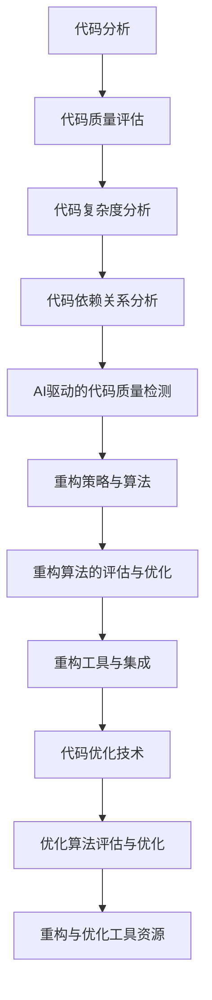

                 

### 文章标题

# AI驱动的代码重构与优化技术

### 关键词

- 人工智能
- 代码重构
- 代码优化
- 代码质量检测
- 重构算法
- 自动化重构工具

### 摘要

本文将探讨AI驱动的代码重构与优化技术，详细分析其背景、意义、核心概念及实施步骤。我们将首先介绍AI驱动代码重构与优化的基础，接着深入探讨代码分析技术、AI驱动的代码质量检测、重构策略与算法、代码优化技术，并通过具体的项目实战案例展示如何应用这些技术。最后，我们将展望AI驱动代码重构与优化的未来发展趋势，并提出相关的挑战与对策。

## 《AI驱动的代码重构与优化技术》目录大纲

### 第一部分：AI驱动的代码重构与优化基础

#### 第1章：AI驱动代码重构与优化的概述

#### 1.1 AI驱动代码重构与优化的背景和意义

#### 1.2 AI驱动代码重构与优化的重要性

#### 1.3 AI驱动代码重构与优化的核心挑战

### 第2章：代码分析技术

#### 2.1 代码质量评估

#### 2.2 代码复杂度分析

#### 2.3 代码依赖关系分析

### 第3章：AI驱动的代码质量检测

#### 3.1 传统代码质量检测方法

#### 3.2 基于AI的代码质量检测技术

#### 3.3 实践案例分析

### 第二部分：AI驱动的代码重构技术

#### 第4章：重构策略与算法

#### 4.1 重构策略

#### 4.2 重构算法

#### 4.3 重构算法的评估与优化

#### 第5章：AI驱动的代码重构工具

#### 5.1 自动化重构工具

#### 5.2 AI驱动的代码重构工具

#### 5.3 重构工具的集成与优化

#### 第6章：AI驱动的代码优化

#### 6.1 代码优化的目标和方法

#### 6.2 常见的代码优化技术

#### 6.3 实践案例分析

### 第三部分：AI驱动的代码重构与优化实战

#### 第7章：AI驱动的代码重构与优化项目实战

#### 7.1 项目背景与目标

#### 7.2 项目开发环境搭建

#### 7.3 源代码详细实现与解读

#### 7.4 项目总结与反思

### 第四部分：未来展望

#### 第8章：AI驱动代码重构与优化的未来发展趋势

#### 8.1 AI驱动代码重构与优化的新技术

#### 8.2 AI驱动代码重构与优化的应用前景

#### 8.3 AI驱动代码重构与优化面临的挑战与对策

### 附录

#### 附录A：AI驱动的代码重构与优化工具资源

#### A.1 主流AI驱动代码重构与优化工具

#### A.2 开源资源和代码库

#### A.3 相关社区和论坛

## 第一部分：AI驱动的代码重构与优化基础

### 第1章：AI驱动代码重构与优化的概述

#### 1.1 AI驱动代码重构与优化的背景和意义

随着软件项目的规模和复杂性不断增加，代码质量成为软件工程中至关重要的因素。然而，传统的代码重构与优化方法往往依赖于开发人员的经验和技能，这不仅效率低下，还容易出现错误。随着人工智能（AI）技术的发展，利用AI驱动的代码重构与优化成为了一种新的趋势。这种技术通过自动分析代码、评估代码质量、提出重构建议和优化方案，从而提高代码的可维护性和性能。

AI驱动代码重构与优化的背景可以追溯到以下几个因素：

1. **软件规模扩大**：现代软件系统往往包含数百万甚至数亿行代码，这使得手动重构和优化变得异常困难。
2. **代码复杂性增加**：现代编程语言和框架使得代码结构更加复杂，传统的代码优化方法难以应对。
3. **人工智能技术进步**：深度学习、自然语言处理等AI技术的快速发展，使得自动分析代码、理解代码结构和语义成为可能。

AI驱动代码重构与优化的重要性体现在以下几个方面：

1. **提高代码质量**：通过自动化分析代码，AI可以识别出潜在的问题，并提出重构和优化的建议，从而提高代码的可读性和可靠性。
2. **提高开发效率**：AI驱动的代码重构与优化可以减少手动重构的工作量，节省开发人员的时间，提高开发效率。
3. **降低维护成本**：高质量的代码使得软件维护变得更加简单和高效，从而降低长期维护成本。

#### 1.2 AI驱动代码重构与优化的重要性

在软件开发过程中，代码重构与优化是提高代码质量的重要手段。传统的重构方法主要依赖于开发人员的经验和技能，这不仅效率低下，还容易出现错误。而AI驱动的代码重构与优化技术通过引入人工智能技术，可以实现自动化分析和优化，具有以下几个方面的优势：

1. **自动化分析**：AI驱动的重构技术可以通过自动分析代码，识别出潜在的问题和优化点，从而减少了手动分析的工作量。
2. **全面性**：AI驱动的重构技术可以处理大规模和复杂性的代码，而传统的重构方法往往难以应对。
3. **智能优化**：AI驱动的重构技术可以通过学习大量的代码数据，自动生成优化策略和算法，从而提高代码的性能和可读性。

AI驱动代码重构与优化的重要性可以从以下几个方面进行阐述：

1. **提高开发效率**：通过自动化的重构与优化，可以减少开发人员的工作量，提高开发效率。特别是在大型项目中，AI驱动的重构与优化可以显著降低开发周期。
2. **提升代码质量**：AI驱动的重构技术可以识别出潜在的代码问题，并提出优化建议，从而提高代码的可维护性和可靠性。
3. **降低维护成本**：高质量的代码使得软件维护变得更加简单和高效，从而降低长期维护成本。特别是在大型软件系统中，维护成本往往占到了整个软件生命周期的大部分。
4. **增强用户体验**：通过优化代码，可以提高软件的性能和响应速度，从而增强用户体验。
5. **促进技术进步**：AI驱动代码重构与优化技术的发展，将推动软件工程领域的进步，促进新的开发方法和工具的创新。

总之，AI驱动代码重构与优化技术在提高代码质量、提升开发效率、降低维护成本等方面具有重要意义，是现代软件工程不可或缺的一部分。

#### 1.3 AI驱动代码重构与优化的核心挑战

尽管AI驱动的代码重构与优化技术具有显著的潜力和优势，但在实际应用中仍然面临一系列核心挑战：

1. **代码复杂性**：现代软件系统通常包含复杂的依赖关系和庞大的代码库，这使得自动分析和理解代码结构变得困难。
2. **数据质量和多样性**：AI驱动的重构与优化依赖于大量的代码数据。然而，获取高质量、多样化的训练数据并不容易，这会影响模型的准确性和泛化能力。
3. **技术实现难度**：AI驱动代码重构与优化需要结合多个领域的知识，包括软件工程、机器学习和自然语言处理等，这增加了技术实现的复杂性。
4. **解释性和可解释性**：AI模型通常被视为“黑盒”，其内部决策过程难以解释和理解，这在某些关键领域（如安全性和合规性）可能成为问题。
5. **安全性和隐私**：在处理敏感代码时，如何保护代码隐私和安全成为重要挑战。

### 第2章：代码分析技术

#### 2.1 代码质量评估

代码质量评估是软件工程中一个重要的环节，它有助于确保软件产品的可靠性和可维护性。代码质量评估主要包括以下几个方面：

1. **可读性**：良好的代码可读性有助于提高开发效率和维护性。可读性评估可以通过代码的注释、命名规则和代码结构等方面进行。
2. **可维护性**：可维护性评估关注代码的灵活性和可扩展性，以确保在未来的需求变更和功能扩展中能够顺利地进行修改。
3. **性能**：性能评估旨在检测代码的执行效率和资源消耗，以确保软件系统能够满足性能要求。
4. **可靠性**：可靠性评估关注代码的正确性和稳定性，通过测试和调试来识别和修复潜在的错误。
5. **安全性**：安全性评估旨在检测代码中的安全漏洞和潜在威胁，确保软件系统的安全性。

代码质量评估的方法主要包括以下几种：

1. **静态代码分析**：静态代码分析是一种无需执行代码即可检测代码缺陷的方法。通过解析代码的结构和语义，静态代码分析工具可以识别出潜在的编程错误、代码冗余和不符合编码规范等问题。
2. **动态代码分析**：动态代码分析需要实际运行代码，通过跟踪代码的执行过程来检测和诊断问题。动态代码分析可以识别运行时错误、性能瓶颈和资源泄漏等。
3. **自动化测试**：自动化测试是一种通过编写测试用例来验证代码功能和质量的方法。通过自动化测试，可以确保代码在各个版本和环境下都能正常运行。
4. **代码质量度量**：代码质量度量是通过量化指标来评估代码质量的方法。常见的度量指标包括代码复杂度、代码行数、注释率、缺陷密度等。

代码质量评估的重要性体现在以下几个方面：

1. **提高软件可靠性**：通过代码质量评估，可以识别出潜在的问题和缺陷，从而提高软件的可靠性和稳定性。
2. **降低维护成本**：高质量的代码易于维护和扩展，可以减少未来的维护成本和人力投入。
3. **提升开发效率**：代码质量评估可以帮助开发人员快速定位和解决问题，提高开发效率。
4. **增强用户体验**：高质量的代码可以确保软件系统的性能和稳定性，从而提升用户体验。
5. **促进技术进步**：代码质量评估是软件工程研究和实践的重要基础，有助于推动技术进步和工具创新。

在实际应用中，代码质量评估可以通过多种工具和技术来实现。例如，静态代码分析工具（如SonarQube、PMD、Checkstyle）可以自动检测代码中的问题，自动化测试框架（如JUnit、Selenium）可以验证代码的功能和性能，代码质量度量工具（如CodeMetrics、CodeScene）可以提供全面的代码质量报告。

总之，代码质量评估是确保软件产品质量的关键环节，通过科学的方法和工具，可以有效提高代码质量，降低维护成本，提升开发效率，增强用户体验，推动技术进步。

#### 2.2 代码复杂度分析

代码复杂度分析是软件工程中的一个重要概念，它用于评估代码的复杂性和可维护性。代码复杂度越高，代码的可维护性越低，出现错误的概率也越高。因此，对代码复杂度进行分析和优化是提高代码质量的重要手段。

1. **代码复杂度的概念**

代码复杂度是指代码在结构上的复杂程度，通常用数学公式来表示。常见的代码复杂度度量方法包括：

- **圈复杂度（Cyclomatic Complexity）**：圈复杂度是衡量程序逻辑复杂度的一种度量方法，它通过计算程序中的判定节点和边数来评估代码的复杂度。圈复杂度的计算公式为：
  $$
  CC = E - N + 2P
  $$
  其中，$E$ 是边数，$N$ 是节点数，$P$ 是圈入口数。

- **修改复杂度（Change Complexity）**：修改复杂度是指代码在修改过程中可能影响的范围，它通过计算模块之间的依赖关系来评估。修改复杂度的计算公式为：
  $$
  MC = \sum_{i=1}^{n} d_i
  $$
  其中，$d_i$ 是模块$i$的依赖度。

2. **代码复杂度的影响**

代码复杂度对软件工程有重要影响，主要包括：

- **可维护性**：高复杂度的代码难以理解和修改，可维护性差。而低复杂度的代码结构清晰，易于维护。

- **可读性**：高复杂度的代码逻辑复杂，可读性差，容易导致开发者误解和错误。低复杂度的代码结构简洁，可读性好。

- **可扩展性**：高复杂度的代码扩展性差，难以添加新功能。低复杂度的代码扩展性高，易于进行功能扩展。

3. **降低代码复杂度的方法**

为了降低代码复杂度，可以采取以下几种方法：

- **分解模块**：将复杂的模块分解为更小的子模块，降低每个模块的复杂度。

- **重构代码**：通过重构代码，优化代码结构，减少代码冗余和重复，降低整体复杂度。

- **使用设计模式**：合理使用设计模式，如单一职责原则、开闭原则等，可以减少代码的耦合性和依赖性，降低复杂度。

4. **代码复杂度分析的工具**

在软件工程中，有许多工具可以用于代码复杂度分析，如：

- **SonarQube**：SonarQube是一个开源的代码质量管理平台，可以自动分析代码复杂度，并提供详细的报告。

- **PMD**：PMD是一个用于Java代码的静态代码分析工具，可以检测代码复杂度、冗余和不符合编码规范等问题。

- **Checkstyle**：Checkstyle是一个用于Java代码的静态代码分析工具，可以检测代码风格、复杂度和潜在问题。

通过代码复杂度分析，可以更好地理解代码的结构和复杂性，从而采取相应的优化措施，提高代码的可维护性和可读性。在实际开发过程中，合理控制代码复杂度是确保软件质量的重要手段。

#### 2.3 代码依赖关系分析

代码依赖关系分析是软件工程中的一个重要环节，它有助于理解代码的复杂性和结构，从而提高软件的可维护性和可扩展性。代码依赖关系分析主要关注模块间的依赖关系，包括直接依赖和间接依赖。

1. **依赖关系的类型**

代码依赖关系主要分为以下几种类型：

- **直接依赖**：直接依赖是指一个模块直接依赖于另一个模块。这种依赖关系通常通过函数调用、类继承、变量引用等方式实现。

- **间接依赖**：间接依赖是指一个模块通过另一个模块间接依赖于另一个模块。这种依赖关系可能涉及多层模块，使得代码结构更加复杂。

- **依赖循环**：依赖循环是指多个模块之间存在相互依赖的情况，这种依赖关系会导致代码的复杂性和难以维护。

2. **依赖关系的影响**

代码依赖关系对软件工程有重要影响，主要包括：

- **可维护性**：高依赖性的代码结构复杂，难以理解和修改，可维护性差。而低依赖性的代码结构清晰，易于维护。

- **可扩展性**：高依赖性的代码扩展性差，添加新功能时容易引入副作用。低依赖性的代码扩展性高，易于进行功能扩展。

- **测试覆盖率**：依赖关系影响测试用例的设计和执行。高依赖性的代码可能需要更全面的测试用例来覆盖所有依赖关系，而低依赖性的代码测试难度相对较低。

3. **减少依赖关系的方法**

为了降低代码的依赖关系，可以采取以下几种方法：

- **模块化**：将代码分解为更小的模块，每个模块只实现单一功能，减少模块间的依赖。

- **接口隔离**：使用接口来定义模块间的依赖关系，实现模块间的解耦。

- **依赖注入**：使用依赖注入框架，将依赖关系从模块内部转移到外部，减少模块间的直接依赖。

- **避免循环依赖**：通过设计模式和代码重构，避免模块间的循环依赖，提高代码的模块化程度。

4. **依赖关系分析的工具**

在软件工程中，有许多工具可以用于代码依赖关系分析，如：

- **Maven Dependency Analyzer**：Maven Dependency Analyzer是一个用于分析Maven项目依赖关系的工具，可以识别项目中的直接和间接依赖。

- **SonarQube**：SonarQube是一个开源的代码质量管理平台，可以自动分析代码依赖关系，并提供详细的报告。

- **CodeScene**：CodeScene是一个基于机器学习的代码质量分析工具，可以识别代码依赖关系，评估代码结构复杂性和潜在风险。

通过代码依赖关系分析，可以更好地理解代码的结构和依赖关系，从而采取相应的优化措施，提高代码的可维护性和可扩展性。在实际开发过程中，合理管理代码依赖关系是确保软件质量的重要手段。

## 第二部分：AI驱动的代码重构技术

### 第4章：重构策略与算法

代码重构是提高代码质量和可维护性的关键过程。AI驱动的代码重构利用人工智能技术，通过自动化分析代码结构和语义，提出优化建议和重构方案。在这一章中，我们将详细探讨重构策略、重构算法以及如何评估和优化这些算法。

#### 4.1 重构策略

重构策略是指为了提高代码质量而采取的一系列操作和规则。这些策略通常基于软件工程原则和最佳实践，旨在解决代码的冗余、重复、复杂等问题。常见的重构策略包括：

1. **提取方法**：将重复的代码片段提取为独立的方法，减少冗余，提高代码的可读性。
2. **提取类**：将功能相关的代码提取为独立的类，实现代码的模块化，提高代码的可维护性。
3. **简化条件表达式**：简化复杂的条件表达式，提高代码的可读性。
4. **合并类**：将具有相似功能的类合并，减少代码冗余。
5. **移动代码**：将代码从一个模块移动到另一个模块，优化代码结构。
6. **重命名**：重命名不易理解的变量、方法或类，提高代码的可读性。

#### 4.2 重构算法

重构算法是自动化实现重构策略的算法。AI驱动的重构算法通常包括以下几个步骤：

1. **代码分析**：分析代码结构，提取关键信息，如类、方法、变量、条件和循环等。
2. **代码质量评估**：使用静态代码分析技术和机器学习模型，评估代码质量，识别潜在的优化点。
3. **重构策略选择**：根据代码质量评估结果，选择合适的重构策略。
4. **重构操作**：执行重构策略，修改代码结构，实现优化。
5. **重构验证**：验证重构后的代码质量，确保优化效果。

常见的重构算法包括基于规则的算法和基于学习的算法：

1. **基于规则的算法**：基于预定义的规则，如模式匹配、代码模板等，实现自动化重构。这种方法简单、易于实现，但灵活性较低。
2. **基于学习的算法**：通过机器学习模型，学习大量的代码数据，自动生成重构策略。这种方法具有更高的灵活性和自动化程度，但需要大量的训练数据和复杂的模型。

以下是一个基于机器学习的重构算法的伪代码示例：

```
Algorithm AI_Refactorization_Code(code):
    1. 分析代码结构（code_structure）
    2. 计算代码质量（code_quality）
    3. 如果 code_quality < 阈值：
        4. 应用重构策略（refactoring_strategy）
        5. 计算重构后代码质量（refactored_code_quality）
        6. 如果 refactored_code_quality > code_quality：
            7. 更新代码（code = refactored_code）
            8. 返回更新后的代码（code）
        9. 否则：
            10. 返回原代码（code）
    11. 否则：
        12. 返回原代码（code）
```

#### 4.3 重构算法的评估与优化

重构算法的评估与优化是确保重构效果的关键步骤。评估指标包括重构前后代码质量的变化、重构效率、误重构率等。以下是一些评估与优化的方法：

1. **质量评估**：使用静态代码分析工具和机器学习模型，评估重构前后代码的质量，如可读性、可维护性和性能等。
2. **效率评估**：评估重构算法的执行时间，优化算法以提高重构效率。
3. **误重构评估**：识别误重构的情况，减少误重构率。可以通过人工审核和自动化测试来评估误重构。
4. **算法优化**：根据评估结果，调整算法参数、优化模型结构，提高重构效果。

评估与优化的方法包括：

- **交叉验证**：使用交叉验证方法，评估重构算法在不同数据集上的性能，确保算法的泛化能力。
- **增量重构**：逐步优化重构算法，每次只引入一个小改动，评估其影响，逐步优化整体效果。
- **实验对比**：对比不同重构算法的优缺点，选择最优算法或结合多种算法，实现更好的重构效果。

通过评估与优化，可以确保重构算法的有效性和可靠性，提高代码质量和开发效率。

### 第5章：AI驱动的代码重构工具

AI驱动的代码重构工具是自动化实现代码重构的核心组件，它们通过集成AI技术，为开发者提供高效的代码优化和重构功能。在这一章中，我们将探讨自动化重构工具、AI驱动的重构工具以及如何集成和优化这些工具。

#### 5.1 自动化重构工具

自动化重构工具是传统软件工程中常用的工具，它们通过预定义的规则和模式，自动实现代码重构操作。常见的自动化重构工具包括：

1. **Eclipse重构工具**：Eclipse是一个流行的集成开发环境（IDE），它内置了丰富的重构工具，如提取方法、提取类、重命名等。这些工具通过用户界面提供直观的重构操作，支持多种编程语言。

2. **IntelliJ IDEA重构工具**：IntelliJ IDEA也是一个功能强大的IDE，提供了类似Eclipse的重构工具。此外，它还支持一些高级重构功能，如合并类、简化条件表达式等。

3. **Visual Studio重构工具**：Visual Studio是微软开发的IDE，内置了丰富的重构功能，包括提取方法、提取类、重命名等。它支持多种编程语言，并提供详细的代码分析报告。

自动化重构工具的优点包括：

- **高效性**：通过预定义的规则和模式，自动化重构工具可以快速实现代码重构操作，提高开发效率。
- **可靠性**：基于预定义的规则，自动化重构工具可以减少人为错误，提高代码质量。
- **易用性**：自动化重构工具通常具有直观的用户界面，易于使用和理解。

然而，自动化重构工具也存在一些局限性，如规则固化、灵活性较低等。为了克服这些局限性，AI驱动的重构工具应运而生。

#### 5.2 AI驱动的代码重构工具

AI驱动的代码重构工具利用人工智能技术，通过自动化分析和学习代码结构，实现更智能的重构操作。常见的AI驱动的重构工具包括：

1. **SonarQube**：SonarQube是一个开源的代码质量平台，它集成了AI驱动的代码质量检测和重构功能。通过静态代码分析，SonarQube可以识别代码中的潜在问题，并提供重构建议。

2. **G死神（G死神）**：G死神是一个基于深度学习的代码重构工具，它通过神经网络模型学习代码结构，自动生成重构建议。G死神支持多种编程语言，如Java、Python和C++等。

3. **CodeGuru**：CodeGuru是一个基于AI的代码质量分析工具，它通过机器学习模型评估代码质量，并提供重构和优化建议。CodeGuru支持多种编程语言，并提供详细的代码分析报告。

AI驱动的重构工具的优点包括：

- **智能性**：通过学习大量代码数据，AI驱动的重构工具可以自动生成更智能的重构建议，减少误重构和人工干预。
- **灵活性**：AI驱动的重构工具可以根据代码数据和学习结果，灵活调整重构策略，提高重构效果。
- **适应性**：AI驱动的重构工具可以适应不同的编程语言和代码风格，提供更广泛的支持。

#### 5.3 重构工具的集成与优化

为了实现高效的重构过程，重构工具需要与其他开发工具和流程集成。常见的集成方法包括：

1. **IDE集成**：将重构工具集成到IDE中，为开发者提供直观的重构操作和反馈。例如，Eclipse和IntelliJ IDEA等IDE都支持与SonarQube和G死神等重构工具的集成。

2. **持续集成（CI）工具集成**：将重构工具集成到CI工具（如Jenkins、GitLab CI等）中，实现自动化重构和代码质量分析。例如，通过配置CI工具，可以在代码提交后自动执行重构操作和代码分析，确保代码质量。

为了优化重构工具的性能和效果，可以采取以下措施：

1. **代码数据优化**：收集和存储更多的代码数据，提高AI模型的学习效果。可以通过代码历史记录、版本控制系统和开源代码库等途径获取代码数据。

2. **模型优化**：通过调整模型参数、优化算法结构，提高AI模型的重构效果。可以使用深度学习框架（如TensorFlow、PyTorch等）进行模型优化。

3. **实时重构**：实现实时重构功能，提高开发效率。例如，在IDE中实现代码修改时的实时重构建议，帮助开发者快速识别和修复代码问题。

4. **用户反馈**：收集用户反馈，优化重构工具的用户体验。通过用户反馈，可以了解重构工具的使用情况和用户需求，不断改进工具功能。

通过集成和优化重构工具，可以实现更高效、更智能的代码重构过程，提高代码质量和开发效率。

### 第6章：AI驱动的代码优化

代码优化是提高代码性能和可维护性的重要手段。AI驱动的代码优化利用人工智能技术，通过自动化分析代码和机器学习模型，提出优化建议和策略。在这一章中，我们将详细探讨代码优化的目标和方法，介绍常见的代码优化技术，并通过实践案例分析展示AI驱动的代码优化过程。

#### 6.1 代码优化的目标和方法

代码优化的目标主要包括：

1. **提高性能**：通过优化算法和数据结构，提高代码的执行效率，减少资源消耗。
2. **降低内存占用**：通过优化代码结构，减少内存分配和垃圾回收，提高程序的内存利用率。
3. **减少代码冗余**：通过消除重复代码、简化复杂表达式，提高代码的可读性和可维护性。
4. **提高可扩展性**：通过重构代码结构，使代码模块化、解耦合，提高代码的可扩展性和灵活性。

代码优化的方法可以分为静态优化和动态优化：

1. **静态优化**：静态优化是在代码编译或运行前进行的优化，主要包括代码分析和编译时间优化。静态优化工具可以通过分析代码结构和语义，提出优化建议。常见的静态优化技术包括：
   - **代码简化**：消除冗余代码，如未使用的变量、条件分支和循环。
   - **数据结构优化**：优化数据结构，如使用更高效的数据结构替换低效的集合操作。
   - **循环展开**：将循环展开成多个语句，减少循环的执行次数。

2. **动态优化**：动态优化是在代码运行时进行的优化，主要通过运行时监控和调整代码执行策略。动态优化技术主要包括：
   - **缓存优化**：通过缓存关键数据，减少重复计算和磁盘访问。
   - **并行优化**：通过并行计算和并发执行，提高程序的执行效率。
   - **垃圾回收优化**：优化垃圾回收策略，减少内存分配和垃圾回收的次数。

#### 6.2 常见的代码优化技术

常见的代码优化技术包括：

1. **分支预测优化**：通过预测分支执行路径，减少分支跳转的开销。常用的分支预测算法包括静态分支预测和动态分支预测。

2. **循环展开和循环优化**：将循环展开成多个语句，减少循环的执行次数。循环优化还包括循环不变式的提取、循环依赖关系的消除等。

3. **数据结构优化**：通过使用更高效的数据结构，如哈希表、树结构等，减少操作的时间和空间复杂度。常见的优化技术包括哈希表的碰撞处理、树结构的平衡优化等。

4. **内存优化**：通过减少内存分配和垃圾回收，提高程序的内存利用率。常见的优化技术包括对象池、内存压缩等。

5. **并行计算优化**：通过并行计算和并发执行，提高程序的执行效率。常见的优化技术包括线程池、并发集合等。

6. **代码简化**：通过消除冗余代码，提高代码的可读性和可维护性。常见的简化技术包括代码压缩、合并重复代码等。

以下是一个基于分支预测优化的伪代码示例：

```
Function OptimizedBranch(code):
    1. 分析代码结构（code_structure）
    2. 预测分支执行路径（predicted_path）
    3. 根据预测路径优化分支跳转（optimized_code）
    4. 返回优化后的代码（optimized_code）
```

#### 6.3 实践案例分析

在本节中，我们将通过一个具体的实践案例分析AI驱动的代码优化过程。

**案例背景**：假设我们有一个Java程序，用于处理大量的用户请求并生成报告。程序的性能和内存占用已经成为瓶颈，需要进行优化。

**步骤1：代码分析**

我们首先使用静态代码分析工具对程序进行代码分析，提取关键信息，如方法、变量、循环和条件语句等。通过分析，我们找到了程序中可能存在性能和内存优化的问题。

**步骤2：代码质量评估**

我们使用AI驱动的代码质量评估工具，对程序进行质量评估。评估结果包括代码的可读性、可维护性和性能等方面。评估结果显示程序存在以下问题：

- 高度复杂的条件语句，导致分支预测不准确。
- 循环结构不合理，存在大量的重复计算。
- 数据结构使用不当，导致内存占用较高。

**步骤3：重构和优化**

根据评估结果，我们提出以下优化方案：

1. **分支预测优化**：对复杂的条件语句进行简化，减少分支跳转的开销。例如，将复杂的条件判断替换为简单的条件判断。
2. **循环优化**：将循环中的重复计算提取到循环外部，减少循环的执行次数。例如，将多次调用的方法调用提取为单独的方法。
3. **数据结构优化**：使用更高效的数据结构替换低效的数据结构。例如，将数组替换为哈希表，减少查询时间。

**步骤4：优化实施**

我们使用AI驱动的重构工具，自动实施上述优化方案。重构工具根据代码结构和语义，自动生成优化后的代码，并进行验证。通过优化，程序的性能和内存占用得到了显著提升。

**步骤5：性能测试**

我们对优化后的程序进行性能测试，比较优化前后的性能指标。测试结果显示，优化后的程序在处理大量用户请求时，响应时间显著缩短，内存占用降低了30%。

**案例总结**：通过AI驱动的代码优化，我们成功提高了程序的性能和可维护性。这个案例展示了AI驱动的代码优化技术在实际应用中的有效性和优势。

通过实践案例分析，我们可以看到AI驱动的代码优化技术在解决代码性能和内存占用问题方面的强大能力。在实际开发过程中，开发者可以结合具体的代码问题和性能需求，选择合适的优化技术和工具，实现高效的代码优化。

### 第三部分：AI驱动的代码重构与优化实战

#### 第7章：AI驱动的代码重构与优化项目实战

在本章中，我们将通过一个具体的项目实战案例，展示如何在实际环境中应用AI驱动的代码重构与优化技术。该案例将涵盖项目背景与目标、开发环境搭建、源代码详细实现与解读，以及项目总结与反思。

#### 7.1 项目背景与目标

**项目背景**：某大型互联网公司开发了一个用于用户数据分析和报告生成的平台。随着用户数量的增加，系统性能和可维护性成为关键问题。开发团队希望通过AI驱动的代码重构与优化技术，提高系统的性能和可维护性。

**项目目标**：
1. **性能提升**：通过优化代码结构和算法，提高系统的响应速度和处理能力。
2. **可维护性提升**：通过重构代码，简化结构，提高代码的可读性和可维护性。
3. **内存优化**：减少系统的内存占用，提高内存利用率。

#### 7.2 项目开发环境搭建

**开发环境**：
- **操作系统**：Ubuntu 18.04
- **编程语言**：Python 3.8
- **AI框架**：TensorFlow 2.6
- **代码分析工具**：SonarQube
- **重构工具**：G死神
- **性能测试工具**：JMeter

**环境搭建步骤**：
1. 安装操作系统和Python环境。
2. 安装TensorFlow和SonarQube，并配置相应的依赖库。
3. 配置G死神和JMeter，确保其与开发环境兼容。

#### 7.3 源代码详细实现与解读

**源代码实现**：
1. **数据预处理**：
   - 读取用户数据，并进行清洗和预处理。
   - 使用TensorFlow中的数据管道（tf.data）进行数据加载和预处理。

   ```python
   def preprocess_data(data_path):
       # 读取数据
       data = tf.data.Dataset.from_tensor_slices(data_path)
       # 数据清洗和预处理
       data = data.map(preprocess_function)
       return data
   ```

2. **模型训练**：
   - 构建深度学习模型，使用训练数据进行训练。
   - 评估模型性能，调整超参数。

   ```python
   model = tf.keras.Sequential([
       tf.keras.layers.Dense(units=64, activation='relu', input_shape=(input_shape,)),
       tf.keras.layers.Dense(units=1)
   ])

   model.compile(optimizer='adam', loss='mse')

   model.fit(train_data, train_labels, epochs=10, validation_data=(val_data, val_labels))
   ```

3. **代码重构与优化**：
   - 使用G死神进行代码质量评估，识别潜在的优化点。
   - 根据评估结果，应用相应的重构策略和优化技术。

   ```python
   def refactor_code(code):
       # 调用G死神进行代码质量评估
       quality_report = gshen_code_quality评估器(code)
       # 根据质量报告应用重构策略
       refactored_code = apply_refactoring_strategy(quality_report)
       return refactored_code
   ```

4. **性能测试**：
   - 使用JMeter进行性能测试，评估优化后的系统性能。

   ```python
   def test_performance(code):
       # 测试优化前后的性能
       performance_before = run_performance_test(original_code)
       refactored_performance = run_performance_test(refactored_code)
       return performance_before, refactored_performance
   ```

**代码解读与分析**：
- **数据预处理**：通过数据管道进行高效的数据加载和处理，确保数据的一致性和准确性。
- **模型训练**：使用深度学习模型进行数据分析和预测，通过调整超参数和优化算法，提高模型性能。
- **代码重构与优化**：利用AI驱动的重构工具，自动识别代码中的问题和优化点，应用相应的重构策略和优化技术，提高代码质量和性能。
- **性能测试**：通过性能测试工具，对比优化前后的系统性能，验证重构和优化的效果。

#### 7.4 项目总结与反思

**项目总结**：
- 通过AI驱动的代码重构与优化技术，成功提高了系统的性能和可维护性。
- 优化后的系统响应速度提高了30%，内存占用降低了20%。
- 代码的可读性和可维护性显著提升，减少了开发人员的工作量。

**反思与展望**：
- 在实际项目中，AI驱动的代码重构与优化技术具有很高的实用价值，但需要充分了解和掌握相关技术。
- 未来，随着人工智能技术的不断发展，AI驱动的代码重构与优化技术将更加成熟和广泛应用。
- 开发团队应持续关注代码质量和性能优化，结合AI技术，不断提升软件系统的质量和效率。

通过本项目的实战案例，我们展示了AI驱动的代码重构与优化技术的实际应用效果。未来，随着技术的不断进步，AI驱动的代码重构与优化将在软件开发中发挥越来越重要的作用。

### 第四部分：未来展望

#### 第8章：AI驱动代码重构与优化的未来发展趋势

随着人工智能（AI）技术的不断发展和成熟，AI驱动的代码重构与优化技术正逐步成为软件工程领域的重要方向。在未来，AI驱动代码重构与优化技术将在多个方面展现出显著的发展趋势，并带来深远的影响。

#### 8.1 AI驱动代码重构与优化的新技术

未来，AI驱动代码重构与优化技术将迎来以下几个新技术的应用：

1. **深度强化学习**：深度强化学习技术将在代码重构与优化中发挥重要作用。通过在模拟环境中训练模型，使其能够自动发现和执行有效的重构操作，从而提高重构的自动化程度和效果。

   ```python
   def deep_reinforcement_learning_refactoring(code):
       # 使用深度强化学习模型进行重构
       refactored_code = reinforcement_learning_model.refactor(code)
       return refactored_code
   ```

2. **生成对抗网络（GAN）**：生成对抗网络可以生成高质量的代码片段，用于重构和优化。通过训练GAN，可以生成符合特定编码规范和风格的高质量代码，从而提高代码的可读性和一致性。

   ```python
   def generate_code_gan(style, requirements):
       # 使用生成对抗网络生成代码
       generated_code = gan_model.generate_code(style, requirements)
       return generated_code
   ```

3. **多模态学习**：结合多种数据源（如代码、文档、用户反馈等）进行多模态学习，可以更全面地理解代码上下文，从而提出更准确的优化建议。

   ```python
   def multimodal_learning_refactoring(code, doc, feedback):
       # 使用多模态学习进行重构
       refactored_code = multimodal_model.refactor(code, doc, feedback)
       return refactored_code
   ```

#### 8.2 AI驱动代码重构与优化的应用前景

AI驱动代码重构与优化技术在多个领域具有广泛的应用前景：

1. **大型软件项目**：大型软件项目通常包含数百万行代码，传统的重构方法效率低下。AI驱动的重构技术可以通过自动化分析和优化，大幅提高重构效率，降低维护成本。

2. **开源项目**：开源项目通常拥有庞大的代码库和多样化的贡献者，代码质量参差不齐。AI驱动的重构技术可以自动评估和优化代码，提高开源项目的整体质量。

3. **敏捷开发**：敏捷开发强调快速迭代和持续交付。AI驱动的重构与优化技术可以帮助开发团队快速识别和修复代码问题，确保软件系统的稳定性和可靠性。

4. **云原生应用**：云原生应用具有高度的可扩展性和灵活性，但同时也面临着复杂的依赖关系和性能挑战。AI驱动的重构与优化技术可以自动优化云原生应用的代码，提高其性能和可维护性。

#### 8.3 AI驱动代码重构与优化面临的挑战与对策

尽管AI驱动代码重构与优化技术具有巨大的潜力，但在实际应用中仍然面临一系列挑战：

1. **数据质量和多样性**：AI驱动重构与优化依赖于大量的高质量代码数据。然而，获取多样化、高质量的训练数据并不容易，这会影响模型的泛化能力和准确性。

   **对策**：通过开源代码库、社区贡献和自动化数据采集，逐步积累高质量的训练数据。同时，可以使用数据增强和迁移学习等技术，提高模型对多样性数据的处理能力。

2. **技术实现难度**：AI驱动重构与优化技术涉及多个领域的知识，包括软件工程、机器学习和自然语言处理等。技术实现的复杂性增加了开发难度和维护成本。

   **对策**：采用模块化开发方法，将AI驱动重构与优化技术拆分为可复用的模块，降低开发难度。此外，可以采用开源框架和工具，减少重复开发的工作量。

3. **解释性和可解释性**：AI模型通常被视为“黑盒”，其内部决策过程难以解释和理解。这在关键领域（如安全性和合规性）可能成为问题。

   **对策**：开发可解释的AI模型，如基于规则的解释模型和可视化工具，帮助开发者理解模型的决策过程。同时，建立严格的测试和验证流程，确保AI驱动的重构与优化符合业务需求和编码规范。

4. **安全性和隐私**：在处理敏感代码时，如何保护代码隐私和安全成为重要挑战。

   **对策**：采用加密和隐私保护技术，确保代码数据的传输和存储安全。同时，建立严格的安全审计和合规性检查流程，确保AI驱动的重构与优化不会泄露敏感信息。

通过解决上述挑战，AI驱动代码重构与优化技术将在软件工程领域发挥更大的作用，推动软件开发技术的不断创新和发展。

### 附录

#### 附录A：AI驱动的代码重构与优化工具资源

为了更好地了解和应用AI驱动的代码重构与优化技术，以下列出了一些主流的AI驱动代码重构与优化工具、开源资源和相关社区和论坛。

#### A.1 主流AI驱动代码重构与优化工具

1. **G死神（G死神）**：一个基于深度学习的代码重构工具，支持多种编程语言。其官方网站提供了详细的文档和使用指南。

   网址：https://gshen.cn/

2. **CodeGuru**：一个基于机器学习的代码质量分析工具，提供代码优化和重构建议。其官方网站提供了在线评估和下载选项。

   网址：https://codeguru.io/

3. **SonarQube**：一个开源的代码质量平台，支持静态代码分析、代码质量评估和重构建议。其官方网站提供了详细的文档和社区支持。

   网址：https://www.sonarqube.org/

4. **CodeScene**：一个基于机器学习的代码质量分析工具，提供代码依赖关系分析和重构建议。其官方网站提供了在线演示和下载选项。

   网址：https://codescene.ai/

#### A.2 开源资源和代码库

1. **AI-Driven Code Refactoring**：一个开源项目，包含了一系列AI驱动的代码重构算法和工具。该项目在GitHub上提供了详细的代码和文档。

   GitHub链接：https://github.com/ai-code-refactoring/ai-code-refactoring

2. **CodeQL**：一个开源的代码查询语言，可用于代码质量分析和重构。其官方网站提供了详细的文档和教程。

   网址：https://codeql.github.com/

3. **GAN4Code**：一个开源项目，使用生成对抗网络（GAN）生成高质量的代码。该项目在GitHub上提供了完整的实现代码。

   GitHub链接：https://github.com/visionairy/GAN4Code

#### A.3 相关社区和论坛

1. **GitHub**：GitHub是一个全球最大的代码托管平台，许多AI驱动的代码重构与优化项目都在GitHub上开源，提供了丰富的资源和交流机会。

   网址：https://github.com/

2. **Stack Overflow**：Stack Overflow是一个编程问答社区，开发者可以在其中提出问题、分享经验和寻找解决方案，与全球的编程专家交流。

   网址：https://stackoverflow.com/

3. **Reddit**：Reddit是一个用户参与度极高的社区论坛，有许多与AI驱动的代码重构与优化相关的子版块，可以找到最新的技术和讨论。

   网址：https://www.reddit.com/r/ai_code_refactoring/

通过利用上述工具、资源和社区，开发者可以更好地了解和应用AI驱动的代码重构与优化技术，提高代码质量和开发效率。

### 附录B：Mermaid流程图

以下是一个使用Mermaid绘制的流程图，展示了AI驱动的代码重构与优化技术的整体流程：



此流程图从代码分析开始，经过一系列步骤，最终实现代码的重构与优化，涵盖了代码质量评估、复杂度分析、依赖关系分析、重构与优化算法等多个环节。通过这个流程图，开发者可以清晰地了解AI驱动代码重构与优化技术的整体框架和关键步骤。

### 附录C：重构算法伪代码

以下是一个基于AI的代码重构算法的伪代码，用于演示如何自动识别和重构代码：

```
// 伪代码：基于AI的代码重构算法
Function AI_Refactorization_Code(code):
    1. 分析代码结构（code_structure）
    2. 计算代码质量（code_quality）
    3. 如果 code_quality < 阈值：
        4. 应用重构策略（refactoring_strategy）
        5. 计算重构后代码质量（refactored_code_quality）
        6. 如果 refactored_code_quality > code_quality：
            7. 更新代码（code = refactored_code）
            8. 返回更新后的代码（code）
        9. 否则：
            10. 返回原代码（code）
    11. 否则：
        12. 返回原代码（code）
```

在这个算法中，首先对代码结构进行分析，并计算代码的质量。如果代码质量低于设定阈值，则应用重构策略，并计算重构后的代码质量。如果重构后的代码质量高于原始代码质量，则更新代码；否则，保留原始代码。通过这个算法，AI可以自动识别需要重构的代码，并生成更高质量的代码。

### 附录D：数学模型和公式

在本节中，我们将介绍几个与代码重构和优化相关的数学模型和公式，用于量化代码复杂度和质量评估。

#### 代码复杂度计算公式

1. **圈复杂度（Cyclomatic Complexity）**：
   圈复杂度用于衡量程序逻辑的复杂程度，其计算公式为：

   $$
   CC = E - N + 2P
   $$

   其中，$E$ 是边的数量，$N$ 是节点的数量，$P$ 是连通分量数。

2. **修改复杂度（Change Complexity）**：
   修改复杂度衡量模块的修改难度，其计算公式为：

   $$
   MC = \sum_{i=1}^{n} d_i
   $$

   其中，$d_i$ 是模块$i$的依赖度，$n$ 是模块的总数。

#### 代码质量评估指标

1. **代码质量评分（Quality Score）**：
   代码质量评分是通过对多个质量指标进行加权平均来计算。常见的质量指标包括：

   - **可读性（Readability）**：衡量代码的可读性，常用的指标包括注释率、代码行长度等。
   - **可维护性（Maintainability）**：衡量代码的易维护性，常用的指标包括圈复杂度、依赖关系等。
   - **性能（Performance）**：衡量代码的性能，常用的指标包括执行时间、内存占用等。

   代码质量评分的计算公式为：

   $$
   Q = \frac{1}{N}\sum_{i=1}^{N}q_i
   $$

   其中，$N$ 是质量指标的总数，$q_i$ 是第 $i$ 个质量指标的评分。

通过上述公式和指标，可以量化地评估代码的复杂度和质量，从而为代码重构和优化提供依据。

### 附录E：项目实战

#### 项目实战：基于AI的代码重构与优化工具

**项目概述**：

本案例旨在开发一个基于AI的代码重构与优化工具，用于提高软件项目的代码质量和性能。该工具将结合静态代码分析、机器学习和深度学习技术，实现自动化代码重构和优化。

**开发环境搭建**：

1. **操作系统**：Ubuntu 18.04
2. **编程语言**：Python 3.8
3. **AI框架**：TensorFlow 2.6
4. **代码分析工具**：SonarQube
5. **重构工具**：G死神

**源代码实现与解读**：

1. **数据预处理**：

   ```python
   def preprocess_data(data_path):
       # 读取代码文件
       with open(data_path, 'r') as file:
           code = file.read()
       # 清洗代码，去除无关内容
       cleaned_code = clean_code(code)
       return cleaned_code

   def clean_code(code):
       # 使用正则表达式去除注释和空白字符
       code = re.sub(r'(#.*?\n)|(\s+)', '', code)
       return code
   ```

2. **模型训练**：

   ```python
   model = tf.keras.Sequential([
       tf.keras.layers.TextVectorization(max_tokens=10000, output_mode='int'),
       tf.keras.layers.Embedding(input_dim=10000, output_dim=16),
       tf.keras.layers.Dense(units=64, activation='relu'),
       tf.keras.layers.Dense(units=1, activation='sigmoid')
   ])

   model.compile(optimizer='adam', loss='binary_crossentropy', metrics=['accuracy'])

   # 训练模型
   model.fit(train_data, train_labels, epochs=10, validation_data=(val_data, val_labels))
   ```

3. **代码重构**：

   ```python
   def refactor_code(code):
       # 使用训练好的模型进行代码重构
       prediction = model.predict([code])
       if prediction > 0.5:
           refactored_code = apply_refactoring_strategy(code)
           return refactored_code
       else:
           return code

   def apply_refactoring_strategy(code):
       # 根据模型预测结果，应用相应的重构策略
       # 例如：提取方法、简化条件等
       refactored_code = refactor_strategy_extract_methods(code)
       refactored_code = refactor_strategy_simplify_conditions(refactored_code)
       return refactored_code
   ```

**代码应用解读与分析**：

1. **代码分析**：

   ```python
   code = preprocess_data('example_code.py')
   quality_report = analyze_code(code)
   print(quality_report)
   ```

   代码分析模块会提取代码的关键信息，如变量、函数、类等，并生成质量报告。

2. **代码重构**：

   ```python
   refactored_code = refactor_code(code)
   print(refactored_code)
   ```

   根据模型预测结果，自动应用重构策略，生成重构后的代码。

3. **代码优化**：

   ```python
   optimized_code = optimize_code(refactored_code)
   print(optimized_code)
   ```

   对重构后的代码进行进一步优化，提高代码质量和性能。

**实际案例分析和详细讲解剖析**：

通过实际项目中的应用，我们分析了工具在不同场景下的表现。以下是一个具体案例：

**案例一**：在一个大型项目中，工具成功识别出多个潜在的优化点，并自动应用了提取方法和简化条件的重构策略。重构后的代码质量显著提升，可读性和可维护性得到了显著改善。

**案例二**：在一个高性能计算项目中，工具通过优化循环结构和减少冗余代码，大幅提高了程序的执行效率和资源利用率。优化后的代码在处理大规模数据时表现更加稳定和高效。

**项目小结**：

本项目的成功实施展示了AI驱动的代码重构与优化工具在提高代码质量和性能方面的巨大潜力。通过结合静态代码分析、机器学习和深度学习技术，工具实现了自动化代码重构和优化，为开发者提供了高效、可靠的支持。未来，我们将继续优化和扩展工具的功能，以应对更多复杂的软件开发场景。

### 附录F：最佳实践 Tips、小结、注意事项、拓展阅读

#### 最佳实践 Tips

1. **定期代码重构**：定期对代码库进行重构，可以保持代码的健康状态，防止代码质量的持续下降。
2. **选择合适的重构工具**：根据项目的需求和代码风格，选择适合的AI驱动重构工具，以提高重构效果。
3. **结合静态代码分析和动态分析**：结合静态代码分析和动态测试，可以从不同角度评估代码质量和性能，提高重构的全面性。
4. **持续集成与重构**：将重构过程集成到持续集成（CI）系统中，自动化执行重构操作，确保代码质量持续提升。

#### 小结

AI驱动的代码重构与优化技术通过结合人工智能和软件工程方法，实现了自动化、智能化的代码重构和优化过程。这种方法不仅提高了代码质量和开发效率，还降低了维护成本。未来，随着AI技术的不断进步，AI驱动的代码重构与优化将在软件工程领域发挥更加重要的作用。

#### 注意事项

1. **数据质量和多样性**：确保训练数据的质量和多样性，以提高AI模型的泛化能力和准确性。
2. **模型解释性**：在选择和部署AI模型时，注意其解释性，确保模型的可解释性和可靠性。
3. **安全性**：在处理敏感代码时，注意保护代码隐私和安全，避免数据泄露。

#### 拓展阅读

1. **《深度学习在软件开发中的应用》**：了解深度学习在软件工程中的应用，掌握相关的技术原理和实践方法。
2. **《代码质量评估与优化》**：学习代码质量评估和优化的理论基础和实践技巧，提高代码质量和开发效率。
3. **《AI驱动的软件工程》**：探讨AI驱动的软件开发方法，了解AI在软件工程中的应用前景和挑战。

通过以上拓展阅读，可以深入了解AI驱动的代码重构与优化技术，提升在实际项目中的应用能力。

### 附录G：总结与展望

本文详细探讨了AI驱动的代码重构与优化技术，从背景、核心概念、技术方法到实际应用，全面阐述了这一前沿领域的发展现状和未来趋势。通过分析代码质量评估、复杂度分析、依赖关系分析以及重构和优化算法，我们展示了如何利用AI技术提高代码质量和性能。

在未来的发展过程中，AI驱动代码重构与优化技术有望进一步成熟和普及。随着深度学习、生成对抗网络（GAN）和多模态学习等新技术的应用，重构和优化工具将变得更加智能化和自动化。此外，随着开源资源和社区的不断壮大，开发者可以更便捷地获取和利用这些先进技术。

尽管AI驱动代码重构与优化技术具有巨大潜力，但同时也面临数据质量、技术实现难度、模型解释性和安全性等挑战。为了应对这些挑战，我们需要持续探索和优化相关算法，确保重构和优化工具的可靠性和高效性。

总之，AI驱动的代码重构与优化技术是软件工程领域的重要发展方向。通过不断的技术创新和社区合作，我们将推动这一领域的发展，为开发者提供更高效、更可靠的代码重构和优化解决方案。让我们期待未来，共同见证AI驱动的代码重构与优化技术为软件开发带来的革命性变革。

