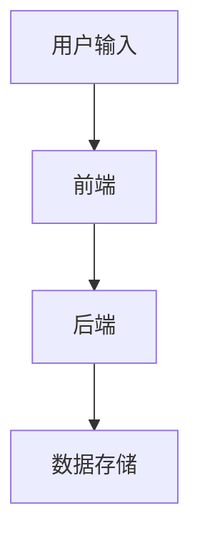
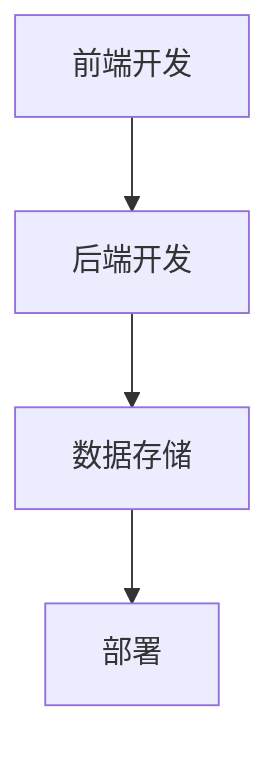

                 


# 文章标题
《AI驱动的提示词自动生成技术》

> 关键词：AI, 提示词生成，自然语言处理，机器学习，深度学习，提示词自动生成算法

> 摘要：本文深入探讨了AI驱动的提示词自动生成技术，包括其发展历程、基础理论、常见算法及其在实践中的应用。通过详细分析，展示了这一技术如何通过自然语言处理和机器学习算法，实现高效的提示词生成，并对未来发展趋势进行了展望。

## 引言与背景

### 1.1 AI驱动的提示词自动生成技术概述

提示词自动生成技术是一种利用人工智能（AI）方法，根据特定场景和需求自动生成合适提示词的技术。这些提示词可以应用于各种场景，如电商产品描述、新闻标题、对话系统等。随着自然语言处理（NLP）和机器学习技术的不断发展，AI驱动的提示词自动生成技术已经逐渐成为人工智能领域的重要研究方向。

在电商领域，自动生成的产品描述可以帮助商家提高销售转化率，减少人力成本。在新闻领域，自动生成的标题可以提升新闻的吸引力和阅读量。在对话系统领域，自动生成的提示词可以提升用户的交互体验。总之，提示词自动生成技术在提高信息处理效率和用户体验方面具有广泛的应用前景。

### 1.2 AI驱动的提示词自动生成技术的发展历程

AI驱动的提示词自动生成技术的发展历程可以分为几个阶段：

1. **早期基于规则的方法**：这一阶段的方法主要依赖于人工定义的规则，例如使用模板匹配和关键词提取等技术生成提示词。

2. **基于统计的方法**：随着自然语言处理技术的发展，基于统计的方法开始应用于提示词生成。这些方法利用统计模型来分析语言数据，生成提示词。

3. **基于机器学习的方法**：近年来，机器学习算法在提示词生成中的应用越来越广泛。基于机器学习的方法可以从大量数据中自动学习生成提示词的规则。

4. **基于深度学习的方法**：深度学习算法，如卷积神经网络（CNN）、循环神经网络（RNN）和生成对抗网络（GAN），在提示词生成中展现出强大的能力。

### 1.3 提示词自动生成技术在各行业的应用

提示词自动生成技术在各行业的应用场景如下：

- **电商产品描述自动生成**：利用自然语言处理和机器学习技术，根据产品属性和用户评价自动生成产品的描述，提高销售转化率。

- **新闻标题自动生成**：根据新闻内容自动生成吸引人的标题，提升新闻的阅读量。

- **对话系统中的提示词自动生成**：根据对话历史和用户输入自动生成合适的提示词，提升用户交互体验。

### 1.4 书籍结构安排与阅读指南

本书将分为以下几个部分：

- **第一部分：引言与背景**：介绍AI驱动的提示词自动生成技术的概念、发展历程和在各行业的应用。

- **第二部分：基础理论与技术**：详细讲解提示词自动生成的基础知识、自然语言处理与机器学习基础，以及常见的提示词自动生成算法。

- **第三部分：实践与应用**：通过实际案例研究，展示提示词自动生成技术在电商产品描述、新闻标题和对话系统中的应用。

- **第四部分：未来趋势**：探讨提示词自动生成技术的发展方向，以及其对人工智能领域和社会产业的影响。

读者可以根据自己的需求和兴趣选择阅读相应部分的内容。希望本书能帮助读者深入了解AI驱动的提示词自动生成技术，并在实际应用中发挥其价值。

## 基础理论与技术

### 2.1 提示词的定义与类型

提示词（Prompt）是指在特定场景下，为引导用户或系统进行下一步操作或提供特定信息而设置的词语或句子。根据用途和场景的不同，提示词可以分为以下几种类型：

- **引导性提示词**：用于引导用户完成特定任务的提示词，如“请输入您的姓名”。
- **描述性提示词**：用于描述特定信息或场景的提示词，如“这是一个有趣的新闻标题”。
- **提问性提示词**：用于引导用户回答问题的提示词，如“你对这个产品有什么疑问？”。

### 2.2 人工生成提示词的挑战

人工生成提示词存在以下挑战：

- **效率低**：人工生成提示词需要大量时间和精力，难以高效地满足大量需求。
- **一致性差**：人工生成的提示词可能存在不一致性，影响用户体验。
- **成本高**：人工生成提示词需要大量人力资源，成本较高。

### 2.3 自动生成提示词的优势

自动生成提示词具有以下优势：

- **高效**：自动生成提示词可以在短时间内生成大量高质量的提示词。
- **一致性**：自动生成提示词可以保证生成提示词的一致性，提高用户体验。
- **低成本**：自动生成提示词可以减少人力资源成本，降低成本。

## 自然语言处理与机器学习基础

### 3.1 自然语言处理的基本概念

自然语言处理（NLP）是计算机科学领域与人工智能领域的一个重要方向。它主要研究如何让计算机能够理解、生成和处理人类语言。NLP涉及到的任务包括文本分类、命名实体识别、机器翻译、情感分析等。

- **文本分类**：将文本数据分为预定义的类别。
- **命名实体识别**：识别文本中的命名实体，如人名、地名、组织名等。
- **机器翻译**：将一种语言的文本翻译成另一种语言。
- **情感分析**：分析文本中的情感倾向，如正面、负面或中性。

### 3.2 机器学习的基本算法

机器学习（ML）是人工智能（AI）的一个重要分支。它通过算法让计算机从数据中学习，从而进行预测或决策。机器学习的主要算法包括监督学习、无监督学习和强化学习。

- **监督学习**：利用标注数据训练模型，用于预测新数据的标签。
- **无监督学习**：没有预定义的标签，通过数据自身的特征进行学习。
- **强化学习**：通过与环境的交互学习最优策略。

### 3.3 机器学习在提示词生成中的应用

机器学习在提示词生成中的应用主要依赖于其强大的预测和生成能力。例如，可以使用监督学习算法来训练模型，从已有的提示词数据中学习生成新提示词的规则。以下是一个简化的伪代码示例：

```python
# 假设我们有训练集 data，每个样本是一个 (提示词，上下文) 对
for epoch in range(num_epochs):
    for prompt, context in data:
        # 训练模型
        model.train(prompt, context)
    # 在验证集上评估模型
    accuracy = model.evaluate(validation_data)
    print(f"Epoch {epoch}: Accuracy = {accuracy}")
```

### 3.4 常见的提示词自动生成算法

常见的提示词自动生成算法可以分为以下几类：

- **基于规则的方法**：使用人工定义的规则来生成提示词。
- **基于统计的方法**：使用统计模型来分析语言数据，生成提示词。
- **基于机器学习的方法**：使用机器学习算法从数据中学习生成提示词的规则。
- **基于深度学习的方法**：使用深度学习算法，如卷积神经网络（CNN）、循环神经网络（RNN）和生成对抗网络（GAN）来生成提示词。

### 3.5 基于深度学习的提示词生成

基于深度学习的提示词生成方法在近年来得到了广泛应用。以下是一些常见的深度学习模型及其在提示词生成中的应用：

- **卷积神经网络（CNN）**：CNN 在图像处理领域取得了显著成果，但其也适用于文本数据。通过卷积操作，CNN 可以提取文本中的局部特征，用于生成提示词。

- **循环神经网络（RNN）**：RNN 具有处理序列数据的优势，可以捕获文本中的时间依赖关系。通过 RNN，可以生成与上下文相关的提示词。

- **注意力机制（Attention Mechanism）**：注意力机制可以增强模型对重要信息的关注，提高提示词生成的质量。

- **生成对抗网络（GAN）**：GAN 由生成器和判别器组成，可以生成高质量的文本数据。通过 GAN，可以生成丰富多样、符合上下文的提示词。

以下是一个基于 RNN 和注意力机制的提示词生成算法的简化伪代码：

```python
# 假设我们有输入序列 x
hidden_state = initialize_hidden_state()
for word in x:
    # 使用 RNN 和注意力机制生成提示词
    output, hidden_state = model.generate(word, hidden_state)
    # 更新隐藏状态
    hidden_state = update_hidden_state(hidden_state)

# 输出最终的提示词
prompt = model.generate_output(hidden_state)
```

## 基于深度学习的提示词生成

随着深度学习技术的不断发展，基于深度学习的提示词生成方法逐渐成为研究热点。本文将详细介绍几种常用的深度学习模型在提示词生成中的应用，包括卷积神经网络（CNN）、循环神经网络（RNN）、注意力机制（Attention Mechanism）和生成对抗网络（GAN）。

### 5.1 卷积神经网络在提示词生成中的应用

卷积神经网络（CNN）在图像处理领域取得了显著的成果。然而，CNN 的优势不仅限于图像处理，其在文本数据中也有广泛的应用。通过卷积操作，CNN 可以提取文本中的局部特征，从而生成与上下文相关的提示词。

在提示词生成中，CNN 通常用于提取输入文本的局部特征。具体来说，可以将文本表示为一个序列的单词，然后使用 CNN 对每个单词进行卷积操作，以提取单词的局部特征。以下是一个简化的伪代码示例：

```python
# 假设我们有输入文本 x，并已将其转换为词向量表示
for filter_size in filter_sizes:
    # 使用 CNN 提取文本的局部特征
    features = cnn.extract_features(x, filter_size)
    # 使用池化操作对特征进行降维
    pooled_features = pooling(features)
    # 输出最终的提示词
    prompt = generate_prompt(pooled_features)
```

### 5.2 循环神经网络在提示词生成中的应用

循环神经网络（RNN）是一种专门用于处理序列数据的神经网络。RNN 具有处理序列数据的优势，可以捕获文本中的时间依赖关系。通过 RNN，可以生成与上下文相关的提示词。

在提示词生成中，RNN 通常用于建模输入文本的序列信息。具体来说，可以将 RNN 视为一个黑盒模型，输入文本序列，然后输出对应的提示词。以下是一个简化的伪代码示例：

```python
# 假设我们有输入文本 x
hidden_state = initialize_hidden_state()
for word in x:
    # 使用 RNN 生成提示词
    output, hidden_state = rnn.generate(word, hidden_state)
    # 输出最终的提示词
    prompt = output[-1]
```

### 5.3 注意力机制在提示词生成中的应用

注意力机制（Attention Mechanism）是一种用于提高神经网络模型对重要信息关注度的方法。在提示词生成中，注意力机制可以帮助模型更好地理解输入文本的上下文信息，从而生成更高质量的提示词。

在基于注意力机制的提示词生成模型中，模型会为每个输入词分配一个注意力权重，表示其对生成提示词的重要性。通过加权求和，模型可以更好地关注关键信息，从而提高提示词的质量。以下是一个简化的伪代码示例：

```python
# 假设我们有输入文本 x 和对应的注意力权重 weights
hidden_state = initialize_hidden_state()
for word in x:
    # 使用注意力权重生成提示词
    output, hidden_state = attention_model.generate(word, hidden_state, weights)
    # 输出最终的提示词
    prompt = output[-1]
```

### 5.4 生成对抗网络在提示词生成中的应用

生成对抗网络（GAN）是一种由生成器和判别器组成的神经网络模型。生成器试图生成与真实数据相似的样本，而判别器则试图区分真实数据和生成数据。通过这种对抗训练，GAN 可以生成高质量的数据。

在提示词生成中，GAN 可以用于生成与真实提示词相似的样本。具体来说，生成器会生成提示词，而判别器会判断生成提示词的质量。通过这种对抗训练，生成器可以不断提高生成提示词的质量。以下是一个简化的伪代码示例：

```python
# 假设我们有真实的提示词数据作为输入
for epoch in range(num_epochs):
    # 训练生成器和判别器
    generator.train()
    discriminator.train()
    # 在验证集上评估模型
    accuracy = generator.evaluate(validation_data)
    print(f"Epoch {epoch}: Accuracy = {accuracy}")
```

### 5.5 基于深度学习的提示词生成算法总结

基于深度学习的提示词生成算法具有以下优点：

- **强大的表达能力**：深度学习模型可以学习到输入文本的复杂结构和上下文信息。
- **灵活的可扩展性**：可以通过调整模型结构和参数，适应不同的提示词生成任务。
- **高效的性能**：深度学习模型可以在短时间内生成大量高质量的提示词。

然而，深度学习模型也存在一些挑战，如对大规模训练数据的需求、模型的复杂性和解释性等。未来，研究人员将继续探索如何提高深度学习模型在提示词生成中的性能和可解释性。

## 提示词自动生成系统的设计

### 6.1 系统需求分析

在设计提示词自动生成系统时，首先需要进行系统需求分析。系统需求分析的主要目标是明确系统的功能需求、性能需求和用户体验需求。

- **功能需求**：系统需要能够接收用户输入，根据输入生成提示词，并将结果展示给用户。
- **性能需求**：系统需要能够在合理的时间内生成高质量的提示词，以满足实时性需求。
- **用户体验需求**：系统需要提供友好的用户界面，易于使用和操作。

### 6.2 系统架构设计

提示词自动生成系统的架构设计可以分为以下几个部分：

- **前端**：前端负责与用户进行交互，接收用户输入，并展示生成的提示词。
- **后端**：后端负责处理用户输入，调用提示词生成算法生成提示词，并将结果返回给前端。
- **数据存储**：数据存储用于存储用户输入、生成的提示词以及其他相关信息。

以下是一个简化的系统架构设计图：



### 6.3 系统实现与部署

提示词自动生成系统的实现与部署可以分为以下几个步骤：

1. **前端开发**：使用前端框架（如 React、Vue.js 等）开发用户界面，实现与用户的交互。
2. **后端开发**：使用后端框架（如 Flask、Django 等）实现后端逻辑，包括提示词生成算法的调用和数据存储等。
3. **数据存储**：选择合适的数据存储方案（如关系型数据库、NoSQL 数据库等），存储用户输入和生成的提示词。
4. **部署**：将前端、后端和数据存储部署到服务器上，确保系统的稳定运行。

以下是一个简化的系统实现与部署流程图：



## 实际案例研究

### 7.1 案例一：电商产品描述自动生成

在电商领域，自动生成产品描述是一种常见的应用场景。以下是一个电商产品描述自动生成的实际案例：

1. **数据准备**：收集大量商品数据，包括商品名称、属性、描述等。
2. **模型训练**：使用自然语言处理和机器学习技术，从商品数据中学习生成产品描述的规则。
3. **应用**：在商品详情页，根据用户浏览的商品，自动生成吸引人的产品描述。

以下是一个简化的伪代码示例：

```python
# 假设我们有商品数据 data
for product in data:
    # 提取商品属性和描述
    attributes = extract_attributes(product)
    description = extract_description(product)
    # 生成产品描述
    generated_description = generate_description(attributes, description)
    # 展示生成的产品描述
    display_generated_description(generated_description)
```

### 7.2 案例二：新闻标题自动生成

在新闻领域，自动生成标题是一种提高新闻吸引力和阅读量的有效手段。以下是一个新闻标题自动生成的实际案例：

1. **数据准备**：收集大量新闻数据，包括标题、内容、标签等。
2. **模型训练**：使用自然语言处理和机器学习技术，从新闻数据中学习生成标题的规则。
3. **应用**：在新闻发布平台，根据新闻内容自动生成吸引人的标题。

以下是一个简化的伪代码示例：

```python
# 假设我们有新闻数据 data
for news in data:
    # 提取新闻内容和标签
    content = extract_content(news)
    tags = extract_tags(news)
    # 生成新闻标题
    generated_title = generate_title(content, tags)
    # 展示生成的新闻标题
    display_generated_title(generated_title)
```

### 7.3 案例三：对话系统中的提示词自动生成

在对话系统中，自动生成提示词是一种提高用户交互体验的有效手段。以下是一个对话系统中的提示词自动生成的实际案例：

1. **数据准备**：收集大量对话数据，包括用户输入、系统回复、上下文等。
2. **模型训练**：使用自然语言处理和机器学习技术，从对话数据中学习生成提示词的规则。
3. **应用**：在对话过程中，根据用户输入和上下文自动生成合适的提示词。

以下是一个简化的伪代码示例：

```python
# 假设我们有对话数据 data
for conversation in data:
    # 提取用户输入和上下文
    user_input = extract_user_input(conversation)
    context = extract_context(conversation)
    # 生成提示词
    generated_prompt = generate_prompt(user_input, context)
    # 回复用户
    reply_user(generated_prompt)
```

### 7.4 案例总结

通过上述实际案例研究，我们可以看到AI驱动的提示词自动生成技术在电商产品描述、新闻标题和对话系统中的广泛应用。这些案例展示了提示词自动生成技术在实际应用中的价值，以及如何通过数据准备、模型训练和应用等步骤实现高效的提示词生成。

## AI驱动的提示词自动生成的未来趋势

随着人工智能技术的不断发展，AI驱动的提示词自动生成技术也在不断演进。未来，这一技术有望在以下几个方面取得重要进展：

### 8.1 提示词自动生成技术的发展方向

1. **更强大的模型**：未来的提示词自动生成技术将依赖于更强大的深度学习模型，如 transformers、变分自编码器（VAEs）等，以提高生成提示词的质量和多样性。
2. **多模态融合**：将文本、图像、语音等多种数据源进行融合，以生成更具创意性和吸引力的提示词。
3. **个性化的提示词生成**：基于用户历史行为和偏好，生成个性化的提示词，提高用户体验。

### 8.2 提示词自动生成技术在人工智能领域的融合应用

1. **对话系统**：结合自然语言生成（NLG）技术，实现更自然、流畅的对话系统。
2. **内容生成**：与生成对抗网络（GAN）结合，生成高质量、创意性的内容，如文章、视频等。
3. **推荐系统**：结合提示词生成技术，提高推荐系统的推荐质量，提升用户体验。

### 8.3 提示词自动生成技术对社会与产业的影响

1. **提高效率**：通过自动生成提示词，可以减少人力成本，提高生产效率。
2. **个性化服务**：基于个性化的提示词生成，提供更贴心的服务，提升用户满意度。
3. **文化产业**：AI驱动的提示词自动生成技术将在文化产业中发挥重要作用，如自动生成小说、剧本等。

总之，AI驱动的提示词自动生成技术在人工智能领域和社会产业中具有广泛的应用前景和潜力。

## 附录A: 工具与资源介绍

### A.1 常用自然语言处理工具

在自然语言处理领域，以下是一些常用的工具和库：

- **NLTK**：Python 自然语言处理库，提供丰富的文本处理功能。
- **spaCy**：高效的 NLP 库，支持多种语言。
- **BERT**：Google 开发的预训练语言模型，广泛应用于文本分类、问答系统等任务。
- **Transformers**：由 Hugging Face 开发的 NLP 库，支持多种预训练模型和任务。

### A.2 常用机器学习框架

在机器学习领域，以下是一些常用的框架和库：

- **TensorFlow**：Google 开发的开源机器学习框架，支持多种深度学习模型和任务。
- **PyTorch**：Facebook 开发的开源机器学习框架，具有灵活的动态计算图。
- **Scikit-learn**：Python 的机器学习库，提供丰富的监督学习和无监督学习算法。

### A.3 提示词自动生成开源项目

以下是一些开源项目，可用于实现提示词自动生成：

- **GPT-2**：OpenAI 开发的预训练语言模型，支持生成高质量的文本。
- **T5**：Google 开发的预训练语言模型，支持多种自然语言处理任务。
- **TitleBert**：基于 BERT 的新闻标题生成模型。
- **CopyTalk**：基于 GPT-2 的对话系统生成模型。

## 附录B: 代码示例

### B.1 基于规则的方法示例代码

以下是一个基于规则的方法生成提示词的示例代码：

```python
# 基于规则的提示词生成
def generate_prompt_by_rules(input_text):
    rules = {
        'hello': '你好！',
        'how are you': '你好啊，最近怎么样？',
        'weather': '今天的天气真好，你有出去吗？',
    }
    for key, value in rules.items():
        if key in input_text:
            return value
    return "抱歉，我听不懂你的话。"

# 测试代码
input_text = "你好，请问今天的天气怎么样？"
prompt = generate_prompt_by_rules(input_text)
print(prompt)
```

### B.2 基于机器学习的方法示例代码

以下是一个基于机器学习的方法生成提示词的示例代码：

```python
# 基于机器学习的提示词生成
from sklearn.feature_extraction.text import TfidfVectorizer
from sklearn.naive_bayes import MultinomialNB

# 假设我们有训练数据
X_train = ['你好', '你好，请问有什么需要帮助的？', '你好，欢迎来到我们的网站。']
y_train = ['问候', '提问', '介绍']

# 创建向量器
vectorizer = TfidfVectorizer()

# 创建分类器
classifier = MultinomialNB()

# 转换文本为向量
X_train_vectorized = vectorizer.fit_transform(X_train)

# 训练模型
classifier.fit(X_train_vectorized, y_train)

# 测试代码
input_text = '你好，请问能帮我查一下邮箱吗？'
input_vectorized = vectorizer.transform([input_text])
predicted_label = classifier.predict(input_vectorized)[0]
print(predicted_label)
```

### B.3 基于深度学习的方法示例代码

以下是一个基于深度学习的方法生成提示词的示例代码：

```python
# 基于深度学习的提示词生成
import torch
from transformers import GPT2LMHeadModel, GPT2Tokenizer

# 加载预训练模型
tokenizer = GPT2Tokenizer.from_pretrained('gpt2')
model = GPT2LMHeadModel.from_pretrained('gpt2')

# 设备配置
device = torch.device('cuda' if torch.cuda.is_available() else 'cpu')
model.to(device)

# 测试代码
input_text = '你好'
input_ids = tokenizer.encode(input_text, return_tensors='pt').to(device)
output_ids = model.generate(input_ids, max_length=50, num_return_sequences=1).to('cpu')
generated_text = tokenizer.decode(output_ids[0], skip_special_tokens=True)
print(generated_text)
```

通过这些示例代码，我们可以看到基于规则、机器学习和深度学习的方法在提示词生成中的应用。读者可以根据自己的需求选择合适的方法进行实践。

