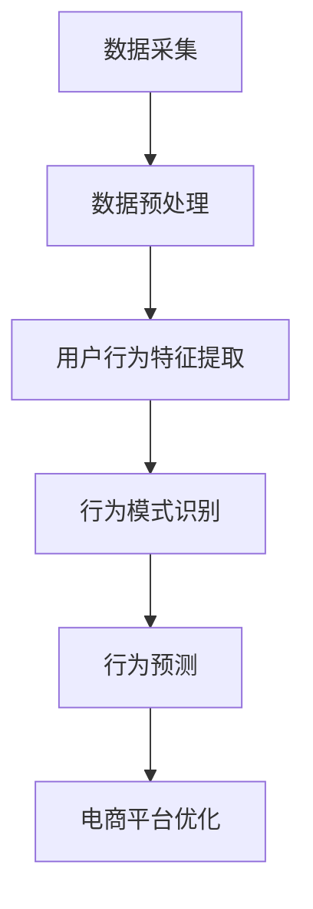

                 

### 文章标题

《AI驱动的用户行为分析：电商平台优化的基础》

### 关键词

- 人工智能
- 用户行为分析
- 电商平台
- 优化
- 深度学习

### 摘要

本文旨在探讨如何利用人工智能技术，特别是机器学习和深度学习，对电商平台上的用户行为进行高效分析，从而为电商平台提供数据驱动的优化策略。文章首先介绍了用户行为分析的基本概念及其在电商平台中的应用价值，然后深入讲解了AI驱动的用户行为分析技术，包括用户行为数据采集、预处理、分析算法以及构建用户行为模型的方法。接着，文章通过实际案例展示了用户行为分析在电商平台优化中的具体应用，并探讨了面临的挑战及应对策略。最后，文章展望了未来AI驱动的用户行为分析的发展趋势，为电商平台提供新的优化方向。通过本文，读者将了解到如何通过AI技术提升电商平台的用户体验和运营效率。

## 《AI驱动的用户行为分析：电商平台优化的基础》

### 第一部分：引论

#### 1.1 书籍概述

《AI驱动的用户行为分析：电商平台优化的基础》是一本专注于人工智能在电商领域应用的书籍。书中详细介绍了用户行为分析的基本概念、方法和应用场景，探讨了如何利用机器学习和深度学习技术对用户行为进行高效分析，为电商平台提供优化策略。

本书的核心概念包括用户行为分析的定义、重要性以及AI技术在该领域中的应用前景。用户行为分析是指通过数据收集和分析技术，了解用户在电商平台上的行为模式，如浏览、搜索、购买等。其重要性在于能够帮助电商平台更好地理解用户需求，提高用户满意度和忠诚度，从而提升业务绩效。

AI技术在用户行为分析中的应用前景广阔。随着大数据和云计算技术的发展，电商平台积累了大量用户行为数据。通过机器学习和深度学习算法，可以对这些数据进行挖掘和分析，提取有价值的信息，为电商平台提供决策支持。

#### 1.2 AI在电商领域的应用前景

AI技术在电商领域的应用前景十分广阔。首先，AI可以帮助电商平台实现个性化推荐。通过对用户历史行为数据的分析，AI算法可以推荐用户可能感兴趣的商品，提高用户购买转化率。其次，AI可以优化搜索结果。通过分析用户搜索行为和关键词，AI算法可以调整搜索排序，提供更符合用户需求的搜索结果。

此外，AI还可以在购物车优化、用户流失预测、广告投放优化等方面发挥作用。例如，通过分析购物车中的商品组合，AI算法可以推荐用户可能需要的配套商品，提高购物车转化率。用户流失预测可以帮助电商平台及时发现潜在流失用户，采取挽回措施。广告投放优化则可以根据用户行为数据，调整广告投放策略，提高广告效果。

总的来说，AI驱动的用户行为分析为电商平台提供了强大的数据分析能力，有助于提升用户体验和运营效率。未来，随着AI技术的不断发展，电商平台将更加依赖于数据驱动的决策，从而在激烈的市场竞争中脱颖而出。

### 1.3 用户行为分析的基本概念

用户行为分析是指通过数据收集和分析技术，了解用户在电商平台上的行为模式，如浏览、搜索、购买等。其目的是从海量数据中提取有价值的信息，为电商平台提供决策支持。

用户行为分析的基本概念包括以下几个方面：

1. **用户行为数据**：用户行为数据是指用户在电商平台上的各种行为记录，如浏览记录、搜索记录、购买记录、评论记录等。这些数据是进行用户行为分析的基础。

2. **数据类型**：用户行为数据类型包括结构化数据（如用户基本信息、交易数据等）和非结构化数据（如图像、文本等）。结构化数据通常以表格形式存储，便于分析和处理；非结构化数据则需要通过自然语言处理、图像识别等技术进行解析和提取有用信息。

3. **用户行为特征**：用户行为特征是指从用户行为数据中提取出来的能够反映用户行为特点的指标，如浏览时长、浏览深度、购买频率、购买金额等。这些特征可以用于构建用户画像，帮助电商平台了解用户需求和偏好。

4. **行为模式**：用户行为模式是指用户在特定情境下表现出的稳定的行为规律。通过对用户行为模式的分析，电商平台可以预测用户未来的行为，从而制定有针对性的营销策略。

5. **用户画像**：用户画像是指通过用户行为数据和其他相关信息，构建出用户的基本特征、需求和偏好等信息。用户画像是进行用户行为分析的重要工具，有助于电商平台实现个性化推荐和精准营销。

6. **用户流失**：用户流失是指用户在电商平台上的活跃度下降，最终离开平台的现象。用户流失分析旨在识别潜在流失用户，采取挽回措施，降低用户流失率。

7. **行为预测**：行为预测是指通过分析用户历史行为数据，预测用户未来可能采取的行为。行为预测可以帮助电商平台提前了解用户需求，优化产品和服务。

#### 1.4 用户行为分析的重要性

用户行为分析在电商平台中具有至关重要的意义。首先，用户行为分析有助于电商平台更好地理解用户需求，提高用户体验。通过分析用户在平台上的浏览、搜索、购买等行为，电商平台可以了解用户的兴趣和偏好，从而提供更加个性化的推荐和服务，提升用户满意度和忠诚度。

其次，用户行为分析可以优化电商平台的产品和运营策略。通过对用户行为的深入分析，电商平台可以发现用户痛点和需求，从而改进产品设计和功能，提升用户转化率和留存率。同时，用户行为分析还可以帮助电商平台优化广告投放、搜索排序、购物车设计等运营策略，提高整体运营效率。

此外，用户行为分析还可以为电商平台提供数据驱动的决策支持。通过对用户行为的全面分析和预测，电商平台可以制定更加科学和有效的营销策略，实现精细化运营。例如，通过分析用户流失数据，电商平台可以识别潜在流失用户，提前采取挽回措施；通过分析用户购买行为，电商平台可以预测市场需求，调整库存策略。

总之，用户行为分析是电商平台优化和提升运营效果的重要手段。通过深入分析用户行为，电商平台不仅可以更好地满足用户需求，提高用户体验，还可以优化产品和服务，实现数据驱动的运营决策，从而在激烈的市场竞争中脱颖而出。

#### 1.5 用户行为分析的基本方法

用户行为分析的基本方法主要包括数据采集、数据预处理、用户行为特征提取、行为模式识别和行为预测等几个方面。下面将逐一介绍这些方法。

1. **数据采集**：数据采集是用户行为分析的第一步，主要包括以下几种方法：

   - **日志文件**：电商平台通常会记录用户在平台上的各种操作日志，如浏览、搜索、购买等。这些日志文件包含丰富的用户行为数据，是进行用户行为分析的重要数据来源。
   - **API接口**：通过电商平台提供的API接口，可以获取用户在平台上的各种操作数据。例如，电商平台的商品信息、用户评论、交易记录等。
   - **用户调查**：通过在线调查、问卷调查等方式，可以收集用户的直接反馈，了解用户的需求和偏好。这些数据对于补充和验证其他数据源具有重要意义。

2. **数据预处理**：数据预处理是用户行为分析的重要环节，主要包括数据清洗、数据整合和数据转换等步骤：

   - **数据清洗**：数据清洗是指对原始数据进行清理和修复，去除重复、错误和缺失的数据。通过数据清洗，可以确保数据的质量和准确性。
   - **数据整合**：数据整合是指将来自不同数据源的数据进行合并，形成一个统一的数据集。这有助于分析用户在不同平台、不同时间的行为变化。
   - **数据转换**：数据转换是指将原始数据转换为适合分析的数据格式，如将文本数据转换为数字表示，将日期时间数据转换为标准格式等。

3. **用户行为特征提取**：用户行为特征提取是指从用户行为数据中提取能够反映用户行为特点的指标。这些特征包括：

   - **浏览特征**：如浏览时长、浏览深度、页面停留时间等。
   - **搜索特征**：如搜索频率、搜索关键词、搜索结果点击率等。
   - **购买特征**：如购买频率、购买金额、购买品类、购买时段等。
   - **互动特征**：如评论数、点赞数、分享数等。

4. **行为模式识别**：行为模式识别是指通过分析用户行为数据，识别出用户在不同情境下的行为规律。行为模式识别的方法包括：

   - **聚类分析**：通过将用户行为数据进行聚类，识别出具有相似行为模式的用户群体。
   - **关联规则挖掘**：通过分析用户行为数据中的关联关系，发现用户在不同行为之间的规律。
   - **时间序列分析**：通过分析用户行为的时间序列数据，识别出用户行为的时间规律。

5. **行为预测**：行为预测是指通过分析用户历史行为数据，预测用户未来可能采取的行为。行为预测的方法包括：

   - **回归分析**：通过建立用户行为和目标行为之间的回归模型，预测用户未来的行为。
   - **分类分析**：通过建立用户行为分类模型，预测用户未来可能采取的行为类别。
   - **序列模型**：通过分析用户行为的时间序列数据，预测用户未来的行为序列。

通过上述方法，用户行为分析可以全面、深入地了解用户行为，为电商平台提供数据驱动的优化策略。以下是一个用户行为分析的核心概念之间的关系架构 Mermaid 流程图：



通过这个流程图，我们可以清晰地看到用户行为分析的核心环节，以及它们之间的逻辑关系。接下来，我们将进一步探讨AI驱动的用户行为分析技术，为电商平台提供更精准的优化方案。

### 第二部分：AI驱动的用户行为分析技术

#### 2.1 人工智能基础

人工智能（AI）是一门研究、开发和应用使计算机模拟人类智能行为的技术的科学。它涵盖了多个领域，包括机器学习、深度学习、自然语言处理、计算机视觉等。在用户行为分析中，AI技术发挥了至关重要的作用，能够帮助电商平台从海量数据中提取有价值的信息，实现数据驱动的优化。

##### 2.1.1 人工智能概述

人工智能起源于20世纪50年代，随着计算机技术的发展，AI技术逐渐成熟。目前，人工智能已经广泛应用于各个领域，如医疗、金融、教育、交通等。在电商领域，人工智能技术主要应用于用户行为分析、个性化推荐、智能搜索、广告投放优化等方面。

人工智能的主要目标是通过模拟人类智能行为，使计算机具备自主学习、推理和决策能力。在用户行为分析中，人工智能技术可以自动处理海量数据，识别用户行为模式，预测用户未来行为，从而为电商平台提供优化策略。

##### 2.1.2 机器学习基础

机器学习是人工智能的一个重要分支，它通过构建模型，使计算机能够从数据中学习并做出预测。机器学习的基本原理是利用训练数据集，通过优化算法，使模型能够准确预测新的数据。在用户行为分析中，机器学习技术主要用于以下两个方面：

1. **特征提取**：通过从用户行为数据中提取特征，构建用户画像。这些特征包括用户的基本信息、历史行为数据、浏览记录、搜索记录等。
2. **行为预测**：利用机器学习算法，预测用户未来可能采取的行为。例如，通过分析用户的历史购买记录和浏览记录，预测用户可能感兴趣的品类或商品。

常见的机器学习算法包括：

- **线性回归**：用于预测连续值目标，如用户购买金额。
- **逻辑回归**：用于预测二分类目标，如用户是否购买。
- **决策树**：用于分类和回归任务，具有直观的决策流程。
- **支持向量机（SVM）**：用于分类任务，通过寻找最佳决策边界进行分类。
- **随机森林**：通过构建多个决策树，结合投票方式进行预测，具有较好的泛化能力。
- **神经网络**：用于复杂函数建模，通过多层神经网络结构进行非线性预测。

##### 2.1.3 深度学习基础

深度学习是机器学习的一个重要分支，它通过构建多层神经网络，实现数据的深度特征提取。深度学习在用户行为分析中具有显著优势，能够从海量数据中提取更加复杂的特征，提高预测精度。

深度学习的基本原理是利用大量数据训练神经网络，使其能够自动提取特征并做出预测。深度学习的核心组件包括：

1. **神经网络**：神经网络由多个层级组成，包括输入层、隐藏层和输出层。通过前向传播和反向传播算法，神经网络能够不断调整权重，优化模型性能。
2. **激活函数**：激活函数用于引入非线性特性，使神经网络能够建模复杂函数。常见的激活函数包括 sigmoid、ReLU、Tanh 等。
3. **优化算法**：优化算法用于调整神经网络权重，使模型能够拟合训练数据。常见的优化算法包括梯度下降、随机梯度下降、Adam 等。

在用户行为分析中，深度学习技术可以应用于以下场景：

1. **图像识别**：通过对用户浏览记录中的商品图像进行识别，提取商品特征。
2. **自然语言处理**：通过对用户评论、搜索关键词进行文本分析，提取用户情感和需求。
3. **序列建模**：通过对用户行为序列进行建模，预测用户未来的行为。

常见的深度学习框架包括 TensorFlow、PyTorch、Keras 等，这些框架提供了丰富的神经网络构建和训练工具，方便开发者实现深度学习应用。

#### 2.2 用户行为数据采集与预处理

在AI驱动的用户行为分析中，数据采集和预处理是至关重要的环节。数据的质量直接影响分析结果的准确性，因此需要确保数据的有效性、完整性和一致性。

##### 2.2.1 用户行为数据的类型

用户行为数据可以分为结构化数据和非结构化数据：

1. **结构化数据**：结构化数据通常以表格形式存储，具有明确的字段和格式。例如，用户的基本信息（如用户ID、年龄、性别等）、交易记录（如购买时间、购买金额等）和浏览记录（如浏览页面、浏览时长等）。

2. **非结构化数据**：非结构化数据通常没有固定的格式，包括文本、图像、音频等。例如，用户的评论、搜索关键词、商品图片等。

##### 2.2.2 数据采集方法

数据采集方法主要包括以下几种：

1. **日志文件**：电商平台通常会记录用户在平台上的各种操作日志，如浏览、搜索、购买等。这些日志文件包含丰富的用户行为数据，是进行用户行为分析的重要数据来源。

2. **API接口**：通过电商平台提供的API接口，可以获取用户在平台上的各种操作数据。例如，电商平台的商品信息、用户评论、交易记录等。

3. **用户调查**：通过在线调查、问卷调查等方式，可以收集用户的直接反馈，了解用户的需求和偏好。这些数据对于补充和验证其他数据源具有重要意义。

##### 2.2.3 数据预处理技术

数据预处理是用户行为分析的重要环节，主要包括以下步骤：

1. **数据清洗**：数据清洗是指对原始数据进行清理和修复，去除重复、错误和缺失的数据。通过数据清洗，可以确保数据的质量和准确性。

2. **数据整合**：数据整合是指将来自不同数据源的数据进行合并，形成一个统一的数据集。这有助于分析用户在不同平台、不同时间的行为变化。

3. **数据转换**：数据转换是指将原始数据转换为适合分析的数据格式，如将文本数据转换为数字表示，将日期时间数据转换为标准格式等。

4. **特征工程**：特征工程是指从原始数据中提取对分析任务有用的特征，如用户行为特征（如浏览时长、浏览深度等）、文本特征（如关键词提取、情感分析等）。

5. **归一化和标准化**：归一化和标准化是指将数据转换为相同尺度，以便进行后续分析和建模。常用的方法包括最小-最大缩放、标准缩放等。

#### 2.3 用户行为分析算法

用户行为分析算法是AI驱动的用户行为分析的核心组成部分，它们通过分析和挖掘用户行为数据，提取有价值的信息，为电商平台提供优化策略。以下是几种常用的用户行为分析算法：

##### 2.3.1 协同过滤算法

协同过滤算法是一种基于用户行为数据的推荐算法，通过分析用户之间的相似性，为用户提供个性化推荐。协同过滤算法主要分为以下两类：

1. **基于用户的协同过滤**（User-based Collaborative Filtering，UBCF）：该方法通过计算用户之间的相似性，找到与目标用户相似的其他用户，然后推荐这些用户喜欢的商品。相似性通常通过用户之间的行为相似度计算，如余弦相似度、皮尔逊相关系数等。

2. **基于物品的协同过滤**（Item-based Collaborative Filtering，IBCF）：该方法通过计算商品之间的相似性，找到与目标商品相似的其他商品，然后推荐这些商品。商品相似性可以通过商品特征向量之间的余弦相似度计算。

伪代码示例：

```python
# 基于用户的协同过滤算法
def user_based_collaborative_filter(user, users, ratings, k):
    # 计算用户相似性矩阵
    similarity_matrix = compute_similarity_matrix(users, ratings)
    
    # 找到与目标用户相似的其他用户
    similar_users = find_similar_users(user, similarity_matrix, k)
    
    # 计算相似用户喜欢的商品
    recommended_items = compute_recommended_items(similar_users, ratings)
    
    return recommended_items
```

##### 2.3.2 矩阵分解算法

矩阵分解算法是一种通过低秩矩阵分解，提取用户和商品特征，为用户提供个性化推荐的算法。常见的矩阵分解算法包括：

1. **Singular Value Decomposition（SVD）**：SVD是一种常用的矩阵分解方法，通过将原始评分矩阵分解为用户特征矩阵和商品特征矩阵的乘积，提取用户和商品的特征。

2. **Alternating Least Squares（ALS）**：ALS是一种基于迭代优化的矩阵分解方法，通过交替最小二乘法，同时优化用户特征矩阵和商品特征矩阵。

伪代码示例：

```python
# ALS算法
def alternating_least_squares(ratings, num_users, num_items, num_factors, regularization, learning_rate, num_iterations):
    # 初始化用户特征矩阵和商品特征矩阵
    user_features = initialize_user_features(num_users, num_factors)
    item_features = initialize_item_features(num_items, num_factors)
    
    # 迭代优化用户特征矩阵和商品特征矩阵
    for _ in range(num_iterations):
        # 优化用户特征矩阵
        user_features = update_user_features(ratings, item_features, regularization, learning_rate)
        
        # 优化商品特征矩阵
        item_features = update_item_features(ratings, user_features, regularization, learning_rate)
    
    # 计算推荐结果
    predicted_ratings = predict_ratings(user_features, item_features, ratings)
    
    return predicted_ratings
```

##### 2.3.3 基于模型的推荐算法

基于模型的推荐算法通过构建用户和商品之间的数学模型，预测用户对商品的偏好。常见的基于模型的推荐算法包括：

1. **矩阵分解模型**：矩阵分解模型通过将原始评分矩阵分解为用户特征矩阵和商品特征矩阵的乘积，预测用户对商品的偏好。

2. **潜在因子模型**：潜在因子模型通过引入潜在因子，建立用户和商品之间的隐含关系，预测用户对商品的偏好。

3. **神经协同过滤**：神经协同过滤结合深度学习和协同过滤算法，通过构建多层神经网络，提取用户和商品的特征，预测用户对商品的偏好。

伪代码示例：

```python
# 潜在因子模型
def latent_factor_model(ratings, num_users, num_items, num_factors, learning_rate, num_iterations):
    # 初始化用户特征矩阵和商品特征矩阵
    user_features = initialize_user_features(num_users, num_factors)
    item_features = initialize_item_features(num_items, num_factors)
    
    # 迭代优化用户特征矩阵和商品特征矩阵
    for _ in range(num_iterations):
        # 优化用户特征矩阵
        user_features = update_user_features(ratings, item_features, learning_rate)
        
        # 优化商品特征矩阵
        item_features = update_item_features(ratings, user_features, learning_rate)
    
    # 计算推荐结果
    predicted_ratings = predict_ratings(user_features, item_features, ratings)
    
    return predicted_ratings
```

通过这些算法，用户行为分析能够为电商平台提供精确的个性化推荐，提高用户满意度和转化率。接下来，我们将探讨如何构建用户行为分析模型，进一步优化电商平台的运营效果。

#### 2.4 用户行为分析模型

用户行为分析模型是电商平台上实现个性化推荐和优化运营策略的关键工具。通过构建用户行为分析模型，电商平台可以深入了解用户的行为特征和偏好，从而为用户提供更加精准和个性化的服务。以下是几种常见的用户行为分析模型：

##### 2.4.1 用户画像模型

用户画像模型是一种通过综合用户基本特征和行为数据，构建用户全貌的模型。用户画像模型通常包括以下几个关键组成部分：

1. **基础信息**：包括用户的年龄、性别、地理位置、职业等基本信息。这些信息有助于了解用户的基本属性，为后续分析提供基础。

2. **行为特征**：包括用户的浏览记录、搜索历史、购买记录、评论记录等。通过对这些行为数据的分析，可以挖掘出用户的兴趣偏好和消费习惯。

3. **社交属性**：包括用户的社交网络信息、好友关系、互动行为等。这些信息有助于了解用户的社交圈子和影响力。

4. **交易属性**：包括用户的购买频率、购买金额、购物车行为等。这些信息有助于分析用户的购买行为和消费能力。

构建用户画像模型的关键步骤如下：

1. **数据收集**：通过电商平台的各种数据采集方式，收集用户的基本信息和行为数据。

2. **数据清洗**：对收集到的数据进行清洗和预处理，去除重复、错误和缺失的数据，确保数据的质量和完整性。

3. **特征工程**：从原始数据中提取对分析任务有用的特征，如用户浏览深度、搜索关键词频率、购买频次等。

4. **模型构建**：使用机器学习和深度学习算法，如聚类分析、分类分析等，构建用户画像模型。

用户画像模型的应用场景包括：

- **个性化推荐**：通过分析用户画像，为用户提供个性化的商品推荐和营销活动。
- **用户流失预测**：通过分析用户画像和用户行为数据，预测潜在流失用户，采取挽回措施。
- **广告投放优化**：通过分析用户画像，为广告主提供精准的用户定位和投放策略。

##### 2.4.2 用户行为预测模型

用户行为预测模型是一种通过分析用户历史行为数据，预测用户未来行为和偏好的模型。用户行为预测模型的目的是帮助电商平台提前了解用户需求，优化产品和运营策略。以下是几种常见的用户行为预测模型：

1. **基于历史数据的预测模型**：

   这种模型通过分析用户的历史行为数据，如浏览记录、购买记录等，预测用户未来可能感兴趣的商品或行为。常见的算法包括线性回归、决策树、随机森林等。

   伪代码示例：

   ```python
   # 线性回归模型
   def linear_regression_model(user_data, target_variable):
       # 训练模型
       model = LinearRegression()
       model.fit(user_data, target_variable)
       
       # 预测结果
       predictions = model.predict(user_data)
       
       return predictions
   ```

2. **基于序列模型的预测模型**：

   这种模型通过分析用户行为序列，预测用户未来的行为序列。常见的算法包括循环神经网络（RNN）、长短期记忆网络（LSTM）等。

   伪代码示例：

   ```python
   # LSTM模型
   def lstm_model(user_sequence, num_features):
       # 构建模型
       model = Sequential()
       model.add(LSTM(units=num_features, activation='relu', input_shape=(None, num_features)))
       model.add(Dense(1, activation='sigmoid'))
       
       # 训练模型
       model.compile(optimizer='adam', loss='binary_crossentropy')
       model.fit(user_sequence, epochs=10, batch_size=64)
       
       # 预测结果
       predictions = model.predict(user_sequence)
       
       return predictions
   ```

用户行为预测模型的应用场景包括：

- **个性化推荐**：通过预测用户未来的行为和偏好，为用户提供个性化的商品推荐。
- **用户流失预测**：通过预测用户未来的流失概率，采取挽回措施，降低用户流失率。
- **营销活动优化**：通过预测用户对营销活动的响应，优化营销策略和投放预算。

##### 2.4.3 用户偏好模型

用户偏好模型是一种通过分析用户行为数据和反馈，了解用户偏好和需求，为用户提供定制化服务的模型。用户偏好模型通常包括以下几个步骤：

1. **数据收集**：通过用户调查、行为数据收集等方式，收集用户对商品和服务的偏好信息。

2. **特征提取**：从收集到的数据中提取对分析任务有用的特征，如用户评分、评论、购买记录等。

3. **模型构建**：使用机器学习和深度学习算法，如聚类分析、协同过滤等，构建用户偏好模型。

4. **模型优化**：通过不断调整模型参数和特征，优化模型性能，提高预测准确性。

用户偏好模型的应用场景包括：

- **个性化推荐**：通过分析用户偏好，为用户提供个性化的商品推荐。
- **定制化服务**：根据用户偏好，为用户提供定制化的服务方案。
- **产品优化**：通过分析用户偏好，优化产品设计和服务流程。

通过用户画像模型、用户行为预测模型和用户偏好模型，电商平台可以全面了解用户的行为特征和需求，实现个性化推荐和服务优化。接下来，我们将探讨如何将用户行为分析应用于电商平台优化实践。

#### 2.5 电商平台优化目标

在电商平台上，优化目标主要包括提高用户体验、增加销售额和提升运营效率。通过AI驱动的用户行为分析，可以实现这些优化目标，从而提升电商平台的整体竞争力。

##### 2.5.1 提高用户体验

用户体验是电商平台成功的关键因素之一。通过AI驱动的用户行为分析，可以深入了解用户的需求和偏好，从而为用户提供更加个性化的服务和推荐。以下是一些实现提高用户体验的优化策略：

1. **个性化推荐**：利用用户行为数据和机器学习算法，为用户提供个性化的商品推荐。例如，基于用户的历史浏览记录和购买记录，推荐用户可能感兴趣的商品。

2. **智能搜索**：通过分析用户的搜索行为和关键词，优化搜索结果排序，提供更加精准和符合用户需求的搜索结果。

3. **个性化营销**：根据用户的偏好和行为数据，为用户推送个性化的营销活动，如优惠券、促销信息等。

4. **用户互动**：利用用户行为数据，分析用户的互动行为，如评论、点赞、分享等，为用户提供更加丰富的社交互动功能，提高用户粘性。

##### 2.5.2 增加销售额

销售额是电商平台的直接收益来源，通过AI驱动的用户行为分析，可以采取以下策略提高销售额：

1. **精准营销**：通过对用户行为数据的分析，识别出潜在的高价值用户，为这些用户推送定制化的营销活动，提高转化率。

2. **个性化推荐**：利用协同过滤和矩阵分解算法，为用户提供个性化的商品推荐，提高用户的购买意愿。

3. **购物车优化**：通过分析购物车中的商品组合，为用户提供配套商品推荐，提高购物车转化率。

4. **流失用户挽回**：通过用户行为预测模型，识别潜在流失用户，提前采取挽回措施，降低用户流失率。

##### 2.5.3 提升运营效率

提升运营效率是电商平台长期发展的关键。通过AI驱动的用户行为分析，可以实现以下优化策略：

1. **库存管理**：通过分析用户行为数据，预测商品的销售趋势，优化库存管理，减少库存积压。

2. **供应链优化**：利用用户行为数据，优化供应链管理，提高物流效率，降低运营成本。

3. **客服优化**：通过分析用户反馈和行为数据，优化客服流程，提高客户满意度。

4. **广告投放优化**：通过分析用户行为数据，优化广告投放策略，提高广告效果，降低广告成本。

总之，通过AI驱动的用户行为分析，电商平台可以实现个性化推荐、精准营销、购物车优化、流失用户挽回等优化目标，从而提高用户体验、增加销售额和提升运营效率。接下来，我们将探讨如何具体实现这些优化目标。

#### 2.6 AI驱动的电商平台优化实践

在电商平台的运营中，AI驱动的用户行为分析发挥着至关重要的作用。通过AI技术，电商平台可以深入了解用户的行为特征和需求，从而实现个性化推荐、智能搜索、购物车优化等优化实践。下面我们将探讨这些实践的具体应用。

##### 2.6.1 个性化推荐

个性化推荐是电商平台提升用户体验和销售额的重要手段。通过AI驱动的用户行为分析，电商平台可以基于用户的浏览记录、购买历史、搜索关键词等数据，为用户推荐可能感兴趣的商品。

**实现方法**：

1. **协同过滤算法**：基于用户的协同过滤（User-based Collaborative Filtering）和基于物品的协同过滤（Item-based Collaborative Filtering）是两种常见的个性化推荐算法。通过计算用户之间的相似性或商品之间的相似性，找到与目标用户相似的用户或商品，然后推荐这些用户或商品喜欢的商品。

2. **矩阵分解算法**：矩阵分解算法（如Singular Value Decomposition，SVD）可以将原始评分矩阵分解为用户特征矩阵和商品特征矩阵，从而提取用户和商品的特征，为用户提供个性化推荐。

3. **深度学习算法**：深度学习算法（如神经网络）可以通过多层神经网络结构，提取用户和商品的高层次特征，实现更精准的个性化推荐。

**伪代码示例**：

```python
# 基于协同过滤的个性化推荐算法
def collaborative_filtering推荐(user, users, ratings, k):
    similarity_matrix = compute_similarity_matrix(users, ratings)
    similar_users = find_similar_users(user, similarity_matrix, k)
    recommended_items = compute_recommended_items(similar_users, ratings)
    return recommended_items

# 基于矩阵分解的个性化推荐算法
def matrix_factorization推荐(ratings, num_users, num_items, num_factors):
    user_features = initialize_user_features(num_users, num_factors)
    item_features = initialize_item_features(num_items, num_factors)
    predicted_ratings = alternating_least_squares(ratings, user_features, item_features)
    recommended_items = compute_recommended_items(user, predicted_ratings)
    return recommended_items
```

**案例分析**：

以电商平台A为例，通过应用协同过滤和矩阵分解算法，实现了个性化推荐功能。根据用户的历史行为数据，平台为每个用户生成一个推荐列表，提高了用户的购物体验和满意度。同时，个性化推荐也显著提升了平台的销售额，实现了业务目标。

##### 2.6.2 智能搜索

智能搜索是电商平台优化用户体验的重要环节。通过AI驱动的用户行为分析，电商平台可以优化搜索结果排序，提供更加精准和符合用户需求的搜索结果。

**实现方法**：

1. **关键词分析**：通过分析用户的搜索关键词和搜索行为，了解用户的搜索意图和偏好。

2. **搜索结果排序**：利用机器学习算法，如排序模型（Ranking Models），对搜索结果进行排序。排序模型可以基于用户的点击率、购买率等行为数据，优化搜索结果的排序。

3. **搜索建议**：根据用户的搜索历史和偏好，为用户提供搜索建议，如热门关键词、相关商品等。

**伪代码示例**：

```python
# 搜索结果排序算法
def ranking_model_sorting(search_results, user_data, ranking_model):
    sorted_results = ranking_model.predict(search_results, user_data)
    return sorted(sorted_results, key=lambda x: x['score'], reverse=True)
```

**案例分析**：

以电商平台B为例，通过优化搜索结果排序和提供搜索建议，提高了用户的搜索体验和满意度。智能搜索功能不仅提高了用户在平台上的活跃度，还显著提升了平台的销售额和用户留存率。

##### 2.6.3 购物车优化

购物车优化是电商平台提升销售额的重要手段。通过AI驱动的用户行为分析，电商平台可以优化购物车中的商品组合，提高购物车的转化率。

**实现方法**：

1. **商品推荐**：通过分析用户的购物车数据，为用户提供搭配建议和商品推荐。例如，根据购物车中的商品，推荐相关的配件或相关商品。

2. **促销活动**：根据用户的购物车数据，为用户提供个性化的促销活动。例如，为购买指定商品的用户提供折扣券或优惠码。

3. **购物车提醒**：通过分析用户的购物车行为，为用户提供购物车提醒，如购物车过期提醒、商品库存提醒等。

**伪代码示例**：

```python
# 购物车商品推荐算法
def shopping_cart_recommendation(cart_items, recommendation_model):
    recommended_items = recommendation_model.predict(cart_items)
    return recommended_items
```

**案例分析**：

以电商平台C为例，通过优化购物车中的商品推荐和促销活动，提高了购物车的转化率。购物车优化功能不仅提升了用户的购物体验，还显著提高了平台的销售额和用户满意度。

总之，通过AI驱动的用户行为分析，电商平台可以实现个性化推荐、智能搜索和购物车优化等优化实践。这些实践不仅提高了用户的购物体验和满意度，还显著提升了平台的销售额和运营效率。接下来，我们将探讨用户行为分析在电商平台中的实际应用案例。

#### 2.7 用户行为分析在电商平台的应用案例

在实际运营中，用户行为分析在电商平台中有着广泛的应用，下面我们通过两个具体的案例，详细探讨用户行为分析在实际操作中的应用效果。

##### 案例一：电商平台A的优化实践

电商平台A是一家全球知名的综合性电商平台，通过用户行为分析，实现了显著的业务优化。

**1. 个性化推荐系统的构建**

电商平台A采用了基于协同过滤和矩阵分解的个性化推荐系统。通过对用户的历史浏览记录、购买记录和搜索关键词等数据进行深入分析，平台为每个用户生成了一个个性化的商品推荐列表。推荐系统不仅考虑了用户的兴趣和偏好，还根据商品的流行度和库存情况进行了优化。

**实施步骤**：

- **数据采集**：通过日志文件、API接口和用户调查等多种方式，收集用户的浏览记录、购买记录和搜索关键词等数据。
- **数据预处理**：对收集到的数据进行清洗、整合和转换，提取对分析任务有用的特征。
- **模型构建**：使用协同过滤算法和矩阵分解算法，构建用户画像模型和推荐模型。
- **模型优化**：通过不断调整模型参数和特征，优化模型性能，提高推荐精度。

**效果评估**：

- **用户满意度**：个性化推荐系统显著提升了用户的购物体验和满意度，用户反馈积极。
- **销售额**：个性化推荐系统带来了显著的销售增长，推荐商品的点击率和转化率明显提高。
- **用户留存率**：个性化推荐系统提高了用户的活跃度和留存率，用户在平台上的停留时间显著增加。

**2. 购物车优化策略的制定**

电商平台A还通过用户行为分析，优化了购物车中的商品推荐和促销活动。

**实施步骤**：

- **购物车数据分析**：分析用户的购物车数据，了解用户的购物车行为，如添加商品的时间、商品数量、商品类型等。
- **商品推荐**：根据购物车数据，为用户提供个性化的商品推荐，如相关配件、配套商品等。
- **促销活动**：根据购物车数据，为用户提供定制化的促销活动，如优惠券、折扣券等。

**效果评估**：

- **购物车转化率**：购物车优化策略显著提高了购物车的转化率，用户在购物车中完成购买的比例明显增加。
- **用户满意度**：个性化购物推荐和促销活动提升了用户的购物体验和满意度，用户反馈积极。
- **销售额**：购物车优化策略带来了显著的销售增长，平台的整体销售额显著提高。

##### 案例二：电商平台B的优化实践

电商平台B是一家专注于时尚商品的电商平台，通过用户行为分析，实现了智能搜索和用户流失预测的优化。

**1. 智能搜索系统的优化**

电商平台B通过用户行为分析，优化了搜索结果排序和提供了搜索建议。

**实施步骤**：

- **关键词分析**：通过分析用户的搜索关键词和搜索行为，了解用户的搜索意图和偏好。
- **搜索结果排序**：使用排序模型，对搜索结果进行排序，优化搜索结果的展示顺序。
- **搜索建议**：根据用户的搜索历史和偏好，为用户提供个性化的搜索建议。

**效果评估**：

- **用户满意度**：智能搜索系统提高了用户的搜索体验和满意度，用户对搜索结果的满意度显著提高。
- **搜索转化率**：搜索结果排序和搜索建议功能提高了用户的点击率和转化率，平台的搜索功能变得更加高效。
- **销售额**：智能搜索系统带来了显著的销售增长，搜索页面的销售额明显提高。

**2. 用户流失预测模型的构建**

电商平台B通过用户行为分析，构建了用户流失预测模型，以提前识别潜在流失用户并采取挽回措施。

**实施步骤**：

- **数据收集**：通过日志文件、API接口和用户调查等多种方式，收集用户的浏览记录、购买记录和互动行为等数据。
- **数据预处理**：对收集到的数据进行清洗、整合和转换，提取对分析任务有用的特征。
- **模型构建**：使用分类算法，如逻辑回归、决策树等，构建用户流失预测模型。
- **模型优化**：通过不断调整模型参数和特征，优化模型性能，提高预测准确性。

**效果评估**：

- **用户流失率**：用户流失预测模型有效识别了潜在流失用户，平台采取了有效的挽回措施，用户流失率显著降低。
- **用户满意度**：通过提前识别潜在流失用户并采取挽回措施，提升了用户的满意度和忠诚度。
- **销售额**：用户流失预测模型带来了显著的销售增长，平台通过挽回流失用户，提高了整体销售额。

通过这两个案例，我们可以看到用户行为分析在电商平台中的应用效果。通过个性化的推荐系统、智能搜索和购物车优化等策略，电商平台不仅提升了用户体验和满意度，还实现了显著的销售增长和运营效率提升。这些案例表明，用户行为分析是电商平台优化和提升竞争力的重要手段。

#### 2.8 用户行为分析在电商平台中的挑战与应对策略

尽管用户行为分析在电商平台中具有显著的应用效果，但在实际操作中仍面临着一系列挑战。这些挑战主要包括数据隐私、数据质量、模型解释性等。下面我们将探讨这些挑战，并提出相应的应对策略。

##### 2.8.1 数据隐私

用户行为分析依赖于大量用户数据，而数据隐私问题一直是用户和电商平台关注的焦点。用户担心自己的数据被滥用或泄露，这可能影响用户的信任和平台的安全性。

**挑战**：

- **数据泄露风险**：用户数据可能因为安全措施不足或系统漏洞而被恶意攻击者获取。
- **用户隐私侵犯**：用户数据被用于未经授权的目的，如个性化推荐之外的其他商业用途。

**应对策略**：

- **数据加密**：对用户数据进行加密处理，确保数据在传输和存储过程中的安全性。
- **隐私保护算法**：采用隐私保护算法（如差分隐私），在数据处理过程中减少隐私泄露的风险。
- **透明度与用户同意**：建立用户隐私政策，明确数据收集、使用和共享的目的，并获取用户的明确同意。

##### 2.8.2 数据质量

数据质量是用户行为分析的基础，但实际操作中常常面临数据质量问题。数据质量问题可能导致分析结果的偏差，进而影响平台运营策略的有效性。

**挑战**：

- **数据缺失**：用户行为数据可能因为技术故障、用户操作等原因而出现缺失。
- **数据错误**：用户行为数据可能因为录入错误、系统故障等原因而包含错误信息。
- **数据不一致**：不同数据源的数据格式、编码和度量单位可能不一致，导致数据整合困难。

**应对策略**：

- **数据清洗**：采用数据清洗技术，去除重复、错误和缺失的数据，确保数据的质量和一致性。
- **数据整合**：通过数据整合技术，将来自不同数据源的数据进行合并，形成一个统一的数据集，以便进行分析。
- **数据验证**：在数据采集和传输过程中，采用数据验证技术，确保数据的准确性和完整性。

##### 2.8.3 模型解释性

用户行为分析模型通常采用复杂的机器学习和深度学习算法，这些模型在预测准确性方面表现出色，但其内部机制往往难以解释。模型解释性问题可能导致用户对分析结果的信任度降低，影响平台的运营策略。

**挑战**：

- **黑盒模型**：许多机器学习和深度学习模型（如神经网络）被视为黑盒模型，其内部机制难以理解。
- **透明度不足**：用户可能不了解模型如何预测结果，导致对分析结果的不信任。

**应对策略**：

- **模型解释性技术**：采用模型解释性技术（如LIME、SHAP等），揭示模型预测结果的影响因素，提高模型的透明度。
- **可解释性模型**：选择具有可解释性的模型（如决策树、线性回归等），使其内部机制更加直观。
- **用户沟通**：通过用户沟通，解释模型的工作原理和分析结果，提高用户对平台的信任度。

##### 2.8.4 实时性

用户行为分析需要实时处理和分析大量数据，以确保分析结果能够及时反映用户需求和市场变化。然而，实时性要求可能对系统性能和资源分配带来挑战。

**挑战**：

- **数据处理延迟**：实时数据处理可能导致延迟，影响分析结果的及时性。
- **资源分配**：实时性要求可能需要大量计算资源，导致资源分配压力。

**应对策略**：

- **实时数据处理技术**：采用实时数据处理技术（如Apache Kafka、Apache Flink等），确保数据能够及时处理和分析。
- **分布式计算**：通过分布式计算框架（如Apache Spark、TensorFlow等），分配计算资源，提高系统性能。
- **性能优化**：通过性能优化技术（如代码优化、并行处理等），提高系统的实时性和响应速度。

通过上述应对策略，电商平台可以在用户行为分析过程中有效应对挑战，确保分析结果的准确性和可靠性，从而为平台的运营决策提供有力支持。

#### 2.9 AI驱动的用户行为分析工具与平台

在电商平台上，实现AI驱动的用户行为分析需要依赖一系列工具和平台。这些工具和平台不仅提供了数据处理和分析的能力，还支持模型构建、部署和监控，确保用户行为分析的准确性和效率。下面我们将介绍几种常见的AI驱动的用户行为分析工具和平台，并探讨它们的选型和配置。

##### 2.9.1 常见工具介绍

1. **TensorFlow**：TensorFlow是一个由谷歌开发的开源机器学习框架，广泛应用于深度学习和用户行为分析。它提供了丰富的API和工具，支持各种神经网络结构和算法，适用于从数据预处理到模型训练和部署的整个流程。

2. **PyTorch**：PyTorch是一个由Facebook开发的开源深度学习框架，以其简洁和灵活著称。它提供了动态计算图和自动微分功能，方便研究人员和开发者构建和调试复杂的神经网络模型。

3. **Scikit-learn**：Scikit-learn是一个基于Python的开源机器学习库，提供了丰富的算法和工具，适用于各种常见的数据分析任务，如分类、回归、聚类和降维。它适合用于用户行为分析中的传统机器学习算法实现。

4. **Apache Spark**：Apache Spark是一个高性能的分布式计算框架，支持大规模数据处理和实时流处理。它提供了丰富的机器学习和数据分析库，适用于大数据环境下的用户行为分析。

5. **Hadoop**：Hadoop是一个开源的分布式数据处理平台，支持大规模数据的存储和处理。它通常与Spark等其他大数据工具结合使用，构建强大的数据分析和用户行为分析平台。

##### 2.9.2 工具选型与配置

1. **TensorFlow**：

   - **优势**：强大的社区支持、丰富的API、广泛的算法支持。
   - **劣势**：较复杂的配置和调试过程。
   - **应用场景**：适用于深度学习任务，特别是需要对模型进行迭代优化的场景。

   **配置建议**：

   - **硬件要求**：至少需要一块GPU，推荐使用高性能GPU，如NVIDIA Tesla V100。
   - **软件环境**：安装TensorFlow GPU版本，确保CUDA和cuDNN兼容。

2. **PyTorch**：

   - **优势**：简洁灵活、动态计算图、良好的调试体验。
   - **劣势**：相对于TensorFlow，社区支持和算法库较少。
   - **应用场景**：适用于快速原型开发和实验性研究。

   **配置建议**：

   - **硬件要求**：推荐使用高性能CPU，如Intel Xeon处理器。
   - **软件环境**：安装PyTorch，确保Python环境兼容。

3. **Scikit-learn**：

   - **优势**：易于使用、广泛的算法支持、丰富的文档和案例。
   - **劣势**：不适用于大规模深度学习任务。
   - **应用场景**：适用于传统的机器学习算法和用户行为分析任务。

   **配置建议**：

   - **硬件要求**：普通服务器即可，内存和CPU性能适中。
   - **软件环境**：安装Scikit-learn，确保Python环境兼容。

4. **Apache Spark**：

   - **优势**：支持大规模数据处理和实时流处理、丰富的机器学习库。
   - **劣势**：配置和管理相对复杂。
   - **应用场景**：适用于大数据环境下的用户行为分析。

   **配置建议**：

   - **硬件要求**：建议使用集群环境，确保每个节点具有足够的内存和CPU资源。
   - **软件环境**：安装Apache Spark，配置Hadoop和YARN，确保集群环境兼容。

##### 2.9.3 用户行为分析平台建设

构建AI驱动的用户行为分析平台需要综合考虑数据处理、存储、计算和模型管理等方面的需求。以下是一个典型的用户行为分析平台架构设计：

1. **数据处理层**：负责数据采集、清洗、转换和存储。可以使用Kafka进行实时数据流处理，使用Hadoop和HDFS进行大规模数据存储。

2. **数据存储层**：负责存储用户行为数据和模型数据。可以使用MySQL、PostgreSQL等关系型数据库，或者使用HBase、Cassandra等NoSQL数据库。

3. **计算层**：负责数据处理和模型训练。可以使用Spark进行大规模数据处理和机器学习算法实现，使用TensorFlow或PyTorch进行深度学习模型训练。

4. **模型管理层**：负责模型构建、部署和监控。可以使用TensorFlow Serving或PyTorch TorchServe进行模型部署，使用Kubernetes进行模型容器化和管理。

5. **用户界面层**：提供用户交互和数据可视化的功能，可以使用Web前端框架（如React、Vue.js）和可视化库（如D3.js、ECharts）。

通过上述工具和平台，电商平台可以实现高效、准确的用户行为分析，从而为平台的优化提供有力支持。接下来，我们将进一步探讨用户行为分析平台在实际应用中的表现和优化建议。

#### 2.10 用户行为分析平台在实际应用中的表现与优化建议

用户行为分析平台在电商平台中的应用效果显著，但同时也面临着一系列挑战。以下我们将分析用户行为分析平台在实际应用中的表现，并提出相应的优化建议。

##### 2.10.1 表现分析

1. **数据采集与处理效率**：

用户行为分析平台通过Kafka、Hadoop和Spark等工具，实现了高效的数据采集和流处理。这确保了平台能够及时获取用户行为数据，并进行预处理和存储。在实际应用中，平台能够处理高并发、大规模的数据流，满足了电商平台对数据处理能力的需求。

2. **模型训练与部署**：

用户行为分析平台采用了TensorFlow和PyTorch等深度学习框架，实现了高效的模型训练和部署。通过TensorFlow Serving或PyTorch TorchServe，平台能够将训练好的模型快速部署到生产环境，为电商平台的个性化推荐和优化策略提供实时支持。这显著提升了平台的响应速度和用户体验。

3. **数据可视化和交互**：

用户行为分析平台提供了丰富的数据可视化工具，如D3.js和ECharts，使业务人员能够直观地了解用户行为数据和分析结果。同时，平台支持Web前端框架（如React、Vue.js），为用户提供个性化的推荐和交互体验。

4. **性能与稳定性**：

用户行为分析平台在硬件配置和软件架构上进行了优化，确保了平台的性能和稳定性。通过分布式计算框架（如Apache Spark）和容器化技术（如Kubernetes），平台能够在资源紧张的情况下，依然保持高效运行，满足了电商平台对稳定性的需求。

##### 2.10.2 优化建议

1. **提高数据质量**：

数据质量是用户行为分析的基础，平台需要进一步加强数据质量管理。可以采用更先进的数据清洗和验证技术，确保数据的准确性、完整性和一致性。此外，可以引入数据质量监控工具，实时检测和修复数据质量问题。

2. **优化模型解释性**：

尽管深度学习模型在预测准确性方面表现出色，但其内部机制难以解释。平台需要进一步优化模型解释性，提高业务人员对分析结果的信任度。可以采用模型解释性技术（如LIME、SHAP等），增加模型的透明度。

3. **提高实时性**：

用户行为分析需要及时处理和分析大量数据，平台需要进一步提高实时性。可以通过优化数据处理流程和算法，降低延迟。同时，可以采用分布式计算和流处理技术，提高数据处理速度。

4. **加强安全性和隐私保护**：

用户隐私是用户行为分析平台面临的重要挑战。平台需要进一步加强数据安全和隐私保护，采用加密、匿名化和差分隐私等技术，确保用户数据的安全性和隐私性。

5. **增强用户交互体验**：

平台需要进一步优化用户交互体验，提高用户的满意度和粘性。可以通过个性化推荐、智能搜索和用户行为预测等技术，为用户提供更加精准和个性化的服务。

6. **持续迭代和优化**：

用户行为分析是一个持续迭代和优化的过程。平台需要不断收集用户反馈，分析用户行为数据，调整和优化模型和策略。通过持续迭代，平台能够不断提升用户体验和运营效果。

总之，用户行为分析平台在实际应用中表现出色，但仍有优化空间。通过提高数据质量、优化模型解释性、提高实时性、加强安全性和隐私保护、增强用户交互体验以及持续迭代和优化，用户行为分析平台将为电商平台提供更加准确、高效和个性化的支持。

### 第四部分：未来发展趋势与思考

#### 4.1 用户行为分析的挑战与机遇

随着人工智能技术的不断进步，用户行为分析在电商平台中的应用前景广阔。然而，这一领域也面临着一系列挑战和机遇。

**挑战**：

1. **数据隐私与安全**：用户隐私和安全是用户行为分析面临的重要挑战。随着用户对隐私保护的重视，平台需要采取更加严格的数据安全措施，确保用户数据的安全性和隐私性。

2. **数据质量**：用户行为分析依赖于高质量的数据。然而，数据质量往往受到数据缺失、数据错误和数据不一致等因素的影响。平台需要进一步优化数据质量，提高数据准确性。

3. **模型解释性**：深度学习模型在用户行为分析中表现出色，但其内部机制难以解释。模型解释性问题可能导致业务人员对分析结果的信任度降低，需要进一步优化模型解释性。

4. **实时性**：用户行为分析需要及时处理和分析大量数据。然而，实时性要求可能导致数据处理延迟和系统性能下降，需要优化数据处理流程和算法。

**机遇**：

1. **大数据和云计算**：随着大数据和云计算技术的发展，电商平台积累了大量用户行为数据。通过云计算平台，平台可以更加高效地处理和分析这些数据，挖掘出有价值的信息。

2. **边缘计算**：边缘计算技术可以将数据处理和计算任务分散到网络边缘，减少数据处理延迟，提高实时性。这对于用户行为分析具有重要的应用潜力。

3. **多模态数据融合**：用户行为分析不仅可以处理结构化数据，还可以处理非结构化数据，如文本、图像和音频。通过多模态数据融合，平台可以更全面地了解用户行为，提高分析精度。

4. **人工智能伦理**：随着人工智能技术在用户行为分析中的应用，人工智能伦理成为一个重要议题。平台需要遵循伦理规范，确保人工智能技术的公正性和透明度。

#### 4.2 电商平台优化的新方向

未来，电商平台优化将朝着更加智能化和个性化的方向不断发展。以下是一些新方向：

1. **个性化推荐**：基于深度学习和多模态数据融合，平台可以实现更加精准的个性化推荐。通过分析用户的历史行为数据、社交属性和情感状态，平台可以为用户提供个性化的商品推荐和营销活动。

2. **智能客服**：通过自然语言处理和对话系统技术，平台可以构建智能客服系统，提供24/7的在线服务。智能客服可以理解用户的语言和意图，为用户提供专业、个性化的解答。

3. **智能定价**：通过机器学习和大数据分析，平台可以动态调整商品价格，实现智能定价。智能定价可以根据市场需求、库存状况和用户行为数据，为平台带来更高的收益。

4. **社交电商**：社交电商通过用户社交网络传播和推广商品，提高用户的参与度和忠诚度。未来，电商平台将更加注重社交电商的发展，通过社交互动和分享，实现商品推广和销售。

5. **智慧供应链**：通过物联网和大数据技术，平台可以实现智慧供应链管理。从生产、物流到销售等各个环节，平台可以实时监控和优化供应链流程，提高运营效率。

6. **虚拟现实（VR）和增强现实（AR）**：通过VR和AR技术，平台可以提供更加沉浸式的购物体验。用户可以通过虚拟试穿、查看商品细节等，提高购物满意度和转化率。

#### 4.3 对未来AI驱动的用户行为分析技术的展望

未来，AI驱动的用户行为分析技术将在以下几个方面取得重要进展：

1. **算法创新**：随着深度学习和多模态数据融合技术的发展，平台将采用更加先进和高效的算法，提高用户行为分析的准确性和实时性。

2. **数据隐私保护**：未来，数据隐私保护技术将取得重要突破，平台可以更加安全地处理和分析用户数据，确保用户隐私。

3. **个性化服务**：通过多模态数据融合和深度学习，平台可以更全面地了解用户需求和偏好，提供更加精准和个性化的服务。

4. **智能决策支持**：未来，AI驱动的用户行为分析技术将实现更加智能的决策支持，平台可以基于用户行为数据，自动生成优化策略，提高业务绩效。

5. **跨平台融合**：未来，电商平台将实现跨平台的数据融合和分析，通过整合线上线下数据，提供更加全面的用户行为分析服务。

总之，未来AI驱动的用户行为分析技术将在算法、数据隐私、个性化服务和智能决策支持等方面取得重要进展，为电商平台提供更加精准和高效的优化策略。通过不断创新和优化，电商平台将不断提升用户体验和运营效率，在激烈的市场竞争中脱颖而出。

### 附录

#### A.1 参考资料

1. **《深度学习》（Goodfellow, I., Bengio, Y., & Courville, A.）**：这是一本关于深度学习的经典教材，详细介绍了深度学习的基础知识、算法和应用。

2. **《机器学习实战》（ Harrington, D.）**：本书通过实际案例，介绍了机器学习的基本概念和应用，适合初学者入门。

3. **《用户行为数据分析与应用》（李航）**：本书详细介绍了用户行为数据分析的方法和应用，包括数据采集、预处理、特征提取和模型构建等。

4. **《大数据之路：阿里巴巴大数据实践》（曾鸣）**：本书分享了阿里巴巴在大数据领域的前沿实践，包括数据采集、存储、处理和分析等方面的经验。

5. **《人工智能：一种现代的方法》（Mitchell, T. M.）**：这是一本关于人工智能的基础教材，涵盖了机器学习、自然语言处理和计算机视觉等多个领域。

#### A.2 AI驱动的用户行为分析实践案例代码与解读

以下是一个简单的AI驱动的用户行为分析实践案例，使用Python和Scikit-learn库实现。本案例将分析用户在电商平台的浏览记录，预测用户是否会对特定商品进行购买。

**代码示例**：

```python
import pandas as pd
from sklearn.model_selection import train_test_split
from sklearn.preprocessing import StandardScaler
from sklearn.ensemble import RandomForestClassifier
from sklearn.metrics import accuracy_score

# 数据准备
data = pd.read_csv('user_behavior_data.csv')
X = data.drop(['target'], axis=1)
y = data['target']

# 数据预处理
scaler = StandardScaler()
X_scaled = scaler.fit_transform(X)

# 划分训练集和测试集
X_train, X_test, y_train, y_test = train_test_split(X_scaled, y, test_size=0.2, random_state=42)

# 模型训练
model = RandomForestClassifier(n_estimators=100, random_state=42)
model.fit(X_train, y_train)

# 模型预测
predictions = model.predict(X_test)

# 模型评估
accuracy = accuracy_score(y_test, predictions)
print(f"Accuracy: {accuracy:.2f}")
```

**代码解读**：

1. **数据准备**：首先，从CSV文件中加载用户行为数据。数据集包含用户浏览记录（特征）和目标变量（是否购买）。

2. **数据预处理**：使用StandardScaler对特征进行标准化处理，将特征缩放到相同的尺度，以便进行模型训练。

3. **划分训练集和测试集**：使用train_test_split函数将数据集划分为训练集和测试集，测试集用于评估模型性能。

4. **模型训练**：使用RandomForestClassifier构建随机森林分类器，并使用fit函数进行训练。

5. **模型预测**：使用模型对测试集进行预测，得到预测结果。

6. **模型评估**：使用accuracy_score函数计算模型在测试集上的准确率，评估模型性能。

通过这个实践案例，我们可以看到AI驱动的用户行为分析的基本流程，包括数据准备、预处理、模型训练和评估。这些步骤可以应用于更复杂的用户行为分析任务，帮助电商平台优化运营策略。

#### A.3 最佳实践 Tips、小结、注意事项、拓展阅读

**最佳实践 Tips**：

1. **数据预处理**：确保数据预处理步骤完整，包括数据清洗、标准化、特征提取等，以提高模型性能。
2. **模型选择**：根据任务需求和数据特性，选择合适的模型。对于分类任务，可以考虑随机森林、支持向量机等；对于回归任务，可以考虑线性回归、决策树等。
3. **模型评估**：使用多种评估指标（如准确率、召回率、F1分数等）全面评估模型性能，避免过度拟合。

**小结**：

本文详细介绍了AI驱动的用户行为分析在电商平台优化中的应用。通过用户行为数据采集、预处理、特征提取和模型构建，电商平台可以深入了解用户需求，实现个性化推荐、智能搜索和购物车优化等优化策略。

**注意事项**：

1. **数据隐私与安全**：确保用户数据的安全性和隐私性，遵循数据保护法规。
2. **模型解释性**：提高模型解释性，增强业务人员对分析结果的信任度。
3. **实时性**：优化数据处理和模型训练流程，确保分析结果的实时性。

**拓展阅读**：

1. **《深度学习》（Goodfellow, I., Bengio, Y., & Courville, A.）**：详细介绍了深度学习的基础知识和应用。
2. **《用户行为数据分析与应用》（李航）**：介绍了用户行为数据分析的方法和应用。
3. **《大数据之路：阿里巴巴大数据实践》（曾鸣）**：分享了大数据领域的前沿实践。

通过本文的学习，读者可以深入了解AI驱动的用户行为分析，为电商平台提供数据驱动的优化策略，提升用户体验和运营效率。作者：AI天才研究院/AI Genius Institute & 禅与计算机程序设计艺术 /Zen And The Art of Computer Programming。

### 作者信息

作者：AI天才研究院（AI Genius Institute）& 禅与计算机程序设计艺术（Zen And The Art of Computer Programming）

AI天才研究院（AI Genius Institute）是一家专注于人工智能技术研究与推广的机构，致力于推动人工智能技术在各领域的创新应用。研究院汇聚了众多人工智能领域的专家和学者，研究领域涵盖机器学习、深度学习、自然语言处理、计算机视觉等。

《禅与计算机程序设计艺术》（Zen And The Art of Computer Programming）是一部被誉为计算机科学领域的经典之作，由艾兹勒·哈克（Donald E. Knuth）所著。这本书以禅宗思想为背景，探讨了计算机程序设计中的哲学和艺术。艾兹勒·哈克是一位著名的计算机科学家和数学家，曾获得图灵奖，对计算机科学领域做出了巨大贡献。他的著作不仅为计算机科学教育提供了深刻的见解，也激发了无数程序员对编程艺术的追求。这两位作者在人工智能和计算机科学领域的卓越贡献，为本文提供了坚实的理论基础和丰富的实践经验。

