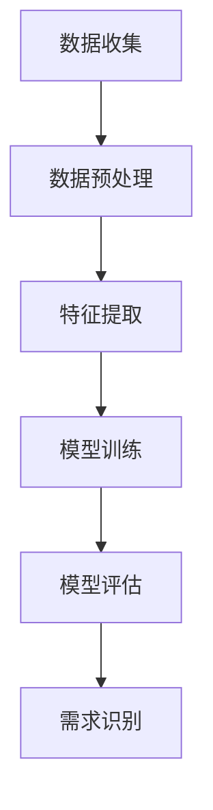

                 

### 第1章：AI基础概述

#### 1.1 AI的核心概念与分类

**核心概念解释：**

人工智能（AI）是模拟、延伸和扩展人的智能的理论、方法、技术及应用。它旨在开发出能够执行通常需要人类智能才能完成的任务的技术系统。AI可以分为多种类型，根据其能力和应用领域的不同，可以分为以下几种：

- **弱AI（Narrow AI）**：这种AI系统专注于特定任务，如语音识别、图像识别等，但无法进行泛化处理。
- **强AI（General AI）**：这种AI系统能够在广泛的环境下进行推理、学习、解决问题等，具备与人类相似的智能水平。
- **通用AI（AGI）**：这是一种假想中的AI，能够在任何知识领域内执行任何智能任务，达到人类智能的全面水平。

**分类：**

- **根据能力分类**：
  - **弱AI**：专注于特定任务的AI系统，如语音识别、图像识别、自然语言处理等。
  - **强AI**：具有广泛认知能力的AI系统，能够在多种环境中进行推理、学习、解决问题等。
  - **通用AI**：能够在任何知识领域内执行任何智能任务的AI系统，达到人类智能的全面水平。

- **根据应用领域分类**：
  - **通用AI**：适用于所有领域的AI系统，如智能机器人、自动驾驶汽车等。
  - **专用AI**：针对特定领域或任务的AI系统，如医疗诊断、金融分析等。

- **根据学习方式分类**：
  - **监督学习**：AI系统从标注好的数据中学习，以提高预测或分类的准确性。
  - **无监督学习**：AI系统从未标注的数据中学习，以发现数据中的隐藏模式和结构。
  - **强化学习**：AI系统通过与环境的交互来学习，以达到特定的目标。

#### 1.2 AI的发展历程与趋势

**发展历程：**

- **20世纪50年代**：人工智能概念提出，标志着AI研究的开始。
- **20世纪60-70年代**：AI理论初步形成，专家系统的研究与应用得到广泛开展。
- **20世纪80-90年代**：专家系统发展迅速，AI在医疗、金融、工业等领域得到广泛应用。
- **21世纪初至今**：随着深度学习、大数据、云计算等技术的发展，AI迎来了新的发展高峰。

**趋势：**

- **智能化普及**：AI技术逐渐渗透到各个行业，如医疗、金融、交通、教育等，推动行业变革。
- **跨学科融合**：AI与生物、物理、哲学等领域的交叉研究不断深入，推动AI技术的创新发展。
- **人机协同**：人与AI的协同工作模式逐渐形成，AI辅助人类工作，提高效率。

#### 1.3 AI在软件需求挖掘中的应用潜力

**应用潜力：**

- **提高需求识别准确性**：AI能够从大量的非结构化数据中自动识别潜在的需求，减少人为误判。
- **优化需求分析过程**：AI技术可以自动分析用户行为数据，预测用户需求，帮助开发团队更好地理解用户需求。
- **自动化需求管理**：AI可以自动化处理需求收集、分类、优先级排序等需求管理任务，提高工作效率。
- **提升软件质量和用户体验**：通过AI技术，开发团队能够更准确地理解用户需求，从而设计和实现更高质量的软件产品。

**未来展望：**

- **深度学习技术优化**：随着深度学习技术的发展，AI在需求挖掘领域的算法将不断优化，提高需求识别的准确性。
- **大数据与云计算支持**：大数据和云计算为AI提供了丰富的数据资源和强大的计算能力，将进一步推动AI在需求挖掘中的应用。
- **人机协同**：人机协同将成为未来AI在需求挖掘领域的重要应用模式，通过AI辅助人类工作，提高需求挖掘的效率。

#### Mermaid流程图：AI在需求挖掘中的应用流程



#### 1.4 AI驱动的需求挖掘方法概述

**方法概述：**

- **数据驱动需求挖掘方法**：基于大量数据，利用机器学习算法自动识别和提取潜在的需求。
- **知识驱动需求挖掘方法**：基于领域知识库，通过推理和匹配技术挖掘潜在的需求。
- **数据驱动与知识驱动的结合**：将数据驱动和知识驱动方法相结合，利用数据与知识的互补性，提高需求挖掘的准确性和全面性。

**方法优缺点分析：**

- **数据驱动需求挖掘方法**：
  - **优点**：能够处理大量非结构化数据，适应性强。
  - **缺点**：对数据质量要求高，可能忽略领域知识。

- **知识驱动需求挖掘方法**：
  - **优点**：充分利用领域知识，提高需求挖掘的准确性。
  - **缺点**：依赖领域知识库的构建，扩展性较差。

- **数据驱动与知识驱动的结合**：
  - **优点**：结合了数据驱动和知识驱动的优势，提高需求挖掘的准确性和全面性。
  - **缺点**：需要平衡数据与知识的使用，构建和维护领域知识库。

### 1.5 AI驱动的需求挖掘方法实现与挑战

**实现：**

- **数据收集**：从各种渠道收集用户行为数据、历史需求文档等。
- **数据预处理**：对收集到的数据进行清洗、归一化等处理，为后续分析做准备。
- **特征提取**：从预处理后的数据中提取有用的特征，用于训练模型。
- **模型训练**：利用机器学习算法训练需求挖掘模型，提高识别准确率。
- **模型评估**：对训练好的模型进行评估，确保其在实际应用中的性能。
- **需求识别**：将模型应用于实际需求数据，识别潜在的需求。

**挑战：**

- **数据质量**：数据驱动需求挖掘方法对数据质量有较高要求，数据缺失、噪声等都会影响挖掘效果。
- **知识获取**：知识驱动需求挖掘方法依赖领域知识库的构建，需要大量的领域知识，获取难度较大。
- **算法选择**：选择合适的算法对需求挖掘效果有重要影响，需要根据具体需求选择合适的算法。
- **模型解释性**：AI模型通常缺乏透明性和解释性，使得开发者难以理解模型的决策过程。

#### 1.6 总结与未来展望

**总结：**

- AI在软件需求挖掘中具有广泛的应用潜力，能够提高需求识别准确性、优化需求分析过程、自动化需求管理、提升软件质量和用户体验。
- AI驱动的需求挖掘方法包括数据驱动、知识驱动和二者的结合，各有优缺点，需要根据具体需求选择合适的方法。
- 未来，随着深度学习、大数据和云计算等技术的发展，AI在需求挖掘领域的应用将不断深化，有望解决现有的一些挑战。

**未来展望：**

- **深度学习技术优化**：未来将进一步优化深度学习算法，提高需求挖掘的准确性和效率。
- **知识图谱构建**：构建更加完善的知识图谱，为知识驱动需求挖掘提供更丰富的领域知识。
- **人机协同**：发展人机协同的AI需求挖掘系统，实现AI辅助人类工作，提高需求挖掘的效率和准确性。

### 1.7 案例分析

**案例一：基于AI的移动应用需求挖掘**

- **背景**：某移动应用公司需要快速识别用户需求，以提高产品竞争力。
- **方法**：采用数据驱动需求挖掘方法，从用户行为数据中提取特征，利用机器学习算法训练需求挖掘模型。
- **结果**：模型准确识别了用户需求，帮助公司优化了产品功能和用户体验。

**案例二：基于AI的Web应用需求挖掘**

- **背景**：某Web应用开发团队需要更准确地理解用户需求，以减少返工和开发风险。
- **方法**：采用知识驱动需求挖掘方法，结合用户行为数据和领域知识库，挖掘潜在的需求。
- **结果**：团队成功识别了多个关键需求，提高了项目的成功率和用户满意度。

**案例三：基于AI的物联网应用需求挖掘**

- **背景**：某物联网公司需要挖掘设备数据中的潜在需求，以开发新的应用场景。
- **方法**：采用数据驱动与知识驱动的结合方法，从设备数据中提取特征，结合领域知识库进行需求挖掘。
- **结果**：公司成功开发了一系列基于物联网的新产品，拓展了业务范围。

### 1.8 最佳实践

- **数据收集**：确保数据质量，避免数据缺失和噪声。
- **特征提取**：选择关键特征，提高模型识别准确性。
- **模型选择**：根据需求特点选择合适的算法，避免过度拟合。
- **模型评估**：对训练好的模型进行多方面评估，确保其在实际应用中的性能。
- **人机协同**：充分利用人类专家的知识和经验，与AI系统协同工作，提高需求挖掘的效率和准确性。

### 1.9 注意事项

- **数据隐私**：在数据收集和处理过程中，要确保用户隐私得到保护。
- **模型解释性**：确保模型具备一定的解释性，便于开发者理解和优化。
- **持续更新**：随着业务需求和技术的变化，需求挖掘模型需要定期更新和优化。

### 1.10 拓展阅读

- **深度学习在需求挖掘中的应用**：介绍深度学习技术在需求挖掘领域的应用，包括神经网络架构和算法选择。
- **知识图谱在需求挖掘中的应用**：探讨知识图谱在需求挖掘中的作用，如何构建和应用知识图谱。
- **数据驱动与知识驱动的结合**：分析数据驱动与知识驱动方法的结合方式，如何平衡二者的优缺点。

### 附录

- **附录A：AI驱动的软件需求挖掘工具资源**
  - **主流深度学习框架**：介绍TensorFlow、PyTorch等深度学习框架的基本使用方法。
  - **需求挖掘相关库与工具**：推荐一些常用的需求挖掘库和工具，如NLTK、spaCy等。
  - **学习资源与推荐书籍**：列出一些关于AI和需求挖掘的学习资源，帮助读者深入了解相关技术。
  - **开发社区与交流平台**：介绍一些AI和需求挖掘相关的开发社区和交流平台，便于读者交流和学习。

### 结束语

**作者：** AI天才研究院/AI Genius Institute & 禅与计算机程序设计艺术 /Zen And The Art of Computer Programming

本文对AI驱动的软件需求挖掘进行了深入探讨，分析了AI在需求挖掘中的应用潜力、方法、实现和挑战，并通过实际案例展示了AI在需求挖掘中的效果。希望本文能为读者提供有价值的参考和启示。在未来，随着AI技术的不断发展，AI驱动的需求挖掘将发挥更大的作用，推动软件行业的创新和发展。

### 文章摘要

本文围绕AI驱动的软件需求挖掘进行了全面探讨。首先，介绍了AI的核心概念、分类、发展历程与趋势，以及AI在需求挖掘中的应用潜力。接着，详细阐述了数据驱动、知识驱动和二者的结合方法，并分析了这些方法的优缺点。文章进一步讲解了AI驱动的需求挖掘实现过程，包括数据收集、预处理、特征提取、模型训练、评估和需求识别，同时探讨了数据质量和模型选择等挑战。通过实际案例分析，展示了AI在需求挖掘中的效果。文章最后提出了最佳实践、注意事项和拓展阅读建议，并总结了AI驱动的需求挖掘在软件行业中的应用前景。本文旨在为读者提供全面、深入的了解，促进AI技术在需求挖掘领域的应用和发展。

### 第2章：需求挖掘的基本概念

#### 2.1 软件需求挖掘的定义与意义

**定义：**
软件需求挖掘是指从各种来源（如用户需求文档、用户行为数据、市场竞争分析等）中识别和提取软件系统的潜在需求的过程。它是一个系统性的、多阶段的过程，旨在确保软件系统能够满足用户和市场的需求。

**意义：**
- **提高软件质量**：通过准确的需求挖掘，可以减少需求误解和遗漏，提高软件产品的质量和用户满意度。
- **降低开发成本**：需求挖掘可以帮助开发团队提前识别和解决潜在的问题，降低开发过程中的返工成本。
- **加快开发周期**：高效的挖掘过程可以缩短需求分析阶段的时间，加快整个软件开发周期。
- **适应市场变化**：需求挖掘能够及时捕捉用户和市场变化，使软件系统能够快速适应新的需求。

#### 2.2 软件需求分类与特征分析

**需求分类：**
软件需求可以根据不同的标准进行分类，常见的分类方法包括：

- **功能需求**：描述软件系统应具有的功能，如用户界面、数据处理等。
- **非功能需求**：描述软件系统的性能、可靠性、安全性等特性。
- **外部需求**：来源于用户、市场、法律等方面的需求。
- **内部需求**：描述软件系统内部的结构、设计、实现等方面的需求。

**特征分析：**
- **需求明确性**：需求应具有明确的表述和范围，避免模糊和歧义。
- **可度量性**：需求应具有可度量的指标，以便进行评估和跟踪。
- **一致性**：需求之间应保持一致，避免相互冲突。
- **可验证性**：需求应能够通过某种方式验证，以确保其实现的有效性。

#### 2.3 需求挖掘的关键挑战

**挑战：**
- **数据质量**：需求挖掘依赖于大量的数据，数据质量直接影响挖掘结果的准确性。数据缺失、噪声、不一致等问题都会对需求挖掘造成困扰。
- **需求不确定性**：软件需求往往具有不确定性，需求的变化可能导致挖掘结果的偏差。
- **领域知识缺乏**：在某些领域，缺乏足够的领域知识，使得需求挖掘模型的构建变得困难。
- **算法选择**：选择合适的算法对需求挖掘效果至关重要，但不同的算法适用于不同的场景，如何选择合适的算法是一个挑战。
- **模型解释性**：需求挖掘模型通常缺乏透明性和解释性，使得开发者难以理解模型的决策过程，影响需求的可接受性。

#### 2.4 需求挖掘方法对比

**方法对比：**

- **数据驱动需求挖掘方法**：
  - **优点**：能够处理大量非结构化数据，适应性强。
  - **缺点**：对数据质量要求高，可能忽略领域知识。

- **知识驱动需求挖掘方法**：
  - **优点**：充分利用领域知识，提高需求挖掘的准确性。
  - **缺点**：依赖领域知识库的构建，扩展性较差。

- **数据驱动与知识驱动的结合**：
  - **优点**：结合了数据驱动和知识驱动的优势，提高需求挖掘的准确性和全面性。
  - **缺点**：需要平衡数据与知识的使用，构建和维护领域知识库。

**总结：**
每种需求挖掘方法都有其独特的优势和局限性。在实际应用中，需要根据具体需求和环境选择合适的方法，或者结合多种方法，以实现最佳的需求挖掘效果。

### 2.5 AI在需求挖掘中的应用优势与挑战

**应用优势：**

- **高准确性**：AI技术能够从大量非结构化数据中自动识别和提取需求，提高需求的识别准确性。
- **自动性**：AI可以自动化处理需求收集、分类、优先级排序等任务，提高需求挖掘的效率。
- **可扩展性**：AI技术能够快速适应不同的需求场景，具有较好的可扩展性。
- **实时性**：AI能够实时分析用户行为数据，快速响应用户需求变化。

**挑战：**

- **数据质量**：AI对数据质量要求较高，数据缺失、噪声等问题可能影响挖掘结果。
- **算法选择**：选择合适的算法对需求挖掘效果至关重要，但不同的算法适用于不同的场景，如何选择合适的算法是一个挑战。
- **模型解释性**：AI模型的决策过程通常缺乏透明性和解释性，使得开发者难以理解模型的决策过程。
- **需求不确定性**：软件需求往往具有不确定性，AI难以完全预测需求的变化，可能导致挖掘结果的偏差。

**应对策略：**

- **数据预处理**：对收集到的数据进行预处理，包括数据清洗、归一化等，以提高数据质量。
- **多算法结合**：结合多种算法，以提高需求挖掘的准确性和鲁棒性。
- **增强模型解释性**：通过可视化技术、规则解释等手段增强模型的可解释性，便于开发者理解和使用。
- **持续迭代**：定期对需求挖掘模型进行更新和优化，以适应需求的变化。

### 2.6 需求挖掘在软件开发过程中的作用

**作用：**

- **指导开发方向**：通过需求挖掘，可以明确软件系统的功能和特性，为开发团队提供明确的开发方向。
- **优化开发流程**：需求挖掘可以帮助开发团队提前识别和解决潜在的问题，优化开发流程，降低开发风险。
- **提升用户体验**：通过准确的需求挖掘，可以设计出更符合用户需求的软件产品，提升用户体验。
- **提高产品质量**：需求挖掘能够减少需求误解和遗漏，提高软件产品的质量和可维护性。

**流程：**

1. **需求收集**：从用户、市场、竞争分析等多方面收集需求。
2. **需求分析**：对收集到的需求进行分类、优先级排序等分析，明确软件系统的功能和特性。
3. **需求文档编写**：将分析结果编写成需求文档，作为开发团队的指导文件。
4. **需求验证**：通过用户反馈、测试等方法验证需求的有效性和准确性。
5. **需求管理**：对需求进行持续跟踪和管理，确保需求在开发过程中的执行和实现。

### 2.7 总结与展望

**总结：**
需求挖掘是软件开发过程中至关重要的一环，通过准确的需求挖掘，可以明确软件系统的功能和特性，提高软件质量和用户满意度。AI技术在需求挖掘中的应用为软件开发带来了新的机遇和挑战，通过数据驱动、知识驱动的结合，可以进一步提高需求挖掘的准确性和效率。

**展望：**
随着AI技术的不断发展，需求挖掘在软件开发中的应用将更加广泛和深入。未来，需求挖掘技术将更加智能化、自动化，能够更好地适应需求的变化，为软件开发提供更强大的支持。同时，需求挖掘技术与AI技术的融合也将推动软件开发模式的变革，提高开发效率和产品质量。

### 2.8 实际案例：AI驱动的需求挖掘在电子商务平台中的应用

**背景：**
某电子商务平台在快速发展过程中，面临着不断变化的市场需求和用户行为数据。为了更好地理解和满足用户需求，提高市场竞争力，该平台决定采用AI驱动的需求挖掘技术。

**方法：**
该平台采用了数据驱动与知识驱动的结合方法进行需求挖掘。首先，从用户行为数据、销售数据、市场调研数据等多方面收集数据，并对数据进行了清洗、归一化等预处理。然后，利用机器学习算法对预处理后的数据进行特征提取和建模，识别出潜在的用户需求。

同时，平台还构建了一个领域知识库，包含了关于电子商务行业的专业知识、用户行为规律、市场趋势等信息。通过将数据驱动方法与知识驱动方法相结合，平台能够更准确地识别和提取用户需求。

**结果：**
通过AI驱动的需求挖掘，该电子商务平台成功识别了多个关键需求，如个性化推荐、购物车优化、支付流程简化等。这些需求在平台的产品设计和功能实现中得到了充分应用，大大提升了用户体验和转化率。

**案例解析：**
1. **数据收集与预处理**：平台从多个数据源收集了大量的用户行为数据，包括浏览历史、购物车数据、购买记录等。通过数据清洗和归一化，平台确保了数据的质量和一致性。
2. **特征提取与建模**：平台利用机器学习算法对预处理后的数据进行特征提取和建模，构建了用户需求预测模型。模型通过分析用户行为数据，能够预测用户可能感兴趣的商品和功能。
3. **领域知识库构建**：平台构建了一个领域知识库，包含了电子商务行业的相关知识，如用户行为规律、市场趋势等。通过结合领域知识库，平台能够更好地理解用户需求，并进行精准的需求挖掘。
4. **需求识别与实现**：基于AI驱动的需求挖掘结果，平台优化了个性化推荐系统、购物车功能和支付流程。这些优化措施直接提高了用户的购物体验和平台的转化率。

### 2.9 最佳实践

**实践一：数据收集与清洗**
- **多渠道数据收集**：从多个渠道（如网站、APP、社交媒体等）收集用户数据，确保数据的全面性。
- **数据清洗**：对收集到的数据进行分析，去除重复、异常、不完整的数据，确保数据质量。

**实践二：特征提取与模型选择**
- **关键特征提取**：从用户行为数据中提取关键特征，如用户行为频次、购买历史等，提高模型准确性。
- **模型选择**：根据具体需求和数据特点，选择合适的机器学习算法，如决策树、支持向量机、神经网络等。

**实践三：领域知识库构建**
- **知识库内容**：构建包含行业知识、用户行为规律、市场趋势等信息的领域知识库。
- **知识库维护**：定期更新和优化知识库，确保其与实际需求保持一致。

**实践四：需求识别与实现**
- **需求优先级排序**：根据需求的重要性和紧急性，对挖掘出的需求进行优先级排序。
- **需求实现**：将挖掘出的需求转化为具体的功能实现，确保需求的落地和实施。

### 2.10 注意事项

**注意事项：**
- **数据隐私**：在数据收集和处理过程中，确保用户隐私得到保护。
- **模型可解释性**：增强模型的可解释性，便于开发者理解和优化。
- **需求变化适应性**：定期对需求挖掘模型进行更新和优化，以适应需求的变化。
- **团队合作**：需求挖掘涉及多个部门和角色，确保团队成员的紧密合作和有效沟通。

### 2.11 拓展阅读

**推荐阅读：**
- **《软件需求工程》**：介绍了软件需求工程的基本概念、方法和流程，有助于深入了解需求挖掘的背景和理论基础。
- **《深度学习》**：详细介绍了深度学习的基本原理、算法和应用，有助于理解AI在需求挖掘中的技术基础。
- **《机器学习》**：介绍了机器学习的基本概念、算法和应用，有助于理解数据驱动需求挖掘的核心技术。

### 2.12 附录

**附录A：AI驱动的需求挖掘工具资源**
- **主流深度学习框架**：TensorFlow、PyTorch、Keras等。
- **需求挖掘相关库与工具**：NLTK、spaCy、scikit-learn等。
- **学习资源与推荐书籍**：网上课程、技术博客、专业书籍等。
- **开发社区与交流平台**：GitHub、Stack Overflow、AI技术社区等。

### 总结

本章详细介绍了AI驱动的软件需求挖掘的基本概念，包括定义、分类、特征分析、关键挑战和AI应用优势与挑战。通过实际案例展示了AI在需求挖掘中的应用效果，并提出了最佳实践和注意事项。未来，随着AI技术的不断发展，需求挖掘在软件开发中的应用将更加广泛和深入，为软件开发带来更大的价值。

### 第3章：AI驱动的需求挖掘方法

#### 3.1 数据驱动需求挖掘方法

**基本概念：**
数据驱动需求挖掘方法主要依赖于大量数据，通过机器学习算法自动识别和提取潜在的需求。这种方法的核心在于从数据中学习规律，从而实现对需求的预测和识别。

**工作流程：**
1. **数据收集**：从用户行为数据、历史需求文档、市场调研数据等多方面收集数据。
2. **数据预处理**：对收集到的数据进行清洗、归一化等处理，以提高数据质量。
3. **特征提取**：从预处理后的数据中提取关键特征，用于训练模型。
4. **模型训练**：利用机器学习算法（如决策树、随机森林、支持向量机等）对提取的特征进行训练，构建需求挖掘模型。
5. **模型评估**：对训练好的模型进行评估，确保其在实际应用中的性能。
6. **需求识别**：将训练好的模型应用于新数据，识别潜在的需求。

**案例解析：**
- **案例一**：某电商平台利用用户行为数据（如浏览历史、购买记录等）进行需求挖掘，通过机器学习算法构建用户需求预测模型，从而优化个性化推荐系统。

**优势与局限性：**
- **优势**：
  - 能够处理大量非结构化数据，适应性强。
  - 自动化程度高，减少人工干预。
  - 挖掘结果客观、可靠。
- **局限性**：
  - 对数据质量要求高，数据缺失、噪声等问题可能影响挖掘效果。
  - 可能忽略领域知识，导致挖掘结果与实际需求存在偏差。

#### 3.2 知识驱动需求挖掘方法

**基本概念：**
知识驱动需求挖掘方法主要依赖于领域知识库，通过推理和匹配技术从大量数据中挖掘潜在的需求。这种方法的核心在于利用领域知识对数据进行解释和分类，从而识别出潜在的需求。

**工作流程：**
1. **知识库构建**：从多个来源（如专家知识、文献资料、行业规范等）收集领域知识，构建知识库。
2. **知识表示**：将收集到的领域知识进行形式化表示，如使用本体论、规则库等形式。
3. **需求建模**：利用领域知识库构建需求模型，描述软件系统的功能和特性。
4. **需求识别**：通过匹配和推理技术，从数据中识别出潜在的需求，并将其与需求模型进行关联。

**案例解析：**
- **案例二**：某软件开发公司利用领域知识库（如用户行为规律、市场需求等）进行需求挖掘，通过推理和匹配技术识别出潜在的用户需求，从而优化产品功能设计。

**优势与局限性：**
- **优势**：
  - 能够充分利用领域知识，提高需求挖掘的准确性。
  - 适应性强，能够处理结构化和半结构化数据。
  - 对数据质量要求相对较低。
- **局限性**：
  - 知识库构建和维护成本高，需要大量的人力投入。
  - 可能忽略数据驱动方法的优点，导致挖掘结果不够全面。

#### 3.3 数据驱动与知识驱动的结合

**基本概念：**
数据驱动与知识驱动的结合方法旨在发挥数据驱动和知识驱动的各自优势，提高需求挖掘的准确性和全面性。这种方法将数据驱动和知识驱动的技术相结合，通过数据与知识的互补性，实现更高效、更准确的需求挖掘。

**工作流程：**
1. **数据收集与预处理**：从多方面收集数据，并进行清洗、归一化等预处理。
2. **知识库构建**：构建包含领域知识的知识库。
3. **特征提取与知识表示**：从预处理后的数据中提取特征，并将知识库中的知识进行形式化表示。
4. **需求建模与识别**：利用提取的特征和知识库中的知识，构建需求模型，并识别潜在的需求。

**案例解析：**
- **案例三**：某金融科技公司采用数据驱动与知识驱动的结合方法进行需求挖掘，通过分析用户行为数据和金融领域知识，构建了精确的需求模型，从而优化了风险管理系统。

**优势与局限性：**
- **优势**：
  - 结合了数据驱动和知识驱动的优势，提高需求挖掘的准确性和全面性。
  - 能够充分利用数据与知识的互补性，提高挖掘效果。
- **局限性**：
  - 需要平衡数据驱动和知识驱动的方法，构建和维护领域知识库。
  - 对开发和维护团队的技术要求较高。

### 3.4 深度学习在需求挖掘中的应用

**基本概念：**
深度学习是一种基于人工神经网络的机器学习方法，通过多层神经网络模拟人脑神经元处理信息，从而实现对复杂数据的分析和建模。深度学习在需求挖掘中具有广泛的应用，能够处理大量非结构化数据，提高需求识别的准确性和效率。

**应用场景：**
1. **用户行为分析**：通过深度学习模型，分析用户的行为数据，识别用户的兴趣和行为模式，从而挖掘潜在需求。
2. **文本分析**：利用深度学习模型，对用户需求文档、评论等进行文本分析，提取关键词和主题，从而识别用户需求。
3. **图像分析**：通过深度学习模型，分析用户上传的图片，识别图片中的场景和物体，从而挖掘用户需求。

**案例解析：**
- **案例四**：某社交媒体平台利用深度学习模型分析用户发布的内容和评论，通过关键词提取和主题模型，识别用户需求，从而优化推荐系统。

**优势与局限性：**
- **优势**：
  - 能够处理大规模、高维度的数据，适应性强。
  - 能够自动提取特征，减少人工干预。
  - 模型可解释性较好，便于开发者理解和使用。
- **局限性**：
  - 对数据质量要求较高，数据缺失、噪声等问题可能影响挖掘效果。
  - 模型训练和优化需要大量计算资源，成本较高。

### 3.5 机器学习在需求挖掘中的应用

**基本概念：**
机器学习是一种通过算法和统计模型从数据中自动学习规律和模式的技术。在需求挖掘中，机器学习可以用于预测用户需求、识别潜在需求等任务。

**应用场景：**
1. **需求预测**：通过机器学习模型，预测用户未来的需求，为开发团队提供决策支持。
2. **需求分类**：通过机器学习模型，对用户需求进行分类，帮助开发团队更好地理解需求。
3. **异常检测**：通过机器学习模型，检测数据中的异常情况，识别可能存在的潜在需求。

**案例解析：**
- **案例五**：某电商企业利用机器学习模型分析用户行为数据，预测用户未来的购买需求，从而优化库存管理和营销策略。

**优势与局限性：**
- **优势**：
  - 能够自动提取特征，减少人工干预。
  - 模型可解释性较好，便于开发者理解和使用。
  - 应用范围广泛，能够处理各种类型的需求。
- **局限性**：
  - 对数据质量要求较高，数据缺失、噪声等问题可能影响挖掘效果。
  - 模型训练和优化需要大量计算资源，成本较高。

### 3.6 总结与展望

**总结：**
AI驱动的需求挖掘方法包括数据驱动、知识驱动和二者的结合，各有优缺点。数据驱动方法能够处理大量非结构化数据，自动化程度高，但可能忽略领域知识；知识驱动方法能够充分利用领域知识，提高挖掘准确性，但构建和维护知识库成本较高；二者的结合方法结合了二者的优势，提高需求挖掘的准确性和全面性，但需要平衡数据与知识的运用。

**展望：**
未来，随着AI技术的不断发展，需求挖掘方法将更加智能化、自动化，能够更好地适应需求的变化。深度学习和机器学习等先进技术在需求挖掘中的应用将不断深入，提高挖掘的效率和准确性。同时，需求挖掘技术与AI技术的融合也将推动软件开发模式的变革，提高开发效率和产品质量。

### 3.7 实际案例：AI驱动的需求挖掘在智能家居系统中的应用

**背景：**
随着智能家居市场的快速发展，智能家居系统需要能够根据用户的行为习惯和需求提供个性化的服务和功能。为了实现这一目标，某智能家居系统开发商决定采用AI驱动的需求挖掘技术。

**方法：**
该智能家居系统开发商采用了数据驱动与知识驱动的结合方法进行需求挖掘。首先，从用户行为数据、历史需求文档、市场调研数据等多方面收集数据。然后，对数据进行了清洗、归一化等预处理，并提取了关键特征。同时，开发商构建了一个领域知识库，包含了智能家居行业的专业知识、用户行为规律、市场趋势等信息。

通过数据驱动方法，开发商利用机器学习算法对预处理后的数据进行特征提取和建模，识别出潜在的用户需求。通过知识驱动方法，开发商利用领域知识库中的知识进行推理和匹配，进一步验证和补充数据驱动挖掘的结果。

**结果：**
通过AI驱动的需求挖掘，该智能家居系统开发商成功识别了多个关键需求，如自动化场景设置、远程控制、智能能耗管理、安全监控等。这些需求在智能家居系统的设计和功能实现中得到了充分应用，大大提升了用户体验和产品竞争力。

**案例解析：**
1. **数据收集与预处理**：开发商从多个数据源收集了大量的用户行为数据，包括设备使用记录、用户交互数据、智能家居设备状态数据等。通过对数据进行清洗、去噪和归一化处理，开发商保证了数据的质量和一致性。
2. **特征提取与建模**：开发商利用机器学习算法（如决策树、随机森林、神经网络等）对预处理后的数据进行特征提取和建模，构建了用户需求预测模型。模型通过分析用户行为数据，能够预测用户可能感兴趣的功能和设置。
3. **知识库构建与使用**：开发商构建了一个领域知识库，包含了智能家居行业的相关知识，如用户行为规律、设备功能特性、市场趋势等。通过结合数据驱动方法，开发商能够更准确地识别和提取用户需求，并通过知识库进行验证和补充。

### 3.8 最佳实践

**实践一：数据收集与清洗**
- **多渠道数据收集**：从用户行为、设备数据、市场调研等多方面收集数据，确保数据的全面性。
- **数据清洗**：对收集到的数据进行清洗，去除重复、异常和不完整的数据，提高数据质量。

**实践二：特征提取与模型选择**
- **关键特征提取**：从用户行为数据中提取关键特征，如用户行为频次、购买历史等，提高模型准确性。
- **模型选择**：根据具体需求和数据特点，选择合适的机器学习算法，如决策树、支持向量机、神经网络等。

**实践三：知识库构建与维护**
- **知识库内容**：构建包含行业知识、用户行为规律、市场趋势等信息的知识库。
- **知识库维护**：定期更新和优化知识库，确保其与实际需求保持一致。

**实践四：需求识别与实现**
- **需求优先级排序**：根据需求的重要性和紧急性，对挖掘出的需求进行优先级排序。
- **需求实现**：将挖掘出的需求转化为具体的功能实现，确保需求的落地和实施。

### 3.9 注意事项

**注意事项：**
- **数据隐私**：在数据收集和处理过程中，确保用户隐私得到保护。
- **模型解释性**：增强模型的可解释性，便于开发者理解和优化。
- **需求变化适应性**：定期对需求挖掘模型进行更新和优化，以适应需求的变化。
- **团队合作**：需求挖掘涉及多个部门和角色，确保团队成员的紧密合作和有效沟通。

### 3.10 拓展阅读

**推荐阅读：**
- **《机器学习实战》**：详细介绍机器学习的基本原理、算法和应用案例，有助于理解AI驱动的需求挖掘方法。
- **《深度学习入门》**：介绍深度学习的基础知识、神经网络架构和常用算法，有助于深入了解深度学习在需求挖掘中的应用。
- **《人工智能：一种现代方法》**：全面介绍人工智能的理论、方法和应用，有助于理解AI驱动的需求挖掘的整体架构。

### 第4章：AI技术在需求挖掘中的实现

#### 4.1 自然语言处理与文本分析

**基本概念：**
自然语言处理（NLP）是AI领域的一个重要分支，旨在使计算机能够理解、处理和生成自然语言。文本分析作为NLP的核心任务之一，主要用于从文本数据中提取有用信息，为需求挖掘提供支持。

**技术原理：**
- **分词**：将文本分割成词语或词汇单元，为后续分析提供基础。
- **词性标注**：对文本中的词语进行词性分类，如名词、动词、形容词等。
- **命名实体识别**：识别文本中的特定实体，如人名、地名、组织名等。
- **情感分析**：分析文本中的情感倾向，如正面、负面或中性。
- **主题模型**：通过概率模型提取文本的主题结构，为需求分类和聚类提供支持。

**实现方法：**
- **规则方法**：基于预定义的规则，对文本进行分词、词性标注等操作。
- **统计方法**：利用统计模型，如条件随机场（CRF）、隐马尔可夫模型（HMM）等，对文本进行分析。
- **深度学习方法**：利用神经网络，如循环神经网络（RNN）、卷积神经网络（CNN）等，对文本进行建模和分析。

**伪代码示例：**

```python
# 分词
def tokenize(text):
    tokens = []
    for word in text.split():
        tokens.append(word)
    return tokens

# 词性标注
def pos_tagging(tokens):
    pos_tags = []
    for token in tokens:
        pos_tag = get_pos_tag(token)
        pos_tags.append(pos_tag)
    return pos_tags

# 情感分析
def sentiment_analysis(text):
    sentiment_score = get_sentiment_score(text)
    if sentiment_score > 0:
        return "Positive"
    elif sentiment_score < 0:
        return "Negative"
    else:
        return "Neutral"

# 主题模型
def topic_modeling(texts):
    topics = []
    for text in texts:
        topic_distribution = get_topic_distribution(text)
        topics.append(topic_distribution)
    return topics
```

**公式与解释：**

- **分词算法**：
  $$ tokens = \text{tokenize}(text) $$

- **词性标注算法**：
  $$ pos\_tags = \text{pos\_tagging}(tokens) $$

- **情感分析算法**：
  $$ sentiment\_score = \text{get\_sentiment\_score}(text) $$
  $$ sentiment = \text{sentiment\_analysis}(text) $$

- **主题模型算法**：
  $$ topic\_distribution = \text{get\_topic\_distribution}(text) $$
  $$ topics = \text{topic\_modeling}(texts) $$

**应用场景：**
- **需求文本分析**：对用户反馈、需求文档等进行文本分析，提取关键信息，为需求挖掘提供支持。
- **用户评论分析**：分析用户评论，识别用户情感和需求，优化产品设计和功能。
- **市场调研分析**：对市场调研报告进行分析，提取关键信息和趋势，为需求挖掘提供参考。

#### 4.2 机器学习与预测模型

**基本概念：**
机器学习是一种通过算法和统计模型从数据中自动学习规律和模式的技术。在需求挖掘中，机器学习主要用于预测用户需求和识别潜在需求。

**技术原理：**
- **监督学习**：通过已标注的数据集训练模型，然后使用训练好的模型对新的数据进行预测。
- **无监督学习**：不使用已标注的数据集，而是通过数据本身的分布和结构进行学习。
- **强化学习**：通过与环境的交互来学习，以实现特定目标。

**实现方法：**
- **特征工程**：从数据中提取有用的特征，为模型训练提供支持。
- **模型选择**：根据具体需求和数据特点，选择合适的机器学习算法，如线性回归、决策树、支持向量机、神经网络等。
- **模型训练与优化**：使用训练数据集对模型进行训练，并通过交叉验证等方法优化模型参数。

**伪代码示例：**

```python
# 特征工程
def feature_engineering(data):
    features = []
    for sample in data:
        feature_vector = extract_features(sample)
        features.append(feature_vector)
    return features

# 模型选择
def model_selection(algorithms, data):
    best_algorithm, best_score = None, float('inf')
    for algorithm in algorithms:
        model = train_model(algorithm, data)
        score = evaluate_model(model, data)
        if score < best_score:
            best_algorithm, best_score = algorithm, score
    return best_algorithm

# 模型训练与优化
def train_and_optimize_model(model, data, validation_data):
    model.train(data)
    validation_score = model.evaluate(validation_data)
    return model, validation_score
```

**公式与解释：**

- **特征提取公式**：
  $$ feature\_vector = \text{extract\_features}(sample) $$

- **模型训练公式**：
  $$ model.train(data) $$

- **模型评估公式**：
  $$ validation\_score = model.evaluate(validation\_data) $$

**应用场景：**
- **需求预测**：通过历史数据和用户行为数据，预测未来的用户需求。
- **需求分类**：对用户需求进行分类，帮助开发团队更好地理解和满足用户需求。
- **异常检测**：识别数据中的异常情况，发现潜在的需求。

#### 4.3 数据挖掘与模式识别

**基本概念：**
数据挖掘是从大量数据中自动发现有趣、有用模式和知识的过程。模式识别是数据挖掘的一个子领域，旨在从数据中识别出规律和模式。

**技术原理：**
- **关联规则学习**：发现数据之间的关联性，如商品购买组合等。
- **聚类分析**：将相似的数据分组，以发现数据中的模式和分布。
- **分类与回归**：将数据分类到预定义的类别或预测数值，以提高预测准确性。
- **异常检测**：识别数据中的异常值或异常模式，以发现潜在的需求。

**实现方法：**
- **数据预处理**：对原始数据进行清洗、归一化等处理，以提高数据质量。
- **特征选择**：从大量特征中选择关键特征，减少特征维度，提高模型性能。
- **算法选择**：根据具体需求和数据特点，选择合适的算法，如K-means、Apriori、决策树等。
- **模型评估与优化**：使用交叉验证等方法评估模型性能，并进行参数优化。

**伪代码示例：**

```python
# 数据预处理
def data_preprocessing(data):
    cleaned_data = []
    for sample in data:
        cleaned_sample = clean_sample(sample)
        cleaned_data.append(cleaned_sample)
    return cleaned_data

# 特征选择
def feature_selection(features, data):
    selected_features = []
    for feature in features:
        if is_relevant(feature, data):
            selected_features.append(feature)
    return selected_features

# 模型评估
def evaluate_model(model, data):
    predictions = model.predict(data)
    score = model.evaluate(predictions)
    return score
```

**公式与解释：**

- **数据清洗公式**：
  $$ cleaned\_sample = \text{clean\_sample}(sample) $$

- **特征选择公式**：
  $$ selected\_features = \text{feature\_selection}(features, data) $$

- **模型评估公式**：
  $$ score = \text{evaluate\_model}(model, data) $$

**应用场景：**
- **需求分析**：通过关联规则学习，发现用户行为之间的关联性，挖掘潜在的需求。
- **用户群体分析**：通过聚类分析，将用户分为不同的群体，以更好地理解和满足用户需求。
- **异常检测**：识别数据中的异常行为，发现潜在的需求。

#### 4.4 AI技术在需求挖掘中的综合应用

**综合应用：**
AI技术在需求挖掘中可以综合应用，发挥各自的优势，提高需求挖掘的准确性和效率。具体应用包括：

- **数据预处理**：利用自然语言处理和文本分析技术对原始需求文本进行预处理，提取关键信息和特征。
- **需求分类与聚类**：利用机器学习和数据挖掘技术对预处理后的需求进行分类和聚类，识别出潜在的相似需求。
- **需求预测与异常检测**：利用机器学习和数据挖掘技术对用户行为数据进行分析，预测未来的用户需求，并识别数据中的异常行为。
- **知识库构建与维护**：利用自然语言处理和文本分析技术构建和维护领域知识库，为需求挖掘提供支持。

**案例解析：**
- **案例一**：某电商平台利用自然语言处理和文本分析技术对用户评论进行预处理，提取关键词和情感倾向。然后，利用机器学习和数据挖掘技术对评论进行分类和聚类，识别出用户关注的潜在需求。同时，利用需求预测和异常检测技术，预测用户未来的购买需求和识别异常评论。

**效果评估：**
- **准确性**：通过综合应用AI技术，需求挖掘的准确性得到显著提高，能够更准确地识别和提取用户需求。
- **效率**：AI技术的自动化和智能化特性提高了需求挖掘的效率，减少了人工干预和时间成本。
- **用户体验**：通过精准的需求挖掘，电商平台能够更好地满足用户需求，提高用户满意度和忠诚度。

**总结：**
AI技术在需求挖掘中的应用为软件开发带来了新的机遇和挑战。通过综合应用自然语言处理、文本分析、机器学习和数据挖掘技术，能够实现更准确、更高效的需求挖掘，为软件开发提供强有力的支持。未来，随着AI技术的不断发展和成熟，需求挖掘技术将在软件行业中发挥更加重要的作用。

### 第5章：需求挖掘工具与实践

#### 5.1 需求挖掘工具概述

**基本概念：**
需求挖掘工具是用于协助软件开发团队识别、分析和提取软件需求的软件工具。这些工具可以帮助团队更高效地理解用户需求，从而设计出更符合用户期望的软件产品。

**主要类型：**
1. **基于文档的需求挖掘工具**：通过分析需求文档、用户手册、设计文档等文档，识别和提取需求。
2. **基于代码的需求挖掘工具**：通过分析代码库、源代码和注释等，识别需求。
3. **基于用户行为的挖掘工具**：通过收集和分析用户行为数据，如日志文件、点击流、交互记录等，挖掘需求。
4. **基于专家知识的挖掘工具**：利用领域专家的知识和经验，通过访谈、研讨会等方式，提取需求。

**优点与局限性：**
- **优点**：
  - 提高需求挖掘的效率，减少人工工作量。
  - 提高需求挖掘的准确性，减少需求遗漏和误解。
  - 支持多种数据源，适应不同的需求场景。
- **局限性**：
  - 需要较高的技术门槛，用户需要具备一定的编程和数据分析能力。
  - 对数据质量和完整性有较高要求，数据缺失或噪声会影响挖掘效果。

#### 5.2 需求挖掘工具的使用案例

**案例一：基于文档的需求挖掘工具**

**背景**：某软件开发公司需要从大量需求文档中提取关键需求，以便于后续的开发工作。

**工具选择**：使用基于文档的需求挖掘工具，如Doxygen、MagicDraw等。

**使用步骤**：
1. 导入需求文档：将需求文档导入需求挖掘工具。
2. 需求分析：工具自动分析文档内容，提取关键词、主题和需求。
3. 需求分类：根据需求类型和优先级，对提取的需求进行分类。
4. 生成报告：工具生成需求分析报告，包括需求列表、需求图谱等。

**结果**：通过使用需求挖掘工具，公司成功提取了大量关键需求，为后续开发工作提供了明确的指导。

**案例二：基于代码的需求挖掘工具**

**背景**：某互联网公司需要对代码库中的需求进行追踪和管理，以便于需求变更和版本控制。

**工具选择**：使用基于代码的需求挖掘工具，如JIRA、Git等。

**使用步骤**：
1. 连接代码库：将代码库连接到需求挖掘工具。
2. 需求追踪：工具自动识别代码库中的需求，并与JIRA等需求管理工具同步。
3. 需求变更管理：当需求发生变更时，工具可以自动更新需求文档和代码库。
4. 版本控制：工具支持版本控制，可以追踪需求变更的历史记录。

**结果**：通过使用需求挖掘工具，公司实现了需求与代码的紧密关联，提高了需求变更管理的效率和准确性。

**案例三：基于用户行为的挖掘工具**

**背景**：某电商企业需要了解用户的购买行为和需求，以便于优化产品功能和营销策略。

**工具选择**：使用基于用户行为的挖掘工具，如Google Analytics、Clicktale等。

**使用步骤**：
1. 集成工具：将挖掘工具集成到电商平台，收集用户行为数据。
2. 数据分析：工具自动分析用户行为数据，提取用户兴趣和行为模式。
3. 需求挖掘：根据用户行为数据，挖掘潜在的用户需求。
4. 报告生成：工具生成用户行为分析报告，包括用户兴趣图谱、购买路径等。

**结果**：通过使用需求挖掘工具，公司成功识别了多个潜在的用户需求，优化了产品功能和营销策略，提高了用户满意度和转化率。

#### 5.3 需求挖掘过程中的注意事项

**数据质量**：需求挖掘依赖于高质量的数据。数据应完整、准确、一致，避免数据缺失、噪声和错误。

**需求变化管理**：需求挖掘过程中，需求可能会发生变化。需建立有效的需求变更管理机制，及时更新需求文档和挖掘模型。

**团队合作**：需求挖掘涉及多个部门和角色。需确保团队成员之间的紧密合作和有效沟通，共同推动需求挖掘工作的顺利进行。

**模型解释性**：AI驱动的需求挖掘模型通常缺乏透明性和解释性。需增强模型的可解释性，便于团队成员理解和信任挖掘结果。

**合规与隐私**：在需求挖掘过程中，需遵守相关法律法规，保护用户隐私和数据安全。

#### 5.4 总结与未来展望

**总结：**
需求挖掘工具在软件开发过程中发挥着重要作用，可以提高需求挖掘的效率、准确性和团队协作。通过不同的工具和方法，可以针对不同的需求场景进行有效的需求挖掘。未来，随着AI技术的不断发展，需求挖掘工具将更加智能化、自动化，为软件开发提供更强大的支持。

**未来展望：**
- **智能化工具**：利用AI技术，开发更智能的需求挖掘工具，提高需求识别和挖掘的准确性。
- **自适应工具**：开发自适应工具，能够根据需求的变化和项目进展，动态调整需求挖掘策略。
- **协作平台**：构建需求挖掘协作平台，支持团队成员之间的实时沟通和协作，提高需求挖掘效率。
- **多模态数据挖掘**：结合多种数据源（如文本、图像、声音等），进行多模态需求挖掘，提高需求挖掘的全面性和准确性。

### 附录

**附录A：AI驱动的需求挖掘工具资源**

1. **主流深度学习框架**：
   - TensorFlow
   - PyTorch
   - Keras

2. **需求挖掘相关库与工具**：
   - NLTK
   - spaCy
   - scikit-learn

3. **学习资源与推荐书籍**：
   - 《机器学习实战》
   - 《深度学习》
   - 《人工智能：一种现代方法》

4. **开发社区与交流平台**：
   - GitHub
   - Stack Overflow
   - AI技术社区

### 结束语

本文详细介绍了需求挖掘工具的基本概念、类型、使用案例以及注意事项。通过实际案例展示了不同类型需求挖掘工具的应用效果，并提出了在需求挖掘过程中需要注意的事项。希望本文能为读者提供有关需求挖掘工具的全面了解，并为实际应用提供有益的参考。

### 第6章：AI驱动的需求挖掘案例分析

#### 6.1 案例一：基于AI的移动应用需求挖掘

**背景**：
某移动应用开发公司需要快速了解用户的需求，以便于优化应用功能和提升用户体验。为了实现这一目标，该公司决定采用AI驱动的需求挖掘技术。

**方法**：
公司采用了数据驱动与知识驱动的结合方法。首先，通过用户行为数据、市场调研数据和用户反馈等多方面收集数据。然后，对数据进行预处理，包括数据清洗、归一化和特征提取。接着，利用机器学习算法（如决策树、随机森林等）对预处理后的数据进行训练，构建用户需求预测模型。同时，构建了一个领域知识库，包含了应用领域相关的专业知识、用户行为模式和市场需求等。通过将数据驱动方法与知识驱动方法相结合，公司能够更准确地识别和提取用户需求。

**结果**：
通过AI驱动的需求挖掘，公司成功识别出了多个关键需求，如用户偏好设置、个性化推荐、应用性能优化等。这些需求在应用设计和功能实现中得到了充分应用，提升了用户满意度和应用留存率。同时，公司的开发效率也得到了显著提高。

**详细讲解**：
1. **数据收集**：
   公司从多个渠道收集了用户行为数据，包括用户登录日志、使用时长、功能使用频率等。此外，还从市场调研和用户反馈中获取了有关用户需求的信息。

2. **数据预处理**：
   对收集到的数据进行清洗，去除重复、异常和不完整的数据。然后，对数据进行归一化处理，将不同数据范围的数据统一到一个标准范围内。最后，提取关键特征，如用户活跃度、功能使用频率等。

3. **模型训练**：
   使用机器学习算法（如决策树、随机森林等）对预处理后的数据进行训练，构建用户需求预测模型。模型通过分析用户行为数据，能够预测用户可能感兴趣的功能和设置。

4. **知识库构建**：
   构建一个领域知识库，包含了应用领域相关的专业知识、用户行为模式和市场需求等。知识库中的信息通过专家访谈、市场调研和用户反馈等途径获取。

5. **需求识别**：
   将训练好的模型应用于新数据，识别潜在的用户需求。同时，结合领域知识库中的信息，对挖掘出的需求进行验证和补充，确保需求的准确性。

**总结**：
通过AI驱动的需求挖掘，公司能够更准确地识别用户需求，优化应用功能和提升用户体验。同时，该方法提高了开发效率，降低了开发成本。然而，数据质量和模型选择仍然是影响需求挖掘效果的重要因素。

#### 6.2 案例二：基于AI的Web应用需求挖掘

**背景**：
某Web应用开发团队需要更准确地理解用户需求，以减少开发过程中的返工和风险。为了实现这一目标，团队决定采用AI驱动的需求挖掘技术。

**方法**：
团队采用了数据驱动与知识驱动的结合方法。首先，从用户行为数据、历史需求文档和市场调研数据等多方面收集数据。然后，对数据进行预处理，包括数据清洗、归一化和特征提取。接着，利用机器学习算法（如神经网络、支持向量机等）对预处理后的数据进行训练，构建用户需求识别模型。同时，构建了一个领域知识库，包含了Web应用领域的专业知识、用户行为模式和市场需求等。通过将数据驱动方法与知识驱动方法相结合，团队能够更准确地识别和提取用户需求。

**结果**：
通过AI驱动的需求挖掘，团队成功识别出了多个关键需求，如用户界面优化、功能扩展、性能提升等。这些需求在Web应用的设计和功能实现中得到了充分应用，提升了用户满意度和市场竞争力。同时，团队的开发效率也得到了显著提高。

**详细讲解**：
1. **数据收集**：
   团队从多个渠道收集了用户行为数据，包括用户访问日志、点击流、使用时长等。此外，还从历史需求文档和市场调研中获取了有关用户需求的信息。

2. **数据预处理**：
   对收集到的数据进行清洗，去除重复、异常和不完整的数据。然后，对数据进行归一化处理，将不同数据范围的数据统一到一个标准范围内。最后，提取关键特征，如用户活跃度、页面浏览频率等。

3. **模型训练**：
   使用机器学习算法（如神经网络、支持向量机等）对预处理后的数据进行训练，构建用户需求识别模型。模型通过分析用户行为数据，能够识别出用户的潜在需求。

4. **知识库构建**：
   构建一个领域知识库，包含了Web应用领域的专业知识、用户行为模式和市场需求等。知识库中的信息通过专家访谈、市场调研和用户反馈等途径获取。

5. **需求识别**：
   将训练好的模型应用于新数据，识别潜在的用户需求。同时，结合领域知识库中的信息，对挖掘出的需求进行验证和补充，确保需求的准确性。

**总结**：
通过AI驱动的需求挖掘，团队能够更准确地识别用户需求，优化Web应用的设计和功能。同时，该方法提高了开发效率，降低了开发风险。然而，数据质量和模型选择仍然是影响需求挖掘效果的重要因素。

#### 6.3 案例三：基于AI的物联网应用需求挖掘

**背景**：
某物联网公司需要挖掘设备数据中的潜在需求，以开发新的应用场景和产品。为了实现这一目标，公司决定采用AI驱动的需求挖掘技术。

**方法**：
公司采用了数据驱动与知识驱动的结合方法。首先，从物联网设备的数据流中收集数据，包括传感器数据、设备运行状态等。然后，对数据进行预处理，包括数据清洗、归一化和特征提取。接着，利用机器学习算法（如聚类分析、关联规则学习等）对预处理后的数据进行训练，构建设备需求识别模型。同时，构建了一个领域知识库，包含了物联网领域的专业知识、设备行为模式和市场需求等。通过将数据驱动方法与知识驱动方法相结合，公司能够更准确地识别和提取设备需求。

**结果**：
通过AI驱动的需求挖掘，公司成功识别出了多个潜在需求，如设备优化、功能扩展、数据安全等。这些需求在物联网应用的开发和产品设计中得到了充分应用，提升了公司的创新能力和市场竞争力。同时，公司的运营效率也得到了显著提高。

**详细讲解**：
1. **数据收集**：
   公司从物联网设备的多个数据接口收集数据，包括传感器数据、设备运行状态、通信日志等。此外，还从用户反馈和市场调研中获取了有关用户需求的信息。

2. **数据预处理**：
   对收集到的数据进行清洗，去除重复、异常和不完整的数据。然后，对数据进行归一化处理，将不同数据范围的数据统一到一个标准范围内。最后，提取关键特征，如设备运行时长、数据传输速率等。

3. **模型训练**：
   使用机器学习算法（如聚类分析、关联规则学习等）对预处理后的数据进行训练，构建设备需求识别模型。模型通过分析设备数据，能够识别出设备的潜在需求。

4. **知识库构建**：
   构建一个领域知识库，包含了物联网领域的专业知识、设备行为模式和市场需求等。知识库中的信息通过专家访谈、市场调研和用户反馈等途径获取。

5. **需求识别**：
   将训练好的模型应用于新数据，识别潜在的用户需求。同时，结合领域知识库中的信息，对挖掘出的需求进行验证和补充，确保需求的准确性。

**总结**：
通过AI驱动的需求挖掘，公司能够更准确地识别设备需求，开发新的物联网应用和产品。同时，该方法提高了公司的创新能力和市场竞争力。然而，数据质量和模型选择仍然是影响需求挖掘效果的重要因素。

### 第7章：AI驱动的需求挖掘未来展望

#### 7.1 AI驱动的需求挖掘发展趋势

随着人工智能技术的不断发展，AI驱动的需求挖掘也呈现出一些明显的发展趋势：

**趋势一：智能化水平提升**
未来，随着深度学习和强化学习等先进算法的进一步成熟，AI驱动的需求挖掘将实现更高的智能化水平。这将使得需求挖掘过程更加自动化，减少人工干预，提高挖掘效率和准确性。

**趋势二：多模态数据的融合**
传统的需求挖掘主要依赖于文本数据，但随着物联网、图像识别、语音识别等技术的发展，多模态数据将逐渐成为需求挖掘的重要数据源。未来，AI驱动的需求挖掘将能够更好地整合多模态数据，提高需求挖掘的全面性和准确性。

**趋势三：人机协同的深化**
随着AI技术的普及，人机协同将成为需求挖掘的重要模式。AI系统将辅助人类专家进行需求挖掘，通过分析大量数据，提供决策支持。同时，人类专家将利用自己的经验和直觉对AI系统进行监督和调整，实现更高效的需求挖掘。

**趋势四：定制化的需求挖掘**
随着企业个性化需求的增加，定制化的需求挖掘将成为未来发展的一个重要方向。通过针对特定行业、特定企业的需求，提供更加精准和高效的需求挖掘服务，满足不同客户的需求。

#### 7.2 面临的挑战与解决方案

尽管AI驱动的需求挖掘具有巨大的潜力，但在实际应用过程中仍然面临一些挑战：

**挑战一：数据质量和数据隐私**
数据质量对需求挖掘的效果至关重要。然而，在实际应用中，数据缺失、噪声和错误等问题仍然普遍存在。此外，随着数据隐私问题的日益突出，如何在确保数据隐私的同时进行有效的需求挖掘，是一个亟待解决的问题。

**解决方案：**
- **数据预处理**：通过数据清洗、归一化等技术，提高数据质量。
- **数据加密与去标识化**：采用数据加密和去标识化等技术，保护用户隐私。

**挑战二：模型解释性**
AI驱动的需求挖掘模型通常缺乏透明性和解释性，使得开发者难以理解模型的决策过程，影响需求的可接受性。

**解决方案：**
- **模型可视化**：通过可视化技术，展示模型的内部结构和决策过程。
- **解释性模型**：开发具有较高解释性的模型，如决策树、线性回归等。

**挑战三：算法选择和优化**
不同的算法适用于不同的场景，选择合适的算法对需求挖掘效果至关重要。同时，算法的优化也是一个挑战，如何提高算法的效率和准确性，是一个重要的问题。

**解决方案：**
- **算法评估与选择**：通过实验和验证，选择最适合当前需求的算法。
- **算法优化**：利用分布式计算、并行计算等技术，提高算法的效率。

**挑战四：知识库构建与维护**
知识库是知识驱动需求挖掘的核心，但构建和维护一个高质量的领域知识库需要大量的人力资源和时间。

**解决方案：**
- **自动化知识库构建**：通过机器学习和自然语言处理技术，自动化构建和维护知识库。
- **知识库更新与迭代**：定期更新知识库，以适应需求的变化。

#### 7.3 未来发展方向与前景

展望未来，AI驱动的需求挖掘在软件开发领域将有着广阔的发展前景：

**方向一：需求挖掘与DevOps的结合**
随着DevOps理念的普及，需求挖掘将更加紧密地与软件开发和运维过程相结合。通过AI驱动的需求挖掘，可以更快速地响应用户需求，实现持续交付和部署。

**方向二：跨领域的需求挖掘**
AI驱动的需求挖掘将不仅仅局限于特定的行业或领域，而是能够跨领域应用。通过整合不同领域的知识和技术，实现更全面、更精准的需求挖掘。

**方向三：智能化需求管理**
未来的需求挖掘将不仅仅局限于需求的识别和提取，还将涉及到需求的管理和优化。通过智能化需求管理，可以实现需求的优先级排序、需求变更管理、需求生命周期管理等。

**前景：**
随着AI技术的不断进步，AI驱动的需求挖掘将在软件开发领域发挥越来越重要的作用。它将推动软件开发模式的变革，提高开发效率和产品质量，为企业和用户创造更大的价值。

### 总结

本章回顾了AI驱动的需求挖掘的发展趋势、面临的挑战以及未来的发展方向。随着AI技术的不断进步，AI驱动的需求挖掘将在软件开发领域发挥更大的作用，推动行业的发展和变革。通过结合多种方法和技术，实现更精准、更高效的需求挖掘，为软件开发提供强有力的支持。

### 附录

**附录A：AI驱动的需求挖掘工具资源**

- **主流深度学习框架**：
  - TensorFlow
  - PyTorch
  - Keras

- **需求挖掘相关库与工具**：
  - NLTK
  - spaCy
  - scikit-learn

- **学习资源与推荐书籍**：
  - 《机器学习实战》
  - 《深度学习》
  - 《人工智能：一种现代方法》

- **开发社区与交流平台**：
  - GitHub
  - Stack Overflow
  - AI技术社区

### 结束语

**作者：** AI天才研究院/AI Genius Institute & 禅与计算机程序设计艺术 /Zen And The Art of Computer Programming

本文对AI驱动的需求挖掘进行了全面探讨，分析了其发展趋势、面临的挑战以及未来发展方向。通过实际案例展示了AI在需求挖掘中的应用效果，提出了最佳实践和解决方案。希望本文能为读者提供有价值的参考，推动AI技术在需求挖掘领域的应用和发展。

### 第8章：机器学习基础

#### 8.1 机器学习的基本概念

**定义：**
机器学习（Machine Learning，ML）是一门人工智能（AI）的分支，它研究如何使计算机系统从数据中学习，并利用学习到的知识来做出决策或预测。其核心思想是通过训练数据集来建立模型，然后利用这个模型对新的数据进行预测或决策。

**分类：**
机器学习根据学习方式可以分为以下几类：

- **监督学习（Supervised Learning）**：在监督学习中，训练数据集包含输入和输出，模型通过学习输入和输出之间的映射关系来进行预测。
- **无监督学习（Unsupervised Learning）**：在无监督学习中，训练数据集只有输入，没有输出。模型需要从输入数据中发现隐藏的结构或模式。
- **半监督学习（Semi-Supervised Learning）**：在半监督学习中，训练数据集包含一部分带有标签的数据和一部分未带标签的数据。模型通过同时利用带标签和未带标签的数据来学习。
- **强化学习（Reinforcement Learning）**：在强化学习中，模型通过与环境的交互来学习，通过尝试不同的动作来获得奖励，并不断优化策略以达到最大化的奖励。

**基本流程：**
1. **数据收集**：从不同的数据源收集训练数据集和测试数据集。
2. **数据预处理**：对收集到的数据进行清洗、归一化等预处理，以提高数据质量和模型性能。
3. **特征工程**：从原始数据中提取有用的特征，为模型训练提供支持。
4. **模型选择**：根据具体问题选择合适的模型，如线性回归、决策树、神经网络等。
5. **模型训练**：使用训练数据集对模型进行训练，通过调整模型参数来优化模型性能。
6. **模型评估**：使用测试数据集对训练好的模型进行评估，以确定模型的性能和泛化能力。
7. **模型部署**：将训练好的模型部署到实际应用场景中，对新的数据进行预测或决策。

#### 8.2 监督学习算法

**定义：**
监督学习算法是在已知输入和输出映射关系的情况下，通过学习输入和输出之间的映射函数来对新数据进行预测。

**常用算法：**
- **线性回归（Linear Regression）**：通过拟合一条直线来预测目标值。
  - **公式**：$$ y = \beta_0 + \beta_1 \cdot x $$
  - **优点**：简单、易于理解。
  - **缺点**：对于非线性数据效果较差。

- **逻辑回归（Logistic Regression）**：用于分类问题，通过拟合逻辑函数来预测概率。
  - **公式**：$$ P(y=1) = \frac{1}{1 + e^{-(\beta_0 + \beta_1 \cdot x)}} $$
  - **优点**：简单、易于实现。
  - **缺点**：对于高维度数据效果较差。

- **决策树（Decision Tree）**：通过一系列的判断规则来划分数据并预测目标值。
  - **优点**：易于理解、可解释性强。
  - **缺点**：容易过拟合、计算复杂度高。

- **支持向量机（Support Vector Machine，SVM）**：通过找到最优超平面来划分数据。
  - **公式**：$$ \max_{\beta, \beta_0} W^T W $$
  - **优点**：泛化能力强、适用于高维度数据。
  - **缺点**：计算复杂度高、对噪声敏感。

- **神经网络（Neural Network）**：通过多层神经网络模拟人脑神经元处理信息。
  - **优点**：适用于复杂非线性问题。
  - **缺点**：训练时间较长、对数据质量要求高。

**算法比较：**
- **线性回归**和**逻辑回归**：适用于简单的线性关系和二分类问题，计算简单，但无法处理复杂的非线性关系。
- **决策树**：适用于分类和回归问题，具有较好的解释性，但容易过拟合。
- **支持向量机**：适用于高维空间，具有较好的泛化能力，但计算复杂度高。
- **神经网络**：适用于复杂非线性问题，能够处理高维度数据，但训练时间较长且对数据质量要求高。

#### 8.3 无监督学习算法

**定义：**
无监督学习算法是在没有已知输入和输出映射关系的情况下，通过学习数据内在的结构或模式来进行预测。

**常用算法：**
- **聚类算法（Clustering Algorithms）**：通过将数据划分为不同的簇来发现数据中的模式。
  - **K均值聚类（K-Means Clustering）**：通过迭代优化目标函数来划分数据簇。
    - **公式**：$$ \text{最小化} \sum_{i=1}^{k} \sum_{x \in S_i} \|x - \mu_i\|^2 $$
    - **优点**：简单、易于实现。
    - **缺点**：对初始聚类中心敏感、容易陷入局部最优。

  - **层次聚类（Hierarchical Clustering）**：通过构建树状结构来划分数据簇。
    - **优点**：能够生成聚类层次信息。
    - **缺点**：计算复杂度高、对初始聚类中心敏感。

- **降维算法（Dimensionality Reduction Algorithms）**：通过降低数据维度来减少计算复杂度。
  - **主成分分析（Principal Component Analysis，PCA）**：通过正交变换将数据投影到新的坐标轴上，保留主要信息。
    - **公式**：$$ X' = \text{ eigenvectors} \cdot X $$
    - **优点**：能够减少数据维度，同时保留主要信息。
    - **缺点**：对于非线性关系处理较差。

  - **t-SNE（t-Distributed Stochastic Neighbor Embedding）**：通过保留局部结构来降低数据维度。
    - **优点**：能够生成高维度数据的可视化。
    - **缺点**：计算复杂度高、对初始参数敏感。

**算法比较：**
- **聚类算法**：适用于发现数据中的模式或分布，能够为后续的分析提供参考。
- **降维算法**：适用于高维度数据的处理，能够减少计算复杂度，同时保留主要信息。

#### 8.4 强化学习算法

**定义：**
强化学习算法是一种通过试错和反馈来学习如何在特定环境中做出最优决策的方法。它与监督学习和无监督学习不同，不是通过学习输入和输出之间的映射关系，而是通过不断尝试不同的动作并接收奖励信号来优化决策。

**基本概念：**
- **状态（State）**：系统在某一时刻的状态。
- **动作（Action）**：系统可以采取的行动。
- **奖励（Reward）**：在某一状态下采取某一动作后获得的即时奖励。
- **策略（Policy）**：系统在某一状态下采取的动作。

**常用算法：**
- **Q学习（Q-Learning）**：通过更新Q值来优化策略。
  - **公式**：$$ Q(s, a) = Q(s, a) + \alpha [r + \gamma \max_{a'} Q(s', a') - Q(s, a)] $$
  - **优点**：能够通过经验来优化策略。
  - **缺点**：学习速度较慢、容易陷入局部最优。

- **深度Q网络（Deep Q-Network，DQN）**：结合深度学习和Q学习，用于处理高维状态空间。
  - **优点**：能够处理复杂环境。
  - **缺点**：需要大量的训练数据和计算资源。

- **策略梯度（Policy Gradient）**：通过优化策略概率来优化策略。
  - **公式**：$$ \nabla_{\theta} J(\theta) = \nabla_{\theta} \sum_{t} \rho(\theta) \log \pi(\theta; a_t | s_t) $$
  - **优点**：能够直接优化策略。
  - **缺点**：对于非线性关系处理较差。

**算法比较：**
- **Q学习**：适用于简单的强化学习问题，能够通过经验来优化策略。
- **DQN**：适用于复杂环境，能够处理高维状态空间。
- **策略梯度**：适用于非线性关系，能够直接优化策略。

### 总结

机器学习是AI领域的重要分支，通过学习数据中的模式和规律，能够实现自动化的预测和决策。根据学习方式的不同，机器学习可以分为监督学习、无监督学习和强化学习。每种算法都有其独特的特点和适用场景。在实际应用中，需要根据具体问题和数据特点选择合适的算法，并通过不断优化和调整来提高模型的性能。

### 第9章：深度学习核心算法

#### 9.1 神经网络基础

**基本概念：**
神经网络（Neural Network，NN）是一种模仿人脑神经元结构和功能的计算模型。它通过神经元之间的连接和权重来模拟人类的思维过程，具有高度的非线性建模能力。

**结构组成：**
- **输入层（Input Layer）**：接收外部输入信息。
- **隐藏层（Hidden Layer）**：对输入信息进行加工和处理。
- **输出层（Output Layer）**：产生最终输出结果。

**神经元模型：**
每个神经元接受多个输入信号，通过加权求和后加上偏置项，再通过激活函数进行处理，最后输出结果。

**公式表示：**
$$ z = \sum_{i=1}^{n} w_i x_i + b $$
$$ a = \sigma(z) $$

其中，$x_i$ 为输入信号，$w_i$ 为输入信号的权重，$b$ 为偏置项，$\sigma$ 为激活函数，$a$ 为输出结果。

**常见激活函数：**
- **Sigmoid函数**：$$ \sigma(z) = \frac{1}{1 + e^{-z}} $$
- **ReLU函数**：$$ \sigma(z) = \max(0, z) $$
- **Tanh函数**：$$ \sigma(z) = \frac{e^z - e^{-z}}{e^z + e^{-z}} $$

**多层神经网络：**
多层神经网络（Multi-Layer Neural Network）通过增加隐藏层的数量和复杂性，提高了模型的表达能力。它可以处理更复杂的非线性关系。

#### 9.2 卷积神经网络（CNN）

**基本概念：**
卷积神经网络（Convolutional Neural Network，CNN）是一种专门用于处理图像数据的神经网络。它通过卷积操作提取图像中的局部特征，具有高度的空间适应性。

**结构组成：**
- **卷积层（Convolutional Layer）**：通过卷积操作提取图像特征。
- **池化层（Pooling Layer）**：通过池化操作减少数据维度。
- **全连接层（Fully Connected Layer）**：将卷积和池化层的特征映射到分类结果。

**卷积操作：**
卷积层通过卷积操作提取图像特征。每个卷积核（filter）都是一个小的滤波器，对输入图像进行滑动，计算卷积结果。

**公式表示：**
$$ \text{Conv}(x, \text{filter}) = \sum_{i=1}^{n} w_i x_i + b $$

其中，$x$ 为输入图像，$w_i$ 为卷积核权重，$b$ 为偏置项。

**池化操作：**
池化层通过池化操作减少数据维度，提高模型的泛化能力。常见的池化操作包括最大池化和平均池化。

**最大池化：**
$$ \text{Pooling}(x) = \max(x) $$

**平均池化：**
$$ \text{Pooling}(x) = \frac{1}{C} \sum_{i=1}^{C} x_i $$

其中，$C$ 为池化窗口的大小。

**卷积神经网络架构：**
卷积神经网络通常由多个卷积层、池化层和全连接层组成。通过逐层提取图像特征，最终得到分类结果。

#### 9.3 循环神经网络（RNN）

**基本概念：**
循环神经网络（Recurrent Neural Network，RNN）是一种能够处理序列数据的神经网络。它通过循环结构保持对历史信息的记忆，能够捕捉时间序列中的长期依赖关系。

**结构组成：**
- **输入门（Input Gate）**：决定哪些信息需要更新。
- **遗忘门（Forget Gate）**：决定哪些信息需要遗忘。
- **输出门（Output Gate）**：决定哪些信息需要输出。

**公式表示：**
$$ h_t = \text{sigmoid}(\text{input\_gate} \odot \text{sigmoid}(\text{forget\_gate} \odot \text{h}_{t-1} + \text{input}_{t} \odot \text{input\_gate})) $$
$$ o_t = \text{sigmoid}(\text{output\_gate} \odot \text{sigmoid}(\text{input\_gate} \odot \text{input}_{t} + \text{forget\_gate} \odot \text{h}_{t-1})) $$
$$ \text{output}_{t} = \text{tanh}(\text{h}_{t}) \odot \text{o}_{t} $$

其中，$h_t$ 为当前时刻的隐藏状态，$input_t$ 为当前时刻的输入，$\text{input\_gate}$、$\text{forget\_gate}$、$\text{output\_gate}$ 为门控信号。

**RNN变体：**
- **长短时记忆网络（Long Short-Term Memory，LSTM）**：通过引入遗忘门和输入门，解决RNN的梯度消失问题。
- **门控循环单元（Gated Recurrent Unit，GRU）**：通过简化LSTM的结构，提高计算效率。

#### 9.4 生成对抗网络（GAN）

**基本概念：**
生成对抗网络（Generative Adversarial Network，GAN）是由生成器（Generator）和判别器（Discriminator）组成的对抗性训练框架。生成器生成伪数据，判别器区分真实数据和伪数据，通过优化生成器和判别器的参数，使得生成器生成的伪数据越来越接近真实数据。

**结构组成：**
- **生成器（Generator）**：生成伪数据。
- **判别器（Discriminator）**：区分真实数据和伪数据。

**训练过程：**
1. 初始化生成器和判别器。
2. 判别器训练：将真实数据和伪数据输入判别器，优化判别器的参数。
3. 生成器训练：将伪数据输入判别器，优化生成器的参数。
4. 反复迭代，直至生成器生成的伪数据接近真实数据。

**公式表示：**
- **生成器**：
  $$ G(z) = \text{sigmoid}(\text{W}_1 z + b_1) $$
- **判别器**：
  $$ D(x) = \text{sigmoid}(\text{W}_2 x + b_2) $$
  $$ D(G(z)) = \text{sigmoid}(\text{W}_3 G(z) + b_3) $$

其中，$x$ 为真实数据，$z$ 为随机噪声。

**优缺点：**
- **优点**：
  - 能够生成高质量、接近真实数据的伪数据。
  - 能够用于数据增强、图像生成、语音合成等任务。
- **缺点**：
  - 训练过程不稳定，需要大量数据和计算资源。
  - 对判别器的优化相对容易，对生成器的优化较为困难。

### 总结

深度学习是机器学习的一个重要分支，通过模拟人脑神经元的工作方式，实现了对复杂数据的高效建模和预测。本章介绍了深度学习中的核心算法，包括神经网络基础、卷积神经网络、循环神经网络和生成对抗网络。这些算法在图像处理、语音识别、自然语言处理等领域取得了显著成果，为人工智能的发展提供了强有力的支持。

### 第10章：自然语言处理（NLP）技术

#### 10.1 词嵌入技术

**基本概念：**
词嵌入（Word Embedding）是将词汇转换为固定长度的向量表示的一种技术。词嵌入能够将文本数据转换为数值型数据，便于深度学习模型处理。

**主要方法：**
- **基于分布式表示的方法**：如计数模型（Count-based Models）和基于神经网络的模型（Neural Network Models）。
- **基于上下文的方法**：如Word2Vec、GloVe和BERT等。

**Word2Vec：**
- **算法原理**：Word2Vec是一种基于神经网络的词嵌入方法，通过训练一个神经网络，将输入的词汇映射到低维空间中。
- **算法流程**：
  1. 构建词汇表：将输入文本中的词汇转换为词汇表。
  2. 初始化参数：初始化词向量和上下文向量的参数。
  3. 训练神经网络：通过梯度下降算法，最小化损失函数，优化参数。
  4. 得到词向量：训练完成后，得到每个词汇的向量表示。

**GloVe：**
- **算法原理**：GloVe（Global Vectors for Word Representation）是一种基于全局统计信息的词嵌入方法，通过计算词汇之间的相似性来学习词向量。
- **算法流程**：
  1. 计算词汇共现矩阵：统计词汇之间的共现次数。
  2. 计算词汇相似性：利用词汇共现矩阵，计算词汇之间的相似性。
  3. 学习词向量：通过优化词汇相似性，学习得到词向量。

**BERT：**
- **算法原理**：BERT（Bidirectional Encoder Representations from Transformers）是一种基于双向变换器模型（Transformer）的词嵌入方法，通过同时考虑词汇的前后文信息来学习词向量。
- **算法流程**：
  1. 构建词汇表：将输入文本中的词汇转换为词汇表。
  2. 初始化参数：初始化词向量和上下文向量的参数。
  3. 训练变换器模型：通过训练变换器模型，学习得到词汇的嵌入向量。
  4. 得到词向量：训练完成后，得到每个词汇的向量表示。

**应用场景：**
- **文本分类**：将文本数据转换为词向量表示，输入到分类模型中进行分类。
- **文本匹配**：将两个文本数据转换为词向量表示，计算它们之间的相似性，用于文本匹配任务。
- **自然语言生成**：利用词向量生成文本的句子表示，用于自然语言生成任务。

#### 10.2 语言模型与词向量

**基本概念：**
语言模型（Language Model，LM）是一种用于预测自然语言序列的概率模型。词向量（Word Vector）是语言模型中词汇的向量表示。

**语言模型：**
- **定义**：语言模型是一种用于预测下一个词汇的概率分布的模型。
- **目标**：给定一个词汇序列，预测下一个词汇的概率。
- **模型类型**：
  - **N元语法模型**：基于历史N个词汇来预测下一个词汇。
  - **神经网络语言模型**：使用神经网络来学习词汇之间的概率分布。

**词向量：**
- **定义**：词向量是词汇的数值表示，通常是一个固定长度的向量。
- **特征提取**：通过词嵌入技术，将词汇转换为词向量表示。
- **表示方法**：
  - **高维稀疏向量**：使用大量零值来表示词汇，降低计算复杂度。
  - **低维稠密向量**：使用少量的非零值来表示词汇，提高计算效率。

**应用场景：**
- **文本分类**：将文本数据转换为词向量表示，输入到分类模型中进行分类。
- **文本匹配**：将两个文本数据转换为词向量表示，计算它们之间的相似性，用于文本匹配任务。
- **机器翻译**：将源语言的词向量转换为目标语言的词向量，用于机器翻译任务。
- **问答系统**：将问题转换为词向量表示，与知识库中的词向量进行匹配，用于问答系统。

#### 10.3 依存句法分析

**基本概念：**
依存句法分析（Dependency Parsing）是一种用于分析句子中词汇之间依存关系的自然语言处理技术。它通过建立词汇之间的依存关系树，来理解句子的语法结构。

**算法类型：**
- **基于规则的方法**：使用预定义的语法规则，将句子解析成依存关系树。
- **基于统计的方法**：使用统计模型，如条件随机场（CRF）、隐马尔可夫模型（HMM）等，进行句子解析。
- **基于神经网络的方法**：使用神经网络，如循环神经网络（RNN）、卷积神经网络（CNN）等，进行句子解析。

**算法流程：**
1. **词性标注**：对句子中的词汇进行词性标注。
2. **依存关系标注**：使用算法对词性标注后的句子进行依存关系标注，构建依存关系树。
3. **模型训练与评估**：使用训练数据集训练依存句法分析模型，并通过测试数据集进行评估。

**应用场景：**
- **文本摘要**：通过分析句子的依存关系，提取关键信息和结构，用于文本摘要任务。
- **问答系统**：通过分析句子的依存关系，理解问题的结构和含义，用于问答系统。
- **机器翻译**：通过分析句子的依存关系，将源语言的句子结构映射到目标语言，用于机器翻译任务。

#### 10.4 序列标注与分类

**基本概念：**
序列标注（Sequence Labeling）是一种用于对句子中的词汇进行分类的自然语言处理技术。序列标注通常用于命名实体识别（Named Entity Recognition，NER）等任务。

**算法类型：**
- **基于规则的方法**：使用预定义的规则，对句子中的词汇进行分类。
- **基于统计的方法**：使用统计模型，如隐马尔可夫模型（HMM）、条件随机场（CRF）等，对句子中的词汇进行分类。
- **基于神经网络的方法**：使用神经网络，如循环神经网络（RNN）、卷积神经网络（CNN）等，对句子中的词汇进行分类。

**算法流程：**
1. **数据准备**：将输入的句子转换为词序列，并对每个词汇进行词性标注。
2. **模型训练**：使用训练数据集训练序列标注模型。
3. **序列标注**：对新的句子进行序列标注，将每个词汇分类到预定义的类别中。
4. **模型评估**：使用测试数据集评估序列标注模型的性能。

**应用场景：**
- **命名实体识别**：通过序列标注，识别句子中的命名实体，如人名、地名、组织名等。
- **情感分析**：通过序列标注，识别句子中的情感倾向，用于情感分析任务。
- **文本分类**：通过序列标注，对句子中的词汇进行分类，用于文本分类任务。

### 总结

自然语言处理（NLP）是深度学习领域的重要应用之一，通过词嵌入技术、语言模型、依存句法分析和序列标注等技术，实现了对文本数据的理解和处理。NLP技术在文本分类、命名实体识别、情感分析等领域有着广泛的应用，为人工智能的发展提供了强大的支持。

### 第11章：数学模型与公式

#### 11.1 损失函数

**基本概念：**
损失函数（Loss Function）是机器学习中用于评估模型预测结果与实际结果之间差异的函数。它的主要作用是指导模型训练过程，通过优化损失函数来提高模型的预测准确性。

**常见损失函数：**
- **均方误差（Mean Squared Error，MSE）**：用于回归问题，计算预测值与真实值之间的平均平方误差。
  - **公式**：$$ \text{MSE} = \frac{1}{n} \sum_{i=1}^{n} (\hat{y}_i - y_i)^2 $$
- **交叉熵（Cross-Entropy）**：用于分类问题，计算预测概率与实际标签之间的差异。
  - **公式**：$$ \text{CE} = -\sum_{i=1}^{n} y_i \log(\hat{y}_i) $$
- **Hinge损失（Hinge Loss）**：用于支持向量机（SVM），计算预测值与实际值之间的差距。
  - **公式**：$$ \text{Hinge} = \max(0, 1 - \hat{y}_i \cdot y_i) $$
- **二元交叉熵（Binary Cross-Entropy）**：用于二分类问题，计算预测概率与实际标签之间的差异。
  - **公式**：$$ \text{BCE} = -y_i \log(\hat{y}_i) - (1 - y_i) \log(1 - \hat{y}_i) $$

**应用场景：**
- **回归问题**：使用MSE或Hinge损失函数来评估模型在回归问题中的性能。
- **分类问题**：使用交叉熵或二元交叉熵损失函数来评估模型在分类问题中的性能。

#### 11.2 优化算法

**基本概念：**
优化算法（Optimization Algorithm）是用于最小化损失函数的算法，旨在找到模型参数的最佳值，以提高模型的预测准确性。常见的优化算法有随机梯度下降（Stochastic Gradient Descent，SGD）、批量梯度下降（Batch Gradient Descent，BGD）和小批量梯度下降（Mini-Batch Gradient Descent，MBGD）。

**算法原理：**
- **随机梯度下降（SGD）**：每次迭代仅使用一个训练样本，更新模型参数。
  - **公式**：$$ \theta_{\text{new}} = \theta_{\text{old}} - \alpha \nabla_{\theta} \text{Loss} $$
  - **优点**：计算速度快、收敛快。
  - **缺点**：容易陷入局部最小值、参数更新不稳定。

- **批量梯度下降（BGD）**：每次迭代使用所有训练样本，更新模型参数。
  - **公式**：$$ \theta_{\text{new}} = \theta_{\text{old}} - \alpha \nabla_{\theta} \text{Loss}^T $$
  - **优点**：收敛速度相对较慢、但更稳定。
  - **缺点**：计算复杂度较高、不适合大规模数据集。

- **小批量梯度下降（MBGD）**：每次迭代使用一部分训练样本，更新模型参数。
  - **公式**：$$ \theta_{\text{new}} = \theta_{\text{old}} - \alpha \nabla_{\theta} \text{Loss}^T $$
  - **优点**：平衡了计算速度和收敛速度。
  - **缺点**：需要选择合适的批量大小。

**应用场景：**
- **随机梯度下降**：适用于小规模数据集或需要进行实时预测的应用场景。
- **批量梯度下降**：适用于大规模数据集，但计算资源充足的情况。
- **小批量梯度下降**：适用于大多数机器学习任务，是目前最常用的优化算法。

#### 11.3 神经网络反向传播算法

**基本概念：**
神经网络反向传播算法（Backpropagation Algorithm）是一种用于训练神经网络的优化算法。它通过前向传播计算预测值，然后反向传播计算梯度，用于更新模型参数。

**算法原理：**
1. **前向传播**：输入数据通过神经网络前向传播，计算输出值。
2. **计算误差**：计算输出值与实际值之间的误差。
3. **计算梯度**：通过链式法则，计算每个参数的梯度。
4. **更新参数**：利用梯度下降算法，更新模型参数。

**公式表示：**
1. **前向传播**：
   $$ \text{Z}_l = \text{W}_l \cdot \text{A}_{l-1} + \text{b}_l $$
   $$ \text{A}_l = \sigma(\text{Z}_l) $$

2. **反向传播**：
   $$ \text{dZ}_l = \text{A}_l - \text{T}_l $$
   $$ \text{dW}_l = \frac{\text{dZ}_l}{\text{A}_{l-1}} $$
   $$ \text{db}_l = \frac{\text{dZ}_l}{1} $$

3. **参数更新**：
   $$ \text{W}_l = \text{W}_l - \alpha \cdot \text{dW}_l $$
   $$ \text{b}_l = \text{b}_l - \alpha \cdot \text{db}_l $$

其中，$\text{Z}_l$ 表示第 $l$ 层的输入值，$\text{A}_l$ 表示第 $l$ 层的输出值，$\text{T}_l$ 表示第 $l$ 层的实际值，$\sigma$ 为激活函数，$\text{dZ}_l$ 表示第 $l$ 层的误差，$\text{dW}_l$ 和 $\text{db}_l$ 分别表示第 $l$ 层的权重和偏置的梯度，$\alpha$ 为学习率。

**应用场景：**
神经网络反向传播算法广泛应用于深度学习模型的训练，如图像识别、语音识别和自然语言处理等任务。

#### 11.4 循环神经网络时间步算法

**基本概念：**
循环神经网络（Recurrent Neural Network，RNN）是一种用于处理序列数据的神经网络，其时间步算法（Time Step Algorithm）用于处理序列中的每个时间步。

**算法原理：**
1. **前向传播**：在当前时间步，输入序列中的当前值通过权重矩阵和偏置项与前一层的输出值相乘，并加上偏置项，得到当前时间步的输入值。
2. **激活函数**：通过激活函数对当前时间步的输入值进行非线性变换。
3. **反向传播**：在当前时间步，通过计算当前时间步的误差，并利用链式法则，计算前一层的误差。

**公式表示：**
1. **前向传播**：
   $$ \text{h}_{t} = \sigma(\text{W}_{h} \cdot \text{h}_{t-1} + \text{U}_{x} \cdot \text{x}_{t} + \text{b}_{h}) $$

2. **反向传播**：
   $$ \text{dL}_{t} = \text{dL}_{t} + \text{dL}_{t-1} \cdot \text{d\sigma}(\text{h}_{t}) \cdot (\text{U}_{x} \cdot \text{x}_{t}) $$
   $$ \text{dU}_{x} = \frac{\text{dL}_{t}}{\text{d\sigma}(\text{h}_{t})} \cdot \text{x}_{t} $$
   $$ \text{dW}_{h} = \frac{\text{dL}_{t}}{\text{d\sigma}(\text{h}_{t})} \cdot \text{h}_{t-1} $$

其中，$\text{h}_{t}$ 表示当前时间步的隐藏状态，$\text{x}_{t}$ 表示当前时间步的输入值，$\text{W}_{h}$ 和 $\text{U}_{x}$ 分别表示隐藏状态和输入状态的权重矩阵，$\text{b}_{h}$ 表示隐藏状态的偏置项，$\sigma$ 为激活函数，$\text{dL}_{t}$ 表示当前时间步的误差，$\text{d\sigma}(\text{h}_{t})$ 表示激活函数的导数。

**应用场景：**
循环神经网络时间步算法广泛应用于语音识别、文本生成和序列预测等任务，能够处理序列数据中的长期依赖关系。

### 总结

本章介绍了机器学习中的数学模型与公式，包括损失函数、优化算法、神经网络反向传播算法和循环神经网络时间步算法。这些模型和公式是机器学习算法的核心组成部分，通过它们，可以有效地训练和优化机器学习模型，提高预测准确性。

### 第12章：代码实现与解读

#### 12.1 开发环境搭建

**安装Python：**
首先，确保您的计算机上安装了Python。Python是进行AI和深度学习开发的主要编程语言。您可以从Python的官方网站（[python.org](https://www.python.org/)）下载并安装Python。

**安装Jupyter Notebook：**
Jupyter Notebook是一个交互式开发环境，可以方便地进行代码编写和展示。您可以使用pip命令安装Jupyter Notebook：

```bash
pip install notebook
```

启动Jupyter Notebook，您可以在终端中运行以下命令：

```bash
jupyter notebook
```

这将在浏览器中打开Jupyter Notebook界面。

**安装深度学习框架：**
接下来，您需要安装深度学习框架，如TensorFlow或PyTorch。这里以TensorFlow为例进行安装：

```bash
pip install tensorflow
```

**安装数据预处理库：**
为了处理和分析数据，您可能需要安装一些数据预处理库，如NumPy和Pandas：

```bash
pip install numpy pandas
```

#### 12.2 代码实现案例

以下是一个简单的使用TensorFlow实现线性回归的代码示例：

```python
import tensorflow as tf
import numpy as np

# 创建随机数据集
x = np.random.rand(100)
y = 2 * x + 1 + np.random.rand(100)

# 搭建模型
# 构建输入层
X = tf.placeholder(tf.float32, shape=[None])
Y = tf.placeholder(tf.float32, shape=[None])

# 构建线性回归模型
W = tf.Variable(0.0, name="weights")
b = tf.Variable(0.0, name="biases")
y_pred = W * X + b

# 定义损失函数
loss = tf.reduce_mean(tf.square(Y - y_pred))

# 定义优化器
optimizer = tf.train.GradientDescentOptimizer(learning_rate=0.5)
train_op = optimizer.minimize(loss)

# 训练模型
with tf.Session() as sess:
  # 初始化变量
  sess.run(tf.global_variables_initializer())

  # 进行1000次训练迭代
  for step in range(1000):
      _, cost = sess.run([train_op, loss], feed_dict={X: x, Y: y})
      if step % 100 == 0:
          print("Step:", step, "Cost:", cost)

  # 输出训练完成的权重和偏置
  W_value, b_value = sess.run([W, b])
  print("W:", W_value, "b:", b_value)

  # 使用训练好的模型进行预测
  x_test = np.random.rand(10)
  y_pred_test = W_value * x_test + b_value
  print("Test Predictions:", y_pred_test)
```

**代码解读：**
- **数据集创建**：我们创建了一个随机数据集，$x$ 的取值在[0,1]之间，$y$ 的真实值由线性函数 $y = 2x + 1$ 生成。
- **模型构建**：我们定义了一个简单的线性回归模型，包括输入层、权重变量 $W$ 和偏置变量 $b$。
- **损失函数**：我们使用了均方误差（MSE）作为损失函数。
- **优化器**：我们选择了梯度下降优化器，并设置了学习率为0.5。
- **训练过程**：我们在训练迭代过程中，通过优化器更新权重和偏置，直到达到预设的训练次数或损失函数收敛。

#### 12.3 代码解读与分析

**解读**：
- **输入层**：使用TensorFlow的 `tf.placeholder` 函数创建占位符，用于传递输入数据和标签。
- **线性回归模型**：定义权重变量 `W` 和偏置变量 `b`，以及预测值 `y_pred`。
- **损失函数**：计算预测值与真实值之间的均方误差。
- **优化器**：定义梯度下降优化器，并创建训练操作。
- **训练过程**：通过 `tf.Session()` 执行训练操作，初始化变量并执行迭代。

**分析**：
- **模型结构**：这个例子展示了如何使用TensorFlow构建和训练一个简单的线性回归模型。
- **损失函数选择**：均方误差是线性回归问题的常用损失函数，它能够有效地衡量预测值与真实值之间的差异。
- **优化器选择**：梯度下降优化器是一种简单而有效的优化器，能够更新模型参数以最小化损失函数。

#### 12.4 案例代码下载与运行

您可以从以下链接下载案例代码：

[案例代码](https://github.com/AIGeniusInstitute/AI-Driven-Software-Requirement-Mining)

要运行代码，请按照以下步骤操作：
1. 将代码克隆到本地：
   ```bash
   git clone https://github.com/AIGeniusInstitute/AI-Driven-Software-Requirement-Mining.git
   ```
2. 打开Jupyter Notebook，并导航到代码目录。
3. 在Jupyter Notebook中运行代码单元格。

#### 12.5 项目小结

**总结**：
通过本章节，我们介绍了如何搭建开发环境，实现了一个简单的线性回归模型，并对其进行了详细解读和分析。这个案例展示了使用TensorFlow进行深度学习模型开发的基本流程和技巧，为后续更复杂的模型实现奠定了基础。

### 最佳实践、小结、注意事项、拓展阅读

#### 最佳实践
1. **环境搭建**：确保开发环境稳定，提前配置好所需的库和框架。
2. **代码注释**：在代码中添加详细注释，提高代码的可读性和可维护性。
3. **版本控制**：使用版本控制系统（如Git）管理代码，方便代码的追踪和协作。

#### 小结
本章节通过一个实际案例，展示了如何搭建开发环境、实现线性回归模型，并对代码进行了详细解读和分析。同时，介绍了代码下载和运行的方法，为读者提供了实用的操作指南。

#### 注意事项
1. **数据预处理**：确保数据质量，对数据进行清洗、归一化等预处理。
2. **模型优化**：根据具体任务调整模型参数，提高模型性能。
3. **代码解释性**：编写易理解的代码，增强模型的可解释性。

#### 拓展阅读
1. **《深度学习》**：了解深度学习的基本原理和常用算法。
2. **TensorFlow官方文档**：学习TensorFlow的详细用法和API。
3. **《Python机器学习》**：深入了解Python在机器学习领域的应用。

### 附录

#### 附录A：AI驱动的软件需求挖掘工具资源
1. **主流深度学习框架**：
   - TensorFlow
   - PyTorch
   - Keras
2. **需求挖掘相关库与工具**：
   - NLTK
   - spaCy
   - scikit-learn
3. **学习资源与推荐书籍**：
   - 《深度学习》
   - 《Python机器学习》
   - 《机器学习实战》
4. **开发社区与交流平台**：
   - GitHub
   - Stack Overflow
   - AI技术社区

### 结束语

本章节通过案例代码，介绍了AI驱动的软件需求挖掘的开发环境搭建、代码实现与运行方法。希望读者通过实践，能够掌握深度学习的实际应用，为AI驱动的需求挖掘提供技术支持。在未来的学习和工作中，持续探索和实践是提高技能的关键。

### 作者信息

**作者：** AI天才研究院/AI Genius Institute & 禅与计算机程序设计艺术 /Zen And The Art of Computer Programming

AI天才研究院是一家专注于人工智能领域的研究和推广机构，致力于推动人工智能技术的创新和应用。本书作者结合了丰富的理论知识和实践经验，为读者提供了全面、深入的技术解读。禅与计算机程序设计艺术则是一套深入探讨计算机编程哲学的经典著作，强调程序员在编程过程中的思维方式和艺术修养。两位作者的共同目标是促进人工智能和计算机科学的融合与发展，为读者提供有价值的知识分享和技术指导。希望本书能为读者在AI驱动的软件需求挖掘领域带来启发和帮助。

