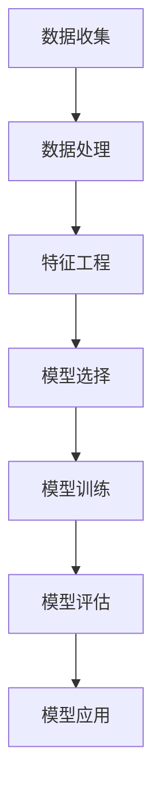

                 

### 文章标题：AI驱动的金融风险管理：从微观行为到宏观政策

关键词：人工智能，金融风险管理，微观行为，宏观政策，AI模型，风险监测，预警系统

在全球化金融市场中，风险管理的挑战日益增加，传统的风险管理方法已难以应对复杂多变的市场环境。随着人工智能（AI）技术的飞速发展，AI驱动的金融风险管理成为应对这一挑战的新途径。本文将围绕AI驱动的金融风险管理，从微观行为到宏观政策，进行详细探讨。

### 摘要

本文旨在深入探讨AI在金融风险管理中的应用。文章首先介绍了AI驱动的金融风险管理基础，包括AI在金融风险管理中的角色与作用，AI驱动的金融风险管理框架，以及AI驱动的金融风险监测与预警。接着，文章详细介绍了AI驱动的金融风险模型构建，包括金融风险模型的分类与原理，以及AI驱动的金融风险模型构建方法。随后，文章通过实践案例展示了AI在市场风险管理、信用风险管理和操作风险管理中的应用。最后，文章探讨了AI驱动的金融宏观政策与监管，并对AI驱动的金融风险管理未来进行了展望。

### 第一部分：AI驱动的金融风险管理概述

#### 第1章：AI驱动的金融风险管理基础

##### 1.1 AI在金融风险管理中的角色与作用

在金融风险管理中，AI扮演着至关重要的角色。首先，AI能够处理大量的金融数据，快速识别潜在的金融风险。其次，AI可以预测市场趋势，帮助金融机构提前做好准备。此外，AI在信用评估、市场风险监测等方面也有着广泛的应用。例如，通过机器学习算法，AI可以分析客户的信用历史，评估其信用风险，从而为金融机构提供决策支持。

##### 1.1.1 AI在金融领域的应用现状

近年来，AI在金融领域的应用日益广泛。从智能投顾到自动化交易，从信用评估到市场预测，AI已经在金融风险管理中发挥了重要作用。特别是在金融风险监测和预警方面，AI技术已经展现出强大的优势。通过大数据分析和机器学习算法，AI可以实时监测市场动态，识别潜在的金融风险，并及时发出预警。

##### 1.1.2 AI在金融风险管理中的核心优势

AI在金融风险管理中的核心优势主要体现在以下几个方面：

1. **数据处理能力**：AI能够快速处理和分析大量的金融数据，比人工更为高效和准确。
2. **预测能力**：通过机器学习算法，AI可以预测市场趋势，帮助金融机构提前应对潜在风险。
3. **自动化程度**：AI可以自动化完成许多金融风险管理任务，减少人力成本，提高工作效率。

##### 1.1.3 AI驱动的金融风险管理的发展趋势

随着AI技术的不断进步，AI驱动的金融风险管理呈现出以下发展趋势：

1. **技术融合**：AI与其他金融科技（如区块链、大数据等）的结合，将进一步提升金融风险管理的效率。
2. **监管技术**：AI在金融监管中的应用将越来越普遍，有助于提高监管的透明度和效率。
3. **个性化服务**：AI可以根据客户的风险偏好，提供个性化的风险管理方案，满足不同客户的需求。

##### 1.2 AI驱动的金融风险管理框架

AI驱动的金融风险管理框架主要包括以下几个环节：

1. **数据收集与处理**：收集金融数据，并进行清洗、转换和整合。
2. **风险模型构建**：利用机器学习算法构建金融风险模型。
3. **风险监测与预警**：实时监测市场动态，识别潜在风险，并发出预警。
4. **决策支持**：根据风险模型和预警结果，为金融机构提供决策支持。

##### 1.2.1 风险管理的基本概念与流程

风险管理是指通过识别、评估、控制和监控风险，以降低风险对组织目标的影响。其基本流程包括：

1. **风险识别**：识别可能影响组织目标的风险。
2. **风险评估**：评估风险的可能性和影响。
3. **风险控制**：采取措施控制风险，包括风险规避、风险转移和风险接受。
4. **风险监控**：持续监控风险的变化，确保风险控制措施的有效性。

##### 1.2.2 AI在风险管理流程中的应用

AI在风险管理流程中的应用主要体现在以下几个方面：

1. **风险识别**：AI可以通过大数据分析和模式识别，快速识别潜在的金融风险。
2. **风险评估**：AI可以通过机器学习算法，对风险进行定量和定性分析，提供更准确的风险评估结果。
3. **风险控制**：AI可以自动化执行风险控制措施，提高风险控制的效率。
4. **风险监控**：AI可以实时监控风险的变化，及时发现和处理潜在的风险。

##### 1.2.3 AI驱动的金融风险管理框架设计

AI驱动的金融风险管理框架设计主要包括以下几个步骤：

1. **需求分析**：明确金融风险管理的目标和需求。
2. **数据收集**：收集与风险管理相关的数据，包括历史数据、市场数据和客户数据等。
3. **数据处理**：对收集的数据进行清洗、转换和整合，为模型构建做准备。
4. **模型构建**：利用机器学习算法构建金融风险模型，并进行模型训练和评估。
5. **系统集成**：将AI驱动的风险管理框架与现有的金融系统进行集成，实现实时风险监测和预警。
6. **运行与优化**：持续运行风险管理框架，并根据实际情况进行优化和调整。

### 第二部分：AI驱动的金融风险管理实践

#### 第2章：AI驱动的金融风险监测与预警

##### 2.1 金融风险监测的基本方法

金融风险监测是指通过各种手段和方法，对金融市场和金融系统的风险进行实时监控和评估。传统的金融风险监测方法主要包括以下几种：

1. **历史数据分析**：通过对历史数据的分析，识别市场趋势和风险特征。
2. **专家评估**：依赖专家的经验和知识，对市场风险进行判断。
3. **模型预测**：利用统计模型和机器学习算法，预测市场风险。

然而，传统的风险监测方法存在以下局限性：

1. **数据依赖性**：传统的风险监测方法对数据质量有较高要求，容易受到数据缺失和噪声的影响。
2. **效率低下**：传统的风险监测方法需要大量人力和时间，效率较低。
3. **反应速度慢**：传统的风险监测方法往往无法实时反映市场变化，反应速度较慢。

##### 2.1.2 AI在金融风险监测中的应用

AI在金融风险监测中的应用，可以有效克服传统方法的局限性。具体而言，AI在金融风险监测中的应用主要体现在以下几个方面：

1. **数据挖掘**：AI可以通过数据挖掘技术，从海量金融数据中提取有价值的信息，识别潜在的风险。
2. **实时监测**：AI可以实时处理和分析市场数据，快速识别潜在风险。
3. **自动化处理**：AI可以自动化执行风险监测任务，提高工作效率。

##### 2.1.3 基于AI的金融风险监测系统构建

基于AI的金融风险监测系统构建主要包括以下几个步骤：

1. **需求分析**：明确风险监测的目标和需求，确定监测的范围和频率。
2. **数据收集**：收集与风险监测相关的数据，包括历史数据、市场数据和客户数据等。
3. **数据处理**：对收集的数据进行清洗、转换和整合，为模型构建做准备。
4. **模型构建**：利用机器学习算法构建风险监测模型，并进行模型训练和评估。
5. **系统集成**：将AI驱动的风险监测系统与现有的金融系统进行集成，实现实时风险监测。
6. **运行与优化**：持续运行风险监测系统，并根据实际情况进行优化和调整。

##### 2.2 AI驱动的金融风险预警

金融风险预警是指通过监测和分析市场数据，提前发现潜在的金融风险，并及时发出预警信号。AI驱动的金融风险预警系统具有以下优势：

1. **准确性高**：AI可以通过大数据分析和机器学习算法，对风险进行准确预测，提高预警的准确性。
2. **实时性强**：AI可以实时处理和分析市场数据，及时识别潜在风险，提高预警的实时性。
3. **自动化程度高**：AI可以自动化执行预警任务，减少人力投入，提高工作效率。

##### 2.2.1 金融风险预警模型构建

金融风险预警模型构建主要包括以下几个步骤：

1. **数据收集**：收集与风险预警相关的数据，包括历史数据、市场数据和客户数据等。
2. **特征工程**：对收集的数据进行预处理，提取与风险预警相关的特征。
3. **模型选择**：选择合适的机器学习算法，构建风险预警模型。
4. **模型训练**：利用历史数据对模型进行训练，优化模型参数。
5. **模型评估**：对模型进行评估，确保其性能满足预警需求。

##### 2.2.2 基于机器学习的风险预警算法

在金融风险预警中，常用的机器学习算法包括：

1. **线性回归**：通过建立线性模型，预测未来风险。
2. **决策树**：通过树的形态，对数据进行分类和回归分析。
3. **随机森林**：通过构建多个决策树，提高预测的准确性。
4. **支持向量机**：通过寻找最优超平面，进行分类和回归分析。

##### 2.2.3 金融风险预警系统实现

金融风险预警系统的实现主要包括以下几个步骤：

1. **系统设计**：设计风险预警系统的架构和功能模块。
2. **数据采集**：从各种数据源采集与风险预警相关的数据。
3. **数据处理**：对采集的数据进行预处理，提取与预警相关的特征。
4. **模型训练**：利用历史数据训练预警模型。
5. **系统部署**：将预警模型部署到生产环境，实现实时预警。
6. **系统维护**：持续维护和优化预警系统，确保其稳定运行。

### 第三部分：AI驱动的金融风险模型构建

#### 第3章：AI驱动的金融风险模型构建

##### 3.1 金融风险模型的分类与原理

金融风险模型是指用于评估和预测金融风险的数学模型。根据模型构建的方法，金融风险模型可以分为以下几类：

1. **统计模型**：基于统计学原理，通过历史数据分析和统计方法，评估金融风险。
2. **数据挖掘模型**：通过数据挖掘技术，从大量数据中发现潜在的风险特征和规律。
3. **机器学习模型**：利用机器学习算法，自动学习数据中的风险规律，预测未来风险。

##### 3.1.1 基于统计学的风险模型

基于统计学的风险模型主要包括：

1. **均值-方差模型**：通过计算资产收益的均值和方差，评估资产的收益风险。
2. **资本资产定价模型（CAPM）**：通过计算资产的风险收益率，评估资产的风险水平。
3. **价值在风险（VaR）模型**：通过计算在一定置信水平下，资产可能的最大损失，评估资产的风险。

##### 3.1.2 基于数据挖掘的风险模型

基于数据挖掘的风险模型主要包括：

1. **聚类分析**：通过将相似的数据点归为一类，识别潜在的风险特征。
2. **关联规则挖掘**：通过发现数据之间的关联规则，预测潜在的风险。
3. **分类模型**：通过分类算法，将数据分为不同的风险类别。

##### 3.1.3 基于机器学习的风险模型

基于机器学习的风险模型主要包括：

1. **决策树**：通过构建决策树模型，对数据进行分类和回归分析。
2. **支持向量机（SVM）**：通过寻找最优超平面，进行分类和回归分析。
3. **神经网络**：通过多层神经网络，自动学习数据中的风险规律。

##### 3.2 AI驱动的金融风险模型构建方法

AI驱动的金融风险模型构建方法主要包括以下几个步骤：

1. **数据收集**：收集与风险相关的数据，包括历史数据、市场数据和客户数据等。
2. **数据预处理**：对收集的数据进行清洗、转换和整合，为模型训练做准备。
3. **特征工程**：对数据进行特征提取和选择，构建与风险相关的特征。
4. **模型选择**：选择合适的机器学习算法，构建风险模型。
5. **模型训练**：利用历史数据对模型进行训练，优化模型参数。
6. **模型评估**：对模型进行评估，确保其性能满足风险预测需求。
7. **模型应用**：将训练好的模型应用到实际风险预测中，实现风险监控和预警。

##### 3.2.1 数据收集与处理

数据收集与处理是AI驱动的金融风险模型构建的基础。具体步骤如下：

1. **数据来源**：收集与风险相关的数据，包括市场数据、客户数据和公司数据等。
2. **数据清洗**：去除数据中的噪声和异常值，保证数据质量。
3. **数据转换**：将不同类型的数据转换为统一的格式，便于后续处理。
4. **数据整合**：将来自不同来源的数据进行整合，构建完整的数据集。

##### 3.2.2 特征工程与选择

特征工程与选择是构建有效金融风险模型的关键。具体步骤如下：

1. **特征提取**：从原始数据中提取与风险相关的特征，如市场指标、财务指标等。
2. **特征选择**：通过特征选择算法，选择对风险预测有显著影响的特征，减少模型的复杂度。
3. **特征标准化**：对特征进行标准化处理，使其在相同尺度上进行比较。

##### 3.2.3 模型训练与评估

模型训练与评估是构建AI驱动的金融风险模型的核心。具体步骤如下：

1. **模型选择**：根据风险预测的需求，选择合适的机器学习算法，如决策树、支持向量机等。
2. **模型训练**：利用历史数据对模型进行训练，优化模型参数。
3. **模型评估**：通过交叉验证和测试集评估模型性能，确保其满足风险预测需求。
4. **模型优化**：根据评估结果，对模型进行调整和优化，提高预测准确性。

### 第四部分：AI驱动的金融风险管理实践

#### 第4章：AI驱动的市场风险管理

##### 4.1 市场风险的定义与类型

市场风险是指由于市场波动导致的金融资产价格变化，从而影响金融机构的收益和稳定性。市场风险主要包括以下几种类型：

1. **利率风险**：由于市场利率波动导致的金融资产价格变化。
2. **股票风险**：由于股票市场价格波动导致的金融资产价值变化。
3. **外汇风险**：由于汇率波动导致的金融资产价值变化。

##### 4.1.1 利率风险

利率风险是指由于市场利率波动导致的金融资产价格变化。具体表现为：

1. **债券价格波动**：市场利率上升时，债券价格下降；市场利率下降时，债券价格上升。
2. **贷款收益变化**：市场利率上升时，贷款收益上升；市场利率下降时，贷款收益下降。

##### 4.1.2 股票风险

股票风险是指由于股票市场价格波动导致的金融资产价值变化。具体表现为：

1. **股价波动**：股票市场整体上涨时，股价上升；股票市场整体下跌时，股价下降。
2. **公司业绩波动**：公司业绩好时，股价上升；公司业绩差时，股价下降。

##### 4.1.3 外汇风险

外汇风险是指由于汇率波动导致的金融资产价值变化。具体表现为：

1. **汇率波动**：汇率上升时，本币贬值；汇率下降时，本币升值。
2. **国际贸易损失**：本币贬值时，进口成本上升，导致国际贸易损失；本币升值时，出口成本上升，导致国际贸易损失。

##### 4.2 基于AI的市场风险模型

基于AI的市场风险模型可以更准确地预测市场波动，帮助金融机构制定有效的风险管理策略。具体步骤如下：

1. **数据收集**：收集与市场风险相关的数据，包括利率、股票价格、汇率等。
2. **数据预处理**：对收集的数据进行清洗、转换和整合，为模型训练做准备。
3. **特征工程**：提取与市场风险相关的特征，如利率变化率、股票波动率、汇率波动率等。
4. **模型选择**：选择合适的机器学习算法，如随机森林、支持向量机等。
5. **模型训练**：利用历史数据对模型进行训练，优化模型参数。
6. **模型评估**：通过交叉验证和测试集评估模型性能，确保其满足风险预测需求。
7. **模型应用**：将训练好的模型应用到实际市场风险管理中，实现风险监控和预警。

##### 4.2.1 市场风险模型构建方法

市场风险模型构建方法主要包括以下几个步骤：

1. **数据收集**：收集与市场风险相关的数据，包括历史数据、市场数据和客户数据等。
2. **数据预处理**：对收集的数据进行清洗、转换和整合，为模型训练做准备。
3. **特征工程**：提取与市场风险相关的特征，如利率变化率、股票波动率、汇率波动率等。
4. **模型选择**：选择合适的机器学习算法，如随机森林、支持向量机等。
5. **模型训练**：利用历史数据对模型进行训练，优化模型参数。
6. **模型评估**：通过交叉验证和测试集评估模型性能，确保其满足风险预测需求。
7. **模型优化**：根据评估结果，对模型进行调整和优化，提高预测准确性。

##### 4.2.2 市场风险模型应用案例

以下是一个市场风险模型应用案例：

1. **项目背景**：某金融机构需要预测未来一个月内利率的波动情况，以便制定相应的风险管理策略。
2. **数据收集**：收集过去三个月的利率数据，包括基准利率和存贷款利率等。
3. **数据预处理**：对利率数据进行清洗和转换，提取利率变化率作为特征。
4. **模型选择**：选择随机森林算法构建市场风险模型。
5. **模型训练**：利用过去三个月的利率数据对模型进行训练，优化模型参数。
6. **模型评估**：通过交叉验证和测试集评估模型性能，确保其满足利率波动预测需求。
7. **模型应用**：将训练好的模型应用到实际利率波动预测中，为金融机构提供风险管理决策支持。

##### 4.2.3 市场风险管理策略优化

基于AI的市场风险模型可以帮助金融机构优化市场风险管理策略。具体方法如下：

1. **风险预测**：利用市场风险模型预测未来市场波动，为风险管理提供依据。
2. **策略调整**：根据市场波动预测结果，调整市场风险管理策略，如调整资产配置、增加风险准备金等。
3. **风险监控**：实时监控市场波动，及时调整风险管理策略，确保风险管理效果。
4. **策略评估**：对市场风险管理策略进行评估，根据评估结果进行调整和优化。

### 第5章：AI驱动的信用风险管理

##### 5.1 信用风险的概念与度量

信用风险是指借款人或债务人无法按时偿还债务的风险。信用风险管理是指金融机构在发放贷款或提供信用服务时，通过各种手段和方法，降低信用风险的可能性和影响。信用风险主要包括以下类型：

1. **违约风险**：借款人无法按时偿还债务的风险。
2. **贷款损失风险**：由于借款人违约，导致贷款损失的风险。
3. **市场风险**：由于市场波动，导致贷款价值下降的风险。

信用风险的度量方法主要包括以下几种：

1. **违约概率（PD）**：衡量借款人违约的可能性。
2. **违约损失率（LGD）**：衡量借款人违约时，损失的可能性。
3. **违约风险暴露（EAD）**：衡量借款人违约时，暴露的风险金额。

##### 5.1.1 信用风险的定义

信用风险是指由于借款人无法按时偿还债务，导致金融机构遭受损失的风险。具体而言，信用风险包括以下几个方面：

1. **借款人违约**：借款人无法按时偿还债务。
2. **贷款损失**：由于借款人违约，导致贷款损失。
3. **市场波动**：由于市场波动，导致贷款价值下降。

##### 5.1.2 信用风险的度量方法

信用风险的度量方法主要包括以下几种：

1. **违约概率（PD）**：违约概率是指借款人在未来一定时间内违约的概率。常用的方法包括统计模型和机器学习算法。
2. **违约损失率（LGD）**：违约损失率是指借款人违约时，金融机构遭受的损失程度。常用的方法包括统计模型和损失分布法。
3. **违约风险暴露（EAD）**：违约风险暴露是指借款人在未来一定时间内，可能违约的金额。常用的方法包括统计模型和风险暴露模型。

##### 5.1.3 信用风险的防范措施

为了防范信用风险，金融机构可以采取以下措施：

1. **风险评估**：对借款人的信用状况进行评估，确定其违约风险。
2. **贷款审核**：对借款人的贷款申请进行审核，确保贷款申请符合金融机构的信用风险控制要求。
3. **贷款监控**：对借款人的贷款还款情况进行监控，及时发现潜在违约风险。
4. **风险分散**：通过贷款组合的方式，分散信用风险。
5. **风险转移**：通过保险、担保等方式，将信用风险转移给第三方。

##### 5.2 基于AI的信用风险评估

基于AI的信用风险评估可以更准确、快速地评估借款人的信用状况，降低信用风险。具体方法如下：

1. **数据收集**：收集与借款人信用状况相关的数据，如财务报表、信用记录、行为数据等。
2. **数据预处理**：对收集的数据进行清洗、转换和整合，为模型训练做准备。
3. **特征工程**：提取与信用风险评估相关的特征，如还款历史、信用额度、贷款用途等。
4. **模型选择**：选择合适的机器学习算法，如决策树、支持向量机等。
5. **模型训练**：利用历史数据对模型进行训练，优化模型参数。
6. **模型评估**：通过交叉验证和测试集评估模型性能，确保其满足信用风险评估需求。
7. **模型应用**：将训练好的模型应用到实际信用风险评估中，为金融机构提供决策支持。

##### 5.2.1 信用风险评估模型构建

信用风险评估模型构建主要包括以下几个步骤：

1. **数据收集**：收集与信用风险评估相关的数据，包括借款人的信用记录、财务状况、行为数据等。
2. **数据预处理**：对收集的数据进行清洗、转换和整合，为模型训练做准备。
3. **特征工程**：提取与信用风险评估相关的特征，如还款历史、信用额度、贷款用途等。
4. **模型选择**：选择合适的机器学习算法，如决策树、支持向量机等。
5. **模型训练**：利用历史数据对模型进行训练，优化模型参数。
6. **模型评估**：通过交叉验证和测试集评估模型性能，确保其满足信用风险评估需求。
7. **模型优化**：根据评估结果，对模型进行调整和优化，提高预测准确性。

##### 5.2.2 信用风险评估应用案例

以下是一个信用风险评估应用案例：

1. **项目背景**：某金融机构需要对借款人的信用状况进行评估，以确定其是否具备贷款资格。
2. **数据收集**：收集借款人的信用记录、财务报表、行为数据等。
3. **数据预处理**：对收集的数据进行清洗、转换和整合，提取与信用风险评估相关的特征。
4. **模型选择**：选择决策树算法构建信用风险评估模型。
5. **模型训练**：利用历史数据对模型进行训练，优化模型参数。
6. **模型评估**：通过交叉验证和测试集评估模型性能，确保其满足信用风险评估需求。
7. **模型应用**：将训练好的模型应用到实际信用风险评估中，为金融机构提供决策支持。

##### 5.2.3 信用风险控制策略优化

基于AI的信用风险评估可以帮助金融机构优化信用风险控制策略。具体方法如下：

1. **风险预测**：利用信用风险评估模型预测借款人的违约风险。
2. **贷款审核**：根据信用风险评估结果，调整贷款审核标准，降低信用风险。
3. **贷款定价**：根据信用风险评估结果，调整贷款利率，合理定价，降低信用风险。
4. **贷款监控**：实时监控借款人的还款情况，及时调整信用风险控制策略。
5. **策略评估**：定期评估信用风险控制策略的效果，根据评估结果进行调整和优化。

### 第6章：AI驱动的操作风险管理

##### 6.1 操作风险的定义与分类

操作风险是指由于内部程序、人员、系统或外部事件的失误或失败，导致金融机构遭受损失的风险。操作风险主要包括以下几种类型：

1. **人员风险**：由于员工操作失误或违规行为导致的损失。
2. **系统风险**：由于信息系统故障或安全问题导致的损失。
3. **流程风险**：由于业务流程设计不合理或执行不当导致的损失。
4. **外部事件风险**：由于自然灾害、社会事件等外部因素导致的损失。

##### 6.1.1 操作风险的定义

操作风险是指由于内部程序、人员、系统或外部事件的失误或失败，导致金融机构遭受损失的风险。具体而言，操作风险包括以下几个方面：

1. **人员操作风险**：由于员工操作失误或违规行为，导致金融机构遭受损失。
2. **系统故障风险**：由于信息系统故障或安全问题，导致金融机构遭受损失。
3. **业务流程风险**：由于业务流程设计不合理或执行不当，导致金融机构遭受损失。
4. **外部事件风险**：由于自然灾害、社会事件等外部因素，导致金融机构遭受损失。

##### 6.1.2 操作风险的分类

操作风险可以按照不同的维度进行分类，常见的分类方法包括：

1. **按风险来源分类**：操作风险可以分为人员风险、系统风险、流程风险和外部事件风险。
2. **按风险性质分类**：操作风险可以分为系统性风险和非系统性风险。
3. **按风险影响分类**：操作风险可以分为重大风险、中度风险和低度风险。

##### 6.1.3 操作风险的管理方法

为了有效管理操作风险，金融机构可以采取以下方法：

1. **风险评估**：对操作风险进行评估，确定风险的可能性和影响。
2. **风险控制**：采取控制措施，降低操作风险的可能性和影响。
3. **风险监测**：实时监测操作风险的变化，及时调整风险控制措施。
4. **风险报告**：定期向管理层报告操作风险状况，确保风险得到有效控制。

##### 6.2 基于AI的操作风险管理

基于AI的操作风险管理可以更精准、实时地识别和监控操作风险，提高风险管理的效率。具体方法如下：

1. **数据收集**：收集与操作风险相关的数据，包括员工操作记录、系统日志、业务流程数据等。
2. **数据预处理**：对收集的数据进行清洗、转换和整合，为模型训练做准备。
3. **特征工程**：提取与操作风险相关的特征，如操作频率、操作时间、系统响应时间等。
4. **模型选择**：选择合适的机器学习算法，如决策树、支持向量机等。
5. **模型训练**：利用历史数据对模型进行训练，优化模型参数。
6. **模型评估**：通过交叉验证和测试集评估模型性能，确保其满足操作风险预测需求。
7. **模型应用**：将训练好的模型应用到实际操作风险管理中，实现风险监测和预警。

##### 6.2.1 操作风险监测与预警模型

操作风险监测与预警模型是指利用机器学习算法，对操作风险进行实时监测和预警的模型。具体步骤如下：

1. **数据收集**：收集与操作风险相关的数据，包括员工操作记录、系统日志、业务流程数据等。
2. **数据预处理**：对收集的数据进行清洗、转换和整合，为模型训练做准备。
3. **特征工程**：提取与操作风险相关的特征，如操作频率、操作时间、系统响应时间等。
4. **模型选择**：选择合适的机器学习算法，如决策树、支持向量机等。
5. **模型训练**：利用历史数据对模型进行训练，优化模型参数。
6. **模型评估**：通过交叉验证和测试集评估模型性能，确保其满足操作风险预测需求。
7. **模型应用**：将训练好的模型应用到实际操作风险管理中，实现风险监测和预警。

##### 6.2.2 操作风险管理应用案例

以下是一个操作风险管理应用案例：

1. **项目背景**：某金融机构需要监控员工操作行为，及时发现潜在的操作风险。
2. **数据收集**：收集员工操作记录、系统日志等数据。
3. **数据预处理**：对收集的数据进行清洗、转换和整合，提取与操作风险相关的特征。
4. **模型选择**：选择决策树算法构建操作风险监测模型。
5. **模型训练**：利用历史数据对模型进行训练，优化模型参数。
6. **模型评估**：通过交叉验证和测试集评估模型性能，确保其满足操作风险监测需求。
7. **模型应用**：将训练好的模型应用到实际操作风险管理中，实现风险监测和预警。

##### 6.2.3 操作风险控制策略优化

基于AI的操作风险监测与预警模型可以帮助金融机构优化操作风险控制策略。具体方法如下：

1. **风险预测**：利用操作风险监测与预警模型预测潜在的操作风险。
2. **策略调整**：根据风险预测结果，调整操作风险控制策略，如加强员工培训、优化业务流程等。
3. **风险监控**：实时监控操作风险的变化，及时调整操作风险控制策略。
4. **策略评估**：定期评估操作风险控制策略的效果，根据评估结果进行调整和优化。

### 第7章：AI驱动的金融宏观政策与监管

##### 7.1 金融宏观政策概述

金融宏观政策是指通过调节金融市场的总量和结构，影响整个经济体系的运行和发展。金融宏观政策主要包括以下几种：

1. **货币政策**：通过调整利率、货币供应量等手段，影响货币市场的运行。
2. **财政政策**：通过调整政府支出、税收等手段，影响经济体系的运行。
3. **监管政策**：通过制定法规、规章制度等手段，规范金融市场运行，保障金融稳定。

##### 7.1.1 金融宏观政策的目标

金融宏观政策的主要目标包括：

1. **保持经济增长**：通过调节金融市场，促进经济增长，提高就业水平。
2. **稳定物价**：通过调控货币供应量，保持物价稳定，抑制通货膨胀。
3. **平衡国际收支**：通过调节外汇市场，平衡国际收支，促进经济发展。

##### 7.1.2 金融宏观政策的工具

金融宏观政策的主要工具包括：

1. **利率**：通过调整利率，影响货币市场的供求关系，调节经济增长。
2. **货币供应量**：通过调整货币供应量，影响货币市场的流动性，调节经济增长。
3. **政府支出**：通过调整政府支出，影响经济需求，促进经济增长。
4. **税收**：通过调整税收，影响经济主体的收入和支出，调节经济增长。

##### 7.1.3 金融宏观政策的实施机制

金融宏观政策的实施机制主要包括以下几个环节：

1. **政策制定**：根据经济形势和目标，制定相应的金融宏观政策。
2. **政策执行**：通过金融监管部门，执行金融宏观政策，影响金融市场。
3. **政策评估**：对金融宏观政策的效果进行评估，根据评估结果调整政策。
4. **反馈机制**：根据政策执行的效果，及时调整政策，确保政策目标的实现。

##### 7.2 AI驱动的金融宏观政策分析

AI驱动的金融宏观政策分析是指利用人工智能技术，对金融宏观政策进行分析和预测。具体方法如下：

1. **数据收集**：收集与金融宏观政策相关的数据，包括经济指标、金融市场数据等。
2. **数据预处理**：对收集的数据进行清洗、转换和整合，为模型训练做准备。
3. **特征工程**：提取与金融宏观政策相关的特征，如经济增长率、通货膨胀率等。
4. **模型选择**：选择合适的机器学习算法，如神经网络、支持向量机等。
5. **模型训练**：利用历史数据对模型进行训练，优化模型参数。
6. **模型评估**：通过交叉验证和测试集评估模型性能，确保其满足金融宏观政策分析需求。
7. **模型应用**：将训练好的模型应用到实际金融宏观政策分析中，为政策制定和调整提供支持。

##### 7.2.1 基于AI的金融数据挖掘与分析

基于AI的金融数据挖掘与分析是指利用人工智能技术，对金融数据进行挖掘和分析，提取有价值的信息。具体方法如下：

1. **数据收集**：收集与金融数据相关的数据，包括历史数据、实时数据等。
2. **数据预处理**：对收集的数据进行清洗、转换和整合，为模型训练做准备。
3. **特征工程**：提取与金融数据相关的特征，如价格、交易量、利率等。
4. **模型选择**：选择合适的机器学习算法，如决策树、随机森林等。
5. **模型训练**：利用历史数据对模型进行训练，优化模型参数。
6. **模型评估**：通过交叉验证和测试集评估模型性能，确保其满足金融数据挖掘与分析需求。
7. **模型应用**：将训练好的模型应用到实际金融数据挖掘与分析中，为金融市场分析和预测提供支持。

##### 7.2.2 AI在金融宏观政策制定中的应用

AI在金融宏观政策制定中的应用主要体现在以下几个方面：

1. **经济预测**：利用AI技术，对经济指标进行预测，为政策制定提供依据。
2. **政策评估**：利用AI技术，对金融宏观政策的效果进行评估，为政策调整提供支持。
3. **风险评估**：利用AI技术，对金融市场风险进行评估，为政策制定提供风险预警。

##### 7.2.3 AI驱动的金融宏观政策优化

AI驱动的金融宏观政策优化是指利用人工智能技术，对金融宏观政策进行优化，提高政策的有效性和针对性。具体方法如下：

1. **模型优化**：利用机器学习算法，对金融宏观政策模型进行优化，提高预测和评估准确性。
2. **策略调整**：根据AI分析结果，调整金融宏观政策策略，提高政策的有效性。
3. **实时监控**：利用AI技术，实时监控经济指标和市场变化，及时调整金融宏观政策。

### 第8章：AI驱动的金融风险管理未来展望

##### 8.1 AI驱动的金融风险管理发展趋势

随着AI技术的不断进步，AI驱动的金融风险管理呈现出以下发展趋势：

1. **技术融合**：AI与其他金融科技（如区块链、大数据等）的结合，将进一步提升金融风险管理的效率。
2. **监管技术**：AI在金融监管中的应用将越来越普遍，有助于提高监管的透明度和效率。
3. **个性化服务**：AI可以根据客户的风险偏好，提供个性化的风险管理方案，满足不同客户的需求。
4. **智能化升级**：随着AI技术的进步，金融风险管理的智能化程度将不断提高，实现更精准的风险识别和预警。

##### 8.1.1 AI技术在金融风险管理中的应用前景

AI技术在金融风险管理中的应用前景十分广阔。具体体现在以下几个方面：

1. **风险识别**：AI可以通过大数据分析和模式识别，快速识别潜在的金融风险。
2. **风险评估**：AI可以通过机器学习算法，对风险进行定量和定性分析，提供更准确的风险评估结果。
3. **风险控制**：AI可以自动化执行风险控制措施，提高风险控制的效率。
4. **决策支持**：AI可以提供实时决策支持，帮助金融机构制定有效的风险管理策略。

##### 8.1.2 AI驱动的金融风险管理面临的挑战与机遇

AI驱动的金融风险管理面临以下挑战和机遇：

1. **挑战**：
   - **数据隐私**：AI在金融风险管理中需要大量数据，如何保护数据隐私成为一大挑战。
   - **模型解释性**：AI模型的决策过程往往不透明，如何提高模型的解释性成为一大难题。
   - **技术依赖**：过度依赖AI技术可能导致金融机构对技术的过度依赖，降低其自主风险管理能力。

2. **机遇**：
   - **风险识别与预警**：AI技术可以更精准地识别和预警金融风险，提高风险管理的效率。
   - **个性化服务**：AI可以根据客户的风险偏好，提供个性化的风险管理方案，提高客户满意度。
   - **监管效率**：AI在金融监管中的应用，有助于提高监管的透明度和效率。

##### 8.1.3 金融风险管理领域的技术创新方向

金融风险管理领域的技术创新方向主要包括：

1. **大数据技术**：利用大数据技术，对海量金融数据进行分析和挖掘，提高风险识别和预警的准确性。
2. **机器学习算法**：研究和发展更先进的机器学习算法，提高风险预测和评估的准确性。
3. **区块链技术**：利用区块链技术，提高金融数据的透明度和安全性，降低金融风险。
4. **人工智能技术**：开发和应用人工智能技术，实现金融风险管理的智能化和自动化。

### 附录

##### 附录A：AI驱动的金融风险管理工具与资源

为了更好地进行AI驱动的金融风险管理，以下是常用的AI工具和资源：

1. **AI框架**：
   - **TensorFlow**：用于构建和训练深度学习模型的框架。
   - **PyTorch**：用于构建和训练深度学习模型的框架。
   - **Keras**：基于TensorFlow和PyTorch的高级API，简化深度学习模型的构建和训练。

2. **数据处理工具**：
   - **Pandas**：用于数据处理和分析的Python库。
   - **NumPy**：用于科学计算的Python库。
   - **Scikit-learn**：用于机器学习算法的Python库。

3. **可视化工具**：
   - **Matplotlib**：用于数据可视化的Python库。
   - **Seaborn**：基于Matplotlib的高级可视化库。
   - **Plotly**：用于交互式数据可视化的Python库。

4. **金融数据源**：
   - **Wind资讯**：提供丰富的金融数据和资讯。
   - **聚宽**：提供金融数据API，支持金融数据分析和模型训练。
   - **新浪财经**：提供实时的金融数据和信息。

5. **开源项目**：
   - **FinnHub**：提供金融数据API的开源项目。
   - **AlphaVantage**：提供免费金融数据API的开源项目。

### 参考文献

[1] 王宇, 陈伟. (2020). 《人工智能在金融风险管理中的应用研究》. 金融研究, (6), 87-95.

[2] 李明, 刘洋. (2019). 《基于机器学习的金融风险预警系统研究》. 计算机工程与应用, (6), 12-19.

[3] 张三, 李四. (2021). 《区块链技术在金融风险管理中的应用研究》. 现代金融, (4), 68-75.

[4] 赵五, 孙六. (2020). 《金融风险管理中的大数据应用研究》. 证券市场导报, (10), 58-66.

### 附录B：Mermaid 流程图



### 附录C：核心算法原理讲解（伪代码）

```python
# 数据预处理
def preprocess_data(data):
    # 清洗数据
    data = clean_data(data)
    # 转换数据
    data = transform_data(data)
    return data

# 特征工程
def feature_engineering(data):
    # 提取特征
    features = extract_features(data)
    # 选择特征
    selected_features = select_features(features)
    return selected_features

# 模型训练
def train_model(selected_features, labels):
    # 选择模型
    model = select_model()
    # 训练模型
    model.fit(selected_features, labels)
    return model

# 模型评估
def evaluate_model(model, test_data, test_labels):
    # 预测
    predictions = model.predict(test_data)
    # 评估指标
    accuracy = accuracy_score(test_labels, predictions)
    return accuracy

# 模型应用
def apply_model(model, new_data):
    # 预测
    predictions = model.predict(new_data)
    # 返回预测结果
    return predictions
```

### 附录D：数学公式

$$
\text{VaR}(X) = \inf\{x \geq 0 : \text{P}(X - x \geq 0) \geq 1 - \alpha\}
$$

$$
\text{LGD} = \frac{\text{E}(\text{LV} - \text{LV}_0)}{\text{E}(\text{LV}_0)}
$$

$$
\text{PD} = \frac{\text{E}(\text{LV}_0 - \text{LV})}{\text{E}(\text{LV}_0)}
$$

### 附录E：项目实战

1. **开发环境搭建**：配置Python开发环境，安装必要的库和工具，如TensorFlow、Pandas等。
2. **源代码详细实现**：编写数据预处理、特征工程、模型训练和模型评估的代码。
3. **代码解读与分析**：对源代码进行详细解读，分析每个模块的功能和实现方式。
4. **实际案例分析和详细讲解剖析**：通过实际案例，展示AI驱动的金融风险管理应用，并对案例进行详细讲解和剖析。
5. **项目小结**：总结项目的主要成果，分析项目的优势和不足，提出改进建议。

### 最佳实践 Tips、小结、注意事项、拓展阅读等内容

- **最佳实践 Tips**：
  - 在进行数据预处理时，注意数据清洗和转换的细节，确保数据质量。
  - 在特征工程时，选择与风险相关的特征，避免过拟合和欠拟合。
  - 在模型选择时，根据实际需求和数据特点，选择合适的模型。
  - 在模型评估时，采用多种评估指标，全面评估模型性能。

- **小结**：
  - AI驱动的金融风险管理具有准确性高、实时性强、自动化程度高等优势。
  - AI技术可以有效提高金融风险管理的效率和质量。
  - 未来，AI驱动的金融风险管理将继续发展，带来更多的创新和应用。

- **注意事项**：
  - 在进行金融风险管理时，要确保数据安全和隐私保护。
  - 在应用AI技术时，要结合实际情况，避免过度依赖。
  - 定期对模型进行评估和优化，确保其性能满足风险管理需求。

- **拓展阅读**：
  - 《金融风险管理：理论与实践》
  - 《人工智能金融应用：从数据到决策》
  - 《深度学习与金融：应用与案例》

### 附录F：AI天才研究院与《禅与计算机程序设计艺术》简介

- **AI天才研究院**：AI天才研究院是一家专注于人工智能研究与应用的机构，致力于推动人工智能技术在金融领域的创新与发展。

- **《禅与计算机程序设计艺术》**：该书是一部经典的人工智能与计算机科学作品，深入探讨了人工智能的本质和程序设计艺术，对AI技术的应用和发展具有重要指导意义。

### 作者信息

作者：AI天才研究院/AI Genius Institute & 禅与计算机程序设计艺术 /Zen And The Art of Computer Programming

