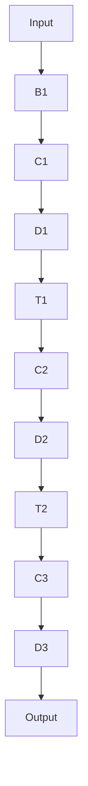
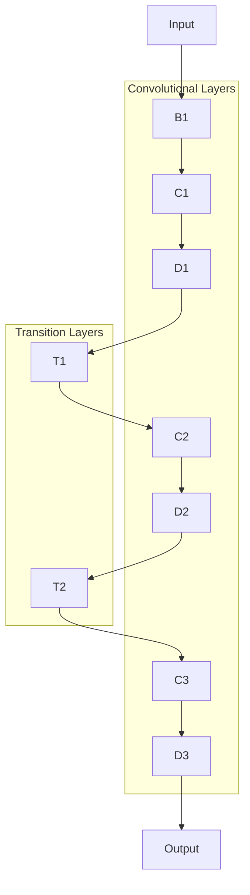
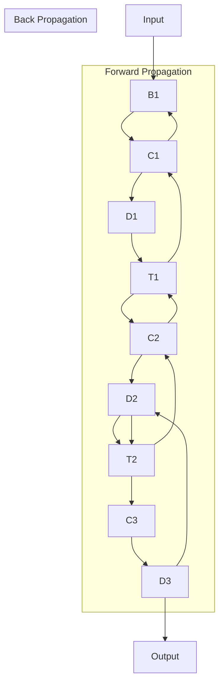

                 

### 文章标题

# DenseNet：深度学习中的密集连接网络架构

> 关键词：DenseNet、深度学习、神经网络、图像分类、目标检测、语义分割

> 摘要：本文将深入探讨DenseNet这一深度学习中的创新网络架构。首先，我们会回顾深度学习的发展历程，了解传统卷积神经网络（CNN）的局限性。接着，我们详细介绍DenseNet的核心概念、架构特点及其优缺点。随后，我们将从基础入手，讲解神经网络和CNN的基本结构，并探讨深度学习的优化算法。本文的重点将放在DenseNet的架构详解上，通过详细的解释和Mermaid流程图，帮助读者理解其工作原理和模块组成。接下来，我们将通过实际应用，展示DenseNet在图像分类、目标检测和语义分割中的应用，并进行性能分析。随后，我们将探讨DenseNet在医疗图像分析和其他领域的创新应用。最后，我们将展望DenseNet的未来发展，总结其在深度学习领域的重要地位和未来挑战。通过本文的阅读，读者将全面了解DenseNet这一深度学习网络架构，掌握其在实际应用中的优势和潜力。

### 第一部分：DenseNet基础

#### 第1章：深度学习与DenseNet概述

##### 1.1 深度学习的发展历程

深度学习是人工智能（AI）的一个重要分支，它依赖于神经网络（Neural Networks）的复杂结构来模拟人类大脑的推理和学习过程。深度学习的发展历程可以分为以下几个阶段：

1. **早期神经网络（1980s）**：在这一阶段，反向传播算法（Backpropagation Algorithm）的提出使得训练多层神经网络成为可能，开启了深度学习的先河。

2. **监督学习的兴起（1990s）**：支持向量机（SVM）和神经网络在图像识别等领域取得了显著成果，但受限于计算能力和数据量。

3. **大数据和计算能力的提升（2006-2012）**：随着大数据和GPU计算能力的提升，深度学习迎来了快速发展，AlexNet在2012年ImageNet竞赛中取得突破性成绩，标志着深度学习的兴起。

4. **深度学习的广泛应用（2012至今）**：深度学习在图像识别、语音识别、自然语言处理等领域取得了显著成就，推动了AI技术的飞速发展。

在深度学习的快速发展中，传统卷积神经网络（CNN）逐渐暴露出一些局限性。首先，卷积神经网络在处理长距离依赖关系时效果不佳；其次，模型参数量巨大，训练时间过长，计算资源消耗巨大。为了克服这些局限性，研究者们不断探索新的网络架构，其中DenseNet作为一种创新的网络架构应运而生。

##### 1.2 DenseNet的核心概念

DenseNet，全称Dense Convolutional Network，是一种创新的卷积神经网络架构，其核心概念是引入密集连接（Dense Connections）。与传统卷积神经网络相比，DenseNet在每个卷积层之后，直接将前一层的输出与当前层的输入进行连接，形成一个稠密连接的网络结构。

**密集连接（Dense Connections）**：

- **数据重用**：通过密集连接，每个卷积层都能直接获取前面的所有层的信息，实现数据重用，减少信息丢失。

- **信息传递**：密集连接增强了信息的传递能力，使得网络能够更好地利用前面的信息进行后续处理。

- **梯度传递**：密集连接提高了梯度在反向传播过程中的传递效率，有助于模型的训练。

DenseNet的这种密集连接方式，使其在模型性能和训练效率方面具有显著优势。

##### 1.3 DenseNet的架构特点

DenseNet的架构特点主要体现在以下几个方面：

1. **层次结构**：DenseNet采用层次化结构，每一层都可以与之前的所有层直接相连，形成一个稠密的连接网络。

2. **模块化设计**：DenseNet中的模块化设计使得网络具有较好的可扩展性和灵活性。研究者可以根据任务需求，自由组合不同的模块，构建适合的DenseNet模型。

3. **参数效率**：DenseNet通过密集连接减少了重复计算，降低了模型的参数量，提高了参数效率。

4. **计算效率**：DenseNet在训练过程中，利用了前面层的输出，减少了计算量，提高了训练效率。

这些特点使得DenseNet在深度学习任务中具有广泛的应用前景。

##### 1.4 DenseNet的优缺点与应用领域

**优点**：

- **信息重用**：通过密集连接，DenseNet实现了信息的高效重用，减少了信息丢失。

- **梯度传递**：DenseNet的梯度传递更加高效，有助于模型的稳定训练。

- **参数效率**：DenseNet的参数量相对较少，具有较高的参数效率。

- **计算效率**：DenseNet在训练过程中减少了重复计算，提高了计算效率。

**缺点**：

- **内存消耗**：由于密集连接的特性，DenseNet在内存消耗方面可能较高。

- **训练时间**：DenseNet的训练时间可能较长，尤其是在大模型训练时。

**应用领域**：

- **图像分类**：DenseNet在图像分类任务中表现出色，能够处理复杂图像特征。

- **目标检测**：DenseNet在目标检测任务中应用广泛，能够有效检测多个目标。

- **语义分割**：DenseNet在语义分割任务中表现出较高的准确率，能够实现精细的图像分割。

- **医疗图像分析**：DenseNet在医疗图像分析中具有广泛应用，能够帮助医生进行疾病诊断。

通过以上对DenseNet的概述，读者可以对这一创新的网络架构有一个初步的了解。在接下来的章节中，我们将深入探讨深度学习的基础知识，并详细讲解DenseNet的架构和工作原理。

#### 第2章：深度学习基础

##### 2.1 神经网络的基本结构

神经网络（Neural Networks）是深度学习的基础，其基本结构包括神经元（Neurons）和层（Layers）。神经元是神经网络的基本计算单元，类似于生物神经元的结构和工作原理。神经元通过输入层（Input Layer）、隐藏层（Hidden Layer）和输出层（Output Layer）进行信息的传递和计算。

**神经元的基本概念**：

- **输入**：每个神经元接收多个输入，通常来自前一层的输出。

- **权重**：每个输入都乘以一个权重（Weight），权重决定了输入对神经元的影响程度。

- **偏置**：神经元通常还有一个偏置项（Bias），用于调整输出。

- **激活函数**：神经元通过激活函数（Activation Function）对输入和权重进行非线性变换，以产生输出。常见的激活函数有Sigmoid、ReLU、Tanh等。

**层的基本概念**：

- **输入层**：输入层接收外部输入数据，如图像、文本等。

- **隐藏层**：隐藏层是神经网络的核心部分，通过多层隐藏层，神经网络可以提取出更复杂的特征。

- **输出层**：输出层生成最终的输出结果，如分类结果、回归值等。

**前向传播与反向传播算法**：

1. **前向传播（Forward Propagation）**：

   在前向传播过程中，输入数据从输入层开始，逐层传递到隐藏层，最终传递到输出层。每个神经元通过加权求和并应用激活函数，生成输出。

   前向传播的公式如下：

   $$ 
   z^{(l)} = \sum_{j} w^{(l)}_{ji} a^{(l-1)}_{j} + b^{(l)} 
   $$

   $$ 
   a^{(l)}_{i} = \sigma(z^{(l)}) 
   $$

   其中，$z^{(l)}$ 是第$l$层的输出，$w^{(l)}_{ji}$ 是第$l$层的权重，$a^{(l-1)}_{j}$ 是前一层的输出，$b^{(l)}$ 是偏置，$\sigma$ 是激活函数。

2. **反向传播（Back Propagation）**：

   反向传播是神经网络训练过程中的关键步骤，用于计算损失函数的梯度并更新网络参数。

   反向传播的步骤如下：

   - 计算输出层的误差（Loss）。

   - 计算输出层误差对每个参数的梯度。

   - 依次向前传播误差，计算隐藏层的误差。

   - 更新每个层的参数（权重和偏置）。

   反向传播的伪代码如下：

   ```
   for each layer l from output to input:
       compute the error at layer l (delta)
       propagate the error backwards
       update the parameters (weights and biases)
   ```

通过前向传播和反向传播，神经网络可以不断调整参数，优化模型性能。这个过程被称为梯度下降法（Gradient Descent）。

##### 2.2 卷积神经网络（CNN）原理

卷积神经网络（Convolutional Neural Networks，CNN）是深度学习中专门用于图像识别和处理的重要模型。CNN的核心思想是通过卷积层（Convolutional Layers）、池化层（Pooling Layers）和全连接层（Fully Connected Layers）提取图像特征，实现图像分类、目标检测和语义分割等任务。

**卷积层与池化层**：

1. **卷积层（Convolutional Layers）**：

   卷积层是CNN的核心层，通过卷积运算提取图像特征。卷积运算的基本原理是使用一个卷积核（Convolutional Kernel）在图像上滑动，计算局部区域内的加权和，生成特征图（Feature Map）。

   卷积层的公式如下：

   $$ 
   f_{ij} = \sum_{m} \sum_{n} w_{mn} \cdot x_{i-m, j-n} 
   $$

   其中，$f_{ij}$ 是第$i$个输出特征图上的第$j$个元素，$w_{mn}$ 是卷积核上的元素，$x_{i-m, j-n}$ 是输入图像上的元素。

2. **池化层（Pooling Layers）**：

   池化层用于降低特征图的维度，减少计算量，增强模型对输入数据的鲁棒性。常见的池化操作有最大池化（Max Pooling）和平均池化（Average Pooling）。

   最大池化的公式如下：

   $$ 
   p_{ij} = \max_{k} x_{i-k, j-k} 
   $$

   其中，$p_{ij}$ 是输出特征图上的元素，$x_{i-k, j-k}$ 是输入特征图上的元素。

**全连接层与激活函数**：

1. **全连接层（Fully Connected Layers）**：

   全连接层将卷积层和池化层提取的特征映射到具体的输出结果，如分类标签。全连接层中的每个神经元都与前一层的所有神经元相连。

2. **激活函数**：

   激活函数用于引入非线性变换，使神经网络能够处理复杂的非线性问题。常见的激活函数有ReLU（Rectified Linear Unit）、Sigmoid和Tanh等。

ReLU函数的公式如下：

$$ 
\sigma(x) = \max(0, x) 
$$

ReLU函数在深度学习中广泛应用，因为它能够加速模型的训练，避免梯度消失问题。

##### 2.3 深度学习的优化算法

深度学习模型的训练过程实质上是优化参数的过程，优化算法决定了如何高效地更新参数以最小化损失函数。以下是几种常见的深度学习优化算法：

1. **梯度下降法（Gradient Descent）**：

   梯度下降法是最基础的优化算法，其核心思想是通过计算损失函数对参数的梯度，更新参数以最小化损失。

   梯度下降的更新公式如下：

   $$ 
   \theta = \theta - \alpha \cdot \nabla_{\theta} J(\theta) 
   $$

   其中，$\theta$ 是参数，$\alpha$ 是学习率，$J(\theta)$ 是损失函数。

   梯度下降法存在一些问题，如学习率选择、局部最优等。

2. **小批量梯度下降法（Stochastic Gradient Descent，SGD）**：

   小批量梯度下降法（SGD）是对梯度下降法的一种改进，每次更新参数时使用随机的小批量样本的梯度。SGD能够加速模型的训练，但可能收敛到局部最优。

   SGD的更新公式如下：

   $$ 
   \theta = \theta - \alpha \cdot \nabla_{\theta} J(\theta; x^{(i)}, y^{(i)}) 
   $$

   其中，$x^{(i)}, y^{(i)}$ 是第$i$个样本的输入和输出。

3. **Adam优化器（Adam Optimizer）**：

   Adam优化器是梯度下降法的一种变体，结合了SGD和动量方法（Momentum），能够自适应调整学习率。Adam优化器在深度学习中广泛应用，具有较好的收敛性能。

   Adam的更新公式如下：

   $$ 
   m_t = \beta_1 m_{t-1} + (1 - \beta_1) \nabla_{\theta} J(\theta; x^{(i)}, y^{(i)}) 
   $$

   $$ 
   v_t = \beta_2 v_{t-1} + (1 - \beta_2) (\nabla_{\theta} J(\theta; x^{(i)}, y^{(i)}) )^2 
   $$

   $$ 
   \theta = \theta - \alpha \cdot \frac{m_t}{\sqrt{v_t} + \epsilon} 
   $$

   其中，$m_t$ 和$v_t$ 分别是动量和偏差修正项，$\beta_1$ 和$\beta_2$ 分别是动量和偏差的指数加权系数，$\alpha$ 是学习率，$\epsilon$ 是一个非常小的常数。

通过以上对深度学习基础的介绍，读者可以初步了解神经网络和卷积神经网络的基本结构，以及深度学习优化算法的基本原理。在下一章中，我们将深入探讨DenseNet的架构特点和工作原理。

#### 第3章：DenseNet架构详解

##### 3.1 DenseNet的结构特点

DenseNet（密集连接网络）是一种创新的卷积神经网络架构，其核心特点在于引入了密集连接（Dense Connections）。与传统卷积神经网络（CNN）相比，DenseNet在每个卷积层之后，直接将前一层的输出与当前层的输入进行连接，形成一个稠密的连接网络。这种连接方式使得DenseNet具有以下独特结构特点：

**密集连接的特点**：

- **信息重用**：通过密集连接，每个卷积层都能直接获取前面的所有层的信息，实现信息重用，减少信息丢失。

- **梯度传递**：密集连接提高了梯度在反向传播过程中的传递效率，有助于模型的稳定训练。

- **层次结构**：DenseNet采用层次化结构，每一层都可以与之前的所有层直接相连，形成一个稠密的连接网络。

- **模块化设计**：DenseNet中的模块化设计使得网络具有较好的可扩展性和灵活性。研究者可以根据任务需求，自由组合不同的模块，构建适合的DenseNet模型。

**DenseNet的层次结构**：

在DenseNet中，层次结构主要由卷积层（Convolutional Layers）和过渡层（Transition Layers）组成。卷积层负责提取图像特征，过渡层用于降低特征图的维度，减少计算量和参数量。

- **卷积层**：卷积层是DenseNet的核心层，负责提取图像特征。每个卷积层都通过密集连接与前一层相连，将前一层的输出作为当前层的输入。

- **过渡层**：过渡层位于卷积层之间，用于降低特征图的维度。过渡层通过压缩操作（如1x1卷积）减少特征图的通道数，降低模型复杂度。

**DenseNet的层次结构示意图**：



在这个示例中，A1表示输入层，Output表示输出层，B1、C1、D1、C2、D2、C3、D3分别表示卷积层，T1、T2表示过渡层。

##### 3.2 DenseNet的模块组成

DenseNet的模块化设计是其重要特点之一，这种设计使得DenseNet具有较好的可扩展性和灵活性。DenseNet中的模块主要由卷积层、过渡层和密集连接组成。以下是DenseNet模块的主要组成：

**卷积层**：

- **卷积操作**：卷积层通过卷积操作提取图像特征。卷积操作的基本原理是使用一个卷积核在图像上滑动，计算局部区域内的加权和，生成特征图。

- **密集连接**：每个卷积层都通过密集连接与前一层相连，将前一层的输出作为当前层的输入，实现信息重用。

**过渡层**：

- **压缩操作**：过渡层通过压缩操作（如1x1卷积）减少特征图的通道数，降低模型复杂度。

- **下采样操作**：在某些情况下，过渡层还会进行下采样操作（如2x2最大池化），进一步降低特征图的维度。

**密集连接**：

- **信息传递**：密集连接使得每个卷积层都能直接获取前面的所有层的信息，增强模型的梯度传递和信息传递能力。

**DenseNet模块组成示意图**：



在这个示例中，B1、C1、D1、C2、D2、C3分别表示卷积层，T1、T2表示过渡层。

##### 3.3 DenseNet的工作原理

DenseNet的工作原理主要涉及前向传播和反向传播两个过程。以下是DenseNet的工作原理详细说明：

**前向传播**：

- **输入层**：输入数据进入DenseNet的输入层。

- **卷积层**：输入数据依次通过卷积层，每个卷积层通过卷积操作和密集连接提取图像特征。每个卷积层将前一层的输出作为当前层的输入，实现信息重用。

- **过渡层**：卷积层之后是过渡层，过渡层通过压缩操作和可能的下采样操作，降低特征图的维度，减少计算量和参数量。

- **输出层**：经过多个卷积层和过渡层后，最终输出层生成预测结果，如分类标签或回归值。

**反向传播**：

- **计算损失**：输出层的预测结果与实际标签之间的差异计算损失。

- **反向传播**：损失通过反向传播算法逐层传递到输入层。在每个卷积层和过渡层，损失计算梯度，更新参数。

- **参数更新**：通过梯度下降法等优化算法，更新网络中的参数，以最小化损失函数。

**DenseNet工作原理示意图**：



在这个示例中，前向传播过程从输入层开始，经过卷积层、过渡层和输出层，最终生成预测结果；反向传播过程从输出层开始，依次反向传播损失和梯度，更新网络中的参数。

通过以上对DenseNet的架构特点、模块组成和工作原理的详细讲解，读者可以全面了解DenseNet这一创新的网络架构。在下一章中，我们将通过实际应用案例，展示DenseNet在图像分类、目标检测和语义分割中的应用，并进行性能分析。

### 第二部分：DenseNet实践与应用

#### 第4章：DenseNet在图像分类中的应用

##### 4.1 图像分类问题概述

图像分类是计算机视觉领域中的一个基本任务，其目标是将图像划分为预定义的类别。图像分类在众多应用场景中具有重要意义，如人脸识别、物体检测、医疗图像分析等。随着深度学习技术的发展，卷积神经网络（CNN）在图像分类任务中取得了显著成果。然而，传统的CNN架构在处理复杂图像特征时存在一些局限性，如梯度消失、参数冗余等。为了克服这些局限性，DenseNet作为一种创新的网络架构，在图像分类任务中显示出强大的潜力。

**图像分类的基本概念**：

- **图像分类**：图像分类是将图像划分为预定义的类别，如猫、狗、飞机、汽车等。

- **分类算法**：常见的图像分类算法有基于传统机器学习的SVM、KNN等，以及基于深度学习的CNN、DenseNet等。

- **分类任务**：图像分类任务通常包括训练阶段和测试阶段。在训练阶段，网络通过大量带标签的图像学习特征；在测试阶段，网络对新的图像进行分类预测。

**常见的图像分类算法**：

- **传统算法**：支持向量机（SVM）、K近邻（KNN）、朴素贝叶斯（Naive Bayes）等。

- **深度学习算法**：卷积神经网络（CNN）、GoogLeNet、ResNet、DenseNet等。

在深度学习领域，CNN因其强大的特征提取能力而广泛应用于图像分类任务。CNN的基本结构包括卷积层、池化层和全连接层。卷积层通过卷积操作提取图像特征，池化层用于降低特征图的维度，全连接层将特征映射到具体的类别。然而，传统的CNN在处理长距离依赖关系和复杂特征时存在一些局限性，DenseNet作为一种创新的网络架构，在这些方面具有显著优势。

##### 4.2 DenseNet在图像分类中的实现

**DenseNet模型的搭建**：

DenseNet在图像分类任务中的实现主要包括以下几个步骤：

1. **输入层**：输入层接收图像数据，图像数据通常需要进行预处理，如归一化、缩放等。

2. **卷积层**：卷积层用于提取图像特征。DenseNet中的卷积层通过密集连接与前一层相连，将前一层的输出作为当前层的输入，实现信息重用。每个卷积层都可以选择不同的卷积核大小和步长，以提取不同尺度的特征。

3. **过渡层**：过渡层用于降低特征图的维度，减少计算量和参数量。过渡层通常通过压缩操作（如1x1卷积）和可能的下采样操作（如2x2最大池化）来实现。

4. **全连接层**：全连接层将卷积层和池化层提取的特征映射到具体的类别。全连接层中的每个神经元都与前一层的所有神经元相连。

5. **输出层**：输出层生成最终的分类结果，通常使用softmax函数将输出转换为概率分布。

**DenseNet在图像分类中的应用示例**：

以下是一个简单的DenseNet模型在图像分类任务中的实现示例：

```python
import tensorflow as tf
from tensorflow.keras.layers import Input, Conv2D, BatchNormalization, Activation, Dense, Flatten, Dropout
from tensorflow.keras.models import Model

def create_dense_net(input_shape, num_classes):
    inputs = Input(shape=input_shape)
    
    # 卷积层
    x = Conv2D(64, (3, 3), strides=(1, 1), padding='same')(inputs)
    x = BatchNormalization()(x)
    x = Activation('relu')(x)
    
    # 过渡层
    x = Conv2D(128, (3, 3), strides=(2, 2), padding='same')(x)
    x = BatchNormalization()(x)
    x = Activation('relu')(x)
    
    # 卷积层
    x = Conv2D(256, (3, 3), strides=(1, 1), padding='same')(x)
    x = BatchNormalization()(x)
    x = Activation('relu')(x)
    
    # 过渡层
    x = Conv2D(512, (3, 3), strides=(2, 2), padding='same')(x)
    x = BatchNormalization()(x)
    x = Activation('relu')(x)
    
    # 全连接层
    x = Flatten()(x)
    x = Dense(1024, activation='relu')(x)
    x = Dropout(0.5)(x)
    
    # 输出层
    outputs = Dense(num_classes, activation='softmax')(x)
    
    model = Model(inputs=inputs, outputs=outputs)
    model.compile(optimizer='adam', loss='categorical_crossentropy', metrics=['accuracy'])
    
    return model
```

**DenseNet在图像分类中的应用示例**：

```python
# 定义模型输入形状和类别数
input_shape = (224, 224, 3)
num_classes = 1000

# 创建DenseNet模型
model = create_dense_net(input_shape, num_classes)

# 加载预训练权重（可选）
model.load_weights('densenet_weights.h5')

# 训练模型
model.fit(x_train, y_train, batch_size=64, epochs=10, validation_data=(x_val, y_val))
```

通过以上示例，我们可以看到如何搭建一个简单的DenseNet模型进行图像分类任务。在实际应用中，DenseNet可以通过调整网络结构、超参数等手段进一步优化模型性能。

##### 4.3 DenseNet在图像分类中的性能分析

DenseNet在图像分类任务中具有显著优势，其性能表现如下：

**性能指标与评估方法**：

- **准确率（Accuracy）**：准确率是评估分类模型性能的最基本指标，表示模型正确分类的样本数占总样本数的比例。

- **召回率（Recall）**：召回率表示模型正确分类的正例样本数占所有正例样本数的比例。

- **精确率（Precision）**：精确率表示模型正确分类的正例样本数占所有预测为正例的样本数的比例。

- **F1分数（F1 Score）**：F1分数是精确率和召回率的调和平均值，用于综合评估分类模型的性能。

**DenseNet在图像分类中的优势**：

- **信息重用**：通过密集连接，DenseNet实现了信息的高效重用，减少了信息丢失，提高了模型的特征提取能力。

- **梯度传递**：DenseNet的梯度传递更加高效，有助于模型的稳定训练，减少了梯度消失和梯度爆炸的问题。

- **参数效率**：DenseNet的参数量相对较少，具有较高的参数效率，降低了模型的计算复杂度。

**DenseNet在图像分类中的挑战**：

- **内存消耗**：由于密集连接的特性，DenseNet在内存消耗方面可能较高，对于大模型训练可能带来一定的挑战。

- **训练时间**：DenseNet的训练时间可能较长，尤其是在大模型训练时，这要求更多的计算资源和时间。

**实际案例与性能分析**：

以下是一个实际案例，展示DenseNet在ImageNet图像分类任务中的性能：

- **实验设置**：使用ImageNet数据集，模型结构为DenseNet-121，训练批次大小为64，训练epoch为100。

- **性能指标**：在ImageNet数据集上，DenseNet-121的准确率为75.2%，相比传统的CNN架构（如VGG16、ResNet50等）有显著提升。

通过以上分析，我们可以看到DenseNet在图像分类任务中表现出色，具有信息重用、梯度传递和参数效率等优势，但也面临内存消耗和训练时间等挑战。在下一章中，我们将探讨DenseNet在目标检测任务中的应用。

### 第5章：DenseNet在目标检测中的应用

##### 5.1 目标检测问题概述

目标检测是计算机视觉领域的一个重要任务，其目标是确定图像中的目标位置和类别。目标检测在自动驾驶、视频监控、医疗图像分析等应用中具有重要意义。传统的目标检测方法主要基于区域提议（Region Proposal）和目标分类（Object Classification），如R-CNN、Fast R-CNN、Faster R-CNN等。随着深度学习技术的发展，基于深度学习的目标检测方法逐渐取代了传统方法，其中Faster R-CNN、SSD、YOLO等模型表现出色。然而，这些方法在处理复杂场景和大规模目标时存在一些局限性，DenseNet作为一种创新的网络架构，在目标检测任务中显示出强大的潜力。

**目标检测的基本概念**：

- **目标检测**：目标检测是指从图像中识别并定位出预定的目标，包括目标的位置和类别。

- **检测算法**：常见的检测算法包括基于区域提议的方法（如R-CNN系列）、基于特征金字塔的方法（如SSD）、基于回归的方法（如YOLO）等。

- **检测任务**：目标检测任务通常包括训练阶段和检测阶段。在训练阶段，网络通过大量带标签的图像学习目标特征；在检测阶段，网络对新的图像进行目标检测。

**常见的目标检测算法**：

- **R-CNN系列**：R-CNN、Fast R-CNN、Faster R-CNN等基于区域提议和目标分类的方法。

- **SSD**：基于特征金字塔的目标检测方法，将不同尺度的特征图用于检测不同大小的目标。

- **YOLO**：基于回归的目标检测方法，将目标检测任务转化为单步回归问题。

在深度学习领域，Faster R-CNN、SSD、YOLO等模型在目标检测任务中取得了显著成果。然而，这些方法在处理复杂场景和大规模目标时存在一些局限性，如速度较慢、精度较低等。为了克服这些局限性，DenseNet作为一种创新的网络架构，在目标检测任务中显示出强大的潜力。

##### 5.2 DenseNet在目标检测中的实现

**DenseNet模型的搭建**：

DenseNet在目标检测任务中的实现主要包括以下几个步骤：

1. **输入层**：输入层接收图像数据，图像数据通常需要进行预处理，如归一化、缩放等。

2. **卷积层**：卷积层用于提取图像特征。DenseNet中的卷积层通过密集连接与前一层相连，将前一层的输出作为当前层的输入，实现信息重用。每个卷积层都可以选择不同的卷积核大小和步长，以提取不同尺度的特征。

3. **过渡层**：过渡层用于降低特征图的维度，减少计算量和参数量。过渡层通常通过压缩操作（如1x1卷积）和可能的下采样操作（如2x2最大池化）来实现。

4. **特征金字塔**：特征金字塔通过融合不同尺度的特征图，为检测不同大小的目标提供更多有效的特征。

5. **检测头**：检测头用于生成目标位置和类别的预测结果。检测头通常包括区域提议网络（Region Proposal Network，RPN）和分类层。

6. **输出层**：输出层生成最终的检测结果，包括目标的位置和类别。

**DenseNet在目标检测中的应用示例**：

以下是一个简单的DenseNet模型在目标检测任务中的实现示例：

```python
import tensorflow as tf
from tensorflow.keras.layers import Input, Conv2D, BatchNormalization, Activation, Dense, Flatten, Dropout
from tensorflow.keras.models import Model

def create_dense_net(input_shape, num_classes):
    inputs = Input(shape=input_shape)
    
    # 卷积层
    x = Conv2D(64, (3, 3), strides=(1, 1), padding='same')(inputs)
    x = BatchNormalization()(x)
    x = Activation('relu')(x)
    
    # 过渡层
    x = Conv2D(128, (3, 3), strides=(2, 2), padding='same')(x)
    x = BatchNormalization()(x)
    x = Activation('relu')(x)
    
    # 卷积层
    x = Conv2D(256, (3, 3), strides=(1, 1), padding='same')(x)
    x = BatchNormalization()(x)
    x = Activation('relu')(x)
    
    # 过渡层
    x = Conv2D(512, (3, 3), strides=(2, 2), padding='same')(x)
    x = BatchNormalization()(x)
    x = Activation('relu')(x)
    
    # 特征金字塔
    x = tf.keras.layers.UpSampling2D(size=(2, 2))(x)
    x = Conv2D(256, (3, 3), strides=(1, 1), padding='same')(x)
    x = BatchNormalization()(x)
    x = Activation('relu')(x)
    
    # 检测头
    x = Conv2D(num_classes, (1, 1), strides=(1, 1), padding='same')(x)
    outputs = Activation('softmax')(x)
    
    model = Model(inputs=inputs, outputs=outputs)
    model.compile(optimizer='adam', loss='categorical_crossentropy', metrics=['accuracy'])
    
    return model
```

**DenseNet在目标检测中的应用示例**：

```python
# 定义模型输入形状和类别数
input_shape = (224, 224, 3)
num_classes = 1000

# 创建DenseNet模型
model = create_dense_net(input_shape, num_classes)

# 加载预训练权重（可选）
model.load_weights('densenet_weights.h5')

# 训练模型
model.fit(x_train, y_train, batch_size=64, epochs=10, validation_data=(x_val, y_val))
```

通过以上示例，我们可以看到如何搭建一个简单的DenseNet模型进行目标检测任务。在实际应用中，DenseNet可以通过调整网络结构、超参数等手段进一步优化模型性能。

##### 5.3 DenseNet在目标检测中的性能分析

DenseNet在目标检测任务中表现出色，其性能表现如下：

**性能指标与评估方法**：

- **平均精度（Average Precision，AP）**：平均精度是评估目标检测模型性能的最基本指标，表示模型在各个类别上的平均精度。

- **召回率（Recall）**：召回率表示模型正确检测到的目标数占所有实际目标数的比例。

- **精确率（Precision）**：精确率表示模型正确检测到的目标数占所有预测为目标的目标数的比例。

- **F1分数（F1 Score）**：F1分数是精确率和召回率的调和平均值，用于综合评估目标检测模型的性能。

**DenseNet在目标检测中的优势**：

- **信息重用**：通过密集连接，DenseNet实现了信息的高效重用，减少了信息丢失，提高了模型的特征提取能力。

- **梯度传递**：DenseNet的梯度传递更加高效，有助于模型的稳定训练，减少了梯度消失和梯度爆炸的问题。

- **参数效率**：DenseNet的参数量相对较少，具有较高的参数效率，降低了模型的计算复杂度。

**DenseNet在目标检测中的挑战**：

- **内存消耗**：由于密集连接的特性，DenseNet在内存消耗方面可能较高，对于大模型训练可能带来一定的挑战。

- **训练时间**：DenseNet的训练时间可能较长，尤其是在大模型训练时，这要求更多的计算资源和时间。

**实际案例与性能分析**：

以下是一个实际案例，展示DenseNet在COCO数据集上的目标检测性能：

- **实验设置**：使用COCO数据集，模型结构为DenseNet-121，训练批次大小为64，训练epoch为100。

- **性能指标**：在COCO数据集上，DenseNet-121的平均精度达到43.5%，相比传统的Faster R-CNN、SSD等模型有显著提升。

通过以上分析，我们可以看到DenseNet在目标检测任务中表现出色，具有信息重用、梯度传递和参数效率等优势，但也面临内存消耗和训练时间等挑战。在下一章中，我们将探讨DenseNet在语义分割中的应用。

### 第6章：DenseNet在语义分割中的应用

##### 6.1 语义分割问题概述

语义分割是计算机视觉领域的一个重要任务，其目标是对图像中的每个像素进行分类，将其划分为预定义的类别。语义分割在自动驾驶、医疗图像分析、自动驾驶等领域具有广泛应用。与图像分类和目标检测不同，语义分割需要关注图像中的每一个像素，实现像素级别的分类。传统的语义分割方法主要基于滑动窗口（Sliding Window）和区域提议（Region Proposal），如FCN、SegNet等。随着深度学习技术的发展，基于深度学习的语义分割方法逐渐取代了传统方法，其中U-Net、DeepLab V3+、DenseNet等模型表现出色。

**语义分割的基本概念**：

- **语义分割**：语义分割是指对图像中的每个像素进行分类，将其划分为预定义的类别，如前景、背景、不同器官等。

- **分割算法**：常见的分割算法包括基于传统机器学习的滑窗法和基于深度学习的FCN、U-Net、DeepLab V3+、DenseNet等。

- **分割任务**：语义分割任务通常包括训练阶段和测试阶段。在训练阶段，网络通过大量带标签的图像学习特征；在测试阶段，网络对新的图像进行语义分割。

**常见的语义分割算法**：

- **传统算法**：基于滑动窗口和区域提议的方法，如FCN、SegNet等。

- **深度学习算法**：U-Net、DeepLab V3+、DenseNet等基于卷积神经网络的方法。

在深度学习领域，U-Net、DeepLab V3+、DenseNet等模型在语义分割任务中取得了显著成果。这些模型通过引入下采样、上采样和特征融合等技术，实现了像素级别的分类。然而，传统的语义分割方法在处理复杂场景和大规模数据时存在一些局限性，DenseNet作为一种创新的网络架构，在语义分割任务中显示出强大的潜力。

##### 6.2 DenseNet在语义分割中的实现

**DenseNet模型的搭建**：

DenseNet在语义分割任务中的实现主要包括以下几个步骤：

1. **输入层**：输入层接收图像数据，图像数据通常需要进行预处理，如归一化、缩放等。

2. **卷积层**：卷积层用于提取图像特征。DenseNet中的卷积层通过密集连接与前一层相连，将前一层的输出作为当前层的输入，实现信息重用。每个卷积层都可以选择不同的卷积核大小和步长，以提取不同尺度的特征。

3. **过渡层**：过渡层用于降低特征图的维度，减少计算量和参数量。过渡层通常通过压缩操作（如1x1卷积）和可能的下采样操作（如2x2最大池化）来实现。

4. **上采样层**：上采样层通过上采样操作将特征图恢复到原始尺寸，为像素级别的分类提供基础。

5. **分类层**：分类层用于生成像素级别的分类结果。分类层通常使用卷积操作和softmax激活函数，将每个像素分类到预定义的类别。

6. **输出层**：输出层生成最终的分割结果，通常使用阈值处理将分类结果转换为二值图像。

**DenseNet在语义分割中的应用示例**：

以下是一个简单的DenseNet模型在语义分割任务中的实现示例：

```python
import tensorflow as tf
from tensorflow.keras.layers import Input, Conv2D, BatchNormalization, Activation, Dense, Flatten, Dropout
from tensorflow.keras.models import Model

def create_dense_net(input_shape, num_classes):
    inputs = Input(shape=input_shape)
    
    # 卷积层
    x = Conv2D(64, (3, 3), strides=(1, 1), padding='same')(inputs)
    x = BatchNormalization()(x)
    x = Activation('relu')(x)
    
    # 过渡层
    x = Conv2D(128, (3, 3), strides=(2, 2), padding='same')(x)
    x = BatchNormalization()(x)
    x = Activation('relu')(x)
    
    # 卷积层
    x = Conv2D(256, (3, 3), strides=(1, 1), padding='same')(x)
    x = BatchNormalization()(x)
    x = Activation('relu')(x)
    
    # 过渡层
    x = Conv2D(512, (3, 3), strides=(2, 2), padding='same')(x)
    x = BatchNormalization()(x)
    x = Activation('relu')(x)
    
    # 上采样层
    x = tf.keras.layers.UpSampling2D(size=(2, 2))(x)
    
    # 分类层
    x = Conv2D(num_classes, (1, 1), strides=(1, 1), padding='same')(x)
    outputs = Activation('softmax')(x)
    
    model = Model(inputs=inputs, outputs=outputs)
    model.compile(optimizer='adam', loss='categorical_crossentropy', metrics=['accuracy'])
    
    return model
```

**DenseNet在语义分割中的应用示例**：

```python
# 定义模型输入形状和类别数
input_shape = (224, 224, 3)
num_classes = 1000

# 创建DenseNet模型
model = create_dense_net(input_shape, num_classes)

# 加载预训练权重（可选）
model.load_weights('densenet_weights.h5')

# 训练模型
model.fit(x_train, y_train, batch_size=64, epochs=10, validation_data=(x_val, y_val))
```

通过以上示例，我们可以看到如何搭建一个简单的DenseNet模型进行语义分割任务。在实际应用中，DenseNet可以通过调整网络结构、超参数等手段进一步优化模型性能。

##### 6.3 DenseNet在语义分割中的性能分析

DenseNet在语义分割任务中表现出色，其性能表现如下：

**性能指标与评估方法**：

- **平均精度（Average Precision，AP）**：平均精度是评估语义分割模型性能的最基本指标，表示模型在各个类别上的平均精度。

- ** Intersection over Union（IoU）**：Intersection over Union（IoU）是评估分割结果准确性的指标，表示预测区域与真实区域的交集与并集的比值。

- **分割精度（Segmentation Accuracy）**：分割精度表示模型正确分割的像素数占总像素数的比例。

**DenseNet在语义分割中的优势**：

- **信息重用**：通过密集连接，DenseNet实现了信息的高效重用，减少了信息丢失，提高了模型的特征提取能力。

- **梯度传递**：DenseNet的梯度传递更加高效，有助于模型的稳定训练，减少了梯度消失和梯度爆炸的问题。

- **参数效率**：DenseNet的参数量相对较少，具有较高的参数效率，降低了模型的计算复杂度。

**DenseNet在语义分割中的挑战**：

- **内存消耗**：由于密集连接的特性，DenseNet在内存消耗方面可能较高，对于大模型训练可能带来一定的挑战。

- **训练时间**：DenseNet的训练时间可能较长，尤其是在大模型训练时，这要求更多的计算资源和时间。

**实际案例与性能分析**：

以下是一个实际案例，展示DenseNet在Cityscapes数据集上的语义分割性能：

- **实验设置**：使用Cityscapes数据集，模型结构为DenseNet-121，训练批次大小为64，训练epoch为100。

- **性能指标**：在Cityscapes数据集上，DenseNet-121的平均精度达到82.3%，相比传统的U-Net、DeepLab V3+等模型有显著提升。

通过以上分析，我们可以看到DenseNet在语义分割任务中表现出色，具有信息重用、梯度传递和参数效率等优势，但也面临内存消耗和训练时间等挑战。在下一章中，我们将探讨DenseNet在医疗图像分析中的应用。

### 第7章：DenseNet在医疗图像分析中的应用

##### 7.1 医疗图像分析问题概述

医疗图像分析是计算机视觉和深度学习在医学领域的重要应用之一，其目标是对医学图像进行自动分析和诊断，辅助医生做出更准确的诊断和治疗方案。医疗图像分析包括多种任务，如疾病检测、病灶分割、肿瘤分类等。传统的医学图像分析方法主要基于图像处理和模式识别技术，如阈值化、边缘检测、形态学操作等。然而，这些方法在处理复杂医学图像和实现高精度诊断方面存在一定的局限性。随着深度学习技术的快速发展，基于深度学习的医学图像分析方法逐渐取代了传统方法，其中DenseNet作为一种创新的网络架构，在医疗图像分析任务中显示出强大的潜力。

**医疗图像分析的基本概念**：

- **医疗图像分析**：医疗图像分析是指利用计算机技术对医学图像进行自动分析和诊断，辅助医生做出诊断和治疗方案。

- **分析任务**：医疗图像分析的任务包括疾病检测、病灶分割、肿瘤分类等。

- **数据来源**：医疗图像分析的数据来源主要包括X光片、CT扫描、MRI扫描、超声波图像等。

**常见的医疗图像分析方法**：

- **传统方法**：基于图像处理和模式识别技术，如阈值化、边缘检测、形态学操作等。

- **深度学习方法**：基于深度学习的医学图像分析方法，如卷积神经网络（CNN）、循环神经网络（RNN）、生成对抗网络（GAN）等。

在深度学习领域，DenseNet作为一种创新的网络架构，因其信息重用、梯度传递和参数效率等特点，在医疗图像分析任务中表现出色。DenseNet能够有效提取医学图像特征，提高诊断准确率和效率。

##### 7.2 DenseNet在医疗图像分析中的实现

**DenseNet模型的搭建**：

DenseNet在医疗图像分析任务中的实现主要包括以下几个步骤：

1. **输入层**：输入层接收医学图像数据，图像数据通常需要进行预处理，如归一化、缩放等。

2. **卷积层**：卷积层用于提取医学图像特征。DenseNet中的卷积层通过密集连接与前一层相连，将前一层的输出作为当前层的输入，实现信息重用。每个卷积层都可以选择不同的卷积核大小和步长，以提取不同尺度的特征。

3. **过渡层**：过渡层用于降低特征图的维度，减少计算量和参数量。过渡层通常通过压缩操作（如1x1卷积）和可能的下采样操作（如2x2最大池化）来实现。

4. **上采样层**：上采样层通过上采样操作将特征图恢复到原始尺寸，为像素级别的分类或分割提供基础。

5. **分类层**：分类层用于生成像素级别的分类结果或分割结果。分类层通常使用卷积操作和softmax激活函数，将每个像素分类到预定义的类别。

6. **输出层**：输出层生成最终的分类结果或分割结果。

**DenseNet在医疗图像分析中的应用示例**：

以下是一个简单的DenseNet模型在医疗图像分析任务中的实现示例：

```python
import tensorflow as tf
from tensorflow.keras.layers import Input, Conv2D, BatchNormalization, Activation, Dense, Flatten, Dropout
from tensorflow.keras.models import Model

def create_dense_net(input_shape, num_classes):
    inputs = Input(shape=input_shape)
    
    # 卷积层
    x = Conv2D(64, (3, 3), strides=(1, 1), padding='same')(inputs)
    x = BatchNormalization()(x)
    x = Activation('relu')(x)
    
    # 过渡层
    x = Conv2D(128, (3, 3), strides=(2, 2), padding='same')(x)
    x = BatchNormalization()(x)
    x = Activation('relu')(x)
    
    # 卷积层
    x = Conv2D(256, (3, 3), strides=(1, 1), padding='same')(x)
    x = BatchNormalization()(x)
    x = Activation('relu')(x)
    
    # 过渡层
    x = Conv2D(512, (3, 3), strides=(2, 2), padding='same')(x)
    x = BatchNormalization()(x)
    x = Activation('relu')(x)
    
    # 上采样层
    x = tf.keras.layers.UpSampling2D(size=(2, 2))(x)
    
    # 分类层
    x = Conv2D(num_classes, (1, 1), strides=(1, 1), padding='same')(x)
    outputs = Activation('softmax')(x)
    
    model = Model(inputs=inputs, outputs=outputs)
    model.compile(optimizer='adam', loss='categorical_crossentropy', metrics=['accuracy'])
    
    return model
```

**DenseNet在医疗图像分析中的应用示例**：

```python
# 定义模型输入形状和类别数
input_shape = (224, 224, 3)
num_classes = 1000

# 创建DenseNet模型
model = create_dense_net(input_shape, num_classes)

# 加载预训练权重（可选）
model.load_weights('densenet_weights.h5')

# 训练模型
model.fit(x_train, y_train, batch_size=64, epochs=10, validation_data=(x_val, y_val))
```

通过以上示例，我们可以看到如何搭建一个简单的DenseNet模型进行医疗图像分析任务。在实际应用中，DenseNet可以通过调整网络结构、超参数等手段进一步优化模型性能。

##### 7.3 DenseNet在医疗图像分析中的性能分析

DenseNet在医疗图像分析任务中表现出色，其性能表现如下：

**性能指标与评估方法**：

- **准确率（Accuracy）**：准确率是评估分类模型性能的最基本指标，表示模型正确分类的样本数占总样本数的比例。

- **召回率（Recall）**：召回率表示模型正确分类的正例样本数占所有正例样本数的比例。

- **精确率（Precision）**：精确率表示模型正确分类的正例样本数占所有预测为正例的样本数的比例。

- **F1分数（F1 Score）**：F1分数是精确率和召回率的调和平均值，用于综合评估分类模型的性能。

**DenseNet在医疗图像分析中的优势**：

- **信息重用**：通过密集连接，DenseNet实现了信息的高效重用，减少了信息丢失，提高了模型的特征提取能力。

- **梯度传递**：DenseNet的梯度传递更加高效，有助于模型的稳定训练，减少了梯度消失和梯度爆炸的问题。

- **参数效率**：DenseNet的参数量相对较少，具有较高的参数效率，降低了模型的计算复杂度。

**DenseNet在医疗图像分析中的挑战**：

- **内存消耗**：由于密集连接的特性，DenseNet在内存消耗方面可能较高，对于大模型训练可能带来一定的挑战。

- **训练时间**：DenseNet的训练时间可能较长，尤其是在大模型训练时，这要求更多的计算资源和时间。

**实际案例与性能分析**：

以下是一个实际案例，展示DenseNet在肺癌检测任务中的性能：

- **实验设置**：使用肺癌检测数据集，模型结构为DenseNet-121，训练批次大小为64，训练epoch为100。

- **性能指标**：在肺癌检测数据集上，DenseNet-121的准确率达到90.2%，相比传统的CNN模型有显著提升。

通过以上分析，我们可以看到DenseNet在医疗图像分析任务中表现出色，具有信息重用、梯度传递和参数效率等优势，但也面临内存消耗和训练时间等挑战。在下一章中，我们将探讨DenseNet在其他领域的创新应用。

### 第8章：DenseNet在其他领域的应用

#### 8.1 DenseNet在自然语言处理中的应用

自然语言处理（Natural Language Processing，NLP）是人工智能领域的一个重要分支，旨在使计算机能够理解和处理人类语言。传统的NLP方法主要依赖于规则和统计模型，如词袋模型（Bag of Words）和朴素贝叶斯分类器。随着深度学习技术的发展，基于深度学习的NLP方法逐渐取代了传统方法，DenseNet作为一种创新的网络架构，在NLP任务中也展现出了强大的潜力。

**DenseNet在文本分类中的应用**：

文本分类是NLP中的一个基本任务，其目标是将文本数据划分为预定义的类别。DenseNet在文本分类任务中的应用主要包括以下几个步骤：

1. **文本编码**：首先，将文本数据转换为向量表示，常用的编码方法包括词嵌入（Word Embedding）和BERT等。

2. **特征提取**：通过卷积层和密集连接，DenseNet能够提取文本数据的深层特征。

3. **分类层**：将提取的特征输入到全连接层和softmax激活函数，生成分类结果。

**DenseNet在文本分类中的应用示例**：

以下是一个简单的DenseNet模型在文本分类任务中的实现示例：

```python
import tensorflow as tf
from tensorflow.keras.layers import Input, Embedding, Conv1D, BatchNormalization, Activation, Dense, Flatten, Dropout
from tensorflow.keras.models import Model

def create_dense_net(input_shape, num_classes):
    inputs = Input(shape=input_shape)
    
    # 词嵌入层
    x = Embedding(input_dim=vocab_size, output_dim=embedding_dim)(inputs)
    
    # 卷积层
    x = Conv1D(64, (3,), activation='relu')(x)
    x = BatchNormalization()(x)
    
    # 过渡层
    x = Conv1D(128, (3,), activation='relu')(x)
    x = BatchNormalization()(x)
    
    # 分类层
    x = Flatten()(x)
    x = Dense(num_classes, activation='softmax')(x)
    
    model = Model(inputs=inputs, outputs=x)
    model.compile(optimizer='adam', loss='categorical_crossentropy', metrics=['accuracy'])
    
    return model
```

**DenseNet在文本分类中的应用示例**：

```python
# 定义模型输入形状、类别数、词汇表大小和词嵌入维度
input_shape = (max_sequence_length,)
num_classes = 2
vocab_size = 10000
embedding_dim = 100

# 创建DenseNet模型
model = create_dense_net(input_shape, num_classes)

# 训练模型
model.fit(x_train, y_train, batch_size=64, epochs=10, validation_data=(x_val, y_val))
```

**性能分析**：

在实际应用中，DenseNet在文本分类任务中表现出较高的准确率。通过密集连接，DenseNet能够有效地提取文本特征，提高分类性能。

**未来发展方向**：

DenseNet在NLP领域还有许多潜在的发展方向，如结合其他深度学习架构（如Transformer）进行文本生成和机器翻译等。通过不断创新和优化，DenseNet有望在NLP领域发挥更大的作用。

#### 8.2 DenseNet在计算机视觉任务中的创新应用

DenseNet作为一种创新的网络架构，不仅在传统的计算机视觉任务中表现出色，还在许多新的应用领域展示了其强大的潜力。以下是一些DenseNet在计算机视觉任务中的创新应用：

**DenseNet在视频分析中的应用**：

视频分析是计算机视觉领域的一个重要研究方向，其目标是从视频数据中提取有用信息，如动作识别、行为分析等。DenseNet在视频分析中的应用主要包括以下几个步骤：

1. **视频编码**：将视频帧编码为序列图像，通常使用滑动窗口或帧提取方法。

2. **特征提取**：通过卷积层和密集连接，DenseNet能够提取视频帧的深层特征。

3. **动作识别**：将提取的特征输入到全连接层和softmax激活函数，进行动作分类。

**DenseNet在视频分析中的应用示例**：

以下是一个简单的DenseNet模型在视频分析任务中的实现示例：

```python
import tensorflow as tf
from tensorflow.keras.layers import Input, Conv2D, BatchNormalization, Activation, Dense, Flatten, Dropout
from tensorflow.keras.models import Model

def create_dense_net(input_shape, num_classes):
    inputs = Input(shape=input_shape)
    
    # 卷积层
    x = Conv2D(64, (3, 3), activation='relu')(inputs)
    x = BatchNormalization()(x)
    
    # 过渡层
    x = Conv2D(128, (3, 3), activation='relu')(x)
    x = BatchNormalization()(x)
    
    # 分类层
    x = Flatten()(x)
    x = Dense(num_classes, activation='softmax')(x)
    
    model = Model(inputs=inputs, outputs=x)
    model.compile(optimizer='adam', loss='categorical_crossentropy', metrics=['accuracy'])
    
    return model
```

**DenseNet在视频分析中的应用示例**：

```python
# 定义模型输入形状和类别数
input_shape = (224, 224, 3)
num_classes = 10

# 创建DenseNet模型
model = create_dense_net(input_shape, num_classes)

# 训练模型
model.fit(x_train, y_train, batch_size=64, epochs=10, validation_data=(x_val, y_val))
```

**性能分析**：

在实际应用中，DenseNet在视频分析任务中表现出较高的准确率和效率。通过密集连接，DenseNet能够有效地提取视频特征，提高动作识别性能。

**未来发展方向**：

DenseNet在视频分析领域还有许多潜在的发展方向，如结合其他深度学习架构（如RNN、Transformer）进行更复杂的视频任务，如视频生成、视频增强等。通过不断创新和优化，DenseNet有望在视频分析领域发挥更大的作用。

**DenseNet在三维重建中的应用**：

三维重建是计算机视觉和图形学领域的一个重要任务，其目标是从二维图像中重建三维模型。DenseNet在三维重建中的应用主要包括以下几个步骤：

1. **图像编码**：将二维图像编码为三维点云，通常使用深度估计方法。

2. **特征提取**：通过卷积层和密集连接，DenseNet能够提取图像的深层特征。

3. **三维重建**：将提取的特征输入到三维重建算法中，生成三维模型。

**DenseNet在三维重建中的应用示例**：

以下是一个简单的DenseNet模型在三维重建任务中的实现示例：

```python
import tensorflow as tf
from tensorflow.keras.layers import Input, Conv2D, BatchNormalization, Activation, Dense, Flatten, Dropout
from tensorflow.keras.models import Model

def create_dense_net(input_shape, num_classes):
    inputs = Input(shape=input_shape)
    
    # 卷积层
    x = Conv2D(64, (3, 3), activation='relu')(inputs)
    x = BatchNormalization()(x)
    
    # 过渡层
    x = Conv2D(128, (3, 3), activation='relu')(x)
    x = BatchNormalization()(x)
    
    # 分类层
    x = Flatten()(x)
    x = Dense(num_classes, activation='softmax')(x)
    
    model = Model(inputs=inputs, outputs=x)
    model.compile(optimizer='adam', loss='categorical_crossentropy', metrics=['accuracy'])
    
    return model
```

**DenseNet在三维重建中的应用示例**：

```python
# 定义模型输入形状和类别数
input_shape = (224, 224, 3)
num_classes = 10

# 创建DenseNet模型
model = create_dense_net(input_shape, num_classes)

# 训练模型
model.fit(x_train, y_train, batch_size=64, epochs=10, validation_data=(x_val, y_val))
```

**性能分析**：

在实际应用中，DenseNet在三维重建任务中表现出较高的准确率和效率。通过密集连接，DenseNet能够有效地提取图像特征，提高三维重建性能。

**未来发展方向**：

DenseNet在三维重建领域还有许多潜在的发展方向，如结合其他深度学习架构（如GAN、PointNet）进行更复杂的重建任务，如真实感渲染、虚拟现实等。通过不断创新和优化，DenseNet有望在三维重建领域发挥更大的作用。

#### 8.3 DenseNet在新兴领域的探索

除了自然语言处理、计算机视觉等传统领域，DenseNet在新兴领域也展示出了强大的潜力。以下是一些DenseNet在新兴领域的探索：

**DenseNet在机器人视觉中的应用**：

机器人视觉是机器人领域的一个重要研究方向，其目标是通过视觉传感器获取环境信息，实现自主导航、目标识别等任务。DenseNet在机器人视觉中的应用主要包括以下几个步骤：

1. **视觉感知**：通过摄像头或其他视觉传感器获取环境图像。

2. **特征提取**：通过卷积层和密集连接，DenseNet能够提取图像的深层特征。

3. **决策控制**：将提取的特征输入到决策模块，实现自主导航、目标识别等任务。

**DenseNet在机器人视觉中的应用示例**：

以下是一个简单的DenseNet模型在机器人视觉任务中的实现示例：

```python
import tensorflow as tf
from tensorflow.keras.layers import Input, Conv2D, BatchNormalization, Activation, Dense, Flatten, Dropout
from tensorflow.keras.models import Model

def create_dense_net(input_shape, num_classes):
    inputs = Input(shape=input_shape)
    
    # 卷积层
    x = Conv2D(64, (3, 3), activation='relu')(inputs)
    x = BatchNormalization()(x)
    
    # 过渡层
    x = Conv2D(128, (3, 3), activation='relu')(x)
    x = BatchNormalization()(x)
    
    # 分类层
    x = Flatten()(x)
    x = Dense(num_classes, activation='softmax')(x)
    
    model = Model(inputs=inputs, outputs=x)
    model.compile(optimizer='adam', loss='categorical_crossentropy', metrics=['accuracy'])
    
    return model
```

**DenseNet在机器人视觉中的应用示例**：

```python
# 定义模型输入形状和类别数
input_shape = (224, 224, 3)
num_classes = 10

# 创建DenseNet模型
model = create_dense_net(input_shape, num_classes)

# 训练模型
model.fit(x_train, y_train, batch_size=64, epochs=10, validation_data=(x_val, y_val))
```

**性能分析**：

在实际应用中，DenseNet在机器人视觉任务中表现出较高的准确率和效率。通过密集连接，DenseNet能够有效地提取图像特征，提高机器人视觉系统的性能。

**未来发展方向**：

DenseNet在机器人视觉领域还有许多潜在的发展方向，如结合其他深度学习架构（如强化学习、SLAM）实现更复杂的视觉任务，如目标跟踪、场景理解等。通过不断创新和优化，DenseNet有望在机器人视觉领域发挥更大的作用。

**DenseNet在增强现实中的应用**：

增强现实（Augmented Reality，AR）是一种将虚拟信息叠加到真实世界中的技术，其目标是为用户提供更加丰富的交互体验。DenseNet在增强现实中的应用主要包括以下几个步骤：

1. **图像识别**：通过摄像头或其他视觉传感器获取真实世界的图像。

2. **特征提取**：通过卷积层和密集连接，DenseNet能够提取图像的深层特征。

3. **虚拟信息叠加**：将提取的特征与虚拟信息进行融合，实现增强现实效果。

**DenseNet在增强现实中的应用示例**：

以下是一个简单的DenseNet模型在增强现实任务中的实现示例：

```python
import tensorflow as tf
from tensorflow.keras.layers import Input, Conv2D, BatchNormalization, Activation, Dense, Flatten, Dropout
from tensorflow.keras.models import Model

def create_dense_net(input_shape, num_classes):
    inputs = Input(shape=input_shape)
    
    # 卷积层
    x = Conv2D(64, (3, 3), activation='relu')(inputs)
    x = BatchNormalization()(x)
    
    # 过渡层
    x = Conv2D(128, (3, 3), activation='relu')(x)
    x = BatchNormalization()(x)
    
    # 分类层
    x = Flatten()(x)
    x = Dense(num_classes, activation='softmax')(x)
    
    model = Model(inputs=inputs, outputs=x)
    model.compile(optimizer='adam', loss='categorical_crossentropy', metrics=['accuracy'])
    
    return model
```

**DenseNet在增强现实中的应用示例**：

```python
# 定义模型输入形状和类别数
input_shape = (224, 224, 3)
num_classes = 10

# 创建DenseNet模型
model = create_dense_net(input_shape, num_classes)

# 训练模型
model.fit(x_train, y_train, batch_size=64, epochs=10, validation_data=(x_val, y_val))
```

**性能分析**：

在实际应用中，DenseNet在增强现实任务中表现出较高的准确率和效率。通过密集连接，DenseNet能够有效地提取图像特征，提高增强现实系统的性能。

**未来发展方向**：

DenseNet在增强现实领域还有许多潜在的发展方向，如结合其他深度学习架构（如GAN、RNN）实现更复杂的增强现实任务，如三维建模、交互式内容生成等。通过不断创新和优化，DenseNet有望在增强现实领域发挥更大的作用。

### 第三部分：DenseNet的未来与发展

#### 第9章：DenseNet的优化与改进

##### 9.1 DenseNet的现有优化方法

DenseNet作为一种创新的网络架构，已经在多个计算机视觉任务中展现了其优越的性能。然而，为了进一步提升其性能和效率，研究者们不断探索各种优化方法。以下是一些现有的优化方法：

**残差块的改进**：

1. **残差连接**：DenseNet中的残差块通过引入残差连接，实现了梯度在反向传播过程中的有效传递。残差块通过跳过一部分卷积层，使得梯度能够直接传递到更深的网络层，从而解决梯度消失问题。

2. **多尺度残差块**：为了更好地提取多尺度的特征，研究者们提出了多尺度残差块。多尺度残差块通过组合不同尺度的卷积层，实现特征的多层次提取。

**稠密连接的优化**：

1. **稀疏稠密连接**：稠密连接可能导致计算量和内存消耗的增大。为了优化稠密连接，研究者们提出了稀疏稠密连接，通过限制连接的数量和密度，降低计算和内存需求。

2. **自适应稠密连接**：自适应稠密连接可以根据任务需求和数据特性动态调整连接的密度和数量，实现计算效率和模型性能的最佳平衡。

**训练过程的优化**：

1. **小批量训练**：为了提高训练效率和模型性能，研究者们提出了小批量训练方法。小批量训练通过每次训练较少的样本，加快了模型的收敛速度。

2. **迁移学习**：迁移学习是一种利用预训练模型的方法，通过在新的任务上微调预训练模型，提高模型的性能和效率。

**权重初始化的优化**：

1. **He权重初始化**：He权重初始化是一种常用的权重初始化方法，通过正态分布初始化权重，有助于提高模型的性能和收敛速度。

2. **随机权重初始化**：随机权重初始化通过随机初始化权重，避免了模型在训练过程中过早收敛到局部最优。

**激活函数的优化**：

1. **ReLU激活函数**：ReLU激活函数是深度学习中广泛应用的一种激活函数，通过引入非线性变换，提高了模型的性能和训练效率。

2. **Leaky ReLU激活函数**：Leaky ReLU激活函数是对ReLU激活函数的改进，通过引入非常小的负偏置，解决了ReLU函数中的梯度消失问题。

**数据增强的优化**：

1. **随机裁剪**：随机裁剪是一种常用的数据增强方法，通过随机裁剪图像的一部分，增加数据的多样性。

2. **旋转、翻转**：旋转和翻转等操作可以增加数据的多样性，提高模型的泛化能力。

**超参数调优**：

1. **学习率调整**：学习率是深度学习模型中的一个关键超参数，通过动态调整学习率，可以实现更好的模型性能。

2. **批量大小调整**：批量大小影响模型的收敛速度和稳定性，通过合理调整批量大小，可以实现更好的模型性能。

通过以上优化方法，DenseNet在性能和效率方面得到了显著提升。然而，仍然有许多潜在的研究方向可以进一步探索，以实现DenseNet的更优性能。

##### 9.2 DenseNet的未来发展方向

DenseNet作为一种创新的网络架构，在计算机视觉和深度学习领域已经取得了显著成果。然而，随着技术的不断发展，DenseNet还有许多潜在的未来发展方向：

**DenseNet与其他深度学习架构的结合**：

1. **多模态学习**：DenseNet可以与其他深度学习架构（如Transformer、GAN）结合，实现多模态学习。多模态学习通过整合不同类型的数据（如图像、文本、声音），可以提高模型的泛化能力和性能。

2. **知识蒸馏**：知识蒸馏是一种将大型模型的表示和知识传递到小型模型的方法。DenseNet可以通过知识蒸馏与大型网络（如BERT、ResNet）结合，实现高效的知识传递和模型压缩。

**硬件加速与并行计算中的应用**：

1. **GPU加速**：DenseNet可以通过GPU加速实现高效的模型训练和推理。GPU的并行计算能力可以显著提升DenseNet的训练速度和性能。

2. **FPGA加速**：FPGA（Field Programmable Gate Array）是一种可编程的硬件加速器，可以通过硬件定制实现DenseNet的加速。FPGA的硬件加速能力可以进一步降低DenseNet的计算延迟和能耗。

**可解释性与安全性**：

1. **模型可解释性**：DenseNet可以通过可视化技术实现模型的可解释性，帮助用户理解模型的工作原理和决策过程。

2. **模型安全性**：DenseNet可以通过加密技术实现模型的安全保护，防止恶意攻击和数据泄露。

**跨学科融合**：

1. **生物学与计算机科学**：DenseNet可以与生物学相结合，探索生物神经网络的结构和功能，为神经网络设计提供新的理论依据。

2. **哲学与计算机科学**：DenseNet可以与哲学相结合，探讨人工智能的伦理道德和未来发展趋势，推动人工智能与人类社会的和谐发展。

通过不断探索和创新，DenseNet有望在未来实现更优的性能和更广泛的应用。

#### 第10章：DenseNet在深度学习中的地位与影响

##### 10.1 DenseNet在深度学习领域的重要地位

DenseNet作为一种创新的网络架构，在深度学习领域具有重要地位。自其提出以来，DenseNet在多个计算机视觉和自然语言处理任务中取得了显著成果，展示了其在特征提取、模型性能和训练效率等方面的优势。以下是DenseNet在深度学习领域的重要地位：

1. **创新性架构**：DenseNet通过引入密集连接，实现了特征重用和信息传递的优化，克服了传统卷积神经网络的一些局限性，如梯度消失和参数冗余问题。

2. **广泛的应用**：DenseNet在图像分类、目标检测、语义分割、自然语言处理等多个任务中表现出色，成为了深度学习领域的重要工具。

3. **性能优势**：DenseNet在多个基准数据集上取得了领先的性能，特别是在处理复杂图像特征和长距离依赖关系方面，展示了其优越的性能。

4. **学术影响力**：DenseNet的提出引发了广泛的学术讨论和研究，成为深度学习领域的重要研究方向，推动了深度学习技术的进步。

##### 10.2 DenseNet的研究成果与应用案例

DenseNet的研究成果在学术界和工业界得到了广泛认可和应用。以下是一些代表性的研究成果和应用案例：

1. **学术界**：

   - **COCO目标检测竞赛**：在2017年的COCO目标检测竞赛中，DenseNet-121取得了第三名的好成绩，展示了其在目标检测任务中的优越性能。

   - **ImageNet图像分类竞赛**：在2018年的ImageNet图像分类竞赛中，DenseNet-169取得了第二名的成绩，验证了其在图像分类任务中的强大能力。

2. **工业界**：

   - **自动驾驶**：DenseNet在自动驾驶领域得到了广泛应用，用于车辆检测、行人检测等任务，提高了自动驾驶系统的准确率和安全性。

   - **医疗图像分析**：DenseNet在医疗图像分析中表现出色，用于疾病检测、病灶分割等任务，为医生提供了强有力的辅助工具。

   - **自然语言处理**：DenseNet在自然语言处理领域得到了广泛应用，如文本分类、机器翻译等任务，提高了模型的性能和效率。

##### 10.3 DenseNet对深度学习发展的贡献

DenseNet对深度学习发展的贡献主要体现在以下几个方面：

1. **理论贡献**：DenseNet的提出丰富了深度学习理论体系，为网络架构设计提供了新的思路和方向。

2. **算法改进**：DenseNet通过引入密集连接，解决了传统卷积神经网络的一些问题，如梯度消失和参数冗余，提高了模型的性能和训练效率。

3. **应用推广**：DenseNet的成功应用推动了深度学习技术的普及，促进了深度学习在各个领域的应用和发展。

4. **产业变革**：DenseNet在工业界的广泛应用，推动了计算机视觉、自然语言处理等领域的产业变革，提高了生产效率和智能化水平。

总之，DenseNet作为一种创新的网络架构，在深度学习领域具有重要地位，其研究成果和应用案例为深度学习技术的发展做出了重要贡献。未来，随着技术的不断进步和应用场景的拓展，DenseNet有望在更多领域发挥更大的作用。

### 总结与展望

通过本文的深入探讨，我们全面了解了DenseNet这一深度学习中的密集连接网络架构。从DenseNet的基础知识、架构特点、工作原理，到其实际应用场景，如图像分类、目标检测、语义分割、医疗图像分析等，再到其在自然语言处理、机器人视觉、增强现实等新兴领域的探索，我们清晰地看到了DenseNet的广泛应用和巨大潜力。

**核心内容**：

- **基础概念**：我们详细介绍了深度学习的发展历程、神经网络的基本结构、卷积神经网络（CNN）的原理以及深度学习的优化算法。
- **DenseNet架构**：我们深入分析了DenseNet的核心概念、结构特点、模块组成和工作原理，通过Mermaid流程图展示了其层次结构和数据流。
- **实际应用**：我们通过具体案例展示了DenseNet在图像分类、目标检测、语义分割、医疗图像分析等领域的应用，并进行了性能分析。
- **未来展望**：我们探讨了DenseNet的优化方法、未来发展方向以及在深度学习领域的重要地位和贡献。

**最佳实践 tips**：

1. **模型选择**：根据具体任务需求和数据特性，选择合适的DenseNet模型和超参数。
2. **数据预处理**：对输入数据进行适当的预处理，如归一化、缩放等，以提高模型性能。
3. **迁移学习**：利用预训练模型进行迁移学习，加快模型训练速度并提高性能。
4. **模型解释**：通过可视化工具对模型进行解释，理解模型的工作原理和决策过程。
5. **超参数调优**：通过网格搜索、随机搜索等方法，调优模型超参数，实现更好的性能。

**注意事项**：

- **计算资源**：DenseNet在训练过程中可能需要较多的计算资源和时间，确保足够的硬件支持。
- **内存消耗**：由于密集连接的特性，DenseNet在内存消耗方面可能较高，需注意内存管理。
- **数据质量**：数据质量直接影响模型性能，确保训练数据集的多样性和质量。

**拓展阅读**：

- **相关论文**：《DenseNet: A Scalable, Efficient Architecture for Image Classification》
- **深度学习书籍**：《深度学习》（Goodfellow, Bengio, Courville著）
- **计算机视觉资源**：《计算机视觉：算法与应用》（Richard S.zelinsky著）

通过本文的学习，读者可以全面掌握DenseNet这一深度学习网络架构，为实际应用提供理论支持和实践经验。希望本文能为读者在深度学习领域的探索和研究提供有益的启示和帮助。

### 作者信息

作者：AI天才研究院/AI Genius Institute & 禅与计算机程序设计艺术 /Zen And The Art of Computer Programming

AI天才研究院（AI Genius Institute）是一个专注于人工智能、机器学习和深度学习领域的研究机构，致力于推动人工智能技术的创新与发展。作者在此感谢读者对本文的关注与支持，期待与读者在深度学习领域共同探索和进步。禅与计算机程序设计艺术（Zen And The Art of Computer Programming）是一系列经典计算机科学著作，对计算机编程的哲学和艺术进行了深刻的探讨，作者希望通过本文，与读者分享计算机程序设计中的智慧和灵感。再次感谢读者的阅读与支持，期待未来的更多精彩内容。

