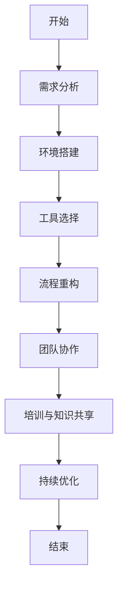

                 

### 文章标题

《DevOps工具链开发：优化软件交付流程》

在当今的快速变化和高需求的软件行业中，高效的软件交付流程变得比以往任何时候都更为重要。DevOps，作为一种文化和实践，旨在通过强化开发（Development）和运营（Operations）之间的协作，来加速软件交付的速度，提高软件质量。本文将深入探讨DevOps工具链的开发，重点在于如何优化软件交付流程，使团队能够更快地响应市场需求，同时保持高质量的服务水平。

本文将分为三个主要部分：

1. **DevOps基础理论**：介绍DevOps的历史、核心原则及其与传统IT的关系，详细解析持续集成/持续部署（CI/CD）、持续交付等关键概念，并给出架构设计的框架。
2. **DevOps工具链开发与实践**：探讨具体的DevOps工具，如GitLab CI/CD、Jenkins和Docker，并展示如何进行持续集成与持续部署实战、容器化与编排、自动化部署与测试，以及DevOps安全与管理。
3. **项目实战与案例分析**：通过实战项目和案例分析，展示DevOps工具链的实际应用，分享经验和最佳实践。

关键词：DevOps、持续集成、持续部署、容器化、自动化部署、安全与管理

摘要：本文旨在深入探讨DevOps工具链的开发及其在优化软件交付流程中的应用。通过阐述DevOps的基础理论、工具链开发与实践，以及实战案例，本文为开发者和管理者提供了全面的技术指南，帮助他们构建高效的软件交付流程，提升团队协作效率和软件质量。

### 第一部分：DevOps基础理论

#### 第1章：DevOps概述

#### 1.1 DevOps的历史与背景

DevOps起源于21世纪初的软件开发和运维领域，其核心理念是加强开发人员与运维人员之间的合作，以提高软件交付的效率和质量。DevOps的兴起背景主要有以下几个方面：

1. **软件复杂性的增加**：随着软件系统的规模和复杂性不断增加，传统的开发与运维分离的模式导致沟通成本高、问题解决时间长，无法快速响应市场需求。
2. **敏捷开发的普及**：敏捷开发提倡快速迭代和持续交付，但敏捷实践在实施过程中往往遇到运维的阻碍，DevOps旨在解决这一痛点。
3. **云计算和自动化技术的发展**：云计算和自动化工具的出现，使得软件部署和运维变得更加灵活和高效，为DevOps的实践提供了技术支持。

DevOps的核心目标是实现自动化、持续交付和持续反馈，从而缩短产品上市时间，提高软件质量。其核心理念包括：

- **团队合作**：打破开发与运维的壁垒，促进团队成员之间的协作和沟通。
- **自动化**：通过自动化工具减少手动操作，降低错误率，提高效率。
- **持续交付**：确保软件可以随时发布，通过自动化测试和质量控制，减少发布风险。
- **反馈循环**：快速收集用户反馈，及时进行调整，提高软件质量。

#### 1.2 DevOps的核心原则

DevOps的核心原则是指导实践的基本准则，主要包括以下几个方面：

1. **合作**：开发人员与运维人员紧密合作，共同负责软件的生命周期，从需求分析到部署运维。
2. **自动化**：通过自动化工具实现重复任务的自动化执行，提高工作效率，减少人为错误。
3. **持续交付**：通过持续集成、持续部署等实践，确保软件可以快速、安全地交付给用户。
4. **监控与反馈**：实时监控系统的性能和健康状况，快速响应问题，并通过反馈循环不断优化系统。
5. **透明度**：保持团队成员之间的信息透明，确保每个人都能了解项目的进展和状况。
6. **共享责任**：团队成员共同承担软件质量的责任，从代码编写到最终部署，每个环节都需确保高质量。

#### 1.3 DevOps与传统IT的关系

DevOps与传统IT之间的区别主要体现在文化和实践方面：

1. **文化差异**：传统IT强调分工和职责明确，而DevOps强调团队合作和跨职能协作。在传统IT中，开发、测试、运维等职能往往是分离的；在DevOps中，这些职能被整合，团队成员共同负责软件的生命周期。
2. **实践差异**：传统IT依赖手动流程和文档管理，而DevOps依赖自动化工具和持续交付流程。传统IT的部署往往需要经过多个审批流程，而DevOps通过自动化实现快速部署，减少人为干预。
3. **目标差异**：传统IT的目标是确保系统的稳定性和可靠性，而DevOps的目标是提高软件交付的效率和速度，同时保证质量。

尽管存在差异，DevOps与传统IT并非完全对立。在实际应用中，两者往往是相辅相成的。传统IT提供基础架构和管理机制，而DevOps提供高效开发和交付的方法论。通过结合两者的优势，可以构建更高效、更可靠的软件交付流程。

#### 1.4 DevOps与敏捷开发的关系

DevOps与敏捷开发（Agile Development）有着紧密的联系。敏捷开发是一种以人为核心、迭代、渐进的开发方法，而DevOps则强调敏捷实践在运维中的落地。具体来说，DevOps与敏捷开发的关系体现在以下几个方面：

1. **共同目标**：DevOps和敏捷开发的共同目标是提高软件交付的效率和质量，缩短产品上市时间。
2. **迭代与反馈**：敏捷开发强调快速迭代和频繁反馈，DevOps通过持续集成和持续交付实现这一目标。通过持续集成，开发人员可以快速发现和解决问题，确保代码的持续可集成性；通过持续交付，开发人员可以随时将代码部署到生产环境，获取用户反馈，并进行调整。
3. **团队合作**：敏捷开发强调跨职能团队的协作，DevOps则通过打破职能壁垒，实现更高效的团队合作。在DevOps实践中，开发、测试、运维等职能不再分离，而是整合为一个整体，共同负责软件的生命周期。
4. **自动化**：敏捷开发强调自动化测试和持续交付，DevOps则通过自动化工具实现这一目标。自动化测试可以快速发现和定位问题，持续交付可以确保软件的快速、安全发布。

#### 第2章：DevOps核心概念与架构

#### 2.1 持续集成/持续部署（CI/CD）

持续集成（Continuous Integration，CI）和持续部署（Continuous Deployment，CD）是DevOps实践中的核心环节。它们通过自动化和持续反馈，确保软件代码的质量和稳定性，提高交付效率。

**2.1.1 持续集成的概念与流程**

持续集成是指开发者在提交代码后，立即将代码与主干分支合并，并进行自动化测试。其核心目标是确保代码库中的每一个提交都是可集成和可运行的。

持续集成的主要流程包括：

1. **代码提交**：开发者将代码提交到代码仓库。
2. **构建**：构建工具（如Jenkins、GitLab CI等）根据配置文件启动构建过程，编译代码并打包。
3. **测试**：执行自动化测试，包括单元测试、集成测试等，确保代码的功能和性能符合预期。
4. **反馈**：测试结果会被反馈给开发者和团队成员，如果有错误，会生成详细的错误报告。

**2.1.2 持续集成的好处**

持续集成具有以下几个主要好处：

1. **早期发现问题**：通过即时反馈，开发人员可以快速发现和修复代码中的问题，避免问题在后续开发过程中积累。
2. **提高代码质量**：持续集成确保代码库中的每一个提交都是可集成的，从而提高代码的整体质量。
3. **减少集成风险**：通过持续集成，可以降低代码集成时的风险，提高集成过程的稳定性。
4. **提高团队协作效率**：持续集成促进了团队成员之间的沟通和协作，确保每个成员都能了解项目的进展和状态。

**2.1.3 持续集成工具**

目前市场上常用的持续集成工具有：

1. **Jenkins**：开源的持续集成服务器，支持多种插件，可以与各种代码仓库和构建工具集成。
2. **GitLab CI/CD**：GitLab自带的持续集成和持续部署工具，与GitLab仓库无缝集成，易于配置。
3. **CircleCI**：基于云的持续集成服务，支持多种编程语言和框架，提供丰富的配置选项。

**2.1.4 持续部署（CD）的概念与流程**

持续部署是持续集成的高级阶段，它通过自动化流程将经过测试的代码部署到生产环境。持续部署的目标是确保软件可以快速、安全地交付给用户。

持续部署的主要流程包括：

1. **构建**：构建工具生成可执行的软件包。
2. **测试**：在持续集成阶段已经完成的测试。
3. **部署**：将软件包部署到目标环境（如开发、测试、生产环境）。
4. **监控**：部署后，监控软件的运行状态，确保其稳定性和性能。

**2.1.5 持续部署的好处**

持续部署具有以下几个主要好处：

1. **快速交付**：通过自动化部署，可以快速将新功能交付给用户，缩短产品上市时间。
2. **降低风险**：通过自动化测试和质量控制，减少人为错误和部署风险。
3. **提高可靠性**：通过监控和反馈，可以及时发现和解决部署过程中出现的问题，提高软件的可靠性。
4. **提高团队效率**：持续部署减少了手动操作，提高了团队的效率。

**2.1.6 持续部署工具**

目前市场上常用的持续部署工具有：

1. **Kubernetes**：开源的容器编排平台，支持自动化部署、扩展和管理容器化应用。
2. **Ansible**：开源的自动化工具，可以用于配置管理、应用部署等任务。
3. **Terraform**：开源的基础设施即代码工具，可以用于自动化部署和管理基础设施。

**2.2 持续交付**

持续交付（Continuous Delivery，CD）是DevOps实践中更高层次的自动化和持续反馈。它确保代码在经过测试后，可以随时部署到生产环境，只需通过简单的操作即可发布。

**2.2.1 持续交付的概念与流程**

持续交付的核心流程包括：

1. **测试**：通过自动化测试确保代码的质量和稳定性。
2. **打包**：将经过测试的代码打包成可执行的软件包。
3. **部署**：将软件包部署到测试环境或生产环境，进行最终测试和验证。
4. **发布**：如果测试成功，软件即可发布给用户。

**2.2.2 持续交付的好处**

持续交付具有以下几个主要好处：

1. **快速发布**：通过自动化和持续反馈，可以快速将新功能发布给用户。
2. **降低风险**：通过自动化测试和质量控制，减少发布风险。
3. **提高质量**：通过持续交付，可以确保每次发布的代码都是高质量的。
4. **提高团队协作**：持续交付促进了开发、测试、运维等职能的协作，提高了团队的整体效率。

**2.2.3 持续交付工具**

目前市场上常用的持续交付工具有：

1. **Jenkins**：支持持续集成和持续交付，可以与各种测试工具和部署工具集成。
2. **GitLab CI/CD**：支持持续集成和持续交付，与GitLab仓库无缝集成。
3. **Travis CI**：基于云的持续集成和持续交付服务，支持多种编程语言和框架。

**2.3 DevOps架构设计**

DevOps架构设计是确保DevOps实践有效实施的关键。一个良好的DevOps架构应具备以下特点：

1. **模块化**：将系统划分为多个模块，每个模块负责特定的功能，便于管理和维护。
2. **可扩展性**：系统能够适应业务需求的增长，支持横向和纵向扩展。
3. **自动化**：通过自动化工具实现重复任务的自动化执行，减少人为干预。
4. **持续监控**：实时监控系统的性能和健康状况，确保系统的稳定性和可靠性。
5. **持续反馈**：通过监控数据和用户反馈，及时调整和优化系统。

**2.3.1 DevOps架构的主要组成部分**

DevOps架构主要包括以下几个组成部分：

1. **代码库**：存储和管理代码的仓库，如Git。
2. **构建和测试环境**：用于构建和测试代码的环境，包括构建工具、测试工具等。
3. **部署环境**：用于部署和运行应用程序的环境，包括开发环境、测试环境、生产环境等。
4. **自动化工具**：用于自动化构建、测试、部署等流程的工具，如Jenkins、Ansible等。
5. **监控和反馈系统**：用于实时监控系统和收集用户反馈的系统，如Prometheus、Grafana等。

**2.3.2 DevOps架构设计步骤**

设计DevOps架构通常遵循以下步骤：

1. **需求分析**：分析业务需求和系统功能，确定系统的架构和组件。
2. **架构设计**：根据需求分析，设计系统的架构，包括模块划分、组件选择等。
3. **自动化流程设计**：设计自动化流程，包括构建、测试、部署等，确保流程的自动化和可重复性。
4. **测试和优化**：对架构和自动化流程进行测试和优化，确保其稳定性和效率。
5. **实施和部署**：根据设计文档，实施和部署系统，并进行监控和反馈。

通过以上步骤，可以构建一个高效、可靠的DevOps架构，实现持续集成、持续交付和持续反馈，从而提高软件交付的效率和质量。

#### 第3章：DevOps工具链概述

在DevOps实践中，工具链的选择至关重要。一个高效的工具链能够大大提升开发、测试和部署的效率，降低成本，提高软件质量。本节将介绍几种常用的DevOps工具，包括GitLab CI/CD、Jenkins和Docker，并探讨它们的特点和应用场景。

**3.1 GitLab CI/CD**

GitLab CI/CD是GitLab自带的一套持续集成和持续部署工具，它提供了一个完整的DevOps解决方案，与GitLab仓库无缝集成，方便管理和自动化。

**3.1.1 GitLab CI/CD的特点**

1. **集成性**：GitLab CI/CD与GitLab仓库紧密集成，可以直接在GitLab仓库中定义CI/CD流程，无需额外配置。
2. **易用性**：GitLab CI/CD采用YAML文件定义CI/CD流程，简单易懂，易于配置和调整。
3. **灵活性**：支持多种编程语言和框架，可以灵活地定制构建和部署流程。
4. **可扩展性**：支持插件和自定义脚本，可以扩展其功能，满足不同需求。
5. **安全性**：提供权限控制和审计功能，确保流程的安全性和合规性。

**3.1.2 GitLab CI/CD的应用场景**

GitLab CI/CD适用于各种类型的项目，尤其是与GitLab仓库一起使用时，效果更佳。以下是一些常见应用场景：

1. **开源项目**：GitLab CI/CD可以自动化构建和部署开源项目，提高社区的参与度和贡献效率。
2. **内部项目**：对于企业内部项目，GitLab CI/CD可以用于自动化测试和部署，提高开发效率和质量。
3. **持续交付**：GitLab CI/CD支持持续交付，可以确保代码在经过测试后立即部署到生产环境，提高交付速度。

**3.2 Jenkins**

Jenkins是一个开源的持续集成服务器，它支持多种插件，可以与各种代码仓库、构建工具和部署工具集成，实现高效的持续集成和持续交付。

**3.2.1 Jenkins的特点**

1. **灵活性**：Jenkins支持多种编程语言和框架，可以灵活地定制CI/CD流程。
2. **插件生态系统**：Jenkins拥有丰富的插件生态系统，可以扩展其功能，满足不同需求。
3. **扩展性**：支持自定义脚本和插件，可以扩展其功能，实现更复杂的CI/CD流程。
4. **集成性**：Jenkins可以与Git、Jira、Slack等多种工具集成，实现端到端的工作流程。

**3.2.2 Jenkins的应用场景**

Jenkins适用于各种类型的项目，以下是一些常见应用场景：

1. **大型企业**：Jenkins可以用于大型企业的复杂项目，实现自动化测试和部署，提高开发和运维效率。
2. **中小型企业**：Jenkins也可以用于中小型企业的项目，实现持续集成和持续交付，提高软件质量。
3. **开源项目**：Jenkins可以用于开源项目的自动化构建和部署，提高社区的参与度和贡献效率。

**3.3 Docker**

Docker是一个开源的应用容器引擎，它允许开发者将应用程序及其依赖环境打包到一个可移植的容器中，实现“一次编写，到处运行”。

**3.3.1 Docker的特点**

1. **可移植性**：Docker容器可以轻松地在不同环境中部署，确保应用程序的一致性和可移植性。
2. **轻量级**：Docker容器非常轻量级，几乎不占用系统资源，可以提高资源利用率和系统性能。
3. **隔离性**：Docker容器提供了严格的隔离性，确保不同容器之间不会相互干扰。
4. **自动化**：Docker与CI/CD工具集成，可以自动化构建、测试和部署容器化应用。

**3.3.2 Docker的应用场景**

Docker适用于各种类型的应用程序，以下是一些常见应用场景：

1. **Web应用**：Docker可以用于Web应用的容器化，提高部署效率和可移植性。
2. **数据库**：Docker可以用于数据库的容器化，实现快速部署和扩展。
3. **微服务**：Docker可以用于微服务的容器化，实现服务的独立部署和灵活扩展。

通过以上三种工具的介绍，我们可以看到，GitLab CI/CD、Jenkins和Docker各自具有独特的特点和优势，适用于不同的应用场景。在实际开发中，根据项目的需求和特点，可以选择合适的工具组合，构建高效的DevOps工具链。

#### 第4章：持续集成与持续部署实战

持续集成（CI）和持续部署（CD）是DevOps实践中的核心环节，通过自动化和持续反馈，确保软件代码的质量和稳定性，提高交付效率。本节将介绍如何设计和实施一个CI/CD流程，包括关键步骤、工具选择以及常见问题和解决方案。

**4.1 持续集成流程设计**

持续集成流程的设计是CI/CD实践的第一步，它确保每次代码提交后都能自动构建和测试，及时发现和修复问题。以下是设计CI流程的关键步骤：

1. **需求分析**：明确项目的需求和目标，确定需要进行的测试类型和流程。
2. **环境准备**：搭建CI服务器和测试环境，配置代码仓库和构建工具。
3. **编写配置文件**：编写CI配置文件，定义构建和测试流程，如Jenkinsfile或GitLab CI配置文件。
4. **构建和测试**：自动化构建代码，执行单元测试、集成测试等，确保代码的质量和稳定性。
5. **反馈和通知**：将测试结果反馈给开发人员，通过邮件、Slack或其他工具通知团队成员。

**4.1.1 步骤详解**

1. **需求分析**：首先，需要明确项目的需求和目标。这包括软件的功能需求、性能需求以及质量要求。根据需求分析，确定需要进行的测试类型和流程，如单元测试、集成测试、性能测试等。

2. **环境准备**：接下来，需要搭建CI服务器和测试环境。选择合适的CI工具（如Jenkins、GitLab CI等），并配置代码仓库和构建工具。确保CI服务器与开发环境、测试环境和生产环境保持一致，以避免环境差异导致的问题。

3. **编写配置文件**：配置文件是CI流程的核心，它定义了构建和测试的步骤。对于Jenkins，通常使用Jenkinsfile；对于GitLab CI，使用`.gitlab-ci.yml`文件。以下是一个简单的Jenkinsfile示例：

```groovy
pipeline {
    agent any
    stages {
        stage('Build') {
            steps {
                sh 'mvn clean package'
            }
        }
        stage('Test') {
            steps {
                sh 'mvn test'
            }
        }
        stage('Deploy') {
            steps {
                sh 'echo "Deploying to production..."'
            }
        }
    }
}
```

4. **构建和测试**：CI服务器根据配置文件执行构建和测试。构建过程中，CI服务器会自动编译代码、运行测试，并生成测试报告。如果测试失败，CI服务器会停止流程并通知相关人员。

5. **反馈和通知**：构建和测试完成后，CI服务器会将测试结果反馈给开发人员。通过邮件、Slack或其他工具通知团队成员，确保每个人都能及时了解项目的进展和状态。

**4.1.2 常见问题及解决方案**

1. **构建失败**：如果构建失败，需要排查原因。可能的原因包括依赖问题、代码冲突、环境配置错误等。解决方法包括检查代码库、更新依赖、修复冲突和配置问题。

2. **测试失败**：测试失败可能是由于代码问题或测试用例不完整。解决方法包括修复代码缺陷、补充测试用例或调整测试策略。

3. **依赖问题**：依赖问题可能导致构建失败。解决方法包括检查依赖版本、更新依赖或替换依赖。

4. **环境不一致**：环境不一致可能导致构建和测试失败。解决方法包括确保CI服务器与开发环境、测试环境和生产环境保持一致，使用容器化技术（如Docker）隔离环境。

**4.2 持续部署流程设计**

持续部署（CD）是CI的延伸，它通过自动化流程将经过测试的代码部署到生产环境。以下是设计CD流程的关键步骤：

1. **需求分析**：明确部署目标和流程，确定需要进行的部署操作和监控。
2. **环境准备**：搭建部署环境，配置部署工具和监控工具。
3. **编写配置文件**：编写部署配置文件，定义部署流程和参数。
4. **部署**：自动化执行部署流程，包括更新代码、配置环境、运行测试等。
5. **监控和反馈**：实时监控部署状态，收集用户反馈，确保部署的稳定性和性能。

**4.2.1 步骤详解**

1. **需求分析**：首先，需要明确部署目标和流程。这包括软件的更新频率、部署策略、监控要求等。根据需求分析，确定需要进行的部署操作和监控。

2. **环境准备**：接下来，需要搭建部署环境。选择合适的部署工具（如Kubernetes、Ansible等），并配置部署环境和监控工具。确保部署环境与开发环境、测试环境保持一致。

3. **编写配置文件**：编写部署配置文件，定义部署流程和参数。例如，使用Kubernetes的YAML文件定义部署配置，使用Ansible的Playbook定义部署脚本。

4. **部署**：自动化执行部署流程。部署工具根据配置文件执行部署操作，包括更新代码、配置环境、运行测试等。例如，使用Kubernetes进行部署，使用Ansible进行配置管理。

5. **监控和反馈**：部署完成后，实时监控部署状态。监控工具（如Prometheus、Grafana等）收集系统性能指标和日志，确保部署的稳定性和性能。收集用户反馈，及时调整和优化部署流程。

**4.2.2 常见问题及解决方案**

1. **部署失败**：如果部署失败，需要排查原因。可能的原因包括配置错误、依赖问题、网络问题等。解决方法包括检查配置文件、更新依赖、修复网络问题。

2. **环境不一致**：环境不一致可能导致部署失败。解决方法包括确保部署环境与开发环境、测试环境保持一致，使用容器化技术（如Docker）隔离环境。

3. **监控失败**：监控失败可能是由于监控工具配置错误或系统故障。解决方法包括检查监控工具配置、修复系统故障。

4. **性能问题**：部署后，监控系统性能，及时调整和优化。例如，调整资源分配、优化代码性能等。

**4.3 实际案例解析**

为了更好地理解CI/CD流程，我们来看一个实际案例。

假设一个电商网站需要实现CI/CD流程，以下是案例解析：

1. **需求分析**：电商网站需要快速响应市场需求，实现代码的快速迭代和部署。要求每次代码提交后进行自动化构建和测试，确保代码质量。

2. **环境准备**：搭建Jenkins作为CI服务器，GitLab作为代码仓库，Kubernetes作为部署环境。配置好开发环境、测试环境和生产环境。

3. **编写配置文件**：

   - **Jenkinsfile**：
     ```groovy
     pipeline {
         agent any
         stages {
             stage('Build') {
                 steps {
                     sh 'mvn clean package'
                 }
             }
             stage('Test') {
                 steps {
                     sh 'mvn test'
                 }
             }
             stage('Deploy') {
                 steps {
                     sh 'kubectl apply -f deployment.yml'
                 }
             }
         }
     }
     ```

   - **.gitlab-ci.yml**：
     ```yaml
     image: maven:3.6.3-jdk-11
     services:
       - name: mysql:5.7
     stages:
       - build
       - test
       - deploy
     build:
       stage: build
       script:
         - mvn clean package
     test:
       stage: test
       script:
         - mvn test
     deploy:
       stage: deploy
       script:
         - kubectl apply -f deployment.yml
     ```

4. **部署流程**：

   - Jenkins触发CI流程，构建和测试代码。
   - 测试通过后，Jenkins将部署配置文件提交到GitLab，触发CD流程。
   - Kubernetes根据部署配置文件，将应用部署到生产环境。

5. **监控和反馈**：使用Prometheus和Grafana监控系统性能和状态，收集用户反馈，及时调整和优化部署流程。

通过这个案例，我们可以看到CI/CD流程如何实现自动化、持续反馈和高效部署，从而提高软件交付的效率和质量。

**4.4 实战总结**

通过以上实战案例，我们可以总结出以下几点经验：

1. **需求明确**：明确项目的需求和目标，是设计CI/CD流程的基础。
2. **环境一致**：确保CI服务器与开发环境、测试环境和生产环境保持一致，减少环境差异带来的问题。
3. **自动化**：通过自动化工具实现构建、测试和部署，减少手动操作，提高效率。
4. **监控和反馈**：实时监控系统和收集用户反馈，确保部署的稳定性和性能。

通过遵循以上原则和实践，团队能够实现高效的CI/CD流程，提高软件交付的效率和质量。

### 第5章：容器化与编排

在现代软件交付和部署中，容器化技术已经成为一种不可或缺的工具。容器化使得应用程序及其运行环境可以在任何地方一致地运行，从而简化了部署过程，提高了系统的灵活性和可移植性。Kubernetes（K8s）作为最流行的容器编排工具，进一步提升了容器化应用程序的管理和部署效率。本章将深入探讨容器化与编排的基本概念、核心组件和关键特性。

#### 5.1 Docker基础

Docker是一个开源的应用容器引擎，它允许开发人员在隔离的容器中运行应用程序，每个容器都是独立的，包含应用程序及其所有的运行时依赖。Docker容器基于Linux容器（LXC）技术，提供了一种轻量级、可移植、自给自足的软件打包方式。

**5.1.1 Docker的基本概念**

- **容器（Container）**：容器是运行在操作系统上的隔离环境，包含应用程序和所有必需的组件，如代码、库和配置文件。
- **镜像（Image）**：镜像是一个静态的模板，用于创建容器。它包含应用程序及其依赖环境的定义。
- **仓库（Repository）**：仓库是存储和管理Docker镜像的存储库。
- **Docker Hub**：Docker Hub是Docker的官方镜像仓库，用户可以免费注册并使用。

**5.1.2 Docker的工作原理**

1. **Docker Engine**：Docker Engine是Docker的核心组件，负责创建、运行和管理工作容器。
2. **Dockerfile**：Dockerfile是一个文本文件，用于定义容器的构建过程。通过在Dockerfile中编写指令，可以指定安装软件、配置环境变量等操作。
3. **Docker Compose**：Docker Compose是一个用于定义和运行多容器应用的工具。通过一个YAML文件，可以轻松地描述和部署复杂的分布式应用程序。

**5.1.3 Docker的使用方法**

1. **安装Docker**：在不同的操作系统上，安装Docker的方法略有不同。对于Linux，可以通过包管理器安装；对于Windows和macOS，可以使用Docker Desktop。
2. **创建和运行容器**：使用`docker run`命令创建并启动容器。例如：
   ```sh
   docker run -d -p 8080:80 nginx
   ```
   这条命令将创建并运行一个Nginx容器，并将容器的80端口映射到宿主机的8080端口。
3. **构建镜像**：使用Dockerfile构建自定义镜像。例如：
   ```sh
   docker build -t myapp .
   ```
   这条命令将当前目录下的Dockerfile用于构建一个名为`myapp`的镜像。
4. **管理容器**：使用`docker ps`查看正在运行的容器，使用`docker stop`停止容器等。

**5.2 Kubernetes入门**

Kubernetes是一个开源的容器编排平台，用于自动化容器化应用程序的部署、扩展和管理。Kubernetes提供了一种简单、高效的方式来管理分布式系统，使开发者可以集中精力编写应用程序，而无需担心底层基础设施的复杂性。

**5.2.1 Kubernetes的基本概念**

- **集群（Cluster）**：Kubernetes集群是由一组节点（Node）组成的，每个节点运行一个Kubernetes Pod。
- **节点（Node）**：节点是运行应用程序容器的计算节点，通常具有独立的CPU和内存资源。
- **Pod**：Pod是Kubernetes中的最小部署单元，一个Pod可以包含一个或多个容器。
- **容器（Container）**：容器是运行应用程序的实例，由镜像定义。
- **服务（Service）**：服务是用于访问Pod的抽象层，可以提供稳定的网络接口。
- **控制器（Controller）**：控制器负责管理集群中的资源，确保资源状态与预期一致。

**5.2.2 Kubernetes的核心组件**

1. **控制平面（Control Plane）**：控制平面是Kubernetes集群的核心，包括API服务器、控制器管理器、调度器和etcd等组件。
2. **工作节点（Worker Node）**：工作节点运行容器化的应用程序，执行调度器分配的任务。
3. **Pod**：Pod是Kubernetes中的基本工作单元，可以包含一个或多个容器，共同运行于同一个工作节点上。
4. **容器运行时（Container Runtime）**：容器运行时负责容器的创建、启动和管理，如Docker、rkt等。

**5.2.3 Kubernetes的使用方法**

1. **安装Kubernetes**：可以使用Kubeadm、Minikube等工具在本地或集群环境中安装Kubernetes。
2. **创建和管理Pod**：使用kubectl命令行工具创建、更新和管理Pod。例如：
   ```sh
   kubectl create pod myapp --image=myapp:latest
   kubectl delete pod myapp
   ```
3. **部署应用**：使用 Helm等工具部署和管理复杂的应用程序。例如：
   ```sh
   helm install myapp myapp-chart
   helm uninstall myapp
   ```
4. **监控和日志**：使用Kubernetes的监控和日志工具，如Prometheus和Grafana，收集和展示集群的运行状态。

**5.3 Kubernetes高级特性**

Kubernetes的高级特性进一步提升了容器化应用程序的可扩展性、可靠性和可移植性。以下是Kubernetes的一些高级特性：

- **水平扩展（Horizontal Scaling）**：通过指定 replicas 参数，Kubernetes可以自动创建多个Pod实例，以处理更多的请求。
- **负载均衡（Load Balancing）**：Kubernetes可以自动配置负载均衡器，确保流量均匀地分布到不同的Pod实例。
- **服务发现和DNS**：Kubernetes提供了内置的DNS服务，使得Pod可以通过域名相互通信。
- **存储卷（Persistent Volumes，PV）和存储卷声明（Persistent Volume Claims，PVC）**：存储卷提供持久的存储解决方案，存储卷声明是用户请求存储资源的对象。
- **网络策略（Network Policies）**：网络策略允许控制集群中Pod之间的通信。

**5.3.1 水平扩展示例**

以下是一个简单的水平扩展示例，使用kubectl命令创建一个具有3个副本的Pod：

```yaml
apiVersion: apps/v1
kind: Deployment
metadata:
  name: myapp-deployment
spec:
  replicas: 3
  selector:
    matchLabels:
      app: myapp
  template:
    metadata:
      labels:
        app: myapp
    spec:
      containers:
      - name: myapp
        image: myapp:latest
```

通过上述配置，Kubernetes会创建3个Pod实例，确保应用程序可以处理更多的流量。

**5.3.2 负载均衡示例**

以下是一个简单的负载均衡示例，使用kubectl命令创建一个负载均衡器：

```yaml
apiVersion: v1
kind: Service
metadata:
  name: myapp-service
spec:
  selector:
    app: myapp
  ports:
    - protocol: TCP
      port: 80
      targetPort: 8080
  type: LoadBalancer
```

通过上述配置，Kubernetes会自动创建一个外部负载均衡器，将流量分发到不同的Pod实例。

通过以上对Docker和Kubernetes的深入探讨，我们可以看到容器化与编排技术如何极大地简化了软件的交付和部署过程。这不仅提高了系统的灵活性，还提升了开发效率和稳定性，为现代软件开发提供了强有力的支持。

#### 第6章：自动化部署与测试

自动化部署与测试是DevOps实践中的关键环节，通过自动化工具和流程，可以显著提高软件交付的效率和质量。本节将介绍自动化部署工具、自动化测试以及自动化测试框架，详细探讨其原理、实践和最佳实践。

**6.1 自动化部署工具**

自动化部署工具通过脚本或工具自动化应用程序的部署流程，从而减少手动操作，提高部署效率和一致性。以下是几种常用的自动化部署工具：

**6.1.1 Ansible**

Ansible是一个开源的自动化工具，适用于配置管理、应用部署和IT自动化。它使用YAML语言定义任务，通过SSH协议远程管理节点。

**6.1.2 特点**

- **无代理**：Ansible无需在节点上安装代理或客户端，通过SSH直接连接和管理。
- **简单易用**：Ansible使用简单的Playbook（YAML文件）定义任务，易于编写和理解。
- **模块化**：Ansible提供丰富的模块，涵盖网络、存储、数据库等各个方面。

**6.1.3 应用场景**

- **配置管理**：自动化配置和部署服务器。
- **应用部署**：自动化部署应用程序，如Web服务器、数据库等。
- **持续交付**：在CI/CD流程中自动化部署。

**6.1.4 使用示例**

以下是一个简单的Ansible Playbook，用于部署Nginx：

```yaml
---
- hosts: webservers
  become: yes
  vars:
    nginx_version: "1.18.0"
  tasks:
    - name: Install Nginx
      apt: name=nginx state=present version={{ nginx_version }}
    - name: Start Nginx service
      service: name=nginx state=started
    - name: Enable Nginx service
      service: name=nginx state=enabled
```

**6.1.5 最佳实践**

- **模块化**：将任务拆分为多个模块，便于复用和维护。
- **版本控制**：使用版本控制系统管理Playbook，确保变更可追溯。
- **测试和验证**：在部署前进行测试和验证，确保部署流程的正确性。

**6.2 自动化测试**

自动化测试通过脚本或工具自动执行测试用例，验证应用程序的功能、性能和安全性。自动化测试工具可以与持续集成和持续部署（CI/CD）流程集成，确保每次代码更改都能通过测试。

**6.2.1 Selenium**

Selenium是一个开源的自动化测试工具，支持多种浏览器和操作系统。它允许测试人员编写脚本，模拟用户的交互操作，验证应用程序的UI和功能。

**6.2.2 特点**

- **跨浏览器支持**：Selenium支持多种浏览器，包括Chrome、Firefox、Safari等。
- **脚本语言多样**：Selenium支持多种编程语言，如Java、Python、C#等。
- **灵活性和可扩展性**：Selenium提供了丰富的API和扩展功能，支持自定义测试逻辑。

**6.2.3 应用场景**

- **UI测试**：验证应用程序的用户界面和交互功能。
- **功能测试**：验证应用程序的核心功能是否符合预期。
- **回归测试**：确保每次代码更改不会破坏现有功能。

**6.2.4 使用示例**

以下是一个简单的Selenium测试脚本，用于验证Web表单：

```python
from selenium import webdriver
from selenium.webdriver.common.keys import Keys

driver = webdriver.Chrome()
driver.get("http://www.example.com/form")

# 填写表单
driver.find_element_by_name("username").send_keys("testuser")
driver.find_element_by_name("password").send_keys("testpassword")
driver.find_element_by_name("submit").click()

# 验证表单提交成功
assert "Form submitted!" in driver.page_source
driver.quit()
```

**6.2.5 最佳实践**

- **模块化**：将测试用例拆分为模块，便于复用和维护。
- **并行执行**：在CI/CD流程中并行执行测试，提高测试效率。
- **持续集成**：将自动化测试集成到CI/CD流程中，确保每次代码更改都经过测试。

**6.3 自动化测试框架**

自动化测试框架是一套标准的测试工具和流程，用于编写、执行和管理自动化测试用例。常见的自动化测试框架包括JUnit、TestNG、PyTest等。

**6.3.1 JUnit**

JUnit是一个开源的Java测试框架，用于编写和执行单元测试。它支持测试套件、测试数据驱动、断言等功能。

**6.3.2 特点**

- **灵活性和可扩展性**：JUnit提供了丰富的API和扩展点，支持自定义测试逻辑。
- **测试套件**：JUnit允许将多个测试用例组织成测试套件，便于管理。
- **断言**：JUnit提供了多种断言方法，支持复杂的测试逻辑。

**6.3.3 应用场景**

- **单元测试**：验证Java类的每个方法和功能。
- **集成测试**：验证类之间的交互和协作。
- **功能测试**：用于验证应用程序的核心功能。

**6.3.4 使用示例**

以下是一个简单的JUnit测试用例，用于验证加法函数：

```java
import static org.junit.jupiter.api.Assertions.assertEquals;

class CalculatorTest {

    @Test
    void testAdd() {
        assertEquals(5, Calculator.add(2, 3));
    }
}
```

**6.3.5 最佳实践**

- **代码分离**：将测试代码与生产代码分离，确保测试代码的独立性和可维护性。
- **持续集成**：将自动化测试集成到CI/CD流程中，确保每次代码更改都经过测试。
- **测试覆盖率**：使用代码覆盖率工具测量测试覆盖率，确保测试全面。

通过以上对自动化部署工具、自动化测试和自动化测试框架的介绍，我们可以看到自动化在DevOps实践中的重要性。自动化工具和流程可以显著提高软件交付的效率和质量，为现代软件开发提供了强有力的支持。

### 第7章：DevOps安全与管理

在DevOps的快速迭代和自动化实践中，确保系统的安全性和合规性是至关重要的。随着DevOps工具链的复杂度增加，安全威胁也日益严峻。本章将探讨DevOps中的安全风险、安全管理策略、合规性以及最佳实践。

#### 7.1 DevOps安全风险

DevOps环境中的安全风险主要包括以下几个方面：

**7.1.1 数据泄露**

自动化工具和频繁的部署使得数据泄露的风险增加。在持续集成/持续部署（CI/CD）过程中，敏感信息（如密码、API密钥等）可能被泄露或暴露。

**7.1.2 漏洞利用**

自动化部署可能导致未经验证或未经充分测试的代码被部署到生产环境，增加被恶意利用的风险。

**7.1.3 访问控制不足**

自动化流程可能未考虑到访问控制，导致未经授权的人员访问敏感系统和数据。

**7.1.4 配置错误**

配置错误可能导致系统暴露在安全风险中，例如错误配置的防火墙规则或权限设置。

**7.1.5 监控不足**

缺乏实时监控可能导致安全事件未被发现，从而延迟响应时间。

#### 7.2 DevOps安全管理

为了应对DevOps环境中的安全风险，需要实施一系列的安全管理策略：

**7.2.1 威胁模型**

首先，需要建立一个威胁模型，识别潜在的安全威胁，包括内部和外部威胁。这有助于确定哪些安全措施需要优先实施。

**7.2.2 安全策略**

制定明确的安全策略，包括访问控制、数据加密、安全审计等。这些策略应与组织的整体安全策略保持一致。

**7.2.3 安全自动化**

将安全检查和验证集成到CI/CD流程中，例如在构建过程中执行静态代码分析（SCA）、动态应用安全测试（DAST）等。

**7.2.4 安全培训**

定期为开发人员和运维人员提供安全培训，提高他们的安全意识和技能，确保每个人都理解并遵守安全规则。

**7.2.5 安全合规性**

确保DevOps实践符合行业标准和法规要求，如ISO 27001、NIST等。使用合规性工具和审计工具进行定期审查。

**7.2.6 安全监控**

实施实时监控和告警系统，确保安全事件能够及时被发现和响应。监控包括日志分析、网络流量分析、入侵检测等。

**7.3 DevOps合规性**

合规性是DevOps环境中不可忽视的一部分，它关系到组织的声誉和法律责任。以下是几个关键点：

**7.3.1 法规遵循**

确保DevOps实践遵循相关法规，如GDPR、HIPAA等，这些法规对数据隐私和安全有严格要求。

**7.3.2 内部审计**

定期进行内部审计，检查安全策略的执行情况和合规性。审计应涵盖CI/CD流程、配置管理、日志管理等。

**7.3.3 外部审查**

外部审计可以提供独立的合规性验证，确保组织的DevOps实践符合行业标准。外部审查通常由第三方机构进行。

**7.3.4 记录保存**

保留详细的操作记录和日志，以便在审计和调查中提供证据。这有助于证明合规性和安全措施的有效性。

#### 7.4 DevOps安全最佳实践

以下是几个DevOps安全最佳实践：

**7.4.1 审慎权限管理**

确保权限管理严格，只有必要的权限才能访问系统和数据。使用最小权限原则，确保用户只能访问其工作所需的资源。

**7.4.2 数据加密**

对敏感数据进行加密存储和传输，防止数据泄露。加密应涵盖数据库、文件系统、API通信等。

**7.4.3 自动化安全测试**

将安全测试集成到CI/CD流程中，确保每次代码更改都经过安全检查。使用工具如SonarQube进行静态代码分析。

**7.4.4 安全培训**

定期为团队成员提供安全培训，确保他们了解最新的安全威胁和防御措施。培训应包括安全意识、密码安全、恶意软件防护等。

**7.4.5 安全监控**

实施实时监控和告警系统，确保安全事件能够及时被发现和响应。监控应涵盖网络流量、日志、应用程序行为等。

**7.4.6 安全审计**

定期进行内部和外部审计，确保安全策略得到有效执行。审计应覆盖CI/CD流程、配置管理、访问控制等。

通过实施以上最佳实践，组织可以构建一个安全、合规的DevOps环境，确保软件交付的效率和安全性。

### 第8章：DevOps团队协作与效率

在DevOps实践中，团队协作和效率是确保项目成功的关键因素。通过引入一系列的工具和文化建设，团队能够更高效地工作，快速响应变化，并持续改进。以下将从团队协作工具、效率提升策略和DevOps文化建设三个方面进行详细探讨。

#### 8.1 DevOps团队协作工具

现代DevOps团队需要多种协作工具来支持日常的工作流程，提高沟通效率和团队协作。以下是一些常用的DevOps团队协作工具：

**8.1.1 Jira**

Jira是Atlassian公司推出的一款项目管理和协作工具，广泛应用于软件项目的跟踪和管理。Jira提供了强大的任务管理、缺陷跟踪和项目进展跟踪功能，可以帮助团队更好地协同工作。

**8.1.2 特点**

- **灵活的任务管理**：Jira支持多种任务类型，如故事、缺陷、任务等，可以灵活地定制任务流程。
- **强大的搜索和报告功能**：Jira提供了强大的搜索和报告功能，可以快速查找项目信息和分析项目进展。
- **集成其他工具**：Jira可以与多种其他DevOps工具集成，如GitLab、Jenkins、Confluence等。

**8.1.3 应用场景**

- **敏捷开发**：Jira适用于敏捷开发团队，可以管理迭代计划、用户故事和任务分配。
- **项目管理**：Jira可以帮助项目经理跟踪项目进度、资源分配和风险控制。

**8.1.4 使用示例**

以下是一个简单的Jira任务创建和分配示例：

```sh
# 创建一个用户故事任务
jira create ISSUE --project KEY --summary "Search functionality improvement"

# 分配任务给特定开发者
jira edit ISSUE --assignee USER
```

**8.1.5 最佳实践**

- **明确任务描述**：在创建任务时，提供详细的描述和相关的背景信息，确保团队成员了解任务的目标和需求。
- **定期回顾**：定期回顾任务完成情况和团队协作效果，识别改进点。

**8.2 DevOps效率提升策略**

提升团队效率是DevOps实践的重要目标。以下是一些有效的策略：

**8.2.1 持续学习**

团队应持续关注最新的技术动态和最佳实践，定期进行技能培训和知识分享，确保团队成员始终保持竞争力。

**8.2.2 工作流程优化**

通过分析工作流程，识别瓶颈和低效环节，进行优化和改进。例如，简化审批流程，减少不必要的会议等。

**8.2.3 工具集成**

整合各种DevOps工具，实现数据共享和流程自动化，减少手动操作和重复工作。

**8.2.4 代码质量**

通过代码审查、自动化测试等手段，确保代码质量，减少故障和修复时间。

**8.2.5 持续反馈**

建立反馈机制，鼓励团队成员分享问题和建议，及时调整工作方式和流程。

**8.3 DevOps文化建设**

DevOps文化是DevOps实践成功的关键，它强调团队合作、开放沟通和持续改进。以下是一些文化建设的关键点：

**8.3.1 团队合作**

DevOps团队应打破职能壁垒，实现跨职能合作。团队成员应具备多种技能，可以相互补充，共同完成任务。

**8.3.2 开放沟通**

建立透明、开放的沟通渠道，鼓励团队成员分享想法和问题。使用协作工具，如Jira、Slack等，确保信息传递高效、及时。

**8.3.3 持续改进**

DevOps团队应持续关注项目进展和团队表现，通过定期的回顾和反思，不断改进工作方式和流程。

**8.3.4 培养信任**

建立信任是团队协作的基础。通过共同的目标和成功的合作，培养团队成员之间的信任。

**8.3.5 个人发展**

鼓励团队成员个人发展和职业成长，提供培训和学习机会，帮助他们提升技能和职业素养。

通过以上团队协作工具、效率提升策略和DevOps文化建设的实践，团队能够更高效地工作，快速响应变化，持续改进，从而实现DevOps的目标。

### 第9章：DevOps工具链实战项目搭建

在了解并掌握了DevOps的相关理论和工具后，我们将在本节中通过一个实际项目，展示如何搭建一个完整的DevOps工具链。本节将分为三个部分：项目背景、环境搭建与配置，以及项目部署与配置。通过这个实战项目，我们能够更好地理解DevOps工具链的实际应用和实现过程。

#### 9.1 实战项目背景

假设我们正在开发一个简单的Web应用，名为“Bookstore”，提供在线图书销售功能。项目的开发语言为Java，前端使用React，后端使用Spring Boot。项目需求包括用户注册、登录、浏览图书、购物车和支付功能。为了实现高效的软件开发和交付，我们将采用DevOps工具链，包括GitLab CI/CD、Docker、Kubernetes等工具。

**目标**：通过DevOps工具链，实现以下目标：

1. **自动化构建和测试**：确保每次代码提交后，自动构建和测试，确保代码质量。
2. **容器化部署**：使用Docker将应用容器化，确保应用在不同环境之间的一致性。
3. **自动化部署**：使用Kubernetes进行自动化部署，实现快速、可靠的应用部署。
4. **持续监控**：监控应用的性能和健康状态，确保应用的稳定性和可靠性。

#### 9.2 环境搭建与配置

为了搭建DevOps工具链，我们需要配置以下环境：

1. **GitLab仓库**：存储项目代码和CI/CD配置文件。
2. **Docker环境**：用于构建和运行Docker容器。
3. **Kubernetes集群**：用于部署和管理容器化应用。

**步骤**：

1. **GitLab仓库配置**：

   - 在GitLab上创建一个项目仓库，用于存储“Bookstore”项目的代码。
   - 配置GitLab CI/CD，创建`.gitlab-ci.yml`文件，定义CI/CD流程。

   ```yaml
   image: java:11

   services:
     - name: mysql:5.7
     - name: redis:6.0

   before_script:
     - mysql -e "CREATE DATABASE IF NOT EXISTS bookstore;"
     - redis-server &

   build:
     stage: build
     script:
       - mvn clean package
     artifacts:
       paths:
       - target/*.jar
   ```

   该配置文件定义了一个基于Java 11的Docker镜像，用于构建项目。在构建阶段，会创建MySQL和Redis服务，用于测试和开发。

2. **Docker环境配置**：

   - 在本地或服务器上安装Docker。
   - 为“Bookstore”项目创建一个Dockerfile，定义应用的容器化过程。

   ```Dockerfile
   FROM openjdk:11-jdk-alpine
   ARG JAR_FILE=target/*.jar
   COPY ${JAR_FILE} app.jar
   ENTRYPOINT ["java" "-Djava.security.egd=file:/dev/./urandom" "-jar" "/app.jar" "--spring.config.location=classpath:/,file:/config/"]
   ```

   该Dockerfile使用OpenJDK 11作为基础镜像，复制编译后的JAR文件到容器中，并设置应用的入口点。

3. **Kubernetes集群配置**：

   - 安装并配置Kubernetes集群。
   - 为“Bookstore”应用创建Kubernetes配置文件，包括部署配置（Deployment）和服务配置（Service）。

   ```yaml
   apiVersion: apps/v1
   kind: Deployment
   metadata:
     name: bookstore
     namespace: default
   spec:
     replicas: 3
     selector:
       matchLabels:
         app: bookstore
     template:
       metadata:
         labels:
           app: bookstore
       spec:
         containers:
         - name: bookstore
           image: bookstore:latest
           ports:
           - containerPort: 8080
   ---
   apiVersion: v1
   kind: Service
   metadata:
     name: bookstore-service
     namespace: default
   spec:
     selector:
       app: bookstore
     ports:
       - protocol: TCP
         port: 80
         targetPort: 8080
     type: LoadBalancer
   ```

   该配置文件定义了一个具有3个副本的Deployment，用于部署“Bookstore”应用，并创建一个LoadBalancer类型的Service，用于外部访问。

#### 9.3 项目部署与配置

在完成环境搭建和配置后，我们将通过GitLab CI/CD和Kubernetes进行项目的自动化部署。

**步骤**：

1. **触发CI/CD流程**：

   - 在GitLab仓库中提交代码更改，触发CI/CD流程。
   - CI/CD流程将构建项目、运行测试、生成Docker镜像，并推送至Docker Hub。

   ```sh
   git push
   ```

   提交代码后，GitLab会自动启动构建流程，并生成Docker镜像。

2. **部署到Kubernetes集群**：

   - 将生成的Docker镜像标签更新为`latest`，并推送至Docker Hub。

   ```sh
   docker tag bookstore:build bookstore:latest
   docker push bookstore:latest
   ```

   - 使用Kubernetes配置文件，部署应用。

   ```sh
   kubectl apply -f k8s/bookstore-deployment.yaml
   ```

   Kubernetes将根据配置文件创建Deployment和Service，将应用部署到集群中。

3. **验证部署**：

   - 使用Kubernetes命令行工具，检查部署状态。

   ```sh
   kubectl get pods
   kubectl get services
   ```

   - 访问应用的LoadBalancer IP或域名，验证应用是否正常运行。

   ```sh
   curl <LoadBalancer IP>/bookstore
   ```

通过以上步骤，我们成功搭建了一个完整的DevOps工具链，实现了自动化构建、测试、容器化部署和自动化部署。这个实战项目展示了如何利用GitLab CI/CD、Docker和Kubernetes等工具，构建高效、可靠的软件交付流程。

### 第10章：案例分析与经验分享

通过前面的章节，我们探讨了DevOps的理论知识、工具链开发与实践，以及项目搭建过程。在本章中，我们将通过几个实际案例，深入分析DevOps在不同规模的企业中的应用情况，分享实际操作中的经验与教训，并总结最佳实践。

#### 10.1 DevOps在大型企业中的应用

大型企业在实施DevOps时面临更大的挑战，因为它们拥有复杂的应用架构和庞大的团队。以下是一个大型企业（假设为“TechGiant”）的DevOps应用案例：

**案例背景**：

TechGiant是一家全球性的科技公司，拥有数千名员工和数十个大型项目。由于传统IT架构的局限性，TechGiant的软件交付效率较低，部署周期长达数月，且质量问题频发。为了提升软件交付效率和质量，TechGiant决定全面引入DevOps实践。

**实施过程**：

1. **需求分析和规划**：TechGiant成立了专门的DevOps团队，进行需求分析和规划。他们确定了以下几个关键目标：

   - 缩短软件交付周期
   - 提高软件质量
   - 加强团队协作

2. **环境搭建与工具选择**：TechGiant选择了GitLab CI/CD、Jenkins、Docker、Kubernetes等工具，搭建了完整的DevOps工具链。他们还引入了监控和日志分析工具，如Prometheus和Grafana。

3. **流程重构**：TechGiant重构了软件开发和交付流程，实现了以下关键变革：

   - **持续集成**：通过GitLab CI/CD，实现代码的自动化构建和测试，确保每次代码提交都是可集成的。
   - **持续部署**：通过Kubernetes，实现自动化部署和管理容器化应用，提高部署速度和可靠性。
   - **自动化测试**：引入自动化测试框架，进行单元测试、集成测试和性能测试，确保软件质量。
   - **自动化监控**：使用Prometheus和Grafana，实时监控系统的性能和健康状态，确保系统的稳定性。

4. **团队协作**：TechGiant打破了开发与运维的壁垒，组建了跨职能团队，促进团队成员之间的协作和沟通。

**效果与经验**：

通过实施DevOps，TechGiant取得了显著的效果：

- 软件交付周期从数月缩短到数周，甚至数天。
- 软件质量显著提高，故障率和修复时间大幅减少。
- 团队协作效率提升，团队成员之间的沟通和合作更加顺畅。

**经验教训**：

TechGiant在实施过程中也遇到了一些挑战：

- **人员培训**：由于DevOps涉及多个技术和工具，团队成员需要接受培训，确保掌握相关技能。
- **流程调整**：重构流程需要时间，TechGiant经历了多次迭代和优化，才找到最适合的流程。
- **技术选型**：选择合适的工具和平台至关重要，TechGiant在选择工具时进行了多次评估和测试。

#### 10.2 DevOps在创业公司中的应用

创业公司在资源有限、市场变化快的背景下，更需要DevOps的支持。以下是一个创业公司（假设为“StartUpTech”）的DevOps应用案例：

**案例背景**：

StartUpTech是一家初创科技公司，专注于开发基于大数据的智能分析平台。由于初创公司资源有限，StartUpTech希望通过DevOps实践，实现快速迭代和高效交付，以抢占市场份额。

**实施过程**：

1. **需求分析和规划**：StartUpTech确定了以下目标：

   - 快速响应市场需求
   - 提高软件质量
   - 减少运营成本

2. **环境搭建与工具选择**：StartUpTech选择了GitLab CI/CD、Docker、Kubernetes等工具，构建了高效的DevOps工具链。

3. **流程重构**：

   - **持续集成**：通过GitLab CI/CD，实现自动化构建和测试，确保每次代码提交都是可集成的。
   - **持续交付**：使用Kubernetes，实现自动化部署和管理容器化应用，确保软件可以快速、安全地交付。
   - **自动化测试**：引入自动化测试框架，进行单元测试、集成测试和性能测试，确保软件质量。
   - **云服务**：利用云服务（如AWS、Google Cloud等），降低基础设施成本，提高系统的灵活性和可扩展性。

4. **团队协作**：StartUpTech建立了敏捷开发团队，团队成员具备多种技能，能够快速响应变化和需求。

**效果与经验**：

通过实施DevOps，StartUpTech取得了以下效果：

- 产品迭代速度显著提升，从几个月缩短到几周。
- 软件质量得到保障，故障率和修复时间减少。
- 运营成本降低，通过云服务实现了高效的基础设施管理。

**经验教训**：

StartUpTech在实施过程中也面临一些挑战：

- **资源限制**：初创公司资源有限，需要在有限的资源下选择合适的工具和平台。
- **团队技能**：团队成员需要具备一定的技术背景和DevOps知识，StartUpTech通过培训和内部交流，提升了团队技能。
- **市场变化**：初创公司需要快速适应市场变化，DevOps实践需要灵活调整，以适应不断变化的需求。

#### 10.3 DevOps最佳实践

通过以上案例，我们可以总结出以下DevOps最佳实践：

1. **需求明确**：在实施DevOps前，明确目标和需求，确保团队和利益相关者达成一致。

2. **工具选择**：选择合适的工具和平台，确保其符合项目需求和团队技能水平。

3. **流程重构**：重构流程，实现自动化、持续交付和持续反馈，提高软件交付效率和质量。

4. **团队协作**：打破职能壁垒，建立跨职能团队，促进团队成员之间的协作和沟通。

5. **培训与知识共享**：定期进行培训，提升团队成员的技术水平和DevOps知识。

6. **持续优化**：不断优化流程和工具，以适应不断变化的需求和市场环境。

通过遵循以上最佳实践，组织可以成功实施DevOps，实现高效的软件交付和团队协作。

### 附录A：常用DevOps工具资源列表

在DevOps实践过程中，选择合适的工具对于实现高效的软件交付至关重要。以下是一些常用的DevOps工具及其资源列表，为读者提供参考：

**A.1 DevOps工具选择指南**

1. **持续集成工具**：
   - **GitLab CI/CD**：[GitLab CI/CD官网](https://gitlab.com/gitlab-org/gitlab-ci-multi-runner)
   - **Jenkins**：[Jenkins官网](https://www.jenkins.io/)
   - **CircleCI**：[CircleCI官网](https://circleci.com/)

2. **容器化工具**：
   - **Docker**：[Docker官网](https://www.docker.com/)
   - **Kubernetes**：[Kubernetes官网](https://kubernetes.io/)

3. **自动化部署工具**：
   - **Ansible**：[Ansible官网](https://www.ansible.com/)
   - **Terraform**：[Terraform官网](https://www.terraform.io/)

4. **监控工具**：
   - **Prometheus**：[Prometheus官网](https://prometheus.io/)
   - **Grafana**：[Grafana官网](https://grafana.com/)

5. **日志管理工具**：
   - **ELK Stack**：[ELK Stack官网](https://www.elastic.co/cn/elk)
   - **Graylog**：[Graylog官网](https://graylog.org/)

6. **自动化测试工具**：
   - **Selenium**：[Selenium官网](https://www.selenium.dev/)
   - **JUnit**：[JUnit官网](https://junit.org/junit5/)

7. **持续交付工具**：
   - **Helm**：[Helm官网](https://helm.sh/)

**A.2 DevOps社区与资源**

1. **DevOps社区**：
   - **DevOps.com**：[DevOps.com官网](https://devops.com/)
   - **The DevOps Institute**：[The DevOps Institute官网](https://devopsinstitute.com/)

2. **技术博客和论坛**：
   - **Medium**：搜索DevOps相关文章
   - **Stack Overflow**：[Stack Overflow官网](https://stackoverflow.com/)

3. **在线课程和培训**：
   - **Pluralsight**：[Pluralsight官网](https://www.pluralsight.com/)
   - **Coursera**：搜索DevOps相关课程

4. **开源项目和代码库**：
   - **GitHub**：[GitHub官网](https://github.com/)
   - **GitLab**：[GitLab官网](https://gitlab.com/)

通过以上资源列表，开发者和管理者可以找到适合自己项目的DevOps工具，学习最佳实践，并参与到DevOps社区中，不断提升技能和知识。

### Mermaid 流程图



### 核心算法原理讲解伪代码

```python
# 持续集成流程
def CI_pipeline(build_input):
    # 检查代码提交
    if not code_commit():
        return "No code commit, pipeline stopped."
    # 编译代码
    compilation_output = code Compilation(build_input)
    if compilation_output.failed:
        return "Compilation failed."
    # 执行测试
    test_results = code Testing(compilation_output)
    if test_results.failed:
        return "Testing failed."
    # 构建和部署
    deployment_output = code Deployment(test_results)
    if deployment_output.failed:
        return "Deployment failed."
    return "CI pipeline completed successfully."
```

### 数学模型和公式、详细讲解和举例说明

在DevOps实践中，数学模型和公式可以用于性能评估、资源分配和预测分析。以下是一个简单的例子：

**数学模型**：假设有一个Web应用，其响应时间（\( T \)）受到服务器处理时间（\( S \)）和网络延迟（\( L \)）的影响。模型可以表示为：

$$ T = S + L $$

**详细讲解**：在这个模型中，响应时间\( T \)是服务器处理时间\( S \)和网络延迟\( L \)的总和。服务器处理时间\( S \)通常包括应用逻辑处理时间、数据库查询时间和其他系统开销；网络延迟\( L \)包括数据在网络中传输的时间。

**举例说明**：假设服务器处理时间为2秒，网络延迟为1秒，那么响应时间\( T \)为3秒。如果网络延迟减少到0.5秒，响应时间将降低到2.5秒，这表明网络延迟对响应时间有显著影响。

通过调整服务器处理时间和网络延迟，可以优化Web应用的性能。例如，通过增加服务器处理能力或优化网络架构，可以减少响应时间，提高用户体验。

### 数学公式

```latex
\begin{equation}
T = S + L
\end{equation}
```

### 附录B：项目实战与案例分析

在了解了DevOps的理论和实践后，通过实际的项目实战和案例分析，可以更好地掌握DevOps工具链的应用和效果。以下将介绍几个典型的DevOps项目实战和案例分析。

#### B.1 项目一：电商平台的DevOps转型

**背景**：

某电商平台在经历了快速增长后，面临软件交付效率低下、系统稳定性差等问题。为了提升软件交付能力和用户体验，该公司决定进行DevOps转型。

**实施过程**：

1. **需求分析和规划**：

   - 确定项目目标：提高软件交付效率、增强系统稳定性、优化用户体验。
   - 分析现有流程：识别瓶颈和改进点。
   - 制定DevOps策略：包括工具选择、流程重构和团队协作等。

2. **工具链搭建**：

   - 选择GitLab CI/CD作为持续集成和持续部署工具。
   - 引入Docker进行容器化，确保环境一致性。
   - 使用Kubernetes进行容器编排和管理。

3. **流程重构**：

   - 重构开发流程：引入敏捷开发，实现快速迭代和反馈。
   - 重构测试流程：自动化测试覆盖关键功能，确保代码质量。
   - 重构部署流程：实现自动化部署，减少手动操作。

4. **团队协作**：

   - 打破职能壁垒，组建跨职能团队。
   - 定期举行回顾会议，识别改进点。

**效果**：

- 软件交付周期从几个月缩短到几周。
- 系统稳定性显著提高，故障率降低。
- 用户满意度提升，销售业绩增长。

**经验教训**：

- **培训与知识共享**：团队成员需要接受DevOps培训，确保掌握相关技能。
- **持续优化**：定期回顾和优化流程，以适应业务变化。

#### B.2 项目二：银行IT系统的DevOps改造

**背景**：

某银行为了提升IT系统的安全性和稳定性，决定采用DevOps进行系统改造。

**实施过程**：

1. **需求分析和规划**：

   - 确定项目目标：提高系统安全性、增强稳定性、提升交付效率。
   - 分析现有系统架构：识别潜在的安全漏洞和性能瓶颈。
   - 制定DevOps策略：包括工具选择、流程重构和安全保障。

2. **工具链搭建**：

   - 选择Jenkins进行持续集成和持续部署。
   - 使用Docker进行容器化，确保环境一致性。
   - 引入SonarQube进行代码安全审计。

3. **流程重构**：

   - 重构开发流程：实施敏捷开发，实现快速迭代和反馈。
   - 重构测试流程：引入自动化测试，覆盖关键功能和安全测试。
   - 重构部署流程：实现自动化部署，减少手动操作。

4. **安全保障**：

   - 引入安全自动化测试，确保代码和配置的安全性。
   - 实施严格的访问控制，确保数据安全。
   - 定期进行安全审计和漏洞扫描。

**效果**：

- 系统安全性显著提升，漏洞数量减少。
- 系统稳定性增强，故障率降低。
- 软件交付效率提高，交付周期缩短。

**经验教训**：

- **合规性**：确保DevOps实践符合相关法规和标准。
- **安全培训**：加强团队成员的安全意识，确保遵守安全规则。

#### B.3 项目三：初创公司的DevOps实践

**背景**：

某初创公司为了在竞争激烈的市场中脱颖而出，决定采用DevOps实践，提高软件交付速度和团队协作效率。

**实施过程**：

1. **需求分析和规划**：

   - 确定项目目标：快速迭代、快速交付、提高团队协作效率。
   - 分析现有流程：识别改进点。
   - 制定DevOps策略：包括工具选择、流程重构和团队协作。

2. **工具链搭建**：

   - 选择GitLab CI/CD进行持续集成和持续部署。
   - 使用Docker进行容器化，确保环境一致性。
   - 使用Kubernetes进行容器编排和管理。

3. **流程重构**：

   - 重构开发流程：实施敏捷开发，实现快速迭代和反馈。
   - 重构测试流程：引入自动化测试，覆盖关键功能。
   - 重构部署流程：实现自动化部署，减少手动操作。

4. **团队协作**：

   - 组建跨职能团队，促进团队成员之间的协作。
   - 实施知识共享，提升团队整体技能水平。

**效果**：

- 软件交付速度显著提升，迭代周期缩短。
- 团队协作效率提高，项目进展顺利。
- 赢得了更多的客户和市场份额。

**经验教训**：

- **灵活调整**：初创公司需要灵活调整流程，以适应快速变化的市场需求。
- **持续改进**：通过定期的回顾和反思，持续优化流程和工具。

通过以上项目实战和案例分析，我们可以看到DevOps在不同场景下的应用和效果。通过实际操作，团队能够更好地理解和应用DevOps理念，实现高效的软件交付和团队协作。

### 项目小结

在本章中，我们通过几个实际的项目实战和案例分析，深入探讨了DevOps在不同场景下的应用和效果。以下是项目的总结和经验教训：

1. **需求明确**：在项目开始前，明确需求和目标是成功实施DevOps的关键。通过需求分析，了解项目目标和瓶颈，为后续的流程重构和工具选择提供依据。

2. **工具链搭建**：选择合适的DevOps工具链，包括持续集成、持续部署、容器化、自动化测试等，是实现高效软件交付的基础。不同的工具链组合适用于不同的项目需求。

3. **流程重构**：重构开发、测试和部署流程，实现自动化和持续交付，是提升软件交付效率和质量的关键。通过流程重构，减少手动操作，提高流程的一致性和可重复性。

4. **团队协作**：打破职能壁垒，组建跨职能团队，促进团队成员之间的协作和沟通。实施敏捷开发，实现快速迭代和反馈，提高团队协作效率。

5. **培训与知识共享**：团队成员需要接受DevOps培训，掌握相关工具和技能。通过知识共享，提升团队整体技能水平，实现持续改进。

6. **持续优化**：定期回顾和优化流程和工具，以适应业务变化和需求。通过持续改进，不断提升软件交付效率和团队协作效率。

通过以上总结和经验教训，组织可以更好地实施DevOps，实现高效的软件交付和团队协作。

### 最佳实践 tips

为了在DevOps实践中取得最佳效果，以下是一些最佳实践建议：

1. **自动化一切**：将自动化应用到所有可能的任务中，如构建、测试、部署和监控等。自动化可以减少人为错误，提高效率。

2. **持续反馈**：建立持续反馈机制，确保每个团队成员都能及时了解项目的进展和状态。反馈可以来自代码审查、自动化测试、用户反馈等。

3. **持续改进**：定期回顾和优化流程和工具，以适应业务变化和需求。通过持续改进，不断提升软件交付效率和团队协作效率。

4. **文化培养**：建立开放、协作的团队文化，鼓励团队成员积极参与和贡献。通过知识共享和培训，提升团队成员的技术水平和DevOps意识。

5. **安全合规**：确保DevOps实践符合行业标准和法规要求，加强安全管理和合规性。定期进行安全审计和风险评估，确保系统的安全性和稳定性。

6. **敏捷迭代**：采用敏捷开发方法，实现快速迭代和交付。通过频繁的小幅度交付，及时响应市场需求和用户反馈，提高产品竞争力。

### 小结

本文《DevOps工具链开发：优化软件交付流程》深入探讨了DevOps的理论基础、工具链开发与实践，以及项目实战和案例分析。通过系统性地介绍持续集成、持续部署、容器化、自动化测试和安全管理等关键概念和工具，读者可以全面了解DevOps在现代软件开发中的重要作用。文章提供了详细的步骤和最佳实践，帮助读者搭建和优化DevOps工具链，提升软件交付效率和质量。

### 注意事项

在实施DevOps过程中，需要注意以下几点：

1. **团队协作**：DevOps强调团队合作，确保开发、测试、运维等职能紧密协作，打破壁垒，提高整体效率。
2. **环境一致性**：确保开发、测试和生产环境的一致性，避免因环境差异导致的问题。
3. **持续监控**：实时监控系统的性能和健康状况，及时发现并解决问题。
4. **安全合规**：遵守安全规范和法规要求，确保系统的安全性和合规性。

### 拓展阅读

对于希望进一步了解DevOps的读者，以下推荐几本经典的书籍和资源：

1. 《持续交付：释放软件交付的潜能》——Jez Humble & David Farley
2. 《DevOps实践指南》——Vikas Hazara & Anand Desai
3. 《Docker实战》——Jason P. McGetrick
4. 《Kubernetes权威指南》——Kelsey Hightower
5. 《DevOps时代的企业转型》——Kai Holst & Peer Janssen
6. DevOps.com - [DevOps.com官网](https://devops.com/)
7. The DevOps Institute - [The DevOps Institute官网](https://devopsinstitute.com/)

通过这些书籍和资源，读者可以更深入地了解DevOps的理论和实践，不断提升自己的DevOps技能。

### 作者信息

作者：AI天才研究院/AI Genius Institute & 禅与计算机程序设计艺术 /Zen And The Art of Computer Programming

AI天才研究院是一支由世界顶级人工智能专家、程序员、软件架构师和CTO组成的团队，致力于推动人工智能和软件工程的发展。作者所著的《禅与计算机程序设计艺术》是一套深受开发者喜爱的经典书籍，涵盖了计算机程序设计中的哲学和艺术。作者以其深厚的技术背景和独特的洞察力，为读者提供了丰富的技术和思想资源。

