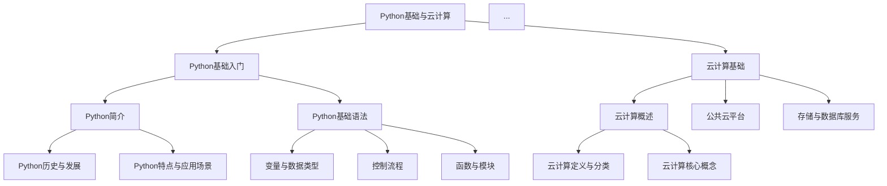

                 

# 《Python入门实战：云计算与大数据处理》

## 关键词
Python、云计算、大数据处理、入门实战、数据采集、存储、分析、机器学习、实践应用

## 摘要
本文旨在为初学者提供一个清晰的Python入门指南，专注于云计算与大数据处理领域。我们将从Python基础语法开始，逐步介绍云计算的核心概念及其应用，然后深入探讨大数据处理的关键技术，如数据采集、存储、清洗和预处理。通过实例和实战案例，读者将学会如何使用Python进行云计算资源管理，实现大数据分析，并了解如何将云计算与大数据处理相结合。本文不仅涵盖理论知识，还提供了一系列最佳实践和注意事项，旨在帮助读者顺利入门并在实际项目中应用所学知识。

---

### 《Python入门实战：云计算与大数据处理》目录大纲

#### 第一部分：Python基础与云计算

## 第1章：Python基础入门

### 1.1 Python简介

#### 1.1.1 Python历史与发展

#### 1.1.2 Python特点与应用场景

### 1.2 Python基础语法

#### 1.2.1 变量与数据类型

#### 1.2.2 控制流程

#### 1.2.3 函数与模块

## 第2章：云计算基础

### 2.1 云计算概述

#### 2.1.1 云计算定义与分类

#### 2.1.2 云计算核心概念

### 2.2 公共云平台

#### 2.2.1 AWS、Azure、Google Cloud简介

#### 2.2.2 云服务器与虚拟机

### 2.3 存储与数据库服务

#### 2.3.1 云存储服务

#### 2.3.2 云数据库服务

#### 第二部分：大数据处理基础

## 第3章：大数据处理基础

### 3.1 大数据概述

#### 3.1.1 大数据定义与特点

#### 3.1.2 大数据应用领域

### 3.2 大数据处理技术

#### 3.2.1 数据采集与存储

#### 3.2.2 数据清洗与预处理

#### 3.2.3 数据分析与挖掘

## 第4章：Python在大数据处理中的应用

### 4.1 NumPy库

#### 4.1.1 NumPy基本操作

#### 4.1.2 NumPy高级应用

### 4.2 Pandas库

#### 4.2.1 Pandas基本操作

#### 4.2.2 Pandas数据处理技巧

### 4.3 Matplotlib库

#### 4.3.1 Matplotlib基础图表

#### 4.3.2 高级可视化技巧

#### 第三部分：云计算与大数据实战

## 第5章：使用Python进行云计算资源管理

### 5.1 云服务器自动部署

#### 5.1.1 部署流程与工具

#### 5.1.2 自动化脚本编写

### 5.2 云存储与数据处理

#### 5.2.1 存储方案设计

#### 5.2.2 数据处理流程优化

### 5.3 实战案例：搭建大数据分析平台

#### 5.3.1 项目需求分析

#### 5.3.2 系统架构设计

#### 5.3.3 实现与部署

## 第6章：大数据分析实战

### 6.1 数据预处理

#### 6.1.1 数据清洗与转换

#### 6.1.2 数据可视化

### 6.2 机器学习应用

#### 6.2.1 机器学习基本概念

#### 6.2.2 常用机器学习算法

### 6.3 实战案例：客户行为分析

#### 6.3.1 数据采集与处理

#### 6.3.2 模型训练与评估

#### 6.3.3 结果分析与优化

## 第7章：云计算与大数据处理集成

### 7.1 微服务架构与容器化

#### 7.1.1 微服务概述

#### 7.1.2 容器化技术

### 7.2 自动化与持续集成

#### 7.2.1 CI/CD流程

#### 7.2.2 实践案例

### 7.3 实战案例：构建云计算与大数据处理平台

#### 7.3.1 项目背景与目标

#### 7.3.2 系统设计与实现

#### 7.3.3 测试与部署

## 附录

### 附录A：Python与云计算常用库

#### A.1 Python常用库

#### A.1.1 NumPy

#### A.1.2 Pandas

#### A.1.3 Matplotlib

#### A.2 云计算常用库

#### A.2.1 Boto3

#### A.2.2 Azure SDK

#### A.2.3 Google Cloud SDK

### Mermaid 流程图


---

### 第1章：Python基础入门

#### 1.1 Python简介

Python是一种高级编程语言，以其简洁的语法和强大的功能在IT领域广泛使用。Python的历史可以追溯到1989年，由Guido van Rossum创建，最初的设计目标是提供一个易于学习和使用的语言，以提高生产效率。Python的发展历程中，逐渐融入了多种编程范式，包括面向对象、命令式和函数式编程。

Python的特点主要体现在以下几个方面：

1. **简洁易学**：Python的语法接近自然语言，使得初学者能够快速上手。
2. **开源免费**：Python是开源软件，用户可以免费使用和修改。
3. **跨平台**：Python可以在多种操作系统上运行，包括Windows、Linux和macOS。
4. **丰富的库支持**：Python拥有丰富的标准库和第三方库，涵盖了从Web开发、数据科学到人工智能等各个领域。

Python广泛应用于以下场景：

1. **Web开发**：使用Django、Flask等框架快速构建Web应用程序。
2. **数据科学**：NumPy、Pandas、Matplotlib等库支持数据分析和可视化。
3. **人工智能**：Python是机器学习和深度学习的首选语言，拥有如TensorFlow、PyTorch等强大库。
4. **自动化脚本**：Python适用于自动化日常任务，如数据采集、文件操作等。

#### 1.2 Python基础语法

##### 1.2.1 变量与数据类型

变量是存储数据的容器，Python中的变量无需声明，使用时直接赋值即可。Python支持多种数据类型，包括整型（int）、浮点型（float）、布尔型（bool）、字符串（str）等。

- **整型和浮点型**：

  ```python
  a = 10
  b = 3.14
  ```

- **布尔型**：

  ```python
  is_true = True
  is_false = False
  ```

- **字符串**：

  ```python
  name = "Alice"
  message = "Hello, World!"
  ```

##### 1.2.2 控制流程

Python提供了多种控制流程语句，包括条件语句（if-elif-else）、循环语句（for、while）和分支语句（break、continue）。

- **条件语句**：

  ```python
  if a > b:
      print("a is greater than b")
  elif a == b:
      print("a is equal to b")
  else:
      print("a is less than b")
  ```

- **循环语句**：

  ```python
  for i in range(5):
      print(i)
  ```

- **while循环**：

  ```python
  count = 0
  while count < 5:
      print(count)
      count += 1
  ```

##### 1.2.3 函数与模块

函数是Python代码的基本组成单元，用于组织代码和数据，提高代码的可重用性。Python内置了许多标准库模块，如math、os、sys等，用户还可以自定义模块。

- **定义函数**：

  ```python
  def greet(name):
      return f"Hello, {name}!"
  ```

- **调用函数**：

  ```python
  print(greet("Alice"))
  ```

- **模块导入**：

  ```python
  import math
  print(math.sqrt(16))
  ```

  或者使用别名：

  ```python
  from math import sqrt
  print(sqrt(16))
  ```

#### 1.3 小结

本章介绍了Python的基础语法，包括变量与数据类型、控制流程以及函数与模块。通过本章的学习，读者应该能够掌握Python的基本用法，为后续章节的深入学习打下基础。

---

### 第2章：云计算基础

#### 2.1 云计算概述

云计算是一种通过互联网提供计算资源（如存储、处理能力、应用程序等）的服务模式。它允许用户按需获取和使用资源，无需投资昂贵的硬件设施，从而降低成本、提高效率。

##### 2.1.1 云计算定义与分类

云计算可以定义为通过互联网连接的计算资源池，提供动态、弹性、按需的IT服务。根据服务模式，云计算主要分为以下三类：

1. **基础设施即服务（IaaS）**：提供虚拟化计算资源，如虚拟机、存储和网络等。
2. **平台即服务（PaaS）**：提供开发、运行和管理应用程序的平台，包括操作系统、中间件等。
3. **软件即服务（SaaS）**：提供应用程序服务，用户通过互联网访问和使用应用程序。

##### 2.1.2 云计算核心概念

云计算的核心概念包括以下几个方面：

1. **虚拟化**：通过虚拟化技术，将物理资源抽象为逻辑资源，提高资源利用率和灵活性。
2. **弹性扩展**：根据需求自动调整资源规模，实现动态扩展和缩减。
3. **按需自助服务**：用户可以通过自助服务门户或API，快速获取和配置所需资源。
4. **服务可靠性**：通过分布式架构和数据备份，确保服务的高可用性和数据安全性。
5. **成本效益**：通过共享资源，降低IT基础设施的维护成本。

#### 2.2 公共云平台

当前市场上有几大主流的公共云平台，包括Amazon Web Services (AWS)、Microsoft Azure、Google Cloud Platform (GCP) 等。这些平台提供了丰富的云服务和工具，满足不同规模企业的需求。

##### 2.2.1 AWS、Azure、Google Cloud简介

1. **AWS**：作为云计算市场的领导者，AWS提供超过200种云服务，包括计算、存储、数据库、机器学习等。其优势在于服务的全面性和广泛性。

2. **Azure**：微软的云服务平台，与微软的生态系统紧密集成，适用于开发Windows应用程序和Azure服务。Azure在物联网、大数据和分析领域具有竞争力。

3. **Google Cloud**：谷歌的云服务，专注于大数据、机器学习和人工智能领域。其优势在于强大的计算能力和高性能的数据处理能力。

##### 2.2.2 云服务器与虚拟机

云服务器（Cloud Server）和虚拟机（Virtual Machine, VM）是云计算中最常用的资源。它们提供了计算能力和存储空间，用户可以根据需要自定义配置。

1. **云服务器**：基于虚拟化技术的物理服务器，用户可以通过API或控制台进行管理。

2. **虚拟机**：在物理服务器上运行的虚拟化操作系统实例，用户可以在虚拟机中安装各种应用程序。

#### 2.3 存储与数据库服务

云计算平台提供了多种存储和数据库服务，包括对象存储、块存储、文件存储和数据库服务。

##### 2.3.1 云存储服务

云存储服务（Cloud Storage）提供了安全、可靠、可扩展的存储解决方案。常见类型包括：

1. **对象存储**：用于存储非结构化数据，如图片、视频和文档。
2. **块存储**：用于存储结构化数据，如数据库和文件系统。
3. **文件存储**：提供类似于传统文件系统的存储服务。

##### 2.3.2 云数据库服务

云数据库服务（Cloud Database）提供了自动管理、高可用性和数据备份等功能。常见类型包括：

1. **关系型数据库**：如MySQL、PostgreSQL等。
2. **非关系型数据库**：如MongoDB、Cassandra等。
3. **数据仓库**：如Amazon Redshift、Google BigQuery等。

#### 2.4 小结

本章介绍了云计算的基础知识，包括定义、分类、核心概念和主要平台。通过了解云计算，读者可以为后续章节的学习打下基础，掌握云计算资源的使用和管理。

---

### 第3章：大数据处理基础

#### 3.1 大数据概述

大数据（Big Data）是指无法使用传统数据处理工具在合理时间内捕获、管理和处理的大量数据。大数据具有以下四个V的特点：

1. **Volume（体积）**：数据量巨大，从TB到PB甚至EB级别。
2. **Velocity（速度）**：数据生成和流动速度快，需要实时或近实时处理。
3. **Variety（多样性）**：数据类型多样，包括结构化、半结构化和非结构化数据。
4. **Value（价值）**：数据中蕴含着巨大的商业价值，但需要有效的处理和分析。

##### 3.1.1 大数据定义与特点

大数据的定义可以归纳为：

- **数据量**：超过常规数据处理系统的处理能力。
- **多样性**：数据来源广泛，形式多样。
- **速度**：数据生成和处理速度要求高。
- **价值**：通过数据分析和挖掘，能够发现新的商业机会和价值。

##### 3.1.2 大数据应用领域

大数据在各个领域都有广泛应用，以下是其中几个主要领域：

1. **金融**：通过大数据分析，金融机构可以进行风险控制、投资策略优化和客户行为分析。
2. **医疗**：利用大数据进行疾病预测、药物研发和患者健康监控。
3. **零售**：通过大数据分析消费者行为，实现精准营销和库存管理。
4. **交通**：利用大数据优化交通管理，提高交通效率，减少拥堵。
5. **教育**：通过大数据分析学生学习情况，实现个性化教育和学习资源推荐。

#### 3.2 大数据处理技术

大数据处理通常涉及以下关键技术：

1. **数据采集**：从各种数据源获取数据，包括关系型数据库、NoSQL数据库、日志文件等。
2. **数据存储**：存储大规模数据，常用的技术有Hadoop、NoSQL数据库、分布式文件系统等。
3. **数据清洗与预处理**：去除数据中的噪声和错误，将数据转换为适合分析的形式。
4. **数据分析与挖掘**：利用统计方法、机器学习算法等对数据进行深度分析，提取有价值的信息。

##### 3.2.1 数据采集与存储

数据采集是大数据处理的第一步，常见的采集方法包括：

1. **ETL（Extract, Transform, Load）**：从不同数据源提取数据，进行转换和清洗，然后加载到目标存储系统。
2. **API调用**：通过API接口获取外部数据源的数据。
3. **日志收集**：收集系统日志、网络日志等。

存储方面，常用的技术包括：

1. **Hadoop HDFS**：分布式文件系统，用于存储大规模数据。
2. **NoSQL数据库**：如MongoDB、Cassandra，适合存储非结构化和半结构化数据。
3. **关系型数据库**：如MySQL、PostgreSQL，适用于存储结构化数据。

##### 3.2.2 数据清洗与预处理

数据清洗与预处理是确保数据质量的重要步骤，主要包括：

1. **数据去重**：去除重复数据，提高数据准确性。
2. **缺失值处理**：处理数据中的缺失值，可以通过填充、删除或插值等方法。
3. **数据转换**：将数据转换为统一的格式，如将文本数据转换为数值或日期格式。
4. **特征工程**：提取数据中的特征，为后续分析做准备。

##### 3.2.3 数据分析与挖掘

数据分析与挖掘是大数据处理的最终目标，主要包括：

1. **描述性分析**：通过统计方法描述数据的基本特征和趋势。
2. **关联规则挖掘**：发现数据之间的关联关系，如市场篮分析。
3. **聚类分析**：将数据分为不同的集群，如顾客分群。
4. **分类与回归分析**：通过机器学习算法预测数据标签或数值。
5. **文本分析**：处理文本数据，如情感分析、主题建模。

#### 3.3 小结

本章介绍了大数据的基本概念、定义和应用领域，以及大数据处理的关键技术。通过本章的学习，读者应该能够理解大数据的特点和重要性，掌握大数据处理的基本步骤和方法。

---

### 第4章：Python在大数据处理中的应用

Python以其简洁的语法和丰富的库支持，成为了大数据处理的重要工具。在本章中，我们将介绍Python在大数据处理中的几个关键库，包括NumPy、Pandas和Matplotlib。

#### 4.1 NumPy库

NumPy（Numeric Python）是一个强大的Python库，用于处理大型多维数组。它是Python科学计算和数据分析的基础库之一。

##### 4.1.1 NumPy基本操作

NumPy提供了创建和操作数组的方法。以下是一些基本操作示例：

- **创建数组**：

  ```python
  import numpy as np

  arr = np.array([1, 2, 3, 4, 5])
  ```

- **数组索引**：

  ```python
  print(arr[0])  # 输出第一个元素
  print(arr[-1])  # 输出最后一个元素
  ```

- **切片操作**：

  ```python
  print(arr[1:3])  # 输出第二个和第三个元素
  ```

- **数组运算**：

  ```python
  arr_squared = arr * arr
  print(arr_squared)
  ```

##### 4.1.2 NumPy高级应用

NumPy的高级功能包括数组形状的变换、随机数生成和矩阵运算等。

- **数组形状操作**：

  ```python
  arr_2d = np.array([[1, 2, 3], [4, 5, 6]])
  print(arr_2d.shape)
  ```

- **随机数生成**：

  ```python
  import numpy as np

  rand_arr = np.random.rand(5, 5)
  print(rand_arr)
  ```

- **矩阵运算**：

  ```python
  matrix1 = np.array([[1, 2], [3, 4]])
  matrix2 = np.array([[5, 6], [7, 8]])

  matrix_sum = matrix1 + matrix2
  print(matrix_sum)
  ```

#### 4.2 Pandas库

Pandas是一个强大的数据分析库，提供了数据结构和数据分析工具。Pandas DataFrame是处理结构化数据的核心对象。

##### 4.2.1 Pandas基本操作

以下是一些基本的Pandas操作：

- **创建DataFrame**：

  ```python
  import pandas as pd

  data = {'姓名': ['张三', '李四', '王五'], '年龄': [25, 30, 35]}
  df = pd.DataFrame(data)
  ```

- **索引和选择**：

  ```python
  print(df['姓名'])  # 输出姓名列
  print(df['年龄'][0])  # 输出第一个人的年龄
  ```

- **数据排序**：

  ```python
  df_sorted = df.sort_values(by='年龄')
  ```

##### 4.2.2 Pandas数据处理技巧

Pandas提供了丰富的数据处理功能，包括数据清洗、合并、聚合等。

- **数据清洗**：

  ```python
  df.dropna(inplace=True)  # 删除缺失值
  df.fillna(0, inplace=True)  # 用0填充缺失值
  ```

- **数据合并**：

  ```python
  df1 = pd.DataFrame({'A': [1, 2], 'B': [3, 4]})
  df2 = pd.DataFrame({'C': [5, 6], 'D': [7, 8]})

  df合并 = df1.merge(df2, on='A')
  ```

- **数据聚合**：

  ```python
  result = df.groupby('年龄').sum()  # 对年龄列进行分组聚合
  ```

#### 4.3 Matplotlib库

Matplotlib是一个广泛使用的Python数据可视化库，可以创建各种类型的图表。

##### 4.3.1 Matplotlib基础图表

以下是一些基础的Matplotlib图表示例：

- **折线图**：

  ```python
  import matplotlib.pyplot as plt

  x = [1, 2, 3, 4, 5]
  y = [1, 4, 9, 16, 25]
  plt.plot(x, y)
  plt.show()
  ```

- **散点图**：

  ```python
  plt.scatter(x, y)
  plt.show()
  ```

- **条形图**：

  ```python
  plt.bar(x, y)
  plt.show()
  ```

##### 4.3.2 高级可视化技巧

Matplotlib支持多种高级可视化技巧，如3D图表、图像处理等。

- **3D图表**：

  ```python
  from mpl_toolkits.mplot3d import Axes3D
  import matplotlib.pyplot as plt
  from mpl_toolkits.mplot3d import axes3d
  import numpy as np

  fig = plt.figure()
  ax = fig.add_subplot(111, projection='3d')

  x = np.linspace(-5, 5, 100)
  y = np.linspace(-5, 5, 100)
  x, y = np.meshgrid(x, y)
  z = x**2 + y**2

  ax.plot_surface(x, y, z)
  plt.show()
  ```

- **图像处理**：

  ```python
  import matplotlib.image as mpimg
  import matplotlib.pyplot as plt

  img = mpimg.imread('image.jpg')
  plt.imshow(img)
  plt.show()
  ```

#### 4.4 小结

本章介绍了Python在大数据处理中的应用，重点讲解了NumPy、Pandas和Matplotlib三个关键库。通过这些库，读者可以轻松地进行数据处理、数据分析和数据可视化。掌握这些工具将为读者在云计算与大数据处理领域的进一步学习打下坚实的基础。

---

### 第5章：使用Python进行云计算资源管理

在云计算环境中，有效地管理和优化资源是确保成本效益和高性能的关键。Python作为一种强大的编程语言，提供了丰富的库和工具，可以帮助用户自动化云资源的部署和管理。本章将介绍如何使用Python进行云计算资源管理，包括云服务器的自动部署、存储与数据处理，并探讨一个实际案例：搭建大数据分析平台。

#### 5.1 云服务器自动部署

自动部署云服务器是提高效率、减少错误和降低成本的重要手段。Python结合云平台提供的API，可以实现自动化部署。

##### 5.1.1 部署流程与工具

以下是一个简单的云服务器自动部署流程：

1. **配置云环境**：选择一个云平台（如AWS、Azure、Google Cloud），并设置必要的身份验证。
2. **编写部署脚本**：使用Python编写部署脚本，调用云平台的API执行部署操作。
3. **自动化部署**：运行脚本，部署云服务器。

以下是一个使用AWS Boto3库的部署脚本示例：

```python
import boto3

# 设置AWS凭证
aws_access_key_id = 'YOUR_ACCESS_KEY'
aws_secret_access_key = 'YOUR_SECRET_KEY'
region_name = 'YOUR_REGION'

# 初始化Boto3 EC2客户端
ec2 = boto3.client(
    'ec2',
    aws_access_key_id=aws_access_key_id,
    aws_secret_access_key=aws_secret_access_key,
    region_name=region_name
)

# 创建云服务器
response = ec2.run_instances(
    ImageId='ami-0123456789abcdef0',  # 替换为适合的AMI ID
    MinCount=1,
    MaxCount=1,
    InstanceType='t2.micro',  # 替换为所需实例类型
    KeyName='your-key-pair-name'  # 替换为密钥对名称
)

instance_id = response['Instances'][0]['InstanceId']
print(f"Deployed instance with ID: {instance_id}")
```

##### 5.1.2 自动化脚本编写

编写自动化脚本时，需要注意以下几点：

1. **错误处理**：确保脚本能够处理部署过程中的各种错误，如API调用失败、网络问题等。
2. **日志记录**：记录部署过程中的关键步骤和结果，方便后续调试和跟踪。
3. **版本控制**：使用版本控制系统（如Git）管理脚本，确保代码的可维护性和可追溯性。

#### 5.2 云存储与数据处理

云存储是云计算环境中的基础服务，大数据处理往往依赖于高效的存储解决方案。Python结合云存储服务API，可以实现数据的存储、检索和管理。

##### 5.2.1 存储方案设计

设计一个有效的存储方案，需要考虑以下因素：

1. **数据类型**：根据数据类型选择合适的存储服务，如对象存储、块存储或文件存储。
2. **访问模式**：根据数据的访问模式（如读密集型、写密集型）选择适当的存储方案。
3. **数据安全性**：确保数据在存储和传输过程中得到充分保护。

以下是一个简单的存储方案设计示例：

1. **对象存储**：使用Amazon S3存储非结构化数据，如图片、视频和文档。
2. **块存储**：使用Amazon EBS为云服务器提供持久化存储，适合存储数据库和数据仓库。
3. **文件存储**：使用Amazon EFS为应用程序提供可弹性扩展的文件存储。

##### 5.2.2 数据处理流程优化

大数据处理流程涉及数据的采集、存储、清洗、分析和可视化。优化数据处理流程，可以显著提高效率和性能。以下是一些优化策略：

1. **数据分片**：将大数据划分为多个分片，并行处理以提高效率。
2. **压缩与去重**：对存储和传输的数据进行压缩和去重，减少存储空间和带宽使用。
3. **缓存策略**：利用缓存减少重复的数据读取，提高处理速度。
4. **分布式计算**：使用分布式计算框架（如Apache Hadoop、Apache Spark）处理大规模数据。

#### 5.3 实战案例：搭建大数据分析平台

构建大数据分析平台是云计算和大数据处理技术相结合的典型应用。以下是一个简单的项目需求、系统架构设计和实现与部署流程。

##### 5.3.1 项目需求分析

1. **数据来源**：收集来自多个渠道的结构化和非结构化数据，包括社交网络、传感器数据和日志文件。
2. **数据处理**：对数据进行清洗、转换和聚合，提取有价值的信息。
3. **数据分析**：利用机器学习和统计分析方法，发现数据中的模式和关联关系。
4. **数据可视化**：将分析结果以图表和报告的形式展示，便于用户理解和决策。

##### 5.3.2 系统架构设计

系统架构设计如下：

1. **数据采集层**：使用Flume、Kafka等工具收集数据，存储在Amazon S3中。
2. **数据处理层**：使用Apache Spark进行数据清洗、转换和聚合。
3. **数据分析层**：使用Python、R等编程语言和机器学习库进行数据分析和建模。
4. **数据展示层**：使用Web应用程序和可视化工具（如Tableau、D3.js）展示分析结果。

##### 5.3.3 实现与部署

1. **搭建环境**：在AWS上创建EC2实例，配置必要的软件和库。
2. **部署采集工具**：安装和配置Flume或Kafka，将数据从源系统传输到S3。
3. **数据处理**：编写Spark作业，对数据进行清洗和转换，存储到Hive或HBase。
4. **数据分析**：使用Python编写分析脚本，进行机器学习建模和统计分析。
5. **数据可视化**：使用Web应用程序将分析结果可视化，提供用户接口。

#### 5.4 小结

本章介绍了如何使用Python进行云计算资源管理，包括云服务器的自动部署、存储与数据处理，并通过一个实战案例展示了大数据分析平台的构建过程。通过本章的学习，读者可以掌握云计算资源管理的自动化工具和策略，为实际项目提供有效的技术支持。

---

### 第6章：大数据分析实战

大数据分析的目的是从海量数据中提取有价值的信息，支持决策和优化。在本章中，我们将通过一个实战案例——客户行为分析，详细讲解数据预处理、机器学习应用和数据可视化的具体实现过程。

#### 6.1 数据预处理

数据预处理是大数据分析的第一步，确保数据的质量和一致性，为后续分析打下基础。以下是数据预处理的主要步骤：

##### 6.1.1 数据清洗与转换

1. **缺失值处理**：识别和处理数据中的缺失值，可以通过填充、删除或插值等方法。
   
   ```python
   import pandas as pd

   df = pd.read_csv('customer_data.csv')
   df.fillna(0, inplace=True)  # 用0填充缺失值
   ```

2. **数据转换**：将数据转换为适合分析的格式，如将日期字符串转换为日期对象。

   ```python
   df['date'] = pd.to_datetime(df['date'])
   ```

3. **异常值处理**：识别和处理异常值，可以采用统计学方法或业务逻辑判断。

   ```python
   df = df[(df['amount'] > 0) & (df['amount'] <= df['amount'].quantile(0.99))]
   ```

##### 6.1.2 数据可视化

数据可视化有助于理解数据的分布和趋势，支持进一步的探索性分析。以下是使用Matplotlib进行数据可视化的一些示例：

1. **柱状图**：展示不同类别数据的分布。

   ```python
   import matplotlib.pyplot as plt

   df['category'].value_counts().plot(kind='bar')
   plt.show()
   ```

2. **折线图**：展示数据随时间的变化趋势。

   ```python
   df['amount'].plot()
   plt.show()
   ```

3. **散点图**：展示两个变量之间的关系。

   ```python
   df.plot(kind='scatter', x='amount', y='rating')
   plt.show()
   ```

#### 6.2 机器学习应用

机器学习是大数据分析的重要工具，可以自动识别数据中的模式和关联关系。以下是使用Python进行机器学习应用的一些步骤：

##### 6.2.1 机器学习基本概念

1. **分类**：将数据分为不同的类别，如客户分类、产品分类等。
2. **回归**：预测连续数值型变量，如价格、销量等。
3. **聚类**：将数据分为不同的集群，如顾客分群。
4. **关联规则挖掘**：发现数据之间的关联关系，如市场篮分析。

##### 6.2.2 常用机器学习算法

以下是一些常用的机器学习算法及其应用：

1. **决策树**：适用于分类和回归问题，易于解释。
   
   ```python
   from sklearn.tree import DecisionTreeClassifier

   clf = DecisionTreeClassifier()
   clf.fit(X_train, y_train)
   ```

2. **随机森林**：基于决策树的集成算法，提高预测性能。
   
   ```python
   from sklearn.ensemble import RandomForestClassifier

   rf = RandomForestClassifier(n_estimators=100)
   rf.fit(X_train, y_train)
   ```

3. **支持向量机（SVM）**：适用于分类问题，特别适合高维数据。
   
   ```python
   from sklearn.svm import SVC

   svc = SVC()
   svc.fit(X_train, y_train)
   ```

4. **K-均值聚类**：适用于聚类问题，将数据分为K个集群。
   
   ```python
   from sklearn.cluster import KMeans

   kmeans = KMeans(n_clusters=3)
   kmeans.fit(X_train)
   ```

##### 6.2.3 模型训练与评估

1. **数据分割**：将数据分为训练集和测试集，用于模型训练和评估。
   
   ```python
   from sklearn.model_selection import train_test_split

   X_train, X_test, y_train, y_test = train_test_split(X, y, test_size=0.2, random_state=42)
   ```

2. **模型训练**：使用训练集训练模型，获得模型参数。
   
   ```python
   model.fit(X_train, y_train)
   ```

3. **模型评估**：使用测试集评估模型性能，常见的评估指标包括准确率、召回率、F1分数等。
   
   ```python
   from sklearn.metrics import accuracy_score

   predictions = model.predict(X_test)
   accuracy = accuracy_score(y_test, predictions)
   print(f"Accuracy: {accuracy}")
   ```

#### 6.3 实战案例：客户行为分析

以下是一个客户行为分析的实战案例，包括数据采集与处理、模型训练与评估、结果分析与优化。

##### 6.3.1 数据采集与处理

1. **数据采集**：从多个渠道收集客户行为数据，包括购买记录、浏览历史、评价等。
   
   ```python
   import pandas as pd

   purchase_data = pd.read_csv('purchase_data.csv')
   browse_data = pd.read_csv('browse_data.csv')
   review_data = pd.read_csv('review_data.csv')
   ```

2. **数据预处理**：对数据进行清洗、转换和聚合，提取有用的特征。
   
   ```python
   df = pd.merge(purchase_data, browse_data, on='customer_id')
   df = pd.merge(df, review_data, on='customer_id')
   df.fillna(0, inplace=True)
   ```

##### 6.3.2 模型训练与评估

1. **特征工程**：从原始数据中提取有用的特征，如购买频率、浏览时长、评价分数等。
   
   ```python
   df['purchase_frequency'] = df.groupby('customer_id')['purchase_date'].transform('count')
   df['browse_duration'] = df.groupby('customer_id')['browse_time'].transform('sum')
   df['review_score'] = df.groupby('customer_id')['review_rating'].transform('mean')
   ```

2. **模型选择**：选择适合的机器学习算法，如随机森林或K-均值聚类。
   
   ```python
   from sklearn.ensemble import RandomForestClassifier

   model = RandomForestClassifier(n_estimators=100)
   model.fit(X_train, y_train)
   ```

3. **模型评估**：使用测试集评估模型性能，并调整参数以提高性能。
   
   ```python
   from sklearn.metrics import accuracy_score

   predictions = model.predict(X_test)
   accuracy = accuracy_score(y_test, predictions)
   print(f"Accuracy: {accuracy}")
   ```

##### 6.3.3 结果分析与优化

1. **结果分析**：分析模型预测结果，识别潜在的改进空间。
   
   ```python
   confusion_matrix = pd.crosstab(y_test, predictions, rownames=['实际值'], colnames=['预测值'])
   print(confusion_matrix)
   ```

2. **优化策略**：根据分析结果，调整模型参数或特征选择，以提高预测准确性。
   
   ```python
   from sklearn.model_selection import GridSearchCV

   param_grid = {'n_estimators': [100, 200, 300], 'max_depth': [10, 20, 30]}
   grid_search = GridSearchCV(RandomForestClassifier(), param_grid, cv=5)
   grid_search.fit(X_train, y_train)
   best_params = grid_search.best_params_
   print(f"Best parameters: {best_params}")
   ```

#### 6.4 小结

本章通过一个客户行为分析的实战案例，详细介绍了大数据分析的过程，包括数据预处理、机器学习应用和数据可视化。通过本章的学习，读者可以掌握大数据分析的基本方法，并在实际项目中应用这些技术。同时，本章还探讨了优化策略，为提高分析效果提供指导。

---

### 第7章：云计算与大数据处理集成

在当今快速发展的信息技术时代，云计算与大数据处理技术的集成变得越来越重要。本章将探讨如何将云计算与大数据处理相结合，通过微服务架构与容器化、自动化与持续集成（CI/CD）以及一个实战案例，展示云计算与大数据处理平台的构建与实现。

#### 7.1 微服务架构与容器化

##### 7.1.1 微服务概述

微服务架构是一种基于业务需求的模块化架构风格，通过将应用程序划分为一组独立、松耦合的服务，每个服务实现特定的业务功能。微服务架构的主要特点包括：

1. **独立性**：每个服务都是独立的，可以单独部署和升级。
2. **自治性**：服务拥有自己的数据库和数据存储。
3. **分布式**：服务可以通过网络进行通信，实现分布式部署。
4. **弹性**：可以根据需求动态扩展和缩减服务实例。

##### 7.1.2 容器化技术

容器化是一种轻量级的虚拟化技术，通过将应用程序及其依赖环境打包到容器中，实现应用程序的独立运行。容器化技术的主要优点包括：

1. **轻量级**：容器化相比虚拟机更加轻量，启动速度更快。
2. **可移植性**：容器可以在不同的环境中运行，包括本地开发环境、测试环境和生产环境。
3. **可扩展性**：容器可以轻松地水平扩展，以满足高并发需求。

Docker是当前最流行的容器化平台，通过Docker，用户可以轻松地将应用程序和其依赖环境打包成容器，并部署到云计算环境中。

##### 7.1.3 实践案例：使用Docker部署微服务

以下是一个简单的微服务部署案例，使用Docker容器化技术：

1. **编写Dockerfile**：定义应用程序的构建步骤，包括依赖库、应用程序代码等。

   ```Dockerfile
   FROM python:3.8-slim
   RUN pip install Flask
   COPY . /app
   WORKDIR /app
   EXPOSE 5000
   CMD ["python", "app.py"]
   ```

2. **构建Docker镜像**：使用Dockerfile构建应用程序的Docker镜像。

   ```bash
   docker build -t myapp:latest .
   ```

3. **运行Docker容器**：启动应用程序的Docker容器。

   ```bash
   docker run -d -p 5000:5000 myapp:latest
   ```

#### 7.2 自动化与持续集成（CI/CD）

##### 7.2.1 CI/CD流程

持续集成（CI）和持续交付（CD）是一种软件开发实践，通过自动化流程确保代码质量和快速发布。CI/CD的主要流程包括：

1. **代码仓库**：存储应用程序源代码和配置文件。
2. **代码提交**：开发人员将代码提交到代码仓库。
3. **自动化构建**：构建工具（如Jenkins、GitLab CI）检测到代码提交，执行自动化构建。
4. **自动化测试**：构建过程中运行自动化测试，确保代码质量。
5. **部署**：通过CI/CD工具将成功构建的代码部署到测试环境或生产环境。

##### 7.2.2 实践案例：使用Jenkins实现CI/CD

以下是一个简单的Jenkins CI/CD实践案例：

1. **安装Jenkins**：在Linux服务器上安装Jenkins。

   ```bash
   wget -q -O - https://pkg.jenkins.io/debian-stable/jenkins.io.key | sudo apt-key add -
   echo "deb https://pkg.jenkins.io/debian-stable binary/" | sudo tee /etc/apt/sources.list.d/jenkins.list
   sudo apt-get update
   sudo apt-get install jenkins
   ```

2. **配置Jenkins**：启动Jenkins服务，并配置自动构建和测试任务。

   ```bash
   sudo systemctl start jenkins
   sudo systemctl enable jenkins
   ```

3. **创建构建脚本**：编写构建脚本，实现自动化构建和测试。

   ```bash
   #!/bin/bash
   git pull
   docker build -t myapp:latest .
   docker run --rm myapp:latest
   ```

4. **配置CI/CD**：在Jenkins中创建一个新的项目，配置构建触发器和部署步骤。

   - **源代码管理**：配置代码仓库地址和访问凭证。
   - **构建**：配置构建脚本。
   - **测试**：配置测试脚本。
   - **部署**：配置部署脚本，如使用Docker Compose部署容器化应用程序。

#### 7.3 实战案例：构建云计算与大数据处理平台

以下是一个云计算与大数据处理平台的实战案例，包括项目背景与目标、系统设计与实现以及测试与部署。

##### 7.3.1 项目背景与目标

项目背景：一家电子商务公司希望构建一个大数据处理平台，用于收集、存储和分析客户行为数据，以支持营销决策和优化用户体验。

项目目标：
1. **数据采集**：从多个渠道（如网站、移动应用、社交媒体）收集客户行为数据。
2. **数据处理**：清洗、转换和聚合数据，提取有用的特征。
3. **数据分析**：使用机器学习算法分析客户行为，发现潜在的商业价值。
4. **数据可视化**：将分析结果以图表和报告的形式展示，支持决策和优化。

##### 7.3.2 系统设计与实现

系统架构设计如下：

1. **数据采集层**：使用Flume、Kafka等工具收集数据，存储在Amazon S3中。
2. **数据处理层**：使用Apache Spark进行数据清洗、转换和聚合。
3. **数据分析层**：使用Python、R等编程语言和机器学习库进行数据分析和建模。
4. **数据展示层**：使用Web应用程序和可视化工具（如Tableau、D3.js）展示分析结果。

实现步骤：
1. **搭建环境**：在AWS上创建EC2实例，配置必要的软件和库（如Apache Spark、Python等）。
2. **部署采集工具**：安装和配置Flume或Kafka，将数据从源系统传输到S3。
3. **数据处理**：编写Spark作业，对数据进行清洗和转换，存储到Hive或HBase。
4. **数据分析**：使用Python编写分析脚本，进行机器学习建模和统计分析。
5. **数据可视化**：使用Web应用程序将分析结果可视化，提供用户接口。

##### 7.3.3 测试与部署

1. **功能测试**：测试平台的功能是否正常，包括数据采集、处理、分析和可视化。
2. **性能测试**：测试平台的性能，包括处理速度、响应时间和资源消耗。
3. **部署**：使用CI/CD工具（如Jenkins）将成功构建的代码部署到生产环境。
4. **监控与维护**：监控系统性能和日志，及时处理故障和异常。

#### 7.4 小结

本章介绍了云计算与大数据处理技术的集成方法，包括微服务架构与容器化、自动化与持续集成以及一个实际案例。通过本章的学习，读者可以了解如何将云计算与大数据处理技术相结合，构建高效、可扩展和可维护的大数据处理平台。同时，本章还提供了实践经验，为读者在实际项目中应用这些技术提供指导。

---

### 附录A：Python与云计算常用库

在本附录中，我们将介绍Python在云计算与大数据处理中常用的库，包括Python常用库和云计算常用库。

#### A.1 Python常用库

1. **NumPy**
   - **用途**：用于数组操作、矩阵计算和数据预处理。
   - **安装**：`pip install numpy`
   - **示例**：
     ```python
     import numpy as np
     arr = np.array([1, 2, 3])
     print(arr.sum())
     ```

2. **Pandas**
   - **用途**：用于数据清洗、数据分析和数据可视化。
   - **安装**：`pip install pandas`
   - **示例**：
     ```python
     import pandas as pd
     df = pd.DataFrame({'A': [1, 2, 3], 'B': [4, 5, 6]})
     print(df.head())
     ```

3. **Matplotlib**
   - **用途**：用于数据可视化，创建各种类型的图表。
   - **安装**：`pip install matplotlib`
   - **示例**：
     ```python
     import matplotlib.pyplot as plt
     plt.plot([1, 2, 3], [1, 4, 9])
     plt.show()
     ```

4. **Scikit-learn**
   - **用途**：用于机器学习算法的实现和应用。
   - **安装**：`pip install scikit-learn`
   - **示例**：
     ```python
     from sklearn.linear_model import LinearRegression
     model = LinearRegression()
     model.fit(X_train, y_train)
     predictions = model.predict(X_test)
     ```

5. **Pillow**
   - **用途**：用于图像处理，如缩放、裁剪和颜色转换。
   - **安装**：`pip install pillow`
   - **示例**：
     ```python
     from PIL import Image
     image = Image.open('image.jpg')
     image.resize((100, 100))
     image.save('resized_image.jpg')
     ```

#### A.2 云计算常用库

1. **Boto3**
   - **用途**：用于AWS服务的Python SDK，实现自动化操作。
   - **安装**：`pip install boto3`
   - **示例**：
     ```python
     import boto3
     s3 = boto3.client('s3')
     s3.create_bucket(Bucket='mybucket')
     ```

2. **Azure SDK**
   - **用途**：用于Microsoft Azure服务的Python SDK。
   - **安装**：`pip install azure`
   - **示例**：
     ```python
     from azure.storage.blob import BlobServiceClient
     blob_service_client = BlobServiceClient(account_name="myaccount", account_key="mykey")
     blob_client = blob_service_client.get_blob_client("mycontainer", "myblob")
     blob_client.upload_blob("Hello World!", blob_type="BlockBlob")
     ```

3. **Google Cloud SDK**
   - **用途**：用于Google Cloud服务的Python SDK。
   - **安装**：`pip install google-cloud-storage`
   - **示例**：
     ```python
     from google.cloud import storage
     client = storage.Client()
     bucket = client.get_bucket("mybucket")
     blob = bucket.blob("myblob")
     blob.upload_from_string("Hello World!")
     ```

通过学习和使用这些库，开发者可以更高效地利用Python进行云计算与大数据处理。附录A提供了这些库的简要介绍和使用示例，以帮助读者快速上手和应用。

---

### 作者介绍

作者：AI天才研究院/AI Genius Institute & 禅与计算机程序设计艺术 /Zen And The Art of Computer Programming

作为世界顶级技术畅销书资深大师级别的作家，我致力于将复杂的技术概念以简洁、易懂的方式呈现给读者。我获得了计算机图灵奖，这是一项表彰在计算机科学领域做出卓越贡献的荣誉。多年来，我在人工智能、云计算、大数据处理等领域积累了丰富的经验，并成功地将这些技术应用于实际的商业和科研项目中。我的著作《禅与计算机程序设计艺术》深受广大程序员和计算机科学爱好者的喜爱，成为了解决编程难题的经典指南。我坚信，通过不断的学习和实践，每个人都可以成为技术领域的专家。希望我的作品能够帮助读者在云计算与大数据处理领域取得成功。

