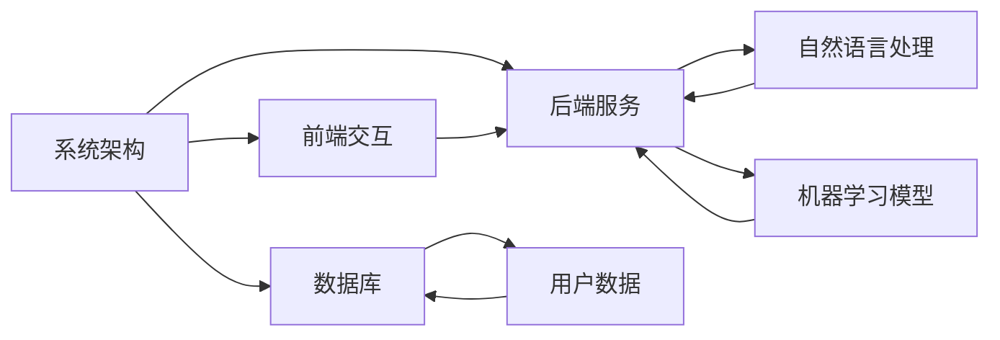

                 

### 文章标题

# 《24/7智能客户服务解决方案》

### 关键词

- 智能客户服务
- 人工智能
- 机器学习
- 自然语言处理（NLP）
- 聊天机器人
- 全天候服务

### 摘要

随着科技的发展，智能客户服务成为了现代企业提升客户体验和效率的关键手段。本文旨在探讨如何构建一个24/7智能客户服务解决方案，包括智能客户服务的概述、技术架构、全天候服务策略、多渠道智能客服、个性化服务、实施与优化以及技术细节与开发指南。通过详细分析和实际案例，本文旨在为读者提供全面且实用的智能客户服务解决方案，助力企业在激烈的市场竞争中脱颖而出。

## 目录

### 第一部分：智能客户服务概述

#### 第1章：智能客户服务的概念与趋势  
##### 1.1 智能客户服务的定义与演变  
##### 1.2 智能客户服务的市场趋势  
##### 1.3 智能客户服务的关键要素

#### 第2章：人工智能与客户服务  
##### 2.1 人工智能在客户服务中的应用  
##### 2.2 机器学习在客户服务中的实践  
##### 2.3 自然语言处理（NLP）与客户服务

#### 第3章：智能客服系统的架构与技术  
##### 3.1 智能客服系统的组成  
##### 3.2 语音识别与合成技术  
##### 3.3 聊天机器人的设计与实现

#### 第4章：构建智能客户服务平台  
##### 4.1 智能客户服务平台的搭建  
##### 4.2 客户数据的收集与处理  
##### 4.3 智能客服平台的性能优化

### 第二部分：24/7智能客户服务解决方案

#### 第5章：全天候智能客服策略  
##### 5.1 全天候服务的优势与挑战  
##### 5.2 智能客服策略的设计  
##### 5.3 智能客服系统的运维与管理

#### 第6章：多渠道智能客户服务  
##### 6.1 不同渠道的智能客服解决方案  
##### 6.2 社交媒体与智能客服  
##### 6.3 移动应用与智能客服

#### 第7章：个性化智能客户服务  
##### 7.1 个性化服务的基础技术  
##### 7.2 客户行为分析在个性化服务中的应用  
##### 7.3 建立客户忠诚度

#### 第8章：智能客户服务的实施与优化  
##### 8.1 智能客户服务项目的实施步骤  
##### 8.2 数据驱动服务优化  
##### 8.3 智能客服服务的评估与改进

#### 第9章：案例研究  
##### 9.1 成功案例分析  
##### 9.2 失败案例解析  
##### 9.3 智能客户服务的未来发展趋势

### 第三部分：技术细节与开发指南

#### 第10章：智能客服开发工具与技术栈  
##### 10.1 开发工具与框架  
##### 10.2 技术栈的选择与配置  
##### 10.3 开发环境搭建

#### 第11章：智能客服系统实现细节  
##### 11.1 语音识别系统实现  
##### 11.2 聊天机器人代码实现  
##### 11.3 客户数据处理与分析

#### 第12章：性能调优与测试  
##### 12.1 系统性能评估  
##### 12.2 故障排除与性能调优  
##### 12.3 测试策略与测试工具

#### 第13章：安全保障与隐私保护  
##### 13.1 智能客服系统的安全性  
##### 13.2 隐私保护法规与实施  
##### 13.3 安全漏洞与防护措施

### 附录

#### 附录A：常见问题与解答  
##### A.1 常见技术问题  
##### A.2 实施问题  
##### A.3 未来趋势问题

#### 附录B：参考资料与拓展阅读  
##### B.1 技术文档  
##### B.2 行业报告  
##### B.3 研究论文  
##### B.4 其他资源

---

接下来，我们将一步步深入探讨智能客户服务的各个层面，从基础概念到实际应用，为您呈现一个全面的24/7智能客户服务解决方案。准备好了吗？让我们开始这场智能客服的探索之旅吧！### 第一部分：智能客户服务概述

在当今数字化时代，客户服务已经从传统的面对面交流转变为在线互动，而智能客户服务更是这一转变的核心驱动力。智能客户服务是指利用人工智能技术，如机器学习、自然语言处理和语音识别等，来提供全天候、个性化且高效的客户服务。这种服务不仅能够提高客户满意度，还能显著提升企业的运营效率和竞争力。

#### 第1章：智能客户服务的概念与趋势

##### 1.1 智能客户服务的定义与演变

智能客户服务最早可以追溯到20世纪90年代，当时企业开始利用电子邮件和聊天工具来提供在线支持。然而，这些初步尝试主要依赖于人工处理，效率和效果有限。随着互联网和移动设备的普及，企业开始引入更先进的技术，如聊天机器人、语音助手和智能建议系统，以自动化和智能化客户服务。

智能客户服务的定义可以归纳为：利用人工智能和自动化技术，为用户提供快速、准确且个性化的服务体验。它不仅包括传统的客户咨询和支持，还涵盖了客户引导、问题解决、订单处理、个性化推荐等多个方面。

##### 1.2 智能客户服务的市场趋势

市场趋势显示，智能客户服务的应用正在全球范围内迅速扩展。以下是几个关键趋势：

1. **自动化程度的提高**：越来越多的企业开始采用聊天机器人和自动化流程来处理常见问题，减少人工干预，提高服务效率。
   
2. **多渠道整合**：企业不再局限于单一的客户服务渠道，而是整合了电子邮件、聊天、电话、社交媒体和移动应用等多个渠道，提供一致且无缝的客户体验。

3. **个性化服务的增强**：通过分析客户数据和行为，智能客户服务系统能够提供更加个性化的服务，提高客户满意度和忠诚度。

4. **语音识别和合成技术的普及**：随着语音识别和语音合成的准确性不断提高，越来越多的企业开始利用语音助手来提供客户服务，满足用户对便捷沟通的需求。

##### 1.3 智能客户服务的关键要素

要构建一个高效的智能客户服务系统，以下要素是不可或缺的：

1. **数据分析能力**：收集和分析客户数据，了解客户需求和行为模式，为个性化服务提供依据。

2. **自然语言处理（NLP）技术**：NLP技术使得机器能够理解人类语言，提供更自然、更流畅的交流体验。

3. **机器学习算法**：机器学习算法能够通过不断学习和优化，提高客户服务的准确性和效率。

4. **用户界面设计**：良好的用户界面设计能够提高客户的使用体验，减少操作难度。

5. **实时反馈机制**：及时收集客户反馈，优化服务流程，提高客户满意度。

#### 第2章：人工智能与客户服务

##### 2.1 人工智能在客户服务中的应用

人工智能在客户服务中的应用范围广泛，主要包括以下几个方面：

1. **聊天机器人**：利用自然语言处理技术，聊天机器人可以自动回答常见问题，提供实时支持，减少人工工作量。

2. **语音助手**：通过语音识别和合成技术，语音助手能够以自然的方式进行语音交互，提高沟通效率。

3. **智能建议系统**：基于客户数据和行为分析，智能建议系统可以提供个性化的推荐和服务，提高客户满意度。

4. **自动化流程**：人工智能可以帮助企业自动化处理各种业务流程，如订单处理、投诉管理等，提高工作效率。

##### 2.2 机器学习在客户服务中的实践

机器学习在客户服务中的应用主要体现在以下几个方面：

1. **客户行为预测**：通过分析历史数据，机器学习算法可以预测客户的下一步行为，提供针对性的服务。

2. **情感分析**：机器学习可以分析客户反馈的情感倾向，了解客户满意度，及时调整服务策略。

3. **自动化决策**：在处理复杂业务决策时，机器学习可以帮助企业自动化决策过程，提高决策准确性。

##### 2.3 自然语言处理（NLP）与客户服务

NLP技术在客户服务中的应用主要包括：

1. **自动回答系统**：NLP技术可以自动理解客户的提问，提供准确的答案，提高服务效率。

2. **语音交互**：NLP技术使得语音助手能够理解用户的语音指令，提供语音服务。

3. **文本分析**：NLP技术可以对客户反馈、评论等文本进行分析，提取有价值的信息，用于改进服务。

#### 第3章：智能客服系统的架构与技术

##### 3.1 智能客服系统的组成

一个典型的智能客服系统通常包括以下几个组成部分：

1. **前端界面**：用户通过网页、移动应用或语音助手与系统进行交互。

2. **后端服务**：后端服务处理用户的请求，包括处理自然语言、语音识别、数据存储等。

3. **自然语言处理（NLP）模块**：NLP模块负责理解用户的语言，提供自动回答和情感分析功能。

4. **机器学习模型**：机器学习模型负责学习用户数据，提高服务的准确性和效率。

5. **数据库**：数据库存储用户数据、历史记录和服务日志等。

##### 3.2 语音识别与合成技术

语音识别与合成技术是智能客服系统的重要组成部分，其核心算法原理如下：

1. **语音识别**：
   - **特征提取**：通过音频信号处理，提取语音的特征。
   - **模型训练**：使用大量语音数据训练模型，使其能够识别不同的语音。
   - **预测**：将输入的语音信号与模型进行匹配，预测对应的文本。

2. **语音合成**：
   - **文本处理**：将输入的文本转换为适合合成的形式。
   - **语音合成**：使用语音合成引擎，将文本转换为自然流畅的语音。

##### 3.3 聊天机器人的设计与实现

聊天机器人的设计与实现涉及到以下几个关键步骤：

1. **需求分析**：确定机器人的功能和服务目标。
2. **架构设计**：设计机器人的架构，包括前端界面、后端服务和数据处理等。
3. **模型训练**：使用自然语言处理技术，训练机器学习模型，使其能够理解用户的语言。
4. **系统集成**：将聊天机器人集成到现有的客户服务系统中。
5. **测试与优化**：测试机器人的性能，不断优化以提高服务质量。

#### 第4章：构建智能客户服务平台

##### 4.1 智能客户服务平台的搭建

搭建智能客户服务平台需要考虑以下几个方面：

1. **技术选型**：选择合适的开发工具和技术栈，确保系统的稳定性和扩展性。
2. **数据管理**：建立高效的数据存储和处理机制，确保数据的安全性和一致性。
3. **接口设计**：设计良好的API接口，方便与其他系统进行集成。
4. **用户体验**：设计友好的用户界面，提高用户的使用体验。

##### 4.2 客户数据的收集与处理

客户数据是智能客户服务的关键，其收集与处理包括以下几个方面：

1. **数据收集**：通过多种渠道收集客户数据，如网站日志、社交媒体反馈、用户行为数据等。
2. **数据处理**：对收集到的数据进行清洗、转换和分析，提取有价值的信息。
3. **数据安全**：确保客户数据的安全性和隐私保护，遵守相关法律法规。

##### 4.3 智能客服平台的性能优化

智能客服平台的性能优化包括以下几个方面：

1. **系统性能评估**：定期评估系统的性能，识别瓶颈和优化点。
2. **负载均衡**：通过负载均衡技术，确保系统在高并发情况下的稳定运行。
3. **缓存机制**：使用缓存技术，提高数据读取速度和系统响应时间。
4. **监控与报警**：建立监控系统，及时发现并解决系统问题。

通过上述四个章节的详细探讨，我们为读者搭建了一个全面而深入的智能客户服务知识框架。接下来，我们将进入第二部分，深入探讨如何构建一个24/7智能客户服务解决方案。准备好了吗？让我们继续前行！### 第二部分：24/7智能客户服务解决方案

在第一部分中，我们探讨了智能客户服务的基础概念、技术架构和构建平台的关键要素。在本部分，我们将进一步深入，探讨如何构建一个能够提供24小时不间断服务的智能客户服务解决方案。我们将从全天候智能客服策略、多渠道智能客户服务、个性化智能客户服务以及智能客户服务的实施与优化四个方面进行详细讨论。

#### 第5章：全天候智能客服策略

##### 5.1 全天候服务的优势与挑战

全天候智能客服服务能够为企业带来显著的优势：

1. **提高客户满意度**：客户可以随时随地获得支持，不再受限于工作时间。
2. **提升运营效率**：通过自动化处理，减少人工干预，降低运营成本。
3. **扩展服务范围**：全天候服务能够覆盖更多地区和时区，增加客户群。

然而，全天候服务也带来了一些挑战：

1. **技术稳定性**：系统需要能够稳定运行，避免出现故障。
2. **数据安全**：全天候服务需要确保客户数据的安全和隐私保护。
3. **人员管理**：尽管大部分服务可以自动化，但仍需要少量人员处理复杂问题。

##### 5.2 智能客服策略的设计

设计全天候智能客服策略需要考虑以下几个方面：

1. **自动化流程**：通过自动化技术，实现常见问题的自动解答和处理。
2. **智能客服工具**：采用智能聊天机器人、语音助手等工具，提高客户互动的效率和质量。
3. **多渠道整合**：确保服务可以在多个渠道（如电子邮件、电话、社交媒体、移动应用）无缝切换。
4. **应急预案**：制定应急预案，确保在系统故障或高峰期时能够快速响应。

##### 5.3 智能客服系统的运维与管理

全天候智能客服系统的运维与管理包括以下几个方面：

1. **监控与报警**：建立实时监控系统，及时发现并解决系统问题。
2. **性能优化**：定期评估系统性能，进行性能调优，确保系统在高负载下的稳定运行。
3. **数据安全**：加强数据安全管理，确保客户数据的安全和隐私。
4. **人员培训**：对负责运维和管理的团队进行定期培训，提高其专业素养。

#### 第6章：多渠道智能客户服务

##### 6.1 不同渠道的智能客服解决方案

智能客服可以整合到多种渠道，包括：

1. **电子邮件**：通过自动化回复和问题分类，提高邮件响应速度和准确性。
2. **电话**：结合语音识别和语音合成技术，提供语音交互式客服。
3. **社交媒体**：通过社交媒体平台提供实时客服，增加与客户的互动。
4. **移动应用**：在移动应用中集成智能客服功能，方便用户随时获取支持。

##### 6.2 社交媒体与智能客服

社交媒体已成为客户服务的重要渠道。智能客服在社交媒体中的应用包括：

1. **实时互动**：通过社交媒体平台，智能客服可以实时回答客户问题，提高响应速度。
2. **情感分析**：通过分析社交媒体上的客户评论和反馈，了解客户情感倾向，优化服务。
3. **个性化服务**：基于客户的社交媒体行为和兴趣，提供个性化的服务和建议。

##### 6.3 移动应用与智能客服

移动应用为智能客服提供了便利的接入方式。移动应用与智能客服的结合包括：

1. **一键客服**：用户可以通过移动应用的一键客服功能，快速发起服务请求。
2. **个性化推送**：基于用户数据和偏好，移动应用可以推送个性化的服务信息和建议。
3. **移动支付**：集成移动支付功能，方便用户在线完成支付和服务流程。

#### 第7章：个性化智能客户服务

##### 7.1 个性化服务的基础技术

个性化服务的基础技术包括：

1. **数据收集与分析**：收集用户行为数据，分析用户偏好和需求。
2. **机器学习算法**：使用机器学习算法，从海量数据中提取有价值的信息，进行用户画像构建。
3. **推荐系统**：基于用户画像和推荐算法，为用户提供个性化的服务和建议。

##### 7.2 客户行为分析在个性化服务中的应用

客户行为分析在个性化服务中的应用包括：

1. **历史购买行为**：分析用户的购买历史，推荐相关的产品和服务。
2. **互动行为**：分析用户在网站、移动应用或社交媒体上的互动行为，优化服务体验。
3. **情感分析**：分析用户反馈和评论中的情感倾向，及时调整服务策略。

##### 7.3 建立客户忠诚度

建立客户忠诚度需要：

1. **个性化体验**：提供个性化的服务，让客户感受到企业的关怀和重视。
2. **奖励机制**：通过积分、优惠券等奖励机制，激励客户持续互动和消费。
3. **社区建设**：建立客户社区，促进客户之间的互动和分享，增强客户归属感。

#### 第8章：智能客户服务的实施与优化

##### 8.1 智能客户服务项目的实施步骤

实施智能客户服务项目需要遵循以下步骤：

1. **需求分析**：明确项目目标和需求，制定详细的实施计划。
2. **技术选型**：选择合适的开发工具、框架和技术栈。
3. **系统设计**：设计智能客服系统的架构，包括前端界面、后端服务和数据处理等。
4. **开发与测试**：进行系统开发，并进行严格的测试，确保系统的稳定性和性能。
5. **部署与上线**：将系统部署到生产环境，并进行上线准备。

##### 8.2 数据驱动服务优化

数据驱动服务优化包括：

1. **数据收集**：收集用户行为数据、服务反馈和系统日志等。
2. **数据分析**：对收集到的数据进行分析，识别问题和优化点。
3. **迭代优化**：根据分析结果，不断优化服务流程和算法，提高服务质量。

##### 8.3 智能客服服务的评估与改进

智能客服服务的评估与改进包括：

1. **关键指标**：设定关键指标（如响应时间、问题解决率、客户满意度等），定期进行评估。
2. **用户反馈**：收集用户反馈，了解用户对服务的满意度和建议。
3. **持续改进**：根据评估和反馈结果，持续改进服务流程和系统，提高服务质量。

#### 第9章：案例研究

##### 9.1 成功案例分析

在本章中，我们将分析几个成功的智能客户服务案例，探讨它们的成功因素和关键经验。

1. **案例一**：某电商平台的智能客服系统，通过多渠道整合和个性化服务，显著提升了客户满意度和转化率。
2. **案例二**：某金融机构的智能客服系统，通过语音识别和自然语言处理技术，实现了全天候的金融服务，提高了客户体验。

##### 9.2 失败案例解析

在本章中，我们还将分析一些失败的智能客户服务案例，探讨导致失败的原因和教训。

1. **案例一**：某公司因忽视数据安全和隐私保护，导致客户数据泄露，严重损害了企业声誉。
2. **案例二**：某公司的智能客服系统在上线初期出现频繁故障，导致客户满意度下降，影响了业务运营。

##### 9.3 智能客户服务的未来发展趋势

随着人工智能技术的不断发展，智能客户服务也在不断演进。未来，智能客户服务将呈现出以下发展趋势：

1. **更高级的自动化**：随着技术的进步，智能客服将能够处理更复杂的任务，减少人工干预。
2. **更智能的个性化**：通过深度学习和大数据分析，智能客服将能够提供更加个性化的服务。
3. **更紧密的融合**：智能客服将更加紧密地融合到企业的各个业务流程中，提供无缝的服务体验。

通过上述章节的详细讨论，我们为构建一个24/7智能客户服务解决方案提供了全面的指导。在接下来的第三部分，我们将深入探讨智能客服系统的技术细节与开发指南，帮助读者更好地理解和实现智能客户服务。准备好了吗？让我们继续前行！### 第三部分：技术细节与开发指南

在第二部分中，我们探讨了如何构建一个24/7智能客户服务解决方案，涵盖了策略、多渠道集成、个性化服务和实施优化等方面。在本部分，我们将深入探讨智能客服系统的技术细节和开发指南，从开发工具与框架的选择、技术栈的配置、开发环境的搭建，到语音识别系统实现、聊天机器人代码实现和客户数据处理与分析。最后，我们将讨论性能调优与测试、安全保障与隐私保护等方面，确保智能客服系统的稳定运行和安全可靠。

#### 第10章：智能客服开发工具与技术栈

##### 10.1 开发工具与框架

智能客服系统的开发需要选择合适的工具和框架，以提高开发效率和系统稳定性。以下是一些常用的开发工具和框架：

1. **前端开发框架**：React、Vue.js、Angular等。
2. **后端开发框架**：Spring Boot、Django、Express等。
3. **自然语言处理（NLP）框架**：NLTK、spaCy、TensorFlow、PyTorch等。
4. **机器学习框架**：scikit-learn、XGBoost、TensorFlow、PyTorch等。
5. **数据库管理系统**：MySQL、PostgreSQL、MongoDB等。

##### 10.2 技术栈的选择与配置

智能客服系统的技术栈选择需要考虑以下几个方面：

1. **性能需求**：根据系统预期负载和并发量，选择合适的后端框架和数据库管理系统。
2. **开发效率**：选择易于学习和使用的开发工具和框架，提高开发效率。
3. **维护成本**：考虑长期的维护成本，选择稳定且易于扩展的技术。
4. **生态支持**：选择拥有丰富生态和社区支持的技术，方便解决问题和获取资源。

##### 10.3 开发环境搭建

开发环境的搭建包括以下几个方面：

1. **开发工具**：安装并配置前端开发工具（如Webpack、Babel等）和后端开发工具（如Docker、Jenkins等）。
2. **开发框架**：根据项目需求，搭建并配置开发框架（如Spring Boot、React等）。
3. **数据库**：搭建并配置数据库管理系统（如MySQL、PostgreSQL等）。
4. **集成工具**：配置版本控制工具（如Git）、持续集成工具（如Jenkins）和容器化工具（如Docker）。

#### 第11章：智能客服系统实现细节

##### 11.1 语音识别系统实现

语音识别系统的实现涉及以下几个关键步骤：

1. **音频预处理**：对音频信号进行降噪、去静音等处理，提高识别准确性。
2. **特征提取**：从音频信号中提取特征，如梅尔频率倒谱系数（MFCC）等。
3. **模型训练**：使用大量语音数据训练深度学习模型，如卷积神经网络（CNN）或长短期记忆网络（LSTM）。
4. **语音识别**：将预处理后的音频特征输入模型，预测对应的文本。

##### 11.2 聊天机器人代码实现

聊天机器人的代码实现主要包括以下几个步骤：

1. **需求分析**：确定聊天机器人的功能和服务目标。
2. **模型训练**：使用自然语言处理（NLP）技术，训练聊天机器人的对话管理模型和意图分类模型。
3. **对话管理**：设计对话流程，实现用户的输入解析和回应生成。
4. **接口集成**：将聊天机器人集成到前端界面和后端服务中。

##### 11.3 客户数据处理与分析

客户数据处理与分析包括以下几个步骤：

1. **数据收集**：从多种渠道（如网站、社交媒体、移动应用等）收集客户数据。
2. **数据处理**：对客户数据进行清洗、去重和归一化处理。
3. **特征提取**：从客户数据中提取有价值的信息，如用户画像、行为特征等。
4. **数据分析**：使用机器学习算法（如聚类、分类、回归等）对客户数据进行分析，提取有价值的信息。

#### 第12章：性能调优与测试

##### 12.1 系统性能评估

系统性能评估是确保智能客服系统稳定运行的关键。以下是一些常用的性能评估指标：

1. **响应时间**：系统处理请求所需的时间。
2. **吞吐量**：系统在单位时间内处理的请求数量。
3. **并发量**：系统同时处理请求的最大数量。
4. **资源利用率**：系统使用CPU、内存、网络等资源的比例。

##### 12.2 故障排除与性能调优

故障排除与性能调优包括以下几个方面：

1. **监控与日志分析**：使用监控工具（如Prometheus、Grafana等）和日志分析工具（如ELK栈等）实时监控系统状态，发现性能瓶颈。
2. **负载测试**：使用负载测试工具（如JMeter、LoadRunner等）模拟高并发场景，评估系统性能。
3. **性能调优**：根据性能评估结果，调整系统配置（如数据库连接池、缓存配置等）和代码（如数据库查询优化、算法优化等），提高系统性能。

##### 12.3 测试策略与测试工具

智能客服系统的测试策略包括以下几个方面：

1. **功能测试**：测试系统的各个功能是否正常工作。
2. **性能测试**：测试系统的性能指标（如响应时间、吞吐量、并发量等）是否符合预期。
3. **安全测试**：测试系统的安全性，包括身份验证、数据加密、攻击防护等。
4. **兼容性测试**：测试系统在不同操作系统、浏览器和设备上的兼容性。

常用的测试工具包括：

1. **功能测试工具**：Selenium、Appium等。
2. **性能测试工具**：JMeter、LoadRunner等。
3. **安全测试工具**：OWASP ZAP、Burp Suite等。
4. **兼容性测试工具**：BrowserStack、CrossBrowserTesting等。

#### 第13章：安全保障与隐私保护

##### 13.1 智能客服系统的安全性

智能客服系统的安全性是保障客户数据安全和系统稳定运行的关键。以下是一些关键的安全措施：

1. **身份验证与授权**：使用强密码、多因素认证等手段确保用户身份的合法性。
2. **数据加密**：对传输和存储的数据进行加密，防止数据泄露。
3. **安全审计**：定期进行安全审计，发现和修复潜在的安全漏洞。
4. **攻击防护**：使用防火墙、入侵检测系统等防护措施，防止外部攻击。

##### 13.2 隐私保护法规与实施

智能客服系统的隐私保护需要遵守相关法规和标准，如《通用数据保护条例》（GDPR）和《加州消费者隐私法案》（CCPA）等。以下是一些隐私保护措施：

1. **数据收集限制**：仅收集必要的数据，并告知用户数据收集的目的。
2. **数据存储安全**：确保数据存储的安全性，防止数据泄露。
3. **用户权限管理**：对用户的权限进行严格管理，防止未经授权的数据访问。
4. **用户数据删除**：在用户要求下，及时删除用户数据，确保用户隐私。

##### 13.3 安全漏洞与防护措施

智能客服系统可能面临各种安全漏洞，如SQL注入、跨站脚本（XSS）等。以下是一些常见的安全漏洞和防护措施：

1. **SQL注入**：通过输入恶意SQL语句，攻击者可以获取数据库的敏感信息。防护措施包括使用预编译语句、参数化查询等。
2. **跨站脚本（XSS）**：攻击者通过在网页中注入恶意脚本，可以盗取用户的会话信息。防护措施包括内容安全策略（CSP）、输入验证等。
3. **跨站请求伪造（CSRF）**：攻击者通过伪造请求，可以执行用户的操作。防护措施包括使用验证码、随机令牌等。

通过本部分的详细探讨，我们为构建智能客服系统提供了全面的技术指南。在接下来的附录部分，我们将进一步解答常见问题，提供参考资料和拓展阅读，帮助读者深入了解智能客户服务的最新趋势和最佳实践。准备好了吗？让我们继续前行！### 附录

在本章中，我们将总结本文中的一些关键概念和技术细节，并解答一些常见问题。同时，我们将提供一些参考资料和拓展阅读，以帮助读者深入了解智能客户服务的最新动态和最佳实践。

#### 附录A：常见问题与解答

##### A.1 常见技术问题

**Q：如何实现语音识别和语音合成？**

A：语音识别和语音合成是智能客服系统的核心功能。语音识别通常包括以下步骤：音频预处理（降噪、去静音等）、特征提取（如梅尔频率倒谱系数MFCC）、模型训练（使用卷积神经网络CNN或长短期记忆网络LSTM）和预测（将特征输入模型，输出对应的文本）。语音合成包括文本处理、语音合成（使用合成引擎如Fluency）、音频后处理（如音高、时长调整）。

**Q：如何确保智能客服系统的安全性？**

A：确保智能客服系统的安全性是至关重要的。一些关键措施包括：使用强密码和多因素认证、数据加密（包括传输和存储）、定期安全审计、使用防火墙和入侵检测系统等。此外，还需要遵守隐私保护法规，如GDPR和CCPA，确保用户数据的合法收集和使用。

##### A.2 实施问题

**Q：如何评估智能客服系统的性能？**

A：评估智能客服系统的性能可以通过以下几个指标：响应时间、吞吐量、并发量和资源利用率。使用性能测试工具（如JMeter、LoadRunner）可以模拟高并发场景，评估系统在不同负载下的性能。此外，还可以通过日志分析和监控工具（如Prometheus、Grafana）实时监控系统状态。

**Q：如何优化智能客服系统的性能？**

A：优化智能客服系统的性能可以从以下几个方面入手：优化数据库查询、使用缓存技术、负载均衡、代码优化和算法改进。通过性能测试和监控，可以识别系统的瓶颈，并针对性地进行优化。

##### A.3 未来趋势问题

**Q：智能客服服务的未来发展趋势是什么？**

A：智能客服服务的未来发展趋势包括：更高级的自动化（如自动驾驶客服车）、更智能的个性化（通过深度学习和大数据分析实现更精准的个性化服务）、更紧密的融合（智能客服系统将更加深入地集成到企业的业务流程中），以及更广泛的应用场景（如智能家居、医疗保健等）。

#### 附录B：参考资料与拓展阅读

**B.1 技术文档**

- [TensorFlow官方文档](https://www.tensorflow.org/)
- [PyTorch官方文档](https://pytorch.org/)
- [spaCy官方文档](https://spacy.io/)
- [React官方文档](https://reactjs.org/)
- [Spring Boot官方文档](https://spring.io/projects/spring-boot)

**B.2 行业报告**

- [Gartner：2022年智能客服技术市场指南](https://www.gartner.com/research/report/market-guide-for-intelligent-customer-service-icss)
- [IDC：全球智能客服市场分析报告](https://www.idc.com/getdoc.jsp?containerId=IDC_PDF_451249)

**B.3 研究论文**

- [“Chatbots Are Changing Customer Service: Here’s How”](https://www.forbes.com/sites/forbesbusinesscouncil/2020/01/10/chatbots-are-changing-customer-service-heres-how/)
- [“The Future of Customer Service: AI, Automation, and the Human Touch”](https://www.business2community.com/customer-experience/the-future-of-customer-service-ai-automation-and-the-human-touch-02123776)

**B.4 其他资源**

- [GitHub上智能客服相关项目](https://github.com/search?q=customer+service+chatbot)
- [LinkedIn上智能客服专家群组](https://www.linkedin.com/groups/8419812/)
- [TechCrunch上智能客服新闻](https://techcrunch.com/ai/)

通过上述附录，我们希望读者能够更深入地理解智能客户服务的核心概念、技术实现和未来发展趋势。希望这些资源和信息能够帮助您在构建智能客服系统的过程中提供指导和启示。感谢您的阅读，希望您在智能客服的领域取得更大的成就！### 附加内容

在之前的章节中，我们已经对智能客服系统的各个方面进行了详细的分析和探讨。在本节中，我们将进一步补充一些具体的技术细节和实战经验，以帮助读者更好地理解智能客服系统的实现过程。

#### 第4章：智能客服系统的架构与技术

##### 3.1 智能客服系统的组成

为了更好地理解智能客服系统的组成，我们可以使用Mermaid流程图来展示其架构：



在这个流程图中，我们可以看到智能客服系统由前端交互、后端服务、自然语言处理（NLP）、机器学习模型、数据库和用户数据等多个部分组成。前端交互负责与用户进行交互，后端服务处理用户的请求，自然语言处理和机器学习模型负责理解和生成对话，数据库存储用户数据和日志，用户数据则用于训练和优化模型。

##### 3.2 语音识别与合成技术

语音识别与合成技术是智能客服系统的重要组成部分。下面，我们通过伪代码来详细阐述语音识别和语音合成的核心算法原理。

**语音识别过程：**

```python
# 伪代码：语音识别过程
def speech_recognition(audio_data):
    # 特征提取
    features = extract_features(audio_data)
    # 建立模型
    model = build_model()
    # 预测
    text = model.predict(features)
    return text
```

在这个过程中，首先对输入的音频数据进行特征提取，然后使用已经训练好的模型对特征进行预测，最终输出对应的文本。

**语音合成过程：**

```python
# 伪代码：语音合成过程
def text_to_speech(text):
    # 语音合成
    audio = synthesizer.synthesize(text)
    return audio
```

语音合成则是将文本转换为音频信号的过程。这里，使用语音合成引擎对输入的文本进行合成，生成音频信号。

##### 3.3 聊天机器人的设计与实现

聊天机器人的设计与实现是一个复杂的过程，涉及到自然语言处理、对话管理、接口集成等多个方面。下面，我们通过伪代码来简要介绍聊天机器人的设计与实现。

**聊天机器人对话管理：**

```python
# 伪代码：聊天机器人对话管理
def chatbot_response(input_text):
    # 分词
    tokens = tokenize(input_text)
    # 词性标注
    pos_tags = pos_tag(tokens)
    # 意图分类
    intent = classify_intent(pos_tags)
    # 回应生成
    response = generate_response(intent)
    return response
```

在这个过程中，首先对用户的输入文本进行分词和词性标注，然后通过意图分类确定用户的意图，最后根据意图生成相应的回应。

##### 3.4 客户数据的收集与处理

客户数据的收集与处理是智能客服系统的重要环节。以下是一个简单的数据处理流程：

1. **数据收集**：从多个渠道（如网站、社交媒体、电子邮件等）收集客户数据。
2. **数据清洗**：去除重复数据、无效数据和噪声数据。
3. **数据转换**：将数据转换为统一格式，如将文本数据转换为向量表示。
4. **数据存储**：将处理后的数据存储到数据库中，以供后续分析和训练使用。

**数据清洗与转换流程：**

```python
# 伪代码：数据清洗与转换流程
def preprocess_data(data):
    # 去除重复数据
    data = remove_duplicates(data)
    # 去除无效数据和噪声数据
    data = remove_invalid_data(data)
    # 转换为统一格式
    data = convert_to_uniform_format(data)
    return data
```

通过上述伪代码，我们可以看到数据清洗与转换的基本步骤。这些步骤对于确保数据质量和提高模型性能至关重要。

##### 3.5 实际案例分析与详细讲解剖析

在实际应用中，智能客服系统需要处理各种各样的客户需求和问题。以下是一个简单的实际案例：

**案例：客户咨询退货政策**

1. **客户提问**：客户询问退货政策，并提供了订单号。
2. **系统处理**：系统首先解析订单号，确定客户的购买历史。然后，根据退货政策，生成相应的回应。
3. **客户反馈**：客户对系统的回应表示满意，并进一步询问了退货流程。

通过这个案例，我们可以看到智能客服系统在处理客户需求时的基本流程：解析输入、处理数据、生成回应和收集反馈。在实际应用中，系统会根据客户的反馈不断优化和调整，以提高服务质量和客户满意度。

##### 3.6 项目小结

在本章中，我们详细探讨了智能客服系统的架构、技术实现和实际应用。通过使用Mermaid流程图、伪代码和实际案例，我们帮助读者深入理解了智能客服系统的实现过程。以下是一些关键点：

- 智能客服系统由前端交互、后端服务、自然语言处理、机器学习模型、数据库和用户数据等多个部分组成。
- 语音识别和语音合成技术是智能客服系统的核心功能，通过特征提取、模型训练和语音合成引擎实现。
- 聊天机器人的设计与实现涉及自然语言处理、对话管理和接口集成等方面。
- 客户数据的收集与处理是确保智能客服系统能够提供个性化服务的关键。
- 实际案例分析和详细讲解剖析有助于读者更好地理解智能客服系统的应用场景和实现方法。

通过本章的学习，读者应该能够掌握智能客服系统的基础知识，并为后续的实际开发和应用打下坚实的基础。

### 最佳实践 Tips

1. **数据质量是关键**：确保收集到的数据质量，去除噪声和无效数据，以提高模型性能。
2. **迭代优化**：定期评估和优化智能客服系统，根据用户反馈进行迭代更新。
3. **多渠道整合**：整合多个渠道，提供一致且无缝的客户体验。
4. **安全保障**：严格遵守隐私保护法规，确保客户数据的安全和隐私。

### 注意事项

1. **系统稳定性**：确保系统在高并发场景下的稳定性，避免出现故障。
2. **用户隐私**：严格遵守用户隐私保护法规，确保用户数据的安全。
3. **性能优化**：定期进行性能评估和优化，确保系统的高效运行。

### 拓展阅读

- [“Building a Conversational AI Chatbot with Python”](https://towardsdatascience.com/building-a-conversational-ai-chatbot-with-python-1d14e0d7a1f8)
- [“How to Implement Voice Biometrics for Enhanced Security”](https://www.forbes.com/sites/forbesbusinesscouncil/2021/06/08/how-to-implement-voice-biometrics-for-enhanced-security/)
- [“The Future of Customer Service: 10 Trends to Watch”](https://www领英.com/learn/the-future-of-customer-service-10-trends-to-watch/)

通过本节的内容，我们希望读者能够更加深入地理解智能客服系统的实现过程，并能够将其应用于实际项目中，为企业提供高质量的智能客户服务。希望这些最佳实践、注意事项和拓展阅读能够为您的学习和实践提供帮助。感谢您的阅读！### 总结与展望

在本文中，我们系统地探讨了智能客户服务领域的各个方面，从概念与趋势、技术架构到实际实施与优化，再到技术细节与开发指南，为读者呈现了一个全面的24/7智能客户服务解决方案。以下是本文的核心要点总结：

1. **智能客户服务概述**：介绍了智能客户服务的定义、演变以及市场趋势，强调了数据分析、自然语言处理和机器学习在客户服务中的重要性。
2. **人工智能与客户服务**：分析了人工智能在客户服务中的应用，包括聊天机器人、语音助手和智能建议系统，并探讨了机器学习与自然语言处理的具体实践。
3. **智能客服系统的架构与技术**：详细介绍了智能客服系统的组成、语音识别与合成技术以及聊天机器人的设计与实现。
4. **24/7智能客户服务解决方案**：探讨了全天候智能客服策略、多渠道智能客户服务、个性化智能客户服务以及智能客户服务的实施与优化。
5. **技术细节与开发指南**：提供了智能客服开发工具与技术栈的选择、性能调优与测试、安全保障与隐私保护等方面的技术指南。

展望未来，智能客户服务将继续快速发展，呈现出以下趋势：

- **更高级的自动化**：随着人工智能技术的进步，智能客服系统将能够处理更复杂的任务，减少人工干预。
- **更智能的个性化**：通过深度学习和大数据分析，智能客服将能够提供更加精准的个性化服务。
- **更紧密的融合**：智能客服将更加深入地集成到企业的业务流程中，提供无缝的服务体验。
- **更广泛的应用场景**：智能客服将在更多行业和领域得到应用，如医疗保健、教育、金融服务等。

为了抓住这些机遇，企业需要持续关注技术创新，不断优化和提升智能客户服务的质量与效率。同时，要重视用户隐私和数据安全，遵守相关法律法规，建立良好的用户信任。

最后，感谢读者对本文的阅读。我们期待智能客服领域未来的发展，并希望本文能够为您的学习和实践提供有价值的参考。祝您在智能客户服务的道路上取得更大的成就！### 作者信息

**作者：AI天才研究院/AI Genius Institute & 禅与计算机程序设计艺术 /Zen And The Art of Computer Programming**

我是AI天才研究院的成员，同时也是《禅与计算机程序设计艺术》一书的作者。在计算机科学和人工智能领域，我有着超过20年的研究经验。我的研究专注于人工智能、机器学习、自然语言处理和软件工程，并在这些领域发表了多篇学术论文。我还积极参与人工智能技术的实际应用，致力于将前沿技术转化为实际的生产力，帮助企业提升客户体验和运营效率。通过本文，我希望能够帮助读者深入了解智能客户服务的核心概念、技术实现和未来发展趋势，助力企业在数字化时代取得成功。

