                 

### 文章标题

《一人公司创业：程序员的机遇与挑战》

> 关键词：一人公司、创业、程序员、机遇、挑战、财务、运营、产品开发、市场营销、团队管理、法律合规、持续发展

> 摘要：本文旨在探讨程序员如何利用自身技术优势，通过一人公司创业模式实现个人职业发展的同时，应对创业过程中的种种挑战。文章将从创业基础知识、程序员的独特优势、财务与运营管理、项目实施与推广、团队管理与文化建设、法律与合规等方面，详细分析一人公司创业的机遇与挑战，并提供实用的策略和建议。

### 第一部分：创业基础知识与准备

#### 第1章：创业初探

##### 1.1 创业的动机与挑战

创业是一种挑战，也是一种机遇。对于程序员来说，创业不仅能够实现个人价值，还能推动技术创新和行业进步。然而，创业之路并非一帆风顺，创业者需要面对各种挑战。

- **个人兴趣与市场需求分析**：创业的动机往往源于个人兴趣和市场需求。程序员在技术领域有着深厚的积累，但如何将兴趣转化为市场需求，需要深入调研和思考。

- **创业的风险与回报**：创业风险巨大，包括市场风险、技术风险、资金风险等。然而，成功创业所带来的回报也极具吸引力，包括财富、成就感和社会地位等。

##### 1.2 创业前的准备

在创业之前，程序员需要做好充分的准备，以确保创业的成功。

- **资源评估与规划**：程序员需要评估自身的资源，包括技术能力、时间、资金等，并制定详细的创业规划。

- **商业模式与目标定位**：明确商业模式和目标市场，有助于创业者更好地规划创业方向。

### 第2章：程序员的独特优势

##### 2.1 程序员技能在创业中的应用

- **技术开发能力**：程序员的核心技能是技术开发，这在创业过程中具有重要作用。创业者可以利用技术能力快速搭建原型，验证市场需求。

- **项目管理与团队协作**：程序员通常具备较强的项目管理和团队协作能力，这在创业过程中同样重要。创业者需要有效管理项目进度和团队协作，以确保项目顺利推进。

##### 2.2 创业中的技术决策

- **技术选型与架构设计**：创业者需要根据市场需求和项目特点，选择合适的技术方案和架构设计。

- **技术创新与产品迭代**：技术创新是创业的关键，创业者需要不断探索新技术，推动产品迭代。

### 第3章：财务与运营管理

##### 3.1 初创企业的财务规划

- **资金筹集与管理**：创业者需要制定详细的财务规划，包括资金筹集、成本控制和盈利模式等。

- **成本控制与盈利模式**：成本控制是初创企业的关键，创业者需要严格控制成本，提高盈利能力。

##### 3.2 运营管理策略

- **市场推广与营销策略**：创业者需要制定有效的市场推广和营销策略，提高品牌知名度和市场占有率。

- **团队建设与管理**：团队建设是创业成功的关键，创业者需要吸引和培养优秀人才，建立高效团队。

### 第二部分：创业项目实施与推广

#### 第4章：产品设计与开发

##### 4.1 产品设计流程

- **用户需求分析**：创业者需要深入了解用户需求，确保产品能够满足用户需求。

- **产品原型设计与迭代**：通过原型设计和迭代，不断优化产品功能和用户体验。

##### 4.2 开发与测试

- **编码与集成**：程序员需要根据产品需求进行编码和集成，确保系统功能的实现。

- **自动化测试与持续集成**：自动化测试和持续集成有助于提高开发效率，确保产品质量。

#### 第5章：市场营销与推广

##### 5.1 市场分析

- **市场定位与目标用户分析**：创业者需要明确市场定位和目标用户，制定有针对性的营销策略。

- **竞争对手分析**：了解竞争对手的优势和劣势，制定差异化营销策略。

##### 5.2 营销策略

- **网络营销手段**：利用网络营销手段，提高品牌知名度和市场占有率。

- **社交媒体营销与内容创作**：通过社交媒体和内容创作，吸引目标用户，提高用户粘性。

#### 第6章：团队管理与文化建设

##### 6.1 团队建设

- **人才招聘与培养**：创业者需要吸引和培养优秀人才，建立高效团队。

- **团队协作与沟通**：团队协作和沟通是团队建设的关键，创业者需要建立良好的团队协作机制。

##### 6.2 企业文化建设

- **企业价值观与使命**：明确企业价值观和使命，为企业发展提供方向。

- **企业文化的建设与传承**：通过企业文化的建设与传承，凝聚团队力量，提高企业凝聚力。

#### 第7章：创业中的法律与合规

##### 7.1 知识产权保护

- **专利申请与保护**：创业者需要重视知识产权保护，申请专利保护技术创新成果。

- **著作权与商标保护**：著作权和商标保护是创业者必须关注的重要法律问题。

##### 7.2 合规与风险控制

- **税务合规**：创业者需要遵守税务法规，确保企业税务合规。

- **数据保护与隐私政策**：数据保护和隐私政策是现代企业必须关注的重要问题。

### 第三部分：创业的持续发展与挑战应对

#### 第8章：企业成长与转型

##### 8.1 企业成长策略

- **资本运作与融资**：创业者需要了解资本运作和市场规律，实现企业快速成长。

- **市场拓展与国际化**：创业者需要关注市场拓展和国际化，实现企业的全球布局。

##### 8.2 创业的持续创新

- **技术创新与产品迭代**：创业者需要不断进行技术创新，推动产品迭代。

- **市场创新与商业模式创新**：创业者需要不断探索市场创新和商业模式创新，保持企业的竞争优势。

#### 第9章：创业挑战与解决方案

##### 9.1 资金不足

- **资金筹集策略**：创业者需要制定有效的资金筹集策略，确保企业资金链不断。

- **资金使用效率提升**：创业者需要提高资金使用效率，确保企业财务健康。

##### 9.2 团队管理困难

- **团队建设与文化建设**：创业者需要重视团队建设和文化建设，提高团队执行力。

- **管理工具与方法**：创业者需要掌握有效的管理工具与方法，提高管理效率。

#### 第10章：创业的持续学习与适应

##### 10.1 创业者的自我提升

- **不断学习新技术**：创业者需要不断学习新技术，提高自身技术能力。

- **保持市场敏锐度**：创业者需要保持市场敏锐度，及时调整战略方向。

##### 10.2 适应变化与灵活调整

- **市场变化应对**：创业者需要适应市场变化，及时调整策略。

- **创业心态调整**：创业者需要保持积极心态，应对创业过程中的各种挑战。

### 附录

#### 附录 A：创业工具与资源推荐

##### A.1 创业工具

- **项目管理工具**：如Trello、Jira等。
- **云计算服务**：如AWS、Azure等。

##### A.2 创业资源

- **创业社区与论坛**：如Reddit、Stack Overflow等。
- **创业培训课程**：如Udemy、Coursera等。

#### 附录 B：创业案例分析

##### B.1 成功案例

- **程序员创业的成功故事**：如张小龙的微信、马云的阿里巴巴等。

##### B.2 失败案例分析

- **创业失败的原因与启示**：如ofo共享单车的资金链断裂等。

---

### 作者信息

作者：AI天才研究院/AI Genius Institute & 禅与计算机程序设计艺术 /Zen And The Art of Computer Programming

---

### 完整性要求

**背景介绍**

创业是一个充满挑战和机遇的过程。对于程序员而言，创业不仅能够实现个人职业发展的突破，还能为行业带来创新和进步。然而，创业过程中面临的挑战也是巨大的，如资金不足、团队管理困难、市场竞争激烈等。因此，程序员在创业前需要做好充分的准备，了解创业的基本知识，并发挥自身的独特优势。

**核心概念与联系**

在创业过程中，程序员需要掌握以下核心概念：

1. **技术开发能力**：程序员的核心技能，包括编程、系统设计、算法优化等。
2. **项目管理能力**：包括项目规划、进度管理、团队协作等。
3. **市场分析能力**：包括市场需求分析、竞争对手分析、市场定位等。

这些核心概念相互联系，共同构成程序员在创业中的核心竞争力。

**Mermaid 流程图**

```mermaid
graph TD
    A[技术开发能力] --> B[项目管理能力]
    A --> C[市场分析能力]
    B --> D[团队协作]
    C --> E[市场需求分析]
    C --> F[竞争对手分析]
    G[资金筹集] --> H[成本控制]
    I[运营管理] --> J[市场推广]
    K[团队建设] --> L[企业文化]
    M[法律合规] --> N[知识产权保护]
    O[持续发展] --> P[技术创新]
    Q[市场创新]
    R[商业模式创新]
    S[资本运作]
    T[国际化]
    U[资金不足]
    V[团队管理困难]
    W[适应变化]
    X[创业心态调整]
    A1[个人兴趣与市场需求分析] --> A
    A2[创业的风险与回报] --> A
    B1[技术选型与架构设计] --> B
    B2[技术创新与产品迭代] --> B
    C1[用户需求分析] --> C
    C2[产品原型设计与迭代] --> C
    D1[编码与集成] --> D
    D2[自动化测试与持续集成] --> D
    E1[市场定位与目标用户分析] --> E
    E2[竞争对手分析] --> E
    F1[网络营销手段] --> F
    F2[社交媒体营销与内容创作] --> F
    G1[人才招聘与培养] --> G
    G2[团队协作与沟通] --> G
    H1[企业价值观与使命] --> H
    H2[企业文化的建设与传承] --> H
    I1[专利申请与保护] --> I
    I2[著作权与商标保护] --> I
    J1[税务合规] --> J
    J2[数据保护与隐私政策] --> J
    K1[资本运作与融资] --> K
    K2[市场拓展与国际化] --> K
    L1[技术创新与产品迭代] --> L
    L2[市场创新与商业模式创新] --> L
    M1[资金筹集策略] --> M
    M2[资金使用效率提升] --> M
    N1[团队建设与文化建设] --> N
    N2[管理工具与方法] --> N
    O1[不断学习新技术] --> O
    O2[保持市场敏锐度] --> O
    P1[市场变化应对] --> P
    P2[创业心态调整] --> P
```



**核心算法原理讲解**

**伪代码：**

```python
function createBusiness():
    assess_resources()
    plan_business_model()
    gather_funding()
    develop_technology()
    manage_projects()
    market_products()
    build_teams()
    comply_with_law()

function assess_resources():
    skills = ["programming", "system design", "algorithm optimization"]
    time = "full-time commitment"
    money = "personal savings + loans"
    print("Resources assessed:", skills, time, money)

function plan_business_model():
    market_analysis()
    competitive_analysis()
    define_value_proposition()
    print("Business model planned")

function gather_funding():
    explore_loan_options()
    seek_investors()
    manage_finances()
    print("Funding gathered")

function develop_technology():
    select_technology()
    design_architecture()
    innovate_products()
    print("Technology developed")

function manage_projects():
    plan_projects()
    coordinate_teams()
    integrate_modules()
    print("Projects managed")

function market_products():
    analyze_markets()
    position_products()
    promote_brands()
    print("Products marketed")

function build_teams():
    recruit_talent()
    train_teams()
    facilitate_communication()
    print("Teams built")

function comply_with_law():
    protect_ip()
    ensure_compliance()
    manage_risks()
    print("Legal compliance ensured")
```

**数学模型和公式 & 详细讲解 & 举例说明**

**财务规划中的数学模型**

1. **盈利模型**：
   $$\text{净利润} = \text{收入} - \text{成本} - \text{费用}$$
   - **收入**：企业通过销售产品或提供服务所获得的收入。
   - **成本**：生产产品或提供服务所需的直接和间接成本。
   - **费用**：包括运营费用、管理费用、财务费用等。

2. **现金流模型**：
   $$\text{现金流} = \text{经营现金流} + \text{投资现金流} + \text{筹资现金流}$$
   - **经营现金流**：企业日常运营所产生的现金流入和流出。
   - **投资现金流**：企业投资活动和资产处置所产生的现金流入和流出。
   - **筹资现金流**：企业通过融资活动所产生的现金流入和流出。

**举例说明**：

假设一家初创公司预计年收入为100万元，成本为50万元，运营费用为10万元。根据盈利模型，净利润为40万元。如果公司需要投资50万元进行研发和技术升级，同时通过股权融资筹集100万元，则其现金流模型为：
$$\text{现金流} = 100\text{万元} - 50\text{万元} - 10\text{万元} + 0\text{万元} + 100\text{万元} = 140\text{万元}$$

**代码实现与解读**

**伪代码：**

```python
def financial_planning(revenue, cost, operating_expenses, investment, funding):
    net_profit = revenue - cost - operating_expenses
    cash_flow = net_profit + investment + funding
    print(f"Net Profit: {net_profit}万元")
    print(f"Cash Flow: {cash_flow}万元")
    return net_profit, cash_flow

revenue = 1000000
cost = 500000
operating_expenses = 100000
investment = 500000
funding = 1000000

net_profit, cash_flow = financial_planning(revenue, cost, operating_expenses, investment, funding)
```

**项目实战**

**开发环境搭建**

1. **操作系统**：选择Linux或macOS，以获得更好的开发体验。
2. **编程语言**：选择Python或Java，这两种语言在编程社区中都有广泛的运用。
3. **集成开发环境**：使用Visual Studio Code或IntelliJ IDEA，这两个IDE提供了丰富的插件和功能，支持多种编程语言。

**源代码实现**

```python
# Python示例代码：简单的用户管理系统

class UserManager:
    def __init__(self):
        self.users = []

    def add_user(self, user):
        self.users.append(user)
        print(f"User {user} added successfully.")

    def remove_user(self, user):
        if user in self.users:
            self.users.remove(user)
            print(f"User {user} removed successfully.")
        else:
            print(f"User {user} not found.")

    def list_users(self):
        print("All users:")
        for user in self.users:
            print(user)

if __name__ == "__main__":
    user_manager = UserManager()
    user_manager.add_user("Alice")
    user_manager.add_user("Bob")
    user_manager.list_users()
    user_manager.remove_user("Alice")
    user_manager.list_users()
```

**代码应用解读与分析**

该示例代码实现了一个简单的用户管理系统，包含添加用户、删除用户和列出所有用户的功能。通过这个示例，程序员可以学习到以下知识点：

1. **类和对象**：使用类定义用户管理系统，使用对象实例化和管理用户。
2. **列表操作**：使用列表存储用户信息，并实现添加、删除和列出用户的功能。
3. **异常处理**：在删除用户时，检查用户是否存在，避免出现异常。

**实际案例分析和详细讲解剖析**

**案例**：一家初创公司开发了一款基于云的文档共享工具，用户可以方便地共享和协作编辑文档。

**分析**：

1. **市场需求**：基于云的文档共享工具能够满足企业和个人用户的需求，特别是在远程工作和团队协作越来越普及的背景下。
2. **技术实现**：公司采用微服务架构，将文档存储、用户认证、权限管理等功能拆分成独立的微服务，以提高系统的可扩展性和可维护性。
3. **挑战与解决方案**：公司在开发过程中面临技术选型、性能优化和安全保障等挑战。通过选择成熟的技术栈、进行性能测试和采用加密技术，公司成功解决了这些挑战。

**项目小结**

通过该案例，程序员可以学习到以下最佳实践：

1. **市场需求分析**：深入了解用户需求，确保产品能够满足市场需求。
2. **技术选型**：选择合适的技术栈，提高开发效率和系统性能。
3. **性能优化**：进行性能测试和优化，确保系统稳定运行。
4. **安全保障**：采用加密技术和安全措施，保护用户数据安全。

**最佳实践 tips**

1. **持续集成**：使用Git和CI工具，实现代码的自动化测试和部署，提高开发效率。
2. **代码规范**：遵循良好的代码规范，提高代码的可读性和可维护性。
3. **文档编写**：编写详细的文档，包括设计文档、用户手册和API文档等，方便后续开发和用户使用。

### 总结与拓展阅读

本文从多个方面详细分析了程序员如何通过一人公司创业，实现个人职业发展的同时，应对创业过程中的挑战。通过本文，程序员可以了解创业的基本知识、财务与运营管理、产品开发与推广、团队管理与文化建设等方面的关键要素。

为了进一步深入了解一人公司创业的实践和方法，读者可以参考以下拓展阅读：

1. **《精益创业》**：艾瑞克·莱斯（Eric Ries）著，详细介绍了精益创业方法论，帮助创业者快速验证市场需求，降低创业风险。
2. **《程序员创业指南》**：李笑来著，针对程序员创业的特点，提供了实用的指导和建议。
3. **《创业维艰》**：本·霍洛维茨（Ben Horowitz）著，分享了硅谷创业家在创业过程中的经验和教训，对创业者具有很高的参考价值。

通过不断学习和实践，程序员可以充分发挥自身的技术优势，成功实现一人公司创业，迈向更加广阔的职业舞台。

