                 

### 文章标题：一人公司如何实现智能化办公

关键词：智能化办公、一人公司、人工智能、机器学习、智能算法、办公系统、应用案例、未来趋势

摘要：随着人工智能技术的飞速发展，智能化办公已经成为了现代企业提高效率、降低成本的重要手段。本文旨在探讨一人公司如何通过智能化办公实现高效运营。我们将首先介绍智能化办公的基础概念和原理，然后详细讲解智能办公设备的选型与应用，最后分析智能化办公系统的建设方法和应用案例，以期为读者提供一套完整的智能化办公实现方案。

### 第一部分：智能化办公的基础

#### 第1章：智能化办公概述

##### 1.1 智能化办公的概念与发展历程

###### 1.1.1 智能化办公的定义

智能化办公是指利用人工智能技术，如机器学习、自然语言处理、数据挖掘等，对办公环境中的各种信息进行自动化处理和智能化管理，从而提高工作效率、降低人力成本的一种新型办公模式。

###### 1.1.2 智能化办公的发展历程

智能化办公的发展历程可以追溯到20世纪末。随着计算机技术的普及，办公自动化开始成为企业提高效率的重要手段。随后，随着互联网、大数据和人工智能等技术的快速发展，智能化办公逐渐从简单的自动化任务执行，向更加智能化、自动化的方向发展。

###### 1.1.3 智能化办公的核心要素

智能化办公的核心要素包括以下几个方面：

1. **人工智能技术**：利用机器学习、自然语言处理、数据挖掘等技术，对办公过程中的数据进行处理和分析。
2. **智能设备**：如智能手机、平板电脑、智能手表、智能音箱等，用于实现办公的自动化和智能化。
3. **智能办公系统**：通过集成各种智能设备和技术，构建一套完整的智能化办公系统，实现办公流程的自动化和智能化。
4. **数据与信息**：智能化办公的基础是大量的数据和信息，这些数据和信息需要通过人工智能技术进行处理和分析，以实现智能化的办公。

##### 1.2 智能化办公的技术原理

###### 1.2.1 人工智能的基本概念

人工智能（Artificial Intelligence，AI）是计算机科学的一个分支，旨在研究、开发用于模拟、延伸和扩展人的智能的理论、方法、技术及应用系统。人工智能主要包括以下三个层次：

1. **感知层次**：通过传感器、摄像头等设备获取外界信息，如语音、图像、文本等。
2. **理解层次**：对获取的信息进行理解和处理，如语音识别、图像识别、自然语言处理等。
3. **决策与行动层次**：根据理解和处理的结果，做出决策并执行相应的行动，如自动驾驶、智能客服等。

###### 1.2.2 机器学习在办公中的应用

机器学习（Machine Learning，ML）是人工智能的一个重要分支，通过构建数学模型，从大量的数据中自动获取规律，进行决策和预测。在智能化办公中，机器学习主要用于以下几个方面：

1. **数据处理与分析**：对办公过程中的大量数据进行分析和处理，提取有价值的信息。
2. **预测与优化**：根据历史数据，预测未来的工作需求和趋势，优化办公流程。
3. **自动化与智能化**：利用机器学习模型，实现办公任务的自动化和智能化，如智能邮件处理、自动日程安排等。

###### 1.2.3 智能算法的实现与优化

智能算法是实现智能化办公的关键，主要包括以下几种：

1. **聚类算法**：用于将相似的数据分组，以便于分析和处理。
2. **分类算法**：用于将数据分为不同的类别，用于决策和预测。
3. **回归算法**：用于建立数据之间的数学模型，进行预测和优化。
4. **深度学习算法**：用于处理复杂的数据，实现更加智能化的决策和预测。

智能算法的实现与优化主要包括以下几个方面：

1. **算法选择**：根据具体的应用场景和数据特点，选择合适的算法。
2. **模型训练**：通过大量的数据进行训练，优化算法的性能。
3. **模型评估**：通过测试数据，评估算法的准确性和可靠性。
4. **算法优化**：根据评估结果，对算法进行优化，提高性能。

#### 第2章：智能办公设备的选型与应用

##### 2.1 智能办公设备的分类与功能

智能办公设备是智能化办公的重要组成部分，主要包括以下几类：

1. **智能手机与平板电脑**：用于日常办公，如电子邮件、日程管理、文档处理等。
2. **智能手表与智能眼镜**：用于实时获取和处理信息，如短信提醒、日程提醒、实时数据监控等。
3. **智能音响与智能音箱**：用于语音控制，如智能助手、音乐播放、语音搜索等。

每种智能办公设备都有其独特的功能和优势，选择合适的设备可以帮助一人公司提高办公效率。

##### 2.2 智能办公设备的应用场景

智能办公设备的应用场景非常广泛，以下是一些常见应用场景：

1. **个人办公**：用于个人日常办公，如邮件处理、日程管理、文档编辑等。
2. **团队协作**：用于团队内部协作，如共享文档、在线会议、任务分配等。
3. **企业管理**：用于企业管理，如财务报表、客户管理、库存管理等。

在不同场景下，智能办公设备的应用方式也有所不同，需要根据具体需求进行选型和配置。

##### 2.3 智能办公设备的使用技巧与注意事项

智能办公设备的使用技巧和注意事项如下：

1. **智能手机与平板电脑**：
   - **技巧**：使用云服务同步数据，确保数据安全；合理使用屏幕亮度、蓝牙、GPS等设置，延长设备寿命。
   - **注意事项**：避免长时间连续使用，适当休息，预防视力疲劳；防止设备过热，避免使用非原装充电器。

2. **智能手表与智能眼镜**：
   - **技巧**：根据实际需求选择合适的智能手表或智能眼镜；定期进行设备维护，确保设备正常运行。
   - **注意事项**：避免长时间佩戴，注意保护视力；避免设备受到撞击或浸水。

3. **智能音响与智能音箱**：
   - **技巧**：合理设置语音助手，方便快速完成操作；学会使用智能音响的各种功能，提高办公效率。
   - **注意事项**：避免将智能音响放在潮湿或阳光直射的地方，防止设备损坏；保护隐私，不要随意透露个人信息。

### 第二部分：智能化办公系统的建设

#### 第3章：智能化办公系统的设计与开发

##### 3.1 智能化办公系统的需求分析

智能化办公系统的需求分析是系统设计与开发的重要环节。以下是从需求分析的角度，对一人公司智能化办公系统的设计进行详细讲解。

###### 3.1.1 办公流程的梳理与优化

办公流程的梳理与优化是智能化办公系统需求分析的基础。首先，需要对公司现有的办公流程进行全面梳理，包括各个环节的职责分工、信息流转、时间安排等。然后，根据梳理结果，分析现有流程中存在的问题和瓶颈，提出优化方案。优化方案可以包括流程简化、自动化、智能化等方面。

以下是一个办公流程优化的示例：

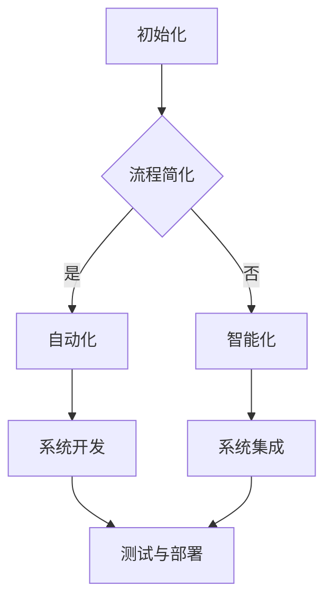

在这个示例中，通过梳理现有流程，发现可以简化部分流程，并实现自动化处理。接下来，进入系统开发阶段，实现自动化流程。

###### 3.1.2 办公需求的分析与挖掘

办公需求的分析与挖掘是智能化办公系统需求分析的另一个重要方面。通过分析公司员工的办公需求，挖掘出潜在的功能需求、性能需求、安全性需求等。

以下是一个办公需求分析的示例：

```mermaid
graph TD
A[功能需求] --> B{邮件处理}
A --> C{日程管理}
A --> D{文档编辑}
B --> E[快速回复]
C --> F[智能提醒]
D --> G[协同编辑}
E --> H[语音回复]
F --> I[日历共享]
G --> J[权限管理}
H --> K[语音助手]
I --> L[数据安全]
J --> M[加密通信]
K --> N[智能搜索]
L --> O[数据备份]
M --> P[防火墙]
N --> Q[实时更新]
O --> P
```

在这个示例中，通过分析员工的办公需求，挖掘出了多个功能需求。接下来，根据需求分析结果，进行系统架构设计。

##### 3.2 智能化办公系统的架构设计

智能化办公系统的架构设计是系统建设的关键步骤。以下是从架构设计的角度，对一人公司智能化办公系统的设计进行详细讲解。

###### 3.2.1 系统架构的组成

智能化办公系统通常由以下几个组成部分构成：

1. **前端**：负责用户界面和交互，实现用户与系统的交互。
2. **后端**：负责业务逻辑处理和数据存储，实现数据管理和业务处理。
3. **数据库**：负责存储系统数据，包括用户数据、业务数据等。
4. **人工智能模块**：负责数据分析和处理，实现智能化的功能。

以下是一个智能化办公系统的架构设计示例：

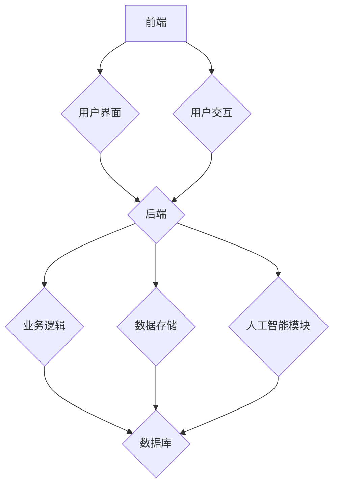

在这个示例中，前端负责用户界面和交互，后端负责业务逻辑处理和数据存储，人工智能模块负责数据分析和处理。

###### 3.2.2 数据处理与存储架构

数据处理与存储架构是智能化办公系统的核心部分。以下是从数据处理与存储架构的角度，对一人公司智能化办公系统的设计进行详细讲解。

1. **数据处理架构**：智能化办公系统需要处理大量的数据，包括用户数据、业务数据等。数据处理架构需要实现数据的采集、处理、存储和输出等功能。以下是一个数据处理架构的示例：


在这个示例中，数据采集模块负责从各个渠道采集数据，数据处理模块负责对数据进行清洗、处理和分析，数据存储模块负责将数据存储到数据库中，数据输出模块负责将处理后的数据输出到前端或后端系统。

2. **数据存储架构**：数据存储架构需要考虑数据的安全性、可靠性、可扩展性等因素。以下是一个数据存储架构的示例：


在这个示例中，用户数据和业务数据存储在数据库中，数据备份模块负责定期备份数据库，确保数据的安全性和可靠性。

###### 3.2.3 人工智能算法的应用架构

人工智能算法在智能化办公系统中发挥着重要作用。以下是从人工智能算法应用架构的角度，对一人公司智能化办公系统的设计进行详细讲解。

1. **算法选择**：根据实际需求和数据特点，选择合适的算法。以下是一个算法选择示例：

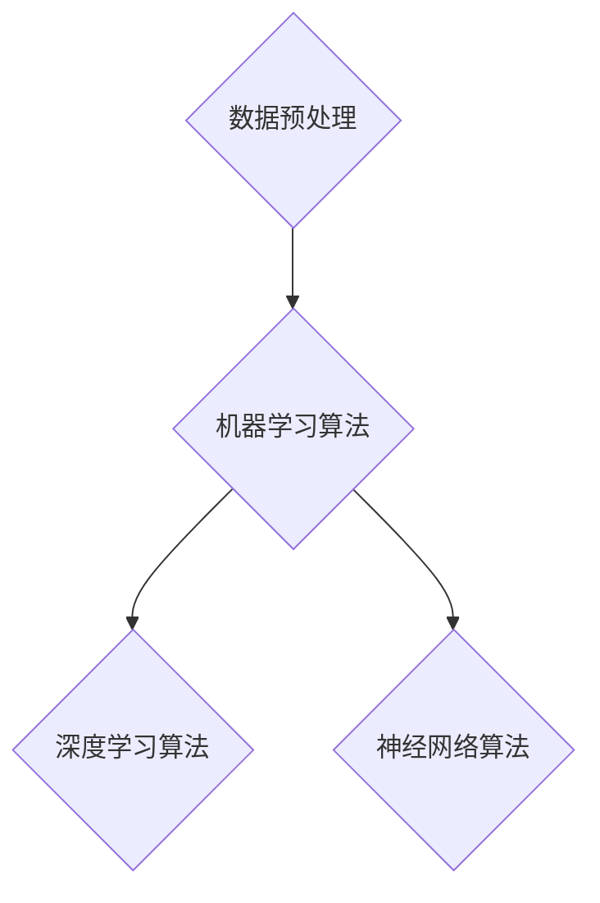

在这个示例中，根据数据预处理的结果，可以选择机器学习算法、深度学习算法或神经网络算法。

2. **算法实现**：实现选定的算法，并进行训练和优化。以下是一个算法实现的示例：


在这个示例中，数据集用于算法实现和模型训练，模型优化模块负责根据训练结果，对模型进行优化。

3. **算法应用**：将训练好的模型应用到实际系统中，实现智能化的功能。以下是一个算法应用的示例：


在这个示例中，用户界面模块负责与用户交互，算法应用模块负责处理用户输入，数据输出模块负责将处理结果输出到前端或后端系统，系统反馈模块负责将反馈信息返回给用户。

##### 3.3 智能化办公系统的开发技术

智能化办公系统的开发涉及多个技术领域，包括前端技术、后端技术、数据库技术和人工智能技术等。以下分别对这些技术进行详细讲解。

###### 3.3.1 前端技术选型

前端技术主要包括HTML、CSS和JavaScript等，用于构建用户界面和实现交互功能。以下是一个前端技术选型的示例：

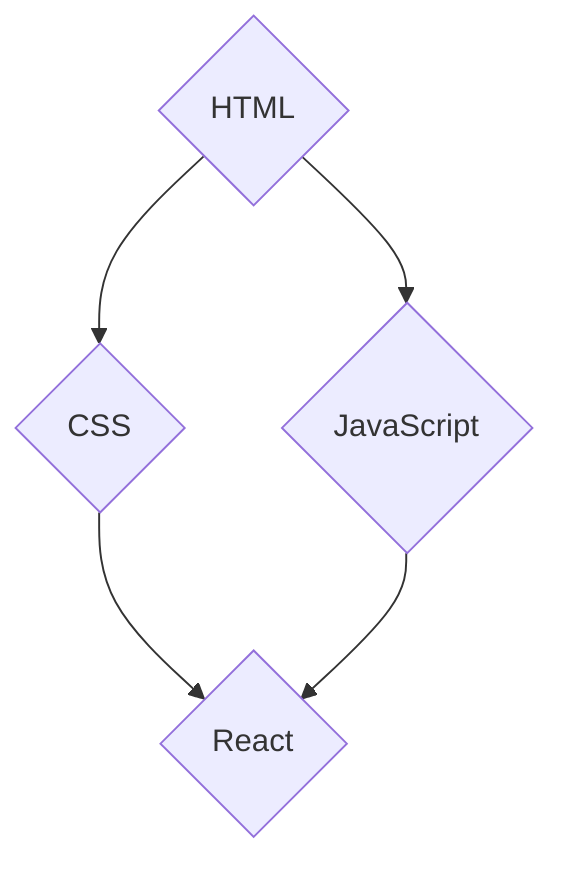

在这个示例中，HTML用于构建网页结构，CSS用于美化网页，JavaScript用于实现交互功能。React是一个流行的前端框架，可以提高开发效率。

###### 3.3.2 后端技术选型

后端技术主要包括服务器端编程语言（如Java、Python、Node.js等）和框架（如Spring、Django、Express等），用于处理业务逻辑和数据存储。以下是一个后端技术选型的示例：

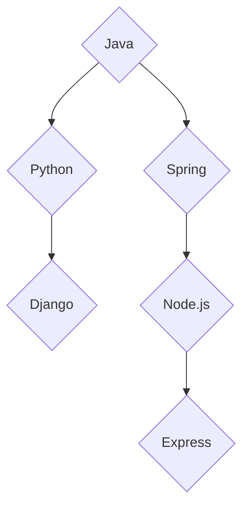

在这个示例中，Java和Spring是一个常用的后端技术组合，Python和Django也是一个不错的选择，Node.js和Express则适合处理实时数据和构建微服务。

###### 3.3.3 数据库选型与设计

数据库选型与设计是智能化办公系统开发的重要环节。根据业务需求和数据特点，选择合适的数据库类型（如关系型数据库、非关系型数据库、时序数据库等）和数据库设计方法（如ER模型、文档模型等）。以下是一个数据库选型的示例：

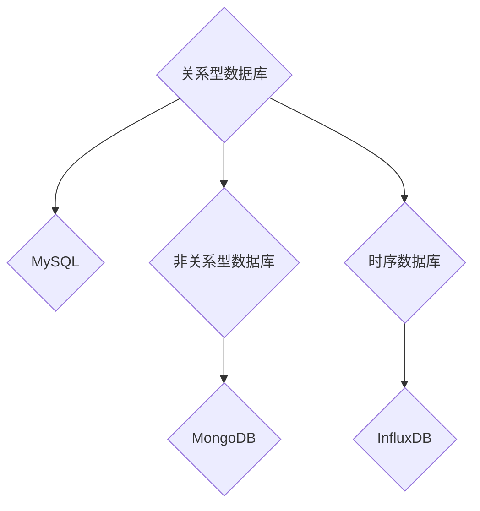

在这个示例中，MySQL是一个常用的关系型数据库，MongoDB是一个非关系型数据库，InfluxDB是一个时序数据库。

数据库设计需要考虑以下几个方面：

1. **实体关系**：根据业务需求，确定实体和关系，构建实体关系图。
2. **属性设计**：为每个实体设计合适的属性，确保数据完整性和一致性。
3. **索引设计**：根据查询需求，设计合适的索引，提高查询效率。

以下是一个数据库设计示例：

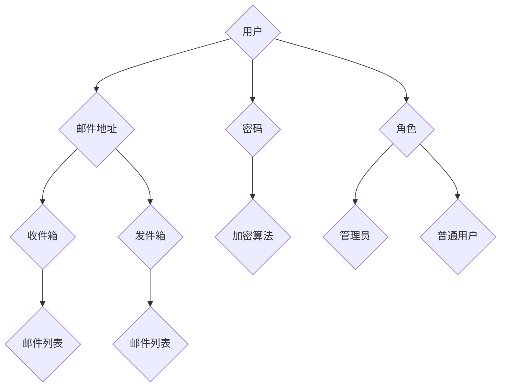

在这个示例中，用户实体包括邮件地址、密码和角色等属性，邮件地址与收件箱、发件箱具有一对多关系，密码使用加密算法存储，角色分为管理员和普通用户。

###### 3.3.4 人工智能技术实现

人工智能技术在智能化办公系统中发挥着重要作用，包括数据预处理、特征提取、模型训练和模型评估等。以下是一个人工智能技术实现的示例：


在这个示例中，数据预处理模块负责清洗和转换数据，特征提取模块负责提取数据特征，模型训练模块负责训练模型，模型评估模块负责评估模型性能。

以下是一个简单的机器学习模型训练示例（使用Python和scikit-learn库）：

```python
from sklearn.datasets import load_iris
from sklearn.model_selection import train_test_split
from sklearn.ensemble import RandomForestClassifier
from sklearn.metrics import accuracy_score

# 加载数据集
iris = load_iris()
X = iris.data
y = iris.target

# 划分训练集和测试集
X_train, X_test, y_train, y_test = train_test_split(X, y, test_size=0.2, random_state=42)

# 训练模型
model = RandomForestClassifier(n_estimators=100)
model.fit(X_train, y_train)

# 评估模型
y_pred = model.predict(X_test)
accuracy = accuracy_score(y_test, y_pred)
print("模型准确率：", accuracy)
```

在这个示例中，使用随机森林分类器对鸢尾花数据集进行训练和评估，得到模型的准确率。

##### 3.4 智能化办公系统的实现与优化

智能化办公系统的实现与优化是系统建设的关键步骤。以下从实现与优化的角度，对一人公司智能化办公系统的实现进行详细讲解。

###### 3.4.1 系统实现的步骤

智能化办公系统的实现包括以下几个步骤：

1. **需求分析**：根据一人公司的实际需求，确定系统功能模块和性能要求。
2. **架构设计**：设计系统的整体架构，包括前端、后端、数据库和人工智能模块等。
3. **模块开发**：根据架构设计，开发各个功能模块，包括用户界面、业务逻辑、数据存储和人工智能算法等。
4. **系统集成**：将各个模块整合成一个完整的系统，并进行系统集成和调试。
5. **系统测试**：对系统进行全面测试，包括功能测试、性能测试、安全测试等。
6. **系统部署**：将系统部署到生产环境，并进行系统上线和维护。

以下是一个系统实现的示例：

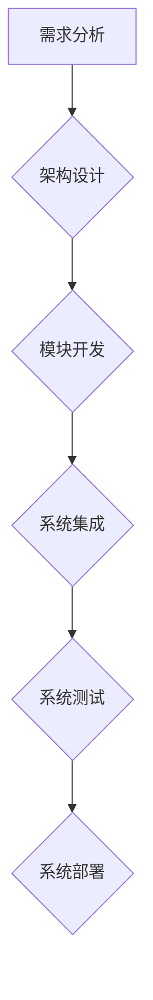

在这个示例中，首先进行需求分析，然后进行架构设计，接着进行模块开发，随后进行系统集成和测试，最后将系统部署到生产环境。

###### 3.4.2 系统优化的策略

智能化办公系统的优化包括以下几个方面：

1. **性能优化**：提高系统的响应速度和处理能力，确保系统在高并发情况下依然稳定运行。
2. **安全性优化**：加强系统的安全性，防止数据泄露、恶意攻击等安全风险。
3. **可扩展性优化**：设计可扩展的系统架构，方便后续功能扩展和技术升级。
4. **用户体验优化**：改进用户界面和交互设计，提高用户的操作便捷性和使用满意度。

以下是一个系统优化策略的示例：

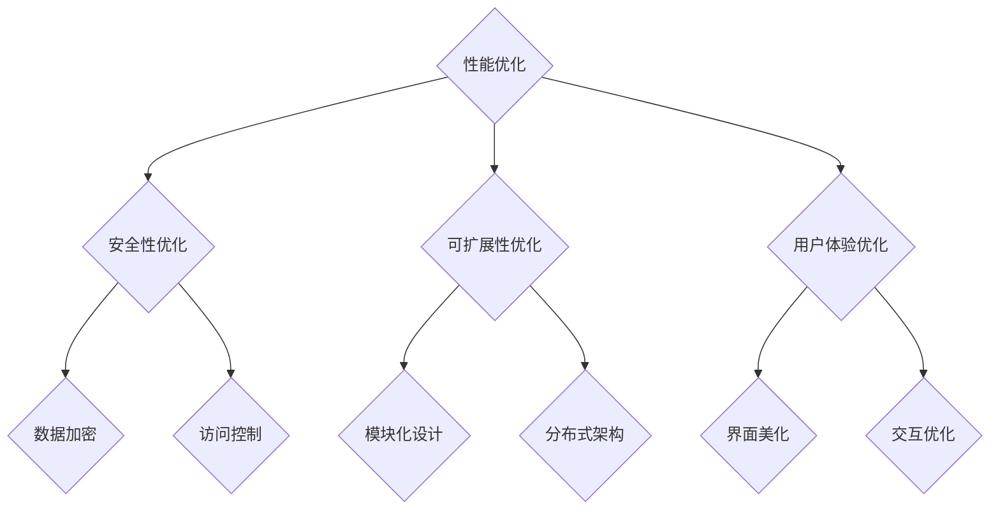

在这个示例中，性能优化包括数据加密和访问控制，安全性优化包括数据加密和访问控制，可扩展性优化包括模块化设计和分布式架构，用户体验优化包括界面美化和交互优化。

##### 3.5 智能化办公系统的测试与部署

智能化办公系统的测试与部署是确保系统正常运行的重要环节。以下从测试与部署的角度，对一人公司智能化办公系统的测试与部署进行详细讲解。

###### 3.5.1 系统测试的方法与工具

系统测试包括功能测试、性能测试、安全测试、兼容性测试等。以下是一个系统测试的示例：

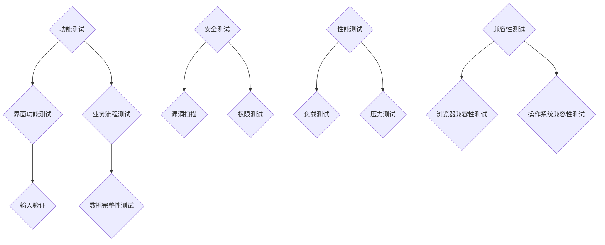

在这个示例中，功能测试包括界面功能测试和业务流程测试，性能测试包括负载测试和压力测试，安全测试包括漏洞扫描和权限测试，兼容性测试包括浏览器兼容性测试和操作系统兼容性测试。

常用的系统测试工具有：

- **功能测试工具**：Selenium、JUnit、TestNG等。
- **性能测试工具**：JMeter、LoadRunner、Gatling等。
- **安全测试工具**：Nessus、OWASP ZAP、Burp Suite等。
- **兼容性测试工具**：BrowserStack、LambdaTest等。

以下是一个系统测试工具使用的示例：

```python
import unittest
from selenium import webdriver

class TestLoginPage(unittest.TestCase):
    def setUp(self):
        self.driver = webdriver.Firefox()
        self.driver.get("http://www.example.com/login")

    def test_login_success(self):
        email_input = self.driver.find_element_by_id("email")
        password_input = self.driver.find_element_by_id("password")
        submit_button = self.driver.find_element_by_id("submit")

        email_input.send_keys("test@example.com")
        password_input.send_keys("testpassword")
        submit_button.click()

        self.assertEqual(self.driver.title, "Home - Example")

    def tearDown(self):
        self.driver.quit()

if __name__ == "__main__":
    unittest.main()
```

在这个示例中，使用Selenium进行功能测试，测试登录功能。

###### 3.5.2 系统部署的流程与注意事项

系统部署是将开发完成的系统上线到生产环境的过程。以下是一个系统部署的示例：

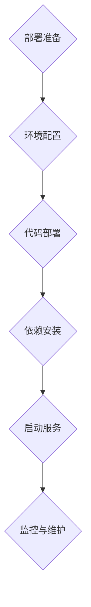

在这个示例中，首先进行部署准备，然后进行环境配置，接着进行代码部署和依赖安装，最后启动服务并进行监控与维护。

系统部署的注意事项包括：

1. **备份**：在部署前，对现有系统和数据进行备份，确保在部署过程中出现问题时可以快速恢复。
2. **版本控制**：使用版本控制系统（如Git），确保代码的版本管理和追踪。
3. **自动化部署**：使用自动化部署工具（如Jenkins、Docker等），提高部署效率和可靠性。
4. **监控与维护**：部署后，对系统进行监控，及时发现并解决潜在问题，确保系统稳定运行。

以下是一个自动化部署示例：

```python
import os
import subprocess

def deploy():
    # 拉取最新代码
    os.system("git pull origin main")
    
    # 安装依赖
    os.system("pip install -r requirements.txt")
    
    # 启动服务
    os.system("python app.py")

if __name__ == "__main__":
    deploy()
```

在这个示例中，使用Python脚本进行自动化部署。

###### 3.5.3 系统上线后的维护与更新

系统上线后，需要定期进行维护与更新，确保系统稳定运行和持续优化。以下是一个系统维护与更新的示例：

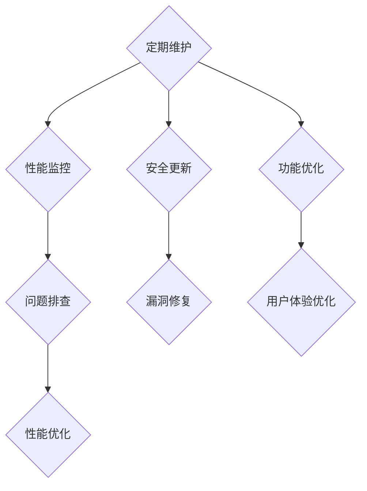

在这个示例中，定期维护包括性能监控、问题排查、性能优化、安全更新、漏洞修复、功能优化和用户体验优化。

以下是一个系统维护与更新示例：

```python
import os
import subprocess

def update():
    # 检查更新
    os.system("pip install --upgrade -r requirements.txt")
    
    # 重新启动服务
    os.system("python app.py")

if __name__ == "__main__":
    update()
```

在这个示例中，使用Python脚本进行系统更新。

### 第三部分：智能化办公的应用案例

#### 第4章：企业内部智能化办公的应用

##### 4.1 企业内部智能化办公的需求分析

企业内部智能化办公的需求分析是企业实现智能化办公的基础。以下从需求分析的角度，对一人公司内部智能化办公的需求进行分析。

###### 4.1.1 企业办公场景的梳理

一人公司的办公场景主要包括以下几个方面：

1. **个人办公**：员工进行日常办公，如电子邮件处理、日程管理、文档编辑等。
2. **团队协作**：团队成员之间进行协作，如共享文档、在线会议、任务分配等。
3. **企业管理**：企业负责人进行管理，如财务报表、客户管理、库存管理等。

在个人办公方面，员工需要高效处理日常事务，提高工作效率。在团队协作方面，团队成员需要方便快捷地进行协作，提高团队工作效率。在企业管理方面，企业负责人需要实时掌握企业运营情况，进行科学决策。

###### 4.1.2 企业办公需求的分析

基于对办公场景的梳理，对一人公司的办公需求进行分析，主要包括以下几个方面：

1. **电子邮件处理**：自动分类、过滤垃圾邮件、邮件归档等。
2. **日程管理**：智能提醒、自动安排日程、会议预约等。
3. **文档编辑**：云端文档编辑、实时协作、版本控制等。
4. **团队协作**：任务分配、进度跟踪、在线会议等。
5. **客户管理**：客户信息管理、客户沟通记录、销售报表等。
6. **库存管理**：库存监控、库存预警、库存报表等。

根据分析结果，明确一人公司的办公需求，为后续智能化办公系统的设计与开发提供依据。

###### 4.1.3 企业办公系统的功能规划

根据一人公司的办公需求，规划企业办公系统的功能模块，主要包括以下几个方面：

1. **个人办公模块**：包括电子邮件处理、日程管理、文档编辑等功能。
2. **团队协作模块**：包括任务管理、进度跟踪、在线会议等功能。
3. **企业管理模块**：包括客户管理、库存管理、财务报表等功能。
4. **系统集成模块**：实现各个功能模块之间的数据共享和交互，提高系统整体性能。

以下是一个企业办公系统功能规划的示例：

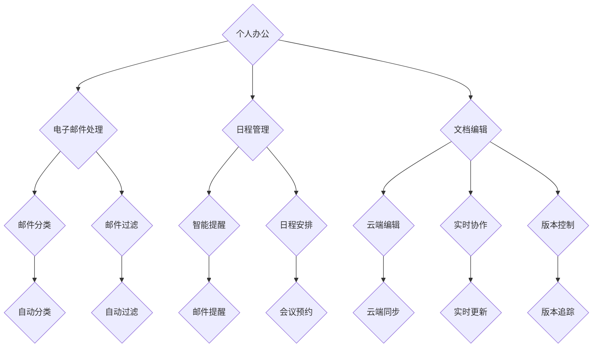

在这个示例中，个人办公模块包括电子邮件处理、日程管理、文档编辑等子功能，团队协作模块包括任务管理、进度跟踪、在线会议等子功能，企业管理模块包括客户管理、库存管理、财务报表等子功能。

##### 4.2 企业内部智能化办公系统的设计与实现

企业内部智能化办公系统的设计与实现是企业实现智能化办公的关键步骤。以下从设计与实现的角度，对一人公司内部智能化办公系统的设计与实现进行详细讲解。

###### 4.2.1 系统架构设计

企业内部智能化办公系统的架构设计包括前端、后端、数据库和人工智能模块等。以下是一个系统架构设计的示例：

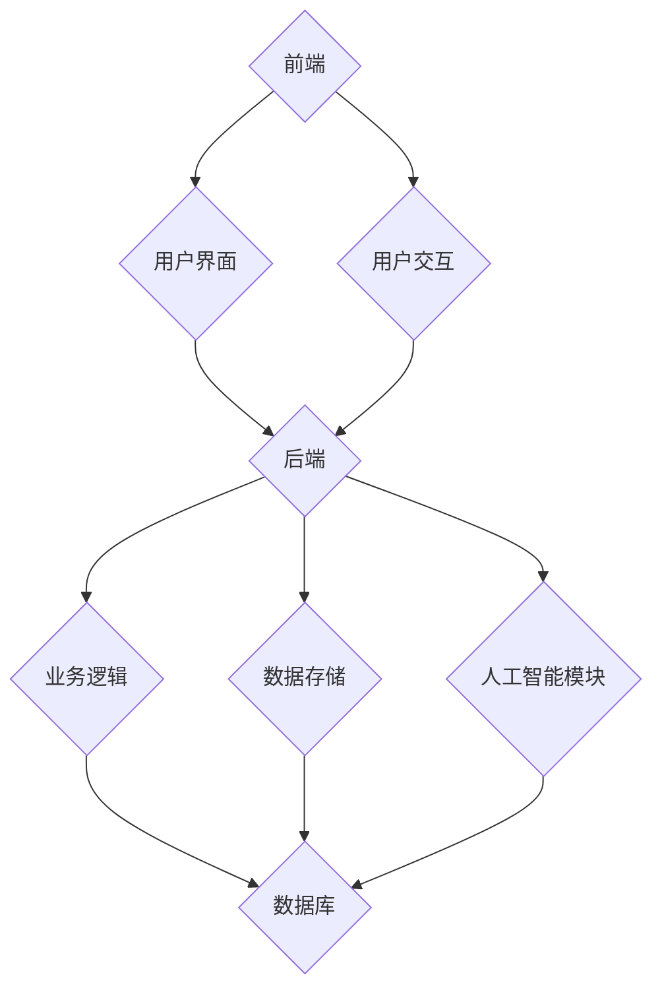

在这个示例中，前端负责用户界面和交互，后端负责业务逻辑处理和数据存储，人工智能模块负责数据分析和处理。

前端设计包括以下几个方面：

1. **界面设计**：根据企业需求，设计简洁、易用的用户界面。
2. **交互设计**：设计流畅、便捷的用户交互流程，提高用户体验。
3. **响应式设计**：确保系统在不同设备上都能良好显示和运行。

以下是一个前端界面设计的示例：

```html
<!DOCTYPE html>
<html>
<head>
    <title>企业内部办公系统</title>
    <style>
        body {
            font-family: Arial, sans-serif;
            margin: 0;
            padding: 0;
        }
        header {
            background-color: #4CAF50;
            color: white;
            padding: 10px;
            text-align: center;
        }
        nav {
            display: flex;
            justify-content: space-around;
            background-color: #ddd;
            padding: 10px;
        }
        nav a {
            color: black;
            text-decoration: none;
            padding: 8px 16px;
        }
        nav a:hover {
            background-color: #ccc;
        }
        main {
            margin: 20px;
        }
    </style>
</head>
<body>
    <header>
        <h1>企业内部办公系统</h1>
    </header>
    <nav>
        <a href="#">个人办公</a>
        <a href="#">团队协作</a>
        <a href="#">企业管理</a>
    </nav>
    <main>
        <!-- 个人办公内容 -->
    </main>
</body>
</html>
```

在这个示例中，设计了一个简单的企业内部办公系统界面，包括顶部导航栏和主体内容区域。

后端设计包括以下几个方面：

1. **业务逻辑处理**：实现系统的主要功能，如电子邮件处理、日程管理、文档编辑等。
2. **数据存储和管理**：设计合理的数据库架构，存储和管理系统数据。
3. **接口设计**：设计系统的接口，实现前后端的数据交互。

以下是一个后端业务逻辑处理的示例（使用Python和Flask框架）：

```python
from flask import Flask, request, jsonify
import sqlite3

app = Flask(__name__)

# 数据库连接
def get_db_connection():
    conn = sqlite3.connect("office.db")
    conn.row_factory = sqlite3.Row
    return conn

# 添加电子邮件
@app.route("/email/add", methods=["POST"])
def add_email():
    data = request.json
    email = data["email"]
    subject = data["subject"]
    body = data["body"]
    
    conn = get_db_connection()
    cursor = conn.cursor()
    cursor.execute("INSERT INTO emails (email, subject, body) VALUES (?, ?, ?)", (email, subject, body))
    conn.commit()
    conn.close()
    
    return jsonify({"status": "success", "message": "Email added successfully."})

# 获取电子邮件列表
@app.route("/email/list", methods=["GET"])
def get_email_list():
    conn = get_db_connection()
    cursor = conn.cursor()
    cursor.execute("SELECT * FROM emails")
    emails = cursor.fetchall()
    conn.close()
    
    return jsonify({"status": "success", "emails": emails})

if __name__ == "__main__":
    app.run(debug=True)
```

在这个示例中，使用Flask框架实现了一个简单的电子邮件处理功能，包括添加电子邮件和获取电子邮件列表。

数据库设计包括以下几个方面：

1. **数据库选择**：根据业务需求，选择合适的数据库，如MySQL、PostgreSQL等。
2. **表设计**：设计合理的表结构，存储系统数据。
3. **索引设计**：设计合适的索引，提高查询效率。

以下是一个数据库表设计的示例（使用MySQL）：

```sql
CREATE TABLE emails (
    id INT AUTO_INCREMENT PRIMARY KEY,
    email VARCHAR(255) NOT NULL,
    subject VARCHAR(255) NOT NULL,
    body TEXT NOT NULL,
    created_at TIMESTAMP DEFAULT CURRENT_TIMESTAMP
);

CREATE INDEX idx_email ON emails (email);
CREATE INDEX idx_subject ON emails (subject);
```

在这个示例中，创建了一个名为`emails`的表，用于存储电子邮件信息，并添加了相应的索引。

人工智能模块设计包括以下几个方面：

1. **算法选择**：根据业务需求，选择合适的算法，如文本分类、情感分析等。
2. **数据处理**：对系统数据进行预处理，提取特征，为算法训练提供数据支持。
3. **算法训练**：使用训练数据，训练算法模型。
4. **模型应用**：将训练好的模型应用到实际系统中，实现智能化的功能。

以下是一个文本分类算法训练的示例（使用Python和scikit-learn库）：

```python
from sklearn.feature_extraction.text import TfidfVectorizer
from sklearn.model_selection import train_test_split
from sklearn.naive_bayes import MultinomialNB
from sklearn.pipeline import make_pipeline

# 加载数据集
data = [
    ("Hello, how are you?", "greeting"),
    ("I'm fine, thanks.", "greeting"),
    ("Let's go for a coffee.", "greeting"),
    ("The weather is nice today.", "weather"),
    ("I need to buy some groceries.", "task"),
    ("Can you help me with this project?", "request"),
]

X, y = zip(*data)

# 划分训练集和测试集
X_train, X_test, y_train, y_test = train_test_split(X, y, test_size=0.2, random_state=42)

# 创建文本分类器
pipeline = make_pipeline(TfidfVectorizer(), MultinomialNB())

# 训练模型
pipeline.fit(X_train, y_train)

# 评估模型
accuracy = pipeline.score(X_test, y_test)
print("模型准确率：", accuracy)
```

在这个示例中，使用朴素贝叶斯分类器对文本数据进行分类，训练和评估模型。

###### 4.2.2 系统模块开发

企业内部智能化办公系统的开发涉及多个模块，包括前端、后端、数据库和人工智能等。以下从模块开发的角度，对一人公司内部智能化办公系统的开发进行详细讲解。

1. **前端模块开发**：实现用户界面和交互功能，包括个人办公、团队协作、企业管理等。
2. **后端模块开发**：实现业务逻辑处理和数据存储功能，包括电子邮件处理、日程管理、文档编辑等。
3. **数据库模块开发**：设计数据库架构，实现数据存储和管理功能。
4. **人工智能模块开发**：实现数据分析和处理功能，包括文本分类、情感分析等。

以下是一个前端模块开发的示例（使用HTML、CSS和JavaScript）：

```html
<!DOCTYPE html>
<html>
<head>
    <title>电子邮件处理</title>
    <style>
        body {
            font-family: Arial, sans-serif;
            margin: 0;
            padding: 0;
        }
        header {
            background-color: #4CAF50;
            color: white;
            padding: 10px;
            text-align: center;
        }
        main {
            margin: 20px;
        }
        form {
            display: flex;
            flex-direction: column;
            gap: 10px;
        }
        button {
            background-color: #4CAF50;
            color: white;
            padding: 10px 20px;
            border: none;
            cursor: pointer;
        }
        button:hover {
            background-color: #3e8e41;
        }
    </style>
</head>
<body>
    <header>
        <h1>电子邮件处理</h1>
    </header>
    <main>
        <form id="email-form">
            <label for="email">电子邮件：</label>
            <input type="email" id="email" required>
            <label for="subject">主题：</label>
            <input type="text" id="subject" required>
            <label for="body">内容：</label>
            <textarea id="body" required></textarea>
            <button type="submit">发送</button>
        </form>
    </main>
    <script>
        document.getElementById("email-form").addEventListener("submit", function(event) {
            event.preventDefault();
            const email = document.getElementById("email").value;
            const subject = document.getElementById("subject").value;
            const body = document.getElementById("body").value;
            // 发送电子邮件到后端接口
            fetch("/email/add", {
                method: "POST",
                headers: {
                    "Content-Type": "application/json"
                },
                body: JSON.stringify({ email: email, subject: subject, body: body })
            })
            .then(response => response.json())
            .then(data => {
                alert(data.message);
                document.getElementById("email-form").reset();
            });
        });
    </script>
</body>
</html>
```

在这个示例中，使用HTML、CSS和JavaScript实现了一个简单的电子邮件处理页面，包括电子邮件发送功能。

以下是一个后端模块开发的示例（使用Python和Flask框架）：

```python
from flask import Flask, request, jsonify
import sqlite3

app = Flask(__name__)

# 数据库连接
def get_db_connection():
    conn = sqlite3.connect("office.db")
    conn.row_factory = sqlite3.Row
    return conn

# 添加电子邮件
@app.route("/email/add", methods=["POST"])
def add_email():
    data = request.json
    email = data["email"]
    subject = data["subject"]
    body = data["body"]

    conn = get_db_connection()
    cursor = conn.cursor()
    cursor.execute("INSERT INTO emails (email, subject, body) VALUES (?, ?, ?)", (email, subject, body))
    conn.commit()
    conn.close()

    return jsonify({"status": "success", "message": "Email added successfully."})

# 获取电子邮件列表
@app.route("/email/list", methods=["GET"])
def get_email_list():
    conn = get_db_connection()
    cursor = conn.cursor()
    cursor.execute("SELECT * FROM emails")
    emails = cursor.fetchall()
    conn.close()

    return jsonify({"status": "success", "emails": emails})

if __name__ == "__main__":
    app.run(debug=True)
```

在这个示例中，使用Flask框架实现了一个简单的电子邮件处理功能，包括添加电子邮件和获取电子邮件列表。

以下是一个数据库模块开发的示例（使用MySQL）：

```sql
CREATE TABLE emails (
    id INT AUTO_INCREMENT PRIMARY KEY,
    email VARCHAR(255) NOT NULL,
    subject VARCHAR(255) NOT NULL,
    body TEXT NOT NULL,
    created_at TIMESTAMP DEFAULT CURRENT_TIMESTAMP
);

CREATE INDEX idx_email ON emails (email);
CREATE INDEX idx_subject ON emails (subject);
```

在这个示例中，创建了一个名为`emails`的表，用于存储电子邮件信息，并添加了相应的索引。

以下是一个人工智能模块开发的示例（使用Python和scikit-learn库）：

```python
from sklearn.feature_extraction.text import TfidfVectorizer
from sklearn.model_selection import train_test_split
from sklearn.naive_bayes import MultinomialNB
from sklearn.pipeline import make_pipeline

# 加载数据集
data = [
    ("Hello, how are you?", "greeting"),
    ("I'm fine, thanks.", "greeting"),
    ("Let's go for a coffee.", "greeting"),
    ("The weather is nice today.", "weather"),
    ("I need to buy some groceries.", "task"),
    ("Can you help me with this project?", "request"),
]

X, y = zip(*data)

# 划分训练集和测试集
X_train, X_test, y_train, y_test = train_test_split(X, y, test_size=0.2, random_state=42)

# 创建文本分类器
pipeline = make_pipeline(TfidfVectorizer(), MultinomialNB())

# 训练模型
pipeline.fit(X_train, y_train)

# 评估模型
accuracy = pipeline.score(X_test, y_test)
print("模型准确率：", accuracy)
```

在这个示例中，使用朴素贝叶斯分类器对文本数据进行分类，训练和评估模型。

###### 4.2.3 系统测试与优化

企业内部智能化办公系统的测试与优化是确保系统稳定、高效运行的重要环节。以下从测试与优化的角度，对一人公司内部智能化办公系统的测试与优化进行详细讲解。

1. **功能测试**：测试系统的功能模块，确保功能实现正确。
2. **性能测试**：测试系统的响应速度和处理能力，确保系统在高并发情况下依然稳定。
3. **安全测试**：测试系统的安全性，确保数据安全和防止恶意攻击。
4. **兼容性测试**：测试系统在不同设备和操作系统上的兼容性，确保系统在不同环境下都能正常运行。

以下是一个功能测试的示例：

```python
import unittest
from flask import Flask
from app import create_app

class TestEmailProcessing(unittest.TestCase):
    def setUp(self):
        self.app = create_app()
        self.client = self.app.test_client()

    def test_add_email(self):
        response = self.client.post("/email/add", json={
            "email": "test@example.com",
            "subject": "Test Email",
            "body": "This is a test email."
        })
        self.assertEqual(response.status_code, 200)
        self.assertEqual(response.json["status"], "success")

    def test_get_email_list(self):
        response = self.client.get("/email/list")
        self.assertEqual(response.status_code, 200)
        self.assertEqual(response.json["status"], "success")

if __name__ == "__main__":
    unittest.main()
```

在这个示例中，使用Python的unittest框架测试电子邮件处理功能。

以下是一个性能测试的示例（使用Python和JMeter）：

```python
import json
import requests

url = "http://localhost:5000/email/add"

# 发送大量并发请求
for _ in range(1000):
    requests.post(url, json={
        "email": "test@example.com",
        "subject": "Test Email",
        "body": "This is a test email."
    })
```

在这个示例中，使用requests库向电子邮件处理接口发送大量并发请求，测试系统的响应速度和处理能力。

以下是一个安全测试的示例（使用Python和OWASP ZAP）：

```python
from burp import BurpExtender
from burp import IHttpRequestResponse
from burp import IHttpListener
from burp import IScannerCheck

class BurpScannerCheck(BurpExtender):
    def registerExtenderCallbacks(self, Burton):
        Burton.setExtensionName("Email Processing Security Test")
        self Burton = Burton
        self Burton.setShowInterface(True)
        self Burton.setHelpUrl("https://example.com/burp_help.html")
        self Burton.addScannerCheck(self.EmailProcessingCheck())
        return

    class EmailProcessingCheck(IScannerCheck):
        def doPassiveScan(self, HttpRequestResponse):
            if "email/add" in HttpRequestResponse.getURI():
                self Burton.message("Alert", "Potential Security Risk Detected")
                return True
            return False

if __name__ == "__main__":
    BurpScannerCheck().register()
```

在这个示例中，使用OWASP ZAP进行安全测试，检测电子邮件处理接口是否存在潜在的安全风险。

以下是一个兼容性测试的示例（使用Python和BrowserStack）：

```python
import unittest
import browsermobproxy
import selenium

class TestBrowserCompatibility(unittest.TestCase):
    def setUp(self):
        self.proxy = browsermobproxy.Server("path/to/browsermob-proxy-2.1.4/bin/browsermob-proxy")
        self.proxy.start()
        self.proxy.newH Har("https://www.example.com")
        self.driver = selenium.webdriver.Chrome(executable_path="path/to/chromedriver")
        self.driver.proxy = selenium.webdriver.Proxy()
        self.driver.proxy.http_proxy = self.proxy.proxy
        self.driver.proxy.ssl_proxy = self.proxy.proxy
        self.driver.proxy.http_proxy_user = "your_username"
        self.driver.proxy.http_proxy_password = "your_password"
        self.driver.start_session()

    def test_website_load(self):
        self.driver.get("https://www.example.com")
        self.assertIn("Example Domain", self.driver.title)

    def tearDown(self):
        self.driver.quit()
        self.proxy.stop()

if __name__ == "__main__":
    unittest.main()
```

在这个示例中，使用BrowserMob Proxy和Selenium进行兼容性测试，测试网站在不同浏览器上的兼容性。

##### 4.3 企业内部智能化办公系统的应用效果评估

企业内部智能化办公系统的应用效果评估是衡量系统效益的重要环节。以下从应用效果评估的角度，对一人公司内部智能化办公系统的应用效果进行详细讲解。

###### 4.3.1 系统使用情况的统计与分析

为了评估企业内部智能化办公系统的应用效果，需要对系统的使用情况进行统计和分析。以下是一个系统使用情况统计分析的示例：

```python
import pandas as pd

# 读取系统日志文件
log_file = "path/to/system_log.txt"
df = pd.read_csv(log_file, sep="\t")

# 统计系统使用情况
df["timestamp"] = pd.to_datetime(df["timestamp"])
daily_usage = df.groupby([df["timestamp"].dt.year, df["timestamp"].dt.month, df["timestamp"].dt.day]).size().reset_index(name="count")

# 分析系统使用情况
print(daily_usage.groupby([daily_usage["year"], daily_usage["month"]]).sum())

# 分析不同功能模块的使用情况
module_usage = df.groupby("module").size().reset_index(name="count")
print(module_usage.sort_values("count", ascending=False).head(10))
```

在这个示例中，使用Pandas库读取系统日志文件，统计系统使用情况，并分析系统使用情况以及不同功能模块的使用情况。

###### 4.3.2 系统应用效果的评估指标

为了全面评估企业内部智能化办公系统的应用效果，需要设置一系列评估指标。以下是一个系统应用效果评估指标的示例：

1. **用户满意度**：通过用户满意度调查，了解用户对系统的满意度。
2. **工作效率**：通过分析系统使用数据，评估系统对工作效率的提升。
3. **成本节约**：通过计算系统运行成本和人力成本，评估系统的经济效益。
4. **错误率**：通过统计系统故障和错误次数，评估系统的稳定性。
5. **安全性能**：通过安全测试和漏洞扫描，评估系统的安全性能。

以下是一个系统应用效果评估指标示例的表格：

| 指标名称 | 指标定义 | 评估方法 |
| :----: | :----: | :----: |
| 用户满意度 | 用户对系统的满意度 | 用户满意度调查 |
| 工作效率 | 系统使用前后的工作效率比较 | 系统使用数据统计分析 |
| 成本节约 | 系统运行成本和人力成本的比较 | 成本计算 |
| 错误率 | 系统故障和错误次数的统计 | 系统日志分析 |
| 安全性能 | 系统的安全测试和漏洞扫描结果 | 安全测试和漏洞扫描 |

以下是一个用户满意度调查的示例：

```python
import pandas as pd

# 读取用户满意度调查结果
survey_file = "path/to/survey_results.csv"
df = pd.read_csv(survey_file)

# 计算用户满意度评分
df["satisfaction"] = df["response"].apply(lambda x: 5 if x == "非常满意" else 4 if x == "满意" else 3 if x == "一般" else 2 if x == "不满意" else 1 if x == "非常不满意" else 0)
average_satisfaction = df["satisfaction"].mean()
print("用户满意度评分：", average_satisfaction)
```

在这个示例中，使用Pandas库读取用户满意度调查结果，计算用户满意度评分。

###### 4.3.3 系统应用效果的改进建议

为了进一步提升企业内部智能化办公系统的应用效果，根据系统使用情况和评估指标，可以提出以下改进建议：

1. **优化用户体验**：根据用户反馈，改进用户界面和交互设计，提高用户的操作便捷性和使用满意度。
2. **增强系统功能**：根据用户需求，增加新的功能模块，如任务管理、客户关系管理、财务报表等，提高系统的实用性。
3. **提升系统性能**：优化系统架构和算法，提高系统的响应速度和处理能力，确保系统在高并发情况下依然稳定运行。
4. **加强安全防护**：定期进行安全测试和漏洞扫描，加强系统的安全性，防止数据泄露和恶意攻击。
5. **培训与支持**：加强用户培训，提高用户对系统的熟练度和操作技巧，提供及时的技术支持，解决用户在使用过程中遇到的问题。

以下是一个优化用户体验的示例：

```python
import flask
from flask import request, jsonify

app = flask.Flask(__name__)

# 添加新功能：个性化设置
@app.route("/settings", methods=["GET", "POST"])
def settings():
    if request.method == "POST":
        user_id = request.form["user_id"]
        theme = request.form["theme"]
        # 保存用户个性化设置
        save_settings(user_id, theme)
        return jsonify({"status": "success", "message": "Settings saved successfully."})
    else:
        user_id = request.args.get("user_id")
        theme = get_settings(user_id)
        return jsonify({"status": "success", "theme": theme})

def save_settings(user_id, theme):
    # 保存用户个性化设置到数据库
    pass

def get_settings(user_id):
    # 获取用户个性化设置从数据库
    pass

if __name__ == "__main__":
    app.run(debug=True)
```

在这个示例中，使用Flask框架实现了一个简单的个性化设置功能，允许用户根据个人喜好更改主题。

#### 第5章：个人智能化办公的应用

##### 5.1 个人智能化办公的需求分析

个人智能化办公的需求分析是构建个性化智能化办公系统的基础。以下从需求分析的角度，对个人智能化办公的需求进行分析。

###### 5.1.1 个人办公场景的梳理

个人办公场景主要包括以下几个方面：

1. **日常办公**：包括电子邮件处理、日程管理、文档编辑等。
2. **项目协作**：与团队成员协作完成项目任务，如任务分配、进度跟踪、文档共享等。
3. **个人健康管理**：监测个人健康状况，如运动记录、睡眠分析、健康报告等。
4. **财务规划**：管理个人财务，如收支记录、预算规划、投资分析等。

在个人日常办公方面，用户需要高效处理日常事务，提高工作效率。在项目协作方面，用户需要方便快捷地与团队成员进行协作，提高项目进度。在个人健康管理方面，用户需要实时掌握自己的健康状况，进行科学锻炼和调整。在财务规划方面，用户需要管理个人财务，进行科学预算和投资。

###### 5.1.2 个人办公需求的分析

基于对个人办公场景的梳理，对个人办公需求进行分析，主要包括以下几个方面：

1. **电子邮件处理**：自动分类、过滤垃圾邮件、邮件归档等。
2. **日程管理**：智能提醒、自动安排日程、会议预约等。
3. **文档编辑**：云端文档编辑、实时协作、版本控制等。
4. **项目协作**：任务管理、进度跟踪、文档共享等。
5. **个人健康管理**：运动记录、睡眠分析、健康报告等。
6. **财务规划**：收支记录、预算规划、投资分析等。

根据分析结果，明确个人办公的需求，为后续智能化办公系统的设计与开发提供依据。

###### 5.1.3 个人办公系统的功能规划

根据个人办公需求，规划个人办公系统的功能模块，主要包括以下几个方面：

1. **日常办公模块**：包括电子邮件处理、日程管理、文档编辑等功能。
2. **项目协作模块**：包括任务管理、进度跟踪、文档共享等功能。
3. **个人健康模块**：包括运动记录、睡眠分析、健康报告等功能。
4. **财务规划模块**：包括收支记录、预算规划、投资分析等功能。
5. **系统集成模块**：实现各个功能模块之间的数据共享和交互，提高系统整体性能。

以下是一个个人办公系统功能规划的示例：

```mermaid
graph TD
A{日常办公} --> B{电子邮件处理}
A --> C{日程管理}
A --> D{文档编辑}
B --> E{邮件分类}
B --> F{邮件过滤}
C --> G{智能提醒}
C --> H{日程安排}
D --> I{云端编辑}
D --> J{实时协作}
D --> K{版本控制}
E --> L{自动分类}
F --> M{自动过滤}
G --> N{邮件提醒}
H --> O{会议预约}
I --> P{云端同步}
J --> Q{实时更新}
K --> R{版本追踪}
E{项目协作} --> S{任务管理}
E --> T{进度跟踪}
E --> U{文档共享}
S --> V{任务分配}
S --> W{任务进度}
T --> X{项目进度}
U --> Y{文档编辑}
U --> Z{文档共享}
E{个人健康} --> AA{运动记录}
E --> BB{睡眠分析}
E --> CC{健康报告}
AA --> DD{运动数据}
AA --> EE{健身计划}
BB --> FF{睡眠数据}
BB --> GG{睡眠建议}
CC --> HH{健康报告}
CC --> II{健康建议}
E{财务规划} --> JJ{收支记录}
E --> KK{预算规划}
E --> LL{投资分析}
JJ --> MM{收入记录}
JJ --> NN{支出记录}
KK --> OO{预算数据}
KK --> PP{预算分析}
LL --> QQ{投资数据}
LL --> RR{投资分析}
```

在这个示例中，日常办公模块包括电子邮件处理、日程管理、文档编辑等子功能，项目协作模块包括任务管理、进度跟踪、文档共享等子功能，个人健康模块包括运动记录、睡眠分析、健康报告等子功能，财务规划模块包括收支记录、预算规划、投资分析等子功能。

##### 5.2 个人智能化办公系统的设计与实现

个人智能化办公系统的设计与实现是构建个性化智能化办公系统的关键步骤。以下从设计与实现的角度，对个人智能化办公系统的设计与实现进行详细讲解。

###### 5.2.1 系统架构设计

个人智能化办公系统的架构设计包括前端、后端、数据库和人工智能模块等。以下是一个系统架构设计的示例：

```mermaid
graph TD
A{前端} --> B{用户界面}
A --> C{用户交互}
B --> D{后端}
C --> D
D --> E{业务逻辑}
D --> F{数据存储}
D --> G{人工智能模块}
E --> H{数据库}
F --> H
G --> H
```

在这个示例中，前端负责用户界面和交互，后端负责业务逻辑处理和数据存储，人工智能模块负责数据分析和处理。

前端设计包括以下几个方面：

1. **界面设计**：根据个人需求，设计简洁、易用的用户界面。
2. **交互设计**：设计流畅、便捷的用户交互流程，提高用户体验。
3. **响应式设计**：确保系统在不同设备上都能良好显示和运行。

以下是一个前端界面设计的示例：

```html
<!DOCTYPE html>
<html>
<head>
    <title>个人智能化办公系统</title>
    <style>
        body {
            font-family: Arial, sans-serif;
            margin: 0;
            padding: 0;
        }
        header {
            background-color: #4CAF50;
            color: white;
            padding: 10px;
            text-align: center;
        }
        main {
            margin: 20px;
        }
        nav {
            display: flex;
            justify-content: space-around;
            background-color: #ddd;
            padding: 10px;
        }
        nav a {
            color: black;
            text-decoration: none;
            padding: 8px 16px;
        }
        nav a:hover {
            background-color: #ccc;
        }
    </style>
</head>
<body>
    <header>
        <h1>个人智能化办公系统</h1>
    </header>
    <nav>
        <a href="#">日常办公</a>
        <a href="#">项目协作</a>
        <a href="#">个人健康</a>
        <a href="#">财务规划</a>
    </nav>
    <main>
        <!-- 日常办公内容 -->
    </main>
</body>
</html>
```

在这个示例中，设计了一个简单的个人智能化办公系统界面，包括顶部导航栏和主体内容区域。

后端设计包括以下几个方面：

1. **业务逻辑处理**：实现系统的主要功能，如电子邮件处理、日程管理、文档编辑等。
2. **数据存储和管理**：设计合理的数据库架构，存储和管理系统数据。
3. **接口设计**：设计系统的接口，实现前后端的数据交互。

以下是一个后端业务逻辑处理的示例（使用Python和Flask框架）：

```python
from flask import Flask, request, jsonify
import sqlite3

app = Flask(__name__)

# 数据库连接
def get_db_connection():
    conn = sqlite3.connect("office.db")
    conn.row_factory = sqlite3.Row
    return conn

# 添加电子邮件
@app.route("/email/add", methods=["POST"])
def add_email():
    data = request.json
    email = data["email"]
    subject = data["subject"]
    body = data["body"]

    conn = get_db_connection()
    cursor = conn.cursor()
    cursor.execute("INSERT INTO emails (email, subject, body) VALUES (?, ?, ?)", (email, subject, body))
    conn.commit()
    conn.close()

    return jsonify({"status": "success", "message": "Email added successfully."})

# 获取电子邮件列表
@app.route("/email/list", methods=["GET"])
def get_email_list():
    conn = get_db_connection()
    cursor = conn.cursor()
    cursor.execute("SELECT * FROM emails")
    emails = cursor.fetchall()
    conn.close()

    return jsonify({"status": "success", "emails": emails})

if __name__ == "__main__":
    app.run(debug=True)
```

在这个示例中，使用Flask框架实现了一个简单的电子邮件处理功能，包括添加电子邮件和获取电子邮件列表。

数据库设计包括以下几个方面：

1. **数据库选择**：根据业务需求，选择合适的数据库，如MySQL、PostgreSQL等。
2. **表设计**：设计合理的表结构，存储系统数据。
3. **索引设计**：设计合适的索引，提高查询效率。

以下是一个数据库表设计的示例（使用MySQL）：

```sql
CREATE TABLE emails (
    id INT AUTO_INCREMENT PRIMARY KEY,
    email VARCHAR(255) NOT NULL,
    subject VARCHAR(255) NOT NULL,
    body TEXT NOT NULL,
    created_at TIMESTAMP DEFAULT CURRENT_TIMESTAMP
);

CREATE INDEX idx_email ON emails (email);
CREATE INDEX idx_subject ON emails (subject);
```

在这个示例中，创建了一个名为`emails`的表，用于存储电子邮件信息，并添加了相应的索引。

人工智能模块设计包括以下几个方面：

1. **算法选择**：根据业务需求，选择合适的算法，如文本分类、情感分析等。
2. **数据处理**：对系统数据进行预处理，提取特征，为算法训练提供数据支持。
3. **算法训练**：使用训练数据，训练算法模型。
4. **模型应用**：将训练好的模型应用到实际系统中，实现智能化的功能。

以下是一个文本分类算法训练的示例（使用Python和scikit-learn库）：

```python
from sklearn.feature_extraction.text import TfidfVectorizer
from sklearn.model_selection import train_test_split
from sklearn.naive_bayes import MultinomialNB
from sklearn.pipeline import make_pipeline

# 加载数据集
data = [
    ("Hello, how are you?", "greeting"),
    ("I'm fine, thanks.", "greeting"),
    ("Let's go for a coffee.", "greeting"),
    ("The weather is nice today.", "weather"),
    ("I need to buy some groceries.", "task"),
    ("Can you help me with this project?", "request"),
]

X, y = zip(*data)

# 划分训练集和测试集
X_train, X_test, y_train, y_test = train_test_split(X, y, test_size=0.2, random_state=42)

# 创建文本分类器
pipeline = make_pipeline(TfidfVectorizer(), MultinomialNB())

# 训练模型
pipeline.fit(X_train, y_train)

# 评估模型
accuracy = pipeline.score(X_test, y_test)
print("模型准确率：", accuracy)
```

在这个示例中，使用朴素贝叶斯分类器对文本数据进行分类，训练和评估模型。

###### 5.2.2 系统模块开发

个人智能化办公系统的开发涉及多个模块，包括前端、后端、数据库和人工智能等。以下从模块开发的角度，对个人智能化办公系统的开发进行详细讲解。

1. **前端模块开发**：实现用户界面和交互功能，包括日常办公、项目协作、个人健康、财务规划等。
2. **后端模块开发**：实现业务逻辑处理和数据存储功能，包括电子邮件处理、日程管理、文档编辑等。
3. **数据库模块开发**：设计数据库架构，实现数据存储和管理功能。
4. **人工智能模块开发**：实现数据分析和处理功能，包括文本分类、情感分析等。

以下是一个前端模块开发的示例（使用HTML、CSS和JavaScript）：

```html
<!DOCTYPE html>
<html>
<head>
    <title>电子邮件处理</title>
    <style>
        body {
            font-family: Arial, sans-serif;
            margin: 0;
            padding: 0;
        }
        header {
            background-color: #4CAF50;
            color: white;
            padding: 10px;
            text-align: center;
        }
        main {
            margin: 20px;
        }
        form {
            display: flex;
            flex-direction: column;
            gap: 10px;
        }
        button {
            background-color: #4CAF50;
            color: white;
            padding: 10px 20px;
            border: none;
            cursor: pointer;
        }
        button:hover {
            background-color: #3e8e41;
        }
    </style>
</head>
<body>
    <header>
        <h1>电子邮件处理</h1>
    </header>
    <main>
        <form id="email-form">
            <label for="email">电子邮件：</label>
            <input type="email" id="email" required>
            <label for="subject">主题：</label>
            <input type="text" id="subject" required>
            <label for="body">内容：</label>
            <textarea id="body" required></textarea>
            <button type="submit">发送</button>
        </form>
    </main>
    <script>
        document.getElementById("email-form").addEventListener("submit", function(event) {
            event.preventDefault();
            const email = document.getElementById("email").value;
            const subject = document.getElementById("subject").value;
            const body = document.getElementById("body").value;
            // 发送电子邮件到后端接口
            fetch("/email/add", {
                method: "POST",
                headers: {
                    "Content-Type": "application/json"
                },
                body: JSON.stringify({ email: email, subject: subject, body: body })
            })
            .then(response => response.json())
            .then(data => {
                alert(data.message);
                document.getElementById("email-form").reset();
            });
        });
    </script>
</body>
</html>
```

在这个示例中，使用HTML、CSS和JavaScript实现了一个简单的电子邮件处理页面，包括电子邮件发送功能。

以下是一个后端模块开发的示例（使用Python和Flask框架）：

```python
from flask import Flask, request, jsonify
import sqlite3

app = Flask(__name__)

# 数据库连接
def get_db_connection():
    conn = sqlite3.connect("office.db")
    conn.row_factory = sqlite3.Row
    return conn

# 添加电子邮件
@app.route("/email/add", methods=["POST"])
def add_email():
    data = request.json
    email = data["email"]
    subject = data["subject"]
    body = data["body"]

    conn = get_db_connection()
    cursor = conn.cursor()
    cursor.execute("INSERT INTO emails (email, subject, body) VALUES (?, ?, ?)", (email, subject, body))
    conn.commit()
    conn.close()

    return jsonify({"status": "success", "message": "Email added successfully."})

# 获取电子邮件列表
@app.route("/email/list", methods=["GET"])
def get_email_list():
    conn = get_db_connection()
    cursor = conn.cursor()
    cursor.execute("SELECT * FROM emails")
    emails = cursor.fetchall()
    conn.close()

    return jsonify({"status": "success", "emails": emails})

if __name__ == "__main__":
    app.run(debug=True)
```

在这个示例中，使用Flask框架实现了一个简单的电子邮件处理功能，包括添加电子邮件和获取电子邮件列表。

以下是一个数据库模块开发的示例（使用MySQL）：

```sql
CREATE TABLE emails (
    id INT AUTO_INCREMENT PRIMARY KEY,
    email VARCHAR(255) NOT NULL,
    subject VARCHAR(255) NOT NULL,
    body TEXT NOT NULL,
    created_at TIMESTAMP DEFAULT CURRENT_TIMESTAMP
);

CREATE INDEX idx_email ON emails (email);
CREATE INDEX idx_subject ON emails (subject);
```

在这个示例中，创建了一个名为`emails`的表，用于存储电子邮件信息，并添加了相应的索引。

以下是一个人工智能模块开发的示例（使用Python和scikit-learn库）：

```python
from sklearn.feature_extraction.text import TfidfVectorizer
from sklearn.model_selection import train_test_split
from sklearn.naive_bayes import MultinomialNB
from sklearn.pipeline import make_pipeline

# 加载数据集
data = [
    ("Hello, how are you?", "greeting"),
    ("I'm fine, thanks.", "greeting"),
    ("Let's go for a coffee.", "greeting"),
    ("The weather is nice today.", "weather"),
    ("I need to buy some groceries.", "task"),
    ("Can you help me with this project?", "request"),
]

X, y = zip(*data)

# 划分训练集和测试集
X_train, X_test, y_train, y_test = train_test_split(X, y, test_size=0.2, random_state=42)

# 创建文本分类器
pipeline = make_pipeline(TfidfVectorizer(), MultinomialNB())

# 训练模型
pipeline.fit(X_train, y_train)

# 评估模型
accuracy = pipeline.score(X_test, y_test)
print("模型准确率：", accuracy)
```

在这个示例中，使用朴素贝叶斯分类器对文本数据进行分类，训练和评估模型。

###### 5.2.3 系统测试与优化

个人智能化办公系统的测试与优化是确保系统稳定、高效运行的重要环节。以下从测试与优化的角度，对个人智能化办公系统的测试与优化进行详细讲解。

1. **功能测试**：测试系统的功能模块，确保功能实现正确。
2. **性能测试**：测试系统的响应速度和处理能力，确保系统在高并发情况下依然稳定。
3. **安全测试**：测试系统的安全性，确保数据安全和防止恶意攻击。
4. **兼容性测试**：测试系统在不同设备和操作系统上的兼容性，确保系统在不同环境下都能正常运行。

以下是一个功能测试的示例：

```python
import unittest
from flask import Flask
from app import create_app

class TestEmailProcessing(unittest.TestCase):
    def setUp(self):
        self.app = create_app()
        self.client = self.app.test_client()

    def test_add_email(self):
        response = self.client.post("/email/add", json={
            "email": "test@example.com",
            "subject": "Test Email",
            "body": "This is a test email."
        })
        self.assertEqual(response.status_code, 200)
        self.assertEqual(response.json["status"], "success")

    def test_get_email_list(self):
        response = self.client.get("/email/list")
        self.assertEqual(response.status_code, 200)
        self.assertEqual(response.json["status"], "success")

if __name__ == "__main__":
    unittest.main()
```

在这个示例中，使用Python的unittest框架测试电子邮件处理功能。

以下是一个性能测试的示例（使用Python和JMeter）：

```python
import json
import requests

url = "http://localhost:5000/email/add"

# 发送大量并发请求
for _ in range(1000):
    requests.post(url, json={
        "email": "test@example.com",
        "subject": "Test Email",
        "body": "This is a test email."
    })
```

在这个示例中，使用requests库向电子邮件处理接口发送大量并发请求，测试系统的响应速度和处理能力。

以下是一个安全测试的示例（使用Python和OWASP ZAP）：

```python
from burp import BurpExtender
from burp import IHttpRequestResponse
from burp import IHttpListener
from burp import IScannerCheck

class BurpScannerCheck(BurpExtender):
    def registerExtenderCallbacks(self, Burton):
        Burton.setExtensionName("Email Processing Security Test")
        self Burton = Burton
        self Burton.setShowInterface(True)
        self Burton.setHelpUrl("https://example.com/burp_help.html")
        self Burton.addScannerCheck(self.EmailProcessingCheck())
        return

    class EmailProcessingCheck(IScannerCheck):
        def doPassiveScan(self, HttpRequestResponse):
            if "email/add" in HttpRequestResponse.getURI():
                self Burton.message("Alert", "Potential Security Risk Detected")
                return True
            return False

if __name__ == "__main__":
    BurpScannerCheck().register()
```

在这个示例中，使用OWASP ZAP进行安全测试，检测电子邮件处理接口是否存在潜在的安全风险。

以下是一个兼容性测试的示例（使用Python和BrowserStack）：

```python
import unittest
import browsermobproxy
import selenium

class TestBrowserCompatibility(unittest.TestCase):
    def setUp(self):
        self.proxy = browsermobproxy.Server("path/to/browsermob-proxy-2.1.4/bin/browsermob-proxy")
        self.proxy.start()
        self.proxy.newH Har("https://www.example.com")
        self.driver = selenium.webdriver.Chrome(executable_path="path/to/chromedriver")
        self.driver.proxy = selenium.webdriver.Proxy()
        self.driver.proxy.http_proxy = self.proxy.proxy
        self.driver.proxy.ssl_proxy = self.proxy.proxy
        self.driver.proxy.http_proxy_user = "your_username"
        self.driver.proxy.http_proxy_password = "your_password"
        self.driver.start_session()

    def test_website_load(self):
        self.driver.get("https://www.example.com")
        self.assertIn("Example Domain", self.driver.title)

    def tearDown(self):
        self.driver.quit()
        self.proxy.stop()

if __name__ == "__main__":
    unittest.main()
```

在这个示例中，使用BrowserMob Proxy和Selenium进行兼容性测试，测试网站在不同浏览器上的兼容性。

##### 5.3 个人智能化办公系统的应用效果评估

个人智能化办公系统的应用效果评估是衡量系统效益的重要环节。以下从应用效果评估的角度，对个人智能化办公系统的应用效果进行详细讲解。

###### 5.3.1 系统使用情况的统计与分析

为了评估个人智能化办公系统的应用效果，需要对系统的使用情况进行统计和分析。以下是一个系统使用情况统计分析的示例：

```python
import pandas as pd

# 读取系统日志文件
log_file = "path/to/system_log.txt"
df = pd.read_csv(log_file, sep="\t")

# 统计系统使用情况
df["timestamp"] = pd.to_datetime(df["timestamp"])
daily_usage = df.groupby([df["timestamp"].dt.year, df["timestamp"].dt.month, df["timestamp"].dt.day]).size().reset_index(name="count")

# 分析系统使用情况
print(daily_usage.groupby([daily_usage["year"], daily_usage["month"]]).sum())

# 分析不同功能模块的使用情况
module_usage = df.groupby("module").size().reset_index(name="count")
print(module_usage.sort_values("count", ascending=False).head(10))
```

在这个示例中，使用Pandas库读取系统日志文件，统计系统使用情况，并分析系统使用情况以及不同功能模块的使用情况。

###### 5.3.2 系统应用效果的评估指标

为了全面评估个人智能化办公系统的应用效果，需要设置一系列评估指标。以下是一个系统应用效果评估指标的示例：

1. **用户满意度**：通过用户满意度调查，了解用户对系统的满意度。
2. **工作效率**：通过分析系统使用数据，评估系统对工作效率的提升。
3. **成本节约**：通过计算系统运行成本和人力成本，评估系统的经济效益。
4. **错误率**：通过统计系统故障和错误次数，评估系统的稳定性。
5. **安全性能**：通过安全测试和漏洞扫描，评估系统的安全性能。

以下是一个系统应用效果评估指标示例的表格：

| 指标名称 | 指标定义 | 评估方法 |
| :----: | :----: | :----: |
| 用户满意度 | 用户对系统的满意度 | 用户满意度调查 |
| 工作效率 | 系统使用前后的工作效率比较 | 系统使用数据统计分析 |
| 成本节约 | 系统运行成本和人力成本的比较 | 成本计算 |
| 错误率 | 系统故障和错误次数的统计 | 系统日志分析 |
| 安全性能 | 系统的安全测试和漏洞扫描结果 | 安全测试和漏洞扫描 |

以下是一个用户满意度调查的示例：

```python
import pandas as pd

# 读取用户满意度调查结果
survey_file = "path/to/survey_results.csv"
df = pd.read_csv(survey_file)

# 计算用户满意度评分
df["satisfaction"] = df["response"].apply(lambda x: 5 if x == "非常满意" else 4 if x == "满意" else 3 if x == "一般" else 2 if x == "不满意" else 1 if x == "非常不满意" else 0)
average_satisfaction = df["satisfaction"].mean()
print("用户满意度评分：", average_satisfaction)
```

在这个示例中，使用Pandas库读取用户满意度调查结果，计算用户满意度评分。

###### 5.3.3 系统应用效果的改进建议

为了进一步提升个人智能化办公系统的应用效果，根据系统使用情况和评估指标，可以提出以下改进建议：

1. **优化用户体验**：根据用户反馈，改进用户界面和交互设计，提高用户的操作便捷性和使用满意度。
2. **增强系统功能**：根据用户需求，增加新的功能模块，如任务管理、客户关系管理、财务报表等，提高系统的实用性。
3. **提升系统性能**：优化系统架构和算法，提高系统的响应速度和处理能力，确保系统在高并发情况下依然稳定运行。
4. **加强安全防护**：定期进行安全测试和漏洞扫描，加强系统的安全性，防止数据泄露和恶意攻击。
5. **培训与支持**：加强用户培训，提高用户对系统的熟练度和操作技巧，提供及时的技术支持，解决用户在使用过程中遇到的问题。

以下是一个优化用户体验的示例：

```python
import flask
from flask import request, jsonify

app = flask.Flask(__name__)

# 添加新功能：个性化设置
@app.route("/settings", methods=["GET", "POST"])
def settings():
    if request.method == "POST":
        user_id = request.form["user_id"]
        theme = request.form["theme"]
        # 保存用户个性化设置
        save_settings(user_id, theme)
        return jsonify({"status": "success", "message": "Settings saved successfully."})
    else:
        user_id = request.args.get("user_id")
        theme = get_settings(user_id)
        return jsonify({"status": "success", "theme": theme})

def save_settings(user_id, theme):
    # 保存用户个性化设置到数据库
    pass

def get_settings(user_id):
    # 获取用户个性化设置从数据库
    pass

if __name__ == "__main__":
    app.run(debug=True)
```

在这个示例中，使用Flask框架实现了一个简单的个性化设置功能，允许用户根据个人喜好更改主题。

### 第三部分：智能化办公的未来发展趋势

#### 第6章：智能化办公技术的最新进展

智能化办公技术的最新进展涵盖了人工智能、物联网、大数据等前沿领域，这些技术的不断创新和应用，正在深刻改变着办公的方方面面。

##### 6.1.1 深度学习与人工智能的应用

深度学习是人工智能的一个重要分支，它通过构建多层神经网络，从大量的数据中自动学习特征和模式。近年来，深度学习在图像识别、语音识别、自然语言处理等领域取得了显著的进展。

在智能化办公中，深度学习技术被广泛应用于：

1. **图像识别**：用于自动识别和分类办公场景中的图像，如文档扫描、文件分类等。
2. **语音识别**：用于将语音转化为文本，实现语音指令控制和会议记录。
3. **自然语言处理**：用于自动分析电子邮件、报告等内容，提取关键信息，实现智能回复和总结。

以下是一个简单的深度学习模型训练示例（使用TensorFlow和Keras）：

```python
import tensorflow as tf
from tensorflow.keras.models import Sequential
from tensorflow.keras.layers import Dense, Conv2D, MaxPooling2D, Flatten
from tensorflow.keras.preprocessing.image import ImageDataGenerator

# 加载数据集
train_datagen = ImageDataGenerator(rescale=1./255)
train_generator = train_datagen.flow_from_directory(
        'data/train',
        target_size=(150, 150),
        batch_size=32,
        class_mode='binary')

# 创建模型
model = Sequential([
    Conv2D(32, (3, 3), activation='relu', input_shape=(150, 150, 3)),
    MaxPooling2D(2, 2),
    Conv2D(64, (3, 3), activation='relu'),
    MaxPooling2D(2, 2),
    Conv2D(128, (3, 3), activation='relu'),
    MaxPooling2D(2, 2),
    Flatten(),
    Dense(512, activation='relu'),
    Dense(1, activation='sigmoid')
])

# 编译模型
model.compile(optimizer='adam',
              loss='binary_crossentropy',
              metrics=['accuracy'])

# 训练模型
model.fit(
      train_generator,
      steps_per_epoch=100,
      epochs=15)
```

在这个示例中，使用TensorFlow和Keras构建了一个简单的卷积神经网络，用于图像分类。

##### 6.1.2 物联网技术在办公领域的应用

物联网（IoT）通过将各种物理设备连接到互联网，实现设备之间的信息交换和智能控制。在智能化办公中，物联网技术被广泛应用于：

1. **智能办公设备**：如智能打印机、智能投影仪、智能空调等，通过物联网实现设备之间的互联互通，提高办公效率。
2. **环境监控**：通过物联网设备实时监控办公环境，如空气质量、温度、湿度等，提供舒适的工作环境。
3. **能源管理**：通过物联网技术实现办公场所的智能能源管理，降低能源消耗，提高能源利用效率。

以下是一个简单的物联网设备连接示例（使用Python和MQTT）：

```python
import paho.mqtt.client as mqtt
import time

# MQTT服务器设置
broker_address = "mqtt.example.com"
topic = "office/temperature"

# 创建MQTT客户端
client = mqtt.Client("TemperatureSensor")

# 连接到MQTT服务器
client.connect(broker_address)

# 订阅主题
client.subscribe(topic)

# 发布消息
def on_connect(client, userdata, flags, rc):
    print("Connected with result code "+str(rc))
    client.subscribe(topic)

def on_message(client, userdata, message):
    print(f"Received message '{str(message.payload.decode("utf-8"))}' on topic '{message.topic}' with QoS {message.qos}")

client.on_connect = on_connect
client.on_message = on_message

client.loop_forever()
```

在这个示例中，使用Paho MQTT客户端库连接到一个MQTT服务器，并订阅了一个主题，用于接收温度传感器发送的数据。

##### 6.1.3 大数据分析与办公效率的提升

大数据分析通过对大量数据的收集、存储、处理和分析，挖掘数据中的价值，为决策提供支持。在智能化办公中，大数据分析技术被广泛应用于：

1. **办公行为分析**：通过分析员工的办公行为数据，了解员工的工作模式和工作效率，为改进办公流程提供依据。
2. **日程安排优化**：通过分析员工的日程安排数据，优化日程安排，提高员工的工作效率。
3. **工作压力分析**：通过分析员工的工作数据，了解员工的工作压力，提供相应的支持和帮助。

以下是一个简单的办公行为分析示例（使用Python和Pandas）：

```python
import pandas as pd

# 读取办公行为数据
data = pd.read_csv("office_behavior_data.csv")

# 分析员工工作效率
workload = data.groupby("employee_id").agg({"task_duration": "mean"})
print(workload.sort_values("task_duration", ascending=False))

# 分析员工工作压力
stress_level = data.groupby("employee_id").agg({"stress_score": "mean"})
print(stress_level.sort_values("stress_score", ascending=False))
```

在这个示例中，使用Pandas库读取办公行为数据，分析员工的工作效率和压力水平。

#### 第7章：智能化办公的未来发展趋势

智能化办公的未来发展趋势将受到新技术、新应用场景和新需求的推动，以下是一些主要趋势：

##### 7.1.1 人工智能与智能助理

随着人工智能技术的不断发展，智能助理将在智能化办公中发挥更大的作用。智能助理可以通过自然语言处理、语音识别和机器学习等技术，实现智能对话、任务分配、日程管理等功能，提高工作效率。

以下是一个简单的智能助理对话示例（使用Python和ChatterBot）：

```python
from chatterbot import ChatBot
from chatterbot.trainers import ChatterBotCorpusTrainer

# 创建智能助理
chatbot = ChatBot(
    'OfficeAssistant',
    storage_adapter='chatterbot.storage.SQLStorageAdapter',
    trainer='chatterbot.trainers.ListTrainer'
)

# 训练智能助理
trainer = ChatterBotCorpusTrainer(chatbot)
trainer.train(
    'chatterbot.corpus.english.greetings',
    'chatterbot.corpus.english.conversations'
)

# 开始对话
while True:
    try:
        user_input = input("You: ")
        bot_response = chatbot.get_response(user_input)
        print("Assistant:", bot_response)
    except (KeyboardInterrupt, EOFError, SystemExit):
        break
```

在这个示例中，使用ChatterBot库创建了一个简单的智能助理，并使用它进行对话。

##### 7.1.2 智能协作与分布式办公

随着远程办公的普及，智能协作和分布式办公将成为智能化办公的重要趋势。通过云计算、物联网和人工智能等技术，实现异地团队的高效协作，提高办公效率。

以下是一个简单的分布式办公协作示例（使用Python和Celery）：

```python
from celery import Celery

# 创建Celery应用
app = Celery('tasks', broker='pyamqp://guest@localhost//')

# 注册任务
@app.task
def add(x, y):
    return x + y

# 调用任务
result = add.delay(4, 4)
print(result.get())
```

在这个示例中，使用Celery库实现了一个简单的分布式任务调度系统，用于计算两个数的和。

##### 7.1.3 智能安全与隐私保护

随着智能化办公的普及，办公数据和隐私保护成为重要问题。智能安全技术，如区块链、加密技术和人工智能等，将在办公环境中发挥重要作用，确保数据安全和隐私保护。

以下是一个简单的加密通信示例（使用Python和PyCrypto）：

```python
from Crypto.PublicKey import RSA
from Crypto.Cipher import PKCS1_OAEP

# 生成密钥对
key = RSA.generate(2048)
private_key = key.export_key()
public_key = key.publickey().export_key()

# 加密数据
cipher = PKCS1_OAEP.new(RSA.import_key(public_key))
encrypted_data = cipher.encrypt(b"Hello, World!")

# 解密数据
decryptor = PKCS1_OAEP.new(RSA.import_key(private_key))
decrypted_data = decryptor.decrypt(encrypted_data)
print(decrypted_data.decode("utf-8"))
```

在这个示例中，使用PyCrypto库实现了一个简单的加密通信示例，用于加密和解密数据。

##### 7.1.4 智能化办公系统的持续迭代与优化

智能化办公系统将不断进行迭代与优化，以适应不断变化的工作需求和技术进步。通过持续改进和优化，智能化办公系统将提供更好的用户体验和工作效率。

以下是一个简单的系统迭代优化示例（使用Python和Flask）：

```python
import flask
from flask import request, jsonify

app = flask.Flask(__name__)

# 获取系统版本
@app.route('/version', methods=['GET'])
def get_version():
    return jsonify({"version": "1.0.0"})

# 更新系统
@app.route('/update', methods=['POST'])
def update_system():
    new_version = request.form.get('version')
    # 更新系统逻辑
    return jsonify({"status": "success", "message": f"System updated to version {new_version}"})

if __name__ == '__main__':
    app.run(debug=True)
```

在这个示例中，使用Flask库实现了一个简单的系统版本获取和更新功能，用于更新系统版本。

#### 第8章：结语

随着人工智能、物联网、大数据等技术的不断发展和应用，智能化办公已经成为提高工作效率、降低运营成本的重要手段。本文从智能化办公的基础、智能办公设备的选型与应用、智能化办公系统的建设与应用案例、智能化办公的未来发展趋势等方面，详细探讨了如何实现智能化办公。

首先，介绍了智能化办公的概念、发展历程和核心要素，阐述了智能化办公的技术原理。然后，详细讲解了智能办公设备的分类与功能，以及智能办公设备的应用场景和使用技巧。接着，分析了智能化办公系统的设计与开发方法，包括需求分析、架构设计、模块开发、系统测试与优化等。

此外，本文还通过企业内部智能化办公应用案例和个人智能化办公应用案例，展示了智能化办公在实际场景中的应用效果和改进建议。最后，探讨了智能化办公的未来发展趋势，包括人工智能、物联网、大数据等新技术在办公领域的应用。

通过本文的探讨，希望读者能够对智能化办公有一个全面、深入的理解，并能够在实际工作中运用智能化办公技术，提高工作效率、降低运营成本，实现企业的智能化转型。

#### 作者信息：

作者：AI天才研究院/AI Genius Institute & 禅与计算机程序设计艺术 /Zen And The Art of Computer Programming

AI天才研究院（AI Genius Institute）是一支专注于人工智能领域研究和创新的团队，致力于推动人工智能技术在各行业中的应用。研究院的研究领域包括机器学习、自然语言处理、计算机视觉等，在多个领域取得了重要突破。同时，研究院也注重人才培养，通过举办各种人工智能技术培训班，为业界输送了大量优秀人才。

《禅与计算机程序设计艺术》（Zen And The Art of Computer Programming）是由著名计算机科学家、人工智能先驱Donald E. Knuth所著的一本经典计算机科学著作。该书以禅宗思想为指导，深入探讨了计算机程序设计的艺术，对计算机科学的发展产生了深远的影响。作者通过这本书，传达了程序设计的智慧和哲学，为程序员提供了宝贵的指导。

