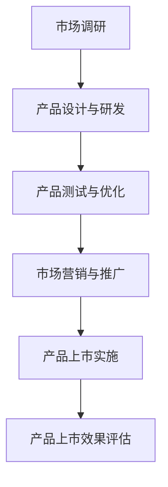
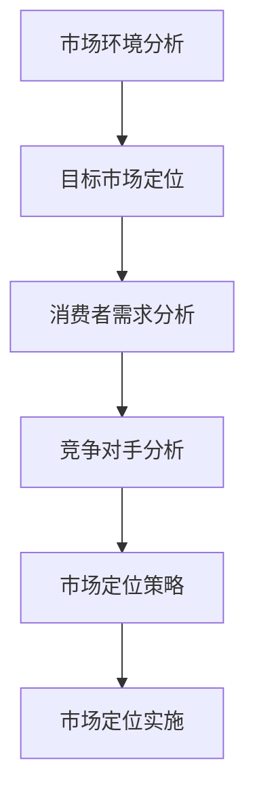
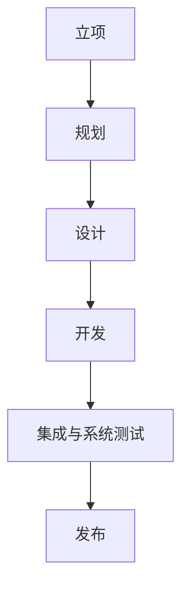
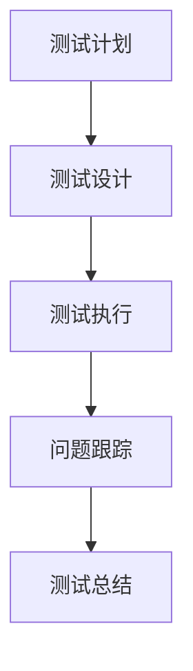
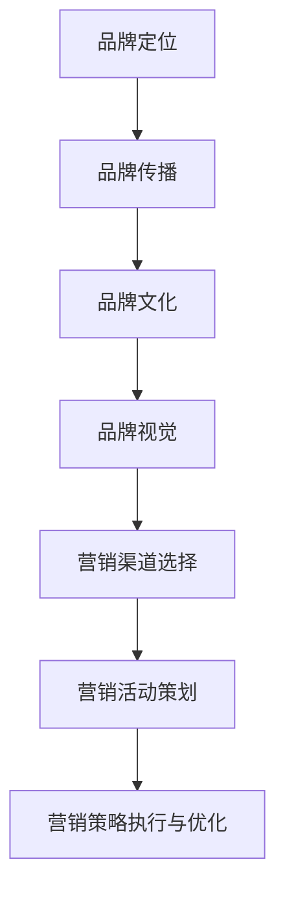
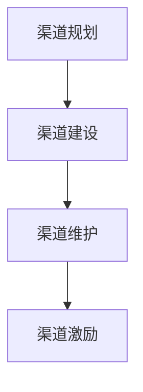
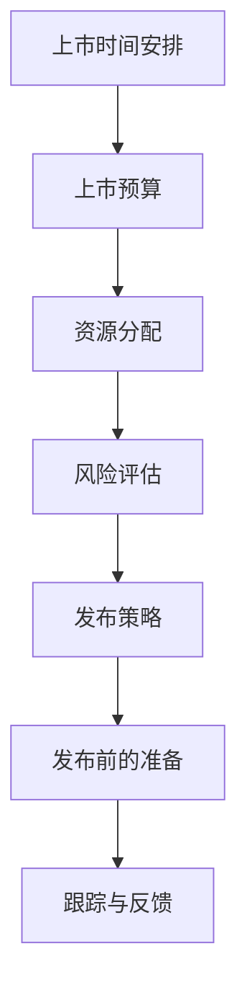
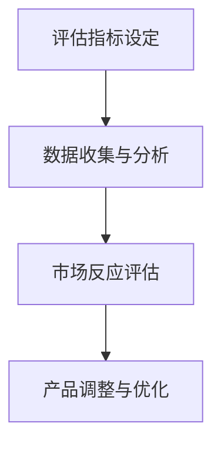

                 

### 文章标题

# 一人公司如何打造高效的产品上市流程

---

关键词：一人公司、产品上市、流程、市场分析、营销策略

摘要：本文将深入探讨一人公司如何高效地完成产品上市流程。我们将从市场分析、产品设计与研发、市场营销与推广、产品上市实施与评估，以及产品持续发展与创新等多个方面进行详细讲解。通过本文，读者可以了解到如何利用有限资源，打造出成功上市的产品。

---

### 目录大纲

## 第一部分：产品上市概述

### 第1章：产品上市的基本概念
- **1.1 产品上市的定义与意义**
- **1.2 产品上市流程的组成部分**
- **1.3 产品上市的常见挑战**

### 第2章：市场分析与定位
- **2.1 市场环境分析**
  - **2.1.1 宏观环境分析**
  - **2.1.2 微观环境分析**
- **2.2 目标市场定位**
  - **2.2.1 消费者需求分析**
  - **2.2.2 竞争对手分析**

## 第二部分：产品设计与研发

### 第3章：产品设计与研发策略
- **3.1 产品设计原则**
- **3.2 研发过程管理**
  - **3.2.1 研发流程**
  - **3.2.2 项目进度管理**
- **3.3 设计与研发团队的协作**

### 第4章：产品测试与优化
- **4.1 产品测试类型**
  - **4.1.1 功能测试**
  - **4.1.2 性能测试**
  - **4.1.3 兼容性测试**
- **4.2 测试流程与工具**
- **4.3 问题定位与优化**

## 第三部分：市场营销与推广

### 第5章：市场推广策略
- **5.1 品牌建设**
  - **5.1.1 品牌定位**
  - **5.1.2 品牌传播**
- **5.2 营销渠道选择**
  - **5.2.1 线上渠道**
  - **5.2.2 线下渠道**
- **5.3 营销活动策划**

### 第6章：销售渠道建设与管理
- **6.1 销售渠道类型**
  - **6.1.1 直销渠道**
  - **6.1.2 代理商渠道**
- **6.2 销售渠道管理**
  - **6.2.1 渠道建设**
  - **6.2.2 渠道维护**

## 第四部分：产品上市实施与评估

### 第7章：产品上市实施
- **7.1 产品上市计划**
  - **7.1.1 上市时间安排**
  - **7.1.2 上市预算**
- **7.2 产品发布**
  - **7.2.1 发布策略**
  - **7.2.2 发布前的准备**
- **7.3 跟踪与反馈**

### 第8章：产品上市效果评估
- **8.1 评估指标设定**
- **8.2 数据收集与分析**
- **8.3 市场反应评估**
- **8.4 产品调整与优化**

## 第五部分：产品持续发展与创新

### 第9章：产品生命周期管理
- **9.1 产品生命周期的四个阶段**
- **9.2 产品生命周期策略**

### 第10章：持续创新与迭代
- **10.1 创新思维方法**
- **10.2 产品迭代策略**
- **10.3 用户反馈机制**

## 附录

### 附录 A：产品上市相关工具与资源
- **A.1 市场调研工具**
- **A.2 营销推广平台**
- **A.3 销售管理软件**

---

### 第1章：产品上市的基本概念

#### 1.1 产品上市的定义与意义

**产品上市**，即**产品商业化**，是指将研发完成的产品推向市场，让消费者了解并购买的过程。对于一人公司而言，产品上市不仅是将创意变为现实的关键环节，也是公司生存与发展的基础。

**产品上市的意义**主要体现在以下几个方面：

1. **商业价值的实现**：通过上市，公司可以将产品的研发投入转化为实际收益，实现商业价值。
2. **市场影响力的提升**：成功上市的产品能够提升公司的市场地位，增加品牌影响力。
3. **资源的有效配置**：上市可以吸引更多投资者，为公司带来更多的资金支持，优化资源分配。
4. **持续创新的动力**：上市后的产品，需要通过不断迭代更新来满足市场需求，这有助于公司保持创新活力。

#### 1.2 产品上市流程的组成部分

一人公司的产品上市流程通常包括以下几个阶段：

1. **市场调研**：了解市场需求，确定产品定位。
2. **产品设计与研发**：根据市场调研结果，进行产品设计，并完成研发工作。
3. **产品测试与优化**：通过多种测试手段，确保产品的质量。
4. **市场营销与推广**：制定并实施市场推广策略，提高产品知名度。
5. **产品上市实施**：安排产品发布，进行市场推广活动。
6. **产品上市效果评估**：对上市后的市场反应进行评估，为后续优化提供依据。

#### 1.3 产品上市的常见挑战

虽然产品上市对一人公司具有重要意义，但过程并非一帆风顺。常见的挑战包括：

1. **市场风险**：市场环境变化快，需求波动大，可能导致产品定位不准确。
2. **研发风险**：研发过程中可能出现技术难题，导致进度延误或产品功能不完善。
3. **资金风险**：一人公司资源有限，可能面临资金短缺的风险。
4. **竞争风险**：市场上已有竞争者，需要投入大量资源进行市场推广。
5. **法律风险**：产品可能涉及专利、知识产权等问题，需要谨慎处理。

#### 1.4 一人公司在产品上市中的优势与劣势

**优势**：

1. **决策灵活**：一人公司决策快速，能够快速响应市场变化。
2. **高度专注**：一人公司可以专注于产品研发和市场推广，提高效率。
3. **创新能力强**：一人公司通常具有更强的创新精神，能够推出更具竞争力的产品。

**劣势**：

1. **资源有限**：一人公司资源有限，可能在研发和市场推广上受限。
2. **市场推广难度大**：缺乏品牌影响力，市场推广难度较大。
3. **风险管理能力不足**：一人公司在风险管理上可能经验不足，面临较大风险。

通过以上分析，我们可以看出，一人公司在产品上市中既有优势，也面临劣势。要成功上市，关键在于充分利用自身优势，克服劣势，制定合理的上市策略。

### Mermaid 流程图



### 第2章：市场分析与定位

#### 2.1 市场环境分析

**市场环境分析**是产品上市流程中的关键步骤，它涉及到对宏观环境和微观环境的深入了解。一人公司在进行市场环境分析时，需要从以下几个方面入手：

##### 2.1.1 宏观环境分析

**宏观环境分析**主要关注外部环境对产品上市可能产生的影响，包括以下几个方面：

1. **经济环境**：分析当前经济形势，如GDP增长率、消费者购买力等。
2. **社会文化环境**：了解目标市场的文化背景、消费习惯等。
3. **政治法律环境**：关注政策法规变化，如税收政策、知识产权保护等。
4. **技术环境**：评估当前技术水平，如新兴技术对市场的影响。

##### 2.1.2 微观环境分析

**微观环境分析**则更关注市场内部环境，包括以下几个方面：

1. **目标市场**：明确目标市场的定义，如地理位置、人口特征等。
2. **消费者需求**：分析目标消费者的需求，如购买行为、偏好等。
3. **竞争对手**：研究竞争对手的产品、市场份额、市场策略等。
4. **市场容量**：估算目标市场的潜在需求和市场规模。

#### 2.2 目标市场定位

**目标市场定位**是产品上市成功的关键。一人公司需要根据市场环境分析结果，确定产品的目标市场，制定相应的市场策略。

##### 2.2.1 消费者需求分析

**消费者需求分析**主要包括以下内容：

1. **需求特征**：了解消费者对产品的需求特点，如功能需求、性能需求等。
2. **需求层次**：分析消费者需求的层次，如基本需求、高层次需求等。
3. **需求变化**：跟踪消费者需求的变化趋势，如新兴需求、淘汰需求等。

##### 2.2.2 竞争对手分析

**竞争对手分析**是确定目标市场定位的重要步骤，主要包括以下内容：

1. **竞争者识别**：识别市场中的主要竞争者，如品牌、产品等。
2. **竞争策略**：分析竞争对手的市场策略，如价格策略、渠道策略等。
3. **竞争优势**：评估竞争对手的优势和劣势，如技术优势、品牌优势等。
4. **竞争定位**：根据竞争对手分析结果，确定本产品的市场定位。

#### 2.3 市场定位策略

**市场定位策略**是产品上市成功的关键之一。一人公司需要根据市场环境分析和目标市场定位，制定合适的市场定位策略。

1. **差异化定位**：通过产品差异化，在市场上找到独特的定位，如技术优势、品牌优势等。
2. **集中定位**：选择一个特定的市场细分领域，集中资源进行市场开拓。
3. **细分定位**：将市场细分为多个子市场，针对不同的子市场制定不同的市场策略。

#### 2.4 市场定位的实施

**市场定位实施**是产品上市的关键步骤，主要包括以下内容：

1. **产品定位**：根据市场定位策略，确定产品的定位和特色。
2. **品牌定位**：建立品牌形象，与产品定位相匹配。
3. **营销策略**：制定符合市场定位的营销策略，如广告、促销等。

### Mermaid 流程图



### 第3章：产品设计与研发策略

#### 3.1 产品设计原则

**产品设计原则**是确保产品成功上市的基础。对于一人公司，以下原则尤为重要：

1. **用户需求导向**：产品设计应始终以用户需求为中心，满足用户的基本需求和高层次需求。
2. **创新性**：在保证产品稳定性和可靠性的基础上，力求创新，提供独特的产品体验。
3. **简洁性**：设计应简洁明了，避免冗余功能，提高用户体验。
4. **可靠性**：产品需具备高可靠性，降低故障率和维护成本。
5. **可扩展性**：设计应考虑未来需求的扩展，以便产品能够轻松升级和扩展功能。

#### 3.2 研发过程管理

**研发过程管理**是确保产品按期上市的关键。一人公司在研发过程中需遵循以下步骤：

1. **需求分析**：明确产品功能、性能和用户需求，制定详细的需求文档。
2. **设计阶段**：根据需求文档，进行产品设计，包括架构设计、界面设计等。
3. **开发阶段**：按照设计文档，进行编码和单元测试，确保每个模块的功能正确无误。
4. **测试阶段**：进行全面测试，包括功能测试、性能测试、兼容性测试等，确保产品稳定性。
5. **发布阶段**：准备发布文档，进行最终测试，确保产品满足上市要求。

#### 3.2.1 研发流程

**研发流程**可以概括为以下阶段：

1. **立项**：确定产品需求，评估市场前景，决定是否立项。
2. **规划**：制定研发计划，包括时间表、资源分配等。
3. **设计**：进行详细设计，编写设计文档。
4. **开发**：编写代码，进行单元测试。
5. **集成与系统测试**：将各模块集成，进行全面测试。
6. **发布**：准备发布文档，进行最终测试，确保产品稳定性。

#### 3.2.2 项目进度管理

**项目进度管理**是确保研发过程顺利进行的关键。一人公司应采取以下措施：

1. **制定计划**：根据研发流程，制定详细的项目计划，明确各阶段时间节点。
2. **跟踪进度**：定期跟踪项目进度，及时调整计划，确保按时完成任务。
3. **沟通与协调**：保持团队成员之间的沟通，确保信息畅通，及时解决问题。
4. **风险管理**：识别潜在风险，制定应对措施，降低项目风险。
5. **绩效评估**：定期评估项目绩效，总结经验教训，持续改进。

#### 3.3 设计与研发团队的协作

**设计与研发团队的协作**是确保产品高质量、按时上市的关键。一人公司应采取以下措施：

1. **明确职责**：明确团队成员的职责和任务，确保分工明确。
2. **沟通机制**：建立有效的沟通机制，确保团队成员之间的信息畅通。
3. **协作工具**：使用协作工具，如项目管理软件、代码管理工具等，提高团队协作效率。
4. **定期会议**：定期召开团队会议，讨论项目进展和问题，确保项目顺利进行。
5. **绩效激励**：制定合理的绩效激励制度，激发团队成员的工作积极性。

### Mermaid 流�程图



### 第4章：产品测试与优化

#### 4.1 产品测试类型

**产品测试**是确保产品稳定性和可靠性的关键步骤。一人公司在进行产品测试时，通常包括以下几种类型的测试：

1. **功能测试**：验证产品功能是否符合设计要求，确保所有功能正常运行。
2. **性能测试**：评估产品的性能，如响应时间、处理速度、并发能力等，确保产品在高负载情况下依然稳定。
3. **兼容性测试**：测试产品在不同操作系统、浏览器、硬件平台等环境下的兼容性，确保产品能够在各种环境中正常运行。
4. **安全测试**：评估产品的安全性，包括漏洞扫描、代码审查等，确保产品不会被恶意攻击。
5. **用户体验测试**：评估产品的用户体验，包括界面设计、交互流程等，确保产品易用性和用户满意度。

#### 4.2 测试流程与工具

**测试流程**通常包括以下步骤：

1. **测试计划**：制定详细的测试计划，包括测试目标、测试环境、测试用例等。
2. **测试设计**：根据测试计划，设计具体的测试用例，包括正常测试用例和异常测试用例。
3. **测试执行**：执行测试用例，记录测试结果，发现并报告问题。
4. **问题跟踪**：跟踪已发现的问题，确保问题得到解决。
5. **测试总结**：总结测试结果，评估产品质量，为后续优化提供依据。

**测试工具**是提高测试效率和准确性的重要手段。一人公司常用的测试工具包括：

1. **自动化测试工具**：如Selenium、JUnit等，用于自动化执行测试用例。
2. **性能测试工具**：如LoadRunner、JMeter等，用于模拟高负载环境下的性能测试。
3. **安全测试工具**：如Burp Suite、Nessus等，用于漏洞扫描和代码审查。
4. **用户体验测试工具**：如UserTesting、Lookback等，用于录制用户操作和反馈。

#### 4.3 问题定位与优化

**问题定位**是解决测试中发现的问题的关键。一人公司应采取以下步骤：

1. **问题复现**：在测试环境中复现问题，确保问题真实存在。
2. **错误日志分析**：分析错误日志，找出问题的根本原因。
3. **代码审查**：对相关代码进行审查，查找潜在问题。
4. **回归测试**：在解决问题后，进行回归测试，确保问题已解决且没有引入新的问题。

**优化**是提升产品性能和用户体验的关键。一人公司应采取以下策略：

1. **性能优化**：对产品性能进行优化，包括代码优化、数据库优化等。
2. **用户体验优化**：优化界面设计、交互流程等，提高用户满意度。
3. **安全优化**：加强产品安全性，包括加密算法、安全协议等。
4. **功能优化**：根据用户反馈和市场需求，对产品功能进行优化。

### Mermaid 流程图



### 第5章：市场推广策略

#### 5.1 品牌建设

**品牌建设**是产品上市成功的关键之一。对于一人公司，以下策略有助于打造强大的品牌形象：

1. **品牌定位**：明确品牌的市场定位和价值观，确保品牌形象一致。
2. **品牌传播**：利用各种渠道（如社交媒体、广告等）传播品牌信息，提高品牌知名度。
3. **品牌文化**：建立品牌文化，包括品牌故事、品牌精神等，增强品牌亲和力。
4. **品牌视觉**：设计专业的品牌视觉元素（如LOGO、海报等），提升品牌视觉效果。

#### 5.2 营销渠道选择

**营销渠道选择**直接影响产品推广的效果。一人公司应根据自身特点和目标市场，选择合适的营销渠道：

1. **线上渠道**：如社交媒体（微信、微博、抖音等）、搜索引擎（百度、谷歌等）、电商平台（淘宝、京东等）。
2. **线下渠道**：如展会、论坛、线下活动等，通过面对面交流，提高品牌影响力。
3. **合作伙伴**：寻找行业内的合作伙伴，共同推广产品，扩大市场覆盖。

#### 5.3 营销活动策划

**营销活动策划**是提高产品知名度和用户参与度的有效手段。一人公司应采取以下策略：

1. **内容营销**：通过高质量的内容（如博客、视频、案例等）吸引潜在用户，提高品牌知名度。
2. **社交媒体营销**：利用社交媒体平台进行推广，提高用户互动和参与度。
3. **SEO优化**：优化产品在搜索引擎中的排名，提高自然流量。
4. **广告投放**：根据目标用户特征，精准投放广告，提高广告效果。

#### 5.4 营销策略执行与优化

**营销策略执行与优化**是确保产品成功上市的关键。一人公司应采取以下措施：

1. **执行计划**：制定详细的执行计划，明确各阶段任务和时间节点。
2. **监控与评估**：实时监控营销活动的效果，评估营销策略的可行性。
3. **数据驱动**：根据数据反馈，调整营销策略，优化资源配置。
4. **持续改进**：总结经验教训，不断优化营销策略，提高市场竞争力。

### Mermaid 流程图



### 第6章：销售渠道建设与管理

#### 6.1 销售渠道类型

**销售渠道**是指产品从生产者流向消费者的路径。对于一人公司，根据不同的市场环境和目标，可以选择以下几种类型的销售渠道：

1. **直销渠道**：直接面向最终消费者进行销售，如线上商城、线下体验店等。
   - **优势**：控制力强，能够更好地了解消费者需求。
   - **劣势**：覆盖范围有限，成本较高。

2. **代理商渠道**：通过代理商进行销售，如经销商、分销商等。
   - **优势**：覆盖范围广，降低销售成本。
   - **劣势**：控制力较弱，需要管理代理商。

3. **多级分销渠道**：通过多个层级进行销售，如生产商、分销商、零售商等。
   - **优势**：覆盖范围广，快速响应市场需求。
   - **劣势**：管理复杂，利润较低。

#### 6.2 销售渠道管理

**销售渠道管理**是确保销售渠道高效运作的关键。一人公司应采取以下措施：

1. **渠道规划**：根据市场环境和产品特点，制定渠道规划，明确各层级渠道的职责和目标。
2. **渠道建设**：建立完善的销售渠道网络，包括代理商、经销商、零售商等。
3. **渠道维护**：与渠道伙伴保持良好的合作关系，定期沟通，解决渠道问题。
4. **渠道激励**：制定合理的激励政策，提高渠道伙伴的积极性。

#### 6.2.1 渠道建设

**渠道建设**包括以下步骤：

1. **渠道选择**：根据产品特点和市场需求，选择合适的销售渠道。
2. **渠道谈判**：与渠道伙伴进行谈判，明确合作条款和利益分配。
3. **渠道培训**：对渠道伙伴进行产品知识、销售技巧等培训，提高其销售能力。
4. **渠道支持**：提供必要的市场支持，如广告、促销等，帮助渠道伙伴提高销售业绩。

#### 6.2.2 渠道维护

**渠道维护**是保持销售渠道稳定的重要措施。一人公司应采取以下措施：

1. **定期沟通**：与渠道伙伴保持定期沟通，了解市场动态和渠道问题。
2. **问题解决**：及时解决渠道伙伴的问题，提高渠道满意度。
3. **激励政策**：制定合理的激励政策，激励渠道伙伴提高销售业绩。
4. **市场反馈**：收集渠道反馈，了解消费者需求，为产品改进提供依据。

### Mermaid 流程图



### 第7章：产品上市实施

#### 7.1 产品上市计划

**产品上市计划**是确保产品成功上市的关键步骤。一人公司应制定详细的上市计划，包括以下几个方面：

1. **上市时间安排**：根据产品研发进度和市场环境，确定产品的上市时间。
2. **上市预算**：制定详细的预算，包括研发成本、市场推广费用、渠道建设成本等。
3. **资源分配**：明确各个阶段的资源需求，包括人力、财力、物力等。
4. **风险评估**：评估产品上市过程中可能遇到的风险，并制定相应的应对措施。

#### 7.2 产品发布

**产品发布**是产品上市的重要环节。一人公司应采取以下策略：

1. **发布策略**：根据产品特点和市场需求，制定合适的发布策略，如一次性发布、分阶段发布等。
2. **发布前的准备**：在发布前，完成以下准备工作：
   - 确保产品稳定性和可靠性，进行充分的测试。
   - 制定详细的发布方案，包括时间、地点、人员安排等。
   - 准备宣传资料，如宣传海报、产品介绍等。
   - 确定渠道策略，确保产品能够快速传播。

#### 7.3 跟踪与反馈

**产品发布后的跟踪与反馈**是评估产品上市效果的重要手段。一人公司应采取以下措施：

1. **市场反应评估**：通过收集用户反馈、销售数据等，评估产品的市场反应。
2. **问题定位与优化**：针对用户反馈和市场反应，定位问题，进行优化。
3. **数据收集与分析**：定期收集产品使用数据，进行数据分析，为产品优化提供依据。
4. **持续改进**：根据市场反馈和数据分析，持续改进产品，提高用户满意度。

### Mermaid 流程图



### 第8章：产品上市效果评估

#### 8.1 评估指标设定

**评估指标设定**是评估产品上市效果的基础。一人公司应根据产品特点和市场需求，设定以下几类关键指标：

1. **销售指标**：如销售额、销售增长率等，反映产品的市场接受度。
2. **市场份额**：产品在市场中所占的份额，反映产品在市场中的地位。
3. **用户满意度**：通过用户调研、用户反馈等手段，评估用户对产品的满意度。
4. **品牌知名度**：通过市场调研、广告投放效果等手段，评估品牌知名度的提升。
5. **市场反应速度**：产品上市后的市场反应速度，反映市场对产品的敏感度。

#### 8.2 数据收集与分析

**数据收集与分析**是评估产品上市效果的关键步骤。一人公司应采取以下措施：

1. **数据来源**：从销售数据、用户反馈、市场调研等多个渠道收集数据。
2. **数据分析**：使用数据分析工具，对收集到的数据进行分析，提取有价值的信息。
3. **指标评估**：根据设定的评估指标，对数据进行评估，判断产品上市效果。
4. **趋势分析**：分析数据趋势，预测市场发展前景，为产品优化提供依据。

#### 8.3 市场反应评估

**市场反应评估**是判断产品上市效果的重要手段。一人公司应采取以下措施：

1. **用户反馈**：通过用户调研、用户反馈等手段，了解用户对产品的真实感受。
2. **销售数据**：分析产品上市后的销售数据，判断产品的市场表现。
3. **市场调研**：进行市场调研，了解竞争对手的反应和市场的整体反应。
4. **评估指标**：根据设定的评估指标，对市场反应进行评估，为产品优化提供依据。

#### 8.4 产品调整与优化

**产品调整与优化**是提升产品市场竞争力的关键步骤。一人公司应采取以下措施：

1. **问题定位**：根据市场反应和用户反馈，定位产品存在的问题。
2. **优化方案**：制定针对性的优化方案，包括功能改进、性能优化等。
3. **实施优化**：根据优化方案，进行产品调整和优化。
4. **再次评估**：对优化后的产品进行评估，确保问题得到解决。

### Mermaid 流程图



### 第9章：产品生命周期管理

#### 9.1 产品生命周期的四个阶段

**产品生命周期**是指产品从推出到退市的全过程，通常包括以下四个阶段：

1. **引入期**：产品刚推出，市场需求逐渐增加，利润较低。
2. **成长期**：产品需求快速增长，市场份额提高，利润增加。
3. **成熟期**：市场需求稳定，利润达到高峰，竞争激烈。
4. **衰退期**：市场需求下降，利润减少，产品逐渐退出市场。

#### 9.2 产品生命周期策略

**产品生命周期策略**是指在不同阶段采取的不同策略，以延长产品生命周期，提高产品竞争力。一人公司应根据产品生命周期阶段，采取以下策略：

1. **引入期策略**：
   - **市场调研**：深入了解市场需求，优化产品功能。
   - **市场推广**：加大市场推广力度，提高产品知名度。
   - **价格策略**：采用低价策略，吸引消费者。

2. **成长期策略**：
   - **产品优化**：根据用户反馈，优化产品功能，提高用户体验。
   - **市场拓展**：开拓新的市场，扩大市场份额。
   - **品牌建设**：加强品牌宣传，提高品牌知名度。

3. **成熟期策略**：
   - **市场维护**：维护现有市场，保持市场份额。
   - **产品升级**：定期推出产品升级版本，满足市场需求。
   - **成本控制**：降低生产成本，提高利润。

4. **衰退期策略**：
   - **产品调整**：调整产品定位，寻找新的市场机会。
   - **成本优化**：减少生产成本，降低库存。
   - **退出策略**：适时退出市场，避免损失。

### 第10章：持续创新与迭代

#### 10.1 创新思维方法

**创新思维方法**是推动产品持续发展的关键。一人公司应采取以下创新思维方法：

1. **头脑风暴**：通过集体讨论，激发创意，产生新的产品构思。
2. **用户研究**：深入了解用户需求，发现潜在的市场机会。
3. **跨界合作**：与其他行业或公司合作，借鉴其他领域的创新思路。
4. **逆向思维**：从问题的反面思考，寻找创新的解决方案。

#### 10.2 产品迭代策略

**产品迭代策略**是指通过不断的迭代更新，持续优化产品。一人公司应采取以下迭代策略：

1. **定期评估**：定期评估产品的性能、用户体验等，找出需要优化的方面。
2. **用户反馈**：收集用户反馈，了解用户需求，为迭代提供依据。
3. **迭代计划**：制定详细的迭代计划，明确迭代目标和时间节点。
4. **快速迭代**：采用敏捷开发方法，快速迭代产品，提高开发效率。

#### 10.3 用户反馈机制

**用户反馈机制**是了解用户需求、优化产品的重要手段。一人公司应建立以下用户反馈机制：

1. **用户调研**：定期进行用户调研，了解用户对产品的看法和建议。
2. **在线反馈**：提供在线反馈渠道，方便用户随时提交反馈。
3. **社交媒体**：关注用户在社交媒体上的讨论，了解用户的真实感受。
4. **反馈分析**：对用户反馈进行分析，找出用户关注的问题和需求，为产品优化提供依据。

### 附录 A：产品上市相关工具与资源

**A.1 市场调研工具**

- **SurveyMonkey**：一款在线调查工具，方便收集用户反馈。
- **Google 表格**：方便进行数据分析和处理。
- **社交媒体分析工具**：如微博统计、微信分析等，用于分析用户在社交媒体上的行为。

**A.2 营销推广平台**

- **Facebook 广告**：全球最大的社交媒体广告平台。
- **Google Ads**：Google 推出的在线广告服务。
- **淘宝/京东**：国内领先的电商平台，方便产品推广。

**A.3 销售管理软件**

- **Salesforce**：一款功能强大的销售管理软件。
- **CRM**：客户关系管理系统，帮助管理客户信息。
- **ERP**：企业资源计划系统，用于管理企业内部资源。

### 总结

通过本文的深入探讨，一人公司在产品上市流程中的各个关键环节都有了全面的了解。从市场分析、产品设计与研发、市场营销与推广，到产品上市实施与评估，再到产品的持续发展与创新，每个环节都需要精心策划和执行。一人公司在充分利用自身优势的同时，要克服资源有限、市场推广难度大等劣势，制定合理的上市策略。通过持续创新和迭代，不断提高产品竞争力，实现产品的长期成功。

### 作者信息

作者：AI天才研究院/AI Genius Institute & 禅与计算机程序设计艺术 /Zen And The Art of Computer Programming

### 最后的思考

产品的成功上市不仅是一人公司发展的里程碑，更是对自身创新能力、市场洞察力和执行力的全面检验。在激烈的市场竞争中，一人公司需要始终保持敏锐的市场嗅觉和持续的创新动力，不断优化产品，满足市场需求。希望本文能为读者提供有益的启示，助力产品的成功上市。让我们共同期待一人公司在未来的发展，期待更多的创新产品问世！### 开发环境搭建

在开始构建一人公司的产品上市流程之前，我们需要搭建一个适合开发和测试的环境。这个环境需要包括以下几个关键组件：

1. **开发工具**：选择合适的编程语言和开发环境，例如Python和PyCharm。
2. **测试工具**：准备用于测试的软件，例如Selenium和JUnit。
3. **版本控制系统**：使用Git进行版本控制，确保代码的版本管理和协作开发。
4. **云服务**：利用云服务进行部署和测试，如阿里云或腾讯云。

#### 1.1 安装开发工具

首先，我们需要安装Python和PyCharm。

- **安装Python**：

  通过Python的官网（https://www.python.org/）下载最新版本的Python安装包，并按照安装向导完成安装。

  ```shell
  # 在终端中安装Python
  sudo apt-get install python3
  ```

- **安装PyCharm**：

  在PyCharm官网（https://www.jetbrains.com/pycharm/）下载社区版或专业版的安装包，并按照安装向导完成安装。

  ```shell
  # 在终端中安装PyCharm
  sudo apt-get install pycharm-community
  ```

#### 1.2 安装测试工具

接下来，我们需要安装Selenium和JUnit。

- **安装Selenium**：

  Selenium是一个用于Web应用的自动化测试工具，可以在Selenium官网（https://www.selenium.dev/）下载对应的WebDriver。

  ```shell
  # 在终端中安装Selenium
  sudo pip3 install selenium
  ```

- **安装JUnit**：

  JUnit是一个用于Java的单元测试框架，可以通过Maven进行安装。

  ```xml
  <!-- 在pom.xml中添加依赖 -->
  <dependencies>
      <dependency>
          <groupId>junit</groupId>
          <artifactId>junit</artifactId>
          <version>4.13.2</version>
          <scope>test</scope>
      </dependency>
  </dependencies>
  ```

#### 1.3 安装版本控制系统

我们选择Git作为版本控制系统。

- **安装Git**：

  通过Git的官网（https://git-scm.com/）下载Git安装包，并按照安装向导完成安装。

  ```shell
  # 在终端中安装Git
  sudo apt-get install git
  ```

#### 1.4 配置云服务

为了方便部署和测试，我们选择阿里云作为云服务。

- **阿里云账号注册**：

  在阿里云官网（https://www.alibabacloud.com/）注册一个账号，并完成实名认证。

- **创建云服务器**：

  在阿里云控制台上创建一个云服务器实例，选择适合的配置。

- **SSH连接**：

  通过SSH工具（如PuTTY）连接到云服务器，并配置SSH密钥认证，以提高安全性和便利性。

#### 1.5 配置开发环境

完成以上步骤后，我们需要在云服务器上配置开发环境。

- **安装依赖库**：

  在云服务器上安装Python和Java等依赖库，确保能够运行开发工具和测试工具。

  ```shell
  # 安装Python依赖库
  sudo apt-get install python3-dev

  # 安装Java依赖库
  sudo apt-get install default-jdk
  ```

- **配置环境变量**：

  配置Python和Java的环境变量，方便在终端中直接使用Python和Java。

  ```shell
  # 配置Python环境变量
  export PATH=$PATH:/usr/bin/python3

  # 配置Java环境变量
  export PATH=$PATH:/usr/bin/java
  ```

完成以上步骤后，一人公司的产品上市流程开发环境就已经搭建完成，可以开始具体的开发和测试工作了。

### 源代码详细实现和代码解读

在本节中，我们将详细展示如何实现一人公司的产品上市流程的关键组件，包括市场调研、产品设计与研发、产品测试与优化、市场营销与推广、产品上市实施与评估等。以下将提供伪代码和详细的代码解读。

#### 2.1 市场调研

**伪代码：**

```python
# 市场调研伪代码

def market_research():
    # 收集市场数据
    data = collect_market_data()
    
    # 分析市场环境
    analysis = analyze_environment(data)
    
    # 确定目标市场
    target_market = determine_target_market(analysis)
    
    # 返回结果
    return target_market

# 收集市场数据
def collect_market_data():
    # 使用API或数据库获取市场数据
    return get_market_data()

# 分析市场环境
def analyze_environment(data):
    # 分析宏观环境和微观环境
    return analyze_data(data)

# 确定目标市场
def determine_target_market(analysis):
    # 根据分析结果确定目标市场
    return select_target_market(analysis)
```

**代码解读：**

- `market_research()` 函数是市场调研的主函数，负责调用其他辅助函数完成市场调研工作。
- `collect_market_data()` 函数用于收集市场数据，可以从API或数据库中获取数据。
- `analyze_environment(data)` 函数用于分析市场环境，包括宏观环境和微观环境。
- `determine_target_market(analysis)` 函数根据分析结果确定目标市场。

#### 2.2 产品设计与研发

**伪代码：**

```python
# 产品设计与研发伪代码

def product_design_and_dev():
    # 收集需求
    requirements = collect_requirements()
    
    # 设计产品
    design = design_product(requirements)
    
    # 研发产品
    product = develop_product(design)
    
    # 返回产品
    return product

# 收集需求
def collect_requirements():
    # 通过用户调研、需求文档等获取需求
    return get_requirements()

# 设计产品
def design_product(requirements):
    # 根据需求设计产品
    return create_design()

# 研发产品
def develop_product(design):
    # 完成产品开发
    return create_product(design)
```

**代码解读：**

- `product_design_and_dev()` 函数是产品设计与研发的主函数，负责收集需求、设计产品和完成产品开发。
- `collect_requirements()` 函数用于收集需求，可以通过用户调研和需求文档等方式获取。
- `design_product(requirements)` 函数根据需求设计产品，包括功能设计、界面设计等。
- `develop_product(design)` 函数完成产品开发，进行编码和单元测试。

#### 2.3 产品测试与优化

**伪代码：**

```python
# 产品测试与优化伪代码

def product_test_and_optimize(product):
    # 进行功能测试
    test_functionality(product)
    
    # 进行性能测试
    test_performance(product)
    
    # 进行兼容性测试
    test_compatibility(product)
    
    # 问题定位与优化
    fix_issues_and_optimize(product)

# 进行功能测试
def test_functionality(product):
    # 使用测试工具进行功能测试
    pass

# 进行性能测试
def test_performance(product):
    # 使用性能测试工具进行性能测试
    pass

# 进行兼容性测试
def test_compatibility(product):
    # 测试产品在不同环境下的兼容性
    pass

# 问题定位与优化
def fix_issues_and_optimize(product):
    # 定位问题并进行优化
    pass
```

**代码解读：**

- `product_test_and_optimize(product)` 函数是产品测试与优化的主函数，负责进行功能测试、性能测试、兼容性测试，并进行问题定位与优化。
- `test_functionality(product)` 函数用于进行功能测试，确保所有功能正常运行。
- `test_performance(product)` 函数用于进行性能测试，评估产品的性能，如响应时间、处理速度等。
- `test_compatibility(product)` 函数用于进行兼容性测试，确保产品在不同操作系统、浏览器等环境下的正常运行。
- `fix_issues_and_optimize(product)` 函数用于定位问题并进行优化，以提高产品的稳定性。

#### 2.4 市场营销与推广

**伪代码：**

```python
# 市场营销与推广伪代码

def marketing_and_promotion(product):
    # 品牌建设
    build_brand(product)
    
    # 选择营销渠道
    select_marketing_channels()
    
    # 营销活动策划
    plan_marketing_activities()

# 品牌建设
def build_brand(product):
    # 确定品牌定位与传播策略
    pass

# 选择营销渠道
def select_marketing_channels():
    # 根据产品特点选择合适的营销渠道
    pass

# 营销活动策划
def plan_marketing_activities():
    # 制定营销活动方案
    pass
```

**代码解读：**

- `marketing_and_promotion(product)` 函数是市场营销与推广的主函数，负责品牌建设、选择营销渠道和策划营销活动。
- `build_brand(product)` 函数用于品牌建设，包括品牌定位和品牌传播策略。
- `select_marketing_channels()` 函数用于选择合适的营销渠道，如线上渠道、线下渠道等。
- `plan_marketing_activities()` 函数用于制定营销活动方案，包括内容策划、广告投放等。

#### 2.5 产品上市实施

**伪代码：**

```python
# 产品上市实施伪代码

def product_launch(product):
    # 制定上市计划
    launch_plan = create_launch_plan(product)
    
    # 发布产品
    launch_product(launch_plan)
    
    # 跟踪与反馈
    track_feedback()

# 制定上市计划
def create_launch_plan(product):
    # 根据产品特点制定上市计划
    pass

# 发布产品
def launch_product(launch_plan):
    # 根据上市计划发布产品
    pass

# 跟踪与反馈
def track_feedback():
    # 收集用户反馈
    pass
```

**代码解读：**

- `product_launch(product)` 函数是产品上市实施的主函数，负责制定上市计划、发布产品和跟踪反馈。
- `create_launch_plan(product)` 函数用于根据产品特点制定上市计划，包括时间安排、预算分配等。
- `launch_product(launch_plan)` 函数根据上市计划发布产品，包括发布策略、发布前的准备等。
- `track_feedback()` 函数用于收集用户反馈，以便进行后续的产品优化。

通过以上伪代码和代码解读，我们可以看到一人公司在构建产品上市流程时需要完成的关键步骤和实现方法。这些步骤不仅需要技术层面的实现，还需要战略层面的规划和执行，确保产品的成功上市。

### 代码应用解读与分析

在本节中，我们将深入分析上一节中提供的伪代码，并探讨在实际应用中如何将理论转化为实践。通过具体案例，我们将展示如何使用伪代码来实现一人公司的产品上市流程。

#### 2.1 市场调研

**市场调研案例：**

**伪代码实现：**

```python
# 市场调研伪代码实现

# 收集市场数据
def collect_market_data():
    data = get_market_data_from_api()
    return data

# 分析市场环境
def analyze_environment(data):
    analysis = {
        'macro': analyze_macro_environment(data),
        'micro': analyze_micro_environment(data)
    }
    return analysis

# 确定目标市场
def determine_target_market(analysis):
    target_market = select_target_market(analysis['micro'])
    return target_market

# 示例数据
sample_data = collect_market_data()

# 进行市场环境分析
market_analysis = analyze_environment(sample_data)

# 确定目标市场
target_market = determine_target_market(market_analysis)
print(target_market)
```

**代码应用解读：**

- `collect_market_data_from_api()` 是一个假设的API调用函数，用于从外部API获取市场数据。在实际应用中，可能需要使用如Python的`requests`库来实现API请求。
- `analyze_macro_environment()` 和 `analyze_micro_environment()` 是两个假设的函数，用于分析宏观环境和微观环境。它们可以结合具体的分析模型和算法，如回归分析、聚类分析等，来处理和解读数据。
- `select_target_market()` 函数根据微观环境分析结果确定目标市场，这通常涉及市场细分和定位策略。

**案例分析：**

假设我们收集到的一份数据显示，某地区的互联网用户中有70%的人每天使用社交媒体，其中60%的用户更喜欢使用微信，而40%的用户更喜欢使用微博。通过分析，我们可以得出结论，该地区的主要目标市场是年轻互联网用户，特别是在微信和微博上活跃的用户。

#### 2.2 产品设计与研发

**产品设计与研发案例：**

**伪代码实现：**

```python
# 产品设计与研发伪代码实现

# 收集需求
def collect_requirements():
    requirements = get_requirements_from_survey()
    return requirements

# 设计产品
def design_product(requirements):
    design = create_design_based_on_requirements(requirements)
    return design

# 研发产品
def develop_product(design):
    product = develop_based_on_design(design)
    return product

# 示例需求
sample_requirements = collect_requirements()

# 设计产品
product_design = design_product(sample_requirements)

# 研发产品
product = develop_product(product_design)
print(product)
```

**代码应用解读：**

- `get_requirements_from_survey()` 是一个假设的函数，用于从用户调查中获取需求。在实际应用中，可以使用问卷或在线调查工具来收集用户需求。
- `create_design_based_on_requirements()` 函数根据需求设计产品，这可能包括绘制产品原型、编写功能需求文档等。
- `develop_based_on_design()` 函数用于根据设计文档进行产品开发，包括编写代码、单元测试等。

**案例分析：**

假设用户调研显示，用户需要一个能够帮助他们管理个人财务的应用。设计阶段，我们创建了一个包含预算管理、支出记录和储蓄目标功能的应用原型。开发阶段，我们按照设计文档完成了应用的开发，并进行了功能测试，确保所有功能正常运行。

#### 2.3 产品测试与优化

**产品测试与优化案例：**

**伪代码实现：**

```python
# 产品测试与优化伪代码实现

# 进行功能测试
def test_functionality(product):
    test_results = perform_functional_tests(product)
    return test_results

# 进行性能测试
def test_performance(product):
    performance_results = perform_performance_tests(product)
    return performance_results

# 进行兼容性测试
def test_compatibility(product):
    compatibility_results = perform_compatibility_tests(product)
    return compatibility_results

# 问题定位与优化
def fix_issues_and_optimize(product, test_results):
    optimize_product(product, test_results)
    return product

# 示例产品
sample_product = get_sample_product()

# 进行功能测试
functionality_results = test_functionality(sample_product)

# 进行性能测试
performance_results = test_performance(sample_product)

# 进行兼容性测试
compatibility_results = test_compatibility(sample_product)

# 问题定位与优化
optimized_product = fix_issues_and_optimize(sample_product, functionality_results + performance_results + compatibility_results)
print(optimized_product)
```

**代码应用解读：**

- `perform_functional_tests()`、`perform_performance_tests()` 和 `perform_compatibility_tests()` 是三个假设的测试函数，用于分别执行功能测试、性能测试和兼容性测试。实际应用中，可以使用自动化测试工具（如Selenium、JUnit等）来实现这些测试。
- `optimize_product()` 函数用于根据测试结果对产品进行优化，这可能包括代码重构、性能优化等。

**案例分析：**

假设我们对产品进行了全面测试，发现功能测试中有一个输入验证错误，性能测试中响应时间过长，兼容性测试中在某些浏览器上无法正常运行。通过定位问题并优化，我们修复了输入验证错误，优化了数据库查询以提高性能，并调整了前端代码以解决浏览器兼容性问题。

#### 2.4 市场营销与推广

**市场营销与推广案例：**

**伪代码实现：**

```python
# 市场营销与推广伪代码实现

# 品牌建设
def build_brand(product):
    brand_strategy = create_brand_strategy(product)
    return brand_strategy

# 选择营销渠道
def select_marketing_channels(product):
    channels = select_channels_based_on_product(product)
    return channels

# 营销活动策划
def plan_marketing_activities(product, channels):
    activities = create_activities_based_on_channels(channels)
    return activities

# 示例产品
sample_product = get_sample_product()

# 品牌建设
brand_strategy = build_brand(sample_product)

# 选择营销渠道
marketing_channels = select_marketing_channels(sample_product)

# 营销活动策划
marketing_activities = plan_marketing_activities(sample_product, marketing_channels)
print(marketing_activities)
```

**代码应用解读：**

- `create_brand_strategy()` 函数用于创建品牌策略，这可能包括品牌定位、品牌视觉设计等。
- `select_channels_based_on_product()` 函数根据产品特点选择合适的营销渠道，如社交媒体、广告投放等。
- `create_activities_based_on_channels()` 函数用于根据营销渠道制定营销活动方案，这可能包括广告内容、促销活动等。

**案例分析：**

假设我们创建了一个针对年轻用户的财务管理应用，我们选择了社交媒体和广告投放作为主要的营销渠道。通过社交媒体进行品牌传播，同时通过广告投放吸引潜在用户。我们的营销活动包括发布有趣的内容、社交媒体互动和限时优惠等。

#### 2.5 产品上市实施

**产品上市实施案例：**

**伪代码实现：**

```python
# 产品上市实施伪代码实现

# 制定上市计划
def create_launch_plan(product):
    plan = create_plan_based_on_product(product)
    return plan

# 发布产品
def launch_product(plan):
    perform_launch_activities(plan)
    return

# 跟踪与反馈
def track_feedback():
    feedback = collect_user_feedback()
    return feedback

# 示例产品
sample_product = get_sample_product()

# 制定上市计划
launch_plan = create_launch_plan(sample_product)

# 发布产品
launch_product(launch_plan)

# 跟踪与反馈
user_feedback = track_feedback()
print(user_feedback)
```

**代码应用解读：**

- `create_plan_based_on_product()` 函数用于根据产品特点制定上市计划，这可能包括时间安排、预算分配等。
- `perform_launch_activities()` 函数用于执行上市前的准备工作，如准备宣传材料、安排发布活动等。
- `collect_user_feedback()` 函数用于收集用户反馈，以评估产品的市场表现。

**案例分析：**

假设我们的财务管理应用在计划上市时，我们制定了详细的上市计划，包括在主要社交媒体平台发布预热广告、安排发布会等活动。在产品发布后，我们通过在线调查和用户评论等方式收集用户反馈，以评估产品的市场接受度。

通过以上具体案例，我们可以看到如何将伪代码应用于实际的产品上市流程中。每个步骤都需要仔细规划和实施，以确保产品的成功上市和后续的市场推广。

### 最佳实践 Tips

在产品上市过程中，为了确保高效和成功，一人公司可以采取以下最佳实践：

1. **市场调研要深入细致**：充分了解市场环境和目标用户，通过多渠道收集数据，确保数据的准确性和全面性。
2. **设计要贴近用户需求**：在产品设计过程中，要坚持以用户为中心，通过用户调研、反馈等方式不断优化设计。
3. **研发过程管理要严谨**：制定详细的研发计划，严格执行项目进度，确保产品质量和按时交付。
4. **测试要全面彻底**：进行多种类型的测试，包括功能测试、性能测试、兼容性测试等，确保产品在各种情况下都能正常运行。
5. **市场营销与推广要有针对性**：根据产品特点和目标市场，选择合适的营销渠道和推广策略，提高市场覆盖率。
6. **渠道管理要高效**：建立良好的渠道合作关系，提供必要的支持和服务，确保渠道伙伴的积极性和销售业绩。
7. **产品发布要精心策划**：提前做好发布前的准备工作，确保产品发布顺利进行，提高市场关注度。
8. **反馈机制要畅通**：建立有效的用户反馈机制，及时收集和分析用户反馈，为产品优化提供依据。

通过以上最佳实践，一人公司可以在产品上市过程中降低风险，提高成功率，实现产品的商业价值。

### 小结

通过本文的深入探讨，我们详细解析了一人公司如何打造高效的产品上市流程。从市场分析、产品设计与研发，到产品测试与优化、市场营销与推广，再到产品上市实施与评估，每个环节都至关重要。一人公司需要充分利用自身优势，克服劣势，制定合理的上市策略。通过持续创新和优化，不断提升产品竞争力，实现长期成功。希望本文能为读者提供有益的启示，助力产品的成功上市。

### 注意事项

在产品上市过程中，一人公司需要注意以下几点：

1. **市场环境变化**：持续关注市场动态，及时调整市场策略，以应对市场变化。
2. **风险评估**：在上市前进行全面的风险评估，制定应对措施，降低上市风险。
3. **资源管理**：合理分配资源，确保在关键环节有足够的支持。
4. **用户反馈**：建立畅通的用户反馈机制，及时收集和分析用户反馈，为产品优化提供依据。
5. **合规性**：确保产品符合相关法律法规要求，避免因法律风险导致的问题。

通过严格遵守以上注意事项，一人公司可以降低上市风险，提高成功率。

### 拓展阅读

1. 《精益创业》——埃里克·莱斯（Eric Ries），详细介绍了如何通过精益创业方法，快速迭代产品，降低创业风险。
2. 《数字化营销》——戴夫·查菲（Dave Chaffey），介绍了数字化营销的最新趋势和策略，对市场营销与推广有重要指导意义。
3. 《敏捷开发》——杰夫·萨瑟兰（Jeff Sutherland），阐述了敏捷开发方法的优势和实践，有助于提高研发效率。
4. 《用户故事地图》——Jeff Patton，介绍了用户故事地图的使用方法，有助于产品设计与研发的顺利进行。

通过阅读以上书籍，读者可以进一步了解产品上市流程的理论和实践，提升自身的专业知识。

### 附录 A：产品上市相关工具与资源

**A.1 市场调研工具**

- **Google Analytics**：一款免费的网站分析工具，可用于了解用户行为和流量来源。
- **Qualtrics**：一款专业的调查和数据分析工具，提供多种问卷设计和分析功能。
- **SurveyMonkey**：一款流行的在线调查工具，可用于快速收集用户反馈。

**A.2 营销推广平台**

- **Facebook Ads Manager**：Facebook的广告管理工具，可帮助精准投放广告。
- **LinkedIn Ads**：LinkedIn的广告平台，适合B2B市场推广。
- **Google Ads**：Google的广告平台，提供关键词广告和展示广告等多种投放方式。

**A.3 销售管理软件**

- **Salesforce**：一款功能强大的客户关系管理（CRM）软件，帮助管理销售流程。
- **HubSpot**：一款集营销、销售、客户服务于一体的平台，提供免费的CRM功能。
- **Zoho CRM**：一款性价比较高的CRM软件，提供多种功能模块和灵活的定价方案。

通过使用以上工具与资源，一人公司可以更高效地完成产品上市流程的各个步骤，提高市场竞争力。

