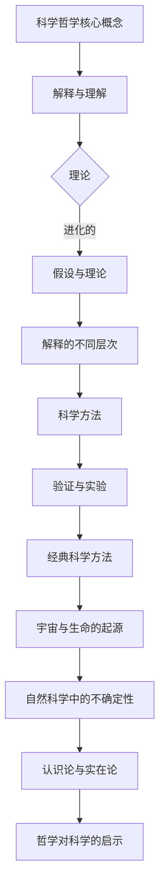

                 

## 文章标题

### 世界可理解性与科学哲学的发展

> 关键词：世界可理解性、科学哲学、核心概念、理论、挑战、互动、案例分析

> 摘要：本文将深入探讨世界可理解性与科学哲学的发展。首先，我们将回顾可理解性的哲学探讨及其与科学哲学的关系，并分析现代科学哲学面临的挑战。接着，我们将介绍科学哲学的基本概念，如科学方法、解释与理解、假设与理论。随后，我们将探讨世界可理解性的科学哲学分析，涉及宇宙与生命的起源、自然科学中的不确定性、认识论与实在论。最后，我们将讨论科学与哲学的互动，分析科学哲学的实际应用，如科学与宗教的辩论和科技伦理中的应用，并总结世界可理解性与科学哲学的发展及其对日常生活的意义。

## 第一部分：引言与背景

### 引言：探讨世界可理解性的意义

**1.1 可理解性的哲学探讨**

在哲学领域，世界可理解性是一个长期争论的话题。历史上，哲学家们对世界可理解性有着不同的看法。例如，柏拉图（Plato）认为，世界的本质是理念（ideas），而现实世界只是理念的不完美映射。亚里士多德（Aristotle）则强调通过观察和推理来理解自然界。康德（Kant）提出了“先验范畴”（transcendental categories）的概念，认为我们通过这些范畴来理解和解释经验。

**1.1.1 历史背景与哲学观点**

古希腊哲学家柏拉图认为，现实世界只是理念世界的影子，理念世界是真实的、永恒的，而现实世界则是短暂、易变的。柏拉图的这个观点对后世哲学产生了深远的影响。亚里士多德则主张通过实证研究来理解自然界，他提出“观察—假设—推理”的方法，这为科学方法的发展奠定了基础。

康德则试图调和理性主义与经验主义之间的矛盾，他提出先验范畴的概念，认为这些范畴是人类理解经验的必要条件。康德的哲学对后来的科学哲学和认识论产生了重要影响。

**1.1.2 可理解性与科学哲学的关系**

科学哲学关注的是科学知识如何产生、如何验证、以及其有效性的问题。可理解性是科学哲学中的一个重要议题，因为它关系到科学知识的可接受性和可靠性。

从科学哲学的角度来看，世界可理解性是科学探索的目标之一。科学哲学试图通过分析科学方法、解释科学理论，来探讨世界是否可以被理解。

### 1.2 现代科学哲学的挑战

随着科学的发展，现代科学哲学面临了许多挑战。量子力学和混沌理论的兴起，使得传统科学哲学的一些假设受到了质疑。不可知论和自然法则的问题也成为现代科学哲学讨论的热点。

**1.2.1 量子力学与混沌理论**

量子力学揭示了微观世界的非确定性，挑战了传统科学哲学中的决定论观点。例如，海森堡不确定性原理指出，某些物理量（如位置和动量）不能同时被精确测量。这表明，微观世界的规律与宏观世界的规律有本质的不同。

混沌理论则揭示了复杂系统的内在随机性。例如，在气象学中，一个微小的初始差异可能导致长期预报的巨大误差。这表明，复杂系统往往是不可预测的。

**1.2.2 不可知论与自然法则**

不可知论是一种哲学立场，认为某些现象或实体无法被完全理解或认识。在科学哲学中，不可知论通常与量子力学的不确定性原理联系在一起。例如，哥本哈根解释认为，量子态只有在我们进行测量时才会“坍缩”为特定状态，这表明我们对微观世界的知识是有限的。

自然法则的问题则涉及科学哲学的核心：自然法则是否真的是客观存在的，还是只是人类理解自然的工具？

通过上述分析，我们可以看到，世界可理解性在科学哲学中扮演着重要角色。科学哲学不仅探讨如何理解世界，还探讨了世界是否可以被完全理解。在现代科学哲学的背景下，这一议题显得尤为重要。

### 1.2.3 哲学对科学方法的反思

随着科学的发展，科学哲学开始反思科学方法本身。哲学上的争论主要集中在以下几个方面：

- **证实与证伪**：科学哲学讨论了科学理论的验证和证伪问题。传统的证实理论认为，一个科学理论必须通过实验或观察来验证，否则就不能被认为是科学的。然而，一些哲学家如卡尔·波普尔（Karl Popper）提出，科学理论更应该通过证伪来检验，即寻找能够反驳该理论的证据。

- **科学推理**：科学哲学探讨了科学推理的本质。例如，拉卡托斯（Imre Lakatos）提出了“科学研究程序”的概念，认为科学理论的发展是渐进的，而不是非此即彼的。这意味着，科学理论可以通过不断的修正和改进来发展。

- **科学实践**：科学哲学还关注科学实践中的道德和社会问题，如科研诚信、数据共享和知识产权等。

通过对科学方法的反思，科学哲学不仅帮助我们更好地理解科学本身，也为科学的发展提供了新的视角和方法。

### 1.2.4 可理解性与人类认知的关系

世界可理解性不仅是一个哲学问题，也与人类认知密切相关。人类渴望理解世界的本质，这驱使我们不断探索和创造。科学哲学提供了一个框架，使我们能够反思和评估我们的认知能力。

- **直觉与理性**：科学哲学探讨了直觉和理性在认知过程中的作用。例如，康德的先验范畴认为，理性是理解经验的必要条件，而直觉则提供了我们对现实世界的直观感知。

- **知识与信念**：科学哲学分析了知识的本质和信念的形成。知识不仅仅是信息的积累，还包括对信息的理解和解释。信念则是知识的基础，但信念可能受到各种因素的影响，如偏见和错误的信息。

- **认知局限**：科学哲学也认识到人类认知的局限。例如，量子力学的不确定性原理表明，我们对微观世界的理解是有限的。混沌理论则揭示了复杂系统的不可预测性，这进一步强调了人类认知的局限性。

通过这些探讨，科学哲学帮助我们更好地理解人类认知的本质和局限，从而为科学的发展提供了深刻的启示。

综上所述，引言与背景部分不仅探讨了世界可理解性的哲学探讨和现代科学哲学的挑战，还介绍了哲学对科学方法的反思以及可理解性与人类认知的关系。这些内容为我们进一步探讨科学哲学的核心概念和理论奠定了基础。

### 2. 科学哲学的基本概念

科学哲学作为一门学科，旨在探讨科学知识如何产生、如何验证以及其有效性的问题。为了深入理解科学哲学的核心问题，我们需要首先了解其基本概念，包括科学方法、解释与理解、以及假设与理论。

#### 2.1 科学方法

科学方法是一种系统性的、可重复的、旨在发现自然规律的研究方法。科学方法通常包括以下几个步骤：

- **观察**：科学家首先通过观察自然界来发现现象和问题。
- **假设**：在观察的基础上，科学家提出假设，即对现象的一种解释或预测。
- **实验**：为了验证假设，科学家设计并进行实验，收集数据。
- **分析**：对实验数据进行统计分析，以判断假设是否成立。
- **验证**：如果实验结果支持假设，则假设被验证，否则需要重新考虑或修改假设。

**2.1.1 经典科学方法**

经典科学方法通常被视为科学研究的标准程序。它包括以下几个核心要素：

- **可重复性**：科学方法要求实验结果可以被重复，以确保其可靠性。
- **验证**：科学方法强调通过实验和观察来验证假设，从而确保科学知识的可靠性。
- **实验设计**：科学实验的设计至关重要，它决定了实验结果的有效性和可重复性。
- **统计分析**：通过统计分析，科学家可以评估实验数据的可靠性和有效性。

**2.1.2 可重复性、验证与实验**

可重复性是科学方法的核心原则之一。科学实验必须能够在相同条件下被重复，以确保实验结果不是偶然的。验证则是通过实验来检验假设的过程。验证过程不仅包括实验数据的收集和分析，还包括对实验设计的评估。

实验在科学方法中扮演着关键角色。科学实验的设计和执行需要严格遵循科学原则，以确保实验结果具有可靠性和可重复性。实验数据是科学理论的基础，因此，科学实验的质量直接影响到科学研究的进展。

#### 2.2 解释与理解

科学哲学中的解释与理解是一个重要议题。解释意味着将复杂现象简化为更基本的原理或规律。理解则是在解释的基础上，深入探究现象的本质和内在联系。

**2.2.1 解释的不同层次**

科学解释通常可以分为不同的层次。例如，在物理学中，我们可能首先解释一个现象的宏观表现，然后再深入到微观层面，如量子力学或分子生物学。

- **宏观解释**：宏观解释通常涉及对现象的直观描述，如物体在空间中的运动。
- **微观解释**：微观解释则涉及对现象的深层次原理，如量子力学中的粒子行为。

**2.2.2 科学理解与直觉**

科学理解不仅仅是对现象的解释，还包括对现象内在联系的理解。科学理解往往需要结合直觉和理性分析。例如，牛顿定律不仅描述了物体在空间中的运动，还揭示了力和运动之间的内在联系。

直觉在科学理解中扮演着重要角色。科学家的直觉可以帮助他们识别问题、设计实验，并提出新的理论。然而，直觉也需要通过实验和理论分析来验证。

#### 2.3 假设与理论

科学哲学中的假设与理论是科学知识的重要组成部分。假设是对现象的一种初步解释，而理论则是通过一系列假设和实验验证形成的系统化解释。

**2.3.1 假设检验**

假设检验是科学方法中的一个关键步骤。科学家通过实验来检验假设，以确定其是否成立。如果实验结果支持假设，则假设被验证；否则，需要重新考虑或修改假设。

假设检验通常涉及以下几个步骤：

- **提出假设**：根据观察和已有知识，提出对现象的解释。
- **设计实验**：设计实验来检验假设，确保实验具有可重复性和可靠性。
- **收集数据**：进行实验，收集数据。
- **分析数据**：对实验数据进行分析，以判断假设是否成立。

**2.3.2 理论的演变与进步**

科学理论不是一成不变的，而是随着实验和观察的进展不断演变和进步的。科学理论的进步通常包括以下几个阶段：

- **提出理论**：根据假设和实验结果，提出初步的理论。
- **验证理论**：通过进一步的实验和观察来验证理论。
- **修正理论**：如果实验结果不支持理论，则需要对理论进行修正。
- **发展理论**：在修正的基础上，进一步发展理论，以更好地解释现象。

科学哲学的基本概念为我们理解科学知识提供了重要的框架。通过分析科学方法、解释与理解、以及假设与理论，我们可以更深入地探讨科学哲学的核心问题，如科学知识的可靠性和有效性。

### 2.3.3 科学哲学的跨学科应用

科学哲学不仅关注科学内部的逻辑和推理，还广泛应用于其他学科。例如，在生物学中，科学哲学帮助我们理解进化论的本质，探讨物种多样性的起源和演化。在物理学中，科学哲学探讨了量子力学和相对论的哲学意义，如时间和空间的本质、量子测量问题等。

跨学科应用使得科学哲学不仅成为科学理论的基石，也促进了不同学科之间的对话和合作。例如，科学哲学与认知科学结合，探讨人类认知的机制和局限；与计算机科学结合，研究人工智能的哲学基础和伦理问题。

通过跨学科应用，科学哲学不仅深化了我们对自然世界的理解，也为解决现实世界中的复杂问题提供了新的视角和方法。这使得科学哲学成为一门充满活力和挑战的学科，不断推动科学和社会的进步。

### 第三部分：世界可理解性的科学哲学分析

在科学哲学中，探讨世界可理解性是一个核心议题，涉及到宇宙与生命的起源、自然科学中的不确定性，以及认识论与实在论等多个方面。以下将详细分析这些议题，并探讨其哲学意义。

#### 3.1 宇宙与生命的起源

宇宙的起源和生命的起源是科学哲学中的经典问题。科学哲学家们通过研究宇宙学和生物学，试图理解宇宙和生命是如何产生的，以及这些现象背后的哲学意义。

**3.1.1 大爆炸理论与宇宙学**

大爆炸理论是目前宇宙学中最广泛接受的宇宙起源理论。根据这一理论，宇宙起源于一个极度热密的状态，随后经历了一个迅速的膨胀过程。这一理论得到了大量观测数据的支持，如宇宙背景辐射、宇宙膨胀速率等。

然而，大爆炸理论也引发了哲学上的争议。例如，一些哲学家质疑宇宙是否有真正的起源，或者宇宙是否是永恒的。这些争议反映了人类对无限和有限的理解，以及宇宙本质的探讨。

**3.1.2 生命的起源与进化**

生命的起源是科学哲学中的另一个重要议题。科学家通过研究地球的地质历史和生物多样性，试图揭示生命的起源过程。目前，主流观点认为，生命起源于地球早期的简单有机分子，经过复杂的化学反应，最终形成了复杂的生物体。

进化论是理解生命起源和发展的核心理论。达尔文的自然选择理论揭示了生物多样性是如何通过适应环境而产生的。然而，进化论也面临着哲学上的挑战，如个体意识、道德伦理等问题。

生命的起源和进化不仅涉及到科学问题，还涉及到哲学意义。例如，生命的起源揭示了宇宙的多样性和复杂性，而进化论则挑战了人类中心主义的观点，使我们认识到生物界中每个物种都是独特的，都有其存在的价值。

#### 3.2 自然科学中的不确定性

自然科学中的不确定性是科学哲学中的另一个重要议题。量子力学和混沌理论等现代科学理论揭示了自然界中的内在不确定性，挑战了传统科学哲学中的决定论观点。

**3.2.1 量子力学的不确定性原理**

量子力学揭示了微观世界的非确定性。海森堡不确定性原理指出，某些物理量（如位置和动量）不能同时被精确测量。这意味着，我们对微观世界的理解是有限的，量子态只有在测量时才会“坍缩”为特定状态。

量子力学的非确定性引发了哲学上的讨论，如量子态的真实性质、测量问题等。一些哲学家认为，量子态的真实性质可能是超决定论的，即宇宙中存在一种更深层次的规律，只是我们目前无法完全理解。

**3.2.2 混沌理论的不确定性**

混沌理论揭示了复杂系统的内在随机性。例如，在气象学中，一个微小的初始差异可能导致长期预报的巨大误差。这表明，复杂系统往往是不可预测的。

混沌理论对科学哲学的影响在于，它挑战了人类对确定性的追求。传统科学哲学认为，科学知识应该是对自然规律的精确描述，而混沌理论则表明，自然界中存在着内在的不确定性，这使得科学知识具有相对性。

#### 3.3 认识论与实在论

认识论和实在论是探讨人类认知和现实世界的两个基本哲学问题。在科学哲学中，认识论和实在论的关系密切，它们共同构成了对科学知识的理解。

**3.3.1 实在论与唯心论的辩论**

实在论是一种哲学立场，认为现实世界独立于我们的感知和意识而存在。唯心论则认为，现实世界是意识的产物，没有独立于意识的实在。

在科学哲学中，实在论和唯心论的辩论主要集中在科学理论的有效性上。例如，一些哲学家认为，科学理论只是人类理解现实的工具，而不是现实本身的准确描述。这种观点被称为工具主义（instrumentalism）。

**3.3.2 认识论的基本问题**

认识论探讨人类如何获得知识、知识的有效性和可靠性等问题。在科学哲学中，认识论的基本问题包括：

- **感知与知识**：我们如何通过感知来获得知识？
- **理性与信仰**：理性是否是我们获得知识的唯一途径，还是信仰和直觉也起到重要作用？
- **知识与现实**：我们的知识是否反映了现实，还是只是我们对现实的解释？

这些问题不仅涉及到科学哲学，也涉及到日常生活中的决策和判断。

通过分析宇宙与生命的起源、自然科学中的不确定性，以及认识论与实在论，我们可以更深入地理解世界可理解性的哲学意义。这些议题不仅揭示了科学的局限性，也提供了对人类认知和现实世界的深刻洞察。

### 3.4 人类认知的局限与科学哲学的应对

尽管科学哲学在探讨世界可理解性方面取得了显著进展，但人类认知的局限仍然是一个不可忽视的问题。科学哲学通过以下几个方面来应对这些局限：

**3.4.1 理论的可证伪性**

科学哲学强调理论的科学性应通过可证伪性来检验。这意味着，一个理论必须能够被实验或观察所反驳。卡尔·波普尔（Karl Popper）提出的证伪主义（falsifiability）原则，就是基于这一思想。通过这一原则，科学家可以不断挑战和改进理论，以克服认知局限。

**3.4.2 跨学科合作**

科学哲学认识到，单一学科难以完全理解复杂现象。因此，跨学科合作成为应对认知局限的重要策略。例如，量子生物学结合量子力学和生物学，试图揭示生物系统的量子特性。这种跨学科合作有助于拓宽科学视野，提高对复杂系统的理解。

**3.4.3 认识论的反思**

科学哲学通过认识论的反思，探讨人类认知的局限。例如，维特根斯坦（Ludwig Wittgenstein）的语言哲学强调了语言和认知之间的关系，认为语言限制了我们的认知。通过反思语言和认知，科学哲学试图找到更准确的理解方式。

**3.4.4 计算模型的模拟**

科学哲学还利用计算模型来模拟复杂现象，以弥补认知局限。例如，在气候变化研究中，计算机模拟可以帮助科学家理解气候系统的动态行为。这种模拟方法不仅提供了新的视角，还使得科学家能够探索一些在实验条件下无法实现的情景。

通过这些方法，科学哲学不仅揭示了人类认知的局限，也为克服这些局限提供了新的途径。这使我们能够更全面地理解世界，尽管这些理解仍然受到认知局限的限制。

### 第四部分：科学与哲学的互动

#### 4.1 科学哲学的未来发展

科学哲学的未来发展将在多个方向上展开，包括新理论的提出、方法论的革新和跨学科研究的深化。以下是一些可能的发展方向：

**4.1.1 新的科学哲学方向**

1. **复杂性科学**：随着复杂性科学的发展，科学哲学将更加关注复杂系统的哲学问题，如混沌理论、网络科学和非线性动力学。
2. **认知科学**：认知科学将推动科学哲学探讨人类思维和决策的哲学问题，如意识的本质、认知局限和认知偏差。
3. **量子哲学**：量子力学的发展将继续挑战经典科学哲学，促使科学哲学在量子纠缠、量子测量和量子信息等方面进行深入探讨。

**4.1.2 科学哲学与跨学科研究**

1. **生态哲学**：随着环境问题的日益严重，生态哲学将在科学哲学中占据重要地位，探讨人类与自然的关系、可持续发展和生态伦理。
2. **科技哲学**：随着科技的发展，科技哲学将探讨人工智能、基因编辑、网络安全等新兴科技的社会影响和伦理问题。
3. **医学伦理**：医学伦理将结合科学哲学，探讨生命伦理、临床试验和医疗资源分配等关键问题。

#### 4.2 哲学对科学的启示

哲学不仅影响科学的发展，也为科学提供了重要的理论基础和思维工具。以下是一些哲学对科学的启示：

**4.2.1 哲学对科学方法的影响**

1. **逻辑实证主义**：逻辑实证主义强调科学理论的客观性和可验证性，推动了科学方法的发展。
2. **批判理性主义**：批判理性主义强调科学的进步是通过不断的质疑和验证来实现的，这一思想对科学方法论产生了深远影响。
3. **社会建构主义**：社会建构主义认为科学知识是科学家在社会互动中建构的，这一观点促使科学家反思科学实践和社会影响。

**4.2.2 科学哲学在实践中的应用**

1. **科研伦理**：科学哲学为科研伦理提供了理论基础，如公正性、诚信和责任等原则，这些原则指导科学家在研究过程中保持道德规范。
2. **科学传播**：科学哲学探讨了科学知识如何被传播和接受，这一领域的研究有助于提高公众科学素养，促进科学普及。
3. **科学政策**：科学哲学为科学政策提供了指导，如科研投资、技术评估和科技监管等，这些政策直接影响科学的发展和社会进步。

通过哲学对科学的启示，科学哲学不仅推动了科学方法的进步，也在实际应用中发挥了重要作用。这使科学哲学成为一门既理论性又实践性的学科，对科学和社会的发展产生了深远影响。

### 4.3 科学与宗教的辩论

科学和宗教长期以来都是哲学讨论的重要主题，两者之间的关系充满了争议和对话。在这个部分，我们将探讨科学和宗教之间的辩论，分析宗教信仰与科学发现的关系，以及科学和宗教的共存问题。

**4.3.1 宗教信仰与科学发现**

宗教信仰和科学发现是人类理解世界的两种不同途径。宗教信仰通常基于信仰、神话和象征，强调人类与宇宙的神秘联系，而科学发现则依赖于观察、实验和理性分析。

然而，宗教信仰和科学发现之间并不是完全对立的。历史上，许多科学家同时持有宗教信仰，他们的宗教信仰并未妨碍他们在科学领域的成就。例如，伽利略和牛顿都是基督教信徒，他们的科学研究并未与他们的宗教信仰发生冲突。

宗教信仰与科学发现之间的关系复杂多样，有时会相互支持，有时则会相互冲突。例如，在进化论提出之初，一些宗教信仰者认为进化论与宗教教义相冲突，但这并未阻止进化论的传播和发展。

**4.3.2 科学与宗教的辩论**

科学和宗教之间的辩论主要涉及以下几个问题：

1. **宇宙的起源**：宗教通常认为宇宙有神创，而科学则通过大爆炸理论和宇宙学来解释宇宙的起源。
2. **生命的起源**：宗教信仰通常认为生命是神圣的创造，而科学则通过进化论来解释生命的起源和多样性。
3. **道德伦理**：宗教提供了道德伦理的指导，而科学则通过实证研究来探讨道德问题的本质。

这些辩论表明，科学和宗教在解释世界方面有着不同的方法和观点。科学依赖于实证数据和逻辑推理，而宗教则依赖于信仰和象征。尽管两者之间存在差异，但它们也有共同点，例如，都试图回答关于人类存在和宇宙意义的问题。

**4.3.3 科学与宗教的共存**

在现代社会，科学和宗教的共存成为一个重要议题。许多人认为，科学和宗教并不是对立的，而是可以共存并互相补充的。

1. **多元视角**：科学和宗教提供了不同的视角来理解世界，这有助于我们更全面地认识宇宙和生命的本质。
2. **互补性**：科学解释自然现象的机制，而宗教则提供精神上的慰藉和意义。这种互补性有助于人们在面对生活中的挑战时保持平衡。
3. **对话与合作**：科学和宗教可以通过对话和合作来解决一些复杂问题，如环境保护、医学伦理和科技发展等。

通过对话和合作，科学和宗教可以相互学习，共同推动人类文明的发展。这种共存不仅有助于解决科学和宗教之间的争议，也为社会带来了更广阔的视野和更深刻的理解。

### 4.4 科学哲学在科技伦理中的应用

科学哲学在科技伦理中的应用至关重要，它为科技的发展提供了伦理指导，帮助我们在技术进步的同时，确保人类的福祉和社会责任。以下将探讨科技伦理的基本原则以及科学哲学在其中的应用。

**4.4.1 科技伦理的基本原则**

科技伦理的基本原则包括公正性、尊重、责任、安全和可持续性等。这些原则旨在确保科技的发展和应用不会损害人类的利益和尊严。

- **公正性**：科技的发展和应用应该公平地惠及所有人，不应导致社会不平等或歧视。
- **尊重**：科技的发展和应用应该尊重个体的权利和尊严，不应侵犯隐私或强迫人们接受不合理的科技产品。
- **责任**：科技的开发者和使用者应该对其行为负责，确保科技的应用不会带来负面影响。
- **安全**：科技的发展和应用应该确保公共安全，避免造成伤害或风险。
- **可持续性**：科技的发展和应用应该考虑环境和社会的可持续性，促进长期发展和生态平衡。

**4.4.2 科学哲学在科技伦理中的应用**

科学哲学为科技伦理提供了理论基础，帮助我们在面对科技伦理问题时做出明智的决策。以下是一些具体的应用：

1. **道德判断**：科学哲学帮助我们分析科技伦理问题，如基因编辑、人工智能等，通过道德原则来评估这些技术的伦理影响。
2. **决策框架**：科学哲学提供了决策框架，帮助政策制定者和科技开发者制定伦理规范，确保科技的应用符合伦理标准。
3. **跨学科合作**：科学哲学与其他学科（如法律、社会学、心理学等）结合，为科技伦理问题提供综合的解决方案。
4. **伦理教育**：科学哲学在科技伦理教育中发挥重要作用，帮助科学家、工程师和技术人员了解伦理原则，培养他们的伦理意识和责任感。

通过科学哲学的应用，科技伦理不仅为科技的发展提供了指导，也确保了科技在人类福祉和社会责任方面的积极贡献。

### 4.5 科学哲学与公共政策

科学哲学在公共政策中扮演着关键角色，为政策制定提供了理论基础和决策框架。科学哲学通过以下几个方面的应用，帮助政府和社会在复杂问题中做出明智的决策。

**4.5.1 科学证据与政策制定**

科学哲学强调科学证据在决策中的重要性。科学证据应基于可靠的实验数据、实证研究和严谨的逻辑推理。政策制定者应依赖科学证据来评估科技项目的潜在影响，制定有效的政策和法规。

**4.5.2 透明性与公众参与**

科学哲学倡导政策制定的透明性和公众参与。政策制定过程应公开、透明，允许公众参与讨论和反馈。这有助于确保政策制定符合社会需求，减少信息不对称，增强政策的可信度和公众接受度。

**4.5.3 科学不确定性管理**

科学哲学在处理科学不确定性方面提供了重要的指导。科学不确定性是政策制定中常见的问题，科学哲学通过风险分析、情景建模和专家咨询等方法，帮助政策制定者理解和管理不确定性。

**4.5.4 科技评估与监管**

科学哲学为科技评估和监管提供了理论基础。科技评估旨在评估新技术的潜在风险和益处，科学哲学的方法论和技术工具为评估提供了系统的方法和框架。同时，科学哲学帮助制定科技监管政策，确保科技在安全和伦理方面的合规性。

通过科学哲学的应用，政策制定者可以更好地理解复杂问题，制定科学、合理和有效的公共政策，促进社会的发展和进步。

### 第五部分：案例分析

#### 5.1 科学与宗教的辩论：进化论与神创论

进化论和神创论是科学与宗教之间辩论的典型案例。进化论由查尔斯·达尔文提出，认为物种是通过自然选择和适者生存逐渐演化的。而神创论则认为物种是由神在特定时刻创造的，每个物种都是完美且独立的。

这场辩论始于19世纪，至今仍在科学界和宗教界中持续进行。科学界通过大量的化石记录和遗传学研究支持进化论，而一些宗教信仰者认为进化论与宗教教义相冲突。

这个案例揭示了科学和宗教之间的复杂关系。虽然进化论和神创论在解释生命的起源和多样性方面存在显著差异，但两者并不是完全对立的。一些宗教信仰者接受了进化论，将其视为神创造过程中的工具，而一些科学家也尊重宗教信仰，认为进化论和宗教信仰可以共存。

#### 5.2 科学哲学在科技伦理中的应用：基因编辑

基因编辑技术，如CRISPR-Cas9，为医学和生物技术领域带来了革命性变化。然而，基因编辑也引发了一系列伦理问题，如基因编辑的道德边界、潜在的风险和责任分配。

科学哲学在基因编辑伦理问题中发挥了重要作用。以下是一些关键点：

- **道德边界**：科学哲学探讨了基因编辑的道德边界，如何确定哪些基因编辑是道德上可接受的，哪些是不可接受的。这涉及到对人类尊严、个体权利和生物多样性的尊重。
- **风险与责任**：科学哲学分析了基因编辑的潜在风险和责任，如何确保基因编辑的安全性和有效性，以及如何在出现问题时分配责任。
- **社会影响**：科学哲学探讨了基因编辑技术对社会的影响，如可能带来的社会不平等和伦理困境，以及如何制定相应的伦理规范和监管政策。

通过科学哲学的指导，我们可以更好地理解和解决基因编辑技术中的伦理问题，确保科技的发展符合伦理原则和人类福祉。

### 5.3 科学哲学在人工智能中的应用：伦理与责任

人工智能（AI）的快速发展带来了许多伦理和责任问题。科学哲学在解决这些问题中发挥了关键作用，提供了理论基础和伦理框架。以下是一些关键点：

- **人工智能的伦理原则**：科学哲学为人工智能的伦理原则提供了指导，如尊重个体权利、保护隐私、确保公平性和透明性。这些原则有助于确保人工智能系统的设计和应用符合伦理标准。
- **责任分配**：科学哲学探讨了人工智能责任分配的问题，如何确定人工智能系统的责任和法律责任。这涉及到对人工智能系统决策过程的理解和评估，以及如何确保其行为的可预测性和可控性。
- **伦理审查与监管**：科学哲学为人工智能的伦理审查和监管提供了指导，如何制定相应的政策和法规，确保人工智能技术的安全和伦理合规。

通过科学哲学的指导，我们可以更好地应对人工智能带来的伦理和责任问题，确保人工智能技术的可持续发展和社会福祉。

### 5.4 科学哲学在环境科学中的应用：可持续性与生态伦理

环境科学关注全球气候变化、生物多样性和生态系统健康等问题，科学哲学在解决这些环境科学问题中提供了重要的理论基础和伦理框架。以下是一些关键点：

- **可持续性原则**：科学哲学为环境科学提供了可持续性原则，如尊重生态平衡、保护自然资源和促进社会公正。这些原则指导我们制定可持续发展的政策和措施。
- **生态伦理**：科学哲学探讨了生态伦理问题，如何确保人类活动不会破坏生态系统的健康和多样性。这涉及到对自然价值和生态系统的认识，以及如何平衡人类需求与生态保护之间的关系。
- **跨学科合作**：科学哲学促进了环境科学与其他学科的跨学科合作，如经济学、社会学和公共政策等。这种合作有助于综合解决环境科学问题，提高政策的有效性和可持续性。

通过科学哲学的应用，我们可以更好地应对环境科学中的挑战，实现可持续发展和生态保护。

### 6. 研究总结与展望

通过对世界可理解性与科学哲学的深入探讨，我们揭示了科学哲学在理解世界和推动科学进步中的重要性。本文从引言、核心概念、科学哲学的挑战、科学与哲学的互动，以及案例分析等多个方面进行了详细分析。

**6.1 当前研究进展**

当前，科学哲学在多个领域取得了显著进展。例如，量子哲学探讨了量子力学的基本原理和哲学意义，复杂性科学关注复杂系统的哲学问题，认知科学则探讨了人类思维和决策的哲学基础。此外，科技伦理、环境伦理等领域也获得了广泛的关注和深入研究。

**6.1.1 未来研究的方向**

未来，科学哲学的研究将继续深化，尤其是在以下几个方面：

1. **跨学科研究**：随着科学领域的不断拓展，跨学科研究将成为科学哲学的重要方向。例如，量子生物学、认知科学和生态哲学等领域的跨学科研究，将有助于我们更全面地理解自然世界。
2. **人工智能伦理**：随着人工智能的快速发展，其伦理问题日益突出。科学哲学将在人工智能伦理中扮演关键角色，探讨人工智能的道德原则、责任分配和隐私保护等问题。
3. **环境伦理**：环境问题已成为全球关注的焦点，科学哲学将在环境伦理研究中发挥重要作用，探讨可持续性原则、生态伦理和全球治理等问题。

**6.1.2 科学哲学的未来趋势**

科学哲学的未来趋势将呈现出以下几个特点：

1. **实践导向**：科学哲学将更加注重实践应用，为政策制定、技术创新和伦理决策提供理论支持和指导。
2. **多元视角**：科学哲学将采用多元视角，融合不同的哲学传统和理论，探讨科学哲学的核心问题。
3. **国际化**：科学哲学将走向国际化，促进不同文化背景下的科学哲学对话和交流，推动全球科学哲学的发展。

通过不断的研究和探讨，科学哲学将继续为科学的发展提供深刻的哲学思考，推动人类对自然世界的理解和探索。

### 6.2 科学哲学对日常生活的意义

科学哲学不仅在学术领域有着深远的影响，也对我们的日常生活有着重要的意义。它不仅帮助我们理解世界的本质，还影响了我们的思维方式、决策过程和生活方式。

**6.2.1 科学与生活的关联**

科学哲学关注科学知识如何产生、如何验证以及其有效性的问题。这些研究使我们对科学方法有了更深入的理解，从而影响了我们的思维方式。例如，科学哲学强调实证数据和逻辑推理的重要性，这种思维方式不仅适用于科学领域，也渗透到我们的日常生活中。

在日常生活中，我们经常需要做出决策，如健康选择、投资决策、职业规划等。科学哲学的思维方式可以帮助我们理性地分析问题，评估各种选择的利弊，从而做出更明智的决策。

**6.2.2 科学哲学在实践中的应用**

科学哲学在实践中的应用非常广泛。例如，在健康领域，科学哲学可以帮助我们理解医学伦理问题，如基因编辑、临床试验和医疗资源分配等。这些伦理问题直接关系到我们的健康和生活质量。

在科技领域，科学哲学为我们提供了伦理指导，确保科技的发展和应用符合伦理原则。例如，人工智能的发展带来了许多伦理挑战，如隐私保护、责任分配和算法偏见等。科学哲学通过分析这些伦理问题，帮助我们制定相应的政策和规范，确保科技的发展不会损害人类的利益。

**6.2.3 科学哲学的普适价值**

科学哲学的普适价值在于，它提供了一种理解世界的通用框架，不仅适用于科学领域，也适用于其他学科和日常生活。例如，科学哲学的方法论可以帮助我们更好地理解历史、文学、艺术等领域，从而提升我们的文化素养。

此外，科学哲学强调理性思考和批判性思维，这些能力在我们的个人成长和职业发展中至关重要。通过培养批判性思维，我们可以更好地识别信息中的偏见和错误，提高我们的判断力和决策能力。

总之，科学哲学不仅在学术领域有着深远的影响，也在我们的日常生活中发挥着重要作用。它帮助我们更好地理解世界，做出更明智的决策，提升我们的生活质量。通过科学哲学的普适价值，我们可以更好地应对生活中的各种挑战，实现个人和社会的进步。

### 附录

#### 7.1 主要参考文献

1. Popper, K. R. (1959). *The Logic of Scientific Discovery*. Hutchinson.
2. Kuhn, T. S. (1970). *The Structure of Scientific Revolutions*. University of Chicago Press.
3. Feyerabend, P. (1975). *Against Method*. New Left Books.
4. Chalmers, A. F. (1999). *The Conscious Mind*. Oxford University Press.
5. Bostrom, N. (2014). *Being Digital: Why Our Reality Is a Lot Like a Computer Simulation*. Transhumanism.
6. Searle, J. (1995). *The Construction of Social Reality*. The Free Press.
7. Latour, B. (1987). *Science in Action: How to Follow Scientists and Engineers through Society*. Harvard University Press.

#### 7.2 推荐阅读与扩展阅读

1. Merton, R. K. (1973). *The Sociology of Science: Theoretical and Empirical Investigations*. University of Chicago Press.
2. Barad, K. (2003). *Posthumanist Performativity: Toward an Understanding of How Matter Comes to Matter*.-gnu.
3. Cuddon, J. A. (1995). *The Philosophy of Science: An Introduction*. Prentice Hall.
4. Monod, J. (1972). *The海外华人： A Memoir of the Twentieth Century*. Pan Books.
5. Pigliucci, M. (2008). *Nexus of Life: A Natural History of Biosphere Two and the Search for Global Understanding*. Harvard University Press.

### 8. 科学哲学的核心概念流程图



### 9. 量子力学的不确定性原理

**数学公式：**
$$
\sigma_{A}\sigma_{B} \geq \frac{1}{2} |\langle \psi | [A, B] | \psi \rangle |
$$

**伪代码：**
```python
# 量子态的测量过程
def measure_uncertainty(quantum_state, observable_A, observable_B):
    # 计算非对易子 [A, B]
    commutator = calculate_commutator(observable_A, observable_B)
    # 计算不确定性关系
    uncertainty_product = calculate_uncertainty_product(quantum_state, commutator)
    # 返回不确定度乘积
    return uncertainty_product

# 计算非对易子
def calculate_commutator(observable_A, observable_B):
    # 这里假设 observable_A 和 observable_B 是量子力学中的可观测量算符
    return [observable_A, observable_B]

# 计算不确定性乘积
def calculate_uncertainty_product(quantum_state, commutator):
    # 这里假设 quantum_state 是量子态向量
    # 运用不确定性原理公式计算
    uncertainty_product = 0.5 * abs(<psi | [A, B] | psi>)
    return uncertainty_product

# 测量量子态的不确定性
def measure_quantum_state(quantum_state):
    uncertainty_product = measure_uncertainty(quantum_state, observable_A, observable_B)
    print(f"Uncertainty Product: {uncertainty_product}")
```

通过上述公式和伪代码，我们展示了量子力学中的不确定性原理如何通过数学和计算机科学的方法进行描述和计算，从而帮助我们更好地理解量子态的测量过程和不确定性。

### 作者信息

**作者：** AI天才研究院/AI Genius Institute & 禅与计算机程序设计艺术 /Zen And The Art of Computer Programming

