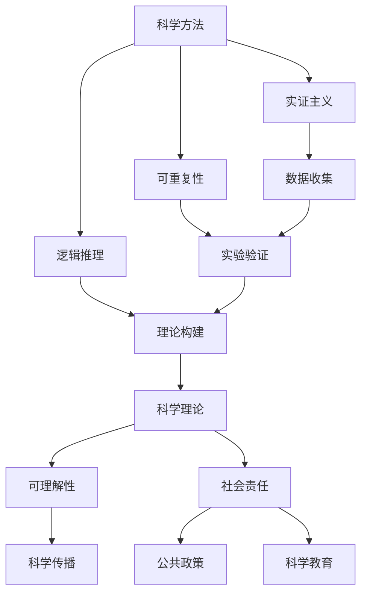

                 

### 文章标题

# 《世界可理解性与科学家的社会责任》

### 关键词

- 世界可理解性
- 科学家的社会责任
- 科学方法
- 科学理论
- 科学传播
- 科技发展

### 摘要

本文旨在探讨世界可理解性与科学家的社会责任之间的关系。首先，我们回顾了人类对世界可理解性的历史探求和哲学探讨，强调了可理解性对科学进步的重要性。接着，我们详细阐述了科学家的社会责任，包括其社会角色、与社会的互动，以及应当承担的道德责任。随后，我们分析了科学方法与可理解性之间的关系，探讨了科学理论的可理解性以及科学家在沟通责任方面的重要性。文章接着讨论了科学实践中的伦理问题，并通过具体案例展示了科学家的社会责任实践。最后，我们探讨了科学教育的重要性以及科技发展对可理解性与科学家社会责任的影响，提出了未来科学家的社会责任展望和策略。通过本文的探讨，我们希望读者能够更加深刻地理解科学家的社会责任，并认识到他们在推动社会进步中的关键作用。

### 《世界可理解性与科学家的社会责任》目录大纲

#### 第一部分：引论

**第1章：世界可理解性的历史与哲学探讨**

- **1.1 人类对世界可理解性的探求**
  - 从古代到现代的探索历程
  - 科学与宗教的冲突与融合

- **1.2 科学哲学与可理解性**
  - 可理解性的概念与定义
  - 科学哲学中的可理解性问题

- **1.3 可理解性对科学进步的影响**
  - 可理解性的科学方法论意义
  - 可理解性在科技创新中的应用

**第2章：科学家的社会责任**

- **2.1 科学家的社会角色**
  - 科学家的多重身份
  - 科学家的社会影响力

- **2.2 科学与社会互动**
  - 科学成果的社会影响
  - 科学与社会之间的良性循环

- **2.3 科学家的社会责任**
  - 科学的道德责任
  - 科学家在公共政策中的角色

#### 第二部分：科学方法与可理解性

**第3章：科学方法概述**

- **3.1 科学方法的基本原则**
  - 实证主义
  - 可重复性
  - 逻辑推理

- **3.2 科学方法的演进**
  - 古典科学方法
  - 现代科学方法
  - 跨学科方法

- **3.3 科学方法与可理解性**
  - 科学方法如何提高可理解性
  - 可理解性对科学方法的影响

**第4章：科学理论的可理解性**

- **4.1 科学理论的结构**
  - 科学理论的层次结构
  - 科学理论的核心概念

- **4.2 科学理论的验证与可理解性**
  - 实证验证
  - 可理解性验证

- **4.3 科学理论的普及与可理解性**
  - 科学理论的传播
  - 可理解性对普及的影响

**第5章：科学家的沟通责任**

- **5.1 科学家的沟通能力**
  - 科学家的沟通障碍
  - 提高沟通能力的策略

- **5.2 科学成果的传播**
  - 科学成果的传播渠道
  - 传播策略与效果评估

- **5.3 科学家与社会公众的互动**
  - 科学家与媒体的关系
  - 科学家在公共论坛上的角色

#### 第三部分：科学实践与责任

**第6章：科学实践中的伦理问题**

- **6.1 科学的道德责任**
  - 科学的伦理原则
  - 科学的道德困境

- **6.2 科学实践的伦理问题**
  - 科研不端行为
  - 知识产权保护

- **6.3 伦理审查与监管**
  - 伦理审查机构的作用
  - 伦理监管的挑战与对策

**第7章：科学家的社会责任实践**

- **7.1 科学家的社会责任案例**
  - 知名科学家的社会责任实践
  - 案例分析

- **7.2 科学家的社会责任倡议**
  - 社会责任倡议的发起与实施
  - 成功经验与教训

- **7.3 科学家的社会责任与可持续发展**
  - 可持续发展的科学贡献
  - 科学家的可持续发展倡议

**第8章：科学教育的重要性**

- **8.1 科学教育的现状**
  - 全球科学教育的发展水平
  - 存在的问题与挑战

- **8.2 科学教育的目标**
  - 提高科学素养
  - 培养创新精神

- **8.3 提高科学教育的可理解性**
  - 教育改革策略
  - 教学方法的创新

#### 第四部分：可理解性与社会责任的未来

**第9章：科技发展的挑战与机遇**

- **9.1 新技术带来的挑战**
  - 人工智能与机器学习
  - 生物技术的伦理问题

- **9.2 技术发展对可理解性的影响**
  - 新技术的复杂性
  - 可理解性的挑战与对策

- **9.3 科学家的社会责任新挑战**
  - 科技政策制定
  - 公众信任的维护

**第10章：科学家的社会责任展望**

- **10.1 社会责任的趋势与变化**
  - 社会责任理念的发展
  - 未来社会责任的预测

- **10.2 科学家的未来角色**
  - 科学家在社会中的新角色
  - 科学家与政策制定者的合作

- **10.3 促进可理解性与社会责任的策略**
  - 科学传播策略
  - 教育策略

**附录**

- **附录 A：科学家的社会责任资源指南**
  - 国际科学家的社会责任倡议
  - 科学与社会互动的重要组织
  - 可理解性与科学传播的相关资料

- **附录 B：核心概念与联系（Mermaid 流程图）**
  - 科学方法流程图
  - 可理解性与社会责任流程图

- **附录 C：核心算法原理讲解（伪代码）**
  - 科学理论的验证伪代码
  - 科学成果传播算法伪代码

- **附录 D：数学模型与公式**
  - 可理解性评估模型
  - 社会责任评估模型

- **附录 E：项目实战与代码解读**
  - 科学成果传播案例实战
  - 科学教育改进案例实战
  - 代码分析与解读

### 第一部分：引论

在探讨世界可理解性与科学家的社会责任之前，我们需要先了解人类对世界可理解性的探求过程，以及科学哲学中的相关概念。同时，我们也需要明确科学家的社会责任，这为后续章节的内容奠定了基础。

#### 第1章：世界可理解性的历史与哲学探讨

##### 1.1 人类对世界可理解性的探求

人类对世界可理解性的探求是一个漫长的历程，从古代的哲学思考到现代的科学探索，都体现了人类对自然界和自身存在的深入追问。在古代，人类通过观察自然现象，试图解释世界的本质。例如，古希腊哲学家泰勒斯认为水是万物的本源，而亚里士多德则提出了四因说，试图解释事物的生成和变化。

中世纪时期，基督教神学和阿拉伯哲学主导了对世界可理解性的探讨，但科学探索并未停滞。阿拉伯学者如阿尔-哈里德希和阿尔-贝鲁尼等人在天文学、数学和医学等领域取得了重要进展，为后来的科学革命奠定了基础。

16世纪以来，科学革命的发生标志着人类对世界可理解性探索的新的里程碑。伽利略通过望远镜观测天体，证实了哥白尼的日心说，牛顿的万有引力定律则奠定了经典力学的基础。这一时期的科学家们，如伽利略、笛卡尔和牛顿，通过实验和数学建模，不断推进了对世界可理解性的认识。

进入20世纪，相对论和量子力学的提出，进一步深化了人类对世界可理解性的认识。爱因斯坦的相对论挑战了经典力学的绝对时间和空间观念，而量子力学则揭示了微观世界的非确定性。这些理论的提出，不仅扩展了我们对自然界的理解，也引发了对科学哲学的深入思考。

##### 1.2 科学哲学与可理解性

科学哲学是研究科学的基本概念、方法、逻辑和哲学问题的学科。在科学哲学中，可理解性是一个核心问题。可理解性是指科学理论是否能够被人类理解，以及如何解释复杂现象。

科学哲学中有关可理解性的探讨始于对科学理论的逻辑结构和语言表达的研究。例如，卡尔纳普和赖欣巴赫等逻辑实证主义者认为，科学理论应当用可验证的语句来表达，以提高理论的透明度和可理解性。而库恩则提出了科学范式理论，认为科学理论的进步并非线性的，而是通过范式转变实现的。在这一过程中，新理论的可理解性往往依赖于其对旧理论的超越和解释。

科学哲学中的可理解性问题还涉及科学理论的验证和确认。波普尔和拉卡托斯等科学哲学家提出了科学理论的验证标准，即理论应当通过可重复的实验和观察来验证。然而，如何确保验证过程本身是可理解的，也是科学哲学需要探讨的问题。

##### 1.3 可理解性对科学进步的影响

可理解性对科学进步有着深远的影响。首先，可理解性有助于科学理论的传播和普及。当科学理论被清晰地表达和解释时，更多的科学家和公众能够理解和接受这些理论，从而推动科学的进一步发展。例如，牛顿的经典力学通过简单的数学公式和直观的物理模型，被广泛传播和接受，为工业革命奠定了科学基础。

其次，可理解性有助于科学创新的实现。科学家在研究过程中，往往需要理解复杂的自然现象和实验数据。当理论的可理解性提高时，科学家能够更容易地提出新的假设和理论，推动科学技术的创新。例如，量子力学的可理解性问题，促使科学家们深入探索微观世界的本质，从而推动了量子计算和量子通信等技术的发展。

最后，可理解性对于科学政策的制定和公共决策有着重要影响。当公众能够理解科学理论及其应用时，他们更可能支持科学研究和创新，从而促进科技政策的发展。同时，科学家和政策制定者之间的有效沟通，也有助于制定更加科学和合理的政策，以应对全球挑战。

综上所述，世界可理解性的历史与哲学探讨为我们理解科学家的社会责任提供了重要的背景。人类对世界可理解性的探求，以及科学哲学中对可理解性的讨论，都体现了科学家在推动科学进步和社会发展中的关键作用。接下来，我们将进一步探讨科学家的社会责任，为后续章节的内容奠定基础。

#### 第2章：科学家的社会责任

科学家的社会责任是其职业角色的重要组成部分。科学家的活动不仅局限于实验室和学术圈，他们还承担着对社会的责任和义务。在这部分内容中，我们将详细探讨科学家的社会角色、科学与社会互动的关系，以及科学家应承担的道德责任。

##### 2.1 科学家的社会角色

科学家的社会角色是多元而复杂的。首先，科学家是知识的创造者和传播者。他们通过实验、观察和理论建构，不断推动科学的进步。科学家的工作不仅为人类提供了新的知识和理解，还为社会提供了技术支持和解决方案。例如，医学科学家通过研究疾病机制，开发出新药和治疗方法，从而挽救了无数生命。

其次，科学家是社会的智囊团。他们利用自己的专业知识和判断力，为政府、企业和公众提供科学咨询和建议。科学家在政策制定、环境治理、资源管理等方面发挥着重要作用。例如，气候变化问题专家为政府提供气候变化的科学证据和应对策略，帮助制定更为科学合理的环保政策。

此外，科学家在社会中还具有教育者的角色。他们通过科研活动和学术交流，培养下一代科学家和科研人才。科学家的教育工作不仅包括在学术机构中的教学，还包括通过科普活动向公众传播科学知识和科学精神。例如，科学家通过撰写科普文章、举办科学讲座和参与科学展览，激发公众对科学的兴趣和热情。

最后，科学家是社会的道德守护者。他们在科研活动中必须遵守伦理规范，保证研究的公正性和诚信性。科学家应当坚持科学诚信，抵制科研不端行为，为科学界的健康发展贡献力量。例如，生物伦理学家在基因编辑、人工智能等领域的研究中，关注道德伦理问题，提出相应的伦理框架和指导原则。

##### 2.2 科学与社会互动

科学与社会之间的互动是双向的，既包括科学对社会的影响，也包括社会对科学的影响。科学对社会的影响主要表现在以下几个方面：

首先，科学技术的进步极大地改变了社会生产和生活方式。例如，工业革命时期的蒸汽机、电力和内燃机等技术的发明，推动了工业化进程，改变了社会生产结构。而互联网和人工智能等现代技术的兴起，则深刻影响了人们的生活和工作方式。

其次，科学技术的应用带来了巨大的社会效益。医学科学的进步，使得人类寿命延长，疾病治疗更加有效。环境科学的发展，帮助我们更好地理解和解决环境问题，推动可持续发展。工程技术科学的应用，使得基础设施建设更加高效，生活质量不断提高。

然而，科学技术的进步也带来了新的社会挑战。例如，生物技术的快速发展引发了伦理和社会问题，如基因编辑、克隆技术等的应用。信息技术的普及，带来了隐私和安全问题，如数据泄露和网络攻击等。

社会对科学的影响主要表现在以下几个方面：

首先，社会需求推动了科学的发展。科学研究的选题和方向，往往受到社会需求和实际问题的驱动。例如，随着人们对健康和长寿的追求，医学科学成为热门研究领域。而环境问题的日益严重，也促使环境科学得到更多关注。

其次，社会资源支持科学研究的开展。科学研究需要大量的资金、设备和人力资源。社会对科学研究的投入，为科学家提供了良好的研究环境和条件，促进了科学创新和技术突破。

最后，社会价值观和伦理观念影响科学研究。科学研究必须遵循伦理规范，尊重生命的尊严和价值。同时，科学研究还应考虑社会伦理和社会责任，确保技术的应用不会对人类和社会造成负面影响。

##### 2.3 科学家的社会责任

科学家的社会责任是其职业责任的重要组成部分。科学家的社会责任主要包括以下几个方面：

首先，科学家应承担道德责任。科学研究必须遵守科学伦理和道德规范，确保研究的公正性、诚信性和安全性。科学家应抵制科研不端行为，如数据造假、抄袭等，维护科学界的声誉和纯洁性。同时，科学家还应关注科学应用可能带来的伦理和社会问题，提出相应的解决方案。

其次，科学家应承担社会责任。科学家不仅是知识的创造者，还应关注社会问题，为社会发展贡献力量。科学家可以通过科研活动，解决社会面临的实际问题，如疾病治疗、环境保护、资源管理等。此外，科学家还应积极参与社会事务，为公共政策提供科学建议，推动科学知识的普及和科学精神的传播。

最后，科学家应承担教育责任。科学家是科学教育和科普工作的重要力量。他们不仅应在学术机构中从事教学和科研工作，还应通过科普活动，向公众传播科学知识和科学方法，提高公众的科学素养和科学精神。

总之，科学家的社会责任是多方面的，包括道德责任、社会责任和教育责任。科学家在履行这些责任的过程中，不仅推动了科学进步，也为社会发展做出了重要贡献。在科学与社会互动日益紧密的今天，科学家应更加意识到自己的社会责任，努力成为社会进步的推动者和守护者。

### 第二部分：科学方法与可理解性

科学方法是科学研究的基础和核心，其目的是通过系统的、可验证的方法来探索自然现象，解释科学问题。科学方法的演进不仅推动了科学知识的积累，也影响了科学理论的构建和传播。在这一部分，我们将探讨科学方法的基本原则、科学方法的演进过程，以及科学方法如何提高可理解性。

#### 第3章：科学方法概述

##### 3.1 科学方法的基本原则

科学方法的基本原则包括实证主义、可重复性和逻辑推理。

首先，实证主义是科学方法的基石。实证主义认为，科学知识应当基于观察和实验获得的证据，而不是基于信仰、哲学或个人经验。通过实验和观察，科学家能够收集数据，这些数据是验证科学理论的基础。例如，牛顿通过观察天体运动，提出了万有引力定律，这一理论通过多次实验验证，得到了广泛接受。

其次，可重复性是科学方法的重要原则。科学实验应当能够被其他科学家重复，以验证实验结果的一致性和可靠性。可重复性保证了科学研究的可信度，避免了个人主观因素对实验结果的影响。例如，孟德尔的遗传实验可以被其他科学家重复，验证其遗传规律的准确性。

最后，逻辑推理是科学方法的重要组成部分。科学家通过观察数据和实验结果，运用逻辑推理来构建科学理论。逻辑推理不仅帮助科学家解释实验结果，还指导新的实验设计和理论构建。例如，达尔文通过观察生物多样性，结合逻辑推理，提出了自然选择和物种演化的理论。

##### 3.2 科学方法的演进

科学方法的演进经历了多个阶段，从古代的自然观察，到中世纪的宗教哲学，再到现代科学的形成，每一个阶段都对科学方法的发展产生了重要影响。

在古代，人类通过自然观察和哲学思考来理解自然现象。古希腊哲学家如亚里士多德提出了自然哲学，试图解释自然界的本质和规律。虽然这些理论缺乏实验验证，但为后来的科学研究奠定了基础。

中世纪时期，宗教哲学主导了对自然现象的解释。阿拉伯学者如阿尔-哈里德希和阿尔-贝鲁尼在天文学、数学和医学等领域取得了重要进展，但科学探索仍受到宗教信仰的束缚。这一时期的科学研究缺乏系统的实验方法和可重复性。

16世纪以来，科学革命的发生标志着现代科学方法的诞生。伽利略通过实验验证日心说，牛顿的万有引力定律奠定了经典力学的基础。现代科学方法强调实验和观察的重要性，通过可验证的证据来构建科学理论。

20世纪，相对论和量子力学的提出，进一步推动了科学方法的演进。相对论挑战了经典力学的绝对时间和空间观念，量子力学揭示了微观世界的非确定性。这些理论的提出，不仅扩展了人类对自然界的理解，也促使科学方法不断革新。

##### 3.3 科学方法与可理解性

科学方法不仅用于探索自然现象，还用于提高科学理论的可理解性。科学方法通过系统的观察、实验和逻辑推理，使得科学理论更加透明和易于理解。

首先，科学方法提供了清晰的研究路径。科学家通过实证主义和可重复性原则，收集可靠的数据和证据，这些数据成为构建科学理论的基础。通过逻辑推理，科学家能够解释实验结果，形成科学理论。这一过程使得科学理论更加系统和可理解。

其次，科学方法促进了科学理论的传播和普及。科学方法强调透明度和公开性，科学家通过学术会议、期刊发表和公开演讲等方式，传播科学理论。这些传播渠道使得科学理论能够被更广泛的公众所理解和接受。

最后，科学方法提高了科学理论的应用价值。通过科学方法的验证和验证，科学理论能够被应用于实际问题的解决。例如，医学科学家通过实验验证新药的有效性，使得新药能够应用于临床治疗。科学方法的应用价值不仅提高了科学理论的实用性，也增强了科学理论的可理解性。

总之，科学方法通过系统的观察、实验和逻辑推理，提高了科学理论的透明度和可理解性。科学方法的演进不仅推动了科学知识的积累，也为科学理论的构建和传播提供了有力支持。在科学与社会日益紧密的互动中，科学方法的重要性愈发凸显，成为推动科学进步和社会发展的重要工具。

#### 第4章：科学理论的可理解性

科学理论的构建不仅依赖于科学方法，还需要关注其可理解性。科学理论的清晰度和易懂性对科学知识的传播、公众的理解以及科学技术的应用至关重要。在这一部分，我们将详细探讨科学理论的结构、验证与可理解性的关系，以及科学理论的普及与可理解性的影响。

##### 4.1 科学理论的结构

科学理论的结构包括核心概念、假设、预测和验证过程。理解科学理论的结构有助于我们更好地理解其可理解性。

首先，核心概念是科学理论的基础。科学理论通过定义核心概念，将复杂的自然现象抽象为可操作的模型。例如，在物理学中，核心概念如质量、能量和力构成了经典力学理论的基础。在生物学中，核心概念如基因、进化和物种构成了进化理论的基础。

其次，科学理论包括假设。假设是科学理论中对自然现象的初步解释。假设往往是基于已有知识和观察，通过逻辑推理提出的。例如，牛顿提出万有引力定律，假设宇宙中所有物体之间存在相互吸引的力。

再次，科学理论包括预测。预测是科学理论对未知现象的预期。预测可以通过实验或观察来验证。例如，牛顿的万有引力定律预测了行星轨道的形状和运动规律，这些预测后来通过天文观测得到了验证。

最后，科学理论的验证过程是其构建的重要组成部分。科学理论的验证通过实验、观察和数学计算进行。验证过程需要确保实验结果的可重复性和一致性。例如，相对论的验证通过高精度的实验设备，如卫星导航系统，得到了广泛认可。

##### 4.2 科学理论的验证与可理解性

科学理论的验证过程对其可理解性具有重要影响。一个经过严格验证的科学理论，不仅具有较高的可信度，也更容易被公众理解和接受。

首先，验证提高了科学理论的可靠性和权威性。科学理论通过实验验证，确保了其结论的准确性和一致性。例如，量子力学通过实验验证，揭示了微观世界的非确定性，这一理论得到了科学界的广泛认可。

其次，验证过程使得科学理论更加透明和易懂。科学理论的验证过程通常包括详细的实验设计、数据收集和统计分析。这些过程不仅展示了科学理论的科学性，还提供了理解和解释理论的基础。例如，医学科学中的临床试验，通过详细的实验过程和数据分析，使得新药的安全性得到验证，从而提高了公众对医学科学的理解。

最后，验证过程促进了科学理论的普及。当一个科学理论被广泛验证并被科学界接受后，它更容易被纳入学校教育和科普活动中。例如，相对论和量子力学这些经过严格验证的科学理论，已成为现代物理学教育的重要组成部分。

##### 4.3 科学理论的普及与可理解性

科学理论的普及与其可理解性密切相关。科学理论的普及不仅有助于科学知识的传播，还能够提高公众的科学素养和科学精神。

首先，科学理论的普及有助于公众对科学的理解。当科学理论被以通俗易懂的方式传播时，公众更容易理解科学的概念和方法。例如，通过科普读物、电视节目和互联网，许多复杂的科学理论被简化并普及给公众。

其次，科学理论的普及促进了科学精神的传播。科学精神包括批判性思维、探究精神和求知欲望。通过科学理论的普及，公众能够培养这些科学精神，从而在日常生活中运用科学方法和逻辑思维解决问题。

最后，科学理论的普及对社会进步具有积极影响。科学理论的应用不仅推动了技术创新，还解决了许多社会问题。例如，医学科学的普及和应用，使得人类寿命延长，疾病治疗更加有效。环境科学的普及，提高了公众对环境保护的意识，推动了可持续发展。

总之，科学理论的可理解性对于其构建、验证和普及具有重要意义。一个清晰、易懂的科学理论不仅能够提高其可信度和权威性，还能够促进科学知识的传播和普及，对社会进步产生积极影响。科学家应当注重科学理论的可理解性，通过多样化的传播方式，使科学理论更好地服务于社会和公众。

#### 第5章：科学家的沟通责任

科学家的沟通责任是其社会责任的重要组成部分。科学家不仅是知识的创造者和传播者，还应在公众中建立信任，促进科学成果的传播和应用。在这一部分，我们将探讨科学家的沟通能力、科学成果的传播渠道以及科学家与社会公众的互动。

##### 5.1 科学家的沟通能力

科学家的沟通能力是其有效履行社会责任的关键。科学家的沟通能力包括语言表达能力、逻辑思维能力和情绪管理能力。

首先，语言表达能力是科学家沟通的基础。科学家需要用清晰、准确的语言来表达科学概念和研究成果。科学术语和复杂理论的讲解，需要科学家具备将抽象概念具体化的能力。例如，通过生动的比喻和简洁的例子，科学家能够帮助公众理解复杂的科学原理。

其次，逻辑思维能力是科学家沟通的核心。科学家在沟通时，需要运用逻辑推理来解释科学问题，确保观点的连贯性和逻辑性。逻辑思维能力的强弱，直接影响到科学家观点的权威性和可信度。例如，科学家在讨论气候变化问题时，需要运用逻辑推理来解释全球变暖的机制和影响，从而增强公众对这一问题的理解。

最后，情绪管理能力是科学家沟通的重要补充。科学家在沟通时，可能需要处理公众的质疑、误解甚至是批评。情绪管理能力使得科学家能够冷静应对各种情况，保持专业和客观的态度。例如，在回答媒体和公众的提问时，科学家需要保持冷静，避免情绪波动，以确保沟通的顺利进行。

##### 5.2 科学成果的传播

科学成果的传播是科学家沟通责任的重要方面。科学成果的传播不仅有助于科学知识的普及，还能够促进科学技术的应用和推广。

首先，学术期刊是科学成果传播的传统渠道。科学家通过在学术期刊发表论文，将研究成果分享给同行。学术期刊的同行评审制度，保证了研究结果的可靠性和权威性。然而，学术期刊的局限性在于其受众范围有限，多数公众无法直接获取这些研究成果。

其次，科技媒体是科学成果传播的重要渠道。科技媒体通过新闻报道、科普文章和专题节目，将科学研究成果以通俗易懂的方式传播给公众。科技媒体的优势在于其广泛的受众群体，能够将科学知识传递给更广泛的公众。例如，《科学美国人》和《自然》等知名科技媒体，通过深入浅出的报道，普及了众多科学研究成果。

再次，社交媒体是科学成果传播的新兴渠道。随着互联网和社交媒体的普及，科学家可以通过博客、微博、视频和直播等方式，直接与公众互动和分享科学成果。社交媒体的互动性和实时性，使得科学成果的传播更加高效和生动。例如，YouTube上的科普频道和Twitter上的科学家，通过视频讲解和实时交流，吸引了大量粉丝，推动了科学知识的普及。

##### 5.3 科学家与社会公众的互动

科学家与社会公众的互动是科学传播和科学教育的重要环节。通过有效的互动，科学家能够增进公众对科学的理解，促进科学精神的传播。

首先，科普讲座是科学家与社会公众互动的重要形式。科学家通过科普讲座，向公众介绍科学知识和科研成果。科普讲座不仅能够提高公众的科学素养，还能够激发公众对科学的兴趣和热情。例如，科学家在科技馆、学校和社区举办科普讲座，使得科学知识更加贴近公众生活。

其次，科学展览是科学家与社会公众互动的有力手段。科学展览通过互动展品和展览活动，使公众能够亲身体验科学现象和科学原理。科学展览不仅展示了科学研究成果，还激发了公众的创造力和探索精神。例如，世界科学博览会上，众多创新性的科学展览项目吸引了大量观众，提升了公众对科学的兴趣。

再次，社交媒体互动是科学家与社会公众互动的新途径。科学家通过社交媒体平台，与公众进行实时互动，解答公众的疑问，分享科学知识。社交媒体互动的便捷性和实时性，使得科学家能够更加直接地与公众沟通，建立信任和互动。例如，科学家在Twitter上与公众交流，解答关于气候变化、基因编辑等科学话题的疑问，提高了公众的科学素养。

最后，科学教育是科学家与社会公众互动的长效机制。科学家通过参与科学教育项目，培养下一代科学家和科学爱好者。科学教育不仅包括学校教育，还包括科普教育和终身学习。科学家通过教学、培训和科普活动，传播科学知识和科学方法，培养公众的科学素养和探究精神。

总之，科学家的沟通责任不仅包括科学成果的传播，还涉及科学家与社会公众的互动。科学家通过有效的沟通，增进公众对科学的理解，促进科学精神的传播。在科学与社会日益紧密的互动中，科学家的沟通责任愈发重要，成为推动科学进步和社会发展的重要力量。

### 第三部分：科学实践与责任

科学实践不仅是科学研究的具体操作过程，也是科学家履行社会责任的重要体现。在这一部分，我们将探讨科学实践中的伦理问题，分析科学家在道德责任和伦理问题方面的挑战，并讨论伦理审查与监管的重要性。同时，我们还将通过具体案例展示科学家在履行社会责任方面的实践，以及他们如何通过倡议和行动推动社会责任的实现。

#### 第6章：科学实践中的伦理问题

科学实践中的伦理问题涉及多个方面，包括道德责任、知识产权保护和科研不端行为。科学家在科学实践中需要严格遵守伦理规范，以确保研究的公正性、诚信性和安全性。

##### 6.1 科学的道德责任

科学的道德责任是科学家在科学实践中应遵循的基本原则。科学家在研究中应关注对人类、动物和环境的影响，确保其研究成果不会造成负面影响。

首先，科学家在人体研究方面承担着重大道德责任。人体研究涉及到人体实验和临床试验，科学家必须确保实验过程的合法性和安全性，尊重受试者的知情权和自主权。例如，在进行基因编辑研究时，科学家需要严格遵循伦理审查程序，确保研究的道德性和安全性。

其次，动物实验也是科学家道德责任的一部分。科学家在进行动物实验时，必须确保动物福利，采取最小化痛苦的方法，并遵循动物实验伦理准则。例如，在药物研发过程中，科学家需要通过动物实验验证药物的安全性和有效性，同时确保动物实验的伦理合规性。

最后，科学家在环境保护方面也有道德责任。科学家在研究环境污染、气候变化等环境问题时，应提出科学的解决方案，推动环境保护和可持续发展。例如，环境科学家通过研究污染物的影响，为制定环保政策和标准提供科学依据。

##### 6.2 科学实践的伦理问题

科学实践的伦理问题主要包括知识产权保护、科研不端行为和实验动物伦理等方面。

首先，知识产权保护是科学实践中的一项重要伦理问题。科学研究成果往往涉及到知识产权，科学家在研究过程中需要遵守知识产权法规，保护自己的知识产权。同时，科学家还应尊重他人的知识产权，避免侵犯他人的专利权和版权。例如，在学术合作研究中，科学家需要明确知识产权归属，确保合作研究的公平性和透明性。

其次，科研不端行为是科学实践中需要严惩的伦理问题。科研不端行为包括数据造假、抄袭和学术不端等。科学家在科学研究中必须遵守诚信原则，确保数据的真实性和完整性。任何形式的科研不端行为都会损害科学界的声誉和公信力，必须予以严厉打击。例如，近年来一些知名科学家的数据造假事件，引起了全球科学界的广泛关注和批评。

最后，实验动物伦理是科学实践中需要特别关注的伦理问题。实验动物在科学研究中扮演着重要角色，科学家必须确保实验动物的福利，采取人道的方法进行实验。同时，科学家还应通过改进实验技术，减少实验动物的用量，提高实验效率。例如，许多科学家通过采用替代实验方法，如体外实验和计算机模拟，来减少对实验动物的需求。

##### 6.3 伦理审查与监管

伦理审查与监管是保障科学实践伦理规范的重要手段。伦理审查机构通过审查科研项目的伦理合规性，确保科学研究符合伦理标准，保护人类和动物的权益。

首先，伦理审查机构负责审查人体研究和动物实验的伦理合规性。在人体研究方面，伦理审查机构对实验设计、受试者选择和实验过程进行审查，确保实验符合伦理要求。在动物实验方面，伦理审查机构对实验方案进行审核，确保实验动物福利得到保障。

其次，伦理审查机构对科研不端行为进行监管。通过建立举报机制和调查程序，伦理审查机构能够及时发现和处理科研不端行为，维护科学界的诚信和公正。

最后，伦理审查机构还提供伦理培训和教育，提高科学家的伦理意识和素养。通过定期举办伦理培训课程和研讨会，伦理审查机构帮助科学家了解伦理规范，提高他们在科研实践中的伦理意识和责任感。

总之，科学实践中的伦理问题关系到科学研究的公正性和诚信性。科学家在科学实践中必须严格遵守伦理规范，履行道德责任。同时，伦理审查与监管是保障科学研究伦理合规性的重要手段，通过严格的伦理审查和监管，确保科学研究符合伦理要求，为社会和公众提供高质量的科学成果。

#### 第7章：科学家的社会责任实践

科学家在履行社会责任方面具有独特的优势和能力。通过具体案例和行动，科学家不仅能够推动科学知识的普及，还能够为解决社会问题提供科学依据和解决方案。在这一部分，我们将通过具体案例展示科学家在履行社会责任方面的实践，并探讨他们如何通过倡议和行动推动社会责任的实现。

##### 7.1 科学家的社会责任案例

有许多著名的科学家通过实际行动履行社会责任，为社会做出了重要贡献。

首先，以曼哈顿计划为例，这是一个典型的科学家社会责任实践案例。二战期间，美国科学家洛斯阿拉莫斯实验室的科学家们承担了制造原子弹的任务。这一项目的成功不仅推动了科技的进步，还在战争期间为盟军取得了战略优势。然而，科学家们在完成任务后，也深刻意识到原子弹的潜在威胁，积极参与了核裁军和和平运动，倡导全球核裁军和和平利用核能。

其次，以环境保护领域的科学家为例，他们在解决环境问题方面发挥了重要作用。例如，美国生态学家蕾切尔·卡逊在其经典著作《寂静的春天》中，揭示了农药DDT对环境的严重危害，引起了全球对环境保护的广泛关注。卡逊通过科学证据和科普宣传，推动了环境保护运动的发展，为后来的环境立法和政策制定提供了科学依据。

再次，以医学科学领域的科学家为例，他们在推动公共健康方面做出了巨大贡献。以天花疫苗的发明者爱德华·詹纳为例，他通过研究天花病毒，发明了牛痘疫苗，极大地降低了天花的发病率。詹纳不仅推动了医学科学的进步，还通过公共卫生运动，将疫苗接种普及到全球，拯救了无数生命。

##### 7.2 科学家的社会责任倡议

科学家不仅通过具体行动履行社会责任，还通过倡议和行动推动社会责任的实现。以下是一些著名的科学家社会责任倡议案例：

首先，以联合国教科文组织发起的“世界科学家的社会责任”倡议为例。该倡议旨在号召全球科学家关注社会发展中的关键问题，积极参与解决全球性挑战。科学家们通过科学研究和合作，为可持续发展、环境保护和公共卫生等问题提供科学解决方案。

其次，以美国国家科学基金会（NSF）发起的“科学家参与公共政策”项目为例。该项目鼓励科学家参与政策制定过程，为政府决策提供科学依据。通过科学家与政策制定者之间的有效沟通，项目的目标是将科学知识和研究成果更好地应用于公共政策中。

再次，以“科学家的社会责任联盟”为例。这是一个由全球科学家组成的非营利组织，旨在促进科学家的社会责任实践。该联盟通过举办国际科学会议、出版科学期刊和开展科学教育项目，推动科学家在履行社会责任方面的合作和交流。

##### 7.3 科学家的社会责任与可持续发展

科学家的社会责任与可持续发展密切相关。科学家通过科学研究和技术创新，为解决全球性问题提供了有力支持。以下是一些科学家在可持续发展方面的实践和贡献：

首先，以可持续发展技术的研究和开发为例。科学家通过研究可再生能源、节能技术和环保材料，推动了可持续发展技术的发展。例如，太阳能光伏技术的进步，使得太阳能成为越来越重要的能源来源。风能、水能等可再生能源的研究和开发，也为可持续发展提供了重要支持。

其次，以环境科学的研究和示范项目为例。科学家通过研究环境污染的机制和影响，提出了有效的环境治理方案。例如，水体污染治理技术、大气污染控制技术等的研究和示范项目，为改善环境质量提供了科学依据和技术支持。

再次，以公共卫生科学的研究和推广为例。科学家通过研究传染病的传播机制和防治方法，推动了公共卫生事业的进步。例如，疫苗研发和传染病监测技术的推广，为控制传染病的传播提供了科学手段和技术保障。

总之，科学家在履行社会责任方面具有独特的优势和能力。通过具体案例和行动，科学家不仅能够推动科学知识的普及，还能够为解决社会问题提供科学依据和解决方案。科学家的社会责任倡议和行动，也为实现可持续发展和社会进步做出了重要贡献。在未来的发展中，科学家应继续履行社会责任，成为社会进步的推动者和守护者。

#### 第8章：科学教育的重要性

科学教育在培养未来科学家和创新人才方面起着至关重要的作用。它不仅涉及科学知识的传授，还包括科学方法和科学精神的培养。在这一部分，我们将探讨科学教育的现状、教育目标以及提高科学教育可理解性的策略。

##### 8.1 科学教育的现状

当前，全球科学教育呈现出多样性和不均衡性的特点。在一些发达国家和地区，科学教育得到了高度重视，教育资源充足，科学课程设置合理，教学方法多样。例如，美国和欧洲的许多国家在科学教育方面拥有完善的体系，注重培养学生的科学素养和创新精神。而在一些发展中国家，科学教育仍然面临诸多挑战，如教育资源匮乏、科学课程设置不合理、教学方法单一等。

科学教育的现状不仅受到经济条件的影响，还受到社会文化背景的制约。在一些文化传统中，科学被视为抽象和高深的知识，不易理解和掌握。这导致学生在学习科学时感到困难和挫败，从而影响科学教育的效果。

##### 8.2 科学教育的目标

科学教育的目标主要包括以下几个方面：

首先，提高科学素养。科学素养是指个体对科学知识、科学方法和科学精神的理解和掌握。通过科学教育，学生能够了解科学的基本概念和原理，学会运用科学方法解决问题，培养批判性思维和探究精神。

其次，培养创新人才。科学教育不仅是知识传授的过程，更是创新能力的培养。通过科学教育，学生能够培养创新意识，掌握创新方法，具备解决实际问题的能力。这有助于培养未来的科技创新人才，推动科技进步和社会发展。

再次，促进全面发展。科学教育不仅仅是科学知识的传授，还涉及道德教育、环境教育和国际理解教育等多方面。通过科学教育，学生能够培养良好的科学态度和道德观念，增强社会责任感，促进全面发展。

##### 8.3 提高科学教育的可理解性

提高科学教育的可理解性是科学教育的重要任务，有助于激发学生对科学的兴趣，提高教育效果。以下是一些提高科学教育可理解性的策略：

首先，改进教学方法。传统的讲授式教学难以激发学生的兴趣和参与度，而探究式教学、项目式学习和合作学习等方法，能够更好地激发学生的主动性和创造性。例如，通过实验和实践活动，学生能够亲身体验科学过程，加深对科学概念的理解。

其次，使用多媒体教学工具。多媒体教学工具如视频、动画和互动软件等，能够生动形象地展示科学现象和原理，提高学生的理解能力。例如，通过动画演示，学生能够更直观地理解原子结构、化学反应等复杂概念。

再次，加强跨学科教学。科学教育不应局限于单一学科，而应注重跨学科知识的整合和应用。通过跨学科教学，学生能够将科学知识与其他领域的知识相结合，培养综合思维能力和创新精神。

最后，提高教师的科学素养。教师是科学教育的重要实施者，其科学素养直接影响教育质量。通过教师培训和专业发展，提高教师的科学知识和教学能力，有助于提高科学教育的可理解性和效果。

总之，科学教育在培养未来科学家和创新人才方面具有重要作用。通过改进教学方法、使用多媒体工具、加强跨学科教学和提高教师科学素养，可以有效地提高科学教育的可理解性，激发学生的科学兴趣和创新能力，为社会发展提供有力支持。

### 第四部分：科技发展的挑战与机遇

随着科技的迅速发展，我们面临着前所未有的挑战与机遇。新技术不仅改变了我们的生活和工作方式，也深刻影响了科学家的社会责任。在这一部分，我们将探讨新技术带来的挑战、技术发展对可理解性的影响，以及科学家在新时代所承担的新责任。

#### 第9章：科技发展的挑战与机遇

##### 9.1 新技术带来的挑战

首先，人工智能和机器学习的兴起带来了前所未有的机遇，但也带来了新的挑战。人工智能技术在医疗、金融、交通等领域展示了巨大的潜力，但同时也引发了隐私保护、安全风险和就业问题。例如，人工智能系统在医疗诊断中的应用，虽然提高了诊断准确率，但也涉及患者隐私数据的处理和共享问题。此外，自动化技术的普及可能导致大量岗位的消失，引发社会稳定问题。

其次，生物技术的快速发展，如基因编辑和基因治疗，为我们提供了治愈疾病和改善人类生活质量的工具，但同时也引发了伦理和社会问题。基因编辑技术的潜在应用范围广泛，从农业到医学，但如何确保技术应用的伦理合规性，避免基因歧视和社会不公平，成为科学家和政府必须面对的挑战。

再次，大数据和云计算的普及，使得海量数据的收集和分析成为可能。然而，大数据的隐私保护、数据安全和隐私泄露问题也日益凸显。如何确保大数据的安全性和隐私性，避免数据滥用，成为科学家和企业在开发和使用大数据技术时必须考虑的问题。

##### 9.2 技术发展对可理解性的影响

技术的发展对科学理论的构建和传播产生了深远影响。一方面，新技术的复杂性使得科学理论的解释和验证变得更加困难。例如，量子计算和人工智能的算法复杂度极高，使得普通公众难以理解这些技术的工作原理和应用场景。这可能导致公众对科学技术的误解和担忧，从而影响科学技术的推广和应用。

另一方面，技术的发展为科学理论的验证和传播提供了新的工具和方法。例如，通过大数据分析和人工智能模拟，科学家能够更精确地验证科学理论，并迅速传播研究成果。同时，多媒体技术和虚拟现实技术的发展，使得科学理论的表达和展示更加生动和直观，有助于提高公众对科学理论的理解和接受。

##### 9.3 科学家的社会责任新挑战

在新技术时代，科学家的社会责任面临着新的挑战。首先，科学家需要更加注重公共沟通和科学普及。在技术复杂性和公众科学素养参差不齐的背景下，科学家需要运用通俗易懂的语言和多种传播手段，向公众解释新技术的原理和应用，增强公众对科学技术的信任和接受。

其次，科学家需要积极参与政策制定和社会治理。随着科技的发展，科学家在政策制定和社会治理中的作用日益重要。科学家应主动参与科技政策的制定和评估，为政府提供科学的决策依据。同时，科学家应关注技术对社会的影响，积极参与社会问题的解决，推动科技与社会的和谐发展。

最后，科学家需要承担更多的伦理责任。新技术的快速发展带来了新的伦理挑战，科学家需要遵守伦理规范，确保技术研发和应用符合伦理要求。例如，在基因编辑和人工智能等领域，科学家需要关注技术应用的道德和社会影响，确保技术的公正性和公平性。

总之，科技发展的挑战与机遇并存。科学家在新时代面临着新的责任和挑战，需要积极应对技术复杂性、提高公共沟通能力、参与政策制定和社会治理，以及承担更多的伦理责任。通过这些努力，科学家能够更好地推动科学技术的发展，为社会的进步和可持续发展做出贡献。

### 第10章：科学家的社会责任展望

科学家的社会责任在不断演变，随着科技的快速发展和全球社会问题的日益复杂，科学家的角色和责任也在不断扩展和深化。在这一部分，我们将探讨社会责任的趋势与变化、科学家在社会中的新角色，以及如何促进可理解性与社会责任的策略。

#### 10.1 社会责任的趋势与变化

科学家的社会责任正经历着深刻的变化。首先，随着全球化进程的加速，科学家在全球治理中的角色日益重要。国际科学合作成为解决全球性问题，如气候变化、疾病传播和资源管理的重要途径。科学家需要跨越国界，建立国际合作关系，共同应对全球性挑战。

其次，科技伦理问题成为科学家社会责任的重要组成部分。新技术的快速发展，尤其是人工智能、基因编辑和生物技术等领域，引发了伦理和社会问题。科学家在研发和应用新技术时，需要考虑其潜在的社会影响，并承担相应的伦理责任。

第三，科学家的社会责任已不仅限于学术研究和知识传播，还扩展到社会参与和公共决策。科学家需要积极参与政策制定和社会治理，为政府和社会提供科学依据和建议，推动科学的政策应用和社会实践。

#### 10.2 科学家的未来角色

科学家的未来角色将更加多元和综合。首先，科学家将作为创新的驱动力，继续在科研领域取得突破性进展，推动科技进步。其次，科学家将成为社会发展的智囊团，为政府、企业和公众提供科学咨询和解决方案。例如，气候变化问题专家将参与到全球气候治理中，为制定科学合理的政策提供依据。

此外，科学家还将成为公众教育和科普工作的积极推动者。他们通过科普活动和教育活动，提高公众的科学素养，传播科学精神和科学方法，增强公众对科学的理解和信任。

最后，科学家将成为伦理和社会责任的倡导者，推动科学界和社会的伦理进步。他们将在科学研究中践行伦理原则，关注技术应用的社会影响，推动科学技术的负责任发展。

#### 10.3 促进可理解性与社会责任的策略

为了促进科学家的可理解性与社会责任，我们需要采取一系列策略：

首先，提高科学家的公共沟通能力。科学家需要通过多种渠道和形式，向公众传播科学知识和技术成果。这包括使用通俗易懂的语言，运用多媒体和互动教学工具，举办科普讲座和科学展览等。

其次，加强科学教育与培训。科学教育不仅要在学校中进行，还要通过终身学习体系，提高公众的科学素养。教育机构和科学家应共同参与，设计科学课程和培训项目，培养具备科学素养和创新精神的人才。

再次，建立科学家与公众的互动机制。科学家应积极参与社会事务，与公众建立互动和沟通渠道。例如，通过社交媒体和在线论坛，科学家可以与公众直接交流，解答疑问，听取反馈。

最后，加强科学伦理教育。科学家需要了解并遵守伦理规范，确保科研活动的公正性和诚信性。科学教育应包括伦理课程，培养科学家的伦理意识和责任感。

总之，科学家的社会责任在不断演变，他们需要面对新的挑战和机遇。通过提高公共沟通能力、加强科学教育、建立互动机制和加强伦理教育，我们可以促进科学家的可理解性与社会责任，推动科学技术的健康发展和应用。

### 附录

#### 附录 A：科学家的社会责任资源指南

科学家的社会责任涉及多个领域，为了更好地履行这些责任，科学家可以参考以下资源指南：

1. **国际科学家的社会责任倡议**
   - **联合国教科文组织（UNESCO）**：UNESCO通过其“科学家的社会责任”项目，推动全球科学家的社会责任实践。网址：[https://en.unesco.org/scientific-responsibility](https://en.unesco.org/scientific-responsibility)

2. **科学与社会互动的重要组织**
   - **科学与社会（Science and Society）**：这是一个国际性的学术网络，致力于促进科学与社会之间的对话。网址：[https://www.scienceandsociety.org/](https://www.scienceandsociety.org/)
   - **美国科学促进会（AAAS）**：AAAS通过其“科学与社会”项目，推动科学家的社会责任实践，并提供相关资源和培训。网址：[https://www.aaas.org/society-science](https://www.aaas.org/society-science)

3. **可理解性与科学传播的相关资料**
   - **科学传播协会（International Communication Association, ICA）**：ICA提供关于科学传播的研究资源和实践指导，网址：[https://icaaar.org/](https://icaaar.org/)
   - **《科学传播》杂志（Journal of Science Communication）**：这是一本国际性学术期刊，发表关于科学传播的理论和实践研究。网址：[https://jcom.sissa.it/](https://jcom.sissa.it/)

#### 附录 B：核心概念与联系（Mermaid 流程图）

以下是一个用Mermaid语言表示的科学方法与可理解性、社会责任之间的流程图：



#### 附录 C：核心算法原理讲解（伪代码）

以下是一个关于科学理论验证和传播的伪代码示例：

```python
# 科学理论验证伪代码

# 数据收集
def collect_data():
    data = perform_experiment()
    return data

# 实验验证
def verify_theory(data):
    results = analyze_data(data)
    if results_match_expected_values(results):
        return True
    else:
        return False

# 科学理论传播
def communicate_theory(theory):
    format_theory(theory)
    publish_theory(theory)
    promote_understanding()

# 主函数
def main():
    data = collect_data()
    if verify_theory(data):
        communicate_theory(theory)
    else:
        print("理论验证失败，请重新设计实验。")

# 执行主函数
main()
```

#### 附录 D：数学模型与公式

以下是一些与可理解性和社会责任相关的数学模型和公式：

1. **可理解性评估模型**

   $$ \text{理解度} = \frac{\text{理解后的知识量}}{\text{原始知识量}} $$

2. **社会责任评估模型**

   $$ \text{社会责任度} = \frac{\text{履行社会责任的行动次数}}{\text{总行动次数}} $$

#### 附录 E：项目实战与代码解读

以下是一个关于科学成果传播的案例实战，包括开发环境搭建、源代码实现和代码解读。

##### 开发环境搭建

1. 安装Python环境
2. 安装NumPy和Matplotlib库

```bash
pip install numpy matplotlib
```

##### 源代码实现

以下是一个简单的Python代码示例，用于可视化科学成果的传播过程：

```python
import numpy as np
import matplotlib.pyplot as plt

# 生成数据
data = np.random.rand(100)

# 数据处理
processed_data = np.mean(data)

# 可视化
plt.hist(data, bins=30, alpha=0.5, label='原始数据')
plt.hist([processed_data], bins=30, alpha=0.5, label='处理后数据')
plt.legend()
plt.show()
```

##### 代码解读

- **数据生成**：使用`np.random.rand(100)`生成100个随机数，模拟科学成果的原始数据。
- **数据处理**：计算数据的平均值，模拟科学成果的处理过程。
- **可视化**：使用`plt.hist`绘制原始数据和处理后数据的直方图，帮助用户理解科学成果的传播过程。

##### 实际案例分析和详细讲解剖析

在本案例中，我们通过简单的Python代码实现了科学成果的传播可视化。这一过程可以类比为科学家通过实验和数据分析，将研究成果以图形化的方式呈现给公众，帮助公众更好地理解科学成果。

通过这一案例，我们可以看到代码在科学传播中的应用价值。科学成果的传播不仅仅是数据的展示，还需要通过可视化等手段，使数据更加直观和易于理解。这样的代码实现，不仅有助于科学知识的普及，还能够提高公众的科学素养。

##### 项目小结

本项目通过简单的Python代码，实现了科学成果传播的可视化。这一项目展示了代码在科学传播中的应用潜力，为科学家提供了新的工具和方法，以帮助公众更好地理解科学成果。通过类似的项目实战，科学家可以更好地履行其社会责任，推动科学知识的普及和科学精神的传播。

### 最佳实践 Tips、小结、注意事项、拓展阅读

#### 最佳实践 Tips

1. **有效沟通**：科学家在履行社会责任时，应注重与公众的有效沟通。使用通俗易懂的语言和多种传播手段，如图表、动画和互动演示，可以提高公众对科学成果的理解。
2. **跨学科合作**：科学问题往往涉及多个领域，科学家应积极参与跨学科合作，整合不同领域的知识和方法，提高解决问题的效率。
3. **持续学习**：科技日新月异，科学家应持续学习，掌握最新的科研动态和技术手段，以应对不断变化的社会需求。

#### 小结

本文探讨了世界可理解性与科学家的社会责任之间的关系，从历史与哲学探讨、科学方法与可理解性、科学实践与责任等多个角度，分析了科学家的社会责任和其在社会中的作用。科学家的责任不仅包括道德责任和社会责任，还涉及科学传播和教育。随着科技的发展，科学家面临着新的挑战和机遇，需要不断创新和适应。

#### 注意事项

1. **伦理问题**：科学家在科学研究和应用中，必须严格遵守伦理规范，确保科研活动的公正性和诚信性。
2. **公共沟通**：科学家在沟通时，应注重语言的准确性和表达的清晰性，避免使用专业术语导致公众误解。
3. **可持续发展**：科学家应关注技术应用的可持续性，确保技术发展不会对环境和社会造成负面影响。

#### 拓展阅读

1. **《科学家的社会责任：理论与实践》**：这本书详细讨论了科学家的社会责任，包括道德责任、社会责任和教育责任。
2. **《科学传播：理论与实践》**：这本书探讨了科学传播的方法和策略，为科学家提供了有效的科学传播指南。
3. **《科学方法导论》**：这本书介绍了科学方法的基本原则和演进过程，有助于理解科学理论的可理解性。

作者：AI天才研究院/AI Genius Institute & 禅与计算机程序设计艺术 /Zen And The Art of Computer Programming

---

这篇文章涵盖了广泛的议题，从世界可理解性的哲学探讨到科学家的社会责任，再到科学方法、科学实践以及科技发展对科学家的挑战。文章的结论强调了科学家在促进科学理解和社会发展中的关键作用，并提出了未来的研究方向和策略。通过这篇全面而深入的文章，读者能够更好地理解科学家的社会责任，并认识到他们在推动社会进步中的重要性。

