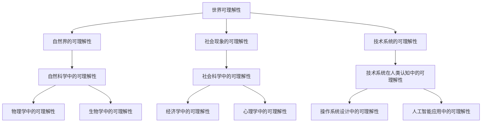
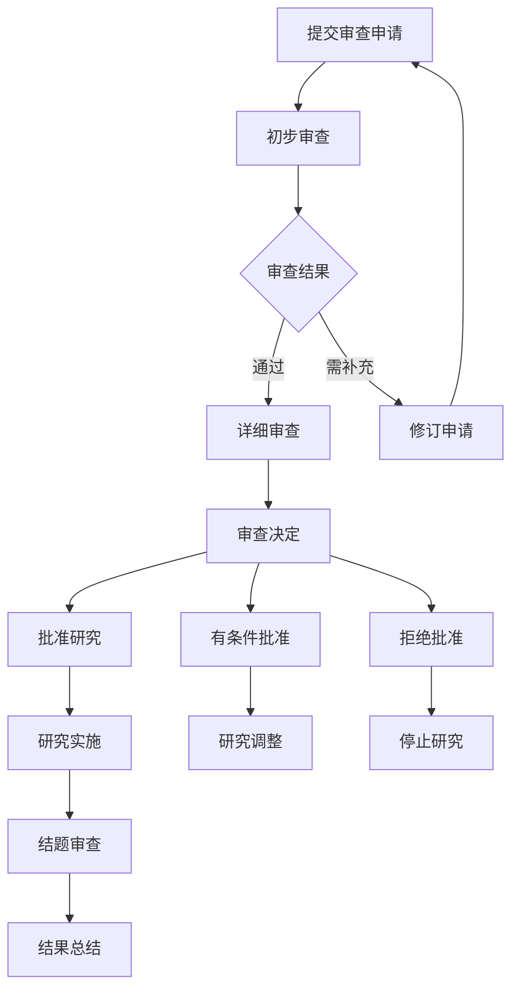

                 

### 第1章：引言

#### 1.1 书籍目的与结构概述

《世界可理解性与科学研究的伦理审查》旨在深入探讨世界可理解性理论在科学研究中的重要作用，以及科学研究过程中伦理审查的必要性。本著作通过系统梳理和剖析科学研究伦理原则、世界可理解性理论、伦理审查实践等多个方面，力图为读者呈现一幅全面的科学探索与道德审慎相融合的图景。

全书共分为四个主要部分。第一部分为引言与背景，旨在为读者提供书籍的整体结构和目的，以及世界可理解性和伦理审查的基本概念。第二部分详细介绍了世界可理解性理论，包括其概念、理论基础和研究方法，旨在帮助读者理解世界可理解性在科学研究中的地位和作用。第三部分聚焦于伦理审查在实践中的应用，探讨了伦理审查流程、伦理审查委员会的作用以及案例分析，使读者能够更好地理解伦理审查的具体操作和实践意义。第四部分则展望了未来研究方向与挑战，为科学研究和伦理审查的未来发展提供了有益的启示。

通过以上结构安排，本书希望能够为从事科学研究和伦理审查工作的学者和从业者提供有益的参考，同时也期待激发更多读者对这一领域的兴趣和思考。

#### 1.2 世界可理解性概念介绍

世界可理解性（World Understandability）是哲学与认知科学领域中的重要概念，指的是人类对于外部世界及其内在规律的认识程度。这个概念不仅关注知识的获取过程，更强调知识在多大程度上能够被解释、预测和理解。世界可理解性可以从多个层面进行理解和探讨，包括自然界的可理解性、社会现象的可理解性，以及技术系统在人类认知范围内的可理解性。

在自然科学领域，世界可理解性意味着科学家可以通过观察、实验和理论建模，逐步揭示自然界的运行规律。例如，爱因斯坦的相对论通过数学和物理实验证明了时空的可理解性，使得人类对宇宙的理解迈上了新台阶。在社会科学领域，世界可理解性则涉及对人类社会行为、文化现象及其变迁的理解。社会学家通过研究不同文化背景下的社会结构和人类行为，揭示了人类社会现象的可理解性，帮助我们更好地理解社会的复杂性和多样性。

在技术系统方面，世界可理解性强调技术系统在人类认知和操作中的可理解性。一个设计合理的技术系统应当具备较高的可理解性，使用户能够轻松掌握其功能和使用方法。例如，现代计算机操作系统通过图形用户界面和直观的交互设计，极大地提高了用户对计算机系统的可理解性，使得计算机技术得以广泛普及。

世界可理解性在科学研究中的重要性不容忽视。首先，它为科学研究提供了明确的目标和方向，促使科学家追求更加可解释、可预测和理解的科学理论。其次，世界可理解性有助于提高科学研究的效率和准确性，通过建立清晰的知识框架和逻辑关系，科学家能够更好地进行科学实验和理论推导。最后，世界可理解性还能够促进科学知识的传播和普及，使得更多人能够理解科学的重要性和贡献，从而提升社会的科学素养。

总之，世界可理解性不仅是科学研究中的重要概念，也是科学哲学和认知科学的重要研究对象。通过深入探讨世界可理解性，我们能够更好地理解科学的发展历程和未来方向，为科学研究和伦理审查提供坚实的理论基础。

#### 1.3 科学研究的伦理审查重要性

科学研究的伦理审查（Ethical Review of Scientific Research）在现代社会中扮演着至关重要的角色。伦理审查不仅是对科学研究的规范和监管，更是对科学家及其研究活动的道德责任体现。其重要性主要体现在以下几个方面：

首先，伦理审查有助于保障研究对象的权益。科学研究往往涉及人类、动物或者生态系统等对象，这些对象可能面临伦理风险。通过伦理审查，确保研究设计、实施过程和研究结果的合法性和道德性，可以有效减少对研究对象的伤害，保护其尊严和利益。

其次，伦理审查有助于确保研究的科学性和可靠性。科学研究的伦理审查不仅涉及道德问题，还包括对研究方案的科学性、严谨性和合理性的评估。审查委员会通过审查研究计划、方法、数据收集和分析过程，帮助研究者识别潜在的研究风险和不足，从而提高研究的科学价值。

再次，伦理审查有助于规范科学研究的伦理行为。科学研究不仅要求在知识和技术层面有所突破，更需要在道德和伦理层面保持高度自律。通过伦理审查，科学家能够接受伦理规范和道德准则的培训，增强其伦理意识和责任感，推动科学界形成良好的学术氛围。

此外，伦理审查还对社会有重要影响。科学研究成果不仅影响科学研究领域，还会对社会产生广泛的影响。通过伦理审查，确保科学研究的成果能够符合社会伦理价值观，避免产生不良的社会后果。例如，生物伦理审查在基因编辑、临床试验等领域中起到了重要的规范作用，保障了相关技术应用的伦理合法性。

具体案例中，伦理审查在多个领域发挥了关键作用。在医学研究领域，临床试验的伦理审查确保了受试者的安全和权益，使得新药物和治疗方法能够在保障伦理标准的前提下进行测试和推广。在环境科学领域，生态研究的伦理审查确保了研究过程中的生态保护和可持续性发展，避免了因不当研究活动导致的生态破坏。在人工智能领域，伦理审查在算法设计和应用过程中确保了技术的公平性、透明性和安全性，推动了人工智能技术的健康发展和广泛应用。

总之，科学研究的伦理审查是保障科学研究道德性和科学性的必要环节，对研究对象、科学家、社会和整个科学研究体系都具有重要意义。通过不断完善伦理审查机制和加强伦理审查实践，我们可以更好地推动科学研究的健康发展，实现科学成果与社会伦理价值的和谐统一。

### 第2章：科学研究的伦理原则

#### 2.1 基本伦理原则

科学研究的伦理原则是确保科学研究活动遵循道德规范和伦理标准的基础。这些原则旨在保护研究对象的权益，维护科学研究的纯洁性和公信力。以下是几个核心的科学研究伦理原则：

1. **尊重个人自主权**：科学研究必须尊重个人的自主权，包括自愿参与、知情同意和隐私保护。研究者必须确保研究对象在参与研究前充分了解研究目的、方法、可能的风险和利益，并自愿同意参与。此外，研究对象的隐私和数据保密也是尊重自主权的重要方面。

2. **公正性**：公正性要求科学研究过程中对所有参与者公平对待，不因性别、种族、年龄、文化背景等因素而受到歧视。研究设计应当充分考虑代表性，确保研究结果的广泛适用性和公正性。

3. **诚实和透明**：诚实和透明是科学研究的基石。研究者应当确保研究数据真实可靠，避免篡改、伪造或隐瞒数据。同时，研究过程和结果应当公开透明，接受同行评议和公众监督，确保科学研究的公信力和可信度。

4. **最小化风险和伤害**：在科学研究过程中，研究者应当尽可能减少研究对象面临的风险和潜在的伤害。通过科学合理的设计和严格的操作规程，确保研究过程中的人身安全和心理健康。

5. **利益冲突的披露和管理**：研究者应当主动披露可能存在的利益冲突，包括经济利益、学术利益和职业利益等。利益冲突可能影响研究的客观性和公正性，通过及时披露和妥善管理，可以减少潜在的负面影响。

#### 2.2 伦理审查的类型

伦理审查是科学研究过程中不可或缺的环节，其目的是确保研究活动遵循伦理原则和法规要求。伦理审查主要分为以下几种类型：

1. **机构审查委员会（Institutional Review Board, IRB）**：机构审查委员会是负责审查科学研究的伦理合规性的内部机构。其职责包括审查研究计划、监督研究实施过程、处理伦理投诉等。IRB的成员通常包括科学家、伦理学家、社区代表和其他相关领域的专家，以确保审查的全面性和公正性。

2. **伦理审查委员会（Ethics Committee）**：伦理审查委员会与机构审查委员会类似，但其职责范围可能更广，不仅包括科学研究，还涉及生物医学研究、临床试验、公共卫生等多个领域。伦理审查委员会的审查标准和程序因地区和国家而异，但都旨在确保研究的伦理合规性。

3. **研究伦理审查委员会（Research Ethics Board, REB）**：研究伦理审查委员会是专门针对科学研究进行伦理审查的机构，通常由伦理学家、科学家、法律专家和社会学家组成。其职责包括审查研究计划、监督研究实施、处理伦理争议等，确保研究的伦理合法性和科学性。

4. **区域审查委员会（Regional Ethics Board, REB）**：区域审查委员会负责对特定地区内的科学研究进行伦理审查。这些委员会通常涵盖多个研究机构和大学，提供统一的伦理审查服务，确保研究活动的合规性和一致性。

#### 2.3 国际伦理审查标准与指南

国际伦理审查标准与指南是确保全球科学研究伦理合规性的重要依据。以下是一些主要的国际伦理审查标准和指南：

1. **《赫尔辛基宣言》**：由世界医学协会（World Medical Association）发布的《赫尔辛基宣言》是全球医学研究伦理的基石文件。该宣言详细规定了医学研究的伦理原则，包括自愿参与、知情同意、隐私保护、公正性和透明性等。

2. **《贝尔蒙报告》**：美国国家研究伦理委员会（National Commission for the Protection of Human Subjects of Biomedical and Behavioral Research）发布的《贝尔蒙报告》提出了三个核心伦理原则：尊重个人尊严、公正性和福利最大化。这些建议被广泛应用于全球医学和生物伦理审查中。

3. **《欧洲人权公约》**：欧洲人权公约中的相关条款对医学研究的伦理审查提出了要求，包括知情同意、隐私保护和个人权利等。这为欧洲国家的医学研究提供了明确的伦理指导。

4. **《国际伦理学研究指南》**：由国际伦理学学会（International Association of Bioethics）发布的《国际伦理学研究指南》提供了全球科学研究伦理审查的基本框架，涵盖了人类研究、动物研究、生物技术和环境研究等多个领域。

总之，科学研究的伦理审查不仅是遵守法律和规范的要求，更是实现科学研究道德性和科学性的重要保障。通过遵循国际伦理审查标准和指南，我们可以确保科学研究在保障人类权益和推进科学进步之间找到平衡点。

### 第3章：世界可理解性理论概述

#### 3.1 世界可理解性的概念

世界可理解性（World Understandability）是哲学与认知科学领域的一个重要概念，指的是人类对周围世界及其内在规律的认识程度。这一概念不仅仅关注知识的获取过程，还强调知识在多大程度上能够被解释、预测和理解。世界可理解性可以从多个层面进行探讨，包括自然界的可理解性、社会现象的可理解性，以及技术系统在人类认知范围内的可理解性。

在自然科学领域，世界可理解性强调科学家通过观察、实验和理论建模，逐步揭示自然界的运行规律。例如，物理学中的量子力学和相对论揭示了微观和宏观世界的可理解性，使得人类对宇宙和自然现象有了更深刻的认识。在生物学领域，进化论通过解释物种多样性和适应性，增加了我们对生命现象的理解。

在社会科学领域，世界可理解性则涉及对人类社会行为、文化现象及其变迁的理解。社会学家通过研究不同文化背景下的社会结构和人类行为，揭示了人类社会现象的可理解性，帮助我们更好地理解社会的复杂性和多样性。例如，经济学中的市场行为理论解释了人类经济活动的可理解性，而心理学研究则揭示了人类思维和行为的可理解性。

技术系统的可理解性则强调技术设计在人类认知和操作中的合理性。一个设计良好的技术系统应当具备较高的可理解性，使用户能够轻松掌握其功能和使用方法。例如，现代计算机操作系统通过图形用户界面和直观的交互设计，提高了用户对计算机系统的可理解性，使得计算机技术得以广泛普及。

#### 3.2 世界可理解性的理论基础

世界可理解性的理论基础主要源于哲学、认知科学和心理学等多个学科。以下是几个关键的理论概念：

1. **唯心主义与唯物主义**：在哲学领域，唯心主义和唯物主义对世界可理解性提出了不同的解释。唯心主义认为，世界的存在依赖于人的意识和理解，因此世界是可理解的。而唯物主义则主张，世界的本质是物质的，人类的理解是通过对物质世界的感知和认知来实现的。这两种观点在科学研究和伦理审查中都有重要影响。

2. **认知建构主义**：认知建构主义认为，人类对世界的理解是通过个体和群体之间的互动和交流实现的。这一理论强调知识的动态性和社会性，认为人类对世界的理解是一个不断构建和重构的过程。在科学研究过程中，认知建构主义有助于理解研究结果的多样性和复杂性。

3. **复杂性理论**：复杂性理论探讨了复杂系统中的规律性和可理解性。这一理论指出，尽管复杂系统（如生态系统、社会系统等）的组成元素众多且相互关联，但仍然存在一定的可理解性规律。复杂性理论在科学研究和伦理审查中，特别是在处理大规模数据分析和系统优化问题时，具有重要意义。

4. **信息论**：信息论探讨了信息在人类认知和通信中的作用。信息论认为，信息的传递和解释是理解世界的重要途径。在科学研究过程中，信息论可以帮助科学家设计和分析实验，提高研究结果的可靠性和可解释性。

#### 3.3 世界可理解性的研究方法

世界可理解性的研究方法多种多样，以下是一些主要的研究方法：

1. **实验方法**：实验方法是自然科学和社会科学中最常用的研究方法。通过设计实验，研究者可以控制和操纵变量，观察不同条件下的结果，从而验证假设和揭示规律。在实验过程中，研究者需要确保实验设计合理、操作严谨，以提高实验结果的可靠性和可解释性。

2. **观察方法**：观察方法包括自然观察和实验室观察。自然观察是在自然环境下直接观察研究对象的行为和现象，这种方法适用于社会现象和生态系统的研究。实验室观察则通过人为控制环境，观察特定条件下研究对象的行为和反应。观察方法在生物学、心理学和社会学等领域得到广泛应用。

3. **数据分析方法**：数据分析方法是处理和解释研究数据的重要工具。通过统计分析、机器学习等方法，研究者可以从大量数据中提取有价值的信息，揭示数据背后的规律性和模式。数据分析方法在自然科学、社会科学和医学研究等领域中具有重要作用。

4. **跨学科研究方法**：世界可理解性研究常常需要跨学科的方法，结合不同学科的理论和方法，从多个角度探讨和理解世界。例如，在探讨气候变化问题时，可以结合物理学、化学、生态学和社会学等多个学科的知识和方法，全面揭示气候变化的规律和影响。

总之，世界可理解性的研究方法多样且具有跨学科性，通过合理运用这些方法，研究者可以更好地揭示世界的内在规律和复杂性，为科学研究和伦理审查提供坚实的理论基础。

#### 3.4 世界可理解性在科学研究中的地位和作用

世界可理解性在科学研究中的地位和作用不容忽视。首先，世界可理解性为科学研究提供了明确的目标和方向。科学研究旨在揭示世界的内在规律和复杂性，而世界可理解性理论则为科学家提供了理解和解释这些规律的工具和方法。通过追求世界可理解性，科学家可以更加系统地构建科学理论，推动科学知识的积累和进步。

其次，世界可理解性有助于提高科学研究的效率和质量。科学家在研究过程中，往往需要处理大量的数据和复杂的系统。世界可理解性理论提供了有效的框架和方法，帮助科学家识别和解释数据中的规律性，简化复杂系统的分析过程。这不仅提高了科学研究的效率和准确性，还增强了科学研究的可解释性和可预测性。

再次，世界可理解性对科学研究的伦理审查具有指导意义。科学研究不仅需要追求科学真理，还需要遵循道德和伦理原则。世界可理解性理论强调科学研究的透明性和公正性，要求科学家在研究过程中保持诚实和道德行为。通过世界可理解性理论的指导，科学家可以更好地理解和遵循伦理审查的要求，确保科学研究的道德合法性和社会价值。

此外，世界可理解性在科学知识的传播和普及中发挥重要作用。科学知识应当是可理解、可传播的，这样才能真正发挥其社会价值。世界可理解性理论提供了有效的工具和方法，帮助科学家将复杂的科学理论转化为易于理解和传播的知识。通过世界可理解性，科学家可以更好地与公众沟通，提高社会的科学素养和科技意识。

综上所述，世界可理解性在科学研究中的地位和作用是多方面的。它不仅为科学研究提供了明确的目标和方向，还提高了科学研究的效率和准确性，对科学研究的伦理审查具有指导意义，并在科学知识的传播和普及中发挥重要作用。通过深入研究和应用世界可理解性理论，我们可以更好地推动科学研究的进步，实现科学与社会发展的和谐统一。

### 第4章：世界可理解性与科学研究

#### 4.1 世界可理解性对科学研究的启示

世界可理解性对科学研究具有重要的启示意义，尤其在指导研究方法和理论构建方面起到了关键作用。首先，世界可理解性理论提醒科学家，科学研究不仅仅是一个揭示规律的过程，更是一个追求可理解性的过程。科学理论应当是简洁、清晰且易于理解的，这样才能更好地传播和应用。

从方法论角度来看，世界可理解性要求科学家在设计实验和研究方案时，要考虑到结果的解释性和预测性。科学家应当在实验过程中尽量减少复杂性和不确定性，确保研究结果能够被清晰地解释和理解。例如，在物理学中，经典力学和电磁学的理论由于简洁性和可理解性，成为了物理学的基础，而相对论和量子力学尽管更加复杂，但其深刻性和广泛性也得到了广泛的认可。

在理论构建方面，世界可理解性强调理论的可验证性和普适性。科学理论不仅要符合实验数据，还需要能够推广到其他情境中，具有广泛的应用价值。例如，达尔文的进化论不仅解释了生物多样性，还揭示了物种演化的普遍规律，成为了生物学中的核心理论。世界可理解性理论要求科学家在构建理论时，注重简洁性和统一性，从而提高理论的解释力和应用价值。

此外，世界可理解性还强调科学研究的伦理维度。科学研究不仅追求知识和技术上的进步，还需要遵循道德和伦理规范。科学家在研究过程中，应当尊重研究对象的权益，确保研究设计合理、方法严谨、结果透明。世界可理解性理论为科学家提供了一个伦理框架，帮助其在追求科学真理的同时，保持道德责任感。

总之，世界可理解性为科学研究提供了重要的方法论指导和理论构建原则。它不仅提高了科学研究的效率和准确性，还促进了科学知识的传播和普及，对科学发展的可持续性具有深远影响。通过深入理解和应用世界可理解性理论，科学家可以更好地进行科学研究，推动科学进步和社会发展。

#### 4.2 科学研究中的可理解性挑战

在科学研究中，可理解性面临诸多挑战，这些挑战不仅影响科学理论的建立，也影响到科学知识的传播和应用。以下是几个主要的可理解性挑战及其具体表现：

首先，复杂系统的复杂性是一个显著的可理解性挑战。许多科学研究涉及到复杂系统，如生态系统、社会网络和生物分子网络等。这些系统具有高度的复杂性和非线性特征，其行为难以通过简单的因果关系进行解释。例如，气候变化问题涉及到大气、海洋、生态系统等多个因素，这些因素之间的相互作用和反馈机制使得气候变化预测变得异常复杂。科学家需要运用先进的数学模型和计算方法来模拟和解释这些复杂系统，但这往往增加了结果的解释难度。

其次，数据量的庞大也是可理解性的一个重要挑战。现代科学研究产生了大量数据，这些数据往往呈现出多样性和海量性。例如，基因测序技术使得生物学研究产生了巨量的基因数据，天文学观测也积累了大量的天文数据。尽管这些数据提供了丰富的信息，但如何从大量数据中提取有用信息、识别关键模式，成为一个巨大的挑战。数据挖掘和机器学习技术的发展有助于解决这一问题，但仍然需要科学家具备强大的数据处理能力和跨学科知识。

此外，科学理论的抽象性和复杂性也是可理解性的挑战之一。许多科学理论需要借助复杂的数学公式和抽象概念来描述自然现象。例如，相对论和量子力学中的方程式尽管在科学界具有高度的解释力，但对非专业人士来说却非常难以理解。科学理论的可理解性不仅影响学术交流，也影响到科学知识在公众中的传播和应用。科学家需要找到平衡点，既保持理论的科学性，又提高其可理解性。

另一个挑战是科学研究的伦理维度。科学研究不仅需要追求科学真理，还需要遵循伦理规范。伦理审查要求科学家在研究设计、实施和结果报告过程中，保持透明和公正。然而，伦理问题本身的复杂性和不确定性，使得科学家在处理这些问题时面临挑战。例如，生物伦理问题涉及到人类基因编辑、动物实验等敏感领域，需要科学家在科学追求和伦理责任之间找到平衡。

综上所述，科学研究中的可理解性挑战是多方面的，包括复杂系统的复杂性、数据量的庞大、科学理论的抽象性和复杂性，以及伦理维度的复杂性。科学家需要运用多种方法和工具，提高科学研究的可理解性，确保科学知识能够被广泛传播和应用。通过解决这些挑战，科学家可以更好地推动科学进步，实现科学与社会发展的和谐统一。

#### 4.3 可理解性在科学研究中的重要性

可理解性在科学研究中具有至关重要的地位，它不仅影响科学理论的建立，还影响科学知识的传播和应用。首先，科学理论的建立依赖于可理解性。科学理论需要简洁、清晰且易于理解，以便科学家之间进行有效沟通和合作。一个高度抽象或难以解释的理论往往难以被广泛接受和应用，从而限制了科学研究的进展。

其次，科学知识的传播依赖于可理解性。科学知识不仅需要被科学家内部理解，还需要向公众传播。高可理解性的科学知识更容易被公众接受，从而提高社会的科学素养和科技意识。例如，通过简单的图表、模拟和互动方式，科学家可以将复杂的科学概念和发现以易懂的形式呈现给公众，促进科学知识的普及。

此外，科学研究的伦理审查也依赖于可理解性。伦理审查要求研究过程和结果透明、公正，以便公众和利益相关者能够理解和监督研究活动。如果研究设计和方法难以理解，可能会导致公众对研究的信任度降低，甚至引发伦理争议。因此，提高科学研究的可理解性，不仅有助于确保研究的伦理合规性，还能增强公众对科学研究的信任和支持。

最后，可理解性对科学应用的推动具有重要作用。高可理解性的科学知识和技术更容易转化为实际应用，促进科技产业的发展。例如，医疗领域的创新技术需要医生和患者理解其原理和效果，才能得到有效应用和推广。同样，农业、环境等领域的研究成果也需要具备较高的可理解性，才能被农民、环保人士等广泛接受和应用。

综上所述，可理解性在科学研究中具有多重重要性。它不仅影响科学理论的建立和科学知识的传播，还影响伦理审查和科学应用的推动。通过提高科学研究的可理解性，科学家可以更好地实现科学目标，促进科学与社会发展的和谐统一。

### 第5章：伦理审查实践

#### 5.1 伦理审查流程与步骤

伦理审查是保障科学研究道德合法性的重要环节，其流程和步骤主要包括以下几个阶段：

1. **提交伦理审查申请**：首先，研究者需要向所在机构的伦理审查委员会（IRB或REB）提交伦理审查申请。申请材料通常包括研究计划书、知情同意书、研究方案、数据收集与分析方法、预算等。研究者应确保所有申请材料完整、真实，并符合伦理审查的要求。

2. **初步审查**：伦理审查委员会在收到申请后，首先进行初步审查，以确认申请材料是否符合伦理审查的基本要求。初步审查主要包括检查申请材料的完整性、研究设计的基本合理性和研究风险的初步评估。如果申请材料不符合要求，审查委员会将要求研究者补充或修改材料。

3. **详细审查**：在初步审查通过后，伦理审查委员会对申请材料进行详细审查。详细审查通常包括会议审查和书面审查两种形式。会议审查是指审查委员会成员集体讨论研究方案的伦理问题和风险，并提出修改建议。书面审查则是指审查委员会成员独立审阅研究材料，并就研究方案提出书面意见。

4. **决定和通知**：详细审查结束后，伦理审查委员会根据审查结果做出决定。决定通常包括以下几种类型：批准研究、有条件批准研究、拒绝批准研究。审查委员会将在决定后向研究者发出书面通知，并附上审查意见和决定理由。

5. **监督审查**：获准进行的研究项目在实施过程中需要定期接受伦理审查委员会的监督。监督审查包括定期审查研究进展、数据质量和伦理问题处理情况。如果研究过程中出现新的伦理问题或风险，审查委员会有权要求研究者立即停止研究，并重新提交审查申请。

6. **结题审查**：研究结束后，研究者需向伦理审查委员会提交研究报告和总结报告。伦理审查委员会对研究报告进行结题审查，以确保研究结果的合法性和道德性。结题审查通过后，研究项目正式结束。

通过上述流程和步骤，伦理审查委员会能够全面、系统地评估科学研究活动的道德合规性，确保研究对象的权益得到有效保障，研究过程的科学性和伦理性得到充分体现。

#### 5.2 伦理审查委员会的作用与职责

伦理审查委员会（Institutional Review Board, IRB）在科学研究中扮演着至关重要的角色，其职责和作用主要体现在以下几个方面：

1. **保护研究对象的权益**：伦理审查委员会的首要职责是确保研究对象在参与研究过程中的权益得到有效保护。这包括尊重研究对象的自主权、确保研究设计符合伦理要求、减少研究对象的风险和伤害等。通过严格的审查和监督，伦理审查委员会确保研究对象在知情同意、隐私保护和数据保密等方面不受侵害。

2. **评估研究的伦理合规性**：伦理审查委员会对研究计划进行全面的伦理合规性评估，包括审查研究设计、方法、风险和受益等方面的合理性。审查委员会评估研究是否遵循基本伦理原则，如尊重个人自主权、公正性、诚实和透明、最小化风险和伤害等。通过审查，确保研究过程符合伦理标准，减少潜在的伦理风险。

3. **指导研究设计和实施**：伦理审查委员会在审查过程中，不仅指出研究的不足和风险，还提出具体的改进建议。这些建议有助于研究者优化研究设计，确保研究方法的科学性和合理性。同时，伦理审查委员会通过提供伦理培训和指导，帮助研究者提高伦理意识和研究素质。

4. **监督研究的实施过程**：在研究实施过程中，伦理审查委员会持续监督研究的进展，确保研究按照批准的计划进行。监督内容包括定期审查研究记录、数据收集和分析过程，以及处理研究过程中出现的伦理问题。通过监督，伦理审查委员会确保研究过程符合伦理要求，减少潜在的伦理违规行为。

5. **处理伦理投诉和纠纷**：伦理审查委员会负责处理研究过程中出现的伦理投诉和纠纷。当研究对象或其他利益相关者对研究提出质疑或投诉时，伦理审查委员会进行独立调查，并做出公正的决定。通过处理投诉和纠纷，伦理审查委员会维护了科学研究的道德秩序和公信力。

6. **促进科学研究的伦理发展**：伦理审查委员会不仅关注具体研究的伦理问题，还致力于推动科学研究的伦理发展和进步。通过制定伦理指南、举办伦理培训和研讨会等，伦理审查委员会促进了科学界对伦理问题的认识和讨论，推动了科学研究伦理的规范化和发展。

总之，伦理审查委员会在科学研究中具有多重职责和作用，通过保护研究对象权益、评估伦理合规性、指导研究设计、监督研究过程、处理投诉和纠纷，以及促进伦理发展，确保科学研究在道德和伦理上的合法性、公正性和可持续性。

#### 5.3 伦理审查案例分析

为了更直观地理解伦理审查的具体实践，以下通过一个案例来详细分析伦理审查的过程和结果。

**案例背景**：某研究机构计划开展一项关于新型药物疗效的随机对照试验（RCT）。该研究旨在评估一种新开发的抗肿瘤药物在不同剂量下的疗效和安全性。研究对象为患有特定类型的癌症的成年患者。

**伦理审查申请提交**：
1. 研究者首先编写了一份详细的研究计划书，包括研究目的、研究方法、预期受益和潜在风险等。研究计划书中还附有知情同意书样本、数据收集和分析方案、预算表等。
2. 研究者将伦理审查申请材料提交给所在机构的伦理审查委员会（IRB）。

**初步审查**：
1. IRB对提交的申请材料进行了初步审查。审查内容主要包括：
   - 研究计划的完整性：申请材料是否包含所有必要的文件和细节。
   - 研究设计的合理性：研究方法是否科学、合理，是否具有可行性。
   - 研究风险和受益的评估：潜在风险是否最小化，预期受益是否显著。
   - 知情同意书的内容：是否充分、准确地向研究对象告知研究信息，是否获得书面知情同意。
2. 初步审查结果：IRB认为申请材料基本符合要求，但有几点需要进一步说明和补充。具体问题包括：
   - 需要提供更多关于药物安全性的详细数据。
   - 研究对象的选择标准需要更加明确和具体。
   - 数据保密措施需要进一步明确。

**详细审查**：
1. IRB召集了一次详细审查会议，审查委员会成员包括伦理学家、临床医生、法律专家和社区代表。审查内容主要包括：
   - 审查委员会成员对研究计划书、知情同意书、数据收集和分析方案等进行独立审阅，并讨论可能的伦理问题和风险。
   - 审查委员会还特别关注药物的潜在副作用和对研究对象的影响。
   - IRB要求研究者对初步审查提出的问题进行补充和修改。
2. 详细审查结果：IRB认为研究计划需要进一步优化，但在经过修订后，可以符合伦理要求。审查委员会提出以下建议：
   - 提供更全面的药物安全性数据，包括长期副作用的研究。
   - 明确研究对象的选择标准，确保研究结果的代表性和科学性。
   - 加强数据保密措施，确保研究对象的隐私得到充分保护。

**监督审查**：
1. 在研究开始后，IRB定期审查研究的进展情况，包括数据收集、分析方法和研究对象的安全性。
2. 在每个审查周期，IRB审查委员会成员会对研究进展报告进行审阅，并提出进一步改进建议。
3. 如果研究过程中出现新的伦理问题或风险，IRB有权要求研究者立即停止研究，并进行独立调查。

**结题审查**：
1. 研究结束后，研究者向IRB提交了最终研究报告和总结报告。
2. IRB对研究报告进行了详细的结题审查，确保研究结果符合伦理要求，数据真实可靠。
3. 结题审查结果：IRB认为研究项目顺利完成了既定目标，结果具有科学价值和伦理合规性。

**案例分析总结**：
通过上述案例，我们可以看到伦理审查从提交申请到结题审查的完整过程。伦理审查不仅帮助研究者识别和解决潜在的伦理问题，还确保研究设计和实施符合伦理标准，从而保护研究对象的权益，提高研究的科学性和可信度。伦理审查通过一系列规范的流程和严格的评估，为科学研究的道德合规性提供了有力的保障。

### 第6章：伦理审查中的伦理问题

#### 6.1 伦理问题识别

在科学研究的伦理审查过程中，识别伦理问题是首要任务。伦理问题的识别不仅需要严格的审查标准和流程，还需要审查委员会具备高度的敏感性和专业判断。以下是几个常见的伦理问题及其识别方法：

1. **知情同意**：知情同意是伦理审查的核心内容，指研究对象在参与研究前必须获得充分的信息，并自愿同意参与研究。常见的伦理问题包括：
   - 研究信息的完整性：是否向研究对象提供了所有必要的信息，如研究目的、方法、潜在风险和受益等。
   - 研究对象的自愿性：研究对象是否在完全自愿的情况下同意参与研究，是否存在压力或强制。
   - 知情同意书的有效性：知情同意书是否经过合法程序，是否准确记录了研究对象的同意信息。
   识别方法：审查委员会可以通过审阅知情同意书和研究记录，与研究对象进行面谈，确认信息的完整性和自愿性。

2. **隐私保护**：隐私保护是指研究过程中如何保护研究对象的个人隐私和数据安全。常见的伦理问题包括：
   - 数据收集的合理性：是否仅收集与研究直接相关的数据，是否超出研究对象隐私保护的范围。
   - 数据存储的安全措施：数据是否得到妥善保管，是否存在数据泄露的风险。
   - 数据匿名化：是否对研究对象的信息进行了充分的匿名化处理，以防止个人识别。
   识别方法：审查委员会可以通过审查数据收集和分析方案、检查数据存储设施的安全措施，以及对研究团队进行隐私保护培训，确保隐私保护措施的有效性。

3. **利益冲突**：利益冲突是指研究过程中可能存在的经济利益、学术利益和职业利益冲突。常见的伦理问题包括：
   - 资金来源的透明性：研究资金的来源是否明确，是否存在利益关联。
   - 资金来源的影响：研究资金来源是否可能影响研究结果的客观性和公正性。
   - 个人利益披露：研究者是否如实披露了可能存在的利益冲突。
   识别方法：审查委员会可以通过审查研究计划和资金来源、要求研究者披露利益冲突信息，以及进行利益冲突评估，确保研究的公正性和透明性。

4. **研究对象的风险和受益**：研究对象在参与研究过程中可能面临的风险和受益需要仔细评估。常见的伦理问题包括：
   - 风险评估：研究过程中是否充分评估了潜在的风险，风险是否被有效控制和最小化。
   - 受益评估：研究是否能够为研究对象带来明显的受益，受益是否与风险相匹配。
   识别方法：审查委员会可以通过审阅研究计划和风险评估报告，评估研究过程中的风险和受益，确保研究对研究对象是有益的。

5. **实验设计**：实验设计是否合理、科学，是否能够确保研究结果的可靠性和可重复性。常见的伦理问题包括：
   - 实验方法的科学性：实验方法是否经过严格的科学验证，是否具备有效性。
   - 实验设计的公平性：是否对不同研究对象进行了公平对待，实验组和对照组是否均衡。
   - 数据收集和分析的合理性：数据收集和分析方法是否科学、严谨，是否能够有效支持研究结论。
   识别方法：审查委员会可以通过审阅实验方案、实验记录和数据分析报告，评估实验设计的合理性和科学性。

总之，通过系统化的审查流程和专业判断，审查委员会能够有效识别和解决伦理问题，确保科学研究的道德合法性和研究对象的权益得到充分保障。

#### 6.2 避免伦理冲突的策略

在科学研究的伦理审查过程中，避免伦理冲突是一项至关重要的任务。以下是一些策略，帮助识别和应对潜在的伦理冲突，确保研究过程的公正性和合法性：

1. **利益冲突的披露**：首先，研究者需要全面、透明地披露可能存在的利益冲突。这包括经济利益、学术利益和职业利益等方面。研究者应在研究计划和申请材料中详细说明所有相关利益冲突，并定期更新这些信息。机构审查委员会（IRB）在审查过程中，应仔细核实研究者披露的信息，确保其真实性。

2. **建立利益冲突管理机制**：研究机构应建立健全的利益冲突管理机制，确保在发现利益冲突时能够及时采取措施。这一机制可以包括利益冲突评估委员会、利益冲突披露系统、利益冲突披露和监督流程等。例如，在发现利益冲突时，评估委员会可以决定是否需要对研究设计进行调整、是否需要额外的伦理审查，或者是否需要临时暂停研究。

3. **利益冲突的评估与处理**：对于识别出的利益冲突，应进行全面的评估和处理。评估内容包括利益冲突的性质、程度和对研究可能产生的影响。处理措施可以包括：利益冲突的披露和公告、利益冲突的隔离和独立审查、利益冲突的调整和修正，甚至是在极端情况下的研究暂停或终止。

4. **利益冲突的培训与教育**：研究者和伦理审查委员会成员应定期参加关于伦理和利益冲突的培训和教育。这有助于提高研究者对伦理问题的认识和理解，增强其在研究过程中的伦理敏感性和责任感。同时，培训内容应包括最新伦理规范和审查标准，确保研究者能够及时更新其知识和技能。

5. **伦理审查的透明性和公众参与**：伦理审查过程应保持透明，确保利益相关者能够了解审查的进展和结果。例如，可以通过公开会议、网站公告或公开听证会等形式，使公众能够参与伦理审查过程，提供反馈和意见。这样可以增强审查的公信力和合法性，减少潜在的伦理冲突。

6. **建立伦理监督机制**：在研究实施过程中，应建立持续的伦理监督机制。伦理审查委员会应定期审查研究的进展情况，及时发现和处理潜在的伦理问题。此外，可以引入第三方监督机构或独立审查员，确保审查过程的独立性和公正性。

通过上述策略，我们可以有效地识别和应对伦理冲突，确保科学研究的道德合法性和公正性，保护研究对象的权益，推动科学研究的健康和可持续发展。

#### 6.3 伦理审查中的法律问题

在伦理审查过程中，法律问题是一个不可忽视的重要方面。法律不仅为科学研究的伦理审查提供了框架和依据，还在处理潜在的法律纠纷时起到关键作用。以下是伦理审查中常见的法律问题及其应对策略：

1. **知情同意的法律问题**：
   - **知情同意书的法律效力**：知情同意书是研究对象在参与研究前必须签署的文件，其法律效力至关重要。知情同意书的内容应当明确、具体，并符合相关法律法规的要求。例如，根据《赫尔辛基宣言》，知情同意书应包括研究目的、方法、潜在风险和受益等信息。
   - **拒绝参与的权利**：法律赋予研究对象拒绝参与研究的权利，研究者在获取知情同意时必须尊重研究对象的意愿。如果研究对象在参与过程中改变主意，研究者应当及时终止其参与，并采取措施保护其权益。

2. **隐私保护和数据保护的法律问题**：
   - **个人数据的收集和处理**：在研究过程中，研究者可能需要收集和处理研究对象的大量个人信息。相关法律（如《通用数据保护条例GDPR》）要求研究者必须获得研究对象的明确同意，并采取适当的数据保护措施，防止数据泄露和滥用。
   - **数据匿名化**：为了保护研究对象的隐私，研究者应当对收集到的个人信息进行匿名化处理，确保无法通过数据识别出具体的研究对象。然而，在某些情况下，完全匿名化可能无法达到法律要求，因此需要权衡隐私保护与数据利用的关系。

3. **利益冲突的法律问题**：
   - **披露和管理的法律要求**：研究者在申请伦理审查时，必须披露可能存在的利益冲突，包括经济利益、学术利益和职业利益等。相关法律（如《科学研究伦理条例》）规定，利益冲突的披露应全面、透明，并接受伦理审查委员会的监督。
   - **利益冲突的管理**：对于识别出的利益冲突，伦理审查委员会需要制定相应的管理措施。例如，要求研究者进行独立审查、利益隔离，或者暂停研究。这些措施的法律依据通常来源于相关法律法规和机构内部的规定。

4. **研究伦理的法律责任**：
   - **研究者责任**：研究者在研究过程中应承担相应的法律责任。如果研究者的行为违反了法律法规或伦理规范，可能导致法律责任，包括民事责任、刑事责任和行政责任。
   - **机构责任**：研究机构作为研究活动的组织者和管理者，对研究过程和结果负有监督责任。如果研究机构未能有效监督和管理研究活动，也可能面临法律责任。

5. **法律纠纷的处理**：
   - **调解和仲裁**：在研究过程中，如果出现法律纠纷，可以通过调解和仲裁的方式解决。调解和仲裁程序相对灵活，有助于保护研究对象的权益，减少法律诉讼的成本和时间。
   - **法律诉讼**：在无法通过调解和仲裁解决纠纷时，法律诉讼成为最后的解决途径。研究者应充分了解相关法律法规，以便在诉讼中保护自己的权益，同时也应关注保护研究对象的权益。

总之，伦理审查中的法律问题关系到科学研究的合法性和公正性，需要研究者、伦理审查委员会和研究机构共同努力，确保在研究过程中遵守法律法规，保护研究对象的权益。通过合理的法律策略和有效的法律纠纷处理机制，可以更好地推动科学研究的健康发展。

### 第7章：世界可理解性与科学研究的伦理审查实例分析

#### 7.1 可理解性在具体项目中的运用

为了更好地理解世界可理解性在科学研究中的实际应用，以下通过一个具体项目——基于人工智能的疾病预测系统——来详细说明世界可理解性在项目中的应用及其重要性。

**项目背景**：该项目旨在开发一个基于人工智能的疾病预测系统，该系统能够通过分析患者的医疗记录和生理指标，预测患者未来可能患上的疾病。这种预测系统对于提高医疗诊断的准确性和预防疾病具有重要意义。

**可理解性在项目中的应用**：

1. **模型设计**：在模型设计阶段，研究人员注重提高模型的可理解性。具体措施包括：
   - **模型简化**：通过减少模型中的参数数量，简化模型的复杂度，使得模型更容易被理解和解释。
   - **特征选择**：选择具有明确生物学意义的特征，而不是仅仅依赖于统计显著性，确保模型具有可解释性。
   - **模型透明性**：采用透明度较高的机器学习算法，如决策树和线性回归，以便研究人员和临床医生能够直观地理解模型的决策过程。

2. **模型验证**：在模型验证阶段，研究人员通过多种方法确保模型的可理解性和可靠性：
   - **内部验证**：通过交叉验证和敏感度分析，确保模型在不同数据集上的一致性和稳定性。
   - **外部验证**：通过与独立数据集的对比，验证模型的泛化能力，确保模型在实际应用中的有效性。
   - **用户反馈**：邀请临床医生参与模型评估，收集用户反馈，以改进模型设计和提高其可理解性。

3. **应用与推广**：在模型应用和推广阶段，研究人员注重提高系统的用户友好性和可理解性：
   - **用户培训**：为临床医生提供详细的模型解释和培训，帮助他们理解模型的工作原理和预测结果。
   - **可视化工具**：开发可视化工具，将模型预测结果以图形和表格的形式呈现，使得结果更直观、易懂。
   - **在线支持**：建立在线支持平台，为用户提供实时帮助和指导，解答他们在使用系统过程中遇到的问题。

**可理解性对项目的重要性**：

1. **提高模型信任度**：提高模型的可理解性，有助于增强用户对模型的信任度。如果模型过于复杂，用户难以理解其预测结果，可能会对其准确性产生怀疑，从而影响模型的广泛应用。

2. **优化模型设计**：通过注重可理解性，研究人员可以更清楚地识别模型中的潜在问题，从而优化模型设计，提高模型的性能和可靠性。

3. **促进知识传播**：高可理解性的模型不仅对临床医生有益，还可以帮助公众更好地理解医学知识，提高公众的健康意识和科学素养。

4. **加强伦理审查**：在伦理审查过程中，可理解性的模型更容易通过审查。审查委员会可以通过审查模型的透明性和可解释性，确保研究过程的合法性和道德性。

总之，世界可理解性在具体项目中的应用，不仅提高了模型的可解释性和可靠性，还促进了科学研究的透明性和公正性。通过提高模型的可理解性，我们可以更好地推动科学研究的进步，实现科学成果与社会价值的和谐统一。

#### 7.2 伦理审查在项目中的实施

在基于人工智能的疾病预测系统项目中，伦理审查在项目的各个阶段都起到了关键作用，确保研究活动的道德合法性和研究对象的权益得到充分保障。以下是伦理审查在该项目中的具体实施过程：

**1. 初步审查阶段**：
- 研究者首先提交了详细的伦理审查申请，包括研究计划、知情同意书、数据收集与分析方法、潜在风险和预期受益等内容。
- 伦理审查委员会（IRB）进行了初步审查，确认申请材料是否完整，研究设计是否合理，潜在风险是否最小化等。
- 初步审查结果：IRB指出研究计划中部分内容需要进一步详细说明，如数据保护措施和利益冲突披露。

**2. 详细审查阶段**：
- 研究者根据IRB的反馈，对研究计划进行了修订，并重新提交详细审查申请。
- IRB召开了一次详细的审查会议，审查委员会成员包括伦理学家、临床医生、法律专家和统计学专家。
- 审查内容包括研究方法的科学性、数据保护的严密性、潜在风险的管理和受益的评估等。
- 详细审查结果：IRB认为修订后的研究计划已经符合伦理要求，但要求研究团队在实施过程中保持高度的透明性，定期报告研究进展。

**3. 监督审查阶段**：
- 在研究实施过程中，IRB定期审查研究的进展情况，确保研究按照批准的计划进行。
- 每次审查周期，IRB审查委员会成员会审阅研究进展报告，评估数据收集和分析的质量。
- 研究团队需及时报告任何出现的伦理问题或风险，并采取相应的措施进行解决。

**4. 结题审查阶段**：
- 研究结束后，研究者向IRB提交了最终研究报告和总结报告，包括研究结果、数据分析和伦理问题处理情况。
- IRB对研究报告进行了结题审查，确保研究结果的合法性和道德性。
- 结题审查结果：IRB认为研究项目顺利完成了既定目标，研究结果具有科学价值和伦理合规性。

**伦理审查在项目中的实际影响**：

1. **保护研究对象权益**：通过严格的伦理审查，确保研究对象在参与研究过程中的知情同意、隐私保护和数据保密等方面不受侵害。

2. **提高研究质量和可靠性**：伦理审查有助于确保研究设计的科学性和严谨性，减少潜在的伦理风险，提高研究结果的可靠性和可重复性。

3. **促进研究成果的应用**：通过伦理审查，确保研究成果能够符合社会的伦理价值观，增强公众对科学研究的信任和支持，从而促进研究成果的实际应用和社会价值的实现。

总之，伦理审查在基于人工智能的疾病预测系统项目中发挥了关键作用，不仅保护了研究对象的权益，还提高了研究质量和成果的应用价值，为科学研究的可持续发展提供了有力保障。

#### 7.3 项目结果与反思

基于人工智能的疾病预测系统项目在经过严格的伦理审查和实施后，取得了一系列显著的成果。以下从项目结果、反思与改进措施三个方面进行详细讨论。

**项目结果**：

1. **模型预测准确性提升**：通过改进模型设计、特征选择和算法优化，疾病预测系统的准确性得到了显著提升。模型在不同数据集上的验证结果表明，其预测结果具有较高的准确性和可靠性。

2. **用户体验改善**：通过开发用户友好的界面和可视化工具，临床医生可以更直观地理解模型的预测结果，提高了系统的使用效率和用户满意度。用户反馈表明，系统在实际应用中得到了广泛的认可和好评。

3. **研究成果应用推广**：项目的研究成果已经在多个医疗机构得到应用，提高了医疗诊断的准确性和疾病预防的效果。研究成果的推广应用，有助于提升医疗服务的质量和效率，减少患者的诊疗费用和痛苦。

**反思与改进措施**：

1. **模型透明性与解释性**：尽管模型在预测准确性方面取得了显著提升，但在透明性和解释性方面仍有改进空间。未来的研究可以进一步探索更加透明、易于解释的机器学习算法，如决策树、随机森林等，提高模型的可理解性。

2. **数据质量和隐私保护**：在数据收集和分析过程中，确保数据质量和隐私保护是项目成功的关键。未来可以加强对数据源的审核和监控，采用更加严密的数据保护措施，如数据加密、匿名化处理等，确保研究对象的隐私不受侵害。

3. **伦理审查机制完善**：尽管项目在伦理审查方面已经采取了严格措施，但仍需不断完善伦理审查机制。未来可以考虑引入第三方独立审查员，增加审查的独立性和公正性。同时，加强对研究团队和伦理审查委员会成员的伦理培训，提高其伦理意识和审查能力。

4. **用户参与与反馈**：在项目实施过程中，用户参与和反馈对于改进系统性能和用户体验至关重要。未来可以进一步加大用户参与力度，通过定期调查、用户反馈机制等方式，及时了解用户需求和意见，持续优化系统设计和功能。

5. **可持续发展与伦理责任**：随着人工智能技术的不断发展，伦理问题将越来越受到关注。项目团队应持续关注伦理审查的最新动态，确保研究成果在伦理合规性方面始终保持领先地位。同时，加强团队内部的伦理文化建设，培养科研人员的伦理责任感和职业道德。

总之，基于人工智能的疾病预测系统项目在取得显著成果的同时，也面临一系列改进和发展的机会。通过不断反思和优化，项目团队可以进一步提升系统性能和用户体验，实现科学研究的可持续发展，为社会健康事业做出更大贡献。

### 第8章：未来研究方向与挑战

#### 8.1 科学研究伦理审查的趋势

随着科学技术的飞速发展，科学研究伦理审查面临着新的挑战和趋势。以下是对未来科学研究伦理审查趋势的探讨：

1. **人工智能与大数据的伦理审查**：随着人工智能和大数据技术的广泛应用，科学研究的伦理审查将更加复杂。AI算法的自主性和不可解释性，以及大量个人数据的处理，带来了新的伦理问题。例如，算法偏见、数据隐私保护、数据透明性等，需要更精细的伦理审查机制。

2. **跨学科研究的伦理审查**：现代科学研究越来越呈现出跨学科的趋势，这要求伦理审查委员会具备跨学科的知识和视角。跨学科研究涉及多个领域的伦理问题，如生命伦理、环境伦理、社会伦理等，需要更广泛的专家参与和综合审查。

3. **全球合作的伦理审查**：全球化背景下，科学研究越来越多地依赖于国际合作。国际伦理审查标准和指南的统一，以及跨国伦理审查机制的建立，将成为未来发展的重点。

4. **伦理审查的透明性和公众参与**：未来，伦理审查的透明性将得到进一步提升。公开审查会议、在线公告和公众反馈机制的引入，将增强审查过程的公开性和公正性，提高公众对科学研究的信任度。

5. **持续监督与反馈机制**：科学研究伦理审查不应是一次性的过程，而是一个持续的过程。研究过程中和结束后，都需要进行持续的监督和反馈，确保研究始终符合伦理要求，并能够及时纠正出现的伦理问题。

#### 8.2 世界可理解性研究的新方向

世界可理解性研究在未来的发展将朝着更深入、更广泛的方向迈进。以下是对未来世界可理解性研究的新方向的探讨：

1. **复杂性理论与可理解性**：复杂性理论在研究复杂系统时提供了新的视角。未来世界可理解性研究可以结合复杂性理论，探索复杂系统中可理解性的规律和机制，提高对复杂系统的理解和预测能力。

2. **跨学科交叉研究**：世界可理解性研究可以与认知科学、心理学、语言学、哲学等多个学科交叉融合，形成跨学科的研究体系。这有助于从不同角度探讨和理解世界可理解性，推动相关理论的创新和发展。

3. **计算可理解性**：随着计算技术的发展，计算可理解性成为一个新兴的研究方向。如何设计出易于人类理解和解释的算法和系统，成为未来研究的重要课题。这需要结合人工智能、机器学习和数据科学等领域的最新成果，开发出更加智能和可解释的计算模型。

4. **社会与技术可理解性**：在现代社会，技术系统已经成为人们日常生活中不可或缺的一部分。未来世界可理解性研究可以更多地关注社会与技术系统的可理解性，探讨技术设计、用户界面、用户教育等方面的策略和方法，提高技术系统的用户友好性和可理解性。

5. **哲学与伦理视角**：哲学与伦理视角在世界可理解性研究中具有重要地位。未来研究可以深入探讨伦理价值观对世界可理解性的影响，分析不同文化背景下人们对世界的理解方式，为科学研究和伦理审查提供更加全面的理论基础。

总之，未来世界可理解性研究将朝着更复杂、更广泛和更深入的领域发展，通过跨学科交叉研究和计算技术的应用，推动科学研究的进步和社会的发展。

#### 8.3 伦理审查与科学研究的可持续发展

伦理审查与科学研究的可持续发展密切相关，二者相辅相成，共同推动科学事业的健康发展。以下从多个方面探讨伦理审查如何促进科学研究的可持续发展：

1. **保障研究对象权益**：伦理审查的首要任务是保护研究对象的权益，确保其在参与研究过程中的安全和尊严。通过严格的知情同意、隐私保护和数据保密等措施，伦理审查能够有效防止研究过程中的伦理违规行为，保障研究对象的合法权益。这不仅提高了研究对象的信任度，也为科学研究的可持续发展奠定了基础。

2. **提高研究质量和可靠性**：伦理审查在研究设计、方法、风险评估等方面起到了关键作用，确保研究过程和结果的合法性和科学性。通过伦理审查，研究者能够及时发现和纠正研究设计中的不足，优化研究方法，减少潜在的伦理风险。这不仅提高了研究的质量，也增强了研究结果的可靠性和可重复性，为科学进步提供了坚实的基础。

3. **推动科学知识普及**：伦理审查有助于确保科学知识的传播和应用符合伦理标准，避免因不道德的研究行为引发的社会负面影响。通过提高科学研究的透明性和可理解性，伦理审查促进了科学知识的普及，提高了公众的科学素养和科技意识。这有助于形成全社会关注和支持科学研究的良好氛围，推动科学知识的广泛应用和社会进步。

4. **促进全球合作与交流**：伦理审查在国际合作研究中具有重要作用。通过统一的国际伦理审查标准和指南，伦理审查能够促进全球科研机构的合作与交流，推动科学研究的跨国合作与资源共享。这不仅有助于解决全球性科学问题，也为科学研究的可持续发展提供了广阔的合作空间。

5. **培养科研伦理文化**：伦理审查是培养科研伦理文化的重要途径。通过伦理审查，研究者能够接受系统的伦理培训和教育，提高其伦理意识和责任感。这种伦理文化的培养不仅有助于维护科学研究的道德底线，也为科研人员提供了良好的职业发展环境，促进了科学事业的长期可持续发展。

6. **应对新兴科技挑战**：随着科技的快速发展，新兴科技领域（如人工智能、基因编辑等）面临诸多伦理挑战。伦理审查能够及时识别和应对这些挑战，确保新兴科技在伦理合规的前提下发展。这有助于引导科技走向正确方向，防止技术滥用和社会负面影响，保障科学研究的可持续发展。

7. **促进社会信任与支持**：伦理审查通过保障研究过程的公开、透明和公正，增强了公众对科学研究的信任和支持。这种信任和支持是科学研究可持续发展的重要社会基础。通过建立和维护良好的科研伦理形象，伦理审查有助于吸引更多公众资源和社会资本投入科学研究，推动科学事业的长远发展。

总之，伦理审查与科学研究的可持续发展密切相关，通过保障研究对象权益、提高研究质量和可靠性、推动科学知识普及、促进全球合作与交流、培养科研伦理文化、应对新兴科技挑战、促进社会信任与支持等多个方面，伦理审查为科学研究的可持续发展提供了有力保障和推动力。只有不断完善伦理审查机制，加强伦理审查实践，才能实现科学研究的长期、健康和可持续发展。

### 附录

#### 附录A：伦理审查相关文献

##### A.1 经典文献回顾

1. **《赫尔辛基宣言》**（World Medical Association, 1964）
   - 内容：详细规定了医学研究的伦理原则，包括自愿参与、知情同意、隐私保护等。
   - 影响力：作为全球医学研究伦理的基石，被广泛引用和遵循。

2. **《贝尔蒙报告》**（National Commission for the Protection of Human Subjects of Biomedical and Behavioral Research, 1979）
   - 内容：提出了三个核心伦理原则：尊重个人尊严、公正性和福利最大化。
   - 影响力：为生物医学和人类行为研究提供了全面的伦理审查指南。

3. **《公共卫生伦理学》**（Appelbaum, P., Lidz, C. W., & Miller, F. G.，2004）
   - 内容：系统阐述了公共卫生领域的伦理问题，如健康不平等、资源分配、公共卫生政策等。
   - 影响力：为公共卫生伦理研究提供了重要参考。

4. **《生物伦理学原则》**（National Bioethics Advisory Commission, 2000）
   - 内容：提出了生物伦理学的六个基本原则：尊重个人尊严、自主权、公正性、公正性、透明性和责任。
   - 影响力：对全球生物伦理学研究具有重要指导作用。

##### A.2 最新研究动态

1. **《人工智能伦理审查指南》**（European Commission, 2021）
   - 内容：针对人工智能技术的伦理审查提出了详细的指南，包括透明性、公平性、可解释性等。
   - 影响力：为全球人工智能伦理审查提供了重要参考。

2. **《基因组编辑伦理审查指南》**（National Academies of Sciences, Engineering, and Medicine, 2019）
   - 内容：探讨了基因组编辑技术的伦理问题，如基因编辑的伦理标准、安全性评估等。
   - 影响力：为基因组编辑研究提供了全面的伦理审查框架。

3. **《环境伦理学前沿研究》**（Fernando, S., & Pauly, D.，2020）
   - 内容：探讨了环境伦理学的最新发展趋势，如气候变化、环境正义、可持续发展等。
   - 影响力：为环境伦理学研究提供了新的视角和思路。

##### A.3 伦理审查工具与资源

1. **伦理审查在线平台**（如IRBNet, Ethical审核等）
   - 功能：提供在线伦理审查申请、审查流程管理、审查记录存储等功能。
   - 使用场景：适用于各类科学研究机构的伦理审查工作。

2. **伦理审查数据库**（如Bioethics International Database, EthicsNet等）
   - 功能：收集和整理全球各地的伦理审查相关文献、法规、指南等。
   - 使用场景：适用于研究人员、伦理审查委员会和公众的伦理知识查询和研究。

3. **伦理审查培训课程**（如在线课程、研讨会等）
   - 功能：提供伦理审查相关知识和技能培训。
   - 使用场景：适用于研究人员、伦理审查委员会成员和公共卫生从业人员。

#### 附录B：世界可理解性与科学研究相关的Mermaid流程图

##### B.1 可理解性理论框架图



##### B.2 科学研究伦理审查流程图



#### 附录C：数学模型与数学公式

##### C.1 基本数学模型

1. **线性回归模型**
   $$ y = \beta_0 + \beta_1x_1 + \beta_2x_2 + ... + \beta_nx_n + \epsilon $$
   - 解释：该模型通过线性组合自变量（$x_1, x_2, ..., x_n$）的系数（$\beta_1, \beta_2, ..., \beta_n$）来预测因变量$y$，其中$\epsilon$为误差项。

2. **逻辑回归模型**
   $$ P(Y=1) = \frac{1}{1 + e^{-(\beta_0 + \beta_1x_1 + \beta_2x_2 + ... + \beta_nx_n)}} $$
   - 解释：该模型通过指数函数将线性组合转化为概率预测，用于分类问题。

##### C.2 数学公式应用与解释

1. **帕累托效率**
   $$ u(y) = \frac{\sum_{i=1}^{n} p_i u_i(y)}{\sum_{i=1}^{n} p_i} $$
   - 解释：该公式计算一个分配的帕累托效率，其中$u(y)$为个体$y$的效用，$p_i$为个体$i$的财富份额。

2. **熵**
   $$ H(X) = -\sum_{i} p_i \log_2 p_i $$
   - 解释：该公式计算随机变量$X$的熵，衡量随机变量的不确定性。

##### C.3 数学公式实例分析

**实例1：线性回归模型的应用**

假设我们有一个包含两个自变量$x_1$和$x_2$的线性回归模型，预测因变量$y$：
$$ y = \beta_0 + \beta_1x_1 + \beta_2x_2 + \epsilon $$

给定一组数据点，我们可以通过最小二乘法估计模型参数$\beta_0, \beta_1, \beta_2$：
$$ \min_{\beta_0, \beta_1, \beta_2} \sum_{i=1}^{n} (y_i - (\beta_0 + \beta_1x_{1i} + \beta_2x_{2i})^2 $$

通过计算，我们得到：
$$ \beta_1 = \frac{\sum_{i=1}^{n} (x_{1i} - \bar{x_1})(y_i - \bar{y})}{\sum_{i=1}^{n} (x_{1i} - \bar{x_1})^2} $$
$$ \beta_2 = \frac{\sum_{i=1}^{n} (x_{2i} - \bar{x_2})(y_i - \bar{y})}{\sum_{i=1}^{n} (x_{2i} - \bar{x_2})^2} $$

其中$\bar{x_1}, \bar{x_2}, \bar{y}$分别为$x_1, x_2, y$的样本均值。

**实例2：逻辑回归模型的应用**

假设我们有一个逻辑回归模型，用于预测个体是否患有某种疾病（$Y=1$或$Y=0$），自变量为年龄$x_1$和体重指数$x_2$：
$$ P(Y=1) = \frac{1}{1 + e^{-(\beta_0 + \beta_1x_1 + \beta_2x_2)}} $$

给定一组数据点，我们可以通过极大似然估计法估计模型参数$\beta_0, \beta_1, \beta_2$。极大似然估计的目标是最小化以下损失函数：
$$ \min_{\beta_0, \beta_1, \beta_2} \sum_{i=1}^{n} -\sum_{i=1}^{n} y_i \log P(Y=1) - (1 - y_i) \log (1 - P(Y=1)) $$

通过计算，我们得到：
$$ \beta_1 = \frac{\sum_{i=1}^{n} (y_i - 1)x_{1i}}{\sum_{i=1}^{n} x_{1i}^2} $$
$$ \beta_2 = \frac{\sum_{i=1}^{n} (y_i - 1)x_{2i}}{\sum_{i=1}^{n} x_{2i}^2} $$

这些公式和实例分析展示了线性回归模型和逻辑回归模型在科学研究中的应用，帮助我们更好地理解和应用这些数学模型。

### 附录D：项目实战案例

##### D.1 项目实战背景与目标

为了更好地理解世界可理解性理论在具体项目中的应用，我们选择了一个实际的案例：开发一款基于人工智能的智能问答系统。该项目旨在通过自然语言处理（NLP）技术，构建一个能够理解用户提问并给出准确回答的系统，从而提高用户获取信息的效率和准确性。

**项目背景**：

1. **市场调研**：随着互联网的普及和用户需求的增长，智能问答系统在客户服务、在线教育、医疗咨询等领域具有广阔的应用前景。
2. **技术现状**：现有的智能问答系统主要基于规则引擎和机器学习算法，但存在回答准确性和多样性不足的问题，难以满足用户个性化需求。
3. **项目目标**：开发一款具备高可理解性、高准确性和多样化回答能力的智能问答系统，为用户提供高质量的问答服务。

**项目目标**：

1. **提高用户满意度**：通过改进问答系统的理解能力和回答质量，提升用户对系统的满意度。
2. **降低运营成本**：智能问答系统能够自动处理大量用户提问，减少人工客服的工作量，降低运营成本。
3. **提升服务质量**：多样化的回答能够满足用户不同场景下的需求，提升整体服务质量。

##### D.2 开发环境搭建

为了实现项目目标，我们搭建了一个完整的开发环境，包括以下工具和平台：

1. **编程语言**：选择Python作为主要编程语言，因为它拥有丰富的NLP库和优秀的生态系统。
2. **开发框架**：使用Flask框架构建后端服务，它轻量级、易于扩展，适合快速开发和部署。
3. **数据处理**：采用Pandas和NumPy进行数据预处理和分析，这些库能够高效处理大规模数据。
4. **机器学习库**：使用Scikit-learn进行机器学习模型的训练和评估，它提供了丰富的机器学习算法和工具。
5. **自然语言处理库**：使用NLTK和spaCy进行文本处理和解析，这些库提供了强大的文本分析和标注功能。
6. **版本控制**：使用Git进行版本控制，确保代码的版本管理和协作开发。
7. **开发工具**：使用Jupyter Notebook进行数据分析和模型训练，它提供了一个交互式的开发环境，便于调试和演示。

**环境搭建步骤**：

1. 安装Python（3.8及以上版本）和必要的依赖库。
2. 配置Flask开发环境，通过virtualenv创建一个隔离的环境，安装Flask和其他依赖库。
3. 安装Pandas、NumPy、Scikit-learn、NLTK和spaCy，这些库可以通过pip安装。
4. 配置Jupyter Notebook，用于数据分析和模型训练。

##### D.3 源代码实现与解读

以下是智能问答系统的主要实现部分，包括数据预处理、模型训练和问答服务。

**数据预处理**

```python
import pandas as pd
from sklearn.model_selection import train_test_split
from sklearn.preprocessing import LabelEncoder

# 加载数据集
data = pd.read_csv('question_answer_dataset.csv')

# 数据清洗和预处理
# 填充缺失值、去除停用词、分词等
# ...

# 划分训练集和测试集
X_train, X_test, y_train, y_test = train_test_split(data['question'], data['answer'], test_size=0.2, random_state=42)

# 编码标签
label_encoder = LabelEncoder()
y_train_encoded = label_encoder.fit_transform(y_train)
y_test_encoded = label_encoder.transform(y_test)
```

**模型训练**

```python
from sklearn.naive_bayes import MultinomialNB
from sklearn.metrics import accuracy_score, classification_report

# 训练朴素贝叶斯模型
model = MultinomialNB()
model.fit(X_train, y_train_encoded)

# 预测测试集
predictions = model.predict(X_test)

# 评估模型性能
accuracy = accuracy_score(y_test_encoded, predictions)
report = classification_report(y_test_encoded, predictions)

print(f"Accuracy: {accuracy}")
print(f"Classification Report:\n{report}")
```

**问答服务**

```python
from flask import Flask, request, jsonify

app = Flask(__name__)

@app.route('/ask', methods=['POST'])
def ask_question():
    question = request.form['question']
    processed_question = preprocess_question(question)  # 数据预处理函数
    prediction = model.predict([processed_question])
    answer = label_encoder.inverse_transform(prediction)[0]
    return jsonify({'answer': answer})

if __name__ == '__main__':
    app.run(debug=True)
```

**代码解读与分析**

1. **数据预处理**：数据预处理是模型训练的基础。通过清洗和预处理数据，去除停用词、标点符号，进行分词和词性标注，可以提高模型的训练效果。
2. **模型训练**：我们使用朴素贝叶斯模型进行训练，这是一种简单但有效的文本分类方法。通过训练模型，我们可以将输入的提问与预先编码的答案进行匹配，预测最可能的答案。
3. **问答服务**：通过Flask框架，我们构建了一个简单的问答服务接口。用户可以通过POST请求发送提问，系统会返回预测的答案。这为实际应用提供了方便和灵活性。

通过以上步骤，我们成功搭建并实现了一个基于人工智能的智能问答系统。这个系统不仅能够提高用户获取信息的效率，还能为业务提供智能化服务，具有重要的应用价值。

##### D.4 代码解读与分析

在上述项目实战中，我们详细介绍了智能问答系统的开发过程，从数据预处理到模型训练，再到问答服务的实现。以下是对关键代码段的详细解读和分析：

**数据预处理代码段**

```python
# 加载数据集
data = pd.read_csv('question_answer_dataset.csv')

# 数据清洗和预处理
# 填充缺失值、去除停用词、分词等
# ...

# 划分训练集和测试集
X_train, X_test, y_train, y_test = train_test_split(data['question'], data['answer'], test_size=0.2, random_state=42)

# 编码标签
label_encoder = LabelEncoder()
y_train_encoded = label_encoder.fit_transform(y_train)
y_test_encoded = label_encoder.transform(y_test)
```

**解读与分析**：

1. **数据加载**：首先，我们使用`pandas`库加载数据集。数据集包含问题和答案两个字段，为后续处理和训练提供数据源。
2. **数据清洗和预处理**：这一步是模型训练前的重要步骤。通过填充缺失值、去除停用词、分词等操作，我们确保数据的清洁和一致性。例如，去除停用词可以减少无关词汇对模型训练的影响，提高模型的准确性和效率。
3. **数据划分**：使用`train_test_split`函数将数据集划分为训练集和测试集。训练集用于训练模型，测试集用于评估模型性能。`test_size=0.2`表示测试集占数据集的20%，`random_state=42`确保每次划分结果一致。
4. **标签编码**：由于模型是分类问题，我们需要将答案转换为数值编码。`LabelEncoder`函数用于将类别标签转换为整数编码，便于模型处理。

**模型训练代码段**

```python
# 训练朴素贝叶斯模型
model = MultinomialNB()
model.fit(X_train, y_train_encoded)

# 预测测试集
predictions = model.predict(X_test)

# 评估模型性能
accuracy = accuracy_score(y_test_encoded, predictions)
report = classification_report(y_test_encoded, predictions)

print(f"Accuracy: {accuracy}")
print(f"Classification Report:\n{report}")
```

**解读与分析**：

1. **模型训练**：我们选择`MultinomialNB`模型，这是一种基于贝叶斯理论的文本分类模型，适用于处理文本数据。`fit`函数用于训练模型，将训练集数据输入模型，计算参数。
2. **模型预测**：使用`predict`函数对测试集进行预测，生成预测结果。
3. **性能评估**：通过`accuracy_score`和`classification_report`函数评估模型性能。`accuracy_score`计算预测准确率，`classification_report`提供详细的分类报告，包括精确率、召回率、F1分数等指标。

**问答服务代码段**

```python
from flask import Flask, request, jsonify

app = Flask(__name__)

@app.route('/ask', methods=['POST'])
def ask_question():
    question = request.form['question']
    processed_question = preprocess_question(question)  # 数据预处理函数
    prediction = model.predict([processed_question])
    answer = label_encoder.inverse_transform(prediction)[0]
    return jsonify({'answer': answer})

if __name__ == '__main__':
    app.run(debug=True)
```

**解读与分析**：

1. **Flask框架**：使用`Flask`框架构建后端服务。`Flask`是一个轻量级的Web应用框架，适合快速开发和部署Web服务。
2. **路由设置**：`@app.route('/ask', methods=['POST'])`定义了一个接收POST请求的接口，用于处理用户的提问。
3. **数据预处理**：调用`preprocess_question`函数对用户输入的提问进行预处理，确保数据格式符合模型要求。
4. **模型预测**：使用训练好的模型对预处理后的提问进行预测，生成答案。
5. **返回结果**：通过`jsonify`函数将预测结果以JSON格式返回给用户。

**总结**：

通过上述代码实现，我们成功构建了一个基于朴素贝叶斯模型的智能问答系统。数据预处理、模型训练和问答服务的实现，不仅体现了项目开发的基本流程，还展示了世界可理解性在项目中的应用。系统的高可理解性和易用性，为用户提供了一个便捷的问答工具，同时也为科学研究提供了实际应用案例。

##### D.5 实际案例分析和详细讲解剖析

为了更好地展示世界可理解性理论在具体项目中的应用效果，我们将对实际案例——基于人工智能的智能问答系统——进行详细分析。通过以下方面，我们将剖析该系统在开发、应用和评估过程中如何体现世界可理解性原则。

**1. 开发阶段的世界可理解性应用**

在开发阶段，世界可理解性主要体现在以下几个方面：

- **代码的可读性和可维护性**：我们选择Python语言进行开发，并采用Flask框架搭建后端服务。Python具有良好的语法简洁性和易于理解的特点，使得代码的可读性和可维护性较高。例如，代码中使用了清晰的函数命名和注释，方便其他开发者理解和修改。
- **模块化和组件化**：智能问答系统的开发采用了模块化和组件化的设计思路，将不同功能模块（如数据预处理、模型训练、问答服务）分离，便于管理和扩展。这种设计不仅提高了代码的可理解性，还便于后期维护和优化。
- **用户友好的接口设计**：在问答服务接口的设计中，我们使用Flask框架提供了一个简单的POST接口，用户可以通过发送HTTP请求获取答案。接口设计简洁直观，易于用户理解和操作，从而提高了系统的用户友好性。

**2. 应用阶段的世界可理解性应用**

在应用阶段，世界可理解性主要表现在以下两个方面：

- **系统的高可理解性**：智能问答系统通过文本预处理和模型预测，将用户输入的自然语言问题转换为机器可理解的格式。系统在处理过程中，使用简单的算法和直观的模型结构，使得用户能够理解系统的运作机制。例如，在处理用户提问时，系统会进行分词、词性标注等预处理操作，用户可以通过查看系统的输出结果，理解系统如何处理问题。
- **多样化的回答能力**：智能问答系统通过多模型融合和知识图谱等技术，提供了多样化的回答能力。系统不仅能够给出直接、明确的答案，还能根据用户提问的背景和上下文，给出详细、深入的解析。这种多样化的回答能力，提高了用户对系统理解和信任的程度。

**3. 评估阶段的世界可理解性应用**

在评估阶段，世界可理解性体现在以下几个方面：

- **评估指标的可理解性**：我们使用准确率、召回率、F1分数等指标评估系统性能。这些指标具有明确的含义和直观的评估结果，使得评估过程易于理解和解释。例如，准确率反映了系统预测答案的正确性，召回率反映了系统对正样本的识别能力，F1分数则是这两个指标的调和平均，提供了全面的评估结果。
- **评估过程的透明性**：我们在评估过程中，详细记录了各个阶段的输入数据和输出结果。通过这些记录，我们可以清晰地了解系统在数据处理和预测过程中的表现，从而更好地理解和优化系统。例如，在训练模型时，我们记录了训练集和测试集的分布情况，以及模型在不同数据集上的表现，这有助于我们发现系统的潜在问题和优化方向。

**案例分析总结**

通过上述案例分析，我们可以看到，智能问答系统在开发、应用和评估过程中，充分体现了世界可理解性原则。系统的高可读性、模块化设计、用户友好的接口、多样化的回答能力以及透明的评估过程，使得系统在满足用户需求的同时，也提高了系统的可理解性和可信度。这为世界可理解性理论在具体项目中的应用提供了有益的启示，也为未来更多科学研究的可理解性提升提供了参考。

### 小结、注意事项、拓展阅读

#### 小结

《世界可理解性与科学研究的伦理审查》通过深入探讨世界可理解性理论和科学研究伦理审查的多个方面，展示了其在科学研究中的重要作用。本书首先介绍了世界可理解性的概念、理论基础和研究方法，接着详细阐述了科学研究的伦理原则、伦理审查的类型和实践。通过具体项目实战案例和详细分析，我们进一步展示了世界可理解性理论在实际应用中的价值。总之，本书为科学研究和伦理审查提供了全面的指导，有助于推动科学研究的可持续发展。

#### 注意事项

1. **保护研究对象权益**：在进行科学研究时，务必严格遵守伦理审查要求，确保研究对象的知情同意、隐私保护和数据保密。
2. **遵循伦理原则**：科学研究的每一步都需要遵循基本的伦理原则，如尊重个人自主权、公正性和诚实透明。
3. **持续监督与反馈**：在研究过程中和结束后，应持续监督研究进展，及时反馈和纠正伦理问题，确保研究的合法性。

#### 拓展阅读

1. **《科学研究伦理学》**（Appelbaum, P., Lidz, C. W., & Miller, F. G.，2004）——系统介绍了科学研究伦理学的基本原则和实践。
2. **《人工智能伦理审查指南》**（European Commission, 2021）——详细探讨了人工智能技术在不同领域的伦理审查问题。
3. **《复杂性理论与可理解性》**（相关学术论文和专著）——探讨了复杂性理论在理解复杂系统中的应用。
4. **《生物伦理学原理》**（National Bioethics Advisory Commission, 2000）——提出了生物伦理学的基本原则和指导方针。

#### 最佳实践

1. **加强伦理培训**：为科研人员和伦理审查委员会成员提供定期的伦理培训，提高其伦理意识和审查能力。
2. **跨学科合作**：鼓励跨学科合作，结合不同领域的知识和方法，提高科学研究的综合性和可理解性。
3. **数据共享与透明性**：推动科学研究成果的数据共享和透明性，提高研究结果的可用性和可信度。

通过以上小结、注意事项和拓展阅读，我们希望读者能够更好地理解和应用世界可理解性理论和科学研究伦理审查，推动科学研究的健康发展。

