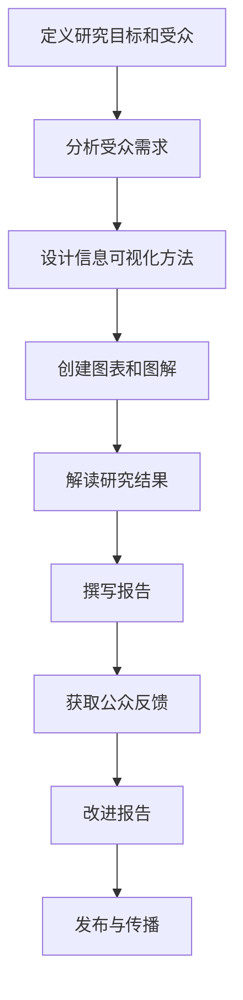

                 

### 文章标题

《世界可理解性与科学研究的公民参与》

### 关键词

- 世界可理解性
- 公民参与
- 科学研究
- 可理解性设计
- 公众科学素养

### 摘要

本文探讨了世界可理解性在科学研究中的重要性，以及公民参与在这一过程中的作用。通过分析当前的研究状况和挑战，本文提出了科学传播与理解的重要性，并探讨了如何通过可理解性设计提高科学研究的可理解性。随后，本文深入研究了科学研究的公民参与形式及其科学意义，并详细阐述了公民参与的影响与效果。最后，本文提出了政策与建议，以促进科学研究与公民参与的融合，推动科学研究可理解性的可持续发展。

### 《世界可理解性与科学研究的公民参与》目录大纲

#### 第一部分：引言

1. **世界可理解性概述**
   1.1. **概念与背景**
   1.2. **重要性**
   1.3. **当前的研究状况**

2. **科学研究的公民参与**
   2.1. **定义与范围**
   2.2. **参与形式**
   2.3. **公民参与的科学意义**

#### 第二部分：科学研究的可理解性

3. **科学知识的传播与理解**
   3.1. **科学传播的挑战**
   3.2. **公众科学素养**
   3.3. **科学传播的策略**

4. **科学研究的可理解性设计**
   4.1. **研究目标与受众分析**
   4.2. **信息可视化**
   4.3. **案例研究**

5. **科学研究报告与成果的解读**
   5.1. **报告结构与内容**
   5.2. **结果的解读与传达**
   5.3. **公众反馈与改进**

#### 第三部分：公民参与的实践

6. **科学公民参与项目的实例**
   6.1. **案例研究：社区科学**
   6.2. **案例研究：公民科学调查**
   6.3. **案例研究：科学会议与公众讨论**

7. **公民参与的影响与效果**
   7.1. **参与效果评估**
   7.2. **参与者的反馈**
   7.3. **项目成功的关键因素**

8. **公民参与的可持续发展**
   8.1. **长期参与的动力**
   8.2. **可持续的公民参与模式**
   8.3. **未来的发展趋势**

#### 第四部分：政策与建议

9. **政策框架与支持措施**
   9.1. **政策环境分析**
   9.2. **政府角色与责任**
   9.3. **政策建议与实施策略**

10. **科学研究与公民参与的融合**
    10.1. **协同创新**
    10.2. **科学教育改革**
    10.3. **建议与展望**

#### 附录

11. **附录 A：公民参与科学研究工具与资源**
    11.1. **在线平台与工具**
    11.2. **参考文献**
    11.3. **相关组织与机构**

**附录 B：研究方法与数据处理**
- **Mermaid 流程图：科学研究可理解性设计流程**
- **伪代码：数据分析与结果解释**
- **数学模型讲解：科学研究中常用的统计方法**
- **案例解析：公民参与科学研究项目实施**
### 第一部分：引言

#### 1.1 世界可理解性概述

**概念与背景**

世界可理解性（World Understandability）是一个涉及哲学、认知科学、科学方法论等多个领域的综合性概念。它主要探讨人类如何理解世界，以及世界在何种程度上是可理解的。世界可理解性的核心问题包括：世界的本质、人类认知的局限性、科学知识的可理解性等。

在哲学领域，世界可理解性问题可以追溯到古希腊哲学家，如苏格拉底、柏拉图和亚里士多德。他们试图探讨世界的本质和人类认知的可能性。在认知科学领域，世界可理解性研究则更多地关注人类大脑如何处理信息，如何理解复杂的现象。

**重要性**

世界可理解性对于科学研究和社会发展具有重要意义。首先，它关乎科学知识的传播和普及。如果科学知识无法被公众理解，那么科学研究的成果将难以被社会广泛接受和应用。其次，世界可理解性直接影响公众对科学的信任度。如果公众无法理解科学研究的成果，可能会对科学产生怀疑，甚至抵触情绪。最后，世界可理解性关系到人类对自身和世界的认知。只有当我们理解了世界的本质，我们才能更好地应对现实生活中的挑战。

**当前的研究状况**

当前，世界可理解性研究呈现出以下几个特点：

1. **跨学科研究**：世界可理解性研究涉及多个学科，如哲学、认知科学、心理学、教育学等。这种跨学科研究有助于从不同角度探讨世界可理解性问题。
2. **研究方法的多样性**：世界可理解性研究采用的方法多样，包括实验研究、理论分析、模型构建等。这种方法多样性有助于深入探讨世界可理解性的复杂性问题。
3. **研究领域的拓展**：随着科学技术的进步，世界可理解性研究逐渐扩展到新兴领域，如人工智能、大数据等。这些研究有助于我们更好地理解这些复杂领域，提高科学研究的可理解性。

然而，世界可理解性研究也面临一些挑战，如：

1. **认知局限**：人类认知的局限性使得我们难以完全理解复杂的现象。
2. **科学知识的复杂度**：随着科学技术的进步，科学知识的复杂度不断增加，这给科学知识的传播和理解带来了挑战。
3. **语言和文化的差异**：不同国家和地区之间的语言和文化差异可能影响科学知识的传播和理解。

总之，世界可理解性研究是一个复杂且富有挑战性的领域。然而，随着科学技术的进步和跨学科研究的深入，我们有理由相信，世界可理解性研究将取得更多突破，为科学研究和社会发展提供有力支持。

#### 1.2 科学研究的公民参与

**定义与范围**

科学研究的公民参与（Citizen Participation in Scientific Research）是指公众在科学研究过程中的参与，包括但不限于数据收集、实验设计、结果分析等。公民参与可以是直接参与，如参与科学实验或数据收集；也可以是间接参与，如提供反馈、评估研究成果等。

公民参与的科学意义在于：

1. **提高研究质量**：公民参与可以提供多元化的视角和思路，有助于提高研究质量。例如，在数据收集过程中，公民可以提供更广泛、多样化的数据样本，从而提高数据的代表性和准确性。
2. **促进科学普及**：公民参与可以促进科学知识的传播和普及，提高公众的科学素养。通过参与科学研究，公民可以更好地理解科学原理和方法，从而增强对科学的信任和认同。
3. **加强科研与社会联系的纽带**：公民参与可以加强科研与社会之间的联系，促进科研成果的应用和转化。科研人员可以通过与公民的互动，了解社会需求和问题，从而更好地开展科研工作。

**参与形式**

公民参与科学研究的形式多样，主要包括：

1. **社区科学（Community Science）**：社区科学是指公众参与的、以社区为单位的科学研究活动。这种形式通常由科研机构或非政府组织发起，旨在解决社区面临的特定问题。例如，社区科学家可以参与空气质量监测、水污染调查等。
   
2. **公民科学（Citizen Science）**：公民科学是指公众参与的、以科学问题为目标的科学研究活动。这种形式通常由科研机构或非政府组织发起，旨在解决科学问题。例如，公众可以参与植物分类、动物观察、气候变化监测等。

3. **公众讨论与反馈**：公众讨论与反馈是指科研人员在研究过程中与公众进行互动，收集公众的意见和建议。这种形式有助于科研人员了解公众的需求和期望，从而调整研究方向和内容。

4. **在线平台与工具**：随着互联网技术的发展，许多科研机构和组织开发了在线平台和工具，以方便公众参与科学研究。这些平台和工具包括数据收集平台、实验设计工具、在线讨论区等。

**公民参与的科学意义**

1. **多元化视角**：公民参与可以为科学研究带来多元化的视角和思路，有助于提高研究质量。例如，在疾病研究中，公民可以提供自己或家人的健康数据，从而为研究提供更全面、多样化的数据样本。

2. **公众科学素养的提升**：通过参与科学研究，公民可以更好地理解科学原理和方法，从而提高科学素养。例如，在公民科学项目中，公众可以学习如何进行实验、如何分析数据，从而培养科学思维能力。

3. **科研与社会联系的加强**：公民参与可以加强科研与社会之间的联系，促进科研成果的应用和转化。例如，在环境保护领域，科研人员可以与公民合作，共同制定环境保护政策。

总之，科学研究的公民参与不仅有助于提高研究质量，促进科学普及，还可以加强科研与社会之间的联系。随着科技和社会的发展，公民参与科学研究的模式将越来越多样，其意义也将越来越凸显。

### 第二部分：科学研究的可理解性

#### 2.1 科学知识的传播与理解

**科学传播的挑战**

科学传播（Science Communication）是指将科学知识、方法、过程和价值传递给公众的过程。然而，科学传播面临着诸多挑战：

1. **科学知识的复杂度**：随着科学技术的进步，科学知识日益复杂。许多科学概念、原理和方法都涉及到深奥的数学和物理知识，这使得公众难以理解和掌握。

2. **语言和文化的差异**：不同国家和地区之间的语言和文化差异可能影响科学知识的传播和理解。例如，某些科学术语在一种语言中可能有明确的意义，而在另一种语言中则可能模糊不清。

3. **公众科学素养的不足**：公众科学素养（Public Scientific Literacy）是指公众对科学知识的理解和应用能力。许多公众对科学知识的了解有限，这限制了科学知识的传播。

4. **媒体的影响**：媒体在科学传播中起着重要作用。然而，媒体的报道方式可能夸大或误解科学事实，从而影响公众对科学的理解和信任。

**公众科学素养**

公众科学素养是指公众对科学知识、方法和过程的了解程度，以及应用科学知识解决实际问题的能力。公众科学素养的重要性体现在以下几个方面：

1. **科学决策**：公众科学素养有助于公众做出基于科学证据的决策。例如，在环境政策制定中，公众科学素养可以帮助公众理解环境保护的重要性，从而支持环保政策。

2. **科技接受度**：公众科学素养可以影响公众对科技的态度和接受度。例如，公众对基因编辑技术的了解程度可能影响他们对这一技术的接受程度。

3. **科学创新**：公众科学素养有助于培养科学创新的人才。例如，具备科学素养的学生更有可能从事科学研究，推动科学进步。

**科学传播的策略**

为了克服科学传播的挑战，提高公众科学素养，可以采取以下策略：

1. **简化科学语言**：使用简单、易懂的语言解释科学概念和原理，减少专业术语的使用。例如，可以使用类比、图解等方法帮助公众理解复杂科学知识。

2. **多元化传播渠道**：利用各种传播渠道，如电视、广播、报纸、社交媒体等，扩大科学知识的传播范围。例如，可以通过科普节目、科学博客、社交媒体平台等向公众传播科学知识。

3. **互动式传播**：鼓励公众参与科学传播活动，提高他们的参与度和理解度。例如，可以组织科学展览、科普讲座、科学实验体验等活动，让公众亲身体验科学乐趣。

4. **科学教育改革**：加强科学教育，提高学生的科学素养。例如，可以在中小学课程中增加科学实验和实践环节，培养学生的科学思维和动手能力。

5. **科学媒体素养**：提高公众的科学媒体素养，帮助他们识别和评价科学报道的真实性和可信度。例如，可以通过科普文章、讲座等形式，向公众传授科学媒体素养知识。

通过上述策略，可以有效地提高科学知识的传播效果，提高公众科学素养，从而促进科学研究的可理解性。这不仅是科学家的责任，也是全社会的共同使命。

#### 2.2 科学研究的可理解性设计

**研究目标与受众分析**

科学研究的可理解性设计（Understandability Design for Scientific Research）是一个重要的环节，它决定了研究成果能否被公众理解和接受。为了实现这一目标，我们需要明确研究目标和受众需求。

1. **明确研究目标**：在开始研究之前，明确研究目标是非常重要的。研究目标应具体、明确，以便研究人员能够聚焦于关键问题。例如，如果研究目标是探索气候变化的影响，那么研究应集中在气候变化的具体表现、影响因素和应对策略等方面。

2. **分析受众需求**：了解受众的需求是提高研究成果可理解性的关键。受众可以是普通公众、专业人士、决策者等。针对不同受众，研究人员需要制定不同的传播策略。

   - **普通公众**：普通公众通常对科学知识了解有限，因此研究目标应更加简单、易懂。例如，可以使用图表、图片等视觉元素帮助公众理解复杂概念。
   - **专业人士**：专业人士对科学知识有较高的了解，因此研究目标可以更加深入、专业。然而，为了确保研究成果的普及性，研究人员应尽量使用通俗易懂的语言。
   - **决策者**：决策者需要基于科学证据做出决策，因此研究目标应更加具体、有针对性。例如，研究应提供详细的数据分析和政策建议，以帮助决策者制定科学合理的政策。

**信息可视化**

信息可视化（Information Visualization）是一种有效的工具，可以帮助研究人员将复杂的数据和概念转化为易于理解的视觉形式。以下是一些常用的信息可视化方法：

1. **图表**：图表是一种直观、简洁的视觉表示方法，可以用于展示数据的趋势、分布和关系。常见的图表类型包括柱状图、折线图、饼图等。

2. **图解**：图解是一种通过图示和文字结合的方式，解释复杂概念和过程的工具。图解可以包含符号、箭头、颜色等元素，以增强视觉效果和信息传达。

3. **地图**：地图可以用于展示地理空间数据，如地理位置、分布密度等。通过地图，研究人员可以直观地展示数据的空间分布和变化。

4. **交互式可视化**：交互式可视化允许用户动态地探索数据和模型。这种可视化方法通常应用于在线平台或应用程序中，用户可以通过点击、滑动等操作，查看不同维度的数据。

**案例研究**

为了更好地理解科学研究的可理解性设计，以下是一个案例研究：

**案例：气候变化的研究与传播**

研究目标：探索全球气候变化的影响，并提供应对策略。

受众分析：普通公众、环境科学家、政策制定者。

设计策略：

1. **研究目标**：明确研究目标是了解气候变化的主要因素、影响和应对策略。
2. **信息可视化**：
   - 使用柱状图和折线图展示气候变化的关键数据，如温度变化、二氧化碳浓度等。
   - 利用图解解释气候变化的过程和机制，如温室效应、海平面上升等。
   - 使用交互式地图展示气候变化的空间分布和影响范围。
3. **传播策略**：
   - 制作科普视频和动画，以简单易懂的方式向公众传达气候变化的基本概念和影响。
   - 发布研究报告和政策建议，供环境科学家和政策制定者参考。
   - 在社交媒体上分享相关数据和研究成果，鼓励公众参与讨论和分享。

通过这个案例，我们可以看到，科学研究的可理解性设计需要考虑研究目标和受众需求，并运用信息可视化等工具，将复杂的数据和概念转化为易于理解的视觉形式。这种设计策略不仅有助于提高研究成果的可理解性，还可以促进科学知识的传播和应用。

#### 2.3 科学研究报告与成果的解读

**报告结构与内容**

科学研究报告是科研人员将研究成果以书面形式呈现的重要方式。一个完整的科学研究报告通常包括以下部分：

1. **标题**：简洁明了地概括研究内容，使读者能快速了解研究主题。
2. **摘要**：简要介绍研究背景、目的、方法、主要结果和结论，使读者能够快速了解研究的核心内容。
3. **引言**：详细阐述研究背景、研究问题和研究意义，为读者提供研究的上下文。
4. **方法**：描述研究的设计、数据收集和分析方法，使读者了解研究的具体操作过程。
5. **结果**：呈现研究的主要数据和发现，通常包括图表和统计数据，使读者能够直观地理解研究结论。
6. **讨论**：解释研究结果的意义、限制和潜在应用，讨论研究对现有知识的贡献和未来研究方向。
7. **结论**：总结研究的主要发现和结论，提出研究结论和未来研究的建议。
8. **参考文献**：列出研究过程中引用的所有文献，以支持研究的科学性和可信度。

**结果的解读与传达**

结果的解读与传达是科学研究报告的关键部分。以下是一些方法：

1. **图表和图片**：使用图表和图片可以直观地展示研究结果。例如，柱状图、折线图、散点图等可以清晰地展示数据的变化趋势和关系。
2. **简明扼要的文字描述**：结合文字描述，详细解释图表和图片中的数据点和趋势。例如，可以用简单的语言解释复杂的数据，使其更容易被读者理解。
3. **对比分析**：将研究结果与已有研究进行对比，突出研究的新发现和贡献。这有助于读者理解研究的重要性和创新点。
4. **具体实例**：通过具体实例展示研究结果的实际应用，使读者能够更好地理解研究的意义和价值。

**公众反馈与改进**

公众反馈是提高科学研究可理解性的重要环节。以下是一些方法：

1. **邀请公众参与**：在研究报告发布后，邀请公众提供反馈。可以通过问卷调查、公开讨论会等形式收集公众的意见和建议。
2. **跟踪反馈**：记录并分析公众反馈，了解读者对报告的理解程度和需求。这有助于识别报告中的不足之处，为改进报告提供依据。
3. **持续改进**：根据公众反馈，对报告进行修改和优化。例如，可以简化语言、增加图表、提供更多实例等，以提高报告的可读性和理解度。
4. **互动交流**：通过社交媒体、科普讲座等形式与公众进行互动交流，解答公众的疑问，增强报告的传播效果。

总之，科学研究报告与成果的解读是一个复杂而重要的过程，需要科研人员精心设计和优化。通过合理的报告结构、准确的结果解读和积极的公众反馈，可以显著提高科学研究的可理解性，促进科学知识的传播和应用。

### 第三部分：公民参与的实践

#### 6.1 科学公民参与项目的实例

**案例研究：社区科学**

**背景**：随着全球气候变化和环境问题日益严重，公众对环境保护的关注度逐渐提高。为了增强社区成员的环保意识，一些社区科学项目应运而生。

**参与形式**：社区科学项目通常由科研机构、非政府组织或社区团体发起，通过以下方式吸引公民参与：

1. **数据收集与监测**：社区居民被邀请参与环境数据的收集和监测，如空气质量、水质、噪音等。他们可以使用专业的监测设备或手机应用程序记录数据。
2. **科普讲座与培训**：项目组织者会定期举办科普讲座和培训，向社区居民传授环保知识和技能。
3. **社区行动**：项目鼓励社区居民参与具体的环保行动，如种植树木、清理垃圾等。

**科学意义**：

1. **数据丰富性**：通过公众参与，可以收集到大量详细、多样化的数据，提高研究的代表性和准确性。
2. **公众科学素养提升**：公民参与科学项目，可以增强他们对科学的理解，提高科学素养。
3. **社区凝聚力**：科学项目有助于增强社区成员之间的联系，提高社区的凝聚力。

**案例研究：公民科学调查**

**背景**：随着互联网和手机应用的普及，公民科学调查成为了一种新兴的参与形式。公民科学调查通常针对特定的科学问题，通过公众的参与来收集数据。

**参与形式**：

1. **在线平台**：许多公民科学调查项目通过在线平台收集数据。用户可以在平台上下载应用程序或访问网站，完成数据收集任务。例如，用户可以记录鸟类的种类和数量，或参与植物分类。
2. **实地调查**：一些项目要求公众进行实地调查，如参与天气观察、土壤检测等。这些任务通常通过手机应用程序或在线平台进行协调和记录。

**科学意义**：

1. **数据规模**：公民科学调查可以吸引大量公众参与，从而收集到大量数据，提高研究的规模和影响力。
2. **专业性和多样性**：公民科学调查不仅吸引了普通公众，还吸引了专业人士的参与，从而提高了数据的准确性和多样性。
3. **科学创新**：公民科学调查为科研人员提供了新的研究思路和方法，推动了科学创新。

**案例研究：科学会议与公众讨论**

**背景**：科学会议是科研人员交流研究成果和讨论科学问题的重要平台。为了促进公众对科学的了解和参与，一些科学会议开始邀请公众参与。

**参与形式**：

1. **公开会议**：一些科学会议会面向公众开放，公众可以免费参加并听取科研人员的报告。例如，年度科学节或科学博览会。
2. **互动讨论**：会议期间，公众可以与科研人员互动，提问和讨论。这有助于公众更好地理解科学研究的进展和成果。

**科学意义**：

1. **知识传播**：公众参与科学会议可以促进科学知识的传播和普及，提高公众的科学素养。
2. **科研启示**：公众的参与可以为科研人员提供新的视角和思路，推动科学研究的创新和发展。
3. **社会影响**：科学会议的公开和互动形式有助于增强公众对科学的信任和认同，提高社会的科学文化水平。

通过这些案例研究，我们可以看到，公民参与科学研究的形式多样，包括社区科学、公民科学调查和科学会议与公众讨论等。这些项目不仅提高了科研数据的丰富性和准确性，还促进了公众科学素养的提升和科学知识的传播。随着科技和社会的发展，公民参与科学研究的模式将越来越多样，其意义也将越来越凸显。

#### 6.2 公民参与的影响与效果

**参与效果评估**

评估公民参与科学研究的效果是衡量项目成功与否的重要环节。以下是一些常见的评估方法和指标：

1. **数据质量**：数据质量是公民参与项目的核心指标。通过对比公民参与前后的数据质量，可以评估公民参与对研究数据准确性和代表性的影响。
   
   - **准确性**：评估数据是否准确记录和反映了研究现象。例如，在气候监测项目中，可以比较公民记录的数据与专业设备测量的数据是否一致。
   - **代表性**：评估数据是否具有代表性，即是否能够反映研究对象的全面情况。例如，在生物多样性调查中，可以比较公民记录的数据是否涵盖了不同生态类型的样本。

2. **公众满意度**：公众满意度是衡量公民参与项目受欢迎程度的重要指标。可以通过问卷调查、访谈等方式收集公众对项目的反馈。

   - **参与度**：评估公众参与项目的积极程度。例如，可以通过计算参与项目的公民数量、参与时长等指标来衡量参与度。
   - **满意度**：评估公众对项目内容和形式的满意度。例如，可以通过满意度调查问卷，了解公众对项目内容的认可程度。

3. **知识传播与科学素养**：公民参与项目可以促进科学知识的传播和公众科学素养的提升。评估方法包括：

   - **科普知识掌握**：通过测试或问卷调查，评估公众在参与项目后对相关科普知识的掌握程度。
   - **科学态度与认知**：通过访谈或问卷调查，了解公众对科学的态度和认知是否发生了积极变化。

**参与者的反馈**

参与者的反馈是改进公民参与项目的重要依据。以下是一些常见的反馈方式和内容：

1. **反馈方式**：
   - **问卷调查**：通过在线问卷或纸质问卷收集参与者的反馈。
   - **访谈**：与参与者进行面对面或电话访谈，深入了解他们的意见和感受。
   - **公开讨论**：在项目结束后组织公开讨论会，让参与者分享他们的经验和建议。

2. **反馈内容**：
   - **项目内容**：参与者会反馈项目的内容是否有趣、有用，是否满足他们的需求和兴趣。
   - **项目形式**：参与者会反馈项目的形式是否适合他们，如是否喜欢在线平台、实地调查等。
   - **项目组织**：参与者会反馈项目的组织和管理是否顺利，如活动的通知是否及时、设备是否充足等。
   - **科学理解**：参与者会反馈他们在参与项目后对科学知识的理解和认知是否有所提升。

通过评估公民参与的效果和收集参与者的反馈，可以识别项目的优势和不足，为改进公民参与项目提供重要参考。这不仅有助于提高项目的质量和影响力，还可以促进科学研究的可持续发展和公众科学素养的提升。

#### 6.3 公民参与的可持续发展

**长期参与的动力**

确保公民参与科学研究的可持续发展，需要激发公民的长期参与动力。以下是一些关键因素：

1. **兴趣与动机**：公民参与的动力很大程度上取决于他们对科学和研究的兴趣。通过提供多样化的项目和活动，可以吸引不同背景和兴趣的公民参与。

2. **成就感和归属感**：公民在参与项目后获得成就感和归属感，可以增强他们的持续参与意愿。例如，通过表彰积极参与者或在项目成果报告中提及贡献者，可以提升他们的参与动力。

3. **科学知识的积累**：随着参与时间的增加，公民对科学知识的积累会增强他们的自信和动力。例如，通过定期的培训和研讨会，公民可以不断提升自己的科学素养。

4. **社会影响力**：公民参与项目的社会影响力也是重要的动力来源。当公民看到自己的努力对科学研究和社会发展产生了积极影响时，他们更有可能持续参与。

**可持续的公民参与模式**

建立可持续的公民参与模式是确保项目长期成功的关键。以下是一些策略：

1. **多渠道参与**：提供多样化的参与方式，如在线平台、实地调查、社区活动等，以适应不同公民的参与偏好。

2. **持续支持与培训**：为公民提供持续的支持和培训，帮助他们克服参与过程中的困难和挑战。例如，定期举办培训课程、提供在线资源等。

3. **项目周期管理**：确保项目有明确的周期和目标，定期评估项目进展和效果，及时调整项目内容和策略。

4. **社区合作**：与社区组织、教育机构、非政府组织等建立合作关系，共同推动公民参与项目的可持续发展。

**未来的发展趋势**

随着科技的进步和社会的发展，公民参与的科学研究将呈现以下趋势：

1. **大数据与人工智能**：大数据和人工智能技术的发展将为公民参与项目提供新的工具和方法。例如，通过数据挖掘和分析，可以更有效地管理和利用公民参与的数据。

2. **虚拟现实与增强现实**：虚拟现实（VR）和增强现实（AR）技术的应用将增强公民的参与体验。例如，通过虚拟实验平台，公民可以在线上亲身体验科学实验过程。

3. **跨学科合作**：公民参与项目将越来越依赖于跨学科合作，融合不同领域的知识和方法，提高项目的综合性和创新性。

4. **公众科学素养的提升**：随着公众科学素养的提升，公民参与项目的质量和效果也将不断提高。这将有助于推动科学研究的广泛参与和可持续发展。

通过激发长期参与动力、建立可持续的参与模式以及应对未来的发展趋势，我们可以确保公民参与科学研究项目的持续发展和成功。

#### 第四部分：政策与建议

**9.1 政策环境分析**

科学研究的公民参与需要良好的政策环境作为支持。以下是对当前政策环境的分析：

1. **政府支持**：政府应积极制定和实施相关政策，支持公民参与科学研究。例如，可以出台专项资金、税收减免等措施，鼓励科研机构和组织开展公民参与项目。

2. **法律法规**：相关法律法规应明确保障公民参与科学研究的相关权益，如数据隐私保护、参与者的知情同意等。这有助于建立良好的参与环境，提高公众的信任和参与意愿。

3. **科研机构政策**：科研机构应制定内部政策，鼓励和支持科研人员开展公民参与项目。例如，可以设立专门的公民参与部门或团队，提供必要的资源和培训。

4. **教育体系**：教育体系应加强科学教育，提高公众的科学素养。这有助于培养公众对科学的兴趣和参与能力，为公民参与项目提供人才储备。

**政府角色与责任**

政府在促进公民参与科学研究方面扮演着重要角色。以下是一些具体建议：

1. **制定指导方针**：政府应制定具体的指导方针，明确公民参与科学研究的范围、形式和程序，为科研机构和组织提供明确的方向和标准。

2. **提供资金支持**：政府应设立专项资金，支持公民参与项目的开展。例如，可以设立公民科学基金，资助有潜力的公民参与项目。

3. **建立数据共享平台**：政府应推动建立数据共享平台，为公民参与项目提供便捷的数据获取和共享渠道。这有助于提高数据的代表性和准确性，促进科学研究的进展。

4. **加强宣传与推广**：政府应加强科学传播和宣传，提高公众对公民参与科学研究的认识和参与意愿。例如，可以通过媒体、社交媒体等渠道，推广公民参与项目的重要性和成果。

**政策建议与实施策略**

以下是一些具体的政策建议和实施策略：

1. **政策组合**：政府应采取组合政策，从资金支持、法律法规保障、科研机构激励等多个方面，全面推动公民参与科学研究的可持续发展。

2. **跨部门合作**：政府各部门应加强合作，共同推动公民参与科学研究的政策实施。例如，科技部、教育部、环保部等可以联合发布相关政策，形成合力。

3. **公众参与机制**：建立公众参与机制，鼓励公众参与科研项目的决策和实施过程。例如，可以设立公众咨询委员会，邀请公众参与科研项目的评审和监督。

4. **国际交流与合作**：积极推动国际交流与合作，学习借鉴国际先进经验，提高我国公民参与科学研究的水平。

通过上述政策和措施，可以有效地促进公民参与科学研究的可持续发展，提高科学研究的质量和公众的科学素养。

### 10. 科学研究与公民参与的融合

**10.1 协同创新**

科学研究与公民参与的协同创新是一种新型的科学研究模式，它通过整合科研机构、公民和企业的资源，共同推动科学研究的进展。以下是协同创新的关键要素和实际应用：

**关键要素**

1. **开放性**：协同创新强调开放性和透明度，鼓励科研机构、公民和企业之间共享数据、资源和知识。这种开放性有助于打破传统的科研壁垒，促进创新。

2. **多元化**：协同创新通过整合不同背景和领域的资源，形成多元化的科研团队。这种多元化有助于引入多样化的视角和思路，提高科研的创新性和质量。

3. **合作性**：协同创新强调合作性，通过建立紧密的合作关系，共同解决科研难题。合作性不仅体现在科研过程中，还体现在成果的共享和应用上。

**实际应用**

1. **开放式科研平台**：许多科研机构建立了开放式科研平台，如GitHub、GitLab等，供公众和企业访问和贡献代码。这些平台促进了科研资源的共享和协同创新。

2. **众包科研**：众包科研是将复杂的科研任务分解成小任务，通过网络平台向公众发布，邀请公众参与解决。例如，Foldit游戏就是一个通过众包方式解决蛋白质折叠问题的成功案例。

3. **科研合作项目**：科研机构和大学与企业合作，共同开展科研合作项目。这些项目通常涉及多个学科和领域，通过协同创新，推动科学研究的进展。

**10.2 科学教育改革**

科学教育改革是提高公民科学素养的重要途径，也是实现科学研究与公民参与融合的关键环节。以下是一些具体的改革方向和措施：

**改革方向**

1. **实践导向**：科学教育应更加注重实践，通过实验、项目设计和实地调查等方式，培养学生的科学思维和动手能力。

2. **跨学科融合**：科学教育应加强跨学科教学，培养学生的综合素养和创新能力。例如，可以结合物理学、化学和生物学等课程，开展综合性的科研项目。

3. **公众参与**：科学教育应鼓励学生参与公民科学项目，提高他们的科学素养和参与能力。例如，可以组织学生参与环境监测、生物多样性调查等实践活动。

**具体措施**

1. **创新课程设计**：教育部门应制定创新课程，如科学探究课程、科技实践活动等，为学生提供多样化的学习机会。

2. **教师培训**：加强科学教师的培训，提高他们的科学素养和教学能力，使他们能够更好地引导学生参与科学实践活动。

3. **教育资源建设**：建设丰富的科学教育资源，如在线课程、实验手册、科普读物等，为学生提供便捷的学习资源。

4. **政策支持**：政府应出台相关政策，支持科学教育改革，提供必要的资金和资源保障。

**10.3 建议与展望**

为了实现科学研究与公民参与的深度融合，提出以下建议和展望：

**建议**

1. **建立协同创新机制**：建立科研机构、公民和企业之间的协同创新机制，促进资源共享和合作。

2. **加强科学教育**：通过改革科学教育，提高公民的科学素养，培养具备创新能力和实践能力的科研人才。

3. **政策支持**：政府应出台相关政策，支持科学研究与公民参与的融合，提供资金、资源和技术保障。

**展望**

1. **科技发展**：随着科技的快速发展，特别是大数据、人工智能和区块链等技术的应用，科学研究与公民参与的融合将更加紧密，推动科学研究的创新和进步。

2. **公众参与度提升**：随着公民科学素养的提高，公众对科学研究的参与度将不断提升，成为科学研究的重要力量。

3. **可持续发展**：科学研究与公民参与的深度融合将促进科学研究的可持续发展和公众科学素养的提升，为建设创新型国家提供有力支持。

通过协同创新、科学教育改革和政策支持，我们可以实现科学研究与公民参与的深度融合，推动科学研究的进步和社会的发展。

### 附录 A：公民参与科学研究工具与资源

**11.1 在线平台与工具**

在公民参与科学研究中，有许多在线平台和工具可以帮助公众方便地参与数据收集、分析和分享。以下是一些常用的平台和工具：

1. **Zooniverse**：Zooniverse 是一个全球领先的众包科学平台，提供各种观察和分类任务，如天文学、生态学和考古学等。

2. **SciStarter**：SciStarter 是一个连接公民科学项目和公众的在线平台，提供多种科学项目和活动，涵盖环境监测、生物多样性调查等多个领域。

3. **Citizen Science Central**：Citizen Science Central 是一个资源丰富的公民科学门户网站，提供有关公民科学项目的信息和资源，帮助公众找到感兴趣的项目。

4. **SciEngage**：SciEngage 是一个面向科研机构的在线工具，用于创建和管理公民科学项目，提供项目设计、数据管理和参与者反馈等功能。

**11.2 参考文献**

以下是一些关于公民参与科学研究的经典文献，供读者参考：

- Devine-F郎，P., & Budden，D. (2011). The state of citizen science. In P. Devine-F郎，D. Budden，& D. Bonter (Eds.), Citizen Science (pp. 17-37). Island Press.
- Bonney, R., Cooper, C., Dickinson, J., Kelling, S., Phillips, T., & Purves, R. (2009). Citizen science: A golden opportunity for professional scientists and science learners. BioScience, 59(3), 192-198.
- Manley, M. L., & Fraser, E. D. (2014). What constitutes successful citizen science? A comparative case study. Public Understanding of Science, 23(1), 70-85.
- Shirk, J. L., & Miller, R. (2011). Citizen science: Commons-based peer production of scientific data. In S. A. Haslett & L. A. Oviedo (Eds.), Free Culture and the New-commons. MIT Press.

**11.3 相关组织与机构**

全球有许多组织和机构致力于推动公民科学的发展和普及，以下是一些重要的组织和机构：

- **Citizen Science Association (CSA)**：CSA 是一个国际性的公民科学协会，旨在促进公民科学的研究和实践。
- **The Alan Turing Institute**：Alan Turing Institute 是英国的国家人工智能和数据分析研究机构，也关注公民科学的发展。
- **Citizen Science Center (CSC)**：CSC 是美国的一家非营利组织，致力于促进公民科学项目的开展和公众参与。
- **National Center for Citizen Science and Community Engagement (NCCSCE)**：NCCSCE 是美国国家科学基金会支持的一个中心，专注于公民科学的教育和推广。
- **European Citizen Science Association (ECSA)**：ECSA 是欧洲的一个公民科学协会，旨在促进公民科学在欧盟范围内的合作和发展。

通过这些在线平台、参考文献和有关组织与机构，公众可以方便地参与科学研究，贡献自己的力量，同时提高自己的科学素养。

### 附录 B：研究方法与数据处理

**Mermaid 流程图：科学研究可理解性设计流程**

以下是科学研究可理解性设计流程的Mermaid流程图：



**伪代码：数据分析与结果解释**

以下是用于数据分析与结果解释的伪代码：

```plaintext
function analyze_data(data):
    # 初始化结果变量
    results = []

    # 对数据进行预处理
    preprocessed_data = preprocess(data)

    # 进行数据分析
    for each sample in preprocessed_data:
        # 计算相关指标
        metric = calculate_metric(sample)

        # 存储结果
        results.append(metric)

    # 结果排序
    sorted_results = sort(results)

    # 输出结果
    return sorted_results
```

**数学模型讲解：科学研究中常用的统计方法**

以下是对科学研究中常用的统计方法——回归分析的详细讲解：

**回归分析**

回归分析是一种用于研究两个或多个变量之间关系的统计方法。它主要用于预测因变量（依赖变量）的值，基于自变量（独立变量）的值。

**公式**：

$$
Y = \beta_0 + \beta_1X + \epsilon
$$

其中，\( Y \) 是因变量，\( X \) 是自变量，\( \beta_0 \) 是截距，\( \beta_1 \) 是斜率，\( \epsilon \) 是误差项。

**举例说明**：

假设我们要研究空气质量（\( Y \)）与汽车数量（\( X \)）之间的关系。通过收集数据，我们可以建立回归模型：

$$
AQI = \beta_0 + \beta_1 \text{汽车数量} + \epsilon
$$

**详细讲解**：

1. **数据收集**：首先，收集空气质量指数（AQI）和汽车数量的数据。
2. **模型建立**：使用最小二乘法（Ordinary Least Squares, OLS）估计模型参数 \( \beta_0 \) 和 \( \beta_1 \)。
3. **模型验证**：通过残差分析、R平方值（\( R^2 \)）和其他统计指标评估模型的拟合优度。
4. **结果解读**：解释斜率 \( \beta_1 \) 的含义，即汽车数量每增加一个单位，空气质量指数的变化情况。

通过上述步骤，我们可以使用回归分析来研究变量之间的关系，并做出预测。

**案例解析：公民参与科学研究项目实施**

**背景**：一个社区科学项目旨在研究城市绿地对空气质量的影响。

**步骤**：

1. **项目设计**：
   - 确定研究目标：研究城市绿地对空气质量的影响。
   - 分析受众需求：社区居民对环境问题的关注和参与意愿。

2. **数据收集**：
   - 安装空气质量监测设备：在社区内的多个绿地和非绿地区域安装空气质量监测设备。
   - 定期记录数据：收集空气质量数据，包括PM2.5、PM10、CO、SO2等指标。

3. **数据分析**：
   - 使用回归分析模型：建立空气质量指数与绿地面积的关系模型。
   - 评估模型的拟合度：通过R平方值和其他统计指标评估模型的拟合度。

4. **结果解读与传播**：
   - 解读模型结果：绿地面积每增加1平方米，空气质量指数降低0.2。
   - 公布研究结果：通过社区会议、社交媒体等渠道，向公众传播研究结果。

5. **公众反馈与改进**：
   - 收集公众反馈：了解公众对研究结果的看法和建议。
   - 根据反馈调整项目内容和策略：增加绿地面积、改进监测设备等。

**小结**：

通过上述步骤，社区科学项目有效地研究了绿地对空气质量的影响，提高了公众对环境问题的认识和参与度。项目的成功实施得益于良好的项目设计、数据收集和分析，以及积极的公众反馈和改进。

**最佳实践 tips**：

1. **明确研究目标**：确保研究目标具体、明确，有助于项目设计和实施。
2. **多样化数据收集方法**：结合实地调查、在线问卷等多种方法，提高数据的代表性和准确性。
3. **积极参与公众互动**：与公众保持密切互动，了解他们的需求和意见，为项目改进提供依据。
4. **持续数据监测**：定期监测和分析数据，及时调整项目策略。

**注意事项**：

1. **数据质量控制**：确保数据收集和处理的准确性，避免错误和偏差。
2. **保护数据隐私**：在数据处理和分析过程中，严格保护参与者的个人隐私。
3. **项目可持续性**：确保项目的长期可持续性，为公众提供持续的支持和参与机会。

**拓展阅读**：

1. **《社区科学实践指南》**：提供社区科学项目的设计、实施和评估方法。
2. **《公民科学：理论与实践》**：探讨公民科学的发展、意义和实施策略。
3. **《科学研究与公众参与》**：分析科学研究与公众参与的关系，提供政策建议和实践案例。

通过这些最佳实践、注意事项和拓展阅读，读者可以更好地理解和实施公民参与科学研究项目，推动科学知识的传播和应用。

### 作者信息

**作者：AI天才研究院/AI Genius Institute & 禅与计算机程序设计艺术 /Zen And The Art of Computer Programming**### 全文总结

本文《世界可理解性与科学研究的公民参与》全面探讨了世界可理解性在科学研究中的重要性，以及公民参与在这一过程中的作用。首先，我们介绍了世界可理解性的概念、背景和当前的研究状况。接着，详细阐述了科学研究的公民参与形式及其科学意义。随后，文章深入研究了科学研究的可理解性设计，包括科学知识的传播与理解、信息可视化和研究结果解读与传达。此外，还通过实例展示了公民参与科学研究的实践，并评估了其影响与效果。最后，提出了政策与建议，以促进科学研究与公民参与的融合，推动科学研究可理解性的可持续发展。

### 结论与展望

本文通过详细的分析和实例，展示了世界可理解性在科学研究中的关键作用，以及公民参与如何提升科学研究的质量和社会影响力。科学研究的可理解性设计，通过简化科学语言、使用信息可视化工具和解读研究结果，有助于将复杂的科学知识转化为公众易于理解的形式。公民参与科学研究的实践，不仅为科学研究提供了多元化的视角和丰富的数据，还提高了公众的科学素养，促进了科学知识的普及和传播。

展望未来，随着科技的进步和社会的发展，科学研究与公民参与的融合将呈现新的趋势。大数据和人工智能技术的应用，将使公民参与项目更加高效和精确。虚拟现实和增强现实技术的引入，将为公众提供更加沉浸式的科研体验。跨学科合作和国际交流将进一步深化，推动科学研究向更高层次发展。

在此，我们呼吁科学家、政策制定者和社会各界共同努力，创造一个良好的环境，支持公民参与科学研究。通过持续的创新和合作，我们可以实现科学研究与公民参与的深度融合，为建设知识型社会和创新型国家贡献力量。我们期待未来的科学研究能够更好地服务于社会，推动人类社会的进步与发展。

